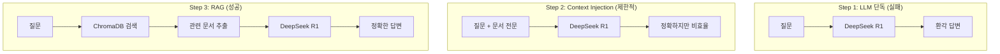

# CH02 집필 명세 -- DeepSeek-R1으로 시작하는 기초 RAG 정복

## 0. 메타 정보

| 항목 | 값 |
|------|---|
| 예상 분량 | 12p |
| 유형 | 실습 중심 |
| 이론/실습 | 30% / 70% |

## 1. 챕터 섹션 구조

- 2.1 [실패] LLM 단독 질의의 한계: Ollama + DeepSeek R1에 사내 규정을 직접 질문. 환각이 발생하여 잘못된 연차 규정을 알려주는 장면. 왜 환각이 발생하는지 원리 설명.
- 2.2 [반쪽 성공] 프롬프트 직접 주입 (Context Injection): 프롬프트에 문서 내용을 직접 붙여넣기. 작동하지만 토큰 한계, 확장성 문제 체감.
- 2.3 [성공] VectorDB와 RAG의 시작: ChromaDB에 소규모 문서를 넣고 검색 후 LLM에 전달. 처음으로 올바른 답변을 확인하는 성공 체험.
- 2.4 [심화] DeepSeek-R1 추론(Reasoning) 활용: DeepSeek R1의 추론 토큰 특성 소개. 단순 답변 vs 근거 제시 답변 비교.

## 2. 코드-섹션 매핑

| 섹션 | 파일 | 코드 범위 |
|------|------|---------|
| 2.1 | `src/llm_direct.py` | Ollama 직접 질의, 환각 재현 |
| 2.2 | `src/context_injection.py` | 프롬프트에 컨텍스트 삽입 |
| 2.3 | `src/simple_rag.py` | ChromaDB 저장 + 검색 + LLM 질의 |
| 2.4 | `src/reasoning_demo.py` | DeepSeek R1 추론 모드 활용 |

## 3. 개념 설명 힌트 (Why)

- LLM 단독 질의가 실패하는 이유: 학습 데이터에 사내 규정이 없으므로, 모델은 유사한 패턴으로 추측한다.
- Context Injection의 한계: 토큰 윈도우 제한으로 긴 문서를 전부 넣을 수 없다. 문서가 늘어나면 비용과 지연이 급증한다.
- RAG가 해결하는 문제: 관련 문서만 검색하여 필요한 부분만 LLM에 전달한다. 토큰 절약 + 정확도 향상.

## 4. 핵심 용어

- 환각(Hallucination): LLM이 학습 데이터에 없는 내용을 사실처럼 생성하는 현상.
- 컨텍스트 주입(Context Injection): 프롬프트에 참고 문서를 직접 삽입하는 방식.
- 임베딩(Embedding): 텍스트를 수치 벡터로 변환하는 과정.
- 유사도 검색(Similarity Search): 벡터 간 거리를 비교하여 의미적으로 유사한 문서를 찾는 기법.
- 추론 토큰(Reasoning Token): DeepSeek R1이 답변 전에 사고 과정을 보여주는 특수 토큰.

## 5. Mermaid 다이어그램 초안

## 6. 챕터 연결

- 이전 챕터에서 가져오는 개념: RAG 아키텍처 개요 (CH01), 기술 스택 목록 (CH01)
- 다음 챕터로 넘기는 개념: Ollama + DeepSeek R1 사용법, ChromaDB 기초, RAG 파이프라인 3단계 (검색 -> 컨텍스트 구성 -> 생성)

## 7. story_arc

이서연이 "LLM한테 그냥 물어보면 되지 않나요?"라고 제안한다. 직접 시도하자 DeepSeek R1이 존재하지 않는 연차 규정을 자신 있게 답변한다. 박민준 과장이 "데이터를 직접 줘야지"라고 한마디 한다. 이서연은 문서를 프롬프트에 붙여보고, 다시 ChromaDB에 넣어 검색해본다. 처음으로 정확한 답변이 나오는 순간, "이게 RAG구나"라고 이해하게 된다. 실패 -> 반쪽 성공 -> 완전한 성공의 3단계 경험.
