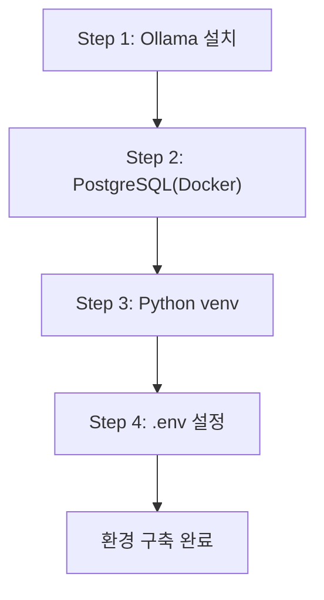

# CH03 집필 명세 -- 개발 환경 구축

## 0. 메타 정보

| 항목 | 값 |
|------|---|
| 예상 분량 | 8p |
| 유형 | 설치/설정 |
| 이론/실습 | 20% / 80% |

## 1. 챕터 섹션 구조

- 3.1 Ollama 설치 및 DeepSeek R1 모델 다운로드: OS별 설치 가이드 (macOS/Linux/Windows). 모델 풀 명령어. 설치 확인 방법.
- 3.2 PostgreSQL 설치 및 초기 설정: Docker Compose로 PostgreSQL 16 실행. 인프라 레포 clone. 샘플 데이터 적재 확인.
- 3.3 Python 3.11 가상환경 및 패키지 설치: venv 생성, requirements.txt 설치. 주요 패키지(langchain, chromadb 등) 버전 확인.
- 3.4 환경 변수(.env) 구성 및 LLM Provider 스위칭 설계: .env.example 기반 설정. OLLAMA_MODEL 변경으로 모델 교체 가능하도록 설계하는 패턴.

## 2. 코드-섹션 매핑

| 섹션 | 파일 | 코드 범위 |
|------|------|---------|
| 3.1 | `scripts/install_ollama.sh` | Ollama 설치 및 모델 다운로드 |
| 3.2 | `docker-compose.yml` | PostgreSQL + FastAPI 서버 구성 |
| 3.3 | `requirements.txt` | Python 패키지 목록 |
| 3.4 | `.env.example`, `src/config.py` | 환경 변수 로딩 및 LLM 클라이언트 초기화 |

## 3. 개념 설명 힌트 (Why)

- Docker Compose를 사용하는 이유: PostgreSQL을 호스트에 직접 설치하면 버전 충돌, 포트 충돌 위험이 높다. Docker로 격리하면 "한 줄 실행"으로 동일한 환경을 재현할 수 있다.
- .env 파일을 분리하는 이유: API 키나 모델명을 코드에 하드코딩하면 변경 시 코드 수정이 필요하다. 환경 변수로 분리하면 코드 변경 없이 설정을 교체할 수 있다.
- 가상환경(venv)을 사용하는 이유: 프로젝트별 패키지 버전을 격리하여 의존성 충돌을 방지한다.

## 4. 핵심 용어

- Ollama: 로컬에서 LLM을 실행하는 오픈소스 추론 엔진.
- Docker Compose: 여러 컨테이너를 YAML 파일로 정의하고 한 번에 실행하는 도구.
- 가상환경(Virtual Environment): Python 프로젝트별 독립된 패키지 공간.
- 환경 변수(Environment Variable): 코드 외부에서 설정값을 주입하는 방식.

## 5. Mermaid 다이어그램 초안

## 6. 챕터 연결

- 이전 챕터에서 가져오는 개념: Ollama + DeepSeek R1 기초 사용법 (CH02)
- 다음 챕터로 넘기는 개념: 완성된 개발 환경, .env 설정 패턴, Docker Compose 인프라

## 7. story_arc

이서연이 본격적으로 환경 구축을 시작하지만, 연속으로 실패한다. PostgreSQL 버전 충돌, Ollama 모델 다운로드 중 네트워크 에러, pip 의존성 꼬임. 김도현 팀장이 "이런 삽질을 줄이려면 공통 설치 스크립트를 만들자"고 제안한다. 팀 전체가 동일한 환경을 갖추는 것의 가치를 깨닫는 장면이다. 설치 실패의 좌절에서 체계적 환경 구축의 성취로 전환된다.
