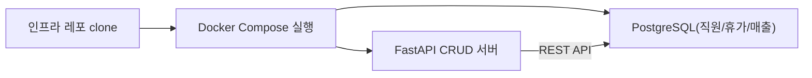

# CH04 집필 명세 -- 베이스 시스템 확보

## 0. 메타 정보

| 항목 | 값 |
|------|---|
| 예상 분량 | 10p |
| 유형 | 실습 중심 |
| 이론/실습 | 30% / 70% |

## 1. 챕터 섹션 구조

- 4.1 사내 시스템 git clone으로 확보: 인프라 레포(직원 DB, 휴가 DB, 매출 DB)를 clone하고 Docker Compose로 실행. 샘플 데이터 확인.
- 4.2 데이터베이스 스키마 분석: employees, leaves, sales 테이블 구조 파악. ERD 다이어그램. 박민준 과장이 이서연에게 스키마를 설명하는 장면.
- 4.3 CRUD API 구조 이해: FastAPI CRUD 서버의 엔드포인트 목록. GET/POST/PUT/DELETE 각 역할. Swagger UI로 직접 테스트.
- 4.4 MCP(Model Context Protocol) 개념 소개: MCP가 무엇인지, 왜 필요한지. LLM이 외부 도구에 접근하는 표준 방식. CH08에서 본격 구현 예고.

## 2. 코드-섹션 매핑

| 섹션 | 파일 | 코드 범위 |
|------|------|---------|
| 4.1 | `docker-compose.yml`, `scripts/seed_data.py` | 인프라 실행 및 샘플 데이터 적재 |
| 4.2 | `docs/schema.sql`, `src/schema_viewer.py` | 스키마 조회 및 분석 스크립트 |
| 4.3 | `src/crud_api.py` | FastAPI CRUD 엔드포인트 |
| 4.4 | `src/mcp_intro.py` | MCP 개념 데모 (간단한 도구 호출 예제) |

## 3. 개념 설명 힌트 (Why)

- 스키마 분석이 먼저인 이유: DB 구조를 모르면 어떤 질문에 어떤 테이블을 조회해야 하는지 판단할 수 없다. 에이전트도 마찬가지다.
- CRUD API를 두는 이유: LLM이 DB에 직접 SQL을 실행하면 보안 위험이 있다. API 레이어를 통해 허용된 작업만 수행하도록 제한한다.
- MCP를 소개하는 이유: CH08에서 DB + 문서 통합 에이전트를 만들 때, LLM이 도구를 호출하는 표준 방식이 필요하다.

## 4. 핵심 용어

- 스키마(Schema): 데이터베이스의 테이블 구조, 컬럼명, 데이터 타입 등의 정의.
- CRUD: Create, Read, Update, Delete의 약자. 데이터 기본 조작 4종.
- MCP(Model Context Protocol): LLM이 외부 도구/데이터에 접근하는 표준 프로토콜.
- ERD(Entity-Relationship Diagram): 테이블 간 관계를 시각적으로 표현한 다이어그램.
- FastAPI: Python 기반 고성능 웹 프레임워크.

## 5. Mermaid 다이어그램 초안

## 6. 챕터 연결

- 이전 챕터에서 가져오는 개념: Docker Compose 실행 방법 (CH03), .env 설정 패턴 (CH03)
- 다음 챕터로 넘기는 개념: DB 스키마 구조, CRUD API 엔드포인트 목록, MCP 개념 (CH08에서 본격 활용)

## 7. story_arc

이서연은 회사 DB에 어떤 데이터가 있는지조차 모른다. "DB 구조 좀 알려줄 수 있어요?"라고 박민준 과장에게 처음 부탁한다. 두 사람이 함께 스키마를 분석하면서 이서연은 "아, 이 테이블에 연차 정보가 있구나"를 발견한다. 팀 내 협업이 시작되는 장면이다. 혼자서는 모르던 것을 동료와 함께 파악하는 과정에서 자신감이 생긴다.
