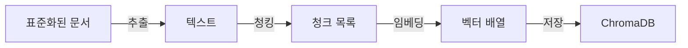

# CH06 집필 명세 -- 벡터 DB 구축

## 0. 메타 정보

| 항목 | 값 |
|------|---|
| 예상 분량 | 12p |
| 유형 | 실습 중심 |
| 이론/실습 | 25% / 75% |

## 1. 챕터 섹션 구조

- 6.1 텍스트 추출 (PyMuPDF, pdfplumber): PDF에서 텍스트를 추출하는 두 가지 방법. PyMuPDF(빠른 텍스트 추출)와 pdfplumber(테이블 인식). 각각의 장단점과 사용 시점.
- 6.2 청킹(Chunking) 전략 -- Fixed-size vs Semantic: 문서를 적절한 크기로 분할하는 방법. 고정 크기 청킹과 의미 기반 청킹의 차이. 청크 크기와 오버랩 설정 가이드.
- 6.3 임베딩 모델 선택 및 적용: Ollama 임베딩 모델 사용. 텍스트를 벡터로 변환하는 과정. 임베딩 차원과 성능의 관계.
- 6.4 ChromaDB에 저장 및 컬렉션 관리: 청크와 메타데이터를 ChromaDB에 저장. 컬렉션 생성, 문서 추가, 검색 테스트. 영속 저장(persist) 설정.

## 2. 코드-섹션 매핑

| 섹션 | 파일 | 코드 범위 |
|------|------|---------|
| 6.1 | `src/extractor.py` | PDF 텍스트 추출 (PyMuPDF + pdfplumber) |
| 6.2 | `src/chunker.py` | Fixed-size 및 Semantic 청킹 |
| 6.3 | `src/embedder.py` | Ollama 임베딩 모델 호출 |
| 6.4 | `src/store.py`, `src/main.py` | ChromaDB 저장, 검색, 컬렉션 관리 |

## 3. 개념 설명 힌트 (Why)

- 청킹이 필요한 이유: 문서 전체를 하나의 벡터로 만들면 세부 정보가 희석된다. 적절한 크기로 나눠야 관련 부분만 정확히 검색된다.
- Fixed-size vs Semantic 비교: 고정 크기는 구현이 단순하지만 문맥이 잘릴 수 있다. 의미 기반은 문맥을 보존하지만 처리가 복잡하다.
- 임베딩 모델 선택 기준: 로컬 실행이 가능해야 하고, 한국어 성능이 중요하다. Ollama에서 제공하는 임베딩 모델을 활용한다.
- ChromaDB를 선택한 이유: 설치가 간단하고(pip install), 로컬 파일 기반이며, LangChain과 직접 통합된다.

## 4. 핵심 용어

- 청킹(Chunking): 긴 문서를 검색 가능한 작은 단위로 분할하는 과정.
- 임베딩(Embedding): 텍스트를 고차원 수치 벡터로 변환하는 과정.
- 벡터 DB(Vector Database): 벡터를 저장하고 유사도 기반 검색을 수행하는 데이터베이스.
- 컬렉션(Collection): ChromaDB에서 벡터를 그룹화하는 논리적 단위.
- 오버랩(Overlap): 인접 청크 간 겹치는 텍스트 영역. 문맥 단절을 방지한다.
- 영속 저장(Persist): 메모리의 데이터를 디스크에 저장하여 재시작 후에도 유지하는 것.

## 5. Mermaid 다이어그램 초안

## 6. 챕터 연결

- 이전 챕터에서 가져오는 개념: 표준화된 문서 파일, 메타데이터 구조 (CH05)
- 다음 챕터로 넘기는 개념: ChromaDB에 저장된 벡터 컬렉션, 유사도 검색 방법 (CH07 RAG Q&A의 입력)

## 7. story_arc

이서연이 CH05에서 정리한 문서를 ChromaDB에 넣는다. 처음으로 "연차 규정"을 검색하자 관련 청크가 정확히 반환된다. "세상에, 진짜 찾아오네요!" -- 처음으로 성취감을 느끼는 순간이다. 김도현 팀장이 "이제 절반 왔어"라고 말한다. 이서연은 청크 크기를 바꿔보며 검색 결과가 달라지는 것을 직접 확인하고, 파라미터 하나가 결과를 좌우한다는 것을 체감한다.
