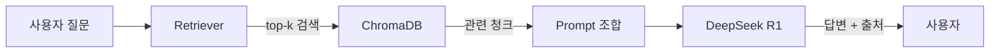

# CH07 집필 명세 -- RAG Q&A 엔진 구현

## 0. 메타 정보

| 항목 | 값 |
|------|---|
| 예상 분량 | 12p |
| 유형 | 실습 중심 |
| 이론/실습 | 25% / 75% |

## 1. 챕터 섹션 구조

- 7.1 LangChain RAG 파이프라인 설계: LangChain의 Retriever -> Prompt -> LLM -> Output 체인 구조. LCEL(LangChain Expression Language) 기반 파이프라인 구성.
- 7.2 유사도 검색 및 컨텍스트 구성: ChromaDB에서 top-k 검색. 검색된 청크를 프롬프트 컨텍스트로 조합하는 방법. k값에 따른 결과 차이.
- 7.3 출처 표시(Source Citation) 시스템: 답변에 근거 문서와 페이지를 함께 표시하는 구현. 메타데이터를 활용한 출처 추적. 신뢰성 확보의 핵심.
- 7.4 기본 채팅 인터페이스 연결: Streamlit 또는 CLI 기반 Q&A 인터페이스. 대화 히스토리 관리. 팀 내부 데모용 간단 UI.

## 2. 코드-섹션 매핑

| 섹션 | 파일 | 코드 범위 |
|------|------|---------|
| 7.1 | `src/rag_chain.py` | LangChain RAG 파이프라인 구성 |
| 7.2 | `src/retriever.py` | ChromaDB 검색 + 컨텍스트 조합 |
| 7.3 | `src/citation.py` | 출처 표시 로직 |
| 7.4 | `app/chat_ui.py` | Streamlit/CLI 채팅 인터페이스 |

## 3. 개념 설명 힌트 (Why)

- LangChain을 사용하는 이유: Retriever, Prompt, LLM, Output을 표준화된 인터페이스로 연결할 수 있다. 각 컴포넌트를 교체하기 쉽다.
- 출처 표시가 중요한 이유: 기업 환경에서 AI 답변은 근거가 없으면 신뢰받지 못한다. "HR 매뉴얼 3.2절에 따르면..."이라는 출처가 답변의 신뢰도를 결정한다.
- k값 조정의 영향: k가 너무 작으면 관련 정보를 놓치고, 너무 크면 노이즈가 섞여 답변 품질이 떨어진다.

## 4. 핵심 용어

- LCEL(LangChain Expression Language): LangChain의 파이프라인 구성 문법.
- Retriever: 벡터 DB에서 관련 문서를 검색하는 컴포넌트.
- top-k 검색: 유사도 상위 k개의 결과를 반환하는 검색 방식.
- 출처 표시(Source Citation): 답변의 근거가 되는 원본 문서 위치를 함께 제공하는 것.
- 대화 히스토리(Conversation History): 이전 질문과 답변의 맥락을 유지하는 기능.

## 5. Mermaid 다이어그램 초안

## 6. 챕터 연결

- 이전 챕터에서 가져오는 개념: ChromaDB 벡터 컬렉션, 유사도 검색 (CH06)
- 다음 챕터로 넘기는 개념: RAG Q&A 파이프라인, 출처 표시 시스템 (CH08에서 MCP와 통합)

## 7. story_arc

팀 내부 데모 날이다. 이서연이 "특별휴가 조건이 뭐예요?"라고 질문하자, 시스템이 HR 매뉴얼 3.2절을 인용하며 정확한 답변을 내놓는다. 박민준 과장이 "이건 쓸 만하겠는데"라고 처음으로 인정한다. 이서연은 뿌듯함을 느끼지만, 김도현 팀장이 "DB 질문도 처리할 수 있어야 해"라며 다음 목표를 제시한다. 첫 번째 작동 성공의 기쁨과, 아직 갈 길이 남았다는 현실을 동시에 체감한다.
