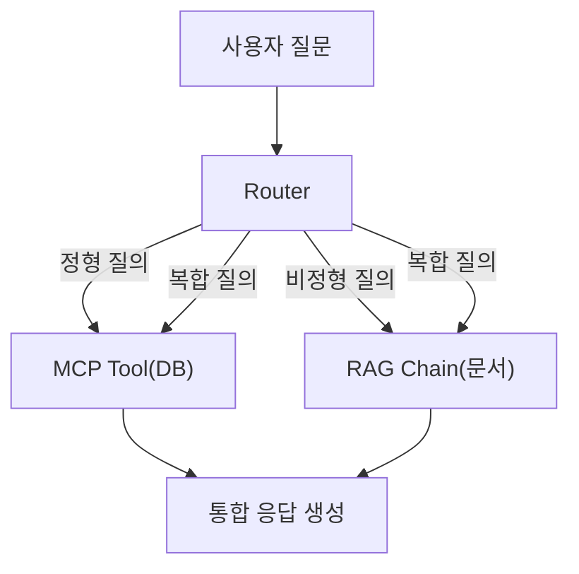

# CH08 집필 명세 -- 통합 에이전트 설계 (MCP + RAG)

## 0. 메타 정보

| 항목 | 값 |
|------|---|
| 예상 분량 | 10p |
| 유형 | 실습 중심 |
| 이론/실습 | 30% / 70% |

## 1. 챕터 섹션 구조

- 8.1 정형/비정형 분리 원칙: 정형 데이터(DB)와 비정형 데이터(문서)의 차이. 각각에 최적화된 검색 전략. 왜 분리해서 처리하는 것이 효율적인지.
- 8.2 질문 라우팅 전략 (규칙 기반 -> LLM 판단): 질문을 DB 질의, 문서 검색, 또는 둘 다로 분류하는 방법. 단순 키워드 규칙에서 LLM 기반 의도 분류로 발전.
- 8.3 통합 응답 전략 (DB 조회 + 문서 검색 + LLM 합성): DB 결과와 문서 검색 결과를 하나의 응답으로 합성. "김철수의 남은 연차는 3일이며, 연차 규정에 따르면..."
- 8.4 대표 질문 시나리오 10개 실습: 정형 전용, 비정형 전용, 복합 질문 각각의 시나리오. 에이전트가 올바르게 라우팅하고 답변하는지 검증.

## 2. 코드-섹션 매핑

| 섹션 | 파일 | 코드 범위 |
|------|------|---------|
| 8.1 | `docs/routing_design.md` | 정형/비정형 분리 설계 문서 |
| 8.2 | `src/router.py` | 질문 라우팅 (규칙 기반 + LLM 판단) |
| 8.3 | `src/integrator.py` | DB + 문서 결과 통합 응답 생성 |
| 8.4 | `src/agent.py`, `tests/test_scenarios.py` | 통합 에이전트 + 10개 시나리오 테스트 |

## 3. 개념 설명 힌트 (Why)

- 질문 라우팅이 필요한 이유: "남은 연차"는 DB를 조회해야 하고, "연차 규정"은 문서를 검색해야 한다. 잘못된 경로로 보내면 엉뚱한 답변이 나온다.
- 규칙 기반에서 LLM 판단으로 발전하는 이유: 규칙 기반은 예상한 패턴만 처리 가능하다. 자연어의 다양한 표현을 커버하려면 LLM의 의도 분류가 필요하다.
- MCP를 활용하는 이유: LLM이 직접 API를 호출하는 표준화된 방식. 도구를 추가하거나 교체할 때 일관된 인터페이스를 유지한다.

## 4. 핵심 용어

- 질문 라우팅(Question Routing): 질문의 의도에 따라 적절한 처리 경로로 분기하는 것.
- 정형 데이터(Structured Data): 테이블 형태로 정리된 데이터 (DB).
- 비정형 데이터(Unstructured Data): 문서, PDF 등 고정 구조가 없는 데이터.
- 의도 분류(Intent Classification): 질문의 목적을 파악하는 과정.
- 통합 응답(Integrated Response): 여러 데이터 소스의 결과를 하나의 답변으로 합성하는 것.

## 5. Mermaid 다이어그램 초안

## 6. 챕터 연결

- 이전 챕터에서 가져오는 개념: RAG Q&A 파이프라인 (CH07), CRUD API + MCP 개념 (CH04)
- 다음 챕터로 넘기는 개념: 통합 에이전트 구조, 라우팅 전략 (CH09에서 프로덕션 수준으로 발전)

## 7. story_arc

고객이 "김철수 씨의 이번 달 남은 연차는?"이라고 묻는다. DB도 뒤지고, 문서도 검색해야 한다. 이서연이 "두 가지를 동시에 어떻게 처리하죠?"라고 고민한다. 김도현 팀장이 "질문을 먼저 분류해보자"고 힌트를 준다. 이서연이 직접 라우터를 구현하고, 처음으로 "남은 연차 3일이며, 연차 규정 3.2절에 따르면 특별휴가는..."이라는 통합 답변을 생성한다. 두 세계를 연결하는 순간의 성취감.
