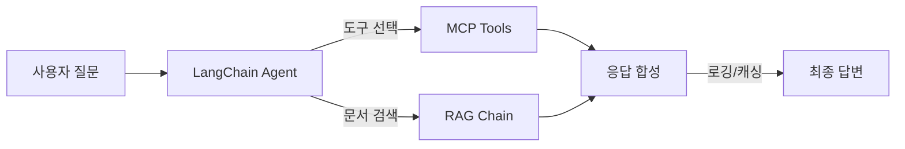

# CH09 집필 명세 -- LangChain 최종 연결

## 0. 메타 정보

| 항목 | 값 |
|------|---|
| 예상 분량 | 10p |
| 유형 | 실습 중심 |
| 이론/실습 | 30% / 70% |

## 1. 챕터 섹션 구조

- 9.1 Router / Agent / RAG Chain / MCP Tool 구성: LangChain Agent 아키텍처 전체 구성. 각 컴포넌트의 역할과 연결 방법. Agent가 도구를 선택하고 실행하는 흐름.
- 9.2 MCP Tool 설계 (get_leave_balance, get_sales_sum 등): 구체적인 MCP Tool 구현. FastAPI 엔드포인트를 LangChain Tool로 래핑. 도구 설명(description)이 LLM 선택에 미치는 영향.
- 9.3 운영 설정 (Timeout, Retry, 로깅, 캐싱): 프로덕션 수준의 안정성 확보. 타임아웃 설정, 재시도 로직, 구조화된 로깅. 반복 질문에 대한 캐싱 전략.
- 9.4 비용 관리 및 토큰 모니터링: 토큰 사용량 추적. 로컬 LLM이라도 리소스(메모리, GPU)를 모니터링해야 하는 이유. 프롬프트 최적화로 토큰 절약.

## 2. 코드-섹션 매핑

| 섹션 | 파일 | 코드 범위 |
|------|------|---------|
| 9.1 | `src/agent_config.py` | LangChain Agent 전체 구성 |
| 9.2 | `src/mcp_tools.py` | MCP Tool 구현 (get_leave_balance 등) |
| 9.3 | `src/monitoring.py`, `src/cache.py` | 로깅, 타임아웃, 재시도, 캐싱 |
| 9.4 | `src/token_tracker.py` | 토큰 사용량 추적 |

## 3. 개념 설명 힌트 (Why)

- Agent 아키텍처를 사용하는 이유: 단순 체인은 고정된 순서로만 실행된다. Agent는 질문에 따라 어떤 도구를 사용할지 스스로 결정한다.
- Tool description이 중요한 이유: LLM은 도구의 설명을 읽고 어떤 도구를 호출할지 판단한다. 설명이 부정확하면 잘못된 도구를 선택한다.
- 운영 설정이 필요한 이유: 개발 환경에서 작동하는 것과 안정적으로 운영하는 것은 다르다. 타임아웃 없이 배포하면 하나의 느린 질문이 전체 시스템을 멈출 수 있다.
- 토큰 모니터링의 이유: 로컬 LLM도 메모리와 CPU를 소비한다. 불필요하게 긴 프롬프트는 응답 시간을 증가시킨다.

## 4. 핵심 용어

- Agent: 주어진 도구 중에서 적절한 것을 선택하여 작업을 수행하는 LLM 기반 자율 실행기.
- Tool: Agent가 호출할 수 있는 외부 기능 (API 호출, DB 조회 등).
- Timeout: 작업이 지정 시간 내에 완료되지 않으면 중단하는 설정.
- Retry: 실패한 작업을 자동으로 재시도하는 로직.
- 캐싱(Caching): 이전 결과를 저장하여 동일한 요청에 재사용하는 기법.

## 5. Mermaid 다이어그램 초안

## 6. 챕터 연결

- 이전 챕터에서 가져오는 개념: 통합 에이전트 구조, 라우팅 전략 (CH08)
- 다음 챕터로 넘기는 개념: 프로덕션 수준 에이전트, 운영 설정 (CH10 튜닝의 기반)

## 7. story_arc

개발 버전을 팀 내부에서 쓰다 보니 가끔 튕기고, 느리고, 로그도 없다. 이서연이 "왜 갑자기 응답이 안 오죠?"라고 당황한다. 김도현 팀장이 "이제 제대로 만들어보자"고 한다. 타임아웃, 재시도, 로깅을 추가하면서 "개발과 운영의 차이"를 체감한다. 박민준 과장이 "DB 쪽 도구 설명이 부정확해서 잘못 호출되는 것 같은데"라고 지적하며, 도구 설명의 중요성을 깨닫는 장면.
