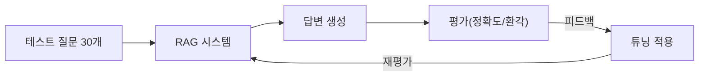

# CH10 집필 명세 -- RAG 시스템 튜닝

## 0. 메타 정보

| 항목 | 값 |
|------|---|
| 예상 분량 | 10p |
| 유형 | 실습 + 심화 |
| 이론/실습 | 35% / 65% |

## 1. 챕터 섹션 구조

- 10.1 증상별 튜닝 가이드: 환각(근거 없는 답변), 근거 부족(출처 미표시), 엉뚱한 문서(관련 없는 청크 반환). 각 증상의 원인과 해결 방법을 체계적으로 정리.
- 10.2 Chunk/Retriever 튜닝: Semantic Chunk로 변경, k값 조정, Metadata Filtering 적용. 각 변경이 검색 결과에 미치는 영향을 실측.
- 10.3 고급 기술 (ReRanker, Hybrid Search, Parent Document Retriever): ReRanker로 검색 결과 재정렬. 벡터 검색 + BM25 하이브리드. Parent Document Retriever로 문맥 확장.
- 10.4 프롬프트 튜닝: 근거 우선 답변, "모르면 모른다" 원칙. 프롬프트 엔지니어링으로 환각 감소.
- 10.5 PDF 이미지 처리 (LLaVA + EasyOCR 하이브리드): PDF 내 이미지/도표 처리. LLaVA로 이미지 설명 생성, EasyOCR로 텍스트 추출. 하이브리드 방식의 장점.
- 10.6 평가 체계 구축: 테스트셋 30개 설계. Retrieval 정확도, Hallucination Rate 측정. 개선 전후 비교표.

## 2. 코드-섹션 매핑

| 섹션 | 파일 | 코드 범위 |
|------|------|---------|
| 10.1 | `docs/tuning_guide.md` | 증상별 원인-해결 매트릭스 |
| 10.2 | `src/tuner.py` | 청크/Retriever 파라미터 조정 |
| 10.3 | `src/reranker.py`, `src/hybrid_search.py` | ReRanker, Hybrid Search 구현 |
| 10.4 | `src/prompts.py` | 튜닝된 프롬프트 템플릿 |
| 10.5 | `src/vision_extractor.py` | LLaVA + EasyOCR 하이브리드 |
| 10.6 | `src/evaluator.py`, `tests/test_set.json` | 평가 스크립트 + 30개 테스트셋 |

## 3. 개념 설명 힌트 (Why)

- 증상별 접근이 필요한 이유: "정확도가 낮다"는 추상적이다. 구체적인 증상을 식별해야 올바른 해결책을 적용할 수 있다.
- ReRanker를 사용하는 이유: 벡터 유사도 검색은 의미적으로 유사한 문서를 찾지만, 질문에 대한 "답변 적합도"는 다를 수 있다. ReRanker가 이를 보정한다.
- Hybrid Search의 이유: 벡터 검색은 의미적 유사도에 강하고, BM25는 키워드 매칭에 강하다. 둘을 결합하면 각각의 약점을 보완한다.
- 평가 체계가 필요한 이유: 감으로 개선하면 한 곳을 고치면서 다른 곳이 망가진다. 체계적 테스트셋이 있어야 개선을 측정할 수 있다.
- LLaVA + EasyOCR 하이브리드 이유: PDF의 도표/차트는 텍스트 추출만으로 의미를 파악할 수 없다. 이미지 LLM과 OCR을 결합하면 시각적 정보까지 활용할 수 있다.

## 4. 핵심 용어

- ReRanker: 초기 검색 결과를 질문과의 관련성 기준으로 재정렬하는 모델.
- Hybrid Search: 벡터 검색과 키워드 검색(BM25)을 결합한 검색 방식.
- BM25: 키워드 빈도 기반의 전통적 텍스트 검색 알고리즘.
- Parent Document Retriever: 작은 청크로 검색하되, 반환 시 해당 청크의 상위 문서(더 큰 문맥)를 제공하는 방식.
- Metadata Filtering: 메타데이터(부서, 카테고리 등)를 기준으로 검색 범위를 제한하는 기법.
- Hallucination Rate: 전체 답변 중 환각(사실과 다른 정보)이 포함된 비율.
- LLaVA: 이미지를 이해하고 설명할 수 있는 멀티모달 LLM.
- EasyOCR: 이미지에서 텍스트를 추출하는 오픈소스 OCR 라이브러리.

## 5. Mermaid 다이어그램 초안

## 6. 챕터 연결

- 이전 챕터에서 가져오는 개념: 프로덕션 수준 에이전트 (CH09), RAG 파이프라인 전체 (CH06-08)
- 다음 챕터로 넘기는 개념: (마지막 챕터 -- 에필로그로 마무리)

## 7. story_arc

내부 테스트에서 정확도 72%. 이서연이 "왜 이 질문에는 엉뚱한 답이 나오지?"라고 좌절한다. 김도현 팀장이 "감으로 고치지 말고, 테스트 케이스를 만들자"고 한다. 이서연이 30개 테스트 질문을 설계하고, 하나씩 증상을 분류하고, ReRanker와 Hybrid Search를 적용한다. 정확도가 72%에서 점진적으로 개선된다. 3개월 후, 팀은 목표를 달성한다. 이서연은 처음 얼어붙던 회의실에서 이제 자신 있게 결과를 발표한다. 성장의 완결.
