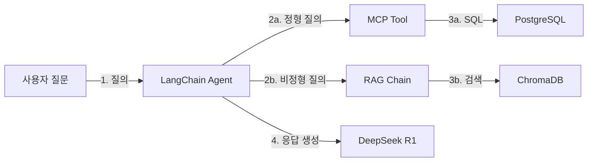
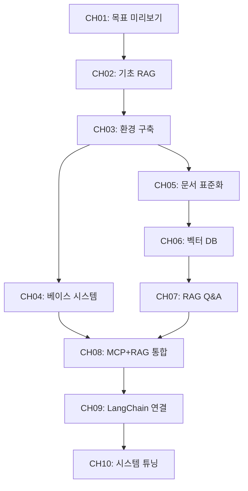

# plan.md — AI 업무 비서 구축: RAG + MCP 실전 가이드

---

## 메타 정보

| 항목 | 값 |
|------|---|
| 책 제목 | AI 업무 비서 구축 -- RAG + MCP 실전 가이드 |
| 부제 | 사내 문서와 DB를 LLM과 연결하는 지식 엔진 설계 전 과정 |
| writing_concept | `storytelling` |
| 예상 분량 | 100p 이하 |
| 이론/실습 비율 | 30% / 70% |
| 실습 방식 | GitHub Clone 후 실행 |

### story_persona

**팀명**: AI팀 -- 스타트업 HRTech 기업 "커넥트HR" 소속

| 이름 | 역할 | 나이 | 특징 |
|------|------|------|------|
| 김도현 | 팀장 | 35세 | 백엔드 개발자, Python 5년 경력, AI는 처음. 실용적 결정을 내리는 리더. |
| 이서연 | 개발자 | 28세 | Python 2년 경력 초급 개발자. 독자의 분신. 궁금한 것을 직접 묻고 시행착오를 겪는다. |
| 박민준 | 데이터팀 | 32세 | SQL 전문가. DB 지식은 풍부하나 LLM은 낯설다. 데이터 관점의 조언을 제공한다. |

**배경 상황**: "커넥트HR"는 200개 기업의 HR 시스템을 관리하는 SaaS 스타트업이다. 매월 수백 건의 고객 문의가 들어오며, 팀원들은 사내 매뉴얼 3,000페이지를 뒤지며 답변을 작성한다. 이서연은 주당 10시간을 이 작업에 소비하고 있다. 팀장 김도현의 미션: "연말까지 고객 문의 응답 시간을 10분에서 30초로 줄여라."

---

## 섹션 1: 설계서

### 1.1 독자 페르소나

| 항목 | 설명 |
|------|------|
| 대상 | Python 기초는 알지만 LLM/RAG는 처음인 초급 개발자 |
| 사전 지식 | Python 기본 문법, pip 사용 경험, SQL 기초(SELECT/INSERT) |
| 선수 환경 | macOS/Windows/Linux, Python 3.11 설치 가능, 8GB+ RAM |
| 기대 결과 | 사내 문서+DB를 통합 검색하는 RAG 기반 AI 업무 비서 구축 |

### 1.2 챕터별 학습 목표

| 챕터 | 제목 | 학습 목표 |
|------|------|---------|
| CH01 | 이 책의 목표와 최종 완성본 미리보기 | RAG 파이프라인의 전체 아키텍처를 이해하고, 최종 결과물이 무엇인지 데모를 통해 확인한다 |
| CH02 | DeepSeek-R1으로 시작하는 기초 RAG 정복 | LLM 단독 질의의 한계(환각)를 체험하고, RAG가 필요한 이유를 납득한 뒤 기초 RAG를 구현한다 |
| CH03 | 개발 환경 구축 | Ollama, PostgreSQL, Python 가상환경을 설치하고, .env 기반 환경 설정을 완료한다 |
| CH04 | 베이스 시스템 확보 | 사내 DB 스키마를 분석하고 CRUD API 구조를 이해하며, MCP 개념을 파악한다 |
| CH05 | 사내 문서 표준화 | PDF/Word/Markdown 문서를 수집, 전처리, 정규화하는 파이프라인을 구축한다 |
| CH06 | 벡터 DB 구축 | 텍스트 추출, 청킹, 임베딩을 거쳐 ChromaDB에 문서를 저장하고 검색한다 |
| CH07 | RAG Q&A 엔진 구현 | LangChain 기반 RAG 파이프라인을 설계하고, 출처 표시가 포함된 Q&A 시스템을 구현한다 |
| CH08 | 통합 에이전트 설계 (MCP + RAG) | 정형 DB와 비정형 문서를 동시에 질의하는 통합 에이전트를 구현한다 |
| CH09 | LangChain 최종 연결 | Router/Agent/RAG Chain/MCP Tool을 프로덕션 수준으로 연결하고 운영 설정을 적용한다 |
| CH10 | RAG 시스템 튜닝 | 증상별 튜닝, 고급 검색 기법(ReRanker, Hybrid Search), 평가 체계를 구축하여 정확도를 개선한다 |

### 1.3 기술 스택 버전 명세

| 역할 | 기술 | 버전 | 비고 |
|------|------|------|------|
| LLM 추론 엔진 | Ollama | 최신 안정 | 로컬 LLM 전용, 클라우드 API 없음 |
| 기본 LLM 모델 | DeepSeek R1 | 최신 | 추론(Reasoning) 특화 |
| 이미지 LLM | LLaVA | 최신 | CH10 PDF 이미지 처리용 |
| OCR | EasyOCR | 최신 | CH10 하이브리드 PDF 처리용 |
| 파이프라인 프레임워크 | LangChain | 0.3+ | langchain, langchain-community, langchain-ollama |
| 벡터 DB | ChromaDB | 최신 안정 | 로컬 파일 기반 |
| 관계형 DB | PostgreSQL | 16 | Docker Compose로 제공 |
| API 서버 | FastAPI | 0.110+ | CRUD API 제공 |
| 언어 | Python | 3.11 | 가상환경(venv) 사용 |
| PDF 처리 | PyMuPDF, pdfplumber | 최신 | 텍스트/테이블 추출 |
| 인프라 | Docker Compose | 최신 | PostgreSQL + FastAPI 서버 |

### 1.4 실습 전 체크리스트

- [ ] Python 3.11 설치 완료
- [ ] Git 설치 완료
- [ ] Docker Desktop 설치 완료 (PostgreSQL용)
- [ ] 8GB 이상 RAM (Ollama 모델 로딩용, 16GB 권장)
- [ ] 10GB 이상 디스크 여유 공간 (모델 + DB)
- [ ] 터미널/CLI 기본 사용 가능

### 1.5 실습 방식

모든 챕터의 예제 코드는 GitHub 저장소에 완성본으로 준비된다. 독자는 코드를 타이핑하지 않고 `git clone` 후 즉시 실행한다.

```
git clone https://github.com/{repo}/CH{N}_{제목}
cd CH{N}_{제목}
cp .env.example .env
pip install -r requirements.txt
python src/main.py
```

인프라(PostgreSQL, FastAPI CRUD 서버, 샘플 데이터)는 별도 인프라 레포를 Docker Compose로 제공한다.

---

## 섹션 2: 아키텍처 및 다이어그램

### 2.1 전체 시스템 구성도



### 2.2 챕터별 핵심 개념 - 코드 모듈 매핑

| 챕터 | 핵심 개념 | 주요 코드 모듈 |
|------|---------|-------------|
| CH01 | 아키텍처 개요 | (데모 스크립트) |
| CH02 | LLM 질의, Context Injection, 기초 RAG | `llm_client.py`, `simple_rag.py` |
| CH03 | 환경 설정 | `setup.sh`, `.env.example`, `docker-compose.yml` |
| CH04 | DB 스키마, CRUD API, MCP 개념 | `schema.sql`, `crud_api.py`, `mcp_intro.py` |
| CH05 | 문서 수집, 전처리, 정규화 | `collector.py`, `preprocessor.py`, `normalizer.py` |
| CH06 | 텍스트 추출, 청킹, 임베딩, ChromaDB | `extractor.py`, `chunker.py`, `embedder.py`, `store.py` |
| CH07 | RAG 파이프라인, 출처 표시 | `rag_chain.py`, `retriever.py`, `citation.py` |
| CH08 | 질문 라우팅, 통합 응답 | `router.py`, `agent.py`, `integrator.py` |
| CH09 | Agent 구성, MCP Tool, 운영 설정 | `agent_config.py`, `mcp_tools.py`, `monitoring.py` |
| CH10 | 튜닝, ReRanker, 평가 | `tuner.py`, `reranker.py`, `evaluator.py` |

### 2.3 의존성 그래프



### 2.4 스토리 아크 흐름도


- Stage 1 (CH01-02): 비전 제시 + 기초 RAG 체험
- Stage 2 (CH03-05): 개발 환경 + 사내 시스템 + 문서 표준화
- Stage 3 (CH06-07): 벡터 DB + RAG Q&A 파이프라인
- Stage 4 (CH08-10): 통합 에이전트 + 프로덕션 연결 + 튜닝

---

## 섹션 3: 환경 명세 및 예외 기획

### 3.1 필수 환경 변수

| 변수명 | 값 예시 | 설명 |
|--------|--------|------|
| `OLLAMA_MODEL` | `deepseek-r1` | 기본 LLM 모델 |
| `OLLAMA_BASE_URL` | `http://localhost:11434` | Ollama 서버 주소 |
| `OLLAMA_VISION_MODEL` | `llava` | 이미지 처리 LLM (CH10) |
| `POSTGRES_HOST` | `localhost` | PostgreSQL 호스트 |
| `POSTGRES_PORT` | `5432` | PostgreSQL 포트 |
| `POSTGRES_DB` | `connecthr` | 데이터베이스명 |
| `POSTGRES_USER` | `admin` | DB 사용자 |
| `POSTGRES_PASSWORD` | `password` | DB 비밀번호 |
| `CHROMA_PERSIST_DIR` | `./chroma_db` | ChromaDB 저장 경로 |
| `FASTAPI_BASE_URL` | `http://localhost:8000` | CRUD API 서버 주소 |

### 3.2 외부 서비스

| 서비스 | 유형 | 비용 | 비고 |
|--------|------|------|------|
| Ollama | 로컬 설치 | 무료 | LLM 추론 엔진 |
| DeepSeek R1 | 로컬 모델 | 무료 | Ollama로 다운로드 |
| LLaVA | 로컬 모델 | 무료 | Ollama로 다운로드 |
| PostgreSQL | Docker 컨테이너 | 무료 | Docker Compose 제공 |
| ChromaDB | 로컬 파일 | 무료 | pip 설치 |

**클라우드 API 의존성 없음** -- 모든 서비스가 로컬에서 실행된다.

### 3.3 OS 호환성

| OS | 지원 수준 | 비고 |
|----|---------|------|
| macOS (Apple Silicon) | 완전 지원 | Ollama 네이티브 지원 |
| macOS (Intel) | 완전 지원 | |
| Ubuntu 22.04+ | 완전 지원 | |
| Windows 11 + WSL2 | 지원 | Docker Desktop + WSL2 필수 |
| Windows (네이티브) | 제한적 | Ollama Windows 버전 사용, 일부 스크립트 수정 필요 |

### 3.4 주요 실패 시나리오 및 대응

| 실패 상황 | 증상 | 대응 방안 |
|---------|------|---------|
| Ollama 모델 로딩 실패 | `model not found` 에러 | `ollama pull deepseek-r1` 재실행, 디스크 공간 확인 |
| PostgreSQL 연결 실패 | `connection refused` | `docker-compose up -d` 확인, 포트 충돌 점검 |
| ChromaDB 저장 실패 | `PermissionError` | 디렉토리 권한 확인, 경로 존재 여부 확인 |
| 메모리 부족 | OOM, 시스템 느려짐 | 더 작은 모델 사용 (deepseek-r1:1.5b), swap 확장 |
| LangChain 버전 충돌 | `ImportError` | requirements.txt 버전 고정, `pip install --force-reinstall` |
| EasyOCR 설치 실패 | PyTorch 의존성 에러 | OS별 PyTorch 설치 가이드 참조 |

---

## 섹션 4: 분량 및 구성 계획

### 4.1 챕터별 페이지 배분

| 챕터 | 제목 | 예상 분량 | 유형 |
|------|------|---------|------|
| CH01 | 이 책의 목표와 최종 완성본 미리보기 | 6p | 개념 중심 |
| CH02 | DeepSeek-R1으로 시작하는 기초 RAG 정복 | 12p | 실습 중심 |
| CH03 | 개발 환경 구축 | 8p | 설치/설정 |
| CH04 | 베이스 시스템 확보 | 10p | 실습 중심 |
| CH05 | 사내 문서 표준화 | 10p | 실습 중심 |
| CH06 | 벡터 DB 구축 | 12p | 실습 중심 |
| CH07 | RAG Q&A 엔진 구현 | 12p | 실습 중심 |
| CH08 | 통합 에이전트 설계 (MCP + RAG) | 10p | 실습 중심 |
| CH09 | LangChain 최종 연결 | 10p | 실습 중심 |
| CH10 | RAG 시스템 튜닝 | 10p | 실습+심화 |
| **합계** | | **100p** | |

### 4.2 이론 vs 실습 비율

| 구분 | 비율 | 페이지 |
|------|------|--------|
| 이론 (개념 설명, 아키텍처, Why) | 30% | 30p |
| 실습 (코드 실행, 결과 확인, 트러블슈팅) | 70% | 70p |

### 4.3 챕터 내 구성 비율 (기본)

| 구성 요소 | 비율 | 10p 챕터 기준 |
|----------|------|-------------|
| 도입 (이서연의 상황) | 10% | 1p |
| 개념 설명 | 20% | 2p |
| 코드 실습 | 50% | 5p |
| 심화/에러대응 | 10% | 1p |
| 정리하며 | 10% | 1p |

### 4.4 전체 로드맵

| 단계 | 범위 | 핵심 활동 | 분량 |
|------|------|---------|------|
| Stage 1. 비전 및 기초 | CH01-02 | 목표 확인 + 기초 RAG 실습 | 18p |
| Stage 2. 인프라 및 표준화 | CH03-05 | 환경 구축 + 시스템 확보 + 문서 표준화 | 28p |
| Stage 3. 지식 검색 엔진 | CH06-07 | 벡터 DB + RAG Q&A 파이프라인 | 24p |
| Stage 4. 지능형 에이전트 | CH08-10 | MCP+RAG 통합 + 프로덕션 연결 + 튜닝 | 30p |

---

## 기획 검증 체크리스트

- [x] 총 분량 100p 이하 (합계: 100p)
- [x] 기술 스택 버전 호환성 충돌 없음 (Python 3.11 + LangChain 0.3+ + ChromaDB 호환)
- [x] 챕터 간 의존성 순환 없음 (단방향 의존성 확인)
- [x] 독자 수준 대비 난이도 급등 구간 없음 (Stage별 점진적 상승)
- [x] 모든 외부 API 무료 또는 대체 가능 (로컬 전용, 클라우드 API 없음)
- [x] LLM Provider .env 스위칭 가능하도록 설계 (OLLAMA_MODEL 환경 변수)

---

## 명시적 제외 범위

- 프로덕션 배포 (Docker/Kubernetes/클라우드 배포)
- Fine-tuning (모델 학습/미세조정)
- 클라우드 LLM API (OpenAI, Anthropic 등)
