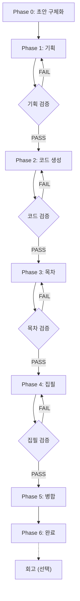

# 책 집필 에이전트 기획서 (자동 모드)

## 1. 개요

이 문서는 v1 자동 모드 집필 파이프라인의 상세 명세이다.
**Phase 0~6을 승인 없이 자동 연속 실행**하여 기술서를 완성한다.

## 2. 파이프라인 흐름도



## 3. 에이전트 호출 순서

| 순서 | Phase | 에이전트 | 모델 | 입력 | 출력 |
|------|-------|---------|------|------|------|
| 1 | 0 | (오케스트레이터) | - | 사용자 대화 | outline/draft.md |
| 2 | 1 | v1-planning-agent | opus | draft.md | plan/plan.md, chapter_spec |
| 3 | 1 | v1-planning-verifier | haiku | plan.md | review/verify_plan.md |
| 4 | 2 | v1-code-agent | sonnet | plan.md, chapter_spec | examples/CH{N}/ |
| 5 | 2 | v1-code-verifier | sonnet | examples/CH{N}/ | review/verify_code_CH{N}.md |
| 6 | 3 | v1-toc-agent | sonnet | plan.md, examples/ | outline/TOC.md |
| 7 | 3 | v1-toc-verifier | haiku | TOC.md | review/verify_toc.md |
| 8 | 4 | v1-writing-agent | sonnet | TOC.md, chapter_spec, examples/ | chapters/CH{N}.md |
| 9 | 4 | v1-writing-verifier | sonnet | chapters/CH{N}.md, examples/ | review/verify_chapter_CH{N}.md |
| 10 | 6+ | v1-retrospective | opus | 전체 산출물 | review/retrospective.md |

## 4. 자동 모드 특징

### 4.1. 자동 진행 규칙

- 각 Phase의 검증에서 **PASS 또는 CONDITIONAL_PASS** → 즉시 다음 Phase
- **FAIL** → 해당 생산 에이전트에 검증 보고서 전달 → 수정 → 재검증
- **최대 2회 재시도** 후에도 FAIL → `review` 상태 전환, 나머지 Phase는 계속 진행
- `review` 항목은 최종 보고에서 "수정 필요 사항"으로 표기

### 4.2. 병렬 실행

- **Phase 2 (코드 생성)**: 챕터 간 의존성이 없으면 Task 도구로 병렬 실행
- **Phase 4 (집필)**: 이전 챕터 요약이 필요하므로 기본 순차 실행
  - 단, 독립적인 부록/참고 챕터는 병렬 가능

### 4.3. 진행 추적

`progress.json`을 각 Phase 시작/완료 시 실시간 업데이트한다.

```json
{
  "phases": {
    "phase_1_planning": {
      "status": "done",
      "started_at": "2026-02-21T10:00:00",
      "completed_at": "2026-02-21T10:15:00",
      "verification": "PASS"
    }
  }
}
```

## 5. 에러 처리

| 상황 | 동작 |
|------|------|
| 에이전트 실행 실패 | 1회 재시도 후 `review` 전환 |
| 검증 FAIL (1회) | 수정 요청 → 재검증 |
| 검증 FAIL (2회) | `review` 전환, 다음 Phase 진행 |
| 전체 중단 필요 | `progress.json` status를 `error`로, 사용자에게 보고 |

## 6. 장단점

### 장점
- 딸깍 한 번으로 전체 집필 완료
- 빠른 실행 속도 (승인 대기 없음)
- 일관된 품질 (검증 에이전트 자동 실행)

### 단점
- 중간 결과물 확인 불가 (완성 후 전체 확인)
- 방향 수정이 어려움 (마음에 안 들면 재실행)
- Phase 0의 초안이 충분히 구체적이어야 좋은 결과
