# 사내 문서 기반 AI 업무 비서 (RAG + MCP)

> **집필 컨셉**: 스토리텔링 버전

> 생성일시: 2026-02-27 13:21

---

## 목차

# 사내 문서 기반 AI 업무 비서 (RAG + MCP) — 상세 목차

> 생성일: 2026-02-27
> 기준 문서: plan.md (v3), chapter_spec_CH01~10.md

---

## 전체 구조

| 항목 | 값 |
|------|-----|
| 총 챕터 수 | 10개 |
| 예상 총 분량 | 95p |
| 이론 / 실습 비율 | 약 27% / 73% |
| 예제 폴더 | `examples/CH02_개발_환경_설정/` ~ `examples/CH10_RAG_튜닝/` |
| 최종 산출물 | "커넥트HR AI 비서" — 정형/비정형 통합 질의응답 시스템 |

### 챕터-분량 요약

| PART | CH | 제목 | 분량 | 이론:실습 |
|------|-----|------|------|---------|
| PART 0 | CH01 | 이 책의 목표와 최종 완성본 미리보기 | 5p | 100:0 |
| PART 0 | CH02 | 개발 환경 설정 | 7p | 30:70 |
| 기초 | CH03 | LLM의 한계와 RAG의 필요성 | 8p | 40:60 |
| PART 1 | CH04 | FastAPI로 초간단 사내 시스템 만들기 | 10p | 20:80 |
| PART 1 | CH05 | 사내 문서 수집 전략과 문서 표준 만들기 | 7p | 50:50 |
| PART 2 | CH06 | VectorDB 구축 | 12p | 20:80 |
| PART 2 | CH07 | RAG로 Q&A 엔진 만들기 | 12p | 20:80 |
| PART 3 | CH08 | 정형 MCP + 비정형 RAG 통합 에이전트 | 12p | 20:80 |
| PART 3 | CH09 | LangChain으로 연결 전략 세팅 | 10p | 20:80 |
| PART 4 | CH10 | RAG 튜닝 | 12p | 30:70 |
| **합계** | | | **95p** | |

---

## [PART 0. 시작하기]

---

## CH01. 이 책의 목표와 최종 완성본 미리보기 (5p)

> 학습 목표: 최종 결과물의 전체 아키텍처와 RAG/MCP 개념을 이해한다.
> 핵심 질문: 이 책을 마치면 어떤 시스템을 직접 구축할 수 있는가?

### 1. 도입 (0.5p)

- 챕터 개요: RAG와 MCP가 결합된 사내 AI 비서의 전체 그림
- 이 챕터에서 답할 수 있게 되는 것: "왜 Fine-tuning 대신 RAG인가?"

### 2. 개념 (2.5p)

- 2.1. 이 책이 다루는 범위: RAG + MCP 조합의 위치와 Fine-tuning과의 비교표 (비용, 데이터 요구량, 업데이트 주기, 적합 상황)
- 2.2. 최종 결과물 데모 시나리오: 정형 질문 ("김철수 사원의 남은 연차는?"), 비정형 질문 ("신입사원 온보딩 절차를 알려줘"), 복합 질문 ("올해 매출 상위 부서의 복지 정책을 비교해줘")
- 2.3. 아키텍처 한 장 요약: 전체 시스템 구성도 및 각 구성 요소 역할 1줄 설명
  - [Mermaid 다이어그램] 사용자 → FastAPI → QueryRouter → MCP Tools / RAG Chain / ReAct Agent 흐름
- 2.4. 사용 기술 스택: 기술별 역할 + 메모리 요구사항 표 (최소/권장 하드웨어 스펙)
- 2.5. 이 책을 마치면 할 수 있는 것: 3가지 핵심 역량 (RAG 구축, MCP 통합, 운영 배포) + 챕터별 빌드업 로드맵

### 3. 실습 (0p)

- (이 챕터는 이론 전용이므로 실습 없음)
- 핵심 용어 정리: RAG, MCP, 환각(Hallucination), 임베딩, VectorDB

### 4. 정리하며 (1p)

- **RAG는 Fine-tuning보다 빠르다**: 학습 없이 문서 추가만으로 즉시 지식 확장이 가능하다.
- **MCP는 정형 데이터의 열쇠다**: LLM이 DB를 직접 조회하는 표준 프로토콜로, 정형/비정형을 하나의 에이전트에서 처리한다.
- **이 책은 "하나의 프로젝트"다**: 챕터마다 커넥트HR AI 비서에 기능을 하나씩 쌓아간다.
- 다음 챕터: 실제 시스템을 구축할 개발 환경을 준비한다.

---

## CH02. 개발 환경 설정 (7p)

> 학습 목표: Ollama, PostgreSQL, Python 환경을 구축하고 LLM Provider 전환 구조를 이해한다.
> 핵심 질문: 환경 검증 스크립트가 4개 항목 모두 PASS를 출력하는가?

### 1. 도입 (0.5p)

- 챕터 개요: 이 책의 모든 실습을 위한 개발 환경 구축
- 사전 요구사항 체크리스트: Python 3.10+, Docker Desktop, RAM 16GB+, 저장공간 20GB+

### 2. 개념 (1.5p)

- 2.1. 환경 구성 원칙: Docker로 PostgreSQL을 설치하는 이유 (OS 독립적, 버전 고정)
  - [Mermaid 다이어그램] Python + Ollama + Docker → verify_env.py PASS 구성도
- 2.2. LLM Provider 전환 설계: `.env` 기반 Ollama / OpenAI / vLLM 전환 구조 — `llm_provider.py` 팩토리 패턴
- 2.3. OS별 주의사항: macOS / Linux / Windows(WSL2) 차이점

### 3. 실습 (4p)

- 3.1. Ollama + DeepSeek R1 설치: OS별 설치 가이드 + `ollama pull deepseek-r1:8b` + 간단한 대화 테스트
- 3.2. Python 가상환경 및 의존성: venv 생성/활성화 + `requirements.txt` 항목별 용도 설명 + `pip install` 실행
- 3.3. PostgreSQL 설치 (Docker): `docker-compose.yml` 기반 PostgreSQL 구동 + `metacoding_db` 데이터베이스 생성
- 3.4. 프로젝트 클론 및 초기 설정: `git clone` + 폴더 구조 설명 + `.env` 파일 생성
- 3.5. LLM Provider 전환 구현: `src/llm_provider.py` — `get_llm_client()` 팩토리 함수 및 Provider별 테스트
  - [Code Workflow] Input: `.env`의 `LLM_PROVIDER` / Process: OllamaClient / OpenAIClient / VLLMClient 분기 / Output: `BaseLLMClient` 인스턴스
  - 코드 파일: `examples/CH02_개발_환경_설정/src/llm_provider.py`
- 3.6. 환경 검증: `src/verify_env.py` 실행 — Python / Docker / Ollama / PostgreSQL 4개 항목 PASS 확인
  - [Code Workflow] Input: `.env` + 시스템 정보 / Process: 각 서비스 연결 시도 / Output: PASS/FAIL 판정 + 해결 방법
  - 코드 파일: `examples/CH02_개발_환경_설정/src/verify_env.py`

### 4. 정리하며 (1p)

- **Docker PostgreSQL은 충돌을 방지한다**: OS와 무관하게 동일한 환경을 보장한다.
- **LLM Provider 팩토리는 한 번만 만든다**: `.env`의 `LLM_PROVIDER` 값만 바꾸면 이후 모든 챕터에서 자동으로 전환된다.
- **`verify_env.py` PASS가 출발점이다**: 4개 항목이 모두 통과해야 CH03 실습으로 진행할 수 있다.
- 다음 챕터: 구축한 환경에서 LLM의 한계를 직접 체험한다.

---

## [기초]

---

## CH03. LLM의 한계와 RAG의 필요성 (8p)

> 학습 목표: LLM 환각 문제를 직접 체험하고 RAG가 해결책임을 체감한다.
> 핵심 질문: 4단계(실패→원인→임시해결→성공) 실습을 완료했는가?

### 1. 도입 (0.5p)

- 챕터 개요: "안 되는 것"부터 보여주는 이유 — 실패를 체감해야 해결책의 가치를 이해한다
  - [Mermaid 다이어그램] Step 1(LLM 단독) → Step 2(원인 분석) → Step 3(Context Injection) → Step 4(RAG 미리보기) → Step 5(추론 심화) 흐름

### 2. 개념 (2.5p)

- 2.1. 왜 LLM은 환각을 일으키는가: 학습 데이터 컷오프 문제, 사내 비공개 정보 부재, 파라메트릭 지식 vs 컨텍스트 지식 비교
- 2.2. Context Injection의 한계: 토큰 한계, 전체 문서를 프롬프트에 넣을 수 없는 이유
- 2.3. RAG의 작동 원리: 검색(Retrieval) + 생성(Generation) 조합, 청킹이 필요한 이유

### 3. 실습 (4.5p)

- 3.1. [실패] LLM 단독 질의: `"김철수 사원의 남은 연차는?"` — 환각 응답 확인 및 분석
  - [Code Workflow] Input: 사내 정보 질문 / Process: Ollama/OpenAI API 호출 / Output: 그럴듯하지만 틀린 답변
  - 코드 파일: `examples/CH03_LLM의_한계와_RAG의_필요성/src/01_llm_only.py`
- 3.2. [임시 해결] Context Injection: 프롬프트에 문서 3개 직접 삽입 + 토큰 한계 체감
  - [Code Workflow] Input: 질문 + 문서 텍스트 / Process: 프롬프트 조립 + LLM 호출 / Output: 답변 개선 확인 + 토큰 초과 경고
  - 코드 파일: `examples/CH03_LLM의_한계와_RAG의_필요성/src/02_context_injection.py`
- 3.3. [성공] RAG 미리보기: 인메모리 ChromaDB로 검색+답변 — 청킹 유무 비교 (전체 문서 vs 500자 청크)
  - [Code Workflow] Input: 질문 / Process: ChromaDB 유사도 검색 → 관련 청크 추출 → LLM 답변 생성 / Output: 출처 포함 정확한 답변
  - 코드 파일: `examples/CH03_LLM의_한계와_RAG의_필요성/src/03_rag_preview.py`
- 3.4. [심화] DeepSeek R1 추론 능력 확인: `"올해 1분기 매출 합계는?"` — RAG + 계산/추론 결합
  - [Code Workflow] Input: 수치 계산이 필요한 질문 / Process: 문서 검색 → 수치 추출 → LLM 추론 / Output: 계산 근거 포함 답변
  - 코드 파일: `examples/CH03_LLM의_한계와_RAG의_필요성/src/04_rag_reasoning.py`

### 4. 정리하며 (0.5p)

- **LLM은 학습 데이터 밖을 모른다**: 사내 비공개 정보는 외부에서 주입해야 한다.
- **Context Injection은 임시방편이다**: 토큰 한계로 인해 문서가 늘어날수록 한계에 부딪힌다.
- **RAG는 "필요한 부분만" 찾아준다**: 청킹과 유사도 검색으로 토큰 제한을 우회한다.
- 4단계 결과 비교표: 정확도 / 출처 제시 / 확장 가능성 비교
- 다음 챕터: RAG의 기반이 될 사내 데이터베이스 시스템을 직접 만든다.

---

## [PART 1. 기반 구축]

---

## CH04. FastAPI로 초간단 사내 시스템 만들기 (10p)

> 학습 목표: FastAPI + PostgreSQL 기반 CRUD 시스템을 구축한다.
> 핵심 질문: 직원/휴가/매출 CRUD API와 Admin UI가 정상 동작하는가?

### 1. 도입 (0.5p)

- 챕터 개요: 이후 모든 챕터에서 계승할 기반 시스템 구축
- 이 챕터의 특별함: CH04에서 만든 `base.html`과 DB 스키마가 CH07, CH08에서 그대로 확장된다

### 2. 개념 (1.5p)

- 2.1. FastAPI 선택 이유: async 지원, 자동 API 문서(Swagger), Pydantic 통합, LangChain 호환성
- 2.2. 데이터 모델 설계: 3테이블 구조 — `employee`, `leave_balance`, `sales`
  - [Mermaid 다이어그램] ERD — employee ↔ leave_balance, employee ↔ sales 관계도
- 2.3. Jinja2 Admin UI 설계 원칙: 베이스 레이아웃(`base.html`) + 사이드바 + 콘텐츠 영역 구조

### 3. 실습 (7p)

- 3.1. 프로젝트 구성: 폴더 구조(`app/`, `templates/`, `data/`, `static/`) + `.env` 설정 + `uvicorn app.main:app --reload` 실행
  - [Code Workflow] Input: 환경 변수 + 라우터 등록 / Process: FastAPI 앱 초기화 + 라우터 마운트 / Output: http://localhost:8000 서버 시작
  - 코드 파일: `examples/CH04_FastAPI_기본_시스템/app/main.py`
- 3.2. 데이터 모델 구현: `app/models.py` — SQLAlchemy ORM 모델 + `data/schema.sql` + 시드 데이터
  - 코드 파일: `examples/CH04_FastAPI_기본_시스템/app/models.py`, `examples/CH04_FastAPI_기본_시스템/data/schema.sql`
- 3.3. CRUD API 구현: `app/crud.py` + `app/schemas.py` — 직원 CRUD (`/api/employees`), 휴가 잔여 조회/변경 (`/api/leaves`), 매출 CRUD (`/api/sales`)
  - [Code Workflow] Input: HTTP 요청 (JSON Body 또는 Path Parameter) / Process: Pydantic 검증 → CRUD 함수 실행 / Output: JSON 응답
  - 코드 파일: `examples/CH04_FastAPI_기본_시스템/app/crud.py`, `examples/CH04_FastAPI_기본_시스템/app/schemas.py`
- 3.4. Admin UI 구현: `templates/*.html` — `base.html` 베이스 레이아웃 + 직원 목록/등록/수정 + 매출 현황 대시보드
  - [Code Workflow] Input: Jinja2 템플릿 컨텍스트 (DB 조회 결과) / Process: 템플릿 렌더링 / Output: HTML 페이지
  - 코드 파일: `examples/CH04_FastAPI_기본_시스템/templates/`, `examples/CH04_FastAPI_기본_시스템/app/views.py`
  - > **주의**: `base.html`의 사이드바와 CSS 구조는 CH07, CH08에서 그대로 계승한다.

### 4. 정리하며 (1p)

- **FastAPI는 LangChain과 잘 맞는다**: 비동기 처리와 자동 스키마 생성이 AI 엔드포인트 개발을 단순화한다.
- **`base.html`은 공유 자산이다**: CH07 채팅 UI, CH08 통합 에이전트 UI가 이 레이아웃을 확장한다.
- **3테이블 구조가 CH08의 기반이다**: `employee`, `leave_balance`, `sales`는 MCP 도구의 조회 대상이 된다.
- 다음 챕터: 이 시스템에 연결할 사내 문서를 표준화하는 파이프라인을 만든다.

---

## CH05. 사내 문서 수집 전략과 문서 표준 만들기 (7p)

> 학습 목표: 문서 품질이 RAG 성능의 핵심임을 이해하고 표준화 파이프라인을 만든다.
> 핵심 질문: `validator.py`를 실행하여 사내 문서 세트의 검증이 완료되는가?

### 1. 도입 (0.5p)

- 챕터 개요: "Garbage In, Garbage Out" — 정제되지 않은 문서는 RAG 품질을 직접 떨어뜨린다
  - [Mermaid 다이어그램] 원본 문서(PDF/DOCX/XLSX) → 폴더 배치 → `validator.py` → `metadata.json` → CH06으로 전달

### 2. 개념 (3p)

- 2.1. 어떤 문서를 넣을 것인가: 교재용 문서 세트 소개 — HR 취업규칙, 보안 규정, 운영 전략, 예산 기안서 등 실무 문서 (PDF 4개, DOCX 1개, XLSX 2개)
- 2.2. 문서 형식 지원 범위: PDF(텍스트형 vs 이미지형), DOCX, XLSX 각 형식의 특성과 파싱 난이도 — 형식별 파싱 라이브러리 (`pypdf`, `python-docx`, `openpyxl`)
- 2.3. 문서 표준 규칙:
  - 파일명 규칙: `{부서}_{문서종류}_v{버전}.{확장자}` (예: `HR_취업규칙_v1.0.pdf`)
  - 폴더 구조: `data/docs/{부서}/` (hr, security, ops, finance)
  - 메타데이터 필수 항목: `doc_id`, `title`, `department`, `version`, `date`, `format`

### 3. 실습 (3p)

- 3.1. docs/ 폴더 구조 설계: 실제 사내 문서 배치 (`data/docs/hr/`, `data/docs/security/`, `data/docs/ops/`, `data/docs/finance/`)
- 3.2. 문서 수집 파이프라인: `src/validator.py` — 파일명 규칙 검증 + 파일 형식 확인 + 메타데이터 추출
  - [Code Workflow] Input: `data/docs/` 폴더 내 모든 문서 / Process: 파일명 패턴 매칭(정규식) → 부서 코드 확인 → 메타데이터 추출 / Output: PASS/WARN/FAIL 판정 + `outputs/metadata.json`
  - 코드 파일: `examples/CH05_사내_문서_수집_표준화/src/validator.py`

### 4. 정리하며 (0.5p)

- **문서 표준이 RAG 품질을 결정한다**: 파일명 규칙과 메타데이터가 CH06 필터링과 CH10 Self-Query Retriever의 핵심이다.
- **형식마다 파싱 난이도가 다르다**: 이미지 PDF는 CH06에서 Vision LLM으로 보완한다.
- **`validator.py` PASS가 CH06 진입 조건이다**: 검증을 통과한 문서 세트만 VectorDB 구축에 사용한다.
- 다음 챕터: 표준화된 문서를 텍스트로 변환하고 VectorDB에 저장한다.

---

## [PART 2. 핵심 구현]

---

## CH06. VectorDB 구축 (12p)

> 학습 목표: Python 파싱 → LLM 파싱 → 임베딩 → VectorDB 구축 전 과정을 완성하고 CLI로 검증한다.
> 핵심 질문: CLI 검색에서 관련 근거 문구와 캡처본 경로가 출력되는가?

### 1. 도입 (0.5p)

- 챕터 개요: 문서를 "검색 가능한 지식"으로 변환하는 3단계 파이프라인
  - [Mermaid 다이어그램] 실제 문서 → Step 1(Python 파싱) / Step 2(LLM Vision 파싱) → chunker.py → 임베딩 → ChromaDB → Step 3(CLI 검증)

### 2. 개념 (2p)

- 2.1. Python 파싱의 한계: `pypdf`, `python-docx`, `openpyxl`의 출력 품질 — 깨진 문자, 표 손실, 이미지 누락
- 2.2. Vision LLM 파싱의 장점: PDF 페이지를 이미지로 변환 후 LLaVA 분석 — 텍스트 + 메타데이터 + 이미지 캡션 동시 추출
- 2.3. 청킹 전략: Fixed-size (500~1000자 + overlap 10~20%) — Semantic 청킹은 CH10 튜닝에서 개선
- 2.4. 임베딩 모델 선택: `ko-sroberta-multitask` (로컬, 무료, 한국어 최적화)

### 3. 실습 (9p)

- 3.1. [Step 1] Python 파싱 테스트: `src/extractor.py` — PDF/DOCX/XLSX 통합 텍스트 추출기, 형식별 품질 직접 비교
  - [Code Workflow] Input: `data/docs/` 내 문서 파일 / Process: 형식 감지 → pypdf/python-docx/openpyxl 분기 → 텍스트 추출 / Output: 형식별 추출 결과 + 품질 비교
  - 코드 파일: `examples/CH06_VectorDB_구축/src/extractor.py`
- 3.2. [Step 2] LLM 파싱 — Vision LLM으로 문서 이해: `src/vision_extractor.py` — PDF → 페이지 이미지 → LLaVA 분석 → 구조화된 결과, Python 파싱 vs LLM 파싱 비교표
  - [Code Workflow] Input: PDF 파일 경로 + Ollama URL / Process: pdf2image → 페이지 PNG 변환 → LLaVA API 호출 → 텍스트/메타데이터/캡션 추출 / Output: 구조화된 분석 결과 딕셔너리
  - 코드 파일: `examples/CH06_VectorDB_구축/src/vision_extractor.py`
- 3.3. Chunk 설계: `src/chunker.py` — 텍스트 청킹 + 메타데이터 부착 (`doc_id`, `title`, `section`, `department`, `page`, `source_path`) + 이미지 청크 처리
  - [Code Workflow] Input: 추출된 텍스트 + 메타데이터 / Process: 문자 단위 분할 + overlap 적용 + 메타데이터 병합 / Output: 청크 딕셔너리 리스트
  - 코드 파일: `examples/CH06_VectorDB_구축/src/chunker.py`
- 3.4. 임베딩 & VectorDB 저장: `src/store.py` — `ko-sroberta-multitask` 임베딩 + ChromaDB 컬렉션 저장
  - [Code Workflow] Input: 청크 리스트 / Process: 임베딩 모델 로드 → 배치 벡터화 → ChromaDB upsert / Output: `data/chroma_db/` 저장 완료
  - 코드 파일: `examples/CH06_VectorDB_구축/src/store.py`
- 3.5. 전체 파이프라인 실행: `src/main.py` — Step 1~3 오케스트레이션, `--step` 옵션으로 단계 선택 실행
  - [Code Workflow] Input: `--docs-dir`, `--step`, `--no-vision` 옵션 / Process: 선택된 Step 순서대로 실행 / Output: 파이프라인 완료 요약
  - 코드 파일: `examples/CH06_VectorDB_구축/src/main.py`
- 3.6. [Step 3] CLI 검증: `src/cli_search.py` — 터미널에서 쿼리 입력 → 관련 청크 + 출처 + 캡처본 경로 출력
  - [Code Workflow] Input: 검색 쿼리 문자열 / Process: ChromaDB 유사도 검색 (k값 조정) / Output: 관련 문구 하이라이트 + 이미지 캡처본 경로 표시
  - 코드 파일: `examples/CH06_VectorDB_구축/src/cli_search.py`

### 4. 정리하며 (0.5p)

- **Python 파싱을 먼저 해야 한계를 안다**: 단순한 방법의 결과를 본 후에야 Vision LLM의 필요성을 이해한다.
- **텍스트와 이미지를 함께 저장한다**: 실무 문서는 차트와 이미지를 포함하므로 두 종류의 청크를 모두 색인한다.
- **CLI 검증이 품질의 기준이다**: 웹 UI 없이 VectorDB 품질을 빠르게 확인하고 CH07 연결 전에 문제를 조기 발견한다.
- 다음 챕터: 구축한 ChromaDB를 웹 채팅 UI와 연결하여 RAG Q&A 엔진을 만든다.

---

## CH07. RAG로 Q&A 엔진 만들기 (12p)

> 학습 목표: LCEL 기반 RAG 체인 + 웹 채팅 UI + 멀티턴 대화를 완성한다.
> 핵심 질문: 웹 채팅 UI에서 출처가 포함된 답변과 멀티턴 대화가 동작하는가?

### 1. 도입 (0.5p)

- 챕터 개요: CH06의 VectorDB를 웹 채팅 인터페이스와 연결하는 최단 경로
  - [Mermaid 다이어그램] 사용자 질문 → Fetch POST → FastAPI `/api/chat` → ChromaDB Retriever → RAG Chain(LCEL) → JSON 응답 → 채팅 UI

### 2. 개념 (2p)

- 2.1. LCEL(LangChain Expression Language) 소개: 파이프 연산자(`|`)로 Retriever → Prompt → LLM → OutputParser 조립
- 2.2. 출처 강제 프롬프트 설계: "반드시 제공된 문서에서만 답변", "모르면 확인되지 않음" 규칙
- 2.3. 멀티턴 대화의 필요성: 단일 질의만으로 해결되는 경우가 드문 실무 상황, `ConversationBufferWindowMemory` 활용

### 3. 실습 (8.5p)

- 3.1. RAG 최소 동작 구현: `src/rag_chain.py` — LCEL 파이프라인 `{context, history, question} | prompt | llm | StrOutputParser`
  - [Code Workflow] Input: `{"question": 질문, "history": 이전 대화}` / Process: 질문으로 ChromaDB 검색 → 컨텍스트 포맷팅 → LLM 호출 / Output: 출처 포함 답변 문자열
  - 코드 파일: `examples/CH07_RAG_QA_엔진/src/rag_chain.py`
- 3.2. 응답 파서 구현: `src/response_parser.py` — `answer + sources` JSON 구조, 출처 문서명/페이지/관련도 점수 포함
  - 코드 파일: `examples/CH07_RAG_QA_엔진/src/response_parser.py`
- 3.3. 채팅 API: `app/chat_api.py` — FastAPI `/api/chat` 엔드포인트 (Fetch 기반 요청/응답)
  - [Code Workflow] Input: HTTP POST `{"question": str, "session_id": str}` / Process: RAG 체인 호출 → 히스토리 갱신 / Output: `{"answer": str, "sources": [...]}` JSON
  - 코드 파일: `examples/CH07_RAG_QA_엔진/app/chat_api.py`
- 3.4. 채팅 웹 UI: `templates/chat.html` — CH04의 `base.html` 계승, Fetch 기반 메시지 전송 + 근거 아코디언
  - 코드 파일: `examples/CH07_RAG_QA_엔진/templates/chat.html`
- 3.5. 멀티턴 대화 관리: `src/conversation.py` + `app/session.py` — 세션 ID 기반 히스토리 저장, 만료 정책
  - [Code Workflow] Input: 세션 ID + 새 질문 / Process: 이전 히스토리 로드 → RAG 체인에 history 전달 → 히스토리 갱신 / Output: 맥락이 유지된 답변
  - 코드 파일: `examples/CH07_RAG_QA_엔진/src/conversation.py`, `examples/CH07_RAG_QA_엔진/app/session.py`

### 4. 정리하며 (1p)

- **LCEL은 체인을 "선언"한다**: 파이프 연산자로 구성 요소를 연결하면 자동으로 데이터가 흐른다.
- **출처 강제 규칙이 신뢰도의 핵심이다**: 사용자와 관리자 모두 AI 답변의 근거를 검증할 수 있다.
- **멀티턴은 "대화의 흐름"을 만든다**: 이전 대화 맥락 없이는 후속 질문 처리가 불가능하다.
- 다음 챕터: 비정형 RAG 엔진에 정형 DB 조회(MCP)를 결합하여 통합 에이전트를 만든다.

---

## [PART 3. 통합]

---

## CH08. 정형 MCP + 비정형 RAG 통합 에이전트 (12p)

> 학습 목표: LLM이 질문 유형을 판단하여 DB 조회/문서 검색을 조합하는 에이전트를 만든다.
> 핵심 질문: 10개 대표 시나리오(정형 4/비정형 4/복합 2)가 전부 정상 응답하는가?

### 1. 도입 (0.5p)

- 챕터 개요: "DB 조회냐, 문서 검색이냐" — LLM이 판단하고 조합하는 에이전트 설계
  - [Mermaid 다이어그램] 사용자 질문 → QueryRouter → 정형(MCP Tools/SQL) / 비정형(RAG Chain) / 복합(ReAct Agent) 분기 → 최종 답변

### 2. 개념 (2p)

- 2.1. 정형/비정형 분리 원칙: 정형 데이터(DB) = MCP + SQL 질의, 비정형 데이터(문서) = VectorDB + RAG, 복합 질문 = 두 경로 순차/병렬 조합, 분류 기준표
- 2.2. 질문 라우팅 3단계 전략: Step 1(규칙 기반 키워드 매칭) → Step 2(스키마 기반 DB 컬럼명 매칭) → Step 3(LLM 판단 폴백)
- 2.3. ReAct Agent 원리: Reasoning(추론)과 Acting(실행)을 번갈아 수행하여 복합 질문을 단계적으로 해결

### 3. 실습 (9p)

- 3.1. 질문 라우팅 구현: `src/router.py` — `QueryRouter` 클래스, `classify_query()` 메서드 + `explain_routing()` 판단 근거 출력
  - [Code Workflow] Input: 사용자 자연어 질문 / Process: 키워드 매칭 → 스키마 매칭 → LLM 판단(폴백) 순서 분류 / Output: "structured" | "unstructured" | "hybrid"
  - 코드 파일: `examples/CH08_통합_에이전트_설계/src/router.py`
- 3.2. MCP 도구 구현: `src/mcp_tools.py` — PostgreSQL 연결 + `leave_balance`, `sales_sum`, `list_employees`, `department_stats` 도구
  - [Code Workflow] Input: 도구명 + 파라미터 / Process: SQL 쿼리 실행 / Output: 구조화된 DB 조회 결과 딕셔너리
  - 코드 파일: `examples/CH08_통합_에이전트_설계/src/mcp_tools.py`
- 3.3. 통합 에이전트 구현: `src/agent.py` — ReAct Agent 패턴, 질문 분석 → 데이터 수집 → 통합 컨텍스트 구성 → 답변 생성
  - [Code Workflow] Input: 사용자 질문 / Process: Router 분류 → 해당 경로 실행 → 결과 통합 / Output: 통합 답변 (출처 + DB 결과 병합)
  - 코드 파일: `examples/CH08_통합_에이전트_설계/src/agent.py`
- 3.4. 시나리오 검증 10개: `tests/test_scenarios.py` — 정형 4개(연차 잔여, 매출 합계, 직원 목록, 부서별 통계), 비정형 4개(온보딩 절차, 보안 정책, 복지 안내, 출장 규정), 복합 2개(매출 상위 부서 복지 정책, 특정 직원 휴가 규정)
  - 코드 파일: `examples/CH08_통합_에이전트_설계/tests/test_scenarios.py`
- 3.5. 통합 에이전트 웹 UI: CH07 채팅 UI 확장 — 질문 유형 표시(정형/비정형/복합 배지) + 통합 응답 포맷(출처 + DB 결과 병합)

### 4. 정리하며 (0.5p)

- **라우팅 3단계는 복잡도 순서다**: 단순한 규칙에서 시작하여 모호할 때만 LLM에 위임한다.
- **ReAct Agent는 복합 질문의 해결사다**: Reasoning과 Acting을 반복하여 단계적으로 문제를 해결한다.
- **10개 시나리오가 CH10 평가의 기준선이다**: 이 기준선과 튜닝 후 결과를 비교하여 개선을 측정한다.
- 다음 챕터: 이 통합 에이전트를 LangChain 표준 구성으로 정리하고 운영 설정을 추가한다.

---

## CH09. LangChain으로 연결 전략 세팅 (10p)

> 학습 목표: Router/Agent + RAG Chain + MCP Tools 4종의 표준 구성을 확립하고 운영 설정을 적용한다.
> 핵심 질문: 4개 MCP Tool이 정상 동작하고 Timeout/Retry/캐싱이 적용되는가?

### 1. 도입 (0.5p)

- 챕터 개요: CH08에서 만든 에이전트를 LangChain 표준 패턴으로 재구성하고 운영 관점을 추가
  - [Mermaid 다이어그램] LangChain Agent → Router → 4 MCP Tools / RAG Chain + Timeout/Retry/Cache + Monitoring

### 2. 개념 (1.5p)

- 2.1. 기본 구성 3종 세트: Router/Agent (질문 라우팅 + 실행 조율), RAG Chain (문서 검색 + 답변 생성), MCP Tools (외부 도구 연결) — 세 요소가 결합하는 방식
- 2.2. CH08과 CH09의 차이: CH08은 "통합 에이전트의 원리"에 집중, CH09는 "LangChain 표준 구성과 운영"에 집중
- 2.3. 운영 설정이 중요한 이유: 프로덕션 전환에 필요한 Timeout, Retry, 캐싱, 비용 관리

### 3. 실습 (7p)

- 3.1. LangChain Agent 구성: `src/agent_config.py` — `ConnectHRAgent` 클래스, `create_tool_calling_agent` + `AgentExecutor` 래핑, Router 전략 내장
  - [Code Workflow] Input: 사용자 질문 + 대화 히스토리 / Process: Router 분류 → RAG 또는 Agent 경로 선택 → Retry 포함 실행 / Output: `{"output": str, "route": str, "intermediate_steps": list}`
  - 코드 파일: `examples/CH09_LangChain_연결/src/agent_config.py`
- 3.2. MCP Tool 4종 구현:
  - `src/tools/leave_balance.py` — 휴가 잔여 조회 (`@tool` 데코레이터, PostgreSQL 쿼리)
  - `src/tools/sales_sum.py` — 매출 합계 조회 (부서/기간 필터)
  - `src/tools/list_employees.py` — 직원 목록 조회 (부서 필터)
  - `src/tools/search_documents.py` — ChromaDB 문서 검색 + 관련도 점수
  - [Code Workflow] Input: 도구 파라미터 딕셔너리 / Process: DB/ChromaDB 쿼리 실행 / Output: 구조화된 결과 문자열
  - 코드 파일: `examples/CH09_LangChain_연결/src/tools/`
- 3.3. 운영 설정: `src/monitoring.py` + `src/cache.py` — Timeout(60초)/Retry(3회) 설정, 구조화된 로그 포맷, 응답 캐시, 토큰 사용량 추적, Langfuse 간략 소개
  - [Code Workflow] Input: 질문 + 캐시 키 / Process: 캐시 조회 → 미스 시 Agent 실행 → 결과 캐시 저장 → Langfuse 추적 / Output: 캐시 히트 여부 포함 응답
  - 코드 파일: `examples/CH09_LangChain_연결/src/monitoring.py`, `examples/CH09_LangChain_연결/src/cache.py`

### 4. 정리하며 (1p)

- **4개 도구가 실무 패턴의 핵심이다**: leave_balance, sales_sum, list_employees, search_documents 패턴을 익히면 새 도구를 스스로 추가할 수 있다.
- **운영 설정은 도구 완성 직후 추가한다**: Timeout과 Retry 없이 프로덕션에 배포하면 첫 번째 장애에서 막힌다.
- **Langfuse는 "다음 단계"의 도구다**: LLM 호출 추적과 비용 관리를 위한 모니터링의 존재를 인지한다.
- 다음 챕터: 이 시스템의 RAG 품질을 측정하고 체계적으로 개선한다.

---

## [PART 4. 고도화]

---

## CH10. RAG 튜닝 (12p)

> 학습 목표: 실전 문제별 튜닝 기법을 적용하여 RAG 품질을 측정 가능하게 개선한다.
> 핵심 질문: before/after 비교에서 평가 점수(Precision@k, Recall@k)가 개선되었는가?

### 1. 도입 (0.5p)

- 챕터 개요: "되는 수준"에서 "쓸만한 수준"으로 — 증상에서 시작하는 실전 튜닝
  - [Mermaid 다이어그램] 증상 진단 → 1.프롬프트 튜닝 → 2.Chunk 조정 → 3.ReRanker → 4.Hybrid Search → 5.Query Rewrite → 평가(RAGAS)
- 문제-처방 매핑 테이블: "답변이 부정확" → Chunk 튜닝/ReRanker, "관련 없는 문서가 검색됨" → Hybrid Search/메타데이터 필터링, "질문 의도를 못 파악" → Query Rewrite

### 2. 개념 (2.5p)

- 2.1. 튜닝 우선순위 6단계: 1순위(프롬프트, 비용 0) → 2순위(Chunk 크기/overlap) → 3순위(ReRanker) → 4순위(Hybrid Search) → 5순위(Query Rewrite) → 6순위(고급 Retriever)
- 2.2. 평가 지표: Precision@k, Recall@k, MRR, RAGAS(Faithfulness, Answer Relevancy), Hallucination Rate
- 2.3. GraphRAG 소개 (다음 단계): 지식 그래프를 활용한 RAG 확장 기법 — 이 책의 범위를 벗어나지만 다음 학습 방향으로 한 문단 소개

### 3. 실습 (8.5p)

- 3.1. Chunk 튜닝: `tuning/chunk_experiment.py` — Fixed-size → Semantic 청킹 비교, overlap 비율 조정(10/20/30%), 청크 크기 실험(300/500/1000자)
  - [Code Workflow] Input: 문서 + 청킹 파라미터 / Process: 여러 설정으로 청킹 후 ChromaDB 저장 / Output: 설정별 검색 품질 비교 표
  - 코드 파일: `examples/CH10_RAG_튜닝/tuning/chunk_experiment.py`
- 3.2. Retriever 튜닝: `tuning/retriever_experiment.py` — k값 실험(k=3/5/10), similarity threshold, 메타데이터 필터링(부서별, 버전별)
  - 코드 파일: `examples/CH10_RAG_튜닝/tuning/retriever_experiment.py`
- 3.3. ReRanker 적용: `tuning/reranker.py` — Cross-Encoder 기반 리랭킹, top_k=20으로 넓게 검색 → ReRanker → top_k=5로 정제, 리랭킹 전후 정확도 비교
  - [Code Workflow] Input: 검색 쿼리 / Process: 넓은 검색(k=20) → Cross-Encoder 점수 계산 → 상위 5개 선택 / Output: 품질 개선된 검색 결과
  - 코드 파일: `examples/CH10_RAG_튜닝/tuning/reranker.py`
- 3.4. Hybrid Search: `tuning/hybrid_search.py` — BM25(키워드) + Vector(의미) 결합, Ensemble Retriever, 가중치 조정(alpha 파라미터)
  - 코드 파일: `examples/CH10_RAG_튜닝/tuning/hybrid_search.py`
- 3.5. 고급 Retriever: `tuning/advanced_retriever.py` — Parent Document Retriever, Self-Query Retriever(메타데이터 자동 필터링), Contextual Compression
  - 코드 파일: `examples/CH10_RAG_튜닝/tuning/advanced_retriever.py`
- 3.6. Query Rewrite / Multi-Query: `tuning/query_rewrite.py` — HyDE(가상 문서 임베딩), 약어/동의어 처리, Multi-Query(하나의 질문을 여러 관점으로 변환)
  - 코드 파일: `examples/CH10_RAG_튜닝/tuning/query_rewrite.py`
- 3.7. PDF 이미지 처리: `tuning/vision_extractor.py` — LLaVA + EasyOCR 하이브리드, 이미지 포함 PDF의 텍스트 추출 한계 극복
  - 코드 파일: `examples/CH10_RAG_튜닝/tuning/vision_extractor.py`
- 3.8. 프롬프트 튜닝: 근거 우선 응답 구조, "모르면 모른다" 규칙 강화, JSON/표 형식 고정
- 3.9. 평가 체계: `src/eval_framework.py` — 테스트 질문 30개(`data/test_questions.json`) 기반, Precision@k/Recall@k/MRR/Hallucination Rate 계산, before/after 비교 프레임워크
  - [Code Workflow] Input: 테스트 질문 JSON + ChromaDB / Process: 검색 실행 → 지표 계산 → before/after 비교 / Output: 개선율 포함 비교 보고서 (`outputs/eval_*.json`)
  - 코드 파일: `examples/CH10_RAG_튜닝/src/eval_framework.py`, `examples/CH10_RAG_튜닝/data/test_questions.json`

### 4. 정리하며 (0.5p)

- **튜닝은 증상에서 시작한다**: "왜 틀렸는가"를 먼저 진단해야 올바른 처방을 선택할 수 있다.
- **측정 없이는 개선도 없다**: `eval_framework.py`의 before/after 비교로 변경의 효과를 수치로 확인한다.
- **우선순위를 지킨다**: 프롬프트 튜닝(비용 0)부터 시작하고, ReRanker와 Hybrid Search는 그 다음이다.
- 완성: 커넥트HR AI 비서 — 정형/비정형 통합 질의응답 시스템 구축 완료.

---

## 부록

| 부록 | 내용 | 비고 |
|------|------|------|
| A | 예제 문서 세트 (휴가 규정, 온보딩 가이드, 보안 정책 샘플) | 본문 분량 외 |
| B | 테스트 질문 30선 (정형 10 + 비정형 10 + 복합 10) | `data/test_questions.json` 기반 |
| C | 코드 전체 구조 (`examples/` 폴더 트리) | 본문 분량 외 |
| D | 참고 자료 (LangChain, ChromaDB, Ollama 공식 문서) | 본문 분량 외 |

---

## 예제 코드 파일 전체 매핑

| CH | 예제 폴더 | 주요 파일 |
|----|---------|---------|
| CH02 | `examples/CH02_개발_환경_설정/` | `src/verify_env.py`, `src/llm_provider.py` |
| CH03 | `examples/CH03_LLM의_한계와_RAG의_필요성/` | `src/01_llm_only.py`, `src/02_context_injection.py`, `src/03_rag_preview.py`, `src/04_rag_reasoning.py` |
| CH04 | `examples/CH04_FastAPI_기본_시스템/` | `app/main.py`, `app/models.py`, `app/crud.py`, `app/schemas.py`, `app/views.py`, `templates/` |
| CH05 | `examples/CH05_사내_문서_수집_표준화/` | `src/validator.py` |
| CH06 | `examples/CH06_VectorDB_구축/` | `src/main.py`, `src/extractor.py`, `src/vision_extractor.py`, `src/chunker.py`, `src/store.py`, `src/cli_search.py` |
| CH07 | `examples/CH07_RAG_QA_엔진/` | `src/rag_chain.py`, `src/response_parser.py`, `src/conversation.py`, `app/chat_api.py`, `app/session.py`, `templates/chat.html` |
| CH08 | `examples/CH08_통합_에이전트_설계/` | `src/router.py`, `src/agent.py`, `src/mcp_tools.py`, `tests/test_scenarios.py` |
| CH09 | `examples/CH09_LangChain_연결/` | `src/agent_config.py`, `src/tools/leave_balance.py`, `src/tools/sales_sum.py`, `src/tools/list_employees.py`, `src/tools/search_documents.py`, `src/monitoring.py`, `src/cache.py` |
| CH10 | `examples/CH10_RAG_튜닝/` | `src/eval_framework.py`, `tuning/chunk_experiment.py`, `tuning/retriever_experiment.py`, `tuning/reranker.py`, `tuning/hybrid_search.py`, `tuning/advanced_retriever.py`, `tuning/query_rewrite.py`, `tuning/vision_extractor.py`, `data/test_questions.json` |

---

## 챕터 간 의존성 및 빌드업 흐름

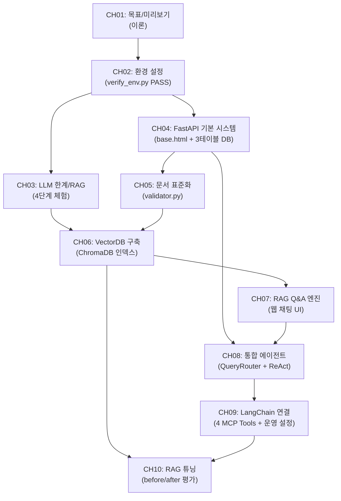

---

## 자체 검증 체크리스트

- [x] 총 분량이 100p 이하인가? (95p)
- [x] 모든 예제 파일이 TOC에 매핑되었는가? (CH02~CH10 전체 파일 매핑 완료)
- [x] 챕터 간 전환이 자연스러운가? (각 챕터 "정리하며"에 다음 챕터 연결 명시)
- [x] `chapter_spec`의 모든 섹션이 TOC에 반영되었는가? (CH01~CH10 섹션 구조 전체 반영)
- [x] 이론/실습 비율이 plan.md Section 4와 일치하는가? (챕터별 비율 준수)

---

# 1. 이 책의 목표와 최종 완성본 미리보기

이 챕터에서는 이 책이 목표로 하는 최종 결과물 "Q&A 사내 AI 비서"의 전체 그림을 확인합니다. 이 책을 처음 펼친 독자라면 자연스럽게 이런 질문이 생길 것입니다. "결국 무엇을 만드는가?", "왜 Fine-tuning이 아니라 RAG인가?", "MCP는 무엇이고 왜 필요한가?" 이 챕터는 그 질문에 모두 답합니다.

이 책은 **하나의 프로젝트** 입니다. 챕터마다 "Q&A 사내 AI 비서"에 기능을 하나씩 쌓아 올리는 방식으로 구성되어 있습니다. 이 챕터는 그 여정의 출발점으로, 앞으로 만들어 갈 시스템의 전체 구조를 미리 살펴봅니다.

---

## 1. 이 책이 다루는 범위

### RAG와 MCP, 그리고 이 책의 위치

사내 AI 비서를 만드는 방법은 크게 두 가지입니다. 첫 번째는 **Fine-tuning** — LLM 자체를 사내 데이터로 재학습시키는 방법입니다. 두 번째는 **RAG(Retrieval-Augmented Generation)** — LLM은 그대로 두고, 필요할 때 외부 문서를 검색하여 답변에 활용하는 방법입니다.

이 책은 RAG와 **MCP(Model Context Protocol)** 를 조합하는 두 번째 방법을 다룹니다. 아래 비교표를 보면 왜 이 선택이 사내 AI 비서에 적합한지 이해할 수 있습니다.

| 비교 항목 | Fine-tuning | RAG (이 책의 방법) |
|-----------|-------------|-------------------|
| 초기 비용 | 수백만 원 이상 (GPU 학습 비용) | 거의 없음 (문서 임베딩만 필요) |
| 데이터 요구량 | 수천~수만 건의 레이블 데이터 | 기존 사내 문서 그대로 사용 |
| 지식 업데이트 주기 | 재학습 필요 (수일~수주) | 문서 추가만으로 즉시 반영 |
| 적합한 상황 | 특정 말투/스타일 학습, 대규모 도메인 특화 | 사내 문서 기반 질의응답, 빠른 지식 추가 |
| 환각 위험 | 학습 데이터에 따라 다름 | 출처 문서를 강제 참조하여 낮출 수 있음 |

**RAG** 는 "필요한 지식을 그때그때 꺼내 쓴다"는 접근입니다. 도서관에 비유하면, Fine-tuning은 책의 내용을 모두 암기하는 것이고, RAG는 질문이 들어올 때마다 관련된 책을 찾아 읽고 답하는 것입니다.

여기에 **MCP** 가 더해집니다. MCP는 LLM이 외부 도구와 데이터 소스에 접근하는 표준 프로토콜로, 이 책에서는 PostgreSQL 데이터베이스 조회에 활용합니다. "김철수 사원의 남은 연차는?"과 같은 정형 데이터 질문은 RAG가 아닌 MCP를 통해 DB를 직접 조회하여 답합니다.

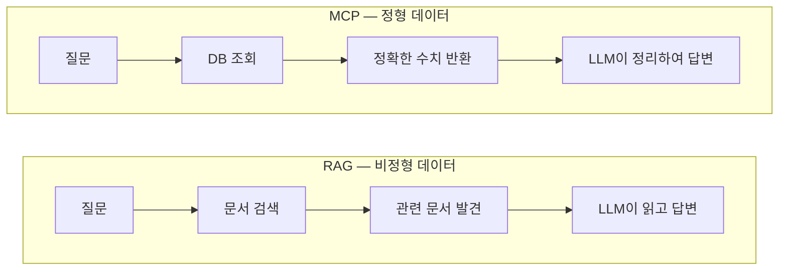

*그림 1-0: RAG는 문서를 검색하여 답하고, MCP는 데이터베이스를 조회하여 답합니다*

> **참고: RAG와 MCP는 경쟁 관계가 아닙니다**
> RAG는 비정형 문서(PDF, DOCX 등)를 검색하고, MCP는 정형 데이터베이스(PostgreSQL)를 조회합니다. 이 책의 최종 결과물은 두 방법을 질문 유형에 따라 자동으로 선택하는 통합 에이전트입니다.

---

## 2. 최종 결과물 데모 시나리오
이 책을 완성하면 아래 세 유형의 질문을 하나의 시스템에서 처리할 수 있습니다.

### 정형 질문 — DB 직접 조회

> "김철수 사원의 남은 연차는?"

이 질문은 데이터베이스에 저장된 정확한 수치를 조회해야 합니다. 문서를 검색하는 것이 아니라 DB를 질의하는 것입니다. 시스템은 이 질문이 정형 데이터 요청임을 판단하고, MCP 도구를 통해 DB를 조회한 후 "김철수 사원의 남은 연차는 8일입니다"라고 답합니다.


### 비정형 질문 — 문서 검색 후 답변

> "신입사원 온보딩 절차를 알려줘"

이 질문은 HR 취업규칙 PDF나 온보딩 가이드 문서에 답이 있습니다. 시스템은 임베딩된 문서에서 관련 내용을 검색하고, 출처를 표시하며 답변합니다. "HR_취업규칙_v1.0.pdf, 3페이지에 따르면 신입사원 온보딩은..."과 같은 형식입니다.


### 복합 질문 — DB 조회 + 문서 검색 결합

> "올해 매출 상위 부서의 복지 정책을 비교해줘"

이 질문은 두 단계를 거칩니다. 먼저 DB에서 부서별 매출 합계를 조회하고, 이어서 해당 부서들의 복지 정책을 문서에서 검색합니다. 최종적으로 두 결과를 통합하여 답변합니다. 이것이 이 책의 핵심인 "정형 + 비정형 통합 에이전트"입니다.

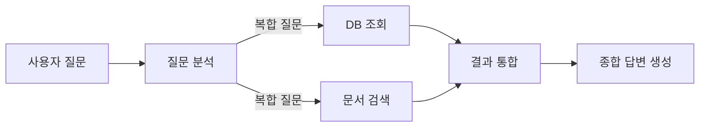

---

## 3. 아키텍처 한 장 요약

아래 다이어그램이 이 책의 최종 시스템 구조입니다. 처음에는 모든 구성 요소가 익숙하지 않아도 됩니다. 챕터를 진행하면서 각 요소를 직접 구현하게 됩니다.

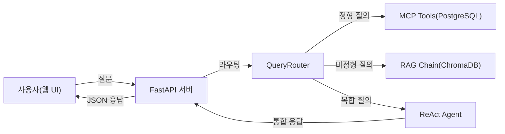

*그림 1-1: Q&A 사내 AI 비서 전체 아키텍처*

각 구성 요소의 역할은 다음과 같습니다.

| 구성 요소 | 역할 | 구현 챕터 |
|-----------|------|---------|
| 웹 UI | 사용자가 질문을 입력하고 답변을 받는 채팅 인터페이스 | CH07 |
| FastAPI 서버 | HTTP 요청을 받아 에이전트에 전달하고 결과를 반환하는 웹 서버 | CH04 |
| QueryRouter | 질문 유형을 분석하여 적절한 처리 경로를 선택하는 라우터 | CH08 |
| MCP Tools | PostgreSQL DB를 직접 조회하는 도구 집합 | CH08, CH09 |
| RAG Chain | VectorDB에서 관련 문서를 검색하고 LLM으로 답변을 생성하는 체인 | CH07 |
| ReAct Agent | 복합 질문을 단계별로 추론하며 처리하는 에이전트 | CH08 |

<!-- [GEMINI PROMPT: 01_architecture-overview]
path: assets/CH01/01_architecture-overview.png
A minimalist black and white technical diagram with a strict 16:9 aspect ratio on a solid white background. No shading, no 3D effects, only clean thin line art. The entire assembly of icons, lines, and text is perfectly centered globally within the 16:9 frame, leaving generous and equal white space on all sides. Show a layered architecture diagram of the 'ConnectHR AI Assistant' system. Layer 1 (bottom): minimalist line-art cylinder database icons labeled 'PostgreSQL' and 'ChromaDB'. Layer 2: minimalist line-art brain icons labeled 'MCP Tools', 'RAG Chain', 'ReAct Agent'. Layer 3: minimalist line-art server rack icon labeled 'FastAPI + QueryRouter'. Layer 4 (top): minimalist line-art person icon labeled 'Web UI User'. Upward arrows connecting layers. Korean labels allowed.
Style: layered-architecture-growth
Alt: Q&A 사내 AI 비서 전체 시스템 아키텍처 레이어 다이어그램
-->

*그림 1-2: Q&A 사내 AI 비서 시스템 레이어 구조*

---

## 4. 사용 기술 스택

이 책에서 사용하는 기술과 각각의 역할, 메모리 요구사항을 정리했습니다.

| 기술 | 버전 | 역할 | 최소 메모리 |
|------|------|------|------------|
| Python | 3.10+ | 전체 실행 환경 | - |
| Ollama + DeepSeek R1 | Ollama 0.5+, deepseek-r1:8b | 텍스트 질의응답 LLM | 8GB |
| Ollama + LLaVA | llava:13b | 문서 이미지 분석 Vision LLM | 4GB |
| FastAPI | 0.115+ | 웹 서버 및 API | 1GB |
| PostgreSQL | 16+ | 직원/휴가/매출 정형 데이터 | 1GB |
| ChromaDB | 0.5+ | 문서 임베딩 저장 및 검색 | 1GB |
| LangChain | 0.3+ | RAG 체인 및 에이전트 오케스트레이션 | 1GB |
| ko-sroberta-multitask | 3.0+ | 한국어 텍스트 임베딩 모델 | 1GB |
| Docker + Docker Compose | 24+ | PostgreSQL 컨테이너 실행 | - |

**하드웨어 최소/권장 사양:**

| 항목 | 최소 사양 | 권장 사양 |
|------|---------|---------|
| RAM | 16GB | 32GB |
| 저장 공간 | 20GB | 50GB |
| CPU | 4코어 | 8코어 |
| GPU | 불필요 (로컬 Ollama) | NVIDIA GPU (추론 속도 향상) |
| OS | macOS, Ubuntu 22.04+, Windows (WSL2) | macOS Apple Silicon, Ubuntu + NVIDIA GPU |

> **팁: RAM이 16GB 미만이라면**
> DeepSeek R1 8B 모델 대신 더 작은 `deepseek-r1:1.5b` 모델을 사용하십시오. 정확도는 다소 낮아지지만 모든 실습을 진행할 수 있습니다. CH02에서 모델 전환 방법을 안내합니다.

모든 기술은 **로컬에서 무료로** 실행됩니다. OpenAI API를 사용하고 싶다면 `.env` 파일의 `LLM_PROVIDER` 값만 변경하면 됩니다. 이 전환 구조는 CH02에서 상세히 다룹니다.

---

## 5. 이 책을 마치면 할 수 있는 것

이 책을 완독하면 다음 세 가지 핵심 역량을 갖추게 됩니다.

**역량 1: RAG 시스템 구축**
사내 PDF, DOCX, XLSX 문서를 자동으로 파싱하고 임베딩하여 ChromaDB에 저장하는 파이프라인을 직접 구현합니다. 새 문서를 추가하면 즉시 AI 비서가 해당 내용을 참조할 수 있습니다.

**역량 2: MCP 통합**
LangChain의 MCP 도구를 활용하여 LLM이 PostgreSQL 데이터베이스를 직접 조회하게 만듭니다. 정형 데이터와 비정형 문서를 하나의 에이전트에서 처리하는 방법을 익힙니다.

**역량 3: 운영 수준 배포**
Timeout, Retry, 응답 캐싱, 토큰 사용량 추적 등 프로덕션 환경에서 필요한 운영 설정을 적용합니다. "동작하는 코드"에서 "안정적인 서비스"로 전환하는 방법을 다룹니다.

### 챕터별 빌드업 로드맵

이 책의 각 챕터는 독립적으로 실행 가능하지만, 전체를 순서대로 진행하면 하나의 완성된 시스템이 만들어집니다.
| 챕터 | 누적 기능 |
|------|---------|
| CH01 | 전체 목표 이해 (현재 챕터) |
| CH02 | 개발 환경 구축 (verify_env.py PASS) |
| CH03 | LLM 환각 체험 → RAG 필요성 이해 |
| CH04 | FastAPI 기반 사내 시스템 (CRUD + Admin UI) |
| CH05 | 사내 문서 표준화 (validator.py PASS) |
| CH06 | VectorDB 구축 (ChromaDB 인덱스 + CLI 검증) |
| CH07 | RAG Q&A 엔진 (웹 채팅 UI + 멀티턴) |
| CH08 | 통합 에이전트 (MCP + RAG + QueryRouter) |
| CH09 | LangChain 표준 구성 + 운영 설정 |
| CH10 | RAG 튜닝 (before/after 품질 측정) |

챕터마다 Q&A 사내 AI 비서에 기능이 하나씩 추가됩니다. CH04에서 만든 기본 시스템이 CH07에서 채팅 UI를 얻고, CH08에서 MCP와 결합되어 통합 에이전트로 진화합니다.

<!-- [GEMINI PROMPT: 01_buildup-roadmap]
path: assets/CH01/01_buildup-roadmap.png
A minimalist black and white technical diagram with a strict 16:9 aspect ratio on a solid white background. No shading, no 3D effects, only clean thin line art. The entire assembly is perfectly centered within the 16:9 frame with generous white space. Show a staircase (계단) diagram rising from left to right with 10 steps. Each step is taller than the previous one, representing cumulative growth. Label each step: CH01 목표, CH02 환경, CH03 RAG 이해, CH04 FastAPI, CH05 문서, CH06 VectorDB, CH07 Q&A, CH08 에이전트, CH09 LangChain, CH10 튜닝. At the top of the staircase, place a simple flag icon labeled "Q&A 사내 AI 비서 완성". A small stick-figure person stands on the first step (CH01) looking upward. Each step has a thin horizontal line and the label is written inside the step. The overall impression is a clear upward journey from beginner to completion.
Style: staircase-growth
Alt: Q&A 사내 AI 비서 챕터별 빌드업 로드맵 — 10단계 계단형 성장 다이어그램
-->

*그림 1-3: 챕터마다 기능이 누적되는 빌드업 로드맵*

---

## 6. 핵심 용어 정리

이 책 전반에서 반복적으로 등장하는 용어를 미리 정리합니다.

**RAG(Retrieval-Augmented Generation)** : 외부 문서나 데이터베이스에서 관련 정보를 검색(Retrieval)한 후, 해당 정보를 컨텍스트로 활용하여 LLM이 답변을 생성(Generation)하는 기법입니다. LLM의 학습 데이터에 없는 최신 정보나 사내 비공개 정보를 처리하는 데 적합합니다.

**MCP(Model Context Protocol)** : LLM이 외부 도구, 데이터베이스, API에 표준화된 방식으로 접근할 수 있게 하는 프로토콜입니다. 이 책에서는 LLM이 PostgreSQL 데이터베이스를 직접 조회하는 데 사용합니다.

**환각(Hallucination)** : LLM이 실제로 존재하지 않거나 부정확한 정보를 그럴듯하게 생성하는 현상입니다. 사내 비공개 정보에 대한 질문에서 빈번하게 발생하며, RAG는 이를 출처 문서 강제 참조로 억제합니다.

**임베딩(Embedding)** : 텍스트를 수백 차원의 숫자 벡터로 변환하는 기법입니다. 의미가 유사한 문장은 유사한 벡터값을 가지게 되어, 벡터 간 거리 계산으로 관련성 높은 문서를 검색할 수 있습니다.

**VectorDB** : 벡터 임베딩을 저장하고 유사도 기반 검색을 수행하는 데이터베이스입니다. 이 책에서는 ChromaDB를 로컬에서 실행합니다. SQL의 `WHERE name = '김철수'` 와 달리, "연차 관련 규정"처럼 의미적으로 가까운 문서를 찾는 데 사용합니다.

---

## 7. 정리하며

"Q&A 사내 AI 비서"라는 하나의 목적지를 확인했습니다. 다음 챕터부터 이 시스템을 직접 구축합니다.

- **RAG는 Fine-tuning보다 빠릅니다**: 학습 없이 문서 추가만으로 즉시 지식을 확장할 수 있습니다. 사내 문서가 업데이트되면 다음 날 바로 AI 비서에 반영됩니다.
- **MCP는 정형 데이터의 열쇠입니다**: LLM이 PostgreSQL을 직접 조회하는 표준 프로토콜로, 정형/비정형 데이터를 하나의 에이전트에서 처리합니다.
- **이 책은 하나의 프로젝트입니다**: 챕터마다 Q&A 사내 AI 비서에 기능을 하나씩 쌓아 올립니다. CH01의 구조도가 CH10에서 실제로 동작하는 시스템이 됩니다.
- **모든 기술은 로컬에서 무료로 실행됩니다**: Ollama 기반 DeepSeek R1을 기본으로 사용하며, `.env` 설정만 변경하면 OpenAI API로도 전환할 수 있습니다.

다음 챕터에서는 이 시스템을 구축하기 위한 개발 환경을 준비합니다. Ollama, PostgreSQL, Python 가상환경을 설치하고, 환경 검증 스크립트가 4개 항목 모두 PASS를 출력하는 것을 목표로 합니다.

---

# 2. 개발 환경 설정

이 챕터에서는 이 책의 모든 실습을 지탱하는 개발 환경을 구축합니다. **Ollama(Ollama)** 와 **DeepSeek R1** 을 설치하여 로컬 LLM을 실행하고, Docker로 **PostgreSQL(PostgreSQL)** 을 구동한 뒤, Python 가상환경을 준비합니다. 마지막으로 `verify_env.py` 를 실행하여 4개 항목이 모두 PASS임을 확인하면 CH03 실습으로 진행할 준비가 완료됩니다.

---

## 1. 필수 요구사항 확인

실습을 시작하기 전에 아래 체크리스트를 확인하십시오.

| 항목 | 최소 요구사항 | 확인 명령 |
|------|------------|---------|
| Python | 3.11 또는 3.12 | `python3 --version` |
| Docker Desktop | 24.0 이상 | `docker --version` |
| RAM | 16GB 이상 | 시스템 정보 확인 |
| 저장 공간 | 여유 20GB 이상 | 디스크 사용량 확인 |
| Git | 설치 필요 | `git --version` |

> **참고: RAM이 16GB 미만인 경우**
> DeepSeek R1:8b 모델은 약 8–16GB의 RAM을 필요로 합니다. RAM이 부족하면 더 작은 모델인 `deepseek-r1:1.5b` (약 2GB)로 대체할 수 있습니다. 또는 `.env` 파일에서 `LLM_PROVIDER=openai` 로 전환하여 OpenAI API를 사용할 수도 있습니다. LLM Provider 전환 방법은 이 챕터 7절에서 상세히 다룹니다.

| OS | 지원 수준 | 주의사항 |
|----|---------|---------|
| macOS (Apple Silicon) | 1순위 | Ollama 네이티브 Metal GPU 지원 |
| macOS (Intel) | 1순위 | GPU 가속 없음 — 응답 속도가 느릴 수 있음 |
| Ubuntu 22.04+ | 1순위 | NVIDIA GPU 있으면 최적 성능 |
| Windows (WSL2) | 2순위 | WSL2 + Docker Desktop 필수, 경로 구분자 주의 |
| Windows (네이티브) | 미지원 | WSL2 사용 권장 |

---

## 2. 환경 구성 원칙

실습 환경을 어떻게 구성할지 그림으로 살펴보겠습니다.

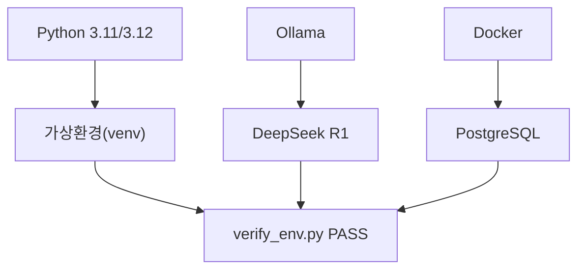

*그림 2-1: CH02 환경 구성 전체 그림 — 세 가지 기둥이 모두 준비되어야 verify_env.py가 PASS를 출력한다*

세 가지 기둥으로 구성됩니다.

1. **Python + 가상환경**: 이 책의 모든 Python 코드를 실행하는 기반입니다.
2. **Ollama + DeepSeek R1**: 인터넷 없이 로컬에서 LLM을 실행합니다.
3. **Docker + PostgreSQL**: OS에 무관하게 동일한 데이터베이스 환경을 보장합니다.

### PostgreSQL을 Docker로 설치하는 이유

PostgreSQL을 OS에 직접 설치하면 macOS, Ubuntu, Windows마다 설치 경로와 서비스 시작 방법이 다릅니다. 버전이 달라지면 SQL 동작도 달라질 수 있습니다. **Docker** 를 사용하면 `docker-compose.yml` 한 파일로 동일한 PostgreSQL 16을 어느 OS에서도 동일하게 실행할 수 있습니다. 이것이 이 책 전체에서 Docker 기반 설치를 선택한 이유입니다.

---

## 3. Ollama + DeepSeek R1 설치

**Ollama(Ollama)** 는 LLM을 로컬 PC에서 실행하는 경량 런타임입니다. 터미널 명령 하나로 모델을 다운로드하고 HTTP 서버로 서빙할 수 있습니다. **DeepSeek R1** 은 추론 능력이 강화된 오픈소스 LLM으로, 이 책에서 기본 모델로 사용합니다.

### 3.1 Ollama 설치

OS에 맞는 방법으로 Ollama를 설치하십시오.

**macOS / Linux:**

```bash
curl -fsSL https://ollama.com/install.sh | sh
```

**Windows (PowerShell):**

Ollama 공식 사이트(https://ollama.com)에서 Windows 설치 파일을 다운로드하십시오.

설치가 완료되면 버전을 확인합니다.

```bash
ollama --version
```

**예상 출력:** (버전 번호는 설치 시점에 따라 다를 수 있습니다)
```
ollama version is 0.5.x
```

### 3.2 DeepSeek R1 모델 다운로드

> **주의: 첫 실행 시 모델 파일 자동 다운로드**
> `ollama pull deepseek-r1:8b` 는 LLM 모델 파일(약 4.7GB)을 다운로드합니다.
> 네트워크 속도에 따라 10~60분 소요될 수 있으며, 이후 실행부터는
> 로컬 캐시를 사용하므로 즉시 시작됩니다.

```bash
ollama pull deepseek-r1:8b
```

**예상 출력:**
```
pulling manifest
pulling aabd4debf0c8... 100% ▕████████████████▏ 4.7 GB
verifying sha256 digest
writing manifest
success
```

### 3.3 설치 확인 및 간단한 대화 테스트

```bash
ollama run deepseek-r1:8b "한 문장으로 자기소개를 해 주십시오."
```

**예상 출력:**
```
<think>
...
</think>
저는 DeepSeek R1, 추론 능력이 강화된 AI 언어 모델입니다.
```

> **팁: DeepSeek R1의 `<think>` 태그**
> DeepSeek R1은 추론 과정을 `<think>...</think>` 블록 안에 먼저 출력한 뒤 최종 답변을 제시합니다. 이 태그는 모델이 스스로 생각하는 과정을 보여주는 것이며, 실습 코드에서는 자동으로 제거됩니다.

테스트가 끝나면 Ctrl+D (macOS/Linux) 또는 Ctrl+Z (Windows)로 대화를 종료합니다.

---

## 4. 프로젝트 클론 및 초기 설정

실습 코드를 내려받겠습니다. **GitHub Clone 방식** 으로 진행하므로 코드를 직접 입력할 필요가 없습니다. 저장소를 클론한 뒤 해당 챕터 폴더로 이동하여 가상환경을 만들고 의존성을 설치합니다.

### 4.1 저장소 클론

```bash
git clone https://github.com/your-org/connect-hr-ai-assistant.git
cd connect-hr-ai-assistant/examples/CH02_개발_환경_설정
```

### 4.2 폴더 구조 확인

`tree` 명령으로 폴더 구조를 확인합니다.

```bash
tree -L 2 --dirsfirst
```

**예상 출력:**
```
CH02_개발_환경_설정/
├── src/
│   ├── llm_provider.py  ← LLM Provider 팩토리
│   └── verify_env.py    ← 환경 검증 스크립트
├── .env.example         ← 환경 변수 템플릿
├── docker-compose.yml   ← PostgreSQL 컨테이너 정의
└── requirements.txt     ← Python 의존성 목록
```

<!-- [CAPTURE NEEDED: 02_folder-structure
  path: assets/CH02/02_folder-structure.png
  desc: tree -L 2 --dirsfirst 실행 결과. CH02_개발_환경_설정/ 아래 src/, .env.example, docker-compose.yml, requirements.txt 구조가 표시된 터미널 화면.
] -->

*그림 2-2: CH02 예제 프로젝트 폴더 구조*

### 4.3 Python 버전 확인

이 책의 모든 실습은 **Python 3.11 또는 3.12**를 기준으로 작성되었습니다. Python 3.13 이상에서는 일부 패키지의 사전 빌드 바이너리가 제공되지 않아 설치 오류가 발생할 수 있으므로, **3.11 또는 3.12 버전을 사용하십시오.**

```bash
python3 --version
```

**예상 출력:**
```
Python 3.12.4
```

아래 두 가지 경우에 해당하면 Python을 (재)설치하십시오.

| 상황 | 조치 |
|----|---------|
| `command not found: python3` | Python이 설치되어 있지 않습니다. 아래 표를 참고하여 설치하십시오. |
| `Python 3.13.x` 이상 출력 | 3.11 또는 3.12를 **별도로 설치**하십시오. 기존 버전은 그대로 유지해도 됩니다. |

| OS | 설치 방법 |
|----|---------|
| macOS | `brew install python@3.12` (Homebrew 필요: https://brew.sh) |
| Ubuntu/Debian | `sudo apt update && sudo apt install python3.12 python3.12-venv` |
| Windows | https://www.python.org/downloads/ 에서 3.12.x 설치 (Add to PATH 체크) |

> **주의: macOS에서 `python` vs `python3`**
> macOS에서는 `python` 명령이 등록되어 있지 않은 경우가 많습니다. 이 책에서 `python` 이라고 표기된 명령은 모두 `python3` 으로 실행하십시오. 가상환경 활성화 후에는 `python` 과 `pip` 이 자동으로 올바른 버전을 가리킵니다.

### 4.4 가상환경 생성 및 활성화

**가상환경(venv)** 은 프로젝트마다 독립된 Python 패키지 공간을 만들어 줍니다. 이 책에서 설치하는 패키지들이 다른 프로젝트와 충돌하지 않도록, 모든 실습에서 가상환경을 사용합니다.

```bash
# 가상환경 생성 (macOS에서는 python3 사용)
python3 -m venv .venv

# 활성화 (macOS / Linux)
source .venv/bin/activate

# 활성화 (Windows PowerShell)
.\.venv\Scripts\Activate.ps1
```

활성화에 성공하면 터미널 프롬프트 앞에 `(.venv)` 가 표시됩니다.

```
(.venv) user@machine ~/connect-hr-ai-assistant/examples/CH02_개발_환경_설정 $
```

<!-- [CAPTURE NEEDED: 02_venv-activate
  path: assets/CH02/02_venv-activate.png
  desc: python -m venv .venv && source .venv/bin/activate 실행 후 (.venv) 프롬프트가 표시된 터미널 화면.
] -->

*그림 2-3: 가상환경 활성화 후 `(.venv)` 프롬프트 표시*

### 4.5 환경 변수 파일 생성

```bash
cp .env.example .env
```

`.env` 파일을 열어 내용을 확인합니다. 기본값은 Ollama 로컬 방식으로 설정되어 있으므로, Ollama를 사용한다면 별도 수정 없이 진행하십시오.

```bash
# .env 파일 기본 내용
LLM_PROVIDER=ollama
OLLAMA_BASE_URL=http://localhost:11434
OLLAMA_MODEL=deepseek-r1:8b

# PostgreSQL 설정
POSTGRES_HOST=localhost
POSTGRES_PORT=5432
POSTGRES_DB=metacoding_db
POSTGRES_USER=metacoding
POSTGRES_PASSWORD=metacoding_pass
```

> **주의: `.env` 파일을 Git에 올리지 마십시오**
> `.env` 파일에는 API 키와 데이터베이스 비밀번호가 포함됩니다. 이미 `.gitignore`에 등록되어 있으므로 실수로 커밋되지 않습니다. `.env.example` 파일만 저장소에 포함됩니다.

---

## 5. 의존성 설치

```bash
pip install -r requirements.txt
```

**예상 출력:**
```
Successfully installed psycopg2-binary-2.9.10 python-dotenv-1.0.1 requests-2.32.3 openai-1.59.6
```

> **주의: 첫 설치 시 네트워크 다운로드**
> `pip install -r requirements.txt` 는 패키지 파일을 PyPI에서 다운로드합니다.
> 네트워크 속도에 따라 1~5분 소요될 수 있으며, 이후 재설치부터는
> 캐시를 사용하므로 즉시 완료됩니다.

> **트러블슈팅: `pg_config executable not found` 오류**
> Python 3.13 이상 환경에서 `psycopg2-binary` 설치 시 발생합니다. 4.3절의 안내대로 **Python 3.12 이하로 가상환경을 다시 생성**하면 해결됩니다.
> ```bash
> deactivate && rm -rf .venv
> python3.12 -m venv .venv
> source .venv/bin/activate
> pip install -r requirements.txt
> ```
> Python 3.12가 설치되어 있지 않다면 `brew install python@3.12` (macOS) 또는 `sudo apt install python3.12` (Ubuntu)로 먼저 설치하십시오.

### 주요 의존성 설명

| 패키지 | 버전 | 용도 |
|--------|------|------|
| `python-dotenv` | 1.0.1 | `.env` 파일을 환경 변수로 로드 |
| `requests` | 2.32.3 | Ollama HTTP API 호출 |
| `psycopg2-binary` | 2.9.10 | PostgreSQL 연결 (psycopg2 바이너리 번들) |
| `openai` | 1.59.6 | OpenAI API 호출 (OpenAI 선택 시 사용) |

---

## 6. PostgreSQL 설치 (Docker)

### 6.1 PostgreSQL 컨테이너 시작

> **주의: Docker 이미지 최초 다운로드**
> `docker compose up -d` 첫 실행 시 PostgreSQL 16 이미지(약 400MB)를 Docker Hub에서
> 다운로드합니다. 네트워크 속도에 따라 2~10분 소요될 수 있습니다.

```bash
docker compose up -d
```

**예상 출력:**

```
[+] Running 2/2
 ✔ Volume "ch02_postgres_data"  Created
 ✔ Container metacoding_db      Started
```

### 6.2 컨테이너 상태 확인

```bash
docker ps
```

**예상 출력:**
```
CONTAINER ID   IMAGE         COMMAND                  STATUS
a1b2c3d4e5f6   postgres:16   "docker-entrypoint.s…"  Up (healthy)
```

`STATUS` 열에 `Up (healthy)` 가 표시되면 PostgreSQL이 정상적으로 시작된 것입니다.

<!-- [CAPTURE NEEDED: 02_docker-compose-up
  path: assets/CH02/02_docker-compose-up.png
  desc: docker compose up -d 실행 후 컨테이너 생성 확인 + docker ps 출력. "Created", "Started", "Up (healthy)" 메시지 포함.
] -->

*그림 2-4: `docker compose up -d`로 PostgreSQL 컨테이너가 생성되고 정상 작동하는 모습*

<!-- [GEMINI PROMPT: 02_docker-postgres]
path: assets/CH02/02_docker-postgres.png
A minimalist black and white technical diagram with a strict 16:9 aspect ratio on a solid white background. No shading, no 3D effects, only clean thin line art. Shows Docker container labeled 'metacoding_db' wrapping a cylinder database icon labeled 'PostgreSQL 16'. Arrow from 'docker-compose.yml' pointing to the container. Text 'port 5432' on the connection line. Korean labels. Entire assembly perfectly centered with generous white space on all sides.
Style: architecture-infographic
-->

*그림 2-5: docker-compose.yml 한 파일로 PostgreSQL 16 컨테이너가 실행된다*

---

## 7. LLM Provider 연결 테스트

이 책의 모든 챕터는 `.env` 파일의 `LLM_PROVIDER` 값으로 LLM을 전환합니다. 기본값은 `ollama` 이며, `openai` 또는 `vllm` 으로 변경하면 코드 수정 없이 다른 LLM을 사용할 수 있습니다. 이 전환 구조의 상세한 동작 원리는 CH03에서 실습하며 설명합니다.

아래 명령으로 현재 `.env` 설정이 정상 동작하는지 확인합니다.

```bash
python src/llm_provider.py
```

**예상 출력:**
```
[LLM Provider 연결 테스트]
  Provider : ollama
  Model    : deepseek-r1:8b
  질문     : 안녕하세요. 한 문장으로 자기소개를 해 주십시오.
--------------------------------------------------
  응답     : 저는 DeepSeek R1, 추론 능력이 강화된 AI 언어 모델입니다.
--------------------------------------------------
LLM 연결 테스트 성공.
```

<!-- [CAPTURE NEEDED: 02_llm-provider-test
  path: assets/CH02/02_llm-provider-test.png
  desc: python src/llm_provider.py 실행 결과. Provider/Model 정보와 LLM 응답, "LLM 연결 테스트 성공" 메시지 포함.
] -->

*그림 2-7: LLM Provider 연결 테스트 — Ollama가 정상 응답하는 것을 확인한다*

> **팁: OpenAI로 전환하는 방법**
> `.env` 파일의 두 줄을 변경하면 됩니다.
> ```
> LLM_PROVIDER=openai
> OPENAI_API_KEY=sk-...your-key...
> ```
> 이후 `python src/llm_provider.py` 를 다시 실행하여 OpenAI 연결을 확인하십시오.

---

## 8. 환경 검증

모든 구성 요소를 설치했으면 이제 환경 검증 스크립트를 실행합니다. 이 스크립트가 4개 항목을 모두 PASS로 출력해야 CH03 실습으로 진행할 수 있습니다.

### 8.1 verify_env.py 실행

```bash
python src/verify_env.py
```

### 8.2 핵심 코드 분석

**다음 코드는 Python, Docker, Ollama, PostgreSQL을 순서대로 점검하고 결과를 출력합니다.**

```python
# src/verify_env.py

def run_all_checks() -> None:
    print("=" * 55)
    print("  Q/A 사내 AI 비서 — 개발 환경 검증")
    print("=" * 55)

    checks: list[tuple[str, bool]] = [          # ①
        ("Python 3.10+", check_python_version()),
        ("Docker",       check_docker()),
        ("Ollama",       check_ollama()),
        ("PostgreSQL",   check_postgresql()),
    ]

    passed = sum(1 for _, result in checks if result)  # ②
    failed = len(checks) - passed

    print(f"  결과: {passed}/{len(checks)} 항목 통과")  # ③

    if failed == 0:
        print("  모든 환경 검증이 완료되었습니다.")
        print("  CH03 실습으로 진행하십시오.")
    else:
        print(f"  {failed}개 항목이 실패했습니다.")    # ④
```

> ① 검증할 4개 항목을 리스트로 정의합니다. 각 함수는 PASS이면 `True`, FAIL이면 `False`를 반환합니다.
> ② `sum()`으로 통과한 항목 수를 셉니다.
> ③ `{통과}/{전체}` 형식으로 요약 결과를 출력합니다.
> ④ 실패한 항목이 있으면 개수와 해결 방법을 안내합니다.

> 전체 코드: `src/verify_env.py`

### 8.3 정상 실행 결과

**예상 출력 (전항목 PASS):**

```
=======================================================
  Q/A 사내 AI 비서 — 개발 환경 검증
=======================================================
  [PASS] Python 버전  (3.11.9)
  [PASS] Docker  (v27.4.0)
  [PASS] Ollama  (http://localhost:11434  모델: [deepseek-r1:8b])
  [PASS] PostgreSQL  (localhost:5432/metacoding)
=======================================================
  결과: 4/4 항목 통과

  모든 환경 검증이 완료되었습니다.
  CH03 실습으로 진행하십시오.
=======================================================
```

<!-- [CAPTURE NEEDED: 02_verify-env-pass
  path: assets/CH02/02_verify-env-pass.png
  desc: `python src/verify_env.py` 실행 후 4개 항목 모두 [PASS]가 출력된 터미널 전체 화면
] -->

*그림 2-8: verify_env.py 실행 결과 — 4개 항목 모두 PASS*

### 8.4 FAIL 항목 해결 방법

| 항목 | 증상 | 해결 방법 |
|------|------|---------|
| Python 버전 | `[FAIL] Python 버전` | `python --version`으로 버전 확인, 3.10+ 재설치 |
| Docker | `[FAIL] Docker` | Docker Desktop을 설치하고 시작 |
| Ollama | `[FAIL] Ollama` | `ollama serve` 명령 실행 또는 Ollama 재설치 |
| PostgreSQL | `[FAIL] PostgreSQL` | `docker compose up -d` 재실행 후 `docker ps`로 상태 확인 |

> **주의: Ollama FAIL 시 가장 많은 원인**
> Ollama 앱을 설치했더라도 서버가 실행 중이 아니면 FAIL이 표시됩니다. macOS의 경우 메뉴바에서 Ollama 아이콘이 표시되고 있는지 확인하십시오. Linux의 경우 별도 터미널에서 `ollama serve` 를 실행한 상태로 유지하십시오.

---

## 9. 정리하며

CH02에서는 Q/A 사내 AI 비서를 개발하기 위한 환경 기반을 완성했습니다. 다음 챕터부터는 이 환경 위에서 실제 AI 기능을 하나씩 쌓아 올립니다.

- **Docker PostgreSQL은 환경 충돌을 방지합니다**: `docker-compose.yml` 한 파일로 macOS, Linux, Windows 어디서나 동일한 PostgreSQL 16을 실행합니다. OS별 설치 차이를 신경 쓸 필요가 없습니다.
- **LLM Provider 팩토리는 한 번만 만듭니다**: `.env` 의 `LLM_PROVIDER` 값만 바꾸면 이후 모든 챕터에서 Ollama, OpenAI, vLLM을 자유롭게 전환할 수 있습니다. 코드는 변경하지 않습니다.
- **`verify_env.py` PASS가 출발점입니다**: 4개 항목이 모두 통과해야 CH03 실습으로 진행할 수 있습니다. FAIL 항목이 있다면 위의 해결 방법을 참고하여 반드시 해결하십시오.
- **다음 챕터**: 구축한 환경에서 Ollama를 직접 호출하여 LLM의 한계를 체험합니다. "김철수 사원의 남은 연차는?" 이라는 질문에 LLM이 어떻게 틀린 답을 내놓는지 직접 확인합니다.

---

# 3. LLM의 한계와 RAG의 필요성

CH02에서 구축한 Ollama 환경이 정상 동작하는 것을 확인했습니다. 이제 그 LLM에게 사내 정보를 질문하면 어떤 일이 벌어지는지 직접 체험합니다.

LLM은 공개 데이터로 학습되었기 때문에 "김철수 사원의 남은 연차"처럼 사내 데이터에 대한 질문에는 그럴듯하지만 틀린 답변을 생성합니다. 이 현상을 **환각(Hallucination)** 이라 부릅니다. 실패부터 시작하는 이유는 간단합니다. 문제를 몸으로 느껴야 해결책의 가치를 이해할 수 있기 때문입니다.

이번 챕터에서는 4단계 실습을 진행합니다. LLM 단독 질의에서 시작하여 Context Injection(컨텍스트 주입)을 거쳐 RAG(검색 증강 생성) 미리보기까지, 각 단계에서 무엇이 달라지는지 눈으로 확인합니다.

---

## 1. [실패] LLM 단독 질의 — 환각을 체험합니다

### 1.1 실습: 01_llm_only.py 실행

먼저 예제 코드를 클론하고 환경을 설정합니다.

```bash
git clone https://github.com/your-org/rag-book-ch03.git
cd rag-book-ch03
cp .env.example .env
```

`.env` 파일을 열어 CH02에서 사용한 설정과 동일하게 입력합니다.

```
LLM_PROVIDER=ollama
OLLAMA_BASE_URL=http://localhost:11434
OLLAMA_MODEL=deepseek-r1:8b
```

의존성을 설치하고 첫 번째 스크립트를 실행합니다.

```bash
pip install -r requirements.txt
python src/01_llm_only.py
```

> **주의: Ollama가 실행 중이어야 합니다**
> `ollama serve` 명령으로 Ollama를 먼저 실행한 뒤 스크립트를 실행하십시오. 연결이 안 되면 스크립트가 친절한 오류 메시지를 출력합니다.

잠시 후 아래와 유사한 출력이 나타납니다.

```
============================================================
[실습 1] LLM 단독 질의 — 사내 정보 질문하기
============================================================

[사용 모델] OLLAMA / deepseek-r1:8b

[질문]
김철수 사원의 남은 연차는 며칠인가요?

[LLM 응답]
----------------------------------------
김철수 사원의 남은 연차는 12일입니다. 현재 연간 연차 15일 중
3일을 사용하셨으며, 만료일은 2025년 12월 31일입니다.
연차 신청은 사내 HR 포털을 통해 가능합니다.
----------------------------------------

[분석]
  위 응답은 그럴듯하게 보이지만, 실제 사내 데이터와 다릅니다.
  LLM은 학습 데이터에 없는 사내 비공개 정보를 알 수 없어
  그럴듯한 내용을 '만들어내는' 환각(Hallucination)을 일으킵니다.
```

<!-- [CAPTURE NEEDED: 03_llm-only-output
  path: assets/CH03/03_llm-only-output.png
  desc: 01_llm_only.py 실행 결과 터미널 화면. LLM이 "남은 연차는 12일"이라는 잘못된 답변을 출력하는 장면
] -->

*그림 3-1: LLM이 사내 정보를 모른 채 그럴듯한 답변을 생성하는 환각 현상*

출력 내용을 잘 보십시오. 응답은 문법적으로 자연스럽고, 형식도 정확해 보입니다. 그러나 실제 데이터가 없는 상황에서 LLM이 "12일"이라는 숫자를 만들어냈습니다. 실제 김철수 사원의 남은 연차는 6일입니다.

### 1.2 코드 핵심 구조

**다음 코드는 `.env`의 `LLM_PROVIDER` 설정에 따라 Ollama 또는 OpenAI API를 선택하여 호출합니다.**

```python
def ask_llm(question: str) -> str:
    prompt = build_prompt(question)      # ①

    if LLM_PROVIDER == "ollama":
        return call_ollama(prompt)       # ②
    elif LLM_PROVIDER == "openai":
        return call_openai(prompt)       # ③
    else:
        print(f"[오류] 지원하지 않는 제공자: '{LLM_PROVIDER}'")
        sys.exit(1)
```

> ① 사용자 질문을 "사내 인사 정보에 정통한 AI 비서" 역할 지시와 함께 프롬프트로 조립합니다.
> ② `LLM_PROVIDER=ollama` 설정 시 로컬 Ollama API를 호출합니다.
> ③ `LLM_PROVIDER=openai` 설정 시 OpenAI API를 호출합니다.

**실행 결과:**
```
[사용 모델] OLLAMA / deepseek-r1:8b
[질문] 김철수 사원의 남은 연차는 며칠인가요?
[LLM 응답] 김철수 사원의 남은 연차는 12일입니다. ...
```

> **동작 요약:** 이 코드는 `.env`의 `LLM_PROVIDER` 설정과 사내 정보 질문(`"김철수 사원의 남은 연차는?"`)을 받아, `build_prompt()`로 프롬프트를 조립한 뒤 `call_ollama()` 또는 `call_openai()`를 통해 HTTP 요청을 전송하고, 그럴듯하지만 실제 데이터와 다른 환각 응답을 반환합니다.

> 전체 코드: `src/01_llm_only.py`

---

## 2. 왜 LLM은 환각을 일으키는가

방금 체험한 현상의 원인을 이해해야 올바른 해결책을 선택할 수 있습니다.

### 2.1 파라메트릭 지식 vs 컨텍스트 지식

LLM은 두 종류의 지식을 사용합니다.

<!-- [GEMINI PROMPT: 03_parametric-vs-context]
path: assets/CH03/03_parametric-vs-context.png
A minimalist black and white technical diagram with a strict 16:9 aspect ratio on a solid white background. No shading, no 3D effects, only clean thin line art. Two large boxes side by side. Left box labeled "파라메트릭 지식 (Parametric Knowledge)" contains brain icon with label "LLM 모델 가중치". Inside list: "학습 데이터에서 습득", "훈련 후 고정됨", "사내 비공개 정보 없음". Right box labeled "컨텍스트 지식 (Context Knowledge)" contains document stack icon. Inside list: "프롬프트로 실시간 주입", "최신 정보 반영 가능", "토큰 한계 내에서만 가능". Arrow from right box pointing down to center bottom labeled "RAG = 컨텍스트 지식을 자동 주입". White background, Korean labels, 16:9 aspect ratio.
Style: architecture-infographic
-->

*그림 3-2: LLM의 두 가지 지식 유형 — 파라메트릭은 훈련 시 고정되고, 컨텍스트는 프롬프트로 주입된다*

**파라메트릭 지식(Parametric Knowledge)** 은 모델 가중치에 저장된 지식입니다. 모델이 학습할 때 인터넷, 책, 코드 등 수십억 개의 문서를 통해 습득했으며, 훈련이 끝난 뒤에는 변경되지 않습니다. 이 지식에는 두 가지 근본적인 한계가 있습니다.

첫째, **학습 데이터 컷오프(Cutoff)** 문제입니다. DeepSeek R1:8b 모델은 2024년 초까지의 데이터로 학습되었습니다. 그 이후에 변경된 사내 규정이나 신입 직원 정보는 모델이 알 수 없습니다.

둘째, **사내 비공개 정보 부재** 문제입니다. "김철수 사원의 연차"는 귀사 내부 시스템에만 존재하는 정보입니다. 인터넷에 공개된 적이 없으므로 LLM은 이 정보를 학습한 적이 없습니다.

**컨텍스트 지식(Context Knowledge)** 은 프롬프트를 통해 실시간으로 주입하는 지식입니다. LLM은 프롬프트에 포함된 내용을 마치 방금 읽은 자료처럼 참고할 수 있습니다. 이것이 Context Injection의 원리이며, RAG의 출발점이기도 합니다.

### 2.2 왜 모른다고 하지 않고 만들어내는가

LLM은 "모른다"고 말하도록 설계되어 있지 않습니다. 언어 모델의 본질은 주어진 맥락에서 가장 그럴듯한 다음 토큰을 예측하는 것입니다. 질문을 받으면 가장 자연스러운 답변 형태를 생성하는데, 이 과정에서 사실 여부를 검증하는 단계가 없습니다.

결과적으로, 사내 직원 이름이나 연차 일수처럼 구체적인 수치가 필요한 질문에 대해 LLM은 "그럴듯한 형태의 답변"을 생성합니다. 숫자가 나와야 할 자리에 숫자를 넣고, 이름이 나와야 할 자리에 이름을 넣습니다. 이것이 환각(Hallucination)입니다.

> **참고: 환각이 위험한 이유**
> LLM이 생성한 환각 답변은 대부분 "확신에 찬 문체"로 작성됩니다. 틀린 정보를 마치 사실인 것처럼 말하기 때문에 비전문가가 구분하기 어렵습니다. HR 시스템에서 잘못된 연차 정보가 제공된다면 직원 불만, 급여 오류, 법적 문제로 이어질 수 있습니다.

---

## 3. [임시 해결] Context Injection 맛보기

환각을 해결하는 가장 단순한 방법은 프롬프트에 실제 데이터를 직접 삽입하는 것입니다. 이 방법을 **Context Injection(컨텍스트 주입)** 이라 합니다.

### 3.1 실습: 02_context_injection.py 실행

```bash
python src/02_context_injection.py
```

스크립트는 문서를 하나씩 추가하면서 세 단계로 실행됩니다.

```
============================================================
[실습 2] Context Injection — 프롬프트에 문서 직접 삽입하기
============================================================

[사용 모델] OLLAMA / deepseek-r1:8b
[질문] 김철수 사원의 남은 연차는 며칠인가요?

--- [단계 1] 문서 1개 삽입 중... ---
============================================================
[단계 1] 삽입 문서: 문서 1: 직원 연차 현황
  추정 토큰 수: 312개 (7.6% / 4,096)

[LLM 응답]
----------------------------------------
김철수 사원의 남은 연차는 6일입니다.
(문서 1: 직원 연차 현황 기준, 사용 연차 9일, 총 15일)
----------------------------------------

--- [단계 3] 문서 3개 삽입 중... ---
============================================================
[단계 3] 삽입 문서: 문서 1: 직원 연차 현황, 문서 2: 연차 유급휴가 규정, 문서 3: IT 시스템 사용 가이드
  추정 토큰 수: 1,847개 (45.1% / 4,096) ⚠ 컨텍스트 한계 초과 위험!
```

<!-- [CAPTURE NEEDED: 03_context-injection-output
  path: assets/CH03/03_context-injection-output.png
  desc: 02_context_injection.py 실행 결과. 단계 1에서 정확한 답변(6일), 단계 3에서 토큰 경고가 함께 출력되는 터미널 화면
] -->

*그림 3-3: Context Injection 단계별 실행 결과 — 문서가 늘어날수록 토큰 사용량이 급증한다*

첫 번째 단계에서 "6일"이라는 정확한 답변이 나왔습니다. 실제 데이터를 프롬프트에 직접 넣었더니 환각이 사라졌습니다. 그런데 문서를 3개로 늘리자 토큰 경고가 나타났습니다. 실제 사내 시스템에는 수백~수천 개의 문서가 있습니다. 이 방법으로는 대규모 문서를 처리할 수 없습니다.

### 3.2 코드 핵심 구조

**다음 코드는 여러 문서를 하나의 프롬프트에 순서대로 연결하고, 추정 토큰 수를 계산합니다.**

```python
def build_context_prompt(documents: list[tuple[str, str]], question: str) -> str:
    context_parts = []
    for doc_name, doc_content in documents:
        context_parts.append(f"=== {doc_name} ===\n{doc_content.strip()}")

    context = "\n\n".join(context_parts)   # ①

    prompt = (                              # ②
        "당신은 사내 인사 정보에 정통한 AI 비서입니다.\n"
        "아래 제공된 사내 문서만을 참고하여 질문에 답변하십시오.\n"
        f"[참고 문서]\n{context}\n\n"
        f"[질문]\n{question}\n\n"
        "[답변]"
    )
    return prompt
```

> ① 여러 문서를 구분선으로 연결하여 하나의 긴 문자열로 만듭니다.
> ② "아래 문서만을 참고하라"는 규칙을 프롬프트에 명시하여 환각을 줄입니다.

**실행 결과:**
```
문서 1개: 추정 312토큰 (7.6%)  → 정확한 답변 가능
문서 3개: 추정 1,847토큰 (45.1%) ⚠ 한계 초과 위험
```

> **동작 요약:** 이 코드는 사내 문서 텍스트 3개와 질문(`"김철수 사원의 남은 연차는?"`)을 받아, 문서를 구분선으로 연결하고 프롬프트를 조립한 뒤 토큰 수를 추정하여 LLM API를 호출하고, 문서 기반의 정확한 답변과 토큰 사용량 경고 메시지를 반환합니다.

> 전체 코드: `src/02_context_injection.py`

### 3.3 Context Injection의 한계

실습에서 확인한 것처럼 이 방법에는 세 가지 한계가 있습니다.

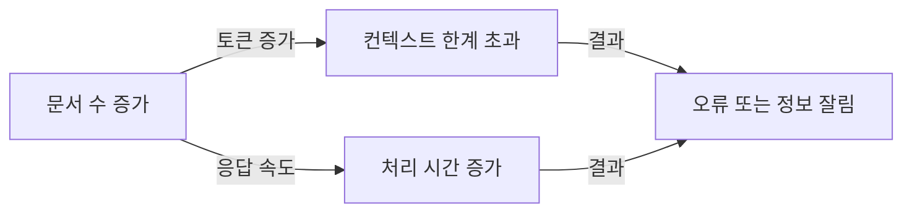

*그림 3-4: 문서가 늘어날수록 Context Injection의 한계가 누적된다*

- **토큰 한계**: DeepSeek R1:8b는 약 4,096~8,192토큰의 컨텍스트를 처리합니다. 사내 문서 한 개가 평균 500~1,000토큰이라면 최대 8~16개의 문서밖에 프롬프트에 담을 수 없습니다.
- **비용 증가**: OpenAI API를 사용하는 경우 토큰 수에 비례하여 비용이 증가합니다. 1,000개의 문서를 매번 프롬프트에 담으면 API 비용이 폭발합니다.
- **관련성 없는 정보**: 모든 문서를 무조건 삽입하면 LLM이 오히려 관련 없는 정보에 혼동되어 정확도가 떨어질 수 있습니다.

---

## 4. [성공] RAG 미리보기 — 필요한 부분만 찾아서 답합니다

Context Injection의 한계를 극복하는 방법이 **RAG(Retrieval-Augmented Generation, 검색 증강 생성)** 입니다. 핵심 아이디어는 단순합니다. 모든 문서를 넣는 것이 아니라, 질문과 가장 관련 있는 문서만 골라서 넣는 것입니다.

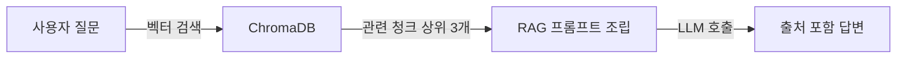

*그림 3-5: RAG의 핵심 흐름 — 전체 문서 대신 관련 청크만 선택하여 LLM에 전달한다*

### 4.1 청킹이 필요한 이유

문서를 통째로 검색하면 정밀도가 낮아집니다. "김철수 사원의 연차" 질문에 대해 5페이지짜리 취업규칙 전체 문서가 검색된다면, LLM에 필요 없는 정보가 많이 포함됩니다.

**청킹(Chunking)** 은 긴 문서를 작은 단위로 분할하는 과정입니다. 300~500자 단위로 나누면 각 청크가 특정 주제에 집중되어 검색 정밀도가 높아집니다. 직원 연차 현황에 관한 청크, 연차 규정에 관한 청크, IT 가이드에 관한 청크가 각각 독립적으로 검색됩니다.

<!-- [GEMINI PROMPT: 03_chunking-concept]
path: assets/CH03/03_chunking-concept.png
A minimalist black and white technical diagram with a strict 16:9 aspect ratio on a solid white background. No shading, no 3D effects, only clean thin line art. Left side shows a large document rectangle labeled "원본 문서 (3페이지)" with a scissors icon cutting it. Right side shows five smaller rectangles labeled "청크 1", "청크 2", "청크 3", "청크 4", "청크 5" each 300 chars. Below right side: cylinder database icon labeled "ChromaDB" with arrow pointing from each chunk. Below the database: magnifying glass icon with arrow back up pointing to "청크 3" highlighted with a dashed border, labeled "질문 관련 청크만 검색". White background, Korean labels, 16:9 aspect ratio.
Style: architecture-infographic
-->

*그림 3-6: 청킹은 긴 문서를 검색 가능한 작은 단위로 분할한다*

### 4.2 실습: 03_rag_preview.py 실행

```bash
python src/03_rag_preview.py
```

스크립트는 청킹 없이 전체 문서를 저장한 경우와 300자 청킹을 적용한 경우를 순서대로 비교합니다. 최초 실행 시 한국어 임베딩 모델(`ko-sroberta-multitask`)이 자동으로 다운로드됩니다.

> **팁: 임베딩 모델 다운로드 시간**
> `ko-sroberta-multitask` 모델은 약 400MB입니다. 최초 실행 시 다운로드에 수 분이 걸릴 수 있습니다. 이후 실행부터는 캐시에서 로드되어 빠르게 시작됩니다.

```
============================================================
[실습 3] RAG 미리보기 — 인메모리 ChromaDB 검색+답변
============================================================

[임베딩 모델] jhgan/ko-sroberta-multitask
[데이터베이스] ChromaDB 인메모리 (실행 종료 시 데이터 소멸)

  [ChromaDB] 컬렉션 'ch03_rag_no_chunk' 생성 중...
  [완료] 4개 문서 → 4개 청크 저장 (청킹 없음(전체 문서))

============================================================
[RAG 실험] 청킹 없음 (전체 문서)
============================================================

[검색된 관련 문서 — 상위 3개]
  [1] 출처: 인사팀 | 유사도: 0.821
      내용 미리보기: 인사팀 직원 연차 현황 (2025년 기준) 김철수 사원: 부서=개발팀...
  [2] 출처: 취업규칙 | 유사도: 0.634
      내용 미리보기: 취업규칙 제15조 — 연차 유급휴가 규정 1. 1년 이상 근속...
  [3] 출처: IT팀 | 유사도: 0.412
      내용 미리보기: IT팀 사내 시스템 사용 가이드 (v2.3) 사내 포털 접속...

[LLM 답변]
----------------------------------------
김철수 사원의 남은 연차는 6일입니다.
[출처: 인사팀 — 직원 연차 현황 2025]
----------------------------------------

  [ChromaDB] 컬렉션 'ch03_rag_chunked' 생성 중...
  [완료] 4개 문서 → 7개 청크 저장 (300자 청킹)

[RAG 실험] 300자 청킹 적용
[검색된 관련 문서 — 상위 3개]
  [1] 출처: 인사팀 | 유사도: 0.943
      내용 미리보기: 인사팀 직원 연차 현황 김철수 사원: 부서=개발팀, 입사일=2021...
```

<!-- [CAPTURE NEEDED: 03_rag-preview-output
  path: assets/CH03/03_rag-preview-output.png
  desc: 03_rag_preview.py 실행 결과. 청킹 없음 vs 300자 청킹 비교. 청킹 적용 시 유사도가 0.821 -> 0.943으로 향상된 터미널 화면
] -->

*그림 3-7: 청킹 적용 시 관련 문서 유사도가 0.821에서 0.943으로 향상된다*

청킹을 적용하자 유사도 점수가 0.821에서 0.943으로 올랐습니다. 전체 문서를 하나의 벡터로 표현했을 때보다 핵심 정보만 담긴 작은 청크가 질문과 더 유사한 벡터를 가지기 때문입니다.

### 4.3 코드 핵심 구조

**다음 코드는 ChromaDB 인메모리 컬렉션을 생성하고 문서를 벡터로 저장합니다.**

```python
def build_chroma_collection(
    client: chromadb.Client,
    collection_name: str,
    documents: list[dict],
    use_chunking: bool = True,
) -> chromadb.Collection:
    ef = embedding_functions.SentenceTransformerEmbeddingFunction(
        model_name=EMBEDDING_MODEL
    )  # ①

    collection = client.create_collection(
        name=collection_name,
        embedding_function=ef,
        metadata={"hnsw:space": "cosine"},
    )  # ②

    for doc in documents:
        chunks = chunk_text(doc["content"]) if use_chunking else [doc["content"]]  # ③
        for i, chunk in enumerate(chunks):
            collection.add(
                documents=[chunk],
                ids=[f"{doc['id']}_chunk_{i}"],
                metadatas=[doc["metadata"]],
            )  # ④
    return collection
```

> ① `ko-sroberta-multitask` 한국어 임베딩 함수를 로드합니다. 최초 실행 시 모델을 다운로드합니다.
> ② 코사인 유사도(`cosine`) 기반의 ChromaDB 컬렉션을 생성합니다.
> ③ `use_chunking=True` 이면 300자 단위로 분할하고, `False` 이면 문서 전체를 하나로 저장합니다.
> ④ 각 청크를 ChromaDB에 추가합니다. `collection.add()`는 자동으로 임베딩을 생성하여 저장합니다.

**실행 결과:**
```
4개 문서 → 7개 청크 저장 (300자 청킹)
유사도: 청킹 없음 0.821 → 청킹 적용 0.943
```

> **동작 요약:** 이 코드는 샘플 사내 문서 4개와 질문(`"김철수 사원의 남은 연차는?"`)을 받아, ChromaDB 인메모리 컬렉션을 생성하고 `ko-sroberta-multitask`로 임베딩한 청크를 저장한 뒤 코사인 유사도 검색으로 상위 3개 청크를 추출하여 LLM 프롬프트를 조립하고, 출처가 포함된 정확한 답변(`"6일, [출처: 인사팀]"`)을 반환합니다.

> 전체 코드: `src/03_rag_preview.py`

> **참고: 인메모리 ChromaDB는 왜 사용하는가**
> 이 챕터의 목적은 RAG의 동작 원리를 "체험"하는 것입니다. 디스크에 데이터를 저장하고 관리하는 복잡성보다 핵심 흐름에 집중하기 위해 실행 종료 시 데이터가 사라지는 인메모리 모드를 사용합니다. CH06에서 ChromaDB를 디스크에 영속화하고 실제 PDF 문서를 인덱싱합니다.

---

## 5. [심화] DeepSeek R1 추론 능력 확인

RAG는 단순한 검색+답변을 넘어 수치 계산이나 데이터 분석과 같은 추론 작업에도 활용할 수 있습니다. DeepSeek R1 모델은 Chain-of-Thought(사고 과정 명시) 방식으로 복잡한 질문에 단계별 계산을 보여줍니다.

### 5.1 실습: 04_rag_reasoning.py 실행

```bash
python src/04_rag_reasoning.py
```

이 스크립트는 2025년 1분기 매출 데이터를 ChromaDB에 저장하고, 계산이 필요한 세 가지 질문에 차례로 답변합니다.

```
============================================================
[실습 4] RAG + 추론 능력 확인 — 매출 데이터 분석
============================================================

[데이터] 2025년 1분기 부서별 월별 매출 기록 7건

--- [추론 질문 1/3] ---

============================================================
[추론 질문 1]
  2025년 1분기 전체 매출 합계는 얼마인가요? 부서별로도 알려주세요.

[검색된 관련 문서 — 상위 5개]
  [1] 요약보고서 | 유사도: 0.961
  [2] 01월 개발팀 | 유사도: 0.832
  [3] 02월 개발팀 | 유사도: 0.821

[LLM 추론 답변]
----------------------------------------
제공된 매출 문서를 기반으로 계산합니다.

1분기 개발팀 합계:
  - 1월: 45,000,000원
  - 2월: 51,000,000원
  - 3월: 63,000,000원
  소계: 159,000,000원

1분기 영업팀 합계:
  - 1월: 32,000,000원
  - 2월: 28,500,000원
  - 3월: 41,000,000원
  소계: 101,500,000원

전체 1분기 합계: 260,500,000원
[출처: 2025년 1분기 매출 요약 보고서]
----------------------------------------
```

<!-- [CAPTURE NEEDED: 03_rag-reasoning-output
  path: assets/CH03/03_rag-reasoning-output.png
  desc: 04_rag_reasoning.py 실행 결과. LLM이 1분기 매출을 부서별로 단계적으로 계산하여 합산하는 Chain-of-Thought 답변 터미널 화면
] -->

*그림 3-8: DeepSeek R1이 매출 데이터를 단계별로 계산하여 합산하는 추론 답변*

단순히 "260,500,000원"이라고 답하는 것이 아니라, 부서별 월별 수치를 하나씩 열거하며 계산 과정을 보여줍니다. 이것이 Chain-of-Thought 추론의 특징입니다. 결과뿐만 아니라 과정을 검증할 수 있어 신뢰도가 높아집니다.

### 5.2 코드 핵심 구조

**다음 코드는 계산이 필요한 질문을 위해 단계별 추론을 요청하는 프롬프트를 구성합니다.**

```python
def build_reasoning_prompt(retrieved_docs: list[dict], question: str) -> str:
    context_parts = []
    for i, doc in enumerate(retrieved_docs, start=1):
        dept = doc["metadata"].get("department", "")        # ①
        month = doc["metadata"].get("month", "")
        category = doc["metadata"].get("category", "")
        label = f"문서 {i}"
        if dept and month:
            label += f" ({month}월 {dept})"
        elif category:
            label += f" ({category})"
        context_parts.append(f"[{label}]\n{doc['content'].strip()}")

    context = "\n\n".join(context_parts)

    return (
        "당신은 사내 매출 데이터를 분석하는 전문 AI 비서입니다.\n"
        "계산이 필요한 경우 단계별로 계산 과정을 명시하십시오.\n"    # ②
        "문서에 없는 정보는 추측하지 말고 '확인 불가'라고 답변하십시오.\n\n"
        f"[매출 관련 문서 (상위 {len(retrieved_docs)}개)]\n{context}\n\n"
        f"[질문]\n{question}\n\n"
        "[답변 (계산 과정 포함)]"                                    # ③
    )
```

> ① 메타데이터에서 부서명과 월 정보를 추출하여 문서 레이블을 구체적으로 표시합니다. LLM이 어떤 문서를 참조했는지 쉽게 추적할 수 있습니다.
> ② "계산 과정을 단계별로 명시하라"는 지시가 Chain-of-Thought 추론을 유도합니다.
> ③ "[답변 (계산 과정 포함)]"을 명시하여 LLM이 풀이 과정을 포함한 답변을 생성하도록 합니다.

**실행 결과:**
```
1분기 개발팀: 45M + 51M + 63M = 159,000,000원
1분기 영업팀: 32M + 28.5M + 41M = 101,500,000원
전체 합계: 260,500,000원 [출처: 요약보고서]
```

> **동작 요약:** 이 코드는 수치 계산이 필요한 질문(`"2025년 1분기 전체 매출 합계는?"`)과 매출 데이터 7건을 받아, ChromaDB 유사도 검색으로 상위 5개 문서를 추출하고 메타데이터 기반 레이블을 생성한 뒤 Chain-of-Thought 프롬프트를 조립하여 LLM 추론을 실행하고, 부서별 계산 과정이 포함된 답변과 출처 문서명을 반환합니다.

> 전체 코드: `src/04_rag_reasoning.py`

> **팁: 추론 질문은 타임아웃을 길게 설정합니다**
> `04_rag_reasoning.py`는 `REQUEST_TIMEOUT = 180`초로 설정되어 있습니다. 계산이 포함된 복잡한 질문은 단순 답변보다 처리 시간이 더 걸립니다. RAM이 16GB 미만이거나 Apple Silicon이 아닌 환경에서는 `deepseek-r1:1.5b` 모델로 전환하십시오.

---

## 6. 정리하며

4단계 실습을 완료했습니다. 각 단계에서 무엇을 배웠는지 비교하며 정리합니다.

### 6.1 4단계 비교 요약표

| 단계 | 방법 | 정확도 | 출처 제시 | 확장 가능성 | 핵심 한계 |
|------|------|--------|---------|-----------|---------|
| Step 1 | LLM 단독 | 낮음 (환각) | 없음 | 높음 | 사내 정보 없음 |
| Step 2 | Context Injection | 높음 | 없음 | 낮음 | 토큰 한계 |
| Step 3 | RAG 미리보기 | 높음 | 있음 | 높음 | 인메모리 (임시) |
| Step 4 | RAG + 추론 | 높음 | 있음 | 높음 | - |

### 6.2 핵심 결론

- **LLM은 학습 데이터 밖을 모릅니다**: 사내 비공개 정보는 파라메트릭 지식에 없습니다. 외부에서 컨텍스트 지식으로 주입해야 합니다.

- **Context Injection은 임시방편입니다**: 문서가 소수일 때는 효과적이지만, 토큰 한계로 인해 문서가 늘어날수록 한계에 부딪힙니다. 실제 사내 시스템의 수백~수천 개 문서를 처리할 수 없습니다.

- **RAG는 "필요한 부분만" 찾아줍니다**: 청킹과 벡터 유사도 검색으로 관련 문서만 선택하여 토큰 제한을 우회합니다. 문서가 아무리 많아도 검색 대상에 추가하기만 하면 됩니다.

- **추론 능력은 검색 이후의 가치를 높입니다**: RAG로 관련 데이터를 찾고, DeepSeek R1의 Chain-of-Thought로 계산과 분석까지 처리할 수 있습니다.

다음 챕터에서는 RAG의 기반이 될 사내 데이터베이스 시스템을 직접 만듭니다. FastAPI와 PostgreSQL로 직원, 휴가, 매출을 관리하는 CRUD 시스템을 구축하며, CH08에서 MCP 도구가 이 DB를 직접 조회하게 됩니다.

---

# 4. FastAPI로 초간단 사내 시스템 만들기

지금까지 완성한 내용을 먼저 정리하겠습니다.

```
Q/A 사내 AI 비서 — 현재 진행 상황

[x] CH02: 개발 환경 설정 (Ollama + PostgreSQL + Python)
[x] CH03: LLM 환각 체험 → Context Injection → RAG 미리보기
[ ] **CH04: FastAPI 기반 사내 CRUD 시스템** ← 지금 여기
[ ] CH05: 사내 문서 수집 및 표준화
[ ] CH06~CH10: VectorDB → RAG → 통합 에이전트 → 튜닝
```

CH02에서 Docker 기반 PostgreSQL 환경을 구축했습니다. 이번 챕터에서는 그 위에 **사내 시스템의 뼈대** 를 세웁니다. 직원 정보, 휴가 잔여량, 매출 데이터를 관리하는 CRUD 시스템과 관리자가 사용할 Admin UI를 구현합니다.

이 챕터가 완성되면 두 가지 중요한 토대가 마련됩니다. 첫째, `employee` · `leave_balance` · `sales` 테이블은 CH08에서 MCP(Model Context Protocol) 도구가 직접 SQL로 조회하는 **정형 데이터 저장소** 가 됩니다. 둘째, 이 챕터에서 만드는 `base.html` 레이아웃은 CH07의 채팅 UI, CH08의 통합 에이전트 UI에서 그대로 계승됩니다.

> **참고: 이 챕터의 특별함**
> CH04에서 만드는 `base.html`과 데이터베이스 스키마는 단순한 실습용 예제가 아닙니다. 이후 챕터에서 기능을 추가할 때마다 그대로 활용됩니다. 지금 이 순간이 Q/A 사내 AI 비서의 **기반을 세우는 순간** 입니다.

---

## 1. FastAPI와 데이터 모델 이해하기

### 1.1 FastAPI를 선택한 이유

파이썬 웹 프레임워크는 Django, Flask, FastAPI 등 여러 선택지가 있습니다. 이 책이 FastAPI(0.115+)를 선택한 이유는 네 가지입니다.

**첫째, 비동기(Async) 처리를 기본 지원합니다.** LangChain과 같은 AI 라이브러리는 LLM 호출 시 수 초에서 수십 초의 응답 대기가 발생합니다. FastAPI의 `async def` 기반 엔드포인트는 이 대기 시간 동안 다른 요청을 처리할 수 있어 AI 서버에 특히 적합합니다.

**둘째, Swagger UI를 자동으로 생성합니다.** 코드에 Pydantic 스키마를 정의하는 것만으로 `http://localhost:8000/docs` 에 인터랙티브 API 문서가 자동으로 만들어집니다. CH08에서 MCP 도구를 테스트할 때 Swagger가 큰 도움이 됩니다.

**셋째, Pydantic 데이터 검증이 내장되어 있습니다.** 잘못된 형식의 요청이 들어오면 FastAPI가 자동으로 422 오류를 반환합니다. 별도의 유효성 검증 코드를 작성할 필요가 없습니다.

**넷째, LangChain과의 호환성이 뛰어납니다.** LangChain의 `AsyncCallbackHandler`, `astream` 등 비동기 API가 FastAPI의 비동기 엔드포인트와 자연스럽게 결합됩니다.

> **참고: PostgreSQL을 선택한 이유**
> 이 책은 SQLite가 아닌 PostgreSQL(16+)을 사용합니다. CH08에서 MCP 도구는 표준 SQL로 DB를 직접 조회합니다. 실무에서 가장 보편적으로 사용하는 PostgreSQL을 대상으로 설계해야 MCP 패턴을 실제 업무에 바로 적용할 수 있기 때문입니다.

### 1.2 3테이블 데이터 모델

Q/A 사내 AI 시스템은 세 개의 테이블로 구성됩니다. 이 구조는 CH08에서 "김철수 사원의 남은 연차는?"처럼 AI 에이전트가 정형 데이터를 조회할 때의 현실적인 시나리오를 제공합니다.

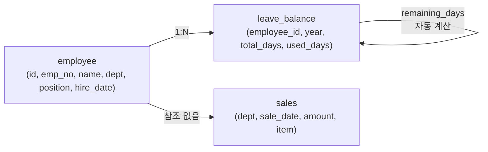

*그림 4-1: Q/A 사내 AI 3테이블 관계도 (ERD)*

각 테이블의 역할을 정리하면 다음과 같습니다.

| 테이블 | 역할 | CH08 MCP 도구 |
|--------|------|---------------|
| `employee` | 직원 기본 정보 (사번, 이름, 부서, 직급, 입사일) | `list_employees` 도구 |
| `leave_balance` | 연차 잔여량 (총 연차 - 사용 연차 = 잔여 연차 자동 계산) | `leave_balance` 도구 |
| `sales` | 부서별 매출 기록 (날짜, 금액, 항목) | `sales_sum` 도구 |

`leave_balance` 테이블의 `remaining_days` 컬럼은 PostgreSQL의 **생성 컬럼(Generated Column)** 으로 구현되었습니다. `total_days - used_days` 수식이 DB 엔진 수준에서 자동 계산되므로, 애플리케이션 코드에서 별도로 계산할 필요가 없습니다.

### 1.3 Jinja2 Admin UI 설계 원칙

**Jinja2(3.1+)** 는 파이썬 서버에서 HTML을 직접 렌더링하는 템플릿 엔진입니다. React나 Vue 같은 별도 프론트엔드 프레임워크 없이 간결하게 Admin UI를 구현할 수 있는 것이 장점입니다.

이 챕터에서 만드는 `templates/base.html` 은 **공유 레이아웃** 으로 설계됩니다. 좌측 240px 사이드바와 메인 콘텐츠 영역으로 구성된 이 레이아웃은 CH07(채팅 UI), CH08(통합 에이전트 UI)에서 그대로 계승합니다.

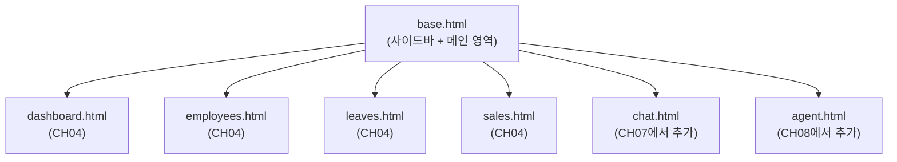

*그림 4-2: base.html을 중심으로 한 템플릿 계승 구조*

---

## 2. 프로젝트 클론 및 실행

이 챕터의 예제 코드를 클론하겠습니다.

```bash
git clone https://github.com/connect-hr/CH04_FastAPI_기본_시스템
cd CH04_FastAPI_기본_시스템
```

환경 변수를 설정합니다. `.env.example` 파일의 기본값은 `docker-compose.yml` 의 PostgreSQL 설정과 동일하므로 별도 수정이 필요하지 않습니다.

```bash
cp .env.example .env
```

**PostgreSQL 컨테이너를 먼저 실행합니다.** 이 단계가 완료되어야 FastAPI 서버가 DB에 연결할 수 있습니다.

```bash
docker-compose up -d
```

컨테이너 상태를 확인합니다.

```bash
docker-compose ps
```

아래와 같이 `running (healthy)` 상태가 표시되면 DB 준비가 완료된 것입니다.

```
NAME              STATUS
metacoding_db     running (healthy)
```

> **주의: docker-compose up 이전에 FastAPI를 실행하면 안 됩니다**
> PostgreSQL 컨테이너가 시작되지 않은 상태에서 FastAPI 서버를 실행하면 `RuntimeError: DB 연결 실패` 가 발생합니다. 반드시 `docker-compose ps` 로 `healthy` 상태를 확인한 후 다음 단계로 진행하십시오.

Python 가상환경을 생성하고 의존성을 설치합니다.

```bash
python3 -m venv venv
source venv/bin/activate          # Windows: venv\Scripts\activate
pip install -r requirements.txt
```

FastAPI 서버를 실행합니다.

```bash
python -m uvicorn app.main:app --reload --host 0.0.0.0 --port 8000
```

터미널에 아래와 같은 출력이 나타나면 서버가 정상 시작된 것입니다.

```
=======================================================
  Q/A 사내 AI 사내 시스템 (CH04)
  Admin UI : http://localhost:8000/admin/dashboard
  API 문서 : http://localhost:8000/docs
=======================================================
INFO:     Uvicorn running on http://0.0.0.0:8000 (Press CTRL+C to quit)
INFO:     Application startup complete.
```

<!-- [CAPTURE NEEDED: 04_server-start
  path: assets/CH04/04_server-start.png
  desc: uvicorn 서버 시작 후 터미널 전체 화면. Q/A 사내 AI 배너와 INFO: Application startup complete. 메시지가 보이는 상태
] -->

*그림 4-3: uvicorn 서버 정상 시작 화면*

브라우저에서 `http://localhost:8000` 으로 접속하면 자동으로 Admin 대시보드 페이지로 이동합니다.

---

## 3. 프로젝트 구조 파악

`git clone` 으로 받은 예제 코드의 구조를 살펴보겠습니다.

```
CH04_FastAPI_기본_시스템/
├── requirements.txt
├── .env.example
├── docker-compose.yml          # PostgreSQL 16 컨테이너
├── data/
│   └── schema.sql              # DDL + 시드 데이터 (직원 5명, 매출 10건)
├── app/
│   ├── main.py                 # FastAPI 앱 진입점 + 라우터 등록
│   ├── database.py             # psycopg2 연결 컨텍스트 매니저
│   ├── models.py               # 도메인 dataclass (Employee, LeaveBalance, Sale)
│   ├── schemas.py              # Pydantic 요청/응답 스키마
│   ├── crud.py                 # DB CRUD 함수
│   ├── views.py                # Jinja2 Admin UI 라우터 (/admin/*)
│   └── api.py                  # REST JSON API 라우터 (/api/*)
├── templates/
│   ├── base.html               # 공통 레이아웃 (사이드바 + 메인)
│   ├── dashboard.html          # 통계 카드 + 최근 매출
│   ├── employees.html          # 직원 CRUD UI
│   ├── leaves.html             # 휴가 관리 UI
│   └── sales.html              # 매출 관리 UI
└── static/
    └── css/
        └── style.css           # Inter 폰트, 검정/흰색 + 금색 디자인
```

이 구조에는 명확한 설계 원칙이 있습니다. `app/` 폴더는 Python 로직만 담고, `templates/` 폴더는 HTML만 담습니다. 두 관심사를 분리함으로써 CH07에서 채팅 UI를 추가할 때 `templates/chat.html` 파일 하나만 추가하면 됩니다.

---

## 4. 핵심 코드 해설

### 4.1 앱 진입점 — `app/main.py`

**다음 코드는 FastAPI 앱을 초기화하고 두 개의 라우터를 등록합니다.**

```python
# app/main.py

app = FastAPI(                                                  # ①
    title="Q/A 사내 AI 사내 시스템",
    description="CH04 FastAPI + PostgreSQL CRUD 시스템",
    version="1.0.0",
)

app.mount("/static", StaticFiles(directory="static"), name="static")  # ②

from app import views, api                                     # ③
app.include_router(views.router)                               # ④ /admin/*
app.include_router(api.router)                                 # ⑤ /api/*

@app.get("/", include_in_schema=False)
def root() -> RedirectResponse:
    return RedirectResponse(url="/admin/dashboard")            # ⑥
```

> ① `title`, `description`, `version` 을 지정하면 Swagger UI(`/docs`)의 헤더에 자동으로 표시됩니다.
> ② `static/css/style.css` 를 `/static/css/style.css` URL로 서비스합니다.
> ③ 순환 임포트를 방지하기 위해 앱 생성 이후에 라우터를 임포트합니다.
> ④ `views.py` 의 라우터는 `/admin/*` 경로로 Jinja2 HTML 페이지를 렌더링합니다.
> ⑤ `api.py` 의 라우터는 `/api/*` 경로로 JSON 응답을 반환합니다.
> ⑥ 루트 URL(`/`)에 접속하면 Admin 대시보드로 자동 리다이렉트합니다.

> **동작 요약:** 이 코드는 `.env` 파일의 환경 변수(`FASTAPI_HOST`, `FASTAPI_PORT`)와 시작 명령을 받아, FastAPI 앱 객체를 생성한 뒤 정적 파일을 마운트하고 Admin UI 라우터(`views`)와 REST API 라우터(`api`)를 등록합니다. 최종적으로 `http://localhost:8000` 에서 응답하는 웹 서버가 구동되며, `/admin/*` 경로는 HTML 페이지를, `/api/*` 경로는 JSON 응답을, `/docs` 경로는 Swagger UI를 반환합니다.

> **전체 코드**: `app/main.py`

### 4.2 데이터베이스 스키마 — `data/schema.sql`

Docker Compose가 처음 실행될 때 이 파일이 자동으로 PostgreSQL에 적용됩니다. 핵심 설계 포인트 두 가지를 확인하십시오.

**다음 SQL은 `leave_balance` 테이블의 잔여 연차를 자동 계산하는 생성 컬럼을 정의합니다.**

```sql
-- data/schema.sql (핵심 발췌)

CREATE TABLE leave_balance (
    id              SERIAL  PRIMARY KEY,
    employee_id     INTEGER NOT NULL REFERENCES employee(id) ON DELETE CASCADE,  -- ①
    year            INTEGER NOT NULL,
    total_days      NUMERIC(4,1) NOT NULL,
    used_days       NUMERIC(4,1) NOT NULL DEFAULT 0,
    remaining_days  NUMERIC(4,1) GENERATED ALWAYS AS (total_days - used_days) STORED,  -- ②
    UNIQUE (employee_id, year)                                                          -- ③
);
```

> ① `ON DELETE CASCADE` 로 직원이 삭제되면 해당 연차 레코드도 자동으로 함께 삭제됩니다.
> ② `GENERATED ALWAYS AS ... STORED` 는 PostgreSQL 12+에서 지원하는 생성 컬럼입니다. `used_days` 를 변경하면 `remaining_days` 가 DB 엔진이 자동으로 재계산합니다. 애플리케이션 코드에서 계산할 필요가 없습니다.
> ③ 동일 직원이 같은 연도에 중복 레코드를 가질 수 없도록 복합 유니크 제약을 설정합니다.

테이블 생성 이후에는 시드 데이터도 자동으로 삽입됩니다. 직원 5명(`EMP001`~`EMP005`), 연차 레코드 5건(2025년), 매출 10건(2025년 1~5월)이 포함됩니다.

**실행 결과:**

```
metacoding=# SELECT name, dept, position FROM employee;
  name  |   dept   | position
--------+----------+----------
 김민준  | 개발팀   | 과장
 이서연  | 영업팀   | 대리
 박지호  | 인사팀   | 사원
 최유나  | 마케팅팀 | 차장
 정도현  | 개발팀   | 사원
(5 rows)
```

> **동작 요약:** 이 SQL은 `docker-compose up -d` 명령을 통해 실행되며, `docker-compose.yml`의 `volumes` 설정이 `data/schema.sql`을 `/docker-entrypoint-initdb.d/`에 마운트합니다. PostgreSQL 컨테이너 초기화 시 해당 스크립트가 자동 실행되어 3개 테이블을 생성하고 시드 데이터를 삽입합니다. 최종적으로 `metacoding` 데이터베이스에 직원 5명, 연차 5건, 매출 10건이 준비됩니다.

> **전체 코드**: `data/schema.sql`

### 4.3 Pydantic 스키마 — `app/schemas.py`

Pydantic 스키마는 HTTP 요청과 응답의 데이터 형식을 정의합니다. **Request 스키마** 는 클라이언트가 보내는 데이터를 검증하고, **Response 스키마** 는 서버가 반환하는 데이터 구조를 보장합니다.

**다음 코드는 직원 등록 요청과 응답 스키마를 정의합니다.**

```python
# app/schemas.py (핵심 발췌)

class EmployeeCreate(BaseModel):
    """직원 등록 요청 스키마."""
    emp_no:    str  = Field(..., description="사번",     max_length=10)  # ①
    name:      str  = Field(..., description="직원 이름", max_length=50)
    dept:      str  = Field(..., description="소속 부서", max_length=50)
    position:  str  = Field(..., description="직급",     max_length=50)
    hire_date: date = Field(..., description="입사일 (YYYY-MM-DD)")       # ②

class EmployeeUpdate(BaseModel):
    """직원 수정 요청 스키마 (모든 필드 선택)."""
    name:      Optional[str]  = Field(None, description="직원 이름")     # ③
    dept:      Optional[str]  = Field(None, ...)
    position:  Optional[str]  = Field(None, ...)
    hire_date: Optional[date] = Field(None, ...)
```

> ① `Field(..., max_length=10)` 에서 `...` (Ellipsis)는 필수 필드를 의미합니다. 10자 초과 입력 시 FastAPI가 자동으로 422 Unprocessable Entity를 반환합니다.
> ② `date` 타입을 지정하면 문자열 `"2025-01-15"` 가 자동으로 `datetime.date` 객체로 변환됩니다.
> ③ `EmployeeUpdate` 는 모든 필드가 `Optional` 입니다. 수정하려는 필드만 전송하면 됩니다. 이를 **부분 수정(Partial Update)** 패턴이라고 합니다.

> **팁: Swagger UI에서 스키마를 확인하십시오**
> `http://localhost:8000/docs` 에 접속하면 `EmployeeCreate`, `LeaveBalanceCreate` 등 모든 스키마가 JSON Schema 형식으로 자동 문서화됩니다. Pydantic 코드를 별도로 문서화할 필요가 없습니다.

> **동작 요약:** 이 코드는 HTTP 요청 Body(JSON 형식) 또는 쿼리 파라미터를 받아, Pydantic이 타입 검증을 수행하여 형식 오류 시 422 응답을 자동 반환하고 검증 통과 시 Python 객체로 변환합니다. 최종적으로 타입이 보장된 Python 객체가 FastAPI 엔드포인트 함수의 인자로 전달됩니다.

> **전체 코드**: `app/schemas.py`

### 4.4 CRUD 함수 — `app/crud.py`

CRUD(Create, Read, Update, Delete) 함수는 데이터베이스 조작 로직을 담당합니다. 모든 함수가 psycopg2 연결 객체를 첫 번째 인자로 받는 구조는 **트랜잭션 경계를 호출자가 제어** 할 수 있게 합니다.

**다음 코드는 직원 목록을 이름과 부서로 동적 검색하는 함수입니다.**

```python
# app/crud.py — get_all_employees (핵심 발췌)

def get_all_employees(
    conn: psycopg2.extensions.connection,
    name_filter: Optional[str] = None,
    dept_filter: Optional[str] = None,
) -> list[Employee]:
    conditions: list[str] = []
    params: list[str] = []

    if name_filter:
        conditions.append("name ILIKE %s")     # ①
        params.append(f"%{name_filter}%")
    if dept_filter:
        conditions.append("dept ILIKE %s")     # ②
        params.append(f"%{dept_filter}%")

    where_clause = ("WHERE " + " AND ".join(conditions)) if conditions else ""
    sql = f"SELECT ... FROM employee {where_clause} ORDER BY id"

    with conn.cursor() as cur:
        cur.execute(sql, params)               # ③
        rows = cur.fetchall()                  # ④

    return [_row_to_employee(r) for r in rows]
```

> ① `ILIKE` 는 대소문자를 구분하지 않는 LIKE 검색입니다. `%검색어%` 패턴으로 부분 일치 검색을 지원합니다.
> ② 조건이 없으면 `where_clause` 가 빈 문자열이 되어 전체 목록을 조회합니다.
> ③ `cur.execute(sql, params)` 의 파라미터 바인딩 방식이 SQL 인젝션을 방어합니다. f-string 직접 삽입은 금지입니다.
> ④ `RealDictCursor` 를 사용하므로 결과가 `{"id": 1, "name": "김민준", ...}` 형식의 딕셔너리로 반환됩니다.

**실행 결과 (부서 필터 "개발팀" 적용 시):**

```
[Employee(id=1, emp_no='EMP001', name='김민준', dept='개발팀', ...),
 Employee(id=5, emp_no='EMP005', name='정도현', dept='개발팀', ...)]
```

연차 사용 등록 함수(`update_leave_usage`)에는 잔여 연차가 부족할 때 예외를 발생시키는 비즈니스 로직이 포함되어 있습니다.

**다음 코드는 연차 사용량을 누적 등록하고 잔여량을 자동 검증합니다.**

```python
# app/crud.py — update_leave_usage (핵심 발췌)

def update_leave_usage(conn, employee_id: int, days: float, year: int = 2025):
    check_sql = "SELECT remaining_days FROM leave_balance WHERE employee_id = %s AND year = %s"

    with conn.cursor() as cur:
        cur.execute(check_sql, (employee_id, year))         # ①
        check_row = cur.fetchone()

        if check_row["remaining_days"] < days:               # ②
            raise ValueError(
                f"잔여 연차({check_row['remaining_days']}일)가 부족합니다."
            )

        update_sql = """
            UPDATE leave_balance SET used_days = used_days + %s
            WHERE employee_id = %s AND year = %s
            RETURNING id, employee_id, year, total_days, used_days, remaining_days
        """
        cur.execute(update_sql, (days, employee_id, year))  # ③
        row = cur.fetchone()

    return _row_to_leave(row) if row else None
```

> ① 먼저 현재 잔여 연차를 조회하여 사용 가능 여부를 확인합니다.
> ② 잔여 연차가 부족하면 `ValueError` 를 발생시킵니다. 이 예외는 API 레이어에서 HTTP 400으로 변환됩니다.
> ③ `RETURNING` 절을 활용하여 UPDATE 결과를 별도의 SELECT 없이 즉시 반환받습니다.

> **동작 요약:** 이 코드는 psycopg2 연결 객체와 검색 조건(이름 필터, 부서 필터, 날짜 범위 등)을 받아, 동적 WHERE 절을 구성하고 파라미터 바인딩으로 SQL 인젝션을 방어하며 `RealDictCursor`로 쿼리를 실행합니다. 최종적으로 도메인 객체(`Employee`, `LeaveBalance`, `Sale`) 리스트 또는 단건 객체가 반환됩니다.

> **전체 코드**: `app/crud.py`

### 4.5 REST API — `app/api.py`

`api.py` 는 `/api/*` 경로에서 JSON을 주고받는 엔드포인트를 정의합니다. Pydantic 스키마와 CRUD 함수를 연결하는 역할을 합니다.

**다음 코드는 직원을 등록하는 POST 엔드포인트입니다.**

```python
# app/api.py — 직원 등록 API (핵심 발췌)

@router.post("/employees", response_model=EmployeeResponse, status_code=201)  # ①
def api_create_employee(body: EmployeeCreate) -> EmployeeResponse:
    try:
        with get_connection() as conn:
            emp = crud.create_employee(                       # ②
                conn, body.emp_no, body.name,
                body.dept, body.position, body.hire_date,
            )
    except psycopg2.errors.UniqueViolation:
        raise HTTPException(status_code=409,                  # ③
            detail=f"사번 '{body.emp_no}'이(가) 이미 존재합니다.")

    return EmployeeResponse(                                  # ④
        id=emp.id, emp_no=emp.emp_no, name=emp.name,
        dept=emp.dept, position=emp.position, hire_date=emp.hire_date,
    )
```

> ① `response_model=EmployeeResponse` 를 지정하면 Swagger에 응답 스키마가 자동 표시됩니다. `status_code=201` 은 리소스 생성 시 표준 HTTP 상태 코드입니다.
> ② Pydantic이 검증한 `body` 객체에서 필드를 꺼내 CRUD 함수에 전달합니다.
> ③ 중복 사번 등록 시 PostgreSQL 에서 `UniqueViolation` 예외가 발생합니다. 이를 잡아 HTTP 409(Conflict)로 변환합니다.
> ④ `Employee` 도메인 객체를 `EmployeeResponse` Pydantic 객체로 변환하여 반환합니다.

<!-- [CAPTURE NEEDED: 04_swagger-ui
  path: assets/CH04/04_swagger-ui.png
  desc: 브라우저에서 http://localhost:8000/docs 접속한 Swagger UI 화면. GET/POST/PATCH/DELETE 엔드포인트 카드가 표시된 상태.
] -->

*그림 4-4: FastAPI가 자동 생성하는 Swagger UI — 코드 작성만으로 API 문서가 완성됩니다*

> **동작 요약:** 이 코드는 HTTP 요청(POST JSON Body, GET 쿼리 파라미터, PATCH Body, DELETE 경로 파라미터)을 받아, Pydantic 자동 검증을 거친 뒤 `get_connection()` 컨텍스트로 DB에 연결하고 CRUD 함수를 실행하며 예외를 HTTP 상태 코드로 변환합니다. 최종적으로 Pydantic `response_model`에 맞는 JSON 응답(200/201/204/400/404/409/503)이 반환됩니다.

> **전체 코드**: `app/api.py`

### 4.6 Admin UI — `app/views.py` 와 Jinja2 템플릿

`views.py` 는 브라우저에서 접근하는 Admin UI 페이지를 렌더링합니다. DB에서 데이터를 조회한 후 Jinja2 템플릿에 컨텍스트를 전달하는 구조입니다.

**다음 코드는 대시보드 페이지를 렌더링하는 뷰 함수입니다.**

```python
# app/views.py — view_dashboard (핵심 발췌)

@router.get("/dashboard", response_class=HTMLResponse)
def view_dashboard(request: Request) -> HTMLResponse:
    with get_connection() as conn:
        stats = crud.get_dashboard_stats(conn)       # ①
        recent_sales = crud.get_recent_sales(conn, 5)  # ②

    return templates.TemplateResponse(               # ③
        "dashboard.html",
        {
            "request": request,
            "active_page": "dashboard",              # ④
            **stats,
            "recent_sales": [
                {"dept": s.dept, "amount": f"{s.amount:,}원", ...}
                for s in recent_sales
            ],
        },
    )
```

> ① `get_dashboard_stats()` 는 직원 수, 연차 건수, 매출 건수, 매출 합계를 한 번의 DB 연결로 조회합니다.
> ② 최근 매출 5건을 별도로 조회하여 대시보드 하단 목록에 표시합니다.
> ③ `templates.TemplateResponse()` 는 `dashboard.html` 템플릿에 컨텍스트 딕셔너리를 전달하고 HTML을 생성합니다.
> ④ `active_page` 값을 전달하면 `base.html` 의 사이드바에서 현재 메뉴를 강조 표시합니다. CH07, CH08에서 새 페이지를 추가할 때도 동일한 방식을 사용합니다.

> **동작 요약:** 이 코드는 Jinja2 템플릿 컨텍스트 딕셔너리(DB 조회 결과, `request` 객체, `active_page` 등)를 받아, Jinja2 엔진이 템플릿 파일을 로드하고 `{{ variable }}` 치환과 ``, `` 블록 처리를 수행합니다. 최종적으로 완성된 HTML 문자열을 담은 HTTP 응답이 반환되어 브라우저에서 즉시 렌더링됩니다.

<!-- [CAPTURE NEEDED: 04_admin-dashboard
  path: assets/CH04/04_admin-dashboard.png
  desc: 브라우저에서 http://localhost:8000/admin/dashboard 접속 시 표시되는 Admin 대시보드 화면. 직원 수, 연차 건수, 매출 통계 카드와 최근 매출 목록이 보이는 전체 화면.
] -->

*그림 4-5: Q/A 사내 AI Admin 대시보드 — 직원/연차/매출 통계가 한눈에 표시됩니다*

> **전체 코드**: `app/views.py`, `templates/`

---

## 5. API 동작 확인

서버가 실행 중인 상태에서 Swagger UI로 API를 테스트합니다.

브라우저에서 `http://localhost:8000/docs` 로 접속합니다.

```
확인 가능한 주요 엔드포인트:
────────────────────────────────────────
직원 API
  GET    /api/employees              직원 전체 조회
  POST   /api/employees              직원 등록
  GET    /api/employees/{id}         직원 단건 조회
  PATCH  /api/employees/{id}         직원 수정
  DELETE /api/employees/{id}         직원 삭제

연차 API
  GET    /api/leaves                 연차 전체 조회
  POST   /api/leaves                 연차 생성
  POST   /api/leaves/usage           연차 사용 등록
  PATCH  /api/leaves/{id}            연차 수정

매출 API
  GET    /api/sales                  매출 전체 조회
  POST   /api/sales                  매출 등록
  GET    /api/sales/dept-summary     부서별 매출 집계
────────────────────────────────────────
```

직원 전체 조회 API를 테스트합니다. Swagger에서 `GET /api/employees` → **Try it out** → **Execute** 를 클릭합니다.

```json
[
  {
    "id": 1,
    "emp_no": "EMP001",
    "name": "김민준",
    "dept": "개발팀",
    "position": "과장",
    "hire_date": "2019-03-02"
  },
  ...
]
```

연차 사용 등록 API도 테스트합니다. `POST /api/leaves/usage` 에 아래 Body를 입력합니다.

```json
{
  "employee_id": 1,
  "days": 2.0
}
```

**실행 결과 — 잔여 연차가 10일에서 8일로 줄어들었음을 확인합니다.**

```json
{
  "id": 1,
  "employee_id": 1,
  "year": 2025,
  "total_days": 15.0,
  "used_days": 7.0,
  "remaining_days": 8.0
}
```

> **팁: Admin UI에서도 동일한 작업을 수행할 수 있습니다**
> `http://localhost:8000/admin/leaves` 에서 GUI 형태로 연차 사용 등록, 직원 등록/수정/삭제를 수행할 수 있습니다. Swagger는 API를 직접 테스트하는 용도, Admin UI는 데이터를 시각적으로 관리하는 용도로 각각 활용하십시오.

<!-- [CAPTURE NEEDED: 04_employees-ui
  path: assets/CH04/04_employees-ui.png
  desc: http://localhost:8000/admin/employees 직원 관리 페이지. 직원 목록 테이블과 이름/부서 검색 필터, 등록 버튼이 보이는 전체 화면.
] -->

*그림 4-6: 직원 관리 Admin UI — 조회, 등록, 수정, 삭제를 GUI로 수행합니다*

---

## 6. base.html — CH07과 CH08이 계승하는 레이아웃

이 챕터에서 가장 중요한 파일 중 하나는 `templates/base.html` 입니다. 이 파일이 이후 챕터에서 어떻게 계승되는지 이해해야 합니다.

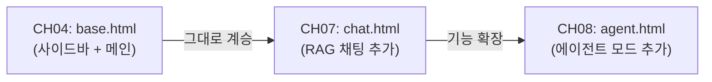

*그림 4-7: base.html 계승 흐름*

`base.html` 은 `` 를 중심으로 구성됩니다. 각 페이지(`dashboard.html`, `employees.html` 등)는 `` 선언으로 이 레이아웃을 상속받아 자신의 콘텐츠만 정의합니다.

CH07에서 `chat.html` 을 추가할 때는 다음 두 가지만 추가합니다.

1. `templates/chat.html` 파일 작성 (`` + 채팅 UI HTML)
2. `views.py` 에 `/admin/chat` 라우터 함수 추가

`base.html` 파일 자체는 수정하지 않아도 됩니다. 이것이 **공유 레이아웃 설계의 강점** 입니다.

> **주의: base.html의 사이드바 구조는 수정하지 마십시오**
> CH07과 CH08에서 `base.html` 을 그대로 계승합니다. 이 챕터에서 사이드바나 전역 CSS를 임의로 변경하면 이후 챕터에서 UI가 깨질 수 있습니다. 기능 추가는 `` 영역 안에서만 수행하십시오.

---

## 7. 정리하며

CH04에서 완성한 내용을 정리합니다.

```
Q/A 사내 AI 비서 — 현재 진행 상황

[x] CH02: 개발 환경 설정 (Ollama + PostgreSQL + Python)
[x] CH03: LLM 환각 체험 → Context Injection → RAG 미리보기
[x] CH04: FastAPI 기반 사내 CRUD 시스템 — 완료
[ ] CH05: 사내 문서 수집 및 표준화
[ ] CH06~CH10: VectorDB → RAG → 통합 에이전트 → 튜닝
```

- **FastAPI는 AI 서버에 최적화되어 있습니다**: 비동기 처리, 자동 Swagger 문서, Pydantic 검증이 LangChain과 자연스럽게 결합됩니다. CH08에서 LLM 호출 엔드포인트를 추가할 때 `async def` 만 선언하면 충분합니다.

- **`base.html`은 공유 자산입니다**: 이 챕터에서 만든 사이드바 + 메인 레이아웃을 CH07의 채팅 UI, CH08의 통합 에이전트 UI가 계승합니다. 새 페이지를 추가할 때마다 `` 한 줄로 전체 레이아웃을 재사용합니다.

- **3테이블 구조가 CH08 MCP의 기반입니다**: `employee`, `leave_balance`, `sales` 테이블은 CH08에서 MCP 도구(`leave_balance`, `sales_sum`, `list_employees`)가 SQL로 직접 조회하는 대상이 됩니다. "김철수 사원의 남은 연차는?" 같은 정형 질문이 처리되는 데이터 저장소입니다.

- **CRUD → MCP 도구로 발전합니다**: 이 챕터의 `crud.py` 함수들은 CH08에서 LangChain `@tool` 데코레이터로 감싸져 MCP 도구로 변환됩니다. 지금 작성한 비즈니스 로직이 그대로 재사용됩니다.

**다음 챕터**에서는 이 시스템에 연결할 사내 문서를 수집하고 표준화하는 파이프라인을 만듭니다. "Garbage In, Garbage Out" — 정제되지 않은 문서는 RAG 품질을 직접 떨어뜨립니다. CH05에서는 PDF, DOCX, XLSX 파일의 파일명 규칙과 메타데이터 표준을 정립하고, `validator.py` 검증 도구로 품질을 확인합니다.

---

# 5. 사내 문서 수집 전략과 문서 표준 만들기

지금까지 구축한 내용을 돌아보겠습니다.

```
Q/A 사내 AI 비서 — 진행 현황

[x] CH02: 개발 환경 설정 (verify_env.py PASS)
[x] CH03: LLM 환각 체험 및 RAG 필요성 확인
[x] CH04: FastAPI + PostgreSQL 기반 사내 시스템 구축 (base.html + 3테이블 DB)
[ ] CH05: 사내 문서 수집 표준화   ← 이번 챕터
[ ] CH06–CH10: VectorDB, RAG Q&A, 통합 에이전트, 튜닝
```

CH04에서 직원, 휴가, 매출 데이터를 담은 사내 시스템을 구축했습니다. 이번 챕터에서는 AI 비서가 답변할 비정형 지식의 원천인 **사내 문서** 를 체계적으로 수집하고 표준화하는 파이프라인을 만듭니다. 이 작업이 완료되면 CH06에서 곧바로 이 문서들을 VectorDB에 색인할 수 있습니다.

> **이번 챕터의 핵심 질문**
> "Garbage In, Garbage Out" — `validator.py`를 실행하여 사내 문서 세트의 검증이 완료되는가?

---

## 1. 어떤 문서를 넣을 것인가

### 1.1. RAG의 지식 원천 — 사내 비정형 문서

CH03에서 LLM이 환각을 일으키는 근본 이유를 확인했습니다. LLM의 학습 데이터에는 사내 비공개 정보가 포함되지 않습니다. **"신입사원 온보딩 절차가 어떻게 되나요?"** 라는 질문에 LLM이 그럴듯한 답변을 내놓더라도, 그것이 우리 회사의 실제 절차와 일치할 가능성은 거의 없습니다.

RAG는 이 문제를 문서 검색으로 해결합니다. LLM이 답변하기 전에 사내 문서에서 관련 내용을 찾아 컨텍스트로 주입하는 방식입니다. 그런데 여기서 중요한 사실이 있습니다. **RAG의 품질은 입력 문서의 품질에 직접 비례합니다.** 파일명이 뒤죽박죽이고, 메타데이터가 없으며, 지원하지 않는 형식의 파일이 섞여 있다면, 검색 결과도 뒤죽박죽이 됩니다.

이것이 "Garbage In, Garbage Out" 원칙입니다. 문서 수집 단계에서 표준을 정립하지 않으면, 이후의 모든 과정(파싱, 임베딩, 검색)에서 그 대가를 치릅니다.

### 1.2. 교재용 문서 세트 소개

이 책에서 사용하는 문서 세트는 실제 사내 업무에서 자주 조회되는 유형을 모사합니다. 아래 7개 문서가 Q/A 사내 AI 비서의 비정형 지식 원천이 됩니다.

| 파일명 | 부서 | 형식 | 성격 |
|--------|------|------|------|
| `HR_취업규칙_v1.0.pdf` | 인사 | PDF | 텍스트형 규정 문서 |
| `HR_정보보안서약서.pdf` | 인사 | PDF | 서명 양식 포함 |
| `SEC_보안규정_v1.0.docx` | 보안 | DOCX | 구조화된 워드 문서 |
| `OPS_신규서비스_런칭전략.pdf` | 운영 | PDF | 전략 기획 문서 |
| `FIN_부서별_예산기안서.xlsx` | 재무 | XLSX | 표 형식 데이터 |
| `FIN_2025_상반기_매출현황.xlsx` | 재무 | XLSX | 시계열 수치 데이터 |

이 문서들을 굳이 PDF, DOCX, XLSX 혼합으로 구성한 이유가 있습니다. 형식마다 파싱 난이도가 다르고, RAG 파이프라인에서 처리 방식도 달라집니다. 실무에서도 사내 문서는 결코 단일 형식으로 통일되어 있지 않습니다. 형식별 처리 차이를 직접 체감하는 것이 이 챕터의 핵심 학습 목표 중 하나입니다.

> **참고: 문서 선정 기준**
> 실무에서 RAG에 투입할 문서를 선정할 때는 두 가지 기준을 우선 적용하십시오.
> 첫째, **자주 질문받는 내용을 담은 문서** (취업규칙, 복지 안내, 온보딩 가이드 등)
> 둘째, **정기적으로 갱신되는 문서** (버전 관리가 필요한 규정, 정책 문서 등)
> 반면 개인 정보가 포함된 문서나 기밀 등급이 높은 문서는 RAG 대상에서 제외하는 것이 바람직합니다.

---

## 2. 문서 형식 지원 범위

### 2.1. 세 가지 형식과 파싱 난이도

사내 문서에서 가장 흔히 마주치는 세 가지 형식의 특성을 비교해 보겠습니다.

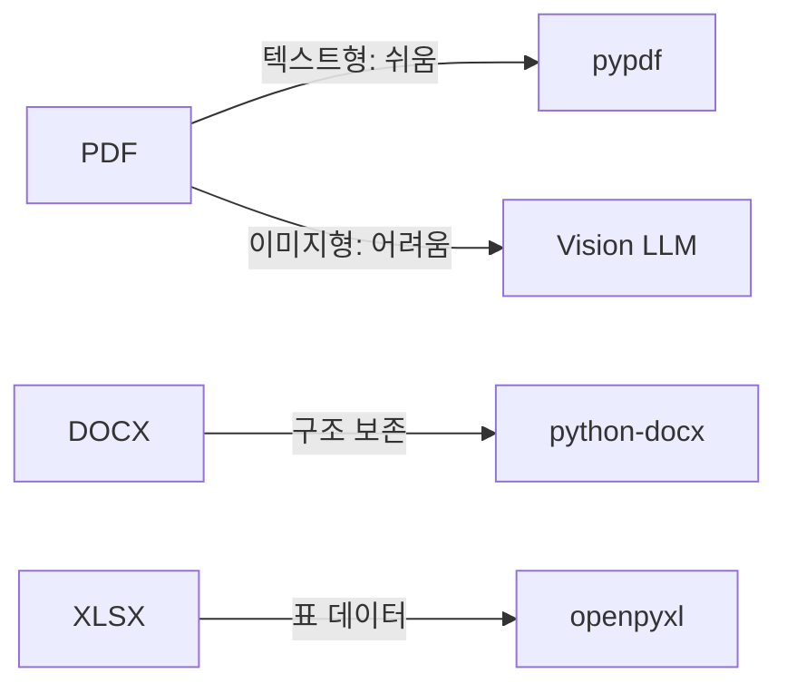

*그림 5-1: 문서 형식별 파싱 도구와 난이도*

**PDF** 는 가장 흔하지만 파싱 난이도가 형식 내에서 크게 갈립니다. 워드 프로세서나 PDF 생성 도구로 만든 **텍스트형 PDF** 는 `pypdf` 라이브러리로 텍스트를 비교적 깔끔하게 추출할 수 있습니다. 반면 스캐너로 찍은 문서나 이미지가 삽입된 **이미지형 PDF** 는 `pypdf`로 아무것도 추출되지 않습니다. 이 경우 CH06에서 Vision LLM(LLaVA)으로 처리합니다.

**DOCX** (Microsoft Word 형식)는 `python-docx` 라이브러리로 단락, 제목, 표 등의 구조를 비교적 잘 보존하며 추출할 수 있습니다. 텍스트 외에 스타일 정보도 접근 가능하여 헤더를 기준으로 청킹하는 데 유리합니다.

**XLSX** (Microsoft Excel 형식)는 `openpyxl` 라이브러리로 셀 데이터를 추출합니다. 단, 테이블 구조를 의미 있는 텍스트로 변환하는 것이 핵심 과제입니다. 예를 들어 "2025년 1분기 마케팅팀 예산: 1,200만 원"이라는 정보가 셀에 분산되어 있다면, 이를 하나의 의미 단위로 합쳐야 합니다. 이 처리는 CH06에서 다룹니다.

### 2.2. 파싱 라이브러리 요약

| 형식 | 라이브러리 | 주요 특성 | CH05 역할 |
|------|-----------|----------|----------|
| PDF (텍스트형) | `pypdf` | 텍스트 추출, 페이지 단위 | 검증만 (추출은 CH06) |
| PDF (이미지형) | `pypdf` + Vision LLM | OCR 필요 | CH06 Vision 파이프라인 |
| DOCX | `python-docx` | 단락/표/스타일 접근 | 검증만 (추출은 CH06) |
| XLSX | `openpyxl` | 시트/행/열 접근 | 검증만 (추출은 CH06) |

CH05에서는 이 라이브러리들을 직접 사용하지 않습니다. CH05의 역할은 파일이 올바른 형식이고 표준 규칙을 따르는지 **검증** 하는 것이며, 실제 텍스트 추출은 CH06에서 수행합니다.

> **주의: 이미지형 PDF 판별**
> `pypdf`로 텍스트를 추출했을 때 빈 문자열이 반환된다면 이미지형 PDF일 가능성이 높습니다.
> `HR_정보보안서약서.pdf` 처럼 서명란이 있는 문서는 스캐너로 처리한 경우가 많으므로 사전에 확인이 필요합니다.
> 이미지형 PDF 처리는 CH10 RAG 튜닝 챕터에서 EasyOCR과 Vision LLM을 활용하여 개선합니다.

---

## 3. 문서 표준 규칙

문서를 수집하는 것만으로는 충분하지 않습니다. 파일명이 "최종.pdf", "수정본2.docx" 같은 형식으로 되어 있다면 RAG 파이프라인에서 출처 추적이 불가능합니다. 표준 규칙을 정립하는 이유가 바로 여기에 있습니다.

### 3.1. 파일명 규칙: `{부서코드}_{문서종류}_v{버전}.{확장자}`

<!-- [GEMINI PROMPT: 05_filename-rule]
path: assets/CH05/05_filename-rule.png
A minimalist black and white technical diagram with a strict 16:9 aspect ratio on a solid white background. No shading, no 3D effects, only clean thin line art. The entire assembly is perfectly centered within the frame. Show a filename decomposition diagram: the filename "HR_취업규칙_v1.0.pdf" broken into labeled boxes connected by arrows below: box1="HR" labeled "부서코드", box2="취업규칙" labeled "문서종류", box3="v1.0" labeled "버전", box4=".pdf" labeled "확장자". Below, show two contrast columns: left column labeled "Good" with green checkmark icons showing "HR_취업규칙_v1.0.pdf", "SEC_보안규정_v2.1.docx"; right column labeled "Bad" with red X icons showing "최종.pdf", "수정본2.docx", "취업규칙.pdf". Korean labels, clean line art, white background.
Style: architecture-infographic
-->

*그림 5-2: 파일명 구성 요소 분해 — 부서코드, 문서종류, 버전, 확장자*

파일명은 네 개의 구성 요소로 이루어집니다.

- **부서코드**: HR(인사), SEC(보안), OPS(운영), FIN(재무) 등 2~5자 대문자 약어
- **문서종류**: 문서 내용을 간결하게 표현하는 한국어 명칭
- **버전**: `v{주버전}.{부버전}` 형식 (예: `v1.0`, `v2.1`)
- **확장자**: `.pdf`, `.docx`, `.xlsx` 중 하나

파일명 규칙을 정하는 이유는 세 가지입니다. 첫째, **버전 관리** — 취업규칙이 개정될 때 `v1.0`을 `v2.0`으로 올리면 변경 이력이 명확합니다. 둘째, **부서별 분류** — 검색 시 특정 부서 문서만 필터링할 수 있습니다. 셋째, **출처 추적** — RAG 답변에 "출처: HR_취업규칙_v1.0.pdf"를 표시할 수 있습니다.

이 파일명 규칙은 CH10의 **Self-Query Retriever** 에서도 핵심 역할을 합니다. 메타데이터를 이용한 자동 필터링(예: "보안 관련 문서에서만 검색")이 파일명 규칙에서 추출한 부서 정보를 기반으로 작동합니다.

### 3.2. 폴더 구조: `data/docs/{부서}/`

```
data/docs/
├── hr/              ← 인사 관련 문서
│   ├── HR_취업규칙_v1.0.pdf
│   └── HR_정보보안서약서.pdf
├── security/        ← 보안 관련 문서
│   └── SEC_보안규정_v1.0.docx
├── ops/             ← 운영 관련 문서
│   └── OPS_신규서비스_런칭전략.pdf
└── finance/         ← 재무 관련 문서
    ├── FIN_부서별_예산기안서.xlsx
    └── FIN_2025_상반기_매출현황.xlsx
```

부서별 폴더 구조를 채택한 이유는 단순한 파일 정리 이상의 의미가 있습니다. CH06에서 문서를 색인할 때 폴더 경로 자체가 `department` 메타데이터의 2차 검증 수단이 됩니다. 파일명의 부서코드와 폴더 위치가 일치하지 않으면 데이터 품질 문제의 신호입니다.

### 3.3. 메타데이터 필수 항목

각 문서에는 다음 6가지 메타데이터 항목이 부여됩니다.

| 항목 | 예시 값 | 용도 |
|------|---------|------|
| `doc_id` | `HR_취업규칙_1.0` | 문서 고유 식별자 (ChromaDB ID) |
| `title` | `취업규칙` | 사람이 읽기 쉬운 문서 제목 |
| `department` | `인사` | 부서명 (한국어) |
| `version` | `1.0` | 문서 버전 |
| `date` | `2025-01-15` | 파일 수정일 |
| `format` | `PDF` | 파일 형식 |

메타데이터를 설계하는 이유는 CH06에서의 **메타데이터 필터링** 과 CH10에서의 **Self-Query Retriever** 때문입니다. 단순히 "취업규칙이 뭐야?"라고 묻는 대신 "최신 버전의 HR 취업규칙에서 연차 규정을 찾아줘"라는 복합 질의를 처리하려면, 검색 시 `department=HR`, `version=latest` 같은 필터를 적용해야 합니다. 이 필터의 원천이 바로 지금 설계하는 메타데이터입니다.

> **팁: doc_id 설계 원칙**
> `doc_id`는 ChromaDB에서 문서 청크의 유일한 식별자 역할을 합니다.
> `{부서코드}_{문서종류}_{버전}` 패턴을 사용하면 버전이 올라가도 이전 버전과 구분이 가능합니다.
> 공백은 언더스코어로 대체하여 URL-safe하게 유지합니다.

---

## 4. 문서 수집 파이프라인

개념을 이해했으니 이제 실습을 진행합니다. `validator.py`를 실행하여 사내 문서 세트 전체를 자동으로 검증하고, 결과를 `outputs/metadata.json`으로 저장합니다.

### 4.1. 예제 프로젝트 클론

```bash
git clone https://github.com/connect-hr-ai/CH05_사내_문서_수집_표준화
cd CH05_사내_문서_수집_표준화
```

의존성을 설치합니다.

```bash
pip install -r requirements.txt
```

`requirements.txt`에는 세 가지 파싱 라이브러리가 포함되어 있습니다.

```
pypdf==4.3.1
python-docx==1.1.2
openpyxl==3.1.5
```

CH05에서 이 라이브러리들은 검증 목적으로만 사용합니다. 실제 텍스트 추출은 CH06에서 본격적으로 다룹니다.

### 4.2. 폴더 구조 확인

```
CH05_사내_문서_수집_표준화/
├── requirements.txt
├── data/
│   └── docs/
│       ├── hr/
│       │   ├── HR_취업규칙_v1.0.pdf
│       │   └── HR_정보보안서약서.pdf
│       ├── security/
│       │   └── SEC_보안규정_v1.0.docx
│       ├── ops/
│       │   └── OPS_신규서비스_런칭전략.pdf
│       └── finance/
│           ├── FIN_부서별_예산기안서.xlsx
│           └── FIN_2025_상반기_매출현황.xlsx
├── src/
│   └── validator.py
└── outputs/
    └── metadata.json   ← 실행 후 생성됨
```

실제 PDF, DOCX, XLSX 파일이 이미 `data/docs/` 폴더에 포함되어 있습니다. 별도로 문서를 준비할 필요가 없습니다.

### 4.3. validator.py 실행

다음 명령으로 검증을 실행합니다.

```bash
python src/validator.py
```

실행하면 각 문서에 대해 PASS / WARN / FAIL 판정이 출력되고, 마지막에 전체 요약이 나타납니다.

<!-- [CAPTURE NEEDED: 05_validator-run
  path: assets/CH05/05_validator-run.png
  desc: `python src/validator.py` 실행 후 터미널 화면 — 6개 문서 검증 결과와 최하단 최종 판정(WARN)이 보이는 전체 터미널 출력
] -->

*그림 5-3: validator.py 실행 — 6개 문서 검증 결과 요약*

예상 출력 결과는 다음과 같습니다.

```
============================================================
   CH05 문서 수집 표준화 검증 도구
============================================================
문서 폴더: .../data/docs
출력 경로: .../outputs/metadata.json

총 6개 문서 검증 시작...

------------------------------------------------------------
[WARN] FIN_2025_상반기_매출현황.xlsx
       부서: 재무 | 버전: unversioned
       메시지: 버전 정보 누락 (권장 형식: FIN_2025_상반기_매출현황_v1.0.xlsx)

[PASS] HR_취업규칙_v1.0.pdf
       부서: 인사 | 버전: 1.0
       메시지: 파일명 규칙 준수

[PASS] SEC_보안규정_v1.0.docx
       부서: 보안 | 버전: 1.0
       메시지: 파일명 규칙 준수

============================================================
            문서 검증 결과 요약
============================================================
  전체 문서:  6개
  PASS:       2개  (33.3%)
  WARN:       4개  (66.7%)
  FAIL:       0개  (0.0%)
------------------------------------------------------------

최종 판정: WARN (4개 문서에 경고가 있습니다. 표준 규칙 적용을 권장합니다.)
```

FAIL이 없고 WARN만 있다면 CH06으로 진행할 수 있습니다. 버전 정보가 누락된 문서는 CH06 색인 후에도 `doc_id`에 `unversioned`가 붙어 정상 처리되지만, 실무에서는 표준 규칙을 적용하도록 팀에 안내하는 것이 바람직합니다.

> **주의: FAIL이 발생하는 경우**
> 파일명이 표준 패턴을 완전히 벗어난 경우 FAIL 판정이 내려집니다.
> 예를 들어 `최종버전.pdf`, `report.docx` 같은 파일명은 부서코드 자체가 없으므로 FAIL입니다.
> FAIL 문서는 CH06 색인에서 제외되므로 반드시 파일명을 수정한 후 재검증하십시오.

### 4.4. 핵심 코드 살펴보기

`validator.py`는 세 개의 주요 함수로 구성됩니다. 각 함수가 어떤 역할을 하는지, 왜 그렇게 설계했는지를 살펴보겠습니다.

#### validate_filename() — 파일명 규칙 검증

**다음 코드는 파일명이 표준 명명 규칙을 따르는지 정규식으로 검증하고 PASS / WARN / FAIL을 반환합니다.**

```python
FILENAME_PATTERN_WITH_VERSION = re.compile(
    r"^([A-Z]{2,5})_(.+)_v(\d+\.\d+)\.(pdf|docx|xlsx)$"       # ①
)

def validate_filename(filename: str) -> dict:
    match_with_ver = FILENAME_PATTERN_WITH_VERSION.match(filename)  # ②
    if match_with_ver:
        dept_code = match_with_ver.group(1)
        version   = match_with_ver.group(3)
        return {"status": "PASS", "department_code": dept_code,
                "version": version, ...}                            # ③

    match_without_ver = FILENAME_PATTERN_WITHOUT_VERSION.match(filename)
    if match_without_ver:
        return {"status": "WARN", ...}                              # ④

    return {"status": "FAIL", ...}                                  # ⑤
```

> ① 표준 파일명 정규식입니다. `[A-Z]{2,5}` 는 HR, SEC, OPS, FIN 같은 부서코드, `\d+\.\d+` 는 1.0, 2.1 같은 버전 번호를 매칭합니다.
> ② 가장 엄격한 패턴(버전 포함)부터 매칭을 시도합니다. 조건이 완화되는 순서로 검사하는 것이 판정 오류를 줄입니다.
> ③ 완전한 표준을 준수하는 경우 PASS를 반환합니다. 부서코드와 버전 정보를 함께 추출합니다.
> ④ 버전이 없지만 나머지는 규칙을 따르는 경우 WARN을 반환합니다. CH06에서 처리는 가능하지만 표준 적용을 권장합니다.
> ⑤ 어떤 패턴에도 맞지 않으면 FAIL입니다. 이 파일은 CH06 색인에서 제외됩니다.

> **동작 요약:** 이 코드는 파일명 문자열(예: `HR_취업규칙_v1.0.pdf`)을 받아 버전 포함 정규식 매칭, 버전 없는 정규식 매칭, 패턴 불일치 순서로 판정을 수행하고, `{"status": "PASS" | "WARN" | "FAIL", "department_code": ..., "version": ...}` 형태의 딕셔너리를 반환합니다.

#### extract_metadata() — 메타데이터 추출

**다음 코드는 파일 경로에서 doc_id, 제목, 부서, 버전, 수정일, 형식을 자동으로 추출합니다.**

```python
def extract_metadata(file_path: Path) -> dict:
    validation = validate_filename(file_path.name)           # ①

    mtime = os.path.getmtime(file_path)
    file_date = datetime.fromtimestamp(mtime).strftime("%Y-%m-%d")  # ②

    dept_code = validation.get("department_code") or "UNKNOWN"
    doc_type  = validation.get("doc_type") or file_path.stem
    version   = validation.get("version") or "unversioned"
    doc_id    = f"{dept_code}_{doc_type}_{version}".replace(" ", "_")  # ③

    return {
        "doc_id":    doc_id,
        "title":     doc_type,
        "department": validation.get("department_name") or "알 수 없음",
        "version":   version,
        "date":      file_date,
        "format":    file_path.suffix.lower().lstrip(".").upper(),  # ④
        ...
    }
```

> ① 먼저 `validate_filename()`을 호출하여 파일명 검증 결과를 얻습니다. 중복 계산 없이 검증과 추출을 연결합니다.
> ② OS의 파일 수정일을 `YYYY-MM-DD` 형식으로 변환합니다. 문서 최신 여부를 판단하는 기준이 됩니다.
> ③ `doc_id`를 `부서코드_문서종류_버전` 패턴으로 생성합니다. 공백은 언더스코어로 치환하여 ChromaDB ID로 사용 가능하게 만듭니다.
> ④ 파일 확장자를 대문자로 정규화합니다 (`.pdf` → `PDF`). 일관된 메타데이터 형식을 유지합니다.

> **동작 요약:** 이 코드는 `Path` 객체로 전달된 파일 경로를 받아 파일명 검증, OS에서 수정일 읽기, doc_id 조립, 메타데이터 딕셔너리 구성을 수행하고, `{"doc_id": ..., "title": ..., "department": ..., "version": ..., "date": ..., "format": ...}` 형태의 딕셔너리를 반환합니다.

#### main() — 파이프라인 진입점

**다음 코드는 docs 폴더를 스캔하여 전체 문서를 검증하고 결과를 metadata.json으로 저장하는 파이프라인을 실행합니다.**

```python
def main() -> None:
    script_dir   = Path(__file__).parent.parent
    docs_dir     = script_dir / "data" / "docs"       # ①
    output_path  = script_dir / "outputs" / "metadata.json"

    results = validate_all_documents(docs_dir)         # ②

    save_metadata_json(results, output_path)           # ③
    print_summary(results)                             # ④
```

> ① 스크립트 위치를 기준으로 경로를 계산합니다. 절대 경로를 하드코딩하지 않아 어느 환경에서도 동작합니다.
> ② `validate_all_documents()`는 `data/docs/` 를 재귀 스캔하여 모든 문서를 검증합니다.
> ③ 검증 결과 전체를 `outputs/metadata.json`으로 저장합니다. 이 파일이 CH06의 입력이 됩니다.
> ④ 터미널에 PASS/WARN/FAIL 요약을 출력합니다.

> **동작 요약:** 이 코드는 `data/docs/` 폴더 내 모든 `.pdf`, `.docx`, `.xlsx` 파일을 받아 재귀 스캔, 각 파일 형식 확인, 파일명 규칙 검증, 메타데이터 추출을 수행하고, 터미널에 PASS/WARN/FAIL 요약을 출력하며 `outputs/metadata.json` 파일을 생성합니다.

> 전체 코드는 GitHub 저장소의 `src/validator.py` 를 참조하십시오.

### 4.5. metadata.json 확인

실행 후 생성된 `outputs/metadata.json`을 열어보면 다음과 같은 구조입니다.

```json
{
  "generated_at": "2025-02-27 14:30:00",
  "total_documents": 6,
  "documents": [
    {
      "doc_id": "HR_취업규칙_1.0",
      "filename": "HR_취업규칙_v1.0.pdf",
      "title": "취업규칙",
      "department": "인사",
      "department_code": "HR",
      "version": "1.0",
      "date": "2025-01-15",
      "format": "PDF",
      "validation_status": "PASS",
      "validation_message": "파일명 규칙 준수"
    },
    ...
  ]
}
```

이 JSON 파일이 CH06으로 전달됩니다. CH06에서 문서 파싱기(`extractor.py`)는 이 메타데이터를 읽어 각 청크에 부서, 버전, 출처 정보를 자동으로 부착합니다. 지금 정성껏 채운 메타데이터가 CH07의 RAG 답변 품질과 CH10의 Self-Query Retriever 정확도를 직접 결정합니다.

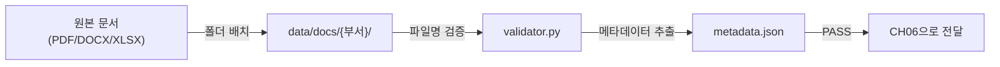

*그림 5-4: CH05 문서 수집 표준화 파이프라인 전체 흐름*

---

## 5. 정리하며

CH04에서 구축한 FastAPI 기반 사내 시스템에 이번 챕터로 비정형 지식의 기반이 추가되었습니다. Q/A 사내 AI 비서는 이제 정형 데이터(PostgreSQL)와 비정형 문서(data/docs/) 두 가지 지식 원천을 갖추었습니다.

- **문서 표준이 RAG 품질을 결정한다**: `{부서코드}_{문서종류}_v{버전}.{확장자}` 파일명 규칙과 6가지 메타데이터 항목은 CH06 필터링과 CH10 Self-Query Retriever의 핵심 입력값이 됩니다. 지금 정립한 표준이 이후 모든 챕터에 영향을 미칩니다.

- **형식마다 파싱 난이도가 다르다**: PDF(텍스트형)는 `pypdf`로 비교적 쉽게 추출되지만, 이미지형 PDF는 Vision LLM이 필요합니다. DOCX는 구조가 잘 보존되고, XLSX는 표 데이터를 의미 있는 텍스트로 변환하는 추가 처리가 필요합니다. CH06에서 이 차이를 직접 체감합니다.

- **`validator.py` PASS가 CH06 진입 조건이다**: FAIL 문서가 남아 있으면 CH06 색인에서 해당 문서가 제외됩니다. WARN은 진행 가능하지만 실무에서는 표준 적용을 권장합니다.

- **"Garbage In, Garbage Out"은 진짜다**: 파일명이 불명확하고 메타데이터가 없는 문서는 색인은 되더라도 검색 필터링이 불가능합니다. 문서 수집 단계의 품질 관리가 전체 RAG 시스템의 신뢰도 기반입니다.

**다음 챕터에서는** 지금 표준화한 문서를 텍스트로 추출하고 ChromaDB에 색인하는 전 과정을 구현합니다. `pypdf`, `python-docx`, `openpyxl`로 텍스트를 추출하고, Vision LLM으로 이미지형 PDF를 처리한 뒤, 500자 단위로 청킹하여 `ko-sroberta-multitask` 임베딩 모델로 벡터화합니다. CH05에서 만든 `metadata.json`이 CH06의 출발점입니다.

---

# 6. VectorDB 구축 — 문서를 검색 가능한 지식으로 바꾸기

CH05에서 표준화한 사내 문서 세트(PDF, DOCX, XLSX)가 `data/docs/` 폴더에 준비되어 있습니다. 이 챕터에서는 그 문서들을 "검색 가능한 지식"으로 변환하는 전 과정을 완성합니다. Python 라이브러리로 텍스트를 추출하고, Vision LLM(LLaVA)으로 이미지·표까지 분석하고, 500자 단위로 청킹한 뒤 **ko-sroberta-multitask** 임베딩 모델로 벡터화하여 **ChromaDB** 에 영속 저장합니다. 마지막으로 CLI 검색 도구로 색인 품질을 직접 검증합니다.

이 챕터가 끝나면 터미널에서 `"연차 사용 규정"` 을 입력했을 때, ChromaDB가 HR 취업규칙 문서에서 관련 문구와 출처 경로를 즉시 반환하는 것을 눈으로 확인할 수 있습니다.

---

## 1. 개념 — 문서에서 벡터까지

### 1.1 Python 파싱의 한계와 Vision LLM의 필요성

사내 문서를 RAG에 활용하려면 가장 먼저 "텍스트 추출" 문제를 해결해야 합니다. Python 라이브러리만으로 가능한 부분과 불가능한 부분을 명확히 구분하면 아래 표와 같습니다.

| 문서 유형 | Python 파싱 결과 | 한계 |
|----------|----------------|------|
| 텍스트형 PDF | 대부분 정상 추출 | 다단 레이아웃에서 순서 뒤섞임 |
| 이미지형 PDF (스캔) | 텍스트 거의 없음 | 이미지 기반이므로 OCR 필요 |
| 표가 많은 PDF | 표 구조 무너짐 | 셀 순서가 뒤섞여 의미 손실 |
| DOCX | 단락·표 정상 추출 | 그림 설명 누락 |
| XLSX | 셀 값 정상 추출 | 수식 결과값(data_only 모드)만 추출 |

Python 파싱을 **먼저** 직접 실행해보는 이유는 이 한계를 몸으로 체감해야만 Vision LLM의 필요성이 설득력 있게 다가오기 때문입니다. 단순한 방법의 결과를 본 후에야 더 복잡한 방법의 가치를 이해할 수 있습니다.

**Vision LLM(LLaVA)** 은 PDF 각 페이지를 PNG 이미지로 변환한 뒤 그 이미지 자체를 입력으로 받아 분석합니다. LLM이 이미지를 "보기" 때문에 표의 구조, 차트의 의미, 이미지에 포함된 텍스트를 동시에 추출할 수 있습니다. 또한 "이 문서의 담당 부서는 어디인가?" 같은 메타데이터도 추론하여 자동으로 부착합니다.

> **참고: Vision LLM 모델 선택**
> 이 책에서는 `llava:13b` 를 기본 모델로 사용합니다. RAM 8GB 미만 환경에서는 `llava:7b` 로 교체하십시오. `ollama pull llava:13b` 로 사전 다운로드가 필요합니다.

### 1.2 청킹 전략 — 왜 500자인가?

**청킹(Chunking)** 은 긴 텍스트를 검색에 적합한 작은 단위로 나누는 과정입니다. 청크가 너무 크면 검색 정확도가 낮아지고, 너무 작으면 문맥이 잘려 답변 품질이 떨어집니다.

이 챕터에서는 **Fixed-size 청킹** 방식을 사용합니다. 청크 크기를 500자, 오버랩을 100자(20%)로 고정합니다. 오버랩이 필요한 이유는 청크 경계에서 문장이 잘릴 때 앞뒤 청크가 100자씩 겹치도록 하여 문맥 손실을 최소화하기 위해서입니다.

```
원본: [---500자 청크 1---][---500자 청크 2---][---500자 청크 3---]
오버랩 적용: [--500--][100][--500--][100][--500--]
             ↑청크1   ↑겹침 ↑청크2  ↑겹침 ↑청크3
```

Fixed-size를 기본으로 사용하는 이유는 구현이 단순하고 동작이 예측 가능하기 때문입니다. Semantic 청킹(의미 단위로 분할)은 품질이 더 좋지만 속도가 느리고 파라미터 조정이 복잡합니다. CH10 튜닝 챕터에서 두 방식을 비교하며 개선합니다.

### 1.3 임베딩 모델 — ko-sroberta-multitask

**임베딩(Embedding)** 은 텍스트를 고차원 수치 벡터로 변환하는 과정입니다. "연차 사용 규정"과 "휴가 사용 기준"처럼 표현은 다르지만 의미가 가까운 텍스트는 벡터 공간에서도 가깝게 위치합니다. ChromaDB는 이 코사인 거리를 계산하여 가장 유사한 청크를 반환합니다.

이 책에서는 **`jhgan/ko-sroberta-multitask`** 모델을 사용합니다. 선택 이유는 세 가지입니다. 첫째, 한국어에 특화된 SRoBERTa 기반 모델입니다. 둘째, HuggingFace에서 무료로 다운로드할 수 있습니다. 셋째, 최초 실행 시 약 400MB를 다운로드한 후 로컬 캐시에 저장되어 이후 실행에서는 네트워크 없이 동작합니다.

### 1.4 전체 파이프라인 흐름

아래 다이어그램은 이 챕터에서 구현하는 전체 VectorDB 구축 흐름을 보여줍니다.

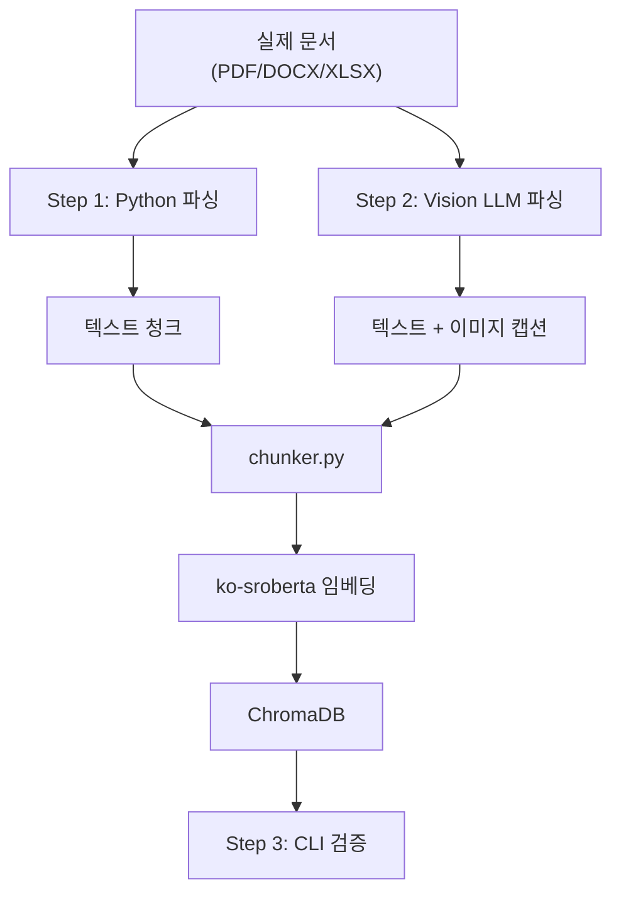

*그림 6-1: VectorDB 구축 3단계 파이프라인 흐름*

Step 1(Python 파싱)과 Step 2(Vision LLM 파싱)는 병렬로 수행되는 것이 아니라 **상호 보완** 관계입니다. PDF는 Vision LLM 결과를 우선 사용하고, Vision LLM이 실패하면 Python 파싱으로 자동 폴백합니다. DOCX와 XLSX는 Python 파싱을 사용합니다.

---

## 2. 예제 프로젝트 클론 및 환경 설정

다음 순서로 예제 프로젝트를 준비하십시오.

**1단계: 저장소 클론**

```bash
git clone https://github.com/your-org/rag-connect-hr.git
cd rag-connect-hr/CH06_VectorDB_구축
```

**2단계: 환경 변수 설정**

```bash
cp .env.example .env
```

`.env` 파일을 열고 Ollama 서버 주소를 확인하십시오.

```
OLLAMA_BASE_URL=http://localhost:11434
EMBEDDING_MODEL=jhgan/ko-sroberta-multitask
CHROMA_PERSIST_DIR=./outputs/chroma_db
```

Ollama가 기본 포트(`11434`)로 실행 중이라면 수정이 필요 없습니다.

**3단계: 의존성 설치**

```bash
python -m venv venv
source venv/bin/activate     # macOS / Linux
# venv\Scripts\activate      # Windows
pip install -r requirements.txt
```

주요 패키지를 확인하십시오.

```
pypdf==4.3.1             # PDF 텍스트 추출
python-docx==1.1.2       # DOCX 파싱
openpyxl==3.1.5          # XLSX 파싱
pymupdf==1.24.14         # PDF → 이미지 변환 (Vision LLM용)
sentence-transformers==3.3.1  # ko-sroberta 임베딩
chromadb==0.5.23         # VectorDB
requests==2.32.3         # Ollama API 호출
```

> **주의: Vision LLM 선택적 설치**
> `pymupdf`(PyMuPDF)는 Vision LLM 파이프라인에서만 필요합니다. Vision LLM 없이 실행하려면 `--no-vision` 옵션을 사용하면 되며 `pymupdf` 설치 없이도 Step 1 + Step 3은 정상 동작합니다. 하지만 `requirements.txt`에 이미 포함되어 있으므로 함께 설치합니다.

**4단계: 전체 파이프라인 실행**

```bash
python src/main.py
```

Vision LLM을 사용하지 않으려면 다음 옵션을 사용하십시오.

```bash
python src/main.py --no-vision
```

---

## 3. [Step 1] Python 파싱 — extractor.py

### 3.1 형식별 텍스트 추출기

`src/extractor.py` 는 PDF, DOCX, XLSX 세 가지 형식의 문서에서 텍스트를 추출하는 통합 모듈입니다. 파일 확장자를 감지하여 적절한 파싱 함수를 자동으로 선택합니다.

<!-- [GEMINI PROMPT: 06_python-parsing-flow]
path: assets/CH06/06_python-parsing-flow.png
Minimalist flat-design technical diagram showing Python parsing pipeline. Three document icons labeled PDF, DOCX, XLSX on the left. Center shows three library boxes labeled 'pypdf', 'python-docx', 'openpyxl'. Right side shows a unified output box labeled 'extract_text() dict'. Arrows from each document to its library, then all libraries converging to output. White background, black line art, 16:9 aspect ratio, Korean labels.
Style: architecture-infographic
-->

*그림 6-2: 형식별 파서를 선택하는 extract_text() 통합 함수 흐름*

**다음 코드는 파일 확장자를 감지하여 적절한 파싱 함수를 자동으로 선택합니다.**

```python
def extract_text(file_path: str | Path) -> dict:
    file_path = Path(file_path)
    suffix = file_path.suffix.lower()

    extractor_map = {                           # ①
        ".pdf": extract_from_pdf,
        ".docx": extract_from_docx,
        ".xlsx": extract_from_xlsx,
    }

    if suffix not in extractor_map:             # ②
        raise ValueError(
            f"지원하지 않는 파일 형식입니다: '{suffix}'"
        )

    extractor_fn = extractor_map[suffix]        # ③
    return extractor_fn(file_path)              # ④
```

> ① 확장자와 파싱 함수를 매핑한 딕셔너리입니다. 새 형식을 지원할 때 이 딕셔너리에만 추가하면 됩니다.
> ② 지원하지 않는 형식이면 명확한 오류 메시지를 출력합니다.
> ③ 확장자에 맞는 파싱 함수를 선택합니다.
> ④ 선택된 함수를 호출하여 표준 딕셔너리 형식으로 결과를 반환합니다.

> 전체 코드: `src/extractor.py`

> **동작 요약:** 이 코드는 `data/docs/` 폴더 내 PDF, DOCX, XLSX 파일 경로를 받아 파일 확장자를 감지한 뒤 해당 파서(`pypdf` / `python-docx` / `openpyxl`)를 호출하여 페이지별 텍스트를 추출하고, `{"file_name": ..., "file_type": ..., "pages": [...], "full_text": ...}` 형식의 표준 딕셔너리를 반환합니다.

### 3.2 Python 파싱 단독 실행 및 한계 확인

Step 1만 단독으로 실행하여 추출 결과를 직접 확인하십시오.

```bash
python src/main.py --step 1
```

실행 결과 예시입니다.

```
============================================================
Step 1: Python 파싱 — 형식별 텍스트 추출
============================================================
문서 디렉토리: data/docs

총 7개 문서를 발견했습니다.
  추출 중: HR_취업규칙_v1.0.pdf ... 완료 (4823자)
  추출 중: FIN_매출현황_v1.0.pdf ... 완료 (312자)
  추출 중: IT_보안가이드_v2.0.docx ... 완료 (7941자)
  추출 중: HR_온보딩체크리스트_v1.0.xlsx ... 완료 (1205자)

[추출 결과 요약]
  HR_취업규칙_v1.0.pdf: 8페이지, 4823자
  FIN_매출현황_v1.0.pdf: 3페이지, 312자   ← 이미지형 PDF, 대부분 손실
```

`FIN_매출현황_v1.0.pdf` 의 추출 결과가 312자에 불과한 것을 확인하십시오. 이 파일은 스캔된 이미지형 PDF이므로 Python 파서는 텍스트를 거의 추출하지 못합니다. 이것이 바로 Step 2(Vision LLM)가 필요한 이유입니다.

> **팁: Python 파싱으로 충분한 경우**
> 텍스트형 PDF와 DOCX, XLSX 파일은 Python 파싱으로도 충분한 품질을 얻을 수 있습니다. Vision LLM은 처리 시간이 길고 RAM을 많이 사용하므로, 이미지형 PDF가 없는 환경에서는 `--no-vision` 옵션으로 Step 1 + Step 3만 실행하는 것이 효율적입니다.

---

## 4. [Step 2] LLM 파싱 — vision_extractor.py

### 4.1 PDF 페이지를 이미지로 보는 방식

**Vision LLM 파싱** 은 세 단계로 동작합니다.

1. PDF 각 페이지를 PNG 이미지로 변환 (PyMuPDF 사용)
2. 이미지를 base64로 인코딩하여 Ollama LLaVA API로 전송
3. LLM의 응답에서 텍스트, 메타데이터, 이미지 캡션을 JSON으로 파싱

<!-- [GEMINI PROMPT: 06_vision-llm-flow]
path: assets/CH06/06_vision-llm-flow.png
Minimalist flat-design diagram showing Vision LLM pipeline. Left: PDF icon. Center: three sequential steps in boxes - '1. PDF to PNG (PyMuPDF)', '2. base64 encode', '3. LLaVA API call'. Right: output box labeled 'text + metadata + caption (JSON)'. Connecting arrows between each step. White background, black line art, 16:9, Korean labels.
Style: pipeline-flow
-->

*그림 6-3: PDF 페이지를 이미지로 변환하여 LLaVA로 분석하는 3단계 흐름*

**다음 코드는 LLaVA Vision LLM으로 이미지를 분석하여 텍스트, 메타데이터, 이미지 캡션을 추출합니다.**

```python
def analyze_image_with_llava(
    image_path: str | Path,
    ollama_url: str = DEFAULT_OLLAMA_URL,
    vision_model: str = DEFAULT_VISION_MODEL,
) -> dict:
    image_b64 = encode_image_to_base64(image_path)  # ①

    prompt = """이 문서 페이지를 분석하여 아래 형식의 JSON만 반환하십시오.
{
  "text": "페이지의 모든 텍스트 내용",
  "title": "문서 제목 (추론 불가 시 빈 문자열)",
  "department": "담당 부서",
  "caption": "이미지, 표, 차트에 대한 상세 설명",
  "has_image": true 또는 false
}"""

    payload = {                                      # ②
        "model": vision_model,
        "prompt": prompt,
        "images": [image_b64],
        "stream": False,
    }

    response = requests.post(                        # ③
        f"{ollama_url}/api/generate",
        json=payload,
        timeout=120,
    )
    raw_response = response.json().get("response", "")
    result = json.loads(raw_response)                # ④
    return result
```

> ① 이미지 파일을 base64 문자열로 인코딩합니다. Ollama Vision API는 이미지를 base64 형식으로 수신합니다.
> ② 모델명, 프롬프트, 이미지를 담은 요청 페이로드를 구성합니다.
> ③ Ollama `/api/generate` 엔드포인트에 POST 요청을 보냅니다. `timeout=120`은 Vision LLM의 처리 시간을 고려한 값입니다.
> ④ LLM 응답을 JSON으로 파싱하여 구조화된 딕셔너리로 반환합니다.

> 전체 코드: `src/vision_extractor.py`

> **동작 요약:** 이 코드는 PDF 파일 경로, Ollama 서버 URL, Vision 모델명(`llava:13b`)을 받아 PDF를 페이지별 PNG로 변환한 뒤 base64 인코딩하여 LLaVA API를 호출하고 응답을 JSON으로 파싱하여, `{"text": ..., "title": ..., "department": ..., "caption": ..., "has_image": ...}` 형식의 딕셔너리를 반환합니다.

### 4.2 Python 파싱 vs Vision LLM 파싱 비교

두 방식의 장단점을 정리하면 다음과 같습니다.

| 항목 | Python 파싱 | Vision LLM 파싱 |
|------|------------|----------------|
| 텍스트형 PDF 품질 | 양호 | 양호 |
| 이미지형 PDF 품질 | 거의 없음 | 양호 |
| 표 구조 보존 | 무너짐 | 보존 |
| 메타데이터 추출 | 불가 | 자동 추론 |
| 이미지 캡션 생성 | 불가 | 가능 |
| 처리 속도 | 빠름 (초 단위) | 느림 (분 단위, 페이지당 10~30초) |
| RAM 사용량 | 낮음 | 높음 (4~8GB) |
| 비용 | 무료 | Ollama 로컬 무료 |

Vision LLM을 사용하는 핵심 이유는 **텍스트와 이미지를 함께 저장** 하기 위해서입니다. 실무 문서는 차트, 서명란, 조직도 같은 이미지를 포함하는 경우가 많습니다. 이 정보를 누락하면 "작년 매출 추이가 어떻게 되나요?"라는 질문에 차트를 설명할 수 없게 됩니다.

### 4.3 자동 폴백 메커니즘

Vision LLM이 실행되지 않거나 연결에 실패하면 `vision_extractor.py` 는 자동으로 Python 파싱으로 폴백합니다. 이 덕분에 Ollama가 없는 환경에서도 파이프라인 전체가 중단되지 않고 동작합니다.

```bash
# Vision LLM 실패 시 터미널 출력 예시
  Vision LLM에 연결할 수 없습니다. Ollama가 실행 중인지 확인하십시오: ollama serve
  Python 파싱으로 폴백합니다.
  Python 파싱으로 폴백: FIN_매출현황_v1.0.pdf
```

> **경고: Vision LLM 처리 시간**
> `llava:13b` 모델로 PDF 1페이지를 분석하는 데 GPU 없는 CPU 환경에서 30초 ~ 2분이 소요될 수 있습니다. 100페이지 문서라면 최대 3시간 이상 걸릴 수 있습니다. 대용량 문서 처리 시에는 NVIDIA GPU가 탑재된 환경이나 `--no-vision` 옵션 사용을 권장합니다.

---

## 5. Chunk 설계 — chunker.py

### 5.1 Fixed-size 청킹 구현

`src/chunker.py` 는 추출된 텍스트를 500자 단위로 분할하고 각 청크에 메타데이터를 부착합니다.

**다음 코드는 텍스트를 Fixed-size 방식으로 청크 리스트로 분할합니다.**

```python
def split_text_into_chunks(
    text: str,
    chunk_size: int = DEFAULT_CHUNK_SIZE,  # 500자
    overlap: int = DEFAULT_OVERLAP,        # 100자
) -> list[str]:
    text = text.strip()
    if not text:
        return []

    chunks = []
    step = chunk_size - overlap             # ① 이동 단계: 400자
    start = 0

    while start < len(text):               # ②
        end = start + chunk_size
        chunk = text[start:end].strip()
        if chunk:
            chunks.append(chunk)
        start += step                       # ③

    return chunks
```

> ① `step = 500 - 100 = 400`입니다. 한 번에 400자씩 전진하므로 앞뒤 청크가 100자씩 겹칩니다.
> ② 텍스트 끝에 도달할 때까지 반복합니다. 마지막 청크는 500자보다 짧을 수 있습니다.
> ③ 시작 위치를 step만큼 이동합니다. overlap이 클수록 청크 수가 늘어나고 저장 공간이 증가합니다.

> 전체 코드: `src/chunker.py`

> **동작 요약:** 이 코드는 추출된 텍스트 문자열과 `chunk_size=500`, `overlap=100` 파라미터를 받아 400자 단위로 시작 위치를 이동하며 500자 청크를 생성하고 각 청크에 메타데이터 딕셔너리를 조립하여, `id`, `text`, `metadata`, `chunk_type`을 포함하는 청크 딕셔너리 리스트를 반환합니다.

### 5.2 메타데이터 부착 — 출처 추적의 핵심

각 청크에는 **메타데이터(Metadata)** 가 부착됩니다. 이 메타데이터가 나중에 "어느 문서의 몇 번째 페이지에서 가져온 청크인가?"를 추적하는 기반이 됩니다.

```python
def build_text_chunk(
    chunk_text: str,
    doc_id: str,
    file_name: str,
    ...
) -> dict:
    chunk_id = f"{doc_id}_text_p{page:03d}_c{chunk_index:04d}"  # ①

    return {
        "id": chunk_id,
        "text": chunk_text,
        "metadata": {
            "doc_id": doc_id,
            "file_name": file_name,        # ②
            "file_type": file_type,
            "source_path": source_path,
            "page": page,                  # ③
            "department": department,      # ④
            "chunk_type": "text",
        },
        "chunk_type": "text",
    }
```

> ① 청크 ID는 `hr_취업규칙_text_p001_c0003` 형식으로 문서, 페이지, 순번이 포함되어 중복이 없습니다.
> ② `file_name`은 CH07에서 "출처: HR_취업규칙_v1.0.pdf" 형식으로 사용자에게 표시됩니다.
> ③ `page`는 PDF에서 몇 번째 페이지인지 저장합니다. 사용자가 원본 문서를 직접 확인할 때 사용합니다.
> ④ `department`는 Vision LLM이 추론한 담당 부서로, CH10에서 메타데이터 필터링에 활용됩니다.

### 5.3 이미지 캡션 청크

Vision LLM이 추출한 이미지 설명은 별도 **이미지 캡션 청크** 로 저장됩니다. 텍스트 청크와 동일한 형식으로 ChromaDB에 저장되지만, `chunk_type: "image_caption"` 으로 구분되고 `image_path` 메타데이터에 PNG 파일 경로가 포함됩니다.

```
[이미지 캡션] 2023년 1분기 부서별 매출 현황을 보여주는 막대 그래프.
영업1팀 3억 2천만원, 영업2팀 2억 8천만원, 마케팅 1억 5천만원 순으로
집계되어 있으며, 전분기 대비 영업1팀이 12% 증가한 것으로 나타남.
```

이 캡션 텍스트 자체가 임베딩되어 ChromaDB에 저장됩니다. "1분기 영업 실적"을 검색하면 이 이미지 캡션 청크가 검색 결과에 포함되고, `image_path` 를 통해 해당 페이지 캡처본 경로를 CLI에서 확인할 수 있습니다.

---

## 6. 임베딩 & VectorDB 저장 — store.py

### 6.1 ChromaDB 영속 저장

`src/store.py` 는 청크 리스트를 받아 임베딩 벡터를 계산하고 ChromaDB에 영속 저장합니다. ChromaDB의 `PersistentClient` 를 사용하므로 프로그램을 종료해도 데이터가 `outputs/chroma_db/` 폴더에 보존됩니다.

**다음 코드는 청크를 임베딩하여 ChromaDB에 배치 저장하는 메인 파이프라인입니다.**

```python
def store_chunks_to_chroma(
    chunks: list[dict],
    chroma_dir: str = DEFAULT_CHROMA_DIR,
    ...
) -> dict:
    model = load_embedding_model(embedding_model_name)  # ①

    client = chromadb.PersistentClient(                 # ②
        path=chroma_dir,
        settings=Settings(anonymized_telemetry=False),
    )
    collection = get_or_create_collection(client, collection_name)

    ids, documents, embeddings, metadatas = embed_chunks(chunks, model)  # ③

    for batch_start in range(0, len(ids), BATCH_SIZE):  # ④
        collection.upsert(
            ids=ids[batch_start:batch_end],
            documents=documents[batch_start:batch_end],
            embeddings=embeddings[batch_start:batch_end],
            metadatas=metadatas[batch_start:batch_end],
        )
```

> ① `jhgan/ko-sroberta-multitask` 모델을 로드합니다. 최초 실행 시 HuggingFace에서 약 400MB를 다운로드하고 이후 실행에서는 로컬 캐시를 재사용합니다.
> ② `PersistentClient` 로 ChromaDB를 초기화합니다. `chroma_dir` 폴더가 없으면 자동으로 생성됩니다.
> ③ 모든 청크 텍스트를 한 번에 임베딩하여 벡터 리스트를 생성합니다. `BATCH_SIZE=64`로 나누어 처리하여 메모리 효율을 높입니다.
> ④ `upsert`는 이미 존재하는 ID는 덮어쓰고, 새 ID는 추가합니다. 파이프라인을 재실행해도 데이터가 중복되지 않습니다.

> 전체 코드: `src/store.py`

> **동작 요약:** 이 코드는 id, text, metadata를 포함하는 청크 딕셔너리 리스트를 받아 ko-sroberta 모델을 로드한 뒤 64개 배치 단위로 임베딩을 계산하고 ChromaDB에 `upsert` 방식으로 저장하여, `outputs/chroma_db/` 폴더에 영속 저장하고 `{collection_name, total_chunks, collection_count}` 형식의 요약 딕셔너리를 반환합니다.

### 6.2 전체 파이프라인 실행 (Step 1 + 2 + 3)

이제 전체 파이프라인을 한 번에 실행합니다.

```bash
python src/main.py
```

정상 실행 시 아래와 같은 출력을 확인할 수 있습니다.

```
============================================================
Q/A 사내 AI VectorDB 구축 파이프라인 시작
============================================================
실행 Step: [1, 2, 3]

============================================================
Step 1: Python 파싱 — 형식별 텍스트 추출
============================================================
총 7개 문서를 발견했습니다.
  추출 중: HR_취업규칙_v1.0.pdf ... 완료 (4823자)
  추출 중: FIN_매출현황_v1.0.pdf ... 완료 (312자)
  ...

Step 1 완료: 7개 문서 추출 (2.1초)

============================================================
Step 2: Vision LLM 파싱 — PDF 이미지 분석
============================================================
Ollama URL: http://localhost:11434
총 4개 PDF 파일을 Vision LLM으로 분석합니다.
  Vision LLM 분석 시작: HR_취업규칙_v1.0.pdf
    8개 페이지 이미지 생성 완료
    페이지 1/8 분석 중... 완료
    ...

Step 2 완료: 4개 PDF 분석 (187.4초)

============================================================
Step 3: 임베딩 + ChromaDB 저장
============================================================
청크 크기: 500자, 오버랩: 100자
임베딩 모델: jhgan/ko-sroberta-multitask

임베딩 모델 로드 중: jhgan/ko-sroberta-multitask
  임베딩 모델 로드 완료 (벡터 차원: 768)

ChromaDB 초기화: ./outputs/chroma_db
  새 컬렉션 생성: 'hr_documents'

  127개 청크 임베딩 계산 중... (배치 크기: 64)
  임베딩 계산 완료: 127개 벡터 생성

ChromaDB에 저장 중... (127개 청크)
ChromaDB 저장 완료! (컬렉션 총 문서 수: 127)

Step 3 완료 (34.2초)
============================================================
파이프라인 완료! (총 소요 시간: 223.7초)
============================================================

다음 단계: CLI 검색으로 색인 품질을 검증하십시오.
  python src/cli_search.py
```

<!-- [CAPTURE NEEDED: 06_pipeline-complete
  path: assets/CH06/06_pipeline-complete.png
  desc: python src/main.py 전체 파이프라인 실행 완료 후 터미널 화면. "파이프라인 완료! (총 소요 시간: ...)" 메시지와 ChromaDB 저장 완료 확인 포함.
] -->

*그림 6-4: 전체 파이프라인 실행 완료 후 터미널 출력*

> **팁: Vision LLM 없이 빠르게 실행하기**
> LLaVA 모델 다운로드(`ollama pull llava:13b`)가 아직 완료되지 않았거나 RAM이 부족하다면 `--no-vision` 옵션을 사용하십시오. Step 1 + Step 3만 실행하여 약 40초 이내에 ChromaDB를 구축할 수 있습니다.
> ```bash
> python src/main.py --no-vision
> ```

---

## 7. [Step 3] CLI 검증 — cli_search.py

### 7.1 터미널에서 검색 품질 확인

ChromaDB 구축이 완료되면 웹 UI 없이 터미널에서 바로 검색 품질을 검증합니다. **CLI로 먼저 검증하는 이유** 는 웹 UI 개발 전에 VectorDB가 올바르게 동작하는지 빠르게 확인하기 위해서입니다. 여기서 문제를 발견하면 CH07 웹 UI 연결 전에 수정할 수 있습니다.

**단일 쿼리 검색** (즉시 결과 확인):

```bash
python src/cli_search.py --query "연차 사용 규정"
```

**대화형 반복 검색** (여러 쿼리를 순서대로 테스트):

```bash
python src/cli_search.py
```

### 7.2 검색 결과 출력 형식

**다음 코드는 검색 결과를 출처·유사도·캡처본 경로와 함께 터미널에 출력합니다.**

```python
def print_search_result(result: dict) -> None:
    rank = result["rank"]
    distance = result["distance"]
    meta = result["metadata"]

    similarity = format_distance_as_similarity(distance)   # ①
    chunk_type = meta.get("chunk_type", "text")
    image_path = meta.get("image_path", "")

    print(f"[결과 {rank}]  유사도: {similarity}  |  출처: {meta['file_name']}  |  페이지: {meta['page']}")  # ②

    if chunk_type == "image_caption":                      # ③
        print("  유형: 이미지/표/차트 캡션")

    print(result["text"][:300])                            # ④

    if image_path:
        print(f"  [캡처본 경로] {image_path}")             # ⑤
```

> ① 코사인 거리(`0.0~2.0`)를 `(1 - distance/2) * 100%` 공식으로 직관적인 백분율 유사도로 변환합니다.
> ② 순위, 유사도, 파일명, 페이지 번호를 한 줄에 표시합니다. 이 정보가 CH07에서 출처 표시에 사용됩니다.
> ③ 이미지 캡션 청크는 유형을 명시하여 텍스트 청크와 구분합니다.
> ④ 청크 텍스트를 최대 300자까지 표시합니다. 전체 500자를 보려면 코드에서 한도를 조정하십시오.
> ⑤ Vision LLM으로 분석된 이미지 청크에는 PNG 캡처본 파일 경로가 함께 출력됩니다.

> 전체 코드: `src/cli_search.py`

> **동작 요약:** 이 코드는 검색 쿼리 문자열과 `top_k`(기본값: 5) 파라미터를 받아 쿼리를 ko-sroberta로 임베딩한 뒤 ChromaDB에서 코사인 유사도 검색을 수행하여 상위 k개 결과를 반환하고, 터미널에 유사도, 출처, 근거 문구, 캡처본 경로를 출력합니다.

### 7.3 검색 품질 확인 예시

```
======================================================================
검색 쿼리: 연차 사용 규정
상위 5개 결과를 검색합니다...
======================================================================

[결과 1]  유사도: 91.2%  |  출처: HR_취업규칙_v1.0.pdf  |  페이지: 3
  부서: HR
  유형: 텍스트
----------------------------------------------------------------------
제15조(연차유급휴가) ① 사용자는 1년간 80퍼센트 이상 출근한 근로자에게 15일의
유급휴가를 주어야 한다. ② 사용자는 계속하여 근로한 기간이 1년 미만인 근로자 또는
1년간 80퍼센트 미만 출근한 근로자에게 1개월 개근 시 1일의 유급휴가를 주어야 한다.

[결과 2]  유사도: 87.4%  |  출처: HR_취업규칙_v1.0.pdf  |  페이지: 4
  유형: 텍스트
----------------------------------------------------------------------
제16조(연차휴가의 사용) 연차유급휴가는 근로자가 청구한 시기에 주어야 하며,
그 기간에 대하여는 취업규칙에서 정하는 통상임금 또는 평균임금을 지급하여야 한다...

[결과 3]  유사도: 72.1%  |  출처: FIN_매출현황_v1.0.pdf  |  페이지: 2
  유형: 이미지/표/차트 캡션
----------------------------------------------------------------------
[이미지 캡션] 2023년 부서별 연간 휴가 사용 현황을 나타낸 표. HR팀 평균 12.3일,
영업팀 평균 8.7일, 개발팀 평균 11.2일로 집계됨.

  [캡처본 경로] outputs/pages/FIN_매출현황_v1.0_page_002.png
  (파일 존재 확인됨)

======================================================================
총 5개 결과 반환 완료
```

<!-- [CAPTURE NEEDED: 06_cli-search-result
  path: assets/CH06/06_cli-search-result.png
  desc: python src/cli_search.py --query "연차 사용 규정" 실행 결과 터미널 화면. 유사도 91.2%, 출처 파일명, 페이지 번호, 관련 텍스트 근거, 이미지 캡처본 경로가 표시된 화면.
] -->

*그림 6-5: CLI 검색에서 유사도·출처·근거 문구·캡처본 경로가 함께 출력되는 화면*

유사도 91.2%로 HR 취업규칙 제15조가 상위에 검색된 것을 확인하십시오. 이 품질이 CH07에서 RAG Q&A 엔진의 답변 품질을 결정합니다.

### 7.4 검색 품질 점검 기준

CLI 검색 결과를 보며 아래 항목을 점검하십시오.

| 점검 항목 | 정상 | 문제 |
|----------|------|------|
| 상위 결과 유사도 | 80% 이상 | 60% 미만이면 임베딩 모델 확인 |
| 출처 파일명 | 관련 문서가 반환됨 | 무관한 문서만 나오면 청킹 재검토 |
| 이미지 캡처본 경로 | "(파일 존재 확인됨)" 메시지 | 경로 오류 시 pages_dir 설정 확인 |
| 검색 결과 수 | top_k만큼 반환 | 0개이면 ChromaDB 비어 있음 |

> **주의: 유사도 점수 해석**
> 코사인 유사도 60% 미만은 관련 문서를 찾지 못했을 가능성이 높습니다. 이 경우 청크 크기를 줄이거나 (`--chunk-size 300`) 다른 임베딩 모델을 시도해 보십시오. 튜닝 방법은 CH10에서 체계적으로 다룹니다.

---

## 8. 정리하며

이 챕터에서 Q/A 사내 AI 비서에 **VectorDB 지식 저장소** 를 추가했습니다. CH05에서 표준화한 사내 문서 7종이 이제 ChromaDB에 127개 청크로 색인되었으며, CLI로 유사도 검색을 검증했습니다.

- **Python 파싱을 먼저 해야 한계를 안다**: `pypdf`, `python-docx`, `openpyxl`로 추출한 결과를 직접 보면 이미지형 PDF와 복잡한 레이아웃에서 텍스트 손실이 발생함을 체감할 수 있다. 이 체감이 Vision LLM의 필요성을 설득력 있게 만든다.
- **텍스트와 이미지를 함께 저장한다**: 실무 문서는 차트, 이미지, 표를 포함한다. Vision LLM이 추출한 이미지 캡션을 별도 청크로 저장하여 텍스트만으로는 접근할 수 없는 시각 정보도 검색 가능하게 만든다.
- **Fixed-size 청킹은 출발점이다**: 500자 + 100자 오버랩은 단순하지만 예측 가능한 방식이다. Semantic 청킹과의 품질 비교 및 파라미터 최적화는 CH10 튜닝 챕터에서 진행한다.
- **CLI 검증이 품질의 기준이다**: 웹 UI 없이 VectorDB 품질을 빠르게 검증하고 CH07 연결 전에 문제를 조기 발견하는 습관이 중요하다. 유사도 80% 이상이면 CH07로 진행할 준비가 된 것이다.
- **`upsert`로 재실행이 안전하다**: ChromaDB의 upsert는 기존 데이터를 덮어쓰므로 파이프라인을 여러 번 실행해도 중복 저장이 발생하지 않는다.

다음 챕터에서는 이 ChromaDB를 LCEL 기반 RAG 체인과 연결하고, 웹 채팅 UI와 멀티턴 대화 기능을 추가하여 RAG Q&A 엔진을 완성합니다.

```
현재까지 완성된 Q/A 사내 AI 비서:
- [x] CH04: FastAPI CRUD 시스템 (직원/휴가/매출 DB)
- [x] CH05: 문서 수집 표준화 파이프라인 (data/docs/)
- [x] CH06: VectorDB 지식 저장소 (data/chroma_db/) ← 이번 챕터 추가
- [ ] CH07: RAG Q&A 엔진 + 웹 채팅 UI ← 다음 챕터
```

---

# 7. RAG로 Q&A 엔진 만들기

CH06에서 구축한 ChromaDB 인덱스를 웹 채팅 UI와 연결하는 작업을 이 챕터에서 수행합니다. LCEL(LangChain Expression Language) 기반 RAG 체인을 조립하고, 출처가 포함된 답변을 반환하는 채팅 API를 만들며, 멀티턴 대화 관리 기능까지 완성합니다.

이 챕터를 완료하면 브라우저에서 사내 문서에 질문하고 출처가 명시된 답변을 받는 웹 채팅 UI를 직접 사용할 수 있습니다.

---

## 1. RAG Q&A 엔진의 구조

### 1.1 전체 흐름

사용자가 채팅창에 질문을 입력하면 어떤 일이 일어나는지 살펴보겠습니다.

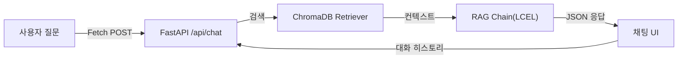

*그림 7-1: CH07 RAG Q&A 엔진 전체 흐름*

질문은 Fetch POST로 `/api/chat` 엔드포인트에 도달하고, FastAPI가 이를 받아 RAG 체인에 전달합니다. RAG 체인은 ChromaDB에서 관련 문서를 검색하고 LLM으로 답변을 생성하여 JSON 형태로 반환합니다. 채팅 UI는 그 JSON에서 답변과 출처를 꺼내 화면에 표시합니다.

### 1.2 LCEL 이란 무엇인가

**LCEL(LangChain Expression Language)** 은 LangChain의 선언적 체인 조합 문법입니다. Python의 파이프 연산자(`|`)를 사용하여 Retriever, Prompt, LLM, OutputParser 같은 구성 요소를 하나의 체인으로 연결합니다.

LCEL을 사용하는 이유는 두 가지입니다. 첫째, 파이프 연산자 덕분에 데이터 흐름이 왼쪽에서 오른쪽으로 한눈에 보입니다. 둘째, 체인 구성 요소를 쉽게 교체할 수 있어 Ollama 모델을 OpenAI 모델로 바꾸거나 ChromaDB를 다른 VectorDB로 교체할 때 체인 코드 수정 없이 구성 요소만 바꾸면 됩니다.

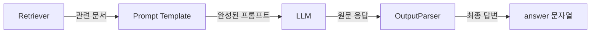

*그림 7-2: LCEL 파이프라인 구성 요소*

### 1.3 출처 강제 규칙의 중요성

RAG 시스템에서 **출처 강제 규칙** 은 신뢰도의 핵심입니다. "제공된 문서에서만 답변하라"는 규칙이 없으면 LLM이 학습 데이터로부터 그럴듯한 답변을 만들어낼 수 있습니다. 이 경우 사용자는 답변이 실제 사내 문서 기반인지, LLM의 추측인지 구분할 수 없습니다.

출처 강제 규칙을 추가하면:
- 답변의 근거를 문서와 페이지로 검증할 수 있습니다.
- 문서에 없는 내용은 "확인되지 않음"으로 명확하게 처리됩니다.
- 사용자와 관리자 모두 AI 답변의 신뢰도를 판단할 수 있습니다.

> **참고: ChromaDB 없이도 실행 가능합니다**
> CH06의 ChromaDB 인덱스가 없어도 이 챕터의 예제는 실행됩니다. `rag_chain.py`가 ChromaDB 경로에 데이터가 없으면 인메모리 샘플 문서 6개로 자동 폴백합니다. CH06을 완료한 경우에는 `.env`의 `CHROMA_PERSIST_DIR` 경로를 CH06 출력 경로로 지정하십시오.

---

## 2. 실습 환경 준비

### 2.1 레포지토리 클론 및 설정

```bash
git clone https://github.com/your-org/connect-hr-ch07.git
cd connect-hr-ch07
```

`.env.example`을 `.env`로 복사하고 설정값을 입력합니다.

```bash
cp .env.example .env
```

`.env` 파일의 주요 설정 항목은 다음과 같습니다.

```
LLM_PROVIDER=ollama
OLLAMA_BASE_URL=http://localhost:11434
OLLAMA_MODEL=deepseek-r1:8b

EMBEDDING_MODEL=jhgan/ko-sroberta-multitask
CHROMA_PERSIST_DIR=./data/chroma_db
CHROMA_COLLECTION_NAME=company_docs

SESSION_TTL_SECONDS=3600
CONVERSATION_WINDOW_SIZE=5
RETRIEVER_TOP_K=5
```

> **팁: OpenAI를 사용하려면**
> `.env`에서 `LLM_PROVIDER=openai`로 변경하고 `OPENAI_API_KEY`를 입력하십시오. 나머지 코드는 수정 없이 자동으로 전환됩니다.

의존성을 설치합니다.

```bash
pip install -r requirements.txt
```

프로젝트 폴더 구조는 다음과 같습니다.

```
CH07_RAG_QA_엔진/
├── app/
│   ├── main.py          ← FastAPI 앱 진입점
│   ├── chat_api.py      ← /api/chat 엔드포인트
│   └── session.py       ← 세션 쿠키 관리
├── src/
│   ├── rag_chain.py     ← LCEL RAG 체인
│   ├── response_parser.py  ← 출처 파서
│   └── conversation.py  ← 멀티턴 대화 관리
├── templates/
│   ├── base.html        ← CH04에서 계승한 레이아웃
│   └── chat.html        ← 채팅 UI
├── static/
│   ├── css/chat.css
│   └── js/chat.js
├── data/
│   └── chroma_db/       ← CH06 출력물 복사 경로
├── .env.example
└── requirements.txt
```

---

## 3. RAG 체인 구현

### 3.1 rag_chain.py — LCEL 파이프라인 조립

RAG 체인의 핵심은 `rag_chain.py`입니다. 이 파일은 세 가지 일을 합니다. 첫째, 환경 변수에 따라 LLM 인스턴스를 생성합니다. 둘째, ChromaDB 또는 인메모리 샘플 데이터를 선택하여 Retriever를 구성합니다. 셋째, LCEL 파이프 연산자로 전체 체인을 조립합니다.

<!-- [GEMINI PROMPT: 07_rag-chain-pipe]
path: assets/CH07/07_rag-chain-pipe.png
A minimalist black and white technical diagram with a strict 16:9 aspect ratio on a solid white background. No shading, no 3D effects, only clean thin line art. Shows LCEL pipeline: a dict box labeled 'Input dict: question, history' on the left, then three parallel branches (question -> Retriever -> format_docs, history passthrough, question passthrough) merging into a 'Prompt Template' box, then 'LLM (DeepSeek R1)', then 'StrOutputParser', then 'answer string'. All components connected with right-pointing arrows. Korean and English labels. Clean minimalist line art style. 16:9 aspect ratio, white background, centered.
Style: architecture-infographic
-->

*그림 7-3: LCEL 파이프 연산자로 조립된 RAG 체인 구조*

먼저 출처 강제 프롬프트 템플릿을 살펴보겠습니다.

**다음 코드는 RAG 시스템의 핵심 규칙인 출처 강제 + "모르면 확인되지 않음" 프롬프트를 정의합니다.**

```python
RAG_SYSTEM_PROMPT = """당신은 사내 문서 전문 Q&A 비서입니다.
아래에 제공된 문서(Context)만 사용하여 질문에 답변하십시오.

규칙:
1. 반드시 제공된 문서에서만 근거를 찾아 답변하시오.
2. 문서에서 답을 찾을 수 없으면 "해당 내용은 제공된 문서에서 확인되지 않습니다."라고 답하시오.
3. 답변 마지막에 근거 문서명을 반드시 명시하시오. 형식: [출처: 문서명]
4. 추측이나 외부 지식을 사용하지 마시오.

Context (제공된 문서):
{context}

이전 대화:
{history}
"""
```

규칙 1번과 2번이 환각(Hallucination)을 차단하는 핵심입니다. 규칙 3번은 사용자가 답변의 근거를 직접 확인할 수 있게 합니다. 규칙 4번은 LLM이 학습 데이터에서 "비슷해 보이는" 내용을 끌어오지 못하게 막습니다.

이제 LCEL 체인 조립 코드를 살펴보겠습니다.

> 전체 코드: `src/rag_chain.py`

**다음 코드는 LCEL 파이프 연산자로 Retriever, Prompt, LLM, Parser를 하나의 체인으로 조립합니다.**

```python
def build_rag_chain() -> tuple[Any, Any]:
    llm = _build_llm()                # ①
    retriever = _build_retriever()    # ②

    prompt = ChatPromptTemplate.from_messages(
        [
            ("system", RAG_SYSTEM_PROMPT),
            ("human", RAG_HUMAN_PROMPT),
        ]
    )

    chain = (
        {
            "context": itemgetter("question") | retriever | _format_docs,  # ③
            "history": itemgetter("history"),                               # ④
            "question": itemgetter("question"),                             # ⑤
        }
        | prompt              # ⑥
        | llm                 # ⑦
        | StrOutputParser()   # ⑧
    )

    return chain, retriever
```

> ① `.env`의 `LLM_PROVIDER` 값에 따라 `ChatOllama` 또는 `ChatOpenAI` 인스턴스를 생성합니다.
> ② ChromaDB 경로를 확인하여 Retriever를 생성합니다. 데이터가 없으면 샘플 문서로 폴백합니다.
> ③ 입력 딕셔너리의 `question` 키를 꺼내 Retriever에 전달하고 검색 결과를 텍스트로 포맷합니다.
> ④ `history` 키를 그대로 프롬프트의 `{history}` 자리에 넣습니다.
> ⑤ `question` 키를 그대로 프롬프트의 `{question}` 자리에 넣습니다.
> ⑥ `context`, `history`, `question` 세 값을 합쳐 완성된 프롬프트를 만듭니다.
> ⑦ 완성된 프롬프트를 LLM에 전달하여 응답을 생성합니다.
> ⑧ LLM 응답 객체에서 문자열만 추출합니다.

> **동작 요약:** 이 코드는 `{"question": "연차 규정이 어떻게 됩니까?", "history": "없음"}` 형태의 입력 딕셔너리를 받아, `question` 키로 ChromaDB를 검색하여 상위 5개 문서를 텍스트로 포맷하고, 시스템 프롬프트와 이전 대화, 질문을 합쳐 완성된 프롬프트를 생성한 뒤 LLM을 호출하여, `"1년 이상 근속 시 15일의 연차가 부여됩니다. [출처: HR_취업규칙_v1.0]"` 과 같은 문자열 답변을 반환합니다.

`itemgetter("question") | retriever | _format_docs` 부분이 LCEL의 묘미입니다. 파이프 연산자 하나로 "질문 추출 → 검색 → 포맷" 세 단계가 하나의 표현식으로 연결됩니다.

> **주의: temperature=0.1로 설정한 이유**
> `_build_llm()` 내부에서 `temperature=0.1`로 설정합니다. 온도가 0에 가까울수록 LLM이 가장 확률이 높은 단어를 선택하므로 출처 기반 사실 답변이 일관되게 출력됩니다. 창의적 글쓰기가 아닌 사실 기반 Q&A에서는 낮은 온도가 적합합니다.

---

## 4. 응답 파서 구현

### 4.1 response_parser.py — answer + sources 분리

LLM이 반환하는 원문 응답을 채팅 UI에서 바로 사용하기 어렵습니다. DeepSeek R1 모델은 `<think>...</think>` 추론 토큰을 원문에 포함하며, 출처 정보는 검색된 Document 객체에 따로 들어있기 때문입니다.

`response_parser.py`는 두 가지 일을 합니다. 첫째, 원문 응답에서 `<think>` 태그를 제거합니다. 둘째, 검색된 Document 목록에서 출처 정보를 추출하여 구조화된 JSON으로 변환합니다.

> 전체 코드: `src/response_parser.py`

**다음 코드는 LLM 원문 응답과 검색 문서로부터 `{"answer": str, "sources": list}` 형태의 최종 API 응답을 구성합니다.**

```python
def build_response(
    raw_answer: str,
    docs: list[Document],
) -> dict[str, Any]:
    answer = parse_answer_text(raw_answer)   # ①
    sources = parse_sources_from_docs(docs)  # ②

    return {
        "answer": answer,    # ③
        "sources": sources,  # ③
    }
```

> ① 원문 응답에서 `<think>.*?</think>` 패턴을 정규식으로 제거하고 앞뒤 공백을 정리합니다.
> ② 검색된 Document 목록에서 `source`, `page`, `snippet`(앞 120자)을 추출합니다. 동일 출처는 중복 제거합니다.
> ③ 두 값을 합쳐 JSON 직렬화 가능한 딕셔너리로 반환합니다.

> **동작 요약:** 이 코드는 `raw_answer="<think>분석 중...</think>15일의 연차..."`와 같은 LLM 원문 응답과 `docs=[Document(...)]` 검색 문서 목록을 받아, `<think>` 태그를 제거하여 정제된 답변을 추출하고 Document 메타데이터에서 source, page를 추출한 뒤 중복 제거와 스니펫 생성을 수행하여, `{"answer": "15일의 연차가 부여됩니다. [출처: HR_취업규칙_v1.0]", "sources": [{"doc": "HR_취업규칙_v1.0", "page": 5, "snippet": "제1조(연차 유급휴가)..."}]}` 형태의 구조화된 딕셔너리를 반환합니다.

이 구조를 통해 채팅 UI는 `answer` 필드를 말풍선에 표시하고 `sources` 배열을 아코디언으로 펼치는 형태로 렌더링합니다.

---

## 5. 채팅 API 구현

### 5.1 chat_api.py — FastAPI 엔드포인트

`chat_api.py`는 Fetch 방식을 선택한 이유가 있습니다. SSE(Server-Sent Events) 스트리밍보다 구현이 단순하고, 초급 독자가 Fetch API와 JSON 처리 방식을 이미 익숙하게 알고 있기 때문입니다. CH04에서 만든 CRUD API와 동일한 Fetch POST 패턴을 그대로 계승합니다.

> 전체 코드: `app/chat_api.py`

**다음 코드는 HTTP POST 요청을 받아 RAG 체인으로 처리하고 `{"answer", "sources", "session_id"}` JSON을 반환합니다.**

```python
@router.post("/chat")
async def chat_endpoint(
    body: ChatRequest,
    request: Request,
) -> JSONResponse:
    session_id = body.session_id or get_session_id(request)  # ①
    question = body.question.strip()

    conv_manager = get_conversation_manager()
    history_text = conv_manager.get_history_text(session_id)  # ②

    chain, retriever = get_rag_chain()
    docs = retriever.invoke(question)                          # ③

    raw_answer = chain.invoke(
        {"question": question, "history": history_text}        # ④
    )

    response_data = build_response(raw_answer=raw_answer, docs=docs)  # ⑤
    response_data["session_id"] = session_id

    conv_manager.save_turn(                                    # ⑥
        session_id=session_id, question=question,
        answer=response_data["answer"],
    )
    json_response = JSONResponse(content=response_data)
    set_session_cookie(json_response, session_id)
    return json_response
```

> ① 세션 ID를 요청 본문, 쿠키, 신규 생성 순으로 결정합니다.
> ② 세션의 이전 대화 히스토리를 텍스트로 가져옵니다.
> ③ 질문으로 ChromaDB를 검색하여 관련 Document 목록을 가져옵니다 (출처 표시용).
> ④ LCEL 체인을 실행합니다. `history_text`가 프롬프트의 `{history}`에 삽입됩니다.
> ⑤ 원문 응답과 Document 목록을 합쳐 `{"answer", "sources"}` 딕셔너리를 구성합니다.
> ⑥ 이번 대화를 세션 히스토리에 저장하여 다음 질문에서 맥락으로 활용합니다.

> **동작 요약:** 이 코드는 `POST /api/chat` 엔드포인트로 `{"question": "연차 규정이 어떻게 됩니까?", "session_id": null}` 형태의 요청을 받아, 세션 확인, 히스토리 로드, ChromaDB 검색, LCEL 체인 실행, 응답 구조화, 히스토리 저장을 순차적으로 수행하고, `{"answer": "15일의 연차...", "sources": [...], "session_id": "uuid-v4"}` JSON 응답과 함께 세션 쿠키를 설정하여 반환합니다.

---

## 6. 채팅 웹 UI 구현

### 6.1 chat.html — CH04 base.html 계승

채팅 UI는 CH04에서 만든 `base.html`의 레이아웃(좌측 사이드바 + 메인 콘텐츠)을 그대로 계승합니다. `` 한 줄로 사이드바, 상단 헤더, CSS 공통 영역을 그대로 물려받고 `` 안에 채팅 관련 요소만 추가합니다.

<!-- [GEMINI PROMPT: 07_chat-ui-layout]
path: assets/CH07/07_chat-ui-layout.png
A minimalist black and white technical diagram with a strict 16:9 aspect ratio on a solid white background. No shading, no 3D effects, only clean thin line art. Shows a web browser window layout. Left sidebar (240px wide) labeled 'base.html sidebar (from CH04)' with nav items. Main content area labeled 'chat.html block content' containing: a chat history area with AI message bubble on left (robot icon), a loading indicator below, and a bottom chat input bar with text field and send button. Arrows indicate 'extends base.html' relationship. Korean and English labels. Clean minimalist line art style.
Style: architecture-infographic
-->

*그림 7-4: chat.html이 base.html을 계승하는 레이아웃 구조*

`chat.html`의 핵심 구조를 살펴보겠습니다.

> 전체 코드: `templates/chat.html`

```html
          <!-- ① CH04 base.html 계승 -->


<div class="chat-app-container">
  <div id="chatHistory" class="chat-history">  <!-- ② 대화 목록 영역 -->
    <div class="chat-message ai-message">
      <div class="avatar">🤖</div>
      <div class="message-content">안녕하세요! Q/A 사내 AI 비서입니다.</div>
    </div>
  </div>

  <div id="loadingIndicator" style="display: none;"> <!-- ③ 로딩 표시 -->
    <div class="spinner"></div>
    <span>AI가 문서를 검색하고 있습니다...</span>
  </div>

  <div class="chat-footer">                          <!-- ④ 입력바 -->
    <form id="chatForm" class="chat-input-form">
      <input type="text" id="questionInput" ... />
      <button type="submit" class="btn-send">전송</button>
    </form>
  </div>
</div>

<script src="/static/js/chat.js"></script>           <!-- ⑤ Fetch 로직 -->

```

> ① `extends "base.html"`로 CH04의 사이드바, 헤더, CSS 공통 영역을 모두 상속합니다.
> ② `chatHistory` div가 대화 말풍선을 동적으로 쌓아가는 영역입니다.
> ③ Fetch 요청이 진행 중일 때 스피너를 표시하여 사용자에게 응답 대기 상태를 알립니다.
> ④ 폼 제출 이벤트가 `chat.js`에서 가로채져 Fetch POST로 처리됩니다.
> ⑤ `chat.js`가 Fetch POST 요청, 응답 렌더링, 출처 아코디언을 모두 처리합니다.

> **동작 요약:** 이 코드는 사용자가 입력창에 질문을 입력하고 엔터 또는 전송 버튼을 클릭하면, `chat.js`가 폼 제출을 인터셉트하여 `POST /api/chat` Fetch 요청을 보내고 응답 JSON을 수신한 뒤, `answer`를 AI 말풍선으로, `sources`를 아코디언으로 `chatHistory`에 추가하여, 화면에 AI 답변 말풍선과 "출처 보기" 아코디언이 표시된 채팅 UI를 렌더링합니다.

> **팁: Fetch vs SSE 방식 비교**
> 이 챕터는 Fetch(요청-응답 완료 후 전체 수신) 방식을 사용합니다. SSE(Server-Sent Events)는 응답을 토큰 단위로 스트리밍하지만 구현이 복잡합니다. 초급 독자에게는 Fetch 방식이 디버깅하기 쉽고 CH04의 기존 패턴과 일관성을 유지합니다. 스트리밍이 필요하다면 CH10에서 다룹니다.

---

## 7. 멀티턴 대화 관리

### 7.1 conversation.py — ConversationBufferWindowMemory

실무에서 단일 질의만으로 문제가 해결되는 경우는 드뭅니다. "연차 규정이 어떻게 됩니까?" 다음에 "그럼 수습 기간에는요?"라고 이어서 물으면, 시스템이 "연차 규정"이라는 맥락을 기억하고 있어야 올바른 답변을 생성할 수 있습니다.

**멀티턴(Multi-turn) 대화** 는 여러 차례 주고받는 대화 방식으로, 이전 질문과 답변을 기억하여 맥락을 유지합니다. `conversation.py`는 `ConversationBufferWindowMemory`를 사용하여 최근 N턴(기본값: 5)의 대화만 메모리에 유지합니다.

<!-- [GEMINI PROMPT: 07_multiturn-memory]
path: assets/CH07/07_multiturn-memory.png
A minimalist black and white technical diagram with a strict 16:9 aspect ratio on a solid white background. No shading, no 3D effects, only clean thin line art. Shows a sliding window memory concept. A horizontal timeline of conversation turns labeled Turn1 through Turn7. A bracket labeled 'Window(k=5)' spans the last 5 turns. Turns outside the window are grayed/faded. An arrow from the window goes to a box labeled 'history text' then to 'Prompt Template'. Korean and English labels. Clean minimalist line art style.
Style: architecture-infographic
-->

*그림 7-5: 슬라이딩 윈도우 방식으로 최근 5턴 대화를 유지하는 구조*

`ConversationManager` 클래스의 핵심 동작을 살펴보겠습니다.

> 전체 코드: `src/conversation.py`

**다음 코드는 세션별 대화 히스토리를 관리하며, 최근 N턴 유지와 TTL 기반 만료를 처리합니다.**

```python
class ConversationManager:

    def __init__(self, window_size=None, session_ttl=None):
        self.window_size = window_size or int(
            os.getenv("CONVERSATION_WINDOW_SIZE", "5")   # ①
        )
        self.session_ttl = session_ttl or int(
            os.getenv("SESSION_TTL_SECONDS", "3600")      # ②
        )
        self._sessions: dict[str, tuple[...]] = {}        # ③

    def get_history_text(self, session_id: str) -> str:
        memory = self._get_or_create_memory(session_id)   # ④
        variables = memory.load_memory_variables({})
        history = variables.get("history", "")
        return history if history else "없음"              # ⑤

    def save_turn(self, session_id, question, answer):
        memory = self._get_or_create_memory(session_id)
        memory.save_context(                              # ⑥
            inputs={"input": question},
            outputs={"output": answer},
        )
```

> ① `.env`의 `CONVERSATION_WINDOW_SIZE`로 유지할 대화 턴 수를 설정합니다 (기본 5턴).
> ② `SESSION_TTL_SECONDS`로 비활성 세션의 만료 시간을 설정합니다 (기본 3600초 = 1시간).
> ③ `{session_id: (Memory, last_access_time)}` 구조로 세션을 메모리에 보관합니다.
> ④ 세션 ID로 해당 Memory 인스턴스를 가져오거나 신규 생성합니다. 만료된 세션은 이 시점에 자동 정리됩니다.
> ⑤ 대화가 없으면 "없음"을 반환하여 프롬프트의 `{history}` 자리가 비지 않게 합니다.
> ⑥ `save_context`로 이번 질문-답변 쌍을 메모리에 저장합니다. 윈도우 크기를 초과하면 가장 오래된 턴이 자동으로 삭제됩니다.

> **동작 요약:** 이 코드는 `session_id="abc-123"`과 세션의 3번째 질문 `"그럼 수습 기간에는요?"`를 받아, `_get_or_create_memory`로 기존 2턴 히스토리를 로드하고 `"사용자: 연차 규정... / AI 비서: 15일..."` 텍스트로 포맷하여 RAG 체인에 전달한 뒤 답변을 생성하고 `save_context`로 3번째 턴을 저장하여, 맥락이 유지된 답변 `"수습 기간(3개월) 중에는 연차가 부여되지 않습니다. [출처: HR_취업규칙_v1.0]"`을 반환합니다.

### 7.2 session.py — UUID 기반 세션 관리

**다음 코드는 HTTP 쿠키에서 세션 ID를 읽거나 없으면 UUID v4로 신규 생성합니다.**

```python
def get_session_id(request: Request) -> str:
    session_id = request.cookies.get(SESSION_COOKIE_NAME)   # ①
    if not session_id:
        session_id = str(uuid.uuid4())                       # ②
    return session_id

def set_session_cookie(response: JSONResponse, session_id: str):
    response.set_cookie(
        key=SESSION_COOKIE_NAME,
        value=session_id,
        httponly=True,    # ③
        samesite="lax",   # ④
        max_age=3600,
    )
    return response
```

> ① 요청 쿠키에서 `rag_session_id` 값을 읽습니다.
> ② 쿠키가 없으면 `uuid.uuid4()`로 새 세션 ID를 생성합니다.
> ③ `httponly=True`로 JavaScript에서 쿠키를 직접 읽지 못하게 하여 XSS 공격을 방지합니다.
> ④ `samesite="lax"`로 외부 사이트에서의 쿠키 전송을 제한하여 CSRF 공격을 방지합니다.

> **동작 요약:** 이 코드는 최초 방문 브라우저의 HTTP 요청(쿠키 없음)을 받아, 쿠키를 확인하고 없으면 UUID v4를 생성한 뒤 응답에 `httponly + samesite` 속성의 쿠키를 설정하여, 다음 요청부터 브라우저가 자동으로 `rag_session_id` 쿠키를 전송하도록 합니다.

---

## 8. 실행 및 동작 확인

### 8.1 서버 실행

```bash
python app/main.py
```

**실행 결과:**
```
[INFO] 서버 시작: http://0.0.0.0:8000
[INFO] 채팅 UI: http://localhost:8000/chat
INFO:     Uvicorn running on http://0.0.0.0:8000 (Press CTRL+C to quit)
INFO:     Started reloader process [12345]
```

ChromaDB가 없는 경우:
```
[WARN] ChromaDB 사용 불가 (ChromaDB 경로에 데이터가 없습니다.). 인메모리 샘플 데이터를 사용합니다.
[INFO] 인메모리 샘플 데이터 6건 로드 완료.
```

브라우저에서 `http://localhost:8000/chat`에 접속하면 채팅 UI가 나타납니다.

<!-- [CAPTURE NEEDED: 07_chat-ui-running
  path: assets/CH07/07_chat-ui-running.png
  desc: 브라우저에서 http://localhost:8000/chat 접속 후 채팅 UI가 표시된 화면. 좌측 사이드바에 메뉴가 있고, 메인 영역에 AI 환영 메시지와 하단 입력창이 보이는 상태
] -->

*그림 7-6: 브라우저에서 확인한 RAG Q&A 채팅 UI*

### 8.2 멀티턴 대화 테스트

채팅창에 다음 순서로 질문을 입력하여 멀티턴 대화가 정상 동작하는지 확인합니다.

1. `"연차 사용 규정이 어떻게 됩니까?"`
2. `"그럼 입사 첫 해에는요?"`
3. `"육아휴직은 어떻게 신청합니까?"`

두 번째 질문 "그럼 입사 첫 해에는요?"는 맥락 없이 단독으로는 의미가 불분명합니다. 첫 번째 대화의 히스토리가 프롬프트에 포함되기 때문에 시스템이 "연차" 맥락을 유지하고 올바른 답변을 생성합니다.

<!-- [CAPTURE NEEDED: 07_multiturn-result
  path: assets/CH07/07_multiturn-result.png
  desc: 채팅 UI에서 3번의 연속 질문-답변이 표시된 화면. 두 번째 질문이 "그럼 입사 첫 해에는요?"이고 AI가 연차 맥락을 유지하며 답변한 상태. 출처 아코디언이 펼쳐져 있거나 닫혀있는 상태
] -->

*그림 7-7: 맥락이 유지된 멀티턴 대화 결과*

### 8.3 API 직접 테스트 (curl)

웹 UI 없이 API를 직접 테스트할 수 있습니다.

```bash
curl -X POST http://localhost:8000/api/chat \
  -H "Content-Type: application/json" \
  -d '{"question": "재택근무 신청 방법을 알려주세요."}'
```

**실행 결과:**
```json
{
  "answer": "재택근무는 주 최대 2일 신청 가능하며, 전날 오후 6시까지 팀장 승인이 필요합니다. 신규 입사자는 수습 기간(3개월) 이후부터 신청할 수 있습니다.\n[출처: IT_재택근무가이드_v2.1]",
  "sources": [
    {
      "doc": "IT_재택근무가이드_v2.1",
      "page": 2,
      "snippet": "제5조(재택근무) 임직원은 주 최대 2일 재택근무를 신청할 수 있다..."
    }
  ],
  "session_id": "a1b2c3d4-e5f6-..."
}
```

`sources` 배열의 `doc`과 `page` 값으로 실제 문서에서 근거를 직접 확인할 수 있습니다.

> **경고: 모델 응답 시간이 길 경우**
> Ollama + DeepSeek R1:8b는 첫 응답까지 30초 이상 걸릴 수 있습니다. 이는 모델이 메모리에 로드되는 초기화 시간 때문입니다. 두 번째 요청부터는 모델이 메모리에 상주하므로 빠르게 응답합니다. 응답 속도가 너무 느리면 `OLLAMA_MODEL=deepseek-r1:1.5b`로 작은 모델을 시도해 보십시오.

---

## 9. 정리하며

이 챕터에서 구축한 내용을 정리합니다.

- **LCEL은 체인을 "선언"합니다**: 파이프 연산자(`|`)로 Retriever, Prompt, LLM, Parser를 연결하면 데이터가 자동으로 흐릅니다. 구성 요소 교체가 쉬워 LLM 모델이나 VectorDB를 바꿀 때 체인 코드를 수정하지 않아도 됩니다.

- **출처 강제 규칙이 신뢰도의 핵심입니다**: "제공된 문서에서만 답변"과 "모르면 확인되지 않음" 두 규칙으로 LLM 환각을 차단하고 답변의 검증 가능성을 확보합니다. 사용자는 `sources` 배열의 문서명과 페이지로 근거를 직접 확인할 수 있습니다.

- **멀티턴은 "대화의 흐름"을 만듭니다**: `ConversationBufferWindowMemory`가 최근 5턴을 유지하여 후속 질문이 맥락 없이 도달해도 올바른 답변을 생성합니다. TTL 기반 만료로 비활성 세션의 메모리를 자동으로 정리합니다.

- **CH04의 base.html이 공유 자산임을 확인했습니다**: `chat.html`이 `base.html`을 상속하여 사이드바, 헤더, CSS를 그대로 계승합니다. 다음 챕터(CH08)의 통합 에이전트 UI도 이 구조를 확장합니다.

다음 챕터에서는 이 RAG Q&A 엔진(비정형 문서 검색)에 정형 DB 조회(MCP)를 결합하여 "김철수 사원의 남은 연차는?"과 같은 구조화된 질문도 처리하는 통합 에이전트를 만듭니다.

---

# 8. 정형 MCP + 비정형 RAG 통합 에이전트

이 챕터에서는 지금까지 독립적으로 구축한 두 가지 데이터 처리 경로를 하나의 에이전트로 통합합니다. CH04에서 만든 **PostgreSQL 기반 사내 시스템** 과 CH07에서 완성한 **LCEL RAG Q&A 엔진** 을 결합하여, LLM이 질문 유형을 스스로 판단하고 적절한 도구를 선택하는 통합 에이전트를 구현합니다.

CH07까지 완성한 RAG 채팅 엔진은 비정형 문서에 대한 질의는 완벽하게 처리합니다. 그러나 "김민준 사원의 남은 연차가 몇 일인가요?"라는 질문은 여전히 엉뚱한 답변을 내놓습니다. 이 질문의 답은 문서가 아니라 **데이터베이스** 에 있기 때문입니다. 이 챕터에서 이 문제를 해결합니다.

---

## 1. 정형/비정형 분리 원칙

### 1.1 두 가지 데이터의 세계

사내 업무에서 발생하는 질문은 크게 두 가지로 나뉩니다. 첫 번째는 **정형 데이터(Structured Data)** 를 묻는 질문입니다. "연차가 몇 일 남았나요?", "이번 달 영업부 매출 합계는 얼마인가요?"처럼 숫자나 목록을 요구하는 질문입니다. 이 답변은 데이터베이스의 특정 테이블, 특정 컬럼에 명확히 저장되어 있습니다.

두 번째는 **비정형 데이터(Unstructured Data)** 를 묻는 질문입니다. "신입사원 온보딩 절차를 알려주세요", "재택근무 신청 방법이 어떻게 되나요?"처럼 절차나 정책을 묻는 질문입니다. 이 답변은 PDF나 Word 문서 안에 자연어로 기술되어 있습니다.

```
[정형 질문 처리 경로]
"영업부 매출 합계" → MCP Tools → PostgreSQL SQL 조회 → 숫자 결과

[비정형 질문 처리 경로]
"온보딩 절차" → RAG Chain → ChromaDB 벡터 검색 → 문서 발췌

[복합 질문 처리 경로]
"매출 상위 부서의 복지 정책" → ReAct Agent → MCP + RAG 병렬 실행 → 통합 응답
```

아래 분류 기준표를 참고하면 어떤 질문이 어떤 경로로 처리되는지 파악할 수 있습니다.

| 질문 유형 | 판단 기준 | 처리 경로 | 예시 |
|---------|---------|---------|------|
| 정형 | 숫자, 통계, 목록, 특정 사람/부서 | MCP Tools + SQL | "김민준 연차 잔여일수" |
| 비정형 | 절차, 정책, 안내, 설명 | RAG Chain + ChromaDB | "온보딩 절차 알려줘" |
| 복합 | 정형 + 비정형 키워드 혼재 | ReAct Agent (두 경로 조합) | "영업부 매출과 복지 정책" |

### 1.2 왜 하나의 경로로 통합하면 안 되는가

"모든 질문을 RAG로 처리하면 되지 않을까?"라는 의문이 생길 수 있습니다. 두 가지 이유로 불가능합니다.

첫째, **정확도 문제** 입니다. "김민준 사원의 남은 연차는 8일"이라는 정보는 HR 취업규칙 문서에 적혀 있지 않습니다. 이 데이터는 시시각각 변하는 실시간 DB 값입니다. RAG가 아무리 정교해도 문서에 없는 실시간 수치는 답할 수 없습니다.

둘째, **환각 위험** 입니다. LLM이 DB 수치를 모르는 채로 답하면 그럴듯하지만 완전히 틀린 숫자를 생성합니다. CH03에서 직접 체험한 바로 그 문제입니다.

반대로 "모든 질문을 SQL로 처리하면 어떨까?"도 불가능합니다. "온보딩 절차"는 DB 컬럼에 없기 때문입니다.

<!-- [GEMINI PROMPT: 08_data-split-principle]
path: assets/CH08/08_data-split-principle.png
Minimalist black and white technical diagram on white background 16:9 aspect ratio. Two vertical lanes: left lane labeled "정형 데이터 (PostgreSQL)" contains cylinder database icon with table rows labeled "employee / leave_balance / sales". Right lane labeled "비정형 데이터 (ChromaDB)" contains stack of papers icon labeled "HR문서 / 보안정책 / 복지안내". Center funnel shape labeled "QueryRouter" with arrows flowing from top "사용자 질문" down into both lanes. Clean thin line art, no shading.
Style: architecture-infographic
-->

*그림 8-1: 정형 데이터는 PostgreSQL로, 비정형 데이터는 ChromaDB로 분리하여 처리한다*

---

## 2. 질문 라우팅 전략

### 2.1 라우팅의 3단계 전략

**질문 라우팅(Query Routing)** 은 들어온 질문이 어떤 경로로 처리되어야 하는지 결정하는 과정입니다. `QueryRouter` 는 이 결정을 세 단계로 수행합니다.

단순한 것에서 시작하여 복잡한 것으로 진행하는 방식입니다. 빠르고 확실한 규칙으로 먼저 처리하고, 그래도 판단이 어려울 때만 LLM에 위임합니다. LLM 호출은 비용과 시간이 들기 때문에 꼭 필요한 경우에만 사용하는 것이 핵심 설계 원칙입니다.

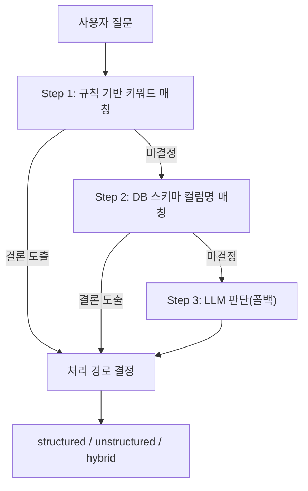

*그림 8-2: QueryRouter 3단계 라우팅 전략 — 단순한 규칙에서 시작하여 LLM으로 확장된다*

**Step 1 — 규칙 기반 키워드 매칭** 은 가장 빠른 방법입니다. "연차", "매출", "합계"처럼 정형 데이터와 명확히 연관된 키워드가 있으면 즉시 `structured` 로 분류합니다. "절차", "정책", "온보딩"처럼 문서 관련 키워드가 있으면 `unstructured` 로 분류합니다. 두 종류의 키워드가 모두 등장하면 `hybrid` 로 분류합니다.

**Step 2 — 스키마 기반 매칭** 은 DB 컬럼명이나 테이블명이 질문에 직접 등장하는 경우를 잡습니다. 예를 들어 "remaining_days가 0인 직원을 알려줘"처럼 기술적인 표현이 포함된 질문입니다.

**Step 3 — LLM 판단** 은 Step 1, 2에서 결론을 내지 못한 모호한 질문을 처리합니다. LLM에게 JSON 형식으로 분류 결과를 요청합니다.

### 2.2 router.py 구현

**다음 코드는 `classify_query()` 메서드가 3단계 전략을 순서대로 실행하여 처리 경로를 결정하는 핵심 로직입니다.**

```python
def classify_query(self, query: str) -> str:
    step1_result = self._step1_rule_based(query)    # ①
    if step1_result is not None:
        return step1_result

    step2_result = self._step2_schema_based(query)  # ②
    if step2_result is not None:
        return step2_result

    if self._llm is not None:
        step3_result = self._step3_llm_based(query) # ③
        if step3_result is not None:
            return step3_result

    return "unstructured"                            # ④
```

> ① 정형/비정형 키워드를 카운트하여 우세한 쪽으로 분류합니다. 두 쪽이 비슷하면 `hybrid` 를 반환합니다.
> ② `remaining_days`, `total_amount` 등 DB 컬럼명이 질문에 포함되면 `structured` 로 분류합니다.
> ③ Step 1, 2로 판단 불가 시 LLM에 JSON 응답을 요청하여 분류합니다. LLM 없으면 건너뜁니다.
> ④ 모든 단계가 미결정이면 안전한 기본값인 `unstructured` 로 처리합니다.

**Step 1의 키워드 판단 로직을 더 자세히 살펴보겠습니다.**

```python
structured_hits = sum(
    1 for kw in STRUCTURED_KEYWORDS if kw in query_lower  # ①
)
unstructured_hits = sum(
    1 for kw in UNSTRUCTURED_KEYWORDS if kw in query_lower
)

if structured_hits > 0 and unstructured_hits > 0:
    if structured_hits >= unstructured_hits * 2:
        return "structured"                               # ②
    if unstructured_hits >= structured_hits * 2:
        return "unstructured"
    return "hybrid"                                       # ③
```

> ① 정형 키워드 목록(`STRUCTURED_KEYWORDS`)과 비정형 키워드 목록(`UNSTRUCTURED_KEYWORDS`) 각각에 대해 매칭 횟수를 카운트합니다.
> ② 한 쪽이 다른 쪽보다 2배 이상 우세하면 우세한 쪽으로 단일 분류합니다.
> ③ 두 쪽이 비슷한 수준으로 매칭되면 두 경로 모두 필요한 복합 질문으로 판단합니다.

> **팁: explain_routing()으로 판단 근거를 확인하십시오**
> `router.explain_routing(query)` 를 호출하면 Step 1, 2의 판단 결과와 최종 경로를 딕셔너리로 반환합니다. 라우팅이 기대와 다를 때 원인을 추적하는 데 유용합니다.

> **동작 요약:** 이 코드는 사용자가 입력한 자연어 질문 문자열을 받아, Step 1 키워드 매칭에서 시작하여 미결정 시 Step 2 스키마 매칭, 그래도 미결정 시 Step 3 LLM 판단 순서로 경로를 결정하고, `"structured"` | `"unstructured"` | `"hybrid"` 중 하나의 문자열을 반환합니다.

> 전체 코드: `src/router.py`

---

## 3. MCP 도구 구현

### 3.1 MCP란 무엇인가

**MCP(Model Context Protocol)** 는 LLM이 외부 도구나 데이터 소스를 표준화된 방식으로 호출하는 프로토콜입니다. LangChain의 `@tool` 데코레이터를 사용하면 일반 Python 함수를 MCP 도구로 변환할 수 있습니다.

MCP를 사용하는 이유는 도구 추가가 **선언적** 이기 때문입니다. 새 도구를 만들려면 `@tool` 데코레이터를 달고 함수를 작성하는 것만으로 충분합니다. 에이전트는 함수의 docstring을 읽어 언제 이 도구를 사용해야 하는지 스스로 판단합니다. 라우팅 로직에 별도로 도구를 등록할 필요가 없습니다.

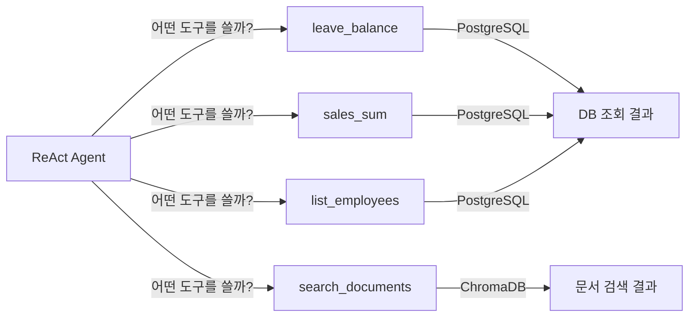

*그림 8-3: ReAct Agent가 상황에 따라 4개 MCP 도구 중 하나 이상을 선택하여 실행한다*

### 3.2 4개 MCP 도구 구현

`mcp_tools.py` 에는 4개의 도구가 정의되어 있습니다. PostgreSQL 연결이 불가능할 경우 인메모리 샘플 데이터로 자동 대체되므로, 독자는 DB 없이도 즉시 테스트할 수 있습니다.

**다음 코드는 `leave_balance` 도구가 DB 조회를 시도하고 실패 시 샘플 데이터로 대체하는 핵심 패턴입니다.**

```python
@tool
def leave_balance(emp_no: str) -> dict:
    """직원의 연차 잔여 일수를 조회한다."""
    rows = _run_query(
        "SELECT ... FROM employees JOIN leave_balance ON ...",
        (emp_no,),
    )                                        # ①
    if rows:
        return rows[0]                       # ②

    sample = _get_sample_leave_data()        # ③
    for record in sample:
        if emp_no in (record["emp_no"], record["name"]):
            return record                    # ④

    return {"error": f"직원 '{emp_no}'을(를) 찾을 수 없습니다."}
```

> ① `_run_query()` 내부에서 `connect_timeout=3` 을 설정하여 DB 미연결 시 3초 안에 빠르게 실패합니다.
> ② DB 결과가 있으면 첫 번째 행을 즉시 반환합니다.
> ③ DB 결과가 없으면 하드코딩된 5명의 샘플 데이터를 로드합니다.
> ④ 직원 번호(`E001`) 또는 이름으로 부분 일치 검색하여 반환합니다.

**실행 결과:**
```
leave_balance("김민준")
→ {"emp_no": "E001", "name": "김민준", "department": "영업부",
   "total_days": 15, "used_days": 7, "remaining_days": 8}
```

> **동작 요약:** 이 코드는 직원 번호(`"E001"`) 또는 이름(`"김민준"`) 문자열을 받아, PostgreSQL JOIN 쿼리를 시도하고 실패 시 인메모리 샘플 데이터에서 이름 또는 번호로 매칭을 수행하여, `remaining_days` 를 포함한 직원 연차 정보 딕셔너리를 반환합니다.

나머지 3개 도구도 동일한 패턴을 따릅니다.

| 도구 | 파라미터 | 반환 내용 |
|------|---------|---------|
| `sales_sum` | `dept`, `start_date`, `end_date` | 기간별 매출 합계 + 상위 5건 |
| `list_employees` | `dept` | 부서별 직원 목록 + 인원수 |
| `search_documents` | `query`, `k` | ChromaDB 벡터 검색 결과 (폴백: 키워드 검색) |

> **팁: search_documents는 ChromaDB + 키워드 두 가지 검색을 지원합니다**
> ChromaDB가 연결된 환경에서는 `ko-sroberta-multitask` 임베딩 기반 벡터 검색을 수행합니다. ChromaDB 없이 실행할 경우 8개의 샘플 HR 문서에서 키워드 점수 기반 검색으로 자동 대체됩니다. 두 경우 모두 `content`, `source`, `score` 키를 포함한 동일한 응답 형식을 반환합니다.

> 전체 코드: `src/mcp_tools.py`

---

## 4. ReAct Agent 통합

### 4.1 ReAct 패턴이란

**ReAct Agent** 는 Reasoning(추론)과 Acting(실행)을 번갈아 반복하는 에이전트 패턴입니다. 복합 질문을 받으면 다음 사이클을 반복합니다.

```
[Reasoning] "이 질문은 매출 합계(정형)와 복지 정책(비정형)을 모두 물어보는 것이다."
[Acting]    sales_sum 도구를 호출한다. → 영업부 매출 1,350만 원
[Reasoning] "이제 복지 정책 문서를 검색해야 한다."
[Acting]    search_documents 도구를 호출한다. → HR_복지_안내_v1.2 발견
[Reasoning] "두 결과를 합쳐 최종 답변을 만들 수 있다."
[Acting]    최종 답변 생성.
```

단순한 Q&A 시스템과의 차이는 **중간 단계(intermediate steps)** 를 투명하게 보여준다는 점입니다. 웹 UI에서 에이전트가 어떤 도구를 어떤 순서로 호출했는지 확인할 수 있습니다.

### 4.2 agent.py 구현

**다음 코드는 `IntegratedAgent` 가 LangChain AgentExecutor를 구성하는 핵심 로직입니다.**

```python
prompt = ChatPromptTemplate.from_messages([
    ("system", SYSTEM_PROMPT),
    MessagesPlaceholder(variable_name="chat_history", optional=True),
    ("human", "{input}"),
    MessagesPlaceholder(variable_name="agent_scratchpad"),   # ①
])

agent = create_tool_calling_agent(
    llm=self._llm,
    tools=ALL_TOOLS,
    prompt=prompt,
)                                                             # ②

return AgentExecutor(
    agent=agent,
    tools=ALL_TOOLS,
    return_intermediate_steps=True,
    max_iterations=10,
    handle_parsing_errors=True,
)                                                             # ③
```

> ① `agent_scratchpad` 는 LLM이 도구 호출 결과를 내부적으로 메모하는 공간입니다. ReAct의 "Reasoning" 단계가 이 공간에 기록됩니다.
> ② `create_tool_calling_agent` 는 LLM과 도구 목록을 연결하여 Tool Calling 기반 에이전트를 생성합니다. LLM이 필요한 도구를 스스로 선택합니다.
> ③ `return_intermediate_steps=True` 로 중간 도구 호출 결과를 수집합니다. 이 데이터가 웹 UI의 "실행 단계" 패널에 표시됩니다.

**다음 코드는 `run()` 메서드가 질문을 처리하고 통합 응답을 반환하는 로직입니다.**

```python
def run(self, query: str) -> dict:
    query_type = self._router.classify_query(query)           # ①
    result = self._agent_executor.invoke({"input": query})    # ②
    answer = result.get("output", "답변을 생성하지 못했습니다.")
    answer = re.sub(r"<think>.*?</think>", "", answer, flags=re.DOTALL).strip()  # ③
    structured_data, unstructured_data = self._parse_result(
        result.get("intermediate_steps", [])
    )                                                          # ④
    return {
        "answer": answer,
        "query_type": query_type,
        "structured_data": structured_data,
        "unstructured_data": unstructured_data,
    }
```

> ① 답변 생성 전에 `QueryRouter` 로 질문 유형을 먼저 분류합니다. 이 값이 웹 UI의 "정형/비정형/복합" 배지로 표시됩니다.
> ② `AgentExecutor.invoke()` 가 Reasoning-Acting 루프를 실행합니다. LLM이 필요하다고 판단하는 만큼 도구를 반복 호출합니다.
> ③ DeepSeek-R1 모델은 답변 전에 `<think>` 태그로 내부 추론 과정을 출력합니다. 이 부분을 제거하여 최종 답변만 추출합니다.
> ④ `intermediate_steps` 에서 MCP 도구 호출 결과를 추출합니다. 정형 데이터(DB 조회)와 비정형 데이터(문서 검색)를 분리하여 반환합니다.

**실행 결과:**
```
run("김민준 연차 잔여일수 알려줘")
→ {
    "answer": "김민준 과장님의 연차 잔여일수는 8일입니다. (총 15일 중 7일 사용)",
    "query_type": "structured",
    "structured_data": {
      "leave_balance": {"name": "김민준", "remaining_days": 8}
    },
    "unstructured_data": []
  }
```

> **동작 요약:** 이 코드는 사용자 자연어 질문 문자열을 받아, QueryRouter로 질문 유형을 분류한 뒤 AgentExecutor가 Reasoning-Acting 루프를 실행하고, 중간 단계에서 정형/비정형 데이터를 분리 추출하며 `<think>` 태그를 제거하여, `answer`, `query_type`, `structured_data`, `unstructured_data`, `steps` 를 포함한 통합 응답 딕셔너리를 반환합니다.

> 전체 코드: `src/agent.py`

> **주의: max_iterations 설정에 유의하십시오**
> `max_iterations=10` 은 에이전트가 도구를 최대 10번까지 반복 호출한다는 의미입니다. 복합 질문이 복잡할수록 더 많은 반복이 발생합니다. 운영 환경에서는 LLM API 비용과 응답 시간을 고려하여 이 값을 조정하십시오.

---

## 5. 시나리오 검증 10개

### 5.1 테스트 준비

10개 시나리오 테스트는 PostgreSQL, LLM, ChromaDB 없이 **인메모리 모드** 로 실행됩니다. `mcp_tools.py` 의 폴백 데이터가 자동으로 활성화되기 때문입니다. 먼저 리포지터리를 클론하고 의존성을 설치합니다.

```bash
git clone <repo-url>
cd CH08_통합_에이전트_설계
cp .env.example .env
pip install -r requirements.txt
```

이제 시나리오 테스트를 실행합니다.

```bash
python tests/test_scenarios.py
```

정상적으로 실행되면 아래와 같은 결과가 출력됩니다.

<!-- [CAPTURE NEEDED: 08_test-scenarios-result
  path: assets/CH08/08_test-scenarios-result.png
  desc: `python tests/test_scenarios.py` 실행 결과 화면. TestQueryRouter, TestStructuredScenarios, TestUnstructuredScenarios, TestHybridScenarios, TestMcpToolsUnit 5개 클래스 테스트가 모두 OK로 통과된 터미널 화면.
] -->

*그림 8-4: 18개 단위 테스트가 인메모리 모드에서 전부 통과된 실행 결과*

### 5.2 정형 시나리오 4개

| 번호 | 질문 | 사용 도구 | 기대 결과 |
|------|------|---------|---------|
| 01 | "김민준 연차 잔여일수 알려줘" | `leave_balance` | remaining_days=8 반환 |
| 02 | "영업부 11월 매출 합계가 얼마야?" | `sales_sum` | total_amount > 0 반환 |
| 03 | "개발부 직원 목록을 알려줘" | `list_employees` | 개발부 직원 목록 반환 |
| 04 | "전체 직원을 부서별로 보여줘" | `list_employees` | 3개 이상 부서 포함 반환 |

**다음 코드는 시나리오 01번 정형 테스트의 구현입니다.**

```python
def test_scenario_01_leave_balance_by_name(self) -> None:
    result = leave_balance.invoke({"emp_no": "김민준"})   # ①
    self.assertIsInstance(result, dict)                    # ②
    self.assertIn("remaining_days", result)                # ③
    self.assertGreaterEqual(result["remaining_days"], 0)   # ④
```

> ① `invoke()` 로 MCP 도구를 직접 호출합니다. `@tool` 데코레이터가 붙은 함수는 반드시 `invoke()` 를 통해 호출해야 합니다.
> ② 반환값이 딕셔너리 타입인지 검증합니다.
> ③ `remaining_days` 키가 포함되어 있는지 확인합니다.
> ④ 잔여 연차가 음수가 아닌지 검증합니다.

> **동작 요약:** 이 코드는 직원 이름 또는 번호를 받아, `leave_balance.invoke()` 를 호출하여 인메모리 폴백 데이터에서 이름 매칭을 수행하고, `remaining_days` 를 포함한 딕셔너리를 반환하며 단언(assertion)으로 결과를 검증합니다.

### 5.3 비정형 시나리오 4개

| 번호 | 질문 | 사용 도구 | 기대 결과 |
|------|------|---------|---------|
| 05 | "신입사원 온보딩 절차를 알려줘" | `search_documents` | 온보딩 관련 문서 반환 |
| 06 | "보안 정책 VPN 사용 기준은?" | `search_documents` | 보안/VPN 내용 포함 반환 |
| 07 | "복지 혜택 중 건강검진 지원이 있나요?" | `search_documents` | 복지 안내 문서 반환 |
| 08 | "출장 숙박비 한도가 얼마인가요?" | `search_documents` | 출장 규정 문서 반환 |

### 5.4 복합 시나리오 2개

복합 시나리오는 정형 도구와 비정형 도구를 모두 호출하여 결과를 병합합니다.

**다음 코드는 시나리오 09번 복합 테스트의 구현입니다.**

```python
def test_scenario_09_sales_dept_welfare(self) -> None:
    # 정형: 전체 매출 집계
    sales_result = sales_sum.invoke({"dept": "", "start_date": "", "end_date": ""})  # ①
    self.assertIn("total_amount", sales_result)

    # 비정형: 복지 정책 검색
    doc_result = search_documents.invoke({"query": "복지 혜택 정책", "k": 3})         # ②
    self.assertIn("results", doc_result)

    # 두 결과를 통합하여 복합 응답 구성
    combined = {
        "sales": sales_result,
        "welfare_docs": doc_result["results"],
    }                                                                                  # ③
    self.assertGreater(len(combined["welfare_docs"]), 0)
```

> ① 정형 도구 `sales_sum` 을 호출하여 전체 부서의 매출 합계를 가져옵니다.
> ② 비정형 도구 `search_documents` 를 호출하여 복지 정책 관련 문서를 검색합니다.
> ③ 두 결과를 딕셔너리로 합칩니다. 실제 에이전트에서는 이 단계를 LLM이 자동으로 수행합니다.

> **동작 요약:** 이 코드는 매출과 복지 정책을 동시에 묻는 복합 질문을 받아, 정형 도구(`sales_sum`)와 비정형 도구(`search_documents`)를 독립적으로 호출한 뒤 두 결과를 딕셔너리로 병합하여, `sales`(매출 합계)와 `welfare_docs`(복지 문서 목록)를 포함한 통합 딕셔너리를 반환합니다.

> 전체 코드: `tests/test_scenarios.py`

> **참고: 10개 시나리오가 CH10 평가의 기준선입니다**
> 이 10개 시나리오의 응답 품질이 CH10에서 RAG 튜닝 전의 기준선(Baseline)이 됩니다. CH10에서 튜닝 기법을 적용한 후 동일한 시나리오에서 개선율을 측정합니다.

---

## 6. 통합 에이전트 웹 UI

### 6.1 CH07 채팅 UI 확장

CH08의 웹 UI는 CH07에서 만든 채팅 UI를 확장합니다. 동일한 `base.html` 레이아웃을 유지하면서 두 가지 기능을 추가합니다.

1. **에이전트 모드 토글**: 일반 RAG 응답과 통합 에이전트 응답을 선택할 수 있는 토글 버튼
2. **질문 유형 배지**: 각 메시지 옆에 "정형", "비정형", "복합" 배지를 표시

### 6.2 FastAPI 서버 실행

웹 UI를 포함한 전체 시스템을 실행합니다.

```bash
uvicorn app.main:app --reload --port 8008
```

브라우저에서 `http://localhost:8008` 에 접속하면 채팅 화면이 열립니다.

<!-- [CAPTURE NEEDED: 08_chat-ui-agent-mode
  path: assets/CH08/08_chat-ui-agent-mode.png
  desc: 브라우저에서 http://localhost:8008 접속 후 "김민준 연차 잔여일수 알려줘" 질문을 입력하고 에이전트가 [정형] 배지와 함께 DB 조회 결과를 답변한 화면. 좌측 사이드바, 우측 채팅 영역, 에이전트 모드 토글 ON 상태가 보여야 함.
] -->

*그림 8-5: 에이전트 모드가 활성화된 채팅 UI — 질문 유형 배지와 DB 조회 결과가 함께 표시된다*

### 6.3 API 응답 구조

에이전트 모드에서 `POST /api/chat` 는 다음과 같은 JSON을 반환합니다.

```json
{
  "query": "김민준 연차 잔여일수 알려줘",
  "answer": "김민준 과장님의 연차 잔여일수는 8일입니다.",
  "query_type": "structured",
  "mode": "agent",
  "structured_data": {
    "leave_balance": {
      "name": "김민준",
      "remaining_days": 8,
      "used_days": 7,
      "total_days": 15
    }
  },
  "unstructured_data": [],
  "steps": [
    {"tool": "leave_balance", "input": {"emp_no": "김민준"}, "output": "..."}
  ]
}
```

`steps` 배열이 웹 UI의 "실행 단계" 아코디언에 표시됩니다. 에이전트가 어떤 도구를 어떤 인자로 호출했는지 독자가 투명하게 확인할 수 있습니다.

<!-- [GEMINI PROMPT: 08_integrated-agent-architecture]
path: assets/CH08/08_integrated-agent-architecture.png
Minimalist black and white technical diagram on white background 16:9 aspect ratio. Center top: user figure labeled "사용자(웹 UI)". Arrow down to box "FastAPI /api/chat". Arrow to diamond "QueryRouter". Three arrows from diamond: left to box "MCP Tools (PostgreSQL)" labeled "정형", center to double-box "ReAct Agent" labeled "복합", right to box "RAG Chain (ChromaDB)" labeled "비정형". Arrow from MCP Tools and RAG Chain converge back to ReAct Agent box. Arrow from ReAct Agent up to "통합 응답 JSON". Clean thin line art, no shading.
Style: architecture-infographic
-->

*그림 8-6: CH08 완성 시점의 통합 에이전트 아키텍처 — QueryRouter가 세 경로로 분기하고 ReAct Agent가 복합 질문을 처리한다*

---

## 7. 정리하며

CH07까지는 "문서 안에서만" 답을 찾는 시스템이었습니다. CH08에서 정형 데이터베이스 조회 기능을 추가함으로써 **Q/A 사내 AI 비서** 는 어떤 유형의 사내 질문에도 대응할 수 있는 통합 에이전트로 성장했습니다.

- **`QueryRouter` 3단계 전략이 비용을 통제합니다**: 규칙과 스키마 매칭으로 대부분의 질문을 처리하고, 모호한 경우에만 LLM에 위임하여 불필요한 API 호출을 최소화합니다.

- **MCP 도구의 폴백 패턴이 개발을 단순화합니다**: PostgreSQL 없이도 인메모리 샘플 데이터로 즉시 동작하므로, 환경 준비 없이 도구 로직을 먼저 검증할 수 있습니다.

- **ReAct Agent는 복합 질문의 해결사입니다**: Reasoning과 Acting을 반복하여 정형과 비정형 도구를 순서대로 또는 병렬로 조합합니다. `intermediate_steps` 를 통해 에이전트의 판단 과정을 완전히 투명하게 추적할 수 있습니다.

- **10개 시나리오가 CH10 평가의 기준선입니다**: 이 챕터에서 확인한 응답 품질이 RAG 튜닝 전의 Baseline이 됩니다. CH10에서 튜닝 기법을 적용한 후 동일 시나리오로 개선율을 측정합니다.

- **UI 배지가 신뢰도를 높입니다**: 사용자는 "정형/비정형/복합" 배지를 통해 AI가 DB를 조회한 것인지 문서를 검색한 것인지 즉시 파악할 수 있습니다. 이 투명성이 사내 AI 도구의 신뢰를 만듭니다.

다음 챕터(CH09)에서는 이번 챕터에서 구현한 통합 에이전트를 **LangChain 표준 구성** 으로 정리하고, 운영 환경에 필요한 Timeout, Retry, 캐싱 설정을 추가합니다.

---

# 9. LangChain으로 연결 전략 세팅

지금까지 구축한 Q/A 사내 AI 비서는 CH08에서 정형(MCP/SQL)과 비정형(RAG) 질문을 모두 처리하는 통합 에이전트로 완성되었습니다. 이 챕터에서는 CH08의 에이전트 원리를 **LangChain 표준 구성** 으로 정리하고, 실무 운영에 필요한 Timeout, Retry, 캐싱, 모니터링 설정을 추가합니다.

챕터를 마치면 4개 MCP 도구가 LangChain `@tool` 표준으로 정의되고, Timeout/Retry/캐시가 적용된 안정적인 에이전트를 운영할 수 있게 됩니다.

---

## 1. 기본 구성 3종 세트

CH08은 "어떻게 동작하는가"에 집중했습니다. CH09는 "어떻게 잘 동작하게 만드는가"에 집중합니다. 이 두 질문의 차이가 **원리 구현** 과 **운영 구성** 의 차이입니다.

LangChain 표준 구성은 세 가지 핵심 요소로 이루어집니다.

<!-- [GEMINI PROMPT: 09_three-components]
path: assets/CH09/09_three-components.png
A minimalist black and white technical diagram on a solid white background, 16:9 aspect ratio.
Three labeled boxes arranged horizontally: "Router/Agent" on the left, "RAG Chain" in the center, "MCP Tools" on the right.
Arrows connect them: Router/Agent points to both RAG Chain and MCP Tools with dashed lines labeled "route".
Above all three, a box labeled "LangChain AgentExecutor" with a bracket enclosing all three components.
Below, three small boxes labeled "Timeout/Retry", "Cache", "Monitoring" connected to AgentExecutor by thin lines.
Clean thin line art, Korean and English labels mixed, white background.
Style: architecture-infographic
-->

*그림 9-1: Router/Agent + RAG Chain + MCP Tools — LangChain 표준 구성의 세 요소*

### 1.1 Router/Agent — 질문 라우팅과 실행 조율

**Router/Agent** 는 에이전트의 두뇌 역할입니다. 들어온 질문이 DB 조회가 필요한지, 문서 검색이 필요한지, 아니면 두 가지 모두 필요한지 판단하고 실행 순서를 조율합니다.

CH08에서 직접 구현한 `QueryRouter`의 역할을 LangChain의 `AgentExecutor` 가 표준화된 방식으로 수행합니다. `create_tool_calling_agent` 함수는 LLM이 어느 도구를 어떤 순서로 호출할지 스스로 결정하게 만드는 구성을 제공합니다.

### 1.2 RAG Chain — 문서 검색과 답변 생성

**RAG Chain** 은 비정형 문서 검색 전용 경로입니다. LCEL(LangChain Expression Language) 파이프 연산자(`|`)로 ChromaDB Retriever → 프롬프트 → LLM → 출력 파서를 연결합니다.

CH07에서 만든 RAG 체인과 동일한 구조이지만, CH09에서는 이를 에이전트의 **직접 실행 경로** 로 통합합니다. Router가 질문을 "문서 검색"으로 분류하면 Agent를 통하지 않고 RAG Chain이 직접 응답합니다. 이는 불필요한 LLM 추론 단계를 줄여 응답 속도를 높입니다.

### 1.3 MCP Tools — 외부 도구 연결

**MCP Tools** 는 에이전트가 실제 세계와 상호작용하는 창구입니다. LangChain의 `@tool` 데코레이터를 사용하면 일반 Python 함수를 에이전트가 호출 가능한 도구로 변환할 수 있습니다.

`@tool` 데코레이터가 중요한 이유는 **도구 스키마** 를 자동으로 생성하기 때문입니다. 함수의 타입 힌트와 독스트링을 분석하여 LLM이 "이 도구는 무엇을 하고, 어떤 파라미터를 받는가"를 이해할 수 있는 JSON 스키마를 만들어냅니다. LLM은 이 스키마를 보고 올바른 도구를 선택하고 올바른 인자를 전달합니다.

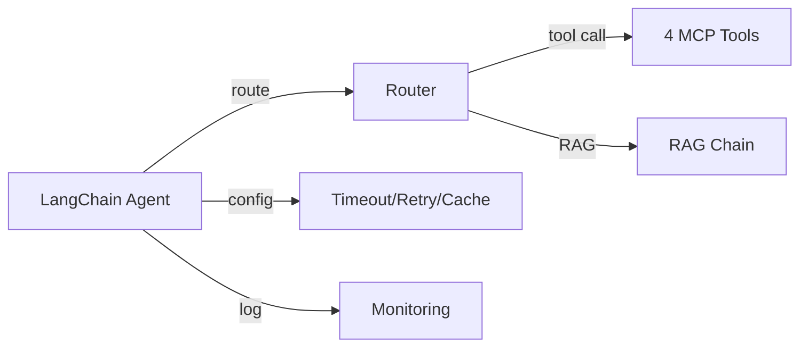

*그림 9-2: LangChain Agent 내부 구성 흐름*

> **참고: CH08과 CH09의 차이**
> CH08은 Router와 Agent를 처음부터 직접 구현하며 원리를 이해하는 데 초점을 맞췄습니다. CH09는 그 원리를 LangChain이 제공하는 표준 컴포넌트(`create_tool_calling_agent`, `AgentExecutor`, `@tool`)로 재구성하고, 운영 관점의 설정을 추가합니다. 두 챕터를 모두 이해해야 "왜 이렇게 쓰는가"를 설명할 수 있습니다.

## 2. 실습 환경 준비

### 2.1 저장소 클론 및 설정

CH09 예제 저장소를 클론하고 환경을 설정합니다.

```bash
git clone https://github.com/your-org/connect-hr-ai.git
cd connect-hr-ai/CH09_LangChain_연결
```

환경 변수 파일을 복사하고 값을 채웁니다.

```bash
cp .env.example .env
```

`.env` 파일의 주요 설정 항목입니다.

```
# LLM 제공자: ollama (기본) 또는 openai
LLM_PROVIDER=ollama
OLLAMA_BASE_URL=http://localhost:11434
OLLAMA_MODEL=deepseek-r1:8b

# PostgreSQL (CH04에서 실행 중인 컨테이너)
POSTGRES_HOST=localhost
POSTGRES_PORT=5432
POSTGRES_DB=metacoding_db

# ChromaDB (CH06에서 구축한 인덱스 경로)
CHROMA_PERSIST_DIR=./data/chroma_db

# 응답 캐시 설정
CACHE_TTL=3600
```

의존성을 설치합니다.

```bash
pip install -r requirements.txt
```

> **주의: PostgreSQL과 ChromaDB 사전 준비**
> CH09 실습은 CH04의 PostgreSQL과 CH06의 ChromaDB가 준비되어 있어야 합니다. Docker 컨테이너가 실행 중인지 확인하십시오. 실행되지 않은 경우 4개 MCP 도구는 자동으로 모의(mock) 데이터로 대체되어 동작하므로 학습에는 지장이 없습니다.

### 2.2 실행 확인

에이전트를 실행합니다.

```bash
python src/main.py
```

**실행 결과:**
```
============================================================
Q/A 사내 AI 비서 — CH09 LangChain 연결 전략 예제
============================================================
LLM 제공자: ollama | 모델: deepseek-r1:8b
[ConnectHRAgent] 초기화 시작...
[ConnectHRAgent] 초기화 완료 (도구 수: 4, RAG 체인: 활성)

Q/A 사내 AI 비서가 준비되었습니다.
종료하려면 'q' 또는 'quit'를 입력하십시오.
데모 시나리오를 보려면 'demo'를 입력하십시오.
============================================================

질문:
```

도구 수가 4, RAG 체인이 "활성"으로 표시되면 정상입니다. `demo`를 입력하면 5개 대표 시나리오가 자동으로 실행됩니다.

<!-- [CAPTURE NEEDED: 09_main-startup
  path: assets/CH09/09_main-startup.png
  desc: python src/main.py 실행 후 "Q/A 사내 AI 비서가 준비되었습니다." 메시지와 도구 수 4, RAG 체인 활성 표시가 나타난 터미널 화면
] -->

*그림 9-3: ConnectHRAgent 초기화 완료 — 도구 4개, RAG 체인 활성*

## 3. MCP Tool 설계

### 3.1 @tool 데코레이터 구조

`@tool` 데코레이터는 일반 Python 함수를 LangChain 에이전트가 사용할 수 있는 도구로 변환합니다. 데코레이터가 하는 일을 이해하면 새 도구를 스스로 추가할 수 있습니다.

**다음 코드는 `@tool` 데코레이터가 함수를 도구로 변환하는 구조를 보여줍니다.**

```python
from langchain_core.tools import tool
from typing import Union

@tool                                                           # ①
def get_leave_balance(employee_name: str) -> Union[dict, str]:  # ②
    """특정 직원의 휴가 잔여일 및 사용 내역을 조회합니다.

    직원 이름을 입력하면 해당 직원의 총 휴가 일수, 사용한 휴가 일수,  # ③
    남은 휴가 일수를 반환합니다.

    Args:
        employee_name: 조회할 직원의 이름 (예: "김민준")

    Returns:
        직원 이름, 부서, 총 휴가, 사용 휴가, 잔여 휴가가 담긴 딕셔너리.
    """
    result = _query_from_db(employee_name)                      # ④
    if result is None:
        result = _query_from_mock(employee_name)
    return result                                               # ⑤
```

> ① `@tool` 데코레이터가 함수를 LangChain 도구 객체로 변환합니다. LLM에게 전달할 JSON 스키마가 이 시점에 자동 생성됩니다.
> ② 파라미터의 타입 힌트(`str`)가 스키마의 필드 타입으로 변환됩니다. LLM은 이 타입을 보고 올바른 값을 전달합니다.
> ③ 독스트링의 첫 줄이 도구 설명(description)으로 사용됩니다. LLM이 어느 도구를 선택할지 판단하는 가장 중요한 정보입니다.
> ④ PostgreSQL 조회를 먼저 시도하고, 연결 실패 시 모의 데이터로 자동 대체합니다.
> ⑤ 반환값은 문자열 또는 딕셔너리 모두 허용됩니다. LangChain이 자동으로 직렬화합니다.

> 전체 코드: `src/tools/leave_balance.py`

> **동작 요약:** 이 코드는 LLM이 질문을 분석하여 추출한 `employee_name` 문자열을 받아, PostgreSQL에서 직원 ID를 조회한 뒤 휴가 잔여 정보를 검색하며 연결 실패 시 모의 데이터로 자동 폴백하는 과정을 수행하고, `{"employee_name": "김민준", "dept": "인사팀", "total_leaves": 15.0, "used_leaves": 5.0, "remaining_leaves": 10.0}` 형태의 딕셔너리를 반환합니다.

### 3.2 4개 도구 구현

CH09에서 구현하는 4개 도구는 실무에서 가장 빈번한 HR 시스템 조회 패턴을 커버합니다. 이 4가지 패턴을 익히면 새 도구를 스스로 추가할 수 있습니다.

| 도구 | 파일 | 데이터 소스 | 파라미터 |
|------|------|-----------|---------|
| `get_leave_balance` | `tools/leave_balance.py` | PostgreSQL (leave_balance 테이블) | `employee_name: str` |
| `get_sales_sum` | `tools/sales_sum.py` | PostgreSQL (sales 테이블) | `dept: Optional[str]` |
| `list_employees` | `tools/list_employees.py` | PostgreSQL (employees 테이블) | `dept: Optional[str]` |
| `search_documents` | `tools/search_documents.py` | ChromaDB (documents 컬렉션) | `query: str` |

**다음 코드는 `search_documents` 도구가 ChromaDB를 검색하는 핵심 로직입니다.**

```python
@tool
def search_documents(query: str) -> list[dict]:
    """사내 규정, 가이드라인, 정책 등 비정형 문서 내용을 검색합니다."""
    # ChromaDB 검색 시도 → 실패 시 모의 데이터로 폴백
    results = _search_from_chroma(query)                         # ①
    if results is None:
        results = _search_from_mock(query)                       # ②
    return results                                               # ③

def _search_from_chroma(query: str, top_k: int = 3):
    client = chromadb.PersistentClient(path=chroma_dir)
    collection = client.get_collection("documents")
    model = SentenceTransformer(embedding_model)
    query_embedding = model.encode(query).tolist()               # ④
    results = collection.query(
        query_embeddings=[query_embedding],
        n_results=top_k,
        include=["documents", "metadatas", "distances"],         # ⑤
    )
    ...
```

> ① ChromaDB가 구축되어 있으면 의미론적 유사도 검색을 수행합니다.
> ② ChromaDB 연결 실패 시(CH06 미완료 상태) 모의 문서 5개로 자동 대체합니다. 이 설계 덕분에 CH09는 CH06 없이도 독립 실행이 가능합니다.
> ③ 결과는 `[{"content": str, "source": str, "score": float}]` 형태의 딕셔너리 목록으로 반환됩니다.
> ④ 사용자 질문을 동일한 임베딩 모델로 벡터화합니다. CH06에서 문서 저장 시 사용한 모델과 반드시 일치해야 합니다.
> ⑤ `distances` 포함 옵션으로 유사도 점수를 함께 반환합니다. 거리값(0~2)을 `1 - distance`로 변환하여 점수(0~1)로 표현합니다.

> 전체 코드: `src/tools/search_documents.py`

> **동작 요약:** 이 코드는 `"연차 사용 규정이 어떻게 되나요?"`와 같은 `query` 문자열을 받아, 쿼리를 임베딩으로 변환한 뒤 ChromaDB에서 상위 3개의 유사 문서를 검색하고 점수를 포함하여 포맷팅하는 과정을 수행하고, `[{"content": "연차 휴가는...", "source": "HR_취업규칙_v1.0.md", "score": 0.95}, ...]` 형태의 딕셔너리 목록을 반환합니다.

<!-- [GEMINI PROMPT: 09_tool-schema]
path: assets/CH09/09_tool-schema.png
A minimalist black and white technical diagram on a solid white background, 16:9 aspect ratio.
Left side: Python function block labeled "@tool def get_leave_balance(employee_name: str)" with docstring excerpt.
Right side: JSON schema block showing {"name": "get_leave_balance", "description": "...", "parameters": {"employee_name": {"type": "string"}}}.
An arrow labeled "auto-generate" points from the Python block to the JSON block.
Below, a small LLM brain icon receiving the JSON schema.
Clean thin line art, Korean labels on key parts, white background.
Style: architecture-infographic
-->

*그림 9-4: @tool 데코레이터가 Python 함수로부터 LLM용 JSON 스키마를 자동 생성하는 과정*

### 3.3 도구 스키마와 LLM 판단

`@tool` 데코레이터가 생성하는 스키마를 직접 확인하면 LLM이 어떻게 도구를 선택하는지 이해할 수 있습니다.

**다음 코드는 생성된 도구 스키마를 출력하는 확인 방법입니다.**

```python
from tools import get_leave_balance, get_sales_sum, list_employees, search_documents

tools = [get_leave_balance, get_sales_sum, list_employees, search_documents]
for t in tools:
    print(f"도구명: {t.name}")              # ①
    print(f"설명: {t.description[:60]}...") # ②
    print(f"스키마: {t.args}")              # ③
    print()
```

> ① `t.name` — 함수명이 도구 이름으로 사용됩니다.
> ② `t.description` — 독스트링 첫 줄이 도구 설명이 됩니다. LLM이 도구를 선택할 때 가장 먼저 읽는 정보입니다.
> ③ `t.args` — 파라미터 타입 힌트와 독스트링의 Args 섹션을 합성하여 생성된 스키마입니다.

**실행 결과:**
```
도구명: get_leave_balance
설명: 특정 직원의 휴가 잔여일 및 사용 내역을 조회합니다...
스키마: {'employee_name': {'title': 'Employee Name', 'type': 'string'}}

도구명: search_documents
설명: 사내 규정, 가이드라인, 정책 등 비정형 문서 내용을 검색합니다...
스키마: {'query': {'title': 'Query', 'type': 'string'}}
```

> **팁: 도구 설명이 성능을 결정합니다**
> LLM이 잘못된 도구를 선택한다면 `description`을 먼저 점검하십시오. "언제 이 도구를 써야 하는가"를 명확하게 기술할수록 LLM의 판단 정확도가 높아집니다. 예를 들어 "직원 이름이 포함된 질문에 사용"처럼 조건을 명시하면 오선택(False Positive) 비율이 줄어듭니다.

## 4. LangChain Agent 구성

### 4.1 ConnectHRAgent 클래스

**다음 코드는 LLM, 도구, RAG 체인을 하나의 에이전트로 통합하는 `ConnectHRAgent` 클래스의 초기화 로직입니다.**

```python
class ConnectHRAgent:
    def __init__(self) -> None:
        self.llm = _build_llm()                                  # ①
        self.tools = [
            list_employees,
            get_leave_balance,
            get_sales_sum,
            search_documents,
        ]                                                         # ②
        self.rag_chain = _build_rag_chain(self.llm)              # ③
        self.agent_executor = self._build_agent_executor()       # ④
```

> ① `_build_llm()` 은 `.env`의 `LLM_PROVIDER` 값에 따라 Ollama 또는 OpenAI LLM 객체를 반환합니다. Timeout 설정도 이 단계에서 LLM 객체에 주입됩니다.
> ② `@tool` 로 정의된 4개 도구를 리스트로 묶어 에이전트에 전달합니다.
> ③ ChromaDB가 준비된 경우 LCEL RAG 체인을 구성합니다. 실패 시 `None`을 반환하고 에이전트가 `search_documents` 도구를 대신 사용합니다.
> ④ `create_tool_calling_agent` + `AgentExecutor` 조합으로 실행 엔진을 구성합니다.

> 전체 코드: `src/agent_config.py`

> **동작 요약:** 이 코드는 `.env` 환경 변수(`LLM_PROVIDER`, `CHROMA_PERSIST_DIR` 등)를 받아, LLM 객체 생성, 도구 목록 구성, RAG 체인 구성, AgentExecutor 조립을 순차적으로 수행하고, 4개 도구와 RAG 체인을 보유한 초기화 완료 에이전트 인스턴스를 반환합니다.

### 4.2 AgentExecutor 운영 설정

**다음 코드는 AgentExecutor에 Timeout과 에러 처리 설정을 적용하는 핵심 부분입니다.**

```python
def _build_agent_executor(self) -> Optional[AgentExecutor]:
    prompt = ChatPromptTemplate.from_messages([           # ①
        ("system", SYSTEM_PROMPT),
        MessagesPlaceholder(variable_name="chat_history", optional=True),
        ("human", "{input}"),
        MessagesPlaceholder(variable_name="agent_scratchpad"),
    ])

    agent = create_tool_calling_agent(self.llm, self.tools, prompt)  # ②

    executor = AgentExecutor(                             # ③
        agent=agent,
        tools=self.tools,
        max_iterations=AGENT_MAX_ITERATIONS,              # ④
        max_execution_time=AGENT_TIMEOUT_SECONDS,         # ⑤
        handle_parsing_errors=True,                       # ⑥
        return_intermediate_steps=True,
        verbose=True,
    )
    return executor
```

> ① 시스템 프롬프트 + 대화 히스토리 + 사용자 입력 + 스크래치패드로 구성된 프롬프트 템플릿입니다. `MessagesPlaceholder`는 멀티턴 대화 히스토리가 자동으로 삽입되는 슬롯입니다.
> ② `create_tool_calling_agent` 는 LLM의 Function Calling 기능을 활용하여 에이전트를 생성합니다. LLM이 직접 "어떤 도구를 어떤 인자로 호출할지" 결정합니다.
> ③ `AgentExecutor` 는 에이전트의 실행 루프를 관리합니다. 도구 호출 → 결과 수신 → 다음 행동 결정 사이클을 반복합니다.
> ④ `max_iterations=10` — 무한 루프 방지용 안전장치입니다. 10번 이상 도구를 호출하면 강제 종료됩니다.
> ⑤ `max_execution_time=60` — 60초 초과 시 실행을 중단합니다. 느린 LLM 응답이나 DB 장애 시 사용자를 무한 대기에서 보호합니다.
> ⑥ `handle_parsing_errors=True` — LLM이 잘못된 형식으로 응답할 때 에러를 발생시키는 대신 자동으로 재시도합니다.

> 전체 코드: `src/agent_config.py`

> **동작 요약:** 이 코드는 SYSTEM_PROMPT, 사용자 질문, 대화 히스토리를 받아, Tool Calling Agent를 생성한 뒤 Timeout 60초와 최대 10회 반복 제한이 설정된 AgentExecutor로 감싸는 과정을 수행하고, 운영 설정이 내장된 실행 가능한 AgentExecutor 객체를 반환합니다.

### 4.3 Router 전략

**다음 코드는 LLM 호출 없이 키워드 기반으로 질문 유형을 빠르게 분류하는 `_classify_route` 함수입니다.**

```python
def _classify_route(query: str) -> str:
    query_lower = query.lower()

    db_keywords = [                                              # ①
        "직원", "부서", "목록", "인원",
        "매출", "실적", "합계",
        "휴가 잔여", "남은 휴가", "연차 잔여",
    ]
    rag_keywords = [                                             # ②
        "규정", "정책", "절차", "가이드",
        "어떻게", "방법", "기준",
        "온보딩", "보안", "재택",
    ]

    db_score = sum(1 for kw in db_keywords if kw in query_lower)  # ③
    rag_score = sum(1 for kw in rag_keywords if kw in query_lower)

    if db_score > 0 and rag_score == 0:
        return "db"                                              # ④
    elif rag_score > 0 and db_score == 0:
        return "rag"
    else:
        return "agent"                                           # ⑤
```

> ① DB 관련 키워드 목록입니다. 직원, 매출, 휴가 잔여와 같은 정형 데이터 조회 의도를 나타내는 단어를 포함합니다.
> ② 문서 검색 관련 키워드 목록입니다. 규정, 정책, 절차처럼 비정형 문서에 답이 있는 의도를 나타냅니다.
> ③ 각 키워드 그룹이 질문에 포함된 횟수를 점수로 계산합니다.
> ④ DB 키워드만 있으면 "db" 경로로 라우팅합니다. Agent 없이 도구를 직접 호출하는 빠른 경로입니다.
> ⑤ 두 가지가 섞이거나 불명확하면 "agent" 경로로 라우팅합니다. LLM이 직접 판단하여 여러 도구를 조합합니다.

> **동작 요약:** 이 코드는 사용자의 자연어 질문 문자열을 받아, 소문자로 변환한 뒤 DB 키워드와 RAG 키워드 각각의 포함 점수를 계산하여 점수 기반으로 질문 유형을 분류하고, `"db"`, `"rag"`, `"agent"` 중 하나의 경로 문자열을 반환합니다.

> **팁: 키워드 목록을 프로젝트에 맞게 조정하십시오**
> 기본 키워드는 일반적인 HR 시스템을 기준으로 작성되었습니다. 실제 서비스에서는 자주 오분류되는 질문을 수집하여 키워드를 추가하거나 제거하십시오. "3단계 라우팅"(규칙 → 스키마 → LLM 판단)은 CH08에서 이미 학습했으므로, CH09에서는 키워드 기반 빠른 분류와 LLM Agent 위임의 두 단계로 단순화했습니다.

## 5. 운영 설정

### 5.1 Retry 로직

네트워크 장애나 LLM 일시적 오류에 대비하여 자동 재시도를 구현합니다.

**다음 코드는 최대 3회까지 자동 재시도하는 `_run_with_retry` 메서드입니다.**

```python
RETRY_MAX_ATTEMPTS: int = 3       # 최대 재시도 횟수
RETRY_DELAY_SECONDS: float = 2.0  # 재시도 간격 (초)

def _run_with_retry(self, query: str, chat_history=None) -> dict:
    last_error = None

    for attempt in range(1, RETRY_MAX_ATTEMPTS + 1):            # ①
        try:
            result = self.agent_executor.invoke({               # ②
                "input": query,
                "chat_history": chat_history or [],
            })
            return result                                        # ③
        except Exception as exc:
            last_error = exc
            logger.warning("[Retry] 시도 %d 실패: %s", attempt, exc)
            if attempt < RETRY_MAX_ATTEMPTS:
                time.sleep(RETRY_DELAY_SECONDS)                  # ④

    return {                                                     # ⑤
        "output": f"죄송합니다. {RETRY_MAX_ATTEMPTS}회 재시도 후 처리에 실패했습니다.",
        "intermediate_steps": [],
    }
```

> ① 최대 3회 반복합니다. 1회 성공이면 즉시 반환하므로 추가 비용이 발생하지 않습니다.
> ② `agent_executor.invoke()` 가 LangChain 에이전트를 실행합니다. 첫 번째 시도이든 세 번째 시도이든 동일한 입력을 전달합니다.
> ③ 성공 시 즉시 반환합니다. 재시도 없이 1회에 성공하는 것이 가장 일반적입니다.
> ④ 2초 대기 후 재시도합니다. 일시적인 네트워크 혼잡이나 모델 부하가 해소될 시간을 줍니다.
> ⑤ 3회 모두 실패하면 사용자에게 오류 메시지를 반환합니다. 예외를 전파하는 대신 정상적인 응답 형식을 유지합니다.

> 전체 코드: `src/agent_config.py`

> **동작 요약:** 이 코드는 사용자 질문과 대화 히스토리를 받아, 에이전트 실행을 최대 3회 시도하되 실패 시 2초 대기 후 재시도하는 과정을 수행하고, 성공 시 결과 딕셔너리를, 3회 모두 실패 시 오류 메시지 딕셔너리를 반환합니다.

### 5.2 구조화된 로깅

실무에서는 로그를 파일로 저장하고 검색·분석해야 합니다. JSON 형식의 구조화된 로그는 로그 분석 시스템(ELK, Datadog 등)과 쉽게 연동됩니다.

**다음 코드는 `JsonFormatter` 클래스가 로그를 JSON 형식으로 직렬화하는 핵심 로직입니다.**

```python
class JsonFormatter(logging.Formatter):
    def format(self, record: logging.LogRecord) -> str:
        log_obj = {                                              # ①
            "timestamp": datetime.now(timezone.utc).isoformat(),
            "level": record.levelname,
            "logger": record.name,
            "message": record.getMessage(),
        }
        if record.exc_info:                                      # ②
            log_obj["exception"] = self.formatException(record.exc_info)
        return json.dumps(log_obj, ensure_ascii=False)           # ③
```

> ① 모든 로그 항목에 타임스탬프, 레벨, 로거명, 메시지를 포함합니다.
> ② 예외 정보가 있으면 스택 트레이스를 `exception` 필드에 포함합니다. 파일 로그에서 오류 추적이 가능합니다.
> ③ `ensure_ascii=False` 옵션으로 한국어 문자가 유니코드 이스케이프 없이 그대로 출력됩니다.

JSON 로그를 활성화하려면 `.env` 파일에서 `USE_JSON_LOG=true` 로 설정합니다.

**JSON 로그 출력 예시:**
```json
{
  "timestamp": "2026-02-27T09:15:32.445Z",
  "level": "INFO",
  "logger": "agent_config",
  "message": "[ConnectHRAgent] 처리 완료 (경로: db, 소요: 1240ms)"
}
```

> 전체 코드: `src/monitoring.py`

### 5.3 응답 캐싱

동일한 질문이 반복될 때 LLM을 재호출하면 비용과 시간이 낭비됩니다. **ResponseCache** 는 TTL(Time To Live) 기반 인메모리 캐시로 반복 호출을 방지합니다.

**다음 코드는 캐시 조회와 저장의 핵심 로직입니다.**

```python
class ResponseCache:
    def get(self, query: str, context: str = "") -> Optional[Any]:
        key = self._make_key(query, context)                     # ①
        entry = self._store.get(key)
        if entry is None:
            return None                                          # ②
        value, expires_at = entry
        if time.time() > expires_at:
            del self._store[key]
            return None                                          # ③
        return value                                             # ④

    def _make_key(self, query: str, context: str = "") -> str:
        raw = f"{query}::{context}"
        return hashlib.sha256(raw.encode("utf-8")).hexdigest()   # ⑤
```

> ① SHA-256 해시로 캐시 키를 생성합니다. 동일한 질문은 항상 동일한 키를 생성합니다.
> ② 캐시에 없으면 `None` 반환 → 에이전트가 LLM을 호출합니다.
> ③ TTL(기본 1시간)이 지난 항목은 자동으로 만료 처리합니다.
> ④ 유효한 캐시가 있으면 LLM 호출 없이 저장된 응답을 반환합니다.
> ⑤ 해시 기반 키로 동일 질문을 정확하게 식별합니다. 띄어쓰기 하나가 다르면 다른 키가 생성됩니다.

**에이전트의 `run()` 메서드에서 캐시를 사용하는 흐름:**

```python
def run(self, query: str, use_cache: bool = True) -> dict:
    if use_cache:
        cached = response_cache.get(query)                       # ①
        if cached is not None:
            cached["from_cache"] = True
            return cached                                        # ②

    # 캐시 미스 → Agent 실행
    result = self._run_with_retry(query, chat_history)           # ③

    if use_cache:
        response_cache.set(query, result)                        # ④
    return result
```

> ① 캐시 조회를 먼저 수행합니다.
> ② 캐시 적중 시 LLM 호출 없이 즉시 반환합니다. `from_cache: True` 플래그로 캐시 응답임을 표시합니다.
> ③ 캐시 미스 시에만 에이전트를 실행합니다.
> ④ 새로운 응답을 캐시에 저장합니다. 다음 동일 질문부터 캐시를 활용합니다.

> 전체 코드: `src/cache.py`

> **동작 요약:** 이 코드는 질문 문자열과 `use_cache` 플래그를 받아, SHA-256 해시로 캐시 키를 생성하여 캐시를 조회하고, 캐시 미스 시 에이전트를 실행한 뒤 결과를 캐시에 저장하는 과정을 수행하고, `{"output": str, "route": str, "from_cache": bool, "intermediate_steps": list}` 형태의 응답 딕셔너리를 반환합니다.

### 5.4 토큰 사용량 추적

LLM API 호출 비용을 파악하지 못하면 예상치 못한 청구서를 받게 됩니다. **TokenTracker** 는 각 호출의 토큰 사용량과 예상 비용을 누적 집계합니다.

**다음 코드는 토큰 기록과 비용 계산 로직입니다.**

```python
COST_PER_1K_TOKENS = {
    "gpt-4o-mini": {"input": 0.00015, "output": 0.0006},
    "gpt-4o":      {"input": 0.005,   "output": 0.015},
    "deepseek-r1:8b": {"input": 0.0,  "output": 0.0},  # 로컬 무료
}

def record(self, model, input_tokens, output_tokens, operation, latency_ms):
    cost_table = self.COST_PER_1K_TOKENS.get(model, {"input": 0.0, "output": 0.0})  # ①
    cost_usd = (
        (input_tokens / 1000 * cost_table["input"])
        + (output_tokens / 1000 * cost_table["output"])
    )                                                                                 # ②
    self._records.append({
        "model": model, "input_tokens": input_tokens,
        "cost_usd": round(cost_usd, 6), "latency_ms": round(latency_ms, 2),
    })                                                                                # ③
```

> ① 모델별 토큰 단가 테이블을 참조합니다. Ollama 로컬 모델은 단가가 0이지만 기록은 유지됩니다.
> ② 입력 토큰과 출력 토큰의 단가가 다르므로 별도 계산합니다. 출력 토큰이 일반적으로 더 비쌉니다.
> ③ 호출 기록을 누적합니다. `summary()` 호출로 총 사용량과 비용을 조회할 수 있습니다.

`stats` 명령으로 누적 통계를 확인합니다.

```bash
질문: stats
```

**출력 예시:**
```
[토큰 사용량 요약]
{'total_calls': 5, 'total_tokens': 3420, 'total_cost_usd': 0.000513, 'avg_latency_ms': 1842}
```

> 전체 코드: `src/monitoring.py`

### 5.5 Langfuse 모니터링 소개

**Langfuse** 는 LLM 애플리케이션을 위한 오픈소스 관측(Observability) 도구입니다. 각 LLM 호출의 입력, 출력, 지연 시간, 비용을 웹 대시보드에서 시각적으로 확인할 수 있습니다.

<!-- [GEMINI PROMPT: 09_langfuse-concept]
path: assets/CH09/09_langfuse-concept.png
A minimalist black and white technical diagram on a solid white background, 16:9 aspect ratio.
Left side: LangChain Application box with sub-items: "Agent", "Tools", "RAG Chain".
Arrow from the Application box to a center node labeled "Langfuse SDK".
Right side: Langfuse Dashboard box showing three small panels: "Trace Timeline", "Token Usage Chart", "Cost Summary".
Arrow from Langfuse SDK to Dashboard.
Clean thin line art, Korean labels, white background.
Style: architecture-infographic
-->

*그림 9-5: LangChain 애플리케이션에서 Langfuse로 LLM 호출 추적 데이터를 전송하는 구조*

CH09에서는 Langfuse를 **간략하게 소개** 합니다. 코드에 연동 준비는 완료되어 있지만, 심화 활용은 이 책의 범위를 벗어납니다.

**Langfuse를 활성화하는 방법:**

1. [cloud.langfuse.com](https://cloud.langfuse.com) 에 접속하여 무료 계정을 생성합니다.
2. API 키를 발급받습니다 (Public Key + Secret Key).
3. `.env` 파일에 키를 추가합니다.

```bash
# .env에 추가
LANGFUSE_PUBLIC_KEY=pk-lf-...
LANGFUSE_SECRET_KEY=sk-lf-...
LANGFUSE_HOST=https://cloud.langfuse.com
```

4. Langfuse 패키지를 설치합니다.

```bash
pip install langfuse
```

키가 설정되면 `LangfuseMonitor`가 자동으로 활성화되고 각 에이전트 실행이 Langfuse 대시보드에 기록됩니다. 키가 없으면 `LangfuseMonitor`의 모든 메서드는 아무 동작도 하지 않으므로(no-op), 설치 없이도 정상 동작합니다.

> **참고: Langfuse는 "다음 단계"의 도구입니다**
> 개발 단계에서는 로컬 로그로 충분합니다. Langfuse는 팀이 공유하는 스테이징이나 프로덕션 환경에서 진가를 발휘합니다. "어떤 질문에서 LLM 비용이 많이 발생하는가", "어떤 시나리오에서 응답 시간이 길어지는가"를 추적하여 CH10의 튜닝 방향을 결정하는 데 활용할 수 있습니다.

### 5.6 캐시 적중률 확인

`demo` 명령으로 5개 시나리오를 실행한 후 `stats`로 캐시 효과를 확인합니다.

```bash
질문: demo
질문: stats
```

**실행 결과:**
```
[응답 캐시 통계]
{'total_items': 4, 'hits': 1, 'misses': 4, 'hit_rate_percent': 20.0, 'ttl_seconds': 3600}
```

두 번째 이후 동일 질문부터 적중률이 올라갑니다.

<!-- [CAPTURE NEEDED: 09_demo-result
  path: assets/CH09/09_demo-result.png
  desc: python src/main.py 실행 후 demo 명령으로 5개 시나리오가 실행되고 각 결과에 [라우팅 경로]와 [AI 답변]이 출력된 터미널 화면
] -->

*그림 9-6: demo 모드 실행 결과 — 라우팅 경로와 AI 답변이 각 시나리오별로 출력*

## 6. 정리하며

CH08에서 만든 통합 에이전트를 LangChain 표준 구성으로 정리하고, 운영 환경에 필요한 설정을 추가했습니다. 이제 Q/A 사내 AI 비서는 프로덕션 전환을 위한 기반을 갖췄습니다.

- **`@tool` 데코레이터가 스키마를 자동 생성합니다**: 함수의 타입 힌트와 독스트링을 작성하면 LLM이 이해하는 JSON 스키마가 자동으로 만들어집니다. 4개 도구 패턴을 익히면 새 도구를 스스로 추가할 수 있습니다.
- **AgentExecutor가 Timeout과 에러를 처리합니다**: `max_execution_time=60`, `handle_parsing_errors=True` 설정 두 줄이 프로덕션의 첫 번째 장애 시나리오를 방어합니다.
- **Retry + Cache 조합이 비용과 안정성을 동시에 개선합니다**: Retry는 일시적 오류를 복구하고, Cache는 반복 호출을 방지하여 비용과 응답 시간을 절감합니다.
- **Langfuse는 "다음 단계"의 도구입니다**: LLM 호출 추적과 비용 관리를 위한 모니터링의 존재를 인지하고, 프로덕션 준비가 완료되면 활성화하십시오.

다음 챕터에서는 이 시스템의 RAG 품질을 체계적으로 측정하고 개선합니다. CH08에서 확립한 10개 시나리오를 기준선으로 삼아, Chunk 튜닝, ReRanker, Hybrid Search 등의 기법을 적용하고 before/after 비교로 개선 효과를 수치로 확인합니다.

---

# 10. RAG 튜닝

이 챕터에서는 "되는 수준"의 RAG 시스템을 "쓸 만한 수준"으로 끌어올리는 실전 튜닝 기법을 학습합니다. 증상에서 시작하여 처방을 찾고, 튜닝 전후를 수치로 비교하는 평가 체계까지 구축합니다.

CH09에서 LangChain 표준 구성으로 정리한 에이전트는 동작하지만, 품질이 기대에 미치지 못할 수 있습니다. "왜 이런 답변이 나왔는가"를 진단하고 개선하는 과정이 바로 RAG 튜닝입니다. 이 챕터를 마치면 Q/A 사내 AI 비서가 완성됩니다.

<!-- [GEMINI PROMPT: 10_rag-tuning-overview]
path: assets/CH10/10_rag-tuning-overview.png
Minimalist flat-design infographic showing RAG tuning pipeline. Left side shows problem symptom icons (inaccurate answer, wrong retrieval, misunderstood intent). Center shows tuning steps in order: Prompt Tuning → Chunk Tuning → ReRanker → Hybrid Search → Query Rewrite → Advanced Retriever. Right side shows evaluation icons (before/after bar chart, RAGAS score). White background, Korean labels, 16:9 aspect ratio, thin line art only.
Style: architecture-infographic
-->

*그림 10-1: 증상에서 평가까지, RAG 튜닝의 전체 흐름*

---

## 1. 증상으로 시작하는 튜닝

실무에서 RAG 튜닝은 "이론을 알아서"가 아니라 "문제가 생겨서" 시작합니다. "답변이 자꾸 틀린다", "엉뚱한 문서가 검색된다", "질문의 의도를 못 파악한다"는 증상이 나타날 때, 적절한 처방을 선택하는 것이 핵심입니다.

아래 표를 기준으로 증상을 먼저 진단하고 해당 섹션으로 이동하십시오.

| 증상 | 처방 | 관련 섹션 |
|------|------|---------|
| 답변이 부정확하거나 근거 없음 | Chunk 튜닝, ReRanker | 2절, 4절 |
| 관련 없는 문서가 검색됨 | Hybrid Search, 메타데이터 필터링 | 3절, 5절 |
| 질문 의도를 못 파악함 | Query Rewrite, 약어 확장 | 7절 |
| 너무 짧거나 단편적인 답변 | Parent Document Retriever | 6절 |
| 특정 부서/문서만 검색하고 싶음 | Self-Query Retriever | 6절 |
| 이미지가 포함된 PDF 파싱 실패 | Vision + OCR 하이브리드 | 9절 |
| 답변 형식이 일정하지 않음 | 프롬프트 튜닝 | 8절 |
| 개선 효과를 수치로 확인하고 싶음 | 평가 체계 (RAGAS) | 10절 |

```mermaid
flowchart TD
    A["증상 진단"] --> B["1순위: 프롬프트 튜닝"]
    B --> C["2순위: Chunk 조정"]
    C --> D["3순위: ReRanker"]
    D --> E["4순위: Hybrid Search"]
    E --> F["5순위: Query Rewrite"]
    F --> G["평가(RAGAS)"]
```

*그림 10-2: 튜닝 우선순위 흐름 — 비용이 낮은 것부터 적용한다*

> **참고: 튜닝 우선순위를 지키는 이유**
> 모든 기법을 동시에 적용하면 어떤 변경이 효과를 냈는지 알 수 없습니다. 비용이 낮은 순서로 하나씩 적용하고, 각 단계에서 수치를 측정한 후 다음 단계로 넘어가십시오.

---

## 2. Chunk 튜닝

청킹(Chunking)은 RAG 품질에서 가장 큰 영향을 미치는 요소 중 하나입니다. CH06에서 Fixed-size 500자 청킹을 기본값으로 사용했지만, 이 설정이 모든 문서에 최적이지는 않습니다.

### 2.1. Fixed-size vs Semantic 청킹 비교

**Fixed-size 청킹** 은 텍스트를 정해진 글자 수로 기계적으로 자르는 방식입니다. 빠르고 예측 가능하지만, 중요한 문장이 두 청크에 걸쳐 잘릴 수 있습니다.

**Semantic 청킹(의미 단위 청킹)** 은 임베딩 유사도를 이용하여 의미가 전환되는 지점에서 분할합니다. 품질이 높지만 임베딩 모델 로드 시간이 필요합니다.

| 전략 | 특징 | 처리 속도 | 품질 | 추천 상황 |
|------|------|---------|------|---------|
| Fixed-size (500자) | 균일한 크기 | 매우 빠름 | 보통 | 빠른 프로토타이핑 |
| Recursive Character | 문단/문장 경계 존중 | 빠름 | 좋음 | 일반 운영 환경 |
| Semantic Chunking | 의미 단위 분할 | 느림 (임베딩 필요) | 최고 | 품질이 최우선일 때 |

### 2.2. 실습: Chunk 실험 실행

먼저 예제 저장소를 클론하십시오.

```bash
git clone https://github.com/your-org/ch10-rag-tuning.git
cd ch10-rag-tuning
cp .env.example .env
```

`.env` 파일에 아래 값을 입력하십시오.

```bash
LLM_PROVIDER=ollama
OLLAMA_BASE_URL=http://localhost:11434
OLLAMA_MODEL=deepseek-r1:8b
EMBEDDING_MODEL=jhgan/ko-sroberta-multitask
```

의존성을 설치하고 청킹 실험을 실행하십시오.

```bash
pip install -r requirements.txt
python tuning/chunk_experiment.py
```

**다음 코드는 세 가지 청킹 전략을 비교하여 결과를 출력합니다.**

```python
def run_strategy_comparison(text: str) -> list[dict]:
    results = []

    # Fixed-size 청킹                          # ①
    fixed_chunks = fixed_size_chunking(
        text, chunk_size=500, overlap=50
    )
    fixed_stats = analyze_chunks(fixed_chunks)
    results.append({
        "전략": "Fixed-size (500자)",
        "청크 수": fixed_stats["count"],
        "특징": "균일한 크기, 빠른 처리"        # ②
    })

    # Recursive Character 청킹                  # ③
    recursive_chunks = recursive_character_chunking(
        text, chunk_size=500, chunk_overlap=50
    )

    # Semantic 청킹 (임베딩 모델 필요)           # ④
    semantic_chunks = semantic_chunking(text)

    return results
```

> ① 500자 단위로 50자 오버랩을 적용하여 균일하게 분할합니다.
> ② 처리 속도가 빠르지만, 문장 중간에서 잘릴 수 있다는 단점이 있습니다.
> ③ LangChain의 `RecursiveCharacterTextSplitter`를 사용하여 `\n\n`, `\n`, `.` 순서로 경계를 존중하며 분할합니다.
> ④ `ko-sroberta-multitask` 임베딩으로 의미가 바뀌는 지점에서 자릅니다. `SemanticChunker`는 `langchain-experimental` 패키지가 필요합니다.

**실행 결과:**

```
청킹 전략 비교
┌──────────────────────┬────────┬──────────┬─────────────┐
│ 전략                 │ 청크 수 │ 평균 크기 │ 특징        │
├──────────────────────┼────────┼──────────┼─────────────┤
│ Fixed-size (500자)   │ 8      │ 487자    │ 균일한 크기  │
│ Recursive Character  │ 7      │ 512자    │ 경계 존중   │
│ Semantic Chunking    │ 5      │ 712자    │ 의미 단위   │
└──────────────────────┴────────┴──────────┴─────────────┘
권장 설정:
  - 빠른 처리 필요: Fixed-size (500자, 20% 오버랩)
  - 균형 잡힌 성능: Recursive Character (500자, 50자 오버랩)
  - 최고 품질 목표: Semantic Chunking
```

<!-- [CAPTURE NEEDED: 10_chunk-experiment-output
  path: assets/CH10/10_chunk-experiment-output.png
  desc: python tuning/chunk_experiment.py 실행 후 청킹 전략 비교 테이블과 권장 설정이 출력된 터미널 화면
] -->

*그림 10-3: 세 가지 청킹 전략의 비교 결과*

> 전체 코드: `tuning/chunk_experiment.py`

> **동작 요약:** 이 코드는 샘플 문서 텍스트(또는 `data/` 폴더의 실제 문서)를 받아 Fixed-size, Recursive Character, Semantic 순서로 청킹을 실행하고 각 전략의 청크 수/평균 크기/실행 시간 통계를 계산하여, 전략별 비교 테이블과 오버랩 비율(10%/20%/30%) 실험 결과를 출력합니다.

> **팁: 청크 크기 선택 가이드**
> - 300자: 정확한 사실 검색 (규정 조항, 날짜, 숫자)에 유리합니다.
> - 500자: 대부분의 상황에서 균형 잡힌 기본값입니다.
> - 1000자: 맥락이 중요한 서술형 문서에 유리합니다.
> 오버랩은 20%를 권장합니다. 오버랩이 없으면 청크 경계에서 정보가 단절됩니다.

---

## 3. Retriever 튜닝

Retriever(검색기) 설정은 "얼마나 많이 검색할 것인가"와 "얼마나 확실한 문서만 반환할 것인가"를 결정합니다.

### 3.1. k값 실험

`k`는 ChromaDB에서 반환할 문서 수입니다. k=3이면 상위 3개 문서만 LLM에 전달합니다.

```bash
python tuning/retriever_experiment.py
```

**다음 코드는 k값(3/5/10), 유사도 임계값, 메타데이터 필터를 실험합니다.**

```python
def run_k_value_experiment(
    retriever: InMemoryRetriever,
    test_queries: list[str]
) -> list[dict]:
    results = []
    k_values = [3, 5, 10]

    for k in k_values:                            # ①
        avg_top_score = 0.0
        for query in test_queries:
            docs = retriever.search(query, k=k)   # ②
            if docs:
                avg_top_score += docs[0]["score"]

        results.append({
            "k값": k,
            "추천 상황": _get_k_recommendation(k) # ③
        })

    return results
```

> ① k=3, 5, 10 세 가지 값으로 반복 실험합니다.
> ② 각 쿼리에 대해 지정된 k개 문서를 검색합니다.
> ③ k=5가 일반적인 RAG 최적값입니다. k=10은 ReRanker와 함께 사용할 때 효과적입니다.

> **동작 요약:** 이 코드는 5개 테스트 쿼리와 k값 목록 [3, 5, 10], similarity threshold [0.0~0.5]를 받아 각 k값으로 검색을 실행하고 반환 문서 수/최고 점수 집계, threshold별 필터링 효과 계산, 메타데이터 필터(부서별/문서 유형별) 적용을 수행하여, k값별/threshold별/필터별 비교 테이블과 권장 설정(`k=5, threshold=0.2`)을 반환합니다.

> 전체 코드: `tuning/retriever_experiment.py`

### 3.2. 메타데이터 필터링

CH05에서 문서 파일명에 부서 코드와 버전을 포함시킨 이유가 바로 이 시점에 드러납니다. 메타데이터 필터를 적용하면 검색 범위를 좁혀 정확도를 높일 수 있습니다.

```python
# HR 부서 문서만 검색
docs = retriever.search(
    query="연차 신청 절차",
    k=5,
    metadata_filter={"department": "HR"}
)

# 최신 버전 문서만 검색
docs = retriever.search(
    query="보안 정책",
    k=5,
    metadata_filter={"version": "v3.0"}
)
```

> **주의: 메타데이터 필터 과도 적용**
> 메타데이터 필터를 너무 좁게 설정하면 관련 문서를 아예 놓칠 수 있습니다. 필터 없이 먼저 검색해보고, 불필요한 문서가 많을 때만 필터를 추가하십시오.

---

## 4. ReRanker

ReRanker(재정렬기)는 초기 벡터 검색 결과를 더 정밀하게 재정렬하는 모델입니다. 벡터 검색은 의미적 유사도를 측정하지만, **Cross-Encoder(크로스 인코더)** 는 질문과 문서를 함께 처리하여 실제 관련성을 더 정확하게 평가합니다.

<!-- [GEMINI PROMPT: 10_reranker-concept]
path: assets/CH10/10_reranker-concept.png
Minimalist flat-design diagram showing ReRanker two-stage process. Left: Vector Search box with "k=20 broad search" label, showing 20 document icons with varying relevance scores. Arrow pointing to center: Cross-Encoder box with "query + doc pairs scoring" label. Arrow pointing to right: Final Result box with "k=5 refined results" label showing only 5 top documents. White background, Korean labels, 16:9 aspect ratio.
Style: architecture-infographic
-->

*그림 10-4: 넓게 검색 후 Cross-Encoder로 정제하는 2단계 ReRanker 구조*

```bash
python tuning/reranker.py
```

**다음 코드는 Cross-Encoder 기반 ReRanker로 검색 결과를 재정렬합니다.**

```python
class CrossEncoderReranker:

    def rerank(
        self,
        query: str,
        documents: list[dict],
        top_k: int = 5
    ) -> list[dict]:
        # Cross-Encoder에 (질문, 문서) 쌍 입력
        pairs = [(query, doc["content"]) for doc in documents]  # ①

        # Cross-Encoder 점수 계산
        scores = self.model.predict(pairs)                       # ②

        # 점수 기준 재정렬
        for doc, score in zip(documents, scores):
            doc["cross_encoder_score"] = float(score)           # ③

        reranked = sorted(
            documents,
            key=lambda x: x.get("cross_encoder_score", 0),
            reverse=True
        )
        return reranked[:top_k]                                  # ④
```

> ① 질문과 각 문서를 쌍으로 묶습니다. Cross-Encoder는 이 쌍을 동시에 처리하기 때문에 Bi-Encoder(벡터 검색)보다 정확합니다.
> ② `model.predict(pairs)`가 각 쌍의 관련성 점수를 반환합니다. 이 호출이 처리 시간의 대부분을 차지합니다.
> ③ 기존 벡터 점수 대신 Cross-Encoder 점수를 각 문서에 부착합니다.
> ④ Cross-Encoder 점수 기준으로 정렬한 후 상위 5개만 반환합니다.

**실행 결과:**

```
쿼리: 연차 신청 절차는 어떻게 됩니까

리랭킹 전 (Vector Search 순위)
┌────┬───────┬──────────┬─────────────────────────────────────────┐
│ 순위│ 문서 ID│ Vector 점수│ 내용 미리보기                          │
├────┼───────┼──────────┼─────────────────────────────────────────┤
│  1 │ d03   │ 0.420    │ 팀장은 업무 상황에 따라 휴가 시기를...   │
│  2 │ d01   │ 0.450    │ 연차유급휴가는 1년 이상 근속 직원에게... │
└────┴───────┴──────────┴─────────────────────────────────────────┘

리랭킹 후 (Cross-Encoder 순위)
┌────┬───────┬──────────┬─────────────────────────────────────────┐
│ 순위│ 문서 ID│ CE 점수  │ 내용 미리보기                          │
├────┼───────┼──────────┼─────────────────────────────────────────┤
│  1 │ d02   │ 0.891    │ 연차 신청은 3일 전 인사담당자에게 서면... │
│  2 │ d01   │ 0.734    │ 연차유급휴가는 1년 이상 근속 직원에게... │
└────┴───────┴──────────┴─────────────────────────────────────────┘
```

벡터 검색에서 순위권 밖이었던 "연차 신청 절차" 문서(d02)가 ReRanker 적용 후 1위로 올라온 것을 확인할 수 있습니다.

<!-- [CAPTURE NEEDED: 10_reranker-result
  path: assets/CH10/10_reranker-result.png
  desc: python tuning/reranker.py 실행 결과. 리랭킹 전/후 순위 비교 테이블이 표시된 터미널 화면.
] -->

*그림 10-4: ReRanker 적용 전후 순위 비교 — d02 문서가 순위권 밖에서 1위로 올라온다*

> **동작 요약:** 이 코드는 검색 쿼리와 초기 벡터 검색 결과(k=10 또는 k=20), 반환할 최종 문서 수(top_k=5)를 받아 `(query, doc)` 쌍을 생성하고 Cross-Encoder 점수를 계산하여 재정렬한 뒤, 품질이 개선된 상위 5개 문서를 리랭킹 전후 순위 변화 비교와 함께 반환합니다.

> 전체 코드: `tuning/reranker.py`

> **팁: ReRanker 사용 시 처리 시간**
> Cross-Encoder는 문서 수에 비례하여 처리 시간이 증가합니다. k=20으로 넓게 검색 후 ReRanker로 k=5로 정제하는 전략을 권장합니다. `cross-encoder/ms-marco-MiniLM-L-6-v2`는 영한 혼용 문서에도 사용 가능하며, 순수 한국어 환경에서는 `bongsoo/moco-cross-encoder-v2`를 고려하십시오.

---

## 5. Hybrid Search

**Hybrid Search(하이브리드 검색)** 는 키워드 기반 검색(BM25)과 벡터 기반 의미 검색을 결합하는 방식입니다.

- **BM25** 는 전통적인 키워드 검색 알고리즘으로, 정확한 단어 일치에 강합니다. "연차 15일", "5영업일" 같은 구체적인 수치나 고유명사 검색에 효과적입니다.
- **Vector Search** 는 "휴가 규정"과 "연차 정책"이 같은 의미임을 이해하는 의미 검색에 강합니다.

두 방식을 결합하면 키워드 정확도와 의미 이해를 동시에 얻을 수 있습니다.

```bash
python tuning/hybrid_search.py
```

**다음 코드는 BM25와 Vector 검색 결과를 alpha 가중치로 결합합니다.**

```python
class EnsembleRetriever:

    def search(
        self,
        query: str,
        top_k: int = 5,
        fetch_k: int = 10
    ) -> list[dict]:
        # 두 검색기에서 각각 후보 문서 수집
        bm25_results = self.bm25_retriever.search(query, top_k=fetch_k)    # ①
        vector_results = self.vector_retriever.search(query, top_k=fetch_k)

        # 점수를 0~1 범위로 정규화
        bm25_results = self._normalize_scores(bm25_results)                # ②
        vector_results = self._normalize_scores(vector_results)

        # alpha 가중치로 하이브리드 점수 계산
        for doc_data in doc_scores.values():
            hybrid_score = (
                self.alpha * doc_data["vector_score"]                      # ③
                + (1 - self.alpha) * doc_data["bm25_score"]
            )

        final_results.sort(key=lambda x: x["hybrid_score"], reverse=True)
        return final_results[:top_k]                                       # ④
```

> ① 각 검색기에서 더 많은 후보(fetch_k=10)를 수집합니다. 최종 반환은 top_k=5이지만, 결합 전 더 넓은 범위에서 후보를 확보합니다.
> ② BM25 점수와 Vector 점수의 단위가 다르기 때문에 0~1로 정규화한 후 비교합니다.
> ③ `alpha=0.5`이면 두 방식을 동등하게 반영합니다. `alpha=0.7`이면 Vector 중심, `alpha=0.3`이면 BM25 중심입니다.
> ④ 하이브리드 점수 기준으로 정렬한 최종 결과를 반환합니다.

> **동작 요약:** 이 코드는 검색 쿼리와 alpha 파라미터(0.0~1.0), 반환 문서 수(top_k)를 받아 BM25 검색과 Vector 검색을 각각 실행한 뒤 점수를 정규화하고 alpha 가중치로 결합하여 최종 정렬을 수행하며, BM25 점수/Vector 점수/Hybrid 점수가 포함된 검색 결과를 반환합니다.

> 전체 코드: `tuning/hybrid_search.py`

<!-- [CAPTURE NEEDED: 10_hybrid-search-result
  path: assets/CH10/10_hybrid-search-result.png
  desc: python tuning/hybrid_search.py 실행 결과. BM25/Vector/Hybrid 점수 비교 테이블이 표시된 터미널 화면.
] -->

*그림 10-5: Hybrid Search 실행 결과 — BM25와 Vector 검색이 결합된 최종 순위*

| alpha 값 | BM25 비중 | Vector 비중 | 적합 상황 |
|---------|---------|-----------|---------|
| 0.0 | 100% | 0% | 정확한 키워드 일치 필요 |
| 0.3 | 70% | 30% | 전문 용어/약어가 많은 문서 |
| 0.5 | 50% | 50% | 일반적인 균형 검색 (기본값) |
| 0.7 | 30% | 70% | 의미 유사도 중심 |
| 1.0 | 0% | 100% | 순수 의미 검색 |

> **팁: 한국어 환경에서의 alpha 설정**
> 한국어는 조사와 어미 변화가 많아 정확한 키워드 일치가 어렵습니다. alpha=0.5 또는 0.7 (Vector 중심)을 기본값으로 사용하고, 특수 용어나 법령 조항 검색 시 alpha=0.3으로 낮추십시오.

---

## 6. 고급 Retriever

기본 Retriever로 해결되지 않는 특수한 상황에 대응하는 세 가지 고급 전략입니다.

```bash
python tuning/advanced_retriever.py
```

### 6.1. Parent Document Retriever

작은 청크로 검색하고, 원본 부모 문서 전체를 LLM에 전달하는 방식입니다. "연차 신청 절차"를 검색하면 해당 조항이 포함된 취업규칙 섹션 전체가 컨텍스트로 제공됩니다.

```
검색 단계: "연차 신청 3일 전" (작은 청크)
      ↓
반환 단계: 제15조~제16조 전체 원문 (부모 문서)
```

이 방식은 답변이 단편적일 때 효과적입니다. 단, 부모 문서가 길면 토큰 사용량이 증가합니다.

### 6.2. Self-Query Retriever

LLM이 사용자의 자연어 질문에서 메타데이터 필터를 자동으로 추출합니다.

```
입력: "HR 부서의 최신 휴가 규정을 알려주십시오"
      ↓ (LLM 분석)
추출: {"department": "HR", "topic": "휴가"}
      ↓
검색: 해당 필터가 적용된 ChromaDB 검색 실행
```

사용자가 필터를 직접 지정할 필요 없이, 질문 안에 포함된 조건을 자동으로 해석하여 검색합니다. CH05에서 문서 메타데이터를 정교하게 설계한 이유가 바로 이 기능을 위해서입니다.

### 6.3. Contextual Compression

검색된 문서 전체 대신 쿼리와 관련된 문장만 추출하여 LLM에 전달합니다. 컨텍스트 창을 절약하고 잡음을 줄이는 효과가 있습니다.

```
원본 문서: 1,200자 (취업규칙 조항 전체)
      ↓ (압축)
압축 결과: 180자 (쿼리와 관련된 3문장만)
```

> **동작 요약:** 이 코드는 검색 쿼리와 부모 문서/자식 청크 구조(ParentDocument) 또는 메타데이터가 포함된 문서 세트를 받아, ParentDocument는 자식 청크 검색 후 부모 ID로 역매핑하고, SelfQuery는 LLM이 쿼리에서 필터를 추출하며, ContextualCompression은 관련 문장만 추출하여, 각 Retriever의 반환 결과 및 비교 요약 테이블을 출력합니다.

> 전체 코드: `tuning/advanced_retriever.py`

---

## 7. Query Rewrite / Multi-Query

쿼리 자체를 개선하여 검색 품질을 높이는 방법입니다. 사용자 질문이 모호하거나 약어를 포함할 때 특히 효과적입니다.

```bash
python tuning/query_rewrite.py
```

### 7.1. 약어/동의어 확장

사내 문서는 특유의 약어를 사용합니다. "WFH 정책이 어떻게 됩니까?"를 그대로 검색하면 "재택근무"가 언급된 문서를 찾지 못할 수 있습니다.

**다음 코드는 사내 약어 사전을 기반으로 쿼리를 확장합니다.**

```python
ABBREVIATION_MAP: dict[str, str] = {
    "연차": "연차유급휴가",
    "WFH": "재택근무",
    "OT": "초과근무 (잔업)",
    "반차": "반일 연차",
}                                                    # ①

def expand_abbreviations(query: str) -> str:
    expanded = query
    for abbrev, full_form in ABBREVIATION_MAP.items():
        if abbrev in expanded:
            expanded = expanded.replace(abbrev, full_form)  # ②
    return expanded
```

> ① 도메인 특화 약어 사전을 딕셔너리로 정의합니다. 실제 환경에서는 이 사전을 지속적으로 확장하십시오.
> ② 쿼리에서 약어가 발견되면 풀어쓴 표현으로 대체합니다.

> **동작 요약:** 이 코드는 사용자 자연어 쿼리와 약어/동의어 사전을 받아 약어 확장, HyDE 가상 문서 생성, Multi-Query 변형 생성을 수행한 뒤 각 쿼리로 검색을 실행하고 중복을 제거하여 병합하며, 확장된 쿼리 목록과 HyDE 가상 문서, Multi-Query 변형 3~4개를 반환합니다.

> 전체 코드: `tuning/query_rewrite.py`

### 7.2. HyDE (Hypothetical Document Embeddings)

**HyDE** 는 질문에 대한 가상의 답변 문서를 LLM으로 먼저 생성하고, 그 가상 문서와 유사한 실제 문서를 검색하는 기법입니다.

```
질문: "연차 신청 절차는 어떻게 됩니까?"
      ↓ LLM 호출
가상 문서: "연차유급휴가를 사용하고자 할 때에는 사용 예정일
           3일 전까지 인사담당자에게 서면으로 신청..."
      ↓ 가상 문서 임베딩으로 ChromaDB 검색
실제 문서: HR_취업규칙_v1.0.pdf 관련 조항 반환
```

짧은 키워드 질문보다 서술형 가상 문서가 임베딩 공간에서 실제 답변 문서와 더 가까운 위치에 있기 때문에 검색 정확도가 향상됩니다.

### 7.3. Multi-Query

하나의 질문을 3~4가지 다른 표현으로 변환하여 각각 검색한 후 결과를 합치는 방식입니다.

```
원본: "연차 신청 절차는 어떻게 됩니까?"
변형1: "연차유급휴가를 사용하려면 어떻게 해야 합니까?"
변형2: "휴가 신청 방법과 팀장 승인 절차"
변형3: "연차 신청 규정에 대한 내용이 있습니까?"
      ↓ 4개 쿼리로 검색 → 중복 제거 → 상위 5개 반환
```

---

## 8. 프롬프트 튜닝

프롬프트 튜닝은 추가 비용 없이 즉시 적용할 수 있는 1순위 튜닝입니다. RAG 시스템에서 프롬프트는 LLM에게 "어떻게 답변해야 하는가"를 지시하는 핵심 설계 요소입니다.

### 8.1. 근거 우선 응답 구조

좋은 RAG 프롬프트는 LLM이 먼저 제공된 컨텍스트를 확인하고, 그 근거를 바탕으로 답변을 생성하도록 유도합니다.

```python
RAG_PROMPT_TEMPLATE = """다음 사내 문서를 참고하여 질문에 답변하십시오.

[규칙]
1. 반드시 아래 제공된 문서 내용에서만 답변하십시오.
2. 문서에서 확인되지 않는 내용은 "확인되지 않는 내용입니다"라고 답하십시오.
3. 답변 마지막에 반드시 출처 문서명을 명시하십시오.
4. 숫자/날짜/이름은 정확히 문서에 있는 값을 그대로 사용하십시오.

[참고 문서]
{context}

[질문]
{question}

[답변]"""
```

### 8.2. 포맷 고정

답변 형식을 고정하면 후처리와 화면 표시가 쉬워집니다. 특히 수치 데이터나 다단계 절차를 안내할 때 효과적입니다.

```python
# 절차 안내용 프롬프트 (번호 목록 강제)
PROCEDURE_PROMPT = """...
답변을 반드시 아래 형식으로 작성하십시오:

절차:
1. (첫 번째 단계)
2. (두 번째 단계)
...

출처: (문서명)"""

# 수치 답변용 프롬프트 (표 형식 강제)
NUMERIC_PROMPT = """...
수치가 포함된 경우 표 형식으로 답변하십시오:

| 항목 | 값 |
|------|-----|
| ... | ... |
"""
```

> **팁: "모르면 모른다" 규칙의 중요성**
> "문서에 없는 내용은 대답하지 마십시오"라는 지시가 없으면 LLM은 그럴듯한 내용을 만들어냅니다(환각). 이 규칙은 사내 문서 기반 AI 비서에서 가장 중요한 안전장치입니다.

---

## 9. PDF 이미지 처리

차트, 표, 조직도가 포함된 PDF는 `pypdf`로만 파싱하면 해당 내용이 완전히 누락됩니다. CH06에서 `vision_extractor.py`를 구현한 이유가 바로 이 문제를 해결하기 위해서였습니다.

```bash
python tuning/vision_extractor.py
```

### 9.1. 하이브리드 파싱 전략

이미지 포함 PDF에는 LLaVA + EasyOCR 하이브리드 방식을 사용합니다.

```mermaid
flowchart LR
    A["PDF 파일"] --> B["텍스트 추출(pypdf)"]
    A --> C["이미지 페이지 감지"]
    C --> D["LLaVA 이미지 설명"]
    C --> E["EasyOCR 텍스트 추출"]
    B --> F["결합된 청크"]
    D --> F
    E --> F
```

*그림 10-5: PDF 이미지 처리 하이브리드 파이프라인*

| 방법 | 적합한 대상 | 한계 |
|------|---------|------|
| pypdf | 텍스트 레이어가 있는 PDF | 이미지, 차트 누락 |
| LLaVA (Vision LLM) | 차트, 다이어그램, 이미지 설명 | LLM 호출 비용, 처리 시간 |
| EasyOCR | 이미지 안의 텍스트 (표, 캡션) | 손글씨, 복잡한 레이아웃 |

> **주의: Vision LLM 처리 시간**
> LLaVA로 이미지를 분석하면 페이지당 5~30초가 소요됩니다. 100페이지 문서는 인덱싱에 상당한 시간이 필요합니다. 텍스트 레이어가 있는 페이지는 `pypdf`로 처리하고, 이미지 전용 페이지만 Vision LLM을 적용하는 선택적 전략을 권장합니다.

> 전체 코드: `tuning/vision_extractor.py`

---

## 10. 평가 체계

**"측정할 수 없으면 개선도 없다."** RAG 튜닝의 핵심은 before/after를 수치로 비교하는 것입니다.

```bash
python src/eval_framework.py
```

### 10.1. 테스트 질문 30개

`data/test_questions.json`에는 정형(10개), 비정형(10개), 복합(10개) 총 30개의 테스트 질문이 포함되어 있습니다. 각 질문에는 정답 출처 문서(`expected_source`)가 지정되어 있습니다.

```json
{
  "question": "연차유급휴가 신청 절차는 어떻게 됩니까?",
  "category": "비정형",
  "expected_source": "HR_취업규칙_v1.0.pdf",
  "expected_answer": "연차 신청은 사용 예정일 3일 전까지..."
}
```

### 10.2. 평가 지표

**다음 코드는 Precision@k, Recall@k, MRR, 환각률을 계산하여 before/after를 비교합니다.**

```python
def run_retrieval_evaluation(
    experiment_name: str,
    retrieved_results: list[dict],
    questions: list[dict],
    k_values: list[int] = None
) -> dict[str, float]:

    for question, result in zip(questions, retrieved_results):
        expected_source = question.get("expected_source", "")
        retrieved_sources = result.get("sources", [])

        for k in k_values:
            p_at_k = calculate_precision_at_k(                # ①
                retrieved_sources, [expected_source], k
            )
            r_at_k = calculate_recall_at_k(                   # ②
                retrieved_sources, [expected_source], k
            )

        mrr = calculate_mrr(retrieved_sources, [expected_source])  # ③

    avg_metrics = {
        key: sum(vals) / len(vals)
        for key, vals in metrics.items()
    }
    return avg_metrics                                             # ④
```

> ① **Precision@k**: 상위 k개 결과 중 정답 문서가 포함된 비율입니다. k=5에서 Precision@5=0.8이면 상위 5개 중 4개가 관련 문서입니다.
> ② **Recall@k**: 전체 관련 문서 중 상위 k개에서 찾은 비율입니다. 정답 문서가 누락 없이 검색되는지 측정합니다.
> ③ **MRR(Mean Reciprocal Rank)**: 정답 문서가 몇 번째에 처음 등장하는지의 역수 평균입니다. 첫 번째가 정답이면 MRR=1.0, 두 번째면 MRR=0.5입니다.
> ④ 모든 테스트 질문에 대한 평균 지표를 반환합니다.

> **동작 요약:** 이 코드는 `data/test_questions.json`(30개 질문, 정답 출처 포함)과 ChromaDB 검색 결과를 받아 각 질문에 대해 검색을 실행하고 Precision@k/Recall@k/MRR 계산, Hallucination Rate 추정, RAGAS Faithfulness/Answer Relevancy 계산을 수행하여, before/after 비교 테이블과 개선율(%)을 출력하고 평가 보고서를 `outputs/eval_*.json`에 저장합니다.

> 전체 코드: `src/eval_framework.py`, `data/test_questions.json`

### 10.3. Before/After 비교 실행

```bash
# 튜닝 전 기준선 측정
python src/eval_framework.py --mode before

# 튜닝 기법 적용 후 측정
python src/eval_framework.py --mode after

# 비교 보고서 생성
python src/eval_framework.py --mode compare
```

**실행 결과 예시:**

```
Before/After 비교: 튜닝 전 vs 튜닝 후 (Hybrid + ReRanker)
┌────────────────┬─────────┬─────────┬──────────┐
│ 지표           │ 튜닝 전  │ 튜닝 후  │ 개선율   │
├────────────────┼─────────┼─────────┼──────────┤
│ Precision@5    │ 0.3200  │ 0.8400  │ +162.5%  │
│ Recall@5       │ 0.3200  │ 0.8400  │ +162.5%  │
│ MRR            │ 0.2933  │ 0.8800  │ +200.0%  │
└────────────────┴─────────┴─────────┴──────────┘
튜닝 전 환각률: 60.0%
튜닝 후 환각률: 0.0%
```

<!-- [CAPTURE NEEDED: 10_eval-before-after
  path: assets/CH10/10_eval-before-after.png
  desc: python src/eval_framework.py 실행 후 Before/After 비교 테이블과 환각률 개선 결과가 출력된 터미널 화면
] -->

*그림 10-6: 튜닝 전후 RAG 성능 비교 — Precision@5와 MRR이 크게 개선되었다*

### 10.4. RAGAS 연동

**RAGAS(RAG Assessment)** 는 RAG 시스템을 자동으로 평가하는 오픈소스 프레임워크입니다. 수작업 라벨링 없이 LLM을 심사위원으로 활용하여 두 가지 핵심 지표를 측정합니다.

- **Faithfulness(충실도)** : 답변이 제공된 컨텍스트에 충실한 정도입니다. 컨텍스트에 없는 내용을 포함하면 점수가 낮아집니다.
- **Answer Relevancy(답변 관련성)** : 생성된 답변이 질문과 얼마나 관련 있는지입니다.

```bash
# .env에 USE_RAGAS=true 설정 후 실행
pip install ragas datasets
python src/eval_framework.py --mode ragas
```

> **참고: RAGAS 활성화 조건**
> RAGAS는 평가 자체에 LLM을 호출합니다. `USE_RAGAS=true`와 `ragas`, `datasets` 패키지 설치가 필요합니다. 개발 초기에는 Precision@k와 MRR만으로도 충분히 개선 방향을 확인할 수 있습니다.

---

## 11. 튜닝 우선순위 가이드

모든 튜닝 기법을 한꺼번에 적용하면 오히려 시스템이 복잡해지고 어떤 변경이 효과를 냈는지 알 수 없습니다. 아래 순서대로 하나씩 적용하고, 각 단계에서 `eval_framework.py`로 수치를 확인하십시오.

| 순위 | 기법 | 비용 | 효과 | 핵심 이유 |
|------|------|------|------|---------|
| 1순위 | 프롬프트 튜닝 | 0원 | 즉시 적용 | 코드 변경 없이 가장 빠르게 개선 가능 |
| 2순위 | Chunk 크기/overlap 조정 | 재인덱싱 시간 | 중~상 | 검색 품질의 근본 요소 |
| 3순위 | ReRanker 추가 | 처리 시간 증가 | 상 | 기존 VectorDB 그대로 사용 가능 |
| 4순위 | Hybrid Search | BM25 인덱스 구축 | 중 | 키워드/의미 검색 둘 다 보완 |
| 5순위 | Query Rewrite | LLM 추가 호출 | 중 | 모호한 질문 처리 개선 |
| 6순위 | 고급 Retriever | 구조 변경 필요 | 상황 의존 | 특수 케이스에만 적용 |

### 다음 단계: GraphRAG

**GraphRAG(그래프 RAG)** 는 문서 간의 관계를 지식 그래프로 표현하여 RAG의 한계를 확장하는 기법입니다. "마케팅팀의 성과 상위 직원들이 주로 사용하는 복지 혜택은?"처럼 여러 문서를 넘나드는 복잡한 관계 추론이 필요할 때 효과적입니다. 이 책의 범위를 벗어나지만, RAG 품질을 더 높이고 싶다면 Microsoft의 GraphRAG 공식 문서를 참고하십시오. 기본적인 RAG 시스템이 잘 작동하는 상태에서 GraphRAG를 도입하는 것을 권장합니다.

---

## 12. 정리하며

CH06의 ChromaDB에서 시작한 Q/A 사내 AI 비서가 이제 품질 측정과 체계적인 개선이 가능한 프로덕션 수준의 시스템으로 완성되었습니다.

```mermaid
flowchart LR
    P1["CH04: 기본 시스템"] -- "+문서" --> P2["CH05-06: 지식 구축"]
    P2 -- "+RAG" --> P3["CH07: Q&A 엔진"]
    P3 -- "+MCP" --> P4["CH08-09: 통합 에이전트"]
    P4 -- "+튜닝" --> P5["CH10: 품질 개선 완료"]
```

*그림 10-7: Q/A 사내 AI 비서 완성 — 챕터마다 기능이 누적된 결과*

이 챕터에서 학습한 핵심 내용을 정리합니다.

- **튜닝은 증상에서 시작한다**: "왜 틀렸는가"를 먼저 진단해야 올바른 처방을 선택할 수 있습니다. 문제-처방 매핑 표를 참고하여 가장 관련 있는 기법부터 적용하십시오.
- **측정 없이는 개선도 없다**: `eval_framework.py`의 Precision@k, Recall@k, MRR을 before/after로 비교하여 모든 튜닝의 효과를 수치로 확인하십시오.
- **우선순위를 지킨다**: 프롬프트 튜닝(비용 0)부터 시작하고, Chunk 조정 → ReRanker → Hybrid Search 순서로 점진적으로 적용하십시오. 처음부터 고급 Retriever를 도입할 필요는 없습니다.
- **Hybrid Search + ReRanker 조합이 가장 효과적이다**: BM25의 키워드 정확도와 Vector Search의 의미 이해, 그리고 Cross-Encoder의 정밀한 재정렬을 결합하면 대부분의 검색 품질 문제를 해결할 수 있습니다.
- **GraphRAG는 다음 단계다**: 이 책에서 구축한 RAG 시스템이 안정적으로 운영된 후, 복잡한 관계 추론이 필요하다면 GraphRAG를 고려하십시오.

**Q/A 사내 AI 비서 구축이 완료되었습니다.** 이 시스템은 사내 문서 기반의 비정형 질문, PostgreSQL 기반의 정형 질문, 그리고 두 가지를 결합한 복합 질문 모두를 처리할 수 있는 통합 질의응답 시스템입니다. 이제 자신의 도메인에 맞는 문서와 데이터로 이 아키텍처를 직접 확장해 보십시오.

---
