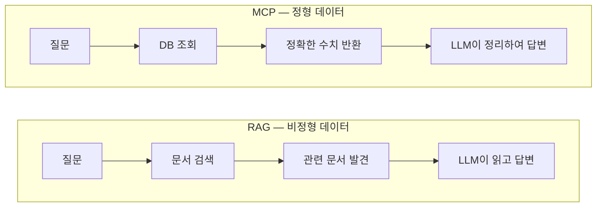
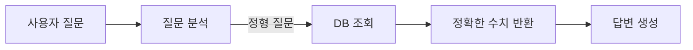
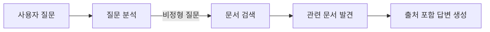
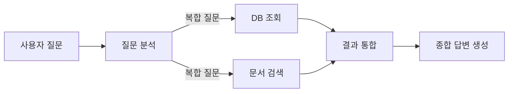
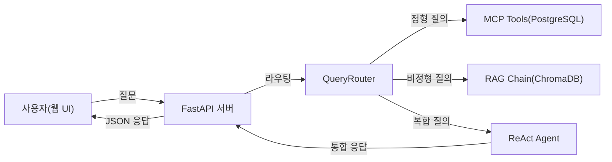
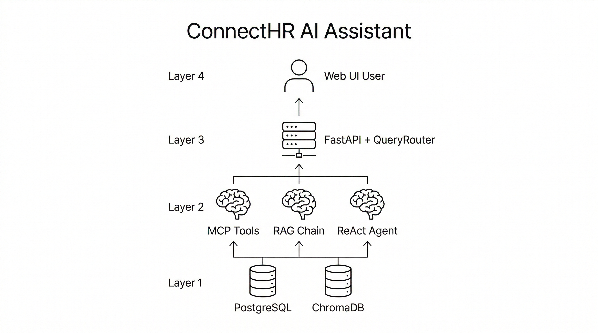
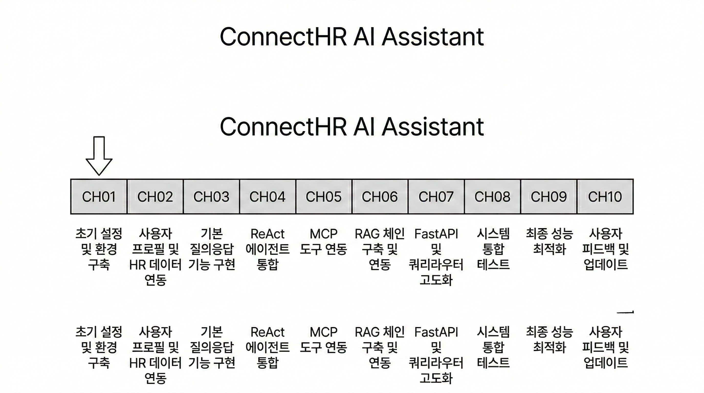

# 1. 이 책의 목표와 최종 완성본 미리보기

이 챕터에서는 이 책이 목표로 하는 최종 결과물 "Q&A 사내 AI 비서"의 전체 그림을 확인합니다. 이 책을 처음 펼친 독자라면 자연스럽게 이런 질문이 생길 것입니다. "결국 무엇을 만드는가?", "왜 Fine-tuning이 아니라 RAG인가?", "MCP는 무엇이고 왜 필요한가?" 이 챕터는 그 질문에 모두 답합니다.

이 책은 **하나의 프로젝트** 입니다. 챕터마다 "Q&A 사내 AI 비서"에 기능을 하나씩 쌓아 올리는 방식으로 구성되어 있습니다. 이 챕터는 그 여정의 출발점으로, 앞으로 만들어 갈 시스템의 전체 구조를 미리 살펴봅니다.

---

## 1. 이 책이 다루는 범위

### RAG와 MCP, 그리고 이 책의 위치

사내 AI 비서를 만드는 방법은 크게 두 가지입니다. 첫 번째는 **Fine-tuning** — LLM 자체를 사내 데이터로 재학습시키는 방법입니다. 두 번째는 **RAG(Retrieval-Augmented Generation)** — LLM은 그대로 두고, 필요할 때 외부 문서를 검색하여 답변에 활용하는 방법입니다.

이 책은 RAG와 **MCP(Model Context Protocol)** 를 조합하는 두 번째 방법을 다룹니다. 아래 비교표를 보면 왜 이 선택이 사내 AI 비서에 적합한지 이해할 수 있습니다.

| 비교 항목 | Fine-tuning | RAG (이 책의 방법) |
|-----------|-------------|-------------------|
| 초기 비용 | 수백만 원 이상 (GPU 학습 비용) | 거의 없음 (문서 임베딩만 필요) |
| 데이터 요구량 | 수천~수만 건의 레이블 데이터 | 기존 사내 문서 그대로 사용 |
| 지식 업데이트 주기 | 재학습 필요 (수일~수주) | 문서 추가만으로 즉시 반영 |
| 적합한 상황 | 특정 말투/스타일 학습, 대규모 도메인 특화 | 사내 문서 기반 질의응답, 빠른 지식 추가 |
| 환각 위험 | 학습 데이터에 따라 다름 | 출처 문서를 강제 참조하여 낮출 수 있음 |

**RAG** 는 "필요한 지식을 그때그때 꺼내 쓴다"는 접근입니다. 도서관에 비유하면, Fine-tuning은 책의 내용을 모두 암기하는 것이고, RAG는 질문이 들어올 때마다 관련된 책을 찾아 읽고 답하는 것입니다.

여기에 **MCP** 가 더해집니다. MCP는 LLM이 외부 도구와 데이터 소스에 접근하는 표준 프로토콜로, 이 책에서는 PostgreSQL 데이터베이스 조회에 활용합니다. "김철수 사원의 남은 연차는?"과 같은 정형 데이터 질문은 RAG가 아닌 MCP를 통해 DB를 직접 조회하여 답합니다.

*그림 1-0: RAG는 문서를 검색하여 답하고, MCP는 데이터베이스를 조회하여 답합니다*

> **참고: RAG와 MCP는 경쟁 관계가 아닙니다**
> RAG는 비정형 문서(PDF, DOCX 등)를 검색하고, MCP는 정형 데이터베이스(PostgreSQL)를 조회합니다. 이 책의 최종 결과물은 두 방법을 질문 유형에 따라 자동으로 선택하는 통합 에이전트입니다.

---

## 2. 최종 결과물 데모 시나리오
이 책을 완성하면 아래 세 유형의 질문을 하나의 시스템에서 처리할 수 있습니다.

### 정형 질문 — DB 직접 조회

> "김철수 사원의 남은 연차는?"

이 질문은 데이터베이스에 저장된 정확한 수치를 조회해야 합니다. 문서를 검색하는 것이 아니라 DB를 질의하는 것입니다. 시스템은 이 질문이 정형 데이터 요청임을 판단하고, MCP 도구를 통해 DB를 조회한 후 "김철수 사원의 남은 연차는 8일입니다"라고 답합니다.

### 비정형 질문 — 문서 검색 후 답변

> "신입사원 온보딩 절차를 알려줘"

이 질문은 HR 취업규칙 PDF나 온보딩 가이드 문서에 답이 있습니다. 시스템은 임베딩된 문서에서 관련 내용을 검색하고, 출처를 표시하며 답변합니다. "HR_취업규칙_v1.0.pdf, 3페이지에 따르면 신입사원 온보딩은..."과 같은 형식입니다.

### 복합 질문 — DB 조회 + 문서 검색 결합

> "올해 매출 상위 부서의 복지 정책을 비교해줘"

이 질문은 두 단계를 거칩니다. 먼저 DB에서 부서별 매출 합계를 조회하고, 이어서 해당 부서들의 복지 정책을 문서에서 검색합니다. 최종적으로 두 결과를 통합하여 답변합니다. 이것이 이 책의 핵심인 "정형 + 비정형 통합 에이전트"입니다.

---

## 3. 아키텍처 한 장 요약

아래 다이어그램이 이 책의 최종 시스템 구조입니다. 처음에는 모든 구성 요소가 익숙하지 않아도 됩니다. 챕터를 진행하면서 각 요소를 직접 구현하게 됩니다.

*그림 1-1: Q&A 사내 AI 비서 전체 아키텍처*

각 구성 요소의 역할은 다음과 같습니다.

| 구성 요소 | 역할 | 구현 챕터 |
|-----------|------|---------|
| 웹 UI | 사용자가 질문을 입력하고 답변을 받는 채팅 인터페이스 | CH07 |
| FastAPI 서버 | HTTP 요청을 받아 에이전트에 전달하고 결과를 반환하는 웹 서버 | CH04 |
| QueryRouter | 질문 유형을 분석하여 적절한 처리 경로를 선택하는 라우터 | CH08 |
| MCP Tools | PostgreSQL DB를 직접 조회하는 도구 집합 | CH08, CH09 |
| RAG Chain | VectorDB에서 관련 문서를 검색하고 LLM으로 답변을 생성하는 체인 | CH07 |
| ReAct Agent | 복합 질문을 단계별로 추론하며 처리하는 에이전트 | CH08 |

<!-- [GEMINI PROMPT: 01_architecture-overview]
path: assets/CH01/01_architecture-overview.png
A minimalist black and white technical diagram with a strict 16:9 aspect ratio on a solid white background. No shading, no 3D effects, only clean thin line art. The entire assembly of icons, lines, and text is perfectly centered globally within the 16:9 frame, leaving generous and equal white space on all sides. Show a layered architecture diagram of the 'ConnectHR AI Assistant' system. Layer 1 (bottom): minimalist line-art cylinder database icons labeled 'PostgreSQL' and 'ChromaDB'. Layer 2: minimalist line-art brain icons labeled 'MCP Tools', 'RAG Chain', 'ReAct Agent'. Layer 3: minimalist line-art server rack icon labeled 'FastAPI + QueryRouter'. Layer 4 (top): minimalist line-art person icon labeled 'Web UI User'. Upward arrows connecting layers. Korean labels allowed.
Style: layered-architecture-growth
Alt: Q&A 사내 AI 비서 전체 시스템 아키텍처 레이어 다이어그램
-->

*그림 1-2: Q&A 사내 AI 비서 시스템 레이어 구조*

---

## 4. 사용 기술 스택

이 책에서 사용하는 기술과 각각의 역할, 메모리 요구사항을 정리했습니다.

| 기술 | 버전 | 역할 | 최소 메모리 |
|------|------|------|------------|
| Python | 3.10+ | 전체 실행 환경 | - |
| Ollama + DeepSeek R1 | Ollama 0.5+, deepseek-r1:8b | 텍스트 질의응답 LLM | 8GB |
| Ollama + LLaVA | llava:13b | 문서 이미지 분석 Vision LLM | 4GB |
| FastAPI | 0.115+ | 웹 서버 및 API | 1GB |
| PostgreSQL | 16+ | 직원/휴가/매출 정형 데이터 | 1GB |
| ChromaDB | 0.5+ | 문서 임베딩 저장 및 검색 | 1GB |
| LangChain | 0.3+ | RAG 체인 및 에이전트 오케스트레이션 | 1GB |
| ko-sroberta-multitask | 3.0+ | 한국어 텍스트 임베딩 모델 | 1GB |
| Docker + Docker Compose | 24+ | PostgreSQL 컨테이너 실행 | - |

**하드웨어 최소/권장 사양:**

| 항목 | 최소 사양 | 권장 사양 |
|------|---------|---------|
| RAM | 16GB | 32GB |
| 저장 공간 | 20GB | 50GB |
| CPU | 4코어 | 8코어 |
| GPU | 불필요 (로컬 Ollama) | NVIDIA GPU (추론 속도 향상) |
| OS | macOS, Ubuntu 22.04+, Windows (WSL2) | macOS Apple Silicon, Ubuntu + NVIDIA GPU |

> **팁: RAM이 16GB 미만이라면**
> DeepSeek R1 8B 모델 대신 더 작은 `deepseek-r1:1.5b` 모델을 사용하십시오. 정확도는 다소 낮아지지만 모든 실습을 진행할 수 있습니다. CH02에서 모델 전환 방법을 안내합니다.

모든 기술은 **로컬에서 무료로** 실행됩니다. OpenAI API를 사용하고 싶다면 `.env` 파일의 `LLM_PROVIDER` 값만 변경하면 됩니다. 이 전환 구조는 CH02에서 상세히 다룹니다.

---

## 5. 이 책을 마치면 할 수 있는 것

이 책을 완독하면 다음 세 가지 핵심 역량을 갖추게 됩니다.

**역량 1: RAG 시스템 구축**
사내 PDF, DOCX, XLSX 문서를 자동으로 파싱하고 임베딩하여 ChromaDB에 저장하는 파이프라인을 직접 구현합니다. 새 문서를 추가하면 즉시 AI 비서가 해당 내용을 참조할 수 있습니다.

**역량 2: MCP 통합**
LangChain의 MCP 도구를 활용하여 LLM이 PostgreSQL 데이터베이스를 직접 조회하게 만듭니다. 정형 데이터와 비정형 문서를 하나의 에이전트에서 처리하는 방법을 익힙니다.

**역량 3: 운영 수준 배포**
Timeout, Retry, 응답 캐싱, 토큰 사용량 추적 등 프로덕션 환경에서 필요한 운영 설정을 적용합니다. "동작하는 코드"에서 "안정적인 서비스"로 전환하는 방법을 다룹니다.

### 챕터별 빌드업 로드맵

이 책의 각 챕터는 독립적으로 실행 가능하지만, 전체를 순서대로 진행하면 하나의 완성된 시스템이 만들어집니다.
| 챕터 | 누적 기능 |
|------|---------|
| CH01 | 전체 목표 이해 (현재 챕터) |
| CH02 | 개발 환경 구축 (verify_env.py PASS) |
| CH03 | LLM 환각 체험 → RAG 필요성 이해 |
| CH04 | FastAPI 기반 사내 시스템 (CRUD + Admin UI) |
| CH05 | 사내 문서 표준화 (validator.py PASS) |
| CH06 | VectorDB 구축 (ChromaDB 인덱스 + CLI 검증) |
| CH07 | RAG Q&A 엔진 (웹 채팅 UI + 멀티턴) |
| CH08 | 통합 에이전트 (MCP + RAG + QueryRouter) |
| CH09 | LangChain 표준 구성 + 운영 설정 |
| CH10 | RAG 튜닝 (before/after 품질 측정) |

챕터마다 Q&A 사내 AI 비서에 기능이 하나씩 추가됩니다. CH04에서 만든 기본 시스템이 CH07에서 채팅 UI를 얻고, CH08에서 MCP와 결합되어 통합 에이전트로 진화합니다.

<!-- [GEMINI PROMPT: 01_buildup-roadmap]
path: assets/CH01/01_buildup-roadmap.png
A minimalist black and white technical diagram with a strict 16:9 aspect ratio on a solid white background. No shading, no 3D effects, only clean thin line art. The entire assembly is perfectly centered within the 16:9 frame with generous white space. Show a staircase (계단) diagram rising from left to right with 10 steps. Each step is taller than the previous one, representing cumulative growth. Label each step: CH01 목표, CH02 환경, CH03 RAG 이해, CH04 FastAPI, CH05 문서, CH06 VectorDB, CH07 Q&A, CH08 에이전트, CH09 LangChain, CH10 튜닝. At the top of the staircase, place a simple flag icon labeled "Q&A 사내 AI 비서 완성". A small stick-figure person stands on the first step (CH01) looking upward. Each step has a thin horizontal line and the label is written inside the step. The overall impression is a clear upward journey from beginner to completion.
Style: staircase-growth
Alt: Q&A 사내 AI 비서 챕터별 빌드업 로드맵 — 10단계 계단형 성장 다이어그램
-->

*그림 1-3: 챕터마다 기능이 누적되는 빌드업 로드맵*

---

## 6. 핵심 용어 정리

이 책 전반에서 반복적으로 등장하는 용어를 미리 정리합니다.

**RAG(Retrieval-Augmented Generation)** : 외부 문서나 데이터베이스에서 관련 정보를 검색(Retrieval)한 후, 해당 정보를 컨텍스트로 활용하여 LLM이 답변을 생성(Generation)하는 기법입니다. LLM의 학습 데이터에 없는 최신 정보나 사내 비공개 정보를 처리하는 데 적합합니다.

**MCP(Model Context Protocol)** : LLM이 외부 도구, 데이터베이스, API에 표준화된 방식으로 접근할 수 있게 하는 프로토콜입니다. 이 책에서는 LLM이 PostgreSQL 데이터베이스를 직접 조회하는 데 사용합니다.

**환각(Hallucination)** : LLM이 실제로 존재하지 않거나 부정확한 정보를 그럴듯하게 생성하는 현상입니다. 사내 비공개 정보에 대한 질문에서 빈번하게 발생하며, RAG는 이를 출처 문서 강제 참조로 억제합니다.

**임베딩(Embedding)** : 텍스트를 수백 차원의 숫자 벡터로 변환하는 기법입니다. 의미가 유사한 문장은 유사한 벡터값을 가지게 되어, 벡터 간 거리 계산으로 관련성 높은 문서를 검색할 수 있습니다.

**VectorDB** : 벡터 임베딩을 저장하고 유사도 기반 검색을 수행하는 데이터베이스입니다. 이 책에서는 ChromaDB를 로컬에서 실행합니다. SQL의 `WHERE name = '김철수'` 와 달리, "연차 관련 규정"처럼 의미적으로 가까운 문서를 찾는 데 사용합니다.

---

## 7. 정리하며

"Q&A 사내 AI 비서"라는 하나의 목적지를 확인했습니다. 다음 챕터부터 이 시스템을 직접 구축합니다.

- **RAG는 Fine-tuning보다 빠릅니다**: 학습 없이 문서 추가만으로 즉시 지식을 확장할 수 있습니다. 사내 문서가 업데이트되면 다음 날 바로 AI 비서에 반영됩니다.
- **MCP는 정형 데이터의 열쇠입니다**: LLM이 PostgreSQL을 직접 조회하는 표준 프로토콜로, 정형/비정형 데이터를 하나의 에이전트에서 처리합니다.
- **이 책은 하나의 프로젝트입니다**: 챕터마다 Q&A 사내 AI 비서에 기능을 하나씩 쌓아 올립니다. CH01의 구조도가 CH10에서 실제로 동작하는 시스템이 됩니다.
- **모든 기술은 로컬에서 무료로 실행됩니다**: Ollama 기반 DeepSeek R1을 기본으로 사용하며, `.env` 설정만 변경하면 OpenAI API로도 전환할 수 있습니다.

다음 챕터에서는 이 시스템을 구축하기 위한 개발 환경을 준비합니다. Ollama, PostgreSQL, Python 가상환경을 설치하고, 환경 검증 스크립트가 4개 항목 모두 PASS를 출력하는 것을 목표로 합니다.
