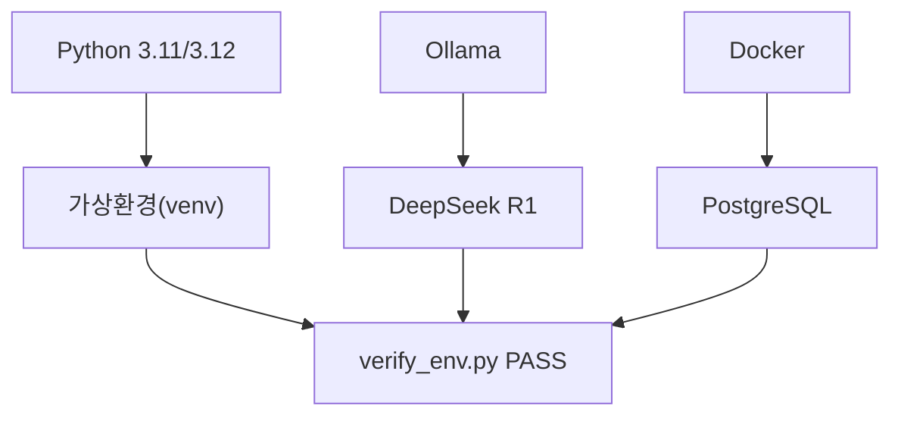
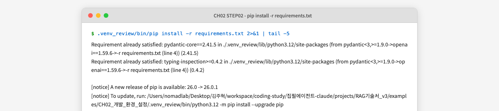
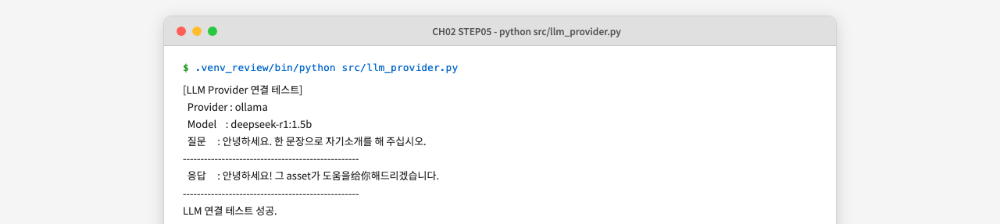
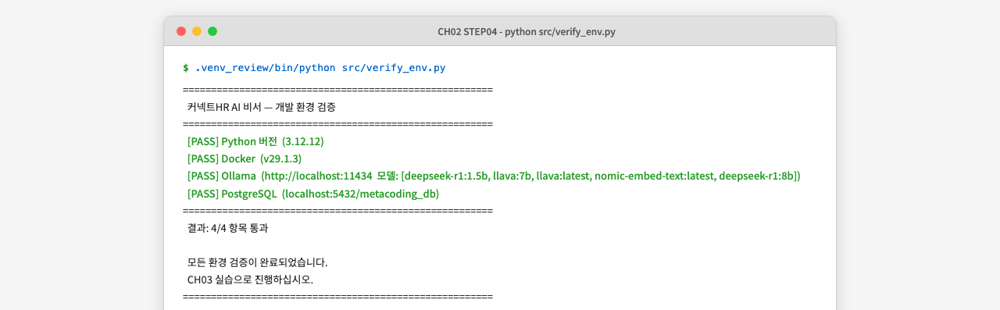

# 2. 개발 환경 설정

이 챕터에서는 이 책의 모든 실습을 지탱하는 개발 환경을 구축합니다. **Ollama(Ollama)** 와 **DeepSeek R1** 을 설치하여 로컬 LLM을 실행하고, Docker로 **PostgreSQL(PostgreSQL)** 을 구동한 뒤, Python 가상환경을 준비합니다. 마지막으로 `verify_env.py` 를 실행하여 4개 항목이 모두 PASS임을 확인하면 CH03 실습으로 진행할 준비가 완료됩니다.

---

## 1. 필수 요구사항 확인

실습을 시작하기 전에 아래 체크리스트를 확인하십시오.

| 항목 | 최소 요구사항 | 확인 명령 |
|------|------------|---------|
| Python | 3.11 또는 3.12 | `python3 --version` |
| Docker Desktop | 24.0 이상 | `docker --version` |
| RAM | 16GB 이상 | 시스템 정보 확인 |
| 저장 공간 | 여유 20GB 이상 | 디스크 사용량 확인 |
| Git | 설치 필요 | `git --version` |

> **참고: RAM이 16GB 미만인 경우**
> DeepSeek R1:8b 모델은 약 8–16GB의 RAM을 필요로 합니다. RAM이 부족하면 더 작은 모델인 `deepseek-r1:1.5b` (약 2GB)로 대체할 수 있습니다. 또는 `.env` 파일에서 `LLM_PROVIDER=openai` 로 전환하여 OpenAI API를 사용할 수도 있습니다. LLM Provider 전환 방법은 이 챕터 7절에서 상세히 다룹니다.

| OS | 지원 수준 | 주의사항 |
|----|---------|---------|
| macOS (Apple Silicon) | 1순위 | Ollama 네이티브 Metal GPU 지원 |
| macOS (Intel) | 1순위 | GPU 가속 없음 — 응답 속도가 느릴 수 있음 |
| Ubuntu 22.04+ | 1순위 | NVIDIA GPU 있으면 최적 성능 |
| Windows (WSL2) | 2순위 | WSL2 + Docker Desktop 필수, 경로 구분자 주의 |
| Windows (네이티브) | 미지원 | WSL2 사용 권장 |

---

## 2. 환경 구성 원칙

실습 환경을 어떻게 구성할지 그림으로 살펴보겠습니다.



*그림 2-1: CH02 환경 구성 전체 그림 — 세 가지 기둥이 모두 준비되어야 verify_env.py가 PASS를 출력한다*

세 가지 기둥으로 구성됩니다.

1. **Python + 가상환경**: 이 책의 모든 Python 코드를 실행하는 기반입니다.
2. **Ollama + DeepSeek R1**: 인터넷 없이 로컬에서 LLM을 실행합니다.
3. **Docker + PostgreSQL**: OS에 무관하게 동일한 데이터베이스 환경을 보장합니다.

### PostgreSQL을 Docker로 설치하는 이유

PostgreSQL을 OS에 직접 설치하면 macOS, Ubuntu, Windows마다 설치 경로와 서비스 시작 방법이 다릅니다. 버전이 달라지면 SQL 동작도 달라질 수 있습니다. **Docker** 를 사용하면 `docker-compose.yml` 한 파일로 동일한 PostgreSQL 16을 어느 OS에서도 동일하게 실행할 수 있습니다. 이것이 이 책 전체에서 Docker 기반 설치를 선택한 이유입니다.

---

## 3. Ollama + DeepSeek R1 설치

**Ollama(Ollama)** 는 LLM을 로컬 PC에서 실행하는 경량 런타임입니다. 터미널 명령 하나로 모델을 다운로드하고 HTTP 서버로 서빙할 수 있습니다. **DeepSeek R1** 은 추론 능력이 강화된 오픈소스 LLM으로, 이 책에서 기본 모델로 사용합니다.

### 3.1 Ollama 설치

OS에 맞는 방법으로 Ollama를 설치하십시오.

**macOS / Linux:**

```bash
curl -fsSL https://ollama.com/install.sh | sh
```

**Windows (PowerShell):**

Ollama 공식 사이트(https://ollama.com)에서 Windows 설치 파일을 다운로드하십시오.

설치가 완료되면 버전을 확인합니다.

```bash
ollama --version
```

**실행 결과:** (버전 번호는 설치 시점에 따라 다를 수 있습니다)
```
ollama version is 0.5.x
```

### 3.2 DeepSeek R1 모델 다운로드

> **주의: 첫 실행 시 모델 파일 자동 다운로드**
> `ollama pull deepseek-r1:8b` 는 LLM 모델 파일(약 4.7GB)을 다운로드합니다.
> 네트워크 속도에 따라 10~60분 소요될 수 있으며, 이후 실행부터는
> 로컬 캐시를 사용하므로 즉시 시작됩니다.

```bash
ollama pull deepseek-r1:8b
```

**실행 결과:**
```
pulling manifest
pulling aabd4debf0c8... 100% ▕████████████████▏ 4.7 GB
verifying sha256 digest
writing manifest
success
```

### 3.3 설치 확인 및 간단한 대화 테스트

```bash
ollama run deepseek-r1:8b "한 문장으로 자기소개를 해 주십시오."
```

**실행 결과:**
```
<think>
...
</think>
저는 DeepSeek R1, 추론 능력이 강화된 AI 언어 모델입니다.
```

> **팁: DeepSeek R1의 `<think>` 태그**
> DeepSeek R1은 추론 과정을 `<think>...</think>` 블록 안에 먼저 출력한 뒤 최종 답변을 제시합니다. 이 태그는 모델이 스스로 생각하는 과정을 보여주는 것이며, 실습 코드에서는 자동으로 제거됩니다.

테스트가 끝나면 Ctrl+D (macOS/Linux) 또는 Ctrl+Z (Windows)로 대화를 종료합니다.

---

## 4. 프로젝트 클론 및 초기 설정

실습 코드를 내려받겠습니다. **GitHub Clone 방식** 으로 진행하므로 코드를 직접 입력할 필요가 없습니다. 저장소를 클론한 뒤 해당 챕터 폴더로 이동하여 가상환경을 만들고 의존성을 설치합니다.

### 4.1 저장소 클론

```bash
git clone https://github.com/your-org/connect-hr-ai-assistant.git
cd connect-hr-ai-assistant/examples/CH02_개발_환경_설정
```

### 4.2 폴더 구조 확인

`tree` 명령으로 폴더 구조를 확인합니다.

```bash
tree -L 2 --dirsfirst
```

**실행 결과:**
```
CH02_개발_환경_설정/
├── src/
│   ├── llm_provider.py  ← LLM Provider 팩토리
│   └── verify_env.py    ← 환경 검증 스크립트
├── .env.example         ← 환경 변수 템플릿
├── docker-compose.yml   ← PostgreSQL 컨테이너 정의
└── requirements.txt     ← Python 의존성 목록
```


### 4.3 Python 버전 확인

이 책의 모든 실습은 **Python 3.11 또는 3.12**를 기준으로 작성되었습니다. Python 3.13 이상에서는 일부 패키지의 사전 빌드 바이너리가 제공되지 않아 설치 오류가 발생할 수 있으므로, **3.11 또는 3.12 버전을 사용하십시오.**

```bash
python3 --version
```


*그림 2-2: Python, Ollama, Docker, Git 버전을 한 번에 확인한 모습*

아래 두 가지 경우에 해당하면 Python을 (재)설치하십시오.

| 상황 | 조치 |
|----|---------|
| `command not found: python3` | Python이 설치되어 있지 않습니다. 아래 표를 참고하여 설치하십시오. |
| `Python 3.13.x` 이상 출력 | 3.11 또는 3.12를 **별도로 설치**하십시오. 기존 버전은 그대로 유지해도 됩니다. |

| OS | 설치 방법 |
|----|---------|
| macOS | `brew install python@3.12` (Homebrew 필요: https://brew.sh) |
| Ubuntu/Debian | `sudo apt update && sudo apt install python3.12 python3.12-venv` |
| Windows | https://www.python.org/downloads/ 에서 3.12.x 설치 (Add to PATH 체크) |

> **주의: macOS에서 `python` vs `python3`**
> macOS에서는 `python` 명령이 등록되어 있지 않은 경우가 많습니다. 이 책에서 `python` 이라고 표기된 명령은 모두 `python3` 으로 실행하십시오. 가상환경 활성화 후에는 `python` 과 `pip` 이 자동으로 올바른 버전을 가리킵니다.

### 4.4 가상환경 생성 및 활성화

**가상환경(venv)** 은 프로젝트마다 독립된 Python 패키지 공간을 만들어 줍니다. 이 책에서 설치하는 패키지들이 다른 프로젝트와 충돌하지 않도록, 모든 실습에서 가상환경을 사용합니다.

```bash
# 가상환경 생성 (4.3절에서 확인한 Python 3.12 사용)
python3.12 -m venv .venv

# 활성화 (macOS / Linux)
source .venv/bin/activate

# 활성화 (Windows PowerShell)
.\.venv\Scripts\Activate.ps1
```

활성화에 성공하면 터미널 프롬프트 앞에 `(.venv)` 가 표시됩니다.

```
(.venv) user@machine ~/connect-hr-ai-assistant/examples/CH02_개발_환경_설정 $
```


### 4.5 환경 변수 파일 생성

```bash
cp .env.example .env
```

`.env` 파일을 열어 내용을 확인합니다. 기본값은 Ollama 로컬 방식으로 설정되어 있으므로, Ollama를 사용한다면 별도 수정 없이 진행하십시오.

```bash
# .env 파일 기본 내용
LLM_PROVIDER=ollama
OLLAMA_BASE_URL=http://localhost:11434
OLLAMA_MODEL=deepseek-r1:8b

# PostgreSQL 설정
POSTGRES_HOST=localhost
POSTGRES_PORT=5432
POSTGRES_DB=metacoding_db
POSTGRES_USER=metacoding
POSTGRES_PASSWORD=metacoding_pass
```

> **주의: `.env` 파일을 Git에 올리지 마십시오**
> `.env` 파일에는 API 키와 데이터베이스 비밀번호가 포함됩니다. 이미 `.gitignore`에 등록되어 있으므로 실수로 커밋되지 않습니다. `.env.example` 파일만 저장소에 포함됩니다.

---

## 5. 의존성 설치

```bash
pip install -r requirements.txt
```



*그림 2-3: pip install -r requirements.txt 실행 후 패키지 설치 완료 화면*

> **주의: 첫 설치 시 네트워크 다운로드**
> `pip install -r requirements.txt` 는 패키지 파일을 PyPI에서 다운로드합니다.
> 네트워크 속도에 따라 1~5분 소요될 수 있으며, 이후 재설치부터는
> 캐시를 사용하므로 즉시 완료됩니다.

> **트러블슈팅: `pg_config executable not found` 오류**
> Python 3.13 이상 환경에서 `psycopg2-binary` 설치 시 발생합니다. 4.3절의 안내대로 **Python 3.12 이하로 가상환경을 다시 생성**하면 해결됩니다.
> ```bash
> deactivate && rm -rf .venv
> python3.12 -m venv .venv
> source .venv/bin/activate
> pip install -r requirements.txt
> ```
> Python 3.12가 설치되어 있지 않다면 `brew install python@3.12` (macOS) 또는 `sudo apt install python3.12` (Ubuntu)로 먼저 설치하십시오.

### 주요 의존성 설명

| 패키지 | 버전 | 용도 |
|--------|------|------|
| `python-dotenv` | 1.0.1 | `.env` 파일을 환경 변수로 로드 |
| `requests` | 2.32.3 | Ollama HTTP API 호출 |
| `psycopg2-binary` | 2.9.10 | PostgreSQL 연결 (psycopg2 바이너리 번들) |
| `openai` | 1.59.6 | OpenAI API 호출 (OpenAI 선택 시 사용) |

---

## 6. PostgreSQL 설치 (Docker)

### 6.1 PostgreSQL 컨테이너 시작

> **주의: Docker 이미지 최초 다운로드**
> `docker compose up -d` 첫 실행 시 PostgreSQL 16 이미지(약 400MB)를 Docker Hub에서
> 다운로드합니다. 네트워크 속도에 따라 2~10분 소요될 수 있습니다.

```bash
docker compose up -d
```

**실행 결과:**

```
[+] Running 1/1
 ✔ Container metacoding_db  Started
```

### 6.2 컨테이너 상태 확인

```bash
docker ps
```

`STATUS` 열에 `Up (healthy)` 가 표시되면 PostgreSQL이 정상적으로 시작된 것입니다.


*그림 2-4: `docker compose up -d` 실행 후 `docker ps`로 컨테이너 상태를 확인한 모습*


---

## 7. LLM Provider 연결 테스트

이 책의 모든 챕터는 `.env` 파일의 `LLM_PROVIDER` 값으로 LLM을 전환합니다. 기본값은 `ollama` 이며, `openai` 또는 `vllm` 으로 변경하면 코드 수정 없이 다른 LLM을 사용할 수 있습니다. 이 전환 구조의 상세한 동작 원리는 CH03에서 실습하며 설명합니다.

아래 명령으로 현재 `.env` 설정이 정상 동작하는지 확인합니다.

```bash
python src/llm_provider.py
```



*그림 2-5: LLM Provider 연결 테스트 — Ollama가 정상 응답하는 것을 확인한다*

> **팁: OpenAI로 전환하는 방법**
> `.env` 파일의 두 줄을 변경하면 됩니다.
> ```
> LLM_PROVIDER=openai
> OPENAI_API_KEY=sk-...your-key...
> ```
> 이후 `python src/llm_provider.py` 를 다시 실행하여 OpenAI 연결을 확인하십시오.

---

## 8. 환경 검증

모든 구성 요소를 설치했으면 이제 환경 검증 스크립트를 실행합니다. 이 스크립트가 4개 항목을 모두 PASS로 출력해야 CH03 실습으로 진행할 수 있습니다.

### 8.1 verify_env.py 실행

```bash
python src/verify_env.py
```

### 8.2 핵심 코드 분석

**다음 코드는 Python, Docker, Ollama, PostgreSQL을 순서대로 점검하고 결과를 출력합니다.**

```python
# src/verify_env.py

def run_all_checks() -> None:
    print("=" * 55)
    print("  Q/A 사내 AI 비서 — 개발 환경 검증")
    print("=" * 55)

    checks: list[tuple[str, bool]] = [          # ①
        ("Python 3.10+", check_python_version()),
        ("Docker",       check_docker()),
        ("Ollama",       check_ollama()),
        ("PostgreSQL",   check_postgresql()),
    ]

    passed = sum(1 for _, result in checks if result)  # ②
    failed = len(checks) - passed

    print(f"  결과: {passed}/{len(checks)} 항목 통과")  # ③

    if failed == 0:
        print("  모든 환경 검증이 완료되었습니다.")
        print("  CH03 실습으로 진행하십시오.")
    else:
        print(f"  {failed}개 항목이 실패했습니다.")    # ④
```

> ① 검증할 4개 항목을 리스트로 정의합니다. 각 함수는 PASS이면 `True`, FAIL이면 `False`를 반환합니다.
> ② `sum()`으로 통과한 항목 수를 셉니다.
> ③ `{통과}/{전체}` 형식으로 요약 결과를 출력합니다.
> ④ 실패한 항목이 있으면 개수와 해결 방법을 안내합니다.

> 전체 코드: `src/verify_env.py`

### 8.3 정상 실행 결과

4개 항목이 모두 `[PASS]` 로 표시되면 환경 구축이 완료된 것입니다.



*그림 2-6: verify_env.py 실행 결과 — 4개 항목 모두 PASS*

### 8.4 FAIL 항목 해결 방법

| 항목 | 증상 | 해결 방법 |
|------|------|---------|
| Python 버전 | `[FAIL] Python 버전` | `python --version`으로 버전 확인, 3.10+ 재설치 |
| Docker | `[FAIL] Docker` | Docker Desktop을 설치하고 시작 |
| Ollama | `[FAIL] Ollama` | `ollama serve` 명령 실행 또는 Ollama 재설치 |
| PostgreSQL | `[FAIL] PostgreSQL` | `docker compose up -d` 재실행 후 `docker ps`로 상태 확인 |

> **주의: Ollama FAIL 시 가장 많은 원인**
> Ollama 앱을 설치했더라도 서버가 실행 중이 아니면 FAIL이 표시됩니다. macOS의 경우 메뉴바에서 Ollama 아이콘이 표시되고 있는지 확인하십시오. Linux의 경우 별도 터미널에서 `ollama serve` 를 실행한 상태로 유지하십시오.

---

## 9. 정리하며

CH02에서는 Q/A 사내 AI 비서를 개발하기 위한 환경 기반을 완성했습니다. 다음 챕터부터는 이 환경 위에서 실제 AI 기능을 하나씩 쌓아 올립니다.

- **Docker PostgreSQL은 환경 충돌을 방지합니다**: `docker-compose.yml` 한 파일로 macOS, Linux, Windows 어디서나 동일한 PostgreSQL 16을 실행합니다. OS별 설치 차이를 신경 쓸 필요가 없습니다.
- **LLM Provider 팩토리는 한 번만 만듭니다**: `.env` 의 `LLM_PROVIDER` 값만 바꾸면 이후 모든 챕터에서 Ollama, OpenAI, vLLM을 자유롭게 전환할 수 있습니다. 코드는 변경하지 않습니다.
- **`verify_env.py` PASS가 출발점입니다**: 4개 항목이 모두 통과해야 CH03 실습으로 진행할 수 있습니다. FAIL 항목이 있다면 위의 해결 방법을 참고하여 반드시 해결하십시오.
- **다음 챕터**: 구축한 환경에서 Ollama를 직접 호출하여 LLM의 한계를 체험합니다. "김철수 사원의 남은 연차는?" 이라는 질문에 LLM이 어떻게 틀린 답을 내놓는지 직접 확인합니다.
