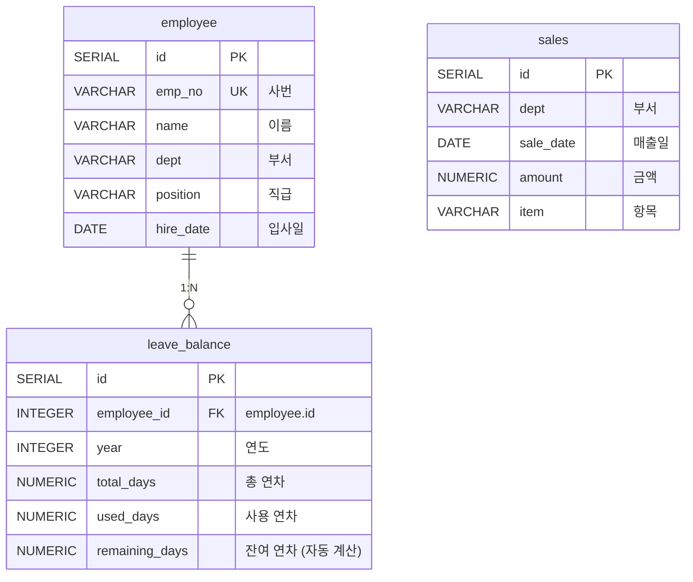
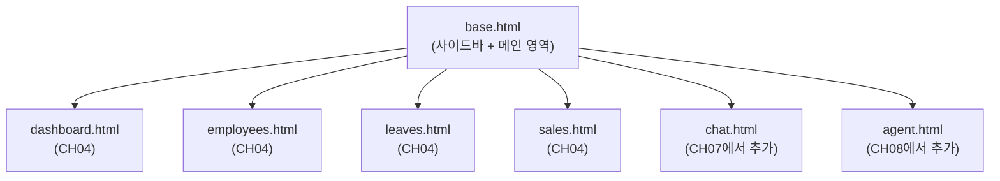
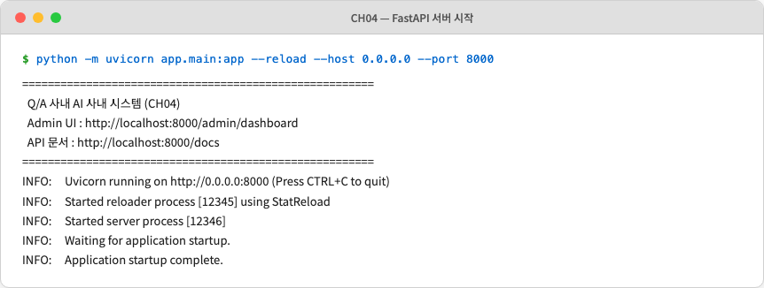
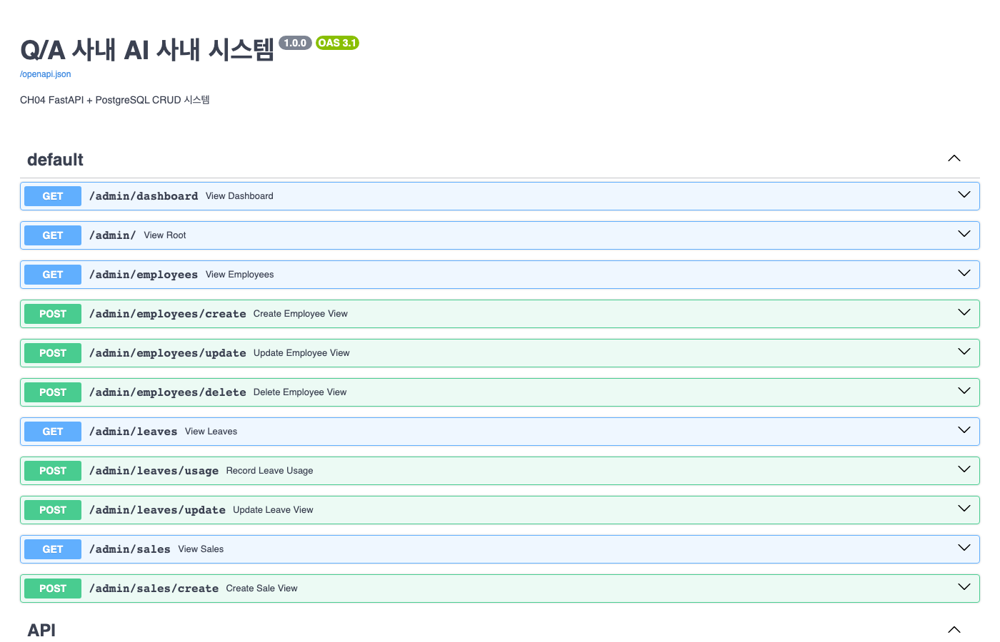
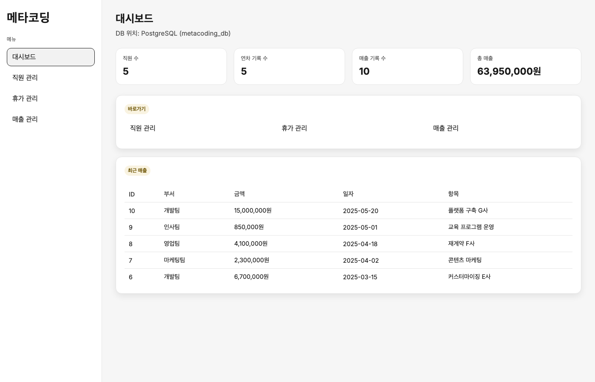
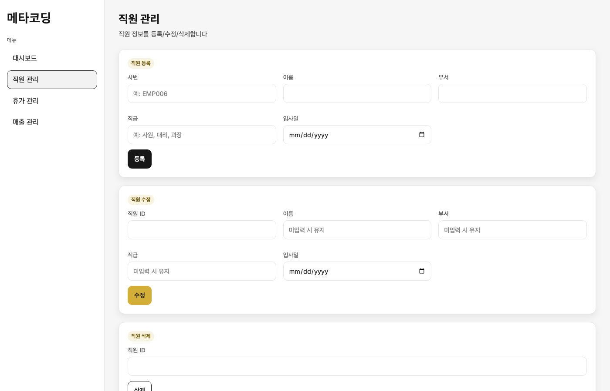
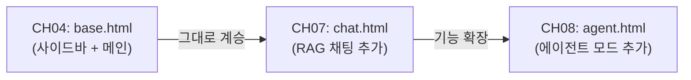

# 4. FastAPI로 초간단 사내 시스템 만들기

CH02에서 Docker 기반 PostgreSQL 환경을 구축했습니다. 이번 챕터에서는 그 위에 **사내 시스템의 뼈대** 를 세웁니다. 직원 정보, 휴가 잔여량, 매출 데이터를 관리하는 CRUD 시스템과 관리자가 사용할 Admin UI를 구현합니다.

이 챕터가 완성되면 두 가지 중요한 토대가 마련됩니다. 첫째, `employee` · `leave_balance` · `sales` 테이블은 이후 챕터에서 AI가 직접 조회하는 **정형 데이터 저장소** 가 됩니다. 둘째, `base.html` 레이아웃은 이후 채팅 UI, 에이전트 UI에서 그대로 계승됩니다.

> **참고: 이 챕터의 특별함**
> CH04에서 만드는 `base.html`과 데이터베이스 스키마는 단순한 실습용 예제가 아닙니다. 이후 챕터에서 기능을 추가할 때마다 그대로 활용됩니다. 지금 이 순간이 Q/A 사내 AI 비서의 **기반을 세우는 순간** 입니다.

---

## 1. FastAPI와 데이터 모델 이해하기

### 1.1 FastAPI를 선택한 이유

파이썬 웹 프레임워크는 Django, Flask, FastAPI 등 여러 선택지가 있습니다. 이 책이 FastAPI(0.115+)를 선택한 이유는 네 가지입니다.

**첫째, 비동기(Async) 처리를 기본 지원합니다.** LangChain과 같은 AI 라이브러리는 LLM 호출 시 수 초에서 수십 초의 응답 대기가 발생합니다. FastAPI의 `async def` 기반 엔드포인트는 이 대기 시간 동안 다른 요청을 처리할 수 있어 AI 서버에 특히 적합합니다.

**둘째, Swagger UI를 자동으로 생성합니다.** 코드에 Pydantic 스키마를 정의하는 것만으로 `http://localhost:8000/docs` 에 인터랙티브 API 문서가 자동으로 만들어집니다.

**셋째, Pydantic 데이터 검증이 내장되어 있습니다.** 잘못된 형식의 요청이 들어오면 FastAPI가 자동으로 422 오류를 반환합니다. 별도의 유효성 검증 코드를 작성할 필요가 없습니다.

**넷째, LangChain과의 호환성이 뛰어납니다.** LangChain의 `AsyncCallbackHandler`, `astream` 등 비동기 API가 FastAPI의 비동기 엔드포인트와 자연스럽게 결합됩니다.

> **참고: PostgreSQL을 선택한 이유**
> 이 책은 SQLite가 아닌 PostgreSQL(16+)을 사용합니다. 실무에서 가장 보편적으로 사용하는 RDBMS이며, 이후 챕터에서 AI 에이전트가 SQL로 직접 조회할 때도 그대로 활용됩니다.

### 1.2 3테이블 데이터 모델

Q/A 사내 AI 시스템은 세 개의 테이블로 구성됩니다.



*그림 4-1: Q/A 사내 AI 3테이블 관계도 (ERD)*

각 테이블의 역할을 정리하면 다음과 같습니다.

| 테이블 | 역할 |
|--------|------|
| `employee` | 직원 기본 정보 (사번, 이름, 부서, 직급, 입사일) |
| `leave_balance` | 연차 잔여량 (총 연차 - 사용 연차 = 잔여 연차 자동 계산) |
| `sales` | 부서별 매출 기록 (날짜, 금액, 항목) |

`leave_balance` 테이블의 `remaining_days` 컬럼은 PostgreSQL의 **생성 컬럼(Generated Column)** 으로 구현되었습니다. `total_days - used_days` 수식이 DB 엔진 수준에서 자동 계산되므로, 애플리케이션 코드에서 별도로 계산할 필요가 없습니다.

### 1.3 Jinja2 Admin UI 설계 원칙

**Jinja2(3.1+)** 는 파이썬 서버에서 HTML을 직접 렌더링하는 템플릿 엔진입니다. React나 Vue 같은 별도 프론트엔드 프레임워크 없이 간결하게 Admin UI를 구현할 수 있는 것이 장점입니다.

이 챕터에서 만드는 `templates/base.html` 은 **공유 레이아웃** 으로 설계됩니다. 좌측 240px 사이드바와 메인 콘텐츠 영역으로 구성된 이 레이아웃은 CH07(채팅 UI), CH08(통합 에이전트 UI)에서 그대로 계승합니다.



*그림 4-2: base.html을 중심으로 한 템플릿 계승 구조*

---

## 2. 프로젝트 준비 및 실행

CH02에서 클론한 저장소의 예제 폴더로 이동합니다.

```bash
cd examples/CH04_FastAPI_기본_시스템
```

환경 변수를 설정합니다. `.env.example` 파일의 기본값은 `docker-compose.yml` 의 PostgreSQL 설정과 동일하므로 별도 수정이 필요하지 않습니다.

```bash
cp .env.example .env
```

**PostgreSQL 컨테이너를 먼저 실행합니다.** 이 단계가 완료되어야 FastAPI 서버가 DB에 연결할 수 있습니다.

> **주의: CH02에서 실행한 컨테이너가 있는 경우**
> `docker ps` 로 `metacoding_db` 가 이미 실행 중이라면, 먼저 `docker stop metacoding_db && docker rm metacoding_db` 로 제거한 뒤 진행하십시오.

```bash
docker compose up -d
```

컨테이너 상태를 확인합니다.

```bash
docker ps
```

아래와 같이 `running (healthy)` 상태가 표시되면 DB 준비가 완료된 것입니다.

```
NAME              STATUS
metacoding_db     running (healthy)
```

> **주의: FastAPI를 실행하기 전에 반드시 컨테이너 상태를 확인하십시오**
> PostgreSQL 컨테이너가 `healthy` 상태가 아닌 채로 FastAPI 서버를 실행하면 `RuntimeError: DB 연결 실패` 가 발생합니다.

Python 가상환경을 생성하고 의존성을 설치합니다.

```bash
python3.12 -m venv .venv
source .venv/bin/activate          # Windows: .\.venv\Scripts\Activate.ps1
pip install -r requirements.txt
```

FastAPI 서버를 실행합니다. `run.py`는 `.env`에서 호스트와 포트를 읽어 uvicorn 서버를 `--reload` 모드로 시작하는 스크립트입니다.

```bash
python run.py
```

아래와 같은 화면이 나타나면 서버가 정상 시작된 것입니다.



*그림 4-3: uvicorn 서버 정상 시작 화면*

브라우저에서 `http://localhost:8000` 으로 접속하면 자동으로 Admin 대시보드 페이지로 이동합니다.

---

## 3. 프로젝트 구조 파악

예제 코드의 구조를 살펴보겠습니다.

```
CH04_FastAPI_기본_시스템/
├── run.py                      # 서버 실행 스크립트 (python run.py)
├── requirements.txt
├── .env.example
├── docker-compose.yml          # PostgreSQL 16 컨테이너
├── data/
│   └── schema.sql              # DDL + 시드 데이터 (직원 5명, 매출 10건)
├── app/
│   ├── main.py                 # FastAPI 앱 진입점 + 라우터 등록
│   ├── database.py             # psycopg2 연결 컨텍스트 매니저
│   ├── models.py               # 도메인 dataclass (Employee, LeaveBalance, Sale)
│   ├── schemas.py              # Pydantic 요청/응답 스키마
│   ├── crud.py                 # DB CRUD 함수
│   ├── views.py                # Jinja2 Admin UI 라우터 (/admin/*)
│   └── api.py                  # REST JSON API 라우터 (/api/*)
├── templates/
│   ├── base.html               # 공통 레이아웃 (사이드바 + 메인)
│   ├── dashboard.html          # 통계 카드 + 최근 매출
│   ├── employees.html          # 직원 CRUD UI
│   ├── leaves.html             # 휴가 관리 UI
│   └── sales.html              # 매출 관리 UI
└── static/
    └── css/
        └── style.css           # Inter 폰트, 검정/흰색 + 금색 디자인
```

이 구조에는 명확한 설계 원칙이 있습니다. `app/` 폴더는 Python 로직만 담고, `templates/` 폴더는 HTML만 담습니다. 두 관심사를 분리함으로써 CH07에서 채팅 UI를 추가할 때 `templates/chat.html` 파일 하나만 추가하면 됩니다.

---

## 4. 핵심 코드 해설

### 4.1 앱 진입점 — `app/main.py`

**다음 코드는 FastAPI 앱을 초기화하고 두 개의 라우터를 등록합니다.**

```python
# app/main.py

app = FastAPI(                                                  # ①
    title="Q/A 사내 AI 사내 시스템",
    description="CH04 FastAPI + PostgreSQL CRUD 시스템",
    version="1.0.0",
)

app.mount("/static", StaticFiles(directory="static"), name="static")  # ②

from app import views, api                                     # ③
app.include_router(views.router)                               # ④ /admin/*
app.include_router(api.router)                                 # ⑤ /api/*

@app.get("/", include_in_schema=False)
def root() -> RedirectResponse:
    return RedirectResponse(url="/admin/dashboard")            # ⑥
```

> ① `title`, `description`, `version` 을 지정하면 Swagger UI(`/docs`)의 헤더에 자동으로 표시됩니다.
> ② `static/css/style.css` 를 `/static/css/style.css` URL로 서비스합니다.
> ③ 순환 임포트를 방지하기 위해 앱 생성 이후에 라우터를 임포트합니다.
> ④ `views.py` 의 라우터는 `/admin/*` 경로로 Jinja2 HTML 페이지를 렌더링합니다.
> ⑤ `api.py` 의 라우터는 `/api/*` 경로로 JSON 응답을 반환합니다.
> ⑥ 루트 URL(`/`)에 접속하면 Admin 대시보드로 자동 리다이렉트합니다.

> **동작 요약**
> - **입력**: `.env` 환경 변수(`FASTAPI_HOST`, `FASTAPI_PORT`)와 시작 명령
> - **실행**: FastAPI 앱 생성 → 정적 파일 마운트 → Admin UI 라우터(`views`)와 REST API 라우터(`api`) 등록
> - **출력**: `http://localhost:8000` 웹 서버 — `/admin/*`(HTML), `/api/*`(JSON), `/docs`(Swagger UI)

> **전체 코드**: `app/main.py`

### 4.2 데이터베이스 스키마 — `data/schema.sql`

Docker Compose가 처음 실행될 때 이 파일이 자동으로 PostgreSQL에 적용됩니다. 핵심 설계 포인트 두 가지를 확인하십시오.

**다음 SQL은 `leave_balance` 테이블의 잔여 연차를 자동 계산하는 생성 컬럼을 정의합니다.**

```sql
-- data/schema.sql (핵심 발췌)

CREATE TABLE leave_balance (
    id              SERIAL  PRIMARY KEY,
    employee_id     INTEGER NOT NULL REFERENCES employee(id) ON DELETE CASCADE,  -- ①
    year            INTEGER NOT NULL,
    total_days      NUMERIC(4,1) NOT NULL,
    used_days       NUMERIC(4,1) NOT NULL DEFAULT 0,
    remaining_days  NUMERIC(4,1) GENERATED ALWAYS AS (total_days - used_days) STORED,  -- ②
    UNIQUE (employee_id, year)                                                          -- ③
);
```

> ① `ON DELETE CASCADE` 로 직원이 삭제되면 해당 연차 레코드도 자동으로 함께 삭제됩니다.
> ② `GENERATED ALWAYS AS ... STORED` 는 PostgreSQL 12+에서 지원하는 생성 컬럼입니다. `used_days` 를 변경하면 `remaining_days` 가 DB 엔진이 자동으로 재계산합니다. 애플리케이션 코드에서 계산할 필요가 없습니다.
> ③ 동일 직원이 같은 연도에 중복 레코드를 가질 수 없도록 복합 유니크 제약을 설정합니다.

테이블 생성 이후에는 시드 데이터도 자동으로 삽입됩니다. 직원 5명(`EMP001`~`EMP005`), 연차 레코드 5건(2025년), 매출 10건(2025년 1~5월)이 포함됩니다.

**실행 결과:**

```
metacoding=# SELECT name, dept, position FROM employee;
  name  |   dept   | position
--------+----------+----------
 김민준  | 개발팀   | 과장
 이서연  | 영업팀   | 대리
 박지호  | 인사팀   | 사원
 최유나  | 마케팅팀 | 차장
 정도현  | 개발팀   | 사원
(5 rows)
```

> **동작 요약**
> - **입력**: `docker compose up -d` 명령 (`data/schema.sql`이 컨테이너 내부 `/docker-entrypoint-initdb.d/`에 마운트)
> - **실행**: PostgreSQL 초기화 시 SQL 스크립트 자동 실행 → 3개 테이블 생성 + 시드 데이터 삽입
> - **출력**: `metacoding` 데이터베이스에 직원 5명, 연차 5건, 매출 10건 준비 완료

> **전체 코드**: `data/schema.sql`

### 4.3 Pydantic 스키마 — `app/schemas.py`

Pydantic 스키마는 HTTP 요청과 응답의 데이터 형식을 정의합니다. **Request 스키마** 는 클라이언트가 보내는 데이터를 검증하고, **Response 스키마** 는 서버가 반환하는 데이터 구조를 보장합니다.

**다음 코드는 직원 등록 요청과 응답 스키마를 정의합니다.**

```python
# app/schemas.py (핵심 발췌)

class EmployeeCreate(BaseModel):
    """직원 등록 요청 스키마."""
    emp_no:    str  = Field(..., description="사번",     max_length=10)  # ①
    name:      str  = Field(..., description="직원 이름", max_length=50)
    dept:      str  = Field(..., description="소속 부서", max_length=50)
    position:  str  = Field(..., description="직급",     max_length=50)
    hire_date: date = Field(..., description="입사일 (YYYY-MM-DD)")       # ②

class EmployeeUpdate(BaseModel):
    """직원 수정 요청 스키마 (모든 필드 선택)."""
    name:      Optional[str]  = Field(None, description="직원 이름")     # ③
    dept:      Optional[str]  = Field(None, ...)
    position:  Optional[str]  = Field(None, ...)
    hire_date: Optional[date] = Field(None, ...)
```

> ① `Field(..., max_length=10)` 에서 `...` (Ellipsis)는 필수 필드를 의미합니다. 10자 초과 입력 시 FastAPI가 자동으로 422 Unprocessable Entity를 반환합니다.
> ② `date` 타입을 지정하면 문자열 `"2025-01-15"` 가 자동으로 `datetime.date` 객체로 변환됩니다.
> ③ `EmployeeUpdate` 는 모든 필드가 `Optional` 입니다. 수정하려는 필드만 전송하면 됩니다. 이를 **부분 수정(Partial Update)** 패턴이라고 합니다.

> **팁: Swagger UI에서 스키마를 확인하십시오**
> `http://localhost:8000/docs` 에 접속하면 `EmployeeCreate`, `LeaveBalanceCreate` 등 모든 스키마가 JSON Schema 형식으로 자동 문서화됩니다. Pydantic 코드를 별도로 문서화할 필요가 없습니다.

> **동작 요약**
> - **입력**: HTTP 요청 Body(JSON) 또는 쿼리 파라미터
> - **실행**: Pydantic 타입 검증 → 형식 오류 시 422 자동 반환, 통과 시 Python 객체로 변환
> - **출력**: 타입이 보장된 Python 객체가 FastAPI 엔드포인트 함수의 인자로 전달

> **전체 코드**: `app/schemas.py`

### 4.4 CRUD 함수 — `app/crud.py`

CRUD(Create, Read, Update, Delete) 함수는 데이터베이스 조작 로직을 담당합니다. 모든 함수가 psycopg2 연결 객체를 첫 번째 인자로 받는 구조는 **트랜잭션 경계를 호출자가 제어** 할 수 있게 합니다.

**다음 코드는 직원 목록을 이름과 부서로 동적 검색하는 함수입니다.**

```python
# app/crud.py — get_all_employees (핵심 발췌)

def get_all_employees(
    conn: psycopg2.extensions.connection,
    name_filter: Optional[str] = None,
    dept_filter: Optional[str] = None,
) -> list[Employee]:
    conditions: list[str] = []
    params: list[str] = []

    if name_filter:
        conditions.append("name ILIKE %s")     # ①
        params.append(f"%{name_filter}%")
    if dept_filter:
        conditions.append("dept ILIKE %s")     # ②
        params.append(f"%{dept_filter}%")

    where_clause = ("WHERE " + " AND ".join(conditions)) if conditions else ""
    sql = f"SELECT ... FROM employee {where_clause} ORDER BY id"

    with conn.cursor() as cur:
        cur.execute(sql, params)               # ③
        rows = cur.fetchall()                  # ④

    return [_row_to_employee(r) for r in rows]
```

> ① `ILIKE` 는 대소문자를 구분하지 않는 LIKE 검색입니다. `%검색어%` 패턴으로 부분 일치 검색을 지원합니다.
> ② 조건이 없으면 `where_clause` 가 빈 문자열이 되어 전체 목록을 조회합니다.
> ③ `cur.execute(sql, params)` 의 파라미터 바인딩 방식이 SQL 인젝션을 방어합니다. f-string 직접 삽입은 금지입니다.
> ④ `RealDictCursor` 를 사용하므로 결과가 `{"id": 1, "name": "김민준", ...}` 형식의 딕셔너리로 반환됩니다.

**실행 결과 (부서 필터 "개발팀" 적용 시):**

```
[Employee(id=1, emp_no='EMP001', name='김민준', dept='개발팀', ...),
 Employee(id=5, emp_no='EMP005', name='정도현', dept='개발팀', ...)]
```

연차 사용 등록 함수(`update_leave_usage`)에는 잔여 연차가 부족할 때 예외를 발생시키는 비즈니스 로직이 포함되어 있습니다.

**다음 코드는 연차 사용량을 누적 등록하고 잔여량을 자동 검증합니다.**

```python
# app/crud.py — update_leave_usage (핵심 발췌)

def update_leave_usage(conn, employee_id: int, days: float, year: int = 2025):
    check_sql = "SELECT remaining_days FROM leave_balance WHERE employee_id = %s AND year = %s"

    with conn.cursor() as cur:
        cur.execute(check_sql, (employee_id, year))         # ①
        check_row = cur.fetchone()

        if check_row["remaining_days"] < days:               # ②
            raise ValueError(
                f"잔여 연차({check_row['remaining_days']}일)가 부족합니다."
            )

        update_sql = """
            UPDATE leave_balance SET used_days = used_days + %s
            WHERE employee_id = %s AND year = %s
            RETURNING id, employee_id, year, total_days, used_days, remaining_days
        """
        cur.execute(update_sql, (days, employee_id, year))  # ③
        row = cur.fetchone()

    return _row_to_leave(row) if row else None
```

> ① 먼저 현재 잔여 연차를 조회하여 사용 가능 여부를 확인합니다.
> ② 잔여 연차가 부족하면 `ValueError` 를 발생시킵니다. 이 예외는 API 레이어에서 HTTP 400으로 변환됩니다.
> ③ `RETURNING` 절을 활용하여 UPDATE 결과를 별도의 SELECT 없이 즉시 반환받습니다.

> **동작 요약**
> - **입력**: psycopg2 연결 객체 + 검색 조건(이름 필터, 부서 필터, 날짜 범위 등)
> - **실행**: 동적 WHERE 절 구성 → 파라미터 바인딩으로 SQL 인젝션 방어 → `RealDictCursor` 쿼리 실행
> - **출력**: 도메인 객체(`Employee`, `LeaveBalance`, `Sale`) 리스트 또는 단건 객체

> **전체 코드**: `app/crud.py`

### 4.5 REST API — `app/api.py`

`api.py` 는 `/api/*` 경로에서 JSON을 주고받는 엔드포인트를 정의합니다. Pydantic 스키마와 CRUD 함수를 연결하는 역할을 합니다.

**다음 코드는 직원을 등록하는 POST 엔드포인트입니다.**

```python
# app/api.py — 직원 등록 API (핵심 발췌)

@router.post("/employees", response_model=EmployeeResponse, status_code=201)  # ①
def api_create_employee(body: EmployeeCreate) -> EmployeeResponse:
    try:
        with get_connection() as conn:
            emp = crud.create_employee(                       # ②
                conn, body.emp_no, body.name,
                body.dept, body.position, body.hire_date,
            )
    except psycopg2.errors.UniqueViolation:
        raise HTTPException(status_code=409,                  # ③
            detail=f"사번 '{body.emp_no}'이(가) 이미 존재합니다.")

    return EmployeeResponse(                                  # ④
        id=emp.id, emp_no=emp.emp_no, name=emp.name,
        dept=emp.dept, position=emp.position, hire_date=emp.hire_date,
    )
```

> ① `response_model=EmployeeResponse` 를 지정하면 Swagger에 응답 스키마가 자동 표시됩니다. `status_code=201` 은 리소스 생성 시 표준 HTTP 상태 코드입니다.
> ② Pydantic이 검증한 `body` 객체에서 필드를 꺼내 CRUD 함수에 전달합니다.
> ③ 중복 사번 등록 시 PostgreSQL 에서 `UniqueViolation` 예외가 발생합니다. 이를 잡아 HTTP 409(Conflict)로 변환합니다.
> ④ `Employee` 도메인 객체를 `EmployeeResponse` Pydantic 객체로 변환하여 반환합니다.



*그림 4-4: FastAPI가 자동 생성하는 Swagger UI — 코드 작성만으로 API 문서가 완성됩니다*

> **동작 요약**
> - **입력**: HTTP 요청(POST Body, GET 쿼리, PATCH Body, DELETE 경로 파라미터)
> - **실행**: Pydantic 자동 검증 → `get_connection()` DB 연결 → CRUD 함수 실행 → 예외를 HTTP 상태 코드로 변환
> - **출력**: Pydantic `response_model`에 맞는 JSON 응답(200/201/204/400/404/409/503)

> **전체 코드**: `app/api.py`

### 4.6 Admin UI — `app/views.py` 와 Jinja2 템플릿

`views.py` 는 브라우저에서 접근하는 Admin UI 페이지를 렌더링합니다. DB에서 데이터를 조회한 후 Jinja2 템플릿에 컨텍스트를 전달하는 구조입니다.

**다음 코드는 대시보드 페이지를 렌더링하는 뷰 함수입니다.**

```python
# app/views.py — view_dashboard (핵심 발췌)

@router.get("/dashboard", response_class=HTMLResponse)
def view_dashboard(request: Request) -> HTMLResponse:
    with get_connection() as conn:
        stats = crud.get_dashboard_stats(conn)       # ①
        recent_sales = crud.get_recent_sales(conn, 5)  # ②

    return templates.TemplateResponse(               # ③
        "dashboard.html",
        {
            "request": request,
            "active_page": "dashboard",              # ④
            **stats,
            "recent_sales": [
                {"dept": s.dept, "amount": f"{s.amount:,}원", ...}
                for s in recent_sales
            ],
        },
    )
```

> ① `get_dashboard_stats()` 는 직원 수, 연차 건수, 매출 건수, 매출 합계를 한 번의 DB 연결로 조회합니다.
> ② 최근 매출 5건을 별도로 조회하여 대시보드 하단 목록에 표시합니다.
> ③ `templates.TemplateResponse()` 는 `dashboard.html` 템플릿에 컨텍스트 딕셔너리를 전달하고 HTML을 생성합니다.
> ④ `active_page` 값을 전달하면 `base.html` 의 사이드바에서 현재 메뉴를 강조 표시합니다. 이후 챕터에서 새 페이지를 추가할 때도 동일한 방식을 사용합니다.

> **동작 요약**
> - **입력**: Jinja2 템플릿 컨텍스트 딕셔너리(DB 조회 결과, `request` 객체, `active_page` 등)
> - **실행**: Jinja2 엔진이 템플릿 로드 → `{{ variable }}` 치환 + ``, `` 블록 처리
> - **출력**: 완성된 HTML 문자열을 담은 HTTP 응답 → 브라우저에서 즉시 렌더링



*그림 4-5: Q/A 사내 AI Admin 대시보드 — 직원/연차/매출 통계가 한눈에 표시됩니다*

> **전체 코드**: `app/views.py`, `templates/`

---

## 5. API 동작 확인

서버가 실행 중인 상태에서 Swagger UI로 API를 테스트합니다.

브라우저에서 `http://localhost:8000/docs` 로 접속합니다.

```
확인 가능한 주요 엔드포인트:
────────────────────────────────────────
직원 API
  GET    /api/employees              직원 전체 조회
  POST   /api/employees              직원 등록
  GET    /api/employees/{id}         직원 단건 조회
  PATCH  /api/employees/{id}         직원 수정
  DELETE /api/employees/{id}         직원 삭제

연차 API
  GET    /api/leaves                 연차 전체 조회
  POST   /api/leaves                 연차 생성
  POST   /api/leaves/usage           연차 사용 등록
  PATCH  /api/leaves/{id}            연차 수정

매출 API
  GET    /api/sales                  매출 전체 조회
  POST   /api/sales                  매출 등록
  GET    /api/sales/dept-summary     부서별 매출 집계
────────────────────────────────────────
```

직원 전체 조회 API를 테스트합니다. Swagger에서 `GET /api/employees` → **Try it out** → **Execute** 를 클릭합니다.

```json
[
  {
    "id": 1,
    "emp_no": "EMP001",
    "name": "김민준",
    "dept": "개발팀",
    "position": "과장",
    "hire_date": "2019-03-02"
  },
  ...
]
```

연차 사용 등록 API도 테스트합니다. `POST /api/leaves/usage` 에 아래 Body를 입력합니다.

```json
{
  "employee_id": 1,
  "days": 2.0
}
```

**실행 결과 — 잔여 연차가 10일에서 8일로 줄어들었음을 확인합니다.**

```json
{
  "id": 1,
  "employee_id": 1,
  "year": 2025,
  "total_days": 15.0,
  "used_days": 7.0,
  "remaining_days": 8.0
}
```

> **팁: Admin UI에서도 동일한 작업을 수행할 수 있습니다**
> `http://localhost:8000/admin/leaves` 에서 GUI 형태로 연차 사용 등록, 직원 등록/수정/삭제를 수행할 수 있습니다. Swagger는 API를 직접 테스트하는 용도, Admin UI는 데이터를 시각적으로 관리하는 용도로 각각 활용하십시오.



*그림 4-6: 직원 관리 Admin UI — 조회, 등록, 수정, 삭제를 GUI로 수행합니다*

---

## 6. base.html — CH07과 CH08이 계승하는 레이아웃

이 챕터에서 가장 중요한 파일 중 하나는 `templates/base.html` 입니다. 이 파일이 이후 챕터에서 어떻게 계승되는지 이해해야 합니다.



*그림 4-7: base.html 계승 흐름*

`base.html` 은 `` 를 중심으로 구성됩니다. 각 페이지(`dashboard.html`, `employees.html` 등)는 `` 선언으로 이 레이아웃을 상속받아 자신의 콘텐츠만 정의합니다.

CH07에서 `chat.html` 을 추가할 때는 다음 두 가지만 추가합니다.

1. `templates/chat.html` 파일 작성 (`` + 채팅 UI HTML)
2. `views.py` 에 `/admin/chat` 라우터 함수 추가

`base.html` 파일 자체는 수정하지 않아도 됩니다. 이것이 **공유 레이아웃 설계의 강점** 입니다.

> **주의: base.html의 사이드바 구조는 수정하지 마십시오**
> CH07과 CH08에서 `base.html` 을 그대로 계승합니다. 이 챕터에서 사이드바나 전역 CSS를 임의로 변경하면 이후 챕터에서 UI가 깨질 수 있습니다. 기능 추가는 `` 영역 안에서만 수행하십시오.

---

## 7. 정리하며

CH04에서 완성한 내용을 정리합니다.

- **FastAPI는 AI 서버에 최적화되어 있습니다**: 비동기 처리, 자동 Swagger 문서, Pydantic 검증이 LangChain과 자연스럽게 결합됩니다.

- **`base.html`은 공유 자산입니다**: 이 챕터에서 만든 사이드바 + 메인 레이아웃을 이후 챕터의 채팅 UI, 에이전트 UI가 계승합니다. 새 페이지를 추가할 때마다 `` 한 줄로 전체 레이아웃을 재사용합니다.

- **3테이블 구조가 이후 챕터의 기반입니다**: `employee`, `leave_balance`, `sales` 테이블과 `crud.py` 함수는 이후 AI 에이전트가 정형 데이터를 조회할 때 그대로 재사용됩니다.

**다음 챕터**에서는 이 시스템에 연결할 사내 문서를 수집하고 표준화하는 파이프라인을 만듭니다. "Garbage In, Garbage Out" — 정제되지 않은 문서는 RAG 품질을 직접 떨어뜨립니다. CH05에서는 PDF, DOCX, XLSX 파일의 파일명 규칙과 메타데이터 표준을 정립하고, `validator.py` 검증 도구로 품질을 확인합니다.
