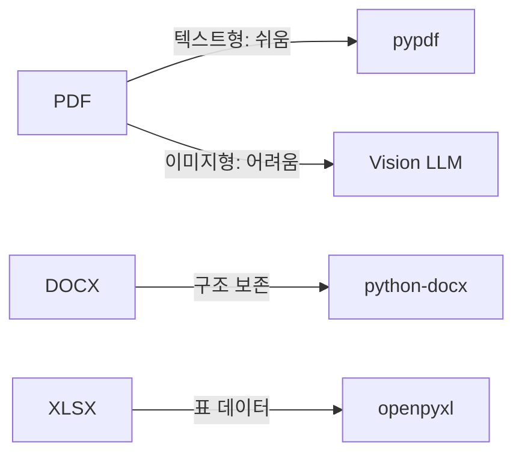

# 5. 사내 문서 수집 전략과 문서 표준 만들기

CH04에서 직원, 휴가, 매출 데이터를 담은 사내 시스템을 구축했습니다. 이번 챕터에서는 AI 비서가 답변할 비정형 지식의 원천인 **사내 문서** 를 체계적으로 수집하고 표준화하는 파이프라인을 만듭니다. 이 표준이 갖춰져야 이후 VectorDB 색인과 RAG 검색이 제대로 동작합니다.

> **이번 챕터의 핵심 질문**
> "Garbage In, Garbage Out" — 사내 문서를 RAG에 투입하기 전에 어떤 표준을 갖춰야 하는가?

---

## 1. 어떤 문서를 넣을 것인가

### 1.1. RAG의 지식 원천 — 사내 비정형 문서

CH03에서 LLM이 환각을 일으키는 근본 이유를 확인했습니다. LLM의 학습 데이터에는 사내 비공개 정보가 포함되지 않습니다. **"신입사원 온보딩 절차가 어떻게 되나요?"** 라는 질문에 LLM이 그럴듯한 답변을 내놓더라도, 그것이 우리 회사의 실제 절차와 일치할 가능성은 거의 없습니다.

RAG는 이 문제를 문서 검색으로 해결합니다. LLM이 답변하기 전에 사내 문서에서 관련 내용을 찾아 컨텍스트로 주입하는 방식입니다. 그런데 여기서 중요한 사실이 있습니다. **RAG의 품질은 입력 문서의 품질에 직접 비례합니다.** 파일명이 뒤죽박죽이고, 메타데이터가 없으며, 지원하지 않는 형식의 파일이 섞여 있다면, 검색 결과도 뒤죽박죽이 됩니다.

이것이 "Garbage In, Garbage Out" 원칙입니다. 문서 수집 단계에서 표준을 정립하지 않으면, 이후의 모든 과정(파싱, 임베딩, 검색)에서 그 대가를 치릅니다.

### 1.2. 교재용 문서 세트 소개

이 책에서 사용하는 문서 세트는 실제 사내 업무에서 자주 조회되는 유형을 모사합니다. 아래 6개 문서가 Q/A 사내 AI 비서의 비정형 지식 원천이 됩니다.

| 파일명 | 부서 | 형식 | 성격 |
|--------|------|------|------|
| `HR_취업규칙_v1.0.pdf` | 인사 | PDF | 텍스트형 규정 문서 |
| `HR_정보보안서약서.pdf` | 인사 | PDF | 서명 양식 포함 |
| `SEC_보안규정_v1.0.docx` | 보안 | DOCX | 구조화된 워드 문서 |
| `OPS_신규서비스_런칭전략.pdf` | 운영 | PDF | 전략 기획 문서 |
| `FIN_부서별_예산기안서.xlsx` | 재무 | XLSX | 표 형식 데이터 |
| `FIN_2025_상반기_매출현황.xlsx` | 재무 | XLSX | 시계열 수치 데이터 |

이 문서들을 굳이 PDF, DOCX, XLSX 혼합으로 구성한 이유가 있습니다. 형식마다 파싱 난이도가 다르고, RAG 파이프라인에서 처리 방식도 달라집니다. 실무에서도 사내 문서는 결코 단일 형식으로 통일되어 있지 않습니다. 형식별 처리 차이를 직접 체감하는 것이 이 챕터의 핵심 학습 목표 중 하나입니다.

> **참고: 문서 선정 기준**
> 실무에서 RAG에 투입할 문서를 선정할 때는 두 가지 기준을 우선 적용하십시오.
> 첫째, **자주 질문받는 내용을 담은 문서** (취업규칙, 복지 안내, 온보딩 가이드 등)
> 둘째, **정기적으로 갱신되는 문서** (버전 관리가 필요한 규정, 정책 문서 등)
> 반면 개인 정보가 포함된 문서나 기밀 등급이 높은 문서는 RAG 대상에서 제외하는 것이 바람직합니다.

---

## 2. 문서 형식 지원 범위

### 2.1. 세 가지 형식과 파싱 난이도

사내 문서에서 가장 흔히 마주치는 세 가지 형식의 특성을 비교해 보겠습니다.



*그림 5-1: 문서 형식별 파싱 도구와 난이도*

**PDF** 는 가장 흔하지만 파싱 난이도가 형식 내에서 크게 갈립니다. 워드 프로세서나 PDF 생성 도구로 만든 **텍스트형 PDF** 는 `pypdf` 라이브러리로 텍스트를 비교적 깔끔하게 추출할 수 있습니다. 대안으로 `pdfplumber`(표 추출에 강점), `PyMuPDF`(속도와 레이아웃 보존 우수) 등이 있으며, 프로젝트 요구에 맞게 선택하면 됩니다. 반면 스캐너로 찍은 문서나 이미지가 삽입된 **이미지형 PDF** 는 텍스트 추출이 불가능하여 Vision LLM(LLaVA) 처리가 필요합니다.

**DOCX** (Microsoft Word 형식)는 `python-docx` 라이브러리로 단락, 제목, 표 등의 구조를 비교적 잘 보존하며 추출할 수 있습니다. 텍스트 외에 스타일 정보도 접근 가능하여 헤더를 기준으로 청킹하는 데 유리합니다.

**XLSX** (Microsoft Excel 형식)는 `openpyxl` 라이브러리로 셀 데이터를 추출합니다. 단, 테이블 구조를 의미 있는 텍스트로 변환하는 것이 핵심 과제입니다. 예를 들어 "2025년 1분기 마케팅팀 예산: 1,200만 원"이라는 정보가 셀에 분산되어 있다면, 이를 하나의 의미 단위로 합쳐야 합니다.

### 2.2. 파싱 라이브러리 요약

| 형식 | 라이브러리 | 대안 | 주요 특성 |
|------|-----------|------|----------|
| PDF (텍스트형) | `pypdf` | `pdfplumber`, `PyMuPDF` | 텍스트 추출, 페이지 단위 |
| PDF (이미지형) | Vision LLM | `EasyOCR`, `Tesseract` | OCR/이미지 인식 필요 |
| DOCX | `python-docx` | `docx2txt` | 단락/표/스타일 접근 |
| XLSX | `openpyxl` | `pandas` | 시트/행/열 접근 |


> **주의: 이미지형 PDF 판별**
> `pypdf`로 텍스트를 추출했을 때 빈 문자열이 반환된다면 이미지형 PDF일 가능성이 높습니다.
> `HR_정보보안서약서.pdf` 처럼 서명란이 있는 문서는 스캐너로 처리한 경우가 많으므로 사전에 확인이 필요합니다.
> 이미지형 PDF는 이후 챕터에서 Vision LLM을 활용하여 처리합니다.

---

## 3. 문서 표준 규칙

문서를 수집하는 것만으로는 충분하지 않습니다. 파일명이 "최종.pdf", "수정본2.docx" 같은 형식으로 되어 있다면 RAG 파이프라인에서 출처 추적이 불가능합니다. 표준 규칙을 정립하는 이유가 바로 여기에 있습니다.

### 3.1. 파일명 규칙: `{부서코드}_{문서종류}_v{버전}.{확장자}`

<!-- [GEMINI PROMPT: 05_filename-rule]
path: assets/CH05/05_filename-rule.png
A minimalist black and white technical diagram with a strict 16:9 aspect ratio on a solid white background. No shading, no 3D effects, only clean thin line art. The entire assembly is perfectly centered within the frame. Show a filename decomposition diagram: the filename "HR_취업규칙_v1.0.pdf" broken into labeled boxes connected by arrows below: box1="HR" labeled "부서코드", box2="취업규칙" labeled "문서종류", box3="v1.0" labeled "버전", box4=".pdf" labeled "확장자". Below, show two contrast columns: left column labeled "Good" with green checkmark icons showing "HR_취업규칙_v1.0.pdf", "SEC_보안규정_v2.1.docx"; right column labeled "Bad" with red X icons showing "최종.pdf", "수정본2.docx", "취업규칙.pdf". Korean labels, clean line art, white background.
Style: architecture-infographic
-->


*그림 5-2: 파일명 구성 요소 분해 — 부서코드, 문서종류, 버전, 확장자*

파일명은 네 개의 구성 요소로 이루어집니다.

- **부서코드**: HR(인사), SEC(보안), OPS(운영), FIN(재무) 등 2~5자 대문자 약어
- **문서종류**: 문서 내용을 간결하게 표현하는 한국어 명칭
- **버전**: `v{주버전}.{부버전}` 형식 (예: `v1.0`, `v2.1`)
- **확장자**: `.pdf`, `.docx`, `.xlsx` 중 하나

파일명 규칙을 정하는 이유는 세 가지입니다. 
- 첫째, **버전 관리** — 취업규칙이 개정될 때 `v1.0`을 `v2.0`으로 올리면 변경 이력이 명확합니다. 
- 둘째, **부서별 분류** — 검색 시 특정 부서 문서만 필터링할 수 있습니다. 
- 셋째, **출처 추적** — RAG 답변에 "출처: HR_취업규칙_v1.0.pdf"를 표시할 수 있습니다.

### 3.2. 폴더 구조: `data/docs/{부서}/`

```
data/docs/
├── hr/              ← 인사 관련 문서
│   ├── HR_취업규칙_v1.0.pdf
│   └── HR_정보보안서약서.pdf
├── security/        ← 보안 관련 문서
│   └── SEC_보안규정_v1.0.docx
├── ops/             ← 운영 관련 문서
│   └── OPS_신규서비스_런칭전략.pdf
└── finance/         ← 재무 관련 문서
    ├── FIN_부서별_예산기안서.xlsx
    └── FIN_2025_상반기_매출현황.xlsx
```

부서별 폴더 구조를 채택한 이유는 단순한 파일 정리 이상의 의미가 있습니다. 문서를 색인할 때 폴더 경로 자체가 부서 메타데이터의 2차 검증 수단이 됩니다. 파일명의 부서코드와 폴더 위치가 일치하지 않으면 데이터 품질 문제의 신호입니다.

### 3.3. 메타데이터 필수 항목

각 문서에는 다음 6가지 메타데이터 항목이 부여됩니다.

| 항목 | 예시 값 | 용도 |
|------|---------|------|
| `doc_id` | `HR_취업규칙_1.0` | 문서 고유 식별자 (ChromaDB ID) |
| `title` | `취업규칙` | 사람이 읽기 쉬운 문서 제목 |
| `department` | `인사` | 부서명 (한국어) |
| `version` | `1.0` | 문서 버전 |
| `date` | `2025-01-15` | 파일 수정일 |
| `format` | `PDF` | 파일 형식 |

메타데이터는 문서에 붙이는 **이름표** 라고 생각하면 됩니다. 도서관에서 책을 찾을 때 제목만으로 찾을 수도 있지만, "인사팀 서가에 있는 최신판 취업규칙"이라고 하면 훨씬 빠르게 찾을 수 있습니다. AI 비서도 마찬가지입니다. "연차 규정 알려줘"보다 "인사팀 문서 중에서 연차 규정 알려줘"가 더 정확한 답변을 만들어 냅니다. 부서, 버전, 형식 같은 이름표가 그 역할을 합니다.

> **팁: doc_id 설계 원칙**
> `doc_id`는 ChromaDB에서 문서 청크의 유일한 식별자 역할을 합니다.
> `{부서코드}_{문서종류}_{버전}` 패턴을 사용하면 버전이 올라가도 이전 버전과 구분이 가능합니다.
> 공백 대신 언더스코어(`_`)를 사용합니다. 공백이 들어가면 경로나 검색에서 오류가 발생할 수 있습니다.

---

## 4. 정리하며

CH04에서 구축한 FastAPI 기반 사내 시스템에 이번 챕터로 비정형 지식의 기반이 추가되었습니다. Q/A 사내 AI 비서는 이제 정형 데이터(PostgreSQL)와 비정형 문서(data/docs/) 두 가지 지식 원천을 갖추었습니다.

- **문서 표준이 RAG 품질을 결정한다**: `{부서코드}_{문서종류}_v{버전}.{확장자}` 파일명 규칙과 6가지 메타데이터 항목은 이후 필터링과 검색의 핵심 입력값이 됩니다. 지금 정립한 표준이 이후 모든 챕터에 영향을 미칩니다.

- **형식마다 파싱 난이도가 다르다**: PDF(텍스트형)는 `pypdf`로 비교적 쉽게 추출되지만, 이미지형 PDF는 Vision LLM이 필요합니다. DOCX는 구조가 잘 보존되고, XLSX는 표 데이터를 의미 있는 텍스트로 변환하는 추가 처리가 필요합니다.

- **"Garbage In, Garbage Out"은 진짜다**: 파일명이 불명확하고 메타데이터가 없는 문서는 색인은 되더라도 검색 필터링이 불가능합니다. 문서 수집 단계의 품질 관리가 전체 RAG 시스템의 신뢰도 기반입니다.

**다음 챕터에서는** 사내 문서를 텍스트로 추출하고 ChromaDB에 색인하는 전 과정을 구현합니다. `pypdf`, `python-docx`, `openpyxl`로 텍스트를 추출하고, Vision LLM으로 이미지형 PDF를 처리한 뒤, 500자 단위로 청킹하여 벡터화합니다.
