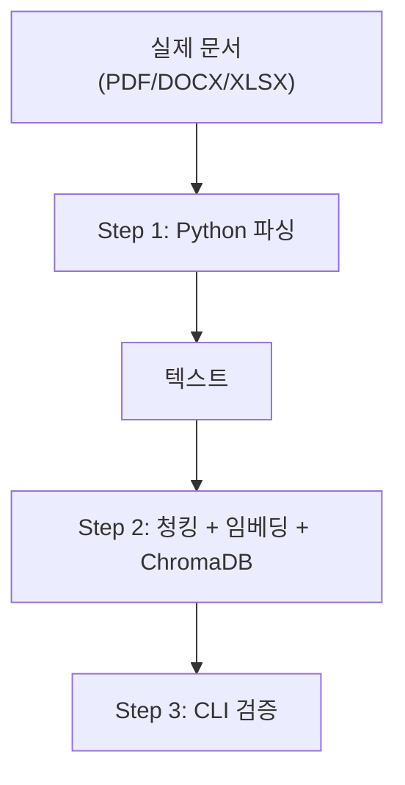
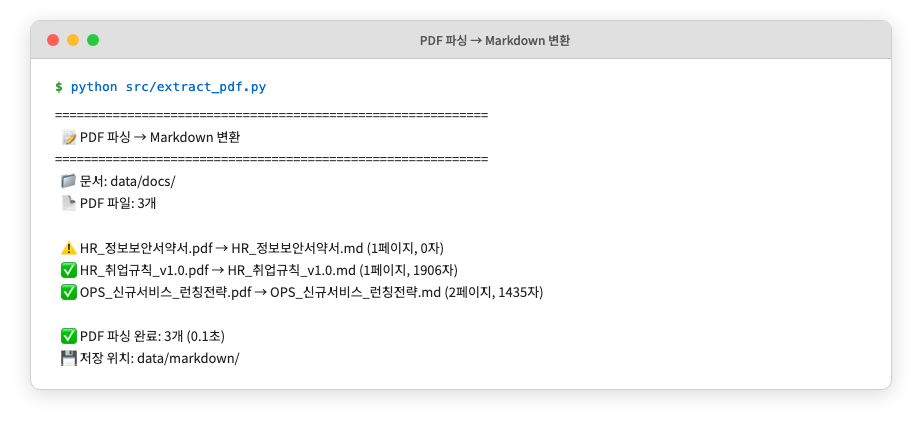
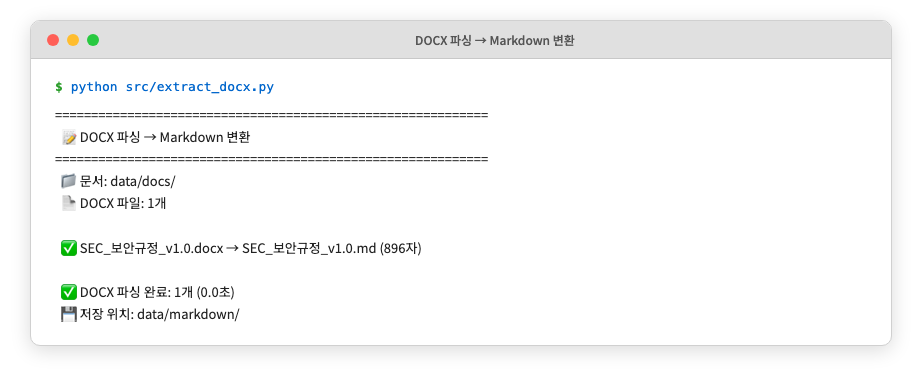
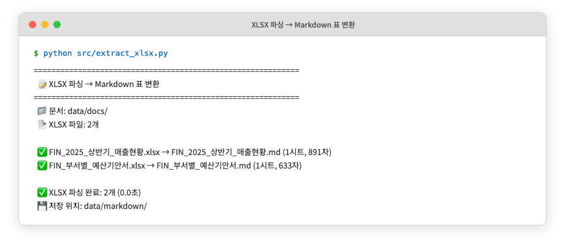
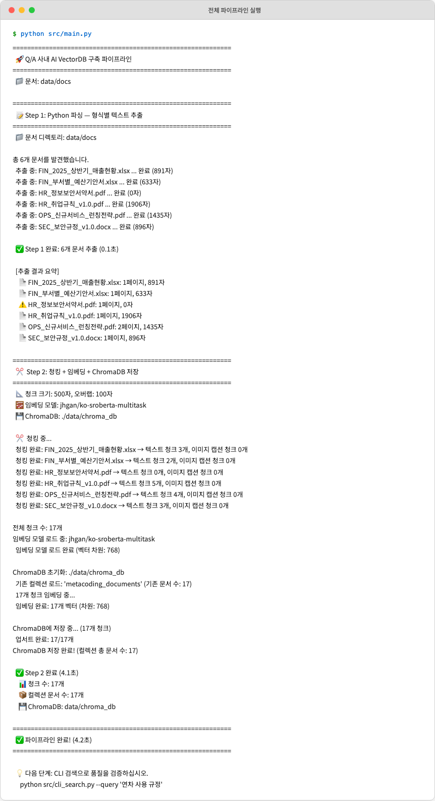
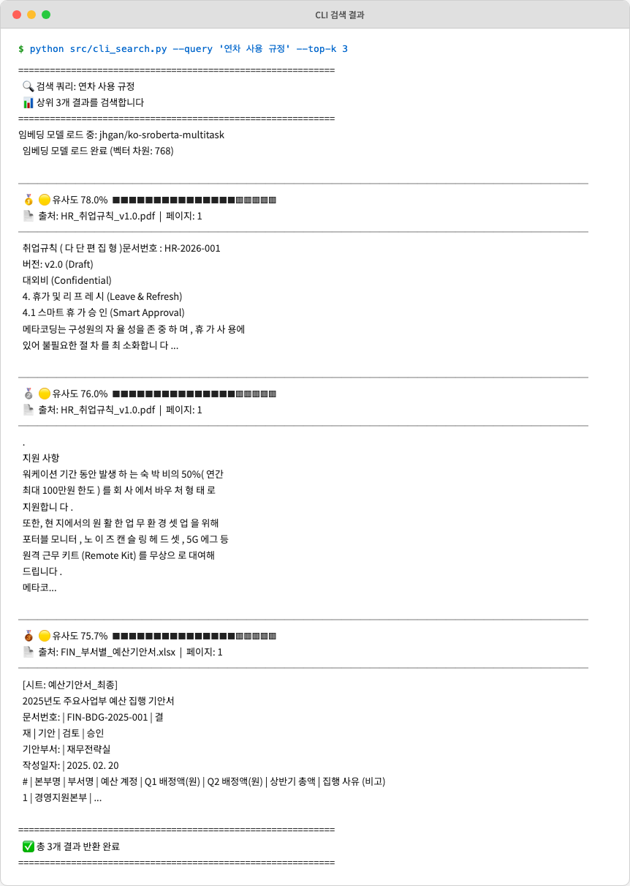

# 6. VectorDB 구축 — 문서를 검색 가능한 지식으로 바꾸기

CH05에서 문서 표준 규칙(파일명, 폴더 구조, 메타데이터)을 정립했습니다. 이 챕터에서는 사내 문서(PDF, DOCX, XLSX)를 "검색 가능한 지식"으로 변환하는 전 과정을 완성합니다. Python 라이브러리로 텍스트를 추출하고, 500자 단위로 청킹한 뒤 **ko-sroberta-multitask** 임베딩 모델로 벡터화하여 **ChromaDB** 에 영속 저장합니다. 마지막으로 CLI 검색 도구로 색인 품질을 직접 검증합니다.

이 챕터가 끝나면 터미널에서 `"연차 사용 규정"` 을 입력했을 때, ChromaDB가 HR 취업규칙 문서에서 관련 문구와 출처 경로를 즉시 반환하는 것을 눈으로 확인할 수 있습니다.

---

## 1. 개념 — 문서에서 벡터까지

### 1.1 텍스트 추출 전략 — 형식별 접근

사내 문서를 RAG에 활용하려면 가장 먼저 "텍스트 추출" 문제를 해결해야 합니다. Python 라이브러리만으로 가능한 부분과 불가능한 부분을 명확히 구분하면 아래 표와 같습니다.

| 문서 유형 | Python 파싱 결과 | 한계 |
|----------|----------------|------|
| 텍스트형 PDF | 대부분 정상 추출 | 다단 레이아웃에서 순서 뒤섞임 |
| 이미지형 PDF (스캔) | 텍스트 거의 없음 | 이미지 기반이므로 OCR 필요 |
| 표가 많은 PDF | 표 구조 무너짐 | 셀 순서가 뒤섞여 의미 손실 |
| DOCX | 단락·표 정상 추출 | 삽입된 이미지 설명 누락 |
| XLSX | 셀 값 정상 추출 | 차트·그래프·삽입 이미지 누락 |

텍스트형 PDF, DOCX, XLSX는 Python 라이브러리만으로 충분히 추출할 수 있지만, 이미지형 PDF에서는 텍스트 손실이 불가피합니다. 이 한계는 CH10에서 Vision LLM을 활용하여 해결합니다. 이 챕터에서는 Python 파싱이 가능한 범위에서 Step 1(텍스트 추출)과 Step 2(청킹·임베딩·저장)를 진행합니다.

### 1.2 청킹 전략 — 왜 500자인가?

**청킹(Chunking)** 은 긴 텍스트를 검색에 적합한 작은 단위로 나누는 과정입니다. 청크가 너무 크면 검색 정확도가 낮아지고, 너무 작으면 문맥이 잘려 답변 품질이 떨어집니다.

이 챕터에서는 **Fixed-size 청킹** 방식을 사용합니다. 청크 크기를 500자, 오버랩을 100자(20%)로 고정합니다. 오버랩이 필요한 이유는 청크 경계에서 문장이 잘릴 때 앞뒤 청크가 100자씩 겹치도록 하여 문맥 손실을 최소화하기 위해서입니다.

```
원본: [---500자 청크 1---][---500자 청크 2---][---500자 청크 3---]
오버랩 적용: [--500--][100][--500--][100][--500--]
             ↑청크1   ↑겹침 ↑청크2  ↑겹침 ↑청크3
```

Fixed-size를 기본으로 사용하는 이유는 구현이 단순하고 동작이 예측 가능하기 때문입니다. Semantic 청킹(의미 단위로 분할)은 품질이 더 좋지만 속도가 느리고 파라미터 조정이 복잡합니다.

### 1.3 임베딩 모델 — ko-sroberta-multitask

CH03에서 임베딩(텍스트를 벡터로 변환)의 개념과 `nomic-embed-text` 모델을 사용해 보았습니다. 이 챕터부터는 **`jhgan/ko-sroberta-multitask`** 모델로 교체합니다. 한국어에 특화된 SRoBERTa 기반 모델이며, HuggingFace에서 무료로 다운로드할 수 있습니다. 최초 실행 시 약 400MB를 다운로드한 후 로컬 캐시에 저장되어 이후에는 네트워크 없이 동작합니다.

### 1.4 전체 파이프라인 흐름

아래 다이어그램은 이 챕터에서 구현하는 전체 VectorDB 구축 흐름을 보여줍니다.



*그림 6-1: VectorDB 구축 3단계 파이프라인 흐름*

Step 1(Python 파싱)에서 문서 텍스트를 추출하고, Step 2에서 500자 단위로 청킹한 뒤 ko-sroberta 임베딩 모델로 벡터화하여 ChromaDB에 저장합니다. Step 3에서 CLI 검색으로 색인 품질을 검증합니다.

---

## 2. 예제 프로젝트 클론 및 환경 설정

다음 순서로 예제 프로젝트를 준비하십시오.

**1단계: 예제 폴더 이동**

CH02에서 클론한 저장소의 예제 폴더로 이동합니다.

```bash
cd examples/CH06_VectorDB_구축
```

**2단계: 환경 변수 설정**

```bash
cp .env.example .env
```

`.env` 파일을 열고 임베딩 모델과 ChromaDB 경로를 확인하십시오.

```
EMBEDDING_MODEL=jhgan/ko-sroberta-multitask
CHROMA_PERSIST_DIR=./data/chroma_db
CHROMA_COLLECTION_NAME=metacoding_documents
```

기본값 그대로 사용해도 됩니다.

**3단계: 의존성 설치**

```bash
python3.12 -m venv .venv
source .venv/bin/activate     # Windows: .\.venv\Scripts\Activate.ps1
pip install -r requirements.txt
```

주요 패키지를 확인하십시오.

```
pypdf==4.3.1             # PDF 텍스트 추출
python-docx==1.1.2       # DOCX 파싱
openpyxl==3.1.5          # XLSX 파싱
sentence-transformers==3.3.1  # ko-sroberta 임베딩
chromadb==1.5.1          # VectorDB
```

**4단계: 프로젝트 구조 확인**

의존성 설치가 끝났으면 프로젝트 구조를 확인하십시오.

```
CH06_VectorDB_구축/
├── .env.example          ← 환경 변수 템플릿
├── requirements.txt      ← 의존성 목록
├── data/
│   ├── docs/             ← 원본 문서 (PDF/DOCX/XLSX)
│   │   ├── hr/           ← HR 문서 (취업규칙, 정보보안서약서)
│   │   ├── finance/      ← 재무 문서 (매출현황, 예산기안서)
│   │   ├── ops/          ← 운영 문서 (서비스 런칭전략)
│   │   └── security/     ← 보안 문서 (보안규정)
│   ├── markdown/         ← Markdown 변환 결과 (스크립트 실행 후 생성)
│   └── chroma_db/        ← ChromaDB 벡터 저장소 (실행 후 생성)
└── src/
    ├── main.py           ← 전체 파이프라인 오케스트레이터
    ├── extractor.py      ← 문서 텍스트 추출 (공통 모듈)
    ├── extract_pdf.py    ← PDF 파싱 개별 실습 스크립트
    ├── extract_docx.py   ← DOCX 파싱 개별 실습 스크립트
    ├── extract_xlsx.py   ← XLSX 파싱 개별 실습 스크립트
    ├── chunker.py        ← 청킹 + 메타데이터 부착
    ├── store.py          ← 임베딩 + ChromaDB 저장
    └── cli_search.py     ← CLI 검색 검증 도구
```

`data/docs/` 에는 CH05에서 표준화한 6종의 사내 문서가 부서별 폴더에 정리되어 있습니다. `src/` 에는 파이프라인의 각 단계를 담당하는 모듈이 분리되어 있습니다.

**5단계: 실습 문서 확인**

`data/docs/` 폴더에 준비된 문서를 형식별로 확인하십시오. 이 문서들이 파이프라인의 입력이 됩니다.

**PDF 문서 (3개)**

HR 취업규칙, 정보보안서약서, 서비스 런칭전략 문서입니다. 텍스트형 PDF로 Python 파서가 정상 추출할 수 있습니다.

<!-- [IMAGE: 06_sample-pdf]
path: assets/CH06/06_sample-pdf.png
desc: data/docs/ 폴더의 PDF 문서 3개(HR_취업규칙_v1.0.pdf, HR_정보보안서약서.pdf, OPS_신규서비스_런칭전략.pdf)를 PDF 뷰어에서 열어 놓은 화면. 텍스트 기반 PDF임을 알 수 있도록 본문 텍스트가 보여야 한다.
-->

| 파일명 | 부서 | 내용 |
|--------|------|------|
| `HR_취업규칙_v1.0.pdf` | hr | 근로 조건, 연차·휴가, 급여 규정  |
| `HR_정보보안서약서.pdf` | hr | 정보 보안 서약 내용  |
| `OPS_신규서비스_런칭전략.pdf` | ops | 신규 서비스 기획 및 일정  |

**DOCX 문서 (1개)**

보안 규정 문서입니다. 제목 스타일(Heading)과 표가 포함되어 있어 마크다운 변환을 확인하기에 적합합니다.

<!-- [IMAGE: 06_sample-docx]
path: assets/CH06/06_sample-docx.png
desc: SEC_보안규정_v1.0.docx를 워드 또는 미리보기에서 열어 놓은 화면. Heading 스타일의 제목과 표가 포함된 문서 구조가 보여야 한다.
-->

| 파일명 | 부서 | 내용 |
|--------|------|------|
| `SEC_보안규정_v1.0.docx` | security | 접근 통제, 비밀번호 정책, 보안 등급 |

**XLSX 문서 (2개)**

매출 현황과 예산 기안서입니다. 여러 시트에 숫자 데이터와 수식이 포함되어 있습니다.

<!-- [IMAGE: 06_sample-xlsx]
path: assets/CH06/06_sample-xlsx.png
desc: FIN_2025_상반기_매출현황.xlsx를 엑셀 또는 미리보기에서 열어 놓은 화면. 월별 매출 데이터와 시트 탭이 보여야 한다.
-->

| 파일명 | 부서 | 내용 |
|--------|------|------|
| `FIN_2025_상반기_매출현황.xlsx` | finance | 월별·부서별 매출 데이터 |
| `FIN_부서별_예산기안서.xlsx` | finance | 부서별 예산 편성 내역 |

준비가 되었으니 이제 각 단계를 하나씩 살펴보겠습니다.

---

## 3. PDF 파싱 — pypdf

### 3.1 PDF 파서 코드

`src/extractor.py` 의 `extract_from_pdf()` 함수는 `pypdf.PdfReader` 로 PDF 파일을 열고 페이지 단위로 텍스트를 추출합니다.

```python
def extract_from_pdf(file_path: str | Path) -> dict:
    pages_data = []
    with open(file_path, "rb") as f:
        reader = pypdf.PdfReader(f)                       # ①
        for page_num, page in enumerate(reader.pages, start=1):
            page_text = page.extract_text() or ""         # ②
            pages_data.append({"page": page_num, "text": page_text.strip()})

    full_text = "\n\n".join(p["text"] for p in pages_data if p["text"])
    return {
        "source_path": str(file_path.resolve()),
        "file_name": file_path.name,
        "file_type": "pdf",
        "pages": pages_data,                              # ③
        "full_text": full_text,
    }
```

> ① `PdfReader` 가 PDF 바이너리를 로드합니다. 암호화된 PDF는 별도 처리가 필요합니다.
> ② `extract_text()` 가 페이지의 텍스트 레이어를 추출합니다. 이미지 기반 PDF는 텍스트 레이어가 없어 빈 문자열이 반환됩니다.
> ③ 페이지 번호와 텍스트를 딕셔너리로 저장합니다. 이 페이지 번호가 나중에 청크 메타데이터에 기록됩니다.

### 3.2 실행 및 결과 확인

`src/extract_pdf.py` 는 `data/docs/` 에서 모든 PDF를 찾아 파싱하고 결과를 `data/markdown/` 에 Markdown 파일로 저장합니다.

```bash
python src/extract_pdf.py
```



*그림 6-2: PDF 파싱 실행 결과 — 3개 PDF에서 텍스트를 추출하여 Markdown으로 저장*

결과를 확인하겠습니다. `data/markdown/HR_취업규칙_v1.0.md` 를 열어보십시오.

```
# HR_취업규칙_v1.0.pdf

- 파일 형식: pdf
- 총 페이지: 1페이지
- 추출 글자 수: 1906자

---

## 페이지 1

취업규칙  ( 다 단  편 집 형 )문서번호 : HR-2026-001
버전: v2.0 (Draft)
대외비  (Confidential)
4. 휴가  및  리 프 레 시  (Leave & Refresh)
4.1 스마트  휴 가  승 인  (Smart Approval)
메타코딩는 구성원의  자 율 성을  존 중 하 며 , 휴 가  사 용에
있어 불필요한  절 차 를  최 소화합니 다 . ...
```

텍스트가 추출되기는 했지만 **글자 사이에 공백이 삽입**되어 읽기 어렵습니다. 이 PDF가 다단 편집 레이아웃이기 때문입니다. Python 파싱의 한계를 눈으로 확인할 수 있습니다.

한편 `HR_정보보안서약서.pdf` 의 결과도 확인하십시오.

```
# HR_정보보안서약서.pdf

- 파일 형식: pdf
- 총 페이지: 1페이지
- 추출 글자 수: 0자

---

## 페이지 1 (텍스트 없음)
```

이 PDF는 이미지 기반(스캔본)이라 텍스트 레이어가 없습니다. `extract_text()` 가 빈 문자열을 반환하여 **추출된 글자가 0자**입니다. 이 한계는 CH10에서 Vision LLM을 활용하여 해결합니다.

---

## 4. DOCX 파싱 — python-docx

### 4.1 DOCX 파서 코드

`extract_from_docx()` 는 워드 문서에서 **단락(Paragraph)** 과 **표(Table)** 를 각각 추출합니다. 제목 스타일은 마크다운 헤더 형식으로 변환합니다.

```python
def extract_from_docx(file_path: str | Path) -> dict:
    text_parts = []
    doc = Document(str(file_path))

    for para in doc.paragraphs:                           # ①
        text = para.text.strip()
        if not text:
            continue
        style_name = para.style.name
        if style_name.startswith("Heading"):              # ②
            level = int(style_name.replace("Heading", "").strip())
            text_parts.append(f"{'#' * level} {text}")
        else:
            text_parts.append(text)

    for table in doc.tables:                              # ③
        for i, row in enumerate(table.rows):
            row_data = [cell.text.strip() for cell in row.cells]
            text_parts.append("| " + " | ".join(row_data) + " |")
            if i == 0:
                text_parts.append("| " + " | ".join(["---"] * len(row_data)) + " |")

    full_text = "\n".join(text_parts)
    return {"file_name": file_path.name, "file_type": "docx",
            "pages": [{"page": 1, "text": full_text}], "full_text": full_text, ...}
```

> ① `doc.paragraphs` 로 모든 단락을 순회합니다. 빈 단락은 건너뜁니다.
> ② "Heading 1"은 `# 제목`, "Heading 2"는 `## 소제목` 형식으로 변환합니다. RAG 검색 시 구조를 보존하기 위함입니다.
> ③ 표는 행·열 구조를 파이프(`|`)로 구분한 마크다운 형식으로 변환합니다. 삽입된 이미지는 추출되지 않습니다.

### 4.2 실행 및 결과 확인

```bash
python src/extract_docx.py
```



*그림 6-3: DOCX 파싱 실행 결과 — 보안규정 문서의 텍스트와 표를 Markdown으로 변환*

`data/markdown/SEC_보안규정_v1.0.md` 를 열어보십시오. 제목 스타일이 마크다운 헤더(`#`, `##`)로 변환되었고, 표도 마크다운 형식으로 정상 변환되었습니다.

```
# 전사 정보 보안 규정 및 가이드라인
문서 버젼: v1.0.3
최종 배포일: 2025-02-20
보안 등급: 회사 극비(Top Secret)
# 제 1 장. 망분리 및 접근 통제
## 1.1. 논리적 망분리 환경 지침
회사의 핵심 개발 서버 및 DB는 인터넷이 차단된 CDE 영역에 배치되며, ...
## 1.2. 비밀번호 생성 규칙 (강제)
시스템 접근용 비밀번호는 다음의 복잡도 요구사항을 모두 충족해야 한다.
- ☑ 영문 거대문자(A-Z) 및 소문자(a-z) 혼용 필수
- ☑ 숫자(0-9) 및 특수기호(!@#$%^&*) 1개 이상 반드시 포함
# 제 2 장. 부서별 보안 점검 항목
| 부서 권한 | 점검 주기 | 상세 보안 점검 지표 | 담당자 확인(서명) |
| --- | --- | --- | --- |
| 일반 임직원 (Level 1) | 월 1회 (매월 말일) | 1. 백신 프로그램 정의 파일 ... | [   ] 양호 |
```

PDF와 비교하면 DOCX는 텍스트가 깨끗하게 추출됩니다. 제목은 `#`, `##` 마크다운 헤더로, 표는 파이프(`|`) 구분 마크다운 표로 변환됩니다. DOCX는 페이지 구분이 없으므로 전체 내용을 하나의 페이지(page=1)로 취급합니다.

---

## 5. XLSX 파싱 — openpyxl

### 5.1 XLSX 파서 코드

`extract_from_xlsx()` 는 엑셀 파일의 **모든 시트** 에서 비어 있지 않은 셀 값을 행 단위로 추출합니다.

```python
def extract_from_xlsx(file_path: str | Path) -> dict:
    pages_data = []
    wb = openpyxl.load_workbook(str(file_path), data_only=True)  # ①

    for sheet_idx, sheet_name in enumerate(wb.sheetnames, start=1):
        ws = wb[sheet_name]
        row_texts = []
        for row in ws.iter_rows():                        # ②
            cell_values = [
                str(cell.value).strip()
                for cell in row
                if cell.value is not None
            ]
            if cell_values:
                row_texts.append(" | ".join(cell_values))  # ③
        sheet_text = f"[시트: {sheet_name}]\n" + "\n".join(row_texts)
        pages_data.append({"page": sheet_idx, "text": sheet_text})

    full_text = "\n\n".join(p["text"] for p in pages_data)
    return {"file_name": file_path.name, "file_type": "xlsx",
            "pages": pages_data, "full_text": full_text, ...}
```

> ① `data_only=True` 로 수식 대신 계산된 값을 읽습니다. 수식 자체가 필요하면 이 옵션을 `False`로 바꾸십시오.
> ② `iter_rows()` 로 시트의 모든 행을 순회합니다. 각 시트를 하나의 "페이지"로 취급합니다.
> ③ 셀 값을 파이프(`|`)로 구분하여 한 줄로 연결합니다. 차트, 그래프, 삽입 이미지는 추출되지 않습니다.

### 5.2 실행 및 결과 확인

```bash
python src/extract_xlsx.py
```



*그림 6-4: XLSX 파싱 실행 결과 — 2개 엑셀 파일을 마크다운 표로 변환*

`data/markdown/FIN_2025_상반기_매출현황.md` 를 열어보십시오. 마크다운 표 형식으로 변환되어 렌더링하면 표로 보입니다.

```markdown
## 시트: Sales_Data

|  |  | Quarter | 1분기(Q1) |  |  | 2분기(Q2) |  |  |
| --- | --- | --- | --- | --- | --- | --- | --- | --- |
|  |  | Month | 1월 | 2월 | 3월 | 4월 | 5월 | 6월 |
| Business Unit | Region | Branch |  |  |  |  |  |  |
| Global | 아태지역(APAC) | 한국(서울) | 638086 | 643505 | 556986 | 880978 | 273472 | 978274 |
|  |  | 한국(부산) | 116989 | 316998 | 302096 | 370896 | 753590 | 969809 |
|  | 미주(NA) | 미국(뉴욕) | 131520 | 585148 | 372528 | 815132 | 719644 | 135946 |
...
```

`data_only=True` 설정으로 수식 대신 계산된 결과 값을 읽습니다. 병합 셀은 빈 칸으로 유지되어 원본 엑셀의 행·열 구조가 그대로 보존됩니다. 차트, 그래프, 삽입 이미지는 추출되지 않습니다.

> **문서 안에 포함된 이미지는 어떻게 되는가?**
> PDF 안의 삽입 이미지, DOCX에 붙인 사진, XLSX의 차트·그래프는 Python 텍스트 파서가 **무시**합니다. `pypdf`, `python-docx`, `openpyxl` 모두 텍스트 레이어만 읽기 때문입니다. 이미지 안에 담긴 텍스트(스캔 문서, 도표 안 숫자 등)를 추출하려면 OCR(광학 문자 인식)이나 Vision LLM처럼 이미지를 이해하는 모델이 필요합니다. 이 방법은 CH10에서 다룹니다. 지금 단계에서는 "이미지는 건너뛰고 텍스트만 추출한다"는 점을 기억하십시오.

이로써 `data/markdown/` 폴더에 형식별 추출 결과가 모두 저장되었습니다.

```
data/markdown/
├── HR_정보보안서약서.md          ← 0자 (이미지형 PDF, 텍스트 없음)
├── HR_취업규칙_v1.0.md          ← 1906자 (다단 PDF, 공백 삽입)
├── OPS_신규서비스_런칭전략.md    ← 1435자 (PPT 변환 PDF)
├── SEC_보안규정_v1.0.md         ← 896자 (DOCX, 깨끗한 추출)
├── FIN_2025_상반기_매출현황.md   ← 891자 (XLSX, 마크다운 표)
└── FIN_부서별_예산기안서.md      ← 633자 (XLSX, 마크다운 표)
```

DOCX와 XLSX는 깨끗하게 추출됩니다. 반면 PDF는 레이아웃에 따라 품질 차이가 큽니다. 이 차이를 직접 `data/markdown/` 폴더에서 파일을 열어 비교해 보십시오.

> **세 형식의 공통점:** 세 파서 모두 `{"file_name": ..., "file_type": ..., "pages": [...], "full_text": ...}` 형식의 표준 딕셔너리를 반환합니다. 형식이 다르더라도 동일한 출력 구조를 사용하므로, 이후 청킹 단계에서 형식에 관계없이 동일한 방식으로 처리할 수 있습니다.

---

## 6. 청킹 — chunker.py

### 6.1 Fixed-size 청킹 구현

추출된 텍스트를 그대로 임베딩하면 문서가 너무 길어 검색 정확도가 떨어집니다. `src/chunker.py` 는 텍스트를 500자 단위로 분할하고 각 청크에 메타데이터를 부착합니다.

**다음 코드는 텍스트를 Fixed-size 방식으로 청크 리스트로 분할합니다.**

```python
def split_text_into_chunks(
    text: str,
    chunk_size: int = DEFAULT_CHUNK_SIZE,  # 500자
    overlap: int = DEFAULT_OVERLAP,        # 100자
) -> list[str]:
    text = text.strip()
    if not text:
        return []

    chunks = []
    step = chunk_size - overlap             # ① 이동 단계: 400자
    start = 0

    while start < len(text):               # ②
        end = start + chunk_size
        chunk = text[start:end].strip()
        if chunk:
            chunks.append(chunk)
        start += step                       # ③

    return chunks
```

> ① `step = 500 - 100 = 400`입니다. 한 번에 400자씩 전진하므로 앞뒤 청크가 100자씩 겹칩니다.
> ② 텍스트 끝에 도달할 때까지 반복합니다. 마지막 청크는 500자보다 짧을 수 있습니다.
> ③ 시작 위치를 step만큼 이동합니다. overlap이 클수록 청크 수가 늘어나고 저장 공간이 증가합니다.

> 전체 코드: `src/chunker.py`

### 6.2 메타데이터 부착 — 출처 추적의 핵심

각 청크에는 **메타데이터(Metadata)** 가 부착됩니다. 이 메타데이터가 나중에 "어느 문서의 몇 번째 페이지에서 가져온 청크인가?"를 추적하는 기반이 됩니다.

```python
def build_text_chunk(
    chunk_text: str,
    doc_id: str,
    file_name: str,
    ...
) -> dict:
    chunk_id = f"{doc_id}_text_p{page:03d}_c{chunk_index:04d}"  # ①

    return {
        "id": chunk_id,
        "text": chunk_text,
        "metadata": {
            "doc_id": doc_id,
            "file_name": file_name,        # ②
            "file_type": file_type,
            "source_path": source_path,
            "page": page,                  # ③
            "department": department,      # ④
            "chunk_type": "text",
        },
        "chunk_type": "text",
    }
```

> ① 청크 ID는 `hr_취업규칙_text_p001_c0003` 형식으로 문서, 페이지, 순번이 포함되어 중복이 없습니다.
> ② `file_name`은 CH07에서 "출처: HR_취업규칙_v1.0.pdf" 형식으로 사용자에게 표시됩니다.
> ③ `page`는 PDF에서 몇 번째 페이지인지 저장합니다. 사용자가 원본 문서를 직접 확인할 때 사용합니다.
> ④ `department`는 파일명에서 추출한 담당 부서로, 메타데이터 필터링에 활용됩니다.

---

## 7. 임베딩 + VectorDB 저장 — store.py

### 7.1 ChromaDB 영속 저장

앞에서 형식별로 추출한 텍스트를 청킹한 결과를 임베딩하여 ChromaDB에 저장합니다. `src/store.py` 는 청크 리스트를 받아 ko-sroberta 모델로 벡터를 계산하고 ChromaDB에 영속 저장합니다. `PersistentClient` 를 사용하므로 프로그램을 종료해도 데이터가 `data/chroma_db/` 폴더에 보존됩니다.

**다음 코드는 청크를 임베딩하여 ChromaDB에 배치 저장하는 메인 파이프라인입니다.**

```python
def store_chunks_to_chroma(
    chunks: list[dict],
    chroma_dir: str = DEFAULT_CHROMA_DIR,
    ...
) -> dict:
    model = load_embedding_model(embedding_model_name)  # ①

    client = chromadb.PersistentClient(                 # ②
        path=chroma_dir,
        settings=Settings(anonymized_telemetry=False),
    )
    collection = get_or_create_collection(client, collection_name)

    ids, documents, embeddings, metadatas = embed_chunks(chunks, model)  # ③

    for batch_start in range(0, len(ids), BATCH_SIZE):  # ④
        collection.upsert(
            ids=ids[batch_start:batch_end],
            documents=documents[batch_start:batch_end],
            embeddings=embeddings[batch_start:batch_end],
            metadatas=metadatas[batch_start:batch_end],
        )
```

> ① `jhgan/ko-sroberta-multitask` 모델을 로드합니다. 최초 실행 시 HuggingFace에서 약 400MB를 다운로드하고 이후 실행에서는 로컬 캐시를 재사용합니다.
> ② `PersistentClient` 로 ChromaDB를 초기화합니다. `chroma_dir` 폴더가 없으면 자동으로 생성됩니다.
> ③ 모든 청크 텍스트를 한 번에 임베딩하여 벡터 리스트를 생성합니다. `BATCH_SIZE=64`로 나누어 처리하여 메모리 효율을 높입니다.
> ④ `upsert`는 이미 존재하는 ID는 덮어쓰고, 새 ID는 추가합니다. 파이프라인을 재실행해도 데이터가 중복되지 않습니다.

> 전체 코드: `src/store.py`

### 7.2 전체 파이프라인 실행

지금까지 형식별로 파서 코드와 추출 결과를 확인했습니다. 이제 전체 파이프라인을 한 번에 실행하여 **파싱 → 청킹 → 임베딩 → ChromaDB 저장**을 모두 수행합니다.

```bash
python src/main.py
```

> **참고:** 최초 실행 시 임베딩 모델 다운로드(약 400MB)로 수 분이 소요될 수 있습니다. 이후 실행에서는 로컬 캐시를 사용하므로 빠릅니다.



*그림 6-5: 전체 파이프라인 실행 결과 — 6종 문서에서 17개 청크를 ChromaDB에 저장*

6종의 문서에서 추출된 텍스트가 17개 청크로 분할되어 ChromaDB에 저장되었습니다. `HR_정보보안서약서.pdf` 는 이미지 기반이라 텍스트가 0자 추출되어 청크가 0개입니다. 이제 검색이 제대로 동작하는지 확인하겠습니다.

---

## 8. CLI 검색 검증 — cli_search.py

### 8.1 터미널에서 검색 품질 확인

ChromaDB 구축이 완료되면 웹 UI 없이 터미널에서 바로 검색 품질을 검증합니다.

**단일 쿼리 검색** (즉시 결과 확인):

```bash
python src/cli_search.py --query "연차 사용 규정 요약"
```

**대화형 반복 검색** (여러 쿼리를 순서대로 테스트):

```bash
python src/cli_search.py
```

### 8.2 검색 결과 출력 형식

**다음 코드는 검색 결과를 출처·유사도와 함께 터미널에 출력합니다.**

```python
def print_search_result(result: dict) -> None:
    rank = result["rank"]
    distance = result["distance"]
    meta = result["metadata"]

    similarity = format_distance_as_similarity(distance)   # ①

    print(f"[결과 {rank}]  유사도: {similarity}  |  출처: {meta['file_name']}  |  페이지: {meta['page']}")  # ②

    print(result["text"][:300])                            # ③
```

**유사도란 무엇인가?**

"유사도(similarity)"는 두 텍스트가 의미적으로 얼마나 가까운지를 수치로 나타낸 것입니다. 검색 쿼리 "연차 사용 규정"과 문서 청크 "휴가 승인 절차..."는 단어가 다르지만 뜻이 비슷합니다. 임베딩 모델이 두 텍스트를 벡터(숫자 배열)로 변환하면, 벡터 사이의 각도가 좁을수록 "의미가 비슷하다"고 판단합니다. 이 각도를 측정하는 방법을 **코사인 유사도**라 부르며, 0%(완전 무관)에서 100%(완전 일치)까지의 백분율로 표시합니다.

ChromaDB는 내부적으로 **코사인 거리**(0.0~2.0 범위)를 반환합니다. 거리가 작을수록 가까운 것이므로, `(1 - 거리/2) × 100` 공식으로 직관적인 백분율로 변환합니다. 예를 들어 거리 0.44는 유사도 78%가 됩니다.

> ① `format_distance_as_similarity()` 가 코사인 거리를 백분율 유사도로 변환합니다.
> ② 순위, 유사도, 파일명, 페이지 번호를 한 줄에 표시합니다. 이 정보가 CH07에서 출처 표시에 사용됩니다.
> ③ 청크 텍스트를 최대 300자까지 표시합니다. 전체 500자를 보려면 코드에서 한도를 조정하십시오.

> 전체 코드: `src/cli_search.py`

> **동작 요약:** 이 코드는 검색 쿼리 문자열과 `top_k` 파라미터를 받아 쿼리를 ko-sroberta로 임베딩한 뒤 ChromaDB에서 유사도 검색을 수행하여 상위 k개 결과를 반환합니다. `top_k`는 "상위 몇 개를 가져올 것인가"를 정하는 숫자입니다. `top_k=3`이면 가장 유사한 3개의 청크만 반환하고, `top_k=5`(기본값)이면 5개를 반환합니다. 값이 클수록 더 많은 후보를 확인할 수 있지만, 관련성이 낮은 결과가 포함될 수 있습니다.

### 8.3 검색 품질 확인 예시

```bash
python src/cli_search.py --query "연차 사용 규정" --top-k 3
```



*그림 6-6: CLI 검색 결과 — "연차 사용 규정" 쿼리에 HR 취업규칙이 유사도 78%로 1위 검색*

유사도 78.0%로 HR 취업규칙의 휴가 관련 조항이 1위로 검색되었습니다. 다단 레이아웃 PDF에서 추출한 텍스트라 공백이 남아 있지만, 임베딩 모델이 의미적 유사도를 계산하여 관련 문서를 정확히 찾아냈습니다.

다른 쿼리도 테스트해 보십시오.

```bash
python src/cli_search.py --query "비밀번호 정책" --top-k 3
```

```
────────────────────────────────────────────────────────────
  🥇  🟡 유사도 76.5%  ███████████████░░░░░
  📄  출처: SEC_보안규정_v1.0.docx  |  페이지: 1
────────────────────────────────────────────────────────────
  # 전사 정보 보안 규정 및 가이드라인
  ## 1.2. 비밀번호 생성 규칙 (강제)
  시스템 접근용 비밀번호는 다음의 복잡도 요구사항을 모두
  충족해야 한다 ...
```

"비밀번호 정책" 쿼리에 보안규정 DOCX 문서가 1위로 정확히 검색됩니다.

### 8.4 검색 품질 점검 기준

CLI 검색 결과를 보며 아래 항목을 점검하십시오.

| 점검 항목 | 정상 | 문제 |
|----------|------|------|
| 상위 결과 유사도 | 70% 이상 | 50% 미만이면 임베딩 모델 확인 |
| 출처 파일명 | 관련 문서가 반환됨 | 무관한 문서만 나오면 청킹 재검토 |
| 검색 결과 수 | top_k만큼 반환 | 0개이면 ChromaDB 비어 있음 |

> **주의: 유사도 점수 해석**
> 코사인 유사도 50% 미만은 관련 문서를 찾지 못했을 가능성이 높습니다. 이 경우 청크 크기를 줄이거나 (`--chunk-size 300`) 다른 임베딩 모델을 시도해 보십시오.

---

## 9. 정리하며

이 챕터에서 Q/A 사내 AI 비서에 **VectorDB 지식 저장소** 를 추가했습니다. CH05에서 표준화한 사내 문서 6종을 형식별로 파싱하여 `data/markdown/` 에 Markdown으로 변환하고, 17개 청크로 분할하여 ChromaDB에 색인한 뒤, CLI로 유사도 검색을 검증했습니다.

- **Python 파싱으로 기본 동작을 이해한다**: `pypdf`, `python-docx`, `openpyxl`은 텍스트형 문서에서 동작하지만, 이미지형 PDF나 복잡한 레이아웃에서는 텍스트 손실이 발생한다.
- **이미지형 PDF는 Python 파싱으로 텍스트 손실이 발생한다**: OCR이나 Vision LLM을 활용하면 개선할 수 있다.
- **Fixed-size 청킹은 출발점이다**: 500자 + 100자 오버랩은 단순하지만 예측 가능한 방식이다.
- **CLI로 색인 품질을 검증한다**: 유사도 70% 이상이 나오면 VectorDB가 정상적으로 구축된 것이다.
- **`upsert`로 재실행이 안전하다**: ChromaDB의 upsert는 기존 데이터를 덮어쓰므로 파이프라인을 여러 번 실행해도 중복 저장이 발생하지 않는다.

다음 챕터에서는 이 ChromaDB를 LCEL 기반 RAG 체인과 연결하고, 웹 채팅 UI와 멀티턴 대화 기능을 추가하여 RAG Q&A 엔진을 완성합니다.
