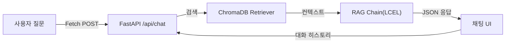
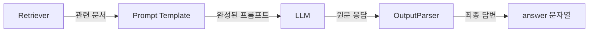
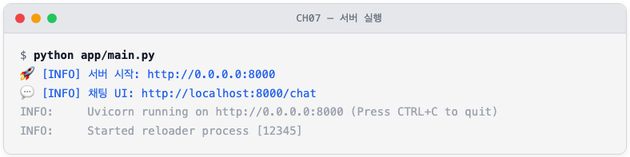
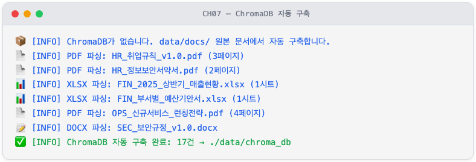
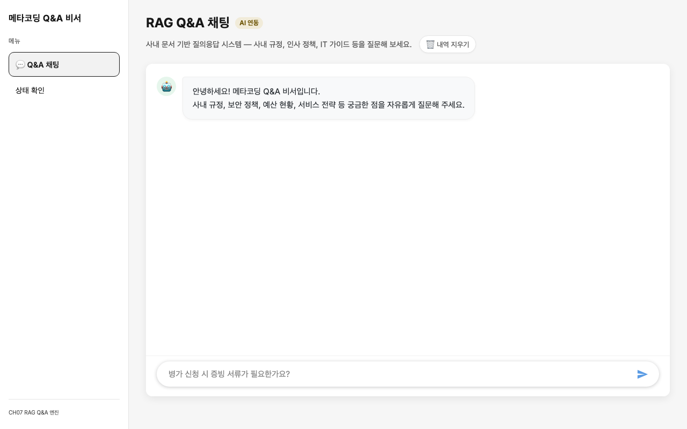
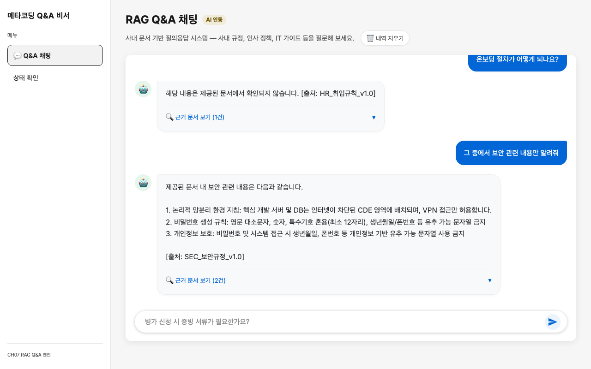
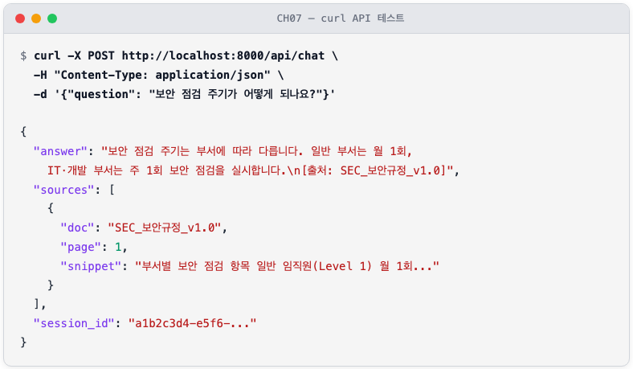

# 7. RAG로 Q&A 엔진 만들기

CH06에서 배운 VectorDB 구축 방식을 활용하여 ChromaDB 인덱스를 웹 채팅 UI와 연결하는 작업을 이 챕터에서 수행합니다. LCEL(LangChain Expression Language) 기반 RAG 체인을 조립하고, 출처가 포함된 답변을 반환하는 채팅 API를 만들며, 멀티턴 대화 관리 기능까지 완성합니다.

이 챕터를 완료하면 브라우저에서 사내 문서에 질문하고 출처가 명시된 답변을 받는 웹 채팅 UI를 직접 사용할 수 있습니다.

---

## 1. RAG Q&A 엔진의 구조

### 1.1 전체 흐름

사용자가 채팅창에 질문을 입력하면 어떤 일이 일어나는지 살펴보겠습니다.



*그림 7-1: CH07 RAG Q&A 엔진 전체 흐름*

질문은 Fetch POST로 `/api/chat` 엔드포인트에 도달하고, FastAPI가 이를 받아 RAG 체인에 전달합니다. RAG 체인은 ChromaDB에서 관련 문서를 검색하고 LLM으로 답변을 생성하여 JSON 형태로 반환합니다. 채팅 UI는 그 JSON에서 답변과 출처를 꺼내 화면에 표시합니다.

### 1.2 LCEL 이란 무엇인가

**LCEL(LangChain Expression Language)** 은 LangChain의 선언적 체인 조합 문법입니다. Python의 파이프 연산자(`|`)를 사용하여 Retriever, Prompt, LLM, OutputParser 같은 구성 요소를 하나의 체인으로 연결합니다.

LCEL을 사용하는 이유는 두 가지입니다. 첫째, 파이프 연산자 덕분에 데이터 흐름이 왼쪽에서 오른쪽으로 한눈에 보입니다. 둘째, 체인 구성 요소를 쉽게 교체할 수 있어 Ollama 모델을 OpenAI 모델로 바꾸거나 ChromaDB를 다른 VectorDB로 교체할 때 체인 코드 수정 없이 구성 요소만 바꾸면 됩니다.



*그림 7-2: LCEL 파이프라인 구성 요소*

다이어그램의 각 구성 요소를 정리하면 다음과 같습니다.

| 구성 요소 | 역할 |
|----------|------|
| **Retriever** | ChromaDB에서 질문과 유사한 문서를 검색하여 반환합니다. CH03에서 `as_retriever()`로 처음 사용했습니다. |
| **Prompt Template** | LLM에 전달할 지시문(시스템 규칙 + 컨텍스트 + 질문)을 조립합니다. `{context}`, `{question}` 같은 변수를 실제 값으로 채웁니다. |
| **LLM** | DeepSeek R1 등 대규모 언어 모델이 프롬프트를 읽고 답변을 생성합니다. |
| **OutputParser** | LLM 응답 객체에서 순수 문자열만 추출합니다. `StrOutputParser()`가 이 역할을 합니다. |

> **temperature란?**
> LLM의 출력 무작위성을 조절하는 파라미터입니다. 0에 가까우면 가장 확률이 높은 단어를 선택하여 일관된 답변을 생성하고, 1에 가까우면 다양한 표현을 시도합니다. 사실 기반 Q&A에서는 `temperature=0.1` 처럼 낮은 값을 사용합니다.

### 1.3 출처 강제 규칙의 중요성

RAG 시스템에서 **출처 강제 규칙** 은 신뢰도의 핵심입니다. "제공된 문서에서만 답변하라"는 규칙이 없으면 LLM이 학습 데이터로부터 그럴듯한 답변을 만들어낼 수 있습니다. 이 경우 사용자는 답변이 실제 사내 문서 기반인지, LLM의 추측인지 구분할 수 없습니다.

출처 강제 규칙을 추가하면:
- 답변의 근거를 문서와 페이지로 검증할 수 있습니다.
- 문서에 없는 내용은 "확인되지 않음"으로 명확하게 처리됩니다.
- 사용자와 관리자 모두 AI 답변의 신뢰도를 판단할 수 있습니다.

> **사전 준비: ChromaDB 인덱스**
> 이 챕터의 예제 프로젝트에는 CH06과 동일한 원본 문서 6종이 `data/docs/`에 포함되어 있습니다. 서버를 처음 실행하면 이 문서를 자동으로 파싱·청킹·임베딩하여 `data/chroma_db/`에 VectorDB를 구축합니다. CH06과 동일한 파이프라인이 챕터 내부에서 독립적으로 동작하므로, CH06의 출력을 공유하거나 복사할 필요가 없습니다.

---

## 2. 실습 환경 준비

### 2.1 예제 폴더 이동 및 설정

CH02에서 클론한 저장소의 예제 폴더로 이동합니다.

```bash
cd examples/CH07_RAG_QA_엔진
python3.12 -m venv .venv
source .venv/bin/activate   # Windows: .\.venv\Scripts\Activate.ps1
```

`.env.example`을 `.env`로 복사하고 설정값을 입력합니다.

```bash
cp .env.example .env
```

`.env` 파일의 주요 설정 항목은 다음과 같습니다.
```
# LLM 제공자 선택: ollama 또는 openai
LLM_PROVIDER=ollama

# Ollama 서버 주소 및 모델명
OLLAMA_BASE_URL=http://localhost:11434
OLLAMA_MODEL=deepseek-r1:8b

# 임베딩 모델 (CH06과 동일)
EMBEDDING_MODEL=jhgan/ko-sroberta-multitask

# ChromaDB 경로 (없으면 data/docs/에서 자동 구축)
CHROMA_PERSIST_DIR=./data/chroma_db
CHROMA_COLLECTION_NAME=metacoding_documents

# 비활성 세션 만료 시간 (초)
SESSION_TTL_SECONDS=3600
# 대화 히스토리 최근 N턴 유지
CONVERSATION_WINDOW_SIZE=5
# 검색할 상위 문서 개수
RETRIEVER_TOP_K=5
```

> **팁: Ollama 실행 시 메모리 요구 사항**
> `deepseek-r1:8b` 모델은 최소 **8GB 이상의 RAM**이 필요합니다. 메모리가 부족하면 응답 속도가 현저히 느려지거나 오류가 발생할 수 있습니다.
> 메모리가 16GB 미만인 환경이라면 `.env`에서 `LLM_PROVIDER=openai`로 변경하고 `OPENAI_API_KEY`를 입력하십시오. 나머지 코드는 수정 없이 자동으로 전환됩니다.

의존성을 설치합니다.

```bash
pip install -r requirements.txt
```

CH06 대비 새로 추가되는 주요 패키지를 확인하십시오.
[수정] 이거 다시 업데이트
```
langchain==0.3.19              # LCEL 체인 조합 프레임워크
langchain-community==0.3.19    # ChromaDB 등 커뮤니티 통합
langchain-ollama==0.2.3        # Ollama LLM 연동
langchain-openai==0.3.7        # OpenAI LLM 연동 (선택)
langchain-chroma==0.2.6        # ChromaDB Retriever 래퍼
fastapi==0.115.8               # 채팅 API 서버
uvicorn[standard]==0.34.0      # ASGI 서버
jinja2==3.1.5                  # HTML 템플릿 엔진
```

> CH06에서 사용한 `chromadb`, `sentence-transformers`, `python-dotenv`는 동일 버전을 그대로 사용합니다.

프로젝트 폴더 구조는 다음과 같습니다.

```
CH07_RAG_QA_엔진/
├── app/
│   ├── main.py          ← FastAPI 앱 진입점
│   ├── chat_api.py      ← /api/chat 엔드포인트
│   └── session.py       ← 세션 쿠키 관리
├── src/
│   ├── rag_chain.py     ← LCEL RAG 체인
│   ├── response_parser.py  ← 출처 파서
│   └── conversation.py  ← 멀티턴 대화 관리
├── templates/
│   ├── base.html        ← 공통 레이아웃
│   └── chat.html        ← 채팅 UI
├── static/
│   ├── css/chat.css
│   └── js/chat.js
├── data/
│   ├── docs/            ← 원본 문서 (CH06과 동일, 6종)
│   ├── markdown/        ← 파싱 결과 Markdown (자동 생성)
│   └── chroma_db/       ← ChromaDB 저장소 (자동 생성)
├── .env.example
└── requirements.txt
```

---

## 3. RAG 체인 구현

### 3.1 rag_chain.py — LCEL 파이프라인 조립
RAG 체인의 핵심은 `rag_chain.py`입니다. 이 파일은 세 가지 일을 합니다. 첫째, 환경 변수에 따라 LLM 인스턴스를 생성합니다. 둘째, ChromaDB에서 Retriever를 구성합니다(ChromaDB가 없으면 `data/docs/` 원본 문서를 파싱하여 자동 구축합니다). 셋째, LCEL 파이프 연산자로 전체 체인을 조립합니다.

<!-- [GEMINI PROMPT: 07_rag-chain-pipe]
path: assets/CH07/07_rag-chain-pipe.png
A minimalist black and white technical diagram with a strict 16:9 aspect ratio on a solid white background. No shading, no 3D effects, only clean thin line art. Shows LCEL pipeline: a dict box labeled 'Input dict: question, history' on the left, then three parallel branches (question -> Retriever -> format_docs, history passthrough, question passthrough) merging into a 'Prompt Template' box, then 'LLM (DeepSeek R1)', then 'StrOutputParser', then 'answer string'. All components connected with right-pointing arrows. Korean and English labels. Clean minimalist line art style. 16:9 aspect ratio, white background, centered.
Style: architecture-infographic
-->


*그림 7-3: LCEL 파이프 연산자로 조립된 RAG 체인 구조*

먼저 출처 강제 프롬프트 템플릿을 살펴보겠습니다.

**다음 코드는 RAG 시스템의 핵심 규칙인 출처 강제 + "모르면 확인되지 않음" 프롬프트를 정의합니다.**

```python
RAG_SYSTEM_PROMPT = """당신은 메타코딩 사내 문서 Q&A 비서입니다.
아래에 제공된 문서(Context)만 사용하여 질문에 답변하십시오.

규칙:
1. 반드시 제공된 문서에서만 근거를 찾아 답변하시오.
2. 문서에서 답을 찾을 수 없으면 "해당 내용은 제공된 문서에서 확인되지 않습니다."라고 답하시오.
3. 답변 마지막에 근거 문서명을 반드시 명시하시오. 형식: [출처: 문서명]
4. 추측이나 외부 지식을 사용하지 마시오.

Context (제공된 문서):
{context}

이전 대화:
{history}
"""
```

규칙 1번과 2번이 환각(Hallucination)을 차단하는 핵심입니다. 규칙 3번은 사용자가 답변의 근거를 직접 확인할 수 있게 합니다. 규칙 4번은 LLM이 학습 데이터에서 "비슷해 보이는" 내용을 끌어오지 못하게 막습니다.

이제 LCEL 체인 조립 코드를 살펴보겠습니다.

> 전체 코드: `src/rag_chain.py`

**다음 코드는 LCEL 파이프 연산자로 Retriever, Prompt, LLM, Parser를 하나의 체인으로 조립합니다.**
```python
def build_rag_chain() -> tuple[Any, Any]:
    llm = _build_llm()                # ①
    retriever = _build_retriever()    # ②

    prompt = ChatPromptTemplate.from_messages(
        [
            ("system", RAG_SYSTEM_PROMPT),
            ("human", RAG_HUMAN_PROMPT),
        ]
    )

    chain = (
        {
            "context": itemgetter("question") | retriever | _format_docs,  # ③
            "history": itemgetter("history"),                               # ④
            "question": itemgetter("question"),                             # ⑤
        }
        | prompt              # ⑥
        | llm                 # ⑦
        | StrOutputParser()   # ⑧
    )

    return chain, retriever
```

> ① `.env`의 `LLM_PROVIDER` 값에 따라 `ChatOllama` 또는 `ChatOpenAI` 인스턴스를 생성합니다.
> ② ChromaDB 경로를 확인하여 Retriever를 생성합니다. 데이터가 없으면 `data/docs/` 원본 문서를 파싱하여 ChromaDB를 자동 구축합니다.
> ③ 입력 딕셔너리의 `question` 키를 꺼내 Retriever에 전달하고 검색 결과를 텍스트로 포맷합니다.
> ④ `history` 키를 그대로 프롬프트의 `{history}` 자리에 넣습니다.
> ⑤ `question` 키를 그대로 프롬프트의 `{question}` 자리에 넣습니다.
> ⑥ `context`, `history`, `question` 세 값을 합쳐 완성된 프롬프트를 만듭니다.
> ⑦ 완성된 프롬프트를 LLM에 전달하여 응답을 생성합니다.
> ⑧ LLM 응답 객체에서 문자열만 추출합니다.

> **동작 요약:** 이 코드는 `{"question": "병가 신청 시 증빙 서류가 필요한가요?", "history": "없음"}` 형태의 입력 딕셔너리를 받아, `question` 키로 ChromaDB를 검색하여 상위 5개 문서를 텍스트로 포맷하고, 시스템 프롬프트와 이전 대화, 질문을 합쳐 완성된 프롬프트를 생성한 뒤 LLM을 호출하여, `"3일 미만 병가는 증빙 서류가 불필요하며, 3일 이상 병가는 의사소견서를 제출해야 합니다. [출처: HR_취업규칙_v1.0]"` 과 같은 문자열 답변을 반환합니다.

`itemgetter("question") | retriever | _format_docs` 부분이 LCEL의 묘미입니다. 파이프 연산자 하나로 "질문 추출 → 검색 → 포맷" 세 단계가 하나의 표현식으로 연결됩니다.

> **주의: temperature=0.1로 설정한 이유**
> `_build_llm()` 내부에서 `temperature=0.1`로 설정합니다. 온도가 0에 가까울수록 LLM이 가장 확률이 높은 단어를 선택하므로 출처 기반 사실 답변이 일관되게 출력됩니다. 창의적 글쓰기가 아닌 사실 기반 Q&A에서는 낮은 온도가 적합합니다.

---

## 4. 응답 파서 구현

### 4.1 response_parser.py — answer + sources 분리

LLM이 반환하는 원문 응답을 채팅 UI에서 바로 사용하기 어렵습니다. DeepSeek R1 모델은 `<think>...</think>` 추론 토큰을 원문에 포함하며, 출처 정보는 검색된 Document 객체에 따로 들어있기 때문입니다.

`response_parser.py`는 두 가지 일을 합니다. 첫째, 원문 응답에서 `<think>` 태그를 제거합니다. 둘째, 검색된 Document 목록에서 출처 정보를 추출하여 구조화된 JSON으로 변환합니다.

> 전체 코드: `src/response_parser.py`

**다음 코드는 LLM 원문 응답과 검색 문서로부터 `{"answer": str, "sources": list}` 형태의 최종 API 응답을 구성합니다.**

```python
def build_response(
    raw_answer: str,
    docs: list[Document],
) -> dict[str, Any]:
    answer = parse_answer_text(raw_answer)   # ①
    sources = parse_sources_from_docs(docs)  # ②

    return {
        "answer": answer,    # ③
        "sources": sources,  # ③
    }
```

> ① 원문 응답에서 `<think>.*?</think>` 패턴을 정규식으로 제거하고 앞뒤 공백을 정리합니다.
> ② 검색된 Document 목록에서 `source`, `page`, `snippet`(앞 120자)을 추출합니다. 동일 출처는 중복 제거합니다.
> ③ 두 값을 합쳐 JSON 직렬화 가능한 딕셔너리로 반환합니다.

> **동작 요약:** 이 코드는 `raw_answer="<think>분석 중...</think>3일 미만 병가는..."`와 같은 LLM 원문 응답과 `docs=[Document(...)]` 검색 문서 목록을 받아, `<think>` 태그를 제거하여 정제된 답변을 추출하고 Document 메타데이터에서 source, page를 추출한 뒤 중복 제거와 스니펫 생성을 수행하여, `{"answer": "3일 미만 병가는 증빙 서류가 불필요합니다. [출처: HR_취업규칙_v1.0]", "sources": [{"doc": "HR_취업규칙_v1.0", "page": 1, "snippet": "4.2 병가 및 건강 관리 본인 또는 가족의 질병으로..."}]}` 형태의 구조화된 딕셔너리를 반환합니다.

이 구조를 통해 채팅 UI는 `answer` 필드를 말풍선에 표시하고 `sources` 배열을 아코디언으로 펼치는 형태로 렌더링합니다.

---

## 5. 채팅 API 구현

### 5.1 chat_api.py — FastAPI 엔드포인트

`chat_api.py`는 Fetch 방식을 선택한 이유가 있습니다. SSE(Server-Sent Events) 스트리밍보다 구현이 단순하고, 초급 독자가 Fetch API와 JSON 처리 방식을 이미 익숙하게 알고 있기 때문입니다.

> 전체 코드: `app/chat_api.py`

**다음 코드는 HTTP POST 요청을 받아 RAG 체인으로 처리하고 `{"answer", "sources", "session_id"}` JSON을 반환합니다.**

```python
@router.post("/chat")
async def chat_endpoint(
    body: ChatRequest,
    request: Request,
) -> JSONResponse:
    session_id = body.session_id or get_session_id(request)  # ①
    question = body.question.strip()

    conv_manager = get_conversation_manager()
    history_text = conv_manager.get_history_text(session_id)  # ②

    chain, retriever = get_rag_chain()
    docs = retriever.invoke(question)                          # ③

    raw_answer = chain.invoke(
        {"question": question, "history": history_text}        # ④
    )

    response_data = build_response(raw_answer=raw_answer, docs=docs)  # ⑤
    response_data["session_id"] = session_id

    conv_manager.save_turn(                                    # ⑥
        session_id=session_id, question=question,
        answer=response_data["answer"],
    )
    json_response = JSONResponse(content=response_data)
    set_session_cookie(json_response, session_id)
    return json_response
```

> ① 세션 ID를 요청 본문, 쿠키, 신규 생성 순으로 결정합니다.
> ② 세션의 이전 대화 히스토리를 텍스트로 가져옵니다.
> ③ 질문으로 ChromaDB를 검색하여 관련 Document 목록을 가져옵니다 (출처 표시용).
> ④ LCEL 체인을 실행합니다. `history_text`가 프롬프트의 `{history}`에 삽입됩니다.
> ⑤ 원문 응답과 Document 목록을 합쳐 `{"answer", "sources"}` 딕셔너리를 구성합니다.
> ⑥ 이번 대화를 세션 히스토리에 저장하여 다음 질문에서 맥락으로 활용합니다.

> **동작 요약:** 이 코드는 `POST /api/chat` 엔드포인트로 `{"question": "병가 신청 시 증빙 서류가 필요한가요?", "session_id": null}` 형태의 요청을 받아, 세션 확인, 히스토리 로드, ChromaDB 검색, LCEL 체인 실행, 응답 구조화, 히스토리 저장을 순차적으로 수행하고, `{"answer": "3일 미만 병가는...", "sources": [...], "session_id": "uuid-v4"}` JSON 응답과 함께 세션 쿠키를 설정하여 반환합니다.

---

## 6. 채팅 웹 UI 구현

### 6.1 chat.html — base.html 템플릿 상속

채팅 UI는 `base.html`의 레이아웃(좌측 사이드바 + 메인 콘텐츠)을 상속합니다. `` 한 줄로 사이드바, 상단 헤더, CSS 공통 영역을 그대로 물려받고 `` 안에 채팅 관련 요소만 추가합니다.

<!-- [GEMINI PROMPT: 07_chat-ui-layout]
path: assets/CH07/07_chat-ui-layout.png
A minimalist black and white technical diagram with a strict 16:9 aspect ratio on a solid white background. No shading, no 3D effects, only clean thin line art. Shows a web browser window layout. Left sidebar (240px wide) labeled 'base.html sidebar' with nav items. Main content area labeled 'chat.html block content' containing: a chat history area with AI message bubble on left (robot icon), a loading indicator below, and a bottom chat input bar with text field and send button. Arrow indicates 'extends base.html' relationship. Korean and English labels. Clean minimalist line art style.
Style: architecture-infographic
-->


*그림 7-4: chat.html이 base.html을 상속하는 레이아웃 구조*

`chat.html`의 핵심 구조를 살펴보겠습니다.

> 전체 코드: `templates/chat.html`

```html
          <!-- ① 공통 base.html 상속 -->


<div class="chat-app-container">
  <div id="chatHistory" class="chat-history">  <!-- ② 대화 목록 영역 -->
    <div class="chat-message ai-message">
      <div class="avatar">🤖</div>
      <div class="message-content">안녕하세요! 메타코딩 Q&A 비서입니다.</div>
    </div>
  </div>

  <div id="loadingIndicator" style="display: none;"> <!-- ③ 로딩 표시 -->
    <div class="spinner"></div>
    <span>AI가 문서를 검색하고 있습니다...</span>
  </div>

  <div class="chat-footer">                          <!-- ④ 입력바 -->
    <form id="chatForm" class="chat-input-form">
      <input type="text" id="questionInput" ... />
      <button type="submit" class="btn-send">전송</button>
    </form>
  </div>
</div>

<script src="/static/js/chat.js"></script>           <!-- ⑤ Fetch 로직 -->

```

> ① `extends "base.html"`로 사이드바, 헤더, CSS 공통 영역을 모두 상속합니다.
> ② `chatHistory` div가 대화 말풍선을 동적으로 쌓아가는 영역입니다.
> ③ Fetch 요청이 진행 중일 때 스피너를 표시하여 사용자에게 응답 대기 상태를 알립니다.
> ④ 폼 제출 이벤트가 `chat.js`에서 가로채져 Fetch POST로 처리됩니다.
> ⑤ `chat.js`가 Fetch POST 요청, 응답 렌더링, 출처 아코디언을 모두 처리합니다.

> **동작 요약:** 이 코드는 사용자가 입력창에 질문을 입력하고 엔터 또는 전송 버튼을 클릭하면, `chat.js`가 폼 제출을 인터셉트하여 `POST /api/chat` Fetch 요청을 보내고 응답 JSON을 수신한 뒤, `answer`를 AI 말풍선으로, `sources`를 아코디언으로 `chatHistory`에 추가하여, 화면에 AI 답변 말풍선과 "출처 보기" 아코디언이 표시된 채팅 UI를 렌더링합니다.

> **팁: Fetch vs SSE 방식 비교**
> 이 챕터는 Fetch(요청-응답 완료 후 전체 수신) 방식을 사용합니다. SSE(Server-Sent Events)는 응답을 토큰 단위로 스트리밍하지만 구현이 복잡합니다. 초급 독자에게는 Fetch 방식이 디버깅하기 쉽고 코드 이해가 직관적입니다. 스트리밍이 필요하다면 CH10에서 다룹니다.

---

## 7. 멀티턴 대화 관리

### 7.1 conversation.py — WindowMemory

실무에서 단일 질의만으로 문제가 해결되는 경우는 드뭅니다. "병가 신청 시 증빙 서류가 필요한가요?" 다음에 "그럼 장기 병가는 최대 며칠까지 가능한가요?"라고 이어서 물으면, 시스템이 "병가"라는 맥락을 기억하고 있어야 올바른 답변을 생성할 수 있습니다.

**멀티턴(Multi-turn) 대화** 는 여러 차례 주고받는 대화 방식으로, 이전 질문과 답변을 기억하여 맥락을 유지합니다. `conversation.py`는 `WindowMemory`를 사용하여 최근 N턴(기본값: 5)의 대화만 메모리에 유지합니다.

<!-- [GEMINI PROMPT: 07_multiturn-memory]
path: assets/CH07/07_multiturn-memory.png
A minimalist black and white technical diagram with a strict 16:9 aspect ratio on a solid white background. No shading, no 3D effects, only clean thin line art. Shows a sliding window memory concept. A horizontal timeline of conversation turns labeled Turn1 through Turn7. A bracket labeled 'Window(k=5)' spans the last 5 turns. Turns outside the window are grayed/faded. An arrow from the window goes to a box labeled 'history text' then to 'Prompt Template'. Korean and English labels. Clean minimalist line art style.
Style: architecture-infographic
-->


*그림 7-5: 슬라이딩 윈도우 방식으로 최근 5턴 대화를 유지하는 구조*

`ConversationManager` 클래스의 핵심 동작을 살펴보겠습니다.

> 전체 코드: `src/conversation.py`

**다음 코드는 세션별 대화 히스토리를 관리하며, 최근 N턴 유지와 TTL 기반 만료를 처리합니다.**

```python
class ConversationManager:

    def __init__(self, window_size=None, session_ttl=None):
        self.window_size = window_size or int(
            os.getenv("CONVERSATION_WINDOW_SIZE", "5")   # ①
        )
        self.session_ttl = session_ttl or int(
            os.getenv("SESSION_TTL_SECONDS", "3600")      # ②
        )
        self._sessions: dict[str, tuple[...]] = {}        # ③

    def get_history_text(self, session_id: str) -> str:
        memory = self._get_or_create_memory(session_id)   # ④
        history = memory.get_history()
        return history if history else "없음"              # ⑤

    def save_turn(self, session_id, question, answer):
        memory = self._get_or_create_memory(session_id)
        memory.save_turn(question, answer)                # ⑥
```

> ① `.env`의 `CONVERSATION_WINDOW_SIZE`로 유지할 대화 턴 수를 설정합니다 (기본 5턴).
> ② `SESSION_TTL_SECONDS`로 비활성 세션의 만료 시간을 설정합니다 (기본 3600초 = 1시간).
> ③ `{session_id: (WindowMemory, last_access_time)}` 구조로 세션을 메모리에 보관합니다.
> ④ 세션 ID로 해당 WindowMemory 인스턴스를 가져오거나 신규 생성합니다. 만료된 세션은 이 시점에 자동 정리됩니다.
> ⑤ 대화가 없으면 "없음"을 반환하여 프롬프트의 `{history}` 자리가 비지 않게 합니다.
> ⑥ `save_turn`으로 이번 질문-답변 쌍을 메모리에 저장합니다. 윈도우 크기를 초과하면 가장 오래된 턴이 자동으로 삭제됩니다.

> **동작 요약:** 이 코드는 `session_id="abc-123"`과 세션의 2번째 질문 `"그럼 장기 병가는 최대 며칠까지 가능한가요?"`를 받아, `_get_or_create_memory`로 기존 1턴 히스토리를 로드하고 `"사용자: 병가 증빙... / AI 비서: 3일 미만은..."` 텍스트로 포맷하여 RAG 체인에 전달한 뒤 답변을 생성하고 `save_turn`으로 2번째 턴을 저장하여, 맥락이 유지된 답변 `"병가는 연간 최대 60일까지 유급으로 사용할 수 있습니다. [출처: HR_취업규칙_v1.0]"`을 반환합니다.

### 7.2 session.py — UUID 기반 세션 관리

**다음 코드는 HTTP 쿠키에서 세션 ID를 읽거나 없으면 UUID v4로 신규 생성합니다.**

```python
def get_session_id(request: Request) -> str:
    session_id = request.cookies.get(SESSION_COOKIE_NAME)   # ①
    if not session_id:
        session_id = str(uuid.uuid4())                       # ②
    return session_id

def set_session_cookie(response: JSONResponse, session_id: str):
    response.set_cookie(
        key=SESSION_COOKIE_NAME,
        value=session_id,
        httponly=True,    # ③
        samesite="lax",   # ④
        max_age=3600,
    )
    return response
```

> ① 요청 쿠키에서 `rag_session_id` 값을 읽습니다.
> ② 쿠키가 없으면 `uuid.uuid4()`로 새 세션 ID를 생성합니다.
> ③ `httponly=True`로 JavaScript에서 쿠키를 직접 읽지 못하게 하여 XSS 공격을 방지합니다.
> ④ `samesite="lax"`로 외부 사이트에서의 쿠키 전송을 제한하여 CSRF 공격을 방지합니다.

> **동작 요약:** 이 코드는 최초 방문 브라우저의 HTTP 요청(쿠키 없음)을 받아, 쿠키를 확인하고 없으면 UUID v4를 생성한 뒤 응답에 `httponly + samesite` 속성의 쿠키를 설정하여, 다음 요청부터 브라우저가 자동으로 `rag_session_id` 쿠키를 전송하도록 합니다.

---

## 8. 실행 및 동작 확인

### 8.1 서버 실행

```bash
python app/main.py
```

**실행 결과:**



*그림 7-5a: 서버가 정상 시작되면 포트 8000에서 대기한다*

ChromaDB가 없는 경우(최초 실행 시) 자동으로 `data/docs/`의 원본 문서를 파싱하여 벡터 DB를 구축합니다.



*그림 7-5b: 최초 실행 시 6개 원본 문서(PDF/XLSX/DOCX)를 파싱하여 ChromaDB를 자동 구축한다*

브라우저에서 `http://localhost:8000/chat`에 접속하면 채팅 UI가 나타납니다.

<!-- [CAPTURE NEEDED: 07_chat-ui-running
  path: assets/CH07/07_chat-ui-running.png
  desc: 브라우저에서 http://localhost:8000/chat 접속 후 채팅 UI가 표시된 화면. 좌측 사이드바에 메뉴가 있고, 메인 영역에 AI 환영 메시지와 하단 입력창이 보이는 상태
] -->


*그림 7-6: 브라우저에서 확인한 RAG Q&A 채팅 UI*

### 8.2 멀티턴 대화 테스트

채팅창에 다음 순서로 질문을 입력하여 멀티턴 대화가 정상 동작하는지 확인합니다.

1. `"병가 신청 시 증빙 서류가 필요한가요?"`
2. `"그럼 장기 병가는 최대 며칠까지 가능한가요?"`
3. `"비밀번호 규칙은 무엇인가요?"`

두 번째 질문 "그럼 장기 병가는 최대 며칠까지 가능한가요?"는 맥락 없이 단독으로는 의미가 불분명합니다. 첫 번째 대화의 히스토리가 프롬프트에 포함되기 때문에 시스템이 "병가"라는 맥락을 유지하고 올바른 답변을 생성합니다.

<!-- [CAPTURE NEEDED: 07_multiturn-result
  path: assets/CH07/07_multiturn-result.png
  desc: 채팅 UI에서 3번의 연속 질문-답변이 표시된 화면. 두 번째 질문이 "그럼 장기 병가는 최대 며칠까지 가능한가요?"이고 AI가 병가 맥락을 유지하며 답변한 상태. 출처 아코디언이 펼쳐져 있거나 닫혀있는 상태
] -->


*그림 7-7: 맥락이 유지된 멀티턴 대화 결과*

### 8.3 API 직접 테스트 (curl)

웹 UI 없이 API를 직접 테스트할 수 있습니다.

```bash
curl -X POST http://localhost:8000/api/chat \
  -H "Content-Type: application/json" \
  -d '{"question": "보안 점검 주기가 어떻게 되나요?"}'
```

**실행 결과:**



*그림 7-8: curl로 직접 API를 호출한 결과 — sources 배열에 출처 문서와 페이지가 포함된다*

`sources` 배열의 `doc`과 `page` 값으로 실제 문서에서 근거를 직접 확인할 수 있습니다.

> **경고: 모델 응답 시간이 길 경우**
> Ollama + DeepSeek R1:8b는 첫 응답까지 30초 이상 걸릴 수 있습니다. 이는 모델이 메모리에 로드되는 초기화 시간 때문입니다. 두 번째 요청부터는 모델이 메모리에 상주하므로 빠르게 응답합니다. 응답 속도가 너무 느리면 `OLLAMA_MODEL=deepseek-r1:1.5b`로 작은 모델을 시도해 보십시오. 다만 답변의 품질이 낮을 수 있습니다.

---

## 9. 정리하며

이 챕터에서 구축한 내용을 정리합니다.

- **LCEL은 체인을 "선언"합니다**: 파이프 연산자(`|`)로 Retriever, Prompt, LLM, Parser를 연결하면 데이터가 자동으로 흐릅니다. 구성 요소 교체가 쉬워 LLM 모델이나 VectorDB를 바꿀 때 체인 코드를 수정하지 않아도 됩니다.

- **출처 강제 규칙이 신뢰도의 핵심입니다**: "제공된 문서에서만 답변"과 "모르면 확인되지 않음" 두 규칙으로 LLM 환각을 차단하고 답변의 검증 가능성을 확보합니다. 사용자는 `sources` 배열의 문서명과 페이지로 근거를 직접 확인할 수 있습니다.

- **멀티턴은 "대화의 흐름"을 만듭니다**: `WindowMemory`가 최근 5턴을 유지하여 후속 질문이 맥락 없이 도달해도 올바른 답변을 생성합니다. TTL 기반 만료로 비활성 세션의 메모리를 자동으로 정리합니다.

- **base.html 상속으로 UI 일관성을 확보했습니다**: `chat.html`이 `base.html`을 상속하여 사이드바, 헤더, CSS를 그대로 물려받습니다. 다음 챕터(CH08)의 통합 에이전트 UI도 이 구조를 확장합니다.

다음 챕터에서는 이 RAG Q&A 엔진(비정형 문서 검색)에 정형 DB 조회(MCP)를 결합하여 "김철수 사원의 병가 사용 현황은?"과 같은 구조화된 질문도 처리하는 통합 에이전트를 만듭니다.
