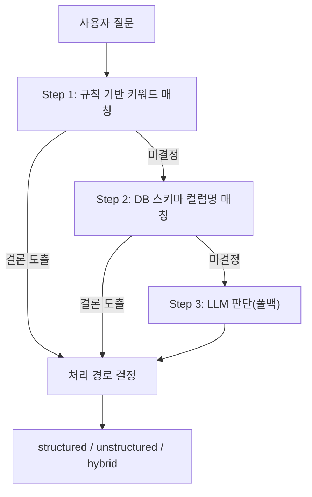
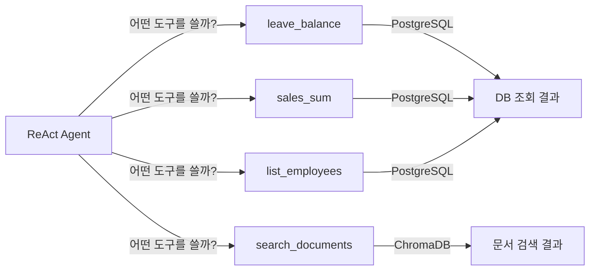
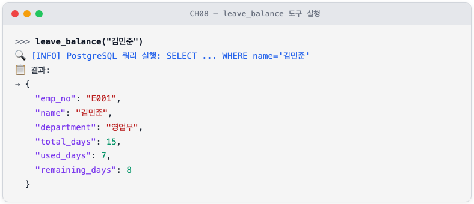
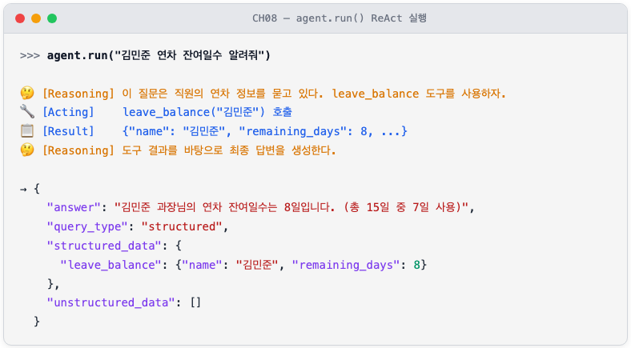
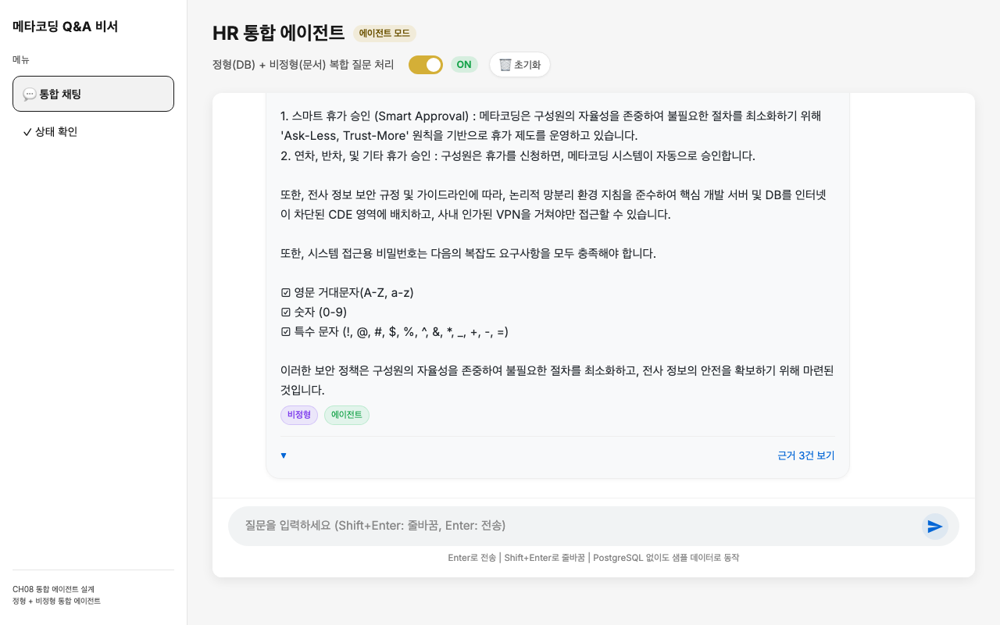

# 8. 정형 MCP + 비정형 RAG 통합 에이전트

이 챕터에서는 지금까지 독립적으로 구축한 두 가지 데이터 처리 경로를 하나의 에이전트로 통합합니다. CH04에서 만든 **PostgreSQL 기반 사내 시스템** 과 CH07에서 완성한 **LCEL RAG Q&A 엔진** 을 결합하여, LLM이 질문 유형을 스스로 판단하고 적절한 도구를 선택하는 통합 에이전트를 구현합니다.

CH07까지 완성한 RAG 채팅 엔진은 비정형 문서에 대한 질의는 완벽하게 처리합니다. 그러나 "김민준 사원의 남은 연차가 몇 일인가요?"라는 질문은 여전히 엉뚱한 답변을 내놓습니다. 이 질문의 답은 문서가 아니라 **데이터베이스** 에 있기 때문입니다. 이 챕터에서 이 문제를 해결합니다.

---

## 1. 정형/비정형 분리 원칙

### 1.1 두 가지 데이터의 세계

사내 업무에서 발생하는 질문은 크게 두 가지로 나뉩니다. 첫 번째는 **정형 데이터(Structured Data)** 를 묻는 질문입니다. "연차가 몇 일 남았나요?", "이번 달 영업부 매출 합계는 얼마인가요?"처럼 숫자나 목록을 요구하는 질문입니다. 이 답변은 데이터베이스의 특정 테이블, 특정 컬럼에 명확히 저장되어 있습니다.

두 번째는 **비정형 데이터(Unstructured Data)** 를 묻는 질문입니다. "신입사원 온보딩 절차를 알려주세요", "재택근무 신청 방법이 어떻게 되나요?"처럼 절차나 정책을 묻는 질문입니다. 이 답변은 PDF나 Word 문서 안에 자연어로 기술되어 있습니다.

```
[정형 질문 처리 경로]
"영업부 매출 합계" → MCP Tools → PostgreSQL SQL 조회 → 숫자 결과

[비정형 질문 처리 경로]
"온보딩 절차" → RAG Chain → ChromaDB 벡터 검색 → 문서 발췌

[복합 질문 처리 경로]
"매출 상위 부서의 복지 정책" → ReAct Agent → MCP + RAG 병렬 실행 → 통합 응답
```

아래 분류 기준표를 참고하면 어떤 질문이 어떤 경로로 처리되는지 파악할 수 있습니다.

| 질문 유형 | 판단 기준 | 처리 경로 | 예시 |
|---------|---------|---------|------|
| 정형 | 숫자, 통계, 목록, 특정 사람/부서 | MCP Tools + SQL | "김민준 연차 잔여일수" |
| 비정형 | 절차, 정책, 안내, 설명 | RAG Chain + ChromaDB | "온보딩 절차 알려줘" |
| 복합 | 정형 + 비정형 키워드 혼재 | ReAct Agent (두 경로 조합) | "영업부 매출과 복지 정책" |

### 1.2 왜 하나의 경로로 통합하면 안 되는가

"모든 질문을 RAG로 처리하면 되지 않을까?"라는 의문이 생길 수 있습니다. 두 가지 이유로 불가능합니다.

첫째, **정확도 문제** 입니다. "김민준 사원의 남은 연차는 8일"이라는 정보는 HR 취업규칙 문서에 적혀 있지 않습니다. 이 데이터는 시시각각 변하는 실시간 DB 값입니다. RAG가 아무리 정교해도 문서에 없는 실시간 수치는 답할 수 없습니다.

둘째, **환각 위험** 입니다. LLM이 DB 수치를 모르는 채로 답하면 그럴듯하지만 완전히 틀린 숫자를 생성합니다. CH03에서 직접 체험한 바로 그 문제입니다.

반대로 "모든 질문을 SQL로 처리하면 어떨까?"도 불가능합니다. "온보딩 절차"는 DB 컬럼에 없기 때문입니다.

<!-- [GEMINI PROMPT: 08_data-split-principle]
path: assets/CH08/08_data-split-principle.png
Minimalist black and white technical diagram on white background 16:9 aspect ratio. Two vertical lanes: left lane labeled "정형 데이터 (PostgreSQL)" contains cylinder database icon with table rows labeled "employee / leave_balance / sales". Right lane labeled "비정형 데이터 (ChromaDB)" contains stack of papers icon labeled "HR문서 / 보안정책 / 복지안내". Center funnel shape labeled "QueryRouter" with arrows flowing from top "사용자 질문" down into both lanes. Clean thin line art, no shading.
Style: architecture-infographic
-->


*그림 8-1: 정형 데이터는 PostgreSQL로, 비정형 데이터는 ChromaDB로 분리하여 처리한다*

---

## 2. 질문 라우팅 전략

### 2.1 라우팅의 3단계 전략

**질문 라우팅(Query Routing)** 은 들어온 질문이 어떤 경로로 처리되어야 하는지 결정하는 과정입니다. `QueryRouter` 는 이 결정을 세 단계로 수행합니다.

단순한 것에서 시작하여 복잡한 것으로 진행하는 방식입니다. 빠르고 확실한 규칙으로 먼저 처리하고, 그래도 판단이 어려울 때만 LLM에 위임합니다. LLM 호출은 비용과 시간이 들기 때문에 꼭 필요한 경우에만 사용하는 것이 핵심 설계 원칙입니다.



*그림 8-2: QueryRouter 3단계 라우팅 전략 — 단순한 규칙에서 시작하여 LLM으로 확장된다*

**Step 1 — 규칙 기반 키워드 매칭** 은 가장 빠른 방법입니다. "연차", "매출", "합계"처럼 정형 데이터와 명확히 연관된 키워드가 있으면 즉시 `structured` 로 분류합니다. "절차", "정책", "온보딩"처럼 문서 관련 키워드가 있으면 `unstructured` 로 분류합니다. 두 종류의 키워드가 모두 등장하면 `hybrid` 로 분류합니다.

**Step 2 — 스키마 기반 매칭** 은 DB 컬럼명이나 테이블명이 질문에 직접 등장하는 경우를 잡습니다. 예를 들어 "remaining_days가 0인 직원을 알려줘"처럼 기술적인 표현이 포함된 질문입니다.

**Step 3 — LLM 판단** 은 Step 1, 2에서 결론을 내지 못한 모호한 질문을 처리합니다. LLM에게 JSON 형식으로 분류 결과를 요청합니다.

### 2.2 router.py 구현

**다음 코드는 `classify_query()` 메서드가 3단계 전략을 순서대로 실행하여 처리 경로를 결정하는 핵심 로직입니다.**

```python
def classify_query(self, query: str) -> str:
    step1_result = self._step1_rule_based(query)    # ①
    if step1_result is not None:
        return step1_result

    step2_result = self._step2_schema_based(query)  # ②
    if step2_result is not None:
        return step2_result

    if self._llm is not None:
        step3_result = self._step3_llm_based(query) # ③
        if step3_result is not None:
            return step3_result

    return "unstructured"                            # ④
```

> ① 정형/비정형 키워드를 카운트하여 우세한 쪽으로 분류합니다. 두 쪽이 비슷하면 `hybrid` 를 반환합니다.
> ② `remaining_days`, `total_amount` 등 DB 컬럼명이 질문에 포함되면 `structured` 로 분류합니다.
> ③ Step 1, 2로 판단 불가 시 LLM에 JSON 응답을 요청하여 분류합니다. LLM 없으면 건너뜁니다.
> ④ 모든 단계가 미결정이면 안전한 기본값인 `unstructured` 로 처리합니다.

**Step 1의 키워드 판단 로직을 더 자세히 살펴보겠습니다.**

```python
structured_hits = sum(
    1 for kw in STRUCTURED_KEYWORDS if kw in query_lower  # ①
)
unstructured_hits = sum(
    1 for kw in UNSTRUCTURED_KEYWORDS if kw in query_lower
)

if structured_hits > 0 and unstructured_hits > 0:
    if structured_hits >= unstructured_hits * 2:
        return "structured"                               # ②
    if unstructured_hits >= structured_hits * 2:
        return "unstructured"
    return "hybrid"                                       # ③
```

> ① 정형 키워드 목록(`STRUCTURED_KEYWORDS`)과 비정형 키워드 목록(`UNSTRUCTURED_KEYWORDS`) 각각에 대해 매칭 횟수를 카운트합니다.
> ② 한 쪽이 다른 쪽보다 2배 이상 우세하면 우세한 쪽으로 단일 분류합니다.
> ③ 두 쪽이 비슷한 수준으로 매칭되면 두 경로 모두 필요한 복합 질문으로 판단합니다.

> **팁: explain_routing()으로 판단 근거를 확인하십시오**
> `router.explain_routing(query)` 를 호출하면 Step 1, 2의 판단 결과와 최종 경로를 딕셔너리로 반환합니다. 라우팅이 기대와 다를 때 원인을 추적하는 데 유용합니다.

> **동작 요약:** 이 코드는 사용자가 입력한 자연어 질문 문자열을 받아, Step 1 키워드 매칭에서 시작하여 미결정 시 Step 2 스키마 매칭, 그래도 미결정 시 Step 3 LLM 판단 순서로 경로를 결정하고, `"structured"` | `"unstructured"` | `"hybrid"` 중 하나의 문자열을 반환합니다.

> 전체 코드: `src/router.py`

---

## 3. MCP 도구 구현

### 3.1 MCP란 무엇인가

**MCP(Model Context Protocol)** 는 LLM이 외부 도구나 데이터 소스를 표준화된 방식으로 호출하는 프로토콜입니다. LangChain의 `@tool` 데코레이터를 사용하면 일반 Python 함수를 MCP 도구로 변환할 수 있습니다.

MCP를 사용하는 이유는 도구 추가가 **선언적** 이기 때문입니다. 새 도구를 만들려면 `@tool` 데코레이터를 달고 함수를 작성하는 것만으로 충분합니다. 에이전트는 함수의 docstring을 읽어 언제 이 도구를 사용해야 하는지 스스로 판단합니다. 라우팅 로직에 별도로 도구를 등록할 필요가 없습니다.



*그림 8-3: ReAct Agent가 상황에 따라 4개 MCP 도구 중 하나 이상을 선택하여 실행한다*

### 3.2 4개 MCP 도구 구현
`mcp_tools.py` 에는 4개의 도구가 정의되어 있습니다. 정형 데이터(연차, 매출, 직원 목록)는 PostgreSQL로 조회하고, 비정형 데이터(사내 문서)는 ChromaDB 벡터 검색 또는 `data/docs/` 키워드 검색으로 처리합니다.

**다음 코드는 `leave_balance` 도구가 PostgreSQL에서 연차 잔여일수를 조회하는 핵심 패턴입니다.**

```python
@tool
def leave_balance(emp_no: str) -> dict:
    """직원의 연차 잔여 일수를 조회한다."""
    rows = _run_query(
        "SELECT ... FROM employees JOIN leave_balance ON ...",
        (emp_no,),
    )                                        # ①
    if rows:
        return rows[0]                       # ②

    return {"error": f"직원 '{emp_no}'을(를) 찾을 수 없습니다."}  # ③
```

> ① `_run_query()` 내부에서 `connect_timeout=3` 을 설정하여 DB 미연결 시 3초 안에 빠르게 실패합니다.
> ② DB 결과가 있으면 첫 번째 행을 즉시 반환합니다.
> ③ DB에서 해당 직원을 찾지 못하면 에러 메시지를 반환합니다.

**실행 결과:**



*그림 8-3a: leave_balance 도구가 PostgreSQL에서 직원 연차 정보를 조회한 결과*

> **동작 요약:** 이 코드는 직원 번호(`"E001"`) 또는 이름(`"김민준"`) 문자열을 받아 PostgreSQL JOIN 쿼리를 실행하고, 잔여일수(`remaining_days`)를 포함한 직원 연차 정보 딕셔너리를 반환합니다. DB에서 찾지 못하면 에러 메시지를 반환합니다.

나머지 3개 도구도 동일한 패턴을 따릅니다.

| 도구 | 파라미터 | 반환 내용 |
|------|---------|---------|
| `sales_sum` | `dept`, `start_date`, `end_date` | 기간별 매출 합계 + 상위 5건 |
| `list_employees` | `dept` | 부서별 직원 목록 + 인원수 |
| `search_documents` | `query`, `k` | ChromaDB 벡터 검색 결과 (폴백: 키워드 검색) |

> **팁: search_documents는 ChromaDB + 키워드 두 가지 검색을 지원합니다**
> ChromaDB가 연결된 환경에서는 `ko-sroberta-multitask` 임베딩 기반 벡터 검색을 수행합니다. ChromaDB 없이 실행할 경우 `data/docs/` 디렉토리의 원본 문서(PDF, DOCX, XLSX)를 파싱하여 키워드 기반 검색으로 자동 대체됩니다. 두 경우 모두 `content`, `source`, `score` 키를 포함한 동일한 응답 형식을 반환합니다.

> 전체 코드: `src/mcp_tools.py`

---

## 4. ReAct Agent 통합

### 4.1 ReAct 패턴이란

**ReAct Agent** 는 Reasoning(추론)과 Acting(실행)을 번갈아 반복하는 에이전트 패턴입니다. 복합 질문을 받으면 다음 사이클을 반복합니다.

```
[Reasoning] "이 질문은 매출 합계(정형)와 복지 정책(비정형)을 모두 물어보는 것이다."
[Acting]    sales_sum 도구를 호출한다. → 영업부 매출 1,350만 원
[Reasoning] "이제 복지 정책 문서를 검색해야 한다."
[Acting]    search_documents 도구를 호출한다. → HR_복지_안내_v1.2 발견
[Reasoning] "두 결과를 합쳐 최종 답변을 만들 수 있다."
[Acting]    최종 답변 생성.
```

단순한 Q&A 시스템과의 차이는 **중간 단계(intermediate steps)** 를 투명하게 보여준다는 점입니다. 웹 UI에서 에이전트가 어떤 도구를 어떤 순서로 호출했는지 확인할 수 있습니다.

### 4.2 agent.py 구현

**다음 코드는 `IntegratedAgent` 가 LangChain AgentExecutor를 구성하는 핵심 로직입니다.**

```python
prompt = ChatPromptTemplate.from_messages([
    ("system", SYSTEM_PROMPT),
    MessagesPlaceholder(variable_name="chat_history", optional=True),
    ("human", "{input}"),
    MessagesPlaceholder(variable_name="agent_scratchpad"),   # ①
])

agent = create_tool_calling_agent(
    llm=self._llm,
    tools=ALL_TOOLS,
    prompt=prompt,
)                                                             # ②

return AgentExecutor(
    agent=agent,
    tools=ALL_TOOLS,
    return_intermediate_steps=True,
    max_iterations=10,
    handle_parsing_errors=True,
)                                                             # ③
```

> ① `agent_scratchpad` 는 LLM이 도구 호출 결과를 내부적으로 메모하는 공간입니다. ReAct의 "Reasoning" 단계가 이 공간에 기록됩니다.
> ② `create_tool_calling_agent` 는 LLM과 도구 목록을 연결하여 Tool Calling 기반 에이전트를 생성합니다. LLM이 필요한 도구를 스스로 선택합니다.
> ③ `return_intermediate_steps=True` 로 중간 도구 호출 결과를 수집합니다. 이 데이터가 웹 UI의 "실행 단계" 패널에 표시됩니다.

**다음 코드는 `run()` 메서드가 질문을 처리하고 통합 응답을 반환하는 로직입니다.**

```python
def run(self, query: str) -> dict:
    query_type = self._router.classify_query(query)           # ①
    result = self._agent_executor.invoke({"input": query})    # ②
    answer = result.get("output", "답변을 생성하지 못했습니다.")
    answer = re.sub(r"<think>.*?</think>", "", answer, flags=re.DOTALL).strip()  # ③
    structured_data, unstructured_data = self._parse_result(
        result.get("intermediate_steps", [])
    )                                                          # ④
    return {
        "answer": answer,
        "query_type": query_type,
        "structured_data": structured_data,
        "unstructured_data": unstructured_data,
    }
```

> ① 답변 생성 전에 `QueryRouter` 로 질문 유형을 먼저 분류합니다. 이 값이 웹 UI의 "정형/비정형/복합" 배지로 표시됩니다.
> ② `AgentExecutor.invoke()` 가 Reasoning-Acting 루프를 실행합니다. LLM이 필요하다고 판단하는 만큼 도구를 반복 호출합니다.
> ③ DeepSeek-R1 모델은 답변 전에 `<think>` 태그로 내부 추론 과정을 출력합니다. 이 부분을 제거하여 최종 답변만 추출합니다.
> ④ `intermediate_steps` 에서 MCP 도구 호출 결과를 추출합니다. 정형 데이터(DB 조회)와 비정형 데이터(문서 검색)를 분리하여 반환합니다.

**실행 결과:**



*그림 8-3b: ReAct Agent가 Reasoning → Acting → Result 단계를 거쳐 최종 답변을 생성한다*

> **동작 요약:** 이 코드는 사용자 자연어 질문 문자열을 받아, QueryRouter로 질문 유형을 분류한 뒤 AgentExecutor가 Reasoning-Acting 루프를 실행하고, 중간 단계에서 정형/비정형 데이터를 분리 추출하며 `<think>` 태그를 제거하여, `answer`, `query_type`, `structured_data`, `unstructured_data`, `steps` 를 포함한 통합 응답 딕셔너리를 반환합니다.

> 전체 코드: `src/agent.py`

> **주의: max_iterations 설정에 유의하십시오**
> `max_iterations=10` 은 에이전트가 도구를 최대 10번까지 반복 호출한다는 의미입니다. 복합 질문이 복잡할수록 더 많은 반복이 발생합니다. 운영 환경에서는 LLM API 비용과 응답 시간을 고려하여 이 값을 조정하십시오.

---

## 5. 실습 환경 준비와 서버 실행

### 5.1 의존성 설치

CH02에서 클론한 저장소의 예제 폴더로 이동하여 환경을 구성합니다.

```bash
cd examples/CH08_통합_에이전트_설계
python3.12 -m venv .venv
source .venv/bin/activate   # Windows: .\.venv\Scripts\Activate.ps1
cp .env.example .env
pip install -r requirements.txt
```

> CH07 대비 추가된 주요 의존성: `psycopg2-binary`(PostgreSQL 클라이언트), `pypdf`·`python-docx`·`openpyxl`(원본 문서 파싱), `langchain-ollama`·`langchain-openai`(LLM 연동)

### 5.2 Ollama 모델 다운로드 — 왜 llama3.1:8b인가

CH08의 ReAct Agent는 LLM이 **스스로 도구를 선택하고 호출** 해야 합니다. 이를 **Tool Calling**(함수 호출)이라고 합니다. 모든 LLM이 이 기능을 지원하는 것은 아닙니다.

| 모델 | Tool Calling | 한국어 품질 | 비고 |
|------|:----------:|:--------:|------|
| `deepseek-r1:8b` | **미지원** | 우수 | CH07에서 사용. 텍스트 생성 전용 |
| `llama3.1:8b` | **지원** | 양호 | CH08에서 사용. Meta 공식 모델 |
| `qwen2.5:3b` | 지원 | 미흡(중국어 혼재) | 한국어 답변 품질 불안정 |

CH07의 RAG Chain은 LLM이 "주어진 문서를 읽고 답변만 생성"하면 되므로 Tool Calling이 필요 없었습니다. 그러나 CH08의 ReAct Agent는 "이 질문에는 `leave_balance` 도구를 호출해야 한다"고 LLM이 판단하고 실제로 함수를 호출해야 합니다. 이 과정이 Tool Calling입니다.

`llama3.1:8b` 은 Meta가 공식 지원하는 Tool Calling 모델이며, 약 4.9GB의 디스크 공간이 필요합니다. 다음 명령어로 다운로드합니다.

```bash
ollama pull llama3.1:8b
```

다운로드가 완료되면 `.env` 파일에서 모델이 올바르게 설정되어 있는지 확인합니다.

```bash
# .env 파일 확인
cat .env | grep OLLAMA_MODEL
# 출력: OLLAMA_MODEL=llama3.1:8b
```

> **주의: .env 파일의 OLLAMA_MODEL 값을 반드시 확인하십시오**
> `.env.example` 을 복사하면 기본값이 `llama3.1:8b` 로 설정되어 있습니다. CH07에서 `.env` 를 복사해왔다면 `deepseek-r1:8b` 로 되어 있을 수 있으므로 반드시 `llama3.1:8b` 로 변경하십시오. Tool Calling을 지원하지 않는 모델을 사용하면 에이전트가 도구를 호출하지 못하고 오류가 발생합니다.

### 5.3 서버 실행과 초기 화면

웹 UI를 포함한 전체 시스템을 실행합니다.

```bash
uvicorn app.main:app --reload --port 8008
```

브라우저에서 `http://localhost:8008/chat` 에 접속합니다. CH07과 동일한 라이트 테마 UI에 두 가지 기능이 추가되어 있습니다.

1. **에이전트 모드 토글**: 상단의 ON/OFF 스위치로 에이전트 모드와 일반 RAG 모드를 전환합니다. 에이전트 모드에서는 ReAct Agent가 도구를 자율적으로 선택하고, 일반 모드에서는 QueryRouter가 결정한 단일 경로만 사용합니다.
2. **예시 질문 카드**: 정형·비정형·복합 세 카테고리의 예시 질문이 카드로 표시됩니다. 클릭하면 입력창에 자동으로 복사됩니다.

<!-- [CAPTURE NEEDED: 08_chat-ui-agent-mode
  path: assets/CH08/08_chat-ui-agent-mode.png
  desc: 브라우저에서 http://localhost:8008/chat 접속 후 초기 화면. 좌측 사이드바에 메뉴, 우측에 에이전트 모드 토글 ON 상태, 환영 메시지, 정형/비정형/복합 예시 질문 카드가 표시된 상태.
] -->


*그림 8-4: 에이전트 모드가 활성화된 채팅 UI — 정형/비정형/복합 예시 질문이 카드로 제공된다*

이제 이 UI에서 10개 시나리오를 직접 실행하며 에이전트가 어떻게 동작하는지 확인합니다.

---

## 6. 시나리오별 실습

이 절에서는 10개 시나리오를 정형·비정형·복합 순서로 실습합니다. 각 시나리오를 채팅창에 직접 입력하고, 에이전트가 어떤 도구를 선택하여 어떤 결과를 반환하는지 확인합니다.

### 6.1 정형 시나리오 — DB에서 답을 찾는 질문

정형 시나리오는 데이터베이스에 저장된 숫자나 목록을 묻는 질문입니다. QueryRouter가 `structured` 로 분류하면 에이전트는 `leave_balance`, `sales_sum`, `list_employees` 도구를 호출합니다.

| 번호 | 질문 | 사용 도구 | 기대 결과 |
|------|------|---------|---------|
| 01 | "김민준 연차 잔여일수 알려줘" | `leave_balance` | 잔여일수 8일 |
| 02 | "영업부 11월 매출 합계가 얼마야?" | `sales_sum` | 매출 합계 반환 |
| 03 | "개발부 직원 목록을 알려줘" | `list_employees` | 개발부 직원 목록 |
| 04 | "전체 직원을 부서별로 보여줘" | `list_employees` | 전체 부서별 직원 목록 |

**시나리오 01 실습: "김민준 연차 잔여일수 알려줘"**

채팅창에 `김민준 연차 잔여일수 알려줘` 를 입력하고 Enter를 누릅니다.

<!-- [CAPTURE NEEDED: 08_scenario-structured
  path: assets/CH08/08_scenario-structured.png
  desc: 웹 UI에서 "김민준 연차 잔여일수 알려줘" 질문 후 에이전트가 [정형] 배지와 함께 잔여일수 8일을 답변한 화면.
] -->


*그림 8-5a: 정형 질문 — leave_balance 도구가 DB에서 연차 잔여일수를 조회하여 답변한다*

**에이전트가 어떻게 동작했는가:**

1. QueryRouter가 "연차", "잔여일수" 키워드를 감지하여 `structured` 로 분류합니다.
2. ReAct Agent가 `leave_balance` 도구를 선택하고, `"김민준"` 을 인자로 전달합니다.
3. 도구가 PostgreSQL(또는 샘플 데이터)에서 김민준의 연차 정보를 조회합니다.
4. 에이전트가 조회 결과를 자연어로 정리하여 "잔여일수는 8일입니다"라고 답변합니다.

응답 메시지 아래의 **[정형]** 배지는 이 질문이 정형 경로로 처리되었음을 의미합니다. **[에이전트]** 배지는 ReAct Agent가 활성화된 상태에서 처리되었음을 나타냅니다. "근거 보기"를 클릭하면 DB 조회 원본 데이터를 확인할 수 있습니다.

> 시나리오 02~04도 동일한 방법으로 실행합니다. "영업부 11월 매출 합계가 얼마야?"는 `sales_sum` 도구를, "개발부 직원 목록을 알려줘"는 `list_employees` 도구를 호출합니다.

### 6.2 비정형 시나리오 — 문서에서 답을 찾는 질문

비정형 시나리오는 사내 문서(PDF, DOCX)에 기술된 절차나 정책을 묻는 질문입니다. QueryRouter가 `unstructured` 로 분류하면 에이전트는 `search_documents` 도구를 호출하여 `data/docs/` 문서를 검색합니다.

| 번호 | 질문 | 사용 도구 | 기대 결과 |
|------|------|---------|---------|
| 05 | "신입사원 온보딩 절차를 알려줘" | `search_documents` | 온보딩 관련 문서 |
| 06 | "보안 정책에 대해 설명해줘" | `search_documents` | 보안 정책 문서 |
| 07 | "워케이션 숙박비 지원 기준은?" | `search_documents` | 워케이션 안내 문서 |
| 08 | "신규 서비스 런칭 전략과 예산은?" | `search_documents` | 런칭 전략 문서 |

**시나리오 06 실습: "보안 정책에 대해 설명해줘"**

채팅창에 `보안 정책에 대해 설명해줘` 를 입력합니다.

<!-- [CAPTURE NEEDED: 08_scenario-unstructured
  path: assets/CH08/08_scenario-unstructured.png
  desc: 웹 UI에서 "보안 정책에 대해 설명해줘" 질문 후 에이전트가 [비정형] 배지와 함께 보안규정 내용을 답변한 화면.
] -->


*그림 8-5b: 비정형 질문 — search_documents 도구가 사내 문서에서 보안 정책을 검색하여 답변한다*

**에이전트가 어떻게 동작했는가:**

1. QueryRouter가 "보안", "정책" 키워드를 감지하여 `unstructured` 로 분류합니다.
2. ReAct Agent가 `search_documents` 도구를 선택하고, `"보안 정책"` 을 검색어로 전달합니다.
3. 도구가 `data/docs/` 에서 `SEC_보안규정_v1.0.docx` 문서를 찾아 관련 내용을 반환합니다.
4. 에이전트가 검색 결과를 정리하여 망분리 환경, 비밀번호 규칙 등을 답변합니다.

**[비정형]** 배지와 함께 "근거 3건 보기"가 표시됩니다. 아코디언을 펼치면 검색된 문서의 원본 내용과 출처를 확인할 수 있습니다.

> 시나리오 05, 07, 08도 동일한 방법으로 실행합니다. 각각 HR 취업규칙, 워크플로 규정, 런칭 전략 문서에서 답변을 검색합니다.

### 6.3 복합 시나리오 — DB와 문서를 동시에 조회하는 질문

복합 시나리오는 이 챕터의 핵심입니다. 하나의 질문에 정형 데이터와 비정형 문서가 모두 필요한 경우, ReAct Agent가 **여러 도구를 순서대로 호출** 하여 결과를 통합합니다.

| 번호 | 질문 | 사용 도구 | 기대 결과 |
|------|------|---------|---------|
| 09 | "매출 상위 부서의 워케이션 규정은?" | `sales_sum` + `search_documents` | 매출 합계 + 워케이션 규정 |
| 10 | "정시우 연차 현황과 연차 사용 규정 알려줘" | `leave_balance` + `search_documents` | 연차 잔여 + 연차 규정 |

**시나리오 09 실습: "매출 상위 부서의 워케이션 규정은?"**

채팅창에 `매출 상위 부서의 워케이션 규정은?` 을 입력합니다.

<!-- [CAPTURE NEEDED: 08_scenario-hybrid
  path: assets/CH08/08_scenario-hybrid.png
  desc: 웹 UI에서 "매출 상위 부서의 워케이션 규정은?" 질문 후 에이전트가 [복합] 배지와 함께 매출 합계와 워케이션 규정을 통합 답변한 화면.
] -->


*그림 8-5c: 복합 질문 — sales_sum과 search_documents 두 도구를 모두 호출하여 통합 답변한다*

**에이전트가 어떻게 동작했는가:**

이 질문에서 ReAct Agent의 Reasoning-Acting 사이클을 단계별로 추적합니다.

```
[Reasoning] "매출 상위 부서"는 DB 조회가 필요하다. sales_sum을 먼저 호출하자.
[Acting]    sales_sum 도구 호출 → 영업부 매출 합계 반환
[Reasoning] 이제 "워케이션 규정"은 문서 검색이 필요하다. search_documents를 호출하자.
[Acting]    search_documents("워케이션 규정") → HR_워크플로규정_v2.0 발견
[Reasoning] 두 결과를 합쳐 최종 답변을 만들 수 있다.
[Acting]    최종 답변 생성: "매출 상위 부서인 영업부의 워케이션 규정은..."
```

**[복합]** 배지가 두 경로를 모두 사용했음을 나타냅니다. "근거 보기"를 펼치면 DB 조회 결과와 문서 검색 결과가 함께 표시됩니다. 이것이 바로 CH07의 단순 RAG로는 불가능했던, 정형+비정형 통합 응답입니다.

> 시나리오 10("정시우 연차 현황과 연차 사용 규정 알려줘")도 동일한 방법으로 실행합니다. `leave_balance` 로 연차 잔여일수를 조회하고 `search_documents` 로 연차 사용 규정을 검색하여 통합 답변을 생성합니다.

### 6.4 API 직접 테스트 (curl)

웹 UI 없이 API를 직접 호출할 수도 있습니다. 에이전트 모드에서 `POST /api/chat` 의 응답 구조를 확인합니다.

```bash
curl -X POST http://localhost:8008/api/chat \
  -H "Content-Type: application/json" \
  -d '{"query": "김민준 연차 잔여일수 알려줘", "use_agent": true}'
```

**실행 결과:**
```json
{
  "query": "김민준 연차 잔여일수 알려줘",
  "answer": "김민준님의 연차 잔여일수는 8일입니다.",
  "query_type": "structured",
  "mode": "agent",
  "structured_data": {
    "leave_balance": {
      "name": "김민준",
      "remaining_days": 8,
      "used_days": 7,
      "total_days": 15
    }
  },
  "unstructured_data": [],
  "steps": [
    {"tool": "leave_balance", "input": {"emp_no": "김민준"}, "output": "..."}
  ]
}
```

`steps` 배열에서 에이전트가 어떤 도구를 어떤 인자로 호출했는지 확인할 수 있습니다. 웹 UI의 "근거 보기" 아코디언에 표시되는 데이터가 바로 이 `structured_data` 와 `unstructured_data` 입니다.

> **참고: 10개 시나리오가 CH10 평가의 기준선입니다**
> 이 10개 시나리오(정형 4 + 비정형 4 + 복합 2)의 응답 품질이 CH10에서 RAG 튜닝 전의 기준선(Baseline)이 됩니다. CH10에서 튜닝 기법을 적용한 후 동일한 시나리오에서 개선율을 측정합니다.

---

## 7. 자동화 테스트

### 7.1 pytest로 10개 시나리오 일괄 검증

앞에서 UI로 확인한 10개 시나리오를 pytest로 자동화하면 코드 변경 후에도 빠르게 검증할 수 있습니다.

```bash
python -m pytest tests/test_scenarios.py -v
```

**실행 결과:**
```
tests/test_scenarios.py::TestScenarios::test_01_leave_balance_by_name     PASSED
tests/test_scenarios.py::TestScenarios::test_02_sales_sum_by_dept         PASSED
tests/test_scenarios.py::TestScenarios::test_03_list_employees_by_dept    PASSED
tests/test_scenarios.py::TestScenarios::test_04_list_all_departments      PASSED
tests/test_scenarios.py::TestScenarios::test_05_onboarding_search         PASSED
tests/test_scenarios.py::TestScenarios::test_06_security_policy_search    PASSED
tests/test_scenarios.py::TestScenarios::test_07_workcation_search         PASSED
tests/test_scenarios.py::TestScenarios::test_08_launch_strategy_search    PASSED
tests/test_scenarios.py::TestScenarios::test_09_sales_dept_workcation     PASSED
tests/test_scenarios.py::TestScenarios::test_10_leave_with_policy         PASSED

======================== 10 passed in 3.42s ========================
```

10개 모두 PASSED가 나오면 에이전트의 도구 호출과 데이터 반환이 정상입니다. 테스트는 LLM 없이 MCP 도구를 직접 호출하여 검증하므로 외부 서비스(PostgreSQL, Ollama) 없이도 실행할 수 있습니다.

> 전체 코드: `tests/test_scenarios.py`

### 7.2 테스트 코드 핵심 패턴

정형 테스트와 복합 테스트의 핵심 패턴을 살펴봅니다.

**정형 테스트 패턴:**

```python
def test_scenario_01_leave_balance_by_name(self) -> None:
    result = leave_balance.invoke({"emp_no": "김민준"})   # ①
    self.assertIsInstance(result, dict)
    self.assertIn("remaining_days", result)                # ②
    self.assertGreaterEqual(result["remaining_days"], 0)
```

> ① `@tool` 데코레이터가 붙은 함수는 `invoke()` 를 통해 호출합니다.
> ② 반환 딕셔너리에 `remaining_days` 키가 포함되어 있고 음수가 아닌지 검증합니다.

**복합 테스트 패턴:**

```python
def test_scenario_09_sales_dept_workcation(self) -> None:
    sales_result = sales_sum.invoke({"dept": "", "start_date": "", "end_date": ""})  # ①
    self.assertIn("total_amount", sales_result)

    doc_result = search_documents.invoke({"query": "워케이션 규정", "k": 3})          # ②
    self.assertIn("results", doc_result)
    self.assertGreater(len(doc_result["results"]), 0)
```

> ① 정형 도구와 비정형 도구를 각각 호출합니다. 실제 에이전트에서는 LLM이 이 두 호출을 자동으로 수행합니다.
> ② 문서 검색 결과에 1건 이상의 문서가 포함되어 있는지 확인합니다.

<!-- [GEMINI PROMPT: 08_integrated-agent-architecture]
path: assets/CH08/08_integrated-agent-architecture.png
Minimalist black and white technical diagram on white background 16:9 aspect ratio. Center top: user figure labeled "사용자(웹 UI)". Arrow down to box "FastAPI /api/chat". Arrow to diamond "QueryRouter". Three arrows from diamond: left to box "MCP Tools (PostgreSQL)" labeled "정형", center to double-box "ReAct Agent" labeled "복합", right to box "RAG Chain (ChromaDB)" labeled "비정형". Arrow from MCP Tools and RAG Chain converge back to ReAct Agent box. Arrow from ReAct Agent up to "통합 응답 JSON". Clean thin line art, no shading.
Style: architecture-infographic
-->


*그림 8-6: CH08 완성 시점의 통합 에이전트 아키텍처 — QueryRouter가 세 경로로 분기하고 ReAct Agent가 복합 질문을 처리한다*

---

## 8. 정리하며

CH07까지는 "문서 안에서만" 답을 찾는 시스템이었습니다. CH08에서 정형 데이터베이스 조회 기능을 추가함으로써 **메타코딩 Q&A 비서** 는 어떤 유형의 사내 질문에도 대응할 수 있는 통합 에이전트로 성장했습니다.

- **`QueryRouter` 3단계 전략이 비용을 통제합니다**: 규칙과 스키마 매칭으로 대부분의 질문을 처리하고, 모호한 경우에만 LLM에 위임하여 불필요한 API 호출을 최소화합니다.

- **MCP 도구의 `data/docs/` 폴백이 개발을 단순화합니다**: ChromaDB 없이도 `data/docs/` 원본 문서를 파싱하여 키워드 검색으로 동작하므로, 환경 준비 없이 도구 로직을 먼저 검증할 수 있습니다.

- **ReAct Agent는 복합 질문의 해결사입니다**: Reasoning과 Acting을 반복하여 정형과 비정형 도구를 순서대로 또는 병렬로 조합합니다. `intermediate_steps` 를 통해 에이전트의 판단 과정을 완전히 투명하게 추적할 수 있습니다.

- **10개 시나리오(정형 4 + 비정형 4 + 복합 2)가 CH10 평가의 기준선입니다**: 이 챕터에서 확인한 응답 품질이 RAG 튜닝 전의 Baseline이 됩니다. CH10에서 튜닝 기법을 적용한 후 동일 시나리오로 개선율을 측정합니다.

- **UI 배지가 신뢰도를 높입니다**: 사용자는 "정형/비정형/복합" 배지를 통해 AI가 DB를 조회한 것인지 문서를 검색한 것인지 즉시 파악할 수 있습니다. 이 투명성이 사내 AI 도구의 신뢰를 만듭니다.

다음 챕터(CH09)에서는 이번 챕터에서 구현한 통합 에이전트를 **LangChain 표준 구성** 으로 정리하고, 운영 환경에 필요한 Timeout, Retry, 캐싱 설정을 추가합니다.
