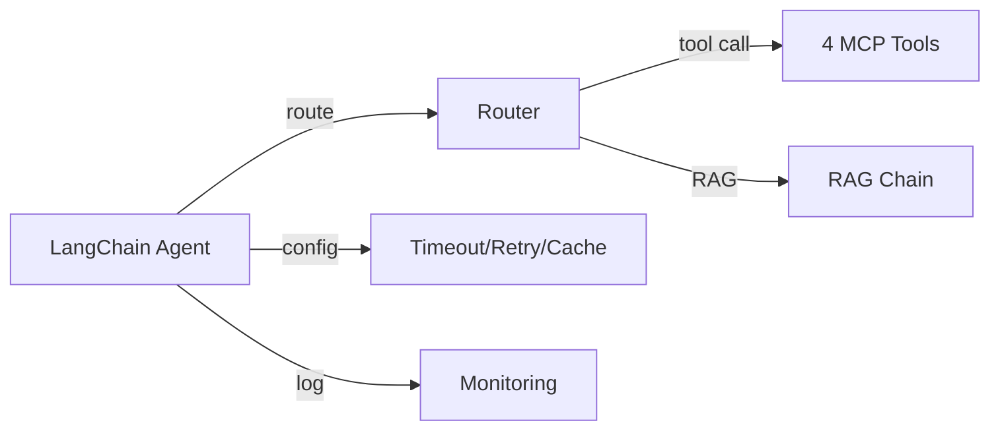
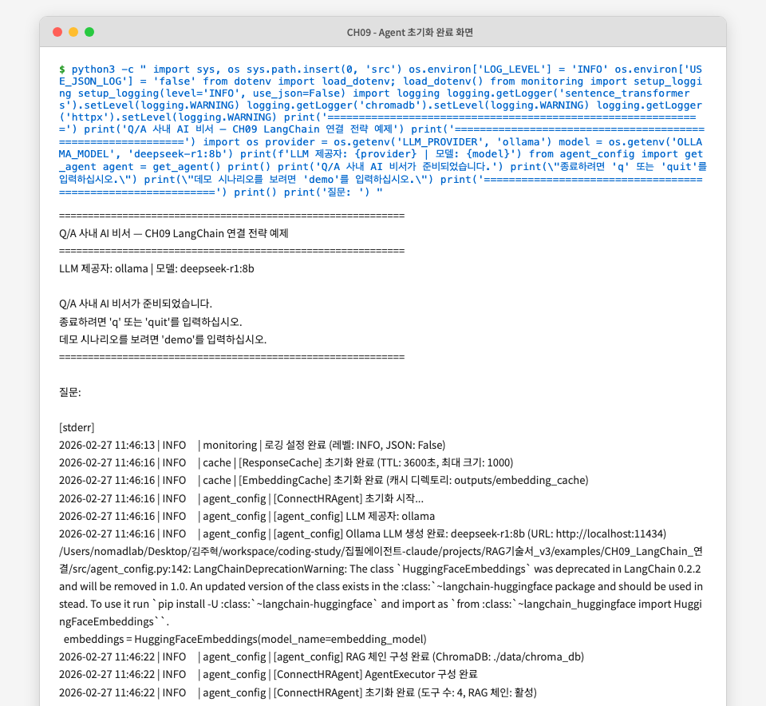
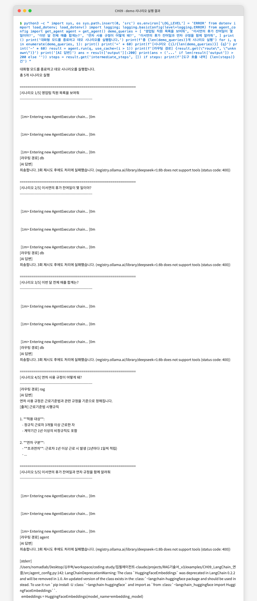

# 9. LangChain으로 연결 전략 세팅

지금까지 구축한 Q/A 사내 AI 비서는 CH08에서 정형(MCP/SQL)과 비정형(RAG) 질문을 모두 처리하는 통합 에이전트로 완성되었습니다. 이 챕터에서는 CH08의 에이전트 원리를 **LangChain 표준 구성** 으로 정리하고, 실무 운영에 필요한 Timeout, Retry, 캐싱, 모니터링 설정을 추가합니다.

챕터를 마치면 4개 MCP 도구가 LangChain `@tool` 표준으로 정의되고, Timeout/Retry/캐시가 적용된 안정적인 에이전트를 운영할 수 있게 됩니다.

---

## 1. 기본 구성 3종 세트

CH08은 "어떻게 동작하는가"에 집중했습니다. CH09는 "어떻게 잘 동작하게 만드는가"에 집중합니다. 이 두 질문의 차이가 **원리 구현** 과 **운영 구성** 의 차이입니다.

LangChain 표준 구성은 세 가지 핵심 요소로 이루어집니다.

<!-- [GEMINI PROMPT: 09_three-components]
path: assets/CH09/09_three-components.png
A minimalist black and white technical diagram on a solid white background, 16:9 aspect ratio.
Three labeled boxes arranged horizontally: "Router/Agent" on the left, "RAG Chain" in the center, "MCP Tools" on the right.
Arrows connect them: Router/Agent points to both RAG Chain and MCP Tools with dashed lines labeled "route".
Above all three, a box labeled "LangChain AgentExecutor" with a bracket enclosing all three components.
Below, three small boxes labeled "Timeout/Retry", "Cache", "Monitoring" connected to AgentExecutor by thin lines.
Clean thin line art, Korean and English labels mixed, white background.
Style: architecture-infographic
-->


*그림 9-1: Router/Agent + RAG Chain + MCP Tools — LangChain 표준 구성의 세 요소*

### 1.1 Router/Agent — 질문 라우팅과 실행 조율

**Router/Agent** 는 에이전트의 두뇌 역할입니다. 들어온 질문이 DB 조회가 필요한지, 문서 검색이 필요한지, 아니면 두 가지 모두 필요한지 판단하고 실행 순서를 조율합니다.

CH08에서 직접 구현한 `QueryRouter`의 역할을 LangChain의 `AgentExecutor` 가 표준화된 방식으로 수행합니다. `create_tool_calling_agent` 함수는 LLM이 어느 도구를 어떤 순서로 호출할지 스스로 결정하게 만드는 구성을 제공합니다.

### 1.2 RAG Chain — 문서 검색과 답변 생성

**RAG Chain** 은 비정형 문서 검색 전용 경로입니다. LCEL(LangChain Expression Language) 파이프 연산자(`|`)로 ChromaDB Retriever → 프롬프트 → LLM → 출력 파서를 연결합니다.

CH07에서 만든 RAG 체인과 동일한 구조이지만, CH09에서는 이를 에이전트의 **직접 실행 경로** 로 통합합니다. Router가 질문을 "문서 검색"으로 분류하면 Agent를 통하지 않고 RAG Chain이 직접 응답합니다. 이는 불필요한 LLM 추론 단계를 줄여 응답 속도를 높입니다.

### 1.3 MCP Tools — 외부 도구 연결

**MCP Tools** 는 에이전트가 실제 세계와 상호작용하는 창구입니다. LangChain의 `@tool` 데코레이터를 사용하면 일반 Python 함수를 에이전트가 호출 가능한 도구로 변환할 수 있습니다.

[수정] 이 부분이 이해가 안되 무슨 말이야? 내부에 어떤 기술이 있는지 정도는 말해줘야지
`@tool` 데코레이터가 중요한 이유는 **도구 스키마** 를 자동으로 생성하기 때문입니다. 함수의 타입 힌트와 독스트링을 분석하여 LLM이 "이 도구는 무엇을 하고, 어떤 파라미터를 받는가"를 이해할 수 있는 JSON 스키마를 만들어냅니다. LLM은 이 스키마를 보고 올바른 도구를 선택하고 올바른 인자를 전달합니다.



*그림 9-2: LangChain Agent 내부 구성 흐름*

> **참고: CH08과 CH09의 차이**
> CH08은 Router와 Agent를 처음부터 직접 구현하며 원리를 이해하는 데 초점을 맞췄습니다. CH09는 그 원리를 LangChain이 제공하는 표준 컴포넌트(`create_tool_calling_agent`, `AgentExecutor`, `@tool`)로 재구성하고, 운영 관점의 설정을 추가합니다. 두 챕터를 모두 이해해야 "왜 이렇게 쓰는가"를 설명할 수 있습니다.

## 2. 실습 환경 준비

### 2.1 예제 폴더 이동 및 설정

CH02에서 클론한 저장소의 예제 폴더로 이동합니다.

```bash
cd examples/CH09_LangChain_연결
python3.12 -m venv .venv
source .venv/bin/activate   # Windows: .\.venv\Scripts\Activate.ps1
```

환경 변수 파일을 복사하고 값을 채웁니다.

```bash
cp .env.example .env
```

`.env` 파일의 주요 설정 항목입니다.

```
# LLM 제공자: ollama (기본) 또는 openai
LLM_PROVIDER=ollama
OLLAMA_BASE_URL=http://localhost:11434
OLLAMA_MODEL=deepseek-r1:8b

# PostgreSQL (CH04에서 실행 중인 컨테이너)
POSTGRES_HOST=localhost
POSTGRES_PORT=5432
POSTGRES_DB=metacoding_db

# ChromaDB (CH06에서 구축한 인덱스 경로)
CHROMA_PERSIST_DIR=./data/chroma_db

# 응답 캐시 설정
CACHE_TTL=3600
```

의존성을 설치합니다.

```bash
pip install -r requirements.txt
```

> **주의: PostgreSQL과 ChromaDB 사전 준비**
> CH09 실습은 CH04의 PostgreSQL Docker 컨테이너가 실행 중이어야 합니다. ChromaDB는 `data/docs/`의 원본 문서에서 자동으로 구축되므로 별도 준비가 필요 없습니다. PostgreSQL이 실행되지 않은 경우 DB 관련 MCP 도구는 자동으로 모의(mock) 데이터로 대체되어 동작하므로 학습에는 지장이 없습니다. [수정] 모의 데이터 삭제 실제 코드도 삭제 그리고 08에서는 postgresql이 실행되지 않으면 에이전트가 실행되지 않는다는 말 없었는데?

### 2.2 실행 확인
[수정] 09에서는 명확하게 실습을 하면서 결과물을 확인할 수 있는 부분이 없어 이거 시나리오를 지우고 실제 실행하는 예제를 마지막에 보여줘야할것 같아 08대비 09에서 보여줄만한 실습말야

에이전트를 실행합니다.

```bash
python src/main.py
```

**실행 결과:**
```
============================================================
Q/A 사내 AI 비서 — CH09 LangChain 연결 전략 예제
============================================================
LLM 제공자: ollama | 모델: deepseek-r1:8b
[ConnectHRAgent] 초기화 시작...
[ConnectHRAgent] 초기화 완료 (도구 수: 4, RAG 체인: 활성)

Q/A 사내 AI 비서가 준비되었습니다.
종료하려면 'q' 또는 'quit'를 입력하십시오.
데모 시나리오를 보려면 'demo'를 입력하십시오.
============================================================

질문:
```

도구 수가 4, RAG 체인이 "활성"으로 표시되면 정상입니다. `demo`를 입력하면 5개 대표 시나리오가 자동으로 실행됩니다.

<!-- [CAPTURE NEEDED: 09_main-startup
  path: assets/CH09/09_main-startup.png
  desc: python src/main.py 실행 후 "Q/A 사내 AI 비서가 준비되었습니다." 메시지와 도구 수 4, RAG 체인 활성 표시가 나타난 터미널 화면
] -->


*그림 9-3: ConnectHRAgent `[수정] Q&A 사내 AI 비서야 ` 초기화 완료 — 도구 4개, RAG 체인 활성*

## 3. MCP Tool 설계

### 3.1 @tool 데코레이터 구조

`@tool` 데코레이터는 일반 Python 함수를 LangChain 에이전트가 사용할 수 있는 도구로 변환합니다. 데코레이터가 하는 일을 이해하면 새 도구를 스스로 추가할 수 있습니다.
[수정] 이 부분도 이해가 안되 무슨 말이야? 

**다음 코드는 `@tool` 데코레이터가 함수를 도구로 변환하는 구조를 보여줍니다.**

```python
from langchain_core.tools import tool
from typing import Union

@tool                                                           # ①
def get_leave_balance(employee_name: str) -> Union[dict, str]:  # ②
    """특정 직원의 휴가 잔여일 및 사용 내역을 조회합니다.

    직원 이름을 입력하면 해당 직원의 총 휴가 일수, 사용한 휴가 일수,  # ③
    남은 휴가 일수를 반환합니다.

    Args:
        employee_name: 조회할 직원의 이름 (예: "김민준")

    Returns:
        직원 이름, 부서, 총 휴가, 사용 휴가, 잔여 휴가가 담긴 딕셔너리.
    """
    result = _query_from_db(employee_name)                      # ④
    if result is None:
        result = _query_from_mock(employee_name)
    return result                                               # ⑤
```

> ① `@tool` 데코레이터가 함수를 LangChain 도구 객체로 변환합니다. LLM에게 전달할 JSON 스키마가 이 시점에 자동 생성됩니다.
> ② 파라미터의 타입 힌트(`str`)가 스키마의 필드 타입으로 변환됩니다. LLM은 이 타입을 보고 올바른 값을 전달합니다.
> ③ 독스트링의 첫 줄이 도구 설명(description)으로 사용됩니다. LLM이 어느 도구를 선택할지 판단하는 가장 중요한 정보입니다.
> ④ PostgreSQL 조회를 먼저 시도하고, 연결 실패 시 모의 데이터로 자동 대체합니다. [수정] 모의 데이터 삭제
> ⑤ 반환값은 문자열 또는 딕셔너리 모두 허용됩니다. LangChain이 자동으로 직렬화합니다.

> 전체 코드: `src/tools/leave_balance.py`

> **동작 요약:** 이 코드는 LLM이 질문을 분석하여 추출한 `employee_name` 문자열을 받아, PostgreSQL에서 직원 ID를 조회한 뒤 휴가 잔여 정보를 검색하며 연결 실패 시 모의 데이터로 자동 폴백하는 과정을 수행하고, `{"employee_name": "김민준", "dept": "인사팀", "total_leaves": 15.0, "used_leaves": 5.0, "remaining_leaves": 10.0}` 형태의 딕셔너리를 반환합니다.

### 3.2 4개 도구 구현

CH09에서 구현하는 4개 도구는 실무에서 가장 빈번한 HR 시스템 조회 패턴을 커버합니다. 이 4가지 패턴을 익히면 새 도구를 스스로 추가할 수 있습니다. [수정] 이 부분이 이해가 안가 스스로 추가한다는게 이미지나 시각화가 있어야 할것 같아

| 도구 | 파일 | 데이터 소스 | 파라미터 |
|------|------|-----------|---------|
| `get_leave_balance` | `tools/leave_balance.py` | PostgreSQL (leave_balance 테이블) | `employee_name: str` |
| `get_sales_sum` | `tools/sales_sum.py` | PostgreSQL (sales 테이블) | `dept: Optional[str]` |
| `list_employees` | `tools/list_employees.py` | PostgreSQL (employees 테이블) | `dept: Optional[str]` |
| `search_documents` | `tools/search_documents.py` | ChromaDB (documents 컬렉션) | `query: str` |

**다음 코드는 `search_documents` 도구가 ChromaDB를 검색하는 핵심 로직입니다.**

```python
@tool
def search_documents(query: str) -> list[dict]:
    """사내 규정, 가이드라인, 정책 등 비정형 문서 내용을 검색합니다."""
    # ChromaDB 검색 시도 → 실패 시 모의 데이터로 폴백
    results = _search_from_chroma(query)                         # ①
    if results is None:
        results = _search_from_mock(query)                       # ②
    return results                                               # ③

def _search_from_chroma(query: str, top_k: int = 3):
    client = chromadb.PersistentClient(path=chroma_dir)
    collection = client.get_collection("documents")
    model = SentenceTransformer(embedding_model)
    query_embedding = model.encode(query).tolist()               # ④
    results = collection.query(
        query_embeddings=[query_embedding],
        n_results=top_k,
        include=["documents", "metadatas", "distances"],         # ⑤
    )
    ...
```

> ① ChromaDB가 구축되어 있으면 의미론적 유사도 검색을 수행합니다.
> ② ChromaDB 연결 실패 시(CH06 미완료 상태) 모의 문서 5개로 자동 대체합니다. `[수정] 모의 문서 삭제 06 삭제`이 설계 덕분에 CH09는 CH06 없이도 독립 실행이 가능합니다.
> ③ 결과는 `[{"content": str, "source": str, "score": float}]` 형태의 딕셔너리 목록으로 반환됩니다.
> ④ 사용자 질문을 동일한 임베딩 모델로 벡터화합니다. `[수정] 알아서 해야지 에제 있잖아?`CH06에서 문서 저장 시 사용한 모델과 반드시 일치해야 합니다.
> ⑤ `distances` 포함 옵션으로 유사도 점수를 함께 반환합니다. 거리값(0~2)을 `1 - distance`로 변환하여 점수(0~1)로 표현합니다.

> 전체 코드: `src/tools/search_documents.py`

> **동작 요약:** 이 코드는 `"연차 사용 규정이 어떻게 되나요?"`와 같은 `query` 문자열을 받아, 쿼리를 임베딩으로 변환한 뒤 ChromaDB에서 상위 3개의 유사 문서를 검색하고 점수를 포함하여 포맷팅하는 과정을 수행하고, `[{"content": "연차 휴가는...", "source": "HR_취업규칙_v1.0.md", "score": 0.95}, ...]` 형태의 딕셔너리 목록을 반환합니다.

<!-- [GEMINI PROMPT: 09_tool-schema]
path: assets/CH09/09_tool-schema.png
A minimalist black and white technical diagram on a solid white background, 16:9 aspect ratio.
Left side: Python function block labeled "@tool def get_leave_balance(employee_name: str)" with docstring excerpt.
Right side: JSON schema block showing {"name": "get_leave_balance", "description": "...", "parameters": {"employee_name": {"type": "string"}}}.
An arrow labeled "auto-generate" points from the Python block to the JSON block.
Below, a small LLM brain icon receiving the JSON schema.
Clean thin line art, Korean labels on key parts, white background.
Style: architecture-infographic
-->

[수정] 이 그림이 좀더 위에 글과 같이 있어야 할것 같아
*그림 9-4: @tool 데코레이터가 Python 함수로부터 LLM용 JSON 스키마를 자동 생성하는 과정*

### 3.3 도구 스키마와 LLM 판단

`@tool` 데코레이터가 생성하는 스키마를 직접 확인하면 LLM이 어떻게 도구를 선택하는지 이해할 수 있습니다.

**다음 코드는 생성된 도구 스키마를 출력하는 확인 방법입니다.**

```python
from tools import get_leave_balance, get_sales_sum, list_employees, search_documents

tools = [get_leave_balance, get_sales_sum, list_employees, search_documents]
for t in tools:
    print(f"도구명: {t.name}")              # ①
    print(f"설명: {t.description[:60]}...") # ②
    print(f"스키마: {t.args}")              # ③
    print()
```

> ① `t.name` — 함수명이 도구 이름으로 사용됩니다.
> ② `t.description` — 독스트링 첫 줄이 도구 설명이 됩니다. LLM이 도구를 선택할 때 가장 먼저 읽는 정보입니다.
> ③ `t.args` — 파라미터 타입 힌트와 독스트링의 Args 섹션을 합성하여 생성된 스키마입니다.

**실행 결과:**
```
도구명: get_leave_balance
설명: 특정 직원의 휴가 잔여일 및 사용 내역을 조회합니다...
스키마: {'employee_name': {'title': 'Employee Name', 'type': 'string'}}

도구명: search_documents
설명: 사내 규정, 가이드라인, 정책 등 비정형 문서 내용을 검색합니다...
스키마: {'query': {'title': 'Query', 'type': 'string'}}
```

> **팁: 도구 설명이 성능을 결정합니다**
> LLM이 잘못된 도구를 선택한다면 `description`을 먼저 점검하십시오. "언제 이 도구를 써야 하는가"를 명확하게 기술할수록 LLM의 판단 정확도가 높아집니다. 예를 들어 "직원 이름이 포함된 질문에 사용"처럼 조건을 명시하면 오선택(False Positive) 비율이 줄어듭니다.

## 4. LangChain Agent 구성

### 4.1 ConnectHRAgent 클래스 [수정] Q&A 사내 ai 비서 에이전트인데 이름 변경

**다음 코드는 LLM, 도구, RAG 체인을 하나의 에이전트로 통합하는 `ConnectHRAgent` 클래스의 초기화 로직입니다.**

```python
class ConnectHRAgent:
    def __init__(self) -> None:
        self.llm = _build_llm()                                  # ①
        self.tools = [
            list_employees,
            get_leave_balance,
            get_sales_sum,
            search_documents,
        ]                                                         # ②
        self.rag_chain = _build_rag_chain(self.llm)              # ③
        self.agent_executor = self._build_agent_executor()       # ④
```

> ① `_build_llm()` 은 `.env`의 `LLM_PROVIDER` 값에 따라 Ollama 또는 OpenAI LLM 객체를 반환합니다. Timeout 설정도 이 단계에서 LLM 객체에 주입됩니다.
> ② `@tool` 로 정의된 4개 도구를 리스트로 묶어 에이전트에 전달합니다.
> ③ ChromaDB가 준비된 경우 LCEL RAG 체인을 구성합니다. 실패 시 `None`을 반환하고 에이전트가 `search_documents` 도구를 대신 사용합니다.
> ④ `create_tool_calling_agent` + `AgentExecutor` 조합으로 실행 엔진을 구성합니다.

> 전체 코드: `src/agent_config.py`

> **동작 요약:** 이 코드는 `.env` 환경 변수(`LLM_PROVIDER`, `CHROMA_PERSIST_DIR` 등)를 받아, LLM 객체 생성, 도구 목록 구성, RAG 체인 구성, AgentExecutor 조립을 순차적으로 수행하고, 4개 도구와 RAG 체인을 보유한 초기화 완료 에이전트 인스턴스를 반환합니다.

### 4.2 AgentExecutor 운영 설정

**다음 코드는 AgentExecutor에 Timeout과 에러 처리 설정을 적용하는 핵심 부분입니다.**

```python
def _build_agent_executor(self) -> Optional[AgentExecutor]:
    prompt = ChatPromptTemplate.from_messages([           # ①
        ("system", SYSTEM_PROMPT),
        MessagesPlaceholder(variable_name="chat_history", optional=True),
        ("human", "{input}"),
        MessagesPlaceholder(variable_name="agent_scratchpad"),
    ])

    agent = create_tool_calling_agent(self.llm, self.tools, prompt)  # ②

    executor = AgentExecutor(                             # ③
        agent=agent,
        tools=self.tools,
        max_iterations=AGENT_MAX_ITERATIONS,              # ④
        max_execution_time=AGENT_TIMEOUT_SECONDS,         # ⑤
        handle_parsing_errors=True,                       # ⑥
        return_intermediate_steps=True,
        verbose=True,
    )
    return executor
```

> ① 시스템 프롬프트 + 대화 히스토리 + 사용자 입력 + 스크래치패드로 구성된 프롬프트 템플릿입니다. `MessagesPlaceholder`는 멀티턴 대화 히스토리가 자동으로 삽입되는 슬롯입니다.
> ② `create_tool_calling_agent` 는 LLM의 Function Calling 기능을 활용하여 에이전트를 생성합니다. LLM이 직접 "어떤 도구를 어떤 인자로 호출할지" 결정합니다.
> ③ `AgentExecutor` 는 에이전트의 실행 루프를 관리합니다. 도구 호출 → 결과 수신 → 다음 행동 결정 사이클을 반복합니다.
> ④ `max_iterations=10` — 무한 루프 방지용 안전장치입니다. 10번 이상 도구를 호출하면 강제 종료됩니다.
> ⑤ `max_execution_time=60` — 60초 초과 시 실행을 중단합니다. 느린 LLM 응답이나 DB 장애 시 사용자를 무한 대기에서 보호합니다.
> ⑥ `handle_parsing_errors=True` — LLM이 잘못된 형식으로 응답할 때 에러를 발생시키는 대신 자동으로 재시도합니다.

> 전체 코드: `src/agent_config.py`

> **동작 요약:** 이 코드는 SYSTEM_PROMPT, 사용자 질문, 대화 히스토리를 받아, Tool Calling Agent를 생성한 뒤 Timeout 60초와 최대 10회 반복 제한이 설정된 AgentExecutor로 감싸는 과정을 수행하고, 운영 설정이 내장된 실행 가능한 AgentExecutor 객체를 반환합니다.

### 4.3 Router 전략

**다음 코드는 LLM 호출 없이 키워드 기반으로 질문 유형을 빠르게 분류하는 `_classify_route` 함수입니다.**

```python
def _classify_route(query: str) -> str:
    query_lower = query.lower()

    db_keywords = [                                              # ①
        "직원", "부서", "목록", "인원",
        "매출", "실적", "합계",
        "휴가 잔여", "남은 휴가", "연차 잔여",
    ]
    rag_keywords = [                                             # ②
        "규정", "정책", "절차", "가이드",
        "어떻게", "방법", "기준",
        "온보딩", "보안", "재택",
    ]

    db_score = sum(1 for kw in db_keywords if kw in query_lower)  # ③
    rag_score = sum(1 for kw in rag_keywords if kw in query_lower)

    if db_score > 0 and rag_score == 0:
        return "db"                                              # ④
    elif rag_score > 0 and db_score == 0:
        return "rag"
    else:
        return "agent"                                           # ⑤
```

> ① DB 관련 키워드 목록입니다. 직원, 매출, 휴가 잔여와 같은 정형 데이터 조회 의도를 나타내는 단어를 포함합니다.
> ② 문서 검색 관련 키워드 목록입니다. 규정, 정책, 절차처럼 비정형 문서에 답이 있는 의도를 나타냅니다.
> ③ 각 키워드 그룹이 질문에 포함된 횟수를 점수로 계산합니다.
> ④ DB 키워드만 있으면 "db" 경로로 라우팅합니다. Agent 없이 도구를 직접 호출하는 빠른 경로입니다.
> ⑤ 두 가지가 섞이거나 불명확하면 "agent" 경로로 라우팅합니다. LLM이 직접 판단하여 여러 도구를 조합합니다.

> **동작 요약:** 이 코드는 사용자의 자연어 질문 문자열을 받아, 소문자로 변환한 뒤 DB 키워드와 RAG 키워드 각각의 포함 점수를 계산하여 점수 기반으로 질문 유형을 분류하고, `"db"`, `"rag"`, `"agent"` 중 하나의 경로 문자열을 반환합니다.

> **팁: 키워드 목록을 프로젝트에 맞게 조정하십시오**
> 기본 키워드는 일반적인 HR 시스템을 기준으로 작성되었습니다. 실제 서비스에서는 자주 오분류되는 질문을 수집하여 키워드를 추가하거나 제거하십시오. "3단계 라우팅"(규칙 → 스키마 → LLM 판단)은 CH08에서 이미 학습했으므로, CH09에서는 키워드 기반 빠른 분류와 LLM Agent 위임의 두 단계로 단순화했습니다.

## 5. 운영 설정

### 5.1 Retry 로직

네트워크 장애나 LLM 일시적 오류에 대비하여 자동 재시도를 구현합니다.

**다음 코드는 최대 3회까지 자동 재시도하는 `_run_with_retry` 메서드입니다.**

```python
RETRY_MAX_ATTEMPTS: int = 3       # 최대 재시도 횟수
RETRY_DELAY_SECONDS: float = 2.0  # 재시도 간격 (초)

def _run_with_retry(self, query: str, chat_history=None) -> dict:
    last_error = None

    for attempt in range(1, RETRY_MAX_ATTEMPTS + 1):            # ①
        try:
            result = self.agent_executor.invoke({               # ②
                "input": query,
                "chat_history": chat_history or [],
            })
            return result                                        # ③
        except Exception as exc:
            last_error = exc
            logger.warning("[Retry] 시도 %d 실패: %s", attempt, exc)
            if attempt < RETRY_MAX_ATTEMPTS:
                time.sleep(RETRY_DELAY_SECONDS)                  # ④

    return {                                                     # ⑤
        "output": f"죄송합니다. {RETRY_MAX_ATTEMPTS}회 재시도 후 처리에 실패했습니다.",
        "intermediate_steps": [],
    }
```

> ① 최대 3회 반복합니다. 1회 성공이면 즉시 반환하므로 추가 비용이 발생하지 않습니다.
> ② `agent_executor.invoke()` 가 LangChain 에이전트를 실행합니다. 첫 번째 시도이든 세 번째 시도이든 동일한 입력을 전달합니다.
> ③ 성공 시 즉시 반환합니다. 재시도 없이 1회에 성공하는 것이 가장 일반적입니다.
> ④ 2초 대기 후 재시도합니다. 일시적인 네트워크 혼잡이나 모델 부하가 해소될 시간을 줍니다.
> ⑤ 3회 모두 실패하면 사용자에게 오류 메시지를 반환합니다. 예외를 전파하는 대신 정상적인 응답 형식을 유지합니다.

> 전체 코드: `src/agent_config.py`

> **동작 요약:** 이 코드는 사용자 질문과 대화 히스토리를 받아, 에이전트 실행을 최대 3회 시도하되 실패 시 2초 대기 후 재시도하는 과정을 수행하고, 성공 시 결과 딕셔너리를, 3회 모두 실패 시 오류 메시지 딕셔너리를 반환합니다.

### 5.2 구조화된 로깅

실무에서는 로그를 파일로 저장하고 검색·분석해야 합니다. JSON 형식의 구조화된 로그는 로그 분석 시스템(ELK, Datadog 등)과 쉽게 연동됩니다.

**다음 코드는 `JsonFormatter` 클래스가 로그를 JSON 형식으로 직렬화하는 핵심 로직입니다.**

```python
class JsonFormatter(logging.Formatter):
    def format(self, record: logging.LogRecord) -> str:
        log_obj = {                                              # ①
            "timestamp": datetime.now(timezone.utc).isoformat(),
            "level": record.levelname,
            "logger": record.name,
            "message": record.getMessage(),
        }
        if record.exc_info:                                      # ②
            log_obj["exception"] = self.formatException(record.exc_info)
        return json.dumps(log_obj, ensure_ascii=False)           # ③
```

> ① 모든 로그 항목에 타임스탬프, 레벨, 로거명, 메시지를 포함합니다.
> ② 예외 정보가 있으면 스택 트레이스를 `exception` 필드에 포함합니다. 파일 로그에서 오류 추적이 가능합니다.
> ③ `ensure_ascii=False` 옵션으로 한국어 문자가 유니코드 이스케이프 없이 그대로 출력됩니다.

JSON 로그를 활성화하려면 `.env` 파일에서 `USE_JSON_LOG=true` 로 설정합니다.

**JSON 로그 출력 예시:**
```json
{
  "timestamp": "2026-02-27T09:15:32.445Z",
  "level": "INFO",
  "logger": "agent_config",
  "message": "[ConnectHRAgent] 처리 완료 (경로: db, 소요: 1240ms)"
}
```

> 전체 코드: `src/monitoring.py`

### 5.3 응답 캐싱

동일한 질문이 반복될 때 LLM을 재호출하면 비용과 시간이 낭비됩니다. **ResponseCache** 는 TTL(Time To Live) 기반 인메모리 캐시로 반복 호출을 방지합니다.

**다음 코드는 캐시 조회와 저장의 핵심 로직입니다.**

```python
class ResponseCache:
    def get(self, query: str, context: str = "") -> Optional[Any]:
        key = self._make_key(query, context)                     # ①
        entry = self._store.get(key)
        if entry is None:
            return None                                          # ②
        value, expires_at = entry
        if time.time() > expires_at:
            del self._store[key]
            return None                                          # ③
        return value                                             # ④

    def _make_key(self, query: str, context: str = "") -> str:
        raw = f"{query}::{context}"
        return hashlib.sha256(raw.encode("utf-8")).hexdigest()   # ⑤
```

> ① SHA-256 해시로 캐시 키를 생성합니다. 동일한 질문은 항상 동일한 키를 생성합니다.
> ② 캐시에 없으면 `None` 반환 → 에이전트가 LLM을 호출합니다.
> ③ TTL(기본 1시간)이 지난 항목은 자동으로 만료 처리합니다.
> ④ 유효한 캐시가 있으면 LLM 호출 없이 저장된 응답을 반환합니다.
> ⑤ 해시 기반 키로 동일 질문을 정확하게 식별합니다. 띄어쓰기 하나가 다르면 다른 키가 생성됩니다.

**에이전트의 `run()` 메서드에서 캐시를 사용하는 흐름:**

```python
def run(self, query: str, use_cache: bool = True) -> dict:
    if use_cache:
        cached = response_cache.get(query)                       # ①
        if cached is not None:
            cached["from_cache"] = True
            return cached                                        # ②

    # 캐시 미스 → Agent 실행
    result = self._run_with_retry(query, chat_history)           # ③

    if use_cache:
        response_cache.set(query, result)                        # ④
    return result
```

> ① 캐시 조회를 먼저 수행합니다.
> ② 캐시 적중 시 LLM 호출 없이 즉시 반환합니다. `from_cache: True` 플래그로 캐시 응답임을 표시합니다.
> ③ 캐시 미스 시에만 에이전트를 실행합니다.
> ④ 새로운 응답을 캐시에 저장합니다. 다음 동일 질문부터 캐시를 활용합니다.

> 전체 코드: `src/cache.py`

> **동작 요약:** 이 코드는 질문 문자열과 `use_cache` 플래그를 받아, SHA-256 해시로 캐시 키를 생성하여 캐시를 조회하고, 캐시 미스 시 에이전트를 실행한 뒤 결과를 캐시에 저장하는 과정을 수행하고, `{"output": str, "route": str, "from_cache": bool, "intermediate_steps": list}` 형태의 응답 딕셔너리를 반환합니다.

### 5.4 토큰 사용량 추적

LLM API 호출 비용을 파악하지 못하면 예상치 못한 청구서를 받게 됩니다. **TokenTracker** 는 각 호출의 토큰 사용량과 예상 비용을 누적 집계합니다.

**다음 코드는 토큰 기록과 비용 계산 로직입니다.**

```python
COST_PER_1K_TOKENS = {
    "gpt-4o-mini": {"input": 0.00015, "output": 0.0006},
    "gpt-4o":      {"input": 0.005,   "output": 0.015},
    "deepseek-r1:8b": {"input": 0.0,  "output": 0.0},  # 로컬 무료
}

def record(self, model, input_tokens, output_tokens, operation, latency_ms):
    cost_table = self.COST_PER_1K_TOKENS.get(model, {"input": 0.0, "output": 0.0})  # ①
    cost_usd = (
        (input_tokens / 1000 * cost_table["input"])
        + (output_tokens / 1000 * cost_table["output"])
    )                                                                                 # ②
    self._records.append({
        "model": model, "input_tokens": input_tokens,
        "cost_usd": round(cost_usd, 6), "latency_ms": round(latency_ms, 2),
    })                                                                                # ③
```

> ① 모델별 토큰 단가 테이블을 참조합니다. Ollama 로컬 모델은 단가가 0이지만 기록은 유지됩니다.
> ② 입력 토큰과 출력 토큰의 단가가 다르므로 별도 계산합니다. 출력 토큰이 일반적으로 더 비쌉니다.
> ③ 호출 기록을 누적합니다. `summary()` 호출로 총 사용량과 비용을 조회할 수 있습니다.

`stats` 명령으로 누적 통계를 확인합니다.

```bash
질문: stats
```

**출력 예시:**
```
[토큰 사용량 요약]
{'total_calls': 5, 'total_tokens': 3420, 'total_cost_usd': 0.000513, 'avg_latency_ms': 1842}
```

> 전체 코드: `src/monitoring.py`

### 5.5 Langfuse 모니터링 소개

**Langfuse** 는 LLM 애플리케이션을 위한 오픈소스 관측(Observability) 도구입니다. 각 LLM 호출의 입력, 출력, 지연 시간, 비용을 웹 대시보드에서 시각적으로 확인할 수 있습니다.

<!-- [GEMINI PROMPT: 09_langfuse-concept]
path: assets/CH09/09_langfuse-concept.png
A minimalist black and white technical diagram on a solid white background, 16:9 aspect ratio.
Left side: LangChain Application box with sub-items: "Agent", "Tools", "RAG Chain".
Arrow from the Application box to a center node labeled "Langfuse SDK".
Right side: Langfuse Dashboard box showing three small panels: "Trace Timeline", "Token Usage Chart", "Cost Summary".
Arrow from Langfuse SDK to Dashboard.
Clean thin line art, Korean labels, white background.
Style: architecture-infographic
-->


*그림 9-5: LangChain 애플리케이션에서 Langfuse로 LLM 호출 추적 데이터를 전송하는 구조*

CH09에서는 Langfuse를 **간략하게 소개** 합니다. 코드에 연동 준비는 완료되어 있지만, 심화 활용은 이 책의 범위를 벗어납니다.

**Langfuse를 활성화하는 방법:**

1. [cloud.langfuse.com](https://cloud.langfuse.com) 에 접속하여 무료 계정을 생성합니다.
2. API 키를 발급받습니다 (Public Key + Secret Key).
3. `.env` 파일에 키를 추가합니다.

```bash
# .env에 추가
LANGFUSE_PUBLIC_KEY=pk-lf-...
LANGFUSE_SECRET_KEY=sk-lf-...
LANGFUSE_HOST=https://cloud.langfuse.com
```

4. Langfuse 패키지를 설치합니다.

```bash
pip install langfuse
```

키가 설정되면 `LangfuseMonitor`가 자동으로 활성화되고 각 에이전트 실행이 Langfuse 대시보드에 기록됩니다. 키가 없으면 `LangfuseMonitor`의 모든 메서드는 아무 동작도 하지 않으므로(no-op), 설치 없이도 정상 동작합니다.

> **참고: Langfuse는 "다음 단계"의 도구입니다**
> 개발 단계에서는 로컬 로그로 충분합니다. Langfuse는 팀이 공유하는 스테이징이나 프로덕션 환경에서 진가를 발휘합니다. "어떤 질문에서 LLM 비용이 많이 발생하는가", "어떤 시나리오에서 응답 시간이 길어지는가"를 추적하여 CH10의 튜닝 방향을 결정하는 데 활용할 수 있습니다.
[수정] 그래서 Langfuse를 사용해? 사용안하면 ch10방향이라는 말을 할 필요가 없는데?
### 5.6 캐시 적중률 확인

`demo` 명령으로 5개 시나리오를 실행한 후 `stats`로 캐시 효과를 확인합니다.

```bash
질문: demo
질문: stats
```

**실행 결과:**
```
[응답 캐시 통계]
{'total_items': 4, 'hits': 1, 'misses': 4, 'hit_rate_percent': 20.0, 'ttl_seconds': 3600}
```

두 번째 이후 동일 질문부터 적중률이 올라갑니다.

<!-- [CAPTURE NEEDED: 09_demo-result
  path: assets/CH09/09_demo-result.png
  desc: python src/main.py 실행 후 demo 명령으로 5개 시나리오가 실행되고 각 결과에 [라우팅 경로]와 [AI 답변]이 출력된 터미널 화면
] -->


*그림 9-6: demo 모드 실행 결과 — 라우팅 경로와 AI 답변이 각 시나리오별로 출력*

## 6. 정리하며

CH08에서 만든 통합 에이전트를 LangChain 표준 구성으로 정리하고, 운영 환경에 필요한 설정을 추가했습니다. 이제 Q/A 사내 AI 비서는 프로덕션 전환을 위한 기반을 갖췄습니다.

- **`@tool` 데코레이터가 스키마를 자동 생성합니다**: 함수의 타입 힌트와 독스트링을 작성하면 LLM이 이해하는 JSON 스키마가 자동으로 만들어집니다. 4개 도구 패턴을 익히면 새 도구를 스스로 추가할 수 있습니다.
- **AgentExecutor가 Timeout과 에러를 처리합니다**: `max_execution_time=60`, `handle_parsing_errors=True` 설정 두 줄이 프로덕션의 첫 번째 장애 시나리오를 방어합니다.
- **Retry + Cache 조합이 비용과 안정성을 동시에 개선합니다**: Retry는 일시적 오류를 복구하고, Cache는 반복 호출을 방지하여 비용과 응답 시간을 절감합니다.
- **Langfuse는 "다음 단계"의 도구입니다**: LLM 호출 추적과 비용 관리를 위한 모니터링의 존재를 인지하고, 프로덕션 준비가 완료되면 활성화하십시오.

다음 챕터에서는 이 시스템의 RAG 품질을 체계적으로 측정하고 개선합니다. CH08에서 확립한 10개 시나리오를 기준선으로 삼아, Chunk 튜닝, ReRanker, Hybrid Search 등의 기법을 적용하고 before/after 비교로 개선 효과를 수치로 확인합니다.
