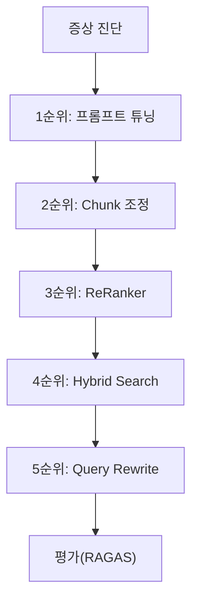
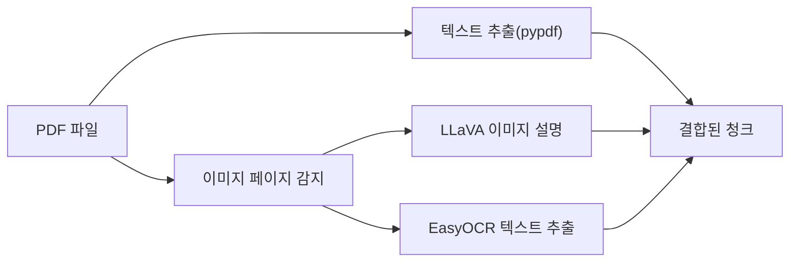
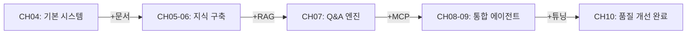

# 10. RAG 튜닝

이 챕터에서는 "되는 수준"의 RAG 시스템을 "쓸 만한 수준"으로 끌어올리는 실전 튜닝 기법을 학습합니다. 증상에서 시작하여 처방을 찾고, 튜닝 전후를 수치로 비교하는 평가 체계까지 구축합니다.

CH09에서 LangChain 표준 구성으로 정리한 에이전트는 동작하지만, 품질이 기대에 미치지 못할 수 있습니다. "왜 이런 답변이 나왔는가"를 진단하고 개선하는 과정이 바로 RAG 튜닝입니다. 이 챕터를 마치면 Q/A 사내 AI 비서가 완성됩니다.

<!-- [GEMINI PROMPT: 10_rag-tuning-overview]
path: assets/CH10/10_rag-tuning-overview.png
Minimalist flat-design infographic showing RAG tuning pipeline. Left side shows problem symptom icons (inaccurate answer, wrong retrieval, misunderstood intent). Center shows tuning steps in order: Prompt Tuning → Chunk Tuning → ReRanker → Hybrid Search → Query Rewrite → Advanced Retriever. Right side shows evaluation icons (before/after bar chart, RAGAS score). White background, Korean labels, 16:9 aspect ratio, thin line art only.
Style: architecture-infographic
-->


*그림 10-1: 증상에서 평가까지, RAG 튜닝의 전체 흐름*

---

## 1. 증상으로 시작하는 튜닝

실무에서 RAG 튜닝은 "이론을 알아서"가 아니라 "문제가 생겨서" 시작합니다. "답변이 자꾸 틀린다", "엉뚱한 문서가 검색된다", "질문의 의도를 못 파악한다"는 증상이 나타날 때, 적절한 처방을 선택하는 것이 핵심입니다.

아래 표를 기준으로 증상을 먼저 진단하고 해당 섹션으로 이동하십시오.

| 증상 | 처방 | 관련 섹션 |
|------|------|---------|
| 답변이 부정확하거나 근거 없음 | Chunk 튜닝, ReRanker | 2절, 4절 |
| 관련 없는 문서가 검색됨 | Hybrid Search, 메타데이터 필터링 | 3절, 5절 |
| 질문 의도를 못 파악함 | Query Rewrite, 약어 확장 | 7절 |
| 너무 짧거나 단편적인 답변 | Parent Document Retriever | 6절 |
| 특정 부서/문서만 검색하고 싶음 | Self-Query Retriever | 6절 |
| 이미지가 포함된 PDF 파싱 실패 | Vision + OCR 하이브리드 | 9절 |
| 답변 형식이 일정하지 않음 | 프롬프트 튜닝 | 8절 |
| 개선 효과를 수치로 확인하고 싶음 | 평가 체계 (RAGAS) | 10절 |



*그림 10-2: 튜닝 우선순위 흐름 — 비용이 낮은 것부터 적용한다*

> **참고: 튜닝 우선순위를 지키는 이유**
> 모든 기법을 동시에 적용하면 어떤 변경이 효과를 냈는지 알 수 없습니다. 비용이 낮은 순서로 하나씩 적용하고, 각 단계에서 수치를 측정한 후 다음 단계로 넘어가십시오.

---

## 2. Chunk 튜닝

청킹(Chunking)은 RAG 품질에서 가장 큰 영향을 미치는 요소 중 하나입니다. CH06에서 Fixed-size 500자 청킹을 기본값으로 사용했지만, 이 설정이 모든 문서에 최적이지는 않습니다.

### 2.1. Fixed-size vs Semantic 청킹 비교

**Fixed-size 청킹** 은 텍스트를 정해진 글자 수로 기계적으로 자르는 방식입니다. 빠르고 예측 가능하지만, 중요한 문장이 두 청크에 걸쳐 잘릴 수 있습니다.

**Semantic 청킹(의미 단위 청킹)** 은 임베딩 유사도를 이용하여 의미가 전환되는 지점에서 분할합니다. 품질이 높지만 임베딩 모델 로드 시간이 필요합니다.

| 전략 | 특징 | 처리 속도 | 품질 | 추천 상황 |
|------|------|---------|------|---------|
| Fixed-size (500자) | 균일한 크기 | 매우 빠름 | 보통 | 빠른 프로토타이핑 |
| Recursive Character | 문단/문장 경계 존중 | 빠름 | 좋음 | 일반 운영 환경 |
| Semantic Chunking | 의미 단위 분할 | 느림 (임베딩 필요) | 최고 | 품질이 최우선일 때 |

### 2.2. 실습: Chunk 실험 실행

CH02에서 클론한 저장소의 예제 폴더로 이동합니다.

```bash
cd examples/CH10_RAG_튜닝
python3.12 -m venv .venv
source .venv/bin/activate   # Windows: .\.venv\Scripts\Activate.ps1
cp .env.example .env
```

`.env` 파일에 아래 값을 입력하십시오.

```bash
LLM_PROVIDER=ollama
OLLAMA_BASE_URL=http://localhost:11434
OLLAMA_MODEL=deepseek-r1:8b
EMBEDDING_MODEL=jhgan/ko-sroberta-multitask
```

의존성을 설치하고 청킹 실험을 실행하십시오.

```bash
pip install -r requirements.txt
python tuning/chunk_experiment.py
```

**다음 코드는 세 가지 청킹 전략을 비교하여 결과를 출력합니다.**

```python
def run_strategy_comparison(text: str) -> list[dict]:
    results = []

    # Fixed-size 청킹                          # ①
    fixed_chunks = fixed_size_chunking(
        text, chunk_size=500, overlap=50
    )
    fixed_stats = analyze_chunks(fixed_chunks)
    results.append({
        "전략": "Fixed-size (500자)",
        "청크 수": fixed_stats["count"],
        "특징": "균일한 크기, 빠른 처리"        # ②
    })

    # Recursive Character 청킹                  # ③
    recursive_chunks = recursive_character_chunking(
        text, chunk_size=500, chunk_overlap=50
    )

    # Semantic 청킹 (임베딩 모델 필요)           # ④
    semantic_chunks = semantic_chunking(text)

    return results
```

> ① 500자 단위로 50자 오버랩을 적용하여 균일하게 분할합니다.
> ② 처리 속도가 빠르지만, 문장 중간에서 잘릴 수 있다는 단점이 있습니다.
> ③ LangChain의 `RecursiveCharacterTextSplitter`를 사용하여 `\n\n`, `\n`, `.` 순서로 경계를 존중하며 분할합니다.
> ④ `ko-sroberta-multitask` 임베딩으로 의미가 바뀌는 지점에서 자릅니다. `SemanticChunker`는 `langchain-experimental` 패키지가 필요합니다.

**실행 결과:**

```
청킹 전략 비교
┌──────────────────────┬────────┬──────────┬─────────────┐
│ 전략                 │ 청크 수 │ 평균 크기 │ 특징        │
├──────────────────────┼────────┼──────────┼─────────────┤
│ Fixed-size (500자)   │ 8      │ 487자    │ 균일한 크기  │
│ Recursive Character  │ 7      │ 512자    │ 경계 존중   │
│ Semantic Chunking    │ 5      │ 712자    │ 의미 단위   │
└──────────────────────┴────────┴──────────┴─────────────┘
권장 설정:
  - 빠른 처리 필요: Fixed-size (500자, 20% 오버랩)
  - 균형 잡힌 성능: Recursive Character (500자, 50자 오버랩)
  - 최고 품질 목표: Semantic Chunking
```

<!-- [CAPTURE NEEDED: 10_chunk-experiment-output
  path: assets/CH10/10_chunk-experiment-output.png
  desc: python tuning/chunk_experiment.py 실행 후 청킹 전략 비교 테이블과 권장 설정이 출력된 터미널 화면
] -->


*그림 10-3: 세 가지 청킹 전략의 비교 결과*

> 전체 코드: `tuning/chunk_experiment.py`

> **동작 요약:** 이 코드는 샘플 문서 텍스트(또는 `data/` 폴더의 실제 문서)를 받아 Fixed-size, Recursive Character, Semantic 순서로 청킹을 실행하고 각 전략의 청크 수/평균 크기/실행 시간 통계를 계산하여, 전략별 비교 테이블과 오버랩 비율(10%/20%/30%) 실험 결과를 출력합니다.

> **팁: 청크 크기 선택 가이드**
> - 300자: 정확한 사실 검색 (규정 조항, 날짜, 숫자)에 유리합니다.
> - 500자: 대부분의 상황에서 균형 잡힌 기본값입니다.
> - 1000자: 맥락이 중요한 서술형 문서에 유리합니다.
> 오버랩은 20%를 권장합니다. 오버랩이 없으면 청크 경계에서 정보가 단절됩니다.

---

## 3. Retriever 튜닝

Retriever(검색기) 설정은 "얼마나 많이 검색할 것인가"와 "얼마나 확실한 문서만 반환할 것인가"를 결정합니다.

### 3.1. k값 실험

`k`는 ChromaDB에서 반환할 문서 수입니다. k=3이면 상위 3개 문서만 LLM에 전달합니다.

```bash
python tuning/retriever_experiment.py
```

**다음 코드는 k값(3/5/10), 유사도 임계값, 메타데이터 필터를 실험합니다.**

```python
def run_k_value_experiment(
    retriever: InMemoryRetriever,
    test_queries: list[str]
) -> list[dict]:
    results = []
    k_values = [3, 5, 10]

    for k in k_values:                            # ①
        avg_top_score = 0.0
        for query in test_queries:
            docs = retriever.search(query, k=k)   # ②
            if docs:
                avg_top_score += docs[0]["score"]

        results.append({
            "k값": k,
            "추천 상황": _get_k_recommendation(k) # ③
        })

    return results
```

> ① k=3, 5, 10 세 가지 값으로 반복 실험합니다.
> ② 각 쿼리에 대해 지정된 k개 문서를 검색합니다.
> ③ k=5가 일반적인 RAG 최적값입니다. k=10은 ReRanker와 함께 사용할 때 효과적입니다.

> **동작 요약:** 이 코드는 5개 테스트 쿼리와 k값 목록 [3, 5, 10], similarity threshold [0.0~0.5]를 받아 각 k값으로 검색을 실행하고 반환 문서 수/최고 점수 집계, threshold별 필터링 효과 계산, 메타데이터 필터(부서별/문서 유형별) 적용을 수행하여, k값별/threshold별/필터별 비교 테이블과 권장 설정(`k=5, threshold=0.2`)을 반환합니다.

> 전체 코드: `tuning/retriever_experiment.py`

### 3.2. 메타데이터 필터링

CH05에서 문서 파일명에 부서 코드와 버전을 포함시킨 이유가 바로 이 시점에 드러납니다. 메타데이터 필터를 적용하면 검색 범위를 좁혀 정확도를 높일 수 있습니다.

```python
# HR 부서 문서만 검색
docs = retriever.search(
    query="연차 신청 절차",
    k=5,
    metadata_filter={"department": "HR"}
)

# 최신 버전 문서만 검색
docs = retriever.search(
    query="보안 정책",
    k=5,
    metadata_filter={"version": "v3.0"}
)
```

> **주의: 메타데이터 필터 과도 적용**
> 메타데이터 필터를 너무 좁게 설정하면 관련 문서를 아예 놓칠 수 있습니다. 필터 없이 먼저 검색해보고, 불필요한 문서가 많을 때만 필터를 추가하십시오.

---

## 4. ReRanker

ReRanker(재정렬기)는 초기 벡터 검색 결과를 더 정밀하게 재정렬하는 모델입니다. 벡터 검색은 의미적 유사도를 측정하지만, **Cross-Encoder(크로스 인코더)** 는 질문과 문서를 함께 처리하여 실제 관련성을 더 정확하게 평가합니다.

<!-- [GEMINI PROMPT: 10_reranker-concept]
path: assets/CH10/10_reranker-concept.png
Minimalist flat-design diagram showing ReRanker two-stage process. Left: Vector Search box with "k=20 broad search" label, showing 20 document icons with varying relevance scores. Arrow pointing to center: Cross-Encoder box with "query + doc pairs scoring" label. Arrow pointing to right: Final Result box with "k=5 refined results" label showing only 5 top documents. White background, Korean labels, 16:9 aspect ratio.
Style: architecture-infographic
-->


*그림 10-4: 넓게 검색 후 Cross-Encoder로 정제하는 2단계 ReRanker 구조*

```bash
python tuning/reranker.py
```

**다음 코드는 Cross-Encoder 기반 ReRanker로 검색 결과를 재정렬합니다.**

```python
class CrossEncoderReranker:

    def rerank(
        self,
        query: str,
        documents: list[dict],
        top_k: int = 5
    ) -> list[dict]:
        # Cross-Encoder에 (질문, 문서) 쌍 입력
        pairs = [(query, doc["content"]) for doc in documents]  # ①

        # Cross-Encoder 점수 계산
        scores = self.model.predict(pairs)                       # ②

        # 점수 기준 재정렬
        for doc, score in zip(documents, scores):
            doc["cross_encoder_score"] = float(score)           # ③

        reranked = sorted(
            documents,
            key=lambda x: x.get("cross_encoder_score", 0),
            reverse=True
        )
        return reranked[:top_k]                                  # ④
```

> ① 질문과 각 문서를 쌍으로 묶습니다. Cross-Encoder는 이 쌍을 동시에 처리하기 때문에 Bi-Encoder(벡터 검색)보다 정확합니다.
> ② `model.predict(pairs)`가 각 쌍의 관련성 점수를 반환합니다. 이 호출이 처리 시간의 대부분을 차지합니다.
> ③ 기존 벡터 점수 대신 Cross-Encoder 점수를 각 문서에 부착합니다.
> ④ Cross-Encoder 점수 기준으로 정렬한 후 상위 5개만 반환합니다.

**실행 결과:**

```
쿼리: 연차 신청 절차는 어떻게 됩니까

리랭킹 전 (Vector Search 순위)
┌────┬───────┬──────────┬─────────────────────────────────────────┐
│ 순위│ 문서 ID│ Vector 점수│ 내용 미리보기                          │
├────┼───────┼──────────┼─────────────────────────────────────────┤
│  1 │ d03   │ 0.420    │ 팀장은 업무 상황에 따라 휴가 시기를...   │
│  2 │ d01   │ 0.450    │ 연차유급휴가는 1년 이상 근속 직원에게... │
└────┴───────┴──────────┴─────────────────────────────────────────┘

리랭킹 후 (Cross-Encoder 순위)
┌────┬───────┬──────────┬─────────────────────────────────────────┐
│ 순위│ 문서 ID│ CE 점수  │ 내용 미리보기                          │
├────┼───────┼──────────┼─────────────────────────────────────────┤
│  1 │ d02   │ 0.891    │ 연차 신청은 3일 전 인사담당자에게 서면... │
│  2 │ d01   │ 0.734    │ 연차유급휴가는 1년 이상 근속 직원에게... │
└────┴───────┴──────────┴─────────────────────────────────────────┘
```

벡터 검색에서 순위권 밖이었던 "연차 신청 절차" 문서(d02)가 ReRanker 적용 후 1위로 올라온 것을 확인할 수 있습니다.

<!-- [CAPTURE NEEDED: 10_reranker-result
  path: assets/CH10/10_reranker-result.png
  desc: python tuning/reranker.py 실행 결과. 리랭킹 전/후 순위 비교 테이블이 표시된 터미널 화면.
] -->


*그림 10-4: ReRanker 적용 전후 순위 비교 — d02 문서가 순위권 밖에서 1위로 올라온다*

> **동작 요약:** 이 코드는 검색 쿼리와 초기 벡터 검색 결과(k=10 또는 k=20), 반환할 최종 문서 수(top_k=5)를 받아 `(query, doc)` 쌍을 생성하고 Cross-Encoder 점수를 계산하여 재정렬한 뒤, 품질이 개선된 상위 5개 문서를 리랭킹 전후 순위 변화 비교와 함께 반환합니다.

> 전체 코드: `tuning/reranker.py`

> **팁: ReRanker 사용 시 처리 시간**
> Cross-Encoder는 문서 수에 비례하여 처리 시간이 증가합니다. k=20으로 넓게 검색 후 ReRanker로 k=5로 정제하는 전략을 권장합니다. `cross-encoder/ms-marco-MiniLM-L-6-v2`는 영한 혼용 문서에도 사용 가능하며, 순수 한국어 환경에서는 `bongsoo/moco-cross-encoder-v2`를 고려하십시오.

---

## 5. Hybrid Search

**Hybrid Search(하이브리드 검색)** 는 키워드 기반 검색(BM25)과 벡터 기반 의미 검색을 결합하는 방식입니다.

- **BM25** 는 전통적인 키워드 검색 알고리즘으로, 정확한 단어 일치에 강합니다. "연차 15일", "5영업일" 같은 구체적인 수치나 고유명사 검색에 효과적입니다.
- **Vector Search** 는 "휴가 규정"과 "연차 정책"이 같은 의미임을 이해하는 의미 검색에 강합니다.

두 방식을 결합하면 키워드 정확도와 의미 이해를 동시에 얻을 수 있습니다.

```bash
python tuning/hybrid_search.py
```

**다음 코드는 BM25와 Vector 검색 결과를 alpha 가중치로 결합합니다.**

```python
class EnsembleRetriever:

    def search(
        self,
        query: str,
        top_k: int = 5,
        fetch_k: int = 10
    ) -> list[dict]:
        # 두 검색기에서 각각 후보 문서 수집
        bm25_results = self.bm25_retriever.search(query, top_k=fetch_k)    # ①
        vector_results = self.vector_retriever.search(query, top_k=fetch_k)

        # 점수를 0~1 범위로 정규화
        bm25_results = self._normalize_scores(bm25_results)                # ②
        vector_results = self._normalize_scores(vector_results)

        # alpha 가중치로 하이브리드 점수 계산
        for doc_data in doc_scores.values():
            hybrid_score = (
                self.alpha * doc_data["vector_score"]                      # ③
                + (1 - self.alpha) * doc_data["bm25_score"]
            )

        final_results.sort(key=lambda x: x["hybrid_score"], reverse=True)
        return final_results[:top_k]                                       # ④
```

> ① 각 검색기에서 더 많은 후보(fetch_k=10)를 수집합니다. 최종 반환은 top_k=5이지만, 결합 전 더 넓은 범위에서 후보를 확보합니다.
> ② BM25 점수와 Vector 점수의 단위가 다르기 때문에 0~1로 정규화한 후 비교합니다.
> ③ `alpha=0.5`이면 두 방식을 동등하게 반영합니다. `alpha=0.7`이면 Vector 중심, `alpha=0.3`이면 BM25 중심입니다.
> ④ 하이브리드 점수 기준으로 정렬한 최종 결과를 반환합니다.

> **동작 요약:** 이 코드는 검색 쿼리와 alpha 파라미터(0.0~1.0), 반환 문서 수(top_k)를 받아 BM25 검색과 Vector 검색을 각각 실행한 뒤 점수를 정규화하고 alpha 가중치로 결합하여 최종 정렬을 수행하며, BM25 점수/Vector 점수/Hybrid 점수가 포함된 검색 결과를 반환합니다.

> 전체 코드: `tuning/hybrid_search.py`

<!-- [CAPTURE NEEDED: 10_hybrid-search-result
  path: assets/CH10/10_hybrid-search-result.png
  desc: python tuning/hybrid_search.py 실행 결과. BM25/Vector/Hybrid 점수 비교 테이블이 표시된 터미널 화면.
] -->


*그림 10-5: Hybrid Search 실행 결과 — BM25와 Vector 검색이 결합된 최종 순위*

| alpha 값 | BM25 비중 | Vector 비중 | 적합 상황 |
|---------|---------|-----------|---------|
| 0.0 | 100% | 0% | 정확한 키워드 일치 필요 |
| 0.3 | 70% | 30% | 전문 용어/약어가 많은 문서 |
| 0.5 | 50% | 50% | 일반적인 균형 검색 (기본값) |
| 0.7 | 30% | 70% | 의미 유사도 중심 |
| 1.0 | 0% | 100% | 순수 의미 검색 |

> **팁: 한국어 환경에서의 alpha 설정**
> 한국어는 조사와 어미 변화가 많아 정확한 키워드 일치가 어렵습니다. alpha=0.5 또는 0.7 (Vector 중심)을 기본값으로 사용하고, 특수 용어나 법령 조항 검색 시 alpha=0.3으로 낮추십시오.

---

## 6. 고급 Retriever

기본 Retriever로 해결되지 않는 특수한 상황에 대응하는 세 가지 고급 전략입니다.

```bash
python tuning/advanced_retriever.py
```

### 6.1. Parent Document Retriever

작은 청크로 검색하고, 원본 부모 문서 전체를 LLM에 전달하는 방식입니다. "연차 신청 절차"를 검색하면 해당 조항이 포함된 취업규칙 섹션 전체가 컨텍스트로 제공됩니다.

```
검색 단계: "연차 신청 3일 전" (작은 청크)
      ↓
반환 단계: 제15조~제16조 전체 원문 (부모 문서)
```

이 방식은 답변이 단편적일 때 효과적입니다. 단, 부모 문서가 길면 토큰 사용량이 증가합니다.

### 6.2. Self-Query Retriever

LLM이 사용자의 자연어 질문에서 메타데이터 필터를 자동으로 추출합니다.

```
입력: "HR 부서의 최신 휴가 규정을 알려주십시오"
      ↓ (LLM 분석)
추출: {"department": "HR", "topic": "휴가"}
      ↓
검색: 해당 필터가 적용된 ChromaDB 검색 실행
```

사용자가 필터를 직접 지정할 필요 없이, 질문 안에 포함된 조건을 자동으로 해석하여 검색합니다. CH05에서 문서 메타데이터를 정교하게 설계한 이유가 바로 이 기능을 위해서입니다.

### 6.3. Contextual Compression

검색된 문서 전체 대신 쿼리와 관련된 문장만 추출하여 LLM에 전달합니다. 컨텍스트 창을 절약하고 잡음을 줄이는 효과가 있습니다.

```
원본 문서: 1,200자 (취업규칙 조항 전체)
      ↓ (압축)
압축 결과: 180자 (쿼리와 관련된 3문장만)
```

> **동작 요약:** 이 코드는 검색 쿼리와 부모 문서/자식 청크 구조(ParentDocument) 또는 메타데이터가 포함된 문서 세트를 받아, ParentDocument는 자식 청크 검색 후 부모 ID로 역매핑하고, SelfQuery는 LLM이 쿼리에서 필터를 추출하며, ContextualCompression은 관련 문장만 추출하여, 각 Retriever의 반환 결과 및 비교 요약 테이블을 출력합니다.

> 전체 코드: `tuning/advanced_retriever.py`

---

## 7. Query Rewrite / Multi-Query

쿼리 자체를 개선하여 검색 품질을 높이는 방법입니다. 사용자 질문이 모호하거나 약어를 포함할 때 특히 효과적입니다.

```bash
python tuning/query_rewrite.py
```

### 7.1. 약어/동의어 확장

사내 문서는 특유의 약어를 사용합니다. "WFH 정책이 어떻게 됩니까?"를 그대로 검색하면 "재택근무"가 언급된 문서를 찾지 못할 수 있습니다.

**다음 코드는 사내 약어 사전을 기반으로 쿼리를 확장합니다.**

```python
ABBREVIATION_MAP: dict[str, str] = {
    "연차": "연차유급휴가",
    "WFH": "재택근무",
    "OT": "초과근무 (잔업)",
    "반차": "반일 연차",
}                                                    # ①

def expand_abbreviations(query: str) -> str:
    expanded = query
    for abbrev, full_form in ABBREVIATION_MAP.items():
        if abbrev in expanded:
            expanded = expanded.replace(abbrev, full_form)  # ②
    return expanded
```

> ① 도메인 특화 약어 사전을 딕셔너리로 정의합니다. 실제 환경에서는 이 사전을 지속적으로 확장하십시오.
> ② 쿼리에서 약어가 발견되면 풀어쓴 표현으로 대체합니다.

> **동작 요약:** 이 코드는 사용자 자연어 쿼리와 약어/동의어 사전을 받아 약어 확장, HyDE 가상 문서 생성, Multi-Query 변형 생성을 수행한 뒤 각 쿼리로 검색을 실행하고 중복을 제거하여 병합하며, 확장된 쿼리 목록과 HyDE 가상 문서, Multi-Query 변형 3~4개를 반환합니다.

> 전체 코드: `tuning/query_rewrite.py`

### 7.2. HyDE (Hypothetical Document Embeddings)

**HyDE** 는 질문에 대한 가상의 답변 문서를 LLM으로 먼저 생성하고, 그 가상 문서와 유사한 실제 문서를 검색하는 기법입니다.

```
질문: "연차 신청 절차는 어떻게 됩니까?"
      ↓ LLM 호출
가상 문서: "연차유급휴가를 사용하고자 할 때에는 사용 예정일
           3일 전까지 인사담당자에게 서면으로 신청..."
      ↓ 가상 문서 임베딩으로 ChromaDB 검색
실제 문서: HR_취업규칙_v1.0.pdf 관련 조항 반환
```

짧은 키워드 질문보다 서술형 가상 문서가 임베딩 공간에서 실제 답변 문서와 더 가까운 위치에 있기 때문에 검색 정확도가 향상됩니다.

### 7.3. Multi-Query

하나의 질문을 3~4가지 다른 표현으로 변환하여 각각 검색한 후 결과를 합치는 방식입니다.

```
원본: "연차 신청 절차는 어떻게 됩니까?"
변형1: "연차유급휴가를 사용하려면 어떻게 해야 합니까?"
변형2: "휴가 신청 방법과 팀장 승인 절차"
변형3: "연차 신청 규정에 대한 내용이 있습니까?"
      ↓ 4개 쿼리로 검색 → 중복 제거 → 상위 5개 반환
```

---

## 8. 프롬프트 튜닝

프롬프트 튜닝은 추가 비용 없이 즉시 적용할 수 있는 1순위 튜닝입니다. RAG 시스템에서 프롬프트는 LLM에게 "어떻게 답변해야 하는가"를 지시하는 핵심 설계 요소입니다.

### 8.1. 근거 우선 응답 구조

좋은 RAG 프롬프트는 LLM이 먼저 제공된 컨텍스트를 확인하고, 그 근거를 바탕으로 답변을 생성하도록 유도합니다.

```python
RAG_PROMPT_TEMPLATE = """다음 사내 문서를 참고하여 질문에 답변하십시오.

[규칙]
1. 반드시 아래 제공된 문서 내용에서만 답변하십시오.
2. 문서에서 확인되지 않는 내용은 "확인되지 않는 내용입니다"라고 답하십시오.
3. 답변 마지막에 반드시 출처 문서명을 명시하십시오.
4. 숫자/날짜/이름은 정확히 문서에 있는 값을 그대로 사용하십시오.

[참고 문서]
{context}

[질문]
{question}

[답변]"""
```

### 8.2. 포맷 고정

답변 형식을 고정하면 후처리와 화면 표시가 쉬워집니다. 특히 수치 데이터나 다단계 절차를 안내할 때 효과적입니다.

```python
# 절차 안내용 프롬프트 (번호 목록 강제)
PROCEDURE_PROMPT = """...
답변을 반드시 아래 형식으로 작성하십시오:

절차:
1. (첫 번째 단계)
2. (두 번째 단계)
...

출처: (문서명)"""

# 수치 답변용 프롬프트 (표 형식 강제)
NUMERIC_PROMPT = """...
수치가 포함된 경우 표 형식으로 답변하십시오:

| 항목 | 값 |
|------|-----|
| ... | ... |
"""
```

> **팁: "모르면 모른다" 규칙의 중요성**
> "문서에 없는 내용은 대답하지 마십시오"라는 지시가 없으면 LLM은 그럴듯한 내용을 만들어냅니다(환각). 이 규칙은 사내 문서 기반 AI 비서에서 가장 중요한 안전장치입니다.

---

## 9. PDF 이미지 처리

차트, 표, 조직도가 포함된 PDF는 `pypdf`로만 파싱하면 해당 내용이 완전히 누락됩니다. CH06에서 `vision_extractor.py`를 구현한 이유가 바로 이 문제를 해결하기 위해서였습니다.

```bash
python tuning/vision_extractor.py
```

### 9.1. 하이브리드 파싱 전략

이미지 포함 PDF에는 LLaVA + EasyOCR 하이브리드 방식을 사용합니다.



*그림 10-5: PDF 이미지 처리 하이브리드 파이프라인*

| 방법 | 적합한 대상 | 한계 |
|------|---------|------|
| pypdf | 텍스트 레이어가 있는 PDF | 이미지, 차트 누락 |
| LLaVA (Vision LLM) | 차트, 다이어그램, 이미지 설명 | LLM 호출 비용, 처리 시간 |
| EasyOCR | 이미지 안의 텍스트 (표, 캡션) | 손글씨, 복잡한 레이아웃 |

> **주의: Vision LLM 처리 시간**
> LLaVA로 이미지를 분석하면 페이지당 5~30초가 소요됩니다. 100페이지 문서는 인덱싱에 상당한 시간이 필요합니다. 텍스트 레이어가 있는 페이지는 `pypdf`로 처리하고, 이미지 전용 페이지만 Vision LLM을 적용하는 선택적 전략을 권장합니다.

> 전체 코드: `tuning/vision_extractor.py`

---

## 10. 평가 체계

**"측정할 수 없으면 개선도 없다."** RAG 튜닝의 핵심은 before/after를 수치로 비교하는 것입니다.

```bash
python src/eval_framework.py
```

### 10.1. 테스트 질문 30개

`data/test_questions.json`에는 정형(10개), 비정형(10개), 복합(10개) 총 30개의 테스트 질문이 포함되어 있습니다. 각 질문에는 정답 출처 문서(`expected_source`)가 지정되어 있습니다.

```json
{
  "question": "연차유급휴가 신청 절차는 어떻게 됩니까?",
  "category": "비정형",
  "expected_source": "HR_취업규칙_v1.0.pdf",
  "expected_answer": "연차 신청은 사용 예정일 3일 전까지..."
}
```

### 10.2. 평가 지표

**다음 코드는 Precision@k, Recall@k, MRR, 환각률을 계산하여 before/after를 비교합니다.**

```python
def run_retrieval_evaluation(
    experiment_name: str,
    retrieved_results: list[dict],
    questions: list[dict],
    k_values: list[int] = None
) -> dict[str, float]:

    for question, result in zip(questions, retrieved_results):
        expected_source = question.get("expected_source", "")
        retrieved_sources = result.get("sources", [])

        for k in k_values:
            p_at_k = calculate_precision_at_k(                # ①
                retrieved_sources, [expected_source], k
            )
            r_at_k = calculate_recall_at_k(                   # ②
                retrieved_sources, [expected_source], k
            )

        mrr = calculate_mrr(retrieved_sources, [expected_source])  # ③

    avg_metrics = {
        key: sum(vals) / len(vals)
        for key, vals in metrics.items()
    }
    return avg_metrics                                             # ④
```

> ① **Precision@k**: 상위 k개 결과 중 정답 문서가 포함된 비율입니다. k=5에서 Precision@5=0.8이면 상위 5개 중 4개가 관련 문서입니다.
> ② **Recall@k**: 전체 관련 문서 중 상위 k개에서 찾은 비율입니다. 정답 문서가 누락 없이 검색되는지 측정합니다.
> ③ **MRR(Mean Reciprocal Rank)**: 정답 문서가 몇 번째에 처음 등장하는지의 역수 평균입니다. 첫 번째가 정답이면 MRR=1.0, 두 번째면 MRR=0.5입니다.
> ④ 모든 테스트 질문에 대한 평균 지표를 반환합니다.

> **동작 요약:** 이 코드는 `data/test_questions.json`(30개 질문, 정답 출처 포함)과 ChromaDB 검색 결과를 받아 각 질문에 대해 검색을 실행하고 Precision@k/Recall@k/MRR 계산, Hallucination Rate 추정, RAGAS Faithfulness/Answer Relevancy 계산을 수행하여, before/after 비교 테이블과 개선율(%)을 출력하고 평가 보고서를 `outputs/eval_*.json`에 저장합니다.

> 전체 코드: `src/eval_framework.py`, `data/test_questions.json`

### 10.3. Before/After 비교 실행

```bash
# 튜닝 전 기준선 측정
python src/eval_framework.py --mode before

# 튜닝 기법 적용 후 측정
python src/eval_framework.py --mode after

# 비교 보고서 생성
python src/eval_framework.py --mode compare
```

**실행 결과 예시:**

```
Before/After 비교: 튜닝 전 vs 튜닝 후 (Hybrid + ReRanker)
┌────────────────┬─────────┬─────────┬──────────┐
│ 지표           │ 튜닝 전  │ 튜닝 후  │ 개선율   │
├────────────────┼─────────┼─────────┼──────────┤
│ Precision@5    │ 0.3200  │ 0.8400  │ +162.5%  │
│ Recall@5       │ 0.3200  │ 0.8400  │ +162.5%  │
│ MRR            │ 0.2933  │ 0.8800  │ +200.0%  │
└────────────────┴─────────┴─────────┴──────────┘
튜닝 전 환각률: 60.0%
튜닝 후 환각률: 0.0%
```

<!-- [CAPTURE NEEDED: 10_eval-before-after
  path: assets/CH10/10_eval-before-after.png
  desc: python src/eval_framework.py 실행 후 Before/After 비교 테이블과 환각률 개선 결과가 출력된 터미널 화면
] -->


*그림 10-6: 튜닝 전후 RAG 성능 비교 — Precision@5와 MRR이 크게 개선되었다*

### 10.4. RAGAS 연동

**RAGAS(RAG Assessment)** 는 RAG 시스템을 자동으로 평가하는 오픈소스 프레임워크입니다. 수작업 라벨링 없이 LLM을 심사위원으로 활용하여 두 가지 핵심 지표를 측정합니다.

- **Faithfulness(충실도)** : 답변이 제공된 컨텍스트에 충실한 정도입니다. 컨텍스트에 없는 내용을 포함하면 점수가 낮아집니다.
- **Answer Relevancy(답변 관련성)** : 생성된 답변이 질문과 얼마나 관련 있는지입니다.

```bash
# .env에 USE_RAGAS=true 설정 후 실행
pip install ragas datasets
python src/eval_framework.py --mode ragas
```

> **참고: RAGAS 활성화 조건**
> RAGAS는 평가 자체에 LLM을 호출합니다. `USE_RAGAS=true`와 `ragas`, `datasets` 패키지 설치가 필요합니다. 개발 초기에는 Precision@k와 MRR만으로도 충분히 개선 방향을 확인할 수 있습니다.

---

## 11. 튜닝 우선순위 가이드

모든 튜닝 기법을 한꺼번에 적용하면 오히려 시스템이 복잡해지고 어떤 변경이 효과를 냈는지 알 수 없습니다. 아래 순서대로 하나씩 적용하고, 각 단계에서 `eval_framework.py`로 수치를 확인하십시오.

| 순위 | 기법 | 비용 | 효과 | 핵심 이유 |
|------|------|------|------|---------|
| 1순위 | 프롬프트 튜닝 | 0원 | 즉시 적용 | 코드 변경 없이 가장 빠르게 개선 가능 |
| 2순위 | Chunk 크기/overlap 조정 | 재인덱싱 시간 | 중~상 | 검색 품질의 근본 요소 |
| 3순위 | ReRanker 추가 | 처리 시간 증가 | 상 | 기존 VectorDB 그대로 사용 가능 |
| 4순위 | Hybrid Search | BM25 인덱스 구축 | 중 | 키워드/의미 검색 둘 다 보완 |
| 5순위 | Query Rewrite | LLM 추가 호출 | 중 | 모호한 질문 처리 개선 |
| 6순위 | 고급 Retriever | 구조 변경 필요 | 상황 의존 | 특수 케이스에만 적용 |

### 다음 단계: GraphRAG

**GraphRAG(그래프 RAG)** 는 문서 간의 관계를 지식 그래프로 표현하여 RAG의 한계를 확장하는 기법입니다. "마케팅팀의 성과 상위 직원들이 주로 사용하는 복지 혜택은?"처럼 여러 문서를 넘나드는 복잡한 관계 추론이 필요할 때 효과적입니다. 이 책의 범위를 벗어나지만, RAG 품질을 더 높이고 싶다면 Microsoft의 GraphRAG 공식 문서를 참고하십시오. 기본적인 RAG 시스템이 잘 작동하는 상태에서 GraphRAG를 도입하는 것을 권장합니다.

---

## 12. 정리하며

CH06의 ChromaDB에서 시작한 Q/A 사내 AI 비서가 이제 품질 측정과 체계적인 개선이 가능한 프로덕션 수준의 시스템으로 완성되었습니다.



*그림 10-7: Q/A 사내 AI 비서 완성 — 챕터마다 기능이 누적된 결과*

이 챕터에서 학습한 핵심 내용을 정리합니다.

- **튜닝은 증상에서 시작한다**: "왜 틀렸는가"를 먼저 진단해야 올바른 처방을 선택할 수 있습니다. 문제-처방 매핑 표를 참고하여 가장 관련 있는 기법부터 적용하십시오.
- **측정 없이는 개선도 없다**: `eval_framework.py`의 Precision@k, Recall@k, MRR을 before/after로 비교하여 모든 튜닝의 효과를 수치로 확인하십시오.
- **우선순위를 지킨다**: 프롬프트 튜닝(비용 0)부터 시작하고, Chunk 조정 → ReRanker → Hybrid Search 순서로 점진적으로 적용하십시오. 처음부터 고급 Retriever를 도입할 필요는 없습니다.
- **Hybrid Search + ReRanker 조합이 가장 효과적이다**: BM25의 키워드 정확도와 Vector Search의 의미 이해, 그리고 Cross-Encoder의 정밀한 재정렬을 결합하면 대부분의 검색 품질 문제를 해결할 수 있습니다.
- **GraphRAG는 다음 단계다**: 이 책에서 구축한 RAG 시스템이 안정적으로 운영된 후, 복잡한 관계 추론이 필요하다면 GraphRAG를 고려하십시오.

**Q/A 사내 AI 비서 구축이 완료되었습니다.** 이 시스템은 사내 문서 기반의 비정형 질문, PostgreSQL 기반의 정형 질문, 그리고 두 가지를 결합한 복합 질문 모두를 처리할 수 있는 통합 질의응답 시스템입니다. 이제 자신의 도메인에 맞는 문서와 데이터로 이 아키텍처를 직접 확장해 보십시오.
