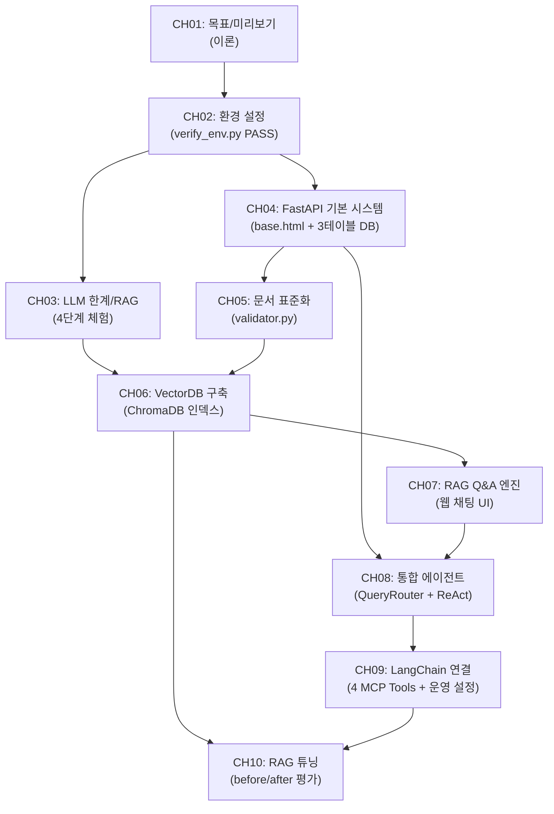

# 사내 문서 기반 AI 업무 비서 (RAG + MCP) — 상세 목차

> 생성일: 2026-02-27
> 기준 문서: plan.md (v3), chapter_spec_CH01~10.md

---

## 전체 구조

| 항목 | 값 |
|------|-----|
| 총 챕터 수 | 10개 |
| 예상 총 분량 | 95p |
| 이론 / 실습 비율 | 약 27% / 73% |
| 예제 폴더 | `examples/CH02_개발_환경_설정/` ~ `examples/CH10_RAG_튜닝/` |
| 최종 산출물 | "커넥트HR AI 비서" — 정형/비정형 통합 질의응답 시스템 |

### 챕터-분량 요약

| PART | CH | 제목 | 분량 | 이론:실습 |
|------|-----|------|------|---------|
| PART 0 | CH01 | 이 책의 목표와 최종 완성본 미리보기 | 5p | 100:0 |
| PART 0 | CH02 | 개발 환경 설정 | 7p | 30:70 |
| 기초 | CH03 | LLM의 한계와 RAG의 필요성 | 8p | 40:60 |
| PART 1 | CH04 | FastAPI로 초간단 사내 시스템 만들기 | 10p | 20:80 |
| PART 1 | CH05 | 사내 문서 수집 전략과 문서 표준 만들기 | 7p | 50:50 |
| PART 2 | CH06 | VectorDB 구축 | 12p | 20:80 |
| PART 2 | CH07 | RAG로 Q&A 엔진 만들기 | 12p | 20:80 |
| PART 3 | CH08 | 정형 MCP + 비정형 RAG 통합 에이전트 | 12p | 20:80 |
| PART 3 | CH09 | LangChain으로 연결 전략 세팅 | 10p | 20:80 |
| PART 4 | CH10 | RAG 튜닝 | 12p | 30:70 |
| **합계** | | | **95p** | |

---

## [PART 0. 시작하기]

---

## CH01. 이 책의 목표와 최종 완성본 미리보기 (5p)

> 학습 목표: 최종 결과물의 전체 아키텍처와 RAG/MCP 개념을 이해한다.
> 핵심 질문: 이 책을 마치면 어떤 시스템을 직접 구축할 수 있는가?

### 1. 도입 (0.5p)

- 챕터 개요: RAG와 MCP가 결합된 사내 AI 비서의 전체 그림
- 이 챕터에서 답할 수 있게 되는 것: "왜 Fine-tuning 대신 RAG인가?"

### 2. 개념 (2.5p)

- 2.1. 이 책이 다루는 범위: RAG + MCP 조합의 위치와 Fine-tuning과의 비교표 (비용, 데이터 요구량, 업데이트 주기, 적합 상황)
- 2.2. 최종 결과물 데모 시나리오: 정형 질문 ("김철수 사원의 남은 연차는?"), 비정형 질문 ("신입사원 온보딩 절차를 알려줘"), 복합 질문 ("올해 매출 상위 부서의 복지 정책을 비교해줘")
- 2.3. 아키텍처 한 장 요약: 전체 시스템 구성도 및 각 구성 요소 역할 1줄 설명
  - [Mermaid 다이어그램] 사용자 → FastAPI → QueryRouter → MCP Tools / RAG Chain / ReAct Agent 흐름
- 2.4. 사용 기술 스택: 기술별 역할 + 메모리 요구사항 표 (최소/권장 하드웨어 스펙)
- 2.5. 이 책을 마치면 할 수 있는 것: 3가지 핵심 역량 (RAG 구축, MCP 통합, 운영 배포) + 챕터별 빌드업 로드맵

### 3. 실습 (0p)

- (이 챕터는 이론 전용이므로 실습 없음)
- 핵심 용어 정리: RAG, MCP, 환각(Hallucination), 임베딩, VectorDB

### 4. 정리하며 (1p)

- **RAG는 Fine-tuning보다 빠르다**: 학습 없이 문서 추가만으로 즉시 지식 확장이 가능하다.
- **MCP는 정형 데이터의 열쇠다**: LLM이 DB를 직접 조회하는 표준 프로토콜로, 정형/비정형을 하나의 에이전트에서 처리한다.
- **이 책은 "하나의 프로젝트"다**: 챕터마다 커넥트HR AI 비서에 기능을 하나씩 쌓아간다.
- 다음 챕터: 실제 시스템을 구축할 개발 환경을 준비한다.

---

## CH02. 개발 환경 설정 (7p)

> 학습 목표: Ollama, PostgreSQL, Python 환경을 구축하고 LLM Provider 전환 구조를 이해한다.
> 핵심 질문: 환경 검증 스크립트가 4개 항목 모두 PASS를 출력하는가?

### 1. 도입 (0.5p)

- 챕터 개요: 이 책의 모든 실습을 위한 개발 환경 구축
- 사전 요구사항 체크리스트: Python 3.10+, Docker Desktop, RAM 16GB+, 저장공간 20GB+

### 2. 개념 (1.5p)

- 2.1. 환경 구성 원칙: Docker로 PostgreSQL을 설치하는 이유 (OS 독립적, 버전 고정)
  - [Mermaid 다이어그램] Python + Ollama + Docker → verify_env.py PASS 구성도
- 2.2. LLM Provider 전환 설계: `.env` 기반 Ollama / OpenAI / vLLM 전환 구조 — `llm_provider.py` 팩토리 패턴
- 2.3. OS별 주의사항: macOS / Linux / Windows(WSL2) 차이점

### 3. 실습 (4p)

- 3.1. Ollama + DeepSeek R1 설치: OS별 설치 가이드 + `ollama pull deepseek-r1:8b` + 간단한 대화 테스트
- 3.2. Python 가상환경 및 의존성: venv 생성/활성화 + `requirements.txt` 항목별 용도 설명 + `pip install` 실행
- 3.3. PostgreSQL 설치 (Docker): `docker-compose.yml` 기반 PostgreSQL 구동 + `metacoding_db` 데이터베이스 생성
- 3.4. 프로젝트 클론 및 초기 설정: `git clone` + 폴더 구조 설명 + `.env` 파일 생성
- 3.5. LLM Provider 전환 구현: `src/llm_provider.py` — `get_llm_client()` 팩토리 함수 및 Provider별 테스트
  - [Code Workflow] Input: `.env`의 `LLM_PROVIDER` / Process: OllamaClient / OpenAIClient / VLLMClient 분기 / Output: `BaseLLMClient` 인스턴스
  - 코드 파일: `examples/CH02_개발_환경_설정/src/llm_provider.py`
- 3.6. 환경 검증: `src/verify_env.py` 실행 — Python / Docker / Ollama / PostgreSQL 4개 항목 PASS 확인
  - [Code Workflow] Input: `.env` + 시스템 정보 / Process: 각 서비스 연결 시도 / Output: PASS/FAIL 판정 + 해결 방법
  - 코드 파일: `examples/CH02_개발_환경_설정/src/verify_env.py`

### 4. 정리하며 (1p)

- **Docker PostgreSQL은 충돌을 방지한다**: OS와 무관하게 동일한 환경을 보장한다.
- **LLM Provider 팩토리는 한 번만 만든다**: `.env`의 `LLM_PROVIDER` 값만 바꾸면 이후 모든 챕터에서 자동으로 전환된다.
- **`verify_env.py` PASS가 출발점이다**: 4개 항목이 모두 통과해야 CH03 실습으로 진행할 수 있다.
- 다음 챕터: 구축한 환경에서 LLM의 한계를 직접 체험한다.

---

## [기초]

---

## CH03. LLM의 한계와 RAG의 필요성 (8p)

> 학습 목표: LLM 환각 문제를 직접 체험하고 RAG가 해결책임을 체감한다.
> 핵심 질문: 4단계(실패→원인→임시해결→성공) 실습을 완료했는가?

### 1. 도입 (0.5p)

- 챕터 개요: "안 되는 것"부터 보여주는 이유 — 실패를 체감해야 해결책의 가치를 이해한다
  - [Mermaid 다이어그램] Step 1(LLM 단독) → Step 2(원인 분석) → Step 3(Context Injection) → Step 4(RAG 미리보기) → Step 5(추론 심화) 흐름

### 2. 개념 (2.5p)

- 2.1. 왜 LLM은 환각을 일으키는가: 학습 데이터 컷오프 문제, 사내 비공개 정보 부재, 파라메트릭 지식 vs 컨텍스트 지식 비교
- 2.2. Context Injection의 한계: 토큰 한계, 전체 문서를 프롬프트에 넣을 수 없는 이유
- 2.3. RAG의 작동 원리: 검색(Retrieval) + 생성(Generation) 조합, 청킹이 필요한 이유

### 3. 실습 (4.5p)

- 3.1. [실패] LLM 단독 질의: `"김철수 사원의 남은 연차는?"` — 환각 응답 확인 및 분석
  - [Code Workflow] Input: 사내 정보 질문 / Process: Ollama/OpenAI API 호출 / Output: 그럴듯하지만 틀린 답변
  - 코드 파일: `examples/CH03_LLM의_한계와_RAG의_필요성/src/01_llm_only.py`
- 3.2. [임시 해결] Context Injection: 프롬프트에 문서 3개 직접 삽입 + 토큰 한계 체감
  - [Code Workflow] Input: 질문 + 문서 텍스트 / Process: 프롬프트 조립 + LLM 호출 / Output: 답변 개선 확인 + 토큰 초과 경고
  - 코드 파일: `examples/CH03_LLM의_한계와_RAG의_필요성/src/02_context_injection.py`
- 3.3. [성공] RAG 미리보기: 인메모리 ChromaDB로 검색+답변 — 청킹 유무 비교 (전체 문서 vs 500자 청크)
  - [Code Workflow] Input: 질문 / Process: ChromaDB 유사도 검색 → 관련 청크 추출 → LLM 답변 생성 / Output: 출처 포함 정확한 답변
  - 코드 파일: `examples/CH03_LLM의_한계와_RAG의_필요성/src/03_rag_preview.py`
- 3.4. [심화] DeepSeek R1 추론 능력 확인: `"올해 1분기 매출 합계는?"` — RAG + 계산/추론 결합
  - [Code Workflow] Input: 수치 계산이 필요한 질문 / Process: 문서 검색 → 수치 추출 → LLM 추론 / Output: 계산 근거 포함 답변
  - 코드 파일: `examples/CH03_LLM의_한계와_RAG의_필요성/src/04_rag_reasoning.py`

### 4. 정리하며 (0.5p)

- **LLM은 학습 데이터 밖을 모른다**: 사내 비공개 정보는 외부에서 주입해야 한다.
- **Context Injection은 임시방편이다**: 토큰 한계로 인해 문서가 늘어날수록 한계에 부딪힌다.
- **RAG는 "필요한 부분만" 찾아준다**: 청킹과 유사도 검색으로 토큰 제한을 우회한다.
- 4단계 결과 비교표: 정확도 / 출처 제시 / 확장 가능성 비교
- 다음 챕터: RAG의 기반이 될 사내 데이터베이스 시스템을 직접 만든다.

---

## [PART 1. 기반 구축]

---

## CH04. FastAPI로 초간단 사내 시스템 만들기 (10p)

> 학습 목표: FastAPI + PostgreSQL 기반 CRUD 시스템을 구축한다.
> 핵심 질문: 직원/휴가/매출 CRUD API와 Admin UI가 정상 동작하는가?

### 1. 도입 (0.5p)

- 챕터 개요: 이후 모든 챕터에서 계승할 기반 시스템 구축
- 이 챕터의 특별함: CH04에서 만든 `base.html`과 DB 스키마가 CH07, CH08에서 그대로 확장된다

### 2. 개념 (1.5p)

- 2.1. FastAPI 선택 이유: async 지원, 자동 API 문서(Swagger), Pydantic 통합, LangChain 호환성
- 2.2. 데이터 모델 설계: 3테이블 구조 — `employee`, `leave_balance`, `sales`
  - [Mermaid 다이어그램] ERD — employee ↔ leave_balance, employee ↔ sales 관계도
- 2.3. Jinja2 Admin UI 설계 원칙: 베이스 레이아웃(`base.html`) + 사이드바 + 콘텐츠 영역 구조

### 3. 실습 (7p)

- 3.1. 프로젝트 구성: 폴더 구조(`app/`, `templates/`, `data/`, `static/`) + `.env` 설정 + `uvicorn app.main:app --reload` 실행
  - [Code Workflow] Input: 환경 변수 + 라우터 등록 / Process: FastAPI 앱 초기화 + 라우터 마운트 / Output: http://localhost:8000 서버 시작
  - 코드 파일: `examples/CH04_FastAPI_기본_시스템/app/main.py`
- 3.2. 데이터 모델 구현: `app/models.py` — SQLAlchemy ORM 모델 + `data/schema.sql` + 시드 데이터
  - 코드 파일: `examples/CH04_FastAPI_기본_시스템/app/models.py`, `examples/CH04_FastAPI_기본_시스템/data/schema.sql`
- 3.3. CRUD API 구현: `app/crud.py` + `app/schemas.py` — 직원 CRUD (`/api/employees`), 휴가 잔여 조회/변경 (`/api/leaves`), 매출 CRUD (`/api/sales`)
  - [Code Workflow] Input: HTTP 요청 (JSON Body 또는 Path Parameter) / Process: Pydantic 검증 → CRUD 함수 실행 / Output: JSON 응답
  - 코드 파일: `examples/CH04_FastAPI_기본_시스템/app/crud.py`, `examples/CH04_FastAPI_기본_시스템/app/schemas.py`
- 3.4. Admin UI 구현: `templates/*.html` — `base.html` 베이스 레이아웃 + 직원 목록/등록/수정 + 매출 현황 대시보드
  - [Code Workflow] Input: Jinja2 템플릿 컨텍스트 (DB 조회 결과) / Process: 템플릿 렌더링 / Output: HTML 페이지
  - 코드 파일: `examples/CH04_FastAPI_기본_시스템/templates/`, `examples/CH04_FastAPI_기본_시스템/app/views.py`
  - > **주의**: `base.html`의 사이드바와 CSS 구조는 CH07, CH08에서 그대로 계승한다.

### 4. 정리하며 (1p)

- **FastAPI는 LangChain과 잘 맞는다**: 비동기 처리와 자동 스키마 생성이 AI 엔드포인트 개발을 단순화한다.
- **`base.html`은 공유 자산이다**: CH07 채팅 UI, CH08 통합 에이전트 UI가 이 레이아웃을 확장한다.
- **3테이블 구조가 CH08의 기반이다**: `employee`, `leave_balance`, `sales`는 MCP 도구의 조회 대상이 된다.
- 다음 챕터: 이 시스템에 연결할 사내 문서를 표준화하는 파이프라인을 만든다.

---

## CH05. 사내 문서 수집 전략과 문서 표준 만들기 (7p)

> 학습 목표: 문서 품질이 RAG 성능의 핵심임을 이해하고 표준화 파이프라인을 만든다.
> 핵심 질문: `validator.py`를 실행하여 사내 문서 세트의 검증이 완료되는가?

### 1. 도입 (0.5p)

- 챕터 개요: "Garbage In, Garbage Out" — 정제되지 않은 문서는 RAG 품질을 직접 떨어뜨린다
  - [Mermaid 다이어그램] 원본 문서(PDF/DOCX/XLSX) → 폴더 배치 → `validator.py` → `metadata.json` → CH06으로 전달

### 2. 개념 (3p)

- 2.1. 어떤 문서를 넣을 것인가: 교재용 문서 세트 소개 — HR 취업규칙, 보안 규정, 운영 전략, 예산 기안서 등 실무 문서 (PDF 4개, DOCX 1개, XLSX 2개)
- 2.2. 문서 형식 지원 범위: PDF(텍스트형 vs 이미지형), DOCX, XLSX 각 형식의 특성과 파싱 난이도 — 형식별 파싱 라이브러리 (`pypdf`, `python-docx`, `openpyxl`)
- 2.3. 문서 표준 규칙:
  - 파일명 규칙: `{부서}_{문서종류}_v{버전}.{확장자}` (예: `HR_취업규칙_v1.0.pdf`)
  - 폴더 구조: `data/docs/{부서}/` (hr, security, ops, finance)
  - 메타데이터 필수 항목: `doc_id`, `title`, `department`, `version`, `date`, `format`

### 3. 실습 (3p)

- 3.1. docs/ 폴더 구조 설계: 실제 사내 문서 배치 (`data/docs/hr/`, `data/docs/security/`, `data/docs/ops/`, `data/docs/finance/`)
- 3.2. 문서 수집 파이프라인: `src/validator.py` — 파일명 규칙 검증 + 파일 형식 확인 + 메타데이터 추출
  - [Code Workflow] Input: `data/docs/` 폴더 내 모든 문서 / Process: 파일명 패턴 매칭(정규식) → 부서 코드 확인 → 메타데이터 추출 / Output: PASS/WARN/FAIL 판정 + `outputs/metadata.json`
  - 코드 파일: `examples/CH05_사내_문서_수집_표준화/src/validator.py`

### 4. 정리하며 (0.5p)

- **문서 표준이 RAG 품질을 결정한다**: 파일명 규칙과 메타데이터가 CH06 필터링과 CH10 Self-Query Retriever의 핵심이다.
- **형식마다 파싱 난이도가 다르다**: 이미지 PDF는 CH06에서 Vision LLM으로 보완한다.
- **`validator.py` PASS가 CH06 진입 조건이다**: 검증을 통과한 문서 세트만 VectorDB 구축에 사용한다.
- 다음 챕터: 표준화된 문서를 텍스트로 변환하고 VectorDB에 저장한다.

---

## [PART 2. 핵심 구현]

---

## CH06. VectorDB 구축 (12p)

> 학습 목표: Python 파싱 → LLM 파싱 → 임베딩 → VectorDB 구축 전 과정을 완성하고 CLI로 검증한다.
> 핵심 질문: CLI 검색에서 관련 근거 문구와 캡처본 경로가 출력되는가?

### 1. 도입 (0.5p)

- 챕터 개요: 문서를 "검색 가능한 지식"으로 변환하는 3단계 파이프라인
  - [Mermaid 다이어그램] 실제 문서 → Step 1(Python 파싱) / Step 2(LLM Vision 파싱) → chunker.py → 임베딩 → ChromaDB → Step 3(CLI 검증)

### 2. 개념 (2p)

- 2.1. Python 파싱의 한계: `pypdf`, `python-docx`, `openpyxl`의 출력 품질 — 깨진 문자, 표 손실, 이미지 누락
- 2.2. Vision LLM 파싱의 장점: PDF 페이지를 이미지로 변환 후 LLaVA 분석 — 텍스트 + 메타데이터 + 이미지 캡션 동시 추출
- 2.3. 청킹 전략: Fixed-size (500~1000자 + overlap 10~20%) — Semantic 청킹은 CH10 튜닝에서 개선
- 2.4. 임베딩 모델 선택: `ko-sroberta-multitask` (로컬, 무료, 한국어 최적화)

### 3. 실습 (9p)

- 3.1. [Step 1] Python 파싱 테스트: `src/extractor.py` — PDF/DOCX/XLSX 통합 텍스트 추출기, 형식별 품질 직접 비교
  - [Code Workflow] Input: `data/docs/` 내 문서 파일 / Process: 형식 감지 → pypdf/python-docx/openpyxl 분기 → 텍스트 추출 / Output: 형식별 추출 결과 + 품질 비교
  - 코드 파일: `examples/CH06_VectorDB_구축/src/extractor.py`
- 3.2. [Step 2] LLM 파싱 — Vision LLM으로 문서 이해: `src/vision_extractor.py` — PDF → 페이지 이미지 → LLaVA 분석 → 구조화된 결과, Python 파싱 vs LLM 파싱 비교표
  - [Code Workflow] Input: PDF 파일 경로 + Ollama URL / Process: pdf2image → 페이지 PNG 변환 → LLaVA API 호출 → 텍스트/메타데이터/캡션 추출 / Output: 구조화된 분석 결과 딕셔너리
  - 코드 파일: `examples/CH06_VectorDB_구축/src/vision_extractor.py`
- 3.3. Chunk 설계: `src/chunker.py` — 텍스트 청킹 + 메타데이터 부착 (`doc_id`, `title`, `section`, `department`, `page`, `source_path`) + 이미지 청크 처리
  - [Code Workflow] Input: 추출된 텍스트 + 메타데이터 / Process: 문자 단위 분할 + overlap 적용 + 메타데이터 병합 / Output: 청크 딕셔너리 리스트
  - 코드 파일: `examples/CH06_VectorDB_구축/src/chunker.py`
- 3.4. 임베딩 & VectorDB 저장: `src/store.py` — `ko-sroberta-multitask` 임베딩 + ChromaDB 컬렉션 저장
  - [Code Workflow] Input: 청크 리스트 / Process: 임베딩 모델 로드 → 배치 벡터화 → ChromaDB upsert / Output: `data/chroma_db/` 저장 완료
  - 코드 파일: `examples/CH06_VectorDB_구축/src/store.py`
- 3.5. 전체 파이프라인 실행: `src/main.py` — Step 1~3 오케스트레이션, `--step` 옵션으로 단계 선택 실행
  - [Code Workflow] Input: `--docs-dir`, `--step`, `--no-vision` 옵션 / Process: 선택된 Step 순서대로 실행 / Output: 파이프라인 완료 요약
  - 코드 파일: `examples/CH06_VectorDB_구축/src/main.py`
- 3.6. [Step 3] CLI 검증: `src/cli_search.py` — 터미널에서 쿼리 입력 → 관련 청크 + 출처 + 캡처본 경로 출력
  - [Code Workflow] Input: 검색 쿼리 문자열 / Process: ChromaDB 유사도 검색 (k값 조정) / Output: 관련 문구 하이라이트 + 이미지 캡처본 경로 표시
  - 코드 파일: `examples/CH06_VectorDB_구축/src/cli_search.py`

### 4. 정리하며 (0.5p)

- **Python 파싱을 먼저 해야 한계를 안다**: 단순한 방법의 결과를 본 후에야 Vision LLM의 필요성을 이해한다.
- **텍스트와 이미지를 함께 저장한다**: 실무 문서는 차트와 이미지를 포함하므로 두 종류의 청크를 모두 색인한다.
- **CLI 검증이 품질의 기준이다**: 웹 UI 없이 VectorDB 품질을 빠르게 확인하고 CH07 연결 전에 문제를 조기 발견한다.
- 다음 챕터: 구축한 ChromaDB를 웹 채팅 UI와 연결하여 RAG Q&A 엔진을 만든다.

---

## CH07. RAG로 Q&A 엔진 만들기 (12p)

> 학습 목표: LCEL 기반 RAG 체인 + 웹 채팅 UI + 멀티턴 대화를 완성한다.
> 핵심 질문: 웹 채팅 UI에서 출처가 포함된 답변과 멀티턴 대화가 동작하는가?

### 1. 도입 (0.5p)

- 챕터 개요: CH06의 VectorDB를 웹 채팅 인터페이스와 연결하는 최단 경로
  - [Mermaid 다이어그램] 사용자 질문 → Fetch POST → FastAPI `/api/chat` → ChromaDB Retriever → RAG Chain(LCEL) → JSON 응답 → 채팅 UI

### 2. 개념 (2p)

- 2.1. LCEL(LangChain Expression Language) 소개: 파이프 연산자(`|`)로 Retriever → Prompt → LLM → OutputParser 조립
- 2.2. 출처 강제 프롬프트 설계: "반드시 제공된 문서에서만 답변", "모르면 확인되지 않음" 규칙
- 2.3. 멀티턴 대화의 필요성: 단일 질의만으로 해결되는 경우가 드문 실무 상황, `ConversationBufferWindowMemory` 활용

### 3. 실습 (8.5p)

- 3.1. RAG 최소 동작 구현: `src/rag_chain.py` — LCEL 파이프라인 `{context, history, question} | prompt | llm | StrOutputParser`
  - [Code Workflow] Input: `{"question": 질문, "history": 이전 대화}` / Process: 질문으로 ChromaDB 검색 → 컨텍스트 포맷팅 → LLM 호출 / Output: 출처 포함 답변 문자열
  - 코드 파일: `examples/CH07_RAG_QA_엔진/src/rag_chain.py`
- 3.2. 응답 파서 구현: `src/response_parser.py` — `answer + sources` JSON 구조, 출처 문서명/페이지/관련도 점수 포함
  - 코드 파일: `examples/CH07_RAG_QA_엔진/src/response_parser.py`
- 3.3. 채팅 API: `app/chat_api.py` — FastAPI `/api/chat` 엔드포인트 (Fetch 기반 요청/응답)
  - [Code Workflow] Input: HTTP POST `{"question": str, "session_id": str}` / Process: RAG 체인 호출 → 히스토리 갱신 / Output: `{"answer": str, "sources": [...]}` JSON
  - 코드 파일: `examples/CH07_RAG_QA_엔진/app/chat_api.py`
- 3.4. 채팅 웹 UI: `templates/chat.html` — CH04의 `base.html` 계승, Fetch 기반 메시지 전송 + 근거 아코디언
  - 코드 파일: `examples/CH07_RAG_QA_엔진/templates/chat.html`
- 3.5. 멀티턴 대화 관리: `src/conversation.py` + `app/session.py` — 세션 ID 기반 히스토리 저장, 만료 정책
  - [Code Workflow] Input: 세션 ID + 새 질문 / Process: 이전 히스토리 로드 → RAG 체인에 history 전달 → 히스토리 갱신 / Output: 맥락이 유지된 답변
  - 코드 파일: `examples/CH07_RAG_QA_엔진/src/conversation.py`, `examples/CH07_RAG_QA_엔진/app/session.py`

### 4. 정리하며 (1p)

- **LCEL은 체인을 "선언"한다**: 파이프 연산자로 구성 요소를 연결하면 자동으로 데이터가 흐른다.
- **출처 강제 규칙이 신뢰도의 핵심이다**: 사용자와 관리자 모두 AI 답변의 근거를 검증할 수 있다.
- **멀티턴은 "대화의 흐름"을 만든다**: 이전 대화 맥락 없이는 후속 질문 처리가 불가능하다.
- 다음 챕터: 비정형 RAG 엔진에 정형 DB 조회(MCP)를 결합하여 통합 에이전트를 만든다.

---

## [PART 3. 통합]

---

## CH08. 정형 MCP + 비정형 RAG 통합 에이전트 (12p)

> 학습 목표: LLM이 질문 유형을 판단하여 DB 조회/문서 검색을 조합하는 에이전트를 만든다.
> 핵심 질문: 10개 대표 시나리오(정형 4/비정형 4/복합 2)가 전부 정상 응답하는가?

### 1. 도입 (0.5p)

- 챕터 개요: "DB 조회냐, 문서 검색이냐" — LLM이 판단하고 조합하는 에이전트 설계
  - [Mermaid 다이어그램] 사용자 질문 → QueryRouter → 정형(MCP Tools/SQL) / 비정형(RAG Chain) / 복합(ReAct Agent) 분기 → 최종 답변

### 2. 개념 (2p)

- 2.1. 정형/비정형 분리 원칙: 정형 데이터(DB) = MCP + SQL 질의, 비정형 데이터(문서) = VectorDB + RAG, 복합 질문 = 두 경로 순차/병렬 조합, 분류 기준표
- 2.2. 질문 라우팅 3단계 전략: Step 1(규칙 기반 키워드 매칭) → Step 2(스키마 기반 DB 컬럼명 매칭) → Step 3(LLM 판단 폴백)
- 2.3. ReAct Agent 원리: Reasoning(추론)과 Acting(실행)을 번갈아 수행하여 복합 질문을 단계적으로 해결

### 3. 실습 (9p)

- 3.1. 질문 라우팅 구현: `src/router.py` — `QueryRouter` 클래스, `classify_query()` 메서드 + `explain_routing()` 판단 근거 출력
  - [Code Workflow] Input: 사용자 자연어 질문 / Process: 키워드 매칭 → 스키마 매칭 → LLM 판단(폴백) 순서 분류 / Output: "structured" | "unstructured" | "hybrid"
  - 코드 파일: `examples/CH08_통합_에이전트_설계/src/router.py`
- 3.2. MCP 도구 구현: `src/mcp_tools.py` — PostgreSQL 연결 + `leave_balance`, `sales_sum`, `list_employees`, `department_stats` 도구
  - [Code Workflow] Input: 도구명 + 파라미터 / Process: SQL 쿼리 실행 / Output: 구조화된 DB 조회 결과 딕셔너리
  - 코드 파일: `examples/CH08_통합_에이전트_설계/src/mcp_tools.py`
- 3.3. 통합 에이전트 구현: `src/agent.py` — ReAct Agent 패턴, 질문 분석 → 데이터 수집 → 통합 컨텍스트 구성 → 답변 생성
  - [Code Workflow] Input: 사용자 질문 / Process: Router 분류 → 해당 경로 실행 → 결과 통합 / Output: 통합 답변 (출처 + DB 결과 병합)
  - 코드 파일: `examples/CH08_통합_에이전트_설계/src/agent.py`
- 3.4. 시나리오 검증 10개: `tests/test_scenarios.py` — 정형 4개(연차 잔여, 매출 합계, 직원 목록, 부서별 통계), 비정형 4개(온보딩 절차, 보안 정책, 복지 안내, 출장 규정), 복합 2개(매출 상위 부서 복지 정책, 특정 직원 휴가 규정)
  - 코드 파일: `examples/CH08_통합_에이전트_설계/tests/test_scenarios.py`
- 3.5. 통합 에이전트 웹 UI: CH07 채팅 UI 확장 — 질문 유형 표시(정형/비정형/복합 배지) + 통합 응답 포맷(출처 + DB 결과 병합)

### 4. 정리하며 (0.5p)

- **라우팅 3단계는 복잡도 순서다**: 단순한 규칙에서 시작하여 모호할 때만 LLM에 위임한다.
- **ReAct Agent는 복합 질문의 해결사다**: Reasoning과 Acting을 반복하여 단계적으로 문제를 해결한다.
- **10개 시나리오가 CH10 평가의 기준선이다**: 이 기준선과 튜닝 후 결과를 비교하여 개선을 측정한다.
- 다음 챕터: 이 통합 에이전트를 LangChain 표준 구성으로 정리하고 운영 설정을 추가한다.

---

## CH09. LangChain으로 연결 전략 세팅 (10p)

> 학습 목표: Router/Agent + RAG Chain + MCP Tools 4종의 표준 구성을 확립하고 운영 설정을 적용한다.
> 핵심 질문: 4개 MCP Tool이 정상 동작하고 Timeout/Retry/캐싱이 적용되는가?

### 1. 도입 (0.5p)

- 챕터 개요: CH08에서 만든 에이전트를 LangChain 표준 패턴으로 재구성하고 운영 관점을 추가
  - [Mermaid 다이어그램] LangChain Agent → Router → 4 MCP Tools / RAG Chain + Timeout/Retry/Cache + Monitoring

### 2. 개념 (1.5p)

- 2.1. 기본 구성 3종 세트: Router/Agent (질문 라우팅 + 실행 조율), RAG Chain (문서 검색 + 답변 생성), MCP Tools (외부 도구 연결) — 세 요소가 결합하는 방식
- 2.2. CH08과 CH09의 차이: CH08은 "통합 에이전트의 원리"에 집중, CH09는 "LangChain 표준 구성과 운영"에 집중
- 2.3. 운영 설정이 중요한 이유: 프로덕션 전환에 필요한 Timeout, Retry, 캐싱, 비용 관리

### 3. 실습 (7p)

- 3.1. LangChain Agent 구성: `src/agent_config.py` — `ConnectHRAgent` 클래스, `create_tool_calling_agent` + `AgentExecutor` 래핑, Router 전략 내장
  - [Code Workflow] Input: 사용자 질문 + 대화 히스토리 / Process: Router 분류 → RAG 또는 Agent 경로 선택 → Retry 포함 실행 / Output: `{"output": str, "route": str, "intermediate_steps": list}`
  - 코드 파일: `examples/CH09_LangChain_연결/src/agent_config.py`
- 3.2. MCP Tool 4종 구현:
  - `src/tools/leave_balance.py` — 휴가 잔여 조회 (`@tool` 데코레이터, PostgreSQL 쿼리)
  - `src/tools/sales_sum.py` — 매출 합계 조회 (부서/기간 필터)
  - `src/tools/list_employees.py` — 직원 목록 조회 (부서 필터)
  - `src/tools/search_documents.py` — ChromaDB 문서 검색 + 관련도 점수
  - [Code Workflow] Input: 도구 파라미터 딕셔너리 / Process: DB/ChromaDB 쿼리 실행 / Output: 구조화된 결과 문자열
  - 코드 파일: `examples/CH09_LangChain_연결/src/tools/`
- 3.3. 운영 설정: `src/monitoring.py` + `src/cache.py` — Timeout(60초)/Retry(3회) 설정, 구조화된 로그 포맷, 응답 캐시, 토큰 사용량 추적, Langfuse 간략 소개
  - [Code Workflow] Input: 질문 + 캐시 키 / Process: 캐시 조회 → 미스 시 Agent 실행 → 결과 캐시 저장 → Langfuse 추적 / Output: 캐시 히트 여부 포함 응답
  - 코드 파일: `examples/CH09_LangChain_연결/src/monitoring.py`, `examples/CH09_LangChain_연결/src/cache.py`

### 4. 정리하며 (1p)

- **4개 도구가 실무 패턴의 핵심이다**: leave_balance, sales_sum, list_employees, search_documents 패턴을 익히면 새 도구를 스스로 추가할 수 있다.
- **운영 설정은 도구 완성 직후 추가한다**: Timeout과 Retry 없이 프로덕션에 배포하면 첫 번째 장애에서 막힌다.
- **Langfuse는 "다음 단계"의 도구다**: LLM 호출 추적과 비용 관리를 위한 모니터링의 존재를 인지한다.
- 다음 챕터: 이 시스템의 RAG 품질을 측정하고 체계적으로 개선한다.

---

## [PART 4. 고도화]

---

## CH10. RAG 튜닝 (12p)

> 학습 목표: 실전 문제별 튜닝 기법을 적용하여 RAG 품질을 측정 가능하게 개선한다.
> 핵심 질문: before/after 비교에서 평가 점수(Precision@k, Recall@k)가 개선되었는가?

### 1. 도입 (0.5p)

- 챕터 개요: "되는 수준"에서 "쓸만한 수준"으로 — 증상에서 시작하는 실전 튜닝
  - [Mermaid 다이어그램] 증상 진단 → 1.프롬프트 튜닝 → 2.Chunk 조정 → 3.ReRanker → 4.Hybrid Search → 5.Query Rewrite → 평가(RAGAS)
- 문제-처방 매핑 테이블: "답변이 부정확" → Chunk 튜닝/ReRanker, "관련 없는 문서가 검색됨" → Hybrid Search/메타데이터 필터링, "질문 의도를 못 파악" → Query Rewrite

### 2. 개념 (2.5p)

- 2.1. 튜닝 우선순위 6단계: 1순위(프롬프트, 비용 0) → 2순위(Chunk 크기/overlap) → 3순위(ReRanker) → 4순위(Hybrid Search) → 5순위(Query Rewrite) → 6순위(고급 Retriever)
- 2.2. 평가 지표: Precision@k, Recall@k, MRR, RAGAS(Faithfulness, Answer Relevancy), Hallucination Rate
- 2.3. GraphRAG 소개 (다음 단계): 지식 그래프를 활용한 RAG 확장 기법 — 이 책의 범위를 벗어나지만 다음 학습 방향으로 한 문단 소개

### 3. 실습 (8.5p)

- 3.1. Chunk 튜닝: `tuning/chunk_experiment.py` — Fixed-size → Semantic 청킹 비교, overlap 비율 조정(10/20/30%), 청크 크기 실험(300/500/1000자)
  - [Code Workflow] Input: 문서 + 청킹 파라미터 / Process: 여러 설정으로 청킹 후 ChromaDB 저장 / Output: 설정별 검색 품질 비교 표
  - 코드 파일: `examples/CH10_RAG_튜닝/tuning/chunk_experiment.py`
- 3.2. Retriever 튜닝: `tuning/retriever_experiment.py` — k값 실험(k=3/5/10), similarity threshold, 메타데이터 필터링(부서별, 버전별)
  - 코드 파일: `examples/CH10_RAG_튜닝/tuning/retriever_experiment.py`
- 3.3. ReRanker 적용: `tuning/reranker.py` — Cross-Encoder 기반 리랭킹, top_k=20으로 넓게 검색 → ReRanker → top_k=5로 정제, 리랭킹 전후 정확도 비교
  - [Code Workflow] Input: 검색 쿼리 / Process: 넓은 검색(k=20) → Cross-Encoder 점수 계산 → 상위 5개 선택 / Output: 품질 개선된 검색 결과
  - 코드 파일: `examples/CH10_RAG_튜닝/tuning/reranker.py`
- 3.4. Hybrid Search: `tuning/hybrid_search.py` — BM25(키워드) + Vector(의미) 결합, Ensemble Retriever, 가중치 조정(alpha 파라미터)
  - 코드 파일: `examples/CH10_RAG_튜닝/tuning/hybrid_search.py`
- 3.5. 고급 Retriever: `tuning/advanced_retriever.py` — Parent Document Retriever, Self-Query Retriever(메타데이터 자동 필터링), Contextual Compression
  - 코드 파일: `examples/CH10_RAG_튜닝/tuning/advanced_retriever.py`
- 3.6. Query Rewrite / Multi-Query: `tuning/query_rewrite.py` — HyDE(가상 문서 임베딩), 약어/동의어 처리, Multi-Query(하나의 질문을 여러 관점으로 변환)
  - 코드 파일: `examples/CH10_RAG_튜닝/tuning/query_rewrite.py`
- 3.7. PDF 이미지 처리: `tuning/vision_extractor.py` — LLaVA + EasyOCR 하이브리드, 이미지 포함 PDF의 텍스트 추출 한계 극복
  - 코드 파일: `examples/CH10_RAG_튜닝/tuning/vision_extractor.py`
- 3.8. 프롬프트 튜닝: 근거 우선 응답 구조, "모르면 모른다" 규칙 강화, JSON/표 형식 고정
- 3.9. 평가 체계: `src/eval_framework.py` — 테스트 질문 30개(`data/test_questions.json`) 기반, Precision@k/Recall@k/MRR/Hallucination Rate 계산, before/after 비교 프레임워크
  - [Code Workflow] Input: 테스트 질문 JSON + ChromaDB / Process: 검색 실행 → 지표 계산 → before/after 비교 / Output: 개선율 포함 비교 보고서 (`outputs/eval_*.json`)
  - 코드 파일: `examples/CH10_RAG_튜닝/src/eval_framework.py`, `examples/CH10_RAG_튜닝/data/test_questions.json`

### 4. 정리하며 (0.5p)

- **튜닝은 증상에서 시작한다**: "왜 틀렸는가"를 먼저 진단해야 올바른 처방을 선택할 수 있다.
- **측정 없이는 개선도 없다**: `eval_framework.py`의 before/after 비교로 변경의 효과를 수치로 확인한다.
- **우선순위를 지킨다**: 프롬프트 튜닝(비용 0)부터 시작하고, ReRanker와 Hybrid Search는 그 다음이다.
- 완성: 커넥트HR AI 비서 — 정형/비정형 통합 질의응답 시스템 구축 완료.

---

## 부록

| 부록 | 내용 | 비고 |
|------|------|------|
| A | 예제 문서 세트 (휴가 규정, 온보딩 가이드, 보안 정책 샘플) | 본문 분량 외 |
| B | 테스트 질문 30선 (정형 10 + 비정형 10 + 복합 10) | `data/test_questions.json` 기반 |
| C | 코드 전체 구조 (`examples/` 폴더 트리) | 본문 분량 외 |
| D | 참고 자료 (LangChain, ChromaDB, Ollama 공식 문서) | 본문 분량 외 |

---

## 예제 코드 파일 전체 매핑

| CH | 예제 폴더 | 주요 파일 |
|----|---------|---------|
| CH02 | `examples/CH02_개발_환경_설정/` | `src/verify_env.py`, `src/llm_provider.py` |
| CH03 | `examples/CH03_LLM의_한계와_RAG의_필요성/` | `src/01_llm_only.py`, `src/02_context_injection.py`, `src/03_rag_preview.py`, `src/04_rag_reasoning.py` |
| CH04 | `examples/CH04_FastAPI_기본_시스템/` | `app/main.py`, `app/models.py`, `app/crud.py`, `app/schemas.py`, `app/views.py`, `templates/` |
| CH05 | `examples/CH05_사내_문서_수집_표준화/` | `src/validator.py` |
| CH06 | `examples/CH06_VectorDB_구축/` | `src/main.py`, `src/extractor.py`, `src/vision_extractor.py`, `src/chunker.py`, `src/store.py`, `src/cli_search.py` |
| CH07 | `examples/CH07_RAG_QA_엔진/` | `src/rag_chain.py`, `src/response_parser.py`, `src/conversation.py`, `app/chat_api.py`, `app/session.py`, `templates/chat.html` |
| CH08 | `examples/CH08_통합_에이전트_설계/` | `src/router.py`, `src/agent.py`, `src/mcp_tools.py`, `tests/test_scenarios.py` |
| CH09 | `examples/CH09_LangChain_연결/` | `src/agent_config.py`, `src/tools/leave_balance.py`, `src/tools/sales_sum.py`, `src/tools/list_employees.py`, `src/tools/search_documents.py`, `src/monitoring.py`, `src/cache.py` |
| CH10 | `examples/CH10_RAG_튜닝/` | `src/eval_framework.py`, `tuning/chunk_experiment.py`, `tuning/retriever_experiment.py`, `tuning/reranker.py`, `tuning/hybrid_search.py`, `tuning/advanced_retriever.py`, `tuning/query_rewrite.py`, `tuning/vision_extractor.py`, `data/test_questions.json` |

---

## 챕터 간 의존성 및 빌드업 흐름

---

## 자체 검증 체크리스트

- [x] 총 분량이 100p 이하인가? (95p)
- [x] 모든 예제 파일이 TOC에 매핑되었는가? (CH02~CH10 전체 파일 매핑 완료)
- [x] 챕터 간 전환이 자연스러운가? (각 챕터 "정리하며"에 다음 챕터 연결 명시)
- [x] `chapter_spec`의 모든 섹션이 TOC에 반영되었는가? (CH01~CH10 섹션 구조 전체 반영)
- [x] 이론/실습 비율이 plan.md Section 4와 일치하는가? (챕터별 비율 준수)
