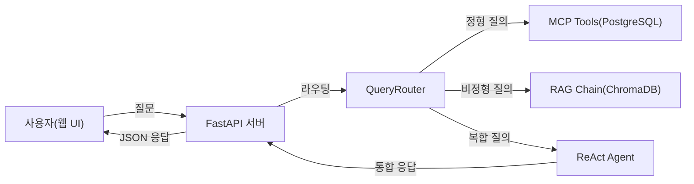

# CH01 집필 명세 -- 이 책의 목표와 최종 완성본 미리보기

## 1. 챕터 섹션 구조

- ## 1. 이 책이 다루는 범위
  - RAG + MCP 조합의 위치 설명
  - Fine-tuning vs RAG 비교표 (비용, 데이터 요구량, 업데이트 주기, 적합 상황)
- ## 2. 최종 결과물 데모 시나리오
  - 정형 질문 예시: "김철수 사원의 남은 연차는?"
  - 비정형 질문 예시: "신입사원 온보딩 절차를 알려줘"
  - 복합 질문 예시: "올해 매출 상위 부서의 복지 정책을 비교해줘"
- ## 3. 아키텍처 한 장 요약
  - 전체 시스템 Mermaid 다이어그램 (plan.md 그림 0-1 재활용)
  - 각 구성 요소 역할 1줄 설명
- ## 4. 사용 기술 스택
  - 기술별 역할 + 메모리 요구사항 표
  - 최소/권장 하드웨어 스펙
- ## 5. 이 책을 마치면 할 수 있는 것
  - 3가지 핵심 역량 (RAG 구축, MCP 통합, 운영 배포)
  - 챕터별 빌드업 로드맵 요약

## 2. 코드-섹션 매핑

| 섹션 | 파일 | 코드 범위 |
|------|------|---------|
| (코드 없음) | - | - |

## 3. 개념 설명 힌트 (Why)

- RAG를 선택하는 이유: Fine-tuning 대비 데이터 업데이트가 즉시 반영 가능, 학습 비용 없음
- MCP를 도입하는 이유: 정형 데이터(DB)와 비정형 데이터(문서)를 하나의 에이전트에서 통합 처리

## 4. 핵심 용어

- RAG (Retrieval-Augmented Generation): 외부 지식을 검색하여 LLM 응답을 보강하는 기법
- MCP (Model Context Protocol): LLM이 외부 도구/데이터 소스에 접근하는 표준 프로토콜
- 환각 (Hallucination): LLM이 사실이 아닌 내용을 그럴듯하게 생성하는 현상
- 임베딩 (Embedding): 텍스트를 수치 벡터로 변환하여 의미적 유사도를 계산 가능하게 하는 기법
- VectorDB: 벡터 임베딩을 저장하고 유사도 기반 검색을 수행하는 데이터베이스

## 5. Mermaid 다이어그램 초안

## 6. 챕터 연결

- 이전 챕터에서 이어받는 개념: (없음 -- 첫 챕터)
- 다음 챕터로 넘기는 개념: 전체 아키텍처 이해, 기술 스택 인지 -> CH02에서 환경 구축
