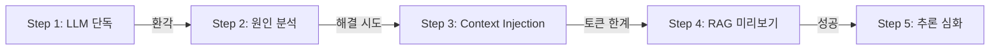

# CH03 집필 명세 -- LLM의 한계와 RAG의 필요성

> legacy 참조: v1 CH03 (동일 구조 계승)

## 1. 챕터 섹션 구조

- ## 1. [실패] LLM 단독 질의
  - DeepSeek R1에 사내 정보 질문 ("김철수 사원의 남은 연차는?")
  - 환각 체험: 그럴듯하지만 틀린 답변 확인
  - 01_llm_only.py 실행 및 결과 분석
- ## 2. 왜 LLM은 환각을 일으키는가
  - 학습 데이터 컷오프 문제
  - 사내 비공개 정보 부재
  - 파라메트릭 지식 vs 컨텍스트 지식
- ## 3. [임시 해결] Context Injection 맛보기
  - 프롬프트에 문서 직접 붙여넣기
  - 토큰 한계 체감 (문서 3개만 넣어도 컨텍스트 초과)
  - 02_context_injection.py 실행
- ## 4. [성공] RAG 미리보기
  - 인메모리 ChromaDB로 검색+답변
  - 청킹 유무 비교 (청킹 없이 전체 문서 vs 500자 청크)
  - 03_rag_preview.py 실행
- ## 5. [심화] DeepSeek R1 추론 능력 확인
  - RAG + 계산/추론 질문 ("올해 1분기 매출 합계는?")
  - 04_rag_reasoning.py 실행
- ## 6. 정리: 4단계 비교 요약 + 다음 장 예고
  - 4단계 결과 비교표 (정확도, 출처, 한계)
  - "이제 제대로 된 시스템을 만들어 보자"

## 2. 코드-섹션 매핑

| 섹션 | 파일 | 코드 범위 |
|------|------|---------|
| 1. LLM 단독 질의 | `src/01_llm_only.py` | 전체 |
| 3. Context Injection | `src/02_context_injection.py` | 전체 |
| 4. RAG 미리보기 | `src/03_rag_preview.py` | 전체 |
| 5. 추론 능력 확인 | `src/04_rag_reasoning.py` | 전체 |

## 3. 개념 설명 힌트 (Why)

- LLM 단독 실행을 먼저 보여주는 이유: "안 되는 것"을 체감해야 "왜 RAG가 필요한지" 동기가 생김
- Context Injection을 중간에 넣는 이유: RAG 없이도 맥락을 줄 수 있지만 토큰 한계가 있음을 보여줌
- 인메모리 ChromaDB를 사용하는 이유: 이 챕터는 "체험"이 목적이므로 영속화 없이 가볍게 실행

## 4. 핵심 용어

- 환각 (Hallucination): LLM이 사실이 아닌 내용을 생성하는 현상
- Context Injection: 프롬프트에 외부 정보를 직접 삽입하는 기법
- 토큰 (Token): LLM이 텍스트를 처리하는 최소 단위
- 청킹 (Chunking): 긴 문서를 작은 단위로 나누는 과정
- 인메모리 (In-memory): 디스크 저장 없이 메모리에서만 동작

## 5. Mermaid 다이어그램 초안

## 6. 챕터 연결

- 이전 챕터에서 이어받는 개념: CH02의 Ollama 환경, LLM Provider 구조
- 다음 챕터로 넘기는 개념: RAG 필요성 체감, 청킹 개념 -> CH04에서 기본 시스템 구축, CH06에서 본격 VectorDB 구축
