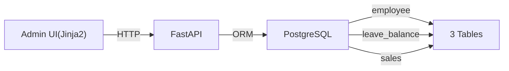

# CH04 집필 명세 -- FastAPI로 초간단 사내 시스템 만들기

## 1. 챕터 섹션 구조

- ## 1. 프로젝트 구성
  - 폴더 구조 설명 (app/, templates/, data/, static/)
  - .env 설정
  - 실행 방법 (`uvicorn app.main:app --reload`)
- ## 2. 데이터 모델 설계
  - 3테이블: employee, leave_balance, sales
  - ERD 다이어그램
  - schema.sql + seed_data.sql
- ## 3. CRUD API 구현
  - 직원 CRUD (/api/employees)
  - 휴가 잔여 조회/변경 (/api/leaves)
  - 매출 CRUD (/api/sales)
  - Pydantic 스키마 설계
- ## 4. 관리자 Admin UI
  - **base.html 베이스 레이아웃** (공통 헤더, 사이드바, 푸터 — CH07/CH08에서 계승)
  - Jinja2 템플릿 기반 웹 UI
  - 직원 목록/등록/수정
  - 매출 현황 대시보드
  - 정리 및 다음 장 예고

> **웹 UI 통일**: CH04에서 만든 `base.html` + `static/css/style.css`를 CH07(채팅 UI), CH08(통합 에이전트 UI)에서 그대로 계승/확장한다.

## 2. 코드-섹션 매핑

| 섹션 | 파일 | 코드 범위 |
|------|------|---------|
| 1. 프로젝트 구성 | `app/main.py` | FastAPI 앱 초기화 |
| 2. 데이터 모델 | `app/models.py`, `data/schema.sql` | 전체 |
| 3. CRUD API | `app/crud.py`, `app/schemas.py` | 전체 |
| 4. Admin UI | `templates/*.html`, `app/views.py` | 전체 |

## 3. 개념 설명 힌트 (Why)

- FastAPI를 선택하는 이유: async 지원, 자동 API 문서(Swagger), Pydantic 통합, LangChain과의 호환성
- PostgreSQL을 사용하는 이유: MCP를 통한 SQL 질의 대상이 되므로, 실무에서 가장 보편적인 RDBMS
- Jinja2 템플릿을 사용하는 이유: 별도 프론트엔드 프레임워크 없이 간결하게 UI 구현
- 3테이블 구조인 이유: 정형 데이터(DB)와 비정형 데이터(문서)를 CH08에서 통합할 때 현실적인 시나리오 제공

## 4. 핵심 용어

- FastAPI: Python 기반 고성능 비동기 웹 프레임워크
- CRUD: Create, Read, Update, Delete -- 데이터 기본 조작
- Pydantic: 데이터 검증 및 직렬화 라이브러리
- Jinja2: Python 템플릿 엔진
- ORM: Object-Relational Mapping (SQLAlchemy 활용)

## 5. Mermaid 다이어그램 초안

## 6. 챕터 연결

- 이전 챕터에서 이어받는 개념: CH02의 PostgreSQL 환경, Python 가상환경
- 다음 챕터로 넘기는 개념: PostgreSQL DB (employee/leave/sales) -> CH08에서 MCP 도구로 연결
