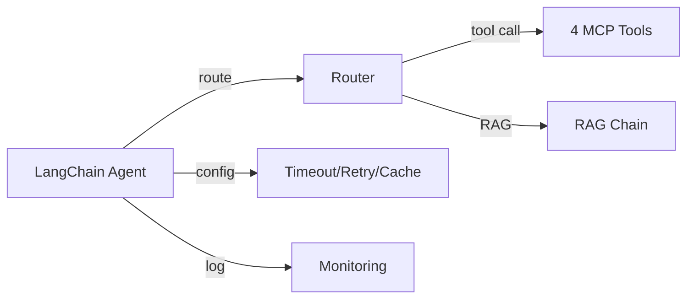

# CH09 집필 명세 -- LangChain으로 연결 전략 세팅

> legacy 참조: `legacy/ex03/` (Router/Agent + Tools + 운영 설정)

## 1. 챕터 섹션 구조

- ## 1. 기본 구성 3종 세트
  - Router/Agent: 질문 라우팅 + 실행 조율
  - RAG Chain: 문서 검색 + 답변 생성
  - MCP Tools: 외부 도구 연결
  - 3종 세트가 어떻게 결합되는지 아키텍처 설명
- ## 2. Router 전략
  - 문서 검색 판단 로직
  - DB 조회 판단 로직
  - 실행 순서 결정 (직렬 vs 병렬)
  - 최종 응답 조합
- ## 3. MCP Tool 설계
  - @tool 데코레이터 기반 4개 도구 정의
  - leave_balance: 휴가 잔여 조회
  - sales_sum: 매출 합계 조회
  - list_employees: 직원 목록 조회
  - search_documents: 문서 검색
  - 도구 스키마 정의 및 LLM에 전달하는 구조
- ## 4. 운영 설정
  - Timeout/Retry 설정
  - 로깅 (구조화된 로그 포맷)
  - 캐싱 (응답 캐시, 임베딩 캐시)
  - 비용 관리 (토큰 사용량 추적)
  - Langfuse 간략 소개 (LLM 모니터링 도구)
- ## 5. 정리 및 다음 장 예고

## 2. 코드-섹션 매핑

| 섹션 | 파일 | 코드 범위 |
|------|------|---------|
| 1-2. Agent 구성 | `src/agent_config.py` | 전체 |
| 3. MCP Tool | `src/tools/leave_balance.py` | 전체 |
| 3. MCP Tool | `src/tools/sales_sum.py` | 전체 |
| 3. MCP Tool | `src/tools/list_employees.py` | 전체 |
| 3. MCP Tool | `src/tools/search_documents.py` | 전체 |
| 4. 운영 설정 | `src/monitoring.py` | 전체 |
| 4. 운영 설정 | `src/cache.py` | 전체 |

## 3. 개념 설명 힌트 (Why)

- CH08과 별도 챕터로 분리하는 이유: CH08은 "통합 에이전트의 원리"에 집중, CH09는 "LangChain 표준 구성과 운영"에 집중
- 4개 도구로 한정하는 이유: 실무에서 가장 빈번한 패턴을 커버, 독자가 패턴을 익힌 후 스스로 확장 가능
- 운영 설정을 이 챕터에 포함하는 이유: 도구를 만든 직후 운영 관점을 함께 익혀야 프로덕션 전환이 수월
- Langfuse를 간략히 소개하는 이유: LLM 특화 모니터링의 존재를 알리되, 책의 범위를 넘지 않도록 깊이 조절

## 4. 핵심 용어

- @tool: LangChain에서 에이전트가 사용할 도구를 정의하는 데코레이터
- Agent Config: 에이전트의 동작 방식을 설정하는 구성 파일
- Timeout: 응답 대기 최대 시간
- Retry: 실패 시 자동 재시도 로직
- Cache: 동일 요청에 대한 응답을 저장하여 재사용하는 메커니즘
- Langfuse: LLM 애플리케이션을 위한 오픈소스 모니터링/관측 도구

## 5. Mermaid 다이어그램 초안

## 6. 챕터 연결

- 이전 챕터에서 이어받는 개념: CH08의 통합 에이전트 구조 (router, agent, mcp_tools)
- 다음 챕터로 넘기는 개념: 표준화된 LangChain Agent 구성 -> CH10에서 RAG 부분 튜닝, CH11에서 배포
