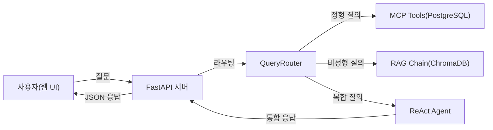
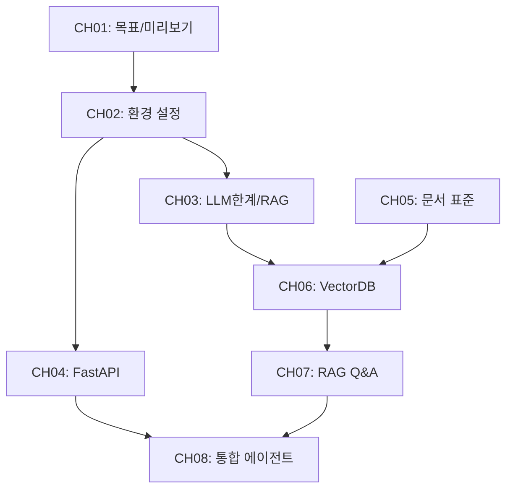
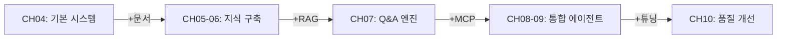

# plan.md -- 사내 문서 기반 AI 업무 비서 (RAG + MCP) v3

> 생성일: 2026-02-26
> 상태: 1차 초안

---

## Section 1: 설계서 (Design Document)

### 1.1 독자 페르소나

| 항목 | 내용 |
|------|------|
| 대상 독자 | 초급~중급 Python 개발자 (기본 문법, 패키지 설치 가능 수준) |
| 사전 지식 | Python 기초, REST API 개념, SQL 기초, 터미널 사용 |
| 불필요 사전 지식 | ML/DL 이론, 벡터 수학, LangChain 경험 |
| 학습 목적 | 사내 문서 기반 RAG + MCP 통합 AI 비서를 직접 구축 |
| 학습 환경 | macOS / Linux / Windows(WSL2), RAM 16GB+, 저장공간 20GB+ |
| 완독 후 성과물 | "커넥트HR AI 비서" 완성 -- 정형/비정형 통합 질의응답 시스템 |

### 1.2 집필 컨셉

| 항목 | 값 |
|------|-----|
| writing_concept | `project-buildup` |
| 설명 | 챕터마다 "커넥트HR AI 비서" 프로젝트에 기능을 하나씩 쌓아가는 단일 프로젝트 빌드업 구조 |
| 챕터 간 관계 | 이전 챕터의 output이 다음 챕터의 input (data/ 폴더로 계승) |
| 각 챕터 독립성 | 각 챕터 예제는 독립 실행 가능 (필요 데이터 내장) |
| code_workflow_style | `narrative` |
| 코드 워크플로우 설명 | 코드 블록 아래에 `> **동작 요약:**` 형식의 서술형 한 문단으로 동작을 설명 |

### 1.3 챕터별 학습 목표

| CH | 제목 | 학습 목표 | 달성 기준 |
|----|------|---------|---------|
| 01 | 이 책의 목표와 최종 완성본 미리보기 | 최종 결과물의 전체 아키텍처와 RAG/MCP 개념을 이해한다 | 아키텍처 다이어그램을 보고 각 구성 요소의 역할을 설명할 수 있다 |
| 02 | 개발 환경 설정 | Ollama, PostgreSQL, Python 환경을 구축하고 LLM Provider 전환 구조를 이해한다 | 환경 검증 스크립트가 전항목 PASS |
| 03 | LLM의 한계와 RAG의 필요성 | LLM 환각 문제를 직접 체험하고 RAG가 해결책임을 체감한다 | 4단계 실습(실패->임시해결->성공->심화) 완료 |
| 04 | FastAPI로 초간단 사내 시스템 만들기 | FastAPI + PostgreSQL 기반 CRUD 시스템을 구축한다 | 직원/휴가/매출 CRUD API + Admin UI 정상 동작 |
| 05 | 사내 문서 수집 전략과 문서 표준 만들기 | 문서 품질이 RAG 성능의 핵심임을 이해하고 표준화 파이프라인을 만든다 | 문서 수집/분류/표준화 검증 도구 실행 완료 |
| 06 | VectorDB 구축 | Python파싱→LLM파싱→임베딩→VectorDB 구축, CLI로 근거+캡처본 검증 | CLI 검색에서 관련 근거 문구 + 캡처본 경로 출력 확인 |
| 07 | RAG로 Q&A 엔진 만들기 | LCEL 기반 RAG 체인 + 웹 채팅 UI(Fetch) + 멀티턴 대화를 완성한다 | 웹 채팅 UI에서 출처 포함 답변 확인 + 멀티턴 대화 동작 |
| 08 | 정형 MCP + 비정형 RAG 통합 에이전트 | LLM이 질문 유형을 판단하여 DB조회/문서검색을 조합하는 에이전트를 만든다 | 10개 대표 시나리오(정형4/비정형4/복합2) 전부 정상 응답 |
| 09 | LangChain으로 연결 전략 세팅 | Router/Agent + RAG Chain + MCP Tools 표준 구성을 확립한다 | 4개 MCP Tool 정상 동작 + 운영 설정(Timeout/Retry/캐싱) 적용 |
| 10 | RAG 튜닝 | 실전 문제별 튜닝 기법을 적용하여 RAG 품질을 측정 가능하게 개선한다 | before/after 비교 + 평가 점수 개선 확인 |

### 1.4 기술 스택 (버전 명세)

| 영역 | 기술 | 버전 | 용도 | 메모리 |
|------|------|------|------|--------|
| 런타임 | Python | 3.10+ | 전체 실행 환경 | - |
| 텍스트 LLM | Ollama + DeepSeek R1 | Ollama 0.5+, deepseek-r1:8b | 질의응답 (런타임) | 8-16GB |
| Vision LLM | Ollama + LLaVA | llava:13b | 이미지 캡션 (인덱싱) | 4-8GB |
| OCR | EasyOCR | 1.7+ | 이미지 텍스트 추출 | 1-2GB |
| 백엔드 | FastAPI | 0.115+ | 웹 서버 | 1GB |
| 템플릿 | Jinja2 | 3.1+ | Admin UI / 채팅 UI | - |
| 정형 DB | PostgreSQL | 16+ | 직원/휴가/매출 데이터 | 1GB |
| 벡터 DB | ChromaDB | 0.5+ | 문서 임베딩 저장/검색 | 1GB |
| 오케스트레이션 | LangChain | 0.3+ | RAG Chain + Agent | 1GB |
| 도구 연동 | MCP (mcp-python-sdk) | 1.0+ | LLM - DB/도구 연결 | - |
| 임베딩 | sentence-transformers (ko-sroberta-multitask) | 3.0+ | 텍스트 벡터화 | 1GB |
| 문서 파싱 | pypdf, python-docx, openpyxl | 최신 | PDF/DOCX/XLSX -> 텍스트 | - |
| 컨테이너 | Docker + Docker Compose | 24+ | 배포 | - |
| 리랭커 | sentence-transformers (cross-encoder) | 3.0+ | 검색 결과 재정렬 | 1GB |

### 1.5 LLM Provider 전환 설계

```
# .env 기본 설정 (Ollama 로컬)
LLM_PROVIDER=ollama
OLLAMA_BASE_URL=http://localhost:11434
OLLAMA_MODEL=deepseek-r1:8b

# 대안 1: OpenAI
# LLM_PROVIDER=openai
# OPENAI_API_KEY=sk-...
# OPENAI_MODEL=gpt-4o-mini

# 대안 2: vLLM 자체 호스팅
# LLM_PROVIDER=vllm
# VLLM_BASE_URL=http://localhost:8000
# VLLM_MODEL=deepseek-r1
```

CH02에서 이 전환 구조를 상세히 다루며, 이후 모든 챕터의 코드는 `LLM_PROVIDER` 환경 변수에 따라 자동 전환되도록 설계한다.

### 1.6 웹 UI 통일 규칙

모든 웹 UI는 **`legacy/ex02`의 디자인 시스템을 베이스**로 사용한다.

#### 베이스 UI (legacy/ex02)

| 항목 | 값 |
|------|-----|
| 템플릿 엔진 | Jinja2 |
| 베이스 레이아웃 | `templates/base.html` — 좌측 사이드바(240px) + 메인 콘텐츠 |
| CSS | `static/css/admin.css` (전역) + `static/css/qa.css` (채팅 전용) |
| JS | `static/js/qa.js` (Fetch 기반 Q&A, 에이전트 토글, 근거 아코디언) |
| 폰트 | Inter (Google Fonts) |
| 색상 | 미니멀 검정/흰색 + 금색(#d4af37) 강조, CSS 변수 기반 |
| 채팅 스타일 | Gemini 스타일 (사용자=파랑 우측, AI=회색 좌측, 🤖 아바타) |

#### 베이스 UI 화면 목록 (ex02에서 계승)

| 화면 | 파일 | 역할 |
|------|------|------|
| 대시보드 | `dashboard.html` | 직원/휴가/매출 통계 카드 + 최근 매출 |
| Q&A 채팅 | `qa.html` + `qa.css` + `qa.js` | 하이브리드 검색 + 에이전트 토글 + 근거 아코디언 |
| 직원 관리 | `employees.html` | CRUD (등록/수정/삭제/검색) |
| 휴가 관리 | `leaves.html` | 사용 등록/수정/현황 조회 |
| 매출 관리 | `sales.html` | 입력/기간별/부서별 조회 |
| 인제스트 | `ingest.html` | 문서 업로드(드래그앤드롭) + MD변환 + 벡터 임베딩 |

#### 챕터별 UI 확장 흐름

- **CH04**: ex02의 `base.html` + `admin.css` + Admin CRUD 페이지 (직원/휴가/매출) 그대로 사용
- **CH07**: ex02의 `qa.html` + `qa.css` + `qa.js` 기반으로 Fetch 기반 채팅 + 멀티턴 추가
- **CH08**: CH07 채팅 UI 확장 — 에이전트 모드 토글, 정형/비정형/복합 질문 유형 표시, 근거 아코디언

> **원칙**: ex02의 UI를 그대로 계승/확장한다. 별도 프론트엔드 프레임워크 없이 Jinja2 + Vanilla JS + 커스텀 CSS로 통일.

### 1.7 사전 실습 체크리스트

- [ ] Python 3.10+ 설치 확인 (`python --version`)
- [ ] Docker Desktop 설치 및 실행 확인 (`docker --version`)
- [ ] RAM 16GB 이상 확인
- [ ] 저장 공간 20GB 이상 여유 확인
- [ ] 터미널(zsh/bash) 기본 조작 가능
- [ ] Git 설치 확인 (`git --version`)

---

## Section 2: 아키텍처 및 다이어그램

### 2.1 전체 시스템 아키텍처



*그림 0-1: 커넥트HR AI 비서 전체 아키텍처*

### 2.2 챕터별 핵심 개념 - 코드 모듈 매핑

| CH | 핵심 개념 | 주요 코드 모듈 | 산출물 |
|----|---------|-------------|-------|
| 01 | RAG/MCP 개념, 아키텍처 | (코드 없음) | 아키텍처 이해 |
| 02 | 환경 설정, LLM Provider 전환 | `verify_env.py`, `llm_provider.py` | 검증된 개발 환경 |
| 03 | LLM 환각, Context Injection, RAG 미리보기 | `01_llm_only.py` ~ `04_rag_reasoning.py` | RAG 필요성 체감 |
| 04 | FastAPI CRUD, 데이터 모델 | `main.py`, `models.py`, `crud.py`, `templates/` | 기본 사내 시스템 |
| 05 | 문서 수집, 표준화, 메타데이터 | `collector.py`, `validator.py` | 표준화된 문서 세트 |
| 06 | Python파싱, LLM파싱(Vision), 청킹, 임베딩, CLI검증 | `extractor.py`, `vision_extractor.py`, `chunker.py`, `store.py`, `cli_search.py` | ChromaDB 인덱스 + CLI 검증 |
| 07 | LCEL RAG Chain, Fetch 채팅 UI, 멀티턴 | `rag_chain.py`, `chat_api.py`, `templates/chat.html` | 웹 채팅 UI |
| 08 | QueryRouter, ReAct Agent, MCP | `router.py`, `agent.py`, `mcp_tools.py` | 통합 에이전트 |
| 09 | LangChain Agent, MCP Tool 4종, 운영 설정 | `agent_config.py`, `tools/*.py`, `monitoring.py` | 표준 연결 구성 |
| 10 | 청크 튜닝, ReRanker, Hybrid Search, 평가 | `tuning/*.py`, `eval_framework.py` | 튜닝 프레임워크 |

### 2.3 시스템/모듈 의존성 그래프



*그림 0-2: 챕터 의존성 그래프 (순방향만, 순환 없음)*

참고: CH08 이후의 의존성

- CH08 --> CH09 (LangChain 표준화)
- CH06 --> CH10 (튜닝 대상 VectorDB)

### 2.4 프로젝트 빌드업 실행 흐름



*그림 0-3: 프로젝트 빌드업 흐름 -- 챕터마다 기능이 누적된다*

---

## Section 3: 환경 명세 및 예외 계획

### 3.1 필수 환경 변수 (.env)

| 변수 | 기본값 | 사용 시점 | 설명 |
|------|--------|---------|------|
| `LLM_PROVIDER` | `ollama` | CH02~ | LLM 제공자 선택 (ollama/openai/vllm) |
| `OLLAMA_BASE_URL` | `http://localhost:11434` | CH02~ | Ollama 서버 주소 |
| `OLLAMA_MODEL` | `deepseek-r1:8b` | CH02~ | 사용할 Ollama 모델 |
| `OPENAI_API_KEY` | (비어있음) | 선택 | OpenAI 사용 시 API 키 |
| `OPENAI_MODEL` | `gpt-4o-mini` | 선택 | OpenAI 사용 시 모델 |
| `POSTGRES_HOST` | `localhost` | CH04~ | PostgreSQL 호스트 |
| `POSTGRES_PORT` | `5432` | CH04~ | PostgreSQL 포트 |
| `POSTGRES_DB` | `metacoding_db` | CH04~ | 데이터베이스 이름 |
| `POSTGRES_USER` | `metacoding` | CH04~ | DB 사용자 |
| `POSTGRES_PASSWORD` | `metacoding_pass` | CH04~ | DB 비밀번호 |
| `CHROMA_PERSIST_DIR` | `./data/chroma_db` | CH06~ | ChromaDB 저장 경로 |
| `EMBEDDING_MODEL` | `jhgan/ko-sroberta-multitask` | CH06~ | 임베딩 모델 |
| `FASTAPI_HOST` | `0.0.0.0` | CH04~ | 서버 바인딩 주소 |
| `FASTAPI_PORT` | `8000` | CH04~ | 서버 포트 |

### 3.2 외부 API/서비스 목록

| 서비스 | 무료/유료 | 필수 여부 | 대안 |
|--------|---------|---------|------|
| Ollama (로컬) | 무료 | 필수 | OpenAI API (유료), vLLM (무료) |
| PostgreSQL (Docker) | 무료 | 필수 | 없음 (Docker 필수) |
| ChromaDB (로컬) | 무료 | 필수 | FAISS (대안) |
| HuggingFace 모델 다운로드 | 무료 | 필수 (최초 1회) | 로컬 캐시 후 오프라인 가능 |
| OpenAI API | 유료 | 선택 | Ollama 로컬 (기본) |

### 3.3 지원 OS 및 주의사항

| OS | 지원 수준 | 주의사항 |
|----|---------|---------|
| macOS (Apple Silicon) | 1순위 | Ollama 네이티브 지원, Docker Desktop 필요 |
| macOS (Intel) | 1순위 | LLM 추론 속도 느림 (GPU 없음) |
| Ubuntu 22.04+ | 1순위 | NVIDIA GPU 있으면 최적 성능 |
| Windows (WSL2) | 2순위 | WSL2 + Docker Desktop 필수, 경로 주의 |
| Windows (네이티브) | 미지원 | WSL2 사용 권장 |

### 3.4 주요 실패 시나리오 및 대응

| 시나리오 | 증상 | 대응 |
|---------|------|------|
| Ollama 미설치/미실행 | `ConnectionRefusedError` | CH02 환경 검증 스크립트에서 사전 탐지 |
| RAM 부족 (16GB 미만) | 모델 로드 실패, OOM | 더 작은 모델(deepseek-r1:1.5b) 안내 |
| PostgreSQL 미실행 | DB 연결 실패 | Docker 기반 설치 가이드 제공 |
| 임베딩 모델 다운로드 실패 | 네트워크 오류 | 오프라인 설치 가이드 + 미러 URL |
| ChromaDB 저장 경로 권한 없음 | `PermissionError` | 경로 변경 가이드 |
| LLM 응답 지연 (30초+) | 타임아웃 | Timeout 설정 안내, 작은 모델 전환 |
| PDF 파싱 실패 (이미지 PDF) | 빈 텍스트 | Vision LLM + OCR 하이브리드 (CH10) |

---

## Section 4: 분량 및 구성 계획

### 4.1 PART-챕터 배분표

```
[PART 0. 시작하기]
  CH01  이 책의 목표와 최종 완성본 미리보기     5p   (이론 100%)
  CH02  개발 환경 설정                          7p   (이론 30% / 실습 70%)

[기초]
  CH03  LLM의 한계와 RAG의 필요성               8p   (이론 40% / 실습 60%)

[PART 1. 기반 구축]
  CH04  FastAPI로 초간단 사내 시스템 만들기       10p  (이론 20% / 실습 80%)
  CH05  사내 문서 수집 전략과 문서 표준 만들기     7p   (이론 50% / 실습 50%)

[PART 2. 핵심 구현]
  CH06  VectorDB 구축                          12p  (이론 20% / 실습 80%)
  CH07  RAG로 Q&A 엔진 만들기                   12p  (이론 20% / 실습 80%)

[PART 3. 통합]
  CH08  정형 MCP + 비정형 RAG 통합 에이전트       12p  (이론 20% / 실습 80%)
  CH09  LangChain으로 연결 전략 세팅              10p  (이론 20% / 실습 80%)

[PART 4. 고도화]
  CH10  RAG 튜닝                                12p  (이론 30% / 실습 70%)

합계:                                           95p
```

### 4.2 챕터별 상세 분량

| CH | 제목 | 분량 | 이론:실습 | 코드 | data |
|----|------|------|---------|------|------|
| 01 | 이 책의 목표와 최종 완성본 미리보기 | 5p | 100:0 | 없음 | 없음 |
| 02 | 개발 환경 설정 | 7p | 30:70 | 환경 검증 스크립트 | 없음 |
| 03 | LLM의 한계와 RAG의 필요성 | 8p | 40:60 | 4개 스크립트 | 인메모리 샘플 |
| 04 | FastAPI로 초간단 사내 시스템 만들기 | 10p | 20:80 | FastAPI CRUD | schema.sql + seed |
| 05 | 사내 문서 수집 전략과 문서 표준 만들기 | 7p | 50:50 | 경량 스크립트 | legacy 실무 문서 |
| 06 | VectorDB 구축 | 12p | 20:80 | Python파싱+LLM파싱+임베딩+CLI검증 | CH05 문서 계승 |
| 07 | RAG로 Q&A 엔진 만들기 | 12p | 20:80 | RAG Chain + 웹 UI | CH06 벡터DB 계승 |
| 08 | 정형 MCP + 비정형 RAG 통합 에이전트 | 12p | 20:80 | 통합 에이전트 | CH04 DB + CH06 벡터 |
| 09 | LangChain으로 연결 전략 세팅 | 10p | 20:80 | Agent + Tools | CH08 기반 확장 |
| 10 | RAG 튜닝 | 12p | 30:70 | 튜닝 프레임워크 | CH06 벡터DB + 테스트셋 |
| **합계** | | **95p** | | | |

### 4.3 부록

| 부록 | 내용 | 비고 |
|------|------|------|
| A | 예제 문서 세트 (휴가 규정, 온보딩 가이드, 보안 정책 샘플) | 본문 분량 외 |
| B | 테스트 질문 30선 (정형 10 + 비정형 10 + 복합 10) | 본문 분량 외 |
| C | 코드 전체 구조 | 본문 분량 외 |
| D | 참고 자료 (LangChain, ChromaDB, Ollama 공식 문서) | 본문 분량 외 |

### 4.4 legacy 참조 매핑

| CH (v3) | legacy 경로 | 참조 내용 |
|---------|------------|---------|
| CH03 | v1 CH03 (동일 구조) | 4단계 체험 실습 구조 계승 |
| CH06 | `legacy/ex01-1/` | 문서 파싱, 청킹, VectorDB 저장 스크립트 |
| CH08 | `legacy/ex02/` | 하이브리드 RAG + MCP + 웹 UI |
| CH09 | `legacy/ex03/` | Router/Agent + Tools + 운영 설정 |

### 4.5 갭 분석 반영 사항

| 갭 항목 | 반영 위치 | 반영 방식 |
|---------|---------|---------|
| Guardrails / 안전 장치 설계 | (삭제됨 — CH11 제거) | - |
| LLM Provider 전환 설계 | CH02 (개발 환경 설정) | 0.5.7 LLM Provider 전환 구조 섹션 추가 |
| ~~SSE Streaming 응답~~ | ~~CH07~~ | 삭제 — Fetch 방식으로 단순화 |
| 대화 히스토리 / 멀티턴 | CH07 (RAG Q&A 엔진) | 7.5 멀티턴 대화 관리 섹션 추가 |
| Observability 간략 언급 | CH09 (LangChain 연결) | 9.4 운영 설정에서 Langfuse 간략 소개 |
| GraphRAG 소개 | CH10 (RAG 튜닝) | 10.11 말미에 "다음 단계" 한 문단 |
| Fine-tuning vs RAG 비교 | CH01 (목표/미리보기) | 0.1 범위 설명에 비교표 1개 추가 |

---

## 기획 검증 체크리스트

- [x] 총 분량이 100페이지 이하인가? (95p)
- [x] 기술 스택 간 버전 호환성 충돌이 없는가? (Python 3.10+, LangChain 0.3+, ChromaDB 0.5+ 호환 확인)
- [x] 챕터 간 순환 의존성이 없는가? (의존성 그래프 확인: 순방향만 존재)
- [x] 독자 수준 대비 난이도가 급격히 상승하는 구간이 없는가? (CH03 기초 -> CH04-05 기반 -> CH06-07 핵심 -> CH08-09 통합 -> CH10 고도화 순차 상승)
- [x] 모든 외부 API가 무료 또는 대체 가능한가? (Ollama 무료, OpenAI는 선택사항)
- [x] LLM Provider가 .env를 통해 전환 가능하게 설계되었는가? (1.5절 참조)
