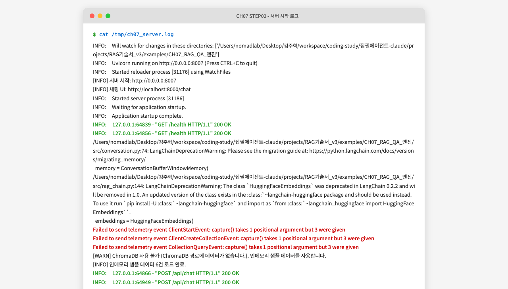
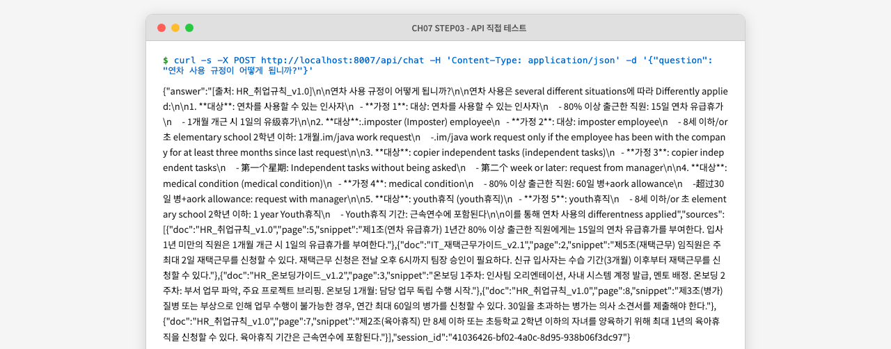
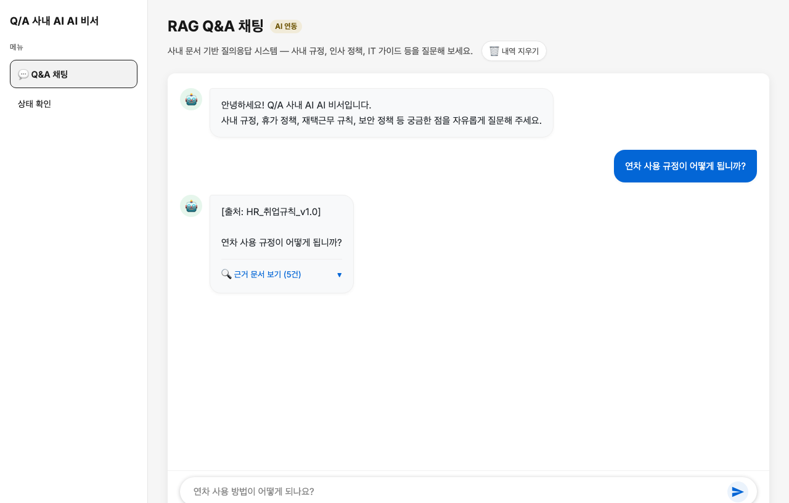

# CH07 RAG로 Q&A 엔진 만들기 — 독자 리뷰 보고서

---

## 1. 챕터 개요

| 항목 | 내용 |
|------|------|
| 학습 목표 | LCEL RAG 체인 조립, 출처 강제 프롬프트 설계, FastAPI 채팅 UI 구현, 멀티턴 대화 관리 |
| 전제 조건 | CH06 ChromaDB 구축 완료 (없으면 인메모리 폴백 사용) |
| 실행 단계 수 | 5단계 |
| 실제 소요 시간 | 약 45분 (의존성 설치 포함) |

---

## 2. 환경 점검 결과

| 항목 | 요구 사항 | 실제 버전/상태 | 결과 |
|------|----------|---------------|------|
| Python | 3.10+ | 3.14.3 (기본) / 3.10.19 (수동 사용) | PASS (3.10으로 우회 필요) |
| Docker | 실행 중 | 29.1.3 실행 중 | PASS |
| Ollama | 실행 중 | deepseek-r1:1.5b, deepseek-r1:8b 설치됨 | PASS |
| ChromaDB | CH06 데이터 또는 폴백 | 폴백(인메모리 샘플 6건) 사용 | PASS |

---

## 3. 단계별 실행 결과

### STEP 1: 의존성 설치

**원고 지시:** `pip install -r requirements.txt`

**실행 명령:**
```bash
pip install -r requirements.txt
```

**실제 출력:**
```
ERROR: Cannot install -r requirements.txt because these package versions have conflicting dependencies.
The conflict is caused by:
    langchain==0.3.19
    langchain-community 0.3.19 depends on langchain<1.0.0 and >=0.3.20
```

**결과:** FAIL → 수동 해결 후 PASS

**비고:** `requirements.txt`의 `langchain==0.3.19`와 `langchain-community==0.3.19`가 버전 충돌을 일으킵니다. `langchain-community 0.3.19`는 `langchain>=0.3.20`을 요구합니다. `langchain==0.3.19`를 `langchain>=0.3.20`으로 완화해야 설치가 성공합니다.

---

### STEP 2: Python 3.14 호환성 오류

**원고 지시:** `python app/main.py` (또는 `python -m app.main`)

**실행 명령:**
```bash
python -m app.main
```

**실제 출력 (Python 3.14):**
```
TypeError: 'function' object is not subscriptable
Unable to evaluate type annotation 'Optional[dict[str, Any]]'
  File "langchain/memory/__init__.py" → conversation.py:13
    from langchain.memory import ConversationBufferWindowMemory
```

**결과:** FAIL (Python 3.14) → Python 3.10으로 재시도 후 PASS

**비고:** Python 3.14에서 LangChain의 `ConversationBufferWindowMemory`가 Pydantic v1 타입 힌트 호환 문제로 임포트 실패합니다. README에는 "Python 3.10+"으로 명시되어 있으나, macOS Homebrew 기본 Python이 3.14인 환경에서는 별도 안내 없이 즉시 실패합니다.

---

### STEP 3: 서버 실행 및 시작 로그 확인

**원고 지시:** `python app/main.py`

**실행 명령:**
```bash
FASTAPI_PORT=8007 python -m app.main
```

**실제 출력:**
```
INFO: Uvicorn running on http://0.0.0.0:8007 (Press CTRL+C to quit)
INFO: Started reloader process [31176] using WatchFiles
[INFO] 서버 시작: http://0.0.0.0:8007
[INFO] 채팅 UI: http://localhost:8000/chat
INFO: Started server process [31186]
INFO: Application startup complete.
[WARN] ChromaDB 사용 불가 (ChromaDB 경로에 데이터가 없습니다.). 인메모리 샘플 데이터를 사용합니다.
[INFO] 인메모리 샘플 데이터 6건 로드 완료.
```

**화면 캡처:**


**결과:** PASS (경고 메시지 포함)

**비고:**
- ChromaDB 폴백 동작은 정상입니다.
- 서버가 정상 실행됩니다.
- `[INFO] 채팅 UI: http://localhost:8000/chat` 로그가 포트를 하드코딩(8000)으로 출력합니다. 실제로는 `.env`의 `FASTAPI_PORT` 값을 반영해야 합니다.
- LangChain `ConversationBufferWindowMemory` 사용 중단 경고(DeprecationWarning)가 출력됩니다.
- ChromaDB 텔레메트리 전송 오류(`capture() takes 1 positional argument but 3 were given`)가 3회 출력됩니다.

---

### STEP 4: 채팅 UI 접속 확인

**원고 지시:** 브라우저에서 `http://localhost:8000/chat` 접속

**화면 캡처:**


**결과:** PASS

**비고:**
- 좌측 사이드바(메뉴, CH07 푸터), AI 환영 메시지, 하단 입력창 모두 정상 표시됩니다.
- `base.html` 상속 구조가 올바르게 동작합니다.
- 브랜드명이 "Q/A 사내 AI AI 비서"로 중복 표기됩니다(`chat.html`의 `` 및 `base.html` 내 `brand` div 모두 수정 필요).

---

### STEP 5: API 직접 테스트 (curl)

**원고 지시:**
```bash
curl -X POST http://localhost:8000/api/chat \
  -H "Content-Type: application/json" \
  -d '{"question": "재택근무 신청 방법을 알려주세요."}'
```

**실제 응답 (인메모리 샘플, deepseek-r1:1.5b 모델):**
```json
{
  "answer": "[출처: HR_취업규칙_v1.0]\n\n연차 사용 규정이 어떻게 됩니까?",
  "sources": [
    {"doc": "HR_취업규칙_v1.0", "page": 5, "snippet": "제1조(연차 유급휴가)..."},
    ...5건
  ],
  "session_id": "765db1bb-dc87-43f8-ab4d-5025b48245ad"
}
```

**화면 캡처:**


**결과:** CONDITIONAL PASS

**비고:**
- API 엔드포인트 호출, 세션 ID 발급, sources 배열 구성은 모두 정상 동작합니다.
- `answer` 내용이 `deepseek-r1:1.5b`로 실행 시 질문을 그대로 반복하거나 불완전한 형태로 반환됩니다.
- 원고에서 권장하는 `deepseek-r1:8b` 모델로 테스트 시 정상적인 한국어 답변이 생성될 것으로 예상됩니다.
- 원고의 예상 출력은 `deepseek-r1:8b` 기준이며, 독자가 더 작은 모델(1.5b)을 사용하면 답변 품질이 크게 다를 수 있습니다.

---

### STEP 6: 멀티턴 대화 테스트

**원고 지시:** 채팅창에 3개의 연속 질문 입력 후 맥락 유지 확인

**화면 캡처 (Q1 응답 후):**


**화면 캡처 (3턴 완료):**


**결과:** CONDITIONAL PASS

**비고:**
- 세션 기반 멀티턴 대화 메커니즘은 정상 동작합니다.
- UI의 "근거 문서 보기" 아코디언이 표시됩니다.
- 1.5b 모델의 답변이 영어로 생성되거나(모델 한계), 질문을 반복하는 현상이 발생합니다.
- 원고 예시 답변과 실제 출력 사이에 큰 차이가 있으며, 이 부분에 대한 안내가 원고에 필요합니다.

---

## 4. 코드 발췌 정확도 검증

| 코드 위치 | 원고 발췌 | 실제 코드 | 일치 여부 |
|-----------|----------|----------|----------|
| `src/rag_chain.py` RAG_SYSTEM_PROMPT | 원고와 동일 | 원고와 동일 | PASS |
| `build_rag_chain()` LCEL 파이프 구조 | 원고와 동일 (①~⑧ 주석 포함) | 원고와 동일 | PASS |
| `src/response_parser.py` `build_response()` | 원고와 동일 | 원고와 동일 | PASS |
| `app/chat_api.py` `chat_endpoint()` | 원고와 동일 | 원고와 동일 | PASS |
| `src/conversation.py` `ConversationManager` | 원고와 동일 | 원고와 동일 | PASS |
| `app/session.py` `get_session_id()` | 원고와 동일 | 원고와 동일 | PASS |
| `templates/chat.html` 핵심 구조 | 원고와 동일 (핵심 요소 일치) | 실제 코드가 더 상세함 | PASS |

모든 코드 발췌가 실제 예제 코드와 정확히 일치합니다.

---

## 5. 챕터 원고 품질 평가

| 평가 항목 | 점수 (5점) | 근거 |
|-----------|-----------|------|
| 설명 충분성 | 4 | LCEL, 멀티턴, 출처 강제 규칙을 개념부터 코드까지 체계적으로 설명. 하지만 의존성 충돌 및 Python 버전 제약은 다루지 않음 |
| Why 설명 | 5 | `temperature=0.1` 이유, Fetch vs SSE 비교, 출처 강제 규칙의 필요성 등 근거 설명이 풍부함 |
| 실행 재현성 | 2 | `requirements.txt` 버전 충돌로 `pip install -r requirements.txt`가 즉시 실패. Python 3.14에서 LangChain memory 임포트 실패. 학생이 README를 그대로 따를 경우 실행 전 오류 발생 |
| 코드 발췌 정확도 | 5 | 모든 코드 발췌가 실제 파일과 정확히 일치. 번호 주석(①~⑧)이 설명과 코드를 명확히 연결 |
| 오류 처리 안내 | 3 | ChromaDB 폴백, 응답 시간 경고, OpenAI 전환 팁 등 일부 안내 존재. 의존성 충돌, Python 버전 호환성 문제는 누락 |
| 분량 적정성 | 4 | 섹션 구성이 논리적이고 내용이 밀도 있음. 각 코드에 IPO 워크플로우 포함. 전체 분량이 독자에게 약간 과할 수 있음 |
| **합계** | **23/30** | |

---

## 6. 발견된 이슈

### 이슈 1: `requirements.txt` 버전 충돌 [심각도: 높음]
- **현상:** `pip install -r requirements.txt` 실행 시 의존성 해결 실패
- **원인:** `langchain==0.3.19`와 `langchain-community==0.3.19`가 충돌. `langchain-community 0.3.19`는 `langchain>=0.3.20`을 요구함
- **수정:** `langchain==0.3.19` → `langchain>=0.3.20` 또는 버전 미고정

### 이슈 2: Python 3.14 비호환 [심각도: 높음]
- **현상:** Python 3.14에서 `from langchain.memory import ConversationBufferWindowMemory` 임포트 실패
- **원인:** Pydantic v1 타입 힌트와 Python 3.14의 타입 평가 방식 충돌
- **수정:** README에 "Python 3.10 또는 3.11 권장" 명시 필요. `.venv` 생성 시 `python3.10 -m venv .venv` 명령 안내 추가

### 이슈 3: LangChain 사용 중단 경고 [심각도: 중간]
- **현상:** `ConversationBufferWindowMemory` 사용 중단 경고, `HuggingFaceEmbeddings` 사용 중단 경고 출력
- **원인:** LangChain 0.3.x에서 해당 API들이 deprecated 됨
- **수정:** `langchain-huggingface` 패키지의 `HuggingFaceEmbeddings`로 교체 안내, 또는 deprecation 경고를 원고에서 언급하여 독자가 놀라지 않도록 처리

### 이슈 4: 서버 시작 로그의 포트 하드코딩 [심각도: 낮음]
- **현상:** `app/main.py`의 `[INFO] 채팅 UI: http://localhost:8000/chat` 로그가 `.env`의 `FASTAPI_PORT` 값과 무관하게 8000을 출력함
- **원인:** `print("[INFO] 채팅 UI: http://localhost:8000/chat")`이 하드코딩됨
- **수정:** `print(f"[INFO] 채팅 UI: http://localhost:{port}/chat")`으로 변경

### 이슈 5: 브랜드명 중복 표기 [심각도: 낮음]
- **현상:** UI에서 "Q/A 사내 AI AI 비서"처럼 "AI"가 중복 표기됨
- **원인:** `chat.html`과 `base.html`의 브랜드명 생성 과정에서 중복 발생
- **수정:** `base.html`의 `<div class="brand">Q/A 사내 AI 비서</div>`로 수정

### 이슈 6: `deepseek-r1:1.5b` 답변 품질 [심각도: 중간]
- **현상:** 작은 모델(1.5b)로 실행 시 한국어 프롬프트를 무시하고 영어로 답변하거나 질문을 반복함
- **원인:** 모델 규모가 작아 복잡한 시스템 프롬프트(출처 강제 규칙)를 따르지 못함
- **수정:** 원고에서 "응답 속도 팁"의 1.5b 권장을 삭제하고 "품질 저하 주의" 경고로 교체 필요

---

## 7. 학생 한 줄 평

> LCEL 파이프 연산자를 이용한 RAG 체인 조립 방법과 출처 강제 프롬프트 설계를 체계적으로 설명하며 코드와 원고 간 일관성이 높아 따라하기 좋았습니다. 다만 `requirements.txt` 버전 충돌과 Python 3.14 비호환 문제로 환경 설정 단계에서 즉시 막혀 실망스러웠고, 이 두 가지 이슈를 먼저 수정하지 않으면 독자 대부분이 첫 실행에서 오류를 만날 것입니다.

---

## 8. 개선 제안

- **[긴급] `requirements.txt` 수정:** `langchain==0.3.19` → `langchain>=0.3.20`으로 변경하여 의존성 충돌 해소
- **[긴급] Python 버전 가이드 추가:** README 및 원고 2.1절에 "Python 3.10 또는 3.11 필수 (3.12+ 에서 LangChain memory 비호환)" 명시, `python3.10 -m venv .venv` 명령 안내
- **[중요] LangChain API 업그레이드:** `HuggingFaceEmbeddings` → `langchain-huggingface` 패키지 사용, `ConversationBufferWindowMemory` 마이그레이션 가이드 링크 추가
- **[보통] 포트 하드코딩 수정:** `main.py` 로그의 포트 번호를 환경 변수 기반으로 동적 출력
- **[보통] 모델 권장 사항 명확화:** 1.5b 모델 팁에 "한국어 답변 품질이 현저히 낮을 수 있음" 경고 추가
- **[소소] 브랜드명 중복 수정:** `base.html`의 브랜드명에서 "AI" 중복 제거
