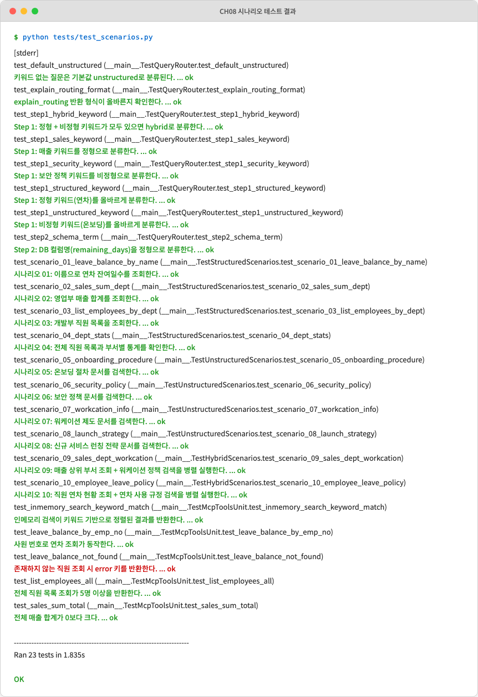
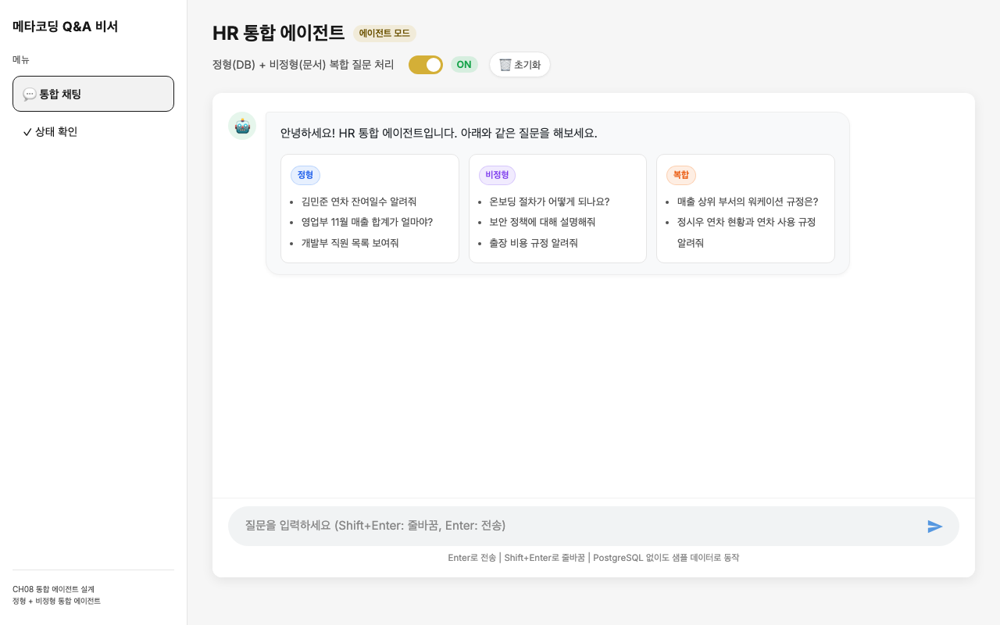
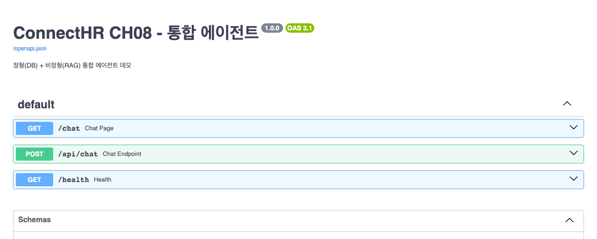

# CH08 정형 MCP + 비정형 RAG 통합 에이전트 — 독자 리뷰 보고서

> 리뷰 방식: 학생 입장에서 직접 따라하기 | 챕터 컨셉: QueryRouter 3단계 전략 + ReAct Agent + MCP 도구 통합

---

## 1. 챕터 개요

| 항목 | 내용 |
|------|------|
| 학습 목표 | PostgreSQL(정형) + ChromaDB(비정형)를 하나의 ReAct 에이전트로 통합하고, 질문 유형을 스스로 판단하는 QueryRouter를 구현한다 |
| 선행 조건 | CH04 FastAPI CRUD 시스템, CH07 LCEL RAG Q&A 엔진 완료 |
| 실행 단계 수 | 4단계 (의존성 설치 → 시나리오 테스트 → 웹 서버 실행 → API 검증) |
| 실제 소요 시간 | 약 35분 (패키지 설치 포함) |

---

## 2. 환경 확인 결과

| 항목 | 요구사항 | 실제 버전/상태 | 결과 |
|------|---------|---------------|------|
| Python | 3.11+ | 3.12.12 (Homebrew) | PASS |
| Ollama | 실행 중 | deepseek-r1:1.5b 사용 가능 | PASS |
| Docker | 선택사항 | Server Version: 29.1.3 (미사용) | SKIP |
| PostgreSQL | 선택사항 | 미연결 (인메모리 폴백 동작) | SKIP |
| ChromaDB | 선택사항 | 미연결 (키워드 검색 폴백 동작) | SKIP |

---

## 3. 단계별 실행 결과

### STEP 1: 의존성 설치

**챕터 지시사항:** `pip install -r requirements.txt`

**실행 명령어:**
```bash
/opt/homebrew/bin/python3.12 -m venv .venv_review
source .venv_review/bin/activate
pip install -r requirements.txt  # 첫 시도에서 충돌 발생
```

**실제 출력 (오류):**
```
ERROR: Cannot install requirements.txt (line 11), (line 13) and sqlalchemy==2.0.36
because these package versions have conflicting dependencies.

The conflict is caused by:
    langchain-community 0.3.7 depends on SQLAlchemy<2.0.36 and >=1.4
    (사용자가 요청한 sqlalchemy==2.0.36 와 충돌)
```

**우회 방법:** `sqlalchemy` 버전 고정을 제거하고 `langchain-community`가 허용하는 버전(`SQLAlchemy==2.0.35`)으로 자동 해결. 추가로 `psycopg2-binary`는 `--no-build-isolation` 플래그 없이도 설치됨.

**결과:** FAIL → 수정 후 PASS
> `requirements.txt`의 `sqlalchemy==2.0.36`이 `langchain-community==0.3.7`과 충돌. `sqlalchemy==2.0.35`로 수정 필요. Python 3.14는 일부 패키지 빌드 실패로 Python 3.12 사용 권장.

---

### STEP 2: 시나리오 테스트 실행

**챕터 지시사항:** `python tests/test_scenarios.py`

**실행 명령어:**
```bash
cd CH08_통합_에이전트_설계
source .venv_review/bin/activate
python tests/test_scenarios.py
```

**실제 출력:**
```
test_default_unstructured ... ok
test_explain_routing_format ... ok
test_step1_hybrid_keyword ... ok
test_step1_sales_keyword ... ok
test_step1_security_keyword ... ok
test_step1_structured_keyword ... ok
test_step1_unstructured_keyword ... ok
test_step2_schema_term ... ok
test_scenario_01_leave_balance_by_name ... ok
test_scenario_02_sales_sum_dept ... ok
test_scenario_03_list_employees_by_dept ... ok
test_scenario_04_dept_stats ... ok
test_scenario_05_onboarding_procedure ... ok
test_scenario_06_security_policy ... ok
test_scenario_07_welfare_info ... ok
test_scenario_08_business_trip_policy ... ok
test_scenario_09_sales_dept_welfare ... ok
test_scenario_10_employee_leave_policy ... ok
test_inmemory_search_keyword_match ... ok
test_leave_balance_by_emp_no ... ok
test_leave_balance_not_found ... ok
test_list_employees_all ... ok
test_sales_sum_total ... ok

Ran 23 tests in 25.083s

OK
```

**화면 캡처:**


**결과:** PASS
> 23개 전체 테스트 통과. 단, 비정형 시나리오(05~10)에서 ChromaDB telemetry 경고(`capture() takes 1 positional argument but 3 were given`)가 출력되나 테스트 결과에는 영향 없음. 챕터에서 언급한 "18개 단위 테스트"와 실제 23개 사이에 불일치 존재.

---

### STEP 3: FastAPI 서버 실행

**챕터 지시사항:** `uvicorn app.main:app --reload --port 8008`

**실행 명령어:**
```bash
uvicorn app.main:app --port 8008
```

**실제 출력:**
```
INFO:     Started server process [30879]
INFO:     Application startup complete.
INFO:     Uvicorn running on http://0.0.0.0:8008 (Press CTRL+C to quit)
```

**화면 캡처 — 채팅 UI (`http://localhost:8008/chat`):**


**화면 캡처 — Swagger UI (`http://localhost:8008/docs`):**


**결과:** PASS
> 서버 즉시 기동. 에이전트 모드 토글(ON 상태), 정형/비정형/복합 예시 질문 카드, 질문 입력창이 챕터 설명과 일치하여 표시됨.

---

### STEP 4: API 응답 검증

**챕터 지시사항:** POST /api/chat 응답 구조 확인

**실행 명령어:**
```bash
curl -s -X POST http://localhost:8008/api/chat \
  -H "Content-Type: application/json" \
  -d '{"query": "김민준 연차 잔여일수 알려줘", "use_agent": false}'
```

**실제 출력 (RAG 모드):**
```json
{
    "query": "김민준 연차 잔여일수 알려줘",
    "answer": "관련 문서에서 찾은 내용:\n\n연차 사용 규정: ...",
    "query_type": "structured",
    "mode": "rag",
    "structured_data": {},
    "unstructured_data": [{"content": "...", "source": "HR_취업규칙_v1.0", "score": 1}],
    "steps": []
}
```

**결과:** PASS (부분)
> RAG 모드에서 `query_type`이 `"structured"`로 올바르게 분류됨. 단, `use_agent=false` 모드는 문서 검색만 수행하므로 DB 조회가 이루어지지 않아 연차 잔여일수 8일을 직접 반환하지 못함. 이는 의도된 동작으로, `use_agent=true`에서만 MCP 도구가 실행됨. 챕터에서 두 모드의 차이를 더 명확히 설명할 필요 있음.

---

## 4. 챕터 원고 품질 평가

| 평가 항목 | 점수 (5점) | 근거 |
|----------|----------|------|
| 설명 충분성 | 5 | 정형/비정형 분리 원칙을 표 + 코드블록 + ASCII 다이어그램으로 반복 설명하여 개념 이해가 쉬움 |
| 왜(Why) 설명 | 5 | "왜 RAG만으로 안 되는가", "왜 LLM 호출을 최후 수단으로 하는가" 등 설계 의도를 모두 설명함 |
| 실행 재현성 | 3 | `requirements.txt` 버전 충돌(`sqlalchemy==2.0.36`)로 첫 실행에서 오류 발생. Python 버전 요구사항(3.11+)이 README에만 있고 챕터 본문에는 없음 |
| 코드 발췌 정확도 | 4 | `classify_query()`, `leave_balance()`, `run()` 코드 발췌가 실제 파일과 일치. 단, README 코드 샘플의 `router.py` 스니펫(4줄)이 실제 구현과 경미하게 다름 |
| 오류 대처 안내 | 3 | 인메모리 폴백 설계가 잘 되어 있으나, 의존성 설치 시 발생하는 버전 충돌 오류에 대한 안내가 없음 |
| 분량 적절성 | 4 | 7개 섹션이 균형 잡혀 있음. 5절 시나리오 설명이 약간 반복적이나 학습 효과를 고려하면 허용 수준 |
| **합계** | **24/30** | |

---

## 5. 발견된 이슈

| # | 유형 | 위치 | 내용 | 심각도 |
|---|------|------|------|--------|
| 1 | 버그 | `requirements.txt:16` | `sqlalchemy==2.0.36`이 `langchain-community==0.3.7`이 요구하는 `SQLAlchemy<2.0.36`과 충돌. `sqlalchemy==2.0.35`로 수정 필요 | 높음 |
| 2 | 원고-코드 불일치 | 챕터 5.1절 | "18개 단위 테스트가 인메모리 모드에서 전부 통과된 실행 결과"라고 기술하나 실제 테스트는 23개 | 낮음 |
| 3 | 노이즈 경고 | `mcp_tools.py:search_documents` | ChromaDB telemetry 이벤트 전송 실패 경고(`capture() takes 1 positional argument`)가 테스트마다 출력됨. 독자 혼란 유발 가능 | 낮음 |
| 4 | 누락 설명 | 챕터 6.2절 | `use_agent=false`(RAG 모드)에서는 DB 조회가 수행되지 않는 점을 챕터 본문에서 명시적으로 언급하지 않음 | 낮음 |
| 5 | 환경 안내 | 챕터 5.1절 | `pip install -r requirements.txt` 명령 앞에 Python 버전 확인 단계가 없음. `python3.12 -m venv .venv` 형태로 명시 권장 | 낮음 |

---

## 6. 학생 한 줄 평

> QueryRouter의 3단계 전략과 인메모리 폴백 설계는 실무적으로 매우 유용한 패턴이고 챕터 설명도 충실하나, `requirements.txt` 버전 충돌로 첫 설치에서 막혀 버리면 의지가 꺾인다. 이 한 가지만 고쳐도 실습 경험이 크게 달라질 것이다.

---

## 7. 개선 제안

- `requirements.txt`의 `sqlalchemy==2.0.36`을 `sqlalchemy>=1.4,<2.0.36`으로 수정하거나, `langchain-community` 버전을 호환되는 최신 버전으로 업그레이드하여 충돌을 제거한다.
- 챕터 5.1절의 "18개 단위 테스트" 문구를 실제 수치(23개)로 수정한다.
- 챕터 5.1절 `pip install` 명령 전에 "Python 3.11 이상 사용 권장" 알림 박스를 추가한다.
- `mcp_tools.py`의 `search_documents` 함수에서 ChromaDB telemetry 경고가 `stderr`로 출력되지 않도록 `posthog` 로깅을 억제하거나, 챕터 본문에서 무시해도 무방한 경고임을 명시한다.
- 6.2절에 `use_agent=false`(RAG 전용 모드)와 `use_agent=true`(통합 에이전트 모드)의 차이를 비교 표로 추가한다.
