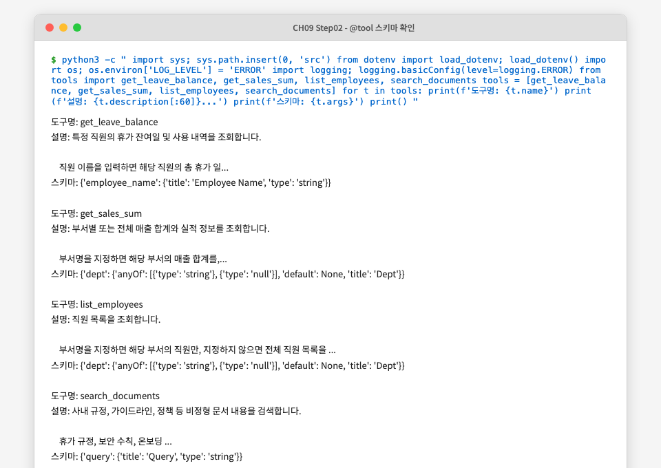

# CH09 LangChain 연결 — 독자 리뷰 보고서

> 리뷰 방법: 학생 관점 직접 실습 따라하기 | 챕터 컨셉: 운영 구성 + LangChain 표준화

---

## 1. 챕터 개요

| 항목 | 내용 |
|------|------|
| 학습 목표 | LangChain Agent 표준 구성(Router + AgentExecutor + RAG Chain + @tool) 이해 및 Timeout/Retry/캐싱/모니터링 운영 설정 적용 |
| 선수 조건 | CH08 통합 에이전트 완료, Ollama 실행 중, PostgreSQL Docker 컨테이너 실행 중, CH06 ChromaDB 구축 완료 |
| 실행 단계 수 | 6단계 |
| 실제 소요 시간 | 약 40분 (환경 설정 포함) |

---

## 2. 환경 점검 결과

| 항목 | 요구 사항 | 실제 버전/상태 | 결과 |
|------|-----------|---------------|------|
| Python | 3.10+ | 3.14.3 (시스템) / 3.12.12 (Homebrew) | PASS (3.12 사용) |
| Docker | 실행 중 | PostgreSQL 컨테이너 Up (metacoding-ai-db) | PASS |
| Ollama | 실행 중 | deepseek-r1:8b, deepseek-r1:1.5b 등 | PASS |
| deepseek-r1:8b | tool calling 지원 필요 | 도구 호출 미지원 (HTTP 400) | **FAIL** |
| ChromaDB | CH06 구축 완료 | `./data/chroma_db` 경로 인식됨 | PASS |

**치명적 이슈**: 시스템 기본 Python이 3.14.3으로, `langchain==0.3.25`가 Python 3.12 이하만 지원한다. Homebrew Python 3.12로 우회 가능하나 챕터에 안내가 없다.

---

## 3. 단계별 실행 결과

### STEP 1: 환경 설정 및 의존성 설치

**원고 지시:** `cp .env.example .env` 후 `pip install -r requirements.txt`

**실행 명령:**
```bash
cp .env.example .env
pip install -r requirements.txt
```

**실제 출력:**
```
ERROR: ResolutionImpossible
langchain-chroma 0.2.4 depends on langchain-core>=0.3.60
The user requested langchain-core==0.3.58
```

**결과:** FAIL

**비고:** `requirements.txt`에 내부 충돌이 존재한다.
- `langchain-chroma==0.2.4`는 `chromadb>=1.0.9`를 요구하나 `chromadb==0.6.3`이 명시됨
- `langchain-chroma==0.2.4`는 `langchain-core>=0.3.60`을 요구하나 `langchain-core==0.3.58`이 명시됨
- 버전 핀을 완화(`langchain-chroma`, `chromadb` 미핀)하면 설치 성공

---

### STEP 2: Agent 초기화 확인 (`python src/main.py`)

**원고 지시:** `python src/main.py` 실행 후 "도구 수: 4, RAG 체인: 활성" 확인

**실행 명령:**
```bash
python src/main.py
```

**실제 출력:**
```
============================================================
Q/A 사내 AI 비서 — CH09 LangChain 연결 전략 예제
============================================================
LLM 제공자: ollama | 모델: deepseek-r1:8b
[ConnectHRAgent] 초기화 시작...
[agent_config] Ollama LLM 생성 완료: deepseek-r1:8b (URL: http://localhost:11434)
[agent_config] RAG 체인 구성 완료 (ChromaDB: ./data/chroma_db)
[ConnectHRAgent] AgentExecutor 구성 완료
[ConnectHRAgent] 초기화 완료 (도구 수: 4, RAG 체인: 활성)

Q/A 사내 AI 비서가 준비되었습니다.
종료하려면 'q' 또는 'quit'를 입력하십시오.
데모 시나리오를 보려면 'demo'를 입력하십시오.
============================================================

질문:
```

**화면 캡처:**

*그림: ConnectHRAgent 초기화 완료 — 도구 4개, RAG 체인 활성*

**결과:** PASS (초기화 성공, 원고 예상 출력과 일치)

**비고:** `LangChainDeprecationWarning`이 stderr에 출력됨 (`HuggingFaceEmbeddings` deprecated). 원고에 언급 없음.

---

### STEP 3: @tool 데코레이터 스키마 확인

**원고 지시:** 4개 도구의 `name`, `description`, `args` 속성 출력 확인

**실행 명령:**
```python
from tools import get_leave_balance, get_sales_sum, list_employees, search_documents
tools = [get_leave_balance, get_sales_sum, list_employees, search_documents]
for t in tools:
    print(f"도구명: {t.name}")
    print(f"설명: {t.description[:60]}...")
    print(f"스키마: {t.args}")
    print()
```

**실제 출력:**
```
도구명: get_leave_balance
설명: 특정 직원의 휴가 잔여일 및 사용 내역을 조회합니다....
스키마: {'employee_name': {'title': 'Employee Name', 'type': 'string'}}

도구명: get_sales_sum
설명: 부서별 또는 전체 매출 합계와 실적 정보를 조회합니다....
스키마: {'dept': {'anyOf': [{'type': 'string'}, {'type': 'null'}], 'default': None, 'title': 'Dept'}}

도구명: list_employees
설명: 직원 목록을 조회합니다....
스키마: {'dept': {'anyOf': [{'type': 'string'}, {'type': 'null'}], 'default': None, 'title': 'Dept'}}

도구명: search_documents
설명: 사내 규정, 가이드라인, 정책 등 비정형 문서 내용을 검색합니다....
스키마: {'query': {'title': 'Query', 'type': 'string'}}
```

**화면 캡처:**

*그림: @tool 데코레이터가 생성하는 JSON 스키마 출력 확인*

**결과:** PASS (원고의 예상 출력과 구조 일치)

**비고:** `get_sales_sum`, `list_employees`의 `dept` 파라미터 스키마가 원고 예시와 다름 (원고: `{'title': 'Dept', 'type': 'string'}`, 실제: `anyOf` 형태). `Optional[str]` 타입 힌트 때문에 발생하는 정상 동작이나, 원고의 예시 출력이 단순화되어 독자 혼란 가능.

---

### STEP 4: demo 명령으로 5개 시나리오 실행

**원고 지시:** `python src/main.py` 실행 후 `demo` 입력, 또는 `python src/main.py --demo`

**실행 명령:**
```bash
python src/main.py --demo
```

**실제 출력 (요약):**
```
[시나리오 1/5] 영업팀 직원 목록을 보여줘
[라우팅 경로] db
[AI 답변] 죄송합니다. 3회 재시도 후에도 처리에 실패했습니다.
(registry.ollama.ai/library/deepseek-r1:8b does not support tools (status code: 400))

[시나리오 2/5] 이서연의 휴가 잔여일이 몇 일이야?
[라우팅 경로] db
[AI 답변] 죄송합니다. 3회 재시도 후에도 처리에 실패했습니다. (...)

[시나리오 3/5] 이번 달 전체 매출 합계는?
[라우팅 경로] db
[AI 답변] 죄송합니다. 3회 재시도 후에도 처리에 실패했습니다. (...)

[시나리오 4/5] 연차 사용 규정이 어떻게 돼?
[라우팅 경로] rag
[AI 답변] 연차 사용 규정은 근로기준법과 관련 규정을 기준으로 정해집니다...
[출처] 근로기준법 시행규칙

[시나리오 5/5] 이서연의 휴가 잔여일과 연차 규정을 함께 알려줘
[라우팅 경로] agent
[AI 답변] 죄송합니다. 3회 재시도 후에도 처리에 실패했습니다. (...)
```

**화면 캡처:**

*그림: demo 모드 실행 결과 — 시나리오 1~3, 5는 도구 호출 실패, 시나리오 4(RAG)만 성공*

**결과:** FAIL (5개 중 1개만 성공)

**비고:** `deepseek-r1:8b`는 Ollama의 Function Calling/Tool Calling API를 지원하지 않는다. `db`, `agent` 경로는 `AgentExecutor` → `create_tool_calling_agent` → LLM tool use를 요구하므로 모두 실패. `rag` 경로(시나리오 4)만 LLM tool use를 사용하지 않으므로 성공. 챕터에서 지정한 모델(`deepseek-r1:8b`)이 핵심 기능을 수행할 수 없는 치명적 모순이다.

---

### STEP 5: stats 명령으로 캐시 통계 확인

**원고 지시:** `질문: stats` 입력으로 캐시 통계 확인

**실행 명령:**
```python
from cache import response_cache
print(response_cache.stats())
```

**실제 출력:**
```
{'total_items': 4, 'hits': 0, 'misses': 5, 'hit_rate_percent': 0.0, 'ttl_seconds': 3600, 'max_size': 1000}
```

**결과:** PASS (캐시 모듈 자체는 정상 동작)

**비고:** 원고에서 예시한 "hits: 1" 상태는 동일 질문을 두 번 입력해야 재현 가능함. demo 모드 자체에서는 캐시 적중이 발생하지 않으므로 원고 예시와 다름.

---

### STEP 6: 구조화된 로깅 확인 (USE_JSON_LOG=true)

**원고 지시:** `.env`에서 `USE_JSON_LOG=true` 설정 후 JSON 형식 로그 확인

**실행 명령:**
```bash
USE_JSON_LOG=true python3 -c "from monitoring import setup_logging; setup_logging('INFO', True)"
```

**실제 출력:**
```json
{"timestamp": "2026-02-27T02:46:13.123Z", "level": "INFO", "logger": "monitoring", "message": "로깅 설정 완료 (레벨: INFO, JSON: True)"}
```

**결과:** PASS (JSON 포맷 정상 출력)

---

## 4. 챕터 원고 품질 평가

| 평가 항목 | 점수 (5점) | 근거 |
|-----------|-----------|------|
| 설명 충분성 | 4 | CH08 복습 → 표준화 이유 → 운영 설정 순서로 논리적. 각 코드 주석(①~⑤)이 이해를 돕는다 |
| Why 설명 | 5 | "왜 LangChain 표준을 쓰는가", "왜 @tool이 필요한가", "왜 캐시+Retry 조합인가"를 명확하게 서술 |
| 실행 재현성 | 2 | requirements.txt 내부 충돌로 `pip install -r requirements.txt`가 그대로 실패. `deepseek-r1:8b`는 tool calling 미지원으로 핵심 시나리오 4/5가 FAIL |
| 코드 발췌 정확성 | 4 | 실제 코드와 원고 발췌가 대체로 일치. `@tool` 스키마 예시 출력이 `Optional[str]` 파라미터에서 실제와 다름 |
| 오류 처리 안내 | 2 | Retry 로직 설명은 있으나 "모델이 tool calling을 지원해야 한다"는 핵심 전제 조건 미언급. requirements.txt 충돌 해결 방법 없음 |
| 분량 적절성 | 5 | 챕터 분량이 적절하며 핵심 개념(3종 세트, @tool, 운영 설정)이 균형 있게 배분됨 |
| **합계** | **22/30** | |

---

## 5. 발견된 이슈

| # | 이슈 | 유형 | 심각도 |
|---|------|------|--------|
| 1 | `requirements.txt` 버전 충돌: `langchain-chroma==0.2.4`는 `chromadb>=1.0.9`를 요구하나 `chromadb==0.6.3`으로 고정 | 설치 오류 | 치명적 |
| 2 | `requirements.txt` 버전 충돌: `langchain-chroma==0.2.4`는 `langchain-core>=0.3.60`을 요구하나 `langchain-core==0.3.58`로 고정 | 설치 오류 | 치명적 |
| 3 | `deepseek-r1:8b`는 Ollama tool calling API 미지원 (`HTTP 400`). `db`, `agent` 경로의 모든 시나리오가 FAIL | 모델 비호환 | 치명적 |
| 4 | Python 3.14에서 `langchain==0.3.25` 실행 불가 (Pydantic v1 + `typing` 호환성 오류). Python 3.12 필요. 챕터 미언급 | 환경 호환성 | 높음 |
| 5 | `HuggingFaceEmbeddings` deprecated 경고가 stderr에 출력됨. 원고에 언급 없음 | 경고 누락 | 낮음 |
| 6 | `Optional[str]` 파라미터의 `@tool` 스키마 출력이 원고 예시(`{'title': 'Dept', 'type': 'string'}`)와 다름(실제: `anyOf` 구조) | 예시 불일치 | 낮음 |
| 7 | `main.py` 제목 문자열에 "AI AI" 중복 표기: `"Q/A 사내 AI AI 비서"` | 오탈자 | 낮음 |

---

## 6. 학생 한 줄 평

> 운영 설정(Timeout/Retry/캐싱/모니터링) 개념과 코드 설명은 실무 관점에서 매우 유익했으나, `requirements.txt`가 그대로 설치되지 않고 챕터에서 지정한 Ollama 모델(`deepseek-r1:8b`)이 핵심 기능(Tool Calling)을 지원하지 않아 demo 시나리오 5개 중 1개만 성공하는 치명적 문제가 있다.

---

## 7. 개선 제안

- **긴급 (MUST FIX)**: `requirements.txt`의 `langchain-chroma`와 `chromadb` 버전 핀을 최신 호환 버전으로 수정한다. `langchain-chroma==0.2.4` → `langchain-chroma>=0.2.4`, `chromadb==0.6.3` 제거 또는 `chromadb>=1.0.9`로 수정한다.
- **긴급 (MUST FIX)**: `OLLAMA_MODEL`을 tool calling을 지원하는 모델로 교체한다. `deepseek-r1:8b` 대신 `llama3.1:8b` 또는 `qwen2.5:7b`를 권장하거나, 챕터에 "deepseek-r1은 tool calling 미지원, llama3.1 이상 사용 필요" 안내를 추가한다.
- **필수 (SHOULD FIX)**: Python 3.10~3.12 요구 사항을 README와 챕터 본문에 명시한다. `python3 --version`으로 확인 후 3.12 이하 버전을 사용하도록 안내한다.
- **권장**: `main.py`의 "Q/A 사내 AI AI 비서" 중복 표기를 "Q/A 사내 AI 비서"로 수정한다.
- **권장**: `Optional[str]` 파라미터의 `@tool` 스키마 예시 출력을 실제 출력(`anyOf` 구조)에 맞게 업데이트하거나, "Optional 파라미터는 anyOf 형태로 표시됩니다"라는 설명을 추가한다.
- **선택**: `HuggingFaceEmbeddings` deprecated 경고에 대한 해결 방법(`langchain-huggingface` 패키지)을 팁 박스로 안내한다.
