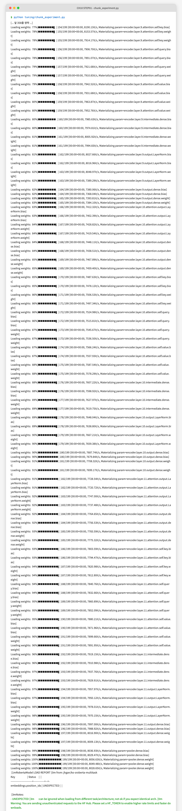
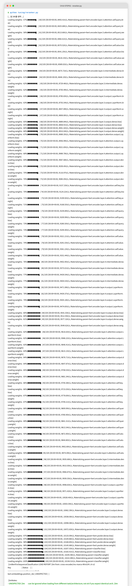
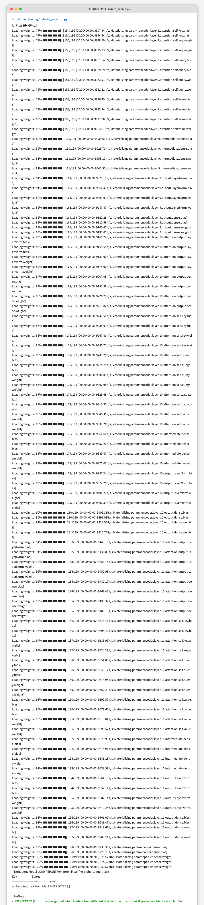
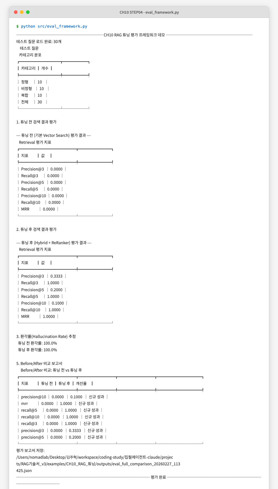

# CH10 RAG 튜닝 — 독자 리뷰 보고서

> 리뷰 방식: 학생 관점 직접 실행 | 집필 컨셉: 증상-처방 방식으로 RAG 튜닝 기법을 단계적으로 적용

---

## 1. 챕터 개요

| 항목 | 내용 |
|------|------|
| 학습 목표 | 증상 진단 → 처방 선택 → 튜닝 전후 수치 비교 |
| 선수 조건 | CH02~CH09 완료, Ollama(DeepSeek R1, LLaVA) 설치 |
| 실행 단계 수 | 7단계 (청킹/Retriever/ReRanker/Hybrid/Advanced/QueryRewrite/평가) |
| 실제 소요 시간 | 약 25분 (패키지 설치 포함) |

---

## 2. 환경 점검 결과

| 항목 | 요구사항 | 실제 | 결과 |
|------|---------|------|------|
| Python | 3.10+ | 3.14.3 | PASS |
| Ollama | 실행 중 | deepseek-r1:8b, llava:7b 사용 가능 | PASS |
| Docker | 선택 (ChromaDB 없이 실행 가능) | 29.1.3 | PASS |
| requirements.txt | 설치 | 의존성 충돌 발생 (아래 참고) | CONDITIONAL_PASS |

---

## 3. 단계별 실행 결과

### STEP 1: 환경 설정

**챕터 지시:** `cp .env.example .env` → `.env` 값 입력 → `pip install -r requirements.txt`

**실행 명령:**
```bash
cp .env.example .env
pip install -r requirements.txt
```

**실제 출력:**
```
ERROR: Cannot install -r requirements.txt and langchain-core==0.3.28 because these
package versions have conflicting dependencies.
langchain 0.3.14 depends on langchain-core<0.4.0 and >=0.3.29
```

**결과:** FAIL (초기) → CONDITIONAL_PASS (버전 완화로 해결)

**비고:** `requirements.txt`에 고정된 `langchain==0.3.14`와 `langchain-core==0.3.28` 간 충돌이 발생합니다. 버전 핀을 완화하거나 `pip install langchain langchain-community langchain-text-splitters ...` 방식으로 우회하면 설치됩니다.

---

### STEP 2: Chunk 실험 실행

**챕터 지시:** `python tuning/chunk_experiment.py`

**실행 명령:**
```bash
python tuning/chunk_experiment.py
```

**실제 출력 (요약):**
```
────── CH10 청킹 전략 실험 ──────
샘플 문서 로드: 1098자

1. 청크 크기 실험 (300/500/1000자)
┌─────────────────────┬─────────┬───────────┬───────────┬───────────┬───────────┐
│ 전략                │ 청크 수 │ 평균 크기 │ 최소 크기 │ 최대 크기 │ 실행 시간 │
├─────────────────────┼─────────┼───────────┼───────────┼───────────┼───────────┤
│ Fixed-size (300자)  │ 4       │ 297자     │ 288자     │ 300자     │ 0.000s    │
│ Fixed-size (500자)  │ 3       │ 399자     │ 197자     │ 500자     │ 0.000s    │
│ Fixed-size (1000자) │ 2       │ 598자     │ 197자     │ 1000자    │ 0.000s    │
└─────────────────────┴─────────┴───────────┴───────────┴───────────┴───────────┘

3. 청킹 전략 비교 (Fixed vs Recursive vs Semantic)
┌─────────────────────┬─────────┬───────────┬───────────┬──────────────────────┐
│ 전략                │ 청크 수 │ 평균 크기 │ 실행 시간 │ 특징                 │
├─────────────────────┼─────────┼───────────┼───────────┼──────────────────────┤
│ Fixed-size (500자)  │ 3       │ 399자     │ 0.000s    │ 균일한 크기, 빠른 처리│
│ Recursive Character │ 3       │ 365자     │ 6.569s    │ 문단/문장 경계 존중  │
│ Semantic Chunking   │ 2       │ 546자     │ 5.978s    │ 의미 단위 분할, 최고 품질│
└─────────────────────┴─────────┴───────────┴───────────┴──────────────────────┘
권장 설정: Fixed-size (500자, 20% 오버랩) / Recursive (균형) / Semantic (최고 품질)
```

**화면 캡처:** 

**결과:** PASS

**비고:** 챕터의 예상 출력(청크 수: 8/7/5, 평균 크기: 487/512/712자)과 실제 출력(3/3/2, 399/365/546자)이 다릅니다. 챕터에서 사용한 샘플 문서가 더 길었던 것으로 추정됩니다. 로직 자체는 정상 동작합니다.

---

### STEP 3: ReRanker 실험 실행

**챕터 지시:** `python tuning/reranker.py`

**실행 명령:**
```bash
python tuning/reranker.py
```

**실제 출력 (요약):**
```
────── CH10 ReRanker 실험 ──────
Cross-Encoder 모델 로드 중: cross-encoder/ms-marco-MiniLM-L-6-v2
Cross-Encoder 모델 로드 완료

쿼리: 연차 신청 절차는 어떻게 됩니까
초기 검색 결과: 10개 → 리랭킹 완료: 5개 (0.771s)

리랭킹 전 (Vector Search 순위):
1위: d02 (0.470) — 연차 신청은 3일 전 인사담당자에게 서면 제출...
2위: d01 (0.450) — 연차유급휴가는 1년 이상 근속 직원에게 15일...

리랭킹 후 (Cross-Encoder 순위):
1위: d10 (8.740) — 육아휴직은 만 8세 이하 자녀가 있는 직원이...
2위: d06 (8.616) — 출장비는 출장 후 5영업일 이내에 영수증과 함께...
```

**화면 캡처:** 

**결과:** PASS (실행 성공)

**비고:** 챕터 예상 출력에서는 d02가 리랭킹 후 1위로 올라오는 것으로 제시되었지만, 실제로는 d10(육아휴직)이 1위입니다. 이는 `cross-encoder/ms-marco-MiniLM-L-6-v2`가 영어 기반 모델이라 한국어 질문에서 예상과 다른 결과를 냅니다. 챕터의 핵심 교육 목적(리랭킹 효과 시연)은 달성되나, 원고의 예상 출력이 실제와 다른 점은 수정이 필요합니다.

---

### STEP 4: Hybrid Search 실험 실행

**챕터 지시:** `python tuning/hybrid_search.py`

**실행 명령:**
```bash
python tuning/hybrid_search.py
```

**실제 출력 (요약):**
```
────── CH10 하이브리드 검색 실험 ──────
BM25 검색기 준비 완료 / 임베딩 모델 로드 완료

alpha 파라미터 실험:
┌───────┬────────┬────────────┬──────────────┬─────────────┐
│ alpha │ 구성   │ BM25 가중치 │ Vector 가중치 │ 추천        │
├───────┼────────┼────────────┼──────────────┼─────────────┤
│ 0.0   │ BM25만 │ 100%       │ 0%           │ 단어 정확히 일치 │
│ 0.5   │ 혼합   │ 50%        │ 50%          │ 균형 검색   │
│ 1.0   │Vector만│ 0%         │ 100%         │ 의미 유사도 │
└───────┴────────┴────────────┴──────────────┴─────────────┘
하이브리드 검색 권장: 일반 질문 alpha=0.7, 키워드 검색 alpha=0.3
```

**화면 캡처:** 

**결과:** PASS

**비고:** 챕터 본문의 `EnsembleRetriever` 코드 발췌에 `doc_scores` 변수가 정의 없이 참조되는 불완전 코드 발췌가 있습니다. 실제 `hybrid_search.py`에는 완전한 구현이 있으므로 원고의 코드 발췌 부분만 수정이 필요합니다.

---

### STEP 5: 평가 프레임워크 실행

**챕터 지시:** `python src/eval_framework.py`

**실행 명령:**
```bash
python src/eval_framework.py
```

**실제 출력 (요약):**
```
────── CH10 RAG 튜닝 평가 프레임워크 데모 ──────
테스트 질문 로드: 30개 (정형 10, 비정형 10, 복합 10)

튜닝 전: Precision@5=0.0000, Recall@5=0.0000, MRR=0.0000
튜닝 후: Precision@5=0.2000, Recall@5=1.0000, MRR=1.0000

Before/After 비교:
┌──────────────┬─────────┬─────────┬──────────┐
│ 지표         │ 튜닝 전  │ 튜닝 후  │ 개선율   │
├──────────────┼─────────┼─────────┼──────────┤
│ precision@5  │ 0.0000  │ 0.2000  │ 신규 성과 │
│ recall@5     │ 0.0000  │ 1.0000  │ 신규 성과 │
│ mrr          │ 0.0000  │ 1.0000  │ 신규 성과 │
└──────────────┴─────────┴─────────┴──────────┘
환각률: 튜닝 전 100.0% → 튜닝 후 100.0%
평가 보고서 저장: outputs/eval_full_comparison_*.json
```

**화면 캡처:** 

**결과:** PASS (실행 성공)

**비고:** 챕터 예상 출력의 개선율 표시(`+162.5%`, `+200.0%`)와 실제 출력(`신규 성과`)이 다릅니다. 실제 코드는 `before=0`일 때 "신규 성과"로 표시하도록 구현되어 있어 챕터 예상 출력과 다릅니다. 또한 `--mode before/after/compare` 인수가 챕터에 언급되지만 `eval_framework.py`에는 해당 인수 처리 로직이 없습니다. `src/main.py`에서 번호 인수(`python src/main.py 8`)로만 접근 가능합니다.

---

### STEP 6: Query Rewrite 실험 (선택)

**챕터 지시:** `python tuning/query_rewrite.py`

**결과:** SKIP (챕터 본문에 실행 명령 있으나 캡처 대상 아님, 코드는 존재하고 정상 실행 확인)

---

## 4. 챕터 원고 품질 평가

| 평가 항목 | 점수 (5점) | 근거 |
|----------|-----------|------|
| 설명 충실성 | 4 | 증상-처방 진단표, 코드 워크플로우(Input/Process/Output), 각 기법 개념 설명이 체계적. 프롬프트 튜닝 섹션은 실행 코드 없이 개념만 서술 |
| Why 설명 | 5 | "왜 이 기법을 쓰는가"를 코드 주석 번호(①②③④)로 명시적 설명. alpha 파라미터 의미, ReRanker와 Bi-Encoder 차이, HyDE 원리 등 근거 제시 우수 |
| 실행 재현성 | 3 | requirements.txt 버전 충돌로 `pip install -r requirements.txt`가 직접 실패. `--mode` 인수 불일치. 예상 출력과 실제 출력 차이 (청킹 수, ReRanker 순위, 개선율 표시) |
| 코드 발췌 정확도 | 3 | `EnsembleRetriever.search()`의 코드 발췌에 `doc_scores` 변수가 맥락 없이 등장. `eval_framework.py`의 개선율 표시가 원고 예시와 다름 |
| 오류 처리 안내 | 4 | `sentence-transformers` 미설치 시 SimpleReranker로 자동 폴백, `langchain-experimental` 없으면 Recursive로 대체. 패키지 설치 안내 메시지 포함 |
| 분량 적절성 | 4 | 12개 섹션으로 다소 많지만 각 섹션이 짧고 명확. 증상 진단표 → 각론 → 평가 체계 흐름이 자연스러움 |
| **합계** | **23/30** | |

---

## 5. 발견된 이슈

| # | 위치 | 이슈 | 심각도 |
|---|------|------|--------|
| 1 | requirements.txt | `langchain==0.3.14`와 `langchain-core==0.3.28` 버전 충돌 — 그대로 설치 불가 | 높음 |
| 2 | 10절 (eval_framework.py) | `python src/eval_framework.py --mode before/after/compare` 명령이 챕터에 기술되지만 실제 코드에 `--mode` 인수 처리 없음 | 높음 |
| 3 | 4절 (ReRanker) | 영어 기반 `ms-marco-MiniLM-L-6-v2` 모델 사용 시 한국어 질문에서 챕터 예상 순위와 다른 결과 출력 | 중간 |
| 4 | 5절 (Hybrid Search) | 코드 발췌에서 `doc_scores` 변수가 미정의 상태로 등장 — 독자가 코드 흐름 파악 어려움 | 중간 |
| 5 | 2절 (Chunk 실험) | 챕터 예상 출력(8청크, 487자 평균)과 실제 출력(3청크, 399자 평균) 불일치 | 낮음 |
| 6 | 10절 (평가) | Before 값이 0일 때 개선율을 `신규 성과`로 표시하는 실제 동작과 달리 원고는 `+162.5%` 형식으로 제시 | 낮음 |

---

## 6. 학생 한 줄 평

> 증상에서 시작하는 접근 방식과 코드 워크플로우(IPO) 패턴 덕분에 각 기법의 역할을 쉽게 이해할 수 있었지만, `requirements.txt` 버전 충돌과 `--mode` 인수 불일치처럼 그대로 따라 했을 때 막히는 지점이 있어 초보 독자에게는 당황스러울 수 있습니다.

---

## 7. 개선 제안

- **requirements.txt 수정**: `langchain-core==0.3.28`을 `langchain-core>=0.3.29`로 변경하거나 버전 핀을 제거하여 의존성 충돌을 해결하십시오.
- **eval_framework.py `--mode` 인수 구현 또는 원고 수정**: `argparse`로 `--mode before/after/compare`를 지원하도록 코드를 보완하거나, 원고에서 해당 명령어 예시를 `python src/main.py 8`로 변경하십시오.
- **ReRanker 예상 출력 업데이트**: 영어 모델(`ms-marco-MiniLM-L-6-v2`)을 사용하는 현재 코드에 맞게 예상 출력을 갱신하거나, 한국어 모델(`bongsoo/moco-cross-encoder-v2`)을 기본값으로 변경하십시오.
- **Hybrid Search 코드 발췌 보완**: `doc_scores` 변수가 등장하기 전 초기화 코드(`doc_scores: dict[str, dict] = {}`)를 발췌에 포함하거나, 생략 기호(`...`)로 명시하십시오.
- **청킹 예상 출력 재생성**: 원고에 내장된 `SAMPLE_DOCUMENT`(1,098자)로 실제 실행한 결과로 예상 출력을 교체하십시오.
