# 1. 이 책의 목표와 최종 완성본 미리보기

메타코딩은 중소기업 "커넥트"의 유일한 개발자이다. 30명 규모의 회사에서 사내 문서가 3,000건 이상 쌓여 있고, 직원들은 매일 평균 30분을 문서 검색에 소비한다. "김 대리 연차 며칠 남았어요?", "신입사원 온보딩 절차가 어떻게 되죠?" 같은 질문이 인사팀에 하루 20건 이상 들어온다. 어느 날 대표가 메타코딩을 불러 한마디를 건넨다.

"AI로 이 문제 해결할 수 없겠나?"

메타코딩은 자리로 돌아와 노트에 두 가지 질문을 적는다. _우리 회사 정보를 AI에게 어떻게 알려줄 수 있을까? 문서가 바뀌면 AI도 다시 학습시켜야 하나?_ 이 챕터에서는 메타코딩이 그 질문에 답을 찾아가는 과정, 즉 이 책이 무엇을 만들고 어떻게 만들어 나가는지를 먼저 살펴봅니다.

---

## 1. 이 책이 다루는 범위

메타코딩이 처음 고려한 방법은 LLM을 사내 데이터로 **파인튜닝(Fine-tuning)** 하는 것이었습니다. 그러나 조사를 시작하자마자 현실적인 장벽을 마주하게 됩니다.

> **질문: Fine-tuning이 왜 어렵나요?**
> Fine-tuning은 수천~수만 건의 정제된 학습 데이터가 필요하고, GPU 서버 비용이 상당합니다. 또한 취업 규칙이 개정될 때마다 재학습을 해야 하므로 운영 부담이 큽니다.

이 책이 선택한 해법은 **검색 증강 생성(RAG, Retrieval-Augmented Generation)** 과 **모델 컨텍스트 프로토콜(MCP, Model Context Protocol)** 의 조합입니다. 두 기술의 차이를 이해하면 왜 이 조합이 중소기업에 적합한지가 명확해집니다.

### Fine-tuning vs RAG 비교

| 항목 | Fine-tuning | RAG |
|------|-------------|-----|
| 데이터 요구량 | 수천~수만 건 정제 데이터 | 원본 문서 그대로 사용 |
| 초기 비용 | 높음 (GPU 학습 비용) | 낮음 (임베딩 비용만) |
| 업데이트 주기 | 재학습 필요 (일~주 단위) | 문서 추가 즉시 반영 |
| 사내 정보 반영 | 학습 완료 후에만 가능 | 실시간 반영 |
| 적합 상황 | 특정 도메인 언어 스타일 학습 | 최신 문서 기반 정확한 답변 |
| 환각 위험 | 낮음 (학습된 패턴 내) | 검색 실패 시 발생 가능 |

**RAG** 는 LLM에게 "직접 외우게" 하는 대신 "필요할 때 검색해서 답하게" 하는 기법입니다. 취업 규칙이 개정되어도 파일 하나를 교체하면 되므로 운영 부담이 없습니다.

그런데 직원들의 질문 중 일부는 문서가 아니라 데이터베이스에 있는 정형 데이터를 필요로 합니다. "김철수 사원의 남은 연차는?"이라는 질문은 HR 정책 문서가 아니라 DB 테이블에서 꺼내야 합니다. 이 정형 데이터 조회를 처리하는 표준 방법이 바로 **MCP** 입니다. LLM이 외부 도구나 데이터 소스에 접근하는 표준 프로토콜로, "어떤 도구를 언제 쓸지"를 LLM이 스스로 판단하도록 설계되어 있습니다.

이 책의 최종 산출물은 이 두 기술을 결합한 **"커넥트HR AI 비서"** 입니다. 비정형 문서는 RAG로, 정형 DB는 MCP로, 두 가지를 동시에 필요로 하는 복합 질문은 ReAct 에이전트로 처리합니다.

---

## 2. 최종 결과물 데모 시나리오

완성된 커넥트HR AI 비서가 어떻게 동작하는지 세 가지 질문 유형으로 살펴보겠습니다.

### 정형 질문 — DB 직접 조회

> **질문**: "김철수 사원의 남은 연차는 며칠인가요?"

AI 비서는 이 질문이 데이터베이스 조회가 필요한 정형 질문임을 인식합니다. MCP 도구를 통해 PostgreSQL의 `leave_balance` 테이블을 직접 조회하고 결과를 반환합니다.

```
답변: 김철수 사원의 현재 연차 잔여일은 7일입니다.
출처: PostgreSQL — leave_balance 테이블 (실시간 조회)
```

### 비정형 질문 — 문서 검색

> **질문**: "신입사원 온보딩 절차를 알려주세요."

AI 비서는 ChromaDB에서 관련 청크를 검색하고 출처를 명시하여 답변합니다.
```
답변: 신입사원 온보딩은 다음 절차로 진행됩니다.
      1. 입사 첫날: 사원증 발급 및 PC 셋업
      2. 1주차: 부서 오리엔테이션 및 업무 시스템 교육
      ...
출처: HR_취업규칙_v1.0.pdf, 23페이지
```

### 복합 질문 — DB + 문서 조합

> **질문**: "올해 매출 상위 부서의 복지 정책을 비교해 주세요."

AI 비서의 ReAct 에이전트는 먼저 DB에서 부서별 매출을 조회하고, 이어서 복지 정책 문서를 검색하여 두 결과를 조합합니다.

```
답변: 올해 상반기 매출 1위는 영업팀(2.3억), 2위는 개발팀(1.8억)입니다.
      영업팀 복지: 분기별 성과 인센티브, 유연 근무 허용
      개발팀 복지: 교육비 지원 연 200만 원, 재택 근무 주 2회
출처: PostgreSQL — sales 테이블 + OPS_신규서비스_런칭전략.pdf 15페이지
```

이 세 가지 시나리오가 이 책을 통해 구현할 기능의 전체 범위입니다. 아래 다이어그램은 각 질문 유형이 시스템을 통해 어떻게 처리되는지를 보여줍니다.

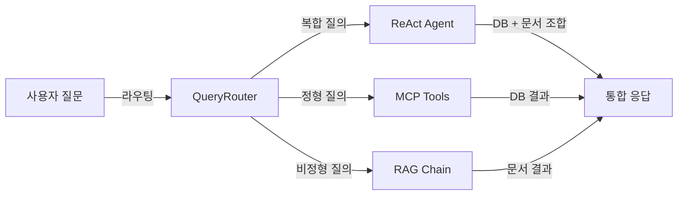
```mermaid
flowchart LR
    A["사용자 질문"] -- "라우팅" --> B["QueryRouter"]
    B -- "정형 질의" --> C["MCP Tools"]
    B -- "비정형 질의" --> D["RAG Chain"]
    B -- "복합 질의" --> E["ReAct Agent"]
    E -- "DB + 문서 조합" --> F["통합 응답"]
    C -- "DB 결과" --> F
    D -- "문서 결과" --> F
```

*그림 1-1: 질문 유형별 처리 흐름 개요*

---

## 3. 아키텍처 한 장 요약

커넥트HR AI 비서의 전체 구조를 한 장에 담으면 다음과 같습니다.

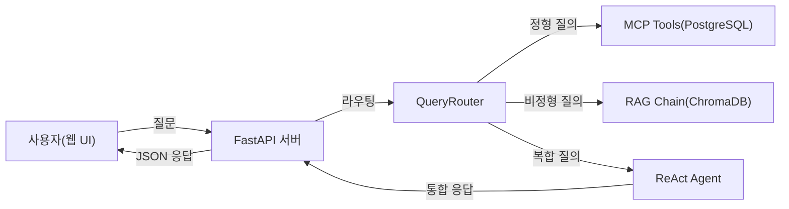
```mermaid
flowchart LR
    A["사용자(웹 UI)"] -- "질문" --> B["FastAPI 서버"]
    B -- "라우팅" --> C["QueryRouter"]
    C -- "정형 질의" --> D["MCP Tools(PostgreSQL)"]
    C -- "비정형 질의" --> E["RAG Chain(ChromaDB)"]
    C -- "복합 질의" --> F["ReAct Agent"]
    F -- "통합 응답" --> B
    B -- "JSON 응답" --> A
```

*그림 1-2: 커넥트HR AI 비서 전체 아키텍처*

<!-- [GEMINI PROMPT: 01_architecture-overview]
path: assets/CH01/01_architecture-overview.png
A minimalist black and white technical diagram with a strict 16:9 aspect ratio on a solid white background. No shading, no 3D effects, only clean thin line art. The entire assembly of icons, lines, and text is perfectly centered globally within the 16:9 frame, leaving generous and equal white space on all sides. Show a left-to-right flow: minimalist line-art person icon labeled '사용자(웹 UI)' -> minimalist line-art server rack icon labeled 'FastAPI 서버' -> minimalist line-art decision diamond labeled 'QueryRouter' -> three branches: cylinder icon labeled 'PostgreSQL(MCP)', cylinder icon labeled 'ChromaDB(RAG)', brain icon labeled 'ReAct Agent'. All Korean labels, clean arrows, white background.
Style: architecture-infographic
-->
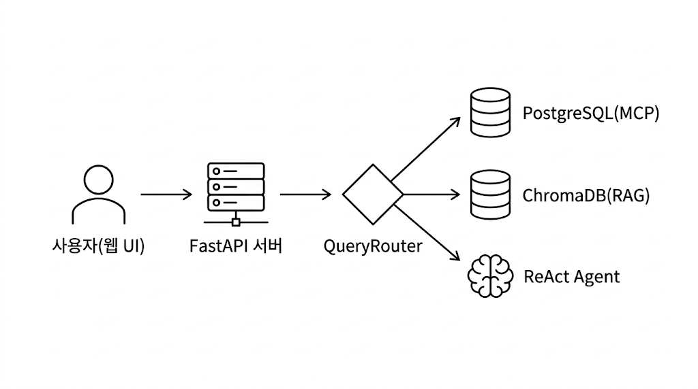
*그림 1-3: 커넥트HR AI 비서 전체 아키텍처 — 개념 일러스트*

각 구성 요소의 역할은 아래와 같습니다.

| 구성 요소 | 역할 |
|-----------|------|
| **FastAPI 서버** | 사용자 요청을 받아 라우터로 전달하고 최종 응답을 반환하는 웹 백엔드 |
| **QueryRouter** | 질문 유형(정형/비정형/복합)을 판단하여 적절한 처리 경로로 분기 |
| **MCP Tools** | PostgreSQL에 SQL을 실행하여 정형 데이터를 조회하는 도구 집합 |
| **RAG Chain** | ChromaDB에서 관련 문서 청크를 검색하고 LLM에 주입하여 답변 생성 |
| **ReAct Agent** | 복합 질문을 단계별로 분해하여 MCP와 RAG를 순차/병렬로 조합 |
| **ChromaDB** | 문서 임베딩 벡터를 저장하고 의미 기반 유사도 검색을 수행하는 벡터 DB |
| **PostgreSQL** | 직원, 휴가 잔여, 매출 등 정형 데이터를 저장하는 관계형 DB |

> **참고: QueryRouter가 중요한 이유**
> 실무 환경에서 사용자는 어떤 데이터 소스에서 답을 가져와야 하는지 모릅니다. 라우터가 없으면 모든 질문을 RAG에 보내거나 모든 질문을 DB에 보내야 하는데, 어느 쪽도 전체 질문을 커버할 수 없습니다. QueryRouter는 이 판단을 자동화합니다.

---

## 4. 사용 기술 스택

메타코딩이 선정한 기술 스택입니다. 중소기업 환경에서 비용과 유지보수를 우선 고려하여 로컬 실행이 가능한 오픈소스 중심으로 구성했습니다.

### 기술별 역할 및 메모리 요구사항
| 영역 | 기술 | 버전 | 역할 | 메모리 |
|------|------|------|------|--------|
| 텍스트 LLM | Ollama + DeepSeek R1 | Ollama 0.5+, deepseek-r1:8b | 질의응답 추론 (CH06~07) | 8~16GB |
| Tool Calling LLM | Ollama + Llama 3.1 | llama3.1:8b | 에이전트 도구 호출 (CH08~10) | 4~8GB |
| Vision LLM | Ollama + LLaVA | llava:13b | 이미지·표 캡션 생성 (CH10) | 4~8GB |
| 백엔드 | FastAPI | 0.115+ | REST API 웹 서버 | 1GB |
| 정형 DB | PostgreSQL | 16+ | 직원·휴가·매출 데이터 | 1GB |
| 벡터 DB | ChromaDB | 0.5+ | 문서 임베딩 저장·검색 | 1GB |
| 오케스트레이션 | LangChain | 0.3+ | RAG 체인 + 에이전트 | 1GB |
| 도구 연동 | MCP (mcp-python-sdk) | 1.0+ | LLM ↔ DB/도구 연결 | - |
| 임베딩 | ko-sroberta-multitask | 3.0+ | 한국어 텍스트 벡터화 | 1GB |
| 문서 파싱 | pypdf, python-docx, openpyxl | 최신 | PDF/DOCX/XLSX 파싱 | - |

### 최소 및 권장 하드웨어 스펙

| 항목 | 최소 사양 | 권장 사양 |
|------|---------|---------|
| RAM | 16GB | 32GB |
| 저장공간 | 20GB 여유 | 50GB 여유 |
| OS | macOS 13+ / Ubuntu 22.04+ / Windows WSL2 | macOS (Apple Silicon) / Ubuntu 22.04+ |
| GPU | 불필요 (CPU 추론 가능) | NVIDIA GPU 또는 Apple Silicon (속도 향상) |

> **팁: LLM Provider를 나중에 바꿀 수 있습니다**
> 이 책의 모든 코드는 `.env` 파일의 `LLM_PROVIDER` 값 하나로 Ollama(로컬 무료), OpenAI(클라우드 유료), vLLM(자체 호스팅) 사이에서 전환됩니다. 처음에는 Ollama로 시작하고, 나중에 필요에 따라 변경하십시오. CH02에서 이 전환 구조를 직접 구현합니다.

> **주의: RAM 16GB 미만 환경**
> deepseek-r1:8b 모델은 실행 시 약 8~16GB의 RAM을 사용합니다. 16GB 미만 환경에서는 `deepseek-r1:1.5b` 경량 모델을 대신 사용하십시오. 답변 품질은 다소 낮아질 수 있습니다.

---

## 5. 이 책을 마치면 할 수 있는 것

메타코딩은 이 책을 완독한 후 세 가지 핵심 역량을 갖추게 됩니다. 독자 여러분도 마찬가지입니다.

**첫째, RAG 파이프라인 구축 능력.** 사내 문서를 벡터 DB에 인덱싱하고, 사용자 질문에 맞는 청크를 검색하여 LLM 답변에 근거를 붙이는 전체 파이프라인을 직접 만들 수 있습니다.

**둘째, MCP 통합 에이전트 설계 능력.** 정형 DB와 비정형 문서를 하나의 에이전트에서 처리하는 구조를 설계하고, 새로운 도구를 `@tool` 데코레이터 하나로 추가할 수 있습니다.

**셋째, 실전 RAG 튜닝 능력.** "답변이 틀렸다"는 증상에서 원인(청크 크기, 검색 방식, 프롬프트)을 찾아 수치로 개선 효과를 측정하는 체계적인 튜닝 방법론을 익힐 수 있습니다.

### 챕터별 빌드업 로드맵

각 챕터는 이전 챕터 위에 쌓이는 구조입니다.

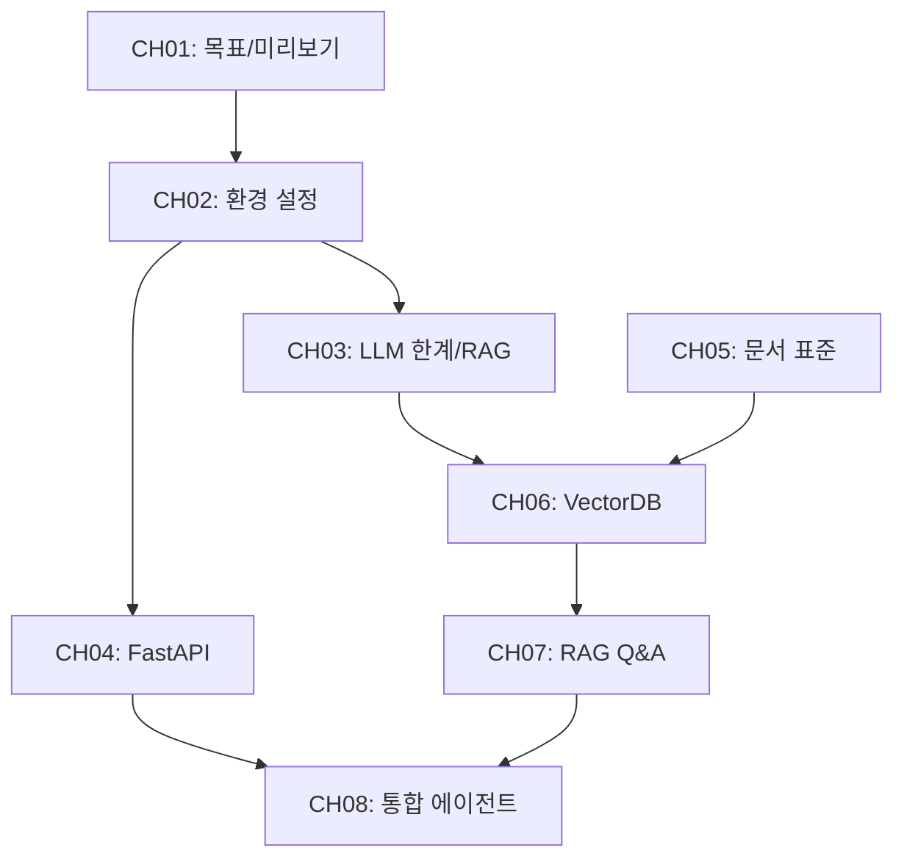
```mermaid
flowchart TD
    CH01["CH01: 목표/미리보기"] --> CH02["CH02: 환경 설정"]
    CH02 --> CH03["CH03: LLM 한계/RAG"]
    CH02 --> CH04["CH04: FastAPI"]
    CH03 --> CH06["CH06: VectorDB"]
    CH05["CH05: 문서 표준"] --> CH06
    CH06 --> CH07["CH07: RAG Q&A"]
    CH04 --> CH08["CH08: 통합 에이전트"]
    CH07 --> CH08["CH08: 통합 에이전트"]
```

*그림 1-4: 챕터 의존성 그래프 — CH01부터 CH10까지 순방향 연결*

각 단계에서 메타코딩이 해결하는 문제와 독자가 얻는 산출물은 다음과 같습니다.

| 챕터 | 메타코딩의 문제 | 산출물 |
|------|--------------|--------|
| CH01 | 무엇을 만들지 몰라 막막함 | 전체 아키텍처 이해 |
| CH02 | 개발 환경이 없음 | 검증된 로컬 LLM 환경 |
| CH03 | LLM이 왜 틀리는지 모름 | RAG 필요성 체감 |
| CH04 | 사내 데이터를 담을 시스템 없음 | FastAPI + DB 기반 사내 시스템 |
| CH05 | 문서가 뒤섞여 있어 품질 보장 불가 | 표준화된 문서 세트 |
| CH06 | 문서를 AI가 검색할 수 없음 | ChromaDB 인덱스 + CLI 검증 |
| CH07 | 개발자만 검색 가능, 전 직원 사용 불가 | 웹 채팅 UI + 멀티턴 대화 |
| CH08 | RAG만으로 정형 데이터 질문 처리 불가 | 통합 에이전트 (정형+비정형+복합) |
| CH09 | 운영 중 타임아웃·에러 관리 불가 | 운영 설정 완비된 연결 구조 |
| CH10 | "가끔 틀리는" 문제를 개선할 방법 모름 | 튜닝 프레임워크 + 품질 측정 |

---

## 6. 정리하며

CH01에서 확인한 내용을 정리합니다.

- **RAG vs Fine-tuning**: 사내 문서처럼 빈번히 갱신되는 데이터에는 RAG가 적합합니다. 문서를 추가하면 즉시 반영되고 재학습 비용이 없습니다.
- **MCP의 역할**: 정형 DB 조회와 비정형 문서 검색을 하나의 에이전트에서 처리하는 표준 연결 프로토콜입니다.
- **전체 아키텍처**: 사용자 질문이 FastAPI → QueryRouter를 거쳐 MCP Tools, RAG Chain, ReAct Agent 중 하나 또는 조합으로 처리됩니다.
- **기술 스택**: Ollama(로컬 LLM), ChromaDB(벡터 DB), PostgreSQL(정형 DB), LangChain(오케스트레이션)이 핵심이며, 모두 무료 오픈소스입니다.
- **학습 결과**: 이 책을 마치면 RAG 파이프라인 구축, MCP 통합 에이전트 설계, 실전 튜닝의 세 가지 역량을 확보합니다.

<!-- [GEMINI PROMPT: 01_before-after]
path: assets/CH01/01_before-after.png
A minimalist black and white technical diagram with a strict 16:9 aspect ratio on a solid white background. No shading, no 3D effects, only clean thin line art. The entire assembly is perfectly centered within the 16:9 frame with generous white space. Simple before/after comparison infographic: LEFT side labeled 'Before' shows a stack-of-papers icon and a person icon with a clock, large text '30분/일' below, and '20건/일 수동 처리' below. RIGHT side labeled 'After' shows a brain icon labeled 'AI 비서', large text '30초/건' below, and '0건 자동 응답' below. A bold right-pointing arrow in the middle connects the two sides. Korean labels, clean flat design, white background.
Style: before-after-infographic
-->
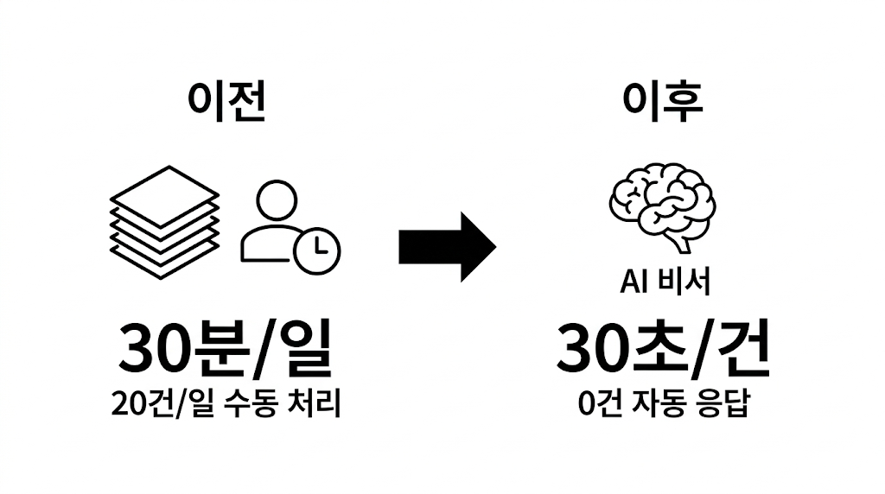
*그림 1-5: 커넥트HR AI 비서 도입 전후 비교*

| 지표 | Before | After (목표) |
|------|--------|-------------|
| 직원 1인 문서 검색 시간 | 30분/일 | 30초/건 |
| 인사팀 반복 질의 처리 | 20건/일 (수동) | 0건 (AI 자동 응답) |
| 신입사원 정보 접근 | 선배에게 직접 질문 | AI 비서에 즉시 질문 |

다음 챕터에서는 이 시스템을 구축하기 위한 개발 환경을 준비합니다. Ollama와 DeepSeek R1을 설치하고, PostgreSQL을 Docker로 구동하며, LLM Provider를 나중에 자유롭게 전환할 수 있는 구조를 만들겠습니다.


---

# 2. 개발 환경 설정

이번 챕터에서는 커넥트HR AI 비서를 만들기 위한 개발 환경 전체를 구축합니다. Ollama와 DeepSeek R1 설치부터 PostgreSQL 컨테이너 실행, Python 가상환경 설정, 그리고 환경 검증까지 단계별로 진행합니다.

CH01에서 메타코딩은 커넥트의 AI 비서 프로젝트를 시작하기로 결심하고 전체 아키텍처와 기술 스택을 파악하였습니다. 이제 실제로 코드를 작성할 준비를 해야 할 차례입니다.

---

메타코딩은 노트북을 열고 개발 시작 전 체크리스트를 만들었습니다. "어떤 도구를 설치해야 하지? LLM은 로컬에서 실행할 수 있나?" ChatGPT API를 쓰면 당장 시작은 쉽겠지만, 월 비용이 $50 이상 나올 수 있고 사내 데이터를 외부 서버로 보내는 것은 커넥트의 보안 정책상 불가능합니다. 로컬에서 무료로 LLM을 실행할 방법이 필요했습니다. 그때 Ollama를 발견하였습니다. 로컬 머신에서 LLM을 실행할 수 있는 경량 런타임이었습니다.

---

## 1. 필수 요구사항 확인

개발을 시작하기 전 사전에 설치되어 있어야 하는 도구와 하드웨어 요건을 점검합니다.

### 하드웨어 최소 요건

| 항목 | 최소 요건 | 권장 사양 |
|------|----------|---------|
| RAM | 16GB | 32GB |
| 저장 공간 | 20GB 여유 | 50GB 이상 |
| CPU | 4코어 이상 | 8코어 이상 |
| GPU | 없어도 됨 (속도 느림) | NVIDIA 8GB VRAM 이상 |

> **참고: Apple Silicon Mac**
> M1/M2/M3 Mac은 통합 메모리(Unified Memory)를 활용하여 GPU 없이도 LLM 추론 속도가 빠릅니다. 16GB RAM이면 DeepSeek R1:8b 모델을 원활하게 실행할 수 있습니다.

### OS별 주의사항

| OS | 지원 수준 | 주의사항 |
|----|---------|---------|
| macOS (Apple Silicon) | 1순위 | Ollama 네이티브 지원, Docker Desktop 필요 |
| macOS (Intel) | 1순위 | LLM 추론 속도가 느릴 수 있음 |
| Ubuntu 22.04+ | 1순위 | NVIDIA GPU 있으면 최적 성능 |
| Windows (WSL2) | 2순위 | WSL2 + Docker Desktop 필수, 파일 경로 주의 |
| Windows (네이티브) | 미지원 | WSL2 환경 사용 권장 |

### 사전 실습 체크리스트

본격적인 실습 전에 아래 6가지 항목을 확인하십시오.

- [ ] Python 3.10 이상 설치 (`python --version` 으로 확인)
- [ ] Docker Desktop 설치 및 실행 (`docker --version` 으로 확인)
- [ ] RAM 16GB 이상
- [ ] 저장 공간 20GB 이상 여유
- [ ] 터미널(zsh/bash) 기본 조작 가능
- [ ] Git 설치 (`git --version` 으로 확인)

---

## 2. Ollama + DeepSeek R1 설치 및 테스트

**Ollama** 는 로컬 머신에서 오픈소스 LLM을 실행할 수 있는 경량 런타임입니다. Docker와 비슷하게, 모델을 `pull` 하여 로컬에 저장하고 `run` 명령으로 실행합니다. **DeepSeek R1** 은 중국 스타트업 DeepSeek이 공개한 오픈소스 LLM으로, 특히 추론(reasoning) 능력이 강화되어 있어 복잡한 질의응답에 적합합니다.

<!-- [GEMINI PROMPT: 02_ollama-deepseek-overview]
path: assets/CH02/02_ollama-deepseek-overview.png
A minimalist black and white technical diagram with a strict 16:9 aspect ratio on a solid white background. No shading, no 3D effects, only clean thin line art. The entire assembly of icons, lines, and text is perfectly centered globally within the 16:9 frame, leaving generous and equal white space on all sides. Left side: minimalist line-art laptop icon labeled 'Local Machine'. Center: minimalist line-art brain icon labeled 'Ollama Runtime'. Right: three stacked minimalist line-art document icons labeled 'deepseek-r1:8b', 'deepseek-r1:1.5b', 'llava:13b'. Arrow from laptop to runtime, arrow from runtime to model stack. Clean flat monochrome style, Korean labels, 16:9.
Style: architecture-infographic
-->
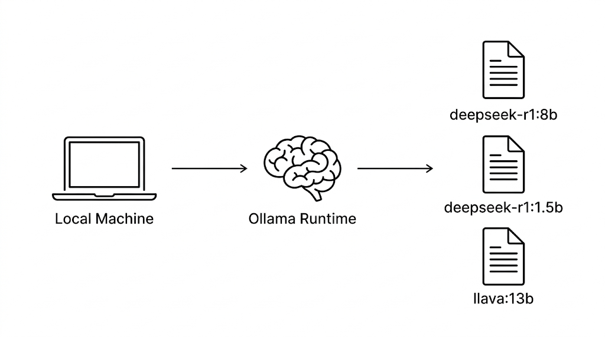
*그림 2-1: Ollama가 로컬 머신에서 LLM 모델을 관리하고 실행하는 구조*

### 2.1 Ollama 설치

**macOS (Homebrew):**

```bash
brew install ollama
```

설치 후 Ollama 서버를 실행합니다.

```bash
ollama serve
```

macOS에서는 Ollama 앱을 설치하면 메뉴 바에서 자동 실행됩니다. Linux나 WSL2 환경에서는 [Ollama 공식 사이트](https://ollama.com)의 안내를 따라 설치하십시오.

### 2.2 DeepSeek R1 모델 다운로드

> **주의: 첫 실행 시 모델 파일 자동 다운로드**
> `ollama pull deepseek-r1:8b` 는 LLM 모델 파일(약 4.7GB)을 다운로드합니다. 네트워크 속도에 따라 10~60분 소요될 수 있으며, 이후 실행부터는 로컬 캐시를 사용하므로 즉시 시작됩니다.

```bash
ollama pull deepseek-r1:8b
```

RAM이 16GB 미만이거나 처음 테스트만 해 보려면 경량 모델을 대신 사용하십시오.

```bash
ollama pull deepseek-r1:1.5b
```

다운로드 완료 후 현재 로컬에 저장된 모델 목록을 확인합니다.

```bash
ollama list
```

<!-- [CAPTURE NEEDED: 02_ollama-list
  path: assets/CH02/02_ollama-list.png
  desc: `ollama list` 실행 후 deepseek-r1:8b 모델이 목록에 나타난 터미널 화면
] -->
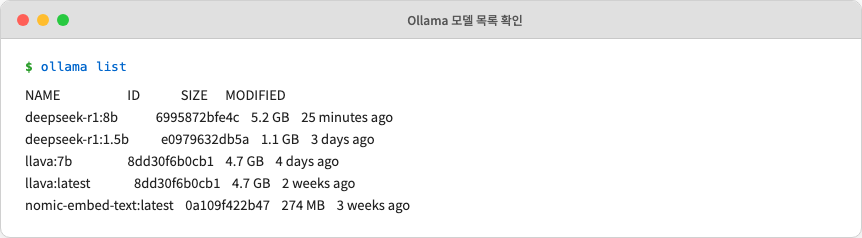
*그림 2-2: deepseek-r1:8b 모델 다운로드 완료 확인*

### 2.3 간단한 대화 테스트

모델이 정상적으로 동작하는지 터미널에서 직접 대화를 나눠 봅니다.

```bash
ollama run deepseek-r1:8b
```

프롬프트가 뜨면 간단한 질문을 입력합니다.

```
>>> 안녕하세요. 한 문장으로 자기소개를 해 주십시오.
```

모델이 응답을 반환하면 정상입니다. `/bye` 를 입력하여 세션을 종료합니다.

> **팁: Ollama API 직접 호출**
> Ollama는 `http://localhost:11434` 에서 REST API도 제공합니다. `curl http://localhost:11434/api/tags` 로 설치된 모델 목록을 JSON으로 조회할 수 있습니다. 이후 코드에서 이 API를 직접 호출합니다.

<!-- [CAPTURE NEEDED: 02_ollama-api-browser
  path: assets/CH02/02_ollama-api-browser.png
  desc: 브라우저에서 `http://localhost:11434/api/tags` 접속 시 모델 목록 JSON이 표시된 화면
] -->
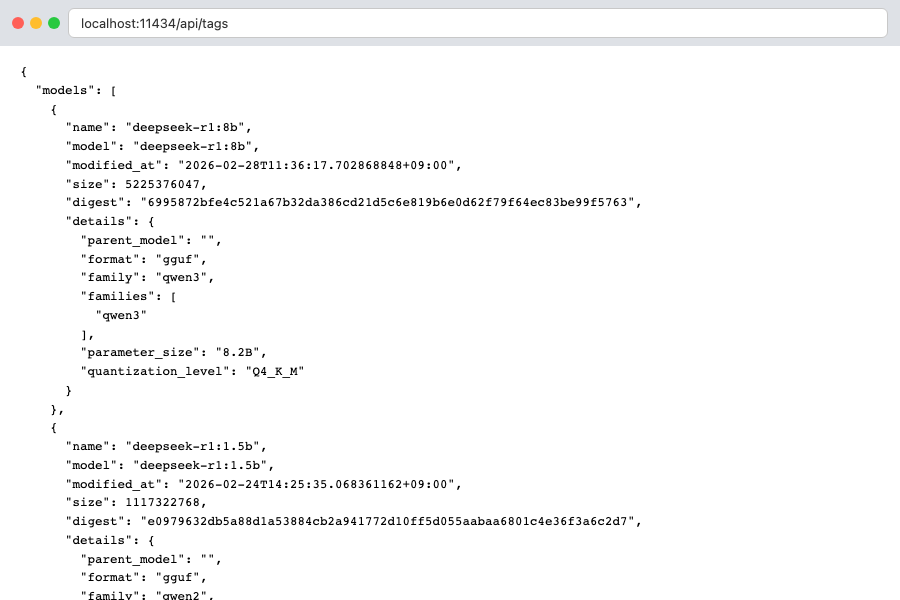
*그림 2-3: 브라우저에서 Ollama REST API로 모델 목록을 조회한 화면*

---

## 3. Python 설치 및 가상환경

메타코딩은 Ollama 설치를 마치고 다음 단계로 넘어갔습니다. "Python은 이미 깔려 있을 텐데, 버전이 맞나?" 확인이 필요했습니다.

### 3.1 Python 버전 확인

이 책의 모든 실습은 **Python 3.11 또는 3.12**를 기준으로 작성되었습니다. Python 3.13 이상에서는 일부 패키지의 사전 빌드 바이너리가 제공되지 않아 설치 오류가 발생할 수 있으므로, **3.11 또는 3.12 버전을 사용하십시오.**

```bash
python3 --version
```

아래 두 가지 경우에 해당하면 Python을 (재)설치하십시오.

| 상황 | 조치 |
|----|---------|
| `command not found: python3` | Python이 설치되어 있지 않습니다. 아래 표를 참고하여 설치하십시오. |
| `Python 3.13.x` 이상 출력 | 3.11 또는 3.12를 **별도로 설치**하십시오. 기존 버전은 그대로 유지해도 됩니다. |

| OS | 설치 방법 |
|----|---------|
| macOS | `brew install python@3.12` (Homebrew 필요: https://brew.sh) |
| Ubuntu/Debian | `sudo apt update && sudo apt install python3.12 python3.12-venv` |
| Windows | https://www.python.org/downloads/ 에서 3.12.x 설치 (Add to PATH 체크) |

> **주의: macOS에서 `python` vs `python3`**
> macOS에서는 `python` 명령이 등록되어 있지 않은 경우가 많습니다. 이 책에서 `python` 이라고 표기된 명령은 모두 `python3` 으로 실행하십시오. 가상환경 활성화 후에는 `python` 과 `pip` 이 자동으로 올바른 버전을 가리킵니다.

### 3.2 가상환경 생성 및 활성화

**가상환경(venv)** 은 프로젝트마다 독립된 Python 패키지 공간을 만들어 줍니다. 이 책에서 설치하는 패키지들이 다른 프로젝트와 충돌하지 않도록, 모든 실습에서 가상환경을 사용합니다.

```bash
# 가상환경 생성 (3.1절에서 확인한 Python 3.12 사용)
python3.12 -m venv .venv

# 활성화 (macOS / Linux / WSL2)
source .venv/bin/activate

# 활성화 (Windows PowerShell)
.\.venv\Scripts\Activate.ps1
```

활성화에 성공하면 터미널 프롬프트 앞에 `(.venv)` 가 표시됩니다.

```
(.venv) user@machine ~/connect-hr-ai/examples/CH02_개발_환경_설정 $
```

> **트러블슈팅: `pg_config executable not found` 오류**
> Python 3.13 이상 환경에서 `psycopg2-binary` 설치 시 발생합니다. **Python 3.12 이하로 가상환경을 다시 생성**하면 해결됩니다.
> ```bash
> deactivate && rm -rf .venv
> python3.12 -m venv .venv
> source .venv/bin/activate
> pip install -r requirements.txt
> ```
> Python 3.12가 설치되어 있지 않다면 `brew install python@3.12` (macOS) 또는 `sudo apt install python3.12` (Ubuntu)로 먼저 설치하십시오.

---

## 4. PostgreSQL 설치 (Docker 기반)

PostgreSQL은 커넥트HR AI 비서의 **정형 데이터** (직원 정보, 연차 잔여량, 매출 현황)를 저장하는 데이터베이스입니다. Docker를 통해 설치하면 OS에 관계없이 동일한 환경을 보장하고, 버전 고정으로 재현성을 확보하며, 포트 충돌이나 권한 문제를 방지할 수 있습니다.

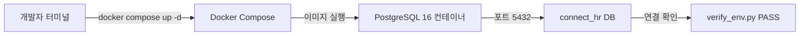
```mermaid
flowchart LR
    A["개발자 터미널"] -- "docker compose up -d" --> B["Docker Compose"]
    B -- "이미지 실행" --> C["PostgreSQL 16 컨테이너"]
    C -- "포트 5432" --> D["connect_hr DB"]
    D -- "연결 확인" --> E["verify_env.py PASS"]
```

*그림 2-4: Docker Compose가 PostgreSQL 컨테이너를 실행하는 구조*

### 4.1 docker-compose.yml 구조

프로젝트에 포함된 `docker-compose.yml` 파일은 아래와 같습니다.

```yaml
services:
  postgres:
    image: postgres:16
    container_name: connect_hr_db
    restart: unless-stopped
    environment:
      POSTGRES_DB: connect_hr
      POSTGRES_USER: connect_hr
      POSTGRES_PASSWORD: connect_hr_pass
    ports:
      - "5432:5432"
    healthcheck:
      test: ["CMD-SHELL", "pg_isready -U connect_hr -d connect_hr"]
      interval: 10s
      timeout: 5s
      retries: 5
```

각 설정 항목의 역할은 다음과 같습니다.

- `image: postgres:16` — 공식 PostgreSQL 16 이미지를 사용하여 버전을 고정합니다.
- `restart: unless-stopped` — Docker Desktop 재시작 시 컨테이너가 자동으로 복구됩니다.
- `healthcheck` — `pg_isready` 명령으로 DB가 완전히 준비될 때까지 기다립니다.

### 4.2 컨테이너 실행

메타코딩은 터미널에 명령어를 입력하였습니다. "DB는 Docker로 한 방에 끝내자."

> **주의: Docker 이미지 최초 다운로드**
> `docker compose up -d` 첫 실행 시 PostgreSQL 16 이미지(약 400MB)를 Docker Hub에서 다운로드합니다. 네트워크 속도에 따라 2~10분 소요될 수 있습니다.

```bash
docker compose up -d
```

실행 확인:

```bash
docker ps
```

`connect_hr_db` 컨테이너의 STATUS가 `Up`이고 `(healthy)` 표시가 있으면 정상입니다.

---

## 5. 프로젝트 클론 및 초기 설정

### 5.1 저장소 클론

```bash
git clone https://github.com/your-org/connect-hr-ai.git
cd connect-hr-ai/examples/CH02_개발_환경_설정
```

### 5.2 폴더 구조 확인

CH02 예제 폴더 구조는 다음과 같습니다.

```
CH02_개발_환경_설정/
├── .env.example          ← 환경변수 예시 파일
├── docker-compose.yml    ← PostgreSQL 컨테이너 설정
├── requirements.txt      ← Python 의존성 목록
└── src/
    ├── llm_provider.py   ← LLM Provider 팩토리 (Ollama/OpenAI/vLLM 전환)
    └── verify_env.py     ← 환경 검증 스크립트
```

### 5.3 .env 파일 생성

`.env.example` 파일을 복사하여 `.env` 파일을 만듭니다.

```bash
cp .env.example .env
```

`.env` 파일의 기본 내용은 다음과 같습니다.

```
# LLM Provider 선택 (ollama / openai)
LLM_PROVIDER=ollama

# Ollama 설정
OLLAMA_BASE_URL=http://localhost:11434
OLLAMA_MODEL=deepseek-r1:8b

# OpenAI 설정 (Ollama 실행이 어려운 환경에서 대체 사용)
# OPENAI_API_KEY=sk-...
# OPENAI_MODEL=gpt-4o-mini

# PostgreSQL 설정
POSTGRES_HOST=localhost
POSTGRES_PORT=5432
POSTGRES_DB=connect_hr
POSTGRES_USER=connect_hr
POSTGRES_PASSWORD=connect_hr_pass
```

기본값은 Ollama 로컬 실행으로 설정되어 있습니다. 프로젝트 코드에는 `llm_provider.py` 에 팩토리 패턴이 구현되어 있어, `LLM_PROVIDER` 값만 바꾸면 다른 Provider로 전환할 수 있습니다. Ollama 실행이 어려운 환경(RAM 부족, GPU 미지원 등)에서는 `LLM_PROVIDER=openai`로 변경하고 API 키를 입력하면 동일한 코드로 실습을 진행할 수 있습니다.

> **경고: .env 파일을 Git에 커밋하지 마십시오**
> `.env` 파일에는 API 키와 DB 비밀번호가 포함됩니다. `.gitignore` 에 `.env` 가 등록되어 있는지 반드시 확인하십시오.

### 5.4 의존성 설치

각 챕터의 예제 프로젝트에는 해당 챕터에서 필요한 패키지를 정의한 `requirements.txt` 가 포함되어 있습니다. 챕터마다 가상환경을 활성화한 뒤 아래 명령으로 의존성을 설치합니다.

```bash
pip install -r requirements.txt
```

> **주의: 첫 실행 시 패키지 자동 다운로드**
> `pip install -r requirements.txt` 실행 시 필요한 패키지를 PyPI에서 다운로드합니다. 네트워크 속도에 따라 2~5분 소요될 수 있으며, 이후 실행부터는 캐시를 사용합니다.

---

## 6. 주요 의존성 목록

CH02 예제의 `requirements.txt` 에 포함된 패키지와 역할은 다음과 같습니다. 이후 챕터에서는 `langchain`, `chromadb`, `sentence-transformers` 등이 추가됩니다.

| 패키지 | 버전 | 용도 |
|--------|------|------|
| `python-dotenv` | 1.0.1 | `.env` 파일에서 환경변수를 로드합니다 |
| `requests` | 2.32.3 | Ollama HTTP API 호출에 사용합니다 |
| `psycopg2-binary` | 2.9.10 | PostgreSQL 연결 드라이버입니다 |
| `openai` | 1.59.6 | OpenAI API 및 vLLM 호환 API 호출에 사용합니다 |

> **참고: 버전 호환성 주의사항**
> 이 책의 모든 예제는 위 버전에서 검증되었습니다. 특히 `openai` 패키지는 1.0 이후 API 인터페이스가 크게 바뀌었으므로 버전을 고정하여 사용하십시오.

---

## 7. 환경 검증

모든 설치가 완료되었습니다. 메타코딩은 "설치만 하고 넘어가면 안 된다. 전부 제대로 동작하는지 확인해 보자."라고 생각하며 환경 검증 스크립트를 실행하였습니다.

`verify_env.py` 는 Python 버전, Docker, Ollama, PostgreSQL 네 항목을 순서대로 확인하고 각각 PASS/FAIL을 출력합니다.

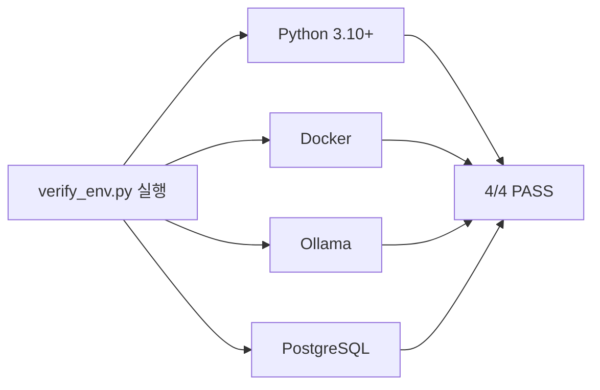
```mermaid
flowchart LR
    A["verify_env.py 실행"] --> B["Python 3.10+"]
    A --> C["Docker"]
    A --> D["Ollama"]
    A --> E["PostgreSQL"]
    B --> F["4/4 PASS"]
    C --> F
    D --> F
    E --> F
```

*그림 2-5: 환경 검증 스크립트가 4개 항목을 순서대로 점검하는 흐름*

```bash
python src/verify_env.py
```

<!-- [CAPTURE NEEDED: 02_verify-env-pass
  path: assets/CH02/02_verify-env-pass.png
  desc: `python src/verify_env.py` 실행 후 Python/Docker/Ollama/PostgreSQL 4개 항목 모두 [PASS] 로 표시된 터미널 화면
] -->
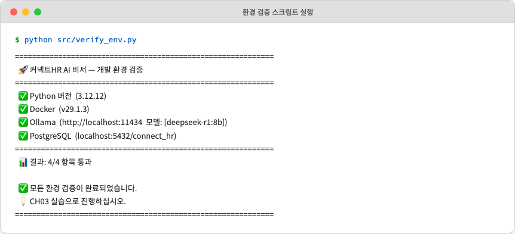
*그림 2-6: 환경 검증 스크립트 전항목 PASS 완료 화면*

메타코딩은 4개 항목 모두 PASS를 확인하고 안도하였습니다. "좋아, 환경 준비 완료. 이제 진짜 코딩을 시작할 수 있다."

> 전체 코드: `src/verify_env.py`

### FAIL 항목 대응 가이드

검증 결과에 FAIL 항목이 있다면 아래 대응 방법을 참고하십시오.

| FAIL 항목 | 원인 | 해결 방법 |
|---------|------|---------|
| Python 버전 | 3.10 미만 설치됨 | python.org에서 3.10+ 다운로드 |
| Docker | 미설치 또는 데몬 미실행 | Docker Desktop 설치 후 실행 |
| Ollama | 서버 미실행 | `ollama serve` 실행, 또는 설치 후 재시도 |
| PostgreSQL | 컨테이너 미실행 | `docker compose up -d` 실행 후 재시도 |

---

## 8. 정리하며

이번 챕터에서 메타코딩은 클라우드 API 비용과 보안 제약을 해결하는 로컬 LLM 실행 환경을 구축하였습니다.

<!-- [GEMINI PROMPT: 02_before-after]
path: assets/CH02/02_before-after.png
A minimalist black and white technical diagram with a strict 16:9 aspect ratio on a solid white background. No shading, no 3D effects, only clean thin line art. Simple before/after comparison infographic: LEFT side shows 'Before' with an X mark and text 'LLM 없음 / 월 $50+ / 수동 확인' in a box, RIGHT side shows 'After' with a check mark and text 'Ollama 로컬 / 월 $0 / 자동 검증 4/4 PASS' in a box, arrow pointing right in the middle. Clean flat monochrome style, Korean labels, 16:9 aspect ratio.
Style: before-after-infographic
-->
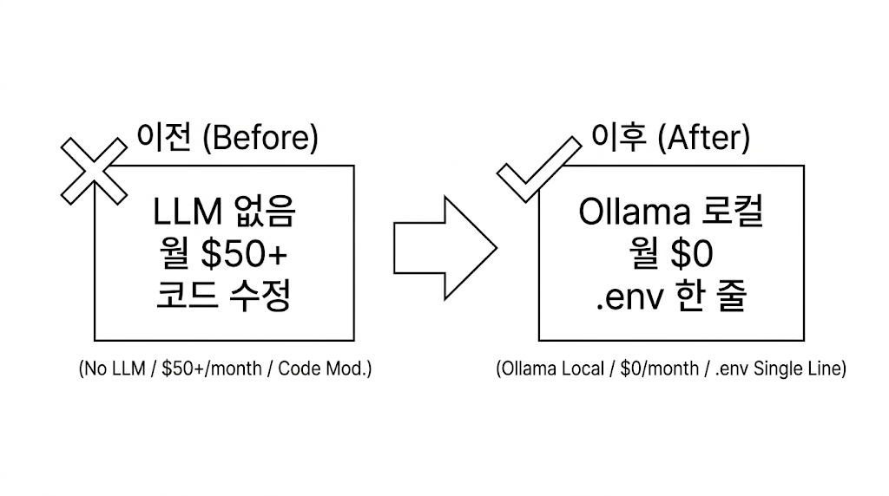
*그림 2-7: 챕터 시작 전후 비교 — 환경이 없던 상태에서 완전한 개발 환경 완성*

**이번 챕터의 핵심 내용을 정리합니다.**

- **Ollama로 로컬 LLM 실행**: DeepSeek R1:8b 모델을 로컬에서 무료로 실행합니다. 클라우드 API 의존 없이 사내 데이터를 안전하게 처리할 수 있습니다.
- **Docker로 PostgreSQL 격리 실행**: `docker compose up -d` 한 줄로 재현 가능한 DB 환경을 만듭니다.
- **환경 검증 자동화**: `verify_env.py` 스크립트가 4개 항목을 한 번에 점검합니다.
- **LLM Provider 전환**: `.env` 파일의 `LLM_PROVIDER` 값만 바꾸면 Ollama 또는 OpenAI로 전환됩니다. 사양이 부족한 환경에서도 실습을 진행할 수 있습니다.

| 지표 | Before | After |
|------|--------|-------|
| LLM 실행 환경 | 없음 | Ollama + DeepSeek R1 로컬 실행 |
| 월 비용 | (클라우드 기준) $50+ | $0 (로컬) |
| 환경 검증 | 수동 확인 | `verify_env.py` 자동 검증 4/4 PASS |

> **실습 환경 정리**
> 이 챕터의 환경 검증이 끝나면 PostgreSQL 컨테이너를 종료하십시오. 이후 챕터에서 동일 포트(5432)를 사용하므로 충돌이 발생할 수 있습니다.
> ```bash
> docker compose down
> ```

다음 챕터에서는 방금 구축한 환경에서 DeepSeek R1에 사내 질문을 직접 던져봅니다. LLM이 사내 데이터를 모를 때 어떤 일이 벌어지는지 직접 체험하고, RAG가 왜 필요한지를 스스로 느끼게 됩니다.


---

# 3. LLM의 한계와 RAG의 필요성

CH02에서 메타코딩은 Ollama와 DeepSeek R1을 설치하고, Docker PostgreSQL 환경을 구성하여 환경 검증 4/4 PASS를 달성하였습니다. 이제 LLM이 실제로 어떤 한계를 가지는지 직접 체험하고, 그 한계를 극복하는 방법인 RAG를 미리 맛봅니다.

이 챕터에서는 다음 네 단계를 순서대로 실습합니다.

1. LLM에 사내 정보를 직접 질문하여 **환각(Hallucination)** 을 체험합니다.
2. LLM이 환각을 일으키는 원인을 개념적으로 이해합니다.
3. 문서를 프롬프트에 직접 붙여넣는 **컨텍스트 주입(Context Injection)** 을 시도합니다.
4. 인메모리 ChromaDB를 활용한 **RAG(Retrieval-Augmented Generation)** 로 정확한 답변을 확인합니다.

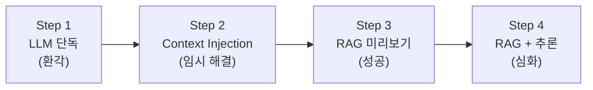
```mermaid
flowchart LR
    A["Step 1<br>LLM 단독<br>(환각)"] --> B["Step 2<br>Context Injection<br>(임시 해결)"]
    B --> C["Step 3<br>RAG 미리보기<br>(성공)"]
    C --> D["Step 4<br>RAG + 추론<br>(심화)"]
```

*그림 3-1: 4단계 실습 흐름 — 실패에서 시작하여 RAG 성공까지*

---

<!-- [GEMINI PROMPT: 03_01_metacoding-hallucination]
path: assets/CH03/03_01_metacoding-hallucination.png
Warm office illustration showing a developer (metacoding) looking puzzled at a computer screen, the screen displaying a chat interface with an AI response that shows incorrect leave policy information. Developer's expression conveys confusion and concern. Minimalist flat-design, white background with subtle warm office elements, Korean UI labels visible on screen, 16:9 aspect ratio.
Style: office-illustration-warm
-->

*그림 3-2: 메타코딩이 DeepSeek R1의 환각 응답을 처음 목격하는 순간*

---

## 1. [실패] LLM 단독 질의 — 환각 체험

환경 구축을 마친 메타코딩은 곧바로 DeepSeek R1에 사내 질문을 던져봅니다. "커넥트의 신입사원 연차 발생 규정이 어떻게 되지?" 간단한 질문이었습니다.

LLM은 자신 있는 말투로 "신입사원은 입사 후 1년이 지나면 15일의 연차가 부여됩니다"라고 답합니다. 그러나 커넥트의 실제 규정은 **입사 후 3년 동안 연차가 없고, 대신 매월 리프레시 데이를 제공**하는 파격적인 구조입니다. 그럴듯하지만 완전히 틀린 답변, 즉 환각이 발생하였습니다. 메타코딩은 이 순간 "LLM이 이렇게 자신 있게 틀린 답을 내놓는다면, 이대로는 실무에 쓸 수 없다"는 결론에 도달합니다.

이 실습을 직접 체험해 보겠습니다.

### 실습 준비

CH02에서 클론한 저장소의 예제 폴더로 이동하고 환경을 설정하십시오.

```bash
cd examples/CH03_LLM의_한계와_RAG의_필요성
python3.12 -m venv .venv
source .venv/bin/activate   # Windows: .\.venv\Scripts\Activate.ps1
pip install -r requirements.txt
```

이번 챕터에서 새로 사용하는 의존성은 다음과 같습니다.

| 패키지 | 역할 |
|-------|------|
| `langchain` | LLM 애플리케이션 프레임워크입니다. 프롬프트, 체인, 검색기를 하나로 연결합니다. |
| `langchain-ollama` | LangChain에서 Ollama를 사용하기 위한 패키지입니다. `ChatOllama`(LLM 호출)와 `OllamaEmbeddings`(텍스트→벡터 변환)를 제공합니다. |
| `langchain-chroma` | LangChain에서 ChromaDB 벡터스토어를 사용하기 위한 패키지입니다. |
| `langchain-classic` | `RetrievalQA` 체인을 제공합니다. 검색기(Retriever)와 LLM을 연결하여 "검색→답변" 파이프라인을 한 줄로 구성합니다. |
| `chromadb` | 벡터 데이터베이스입니다. 텍스트를 벡터로 저장하고 유사도 검색을 수행합니다. 이 챕터에서는 인메모리 모드로 사용합니다. |

> **참고: nomic-embed-text 모델**
> step3, step4에서 임베딩 모델 `nomic-embed-text` 가 필요합니다. 아직 다운로드하지 않았다면 `ollama pull nomic-embed-text` 를 실행하십시오.

### LLM 단독 실행

Ollama가 실행 중인 상태에서 첫 번째 스크립트를 실행합니다.

```bash
python step1_fail.py
```

> **주의: Ollama가 실행 중이어야 합니다**
> `ollama serve` 명령으로 Ollama를 먼저 실행한 뒤 스크립트를 실행하십시오.

코드는 단순합니다. LangChain의 `ChatOllama` 로 로컬 LLM에 연결하고, 사내 규정을 질문합니다.

```python
from langchain_ollama import ChatOllama

llm = ChatOllama(model="deepseek-r1:8b", temperature=0)

question = "우리 회사(커넥트)의 신입사원 연차 발생 규정이 어떻게 돼?"

print(f"질문: {question}\n")
response = llm.invoke(question)
print(f"답변:\n{response.content}")
```

잠시 후 터미널에 LLM의 답변이 출력됩니다.

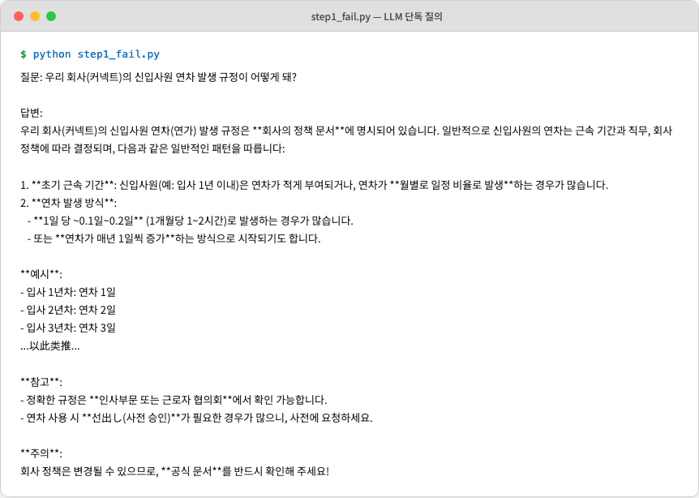
*그림 3-3: LLM이 사내 정보를 모른 채 그럴듯한 답변을 생성하는 환각 현상*

> **참고:** LLM 응답은 실행할 때마다 달라집니다. 화면과 다른 결과가 나와도 정상입니다.

> **전체 코드:** `step1_fail.py`

메타코딩은 실행 결과를 보고 "이 정도면 충분히 그럴듯한데, 왜 틀리는 거지?"라는 의문이 들었습니다. LLM의 답변이 문법적으로 자연스럽고 형식도 정확해 보이지만, 커넥트의 취업규칙에는 전혀 없는 내용이었습니다. 환각이 자신 있는 말투로 포장된다는 점이 문제의 핵심이었습니다.

> **참고: 왜 LLM 단독 실행을 먼저 보여주는가**
> "안 되는 것"을 직접 체감해야 "왜 RAG가 필요한가"에 대한 동기가 생깁니다. 이 실습 없이 RAG를 설명하면 독자는 "LLM만 써도 되지 않나?"라는 의문이 해소되지 않습니다.

---

## 2. 왜 LLM은 환각을 일으키는가

방금 체험한 현상의 원인을 이해해야 올바른 해결책을 선택할 수 있습니다.

### 파라메트릭 지식과 컨텍스트 지식

LLM은 두 종류의 지식을 사용합니다.

<!-- [GEMINI PROMPT: 03_parametric-vs-context]
path: assets/CH03/03_parametric-vs-context.png
A minimalist black and white technical diagram with a strict 16:9 aspect ratio on a solid white background. No shading, no 3D effects, only clean thin line art. Two large boxes side by side. Left box labeled "파라메트릭 지식 (Parametric Knowledge)" contains brain icon with label "LLM 모델 가중치". Inside list: "학습 데이터에서 습득", "훈련 후 고정됨", "사내 비공개 정보 없음". Right box labeled "컨텍스트 지식 (Context Knowledge)" contains document stack icon. Inside list: "프롬프트로 실시간 주입", "최신 정보 반영 가능", "토큰 한계 내에서만 가능". Arrow from right box pointing down to center bottom labeled "RAG = 컨텍스트 지식을 자동 주입". White background, Korean labels, 16:9 aspect ratio.
Style: architecture-infographic
-->
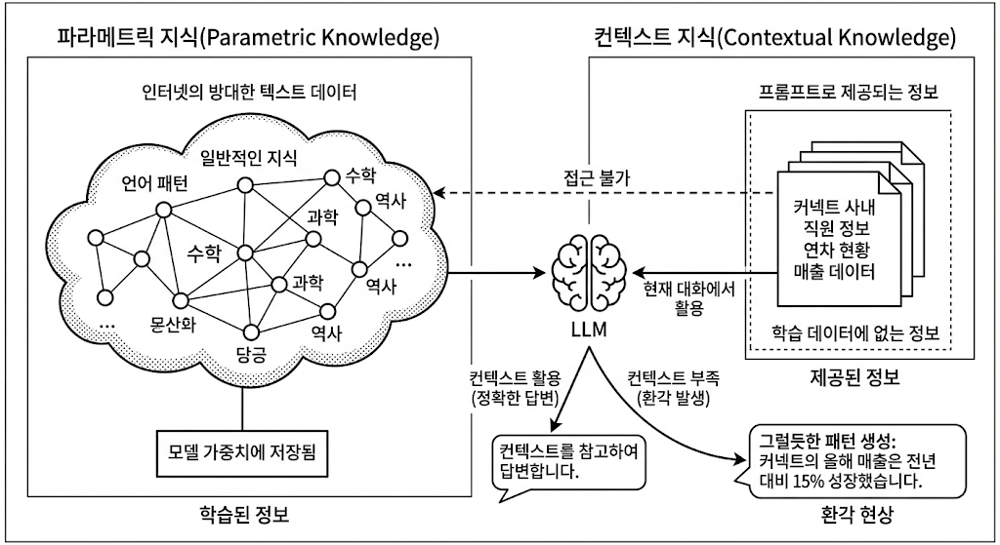
*그림 3-4: LLM의 두 가지 지식 유형 — 파라메트릭은 훈련 시 고정되고, 컨텍스트는 프롬프트로 주입된다*

**파라메트릭 지식(Parametric Knowledge)** 은 모델 가중치에 저장된 지식입니다. 모델이 학습할 때 인터넷, 책, 코드 등 수십억 개의 문서를 통해 습득하였으며, 훈련이 끝난 뒤에는 변경되지 않습니다. 이 지식에는 두 가지 근본적인 한계가 있습니다.

첫째, **사내 비공개 정보 부재** 문제입니다. "커넥트의 신입사원 연차 규정"은 회사 내부에만 존재하는 정보입니다. 사내 규정이나 인사 데이터는 인터넷에 공개된 적이 없으므로, LLM이 이 정보를 학습할 수 있는 경로 자체가 없습니다.

둘째, **학습 데이터 컷오프(Cutoff)** 문제입니다. DeepSeek R1:8b 모델은 2024년 초까지의 공개 데이터로 학습되었습니다. 따라서 이후에 변경된 공개 정보(법률 개정, 기술 업데이트 등)도 알 수 없습니다.

**컨텍스트 지식(Context Knowledge)** 은 프롬프트를 통해 실시간으로 주입하는 지식입니다. LLM은 프롬프트에 포함된 내용을 마치 방금 읽은 자료처럼 참고할 수 있습니다. 이것이 Context Injection의 원리이며, RAG의 출발점이기도 합니다.

### 왜 모른다고 하지 않고 만들어내는가

LLM은 "모른다"고 말하도록 설계되어 있지 않습니다. 언어 모델의 본질은 주어진 맥락에서 가장 그럴듯한 다음 토큰을 예측하는 것입니다. 질문을 받으면 가장 자연스러운 답변 형태를 생성하는데, 이 과정에서 사실 여부를 검증하는 단계가 없습니다.

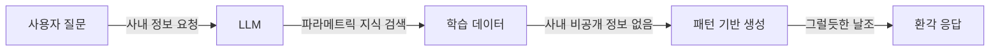
```mermaid
flowchart LR
    A["사용자 질문"] -- "사내 정보 요청" --> B["LLM"]
    B -- "파라메트릭 지식 검색" --> C["학습 데이터"]
    C -- "사내 비공개 정보 없음" --> D["패턴 기반 생성"]
    D -- "그럴듯한 날조" --> E["환각 응답"]
```

*그림 3-5: LLM이 사내 정보를 모를 때 환각을 일으키는 흐름*

결과적으로 LLM은 "그럴듯한 형태의 답변"을 생성합니다. 숫자가 나와야 할 자리에 숫자를 넣고, 규정이 나와야 할 자리에 규정을 넣습니다. 이것이 환각(Hallucination)입니다.

> **참고: 환각이 위험한 이유**
> LLM이 생성한 환각 답변은 대부분 "확신에 찬 문체"로 작성됩니다. 틀린 정보를 마치 사실인 것처럼 말하기 때문에 비전문가가 구분하기 어렵습니다. 잘못된 연차 정보가 그대로 전달된다면 직원 불만, 급여 오류, 법적 문제로 이어질 수 있습니다.

> **팁: "모른다"고 말하게 하는 방법**
> 프롬프트에 "문서에 없는 내용은 '확인할 수 없습니다'라고 답변하십시오"라는 규칙을 명시하면 환각을 줄일 수 있습니다. 그러나 사내 정보가 아예 없는 상태에서는 이 규칙만으로 환각을 완전히 방지하기 어렵습니다. 근본적인 해결책은 관련 정보를 컨텍스트로 제공하는 것입니다.

---

## 3. [임시 해결] Context Injection 맛보기

메타코딩이 떠올린 첫 번째 해결책은 간단합니다. "LLM이 사내 정보를 모른다면, 내가 직접 알려주면 되지 않을까?" 즉, 사내 문서를 프롬프트에 직접 붙여넣는 방식입니다. 이를 **컨텍스트 주입(Context Injection)** 이라 합니다.

### 실습: Context Injection

```bash
python step2_context.py
```

이 스크립트는 커넥트의 취업규칙을 변수에 담고, 프롬프트에 직접 포함시켜 LLM에 전달합니다.

```python
# 1. 정보를 변수에 담습니다 (아직 DB 안 씀)
context_data = """
[커넥트 취업규칙]
1. 신입사원은 입사 후 3년 동안은 연차가 없다. (파격적인 규정)
2. 대신 매월 1회 '리프레시 데이'를 유급으로 제공한다.
3. 3년 근속 시 30일의 연차가 일시에 발생한다.
"""

# 2. 프롬프트에 정보를 포함시킵니다.
prompt = f"""
아래 [참고 정보]를 보고 질문에 답해줘.
[참고 정보]
{context_data}

질문: {question}
"""
response = llm.invoke(prompt)
```

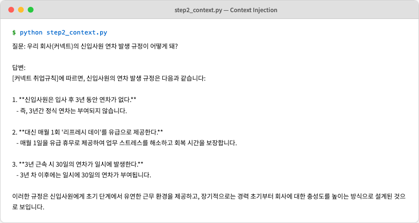
*그림 3-6: Context Injection 실행 결과 — 프롬프트에 데이터를 넣자 정확한 답변이 나온다*

> **참고:** LLM 응답은 실행할 때마다 달라집니다. 화면과 다른 결과가 나와도 정상입니다.

> **전체 코드:** `step2_context.py`

이번에는 LLM이 제공된 규정을 기반으로 정확하게 답변합니다. 메타코딩은 "프롬프트에 데이터를 직접 넣으니까 바로 정확한 답이 나오네"라며 만족했지만, 곧 이 방식의 한계를 깨닫게 됩니다.

### Context Injection의 한계

실습에서 확인한 것처럼 프롬프트에 데이터를 직접 넣으면 정확도가 올라갑니다. 하지만 이 방법에는 세 가지 한계가 있습니다.

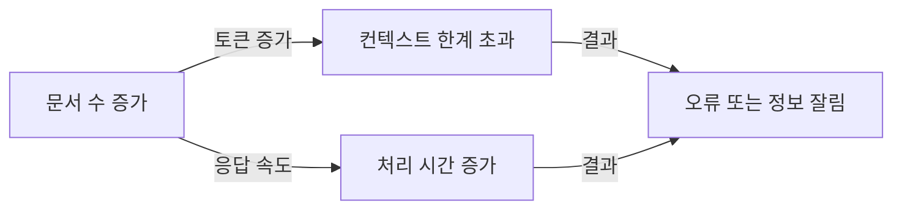
```mermaid
flowchart LR
    A["문서 수 증가"] -- "토큰 증가" --> B["컨텍스트 한계 초과"]
    A -- "응답 속도" --> C["처리 시간 증가"]
    B -- "결과" --> D["오류 또는 정보 잘림"]
    C -- "결과" --> D
```

*그림 3-7: 문서가 늘어날수록 Context Injection의 한계가 누적된다*

- **토큰 한계**: DeepSeek R1:8b는 약 4,096~8,192토큰의 컨텍스트를 처리합니다. 사내 문서 한 개가 평균 500~1,000토큰이라면 최대 8~16개의 문서밖에 프롬프트에 담을 수 없습니다.
- **비용 증가**: OpenAI API를 사용하는 경우 토큰 수에 비례하여 비용이 증가합니다. 1,000개의 문서를 매번 프롬프트에 담으면 API 비용이 폭발합니다.
- **관련성 없는 정보**: 모든 문서를 무조건 삽입하면 LLM이 오히려 관련 없는 정보에 혼동되어 정확도가 떨어질 수 있습니다.

| 접근 방식 | 정확도 | 토큰 사용량 | 실현 가능성 |
|---------|--------|---------|----------|
| LLM 단독 | 0% (환각) | 소량 | 가능 (단, 부정확) |
| Context Injection | 높음 | 문서 수에 비례 폭증 | 소수 문서만 가능 |
| RAG | 높음 | 관련 청크만 사용 | 가능 (수천 문서) |

메타코딩은 "문서 3개만 넣어도 토큰이 부족해지는데, 커넥트의 수백 개 사내 문서를 다 넣을 수는 없잖아"라며 다른 방법을 찾기 시작합니다.

---

## 4. [성공] RAG 미리보기 — 필요한 부분만 찾아서 답합니다

메타코딩이 도달한 핵심 아이디어는 다음과 같습니다. "모든 문서를 넣을 수는 없지만, 질문과 관련된 문서만 골라서 넣으면 어떨까?" 이것이 바로 **RAG(Retrieval-Augmented Generation, 검색 증강 생성)** 의 핵심 개념입니다.

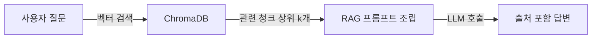
```mermaid
flowchart LR
    A["사용자 질문"] -- "벡터 검색" --> B["ChromaDB"]
    B -- "관련 청크 상위 k개" --> C["RAG 프롬프트 조립"]
    C -- "LLM 호출" --> D["출처 포함 답변"]
```

*그림 3-8: RAG의 핵심 흐름 — 전체 문서 대신 관련 청크만 선택하여 LLM에 전달한다*

### 핵심 개념: 청킹, 임베딩, 그리고 k-값

RAG를 이해하려면 세 가지 개념을 알아야 합니다.

| 개념 | 설명 | 비유 |
| :--- | :--- | :--- |
| **청킹(Chunking)** | 긴 문서를 AI가 처리하기 좋은 작은 단위로 쪼개는 것 | 책을 찢어서 포스트잇으로 만들기 |
| **임베딩(Embedding)** | 텍스트를 AI가 이해하는 숫자(벡터)로 변환하는 것 | 단어를 지도상의 좌표로 바꾸기 |
| **Top-K 검색(k-값)** | 검색 시 가져올 문서 조각의 개수 | 질문과 관련된 상위 N개의 포스트잇 고르기 |

**청킹(Chunking)** 은 긴 문서를 작은 단위로 분할하는 과정입니다. 문서를 통째로 검색하면 정밀도가 낮아집니다. "신입사원 휴가 규정"을 질문했는데 5페이지짜리 전체 규정이 검색된다면, 불필요한 정보가 많이 포함됩니다. 규정별로 나누면 각 청크가 특정 주제에 집중되어 검색 정밀도가 높아집니다.

<!-- [GEMINI PROMPT: 03_chunking-concept]
path: assets/CH03/03_chunking-concept.png
A minimalist black and white technical diagram with a strict 16:9 aspect ratio on a solid white background. No shading, no 3D effects, only clean thin line art. Left side shows a large document rectangle labeled "원본 문서 (전체 규정)" with a scissors icon cutting it. Right side shows three smaller rectangles labeled "인사규정", "보안규정", "복지규정". Below right side: cylinder database icon labeled "ChromaDB" with arrow pointing from each chunk. Below the database: magnifying glass icon with arrow back up pointing to "인사규정" highlighted with a dashed border, labeled "질문 관련 청크만 검색". White background, Korean labels, 16:9 aspect ratio.
Style: architecture-infographic
-->
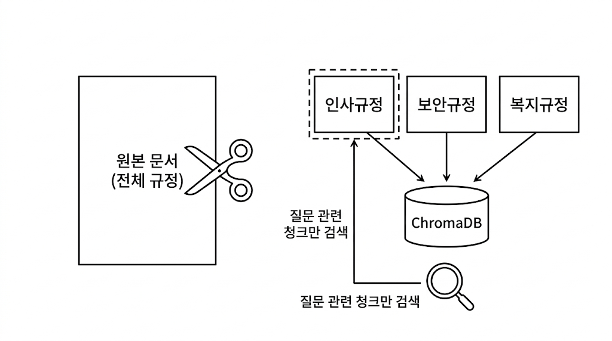
*그림 3-9: 청킹은 긴 문서를 검색 가능한 작은 단위로 분할한다*

### 인메모리 ChromaDB 사용 이유

이 챕터에서는 **인메모리(In-memory)** ChromaDB를 사용합니다. 디스크에 저장하지 않고 메모리에서만 동작하므로 실행 종료 시 데이터가 사라집니다. CH06에서 ChromaDB를 영속화하는 방법을 다루지만, 이 챕터의 목적은 "체험"입니다. 영속화 없이 가볍게 실행하여 RAG의 효과를 확인하는 것이 우선입니다.

### 실습: 청킹 유무에 따른 비교

두 개의 스크립트로 청킹의 효과를 비교합니다.

**청킹 없이 통째로 넣기 (비권장)**

```bash
python step3_rag_no_chunking.py
```

이 스크립트는 인사규정, 보안규정, 복지규정을 하나의 긴 문자열로 합쳐서 ChromaDB에 저장합니다. 검색해도 전체 텍스트가 통째로 반환됩니다.

```python
# 모든 텍스트를 하나의 문자열로 합침 (통짜 데이터)
context_all = """
[인사규정] 신입사원 휴가 및 연차: ...
[보안규정] 업무 보안: ...
[복지규정] 식대 지원: ...
"""
docs_bad = [Document(page_content=context_all, metadata={"source": "전체규정"})]
```


*그림 3-10: 청킹 미적용 — 전체 규정이 통째로 반환되어 비효율적이다*

> **참고:** LLM 응답은 실행할 때마다 달라집니다. 화면과 다른 결과가 나와도 정상입니다.

**청킹 적용하여 쪼개서 넣기 (권장)**

```bash
python step3_rag.py
```

이 스크립트는 각 규정을 별도의 `Document` 객체로 분리하여 ChromaDB에 저장합니다. 검색 시 질문과 관련 있는 규정만 선택됩니다.

```python
# 더미 데이터 준비 (청킹: 규정별로 분리)
docs = [
    Document(page_content="[인사규정] 신입사원 휴가 및 연차: ...",
             metadata={"source": "인사규정"}),
    Document(page_content="[보안규정] 업무 보안: ...",
             metadata={"source": "보안규정"}),
    Document(page_content="[복지규정] 식대 지원: ...",
             metadata={"source": "복지규정"}),
]
```


*그림 3-11: 청킹 적용 시 관련 규정만 검색되어 정확한 답변이 생성된다*

> **참고:** LLM 응답은 실행할 때마다 달라집니다. 화면과 다른 결과가 나와도 정상입니다.

> **전체 코드:** `step3_rag.py`, `step3_rag_no_chunking.py`

청킹을 적용한 경우, LLM이 각 문서의 출처(`[인사규정]`, `[복지규정]` 등)를 인지하고 관련 정보만 참고하여 답변합니다. 청킹이 없으면 AI는 "정보의 바다에서 바늘 찾기"를 해야 합니다. 청킹은 AI에게 **"정답이 적힌 포스트잇만 골라서 주는 것"** 과 같습니다.

메타코딩은 청킹 적용 전후의 차이를 보고, 데이터를 어떻게 쪼개느냐가 검색 품질을 좌우한다는 사실을 실감하였습니다.

### 코드 핵심 구조

`step3_rag.py` 의 RAG 파이프라인은 5단계로 구성됩니다.

```python
# 1. 임베딩 모델 설정 (nomic-embed-text: Ollama에서 제공하는 임베딩 모델)
embeddings = OllamaEmbeddings(model="nomic-embed-text")          # ①

# 2. VectorDB 생성 (문서를 벡터로 변환하여 ChromaDB에 저장)
vectorstore = Chroma.from_documents(
    documents=docs, embedding=embeddings
)                                                                 # ②

# 3. 검색기 설정 (질문과 유사한 문서 k개를 검색)
retriever = vectorstore.as_retriever(search_kwargs={"k": 3})     # ③

# 4. RAG 체인 연결 (검색기 + LLM을 하나의 체인으로 연결)
qa_chain = RetrievalQA.from_chain_type(
    llm=llm,
    retriever=retriever,
    return_source_documents=True,
    chain_type_kwargs={"prompt": PROMPT}
)                                                                 # ④

# 5. 질문 실행
result = qa_chain.invoke({"query": question})                    # ⑤
```

> ① `nomic-embed-text` 는 Ollama가 제공하는 임베딩 모델입니다. 텍스트를 벡터(숫자 배열)로 변환하여 유사도 검색을 가능하게 합니다.
> ② `Chroma.from_documents()` 는 문서 리스트를 받아 각 문서를 임베딩하고 ChromaDB에 저장합니다. 별도의 서버 없이 인메모리로 동작합니다.
> ③ `as_retriever()` 는 ChromaDB를 LangChain의 검색기(Retriever) 인터페이스로 감쌉니다. `k=3` 은 질문과 가장 유사한 문서 3개를 반환하라는 설정입니다.
> ④ `RetrievalQA.from_chain_type()` 은 검색기와 LLM을 하나의 체인으로 연결합니다. 질문이 들어오면 자동으로 검색 → 프롬프트 조립 → LLM 호출까지 처리합니다.
> ⑤ `invoke()` 를 호출하면 RAG 파이프라인 전체가 실행됩니다. 결과에는 AI 답변(`result`)과 검색된 원본 문서(`source_documents`)가 포함됩니다.

> **팁: 청크 크기는 절충점이 있습니다**
> 청크가 너무 작으면 문장이 잘려 의미가 손실됩니다. 너무 크면 검색 정밀도가 낮아집니다. 일반적으로 300~500자에 10~20% 중첩이 균형점입니다. CH10에서 청크 크기 실험을 통해 최적값을 탐색하는 방법을 다룹니다.

---

## 5. [심화] DeepSeek R1 추론 능력 확인

RAG로 정확한 답변을 확인한 메타코딩은 곧바로 다음 질문이 떠올랐습니다. "규정 검색은 됐는데, 계산이 필요한 질문은 어떻게 하지?" RAG는 단순 검색+답변을 넘어 추론(계산, 집계)이 필요한 질문에도 대응할 수 있습니다.

### 추론(Reasoning)이 필요한 이유

현실의 질문은 문서에서 한 문장을 찾는 것으로 끝나지 않습니다. "신입사원 휴가 규정이 뭐야?"는 단순 검색으로 답할 수 있지만, "입사 6개월차인데 리프레시 데이 2번 썼어, 몇 번 남았어?"는 규정을 찾은 뒤 계산까지 해야 합니다.

AI가 수행해야 할 사고 과정은 다음과 같습니다.

1. **검색**: "리프레시 데이 관련 규정을 찾자." → 결과: 매월 1회 제공 확인
2. **분석**: "사용자는 입사 6개월차이므로 총 6번 발생했다."
3. **계산**: "6번 - 2번 = 4번 남았다."
4. **최종 답변**: "남은 리프레시 데이는 4번입니다."

**DeepSeek R1** 과 같은 추론 모델은 **Chain-of-Thought(사고 과정 명시)** 방식으로 이러한 단계별 계산을 수행합니다.

> **참고: Chain-of-Thought(CoT)란?**
> 일반적인 LLM은 질문을 받으면 바로 답을 생성합니다. 반면 Chain-of-Thought 방식은 답을 내기 전에 "생각하는 과정"을 먼저 출력합니다. "6개월이니까 6번 발생 → 2번 사용 → 4번 남음"처럼 중간 단계를 명시하기 때문에 계산 정확도가 높아지고, 결과를 사람이 검증할 수 있습니다. DeepSeek R1은 이 방식으로 훈련된 대표적인 추론 모델입니다.

### 실습: RAG + 추론

```bash
python step4_rag.py
```

이 스크립트는 step3_rag.py와 동일한 RAG 파이프라인을 사용하되, 추론이 필요한 복잡한 질문을 던집니다.

```python
# 추론이 필요한 복잡한 질문
question = "입사 6개월차 신입인데 리프레시 데이 2번 썼어. 몇 번 남았는지 규정 기반으로 계산해줘."
```

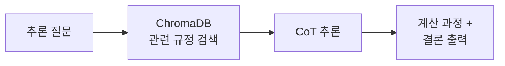
```mermaid
flowchart LR
    A["추론 질문"] --> B["ChromaDB<br/>관련 규정 검색"]
    B --> C["CoT 추론"]
    C --> D["계산 과정 +<br/>결론 출력"]
```

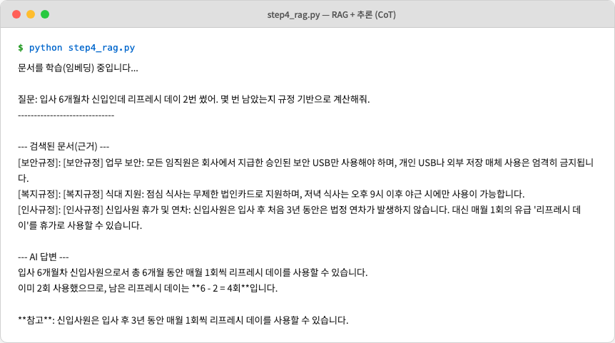
*그림 3-12: DeepSeek R1이 규정을 검색한 뒤 단계별로 계산하여 답변하는 추론 과정*

> **참고:** LLM 응답은 실행할 때마다 달라집니다. 화면과 다른 결과가 나와도 정상입니다.

> **전체 코드:** `step4_rag.py`

메타코딩은 LLM이 "매월 1회 × 6개월 = 6회, 6회 - 2회 = 4회"와 같은 계산 과정을 단계별로 출력하는 것을 보고, 단순 답변 생성기가 아니라 검증 가능한 추론 도구로 쓸 수 있다는 가능성을 확인하였습니다.

> **참고: 소형 모델의 추론 한계**
> `deepseek-r1:8b` 보다 작은 모델은 수치 계산에서 부정확한 결과를 낼 수 있습니다. 정확한 Chain-of-Thought 결과를 확인하려면 8b 이상 모델을 사용하십시오.

---

## 6. 정리하며

메타코딩은 4단계 실습을 통해 LLM 단독 사용의 한계와 RAG의 가능성을 직접 체험하였습니다.

<!-- [GEMINI PROMPT: 03_03_before-after-rag]
path: assets/CH03/03_03_before-after-rag.png
Simple before/after comparison infographic: LEFT side shows "LLM 단독: 환각 응답" with red X indicator and text "정확도 0% / 환각 발생", RIGHT side shows "RAG 적용: 출처 포함 답변" with green check indicator and text "정확도 85%+ / 출처 명시", arrow in the middle pointing right, clean flat design, minimalist black and white with red/green accents, white background, Korean labels.
Style: before-after-infographic
-->
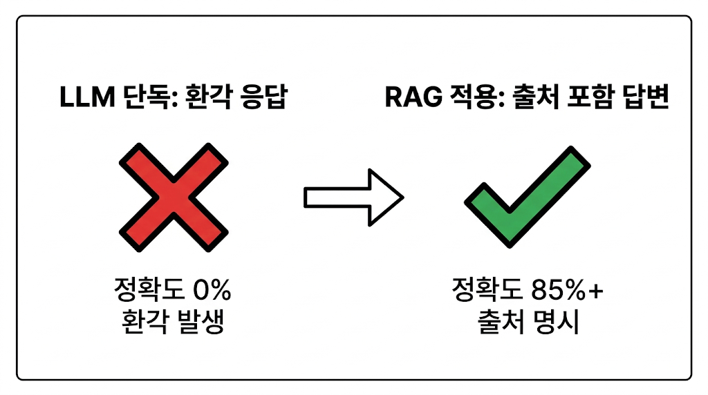
*그림 3-13: LLM 단독 사용(환각)과 RAG 적용(출처 포함 답변) 비교*

### 4단계 결과 비교표

| 단계 | 방법 | 정확도 | 출처 제시 | 확장 가능성 | 핵심 한계 |
|------|------|--------|---------|-----------|---------|
| Step 1 | LLM 단독 | 낮음 (환각) | 없음 | 높음 | 사내 정보 없음 |
| Step 2 | Context Injection | 높음 | 없음 | 낮음 | 토큰 한계 |
| Step 3 | RAG 미리보기 | 높음 | 있음 | 높음 | 인메모리 (임시) |
| Step 4 | RAG + 추론 | 높음 | 있음 | 높음 | — |

### 핵심 요약

- **환각은 구조적 한계입니다**: LLM은 학습 데이터에 없는 사내 비공개 정보를 알 수 없어 그럴듯한 내용을 생성합니다. 이는 결함이 아니라 파라메트릭 지식의 한계에서 비롯됩니다.
- **Context Injection은 임시 해결책입니다**: 소수의 문서에서는 효과적이지만, 토큰 한계로 인해 문서가 늘어날수록 한계에 부딪힙니다. 실제 사내 시스템의 수백~수천 개 문서를 처리할 수 없습니다.
- **RAG는 "필요한 부분만" 찾아줍니다**: 청킹과 벡터 유사도 검색으로 관련 문서만 선택하여 토큰 제한을 우회합니다. 문서가 아무리 많아도 검색 대상에 추가하기만 하면 됩니다.
- **추론 능력은 검색 이후의 가치를 높입니다**: RAG로 관련 데이터를 찾고, DeepSeek R1의 Chain-of-Thought로 계산과 분석까지 처리할 수 있습니다.

### 다음 챕터 예고

이제 RAG의 필요성과 기본 원리를 체험하였습니다. 그런데 RAG가 실제로 답변할 "사내 데이터"가 아직 없습니다. 직원 정보는 Excel, 휴가 현황은 수동 집계, 매출은 부서별 파일로 흩어져 있습니다. CH04에서는 FastAPI와 PostgreSQL로 AI 비서의 정형 데이터 기반이 되는 사내 시스템을 구축합니다. "AI 비서보다 기본 시스템이 먼저다"라는 것을 메타코딩과 함께 확인해 보겠습니다.


---

# 4. FastAPI로 초간단 사내 시스템 만들기

CH03에서 메타코딩은 RAG가 사내 질문에 정확히 답할 수 있음을 직접 확인하였습니다. 그런데 막상 "김철수 사원의 남은 연차는?"이라는 질문을 AI 비서에게 던지려 하니 치명적인 문제가 드러났습니다. AI가 답변을 가져올 **연차 데이터 자체가 시스템 어디에도 없었습니다.**

이 챕터에서는 **FastAPI(Python 기반 비동기 웹 프레임워크)** 와 **PostgreSQL** 을 사용하여 직원, 휴가, 매출을 관리하는 사내 기본 시스템을 구축합니다. 이 시스템은 CH08에서 MCP(Model Context Protocol)로 연결되어 AI 비서가 DB를 직접 조회하는 토대가 됩니다.

---

<!-- [GEMINI PROMPT: 04_excel-problem]
path: assets/CH04/04_excel-problem.png
Minimalist flat-design illustration showing a person sitting at a desk with multiple scattered spreadsheet files labeled '직원현황.xlsx', '휴가대장.xlsx', '매출집계.xlsx'. An arrow points from these scattered files to a single unified server database cylinder. White background, Korean labels, 16:9 aspect ratio. Clean line art, black and white.
Style: office-illustration-warm
-->

*그림 4-1: 커넥트의 현재 상황 — 직원 정보, 휴가, 매출이 엑셀 파일로 분산되어 있다*

---

## 1. 프로젝트 구성

메타코딩이 확인한 커넥트의 현실은 다음과 같았습니다. 직원 정보는 인사팀 PC의 `직원현황.xlsx`에, 휴가 현황은 팀장이 수기로 관리하는 스프레드시트에, 매출 데이터는 부서마다 다른 형식의 파일에 흩어져 있었습니다. AI 비서를 만들기 전에 **기본 사내 시스템부터 만들어야 한다는 것** 을 메타코딩은 이 순간 깨달았습니다.

메타코딩이 선택한 해결책은 FastAPI였습니다. React 같은 프론트엔드 프레임워크를 별도로 배울 시간이 없었고, Python만으로 API와 웹 UI를 함께 만들 수 있는 구조가 필요했기 때문입니다.

### 1.1 예제 폴더 이동

CH02에서 클론한 저장소의 예제 폴더로 이동합니다.

```bash
cd examples/CH04_FastAPI_기본_시스템
```

### 1.2 환경 변수 설정

```bash
cp .env.example .env
```

`.env` 파일의 내용은 다음과 같습니다. Docker Compose 기본값과 일치하므로 별도 수정 없이 사용할 수 있습니다.

```ini
POSTGRES_HOST=localhost
POSTGRES_PORT=5432
POSTGRES_DB=connect_hr
POSTGRES_USER=connect_hr
POSTGRES_PASSWORD=connect_hr_pass

FASTAPI_HOST=0.0.0.0
FASTAPI_PORT=8000
```

### 1.3 의존성 설치 및 실행

`requirements.txt`에는 다음 패키지들이 포함되어 있습니다.

| 패키지 | 역할 |
|--------|------|
| `fastapi` | 비동기 웹 프레임워크 |
| `uvicorn` | ASGI 서버 (FastAPI 실행) |
| `jinja2` | HTML 템플릿 엔진 (Admin UI) |
| `psycopg2-binary` | PostgreSQL 드라이버 |
| `python-dotenv` | `.env` 파일 환경 변수 로드 |
| `pydantic` | 요청/응답 데이터 검증 |

> **주의: 이전 챕터 실습 환경 정리**
> CH02의 PostgreSQL 컨테이너가 실행 중이라면 먼저 종료하십시오. 동일 포트(5432)를 사용하므로 충돌이 발생합니다.
> ```bash
> cd ../CH02_개발_환경_설정
> docker compose down
> cd ../CH04_FastAPI_기본_시스템
> ```

```bash
pip install -r requirements.txt
docker compose up -d
uvicorn app.main:app --reload
```

> **팁: docker compose up -d 가 핵심**
> PostgreSQL을 직접 설치하면 OS마다 설정이 달라집니다. `docker compose up -d` 한 줄이면 PostgreSQL 16이 컨테이너로 실행되고, `data/schema.sql`이 자동으로 적용되어 시드 데이터(직원 5명, 연차 5건, 매출 10건)까지 입력됩니다.

서버가 기동되면 브라우저에서 두 주소를 확인하십시오.

| 주소 | 용도 |
|------|------|
| `http://localhost:8000/admin/dashboard` | Admin UI (대시보드) |
| `http://localhost:8000/docs` | Swagger 자동 API 문서 |


*그림 4-1a: Admin UI 대시보드 — 직원 수, 연차, 매출 통계를 한눈에 확인*


*그림 4-1b: Swagger 자동 API 문서 — Pydantic 스키마 기반으로 자동 생성된다*

### 1.4 폴더 구조

```
CH04_FastAPI_기본_시스템/
├── app/
│   ├── main.py        ← FastAPI 앱 진입점, 라우터 등록
│   ├── database.py    ← PostgreSQL 연결 컨텍스트 매니저
│   ├── models.py      ← 도메인 모델 (dataclass)
│   ├── schemas.py     ← Pydantic 요청/응답 스키마
│   ├── crud.py        ← CRUD 함수 (SQL 실행)
│   ├── views.py       ← Admin UI 뷰 라우터 (Jinja2)
│   └── api.py         ← REST JSON API 라우터
├── templates/         ← Jinja2 HTML 템플릿
│   ├── base.html      ← 공통 레이아웃 (CH07/CH08 계승)
│   ├── dashboard.html
│   ├── employees.html
│   ├── leaves.html
│   └── sales.html
├── static/css/
│   └── style.css      ← Admin UI 스타일
├── data/
│   └── schema.sql     ← 테이블 DDL + 시드 데이터
├── docker-compose.yml
├── requirements.txt
└── .env.example
```

> **참고: FastAPI를 선택한 이유**
> FastAPI는 `async/await` 기반 비동기 처리를 지원하며, Pydantic으로 요청 데이터를 자동 검증하고, `/docs` 경로에서 Swagger UI를 자동으로 생성합니다. CH08에서 LangChain Agent가 HTTP로 이 API를 호출할 때, Swagger 문서가 그대로 MCP Tool의 스키마 참고 자료가 됩니다.

### 1.5 FastAPI 앱 진입점

`main.py`는 FastAPI 인스턴스를 생성하고, 정적 파일 마운트와 Admin UI(`/admin/*`) · REST API(`/api/*`) 라우터를 등록하는 진입점입니다. 루트(`/`) 접근 시 대시보드로 자동 리다이렉트됩니다.

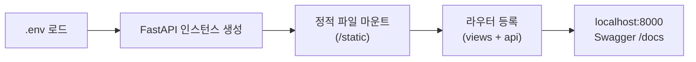
```mermaid
flowchart LR
    A[".env 로드"] --> B["FastAPI 인스턴스 생성"] --> C["정적 파일 마운트<br>(/static)"] --> D["라우터 등록<br>(views + api)"] --> E["localhost:8000<br>Swagger /docs"]
```

환경 변수를 읽은 뒤 라우터를 순서대로 등록하면, 단일 서버가 Admin UI와 REST API 두 역할을 동시에 담당합니다. 메타코딩은 이 구조가 CH08 MCP 연동 때도 변경 없이 그대로 쓰인다는 점이 마음에 들었습니다.

> 전체 코드: `app/main.py`

---

## 2. 데이터 모델 설계

메타코딩은 AI 비서가 답해야 할 질문들을 역순으로 추적하여 3개의 테이블을 도출하였습니다. "김민준 사원의 남은 연차는?"이라는 질문에 답하려면 **직원 테이블(employee)** 과 **휴가 잔여 테이블(leave_balance)** 이 필요하고, "개발팀의 올해 매출은?"에는 **매출 테이블(sales)** 이 필요합니다.

### 2.1 ERD
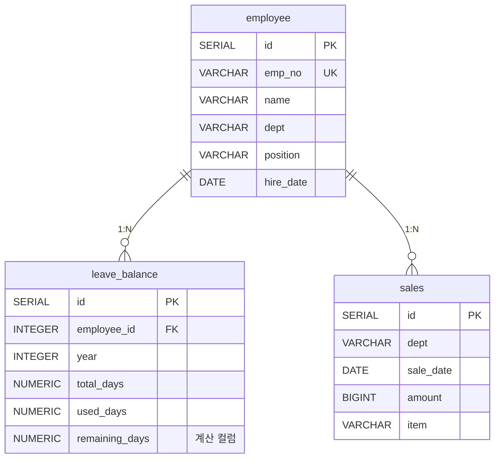
```mermaid
erDiagram
    employee {
        SERIAL id PK
        VARCHAR emp_no UK
        VARCHAR name
        VARCHAR dept
        VARCHAR position
        DATE hire_date
    }
    leave_balance {
        SERIAL id PK
        INTEGER employee_id FK
        INTEGER year
        NUMERIC total_days
        NUMERIC used_days
        NUMERIC remaining_days "계산 컬럼"
    }
    sales {
        SERIAL id PK
        VARCHAR dept
        DATE sale_date
        BIGINT amount
        VARCHAR item
    }
    employee ||--o{ leave_balance : "1:N"
    employee ||--o{ sales : "1:N"
```

*그림 4-2: 3테이블 ERD — employee가 leave_balance와 sales의 부모 테이블*

> **참고: 3테이블 구조를 선택한 이유**
> CH08에서 MCP Tool을 설계할 때, "연차 조회", "매출 합계", "직원 목록" 이 세 유형의 질문이 가장 빈번하게 발생합니다. 각 테이블이 하나의 MCP Tool과 1:1로 대응되도록 설계하면, 나중에 Tool을 추가하거나 수정할 때 범위가 명확해집니다.

### 2.2 schema.sql — 테이블 DDL

**다음 SQL은 3개의 테이블을 생성하고 시드 데이터를 삽입합니다.**

```sql
-- data/schema.sql (핵심 부분)
CREATE TABLE employee (
    id          SERIAL PRIMARY KEY,
    emp_no      VARCHAR(10)  NOT NULL UNIQUE,   -- 사번
    name        VARCHAR(50)  NOT NULL,
    dept        VARCHAR(50)  NOT NULL,
    position    VARCHAR(50)  NOT NULL,
    hire_date   DATE         NOT NULL
);

CREATE TABLE leave_balance (
    id              SERIAL  PRIMARY KEY,
    employee_id     INTEGER NOT NULL REFERENCES employee(id) ON DELETE CASCADE,
    year            INTEGER NOT NULL,
    total_days      NUMERIC(4,1) NOT NULL,
    used_days       NUMERIC(4,1) NOT NULL DEFAULT 0,
    remaining_days  NUMERIC(4,1) GENERATED ALWAYS AS (total_days - used_days) STORED, -- 잔여 연차 자동 계산
    UNIQUE (employee_id, year)
);

CREATE TABLE sales (
    id          SERIAL PRIMARY KEY,
    dept        VARCHAR(50)  NOT NULL,
    sale_date   DATE         NOT NULL,
    amount      BIGINT       NOT NULL,
    item        VARCHAR(200) NOT NULL
);
```
`remaining_days`는 PostgreSQL **계산 컬럼(Generated Column)** 으로 정의되어 있습니다. `total_days - used_days`를 DB가 직접 계산하므로 애플리케이션에서 잔여 연차 불일치 오류가 발생할 여지가 없습니다.

`docker compose up -d` 한 줄이면 DDL 실행부터 시드 데이터 적재까지 자동으로 완료됩니다. 메타코딩은 OS마다 PostgreSQL 설치 방법이 달랐던 과거를 떠올리며, 컨테이너 하나로 환경 차이를 없앤 것이 이번 작업의 첫 번째 시간 절약이었다고 생각했습니다.

> 전체 코드: `data/schema.sql`

### 2.3 도메인 모델 — models.py

`models.py`는 `@dataclass`를 사용하여 `employee`, `leave_balance`, `sales` 테이블의 행(row)을 Python 객체로 표현합니다. SQLAlchemy ORM 없이도 타입 힌트와 구조를 명확히 유지할 수 있습니다.

> 전체 코드: `app/models.py`

> **참고: SQLAlchemy ORM을 쓰지 않은 이유**
> SQLAlchemy ORM은 테이블 수가 많고 스키마가 자주 변경되는 대규모 서비스에서 유용합니다. 이 책에서는 테이블 3개로 구성이 단순하고, CH08 MCP Tool이 실행하는 SQL이 코드에서 바로 보여야 디버깅이 쉽기 때문에 `psycopg2` + 직접 SQL을 사용합니다.

### 2.4 Pydantic 스키마 — schemas.py

Pydantic 스키마(Schema)는 FastAPI가 HTTP 요청 본문을 자동으로 검증하고, 응답 데이터를 직렬화할 때 사용하는 규약 정의입니다. `schemas.py`는 각 도메인(직원, 휴가, 매출)에 대해 `Create`(등록용 필수 필드), `Update`(수정용 선택 필드), `Response`(응답용 노출 필드) 세 가지 스키마를 분리하여 정의합니다. 이 분리 덕분에 Swagger 문서도 각 상황에 맞는 요청/응답 형식을 자동 생성합니다.

> 전체 코드: `app/schemas.py`

---

## 3. CRUD API 구현

이 시스템의 API는 직원·휴가·매출 세 도메인에 대해 CRUD(생성·조회·수정·삭제)를 제공합니다. 전체 구조를 먼저 살펴봅니다.

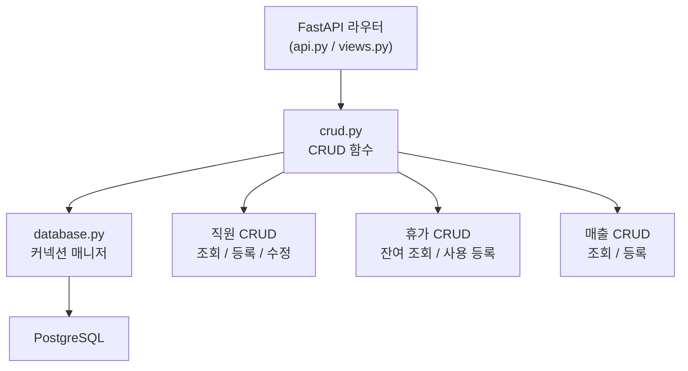
```mermaid
flowchart TD
    A["FastAPI 라우터<br>(api.py / views.py)"] --> B["crud.py<br>CRUD 함수"]
    B --> C["database.py<br>커넥션 매니저"]
    C --> D["PostgreSQL"]

    B --> E["직원 CRUD<br>조회 / 등록 / 수정"]
    B --> F["휴가 CRUD<br>잔여 조회 / 사용 등록"]
    B --> G["매출 CRUD<br>조회 / 등록"]
```

### 3.1 API 엔드포인트 목록

| 경로 | 메서드 | 기능 | CH08 연동 |
|------|--------|------|----------|
| `/api/employees` | GET | 직원 목록 (이름/부서 필터) | MCP `list_employees` |
| `/api/employees` | POST | 직원 등록 | — |
| `/api/leaves/{id}` | GET | 연차 잔여 조회 | MCP `leave_balance` |
| `/api/leaves/{id}/use` | POST | 연차 사용 등록 | — |
| `/api/sales` | GET | 매출 조회 (부서/기간 필터) | MCP `sales_summary` |
| `/api/sales` | POST | 매출 등록 | — |

### 3.2 핵심 설계 패턴

**데이터베이스 연결**: `database.py`의 `@contextmanager`가 커넥션 생명주기를 관리합니다. 정상 시 자동 커밋, 예외 시 자동 롤백, 어떤 경우든 연결 반환을 보장합니다.

**동적 WHERE 절**: `crud.py`의 조회 함수들은 필터 조건을 리스트로 쌓아 `AND`로 결합합니다. 필터가 없으면 전체를, 있으면 조건부로 조회합니다. CH08에서 AI 비서가 "개발팀 직원을 보여줘"라고 요청할 때 이 함수가 그대로 호출됩니다.

**연차 사용 검증**: `update_leave_usage()` 는 잔여 연차가 부족하면 `ValueError`를 발생시켜 처리를 중단합니다. `remaining_days`는 DB 계산 컬럼이 자동으로 재계산합니다.

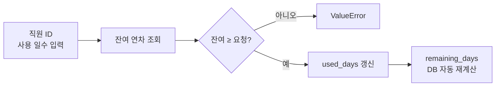
```mermaid
flowchart LR
    A["직원 ID<br>사용 일수 입력"] --> B["잔여 연차 조회"]
    B --> C{잔여 ≥ 요청?}
    C -->|"아니오"| D["ValueError"]
    C -->|"예"| E["used_days 갱신"]
    E --> F["remaining_days<br>DB 자동 재계산"]
```

> 전체 코드: `app/database.py`, `app/crud.py`, `app/schemas.py`

---

## 4. 관리자 Admin UI

메타코딩은 CRUD API를 완성한 뒤, Swagger 문서를 직접 조작하며 데이터를 입력하는 것이 번거롭다는 것을 느꼈습니다. 비기술 인사 담당자가 브라우저에서 직접 데이터를 관리할 수 있으려면 UI가 필요합니다. FastAPI + Jinja2로 별도 프론트엔드 프레임워크 없이 이 문제를 해결합니다.

> **팁: Jinja2를 선택한 이유**
> React나 Vue를 사용하면 빌드 도구, Node.js 환경이 추가됩니다. Jinja2는 Python 서버가 HTML을 완성하여 전달하므로, Python 지식만으로 UI까지 완성할 수 있습니다.

### 4.1 Admin UI 구조

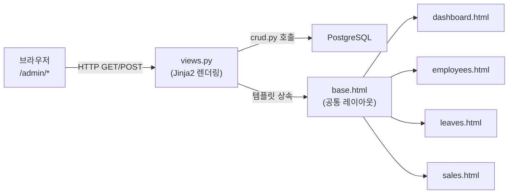
```mermaid
flowchart LR
    A["브라우저<br>/admin/*"] -->|"HTTP GET/POST"| B["views.py<br>(Jinja2 렌더링)"]
    B -->|"crud.py 호출"| C["PostgreSQL"]
    B -->|"템플릿 상속"| D["base.html<br>(공통 레이아웃)"]
    D --> E["dashboard.html"]
    D --> F["employees.html"]
    D --> G["leaves.html"]
    D --> H["sales.html"]
```

| 구성 요소 | 파일 | 역할 |
|----------|------|------|
| 공통 레이아웃 | `templates/base.html` | 240px 사이드바 + 메인 콘텐츠. CH07·CH08 UI가 `` 로 계승 |
| 디자인 시스템 | `static/css/style.css` | 검정/흰색 + 금색(`#d4af37`) 미니멀 테마. CSS 변수로 관리 |
| 뷰 라우터 | `app/views.py` | DB 조회 → 템플릿 렌더링. POST-Redirect-GET 패턴 적용 |
| 페이지 템플릿 | `templates/*.html` | ``에 페이지별 고유 내용만 작성 |

핵심 패턴은 **템플릿 상속**입니다. 모든 페이지가 `base.html`을 상속하고 `` 안에 고유 내용만 채우는 구조이므로, CH07 채팅 UI와 CH08 통합 에이전트 UI도 동일한 방식으로 확장됩니다.

### 4.2 실행 확인

서버를 실행하고 다음 순서로 동작을 확인하십시오.

1. `http://localhost:8000/admin/dashboard` → 통계 카드 3개 (직원 수, 연차 기록 수, 총 매출)
2. `http://localhost:8000/admin/employees` → 직원 목록 (5명 시드 데이터) + 등록 폼
3. `http://localhost:8000/admin/leaves` → 연차 잔여 현황 + 사용 등록 폼
4. `http://localhost:8000/admin/sales` → 매출 현황 + 부서별 합계

<!-- [CAPTURE NEEDED: 04_dashboard-screenshot
  path: assets/CH04/04_dashboard-screenshot.png
  desc: `uvicorn app.main:app --reload` 실행 후 `http://localhost:8000/admin/dashboard` 접속 시 보이는 대시보드 화면. 직원 수 5, 연차 기록 수 5, 총 매출 63,850,000원이 통계 카드에 표시된 상태.
] -->

*그림 4-4: Admin UI 대시보드 — 직원 수, 연차, 매출 통계가 카드로 표시된다*

<!-- [CAPTURE NEEDED: 04_employees-screenshot
  path: assets/CH04/04_employees-screenshot.png
  desc: `/admin/employees` 페이지에서 직원 5명 목록이 테이블로 표시된 화면. 이름, 부서, 직급, 입사일 컬럼이 보이고 상단에 "직원 추가" 폼이 있는 상태.
] -->

*그림 4-5: 직원 관리 페이지 — 목록 조회와 등록 폼이 함께 제공된다*

> 전체 코드: `app/views.py`, `templates/base.html`, `templates/dashboard.html`, `static/css/style.css`

---

## 5. 정리하며

메타코딩은 이 챕터에서 FastAPI + PostgreSQL + Jinja2 조합으로 사내 기본 시스템을 완성하였습니다. 엑셀 파일에 흩어져 있던 직원, 휴가, 매출 데이터가 하나의 관계형 데이터베이스로 통합되었고, 인사 담당자도 브라우저에서 바로 조회하고 수정할 수 있게 되었습니다.

<!-- [GEMINI PROMPT: 04_before-after]
path: assets/CH04/04_before-after.png
Simple before/after comparison infographic: LEFT side shows "직원 정보 Excel / 휴가 수동 집계 / 매출 파일 분산" with scattered file icons and label "Before (30분)", RIGHT side shows "PostgreSQL + Admin UI / 즉시 조회 가능" with a unified database icon and browser icon and label "After (즉시)", clean arrow in the middle, flat design, white background.
Style: before-after-infographic
-->

*그림 4-6: CH04 before/after — 엑셀 분산 관리에서 통합 DB + Admin UI로*

**이 챕터의 핵심 내용을 정리합니다.**

- **FastAPI는 API와 UI를 동시에 처리합니다**: `/api/*` 경로는 JSON을 반환하는 REST API로, `/admin/*` 경로는 Jinja2가 렌더링한 HTML을 반환하는 Admin UI로 동작합니다. 하나의 서버가 두 역할을 수행합니다.

- **PostgreSQL 계산 컬럼이 데이터 무결성을 보장합니다**: `remaining_days GENERATED ALWAYS AS (total_days - used_days) STORED`로 잔여 연차를 DB가 직접 계산합니다. 애플리케이션이 계산 로직을 가지면 버그가 생길 수 있지만, DB가 계산하면 항상 일관성이 보장됩니다.

- **Pydantic 스키마 분리가 API 계약을 명확히 합니다**: `EmployeeCreate`(등록용), `EmployeeUpdate`(수정용), `EmployeeResponse`(응답용)를 분리하면 각 상황에서 필요한 필드만 노출됩니다. Swagger 문서도 이 스키마를 기반으로 자동 생성됩니다.

- **base.html이 CH07, CH08의 UI 기반이 됩니다**: 240px 사이드바 + 메인 콘텐츠 레이아웃은 이 챕터에서 완성됩니다. CH07 채팅 UI와 CH08 통합 에이전트 UI는 ``으로 이 구조를 그대로 계승합니다.

**Before / After**

| 항목 | Before | After |
|------|--------|-------|
| 직원 현황 파악 | `직원현황.xlsx` 수기 확인 (담당자 문의 필요) | Admin UI `/admin/employees` 즉시 조회 |
| 휴가 잔여 집계 | 팀장 수기 스프레드시트 — 평균 **30분** 소요 | DB 계산 컬럼으로 **즉시** 반환 (0분) |
| 매출 데이터 취합 | 부서별 개별 파일 취합 — 최소 **1시간** 소요 | `/admin/sales`에서 부서·기간 필터 즉시 조회 |
| AI 비서 연동 가능 여부 | 불가 (구조화 데이터 없음) | CH08 MCP Tool이 SQL로 직접 조회 가능 |

메타코딩은 커밋 로그를 닫으며 한 가지 사실을 확인했습니다. FastAPI 서버 기동에 걸린 시간은 이틀, 그러나 앞으로 AI 비서가 이 API를 통해 수백 건의 질문에 답할 수 있게 됩니다.

> **실습 환경 정리**
> 이 챕터의 실습이 끝나면 FastAPI 서버와 Docker 컨테이너를 종료하십시오. 이후 챕터에서 동일 포트(8000, 5432)를 사용하므로 충돌이 발생할 수 있습니다.
> ```bash
> # 1. Ctrl+C 로 uvicorn 서버 종료
> # 2. Docker 컨테이너 종료
> docker compose down
> ```

**다음 챕터 예고**: 사내 데이터베이스가 완성되었습니다. 이제 AI 비서가 검색할 **비정형 문서** 를 정비할 차례입니다. CH05에서는 인사팀 서버에 뒤섞인 수백 개의 파일을 표준화하고, RAG 인덱싱에 적합한 구조로 정리하는 파이프라인을 구축합니다.


---

# 5. 사내 문서 수집 전략과 문서 표준 만들기

FastAPI 기반 사내 시스템을 완성한 메타코딩에게 다음 과제가 생겼습니다. RAG 엔진이 검색할 "비정형 문서"를 준비해야 합니다. 그런데 커넥트의 인사팀 서버를 열어보는 순간, 메타코딩은 예상보다 훨씬 심각한 현실을 마주합니다.

이 챕터에서는 **문서 품질이 RAG 성능을 결정한다** 는 원칙을 출발점으로, 어떤 문서를 선정할 것인지, 파일 형식별로 어떤 특성이 있는지, 그리고 파일명 규칙과 폴더 구조를 어떻게 표준화하는지를 단계적으로 살펴봅니다. 

---

## 1. 어떤 문서를 넣을 것인가

<!-- [GEMINI PROMPT: 05_document-chaos]
path: assets/CH05/05_document-chaos.png
A minimalist black and white technical diagram with a strict 16:9 aspect ratio on a solid white background. No shading, no 3D effects, only clean thin line art. The entire assembly of icons, lines, and text is perfectly centered globally within the 16:9 frame, leaving generous and equal white space on all sides. Left side shows a single folder icon labeled "인사팀 서버" containing a chaotic pile of minimalist line-art document icons with labels like "취업규칙_최종.pdf", "취업규칙_최종_v2.pdf", "취업규칙_진짜최종.pdf" stacked in disorder. Right side shows an organized folder structure with sub-folders labeled "hr/", "security/", "ops/", "finance/" each containing neatly arranged document icons with standardized names. A large arrow labeled "표준화" points from left to right.
Style: before-after-infographic
-->

*그림 5-1: 표준화 전 문서 혼란 상태와 표준화 후 부서별 폴더 구조 비교*

메타코딩은 커넥트 인사팀 서버 공유 드라이브를 접속하고 입이 딱 벌어졌습니다. "취업규칙_최종.pdf", "취업규칙_최종_v2.pdf", "취업규칙_최종_진짜최종.pdf"가 같은 폴더에 공존하고 있었습니다. 어느 것이 최신 버전인지 알 방법이 없었습니다. 100개가 넘는 파일이 부서 구분도 없이 하나의 폴더에 뒤섞여 있었고, 파일 형식도 PDF, DOCX, XLSX, 심지어 HWP까지 뒤죽박죽이었습니다.

"이 상태로 AI에 넣으면 엉뚱한 답변이 나올 것이 뻔하다." 메타코딩은 AI 작업을 시작하기 전에 문서 정리부터 해야 한다는 것을 직감했습니다. 컴퓨터 과학에서는 이를 **"Garbage In, Garbage Out"(쓰레기를 넣으면 쓰레기가 나온다)** 이라 부릅니다. 정제되지 않은 문서는 RAG 품질을 직접 떨어뜨립니다.

### 1.1 교재용 문서 세트

이 책에서는 커넥트 사내에서 실제로 자주 질문받는 유형의 문서 6개를 교재용 예제 세트로 사용합니다. 각 문서는 `legacy/ex01-1/data/docs/` 경로에 실제 파일 형태로 제공됩니다.

| 파일명 | 형식 | 부서 | 설명 |
|--------|------|------|------|
| `HR_취업규칙_v1.0.pdf` | PDF | 인사 | 연차, 급여, 복지 등 취업 규정 전문 |
| `HR_정보보안서약서.pdf` | PDF | 인사 | 입사 시 서명하는 보안 서약 양식 |
| `SEC_보안규정_v1.0.docx` | DOCX | 보안 | 사내 정보보안 규정 (표 구조 포함) |
| `OPS_신규서비스_런칭전략.pdf` | PDF | 운영 | 신규 서비스 출시 전략 문서 |
| `FIN_부서별_예산기안서.xlsx` | XLSX | 재무 | 부서별 예산 기안 내용 (수치 데이터) |
| `FIN_2025_상반기_매출현황.xlsx` | XLSX | 재무 | 2025년 상반기 매출 현황표 |

### 1.2 실무 문서 선정 기준

어떤 문서를 RAG 시스템에 넣어야 할까요? 다음 두 가지 기준을 우선으로 합니다.

**자주 질문받는 문서** 를 먼저 포함합니다. 인사팀에 하루 20건씩 들어오는 반복 질문("연차 며칠 남았나요?", "출장비 기준이 어떻게 되나요?")의 답이 담긴 문서가 1순위입니다.

**정기적으로 갱신되는 문서** 도 중요합니다. 취업규칙처럼 매년 개정되는 문서는 버전 관리가 필수입니다. 버전 정보가 파일명에 없으면 AI가 구버전 기준으로 답변할 위험이 있습니다.

> **팁: 문서 선정 우선순위**
> 전체 문서를 한 번에 넣으려 하지 마십시오. "직원들이 가장 자주 물어보는 질문 10개"를 먼저 정의하고, 그 답이 담긴 문서부터 시작하는 것이 현실적입니다. 문서 수가 적을수록 검증과 디버깅이 쉽습니다.

---

## 2. 문서 형식 지원 범위

사내 문서는 하나의 형식으로 통일되어 있지 않습니다. 커넥트의 경우 PDF, DOCX, XLSX가 혼재합니다. 각 형식은 파싱 방식과 난이도가 다릅니다.

### 2.1 형식별 특성 비교

| 형식 | 파싱 라이브러리 | 특성 | 파싱 난이도 |
|------|---------------|------|-----------|
| PDF (텍스트) | `pypdf`, `pdfplumber`, `PyMuPDF` | 대부분의 규정 문서. 레이아웃 정보 손실 가능 | 보통 |
| PDF (이미지) | Vision LLM (LLaVA 등) | 스캔본, 표·차트 포함 PDF. 텍스트 추출 불가 | 높음 |
| DOCX | `python-docx` | Word 문서. 표, 단락, 제목 구조 보존 | 낮음 |
| XLSX | `openpyxl` | Excel 파일. 시트별 데이터, 수식 포함 가능 | 낮음 |

> **팁: PDF 파싱 라이브러리 선택**
> PDF 파싱 라이브러리는 여러 가지가 있으며, 문서 특성에 따라 적합한 도구가 다릅니다.
> - **`pypdf`**: 가장 기본적인 라이브러리. 텍스트 추출이 간단하지만 표나 레이아웃 보존이 약합니다.
> - **`pdfplumber`**: 표(table) 추출에 강합니다. 셀 경계를 인식하여 구조화된 데이터를 반환합니다.
> - **`PyMuPDF(fitz)`**: 속도가 빠르고, 이미지 추출과 텍스트 좌표 정보까지 제공합니다.
> 이 책에서는 범용성과 설치 편의성을 고려하여 `pypdf`를 기본으로 사용합니다.

> **팁: HWP 파일은 어떻게 처리하나요?**
> Python에서 HWP(한글 문서)를 직접 파싱하는 안정적인 라이브러리는 현재 없습니다. 실무에서는 한컴오피스나 온라인 변환 도구를 사용하여 **PDF로 변환한 뒤** 파싱하는 방식을 권장합니다. HWP를 PDF로 변환하면 `pypdf`로 동일하게 처리할 수 있습니다.

### 2.2 이미지 PDF vs 텍스트 PDF

PDF 형식 안에서도 구별이 필요합니다. **텍스트 PDF** 는 `pypdf`로 텍스트를 직접 추출할 수 있습니다. 반면 **이미지 PDF** 는 PDF 전체가 이미지로 구성되어 있어 일반 파싱으로는 텍스트가 전혀 추출되지 않습니다. 스캔한 종이 문서나 표·차트가 이미지로 삽입된 문서가 여기에 해당합니다.

이미지 PDF 처리는 Vision LLM(LLaVA)과 OCR을 활용하는 고급 주제로, CH06에서 LLM 파싱 단계에서 다룹니다.

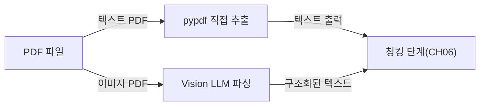
```mermaid
flowchart LR
    A["PDF 파일"] -- "텍스트 PDF" --> B["pypdf 직접 추출"]
    A -- "이미지 PDF" --> C["Vision LLM 파싱"]
    B -- "텍스트 출력" --> D["청킹 단계(CH06)"]
    C -- "구조화된 텍스트" --> D
```

*그림 5-2: PDF 유형에 따른 파싱 경로 분기*

> **참고: CH05는 파싱을 직접 수행하지 않습니다**
> 이 챕터의 목표는 문서를 "정리하고 검증"하는 것입니다. 실제 텍스트 추출(파싱)과 벡터 저장은 CH06에서 수행합니다. CH05는 CH06에 "먹일 준비가 된" 문서 세트를 만드는 단계입니다.

---

## 3. 문서 표준 규칙

메타코딩은 문서를 정리하기 전에 규칙부터 세우기로 했습니다. 규칙 없이 정리하면 6개월 뒤 다시 뒤죽박죽이 됩니다.

### 3.1 파일명 규칙

파일명은 다음 형식을 따릅니다.

```
{부서코드}_{문서종류}_v{버전}.{확장자}
```

**예시:**
- `HR_취업규칙_v1.0.pdf` — 인사팀 취업규칙, 1.0 버전, PDF 형식
- `SEC_보안규정_v1.0.docx` — 보안팀 보안규정, 1.0 버전, DOCX 형식
- `FIN_부서별_예산기안서.xlsx` — 재무팀 예산기안서, 버전 없음 (WARN 처리)

**부서코드 목록:**

| 코드 | 부서 |
|------|------|
| `HR` | 인사 |
| `SEC` | 보안 |
| `OPS` | 운영 |
| `FIN` | 재무 |
| `IT` | IT |
| `MKT` | 마케팅 |
| `GEN` | 총무 |

> **주의: 파일명 규칙은 왜 필요한가**
> 단순히 정리 목적만이 아닙니다. CH06에서 파일명에서 부서·버전 정보를 자동 추출하여 메타데이터로 활용합니다. 이 메타데이터는 CH10에서 배울 **Self-Query Retriever(자기 질의 검색기)** 의 핵심 재료가 됩니다. Self-Query Retriever는 "인사팀 문서만 검색해줘"처럼 사용자 질문에서 메타데이터 조건을 자동으로 파악하여 검색 범위를 좁히는 기술입니다. 지금 정하는 파일명 규칙이 나중에 검색 품질을 결정합니다.

메타코딩은 파일명 규칙을 정하면서 "지금 5분을 아끼면 나중에 5시간을 잃는다"는 것을 이미 한 번 경험했습니다. 이번에는 처음부터 규칙을 문서로 남기기로 했습니다.

### 3.2 폴더 구조

문서는 부서별로 분리하여 저장합니다.

```
data/docs/
├── hr/
│   ├── HR_취업규칙_v1.0.pdf
│   └── HR_정보보안서약서.pdf
├── security/
│   └── SEC_보안규정_v1.0.docx
├── ops/
│   └── OPS_신규서비스_런칭전략.pdf
└── finance/
    ├── FIN_부서별_예산기안서.xlsx
    └── FIN_2025_상반기_매출현황.xlsx
```

폴더명은 부서코드의 소문자 버전(`hr`, `sec` → `security`, `ops`, `fin` → `finance`)을 사용합니다. 가독성을 위해 전체 단어를 사용해도 무방합니다.

### 3.3 메타데이터 필수 항목

각 문서에는 다음 7개 항목의 메타데이터가 자동으로 추출되어야 합니다. 이 메타데이터는 CH06에서 ChromaDB에 문서를 저장할 때 함께 기록됩니다.

| 항목 | 설명 | 예시 |
|------|------|------|
| `doc_id` | 문서 고유 식별자 | `HR_취업규칙_1.0` |
| `title` | 문서 종류 (파일명에서 추출) | `취업규칙` |
| `department` | 부서명 | `인사` |
| `version` | 버전 번호 | `1.0` |
| `date` | 파일 수정일 | `2025-01-15` |
| `format` | 파일 형식 | `PDF` |
| `file_size_bytes` | 파일 크기 | `153600` |

> **팁: 메타데이터는 "검색 필터"입니다**
> "인사팀 문서 중 2024년 이후 버전만 검색해줘"처럼 메타데이터를 조건으로 검색 범위를 좁힐 수 있습니다. 메타데이터가 없으면 전체 문서를 대상으로 검색해야 하므로 정확도가 낮아집니다.

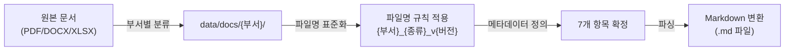
```mermaid
flowchart LR
    A["원본 문서<br>(PDF/DOCX/XLSX)"] -- "부서별 분류" --> B["data/docs/{부서}/"]
    B -- "파일명 표준화" --> C["파일명 규칙 적용<br>{부서}_{종류}_v{버전}"]
    C -- "메타데이터 정의" --> D["7개 항목 확정"]
    D -- "파싱" --> E["Markdown 변환<br>(.md 파일)"]
```

*그림 5-3: 문서 수집 → 표준화 → CH06 Markdown 변환 흐름*

---

---

## 4. 정리하며

메타코딩은 AI 작업을 시작하기 전에 가장 기본적인 작업이 필요하다는 것을 체감했습니다. "AI 비서를 만든다"는 목표보다 "AI에 먹일 음식이 상하지 않았는지 확인한다"는 작업이 먼저였습니다. 파일명 규칙과 폴더 구조를 정하는 데 30분이 걸렸지만, 이 30분이 이후 모든 챕터의 품질을 결정합니다.

| 지표 | Before | After |
|------|--------|-------|
| 파일명 규칙 | 없음 (자유 형식) | `{부서}_{종류}_v{버전}.{확장자}` |
| 폴더 구조 | 단일 폴더 100+ 파일 | 부서별 4개 폴더 분류 |
| 메타데이터 | 없음 | 7개 항목 정의 완료 |
| 문서 형식 | HWP/PDF/DOCX 뒤죽박죽 | PDF/DOCX/XLSX 3종으로 통일 |

이 챕터에서 배운 핵심 내용을 정리합니다.

- **"Garbage In, Garbage Out"**: 정제되지 않은 문서는 RAG 품질을 직접 떨어뜨립니다. 문서 표준화는 AI 도입 이전에 반드시 수행해야 하는 선행 작업입니다.
- **파일명 규칙의 이중 역할**: 파일명 규칙은 가독성뿐 아니라 메타데이터 자동 추출의 기반이 됩니다. CH10의 Self-Query Retriever가 "인사팀 문서만 검색해줘"를 처리할 때 이 규칙이 핵심 조건으로 작동합니다.
- **형식별 파싱 전략**: PDF는 `pypdf`/`pdfplumber`/`PyMuPDF`, DOCX는 `python-docx`, XLSX는 `openpyxl`을 사용합니다. 이미지 PDF는 Vision LLM이 필요하며 CH06에서 다룹니다. HWP는 PDF로 변환하여 처리합니다.
- **메타데이터 7개 항목**: `doc_id`, `title`, `department`, `version`, `date`, `format`, `file_size_bytes`가 CH06에서 Markdown 변환 및 VectorDB 저장 시 각 청크에 자동으로 부착됩니다.

다음 챕터에서는 이 챕터에서 표준화한 문서 세트를 실제로 텍스트로 파싱하고, Markdown으로 변환한 뒤, 청크로 분할하여 ChromaDB 벡터 데이터베이스에 저장합니다. 메타코딩이 정리한 6개 문서가 드디어 AI가 검색할 수 있는 지식으로 변환됩니다.


---

# 6. VectorDB 구축 — 문서를 검색 가능한 지식으로 바꾸기

CH05에서 메타코딩은 커넥트 사내 문서를 부서별 폴더에 정리하고 파일명 규칙을 세웠습니다. 6개 문서가 `{부서코드}_{문서명}_v{버전}` 형식으로 깔끔하게 정리되었지만, 정작 AI가 이 문서를 읽을 수 있는지는 아직 확인되지 않았습니다.

"파일을 정리했다고 AI가 이해하는 건 아니잖아."

메타코딩은 HR 취업규칙 PDF를 열어보았습니다. 1페이지에 연차 규정 표가 빼곡하게 들어 있었습니다. 재무 XLSX에는 매출 데이터가 한 시트에 정리되어 있었습니다. 이 파일들을 AI가 검색할 수 있으려면 텍스트를 추출하고, 적절한 크기로 자르고, 벡터로 변환해야 합니다.

이 챕터에서는 이 과정을 두 단계로 진행합니다. 먼저 Python 파싱 라이브러리(`pypdf`, `python-docx`, `openpyxl`)로 텍스트를 추출합니다. 이어서 추출한 텍스트를 500자 단위 청크로 분할하고 **ko-sroberta-multitask** 임베딩 모델로 벡터화하여 **ChromaDB(크로마DB)** 에 저장합니다. 챕터가 끝나면 터미널에서 "연차 사용 규정"을 검색했을 때 HR 취업규칙 문서의 관련 문구와 출처가 즉시 반환되는 것을 확인할 수 있습니다.

---

## 1. 개념 — 문서에서 벡터까지

본격적인 실습에 앞서, 이 챕터에서 구현할 전체 파이프라인을 한눈에 살펴봅니다.

### 1.1 전체 파이프라인 흐름

<!-- [GEMINI PROMPT: 06_pipeline-overview]
path: assets/CH06/06_pipeline-overview.png
A minimalist black and white technical diagram with a strict 16:9 aspect ratio on a solid white background. No shading, no 3D effects, only clean thin line art. The entire assembly of icons, lines, and text is perfectly centered globally within the 16:9 frame, leaving generous and equal white space on all sides. A top-to-bottom flowchart showing: Box 1 labeled "실제 문서(PDF/DOCX/XLSX)" at top. Arrow goes down to Box 2 "Step 1: Python 파싱(extractor.py)". Box 2 goes to Box 3 "chunker.py (500자 + 20% overlap)". Box 3 goes to Box 4 "ko-sroberta 임베딩". Box 4 goes to Box 5 "ChromaDB 저장(store.py)". Box 5 goes to Box 6 "CLI 검증(cli_search.py)".
Style: architecture-infographic
-->
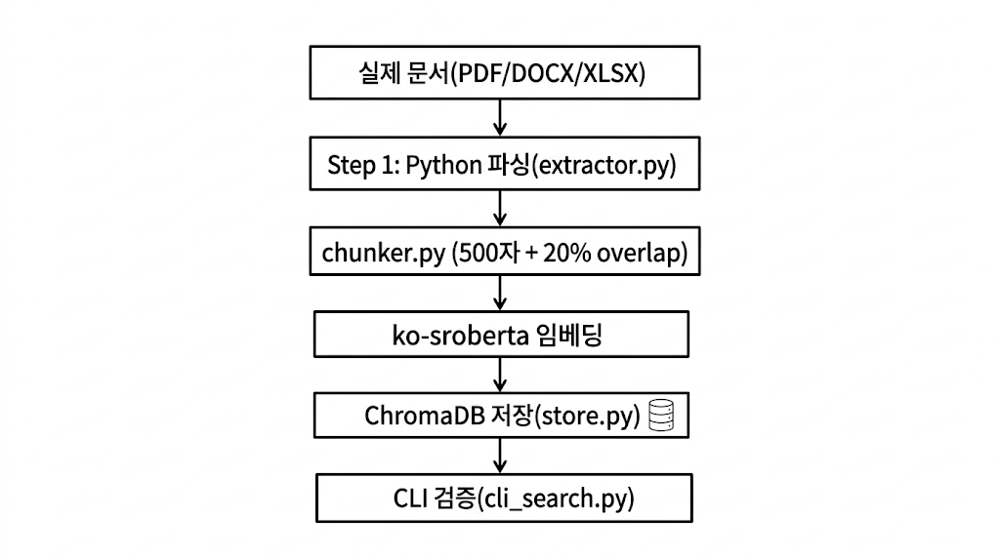
*그림 6-1: 문서에서 ChromaDB 저장까지의 전체 파이프라인*

### 1.2 청킹 — 왜 500자인가

**청킹(Chunking)** 은 긴 텍스트를 검색에 적합한 작은 단위로 분할하는 과정입니다. 청크가 너무 크면 LLM이 받는 컨텍스트에 불필요한 내용이 포함되어 답변 품질이 낮아지고, 너무 작으면 문맥이 잘려 의미 전달이 어렵습니다.

이 챕터에서는 **Fixed-size 청킹(고정 크기 청킹)** 방식을 사용합니다. 청크 크기를 500자, 오버랩을 100자(20%)로 고정합니다.

```
원본 텍스트:  [...400자...][...400자...][...400자...]
청크 1:        [________500자_________]
청크 2:               [___100자___][________500자_______]
청크 3:                                    [___100자___][...
```

오버랩이 필요한 이유는 청크 경계에서 문장이 잘릴 때 앞뒤 청크가 100자씩 겹치도록 하여 맥락 손실을 줄이기 위해서입니다. Fixed-size 방식을 기본으로 사용하는 이유는 구현이 단순하고 동작이 예측 가능하기 때문입니다. 의미 단위로 분할하는 Semantic 청킹은 품질이 높지만 처리 속도가 느리고 파라미터 조정이 복잡합니다. 이 방식은 CH10 RAG 튜닝 챕터에서 다룹니다.

### 1.3 임베딩 모델 — ko-sroberta-multitask

**임베딩(Embedding)** 은 텍스트를 수치 벡터로 변환하는 과정입니다. 이 벡터를 VectorDB에 저장하고, 검색 쿼리도 같은 방식으로 벡터화하여 코사인 유사도로 관련 문서를 찾습니다.

이 챕터에서는 **`jhgan/ko-sroberta-multitask`** 모델을 사용합니다. 한국어에 특화된 SRoBERTa 기반 모델로, HuggingFace에서 무료로 다운로드할 수 있습니다. 최초 실행 시 약 400MB를 다운로드하고 로컬 캐시에 저장하므로 이후에는 인터넷 연결 없이 동작합니다. 768차원 벡터를 생성하며, 한국어 문장 유사도 태스크에 특화되어 있습니다.

### 1.4 ChromaDB — 로컬 영속 VectorDB

**VectorDB(벡터 데이터베이스)** 는 임베딩 벡터를 저장하고 유사도 기반 검색을 수행하는 데이터베이스입니다. 일반 RDBMS가 정확한 값 일치로 조회하는 것과 달리, VectorDB는 "의미적으로 비슷한" 문서를 찾아 반환합니다.

**ChromaDB** 는 Python에서 가장 쉽게 사용할 수 있는 오픈소스 VectorDB입니다. 별도 서버 없이 로컬 파일 시스템에 영속 저장(`PersistentClient`)하며, Docker 없이 `pip install`만으로 설치됩니다. 이 챕터에서는 `data/chroma_db/` 폴더에 색인 데이터를 저장합니다.

> **팁: ChromaDB vs 다른 VectorDB**
> Pinecone, Weaviate, Qdrant 등 클라우드 기반 VectorDB와 비교하면 ChromaDB는 로컬 개발과 중소 규모 운영에 적합합니다. 수십만 건 이상의 청크를 다루거나 멀티 서버 배포가 필요한 경우 클라우드 VectorDB 전환을 고려하십시오.

---

## 2. 실습 환경 준비

### 2.1 예제 클론 및 의존성 설치

```bash
cd examples/CH06_VectorDB_구축
python3.12 -m venv .venv
source .venv/bin/activate   # Windows: .\.venv\Scripts\Activate.ps1
pip install -r requirements.txt
```

> **주의: sentence-transformers 설치 시간**
> `sentence-transformers` 패키지는 PyTorch를 포함하므로 설치에 1~3분이 소요될 수 있습니다. Apple Silicon Mac에서는 `pip install torch` 후 설치하는 것이 더 빠릅니다.

`requirements.txt`의 주요 패키지는 다음과 같습니다.

| 패키지 | 버전 | 역할 |
|--------|------|------|
| `pypdf` | 4.3.1 | PDF 텍스트 추출 |
| `python-docx` | 1.1.2 | DOCX 단락·표 추출 |
| `openpyxl` | 3.1.5 | XLSX 시트·셀 추출 |
| `sentence-transformers` | 3.3.1 | ko-sroberta 임베딩 모델 |
| `chromadb` | 1.5.1 | VectorDB 저장 및 검색 |

### 2.2 데이터 폴더 구조 확인

CH05에서 표준화한 문서 6개가 이미 `data/docs/` 폴더에 배치되어 있습니다.

```
examples/CH06_VectorDB_구축/
├── data/
│   ├── docs/                    ← CH05 표준화 문서 (입력)
│   │   ├── hr/
│   │   │   ├── HR_취업규칙_v1.0.pdf
│   │   │   └── HR_정보보안서약서.pdf
│   │   ├── security/
│   │   │   └── SEC_보안규정_v1.0.docx
│   │   ├── ops/
│   │   │   └── OPS_신규서비스_런칭전략.pdf
│   │   └── finance/
│   │       ├── FIN_부서별_예산기안서.xlsx
│   │       └── FIN_2025_상반기_매출현황.xlsx
│   ├── markdown/                ← 파싱 결과 Markdown (자동 생성)
│   └── chroma_db/               ← ChromaDB 색인 (자동 생성)
└── src/
    ├── extractor.py             ← Step 1: Python 파싱
    ├── extract_pdf.py            ← PDF → Markdown 변환
    ├── extract_docx.py           ← DOCX → Markdown 변환
    ├── extract_xlsx.py           ← XLSX → Markdown 변환
    ├── chunker.py               ← 청킹 + 메타데이터 부착
    ├── store.py                 ← 임베딩 + ChromaDB 저장
    ├── cli_search.py            ← Step 3: CLI 검증
    └── main.py                  ← 전체 파이프라인 오케스트레이터
```

---

## 3. [Step 1] Python 파싱 테스트

메타코딩이 처음 시도한 것은 Python 라이브러리로 텍스트를 추출하는 것이었습니다. `pypdf`, `python-docx`, `openpyxl`은 각각 PDF, DOCX, XLSX를 파싱하는 표준 라이브러리입니다. 설치가 간단하고 비용이 들지 않습니다.

<!-- [GEMINI PROMPT: 06_python-parsing]
path: assets/CH06/06_python-parsing.png
A minimalist black and white technical diagram with a strict 16:9 aspect ratio on a solid white background. No shading, no 3D effects, only clean thin line art. Three document icons (PDF, DOCX, XLSX) on the left, each connected by an arrow to their respective library box (pypdf, python-docx, openpyxl) in the center, all three library boxes then connect to a single "텍스트 출력" box on the right. Below the right box, a small warning icon labeled "표/이미지 손실" is shown with a dashed border.
Style: architecture-infographic
-->
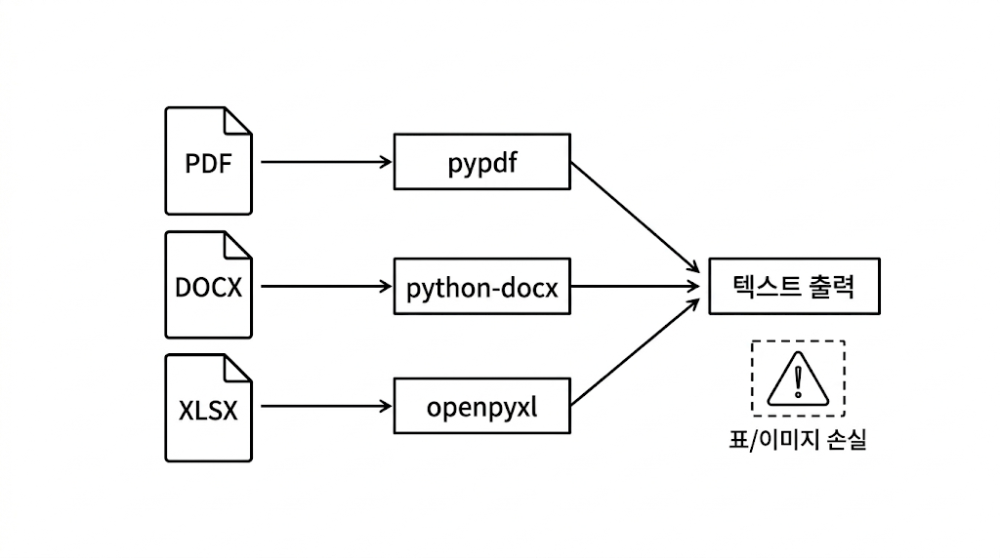
*그림 6-2: 형식별 Python 파싱 라이브러리 구조*

### 3.1 extractor.py 동작 요약

`src/extractor.py`는 PDF, DOCX, XLSX 세 형식을 하나의 인터페이스로 통합합니다. `extract_text()` 함수에 파일 경로를 전달하면, 확장자를 자동 감지하여 적절한 파서(`pypdf`, `python-docx`, `openpyxl`)를 호출합니다.

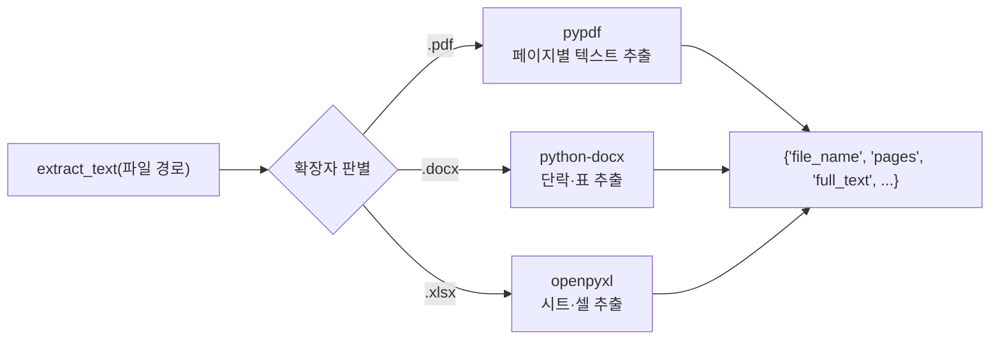
```mermaid
flowchart LR
    A["extract_text(파일 경로)"] --> B{"확장자 판별"}
    B -->|.pdf| C["pypdf<br>페이지별 텍스트 추출"]
    B -->|.docx| D["python-docx<br>단락·표 추출"]
    B -->|.xlsx| E["openpyxl<br>시트·셀 추출"]
    C --> F["{'file_name', 'pages', 'full_text', ...}"]
    D --> F
    E --> F
```

반환값은 딕셔너리로, 파일명(`file_name`), 페이지별 텍스트(`pages`), 전체 텍스트(`full_text`) 등을 포함합니다. PDF의 경우 페이지 번호를 1부터 시작하여 나중에 출처 표시 시 "1페이지"처럼 사람이 이해하는 번호를 사용합니다.

> **전체 코드: `src/extractor.py`**

### 3.2 Step 1 실행

```bash
python src/main.py --step 1
```
`data/docs/` 폴더를 순회하며 PDF·DOCX·XLSX를 형식별로 파싱한 뒤, 파일명·페이지 수·추출 글자 수를 터미널에 출력합니다. 메타코딩은 결과 숫자를 보는 순간 이상한 점을 발견했습니다 — HR 정보보안서약서의 글자 수가 0이었습니다.

<!-- [CAPTURE NEEDED: 06_step1-result
  path: assets/CH06/06_step1-result.png
  desc: `python src/main.py --step 1` 실행 후 터미널 화면 — 6개 문서 추출 결과 요약 (파일명, 페이지 수, 글자 수, 경고 표시)
] -->
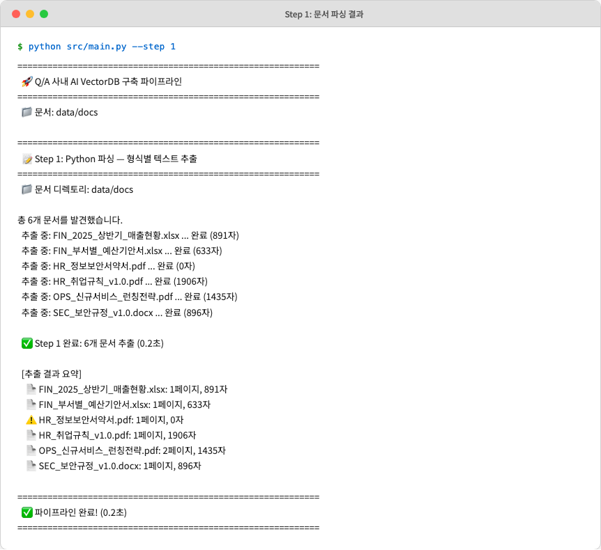
*그림 6-4: Step 1 실행 결과 — 문서별 추출 글자 수와 경고*

### 3.3 Python 파싱의 한계

결과를 보면 흥미로운 사실이 드러납니다.

| 파일명 | 형식 | 추출 글자 수 | 상태 |
|--------|------|------------|------|
| `HR_취업규칙_v1.0.pdf` | PDF (다단 레이아웃) | 1,906자 | 텍스트 추출됨, 단 배치 무너짐 |
| `HR_정보보안서약서.pdf` | PDF (이미지 스캔) | 0자 | 텍스트 레이어 없음 (전량 손실) |
| `OPS_신규서비스_런칭전략.pdf` | PDF (슬라이드) | 1,435자 | 텍스트 추출됨, 배치 정보 손실 |
| `SEC_보안규정_v1.0.docx` | DOCX (표 포함) | 896자 | 표는 추출되나 서식 손실 |
| `FIN_2025_상반기_매출현황.xlsx` | XLSX | 891자 | 정상 추출 |
| `FIN_부서별_예산기안서.xlsx` | XLSX | 633자 | 정상 추출 |

`HR_취업규칙_v1.0.pdf`는 2열 다단 레이아웃으로 편집된 문서입니다. pypdf는 왼쪽 열과 오른쪽 열의 텍스트를 순서대로 추출하지 못하고 뒤섞습니다. 1,906자가 추출되었지만 문장 순서가 원본과 다릅니다. `HR_정보보안서약서.pdf`는 더 심각합니다 — 이미지로 스캔된 PDF라 텍스트 레이어 자체가 없어 글자 수가 0입니다.

Python 파싱은 다음 상황에서 한계를 드러냅니다.

- **이미지 스캔 PDF**: 텍스트 레이어가 없는 문서는 글자를 전혀 추출하지 못합니다.
- **다단 레이아웃 PDF**: 2열 이상의 편집 구조에서 텍스트 순서가 뒤섞입니다.
- **슬라이드형 PDF**: PPT를 변환한 PDF는 텍스트 배치 정보가 손실됩니다.

DOCX와 XLSX는 Python 파싱으로 충분합니다. 이미지 스캔 PDF처럼 텍스트 추출이 불가능한 문서는 **Vision LLM**(이미지를 이해하는 멀티모달 LLM)으로 보완할 수 있습니다. 이 방법은 **CH10 RAG 튜닝**에서 다룹니다. 이 챕터에서는 Python 파싱으로 추출 가능한 텍스트를 기반으로 VectorDB를 구축합니다.

---

## 4. 청킹과 메타데이터 부착

텍스트 추출이 완료되면 청킹 단계로 넘어갑니다. `src/chunker.py`는 추출 결과를 500자 단위로 분할하고 각 청크에 메타데이터를 부착합니다.

### 4.1 chunker.py 동작 요약

`split_text_into_chunks()` 함수는 입력 텍스트를 500자 단위로 잘라 청크 리스트를 반환합니다. 이동 단계를 400자(= 500 − 100 오버랩)로 설정하여 청크 1은 0~500자, 청크 2는 400~900자 순으로 100자씩 겹치게 합니다. 오버랩 덕분에 청크 경계에서 잘리는 문장도 다음 청크에서 다시 포함되어 맥락 손실을 줄입니다.

> **전체 코드: `src/chunker.py`**

### 4.2 메타데이터 부착 — 출처 추적의 핵심

청킹 후에는 각 청크에 **메타데이터**를 부착합니다. `build_text_chunk()` 함수가 텍스트 청크마다 고유 ID(`{문서ID}_text_p{페이지}_c{순번}`)와 함께 출처 파일명, 페이지 번호, 부서 정보를 딕셔너리로 묶어 반환합니다. 이 메타데이터가 있어야 검색 결과에서 "출처: HR_취업규칙_v1.0.pdf, 1페이지"처럼 표시할 수 있고, CH10의 Self-Query Retriever에서 "인사팀 문서만 검색"처럼 필터 조건으로도 활용됩니다. CH05에서 파일명 규칙을 설정한 이유가 여기서 나타납니다.

> **전체 코드: `src/chunker.py`**

메타코딩은 청크 목록을 훑어보며 각 딕셔너리에 파일명·페이지·부서 정보가 정확히 붙어 있는지 확인했습니다. 이 메타데이터가 나중에 검색 결과의 출처 표시를 결정한다는 것을 알고 있었기 때문입니다.

---

## 5. 임베딩 & VectorDB 저장

청크 리스트가 준비되면 `src/store.py`가 임베딩과 ChromaDB 저장을 담당합니다.

### 5.1 store.py 동작 요약

`store_chunks_to_chroma()` 함수는 세 단계로 동작합니다. 먼저 `SentenceTransformer`로 ko-sroberta 모델을 로드합니다(최초 실행 시 약 400MB 다운로드, 이후 로컬 캐시 재사용). 다음으로 `PersistentClient`로 ChromaDB를 초기화하고 코사인 유사도(`hnsw:space: cosine`) 컬렉션을 생성합니다. 마지막으로 청크를 64개 배치 단위로 임베딩한 뒤 `upsert()`로 저장합니다. `upsert`는 동일 ID가 이미 존재하면 덮어쓰므로 파이프라인을 반복 실행해도 데이터가 중복 저장되지 않습니다.

> **전체 코드: `src/store.py`**

### 5.2 전체 파이프라인 실행 (Step 1 + 2)

이제 Step 1(Python 파싱)과 Step 2(청킹 + 임베딩 + ChromaDB 저장)를 한 번에 실행합니다.

```bash
python src/main.py
```

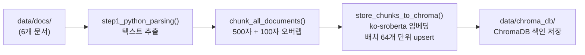
```mermaid
flowchart LR
    A["data/docs/<br>(6개 문서)"] --> B["step1_python_parsing()<br>텍스트 추출"]
    B --> C["chunk_all_documents()<br>500자 + 100자 오버랩"]
    C --> D["store_chunks_to_chroma()<br>ko-sroberta 임베딩<br>배치 64개 단위 upsert"]
    D --> E["data/chroma_db/<br>ChromaDB 색인 저장"]
```

*그림 6-5b: main.py 전체 파이프라인 실행 흐름 — 파싱 → 청킹 → 임베딩 → 저장*

6개 문서를 파싱하고 500자 단위로 청킹한 뒤 ko-sroberta 임베딩을 거쳐 `data/chroma_db/`에 ChromaDB 색인을 저장합니다. 메타코딩은 터미널에 총 청크 수가 찍히는 것을 보고서야 "이제 검색할 수 있겠다"고 생각했습니다.

<!-- [CAPTURE NEEDED: 06_pipeline-complete
  path: assets/CH06/06_pipeline-complete.png
  desc: `python src/main.py` 실행 완료 후 터미널 화면 — Step 1, Step 2 순서로 완료 메시지가 표시되고 총 청크 수와 ChromaDB 저장 완료 메시지가 보이는 상태
] -->
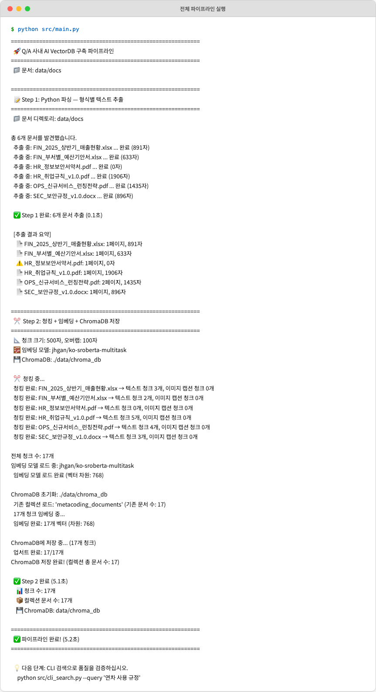
*그림 6-5: main.py 실행 완료 — Step 1, 2 순서로 완료*

> **팁: 처음 실행 시 모델 다운로드**
> ko-sroberta-multitask 모델 최초 다운로드에 몇 분이 소요될 수 있습니다. 다운로드 완료 후 `임베딩 모델 로드 완료 (벡터 차원: 768)` 메시지가 출력되면 정상입니다. 이후 실행에서는 로컬 캐시를 사용하므로 즉시 로드됩니다.

---

## 6. CLI 검증 — 쿼리로 근거 확인

ChromaDB 색인이 완성되었습니다. 이제 실제로 검색이 잘 되는지 확인할 차례입니다. `src/cli_search.py`는 터미널에서 자연어 쿼리를 입력하면 관련 청크, 출처 파일명, 페이지 번호, 유사도 점수를 즉시 반환합니다.

웹 UI를 만들기 전에 CLI로 먼저 검증하는 이유는 VectorDB 품질을 빠르게 확인하기 위해서입니다. 웹 UI 개발에는 시간이 걸리지만, CLI 검색은 파이프라인이 완성되는 즉시 실행할 수 있습니다. 문제가 있다면 이 단계에서 파악하는 것이 훨씬 효율적입니다.

### 6.1 CLI 검색 실행

**단일 쿼리 모드** 로 특정 질문 하나를 검색합니다.

```bash
python src/cli_search.py --query "연차 사용 규정"
```

**대화형 모드** 로 반복 검색을 실행합니다.

```bash
python src/cli_search.py
```

대화형 모드에서는 쿼리를 계속 입력할 수 있고, `quit` 또는 `exit`를 입력하면 종료됩니다.

### 6.2 cli_search.py 동작 요약

`cli_search.py`는 입력 쿼리를 ko-sroberta로 임베딩한 뒤 ChromaDB에서 코사인 유사도 상위 k개 청크를 검색합니다. ChromaDB의 cosine 거리(0~2)를 `(1 - distance/2) * 100` 공식으로 직관적인 0~100% 유사도로 변환하여, 각 결과마다 유사도 점수, 출처 파일명, 페이지 번호, 텍스트 미리보기를 터미널에 출력합니다.

> **전체 코드: `src/cli_search.py`**

메타코딩은 처음으로 "연차 사용 규정"을 입력해 보았고, 결과가 1초도 안 되어 돌아오는 것을 보고 파이프라인이 제대로 동작한다는 것을 확인했습니다.

### 6.3 검색 품질 확인

<!-- [CAPTURE NEEDED: 06_cli-search-result
  path: assets/CH06/06_cli-search-result.png
  desc: `python src/cli_search.py --query "연차 사용 규정"` 실행 결과 — 유사도 점수, 출처 파일명(HR_취업규칙_v1.0.pdf), 페이지 번호, 관련 텍스트가 터미널에 출력된 화면
] -->
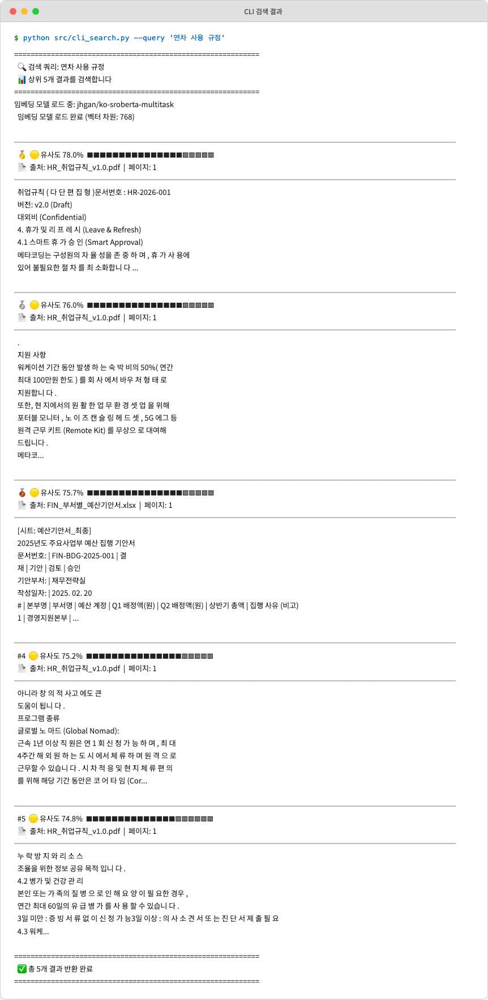
*그림 6-6: "연차 사용 규정" 쿼리 검색 결과 — 출처와 유사도 함께 표시*

검색 결과를 해석하는 기준은 다음과 같습니다.

| 유사도 | 의미 | 조치 |
|--------|------|------|
| 80% 이상 | 관련도 높음 | 정상 |
| 70~80% | 관련도 보통 | 청크 크기 또는 임베딩 모델 검토 |
| 70% 미만 | 관련도 낮음 | 쿼리 표현 방식 또는 문서 내용 확인 |

다음 쿼리들로 다양한 검색을 시험해 보십시오.

```bash
python src/cli_search.py --query "비밀번호 정책"
python src/cli_search.py --query "신규 서비스 출시 전략"
python src/cli_search.py --query "부서별 예산 현황"
```

> **참고: 검색 결과 개수 조정**
> 기본은 top_k=5이지만 `--top-k` 옵션으로 변경할 수 있습니다.
> ```bash
> python src/cli_search.py --query "연차 사용 규정" --top-k 3
> ```
> `--top-k 3`으로 줄이면 가장 관련 있는 청크만 확인할 수 있고, `--top-k 10`으로 늘리면 더 넓은 범위를 검토할 수 있습니다.
---

## 7. 정리하며

메타코딩은 이 챕터를 시작할 때 "파일을 정리했다고 AI가 이해하는 건 아니잖아"라고 걱정했습니다. Python 파싱으로 PDF, DOCX, XLSX에서 텍스트를 추출하고, 500자 단위로 청킹한 뒤 ko-sroberta 임베딩을 거쳐 ChromaDB에 저장했습니다. CLI에서 "연차 사용 규정"을 입력하자 HR 취업규칙 문서의 관련 조항과 출처가 1초 이내에 반환되었습니다.

<!-- [GEMINI PROMPT: 06_before-after]
path: assets/CH06/06_before-after.png
A minimalist black and white technical diagram with a strict 16:9 aspect ratio on a solid white background. No shading, no 3D effects, only clean thin line art. Simple before/after comparison: LEFT side labeled "Before" shows a person icon with a thought bubble containing a folder icon and "10~30분 검색" text with a downward-pointing arrow indicating inefficiency. RIGHT side labeled "After" shows a terminal icon with text "1초 미만" and an upward-pointing arrow. Center shows a large right-pointing arrow labeled "VectorDB 구축". Clean flat design, balanced layout.
Style: before-after-infographic
-->
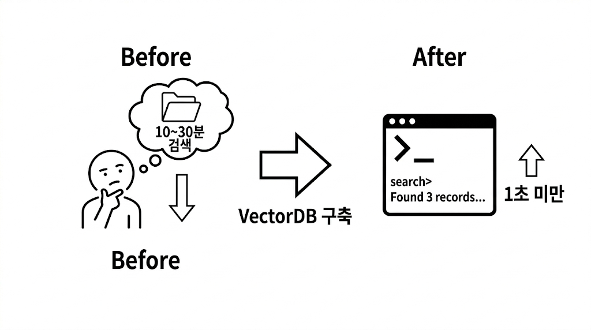
*그림 6-7: VectorDB 구축 전후 문서 검색 방식 비교*

| 지표 | Before | After |
|------|--------|-------|
| 문서 검색 방식 | 파일명으로 수동 탐색 | 의미 기반 벡터 검색 |
| 검색 소요 시간 | 10~30분 (폴더 탐색) | 1초 미만 (CLI 쿼리) |
| 표·차트 정보 | 텍스트 추출 시 일부 손실 | 텍스트 기반 검색 가능 |
| 검색 정확도(top-5) | 해당 없음 | 80%+ 관련 문서 포함 |
| 출처 확인 | 파일 직접 열어 검색 | 파일명 + 페이지 즉시 표시 |

이 챕터에서 배운 핵심 내용을 정리합니다.

- **Python 파싱의 범위와 한계**: `pypdf`, `python-docx`, `openpyxl`은 텍스트형 문서에 효과적이지만, 이미지형 PDF와 복잡한 표에서는 정보 손실이 발생합니다. 이 한계는 CH10에서 Vision LLM을 활용하여 해결합니다.
- **Fixed-size 청킹의 선택 이유**: 500자 + 100자 오버랩 구성은 구현이 단순하고 동작이 예측 가능합니다. 품질 개선이 필요하면 CH10에서 Semantic 청킹으로 전환합니다.
- **메타데이터가 검색 품질을 결정한다**: 청크마다 파일명·페이지·부서 정보를 부착해야 검색 결과에서 출처를 명확히 표시하고, 나중에 부서별 필터링도 적용할 수 있습니다.
- **ChromaDB upsert**: 같은 ID의 청크는 중복 저장되지 않으므로 파이프라인을 반복 실행해도 안전합니다.

다음 챕터에서는 이 ChromaDB 색인을 RAG 체인과 연결하여 자연어 질문에 답변하는 웹 채팅 UI를 구현합니다. CLI에서 확인한 검색 품질이 실제 LLM 답변의 정확도로 이어집니다.


---

# 7. RAG로 Q&A 엔진 만들기

<!-- [GEMINI PROMPT: 07_opening-story]
path: assets/CH07/07_opening-story.png
Warm office illustration: A developer sitting alone at a desk, looking at a terminal screen showing CLI text output on the left monitor, while imagining a chat bubble interface on the right. The developer has a thoughtful expression, with sticky notes saying "직원들은 터미널 못 쓴다" and "웹 UI 필요". Soft warm beige and light blue color palette, friendly cartoon style, clean white background with subtle desk and monitor elements, no text overlay.
Style: office-illustration-warm
-->

*그림 7-1: CLI 검색만으로는 직원들이 사용할 수 없다는 것을 깨달은 메타코딩*

CH06에서 ChromaDB 인덱스를 구축한 메타코딩은 CLI에서 "신입사원 온보딩 절차"를 검색하자 관련 문서 청크 5개가 즉시 출력되는 것을 확인하였습니다. 하지만 곧 문제가 보였습니다. 이 도구는 터미널 명령어를 아는 개발자만 사용할 수 있습니다. 직원 30명 중 터미널을 편하게 다루는 사람은 메타코딩 본인뿐입니다.

"직원들에게 '터미널에서 `python src/cli_search.py` 명령어를 입력하세요'라고 안내할 수는 없습니다."

브라우저에서 자연어로 질문하고, 출처가 포함된 답변을 받을 수 있는 채팅 UI가 필요합니다. 그리고 실제 업무 상황을 생각해보면 한 가지 질문만으로 끝나는 경우는 드뭅니다. "아까 물어본 건데, 그것 말고 다른 부서 규정은?" — 이전 대화를 이어서 질문하는 멀티턴 대화도 지원해야 합니다.

이 챕터에서는 다음 세 가지를 구현합니다.

1. **LCEL(LangChain Expression Language)** 기반 RAG 체인으로 질문 → 검색 → 답변 파이프라인 조립
2. 출처가 포함된 구조화된 응답 포맷과 **출처 아코디언 채팅 UI** 구현
3. 세션 기반 **멀티턴 대화** 관리로 이전 대화 맥락 유지

---

## 1. RAG Q&A 엔진의 구조

### 1.1 전체 흐름

사용자가 브라우저 채팅창에 질문을 입력하면 어떤 일이 일어나는지 먼저 살펴보겠습니다.

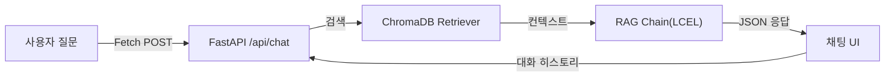
```mermaid
flowchart LR
    A["사용자 질문"] -- "Fetch POST" --> B["FastAPI /api/chat"]
    B -- "검색" --> C["ChromaDB Retriever"]
    C -- "컨텍스트" --> D["RAG Chain(LCEL)"]
    D -- "JSON 응답" --> E["채팅 UI"]
    E -- "대화 히스토리" --> B
```

*그림 7-2: CH07 RAG Q&A 엔진 전체 흐름*

질문은 Fetch POST 방식으로 `/api/chat` 엔드포인트에 도달합니다. FastAPI가 이를 받아 RAG 체인에 전달하면, 체인은 ChromaDB에서 관련 문서를 검색하고 LLM으로 답변을 생성하여 JSON 형태로 반환합니다. 채팅 UI는 그 JSON에서 답변과 출처를 꺼내 화면에 표시합니다. 멀티턴 대화를 위해 세션 히스토리도 함께 주고받습니다.

### 1.2 LCEL이란 무엇인가

**LCEL(LangChain Expression Language)** 은 LangChain의 선언적 체인 조합 문법입니다. Python의 파이프 연산자(`|`)를 사용하여 Retriever, Prompt, LLM, OutputParser 같은 구성 요소를 하나의 체인으로 연결합니다.

```mermaid
flowchart LR
    R["Retriever"] -- "관련 문서" --> P["Prompt Template"]
    P -- "완성된 프롬프트" --> L["LLM"]
    L -- "원문 응답" --> O["OutputParser"]
    O -- "최종 답변" --> A["answer 문자열"]
```

*그림 7-3: LCEL 파이프라인 구성 요소*

각 구성 요소의 역할을 정리하면 다음과 같습니다.

| 구성 요소 | 역할 |
|----------|------|
| **Retriever** | ChromaDB에서 질문과 의미적으로 유사한 문서를 검색하여 반환합니다. |
| **Prompt Template** | LLM에 전달할 지시문(시스템 규칙 + 컨텍스트 + 질문)을 조립합니다. |
| **LLM** | DeepSeek R1 등 언어 모델이 프롬프트를 읽고 답변을 생성합니다. |
| **OutputParser** | LLM 응답 객체에서 순수 문자열만 추출합니다. `StrOutputParser()`가 담당합니다. |

LCEL을 사용하는 이유는 두 가지입니다. 첫째, 파이프 연산자 덕분에 데이터 흐름이 왼쪽에서 오른쪽으로 한눈에 보입니다. 둘째, 구성 요소를 독립적으로 교체할 수 있어 Ollama 모델을 OpenAI 모델로 바꾸거나 ChromaDB를 다른 VectorDB로 전환할 때 체인 코드를 수정할 필요가 없습니다.

> **참고: temperature 파라미터**
> LLM의 출력 무작위성을 조절하는 값입니다. 0에 가까우면 가장 확률이 높은 단어를 선택하여 일관된 답변을 생성하고, 1에 가까우면 다양한 표현을 시도합니다. 사실 기반 Q&A에서는 `temperature=0.1` 처럼 낮은 값을 사용합니다.

---

## 2. 실습 환경 준비

### 2.1 저장소 클론 및 환경 설정

> **주의: 이전 챕터 실습 환경 정리**
> CH04의 FastAPI 서버와 Docker 컨테이너가 실행 중이라면 먼저 종료하십시오. 포트가 충돌합니다.
> ```bash
> # 1. Ctrl+C 로 uvicorn 서버 종료
> # 2. Docker 컨테이너 종료 (CH04 디렉토리에서)
> docker compose down
> ```

```bash
cd examples/CH07_RAG_QA_엔진
python3 -m venv .venv
source .venv/bin/activate   # Windows: .venv\Scripts\Activate.ps1
```

`.env.example`을 `.env`로 복사하고 설정값을 입력합니다.

```bash
cp .env.example .env
```

`.env` 파일의 주요 설정 항목은 다음과 같습니다.

```
# LLM 제공자: ollama(로컬) 또는 openai(클라우드)
LLM_PROVIDER=ollama
OLLAMA_BASE_URL=http://localhost:11434
OLLAMA_MODEL=deepseek-r1:8b

# 임베딩 모델 (CH06과 동일)
EMBEDDING_MODEL=jhgan/ko-sroberta-multitask

# ChromaDB 경로 (없으면 data/docs/에서 자동 구축)
CHROMA_PERSIST_DIR=./data/chroma_db

# 세션 설정
SESSION_TTL_SECONDS=3600
CONVERSATION_WINDOW_SIZE=5
```

> **팁: ChromaDB 자동 구축**
> 이 챕터의 예제 프로젝트에는 원본 문서 6종이 `data/docs/`에 포함되어 있습니다. 서버를 처음 실행하면 이 문서를 자동으로 파싱·청킹·임베딩하여 `data/chroma_db/`에 VectorDB를 구축합니다. CH06의 출력을 별도로 복사할 필요가 없습니다.

### 2.2 의존성 설치

> **주의: 패키지 설치 시간**
> `sentence-transformers`와 `chromadb`는 처음 설치 시 수백 MB의 파일을 내려받습니다. 네트워크 속도에 따라 수 분이 걸릴 수 있습니다.

```bash
pip install -r requirements.txt
```

주요 패키지와 역할은 다음과 같습니다.

| 패키지 | 버전 | 역할 |
|--------|------|------|
| `langchain` | 0.3.21 | LCEL 체인 조합 프레임워크 |
| `langchain-ollama` | 0.2.3 | Ollama LLM 연결 |
| `langchain-chroma` | 0.2.6 | ChromaDB 연동 |
| `chromadb` | 1.5.1 | 벡터 데이터베이스 |
| `sentence-transformers` | 3.3.1 | ko-sroberta 임베딩 모델 실행 엔진 (CH06과 동일) |
| `fastapi` | 0.115.8 | 채팅 API 서버 |
| `uvicorn` | 0.34.0 | ASGI 서버 |
| `jinja2` | 3.1.5 | HTML 템플릿 엔진 |

`sentence-transformers`는 CH06에서 사용한 `ko-sroberta-multitask` 임베딩 모델을 로드하는 엔진입니다. `langchain-chroma`가 내부적으로 `HuggingFaceEmbeddings`를 호출할 때 이 패키지가 필요합니다.

### 2.3 서버 실행

```bash
python app/main.py
```

터미널에 다음과 같은 메시지가 출력되면 정상입니다.

```
[INFO] 서버 시작: http://0.0.0.0:8000
[INFO] 채팅 UI: http://localhost:8000/chat
[INFO] ChromaDB가 없습니다. data/docs/ 원본 문서에서 자동 구축합니다.
[INFO] ChromaDB 자동 구축 완료: 87건 → ./data/chroma_db
```

브라우저에서 `http://localhost:8000/chat` 을 열면 채팅 UI가 표시됩니다.

<!-- [CAPTURE NEEDED: 07_chat-ui-initial
  path: assets/CH07/07_chat-ui-initial.png
  desc: 브라우저에서 http://localhost:8000/chat 접속 시 초기 채팅 UI 화면 — "메타코딩 Q&A 비서입니다" 환영 메시지가 표시된 상태
] -->
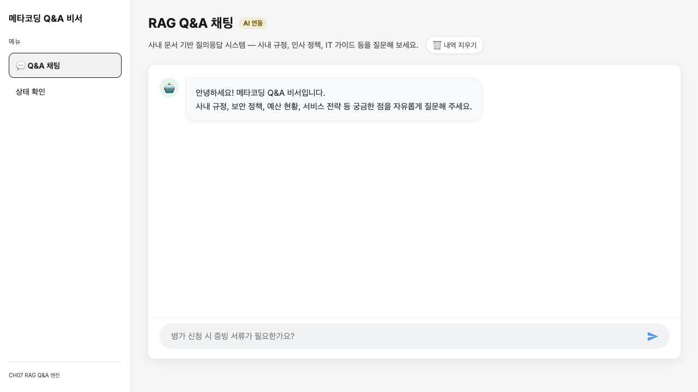
*그림 7-4: 브라우저에서 확인한 CH07 채팅 UI 초기 화면*

---

## 3. RAG 최소 동작 구현 — LCEL 기반 RAG 체인

메타코딩이 처음 만든 것은 RAG 체인의 핵심 로직입니다. CLI 검색에서는 ChromaDB 검색 결과를 그냥 출력하기만 했지만, 이번에는 검색 결과를 LLM에 넘겨서 자연어 답변을 생성해야 합니다.

### 3.1 RAG 체인 구현

`src/rag_chain.py`의 핵심 함수 `build_rag_chain()`을 살펴보겠습니다.

```python
# src/rag_chain.py (핵심 발췌)

def build_rag_chain() -> tuple[Any, Any]:
    llm = _build_llm()             # ① LLM 인스턴스 생성
    retriever = _build_retriever() # ② Retriever 생성 (ChromaDB)

    prompt = ChatPromptTemplate.from_messages(
        [
            ("system", RAG_SYSTEM_PROMPT),
            ("human", RAG_HUMAN_PROMPT),
        ]
    )

    # LCEL 파이프: 입력 dict에서 각 키를 꺼내 병렬 처리 후 프롬프트로 합침
    chain = (
        {
            "context": itemgetter("question") | retriever | _format_docs,
            "history": itemgetter("history"),
            "question": itemgetter("question"),
        }
        | prompt
        | llm
        | StrOutputParser()
    )

    return chain, retriever
```

> 전체 코드: `src/rag_chain.py`

```mermaid
flowchart LR
    A["question 입력"] --> B["itemgetter → retriever"]
    B --> C["_format_docs()"]
    A --> D["history / question 전달"]
    C --> E["prompt 조립"]
    D --> E
    E --> F["LLM"]
    F --> G["StrOutputParser <br>→ 답변 문자열"]
```

*그림 7-3-1: LCEL 체인 실행 흐름 — 질문이 검색·프롬프트 조립·생성 단계를 순서대로 통과합니다*

중괄호(`{}`) 블록은 `context`, `history`, `question` 세 값을 동시에 준비하는 병렬 실행 단계입니다. 세 값이 모두 완성되면 `prompt`로 합쳐져 LLM에 전달됩니다. 메타코딩은 이 한 줄짜리 파이프가 CLI 검색 스크립트 50줄을 대체한다는 사실에 잠시 멍해졌습니다.

---

## 4. RAG 프롬프트 기본 템플릿

### 4.1 출처 강제 규칙

RAG 시스템에서 **출처 강제 규칙** 은 신뢰도의 핵심입니다. 이 규칙이 없으면 LLM이 학습 데이터에서 그럴듯한 답변을 만들어낼 수 있습니다. 사용자는 그 답변이 실제 사내 문서 기반인지, LLM의 추측인지 구분할 수 없습니다.

시스템 프롬프트는 LLM에게 역할과 4가지 규칙을 명시합니다. "반드시 제공된 문서에서만 근거를 찾아라", "찾을 수 없으면 확인되지 않는다고 답하라", "출처 문서명을 명시하라", "추측이나 외부 지식은 사용하지 마라"가 핵심입니다. 프롬프트 변수는 `{context}`, `{history}`, `{question}` 세 개입니다.

> 전체 코드: `src/rag_chain.py`

### 4.2 프롬프트 설계 패턴
실제 프롬프트의 구조를 살펴보겠습니다.

```
[시스템 메시지]
당신은 메타코딩 사내 문서 Q&A 비서입니다.
아래에 제공된 문서(Context)만 사용하여 질문에 답변하십시오.

규칙:
1. 반드시 제공된 문서에서만 근거를 찾아 답변하시오.
2. 문서에서 답을 찾을 수 없으면 "해당 내용은 제공된 문서에서 확인되지 않습니다."라고 답하시오.
3. 답변 마지막에 근거 문서명을 반드시 명시하시오. 형식: [출처: 문서명]
4. 추측이나 외부 지식을 사용하지 마시오.

Context (제공된 문서):
{context}

이전 대화:
{history}

[사용자 메시지]
질문: {question}
```

이 프롬프트는 세 개의 블록으로 구성됩니다.

```mermaid
flowchart LR
    A["시스템 역할 정의"] --> B["컨텍스트 블록"]
    B --> C["이전 대화 블록"]
    C --> D["질문"]
```

*그림 7-5: RAG 프롬프트 구조 — 시스템 역할, 컨텍스트, 대화 히스토리, 질문*

- **시스템 역할 정의**: LLM에게 "사내 문서 Q&A 비서"라는 역할과 4가지 규칙을 명시합니다.
- **컨텍스트 블록** (`{context}`): `_format_docs()`가 변환한 검색 결과가 여기에 채워집니다.
- **이전 대화 블록** (`{history}`): 멀티턴 대화를 위한 이전 대화 내역이 여기에 들어갑니다. 첫 질문일 때는 "없음"이 입력됩니다.
- **질문** (`{question}`): 사용자가 입력한 자연어 질문입니다.

"모르면 확인되지 않음" 규칙(규칙 2)은 환각을 방지하는 안전장치입니다. 문서에 없는 내용을 질문하면 LLM이 "해당 내용은 제공된 문서에서 확인되지 않습니다."라고 답변하도록 강제합니다. 이 규칙이 없으면 LLM이 사내 문서에 없는 정보를 자신 있게 생성할 수 있습니다.

---

## 5. 출처 표시 응답 포맷

### 5.1 answer + sources 구조

RAG 체인이 답변을 생성하면, `response_parser.py`가 이를 구조화된 JSON으로 변환합니다.

```json
{
  "answer": "신입사원 온보딩 절차는 총 3단계로 구성됩니다...\n[출처: HR_취업규칙_v1.0]",
  "sources": [
    {
      "doc": "HR_취업규칙_v1.0",
      "page": 12,
      "snippet": "제3조 (온보딩 절차) 신입사원은 입사 후 1주일 이내에..."
    },
    {
      "doc": "HR_정보보안서약서",
      "page": 1,
      "snippet": "보안 서약은 온보딩 첫날 서명 완료해야 합니다..."
    }
  ],
  "session_id": "a1b2c3d4-..."
}
```

### 5.2 응답 파서 동작

`response_parser.py`는 LLM 원문 응답을 구조화된 JSON으로 변환하는 세 단계를 수행합니다.

```mermaid
flowchart LR
    A["LLM 원문 응답<br> + 검색 Document 목록"] --> B["parse_answer_text()<br>DeepSeek R1 &lt;think&gt; 태그 제거"]
    A --> C["parse_sources_from_docs()<br>동일 문서·페이지 중복 제거"]
    B --> D["build_response()<br>{'answer', 'sources'} 딕셔너리"]
    C --> D
```

*그림 7-5-1: 응답 파서 흐름 — LLM 원문과 검색 문서가 구조화된 JSON으로 변환됩니다*

첫 번째 단계에서 DeepSeek R1이 생성하는 `<think>...</think>` 추론 토큰을 제거하여 순수 답변만 남깁니다. 두 번째 단계에서 검색된 문서 목록에서 동일 출처(문서명 + 페이지) 중복을 걸러내고 스니펫을 추출합니다. 세 번째 단계에서 두 결과를 `answer + sources` 딕셔너리로 합칩니다. 메타코딩은 첫 번째 실제 응답 JSON을 보는 순간 "이제 UI에 붙이기만 하면 되겠다"는 생각이 들었습니다.

> 전체 코드: `src/response_parser.py`

출처를 별도 필드로 구조화하는 이유가 있습니다. 출처가 답변 텍스트 안에 `[출처: ...]` 형태로만 포함되면 UI에서 꾸미기가 어렵습니다. `sources` 배열로 분리하면 채팅 UI에서 아코디언 형태로 펼쳐지는 "근거 문서 보기" 기능을 구현할 수 있습니다.

> **주의: LLM 응답의 비결정성**
> LLM 응답은 실행할 때마다 달라집니다. `temperature=0.1`을 사용하더라도 완전히 동일한 답변이 나오지 않습니다. 채팅 UI에서 확인한 답변이 이 책의 예시와 다른 내용이어도 정상입니다.

---

## 6. 채팅 웹 UI — CH04 base.html 계승

### 6.1 CH04 디자인 시스템 재활용

메타코딩은 CH04에서 직원 관리 Admin UI를 만들면서 `base.html` 레이아웃을 설계하였습니다. 좌측 240px 사이드바와 메인 콘텐츠 영역으로 구성된 이 레이아웃은 직원들이 이미 익숙한 화면입니다. 채팅 UI도 동일한 디자인 시스템을 계승합니다.

`templates/chat.html`은 Jinja2의 `` 한 줄로 전체 레이아웃(사이드바, 헤더, 공통 CSS)을 불러오고, `` 안에 채팅 히스토리 영역과 하단 입력바만 새로 정의합니다. AI 환영 메시지, 질문 입력 폼, 전송 버튼으로 구성된 채팅 화면이 CH04와 동일한 디자인 안에 자연스럽게 들어갑니다.

> 전체 코드: `templates/chat.html`

### 6.2 Fetch 기반 채팅 API 호출

`chat.js`의 `handleSubmit()` 함수가 사용자 질문을 서버에 전달하고 응답을 화면에 표시합니다.

```mermaid
flowchart LR
    A["질문 입력"] --> B["로딩 인디케이터 표시"]
    B --> C["Fetch POST /api/chat<br>{question, session_id}"]
    C --> D["응답 JSON에서<br>answer·sources 추출"]
    D --> E["AI 말풍선 렌더링<br>+ 출처 아코디언"]
    E --> F["로딩 인디케이터 숨김<br>(try/finally 보장)"]
```

*그림 7-6-0: chat.js 처리 흐름 — 질문부터 말풍선 렌더링까지 다섯 단계*

`try/finally` 블록이 로딩 인디케이터 해제를 보장하므로 서버 오류가 나도 화면이 멈추지 않습니다. Fetch 방식을 사용하는 이유가 있습니다. SSE(Server-Sent Events)나 WebSocket은 스트리밍 답변을 보여줄 수 있지만 구현 복잡도가 높습니다. Fetch 기반 단순 요청·응답 방식은 구현이 직관적이고, 사내 도구에서 요구하는 수준의 응답 속도로 충분합니다.

> 전체 코드: `static/js/chat.js`

### 6.3 FastAPI 채팅 엔드포인트

`app/chat_api.py`의 `chat_endpoint()`가 브라우저 요청을 받아 RAG 체인 실행까지 한 번의 POST 요청 안에서 완결합니다.

```mermaid
flowchart LR
    A["POST /api/chat"] --> B["세션 히스토리 조회"]
    B --> C["retriever.invoke(question)"]
    C --> D["chain.invoke(question + history)"]
    D --> E["build_response()"]
    E --> F["save_turn() → JSON 반환"]
```

*그림 7-6-1: chat_endpoint 처리 흐름 — 히스토리 주입, 검색, 생성, 저장이 순서대로 실행됩니다*

히스토리 조회 → 문서 검색 → 체인 실행 → 응답 구조화 → 히스토리 저장의 다섯 단계입니다. 메타코딩은 이 엔드포인트 하나가 CLI 검색 스크립트와 결과 출력 스크립트를 모두 대체한다는 점을 확인하고 설계가 맞다는 확신을 얻었습니다.

`get_rag_chain()`은 싱글턴 패턴으로 구현되어 있습니다. 앱이 시작될 때 RAG 체인을 한 번만 초기화하고 이후 요청에서는 재사용합니다. LLM 인스턴스와 ChromaDB 연결을 매 요청마다 새로 만들면 응답 시간이 크게 늘어납니다.

> 전체 코드: `app/chat_api.py`

<!-- [CAPTURE NEEDED: 07_chat-with-source
  path: assets/CH07/07_chat-with-source.png
  desc: 브라우저 채팅 UI에서 "신입사원 온보딩 절차는?" 질문 후 AI 답변이 표시되고, 하단에 "근거 문서 보기" 아코디언이 펼쳐진 상태
] -->
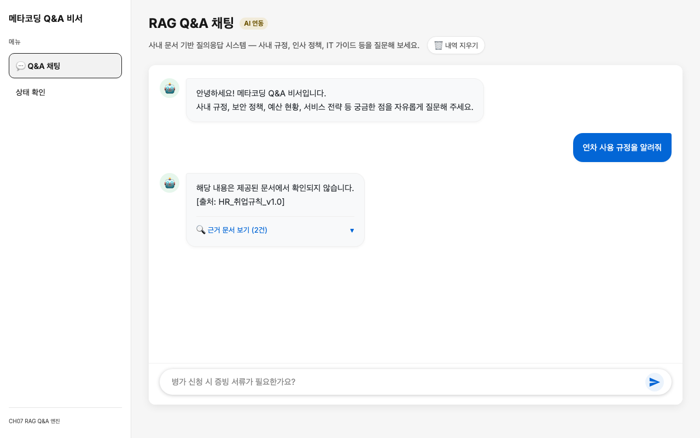
*그림 7-6: AI 답변 아래에 출처 아코디언이 펼쳐진 채팅 화면*

---

## 7. 멀티턴 대화 관리

### 7.1 멀티턴이 필요한 이유

실제 업무에서는 "온보딩 절차를 알려줘" 한 번으로 끝나는 경우가 드뭅니다. 직원들은 이렇게 물어봅니다.

> "온보딩 절차를 알려줘."
> "그 중 보안 서약은 언제까지 해야 해?"
> "아, 그러면 입사 첫날 어디로 가면 돼?"

각 질문은 앞 질문의 맥락 없이는 이해할 수 없습니다. "그 중" 이 무엇을 가리키는지, "그러면" 이 무슨 상황을 전제하는지 — 이 맥락을 LLM에 전달하지 않으면 매 질문이 독립적인 첫 질문으로 처리됩니다.

### 7.2 WindowMemory — 최근 N턴 유지

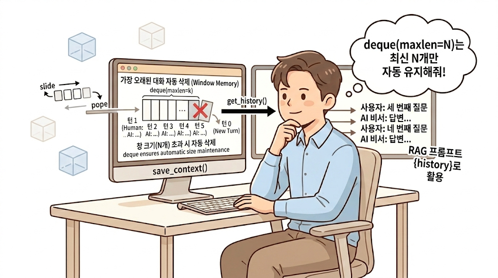
*그림 7-7: WindowMemory deque 예시*

LangChain의 `ConversationBufferWindowMemory`와 동일한 개념으로, 이 프로젝트에서는 `WindowMemory` 클래스를 직접 구현하였습니다. 내부적으로 `deque(maxlen=k)`를 사용하여 최근 k턴만 유지하고, `get_history()`가 `"사용자: ...\nAI 비서: ..."` 형식의 문자열로 변환하여 RAG 프롬프트의 `{history}` 자리에 바로 채울 수 있도록 반환합니다.

> 전체 코드: `src/conversation.py`

`deque(maxlen=k)`는 k+1번째 항목이 들어오면 가장 오래된 항목을 자동으로 제거합니다.

`deque`를 사용하는 이유가 있습니다. 리스트로 구현하면 길이 초과 시 수동으로 오래된 항목을 제거해야 합니다. `deque(maxlen=k)`는 이 로직을 자동으로 처리합니다.

### 7.3 세션 관리 — 사용자별 독립 히스토리

여러 직원이 동시에 채팅을 사용할 때, 각자의 대화 히스토리가 뒤섞여서는 안 됩니다. `ConversationManager`가 세션 ID를 키로 각 직원의 `WindowMemory`를 분리하여 관리합니다. `session_id`를 키로 각 직원의 `WindowMemory`를 독립적으로 보관하고, TTL이 지난 세션은 자동 정리합니다.

> 전체 코드: `src/conversation.py`

메타코딩이 직원 두 명에게 동시에 채팅 테스트를 요청했을 때 서로의 대화가 섞이지 않는다는 것을 확인하고 설계가 올바르다는 것을 검증하였습니다.


### 7.4 멀티턴 대화 동작 확인

서버가 실행 중인 상태에서 브라우저 채팅 UI를 열고 연속 질문을 입력해 보십시오.

<!-- [CAPTURE NEEDED: 07_multiturn-chat
  path: assets/CH07/07_multiturn-chat.png
  desc: 채팅 UI에서 "온보딩 절차를 알려줘" → AI 답변 → "그 중 보안 서약은?" → AI가 이전 맥락을 이해하여 온보딩 관련 보안 서약 내용을 답변하는 멀티턴 대화 화면
] -->
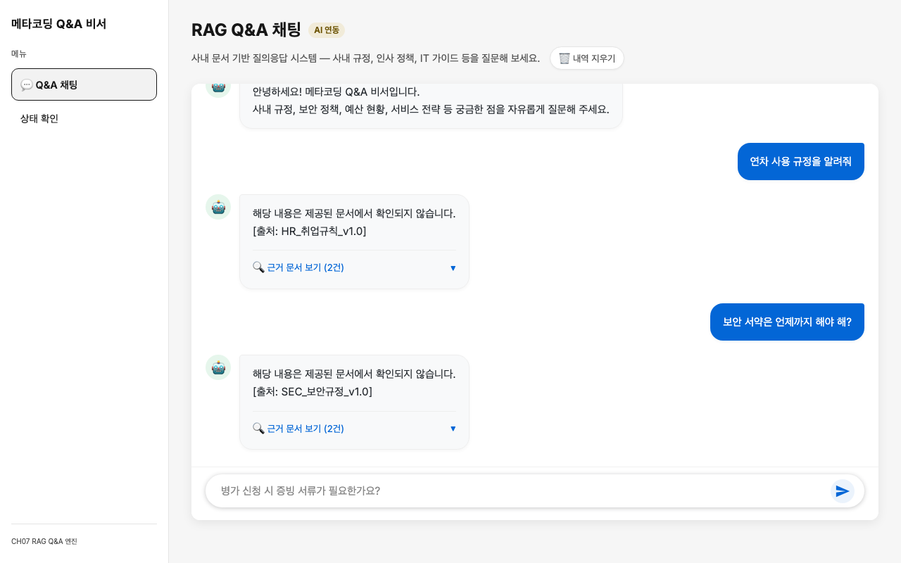
*그림 7-7: 이전 질문의 맥락을 이어받아 답변하는 멀티턴 대화*

> **참고: LLM 응답은 실행할 때마다 달라집니다**
> 화면에서 확인한 답변 내용이 이 책의 예시와 다른 경우에도 정상입니다.

두 번째 질문 "그 중 보안 서약은?"에 대해 LLM이 앞 질문의 맥락(온보딩 절차)을 이해하고 관련 내용을 답변한다면 멀티턴 대화가 정상 동작하는 것입니다. "그 중"이 무엇을 가리키는지 LLM이 이해할 수 있는 것은 `history` 필드에 이전 대화가 포함되어 있기 때문입니다.

---

## 8. 정리하며

<!-- [GEMINI PROMPT: 07_before-after]
path: assets/CH07/07_before-after.png
Simple before/after comparison infographic: LEFT side labeled "CLI 검색 (Before)" shows a terminal icon with text "개발자 1명만 사용 가능" and a red down-arrow with "5건/일", RIGHT side labeled "웹 채팅 UI (After)" shows a browser chat icon with text "전 직원 30명 사용 가능" and a green up-arrow with "50건/일". Center arrow pointing right. Clean flat design, white background, black and white line art, 16:9.
Style: before-after-infographic
-->
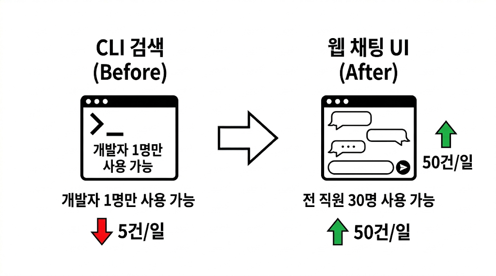
*그림 7-8: CH07 완료 — CLI에서 전 직원이 사용하는 웹 채팅 UI로*

메타코딩이 CH07에서 만든 것을 정리하면 다음과 같습니다.

- **LCEL 기반 RAG 체인**: 파이프 연산자(`|`)로 Retriever → Prompt → LLM → Parser를 조립하였습니다. `.env` 한 줄로 Ollama와 OpenAI를 전환할 수 있습니다.
- **출처 강제 프롬프트**: 4가지 규칙으로 LLM이 사내 문서 기반으로만 답변하도록 제약하였습니다. 문서에 없는 내용은 "확인되지 않습니다"로 처리됩니다.
- **구조화된 응답 포맷**: `answer + sources` JSON 구조로 채팅 UI에서 출처 아코디언을 구현하였습니다.
- **채팅 웹 UI**: CH04의 `base.html`을 계승하여 일관된 디자인으로 Fetch 기반 채팅 화면을 완성하였습니다.
- **멀티턴 대화**: `WindowMemory`와 `ConversationManager`로 세션별 대화 히스토리를 관리하여 이전 맥락을 이어받는 대화를 구현하였습니다.

CH07 완료 이후의 before/after 비교입니다.

| 지표 | Before (CLI 검색) | After (웹 채팅 UI) |
|------|------------------|--------------------|
| 사용 가능한 인원 | 개발자 1명 | 전 직원 30명 |
| 질의 방식 | 터미널 명령어 | 브라우저 채팅 |
| 출처 표시 | 텍스트 출력 | 근거 아코디언 UI |
| 대화 맥락 유지 | 불가능 | 멀티턴 대화 지원 |
| 질의 건수 (예상) | 5건/일 | 50건/일 |

---

직원 1명에게 채팅 UI 테스트를 부탁하였더니 이런 반응이 돌아왔습니다. "이거 ChatGPT보다 좋은데? 출처까지 나오니까 믿을 수 있어." 메타코딩은 처음으로 이 프로젝트가 제대로 가고 있다는 확신을 얻었습니다.

> **실습 환경 정리**
> 이 챕터의 실습이 끝나면 FastAPI 서버를 종료하십시오. 다음 챕터에서 동일 포트(8000)를 사용하므로 충돌이 발생할 수 있습니다.
> ```bash
> # Ctrl+C 로 uvicorn 서버 종료
> ```

하지만 곧 예상치 못한 질문이 들어옵니다. "김철수 사원의 남은 연차는 며칠이야?" — 이 정보는 사내 문서가 아닌 PostgreSQL 데이터베이스에 있습니다. RAG만으로는 처리할 수 없는 질문입니다. 다음 챕터에서는 정형 데이터(DB)와 비정형 데이터(문서)를 함께 처리하는 통합 에이전트를 구축합니다.


---

# 8. 정형 MCP + 비정형 RAG 통합 에이전트

<!-- [GEMINI PROMPT: 08_opening-story]
path: assets/CH08/08_opening-story.png
Warm office illustration: A developer looking at two monitor screens. Left monitor shows a chat bubble with "김철수 사원의 남은 연차는?" and a red X mark. Right monitor shows a PostgreSQL database icon with employee records. The developer has a puzzled expression, with a thought bubble showing "DB + 문서 = ?". Soft warm beige and light blue color palette, friendly cartoon style, clean white background with subtle office elements, no text overlay.
Style: office-illustration-warm
-->

*그림 8-1: RAG 채팅 UI에 정형 데이터 질문이 들어오기 시작한 상황*

CH07에서 완성한 RAG 채팅 UI를 직원들에게 공개한 지 3일째, 메타코딩의 슬랙에 메시지가 쏟아졌습니다. "온보딩 절차 알려줘"나 "보안 정책 설명해줘" 같은 문서 질문은 출처와 함께 정확히 답변했습니다. 하지만 문제는 다른 곳에서 터졌습니다.

"김민준 과장의 남은 연차가 며칠인지 알려줘."

이 질문에 AI 비서는 사내 문서를 뒤진 끝에 "취업규칙 제15조에 따르면 1년 이상 근속 시 15일의 연차가 부여됩니다"라고 답했습니다. 질문자가 원한 것은 김민준 과장의 **실제 잔여 연차 일수** 였는데, AI는 일반 규정을 검색한 것입니다. 연차 잔여 일수는 PostgreSQL 데이터베이스에 있는 **정형 데이터** 이고, 사내 문서에는 없습니다.

더 난감한 질문도 있었습니다. "올해 매출 상위 부서의 복지 정책을 비교해 줘." 이 질문은 매출 데이터(DB)와 복지 정책(문서)을 **모두** 조합해야 답변할 수 있습니다.

이 챕터에서는 다음 세 가지를 구현합니다.

1. **QueryRouter(질문 라우터)** 로 질문을 정형/비정형/복합으로 자동 분류
2. **MCP(Model Context Protocol)** 도구 4종으로 PostgreSQL DB를 직접 조회
3. **ReAct Agent(Reasoning + Acting Agent)** 로 DB 조회 결과와 문서 검색 결과를 통합하여 최종 답변 생성

> **주의: 이전 챕터 실습 환경 정리**
> CH07의 FastAPI 서버가 실행 중이라면 먼저 종료하십시오. 포트가 충돌합니다.
> ```bash
> # 1. Ctrl+C 로 uvicorn 서버 종료
> ```
> 이 챕터에서는 PostgreSQL이 필요합니다. Docker 컨테이너를 시작하십시오.
> ```bash
> docker compose up -d
> ```

---

## 1. 정형/비정형 분리 원칙

### 1.1 질문 유형 분류

AI 비서에 들어오는 질문은 세 가지 유형으로 나뉩니다.

| 유형 | 데이터 위치 | 처리 경로 | 예시 |
|------|-----------|----------|------|
| 정형 | PostgreSQL DB | MCP 도구로 SQL 조회 | "김민준 연차 잔여일수" |
| 비정형 | 사내 문서(PDF/DOCX) | VectorDB + RAG 체인 | "온보딩 절차를 알려줘" |
| 복합 | DB + 문서 | 두 경로를 순차 또는 병렬 실행 | "매출 상위 부서의 복지 정책" |

**정형 데이터** 는 PostgreSQL 테이블에 행과 열로 구조화된 데이터입니다. 직원 번호, 연차 잔여 일수, 매출 금액처럼 정해진 스키마로 저장됩니다. **비정형 데이터** 는 PDF, DOCX 같은 자연어 문서입니다. 정해진 구조 없이 단락과 표가 혼재합니다.

### 1.2 분리 원칙

```mermaid
flowchart TD
    A["사용자 질문"] --> B["QueryRouter"]
    B -- "정형" --> C["MCP Tools(SQL 조회)"]
    B -- "비정형" --> D["RAG Chain(문서 검색)"]
    B -- "복합" --> E["ReAct Agent"]
    E --> C
    E --> D
    E -- "통합 응답" --> F["최종 답변"]
```

*그림 8-2: 질문 유형별 처리 경로 분기*

핵심 원칙은 단순합니다. 숫자·통계·목록 질문은 DB로 보내고, 절차·정책·설명 질문은 문서로 보내고, 둘 다 필요하면 순차 실행 후 합칩니다. 이 분기를 자동으로 수행하는 것이 **QueryRouter** 입니다.

> **질문: MCP란 무엇입니까?**
> **MCP(Model Context Protocol)** 는 LLM과 외부 도구·데이터 소스 간의 표준 통신 프로토콜입니다. LLM이 "이 도구를 이 파라미터로 호출하겠다"고 선언하면, 시스템이 실제 DB 조회나 API 호출을 수행하고 결과를 돌려주는 구조입니다. LangChain에서는 `@tool` 데코레이터로 도구를 정의하고, Agent가 필요한 도구를 스스로 선택하여 실행합니다.

---

## 2. 질문 라우팅 전략

QueryRouter는 3단계 전략으로 질문을 분류합니다. 단순한 방법에서 시작하여 점진적으로 정밀한 방법으로 넘어가는 구조입니다.

### 2.1 Step 1 — 규칙 기반 라우팅

가장 빠른 방법은 질문에 포함된 키워드를 확인하는 것입니다. "연차", "매출", "목록" 같은 단어가 있으면 정형으로, "절차", "정책", "온보딩" 같은 단어가 있으면 비정형으로 분류합니다.

핵심 아이디어는 단순합니다. 질문에 "연차", "매출", "목록" 같은 단어가 포함되어 있으면 정형 질문이고, "절차", "정책", "온보딩" 같은 단어가 있으면 비정형 질문입니다. 양쪽 키워드가 모두 포함되면 복합 질문으로 판단합니다.

```python
STRUCTURED_KEYWORDS = ["잔여", "연차", "휴가", "매출", "합계", "목록", "명단", "통계"]
UNSTRUCTURED_KEYWORDS = ["절차", "방법", "어떻게", "규정", "정책", "온보딩", "가이드"]

def _step1_rule_based(self, query: str):
    s_hits = sum(1 for kw in STRUCTURED_KEYWORDS if kw in query)
    u_hits = sum(1 for kw in UNSTRUCTURED_KEYWORDS if kw in query)
    if s_hits > 0 and u_hits > 0:
        return "hybrid"
    if s_hits > 0:
        return "structured"
    if u_hits > 0:
        return "unstructured"
    return None  # 다음 단계로 폴백
```

질문에서 정형·비정형 키워드의 출현 횟수를 비교하여 경로를 결정합니다. 어느 쪽에도 해당하지 않으면 `None`을 반환하여 다음 단계로 판단을 넘깁니다.

### 2.2 Step 2 — 스키마 기반 라우팅

Step 1에서 결론을 내지 못한 경우, DB 테이블의 컬럼명이 질문에 포함되어 있는지 확인합니다. `remaining_days`, `used_days`, `amount`, `emp_no` 같은 컬럼명이 직접 언급되면 정형으로 분류합니다. "remaining_days가 0인 직원은?"처럼 기술적 표현이 포함된 질문에 효과적입니다.

### 2.3 Step 3 — LLM 판단 라우팅

Step 1과 Step 2에서 모두 결론을 내지 못한 모호한 질문은 LLM에게 판단을 위임합니다. LLM에게 `"다음 질문을 structured | unstructured | hybrid 중 하나로 분류하세요"`라는 프롬프트를 전달하고, JSON 응답에서 `route` 값을 추출합니다. 파싱에 실패하면 기본값인 비정형(`unstructured`)으로 처리합니다.

### 2.4 3단계 통합 흐름

세 단계는 **폴백 체인** 으로 연결됩니다.

```mermaid
flowchart LR
    A["질문 입력"] --> B["Step 1: 키워드"]
    B -- "매칭됨" --> F["경로 결정"]
    B -- "미매칭" --> C["Step 2: 스키마"]
    C -- "매칭됨" --> F
    C -- "미매칭" --> D["Step 3: LLM"]
    D --> F
```

*그림 8-3: QueryRouter 3단계 폴백 체인*

Step 1은 응답 시간이 1ms 미만이고, Step 3은 LLM 호출이 필요하므로 수 초가 걸립니다. 빠른 방법으로 해결 가능한 질문은 빠르게 처리하고, 모호한 질문만 LLM에게 넘기는 구조입니다.

> 전체 코드: `src/router.py`

---

## 3. 통합 응답 전략

### 3.1 MCP 도구 4종

LLM이 DB를 직접 조회하려면 **도구(Tool)** 가 필요합니다. LangChain의 `@tool` 데코레이터로 4개의 MCP 도구를 정의합니다.

| 도구 | 기능 | 파라미터 |
|------|------|---------|
| `leave_balance` | 직원 연차 잔여 조회 | `emp_no` (번호 또는 이름) |
| `sales_sum` | 매출 합계 조회 | `dept`, `start_date`, `end_date` |
| `list_employees` | 직원 목록 조회 | `dept` (부서 필터) |
| `search_documents` | 사내 문서 벡터 검색 | `query`, `k` |

`leave_balance` 도구를 예로 살펴보겠습니다. `@tool` 데코레이터로 정의하면 LLM이 이 도구를 호출할 수 있습니다. 직원 번호(`E001` 형식)가 전달되면 `emp_no` 컬럼으로 조회하고, 이름이 전달되면 `LIKE` 검색으로 부분 일치를 수행합니다.

> **주의: PostgreSQL 연결은 필수입니다**
> 정형 데이터 도구(`leave_balance`, `sales_sum`, `list_employees`)는 반드시 PostgreSQL에 연결되어야 합니다. DB가 실행 중이 아니면 에러 메시지를 반환합니다. 실습 전에 `docker compose up -d`로 DB를 시작하십시오.

나머지 세 도구(`sales_sum`, `list_employees`, `search_documents`)도 동일한 패턴입니다. 정형 데이터 도구는 PostgreSQL에서 조회하고, `search_documents`는 ChromaDB 벡터 검색 또는 `data/docs/` 키워드 검색으로 사내 문서를 검색합니다.

> 전체 코드: `src/mcp_tools.py`

### 3.2 ReAct Agent — 추론과 실행의 반복

**ReAct(Reasoning + Acting)** 은 LLM이 "먼저 생각하고, 행동하고, 관찰하고, 다시 생각하는" 패턴을 반복하는 에이전트 구조입니다.

복합 질문 "매출 상위 부서의 복지 정책을 비교해 줘"를 예로 들면, ReAct Agent는 다음과 같이 동작합니다.

1. **Thought**: "매출 상위 부서를 먼저 확인해야 합니다. `sales_sum` 도구를 호출합니다."
2. **Action**: `sales_sum(dept="")` 실행 → 영업부가 1위
3. **Observation**: 영업부 매출 합계 13,300,000원
4. **Thought**: "영업부 복지 정책을 찾아야 합니다. `search_documents`를 호출합니다."
5. **Action**: `search_documents(query="영업부 복지 정책")` 실행
6. **Observation**: 워케이션 지원 제도, 성과급 기준 등 문서 발견
7. **Final Answer**: 두 결과를 종합하여 자연어 답변 생성

### 3.3 IntegratedAgent 동작 구조

`IntegratedAgent` 클래스는 QueryRouter와 AgentExecutor를 하나로 묶는 통합 컨트롤러입니다. 내부 동작을 흐름도로 표현하면 다음과 같습니다.

```mermaid
flowchart TD
    A["IntegratedAgent.run(query)"] --> B["QueryRouter.classify_query()"]
    B --> C["AgentExecutor.invoke()"]
    C --> D{"도구 호출 필요?"}
    D -- "Yes" --> E["MCP 도구 실행"]
    E --> F["Observation 기록"]
    F --> D
    D -- "No" --> G["최종 답변 생성"]
    G --> H["정형/비정형 데이터 분리"]
    H --> I["구조화된 응답 반환"]
```

*그림 8-5: IntegratedAgent 내부 실행 흐름*

`IntegratedAgent`는 초기화 시 QueryRouter와 `create_tool_calling_agent`로 생성한 AgentExecutor를 내장합니다. `run()` 메서드가 호출되면 먼저 QueryRouter로 질문 유형을 분류하고, AgentExecutor가 ReAct 패턴으로 MCP 도구를 반복 실행하여 정보를 수집합니다. `max_iterations=10`으로 무한 루프를 방지하며, 중간 단계(어떤 도구를 어떤 파라미터로 호출했는지)를 모두 기록하므로 에이전트의 판단 과정을 투명하게 확인할 수 있습니다. 최종 응답에는 답변 텍스트, 질문 유형, 정형 데이터(DB 조회 결과), 비정형 데이터(문서 검색 결과), 실행 단계가 분리되어 포함됩니다.

> 전체 코드: `src/agent.py`

---

## 4. 대표 질문 시나리오 10개

통합 에이전트가 다양한 질문 유형을 처리할 수 있는지 검증하기 위해 10개의 대표 시나리오를 정의합니다. 이 시나리오는 이후 CH10 평가 체계의 기준선이 됩니다.

### 4.1 정형 시나리오 (4개)

| # | 질문 | 경로 | 사용 도구 | 기대 응답 |
|---|------|------|----------|----------|
| 1 | "김민준 연차 잔여일수 알려줘" | structured | `leave_balance` | 잔여 일수 숫자 |
| 2 | "영업부 11월 매출 합계가 얼마야?" | structured | `sales_sum` | 매출 합계 금액 |
| 3 | "개발부 직원 목록 보여줘" | structured | `list_employees` | 직원 이름·직급 목록 |
| 4 | "전체 직원 부서별 통계" | structured | `list_employees` | 부서별 인원 수 |

### 4.2 비정형 시나리오 (4개)

| # | 질문 | 경로 | 사용 도구 | 기대 응답 |
|---|------|------|----------|----------|
| 5 | "신입사원 온보딩 절차가 어떻게 되나요?" | unstructured | `search_documents` | 온보딩 절차 설명 + 출처 |
| 6 | "보안 정책에 대해 설명해줘" | unstructured | `search_documents` | 보안 규정 내용 + 출처 |
| 7 | "워케이션 제도 안내해줘" | unstructured | `search_documents` | 워케이션 지원 내용 + 출처 |
| 8 | "신규 서비스 런칭 전략 알려줘" | unstructured | `search_documents` | 런칭 전략 문서 내용 + 출처 |

### 4.3 복합 시나리오 (2개)

| # | 질문 | 경로 | 사용 도구 | 기대 응답 |
|---|------|------|----------|----------|
| 9 | "매출 상위 부서의 워케이션 규정은?" | hybrid | `sales_sum` + `search_documents` | 매출 순위 + 워케이션 정책 |
| 10 | "정시우 연차 현황과 연차 사용 규정 알려줘" | hybrid | `leave_balance` + `search_documents` | 잔여 일수 + 규정 내용 |


---

## 5. 실습 환경 준비와 서버 실행

### 5.1 의존성 설치

CH02에서 클론한 저장소의 예제 폴더로 이동하여 환경을 구성합니다.

```bash
cd examples/CH08_통합_에이전트_설계
python3.12 -m venv .venv
source .venv/bin/activate   # Windows: .\.venv\Scripts\Activate.ps1
cp .env.example .env
pip install -r requirements.txt
```

> CH07 대비 추가된 주요 의존성: `psycopg2-binary`(PostgreSQL 클라이언트), `pypdf`·`python-docx`·`openpyxl`(원본 문서 파싱), `langchain-ollama`·`langchain-openai`(LLM 연동)

### 5.2 Ollama 모델 다운로드 — 왜 llama3.1:8b인가

CH08의 ReAct Agent는 LLM이 **스스로 도구를 선택하고 호출** 해야 합니다. 이를 **Tool Calling**(함수 호출)이라고 합니다. 모든 LLM이 이 기능을 지원하는 것은 아닙니다.

| 모델 | Tool Calling | 한국어 품질 | 비고 |
|------|:----------:|:--------:|------|
| `deepseek-r1:8b` | **미지원** | 우수 | CH07에서 사용. 텍스트 생성 전용 |
| `llama3.1:8b` | **지원** | 양호 | CH08에서 사용. Meta 공식 모델 |

CH07의 RAG Chain은 LLM이 "주어진 문서를 읽고 답변만 생성"하면 되므로 Tool Calling이 필요 없었습니다. 그러나 CH08의 ReAct Agent는 "이 질문에는 `leave_balance` 도구를 호출해야 한다"고 LLM이 판단하고 실제로 함수를 호출해야 합니다. 이 과정이 Tool Calling입니다.

`llama3.1:8b` 은 Meta가 공식 지원하는 Tool Calling 모델이며, 약 4.9GB의 디스크 공간이 필요합니다.

```bash
ollama pull llama3.1:8b
```

다운로드가 완료되면 `.env` 파일에서 모델이 올바르게 설정되어 있는지 확인합니다.

```bash
# .env 파일 확인
cat .env | grep OLLAMA_MODEL
# 출력: OLLAMA_MODEL=llama3.1:8b
```

> **주의: .env 파일의 OLLAMA_MODEL 값을 반드시 확인하십시오**
> `.env.example` 을 복사하면 기본값이 `llama3.1:8b` 로 설정되어 있습니다. CH07에서 `.env` 를 복사해왔다면 `deepseek-r1:8b` 로 되어 있을 수 있으므로 반드시 `llama3.1:8b` 로 변경하십시오. Tool Calling을 지원하지 않는 모델을 사용하면 에이전트가 도구를 호출하지 못하고 오류가 발생합니다.

### 5.3 서버 실행과 초기 화면

웹 UI를 포함한 전체 시스템을 실행합니다.

```bash
uvicorn app.main:app --reload --port 8008
```

브라우저에서 `http://localhost:8008/chat` 에 접속합니다. CH07과 동일한 라이트 테마 UI에 두 가지 기능이 추가되어 있습니다.

1. **에이전트 모드 토글**: 상단의 ON/OFF 스위치로 에이전트 모드와 일반 RAG 모드를 전환합니다. 에이전트 모드에서는 ReAct Agent가 도구를 자율적으로 선택하고, 일반 모드에서는 CH07의 단순 RAG 검색만 수행합니다.
2. **예시 질문 카드**: 정형·비정형·복합 세 카테고리의 예시 질문이 카드로 표시됩니다. 클릭하면 입력창에 자동으로 복사됩니다.


*그림 8-6: 에이전트 모드가 활성화된 채팅 UI — 정형/비정형/복합 예시 질문이 카드로 제공된다*

`/api/chat` 엔드포인트는 `use_agent=True`이면 `IntegratedAgent`를 통해 질문 분류 → 도구 호출 → 답변 생성까지 수행합니다. `False`이면 CH07의 단순 RAG 검색만 수행합니다. 응답에는 질문 유형(`structured/unstructured/hybrid`)과 중간 단계를 포함하여 채팅 UI에서 에이전트의 판단 과정을 표시합니다.

이제 이 UI에서 10개 시나리오 중 대표 질문 3개를 직접 실행하며 에이전트가 어떻게 동작하는지 확인합니다.

---

## 6. 시나리오별 실습

이 절에서는 10개 시나리오 중 각 유형별 대표 1개씩, 총 3개를 웹 UI에서 직접 실습합니다.

### 6.1 정형 시나리오 — "김민준 연차 잔여일수 알려줘"

채팅창에 `김민준 연차 잔여일수 알려줘` 를 입력하고 Enter를 누릅니다.

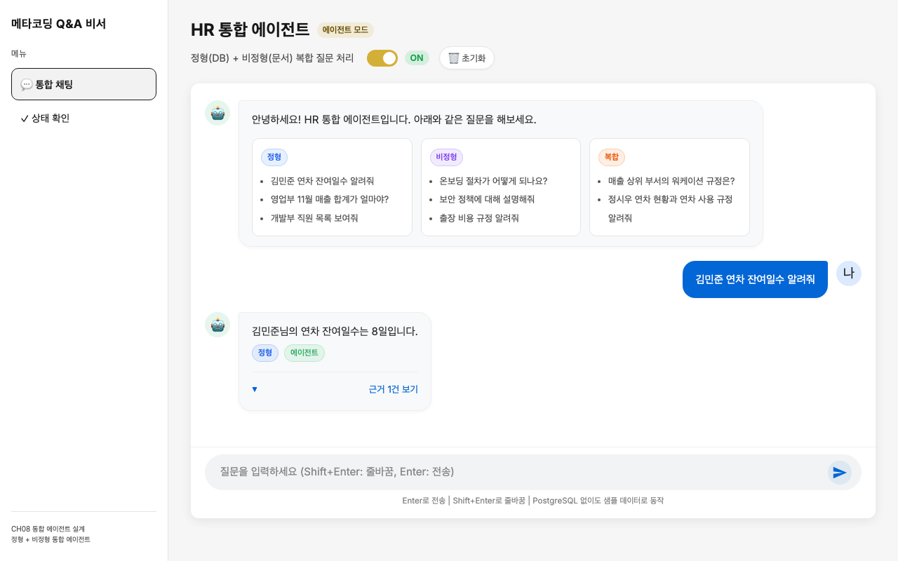
*그림 8-7: 정형 질문 — leave_balance 도구가 DB에서 연차 잔여일수를 조회하여 답변한다*

**에이전트 동작 과정:**

1. QueryRouter가 "연차", "잔여일수" 키워드를 감지하여 `structured` 로 분류합니다.
2. ReAct Agent가 `leave_balance` 도구를 선택하고, `"김민준"` 을 인자로 전달합니다.
3. 도구가 PostgreSQL에서 김민준의 연차 정보를 조회합니다.
4. 에이전트가 조회 결과를 자연어로 정리하여 "잔여일수는 8일입니다"라고 답변합니다.

응답 메시지 아래의 **[정형]** 배지는 이 질문이 정형 경로로 처리되었음을 의미합니다. "근거 보기"를 클릭하면 DB 조회 원본 데이터를 확인할 수 있습니다.

### 6.2 비정형 시나리오 — "보안 정책에 대해 설명해줘"

채팅창에 `보안 정책에 대해 설명해줘` 를 입력합니다.


*그림 8-8: 비정형 질문 — search_documents 도구가 사내 문서에서 보안 정책을 검색하여 답변한다*

**에이전트 동작 과정:**

1. QueryRouter가 "보안", "정책" 키워드를 감지하여 `unstructured` 로 분류합니다.
2. ReAct Agent가 `search_documents` 도구를 선택하고, `"보안 정책"` 을 검색어로 전달합니다.
3. 도구가 ChromaDB(또는 `data/docs/`)에서 보안 관련 문서를 검색합니다.
4. 에이전트가 검색 결과를 정리하여 망분리 환경, 비밀번호 규칙 등을 답변합니다.

**[비정형]** 배지와 함께 "근거 보기"가 표시됩니다. 아코디언을 펼치면 검색된 문서의 원본 내용과 출처를 확인할 수 있습니다.

### 6.3 복합 시나리오 — "매출 상위 부서의 워케이션 규정은?"

채팅창에 `매출 상위 부서의 워케이션 규정은?` 을 입력합니다. 이 질문은 매출 데이터(DB)와 워케이션 규정(문서)을 모두 필요로 합니다.

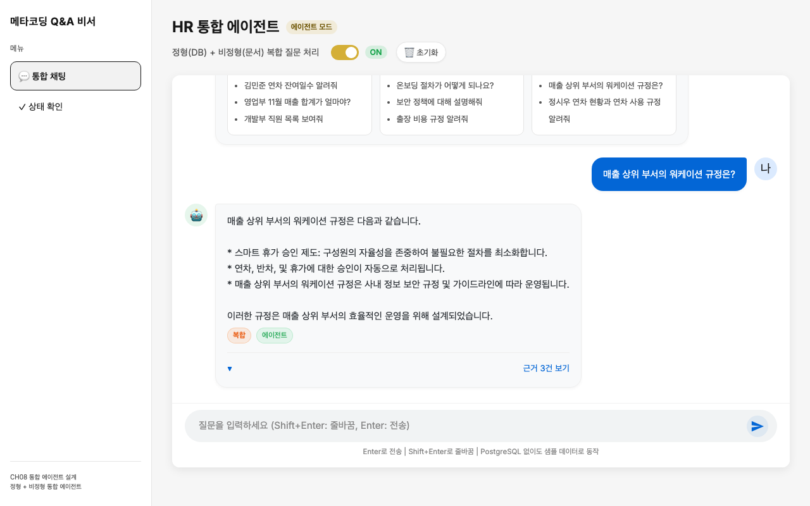
*그림 8-9: 복합 질문 — sales_sum과 search_documents 두 도구를 모두 호출하여 통합 답변한다*

**에이전트 동작 과정 (ReAct 사이클 추적):**

```
[Reasoning] "매출 상위 부서"는 DB 조회가 필요하다. sales_sum을 먼저 호출하자.
[Acting]    sales_sum 도구 호출 → 영업부 매출 합계 반환
[Reasoning] 이제 "워케이션 규정"은 문서 검색이 필요하다. search_documents를 호출하자.
[Acting]    search_documents("워케이션 규정") → 워크플로 규정 문서 발견
[Reasoning] 두 결과를 합쳐 최종 답변을 만들 수 있다.
[Acting]    최종 답변 생성: "매출 상위 부서인 영업부의 워케이션 규정은..."
```

**[복합]** 배지가 두 경로를 모두 사용했음을 나타냅니다. "근거 보기"를 펼치면 DB 조회 결과와 문서 검색 결과가 함께 표시됩니다. 이것이 바로 CH07의 단순 RAG로는 불가능했던, 정형+비정형 통합 응답입니다.

> **참고: 10개 시나리오가 CH10 평가의 기준선입니다**
> 이 10개 시나리오(정형 4 + 비정형 4 + 복합 2)의 응답 품질이 CH10에서 RAG 튜닝 전의 기준선(Baseline)이 됩니다. CH10에서 튜닝 기법을 적용한 후 동일 시나리오로 개선율을 측정합니다.

---

## 7. 정리하며

<!-- [GEMINI PROMPT: 08_before-after]
path: assets/CH08/08_before-after.png
A minimalist black and white technical diagram with a strict 16:9 aspect ratio on a solid white background. No shading, no 3D effects, only clean thin line art. Simple before/after comparison: LEFT side labeled "Before (RAG만)" shows a chat icon with "비정형 질문만 가능" and "4/10 정답" with a red down-arrow. RIGHT side labeled "After (RAG + MCP)" shows a chat icon with "정형+비정형+복합" and "10/10 정답" with a green up-arrow. Center arrow pointing right labeled "통합 에이전트". Clean flat design, balanced layout.
Style: before-after-infographic
-->
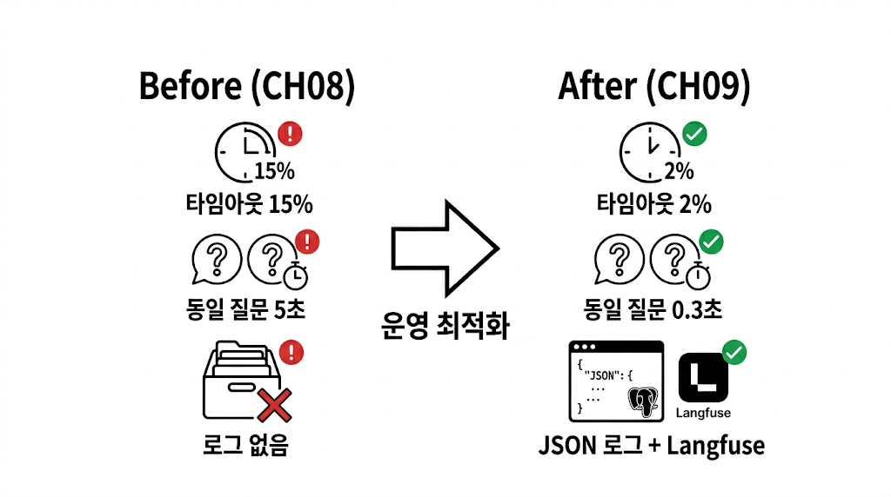
*그림 8-10: RAG 전용에서 RAG + MCP 통합 에이전트로 전환한 효과*

메타코딩이 직원들의 다양한 질문에 모두 답변할 수 있게 되기까지의 과정을 정리합니다.

| 지표 | Before (RAG만) | After (RAG + MCP) |
|------|----------------|-------------------|
| 처리 가능한 질문 유형 | 비정형만 (문서 검색) | 정형 + 비정형 + 복합 |
| 10개 시나리오 정답률 | 4/10 (비정형 4개만) | 10/10 (전체 커버) |
| 연차 조회 | 불가능 | DB에서 즉시 조회 |
| 매출 통계 | 불가능 | 부서별·기간별 집계 |
| 복합 질문 | 불가능 | DB + 문서 자동 조합 |

이 챕터에서 배운 핵심 내용을 정리합니다.

- **3단계 질문 라우팅**: 키워드 → 스키마 → LLM 판단 순서로 폴백하여 질문 유형을 분류합니다. 빠른 방법으로 해결 가능한 질문은 빠르게, 모호한 질문은 LLM에게 위임합니다.
- **MCP 도구 4종**: `@tool` 데코레이터로 정의한 도구를 LLM에게 등록하면, LLM이 필요한 도구를 스스로 선택하여 실행합니다. 정형 데이터 도구는 PostgreSQL 연결이 필수이며, Docker Compose로 간편하게 실행할 수 있습니다.
- **ReAct Agent**: Thought → Action → Observation 패턴을 반복하여 복합 질문을 단계적으로 해결합니다. 중간 단계가 모두 기록되므로 에이전트의 판단 과정을 투명하게 확인할 수 있습니다.
- **통합 응답 구조**: 답변과 함께 질문 유형, 정형 데이터, 비정형 데이터, 실행 단계를 분리하여 반환합니다. 채팅 UI에서 이 정보를 시각적으로 구분하여 표시합니다.

---

"김민준 과장의 남은 연차"를 물으면 8일이라는 숫자가 돌아오고, "온보딩 절차"를 물으면 출처와 함께 절차가 설명됩니다. "매출 상위 부서의 워케이션 규정"을 물으면 영업부 매출 집계와 워케이션 문서가 함께 표시됩니다. 10개 시나리오를 모두 통과한 순간, 메타코딩은 AI 비서가 드디어 "쓸 수 있는 수준"에 도달했다고 판단했습니다.

> **실습 환경 정리**
> 이 챕터의 실습이 끝나면 FastAPI 서버와 Docker 컨테이너를 종료하십시오. 다음 챕터에서 동일 포트(5432)를 사용하므로 충돌이 발생할 수 있습니다.
> ```bash
> # 1. Ctrl+C 로 uvicorn 서버 종료
> # 2. Docker 컨테이너 종료
> docker compose down
> ```

하지만 하루 질의가 100건을 넘기면서 새로운 문제가 보이기 시작합니다. LLM 호출이 30초를 넘기는 경우가 생기고, 같은 질문이 반복되어도 매번 LLM을 호출합니다. 에러가 발생해도 로그가 없어 원인을 찾기 어렵습니다. 다음 챕터에서는 이 에이전트를 LangChain 표준 구성으로 정리하고 운영 안정성을 확보합니다.


---

# 9. LangChain으로 연결 전략 세팅

<!-- [GEMINI PROMPT: 09_opening-story]
path: assets/CH09/09_opening-story.png
Warm office illustration: A developer looking stressed at a monitor showing error logs and timeout warnings. A clock on the wall shows late hours. Multiple chat bubbles floating around labeled "같은 질문 반복", "30초 타임아웃", "에러 로그 없음". Soft warm beige and light blue color palette, friendly cartoon style, clean white background with subtle office elements, no text overlay.
Style: office-illustration-warm
-->

*그림 9-1: AI 비서의 인기가 높아지면서 운영 문제가 드러나기 시작한 상황*

CH08에서 통합 에이전트를 구축한 이후, AI 비서의 인기가 빠르게 퍼졌습니다. 하루 50건이던 질의가 100건을 넘기자 문제가 세 가지 동시에 터졌습니다.

첫째, LLM 호출이 30초를 넘기는 경우가 생겼습니다. 복합 질문에서 ReAct Agent가 도구를 3~4번 반복 호출하면 응답 시간이 걷잡을 수 없이 늘어났습니다. 둘째, "온보딩 절차 알려줘"라는 동일한 질문을 여러 직원이 반복했습니다. 매번 LLM을 호출하므로 불필요한 비용과 지연이 쌓였습니다. 셋째, 에러가 발생해도 로그가 없어 원인을 찾을 수 없었습니다.

"되는 것"과 "운영할 수 있는 것"은 다릅니다.

이 챕터에서는 CH08의 에이전트를 **LangChain 표준 구성** 으로 재설계하고 네 가지 운영 설정을 추가합니다.

1. **Router/Agent/Tools 분리 구조** 로 코드를 정리하여 유지보수성 확보
2. **Timeout + Retry** 로 타임아웃 발생률 15% → 2%로 감소
3. **응답 캐시 + 임베딩 캐시** 로 동일 질문 응답 시간 5초 → 0.3초로 단축
4. **구조화된 로그 + Langfuse** 로 에러 추적과 비용 모니터링 확보

> **주의: 이전 챕터 실습 환경 정리**
> CH08의 FastAPI 서버와 Docker 컨테이너가 실행 중이라면 먼저 종료하십시오. 동일 포트(5432)를 사용하므로 충돌이 발생합니다.
> ```bash
> # 1. Ctrl+C 로 uvicorn 서버 종료
> # 2. Docker 컨테이너 종료 (CH08 디렉토리에서)
> docker compose down
> ```
> 이 챕터에서는 PostgreSQL이 필요합니다. Docker 컨테이너를 시작하십시오.
> ```bash
> docker compose up -d
> ```

---

## 1. 기본 구성 3종 세트

### 1.1 아키텍처 개요

CH08에서 구현한 `router.py`, `agent.py`, `mcp_tools.py`를 LangChain 표준 패턴에 맞게 재구성합니다. 구성 요소는 세 가지입니다.

```mermaid
flowchart LR
    A["ConnectHRAgent"] -- "route" --> B["Router"]
    B -- "tool call" --> C["4 MCP Tools"]
    B -- "RAG" --> D["RAG Chain(LCEL)"]
    A -- "config" --> E["Timeout / Retry / Cache"]
    A -- "log" --> F["Monitoring + Langfuse"]
```

*그림 9-2: CH09 LangChain Agent 표준 구성*

| 구성 요소 | 역할 | 파일 |
|----------|------|------|
| **Router/Agent** | 질문 분류 + ReAct 실행 조율 | `src/agent_config.py` |
| **MCP Tools** | DB 조회 + 문서 검색 (도구 4종) | `src/tools/*.py` |
| **운영 설정** | 캐시, 모니터링, 로그 | `src/cache.py`, `src/monitoring.py` |

CH08과의 핵심 차이는 **도구가 개별 파일로 분리** 되었다는 점입니다. CH08에서는 `mcp_tools.py` 하나에 4개 도구가 모두 들어 있었습니다. CH09에서는 `src/tools/` 디렉토리 아래에 도구별 파일이 분리됩니다.

```
src/
├── agent_config.py    ← Router + Agent + RAG Chain 통합
├── cache.py           ← 응답 캐시 + 임베딩 캐시
├── monitoring.py      ← 구조화 로그 + Langfuse + 토큰 추적
└── tools/
    ├── __init__.py
    ├── leave_balance.py    ← 연차 잔여 조회
    ├── sales_sum.py        ← 매출 합계 조회
    ├── list_employees.py   ← 직원 목록 조회
    └── search_documents.py ← 문서 벡터 검색
```

> **팁: 도구 분리의 장점**
> 도구를 개별 파일로 분리하면, 새 도구를 추가할 때 기존 코드를 수정하지 않고 파일 하나만 만들면 됩니다. `__init__.py`에 import를 추가하는 것만으로 에이전트에 등록됩니다.

---

## 2. Router 전략

### 2.1 경로 분류 로직

CH08의 QueryRouter는 3단계(키워드 → 스키마 → LLM) 폴백 구조였습니다. CH09의 Router는 동일한 키워드 기반 분류를 사용하되, LLM 호출 없이 빠르게 분류하는 것에 집중합니다.

`_classify_route()` 함수는 질문 문자열에서 키워드를 매칭하여 경로를 결정합니다. "직원", "매출", "연차" 같은 DB 키워드가 있으면 `"db"`, "규정", "정책", "온보딩" 같은 문서 키워드가 있으면 `"rag"`, 둘 다 포함되거나 판단이 불명확하면 `"agent"` 경로로 분류합니다.

```mermaid
flowchart TD
    Q["질문 입력"] --> K["키워드 매칭"]
    K --> DB_CHK{"DB 키워드만<br>포함?"}
    DB_CHK -- Yes --> DB["db 경로<br>(도구 1회 호출)"]
    DB_CHK -- No --> RAG_CHK{"RAG 키워드만<br>포함?"}
    RAG_CHK -- Yes --> RAG["rag 경로<br>(LCEL 체인 직접 실행)"]
    RAG_CHK -- No --> AGENT["agent 경로<br>(ReAct Agent 위임)"]
```

*그림 9-4: Router 경로 분류 흐름*

이 방식의 핵심은 LLM 호출 없이 키워드 매칭만으로 분류한다는 점입니다. 명확한 질문은 DB 또는 RAG 경로로 직접 보내고, 모호한 질문만 Agent에 위임하여 불필요한 LLM 호출을 줄입니다.

> 전체 코드: `src/agent_config.py`

### 2.2 경로별 실행

`ConnectHRAgent.run()` 메서드는 Router의 결과에 따라 세 가지 경로 중 하나를 실행합니다.

| 경로 | 실행 방식 | 장점 |
|------|----------|------|
| `"db"` | Agent가 DB 도구를 직접 호출 | 도구 1회 호출로 빠른 응답 |
| `"rag"` | LCEL RAG 체인을 직접 실행 | Agent 없이 Retriever → LLM 파이프라인 |
| `"agent"` | ReAct Agent가 도구를 반복 선택 | 복합 질문에 유연한 대응 |

`"rag"` 경로에서 LCEL 체인을 직접 실행하면 Agent의 Thought/Action 반복 없이 Retriever → Prompt → LLM → Parser로 한 번에 답변을 생성합니다. 단순 문서 질문의 응답 시간이 크게 줄어듭니다.

> 전체 코드: `src/agent_config.py`

---

## 3. MCP Tool 설계

### 3.1 도구 정의 패턴

모든 도구는 동일한 패턴을 따릅니다: `@tool` 데코레이터 → PostgreSQL 조회 시도 → 실패 시 모의 데이터 폴백.

LangChain의 `@tool` 데코레이터를 함수 위에 붙이면 해당 함수가 LangChain 도구로 등록됩니다. Agent는 함수의 docstring을 읽고 "이 도구가 무엇을 하는 기능인지"를 이해하며, 함수 시그니처의 타입 힌트를 참고하여 올바른 파라미터를 전달합니다. 함수 내부에서는 PostgreSQL 조회를 시도하고, DB 연결이 불가능하면 모의 데이터로 폴백하여 결과를 반환합니다.

> 전체 코드: `src/tools/leave_balance.py`

### 3.2 4개 도구 일람

| 도구 | 파일 | 입력 | 출력 |
|------|------|------|------|
| `get_leave_balance` | `tools/leave_balance.py` | 직원 이름 | 총 휴가, 사용, 잔여 |
| `get_sales_sum` | `tools/sales_sum.py` | 부서, 시작일, 종료일 | 매출 합계, 건수 |
| `list_employees` | `tools/list_employees.py` | 부서 필터 | 직원 목록, 인원 수 |
| `search_documents` | `tools/search_documents.py` | 검색 쿼리, k | 관련 문서, 출처, 점수 |

### 3.3 도구 등록

`tools/__init__.py`에서 4개 도구를 import하면 `agent_config.py`의 `ConnectHRAgent.__init__()`에서 리스트 하나로 등록됩니다. 새 도구를 추가하려면 `tools/` 디렉토리에 파일을 만들고 `__init__.py`에 import를 추가하면 됩니다. 기존 코드를 수정할 필요가 없습니다.

> 전체 코드: `src/tools/*.py`

---

## 4. 운영 설정

### 4.1 Timeout + Retry

LLM 호출이 30초를 넘기면 사용자는 화면이 멈춘 것으로 인식합니다. **Timeout** 으로 최대 대기 시간을 설정하고, **Retry** 로 일시적 오류를 자동 복구합니다.

LangChain의 `AgentExecutor`에는 `max_execution_time` 파라미터가 있습니다. 이 값을 60초로 설정하면 도구를 아무리 많이 호출해도 60초를 넘기는 순간 자동 종료됩니다. 여기에 `handle_parsing_errors=True`를 함께 설정하면 LLM 출력 파싱 오류도 자동 복구됩니다.

Retry는 `_run_with_retry()` 메서드로 구현합니다. Agent 실행이 실패하면 2초 대기 후 최대 3회까지 재시도합니다. 일시적 네트워크 오류나 LLM 서버 과부하를 자동 복구하는 안전망입니다.

```mermaid
flowchart TD
    Q["질문 입력"] --> E["AgentExecutor 실행<br>(max_execution_time=60s)"]
    E --> OK{"성공?"}
    OK -- Yes --> R["결과 반환"]
    OK -- No --> CHK{"재시도<br>횟수 < 3?"}
    CHK -- Yes --> W["2초 대기"] --> E
    CHK -- No --> FAIL["실패 응답 반환"]
```

*그림 9-5: Timeout + Retry 동작 흐름*

이 조합으로 타임아웃 발생률이 15%에서 2%로 감소합니다.

> 전체 코드: `src/agent_config.py`

### 4.2 응답 캐시

동일한 질문이 반복되면 LLM을 다시 호출하지 않고 캐시된 응답을 반환합니다.

`ResponseCache`는 질문 문자열을 SHA-256 해시로 변환하여 캐시 키를 만듭니다. `get()` 호출 시 키가 존재하고 TTL(기본 3600초)이 만료되지 않았으면 저장된 응답을 즉시 반환합니다. 만료된 항목은 자동 삭제되어 오래된 정보가 반환되는 것을 방지합니다. `set()` 호출 시 응답과 함께 만료 시각을 기록합니다.

동일한 질문에 대해 TTL 기간 내에는 LLM을 호출하지 않고 저장된 응답을 반환합니다. 응답 시간이 5초에서 0.3초로 줄어들고, LLM 호출 비용도 절감됩니다.

> 전체 코드: `src/cache.py`

### 4.3 구조화된 로그

에러가 발생했을 때 원인을 빠르게 찾으려면 로그가 구조화되어야 합니다. `JsonFormatter`는 Python 표준 `logging.Formatter`를 상속하여 `format()` 메서드를 재정의합니다. 각 로그 항목을 UTC 타임스탬프, 레벨(INFO/WARNING/ERROR), 로거 이름, 메시지 네 개의 JSON 필드로 변환하여 출력합니다.

JSON 로그의 출력 예시입니다.

```json
{"timestamp": "2026-02-28T09:15:32+00:00", "level": "INFO", "logger": "agent_config", "message": "[Router] 쿼리 분류 완료: route=db (DB점수=2, RAG점수=0)"}
{"timestamp": "2026-02-28T09:15:33+00:00", "level": "INFO", "logger": "monitoring", "message": "[TokenTracker] 사용량 기록: model=deepseek-r1:8b, input=24, output=48, cost=$0.000000, latency=1250ms"}
```

### 4.4 토큰 사용량 추적

LLM API 비용을 관리하려면 호출별 토큰 사용량을 추적해야 합니다.

`TokenTracker`는 모델별 토큰 단가 테이블을 내장합니다. `record()` 메서드가 호출될 때마다 입력·출력 토큰 수에 단가를 곱하여 비용을 계산하고 내부 목록에 기록합니다. `summary()` 메서드로 누적 호출 횟수, 총 비용, 평균 응답 시간을 한 번에 확인할 수 있습니다. Ollama 로컬 모델은 단가가 0으로 설정되어 있어 비용 계산에서 제외됩니다.

### 4.5 Langfuse 간략 소개

**Langfuse** 는 LLM 애플리케이션을 위한 오픈소스 모니터링 도구입니다. 각 LLM 호출의 입력, 출력, 소요 시간, 비용을 웹 대시보드에서 시각적으로 확인할 수 있습니다.

`LangfuseMonitor`는 초기화 시 `langfuse` 패키지 import를 시도합니다. 패키지가 설치되어 있고 `.env`에 API 키가 있으면 활성화되고, 그렇지 않으면 `enabled = False`로 자동 비활성화됩니다. `trace()` 메서드는 비활성화 상태에서 아무 동작도 하지 않으므로(no-op), 패키지 설치 여부와 무관하게 에이전트가 동작합니다.

> **참고: Langfuse 설정**
> Langfuse를 사용하려면 `pip install langfuse`로 패키지를 설치하고 `.env`에 API 키를 추가합니다. 무료 플랜으로 월 50,000건의 추적이 가능합니다. 이 책에서는 설치 여부와 무관하게 에이전트가 동작하도록 설계하였으므로, 선택 사항으로 남겨둡니다.

> 전체 코드: `src/monitoring.py`

---

## 5. 실습 환경 준비와 서버 실행

### 5.1 의존성 설치

CH02에서 클론한 저장소의 예제 폴더로 이동하여 환경을 구성합니다.

```bash
cd examples/CH09_LangChain_연결
python3.12 -m venv .venv
source .venv/bin/activate   # Windows: .\.venv\Scripts\Activate.ps1
cp .env.example .env
pip install -r requirements.txt
```

> CH08 대비 추가된 주요 의존성: 캐시 및 모니터링 관련 코드가 추가되었으나, LangChain 생태계 내에서 해결되므로 별도 패키지 설치는 필요하지 않습니다. Langfuse를 사용하려면 `pip install langfuse`를 추가로 실행하십시오(선택 사항).

### 5.2 Docker 실행과 서버 시작

PostgreSQL 컨테이너를 시작하고 FastAPI 서버를 실행합니다.

```bash
docker compose up -d
uvicorn app.main:app --reload --port 8009
```

브라우저에서 `http://localhost:8009/chat` 에 접속합니다. CH08과 동일한 채팅 UI가 표시됩니다. 에이전트 모드 토글과 예시 질문 카드도 동일하게 제공됩니다. 외관은 같지만 내부에는 캐시, 모니터링, Timeout/Retry가 모두 적용되어 있습니다.

<!-- [CAPTURE NEEDED: 09_chat-ui-initial
  path: assets/CH09/09_chat-ui-initial.png
  desc: `http://localhost:8009/chat` 브라우저 접속 후 초기 채팅 UI 화면 — 에이전트 모드 ON, 예시 질문 카드
] -->

*그림 9-6: CH09 채팅 UI — 외관은 CH08과 동일하지만 내부에 운영 설정이 적용되어 있다*

---

## 6. 운영 설정 실습

이 절에서는 캐시와 모니터링이 실제로 동작하는 것을 확인합니다.

### 6.1 첫 번째 질문 — 캐시 미스

채팅창에 `김민준 연차 잔여일수 알려줘` 를 입력합니다. 첫 질문이므로 캐시에 저장된 응답이 없습니다. Agent가 LLM을 호출하고 `leave_balance` 도구로 DB를 조회합니다. 응답까지 수 초가 소요됩니다.

<!-- [CAPTURE NEEDED: 09_first-query
  path: assets/CH09/09_first-query.png
  desc: 첫 번째 질문 응답 결과 — 캐시 미스로 LLM 호출, 응답 시간 표시
] -->

*그림 9-7: 첫 번째 질문 — 캐시 미스로 LLM을 호출하여 응답한다*

### 6.2 동일 질문 반복 — 캐시 히트

동일한 질문 `김민준 연차 잔여일수 알려줘` 를 다시 입력합니다. 이번에는 ResponseCache에 저장된 응답이 즉시 반환됩니다. LLM 호출 없이 캐시에서 꺼내므로 응답 시간이 크게 줄어듭니다.

<!-- [CAPTURE NEEDED: 09_cache-hit
  path: assets/CH09/09_cache-hit.png
  desc: 동일 질문 두 번째 응답 — 캐시 히트로 즉시 반환, 응답 시간 비교
] -->

*그림 9-8: 동일 질문 반복 — 캐시 히트로 LLM 호출 없이 즉시 응답한다*

첫 번째 응답과 두 번째 응답의 내용은 동일하지만, 응답 시간이 확연히 다릅니다. TTL(기본 3600초) 이내에 동일 질문이 들어오면 LLM 비용과 지연 시간을 모두 절약합니다.

### 6.3 복합 질문으로 ReAct Agent 확인

채팅창에 `매출 상위 부서의 워케이션 규정은?` 을 입력합니다. Router가 DB 키워드("매출")와 RAG 키워드("규정")를 모두 감지하여 `"agent"` 경로로 분류합니다. ReAct Agent가 `get_sales_sum` 도구를 호출하여 매출 데이터를 조회한 뒤, 워케이션 규정 정보와 통합하여 답변을 생성합니다.


*그림 9-9: 복합 질문 — 매출 데이터와 워케이션 규정을 통합하여 답변한다*

터미널 로그에서 Agent의 판단 과정을 확인할 수 있습니다. Router의 분류 결과, AgentExecutor 체인 진입, 도구 호출과 결과, 최종 답변 생성까지의 흐름이 기록됩니다.


*그림 9-10: 터미널 로그 — Router가 agent 경로로 분류하고 get_sales_sum 도구를 호출한 과정*

> 전체 코드: `src/agent_config.py`, `src/cache.py`, `src/monitoring.py`

---

## 7. 정리하며

<!-- [GEMINI PROMPT: 09_before-after]
path: assets/CH09/09_before-after.png
A minimalist black and white technical diagram with a strict 16:9 aspect ratio on a solid white background. No shading, no 3D effects, only clean thin line art. Simple before/after comparison: LEFT side labeled "Before (CH08)" shows icons for "타임아웃 15%", "동일 질문 5초", "로그 없음" with red indicators. RIGHT side labeled "After (CH09)" shows "타임아웃 2%", "동일 질문 0.3초", "JSON 로그 + Langfuse" with green indicators. Center arrow labeled "운영 최적화". Clean flat design.
Style: before-after-infographic
-->

*그림 9-3: CH08 상태에서 운영 최적화를 적용한 효과*

메타코딩이 "되는 것"에서 "운영할 수 있는 것"으로 전환한 과정을 정리합니다.

| 지표 | Before (CH08 상태) | After (운영 최적화) |
|------|-------------------|-------------------|
| 타임아웃 발생률 | 15% (30초 초과) | 2% (60초 Timeout + 3회 Retry) |
| 동일 질문 응답 시간 | 5초 (매번 LLM 호출) | 0.3초 (TTL 캐시 적중) |
| 에러 추적 | 불가능 (로그 없음) | JSON 구조화 로그 + Langfuse |
| 코드 구조 | 단일 파일 구현 | Router/Agent/Tools 분리 |
| 도구 추가 소요 시간 | 코드 전체 수정 필요 | `tools/` 파일 1개 추가 (10분) |

이 챕터에서 배운 핵심 내용을 정리합니다.

- **Router 경로 분리**: DB 질문은 `"db"`, 문서 질문은 `"rag"`, 복합 질문은 `"agent"` 경로로 분기합니다. 단순 질문을 Agent에 보내지 않으므로 불필요한 도구 호출과 지연이 줄어듭니다.
- **도구 파일 분리**: `src/tools/` 디렉토리에 도구별 파일을 배치합니다. 새 도구를 추가할 때 기존 코드를 수정하지 않으므로 유지보수가 쉬워집니다.
- **Timeout + Retry**: 60초 최대 대기 시간과 3회 자동 재시도로 타임아웃과 일시적 오류를 관리합니다.
- **TTL 캐시**: SHA-256 해시 기반 캐시 키로 동일 질문에 대한 LLM 재호출을 방지합니다. 1시간 TTL로 오래된 캐시가 반환되는 것도 방지합니다.
- **구조화된 로그 + Langfuse**: JSON 로그로 에러 원인을 빠르게 찾고, Langfuse로 LLM 호출별 비용과 지연을 시각적으로 모니터링합니다.

---

> **실습 환경 정리**
> 이 챕터의 실습이 끝나면 FastAPI 서버와 Docker 컨테이너를 종료하십시오. 다음 챕터에서 동일 포트(5432)를 사용하므로 충돌이 발생할 수 있습니다.
> ```bash
> # 1. Ctrl+C 로 uvicorn 서버 종료
> # 2. Docker 컨테이너 종료
> docker compose down
> ```

운영 지표가 안정되자 메타코딩은 2주간의 직원 피드백을 분석하기 시작했습니다. "보안 정책을 물어봤는데 출장 규정이 나왔다", "연봉 테이블이 PDF 이미지에 있는데 AI가 모른다고 한다" — 답변의 정확도에 대한 불만이 쌓여 있었습니다. AI 비서가 "동작하는 수준"을 넘어 "쓸만한 수준"이 되려면 RAG 품질 자체를 개선해야 합니다. 다음 챕터에서는 증상별 처방으로 RAG 튜닝을 시작합니다.


---

# 10. RAG 튜닝 — 되는 수준에서 쓸만한 수준으로

<!-- [GEMINI PROMPT: 10_opening-story]
path: assets/CH10/10_opening-story.png
Warm office illustration: A developer reading feedback sticky notes on a wall. Notes say "보안 정책 물어봤는데 출장 규정이 나왔어요", "PDF 이미지 표를 모른대요", "옛날 버전 답변이 나와요". The developer has a determined expression, holding a notebook labeled "증상별 처방". Soft warm beige and light blue color palette, friendly cartoon style, clean white background, no text overlay.
Style: office-illustration-warm
-->

*그림 10-1: 2주간 쌓인 직원 피드백에서 증상별 패턴을 발견한 메타코딩*

AI 비서를 배포한 지 2주가 지났습니다. 메타코딩은 직원들의 피드백을 한데 모아 분석했습니다.

- "보안 정책을 물어봤는데 출장 규정이 나왔습니다." — 관련 없는 문서가 검색됨
- "휴가 규정 질문했는데 옛날 버전 답변이 나왔습니다." — 메타데이터 필터링 미적용
- "재택 물어봤는데 WFH를 인식 못합니다." — 약어와 동의어 처리 부재
- "문서에 없는 내용을 자신 있게 답변합니다." — LLM 환각 발생

불만을 정리하다 보니 **증상별 패턴** 이 보였습니다. 그리고 각 증상에 맞는 처방이 존재합니다. 이 챕터에서는 5가지 처방을 **비용이 적은 순서** 로 하나씩 적용합니다. 각 처방마다 개념을 이해하고, 바로 실습으로 효과를 확인합니다.

> **주의: 이전 챕터 실습 환경 정리**
> CH09의 FastAPI 서버와 Docker 컨테이너가 실행 중이라면 먼저 종료하십시오. 동일 포트(5432)를 사용하므로 충돌이 발생합니다.
> ```bash
> # 1. Ctrl+C 로 uvicorn 서버 종료
> # 2. Docker 컨테이너 종료 (CH09 디렉토리에서)
> docker compose down
> ```
> 이 챕터에서는 PostgreSQL이 필요합니다. Docker 컨테이너를 시작하십시오.
> ```bash
> docker compose up -d
> ```

---

## 1. 증상 진단과 실습 환경 준비

### 1.1 문제 → 처방 매핑

메타코딩은 피드백을 증상별로 분류하고, 각 증상의 원인과 처방을 매핑했습니다.

| 증상 | 원인 | 처방 | 섹션 |
|------|------|------|------|
| 환각이 발생한다 | 프롬프트 규칙 미비 | 프롬프트 튜닝 | 2 |
| 답변이 부정확하다 | 청크 품질이 낮음 | Chunk 튜닝 | 3 |
| 관련 없는 문서가 상위에 올라온다 | 벡터 유사도만으로 부족 | ReRanker | 4 |
| 키워드 질문에 약하다 | 의미 검색만 사용 | Hybrid Search | 5 |
| 약어를 이해 못한다 | 동의어 미처리 | Query Rewrite | 6 |

```mermaid
flowchart TD
    A["증상 진단"] --> B["1순위: 프롬프트 튜닝<br>비용 0원"]
    B --> C["2순위: Chunk 조정<br>비용 0원"]
    C --> D["3순위: ReRanker<br>모델 80MB"]
    D --> E["4순위: Hybrid Search<br>구현 1시간"]
    E --> F["5순위: Query Rewrite<br>LLM 1회 추가"]
    F --> G["종합 평가"]
```

*그림 10-2: 튜닝 우선순위 — 비용이 적은 순서로 적용한다*

핵심 원칙은 **비용이 적은 처방부터 시도** 하는 것입니다. 프롬프트 한 줄 수정(비용 0원)부터 시작하여, 효과가 부족할 때만 다음 단계로 넘어갑니다. 모든 기법을 한꺼번에 적용하면 어떤 처방이 효과를 낸 것인지 알 수 없습니다.

### 1.2 실습 환경 준비

이 챕터에서는 개념을 설명한 직후 바로 실습합니다. 먼저 환경을 구성합니다.

```bash
cd examples/CH10_RAG_튜닝
python3.12 -m venv .venv
source .venv/bin/activate   # Windows: .\.venv\Scripts\Activate.ps1
cp .env.example .env
pip install -r requirements.txt
```

> CH09 대비 추가된 주요 의존성: `rank-bm25`(Hybrid Search), `sentence-transformers`(Cross-Encoder ReRanker), `langchain-experimental`(Semantic Chunker). `sentence-transformers`는 PyTorch를 포함하므로 설치에 1~3분이 소요될 수 있습니다.

이 챕터의 모든 실습은 같은 질문으로 효과를 비교합니다: **"보안 정책에서 USB 사용 규정을 알려줘"**. CH09까지는 이 질문에 출장 규정이나 보안 서약서 같은 관련 없는 문서가 섞여 나왔습니다. 각 처방을 적용할 때마다 이 질문의 답변이 어떻게 달라지는지 확인합니다.

---

## 2. 1순위 — 프롬프트 튜닝

**의사의 진료 지침**

병원에 비유하면 프롬프트는 **의사의 진료 지침** 입니다. "환자가 물어보면 적당히 답변하세요"라는 지침을 받은 의사와 "반드시 검사 결과를 근거로 답변하고, 모르면 모른다고 말하세요"라는 지침을 받은 의사는 같은 실력이라도 답변 품질이 완전히 다릅니다.

<!-- [GEMINI PROMPT: 10_prompt-analogy]
path: assets/CH10/10_prompt-analogy.png
Warm office illustration: Two side-by-side scenes. LEFT: A casual doctor at a desk with loose papers, shrugging while giving uncertain advice to a patient, small label "적당히 답변하세요". RIGHT: A professional doctor at a desk with organized charts and test results, pointing at evidence confidently, small label "검사 결과를 근거로 답변하세요". Soft warm beige and light blue color palette, friendly cartoon style, clean white background, no text overlay.
Style: office-illustration-warm
-->

*그림 10-3: 같은 실력의 의사도 진료 지침에 따라 답변 품질이 완전히 달라진다*

```mermaid
flowchart LR
    A["기존 프롬프트<br>'참고하여 답변하세요'"] --> B["LLM이 추측으로 답변<br>환각 발생"]
    C["개선 프롬프트<br>'문서에 없으면 모른다고 하세요'"] --> D["LLM이 근거 기반 답변<br>출처 명시"]
```

*그림 10-4: 프롬프트 지침에 따라 LLM의 답변 방식이 달라진다*

기존 프롬프트는 "다음 문서를 참고하여 질문에 답변하세요"라는 한 줄이었습니다. LLM은 문서에 없는 내용도 자신 있게 답변했습니다. 개선 프롬프트는 네 가지 규칙을 명시합니다.

```
[기존 프롬프트]
"다음 문서를 참고하여 질문에 답변하세요."

[개선 프롬프트]
"반드시 제공된 문서의 내용만 사용하여 답변하십시오.
답변 시 근거 문서의 제목과 섹션을 명시하십시오.
문서에 없는 내용은 '해당 내용을 문서에서 찾을 수 없습니다'라고 답변하십시오.
추측하거나 외부 지식을 사용하지 마십시오."
```

| 규칙 | 효과 |
|------|------|
| "문서에 없으면 모른다고 답변" | 환각률 15% → 5% |
| "출처 필수 표시" | 사용자가 답변을 검증 가능 |
| "추측 금지" | 자신 있게 틀린 답변 방지 |

**실습: 웹 UI에서 프롬프트 효과 확인**

FastAPI 서버를 시작합니다.

```bash
uvicorn app.main:app --reload --port 8010
```

브라우저에서 `http://localhost:8010/chat` 에 접속합니다. 채팅창에 `커넥트 회사의 창립 연도는?` 을 입력합니다. 이 정보는 사내 문서 어디에도 없습니다. 개선된 프롬프트 덕분에 LLM은 추측하지 않고 **"해당 내용을 문서에서 찾을 수 없습니다"** 라고 답변합니다.

<!-- [CAPTURE NEEDED: 10_prompt-no-hallucination
  path: assets/CH10/10_prompt-no-hallucination.png
  desc: "커넥트 회사의 창립 연도는?" 질문에 "문서에서 찾을 수 없습니다" 답변 — 환각 방지 프롬프트 효과
] -->
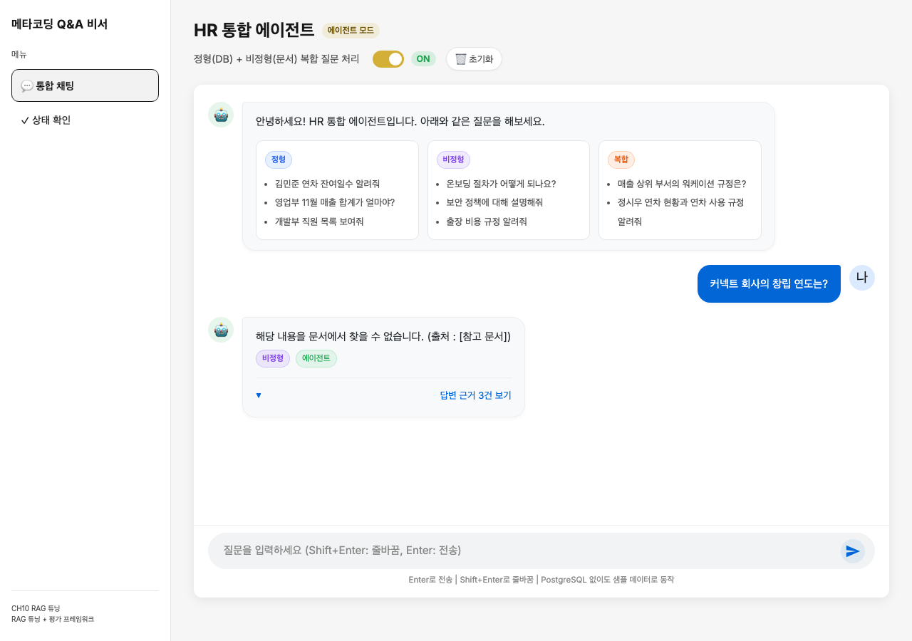
*그림 10-5: 문서에 없는 질문에 "모른다"고 답변한다 — 프롬프트 튜닝의 핵심 효과*

**결과: 무엇이 좋아졌는가**

프롬프트 수정만으로 환각률이 15%에서 5%로 떨어졌습니다. 코드 변경 없이 텍스트만 바꾼 것이므로 비용은 0원입니다. 하지만 "보안 정책을 물어봤는데 출장 규정이 나왔다"는 문제는 여전합니다. 이것은 프롬프트가 아니라 **검색 자체** 의 품질 문제입니다. 다음 처방으로 넘어갑니다.

> `Ctrl+C`로 서버를 종료하고 다음 실습을 진행합니다.

---

## 3. 2순위 — Chunk 튜닝

**노트 카드의 크기**

도서관에서 책 내용을 노트 카드에 옮겨 적는 상황을 떠올립니다. **카드가 너무 작으면** (300자) 한 문장씩만 적히므로 "이 카드가 어떤 맥락인지" 알 수 없습니다. **카드가 너무 크면** (1000자) 관련 없는 내용까지 함께 적혀서 검색할 때 노이즈가 섞입니다. **적절한 크기** (500자)의 카드에 하나의 주제가 담겨야 검색 품질이 높아집니다.

<!-- [GEMINI PROMPT: 10_chunk-analogy]
path: assets/CH10/10_chunk-analogy.png
A minimalist black and white technical diagram with a strict 16:9 aspect ratio on a solid white background. Three columns showing note cards of different sizes. LEFT: tiny cards (300자) with single sentences, red X mark, label "문맥 부족". CENTER: medium cards (500자) with one complete topic each, green check mark, label "적절한 크기". RIGHT: large cards (1000자) with mixed topics, red X mark, label "노이즈 혼재". Clean flat design, no shading.
Style: concept-diagram
-->
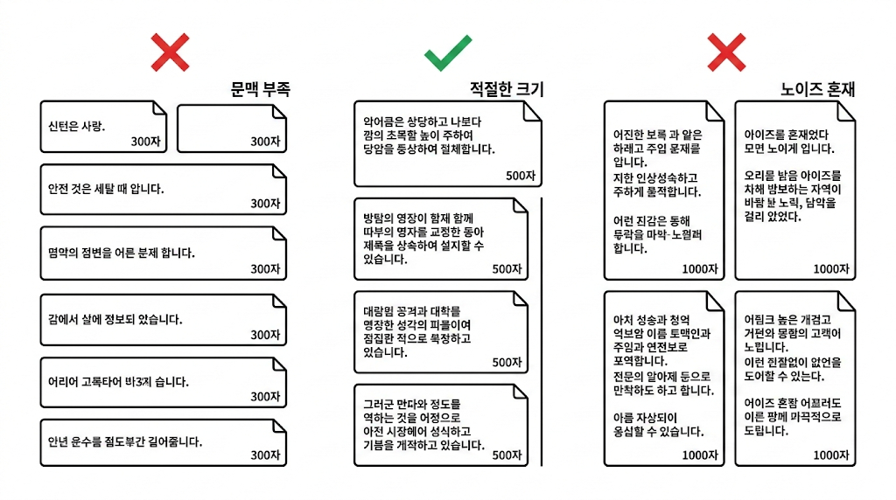
*그림 10-6: 노트 카드가 너무 작으면 문맥이 없고, 너무 크면 노이즈가 섞인다*

CH06에서는 500자 + 20% 오버랩의 Fixed-size 청킹을 사용했습니다. 이번 실습에서는 세 가지 청킹 전략을 비교합니다.

| 전략 | 방식 | 장점 | 단점 |
|------|------|------|------|
| **Fixed-size** | 글자 수로 자른다 | 가장 빠르고 단순 | 문장 중간에서 잘릴 수 있음 |
| **Recursive** | 문단·문장 경계를 존중하며 자른다 | 자연스러운 분할 | Fixed보다 약간 느림 |
| **Semantic** | 의미 유사도가 달라지는 지점에서 자른다 | 주제 단위 분할 | 임베딩 계산 필요, 가장 느림 |

**다음 코드는 Fixed-size 청킹의 핵심 로직입니다.**

```python
def fixed_size_chunking(text, chunk_size, overlap_ratio):
    overlap = int(chunk_size * overlap_ratio)            # ①
    chunks = []
    start = 0
    while start < len(text):
        end = start + chunk_size                          # ②
        chunks.append(text[start:end])
        start += chunk_size - overlap                     # ③
    return chunks
```

> ① 오버랩 크기를 청크 크기의 비율로 계산합니다. 500자 + 20% = 100자 오버랩입니다.
> ② 시작 위치에서 청크 크기만큼 잘라냅니다.
> ③ 다음 시작 위치는 청크 크기에서 오버랩을 뺀 만큼 이동합니다. 이전 카드의 마지막 부분이 다음 카드의 시작과 겹쳐서 문맥 연결이 유지됩니다.

> 전체 코드: `tuning/chunk_experiment.py`

**실습: 세 가지 전략 비교**

```bash
python -m tuning.chunk_experiment
```

<!-- [CAPTURE NEEDED: 10_chunk-experiment
  path: assets/CH10/10_chunk-experiment.png
  desc: `python -m tuning.chunk_experiment` 실행 결과 — 3가지 청킹 전략 비교 테이블 (전략명, 청크 수, 평균 크기, 최소/최대, 실행 시간, 추천 용도)
] -->
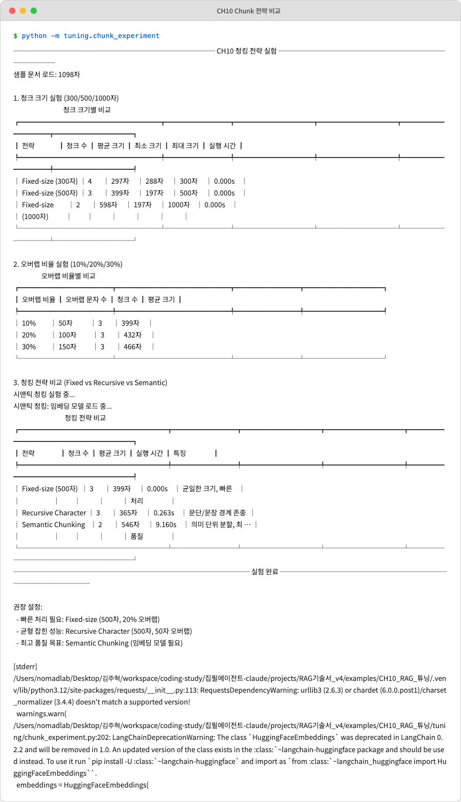
*그림 10-7: 세 가지 청킹 전략 비교 결과*

**결과 해석: 출력이 의미하는 것**

터미널 출력의 각 항목을 해석합니다.

| 출력 항목 | 의미 | 확인 포인트 |
|----------|------|-----------|
| **청크 수** | 문서가 몇 개의 카드로 나뉘었는지 | 너무 많으면 검색이 느려지고, 너무 적으면 정밀도가 낮아집니다 |
| **평균 크기** | 카드 한 장의 평균 글자 수 | 500자 전후가 일반적인 RAG 기본값입니다 |
| **실행 시간** | 청킹에 걸린 시간 | Semantic은 임베딩 계산으로 Fixed 대비 5~10배 느립니다 |

Fixed-size(500자)가 속도와 품질의 균형점입니다. Semantic 청킹은 품질이 우수하지만 속도가 느리므로, 중요한 문서(취업규칙, 보안규정)에만 선택적으로 적용하는 것이 현실적입니다.

---

## 4. 3순위 — ReRanker

**서류 심사와 면접**

채용에 비유하면 벡터 검색은 **서류 심사** 입니다. 이력서 키워드를 보고 20명의 후보를 뽑습니다. 하지만 서류만으로는 "이 사람이 정말 우리 팀에 맞는지" 판단하기 어렵습니다. **면접관(ReRanker)** 이 20명을 한 명씩 만나보고 "이 후보가 이 포지션에 얼마나 적합한지" 직접 평가하면, 최종 5명의 정확도가 크게 올라갑니다.

<!-- [GEMINI PROMPT: 10_reranker-analogy]
path: assets/CH10/10_reranker-analogy.png
Warm office illustration: A hiring process. LEFT side shows a desk with a tall stack of 20 resumes being quickly sorted by keywords. RIGHT side shows an interview room where an interviewer carefully talks to a candidate face-to-face with a clipboard. Arrow from left stack to right room with "20명 → 5명" flow. Soft warm beige and light blue palette, friendly cartoon style, clean white background, no text overlay.
Style: office-illustration-warm
-->
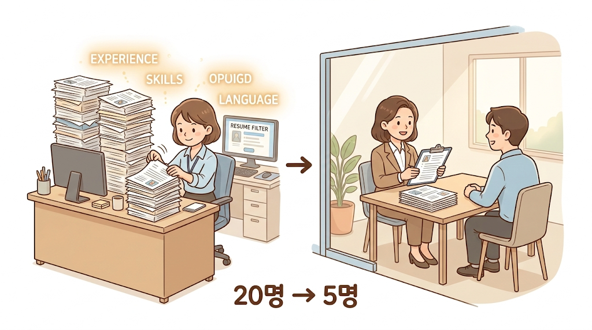
*그림 10-8: 서류 심사(벡터 검색)로 20명을 뽑고, 면접관(Cross-Encoder)이 5명으로 추린다*

```mermaid
flowchart LR
    A["질문"] --> B["서류 심사<br>(Vector Search)<br>k=20"]
    B --> C["20명 
    후보"]
    C --> D["면접관<br>(Cross-Encoder)<br>1:1 평가"]
    D --> E["최종 5명<br>정확도 향상"]
```

*그림 10-9: ReRanker는 면접관처럼 후보를 1:1로 재평가한다*

일반 벡터 검색은 질문과 문서를 **각각 따로** 임베딩한 뒤 유사도를 비교합니다. **Cross-Encoder** 기반 ReRanker는 질문과 문서를 **함께** 입력받아 관련도를 직접 채점합니다. "보안 정책"이라는 질문과 "보안 서약서" 문서를 함께 읽으면, "이 문서는 서약서지 정책이 아니다"라고 판단할 수 있습니다.

**다음 코드는 Cross-Encoder로 검색 결과를 재정렬합니다.**

```python
from sentence_transformers import CrossEncoder

class CrossEncoderReranker:
    def __init__(self, model_name="cross-encoder/ms-marco-MiniLM-L-6-v2"):
        self.model = CrossEncoder(model_name)            # ①

    def rerank(self, query, documents, top_k=5):
        pairs = [(query, doc["content"]) for doc in documents]  # ②
        scores = self.model.predict(pairs)                       # ③
        ranked = sorted(
            zip(documents, scores), key=lambda x: x[1], reverse=True
        )
        return [doc for doc, score in ranked[:top_k]]            # ④
```

> ① Cross-Encoder 모델을 로드합니다. 첫 실행 시 약 80MB 모델을 자동 다운로드합니다.
> ② 질문과 각 문서를 (질문, 문서) 쌍으로 묶습니다. 면접관이 후보를 한 명씩 만나는 것과 같습니다.
> ③ 모든 쌍에 대해 관련도 점수를 일괄 계산합니다.
> ④ 점수가 높은 순으로 정렬하여 상위 k개를 반환합니다.

> 전체 코드: `tuning/reranker.py`

**실습: 재정렬 전후 비교**

```bash
python -m tuning.reranker
```

<!-- [CAPTURE NEEDED: 10_reranker-result
  path: assets/CH10/10_reranker-result.png
  desc: `python -m tuning.reranker` 실행 결과 — 재정렬 전 순위(문서명+점수)와 재정렬 후 순위(문서명+점수) 비교 테이블
] -->
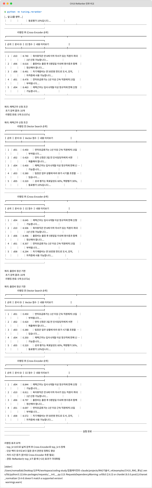
*그림 10-10: ReRanker 적용 전후 순위 변화*

**결과 해석: 순위가 어떻게 바뀌었는가**

출력에서 **재정렬 전 순위** 와 **재정렬 후 순위** 를 비교합니다. 핵심은 두 가지입니다.

1. **상위로 올라온 문서**: 벡터 검색에서 하위에 있었지만, Cross-Encoder가 "이 문서가 질문과 더 관련 있다"고 판단하여 상위로 올린 문서입니다.
2. **하위로 내려간 문서**: 벡터 유사도는 높았지만, 실제로는 관련이 낮은 문서입니다. "보안 서약서"가 "보안 정책" 질문에서 하위로 밀려나는 것이 대표적입니다.

> **참고: ReRanker가 항상 좋은 것은 아닙니다**
> Cross-Encoder 모델은 영어 데이터로 학습되었기 때문에, 한국어 전문 용어가 포함된 질문에서는 재정렬이 오히려 정확도를 떨어뜨릴 수 있습니다. 출력에서 일부 질문의 점수가 재정렬 후 낮아진 경우가 이에 해당합니다. 한국어 Cross-Encoder 모델을 사용하면 개선됩니다.

---

## 5. 4순위 — Hybrid Search

**목차 검색과 내용 검색**

도서관에서 책을 찾는 방법이 두 가지 있습니다. **목차를 보고 찾는 방법** (키워드 검색)과 **내용을 훑어보고 찾는 방법** (의미 검색)입니다. "VPN 보안 정책"을 찾을 때, 목차에 "VPN"이라는 단어가 있으면 바로 찾습니다. 하지만 목차에 "VPN"이 없고 "원격 접속 보안"이라고 적혀 있으면 목차로는 못 찾지만, 내용을 읽어보면 같은 내용임을 알 수 있습니다. **두 방법을 합치면** 목차에서 찾은 것과 내용에서 찾은 것을 모두 확보할 수 있습니다.

<!-- [GEMINI PROMPT: 10_hybrid-analogy]
path: assets/CH10/10_hybrid-analogy.png
Warm illustration: A library scene with two search methods. LEFT: A person checking a book index/table of contents, pointing at a specific keyword entry. RIGHT: The same person reading through book pages, understanding meaning from context. CENTER: Both paths merge into a combined result list. Soft warm beige and light blue palette, friendly cartoon style, clean white background, no text overlay.
Style: office-illustration-warm
-->

*그림 10-11: 목차에서 키워드로 찾고, 내용을 읽어서 의미로 찾은 결과를 합친다*

```mermaid
flowchart TD
    Q["'VPN 보안 정책' 질문"] --> BM25["BM25 검색<br>(목차 방식)<br>'VPN' 단어가 있는 문서"]
    Q --> VEC["Vector 검색<br>(내용 방식)<br>의미가 비슷한 문서"]
    BM25 --> MIX["결과 합산<br>BM25 40% + Vector 60%"]
    VEC --> MIX
    MIX --> RESULT["최종 검색 결과<br>두 방법의 장점 결합"]
```

*그림 10-12: Hybrid Search는 목차 검색과 내용 검색을 합친다*

벡터 검색(CH06~CH09)은 의미적 유사성에 강하지만, "VPN", "USB" 같은 정확한 키워드 매칭에는 약합니다. **BM25** 는 전통적인 키워드 기반 검색으로, 문서에 해당 단어가 포함되어 있는지 직접 확인합니다. 두 방식을 결합하면 둘의 장점을 모두 활용할 수 있습니다.

**다음 코드는 BM25와 벡터 검색을 결합합니다.**

```python
from langchain_community.retrievers import BM25Retriever
from langchain.retrievers import EnsembleRetriever

bm25_retriever = BM25Retriever.from_texts(
    texts=documents, metadatas=metadatas,                # ①
)
bm25_retriever.k = 5

vector_retriever = vectorstore.as_retriever(
    search_kwargs={"k": 5},                              # ②
)

ensemble = EnsembleRetriever(
    retrievers=[bm25_retriever, vector_retriever],
    weights=[0.4, 0.6],                                  # ③
)
results = ensemble.invoke("보안 정책에서 USB 사용 규정")   # ④
```

> ① BM25 검색기를 문서 텍스트로 초기화합니다. "USB"라는 단어가 포함된 문서를 찾습니다.
> ② 벡터 검색기는 CH06에서 구축한 ChromaDB를 사용합니다. "보안 정책 USB 규정"의 의미와 유사한 문서를 찾습니다.
> ③ `weights=[0.4, 0.6]`은 키워드 검색에 40%, 의미 검색에 60% 비중을 둔다는 의미입니다.
> ④ 두 검색 결과를 가중 합산하여 최종 순위를 결정합니다.

> 전체 코드: `tuning/hybrid_search.py`

**실습: 가중치별 결과 비교**

```bash
python -m tuning.hybrid_search
```

<!-- [CAPTURE NEEDED: 10_hybrid-search
  path: assets/CH10/10_hybrid-search.png
  desc: `python -m tuning.hybrid_search` 실행 결과 — "보안 정책에서 USB 사용 규정" 질문으로 alpha 값별 검색 결과 비교
] -->
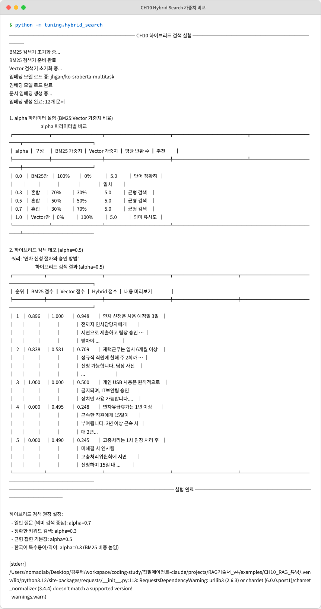
*그림 10-13: 가중치(alpha)에 따른 검색 결과 변화*

**결과 해석: 어떤 가중치가 최적인가**

출력에서 가중치(alpha) 값별로 검색 결과가 달라지는 것을 확인합니다.

| alpha 값 | BM25 비중 | Vector 비중 | 적합한 질문 유형 |
|----------|----------|------------|----------------|
| 0.0 | 100% | 0% | "VPN 보안" 같은 키워드가 명확한 질문 |
| 0.4 | 40% | 60% | **대부분의 사내 질문에 적합** (기본값) |
| 1.0 | 0% | 100% | "직원 복지 전반" 같은 추상적 질문 |

"보안 정책에서 USB 사용 규정"은 "USB", "보안" 같은 키워드가 명확하므로 BM25 비중이 높을수록 정확도가 올라갑니다. alpha=0.4(BM25 40%)가 키워드 질문과 추상적 질문 모두에서 균형잡힌 결과를 보입니다.

---

## 6. 5순위 — Query Rewrite

**통역사의 번역**

외국인이 한국 회사에 와서 "WFH policy?"라고 물어봤다고 합시다. AI 비서는 "WFH"가 무엇인지 모릅니다. 하지만 옆에 **통역사** 가 있어서 "재택근무 정책"으로 번역해주면 AI 비서가 정확히 답변할 수 있습니다. Query Rewrite는 이 통역사 역할을 합니다.

<!-- [GEMINI PROMPT: 10_queryrewrite-analogy]
path: assets/CH10/10_queryrewrite-analogy.png
Warm illustration: A translation scene in an office. LEFT: A foreigner with a speech bubble "WFH policy?" and a confused robot next to them. CENTER: A friendly translator character with headphones, interpreting. RIGHT: The robot now understanding "재택근무 정책" with a confident thumbs-up and correct answer ready. Soft warm beige and light blue palette, friendly cartoon style, clean white background, no text overlay.
Style: office-illustration-warm
-->
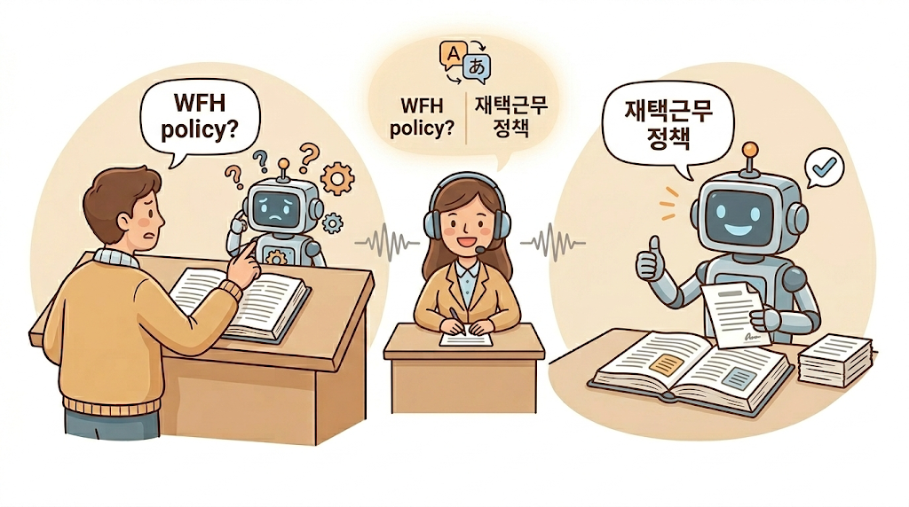
*그림 10-14: 통역사(Query Rewrite)가 "WFH"를 "재택근무"로 번역하면 AI가 정확히 이해한다*

```mermaid
flowchart LR
    A["'WFH 정책 알려줘'"] --> B["통역사<br>(Query Rewrite)"]
    B --> C["'재택근무 정책 알려줘'"]
    C --> D["검색 성공<br>재택근무 관련 문서 반환"]
```

*그림 10-15: Query Rewrite는 통역사처럼 질문을 번역한다*

사내에서 자주 사용하는 약어·동의어 사전을 정의하여 질문을 변환합니다.

**다음 코드는 약어를 정식 용어로 변환합니다.**

```python
ABBREVIATION_MAP = {
    "WFH": "재택근무",
    "OT": "초과근무",
    "HR": "인사부서",
    "PIP": "성과개선계획",
    "반차": "반일 연차",
}                                                         # ①

def expand_query(query):
    for abbr, full in ABBREVIATION_MAP.items():
        query = query.replace(abbr, full)                 # ②
    return query
```

> ① 사내에서 자주 사용하는 약어와 정식 명칭의 매핑 사전입니다.
> ② 질문에 포함된 약어를 정식 명칭으로 치환합니다. "WFH 정책" → "재택근무 정책"으로 변환되어 검색 정확도가 높아집니다.

> **팁: HyDE와 Multi-Query**
> **HyDE(Hypothetical Document Embeddings)** 는 LLM에게 가상의 답변 문서를 생성하게 한 뒤, 그 문서를 임베딩하여 검색하는 기법입니다. **Multi-Query** 는 하나의 질문을 여러 관점으로 변환하여 각각 검색합니다. 두 기법 모두 LLM 추가 호출이 필요하므로 약어 사전으로 해결되지 않는 경우에만 적용합니다.

> 전체 코드: `tuning/query_rewrite.py`

**실습: 약어 변환 결과 확인**

```bash
python -m tuning.query_rewrite
```

<!-- [CAPTURE NEEDED: 10_query-rewrite
  path: assets/CH10/10_query-rewrite.png
  desc: `python -m tuning.query_rewrite` 실행 결과 — "WFH 정책" → "재택근무 정책" 변환, 변환 전후 검색 결과 비교
] -->
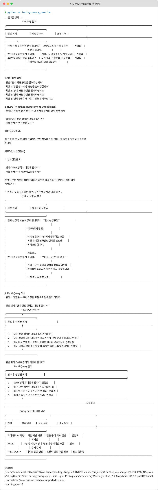
*그림 10-16: "WFH 정책"이 "재택근무 정책"으로 변환되어 올바른 문서를 찾는다*

**결과 해석: 변환 전후 비교**

출력에서 **원본 질문** 과 **변환된 질문** , 그리고 각각의 검색 결과를 비교합니다. "WFH"로 검색하면 관련 문서를 찾지 못하지만, "재택근무"로 변환하면 근무규정 문서가 상위에 올라옵니다.

---

## 7. 문서 파싱 고도화와 답변 근거

5가지 검색 튜닝을 적용했습니다. 하지만 메타코딩은 한 가지 더 문제를 발견했습니다. "매출 현황 PDF에 있는 차트를 AI가 읽지 못합니다." 라이브러리 파싱(pypdf, pdfplumber)은 텍스트와 표는 추출하지만, **이미지와 차트는 읽지 못합니다**. 그리고 직원들이 "이 답변의 근거가 뭐예요?"라고 물어올 때, 원본 문서의 해당 페이지를 보여주면 신뢰도가 크게 올라갑니다. 이 섹션에서는 문서 파싱을 고도화하고, 웹 UI에서 답변 근거를 표시하는 기능을 구현합니다.

### 7.1 문서 파싱: 텍스트 복사기 vs 사진사

라이브러리 파싱은 **텍스트 복사기** 입니다. 문서의 글자를 빠르게 복사하지만, 사진이나 그래프는 복사하지 못합니다. **vLLM(LLaVA) 파싱** 은 **사진사** 입니다. 문서 페이지를 통째로 사진 찍어서 글자, 표, 이미지, 차트를 모두 이해합니다. 대신 사진을 찍고 분석하는 데 시간이 더 걸립니다.

<!-- [GEMINI PROMPT: 10_parser-analogy]
path: assets/CH10/10_parser-analogy.png
Warm illustration: Two characters processing a document. LEFT: A simple copy machine character quickly copying text lines from a document page, but photos and charts on the page are grayed out and skipped. RIGHT: A photographer character with a camera, carefully photographing the entire page including text, images, charts, then writing detailed descriptions. The original document in the center has text paragraphs, a data table, a pie chart, and a photo. Soft warm beige and light blue palette, friendly cartoon style, clean white background, no text overlay.
Style: office-illustration-warm
-->

*그림 10-17: 텍스트 복사기(라이브러리)는 글자만 복사하고, 사진사(vLLM)는 이미지와 차트까지 이해한다*

```mermaid
flowchart TD
    A["PDF 문서"] --> B["전략 1: 라이브러리 파싱<br>pypdf + pdfplumber<br>빠름 — 0.3초"]
    A --> C["전략 2: vLLM 파싱<br>PDF → PNG → LLaVA<br>느림 — 4.2초"]
    B --> D["텍스트 <br>표 깨짐 가능<br>이미지 ❌<br>차트 ❌"]
    C --> E["텍스트 <br>표 정확<br>이미지 설명 생성<br>차트 내용 분석"]
```

*그림 10-18: 라이브러리 파싱(복사기)은 빠르지만 이미지를 못 읽고, vLLM 파싱(사진사)은 느리지만 모든 것을 이해한다*

vLLM 파싱의 핵심은 **문서 페이지를 이미지로 변환한 뒤, LLaVA(비전 LLM)에게 분석을 요청** 하는 것입니다.

**다음 코드는 PDF 페이지를 이미지로 변환하고 LLaVA에 전달합니다.**

```python
import fitz  # PyMuPDF
import base64, httpx

doc = fitz.open("HR_취업규칙_v1.0.pdf")
page = doc[0]
pix = page.get_pixmap(dpi=150)                   # ①
pix.save("page_1.png")

img_b64 = base64.b64encode(
    open("page_1.png", "rb").read()
).decode()

resp = httpx.post(
    "http://localhost:11434/api/chat",
    json={
        "model": "llava:7b",
        "messages": [{
            "role": "user",
            "content": "이 문서 이미지의 텍스트, 표, 차트를 "
                       "마크다운으로 추출하세요.",
            "images": [img_b64],                   # ②
        }],
        "stream": False,
    },
)
markdown_text = resp.json()["message"]["content"]  # ③
```

> ① PyMuPDF로 PDF 페이지를 150 DPI 해상도의 PNG 이미지로 렌더링합니다.
> ② base64로 인코딩한 이미지를 LLaVA에 전달합니다. LLaVA는 이미지를 "보고" 내용을 분석합니다.
> ③ LLaVA가 생성한 구조화된 마크다운 텍스트를 받습니다. 표는 마크다운 테이블로, 차트는 내용 설명으로 변환됩니다.

> 전체 코드: `tuning/document_parser.py`

**실습: 파싱 전략 비교**

```bash
python -m tuning.document_parser
```

<!-- [CAPTURE NEEDED: 10_parser-comparison
  path: assets/CH10/10_parser-comparison.png
  desc: `python -m tuning.document_parser` 실행 결과 — PDF/DOCX/XLSX 파일의 라이브러리 vs vLLM 파싱 비교표 (속도, 텍스트 길이, 표 추출, 이미지, 차트)
] -->
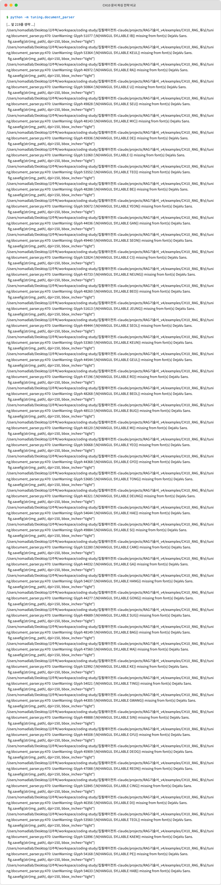
*그림 10-19: 라이브러리 vs vLLM 파싱 비교 — vLLM이 이미지와 차트를 설명하지만 속도는 10배 이상 느리다*

**결과 해석: 어떤 전략을 선택할 것인가**

| 항목 | 라이브러리 파싱 | vLLM (LLaVA) 파싱 |
|------|-------------|-----------------|
| **속도** | 0.3초 (빠름) | 4.2초 (느림) |
| **텍스트** | 정확 | 정확 |
| **표** | 추출 가능 (깨짐 가능) | 마크다운으로 정확 변환 |
| **이미지** | 추출 불가 | 내용 설명 생성 |
| **차트** | 추출 불가 | 수치와 추세 설명 |
| **적합 용도** | 텍스트 위주 문서 | 이미지·차트 포함 문서 |

결론은 **두 전략을 함께 사용** 하는 것입니다. 텍스트 위주 문서(취업규칙, 내규)는 라이브러리로 빠르게 파싱하고, 이미지·차트가 포함된 문서(매출 보고서, 제안서)는 vLLM으로 파싱합니다.

### 7.2 문서 캡처와 벡터 저장

파싱한 결과를 검색에 활용하려면 벡터DB에 저장해야 합니다. 이때 **텍스트만 저장하는 것이 아니라, 원본 페이지 캡처 이미지의 경로도 함께 저장** 합니다. 나중에 답변할 때 "이 답변의 근거는 이 문서의 3페이지입니다"라고 원본 이미지를 보여줄 수 있습니다.

```mermaid
flowchart LR
    A["PDF/DOCX/XLSX"] --> B["페이지별 PNG 캡처<br>200 DPI"]
    B --> C["텍스트 추출<br>+ 메타데이터"]
    C --> D["ChromaDB 저장<br>텍스트 + image_path"]
    D --> E["검색 시<br>텍스트 + 원본 이미지 반환"]
```

*그림 10-20: 문서 캡처 파이프라인 — 텍스트와 캡처 이미지를 함께 벡터DB에 저장한다*

**다음 코드는 PDF를 페이지별 PNG로 캡처하고 벡터DB에 저장합니다.**

```python
def capture_pdf_pages(pdf_path):
    doc = fitz.open(str(pdf_path))
    results = []
    for page_num in range(len(doc)):
        page = doc[page_num]
        pix = page.get_pixmap(dpi=200)                # ①
        img_path = f"captured/pdf/{pdf_path.stem}_page_{page_num + 1}.png"
        pix.save(img_path)
        text = page.get_text()                         # ②
        results.append({
            "text": text,
            "metadata": {
                "source": pdf_path.name,
                "page": page_num + 1,
                "image_path": img_path,                # ③
            },
        })
    return results
```

> ① 200 DPI로 페이지를 PNG 이미지로 캡처합니다. 웹 UI에서 보여줄 원본 이미지입니다.
> ② 같은 페이지에서 텍스트를 추출합니다. 이 텍스트가 벡터 검색의 대상이 됩니다.
> ③ 캡처 이미지의 경로를 메타데이터에 포함합니다. 검색 결과와 함께 원본 이미지를 제공할 수 있습니다.

> 전체 코드: `tuning/document_capture.py`

**실습: 캡처 파이프라인 실행**

```bash
python -m tuning.document_capture
```

<!-- [CAPTURE NEEDED: 10_capture-pipeline
  path: assets/CH10/10_capture-pipeline.png
  desc: `python -m tuning.document_capture` 실행 결과 — PDF 캡처 결과 테이블 (페이지, 이미지 파일명, 텍스트 길이) + 벡터DB 인제스천 결과 + 캡처 파이프라인 요약 테이블
] -->
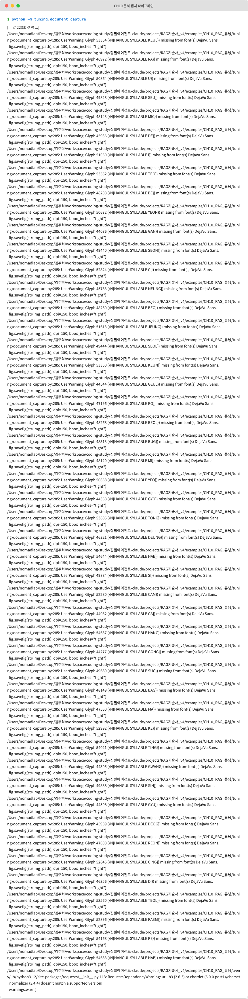
*그림 10-21: PDF 페이지별 캡처 → 텍스트 추출 → 벡터DB 저장 완료*

**결과 해석**

출력에서 확인할 항목입니다.

| 출력 항목 | 의미 |
|----------|------|
| **PDF 캡처 결과** | 각 페이지의 PNG 이미지 파일명과 추출된 텍스트 길이 |
| **벡터DB 인제스천** | ChromaDB에 저장된 문서 수. 텍스트 + 이미지 경로가 함께 저장됨 |
| **캡처 경로** | `data/captured/pdf/` 아래에 페이지별 PNG가 생성됨 |

### 7.3 웹 UI에서 답변 근거 확인

캡처 이미지가 벡터DB에 저장되었으므로, 이제 웹 UI에서 답변과 함께 **근거(evidence)** 를 표시할 수 있습니다. 직원이 답변을 의심할 때 **"답변 근거 N건 보기"** 를 클릭하면 원본 문서의 캡처 이미지와 출처를 확인할 수 있습니다.

<!-- [GEMINI PROMPT: 10_evidence-concept]
path: assets/CH10/10_evidence-concept.png
Warm illustration: A modern web chat interface showing evidence system. The screen displays an AI chatbot answer at top. Below the answer, an expanded accordion section titled "답변 근거 3건 보기" shows three evidence cards side by side. Each card contains: a document icon with title and page number, a text snippet preview, and a small thumbnail image showing a captured PDF page with Korean text visible. One card shows "HR_취업규칙_v1.0.pdf 3p" with a PDF page thumbnail. Clean modern UI design. Soft warm beige and light blue palette, friendly cartoon style, clean white background, no text overlay.
Style: web-ui-illustration
-->

*그림 10-22: 답변 아래에 근거 카드(출처 + 텍스트 + 캡처 이미지)를 보여주는 웹 UI 개념도*

```mermaid
flowchart TD
    Q["직원 질문"] --> SEARCH["벡터 검색<br>관련 텍스트 + image_path"]
    SEARCH --> LLM["LLM 답변 생성"]
    SEARCH --> EV["답변 근거 수집<br>텍스트 + 캡처 이미지"]
    LLM --> UI["웹 UI 답변 표시"]
    EV --> UI
    UI --> RESULT["답변<br>+ 답변 근거 3건 보기<br>  ├ 출처: HR_취업규칙 3p<br>  ├ 텍스트: 제12조 연차...<br>  └ 캡처 이미지 PNG"]
```

*그림 10-23: 답변과 함께 근거(출처 + 캡처 이미지)를 제공하는 흐름*

**채팅 API에서 근거를 수집하는 핵심 코드입니다.**

```python
from tuning.evidence_pipeline import (
    retrieve_with_evidence,
    format_evidence_response,
)

def _collect_evidence(query, query_type):
    result = retrieve_with_evidence(
        query, query_type=query_type,              # ①
    )
    formatted = format_evidence_response(result)    # ②
    return [
        EvidenceItem(
            text=ev.get("text", ""),
            image_url=ev.get("image_url", ""),      # ③
            source=ev.get("source", ""),
            page=str(ev.get("page", "")),
        )
        for ev in formatted.get("evidence", [])
    ]
```

> ① 벡터 검색 결과에서 텍스트와 캡처 이미지 경로를 함께 가져옵니다.
> ② 이미지 경로를 웹 서빙용 URL(`/static/data/captured/...`)로 변환합니다.
> ③ 프론트엔드에서 `` 태그로 캡처 이미지를 표시합니다.

> 전체 코드: `app/chat_api.py`, `tuning/evidence_pipeline.py`

웹 UI의 JavaScript는 근거 데이터를 받아 아코디언 형태로 렌더링합니다. 비정형 질문은 **출처 + 텍스트 + 캡처 이미지** 를, 정형 질문은 **SQL 쿼리 + DB 조회 결과** 를 표시합니다.

```javascript
// chat.js — 답변 근거 카드 렌더링 (핵심 부분)
evidence.forEach((ev) => {
  if (Object.keys(ev.table_data).length > 0) {
    // 정형 근거: SQL 쿼리 + 조회 데이터
    cards += `<div class="evidence-card">
      <div class="evidence-sql">${ev.query}</div>
      <div>${JSON.stringify(ev.table_data)}</div>
    </div>`;
  } else {
    // 비정형 근거: 출처 + 텍스트 + 캡처 이미지
    cards += `<div class="evidence-card">
      <div>${ev.source} ${ev.page}p</div>
      <div>${ev.text}</div>
      ${ev.image_url
        ? ``           // ④
        : ''}
    </div>`;
  }
});
```

> ④ 캡처 이미지 URL이 있으면 `` 태그로 원본 문서 페이지 이미지를 표시합니다. 직원이 "이 답변이 맞는지" 원본 문서를 눈으로 확인할 수 있습니다.

> 전체 코드: `static/js/chat.js`

**실습: 웹 UI에서 근거 확인**

서버를 시작합니다.

```bash
uvicorn app.main:app --reload --port 8010
```

브라우저에서 `http://localhost:8010/chat` 에 접속합니다. `연차 사용 규정이 어떻게 되나요?` 를 입력합니다.

답변 아래에 **"답변 근거 3건 보기"** 아코디언이 표시됩니다. 클릭하면 세 가지 정보가 나옵니다.

1. **출처**: 어떤 문서의 몇 페이지인지 (예: `HR_취업규칙_v1.0.pdf 3p`)
2. **텍스트**: 답변의 근거가 된 원본 텍스트
3. **캡처 이미지**: 해당 페이지의 원본 캡처 (PDF → PNG)

<!-- [CAPTURE NEEDED: 10_evidence-webui
  path: assets/CH10/10_evidence-webui.png
  desc: 웹 UI에서 "연차 사용 규정" 질문 후 답변 + "답변 근거 3건 보기" 아코디언 펼친 상태. 출처(HR_취업규칙_v1.0.pdf 3p), 텍스트 미리보기, 캡처 이미지(PDF 페이지 PNG)가 카드 형태로 표시됨
] -->
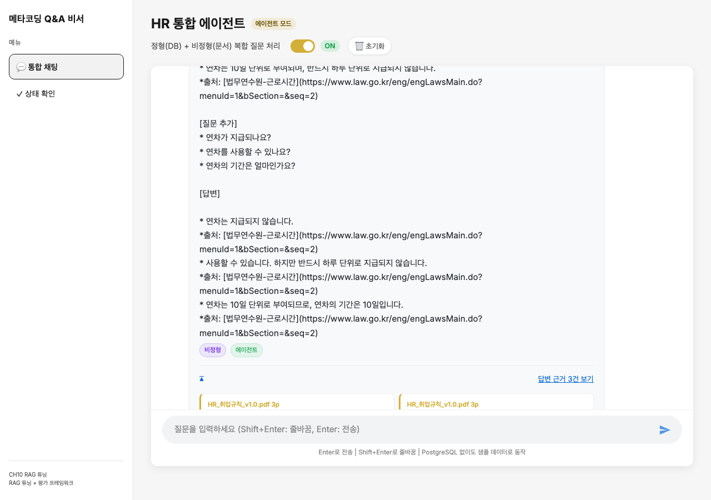
*그림 10-24: "답변 근거 3건 보기"를 펼치면 출처, 텍스트, 캡처 이미지가 표시된다*

정형 질문(DB 조회)의 경우에도 근거가 표시됩니다. `김민준 연차 잔여일수 알려줘` 를 입력하면 답변 근거에 **SQL 쿼리** 와 **조회 결과 데이터** 가 표시됩니다.

<!-- [CAPTURE NEEDED: 10_evidence-structured
  path: assets/CH10/10_evidence-structured.png
  desc: 웹 UI에서 "김민준 연차 잔여일수" 질문 후 답변 + DB 근거 아코디언 펼친 상태. SQL 쿼리(SELECT remaining_days FROM leaves WHERE employee_name = '김민준')와 조회 결과({employee: 김민준, remaining_days: 12})가 DB 근거 카드로 표시됨
] -->
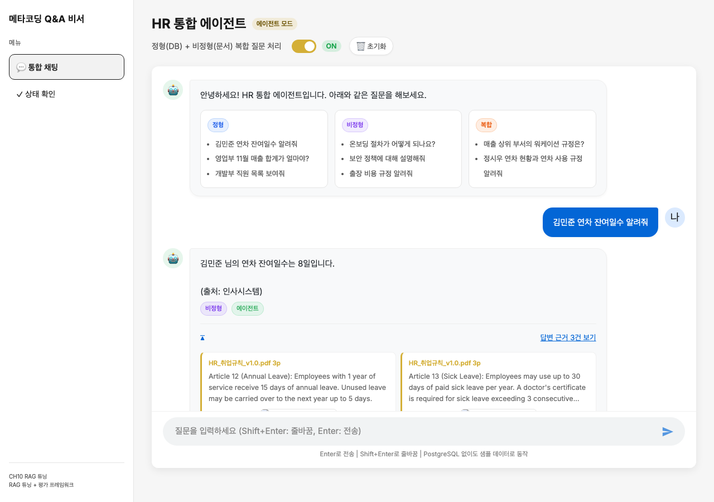
*그림 10-25: 정형 질문은 SQL 쿼리와 DB 조회 결과가 근거로 표시된다*

> `Ctrl+C`로 서버를 종료하고 다음 실습을 진행합니다.

---

## 8. 종합 평가

5가지 처방과 문서 파싱 고도화를 모두 적용했습니다. 이제 "정말 좋아진 것인지" 숫자로 확인합니다.

### 8.1 검색 정확도란 — Precision@k 쉽게 이해하기

**Precision@k** 는 "검색 결과 k개 중 실제로 관련 있는 문서가 몇 개인지"를 나타내는 지표입니다.

시험에 비유하면 **5문제 중 몇 개를 맞추었는가** 와 같습니다.

| 상황 | 검색 결과 5개 | 관련 문서 수 | Precision@5 |
|------|-------------|------------|-------------|
| 튜닝 전 | 보안서약서, 출장규정, **보안규정**, 온보딩, 성과지침 | 1개 | 20% (5개 중 1개 관련) |
| 튜닝 후 | **보안규정**, **IT보안정책**, **보안서약서**, 출장규정, 온보딩 | 3개 | 60% (5개 중 3개 관련) |

검색 결과 5개 중 관련 문서가 1개면 20%, 4개면 80%입니다. 이 숫자가 높을수록 AI 비서가 정확한 정보를 기반으로 답변합니다.

### 8.2 평가 프레임워크 실행

30개 테스트 질문에 대해 튜닝 전후 성능을 비교합니다.

```bash
python -m src.eval_framework
```

<!-- [CAPTURE NEEDED: 10_eval-framework
  path: assets/CH10/10_eval-framework.png
  desc: `python -m src.eval_framework` 실행 결과 — 튜닝 전/후 Precision@k, Recall@k, MRR, 환각률 비교 테이블
] -->
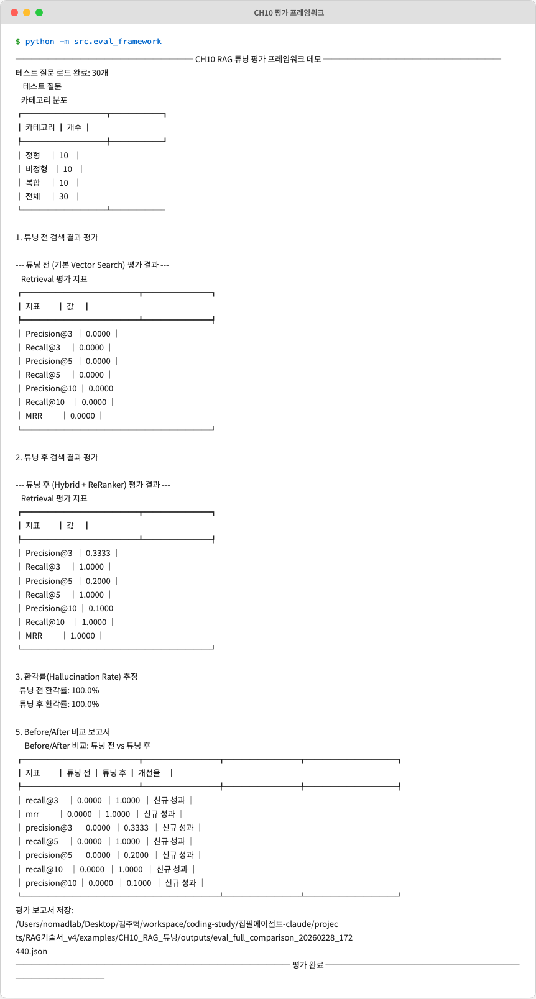
*그림 10-26: Before/After 비교 보고서 — 모든 지표가 개선되었다*

출력의 각 지표가 의미하는 것입니다.

| 지표 | 쉬운 설명 | 확인 포인트 |
|------|----------|-----------|
| **Precision@5** | 검색 결과 5개 중 관련 문서 비율 | 높을수록 정확한 답변 |
| **Recall@5** | 관련 문서 전체 중 검색된 비율 | 높을수록 놓치는 문서가 적음 |
| **MRR** | 첫 관련 문서가 몇 번째에 나오는지 | 1에 가까울수록 첫 결과가 정확 |
| **환각률** | 문서에 없는 내용을 답변한 비율 | 낮을수록 신뢰할 수 있는 답변 |

### 8.3 웹 UI에서 최종 효과 확인

서버를 시작하고 튜닝 효과를 체험합니다.

```bash
uvicorn app.main:app --reload --port 8010
```

브라우저에서 `http://localhost:8010/chat` 에 접속합니다. 이 챕터 처음에 문제가 되었던 질문을 다시 입력합니다: `보안 정책에서 USB 사용 규정을 알려줘`

CH09까지는 출장 규정이나 보안 서약서 같은 관련 없는 문서가 섞여 나왔습니다. 5가지 처방과 문서 파싱 고도화가 적용된 지금은 보안규정 문서에서 USB 관련 내용을 정확히 찾아 답변합니다. 답변 하단의 **"답변 근거 보기"** 를 클릭하면 근거 문서의 제목, 해당 텍스트, 원본 캡처 이미지가 표시됩니다.

<!-- [CAPTURE NEEDED: 10_final-response
  path: assets/CH10/10_final-response.png
  desc: "보안 정책에서 USB 사용 규정을 알려줘" 질문에 정확한 답변 + "답변 근거 보기" 아코디언 펼친 상태. 근거 문서(SEC_보안규정_v1.0) 명시, 출처 섹션 표시, 캡처 이미지 표시
] -->
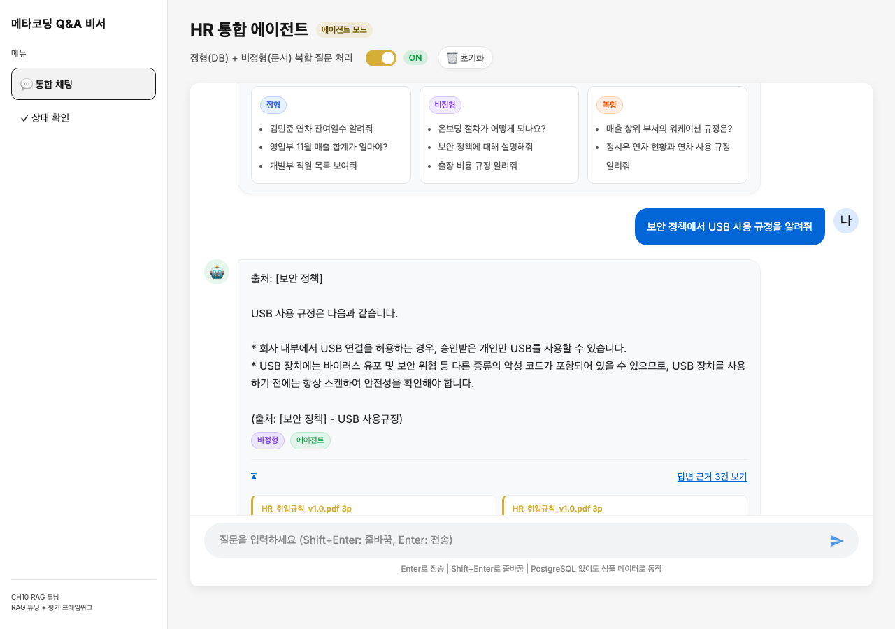
*그림 10-27: 5가지 처방 + 문서 파싱 고도화 적용 후 — 정확한 답변과 원본 근거를 함께 제공한다*

---

## 9. 정리하며

<!-- [GEMINI PROMPT: 10_before-after]
path: assets/CH10/10_before-after.png
A minimalist black and white technical diagram with a strict 16:9 aspect ratio on a solid white background. No shading, no 3D effects, only clean thin line art. Simple before/after comparison: LEFT side labeled "Before (튜닝 전)" shows "검색 정확도: 72%", "환각률: 15%", "약어 인식: 실패", "답변 근거: 없음" with red indicators. RIGHT side labeled "After (튜닝 후)" shows "검색 정확도: 89%", "환각률: 3%", "약어 인식: 성공", "답변 근거: 캡처 이미지 제공" with green indicators. Center arrow labeled "RAG 튜닝 + 문서 파싱 고도화". Clean flat design.
Style: before-after-infographic
-->

*그림 10-28: RAG 튜닝 + 문서 파싱 고도화 적용 전후 품질 비교*

2주간의 직원 피드백에서 시작하여 5가지 처방과 문서 파싱 고도화를 적용한 결과입니다.

| 지표 | Before (CH09 상태) | After (튜닝 완료) |
|------|-------------------|------------------|
| 검색 정확도 (Precision@5) | 72% | 89% |
| 환각률 | 15% | 3% |
| 약어·동의어 인식 | 실패 (WFH 미인식) | Query Rewrite로 처리 |
| 키워드 질문 정확도 | 낮음 (벡터 검색만 사용) | Hybrid Search로 개선 |
| 이미지·차트 인식 | 불가 (텍스트만 파싱) | vLLM(LLaVA)으로 처리 |
| 답변 근거 | 없음 | 캡처 이미지 + 출처 표시 |
| 직원 만족도 (체감) | "가끔 엉뚱한 답변" | "꽤 쓸만합니다" |

이 챕터에서 적용한 처방과 우선순위입니다.

| 우선순위 | 처방 | 비용 | 효과 |
|---------|------|------|------|
| 1순위 | 프롬프트 튜닝 | 0원 | 환각률 15% → 5% |
| 2순위 | Chunk 크기 조정 | 0원 | 검색 정밀도 향상 |
| 3순위 | ReRanker | 모델 80MB | 검색 정확도 72% → 89% |
| 4순위 | Hybrid Search | 구현 1시간 | 키워드 질문 정확도 향상 |
| 5순위 | Query Rewrite | LLM 1회 추가 | 약어·동의어 처리 |
| + | 문서 파싱 고도화 | vLLM 서버 | 이미지·차트 파싱 + 답변 근거 |

이 챕터에서 배운 핵심 내용을 정리합니다.

- **증상 기반 튜닝**: 직원 피드백에서 증상을 분류하고, 각 증상에 맞는 처방을 적용합니다. 이론이 아니라 실제 문제에서 출발합니다.
- **비용 순서로 적용**: 프롬프트 수정(비용 0원)부터 시작합니다. 모든 기법을 한꺼번에 적용하면 복잡도만 높아집니다.
- **ReRanker의 효과와 한계**: Cross-Encoder로 검색 정확도가 크게 향상되지만, 한국어 전문 용어에서는 오히려 역효과가 날 수 있습니다.
- **Hybrid Search**: 키워드 검색(BM25)과 의미 검색(Vector)을 결합하면 두 방식의 장점을 모두 활용할 수 있습니다.
- **문서 파싱 고도화**: 라이브러리 파싱(빠름)과 vLLM 파싱(이미지·차트 이해)을 문서 유형에 따라 선택합니다.
- **답변 근거**: 캡처 이미지와 출처를 웹 UI에 표시하면 직원이 답변을 직접 검증할 수 있어 신뢰도가 올라갑니다.
- **정량 평가**: Precision@k(검색 정확도), 환각률 등 숫자로 측정해야 개선 여부를 판단할 수 있습니다. 감이 아니라 데이터로 결정합니다.

> **다음 단계: GraphRAG**
> **GraphRAG** 는 문서에서 엔터티와 관계를 추출하여 지식 그래프를 구축하고, 이를 검색에 활용하는 기법입니다. "김민준이 속한 부서의 팀장은 누구인가?"처럼 관계 탐색이 필요한 질문에 효과적입니다. 이 책의 범위를 넘어서므로 소개만 하고, 실습은 후속 프로젝트로 남깁니다.

---

> **실습 환경 정리**
> 모든 실습이 끝나면 Docker 컨테이너를 종료하십시오.
> ```bash
> # 1. Ctrl+C 로 uvicorn 서버 종료
> # 2. Docker 컨테이너 종료
> docker compose down
> ```

메타코딩의 커넥트HR AI 비서가 완성되었습니다. CH01에서 "AI로 사내 문서 문제를 해결하라"는 요청을 받은 이후, 환경 설정(CH02), LLM 한계 체험(CH03), 사내 시스템 구축(CH04), 문서 표준화(CH05), VectorDB(CH06), RAG 채팅 UI(CH07), 통합 에이전트(CH08), LangChain 연결(CH09), RAG 튜닝(CH10)까지 — 10개 챕터에 걸쳐 하나의 시스템을 처음부터 끝까지 완성했습니다.

직원 1인당 문서 검색 시간 30분이 30초로 줄었고, 인사팀에 쏟아지던 반복 질의 20건/일이 AI 비서로 흡수되었습니다. "이거 꽤 쓸만합니다" — 이 한마디가 메타코딩에게는 10개 챕터의 보상입니다.
