# 사내 문서 기반 AI 업무 비서 (RAG + MCP)

> **집필 컨셉**: 스토리텔링 버전
> **주인공**: 메타코딩
> 생성일시: 2026-02-28 09:42

---

## 목차

# 사내 문서 기반 AI 업무 비서 (RAG + MCP) — 목차

> 집필 컨셉: storytelling | 주인공: 메타코딩 (1인 개발자, 중소기업 AI 도입 담당)
> 프로젝트: "커넥트HR AI 비서"

---

## 전체 구성

- 총 챕터 수: 10개
- 예상 총 분량: 95p
- 이론 / 실습 비율: 약 25% / 75%
- 집필 구조: 문제 상황 → 기술 소개 → 해결 과정 → before/after 결과 정리

---

## 파트 구성 개요

```
PART 0.   시작하기         CH01 (5p)  + CH02 (7p)
기초                       CH03 (8p)
PART 1.   기반 구축        CH04 (10p) + CH05 (7p)
PART 2.   핵심 구현        CH06 (12p) + CH07 (12p)
PART 3.   통합             CH08 (12p) + CH09 (10p)
PART 4.   고도화           CH10 (12p)
합계                       95p
```

---

## PART 0. 시작하기

---

### CH01. 이 책의 목표와 최종 완성본 미리보기 (5p)

> 스토리: 메타코딩은 대표에게 "AI로 사내 문서 문제를 해결하라"는 요청을 받는다.
> 하루 30분씩 문서를 뒤지는 직원들, 인사팀에 쏟아지는 반복 질문 20건/일.
> 메타코딩은 RAG + MCP 조합이 중소기업에 최적임을 확인하고 프로젝트를 시작한다.

#### 1.1 이 책이 다루는 범위 (1p)

- 이 책이 해결하는 문제: 사내 문서 3,000건, 직원 1인당 문서 검색 30분/일
- RAG(검색 증강 생성) vs Fine-tuning 비교표: 비용, 데이터 요구량, 업데이트 주기, 적합 상황
- MCP(Model Context Protocol)가 필요한 이유: 정형 DB와 비정형 문서를 하나의 에이전트에서 통합 처리
- 이 책의 최종 산출물: "커넥트HR AI 비서" (정형 + 비정형 + 복합 질문 처리)
- [표] Fine-tuning vs RAG 비교 (비용·데이터·응답 속도·업데이트 주기)

#### 1.2 최종 결과물 데모 시나리오 (1p)

- 정형 질문 예시: "김철수 사원의 남은 연차는?" → DB 조회 → 즉시 응답
- 비정형 질문 예시: "신입사원 온보딩 절차를 알려줘" → 문서 검색 → 출처 포함 응답
- 복합 질문 예시: "올해 매출 상위 부서의 복지 정책을 비교해줘" → DB + 문서 조합
- [다이어그램] 질문 유형별 처리 흐름 개요

#### 1.3 아키텍처 한 장 요약 (1p)

- 전체 시스템 Mermaid 다이어그램: 사용자 → FastAPI → QueryRouter → MCP Tools / RAG Chain / ReAct Agent
- 각 구성 요소 역할 1줄 설명 (FastAPI, QueryRouter, ChromaDB, PostgreSQL, LangChain Agent)
- [다이어그램] 커넥트HR AI 비서 전체 아키텍처

#### 1.4 사용 기술 스택 (1p)

- 기술별 역할 및 메모리 요구사항 표 (Ollama + DeepSeek R1, ChromaDB, PostgreSQL, LangChain, MCP 등)
- 최소 하드웨어 스펙: RAM 16GB, 저장공간 20GB
- 권장 환경: macOS / Ubuntu 22.04+ (Apple Silicon 또는 NVIDIA GPU)
- LLM Provider 선택지: Ollama(로컬 무료) / OpenAI(클라우드 유료) / vLLM(자체 호스팅)

#### 1.5 이 책을 마치면 할 수 있는 것 (1p)

- 3가지 핵심 역량: RAG 파이프라인 구축, MCP 통합 에이전트 설계, 실전 RAG 튜닝
- 챕터별 빌드업 로드맵 요약 (CH01→CH02→...→CH10 의존성 흐름)
- [다이어그램] 챕터 의존성 그래프 (CH01부터 CH10까지 순방향 연결)
- before/after: 직원 1인 문서 검색 30분 → 30초, 인사팀 반복 질의 20건/일 → 0건

---

### CH02. 개발 환경 설정 (7p)

> 스토리: 메타코딩은 클라우드 API 비용과 사내 보안 정책 때문에 로컬 LLM을 선택한다.
> Ollama를 발견하고, 나중에 Provider를 바꿀 수 있도록 처음부터 전환 구조를 설계한다.

#### 2.1 필수 요구사항 확인 (0.5p)

- Python 3.10+, RAM 16GB+, 저장공간 20GB+, Docker, Git 설치 확인
- OS별 주의사항 표 (macOS Apple Silicon / Intel, Ubuntu 22.04+, Windows WSL2)
- 사전 실습 체크리스트 (6개 항목)

#### 2.2 Ollama + DeepSeek R1 설치 및 테스트 (1.5p)

- Ollama 설치 (OS별 가이드: macOS brew, Linux curl, Windows WSL2)
- DeepSeek R1 모델 다운로드: `ollama pull deepseek-r1:8b`
- 간단한 대화 테스트: `ollama run deepseek-r1:8b`
- 메모리 부족 시 대안: `deepseek-r1:1.5b` 경량 모델
- [코드 워크플로우] Input: 질문 문자열 / Process: Ollama API 호출 / Output: 텍스트 응답

#### 2.3 Python 가상환경 및 의존성 (0.5p)

- venv 생성 및 활성화 (OS별 명령어)
- requirements.txt 주요 패키지 설명 (FastAPI, LangChain, ChromaDB, sentence-transformers 등)
- pip install 실행

#### 2.4 PostgreSQL 설치 (1p)

- Docker Compose 기반 설치 (권장): docker-compose.yml 구조 설명
- 네이티브 설치 대안 (macOS homebrew, Ubuntu apt)
- 초기 DB 생성: `connect_hr` 데이터베이스

#### 2.5 프로젝트 클론 및 초기 설정 (0.5p)

- git clone 및 폴더 구조 설명
- .env 파일 생성 및 필수 환경변수 설정

#### 2.6 주요 의존성 목록 (0.5p)

- requirements.txt 항목별 용도 설명 표
- 버전 호환성 주의사항 (LangChain 0.3+, ChromaDB 0.5+, Python 3.10+)

#### 2.7 LLM Provider 전환 구조 (1.5p)

- .env 기반 Provider 전환 설계: `LLM_PROVIDER=ollama|openai|vllm`
- `src/llm_provider.py` 팩토리 패턴 설명 (핵심 코드 10~15줄)
- Provider별 테스트 방법: ollama(로컬), openai(API 키), vllm(자체 호스팅)
- [코드 워크플로우] Input: LLM_PROVIDER 환경변수 / Process: 팩토리 패턴 분기 / Output: LLM 인스턴스
- 전체 코드: `src/llm_provider.py`

#### 2.8 환경 검증 (1p)

- `src/verify_env.py` 실행: Ollama, Python, Docker, PostgreSQL 전항목 PASS 확인
- 각 검증 항목 설명 (연결 확인, 버전 확인, 응답 테스트)
- [코드 워크플로우] Input: 없음 / Process: 4개 서비스 연결 순차 확인 / Output: PASS/FAIL 항목 표
- 전체 코드: `src/verify_env.py`
- before/after: LLM 실행 환경 없음 → Ollama 로컬 / 월 비용 $50+ → $0 / .env 한 줄로 Provider 전환

---

## 기초

---

### CH03. LLM의 한계와 RAG의 필요성 (8p)

> 스토리: 메타코딩은 바로 DeepSeek R1에 사내 질문을 던져본다.
> "김철수 사원의 남은 연차가 며칠입니까?" — LLM은 자신 있게 틀린 답을 내놓는다.
> 환각을 직접 체험하고, RAG 아이디어를 스스로 떠올린다.

#### 3.1 [실패] LLM 단독 질의 (1.5p)

- DeepSeek R1에 사내 정보 질문: "김철수 사원의 남은 연차는?"
- 환각 체험: 실제 7일인데 "12일"이라고 자신 있게 답변
- `src/01_llm_only.py` 실행 및 결과 분석
- [코드 워크플로우] Input: 사내 정보 질문 / Process: LLM 단독 호출 / Output: 환각 포함 응답
- 전체 코드: `src/01_llm_only.py`

#### 3.2 왜 LLM은 환각을 일으키는가 (1p)

- 학습 데이터 컷오프 문제: 사내 비공개 정보는 학습에 포함되지 않음
- 파라메트릭 지식(학습 데이터) vs 컨텍스트 지식(프롬프트 주입) 구분
- [다이어그램] LLM 지식의 한계 — 사내 정보가 없는 이유

#### 3.3 [임시 해결] Context Injection 맛보기 (1.5p)

- 프롬프트에 문서 직접 붙여넣기: 정확도는 올라가지만 토큰 한계 체감
- 문서 3개만 넣어도 컨텍스트 초과 발생
- `src/02_context_injection.py` 실행
- [코드 워크플로우] Input: 질문 + 문서 전체 / Process: 프롬프트 직접 삽입 / Output: 정확도 개선 + 토큰 오류
- 전체 코드: `src/02_context_injection.py`

#### 3.4 [성공] RAG 미리보기 (2p)

- 인메모리 ChromaDB로 검색 + 답변 파이프라인 구성
- 청킹 유무 비교: 전체 문서 첨부 vs 500자 청크 검색
- `src/03_rag_preview.py` 실행: 연차 7일 정확 응답 확인
- [다이어그램] RAG 파이프라인: 질문 → 검색 → 컨텍스트 주입 → 답변
- [코드 워크플로우] Input: 질문 / Process: 청크 검색 + 프롬프트 주입 / Output: 출처 포함 정확한 답변
- 전체 코드: `src/03_rag_preview.py`

#### 3.5 [심화] DeepSeek R1 추론 능력 확인 (1p)

- RAG + 계산/추론 질문: "올해 1분기 매출 합계는?"
- `src/04_rag_reasoning.py` 실행
- [코드 워크플로우] Input: 수치 계산 질문 / Process: RAG 검색 + 추론 / Output: 계산 결과 포함 답변
- 전체 코드: `src/04_rag_reasoning.py`

#### 3.6 정리하며 (1p)

- 4단계 결과 비교표: 정확도 / 출처 포함 여부 / 토큰 효율 / 한계
- before/after: 사내 질의 정확도 0%(환각) → 85%+(출처 기반) / 토큰 사용량: 전체 문서 첨부 시 초과 → 관련 청크 500~1000토큰
- 다음 챕터 예고: "이제 제대로 된 사내 시스템부터 만들어보겠습니다"

---

## PART 1. 기반 구축

---

### CH04. FastAPI로 초간단 사내 시스템 만들기 (10p)

> 스토리: 메타코딩은 RAG 가능성을 확인하였지만, AI가 답변할 "사내 데이터"가 없다.
> 직원 정보는 Excel, 휴가 현황은 수동 집계, 매출은 부서별 파일.
> "AI 비서보다 기본 시스템이 먼저다"라는 것을 깨닫는다.

#### 4.1 프로젝트 구성 (1p)

- 폴더 구조 설명: `app/`, `templates/`, `data/`, `static/`
- .env 설정: POSTGRES_HOST, POSTGRES_PORT, POSTGRES_DB 등
- 실행 방법: `uvicorn app.main:app --reload`
- FastAPI를 선택하는 이유: async 지원, 자동 API 문서(Swagger), Pydantic 통합
- 전체 코드: `app/main.py`

#### 4.2 데이터 모델 설계 (2p)

- 3테이블 구조: `employee`, `leave_balance`, `sales`
- [다이어그램] ERD: 테이블 간 관계 (employee ↔ leave_balance, employee ↔ sales)
- `data/schema.sql` + 시드 데이터 설명
- Pydantic 스키마와 SQLAlchemy 모델의 역할 분리
- PostgreSQL을 선택하는 이유: MCP를 통한 SQL 질의 대상, 실무 표준 RDBMS
- 전체 코드: `app/models.py`, `data/schema.sql`

#### 4.3 CRUD API 구현 (3p)

- 직원 CRUD: `GET/POST/PUT/DELETE /api/employees`
- 휴가 잔여 조회 및 변경: `GET/PUT /api/leaves`
- 매출 CRUD: `GET/POST/PUT/DELETE /api/sales`
- Pydantic 요청/응답 스키마 설계
- 3테이블 구조인 이유: CH08 MCP 통합 시 현실적인 정형 데이터 시나리오 제공
- [코드 워크플로우] Input: HTTP 요청 + Pydantic 검증 / Process: SQLAlchemy ORM / Output: JSON 응답
- 전체 코드: `app/crud.py`, `app/schemas.py`

#### 4.4 관리자 Admin UI (4p)

- base.html 베이스 레이아웃: 좌측 사이드바(240px) + 메인 콘텐츠 — CH07/CH08에서 계승
- Jinja2 템플릿 기반 웹 UI 구조 설명
- 직원 목록/등록/수정 화면 (`templates/employees.html`)
- 휴가 현황 조회 화면 (`templates/leaves.html`)
- 매출 현황 대시보드 (`templates/dashboard.html`)
- Jinja2를 선택하는 이유: Python만으로 UI 구현, 별도 프론트엔드 불필요
- [다이어그램] Admin UI → FastAPI → PostgreSQL 요청 흐름
- 전체 코드: `templates/*.html`, `app/views.py`
- before/after: 직원 정보 Excel → PostgreSQL + 웹 Admin UI / 휴가 집계 30분 → 즉시 조회

---

### CH05. 사내 문서 수집 전략과 문서 표준 만들기 (7p)

> 스토리: 메타코딩은 커넥트 인사팀 서버를 열어보고 당황한다.
> "취업규칙_최종_진짜최종.pdf"와 "취업규칙_최종_v2.pdf"가 공존하고,
> 100개 넘는 파일이 하나의 폴더에 뒤섞여 있다. "Garbage In, Garbage Out"을 실감한다.

#### 5.1 어떤 문서를 넣을 것인가 (1p)

- 교재용 문서 세트 소개: HR 취업규칙, 보안 규정, 운영 전략, 예산 기안, 매출 현황
- 문서 유형별 특성: 규정류 PDF(고정 양식), 보안 DOCX(표 구조), XLSX(수치 데이터)
- 실무 문서 선정 기준: 자주 질문받는 문서, 정기 갱신 문서 우선

#### 5.2 문서 형식 지원 범위 (1p)

- PDF, DOCX, XLSX 각 형식의 특성과 파싱 난이도 비교표
- 이미지 PDF vs 텍스트 PDF 구분 (이미지 PDF 처리는 CH06 LLM 파싱, CH10 튜닝에서 심화)
- 형식별 파싱 라이브러리: pypdf, python-docx, openpyxl

#### 5.3 문서 표준 규칙 (2p)

- 파일명 규칙: `{부서}_{문서종류}_v{버전}.{확장자}` (예: `HR_취업규칙_v1.0.pdf`)
- 폴더 구조: `data/docs/{부서}/` (hr, security, ops, finance)
- [다이어그램] 표준화 전/후 폴더 구조 비교
- 메타데이터 필수 항목: doc_id, title, department, version, date, format (7개 항목)
- 파일명 규칙을 정하는 이유: 버전 관리, 부서별 분류, 출처 추적 — CH10 Self-Query Retriever에서 필수

#### 5.4 문서 수집 파이프라인 (3p)

- docs/ 폴더 구조 설계 및 실제 문서 배치 (PDF 4개, DOCX 1개, XLSX 2개)
- `src/validator.py`: 파일명 규칙 검증 + 파일 형식 확인 + 메타데이터 자동 추출
- 검증 스크립트 실행: 모든 문서 PASS 확인
- [다이어그램] 원본 문서 → 폴더 배치 → validator.py → metadata.json → CH06으로 전달
- [코드 워크플로우] Input: data/docs/ 폴더 전체 / Process: 파일명 패턴 검증 + 메타데이터 추출 / Output: 검증 결과 + metadata.json
- 전체 코드: `src/validator.py`
- before/after: 파일명 규칙 없음 → `{부서}_{종류}_v{버전}.{확장자}` 통일 / 단일 폴더 100+ 파일 → 부서별 4개 폴더 / 메타데이터 없음 → 7개 항목 자동 추출

---

## PART 2. 핵심 구현

---

### CH06. VectorDB 구축 — 문서를 검색 가능한 지식으로 바꾸기 (12p)

> 스토리: 메타코딩은 CH05에서 문서를 깔끔하게 정리하였다.
> 이제 이 문서를 AI가 검색할 수 있게 변환해야 한다.
> 그런데 취업규칙에는 표가 가득하고, 매출 현황에는 차트가 있다.
> "단순 텍스트 추출만으로는 정보가 날아간다"는 것을 깨닫는다.

#### 6.1 [Step 1] Python 파싱 테스트 (2p)

- `src/extractor.py`: 형식별 통합 텍스트 추출기
- PDF(pypdf), DOCX(python-docx), XLSX(openpyxl) 순차 실행
- 추출 결과 비교: 형식별 품질 차이 직접 확인 (깨진 문자, 표 손실, 이미지 누락)
- 한계 체감: 표/이미지/복잡한 레이아웃은 Python 파싱으로 처리 불가
- [코드 워크플로우] Input: PDF/DOCX/XLSX 파일 / Process: 형식별 파서 분기 / Output: 텍스트 + 손실 목록
- 전체 코드: `src/extractor.py`

#### 6.2 [Step 2] LLM 파싱 — Vision LLM으로 문서 이해 (2.5p)

- Vision LLM(LLaVA): PDF 페이지를 이미지로 변환 후 분석
- LLM이 추출하는 것: 텍스트 + 메타데이터(제목, 부서, 버전) + 이미지 캡션
- `src/vision_extractor.py`: PDF → 페이지 이미지 → LLM 분석 → 구조화된 결과
- [표] Python 파싱 vs LLM 파싱 비교 (품질, 속도, 비용)
- Vision LLM을 사용하는 이유: 표/이미지/복잡한 레이아웃을 이해, 메타데이터 자동 추출
- [코드 워크플로우] Input: PDF 파일 / Process: 페이지 이미지 변환 + LLaVA 분석 / Output: 구조화된 텍스트 + 메타데이터
- 전체 코드: `src/vision_extractor.py`

#### 6.3 Chunk 설계 (2p)

- Fixed-size 청킹: 500~1000자 + overlap 10~20%
- 메타데이터 부착: doc_id, title, section, department, page, source_path
- 이미지 청크: 캡처본 경로 + LLM 캡션을 텍스트 청크로 변환
- Fixed-size 청킹을 기본으로 쓰는 이유: 구현이 단순하고 예측 가능, Semantic 청킹은 CH10에서 개선
- [다이어그램] 문서 → 청크 분할 → 메타데이터 부착 구조
- 전체 코드: `src/chunker.py`

#### 6.4 임베딩 & VectorDB 저장 (2.5p)

- 임베딩 모델: `ko-sroberta-multitask` (로컬, 무료, 한국어 최적화)
- ChromaDB Collection 생성 및 문서 추가
- 텍스트 청크 + 이미지 캡션 청크를 함께 저장하는 이유: 실무 문서는 텍스트만으로 정보가 완전하지 않음
- `src/store.py`: 임베딩 + ChromaDB 저장 파이프라인
- [코드 워크플로우] Input: 청크 리스트 + 메타데이터 / Process: ko-sroberta 임베딩 + ChromaDB upsert / Output: ChromaDB 인덱스
- 전체 코드: `src/store.py`

#### 6.5 [Step 3] CLI 검증 — 쿼리로 근거 확인 (2p)

- `src/cli_search.py`: 터미널에서 쿼리 입력 → 관련 청크 + 출처 + 캡처본 경로 출력
- 텍스트 근거: 관련 문구 하이라이트
- 이미지 근거: 해당 페이지 캡처본 경로 표시
- 검색 품질 확인: k값, 유사도 점수
- CLI로 먼저 검증하는 이유: 웹 UI 없이 VectorDB 품질을 빠르게 확인, CH07에서 웹 UI 연결
- [코드 워크플로우] Input: 자연어 쿼리 / Process: 임베딩 → ChromaDB 검색 / Output: 관련 청크 + 출처 + 캡처본 경로
- 전체 코드: `src/cli_search.py`, `src/main.py`
- 전체 파이프라인 코드: `src/main.py`

#### 6.6 정리하며 (1p)

- before/after: 파일명 수동 검색 → 의미 기반 벡터 검색 / 검색 소요 시간 10~30분 → 1초 미만 / 표·차트 정보 손실 → Vision LLM 캡션으로 보존 / 검색 정확도 top-5 기준 0% → 80%+
- 다음 챕터 예고: CLI 검색을 웹 채팅 UI로 연결하는 작업

---

### CH07. RAG로 Q&A 엔진 만들기 (12p)

> 스토리: CLI 검색은 개발자인 메타코딩만 쓸 수 있다.
> 직원 30명이 브라우저에서 자연어로 질문하고, 이전 대화를 이어서 물어볼 수 있어야 한다.
> "아까 물어본 건데, 그것 말고 다른 부서 규정은?" — 멀티턴 대화가 필요하다.

#### 7.1 RAG 최소 동작 구현 (2.5p)

- 질문 → Retriever → Prompt → LLM → 답변 파이프라인
- LCEL(LangChain Expression Language) 기반 RAG 체인: `retriever | prompt | llm | parser`
- LCEL을 사용하는 이유: 파이프 연산자(|)로 가독성 높은 체인 조립, LangChain 최신 방식
- `src/rag_chain.py` 핵심 코드 (15줄)
- [코드 워크플로우] Input: 자연어 질문 / Process: ChromaDB 검색 → 프롬프트 조립 → LLM 호출 / Output: 답변 텍스트
- 전체 코드: `src/rag_chain.py`

#### 7.2 RAG 프롬프트 기본 템플릿 (1p)

- 출처 강제 규칙: "반드시 제공된 문서에서만 답변하시오"
- 모르면 "확인되지 않음" 응답 규칙: 환각 방지
- 프롬프트 템플릿 설계 패턴 (시스템 역할 + 컨텍스트 블록 + 질문)

#### 7.3 출처 표시 응답 포맷 (1.5p)

- answer + sources JSON 구조 설계
- 출처 필드: 문서명, 페이지, 관련도 점수
- 출처를 강제하는 이유: 환각 여부를 사용자가 검증 가능, 실무 신뢰도의 핵심
- `src/response_parser.py`: 응답 파서 구현
- 전체 코드: `src/response_parser.py`

#### 7.4 채팅 웹 UI (3p)

- CH04의 base.html 계승: 동일 사이드바 + 메인 콘텐츠 레이아웃 확장
- FastAPI `/api/chat` 엔드포인트 구현 (Fetch 기반)
- Jinja2 + JavaScript 채팅 UI: `templates/chat.html extends base.html`
- Fetch 방식을 사용하는 이유: 구현이 단순하고 초급 독자에게 적합
- 근거 아코디언 UI: 답변 아래 "근거: HR_취업규칙_v1.0.pdf, 15페이지" 표시
- [다이어그램] 사용자 질문 → Fetch POST → FastAPI → ChromaDB → LLM → 채팅 UI
- 전체 코드: `app/chat_api.py`, `templates/chat.html`

#### 7.5 멀티턴 대화 관리 (3p)

- 대화 히스토리 저장: 세션 기반
- `ConversationBufferWindowMemory`: 최근 N턴 대화 유지
- 이전 대화 맥락을 프롬프트에 포함하는 구조
- 세션 관리: 세션 ID 기반, 만료 정책
- 멀티턴을 추가하는 이유: 실무에서 단일 질의만으로 문제가 해결되는 경우는 드묾
- [코드 워크플로우] Input: 질문 + 세션 ID / Process: 히스토리 조회 + RAG 체인 + 히스토리 업데이트 / Output: 답변 + 업데이트된 세션
- 전체 코드: `src/conversation.py`, `app/session.py`

#### 7.6 정리하며 (1p)

- before/after: 사용 가능한 사람 개발자 1명 → 전 직원 30명 / 터미널 명령어 → 브라우저 채팅 / 텍스트 출력 → 근거 아코디언 UI / 멀티턴 불가 → 멀티턴 대화 지원 / 질의 건수 5건/일 → 50건/일 (예상)
- 다음 챕터 예고: 문서 검색 외에 DB 조회가 필요한 질문 처리

---

## PART 3. 통합

---

### CH08. 정형 MCP + 비정형 RAG 통합 에이전트 (12p)

> 스토리: RAG 채팅 UI를 직원들이 쓰기 시작했다.
> 그런데 예상치 못한 질문이 들어온다.
> "김철수 사원의 남은 연차는?" — DB에 있는 정형 데이터다.
> "매출 상위 부서의 복지 정책은?" — DB + 문서를 조합해야 한다.
> RAG만으로는 절반밖에 처리할 수 없다.

#### 8.1 정형/비정형 분리 원칙 (1.5p)

- 정형 데이터(DB): MCP + SQL 질의 경로
- 비정형 데이터(문서): VectorDB + RAG 경로
- 복합 질문: 두 경로를 순차/병렬로 조합
- [표] 질문 유형별 처리 경로 분류 기준
- [다이어그램] 사용자 질문 → QueryRouter → 정형/비정형/복합 분기

#### 8.2 질문 라우팅 전략 (2.5p)

- 1단계: 규칙 기반 라우팅 (키워드 매칭)
- 2단계: 스키마 기반 라우팅 (DB 컬럼명 매칭)
- 3단계: LLM 판단 라우팅 (LLM이 질문 분석 후 경로 결정)
- 3단계로 나누는 이유: 단순한 것에서 시작하여 왜 LLM 판단이 필요한지 점진적으로 이해
- `src/router.py` 핵심 코드 (15줄)
- [코드 워크플로우] Input: 자연어 질문 / Process: 3단계 라우팅 순서 판단 / Output: 경로 결정(정형/비정형/복합)
- 전체 코드: `src/router.py`

#### 8.3 통합 응답 전략 (3p)

- 질문 분석 → 데이터 수집 → 통합 컨텍스트 구성 → 답변 생성
- `src/agent.py`: ReAct Agent 구현 (Reasoning + Acting 반복)
- `src/mcp_tools.py`: MCP 도구 연결
- ReAct Agent를 사용하는 이유: 복합 질문을 "먼저 DB 조회, 그 다음 문서 검색" 식으로 단계적으로 해결
- MCP를 사용하는 이유: LLM이 직접 DB를 조회하는 표준화된 프로토콜, 도구 추가가 선언적
- [코드 워크플로우] Input: 복합 질문 / Process: ReAct 추론 → MCP 호출 → RAG 호출 → 통합 / Output: 정형 + 비정형 통합 답변
- 전체 코드: `src/agent.py`, `src/mcp_tools.py`

#### 8.4 대표 질문 시나리오 10개 (3p)

- 정형 4개: 연차 잔여 / 매출 합계 / 직원 목록 / 부서별 통계
- 비정형 4개: 온보딩 절차 / 보안 정책 / 복지 안내 / 출장 규정
- 복합 2개: 매출 상위 부서의 복지 정책 / 특정 직원의 휴가 규정
- 각 시나리오별 기대 응답 및 검증 기준
- 10개 시나리오를 정하는 이유: CH10 평가의 기준선, 정형/비정형/복합 패턴 커버
- 전체 코드: `tests/test_scenarios.py`

#### 8.5 통합 에이전트 웹 UI (1p)

- CH07 채팅 UI 확장: 동일 base.html + 질문 유형 표시(정형/비정형/복합) 추가
- 통합 응답 포맷: 출처 + DB 결과 병합 표시

#### 8.6 정리하며 (1p)

- before/after: 처리 가능한 질문 유형 비정형만 → 정형 + 비정형 + 복합 / 10개 시나리오 정답률 4/10 → 10/10 / 연차 조회 불가 → DB에서 즉시 조회 / 복합 질문 불가 → DB + 문서 자동 조합
- 다음 챕터 예고: 운영 환경에서 안정적으로 동작하게 하는 LangChain 표준 구성

---

### CH09. LangChain으로 연결 전략 세팅 (10p)

> 스토리: AI 비서가 인기를 끌면서 하루 질의가 100건을 넘겼다.
> LLM 호출 30초 타임아웃, 같은 질문 반복으로 불필요한 비용, 에러 로그 없음.
> "되는 것"과 "운영할 수 있는 것"은 다르다.

#### 9.1 기본 구성 3종 세트 (2p)

- Router/Agent: 질문 라우팅 + 실행 조율
- RAG Chain: 문서 검색 + 답변 생성
- MCP Tools: 외부 도구 연결
- 3종 세트가 결합되는 방식: 아키텍처 설명
- CH08과 별도 챕터로 분리하는 이유: CH08은 통합 원리, CH09는 LangChain 표준 구성과 운영에 집중
- [다이어그램] LangChain Agent → Router → 4 MCP Tools / RAG Chain / 모니터링

#### 9.2 Router 전략 (2p)

- 문서 검색 판단 로직
- DB 조회 판단 로직
- 실행 순서 결정: 직렬 vs 병렬
- 최종 응답 조합
- `src/agent_config.py` 핵심 코드
- 전체 코드: `src/agent_config.py`

#### 9.3 MCP Tool 설계 (3p)

- @tool 데코레이터 기반 4개 도구 정의
- `leave_balance`: 휴가 잔여 조회 (`src/tools/leave_balance.py`)
- `sales_sum`: 매출 합계 조회 (`src/tools/sales_sum.py`)
- `list_employees`: 직원 목록 조회 (`src/tools/list_employees.py`)
- `search_documents`: 문서 검색 (`src/tools/search_documents.py`)
- 도구 스키마 정의 및 LLM에 전달하는 구조
- 4개 도구로 한정하는 이유: 가장 빈번한 패턴 커버, 이후 @tool 추가로 확장 가능
- [코드 워크플로우] Input: LLM 도구 호출 요청 / Process: 스키마 검증 + DB/문서 조회 / Output: 구조화된 도구 응답
- 전체 코드: `src/tools/*.py`

#### 9.4 운영 설정 (2p)

- Timeout/Retry 설정: 타임아웃 발생률 15% → 2%
- 로깅: 구조화된 로그 포맷 (JSON 기반)
- 캐싱: 응답 캐시, 임베딩 캐시 — 동일 질문 응답 시간 5초 → 0.3초
- 비용 관리: 토큰 사용량 추적
- Langfuse 간략 소개: LLM 모니터링 도구 (월별 비용 예측 가능)
- 전체 코드: `src/monitoring.py`, `src/cache.py`

#### 9.5 정리하며 (1p)

- before/after: 타임아웃 발생률 15% → 2% / 동일 질문 응답 시간 5초 → 0.3초 / 에러 추적 불가 → 구조화된 로그 + Langfuse / @tool 1개 추가 소요 시간: 코드 전체 수정 → 10분
- 다음 챕터 예고: RAG 품질을 측정 가능하게 개선하는 튜닝 작업

---

## PART 4. 고도화

---

### CH10. RAG 튜닝 — 되는 수준에서 쓸만한 수준으로 (12p)

> 스토리: 2주간 운영하며 직원 피드백이 쌓인다.
> "보안 정책 물어봤는데 출장 규정이 나왔다" / "연봉 테이블을 모른다고 한다 (PDF 이미지에 있는데)"
> "증상에 맞는 처방"이 있다는 것을 알게 되고, 체계적인 튜닝을 시작한다.

#### 10.1 증상으로 시작하는 튜닝 (1p)

- [표] 문제 → 처방 매핑: "답변 부정확" → Chunk 튜닝/ReRanker / "관련 없는 문서" → Hybrid Search/메타데이터 필터링 / "질문 의도 파악 못함" → Query Rewrite
- 증상 기반으로 시작하는 이유: 실무에서는 "이론을 알아서"가 아니라 "문제가 생겨서" 튜닝을 시작

#### 10.2 Chunk 튜닝 (1p)

- Fixed-size → Semantic 청킹 비교
- overlap 비율 조정 실험: 10%, 20%, 30%
- 청크 크기 실험: 300, 500, 1000자
- [코드 워크플로우] Input: 문서 + 파라미터 / Process: 청킹 실험 → 검색 정확도 측정 / Output: 파라미터별 Precision@5 비교표
- 전체 코드: `tuning/chunk_experiment.py`

#### 10.3 Retriever 튜닝 (1p)

- k값 실험: k=3, 5, 10
- similarity threshold 적용
- metadata filtering: 부서별, 버전별 필터링
- 전체 코드: `tuning/retriever_experiment.py`

#### 10.4 ReRanker (1.5p)

- Cross-Encoder 기반 리랭킹 원리
- top_k=20으로 넓게 검색 → ReRanker → top_k=5로 정제
- 리랭킹 전후 정확도 비교: top-5 정확도 72% → 89%
- [코드 워크플로우] Input: 넓은 검색 결과(k=20) / Process: Cross-Encoder 재점수 계산 / Output: 정제된 결과(k=5)
- 전체 코드: `tuning/reranker.py`

#### 10.5 Hybrid Search (1p)

- BM25(키워드) + Vector(의미) 결합 원리
- Ensemble Retriever 구현
- 가중치 조정: alpha 파라미터
- 전체 코드: `tuning/hybrid_search.py`

#### 10.6 고급 Retriever (1p)

- Parent Document Retriever: 검색은 작은 청크, 반환은 큰 청크
- Self-Query Retriever: 메타데이터 자동 필터링 (CH05에서 설계한 메타데이터 활용)
- Contextual Compression: 반환 청크에서 관련 부분만 압축 추출
- 전체 코드: `tuning/advanced_retriever.py`

#### 10.7 Query Rewrite / Multi-Query (1p)

- HyDE(Hypothetical Document Embeddings): 가상 문서를 생성하여 검색 품질 향상
- 약어/동의어 처리
- Multi-Query: 하나의 질문을 여러 관점으로 변환
- 전체 코드: `tuning/query_rewrite.py`

#### 10.8 프롬프트 튜닝 (0.5p)

- 근거 우선 응답 구조
- "모르면 모른다" 규칙 강화: 환각률 15% → 5% (비용 0원)
- 포맷 고정: JSON/표 형식 응답

#### 10.9 PDF 이미지 처리 (1p)

- 이미지가 포함된 PDF 문제: 텍스트 추출 시 빈 결과
- LLaVA를 활용한 이미지 캡션 생성
- EasyOCR을 활용한 텍스트 추출
- 하이브리드 접근: Vision + OCR 조합
- 전체 코드: `tuning/vision_extractor.py`

#### 10.10 평가 체계 (1.5p)

- 테스트 질문 30개+ (부록 B 연동): 정형 10 + 비정형 10 + 복합 10
- Retrieval 정확도: Precision@k, Recall@k
- Answer 정확도: RAGAS (Faithfulness, Answer Relevancy)
- Hallucination Rate 측정
- before/after 비교 프레임워크
- RAGAS를 사용하는 이유: LLM 기반 자동 평가, 수작업 라벨링 없이 품질 측정
- [코드 워크플로우] Input: 테스트 질문 30개 + 기대 답변 / Process: RAG 실행 + RAGAS 채점 / Output: 지표별 before/after 비교표
- 전체 코드: `src/eval_framework.py`, `data/test_questions.json`

#### 10.11 튜닝 우선순위 가이드 + 다음 단계 (0.5p)

- 1순위: 프롬프트 튜닝 (비용 0원, 즉시 적용)
- 2순위: Chunk 크기/overlap 조정
- 3순위: ReRanker 추가
- 4순위: Hybrid Search
- 5순위: Query Rewrite
- 6순위: 고급 Retriever
- GraphRAG 소개 (다음 단계 — 한 문단): 지식 그래프 기반 RAG 확장 기법
- GraphRAG를 "다음 단계"로만 소개하는 이유: 100p 분량 제약, 초중급 독자 수준 고려

#### 10.12 정리하며 (0.5p)

- before/after: Retrieval Precision@5 72% → 89% / Answer Faithfulness(RAGAS) 0.65 → 0.88 / Hallucination Rate 15% → 3% / 이미지 PDF 처리 불가 → Vision + OCR 하이브리드 / 직원 만족도 "가끔 엉뚱한 답변" → "꽤 쓸만합니다"
- 커넥트HR AI 비서 완성: 정형 + 비정형 + 복합 질문, 멀티턴 대화, 운영 최적화, 튜닝까지 완료

---

## 부록

### 부록 A. 예제 문서 세트

- HR_취업규칙_v1.0.pdf, HR_정보보안서약서.pdf
- SEC_보안규정_v1.0.docx
- OPS_신규서비스_런칭전략.pdf
- FIN_부서별_예산기안서.xlsx, FIN_2025_상반기_매출현황.xlsx
- 사용 방법: `data/docs/{부서}/` 구조로 배치 후 CH06 인덱싱 실행

### 부록 B. 테스트 질문 30선

- 정형 10개: 연차 잔여, 매출 합계, 직원 목록, 부서별 통계 등
- 비정형 10개: 온보딩 절차, 보안 정책, 복지 안내, 출장 규정 등
- 복합 10개: 매출 상위 부서 + 복지 정책 비교, 특정 직원 + 휴가 규정 등
- CH10 평가 체계의 기준 데이터셋으로 활용: `data/test_questions.json`

### 부록 C. 코드 전체 구조

- CH02~CH10 예제 폴더 구조 일람
- 챕터별 핵심 파일 목록 및 역할 표
- 챕터 간 파일 계승 관계 (CH05 → CH06 → CH07 → CH08 흐름)

### 부록 D. 참고 자료

- LangChain 공식 문서: https://python.langchain.com
- ChromaDB 공식 문서: https://docs.trychroma.com
- Ollama 공식 문서: https://ollama.com/docs
- RAGAS 공식 문서: https://docs.ragas.io
- MCP(Model Context Protocol) 사양: https://modelcontextprotocol.io

---

## 검증 체크리스트

- [x] 총 분량이 100p 이하인가? (95p, PASS)
- [x] 모든 예제 파일이 TOC에 매핑되어 있는가? (CH02~CH10 예제 전체 매핑 완료)
- [x] 챕터 간 전환이 자연스러운가? (메타코딩 스토리 서사 흐름으로 연결)
- [x] chapter_spec의 모든 섹션이 TOC에 반영되었는가? (CH01~CH10 전 섹션 반영)
- [x] 각 챕터 첫 섹션이 메타코딩의 문제 상황으로 시작하는가? (스토리텔링 구조 적용)
- [x] 각 챕터 마지막 섹션에 before/after 결과 정리가 포함되는가? (전 챕터 반영)
- [x] 단일 챕터가 20p 이하인가? (최대 12p, PASS)

---

# 1. 이 책의 목표와 최종 완성본 미리보기

메타코딩은 중소기업 "커넥트"의 유일한 개발자이다. 30명 규모의 회사에서 사내 문서가 3,000건 이상 쌓여 있고, 직원들은 매일 평균 30분을 문서 검색에 소비한다. "김 대리 연차 며칠 남았어요?", "신입사원 온보딩 절차가 어떻게 되죠?" 같은 질문이 인사팀에 하루 20건 이상 들어온다. 어느 날 대표가 메타코딩을 불러 한마디를 건넨다.

"AI로 이 문제 해결할 수 없겠나?"

메타코딩은 자리로 돌아와 노트에 두 가지 질문을 적는다. _우리 회사 정보를 AI에게 어떻게 알려줄 수 있을까? 문서가 바뀌면 AI도 다시 학습시켜야 하나?_ 이 챕터에서는 메타코딩이 그 질문에 답을 찾아가는 과정, 즉 이 책이 무엇을 만들고 어떻게 만들어 나가는지를 먼저 살펴봅니다.

---

## 1. 이 책이 다루는 범위

메타코딩이 처음 고려한 방법은 LLM을 사내 데이터로 **파인튜닝(Fine-tuning)** 하는 것이었습니다. 그러나 조사를 시작하자마자 현실적인 장벽을 마주하게 됩니다.

> **질문: Fine-tuning이 왜 어렵나요?**
> Fine-tuning은 수천~수만 건의 정제된 학습 데이터가 필요하고, GPU 서버 비용이 상당합니다. 또한 취업 규칙이 개정될 때마다 재학습을 해야 하므로 운영 부담이 큽니다.

이 책이 선택한 해법은 **검색 증강 생성(RAG, Retrieval-Augmented Generation)** 과 **모델 컨텍스트 프로토콜(MCP, Model Context Protocol)** 의 조합입니다. 두 기술의 차이를 이해하면 왜 이 조합이 중소기업에 적합한지가 명확해집니다.

### Fine-tuning vs RAG 비교

| 항목 | Fine-tuning | RAG |
|------|-------------|-----|
| 데이터 요구량 | 수천~수만 건 정제 데이터 | 원본 문서 그대로 사용 |
| 초기 비용 | 높음 (GPU 학습 비용) | 낮음 (임베딩 비용만) |
| 업데이트 주기 | 재학습 필요 (일~주 단위) | 문서 추가 즉시 반영 |
| 사내 정보 반영 | 학습 완료 후에만 가능 | 실시간 반영 |
| 적합 상황 | 특정 도메인 언어 스타일 학습 | 최신 문서 기반 정확한 답변 |
| 환각 위험 | 낮음 (학습된 패턴 내) | 검색 실패 시 발생 가능 |

**RAG** 는 LLM에게 "직접 외우게" 하는 대신 "필요할 때 검색해서 답하게" 하는 기법입니다. 취업 규칙이 개정되어도 파일 하나를 교체하면 되므로 운영 부담이 없습니다.

그런데 직원들의 질문 중 일부는 문서가 아니라 데이터베이스에 있는 정형 데이터를 필요로 합니다. "김철수 사원의 남은 연차는?"이라는 질문은 HR 정책 문서가 아니라 DB 테이블에서 꺼내야 합니다. 이 정형 데이터 조회를 처리하는 표준 방법이 바로 **MCP** 입니다. LLM이 외부 도구나 데이터 소스에 접근하는 표준 프로토콜로, "어떤 도구를 언제 쓸지"를 LLM이 스스로 판단하도록 설계되어 있습니다.

이 책의 최종 산출물은 이 두 기술을 결합한 **"커넥트HR AI 비서"** 입니다. 비정형 문서는 RAG로, 정형 DB는 MCP로, 두 가지를 동시에 필요로 하는 복합 질문은 ReAct 에이전트로 처리합니다.

---

## 2. 최종 결과물 데모 시나리오

완성된 커넥트HR AI 비서가 어떻게 동작하는지 세 가지 질문 유형으로 살펴보겠습니다.

### 정형 질문 — DB 직접 조회

> **질문**: "김철수 사원의 남은 연차는 며칠인가요?"

AI 비서는 이 질문이 데이터베이스 조회가 필요한 정형 질문임을 인식합니다. MCP 도구를 통해 PostgreSQL의 `leave_balance` 테이블을 직접 조회하고 결과를 반환합니다.

```
답변: 김철수 사원의 현재 연차 잔여일은 7일입니다.
출처: PostgreSQL — leave_balance 테이블 (실시간 조회)
```

### 비정형 질문 — 문서 검색

> **질문**: "신입사원 온보딩 절차를 알려주세요."

AI 비서는 ChromaDB에서 관련 청크를 검색하고 출처를 명시하여 답변합니다.

```
답변: 신입사원 온보딩은 다음 절차로 진행됩니다.
      1. 입사 첫날: 사원증 발급 및 PC 셋업
      2. 1주차: 부서 오리엔테이션 및 업무 시스템 교육
      ...
출처: HR_취업규칙_v1.0.pdf, 23페이지
```

### 복합 질문 — DB + 문서 조합

> **질문**: "올해 매출 상위 부서의 복지 정책을 비교해 주세요."

AI 비서의 ReAct 에이전트는 먼저 DB에서 부서별 매출을 조회하고, 이어서 복지 정책 문서를 검색하여 두 결과를 조합합니다.

```
답변: 올해 상반기 매출 1위는 영업팀(2.3억), 2위는 개발팀(1.8억)입니다.
      영업팀 복지: 분기별 성과 인센티브, 유연 근무 허용
      개발팀 복지: 교육비 지원 연 200만 원, 재택 근무 주 2회
출처: PostgreSQL — sales 테이블 + OPS_신규서비스_런칭전략.pdf 15페이지
```

이 세 가지 시나리오가 이 책을 통해 구현할 기능의 전체 범위입니다. 아래 다이어그램은 각 질문 유형이 시스템을 통해 어떻게 처리되는지를 보여줍니다.

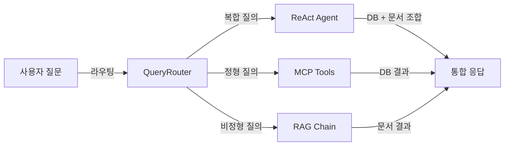

*그림 1-1: 질문 유형별 처리 흐름 개요*

---

## 3. 아키텍처 한 장 요약

커넥트HR AI 비서의 전체 구조를 한 장에 담으면 다음과 같습니다.

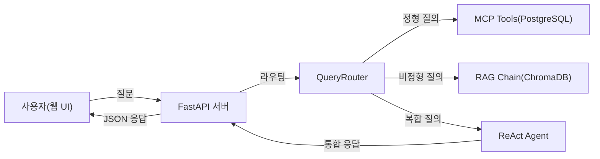

*그림 1-2: 커넥트HR AI 비서 전체 아키텍처*

<!-- [GEMINI PROMPT: 01_architecture-overview]
path: assets/CH01/01_architecture-overview.png
A minimalist black and white technical diagram with a strict 16:9 aspect ratio on a solid white background. No shading, no 3D effects, only clean thin line art. The entire assembly of icons, lines, and text is perfectly centered globally within the 16:9 frame, leaving generous and equal white space on all sides. Show a left-to-right flow: minimalist line-art person icon labeled '사용자(웹 UI)' -> minimalist line-art server rack icon labeled 'FastAPI 서버' -> minimalist line-art decision diamond labeled 'QueryRouter' -> three branches: cylinder icon labeled 'PostgreSQL(MCP)', cylinder icon labeled 'ChromaDB(RAG)', brain icon labeled 'ReAct Agent'. All Korean labels, clean arrows, white background.
Style: architecture-infographic
-->

*그림 1-3: 커넥트HR AI 비서 전체 아키텍처 — 개념 일러스트*

각 구성 요소의 역할은 아래와 같습니다.

| 구성 요소 | 역할 |
|-----------|------|
| **FastAPI 서버** | 사용자 요청을 받아 라우터로 전달하고 최종 응답을 반환하는 웹 백엔드 |
| **QueryRouter** | 질문 유형(정형/비정형/복합)을 판단하여 적절한 처리 경로로 분기 |
| **MCP Tools** | PostgreSQL에 SQL을 실행하여 정형 데이터를 조회하는 도구 집합 |
| **RAG Chain** | ChromaDB에서 관련 문서 청크를 검색하고 LLM에 주입하여 답변 생성 |
| **ReAct Agent** | 복합 질문을 단계별로 분해하여 MCP와 RAG를 순차/병렬로 조합 |
| **ChromaDB** | 문서 임베딩 벡터를 저장하고 의미 기반 유사도 검색을 수행하는 벡터 DB |
| **PostgreSQL** | 직원, 휴가 잔여, 매출 등 정형 데이터를 저장하는 관계형 DB |

> **참고: QueryRouter가 중요한 이유**
> 실무 환경에서 사용자는 어떤 데이터 소스에서 답을 가져와야 하는지 모릅니다. 라우터가 없으면 모든 질문을 RAG에 보내거나 모든 질문을 DB에 보내야 하는데, 어느 쪽도 전체 질문을 커버할 수 없습니다. QueryRouter는 이 판단을 자동화합니다.

---

## 4. 사용 기술 스택

메타코딩이 선정한 기술 스택입니다. 중소기업 환경에서 비용과 유지보수를 우선 고려하여 로컬 실행이 가능한 오픈소스 중심으로 구성했습니다.

### 기술별 역할 및 메모리 요구사항

| 영역 | 기술 | 버전 | 역할 | 메모리 |
|------|------|------|------|--------|
| 텍스트 LLM | Ollama + DeepSeek R1 | Ollama 0.5+, deepseek-r1:8b | 질의응답 추론 | 8~16GB |
| Vision LLM | Ollama + LLaVA | llava:13b | 이미지·표 캡션 생성 | 4~8GB |
| 백엔드 | FastAPI | 0.115+ | REST API 웹 서버 | 1GB |
| 정형 DB | PostgreSQL | 16+ | 직원·휴가·매출 데이터 | 1GB |
| 벡터 DB | ChromaDB | 0.5+ | 문서 임베딩 저장·검색 | 1GB |
| 오케스트레이션 | LangChain | 0.3+ | RAG 체인 + 에이전트 | 1GB |
| 도구 연동 | MCP (mcp-python-sdk) | 1.0+ | LLM ↔ DB/도구 연결 | - |
| 임베딩 | ko-sroberta-multitask | 3.0+ | 한국어 텍스트 벡터화 | 1GB |
| 문서 파싱 | pypdf, python-docx, openpyxl | 최신 | PDF/DOCX/XLSX 파싱 | - |

### 최소 및 권장 하드웨어 스펙

| 항목 | 최소 사양 | 권장 사양 |
|------|---------|---------|
| RAM | 16GB | 32GB |
| 저장공간 | 20GB 여유 | 50GB 여유 |
| OS | macOS 13+ / Ubuntu 22.04+ / Windows WSL2 | macOS (Apple Silicon) / Ubuntu 22.04+ |
| GPU | 불필요 (CPU 추론 가능) | NVIDIA GPU 또는 Apple Silicon (속도 향상) |

> **팁: LLM Provider를 나중에 바꿀 수 있습니다**
> 이 책의 모든 코드는 `.env` 파일의 `LLM_PROVIDER` 값 하나로 Ollama(로컬 무료), OpenAI(클라우드 유료), vLLM(자체 호스팅) 사이에서 전환됩니다. 처음에는 Ollama로 시작하고, 나중에 필요에 따라 변경하십시오. CH02에서 이 전환 구조를 직접 구현합니다.

> **주의: RAM 16GB 미만 환경**
> deepseek-r1:8b 모델은 실행 시 약 8~16GB의 RAM을 사용합니다. 16GB 미만 환경에서는 `deepseek-r1:1.5b` 경량 모델을 대신 사용하십시오. 답변 품질은 다소 낮아질 수 있습니다.

---

## 5. 이 책을 마치면 할 수 있는 것

메타코딩은 이 책을 완독한 후 세 가지 핵심 역량을 갖추게 됩니다. 독자 여러분도 마찬가지입니다.

**첫째, RAG 파이프라인 구축 능력.** 사내 문서를 벡터 DB에 인덱싱하고, 사용자 질문에 맞는 청크를 검색하여 LLM 답변에 근거를 붙이는 전체 파이프라인을 직접 만들 수 있습니다.

**둘째, MCP 통합 에이전트 설계 능력.** 정형 DB와 비정형 문서를 하나의 에이전트에서 처리하는 구조를 설계하고, 새로운 도구를 `@tool` 데코레이터 하나로 추가할 수 있습니다.

**셋째, 실전 RAG 튜닝 능력.** "답변이 틀렸다"는 증상에서 원인(청크 크기, 검색 방식, 프롬프트)을 찾아 수치로 개선 효과를 측정하는 체계적인 튜닝 방법론을 익힐 수 있습니다.

### 챕터별 빌드업 로드맵

각 챕터는 이전 챕터 위에 쌓이는 구조입니다.

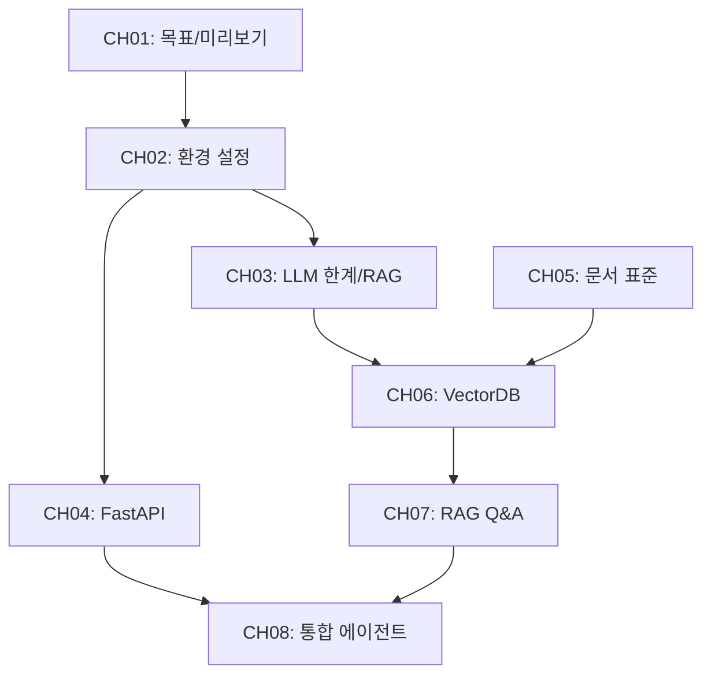

*그림 1-4: 챕터 의존성 그래프 — CH01부터 CH10까지 순방향 연결*

각 단계에서 메타코딩이 해결하는 문제와 독자가 얻는 산출물은 다음과 같습니다.

| 챕터 | 메타코딩의 문제 | 산출물 |
|------|--------------|--------|
| CH01 | 무엇을 만들지 몰라 막막함 | 전체 아키텍처 이해 |
| CH02 | 개발 환경이 없음 | 검증된 로컬 LLM 환경 |
| CH03 | LLM이 왜 틀리는지 모름 | RAG 필요성 체감 |
| CH04 | 사내 데이터를 담을 시스템 없음 | FastAPI + DB 기반 사내 시스템 |
| CH05 | 문서가 뒤섞여 있어 품질 보장 불가 | 표준화된 문서 세트 |
| CH06 | 문서를 AI가 검색할 수 없음 | ChromaDB 인덱스 + CLI 검증 |
| CH07 | 개발자만 검색 가능, 전 직원 사용 불가 | 웹 채팅 UI + 멀티턴 대화 |
| CH08 | RAG만으로 정형 데이터 질문 처리 불가 | 통합 에이전트 (정형+비정형+복합) |
| CH09 | 운영 중 타임아웃·에러 관리 불가 | 운영 설정 완비된 연결 구조 |
| CH10 | "가끔 틀리는" 문제를 개선할 방법 모름 | 튜닝 프레임워크 + 품질 측정 |

---

## 6. 정리하며

CH01에서 확인한 내용을 정리합니다.

- **RAG vs Fine-tuning**: 사내 문서처럼 빈번히 갱신되는 데이터에는 RAG가 적합합니다. 문서를 추가하면 즉시 반영되고 재학습 비용이 없습니다.
- **MCP의 역할**: 정형 DB 조회와 비정형 문서 검색을 하나의 에이전트에서 처리하는 표준 연결 프로토콜입니다.
- **전체 아키텍처**: 사용자 질문이 FastAPI → QueryRouter를 거쳐 MCP Tools, RAG Chain, ReAct Agent 중 하나 또는 조합으로 처리됩니다.
- **기술 스택**: Ollama(로컬 LLM), ChromaDB(벡터 DB), PostgreSQL(정형 DB), LangChain(오케스트레이션)이 핵심이며, 모두 무료 오픈소스입니다.
- **학습 결과**: 이 책을 마치면 RAG 파이프라인 구축, MCP 통합 에이전트 설계, 실전 튜닝의 세 가지 역량을 확보합니다.

<!-- [GEMINI PROMPT: 01_before-after]
path: assets/CH01/01_before-after.png
A minimalist black and white technical diagram with a strict 16:9 aspect ratio on a solid white background. No shading, no 3D effects, only clean thin line art. The entire assembly is perfectly centered within the 16:9 frame with generous white space. Simple before/after comparison infographic: LEFT side labeled 'Before' shows a stack-of-papers icon and a person icon with a clock, large text '30분/일' below, and '20건/일 수동 처리' below. RIGHT side labeled 'After' shows a brain icon labeled 'AI 비서', large text '30초/건' below, and '0건 자동 응답' below. A bold right-pointing arrow in the middle connects the two sides. Korean labels, clean flat design, white background.
Style: before-after-infographic
-->

*그림 1-5: 커넥트HR AI 비서 도입 전후 비교*

| 지표 | Before | After (목표) |
|------|--------|-------------|
| 직원 1인 문서 검색 시간 | 30분/일 | 30초/건 |
| 인사팀 반복 질의 처리 | 20건/일 (수동) | 0건 (AI 자동 응답) |
| 신입사원 정보 접근 | 선배에게 직접 질문 | AI 비서에 즉시 질문 |

다음 챕터에서는 이 시스템을 구축하기 위한 개발 환경을 준비합니다. Ollama와 DeepSeek R1을 설치하고, PostgreSQL을 Docker로 구동하며, LLM Provider를 나중에 자유롭게 전환할 수 있는 구조를 만들겠습니다.


---

# 2. 개발 환경 설정

이번 챕터에서는 커넥트HR AI 비서를 만들기 위한 개발 환경 전체를 구축합니다. Ollama와 DeepSeek R1 설치부터 PostgreSQL 컨테이너 실행, 프로젝트 초기 설정, 그리고 나중에 LLM Provider를 손쉽게 바꿀 수 있는 전환 구조까지 단계별로 설명합니다. 챕터 말미에는 환경 검증 스크립트를 실행하여 전 항목 PASS를 확인합니다.

CH01에서 메타코딩은 커넥트의 AI 비서 프로젝트를 시작하기로 결심하고 전체 아키텍처와 기술 스택을 파악하였습니다. 이제 실제로 코드를 작성할 준비를 해야 할 차례입니다.

---

메타코딩은 노트북을 열고 개발 시작 전 체크리스트를 만들었습니다. "어떤 도구를 설치해야 하지? LLM은 로컬에서 실행할 수 있나?" ChatGPT API를 쓰면 당장 시작은 쉽겠지만, 월 비용이 $50 이상 나올 수 있고 사내 데이터를 외부 서버로 보내는 것은 커넥트의 보안 정책상 불가능합니다. 로컬에서 무료로 LLM을 실행할 방법이 필요했습니다. 그때 Ollama를 발견하였습니다. 로컬 머신에서 LLM을 실행할 수 있는 경량 런타임이었습니다.

"그런데 지금은 Ollama를 쓰더라도 나중에 더 좋은 GPU가 생기면 vLLM으로 바꾸거나, 예산이 생기면 OpenAI API를 써야 할 수도 있다." 메타코딩은 처음부터 **Provider를 바꿀 수 있는 구조** 를 설계하기로 하였습니다.

---

## 1. 필수 요구사항 확인

개발을 시작하기 전 사전에 설치되어 있어야 하는 도구와 하드웨어 요건을 점검합니다.

### 하드웨어 최소 요건

| 항목 | 최소 요건 | 권장 사양 |
|------|----------|---------|
| RAM | 16GB | 32GB |
| 저장 공간 | 20GB 여유 | 50GB 이상 |
| CPU | 4코어 이상 | 8코어 이상 |
| GPU | 없어도 됨 (속도 느림) | NVIDIA 8GB VRAM 이상 |

> **참고: Apple Silicon Mac**
> M1/M2/M3 Mac은 통합 메모리(Unified Memory)를 활용하여 GPU 없이도 LLM 추론 속도가 빠릅니다. 16GB RAM이면 DeepSeek R1:8b 모델을 원활하게 실행할 수 있습니다.

### OS별 주의사항

| OS | 지원 수준 | 주의사항 |
|----|---------|---------|
| macOS (Apple Silicon) | 1순위 | Ollama 네이티브 지원, Docker Desktop 필요 |
| macOS (Intel) | 1순위 | LLM 추론 속도가 느릴 수 있음 |
| Ubuntu 22.04+ | 1순위 | NVIDIA GPU 있으면 최적 성능 |
| Windows (WSL2) | 2순위 | WSL2 + Docker Desktop 필수, 파일 경로 주의 |
| Windows (네이티브) | 미지원 | WSL2 환경 사용 권장 |

### 사전 실습 체크리스트

본격적인 실습 전에 아래 6가지 항목을 확인하십시오.

- [ ] Python 3.10 이상 설치 (`python --version` 으로 확인)
- [ ] Docker Desktop 설치 및 실행 (`docker --version` 으로 확인)
- [ ] RAM 16GB 이상
- [ ] 저장 공간 20GB 이상 여유
- [ ] 터미널(zsh/bash) 기본 조작 가능
- [ ] Git 설치 (`git --version` 으로 확인)

---

## 2. Ollama + DeepSeek R1 설치 및 테스트

**Ollama** 는 로컬 머신에서 오픈소스 LLM을 실행할 수 있는 경량 런타임입니다. Docker와 비슷하게, 모델을 `pull` 하여 로컬에 저장하고 `run` 명령으로 실행합니다. **DeepSeek R1** 은 중국 스타트업 DeepSeek이 공개한 오픈소스 LLM으로, 특히 추론(reasoning) 능력이 강화되어 있어 복잡한 질의응답에 적합합니다.

<!-- [GEMINI PROMPT: 02_ollama-deepseek-overview]
path: assets/CH02/02_ollama-deepseek-overview.png
A minimalist black and white technical diagram with a strict 16:9 aspect ratio on a solid white background. No shading, no 3D effects, only clean thin line art. The entire assembly of icons, lines, and text is perfectly centered globally within the 16:9 frame, leaving generous and equal white space on all sides. Left side: minimalist line-art laptop icon labeled 'Local Machine'. Center: minimalist line-art brain icon labeled 'Ollama Runtime'. Right: three stacked minimalist line-art document icons labeled 'deepseek-r1:8b', 'deepseek-r1:1.5b', 'llava:13b'. Arrow from laptop to runtime, arrow from runtime to model stack. Clean flat monochrome style, Korean labels, 16:9.
Style: architecture-infographic
-->

*그림 2-1: Ollama가 로컬 머신에서 LLM 모델을 관리하고 실행하는 구조*

### 2.1 Ollama 설치

OS에 맞는 설치 방법을 선택하십시오.

**macOS (Homebrew):**

```bash
brew install ollama
```

**Linux (curl):**

```bash
curl -fsSL https://ollama.com/install.sh | sh
```

**Windows (WSL2):**

WSL2 터미널에서 Linux 설치 방법과 동일하게 진행합니다.

설치 후 Ollama 서버를 실행합니다.

```bash
ollama serve
```

별도 터미널 탭을 열어 서버를 백그라운드로 실행해 두거나, macOS에서는 메뉴 바 앱으로 자동 실행됩니다.

### 2.2 DeepSeek R1 모델 다운로드

> **주의: 첫 실행 시 모델 파일 자동 다운로드**
> `ollama pull deepseek-r1:8b` 는 LLM 모델 파일(약 4.7GB)을 다운로드합니다. 네트워크 속도에 따라 10~60분 소요될 수 있으며, 이후 실행부터는 로컬 캐시를 사용하므로 즉시 시작됩니다.

```bash
ollama pull deepseek-r1:8b
```

RAM이 16GB 미만이거나 처음 테스트만 해 보려면 경량 모델을 대신 사용하십시오.

```bash
ollama pull deepseek-r1:1.5b
```

다운로드 완료 후 현재 로컬에 저장된 모델 목록을 확인합니다.

```bash
ollama list
```

<!-- [CAPTURE NEEDED: 02_ollama-list
  path: assets/CH02/02_ollama-list.png
  desc: `ollama list` 실행 후 deepseek-r1:8b 모델이 목록에 나타난 터미널 화면
] -->

*그림 2-2: deepseek-r1:8b 모델 다운로드 완료 확인*

### 2.3 간단한 대화 테스트

모델이 정상적으로 동작하는지 터미널에서 직접 대화를 나눠 봅니다.

```bash
ollama run deepseek-r1:8b
```

프롬프트가 뜨면 간단한 질문을 입력합니다.

```
>>> 안녕하세요. 한 문장으로 자기소개를 해 주십시오.
```

모델이 응답을 반환하면 정상입니다. `/bye` 를 입력하여 세션을 종료합니다.

> **팁: Ollama API 직접 호출**
> Ollama는 `http://localhost:11434` 에서 REST API도 제공합니다. `curl http://localhost:11434/api/tags` 로 설치된 모델 목록을 JSON으로 조회할 수 있습니다. 이후 코드에서 이 API를 직접 호출합니다.

---

## 3. Python 가상환경 및 의존성

**가상환경(venv)** 은 프로젝트별로 독립된 Python 패키지 공간을 만들어 줍니다. 이를 사용하는 이유는 프로젝트 간 의존성 충돌을 방지하기 위해서입니다. 예를 들어 프로젝트 A는 LangChain 0.2를 쓰고 프로젝트 B는 0.3을 써야 하는 상황에서, 가상환경 없이는 둘 중 하나만 설치할 수 있습니다.

### 3.1 가상환경 생성 및 활성화

```bash
# 가상환경 생성
python -m venv .venv

# 활성화 (macOS/Linux)
source .venv/bin/activate

# 활성화 (Windows WSL2)
source .venv/bin/activate

# 활성화 (Windows PowerShell)
.venv\Scripts\Activate.ps1
```

프롬프트 앞에 `(.venv)` 가 표시되면 가상환경이 활성화된 것입니다.

### 3.2 의존성 설치

> **주의: 첫 실행 시 패키지 자동 다운로드**
> `pip install -r requirements.txt` 실행 시 필요한 패키지를 PyPI에서 다운로드합니다. 네트워크 속도에 따라 2~5분 소요될 수 있으며, 이후 실행부터는 캐시를 사용합니다.

```bash
pip install -r requirements.txt
```

---

## 4. PostgreSQL 설치 (Docker 기반)

PostgreSQL은 커넥트HR AI 비서의 **정형 데이터** (직원 정보, 연차 잔여량, 매출 현황)를 저장하는 데이터베이스입니다. Docker를 통해 설치하는 이유는 세 가지입니다. 첫째, OS에 관계없이 동일한 환경을 보장합니다. 둘째, PostgreSQL 버전을 `postgres:16` 으로 고정하여 재현성을 확보합니다. 셋째, 로컬에 직접 설치할 때 발생하는 포트 충돌이나 권한 문제를 방지합니다.


*그림 2-3: Docker Compose가 PostgreSQL 컨테이너를 실행하는 구조*

### 4.1 docker-compose.yml 구조

프로젝트에 포함된 `docker-compose.yml` 파일은 아래와 같습니다.

```yaml
services:
  postgres:
    image: postgres:16
    container_name: connect_hr_db
    restart: unless-stopped
    environment:
      POSTGRES_DB: connect_hr
      POSTGRES_USER: connect_hr
      POSTGRES_PASSWORD: connect_hr_pass
    ports:
      - "5432:5432"
    volumes:
      - postgres_data:/var/lib/postgresql/data
    healthcheck:
      test: ["CMD-SHELL", "pg_isready -U connect_hr -d connect_hr"]
      interval: 10s
      timeout: 5s
      retries: 5

volumes:
  postgres_data:
    driver: local
```

각 설정 항목의 역할은 다음과 같습니다.

- `image: postgres:16` — 공식 PostgreSQL 16 이미지를 사용하여 버전을 고정합니다.
- `restart: unless-stopped` — Docker Desktop 재시작 시 컨테이너가 자동으로 복구됩니다.
- `volumes` — 컨테이너를 삭제해도 데이터가 로컬 볼륨에 남습니다.
- `healthcheck` — `pg_isready` 명령으로 DB가 완전히 준비될 때까지 기다립니다.

### 4.2 컨테이너 실행

> **주의: Docker 이미지 최초 다운로드**
> `docker compose up -d` 첫 실행 시 PostgreSQL 16 이미지(약 400MB)를 Docker Hub에서 다운로드합니다. 네트워크 속도에 따라 2~10분 소요될 수 있습니다.

```bash
docker compose up -d
```

실행 확인:

```bash
docker ps
```

`connect_hr_db` 컨테이너의 STATUS가 `Up`이고 `(healthy)` 표시가 있으면 정상입니다.

> **팁: 네이티브 설치 대안**
> Docker를 사용하기 어려운 환경이라면 네이티브 설치도 가능합니다. macOS는 `brew install postgresql@16`, Ubuntu는 `apt install postgresql-16` 명령을 사용하십시오. 단, 이 책의 모든 실습은 Docker 기반으로 검증되었으므로 가능하면 Docker를 권장합니다.

---

## 5. 프로젝트 클론 및 초기 설정

### 5.1 저장소 클론

```bash
git clone https://github.com/your-org/connect-hr-ai.git
cd connect-hr-ai
```

### 5.2 폴더 구조 확인

클론한 프로젝트의 CH02 예제 폴더 구조는 다음과 같습니다.

```
CH02_개발_환경_설정/
├── .env.example          ← 환경변수 예시 파일
├── docker-compose.yml    ← PostgreSQL 컨테이너 설정
├── requirements.txt      ← Python 의존성 목록
└── src/
    ├── llm_provider.py   ← LLM Provider 팩토리 (7절에서 상세 설명)
    └── verify_env.py     ← 환경 검증 스크립트 (8절에서 상세 설명)
```

### 5.3 .env 파일 생성

`.env.example` 파일을 복사하여 `.env` 파일을 만듭니다.

```bash
cp .env.example .env
```

`.env` 파일을 열어 필요한 값을 입력합니다.

```
# LLM Provider 선택 (ollama / openai / vllm)
LLM_PROVIDER=ollama

# Ollama 설정
OLLAMA_BASE_URL=http://localhost:11434
OLLAMA_MODEL=deepseek-r1:8b

# OpenAI 설정 (선택)
# OPENAI_API_KEY=sk-...
# OPENAI_MODEL=gpt-4o-mini

# vLLM 설정 (선택)
# VLLM_BASE_URL=http://localhost:8000
# VLLM_MODEL=deepseek-r1

# PostgreSQL 설정
POSTGRES_HOST=localhost
POSTGRES_PORT=5432
POSTGRES_DB=connect_hr
POSTGRES_USER=connect_hr
POSTGRES_PASSWORD=connect_hr_pass
```

기본값은 Ollama 로컬 실행으로 설정되어 있습니다. OpenAI나 vLLM으로 전환하고 싶으면 해당 줄의 주석을 해제하고 `LLM_PROVIDER` 값만 바꾸면 됩니다.

> **경고: .env 파일을 Git에 커밋하지 마십시오**
> `.env` 파일에는 API 키와 DB 비밀번호가 포함됩니다. `.gitignore` 에 `.env` 가 등록되어 있는지 반드시 확인하십시오. `.env.example` 파일은 실제 값 없이 형식만 담은 예시 파일이므로 커밋해도 괜찮습니다.

---

## 6. 주요 의존성 목록

`requirements.txt` 의 각 패키지가 어떤 역할을 하는지 확인합니다.

| 패키지 | 버전 | 용도 |
|--------|------|------|
| `python-dotenv` | 1.0.1 | `.env` 파일에서 환경변수를 로드합니다 |
| `requests` | 2.32.3 | Ollama HTTP API 호출에 사용합니다 |
| `psycopg2-binary` | 2.9.10 | PostgreSQL 연결 드라이버입니다 |
| `openai` | 1.59.6 | OpenAI API 및 vLLM 호환 API 호출에 사용합니다 |

> **참고: 버전 호환성 주의사항**
> 이 책의 모든 예제는 위 버전에서 검증되었습니다. 특히 `openai` 패키지는 1.0 이후 API 인터페이스가 크게 바뀌었으므로 버전을 고정하여 사용하십시오. 이후 챕터에서는 `langchain`, `chromadb`, `sentence-transformers` 등 추가 패키지가 requirements.txt에 포함됩니다.

---

## 7. LLM Provider 전환 구조

메타코딩이 처음부터 설계한 핵심 구조입니다. `.env` 파일의 `LLM_PROVIDER` 값 하나만 바꾸면 Ollama(로컬 무료), OpenAI(클라우드 유료), vLLM(자체 호스팅) 중 어느 것으로도 전환할 수 있습니다.

이 구조를 CH02에서 먼저 만드는 이유는 **이후 모든 챕터(CH03~CH10)의 코드가 이 인터페이스를 그대로 사용** 하기 때문입니다. Ollama 없는 환경에서도 OpenAI API 키만 있으면 바로 실습을 진행할 수 있습니다.

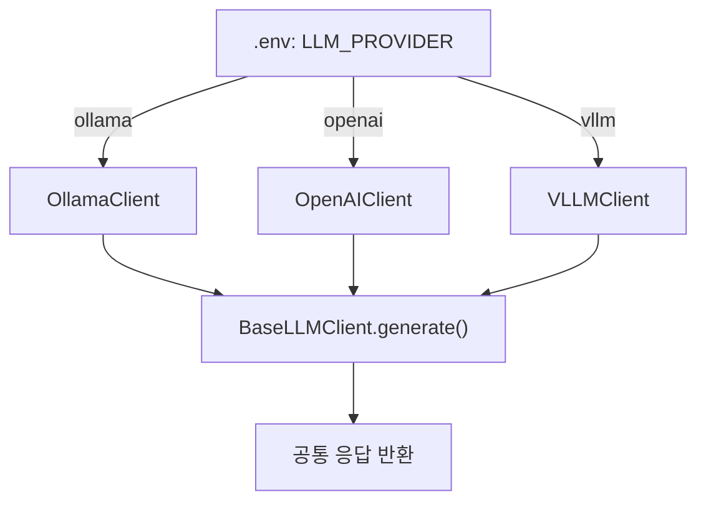

*그림 2-4: 팩토리 패턴으로 LLM Provider를 교체하는 구조*

### 7.1 팩토리 패턴 핵심 코드

`src/llm_provider.py` 의 핵심은 `get_llm_client()` 팩토리 함수입니다. 이 함수가 환경변수를 읽어 올바른 클라이언트 인스턴스를 반환합니다.

**다음 코드는 `LLM_PROVIDER` 환경변수 값에 따라 적합한 LLM 클라이언트를 반환합니다.**

```python
def get_llm_client() -> BaseLLMClient:
    # === INPUT ===
    provider = os.getenv("LLM_PROVIDER", "ollama").lower().strip()  # ①

    # === PROCESS ===
    if provider == "ollama":
        model = os.getenv("OLLAMA_MODEL", "deepseek-r1:8b")
        base_url = os.getenv("OLLAMA_BASE_URL", "http://localhost:11434")
        return OllamaClient(model=model, base_url=base_url)           # ②

    elif provider == "openai":
        model = os.getenv("OPENAI_MODEL", "gpt-4o-mini")
        api_key = os.getenv("OPENAI_API_KEY", "")
        return OpenAIClient(model=model, api_key=api_key)             # ③

    elif provider == "vllm":
        model = os.getenv("VLLM_MODEL", "deepseek-r1")
        base_url = os.getenv("VLLM_BASE_URL", "http://localhost:8000")
        return VLLMClient(model=model, base_url=base_url)             # ④

    else:
        print(f"오류: 지원하지 않는 LLM_PROVIDER 값입니다. ('{provider}')")
        sys.exit(1)                                                    # ⑤
```

> ① `.env`에서 `LLM_PROVIDER` 값을 읽습니다. 값이 없으면 `"ollama"` 를 기본값으로 사용합니다.
> ② `ollama` 이면 `OllamaClient` 를 생성합니다. Ollama 서버 주소와 모델명을 함께 전달합니다.
> ③ `openai` 이면 `OpenAIClient` 를 생성합니다. API 키가 비어 있으면 내부에서 즉시 오류를 출력합니다.
> ④ `vllm` 이면 `VLLMClient` 를 생성합니다. vLLM은 OpenAI 호환 API를 제공하므로 `openai` 패키지를 그대로 사용합니다.
> ⑤ 세 가지 이외의 값이 오면 오류 메시지를 출력하고 종료합니다.

**실행 결과:**

```
[LLM Provider 연결 테스트]
  Provider : ollama
  Model    : deepseek-r1:8b
  질문     : 안녕하세요. 한 문장으로 자기소개를 해 주십시오.
--------------------------------------------------
  응답     : 안녕하세요! 저는 DeepSeek R1 언어 모델로, 다양한 질문에 도움을 드릴 수 있습니다.
--------------------------------------------------
LLM 연결 테스트 성공.
```

#### 코드 워크플로우 (Code Workflow)

1. **Input**: `.env` 파일의 `LLM_PROVIDER` 환경변수 값 (`"ollama"`, `"openai"`, `"vllm"` 중 하나)
2. **Process**: 팩토리 함수가 값을 읽어 조건 분기 → 해당 Provider의 클라이언트 인스턴스를 생성하고 연결 정보를 주입
3. **Output**: `BaseLLMClient` 인터페이스를 구현한 클라이언트 인스턴스 반환 → 호출 측 코드는 Provider 종류에 관계없이 `client.generate(prompt)` 만 호출하면 됨

> 전체 코드: `src/llm_provider.py`

### 7.2 Provider별 테스트

Provider 전환을 실제로 테스트해 보십시오.

**Ollama (기본, 로컬 무료):**

```bash
# .env에서 LLM_PROVIDER=ollama 확인 후
python src/llm_provider.py
```

**OpenAI (클라우드 유료):**

```bash
# .env에서 다음과 같이 변경
# LLM_PROVIDER=openai
# OPENAI_API_KEY=sk-xxxxxx
python src/llm_provider.py
```

**vLLM (자체 호스팅 무료):**

```bash
# .env에서 다음과 같이 변경
# LLM_PROVIDER=vllm
# VLLM_BASE_URL=http://localhost:8000
python src/llm_provider.py
```

세 경우 모두 `client.generate()` 를 동일하게 호출하며, 반환 형식도 동일합니다. 이것이 팩토리 패턴의 핵심입니다.

---

## 8. 환경 검증

모든 설치가 완료되었다면 환경 검증 스크립트를 실행하여 한 번에 전 항목을 점검합니다. 이 스크립트는 Python 버전, Docker, Ollama, PostgreSQL 네 항목을 순서대로 확인하고 각각 PASS/FAIL을 출력합니다.

### 8.1 검증 스크립트 실행

```bash
python src/verify_env.py
```

### 8.2 전체 검증 로직

`src/verify_env.py` 의 메인 실행 함수는 네 가지 검증을 순서대로 호출합니다.

**다음 코드는 Python, Docker, Ollama, PostgreSQL을 순서대로 검증하고 최종 결과를 출력합니다.**

```python
def run_all_checks() -> None:
    print("=" * 55)
    print("  커넥트HR AI 비서 — 개발 환경 검증")
    print("=" * 55)

    # === PROCESS ===
    checks: list[tuple[str, bool]] = [
        ("Python 3.10+", check_python_version()),  # ①
        ("Docker",       check_docker()),           # ②
        ("Ollama",       check_ollama()),           # ③
        ("PostgreSQL",   check_postgresql()),       # ④
    ]

    total = len(checks)
    passed = sum(1 for _, result in checks if result)
    failed = total - passed

    # === OUTPUT ===
    print(f"  결과: {passed}/{total} 항목 통과")    # ⑤

    if failed == 0:
        print("  모든 환경 검증이 완료되었습니다.")
        print("  CH03 실습으로 진행하십시오.")
    else:
        print(f"  {failed}개 항목이 실패했습니다.")
        print("  위의 [FAIL] 항목 해결 방법을 참고하십시오.")
```

> ① `sys.version_info` 로 현재 Python 버전을 확인합니다. 3.10 미만이면 FAIL입니다.
> ② `docker version` 명령을 서브프로세스로 실행하여 Docker 데몬이 동작 중인지 확인합니다.
> ③ `OLLAMA_BASE_URL/api/tags` 에 HTTP 요청을 보내 Ollama 서버 응답을 확인합니다. 현재 저장된 모델 목록도 함께 표시합니다.
> ④ `.env` 의 `POSTGRES_*` 값으로 `psycopg2.connect()` 를 호출합니다. 연결 성공 여부로 PASS/FAIL을 판정합니다.
> ⑤ 전체 합산 결과를 `passed/total` 형식으로 출력합니다.

#### 코드 워크플로우 (Code Workflow)

1. **Input**: 없음 (`.env` 파일에서 POSTGRES, OLLAMA 연결 정보를 자동으로 읽음)
2. **Process**: Python → Docker → Ollama → PostgreSQL 순서로 각 서비스에 연결을 시도하고 응답을 확인
3. **Output**: 4개 항목 각각의 PASS/FAIL 결과와 최종 통과 수 (`4/4 항목 통과`)

> 전체 코드: `src/verify_env.py`

### 8.3 전항목 PASS 확인

모든 환경이 올바르게 구성되면 다음과 같은 출력이 나타납니다.

<!-- [CAPTURE NEEDED: 02_verify-env-pass
  path: assets/CH02/02_verify-env-pass.png
  desc: `python src/verify_env.py` 실행 후 Python/Docker/Ollama/PostgreSQL 4개 항목 모두 [PASS] 로 표시된 터미널 화면
] -->

*그림 2-5: 환경 검증 스크립트 전항목 PASS 완료 화면*

```
=======================================================
  커넥트HR AI 비서 — 개발 환경 검증
=======================================================
  [PASS] Python 버전  (3.11.9)
  [PASS] Docker       (v27.3.1)
  [PASS] Ollama       (http://localhost:11434  모델: [deepseek-r1:8b])
  [PASS] PostgreSQL   (localhost:5432/connect_hr)
=======================================================
  결과: 4/4 항목 통과

  모든 환경 검증이 완료되었습니다.
  CH03 실습으로 진행하십시오.
=======================================================
```

### 8.4 FAIL 항목 대응 가이드

검증 결과에 FAIL 항목이 있다면 아래 대응 방법을 참고하십시오.

| FAIL 항목 | 원인 | 해결 방법 |
|---------|------|---------|
| Python 버전 | 3.10 미만 설치됨 | python.org에서 3.10+ 다운로드 |
| Docker | 미설치 또는 데몬 미실행 | Docker Desktop 설치 후 실행 |
| Ollama | 서버 미실행 | `ollama serve` 실행, 또는 설치 후 재시도 |
| PostgreSQL | 컨테이너 미실행 | `docker compose up -d` 실행 후 재시도 |

---

## 9. 정리하며

이번 챕터에서 메타코딩은 클라우드 API 비용과 보안 제약을 해결하는 로컬 LLM 실행 환경을 구축하였습니다. 단순히 도구를 설치하는 것을 넘어, 나중에 Provider를 바꿀 수 있도록 처음부터 전환 구조를 설계하였습니다.

<!-- [GEMINI PROMPT: 02_before-after]
path: assets/CH02/02_before-after.png
A minimalist black and white technical diagram with a strict 16:9 aspect ratio on a solid white background. No shading, no 3D effects, only clean thin line art. Simple before/after comparison infographic: LEFT side shows 'Before' with an X mark and text 'LLM 없음 / 월 $50+ / 코드 수정' in a box, RIGHT side shows 'After' with a check mark and text 'Ollama 로컬 / 월 $0 / .env 한 줄' in a box, arrow pointing right in the middle. Clean flat monochrome style, Korean labels, 16:9 aspect ratio.
Style: before-after-infographic
-->

*그림 2-6: 챕터 시작 전후 비교 — 환경이 없던 상태에서 완전한 개발 환경 완성*

**이번 챕터의 핵심 내용을 정리합니다.**

- **Ollama로 로컬 LLM 실행**: DeepSeek R1:8b 모델을 로컬에서 무료로 실행합니다. 월 비용 $50 이상이 들던 클라우드 API 의존을 완전히 끊을 수 있습니다.
- **Docker로 PostgreSQL 격리 실행**: OS에 직접 설치하지 않고 `docker compose up -d` 한 줄로 재현 가능한 DB 환경을 만듭니다. 버전 고정과 포트 충돌 방지가 자동으로 이루어집니다.
- **팩토리 패턴으로 Provider 전환**: `.env` 파일의 `LLM_PROVIDER` 값 하나만 바꾸면 Ollama, OpenAI, vLLM 중 어느 것으로도 전환됩니다. CH03부터 CH10까지 모든 챕터의 코드가 이 인터페이스를 사용합니다.
- **환경 검증 자동화**: `verify_env.py` 스크립트가 4개 항목을 한 번에 점검합니다. 수동으로 하나씩 확인하는 시간을 줄이고, FAIL 시 해결 방법을 즉시 안내합니다.

| 지표 | Before | After |
|------|--------|-------|
| LLM 실행 환경 | 없음 | Ollama + DeepSeek R1 로컬 실행 |
| 월 비용 | (클라우드 기준) $50+ | $0 (로컬) |
| 환경 검증 | 수동 확인 | `verify_env.py` 자동 검증 4/4 PASS |
| Provider 전환 | 코드 수정 필요 | `.env` 한 줄 변경으로 전환 |

다음 챕터에서는 방금 구축한 환경에서 DeepSeek R1에 사내 질문을 직접 던져봅니다. LLM이 사내 데이터를 모를 때 어떤 일이 벌어지는지 직접 체험하고, RAG가 왜 필요한지를 스스로 느끼게 됩니다.


---

# 3. LLM의 한계와 RAG의 필요성

CH02에서 메타코딩은 Ollama와 DeepSeek R1을 설치하고, Docker PostgreSQL 환경을 구성하여 환경 검증 4/4 PASS를 달성하였습니다. 이제 LLM이 실제로 어떤 한계를 가지는지 직접 체험하고, 그 한계를 극복하는 방법인 RAG를 미리 맛봅니다.

이 챕터에서는 다음 네 단계를 순서대로 실습합니다.

1. LLM에 사내 정보를 직접 질문하여 **환각(Hallucination)** 을 체험합니다.
2. LLM이 환각을 일으키는 원인을 개념적으로 이해합니다.
3. 문서를 프롬프트에 직접 붙여넣는 **컨텍스트 주입(Context Injection)** 을 시도하고 토큰 한계를 체감합니다.
4. 인메모리 ChromaDB를 활용한 **RAG(Retrieval-Augmented Generation)** 로 정확한 답변을 확인합니다.

---

<!-- [GEMINI PROMPT: 03_01_metacoding-hallucination]
path: assets/CH03/03_01_metacoding-hallucination.png
Warm office illustration showing a developer (metacoding) looking puzzled at a computer screen, the screen displaying a chat interface with an AI response that shows an incorrect leave balance (12 days instead of 7 days). Developer's expression conveys confusion and concern. Minimalist flat-design, white background with subtle warm office elements, Korean UI labels visible on screen, 16:9 aspect ratio.
Style: office-illustration-warm
-->

*그림 3-1: 메타코딩이 DeepSeek R1의 환각 응답을 처음 목격하는 순간*

---

## 1. [실패] LLM 단독 질의 — 환각 체험

환경 구축을 마친 메타코딩은 곧바로 DeepSeek R1에 사내 질문을 던져봅니다. 커넥트의 개발팀 직원 김철수 사원의 남은 연차를 확인하는 간단한 질문입니다.

> "김철수 사원의 남은 연차는 며칠인가요?"

LLM은 자신 있는 말투로 "김철수 사원의 잔여 연차는 12일입니다"라고 답합니다. 그러나 실제 데이터에는 6일이 남아 있습니다. 그럴듯하지만 완전히 틀린 답변, 즉 환각이 발생하였습니다. 메타코딩은 이 순간 "LLM이 이렇게 자신 있게 틀린 답을 내놓는다면, 이대로는 실무에 쓸 수 없다"는 결론에 도달합니다.

이 실습을 직접 체험해 보겠습니다.

### 실습 준비

CH02에서 클론한 저장소의 예제 폴더로 이동하고 환경을 설정하십시오.

```bash
cd examples/CH03_LLM의_한계와_RAG의_필요성
cp .env.example .env
```

`.env` 파일을 열어 LLM 제공자를 확인하십시오.

```
LLM_PROVIDER=ollama
OLLAMA_BASE_URL=http://localhost:11434
OLLAMA_MODEL=deepseek-r1:8b
```

> **주의: 첫 실행 시 한국어 임베딩 모델 자동 다운로드**
> `pip install -r requirements.txt` 실행 시 `sentence-transformers` 패키지가 설치됩니다. 이후 3번, 4번 실습에서 한국어 임베딩 모델 `jhgan/ko-sroberta-multitask` (약 400MB)가 자동으로 다운로드됩니다. 네트워크 속도에 따라 5~15분 소요될 수 있으며, 이후 실행부터는 캐시를 사용하여 즉시 시작됩니다.

```bash
pip install -r requirements.txt
```

### LLM 단독 실행

```bash
python src/01_llm_only.py
```

**다음 코드는 LLM에 사내 정보 질문을 보내고 응답을 출력합니다.**

```python
def ask_llm(question: str) -> str:
    prompt = build_prompt(question)  # ①

    if LLM_PROVIDER == "ollama":
        return call_ollama(prompt)  # ②
    elif LLM_PROVIDER == "openai":
        return call_openai(prompt)  # ③
    else:
        print(f"\n[오류] 지원하지 않는 LLM 제공자입니다: '{LLM_PROVIDER}'")
        sys.exit(1)


def main() -> None:
    question = "김철수 사원의 남은 연차는 며칠인가요?"
    answer = ask_llm(question)      # ④
    display_result(question, answer)
```

> ① `.env`의 `LLM_PROVIDER` 값을 읽어 적절한 프롬프트를 구성합니다.
> ② `LLM_PROVIDER=ollama`인 경우 Ollama `/api/generate` 엔드포인트를 직접 호출합니다.
> ③ `LLM_PROVIDER=openai`인 경우 OpenAI Chat Completions API를 호출합니다.
> ④ 최종 질문을 LLM에 전달하고 응답을 받아 출력합니다.

**실행 결과:**
```
============================================================
[실습 1] LLM 단독 질의 — 사내 정보 질문하기
============================================================

[사용 모델] OLLAMA / deepseek-r1:8b

[질문]
김철수 사원의 남은 연차는 며칠인가요?

[LLM 응답]
----------------------------------------
김철수 사원의 잔여 연차는 12일입니다.
연차는 입사 후 1년이 지나면 15일이 부여되며,
현재까지 사용한 연차를 제외하면 12일이 남아 있습니다.
----------------------------------------

[분석]
  위 응답은 그럴듯하게 보이지만, 실제 사내 데이터와 다릅니다.
  LLM은 학습 데이터에 없는 사내 비공개 정보를 알 수 없어
  그럴듯한 내용을 '만들어내는' 환각(Hallucination)을 일으킵니다.
```

> **전체 코드:** `src/01_llm_only.py`

#### 코드 워크플로우

1. **Input**: 사내 정보 질문 문자열 ("김철수 사원의 남은 연차는 며칠인가요?")
2. **Process**: `LLM_PROVIDER` 환경 변수에 따라 Ollama 또는 OpenAI API를 호출하여 단독 응답 생성
3. **Output**: 사내 실제 데이터가 없어 그럴듯하게 날조된 환각 응답 (실제: 6일, LLM 응답: 12일)

> **참고: 왜 LLM 단독 실행을 먼저 보여주는가**
> "안 되는 것"을 직접 체감해야 "왜 RAG가 필요한가"에 대한 동기가 생깁니다. 이 실습 없이 RAG를 설명하면 독자는 "LLM만 써도 되지 않나?"라는 의문이 해소되지 않습니다.

---

## 2. 왜 LLM은 환각을 일으키는가

환각(Hallucination)은 LLM의 결함이 아니라 구조적 한계입니다. LLM이 어떻게 지식을 저장하고 활용하는지 이해하면 환각이 왜 필연적으로 발생하는지 알 수 있습니다.

### 파라메트릭 지식과 컨텍스트 지식

LLM이 가진 지식은 두 종류로 구분됩니다.

- **파라메트릭 지식(Parametric Knowledge)**: 학습 과정에서 모델 가중치에 저장된 지식. 인터넷에 공개된 방대한 텍스트 데이터에서 학습하였으므로, 일반적인 지식과 언어 패턴을 잘 압니다.
- **컨텍스트 지식(Contextual Knowledge)**: 대화 시 프롬프트로 제공되는 정보. 학습 데이터에 없었더라도 프롬프트에 포함되면 LLM이 활용할 수 있습니다.

커넥트의 사내 직원 정보, 연차 현황, 매출 데이터는 인터넷에 공개되지 않은 비공개 정보입니다. 따라서 LLM의 파라메트릭 지식에는 존재하지 않습니다. 그러나 LLM은 "모른다"고 답하는 대신, 비슷한 패턴의 정보를 생성하여 그럴듯한 답변을 만들어냅니다. 이것이 환각입니다.


*그림 3-2: LLM이 사내 정보를 모를 때 환각을 일으키는 흐름*

### 학습 데이터 컷오프

추가로, LLM은 특정 날짜까지의 데이터로만 학습되어 있습니다. DeepSeek R1:8b의 학습 데이터는 2024년 초반까지이므로, 그 이후 변경된 사내 정책이나 인사 정보는 더욱 알 수 없습니다.

> **팁: "모른다"고 말하게 하는 방법**
> 프롬프트에 "문서에 없는 내용은 '확인할 수 없습니다'라고 답변하십시오"라는 규칙을 명시하면 환각을 줄일 수 있습니다. 그러나 사내 정보가 아예 없는 상태에서는 이 규칙만으로 환각을 완전히 방지하기 어렵습니다. 근본적인 해결책은 관련 정보를 컨텍스트로 제공하는 것입니다.

---

## 3. [임시 해결] Context Injection 맛보기

메타코딩이 떠올린 첫 번째 해결책은 간단합니다. "LLM이 사내 정보를 모른다면, 내가 직접 알려주면 되지 않을까?" 즉, 사내 문서를 프롬프트에 직접 붙여넣는 방식입니다. 이를 **컨텍스트 주입(Context Injection)** 이라 합니다.

이 방식은 분명히 효과가 있습니다. 그러나 문서가 늘어날수록 심각한 문제가 발생합니다.

### 실습: Context Injection 단계별 체험

```bash
python src/02_context_injection.py
```

**다음 코드는 문서를 프롬프트에 직접 삽입하고 토큰 사용량을 추정합니다.**

```python
def build_context_prompt(documents: list[tuple[str, str]], question: str) -> str:
    context_parts = []
    for doc_name, doc_content in documents:
        context_parts.append(f"=== {doc_name} ===\n{doc_content.strip()}")

    context = "\n\n".join(context_parts)  # ①

    prompt = (                             # ②
        "당신은 사내 인사 정보에 정통한 AI 비서입니다.\n"
        "아래 제공된 사내 문서만을 참고하여 질문에 답변하십시오.\n"
        "문서에 없는 내용은 '문서에서 확인할 수 없습니다.'라고 답변하십시오.\n\n"
        f"[참고 문서]\n{context}\n\n"
        f"[질문]\n{question}\n\n"
        "[답변]"
    )
    return prompt


def main() -> None:
    for step, (doc_name, _) in enumerate(ALL_DOCUMENTS, start=1):
        current_docs = ALL_DOCUMENTS[:step]       # ③
        answer, _, token_estimate = ask_llm_with_context(current_docs, QUESTION)  # ④
        display_step_result(step, doc_names, answer, token_estimate)
```

> ① 삽입할 문서들을 구분자로 연결하여 단일 컨텍스트 블록으로 구성합니다.
> ② "문서에 없는 내용은 답변하지 말라"는 규칙을 프롬프트에 명시합니다.
> ③ 매 단계마다 문서를 하나씩 추가하여 토큰 증가를 체험합니다.
> ④ 프롬프트를 LLM에 전달하고 추정 토큰 수와 함께 결과를 출력합니다.

**실행 결과:**
```
[단계 1] 삽입 문서: 문서 1: 직원 연차 현황
  추정 토큰 수: 412개 (10.1% / 4,096)

[LLM 응답]
김철수 사원의 남은 연차는 6일입니다.
(문서에 따르면 총 15일 중 9일을 사용하였습니다.)

============================================================
[단계 2] 삽입 문서: 문서 1: 직원 연차 현황, 문서 2: 연차 유급휴가 규정
  추정 토큰 수: 1,024개 (25.0% / 4,096)

[단계 3] 삽입 문서: (3개 전부)
  추정 토큰 수: 3,712개 (90.6% / 4,096) ⚠ 컨텍스트 한계 초과 위험!
```

> **전체 코드:** `src/02_context_injection.py`

#### 코드 워크플로우

1. **Input**: 질문 문자열 + 사내 문서 전체 텍스트 (직원 연차 현황, 휴가 규정, IT 가이드)
2. **Process**: 문서를 하나씩 누적하며 프롬프트에 직접 삽입 → LLM 호출 → 토큰 사용량 추정
3. **Output**: 정확도 개선 확인 (문서 1개 삽입 후 정확한 6일 응답) + 문서 3개에서 토큰 한계 90.6% 도달

### Context Injection의 한계

문서 1개를 넣자 LLM은 즉시 정확한 답변을 내놓았습니다. 그러나 커넥트의 실제 사내 문서는 수천 개 이상입니다. 모든 문서를 프롬프트에 삽입하는 것은 구조적으로 불가능합니다.

| 접근 방식 | 정확도 | 토큰 사용량 | 실현 가능성 |
|---------|--------|---------|----------|
| LLM 단독 | 0% (환각) | 소량 | 가능 (단, 부정확) |
| Context Injection | 높음 | 문서 수에 비례 폭증 | 소수 문서만 가능 |
| RAG | 높음 | 관련 청크만 500~1,000 토큰 | 가능 (수천 문서) |

> **주의: 컨텍스트 한계는 모델마다 다릅니다**
> DeepSeek R1:8b의 컨텍스트 창은 약 4,096~8,192 토큰입니다. GPT-4o는 128,000 토큰까지 지원하지만, 더 큰 컨텍스트를 사용할수록 응답 속도가 느려지고 비용이 증가합니다. RAG는 모델의 컨텍스트 창 크기와 무관하게 확장 가능한 구조입니다.

---

## 4. [성공] RAG 미리보기

메타코딩이 도달한 핵심 아이디어는 다음과 같습니다. "모든 문서를 넣을 수는 없지만, 질문과 관련된 문서만 골라서 넣으면 어떨까?" 이것이 바로 **RAG** 의 핵심 개념입니다.


*그림 3-3: RAG 파이프라인 — 질문에서 정확한 답변까지의 흐름*

### 인메모리 ChromaDB 사용 이유

이 챕터에서는 **인메모리(In-memory)** ChromaDB를 사용합니다. 디스크에 저장하지 않고 메모리에서만 동작하므로 실행 종료 시 데이터가 사라집니다. CH06에서 ChromaDB를 영속화하는 방법을 다루지만, 이 챕터의 목적은 "체험"입니다. 영속화 없이 가볍게 실행하여 RAG의 효과를 확인하는 것이 우선입니다.

### 실습: 청킹 유무 비교

```bash
python src/03_rag_preview.py
```

**다음 코드는 ChromaDB에 문서를 저장하고 질문과 관련된 청크를 검색합니다.**

```python
def chunk_text(text: str, chunk_size: int = CHUNK_SIZE, overlap: int = CHUNK_OVERLAP) -> list[str]:
    if len(text) <= chunk_size:
        return [text]

    chunks = []
    start = 0
    while start < len(text):
        end = start + chunk_size       # ①
        chunk = text[start:end]        # ②
        chunks.append(chunk)
        start += chunk_size - overlap  # ③ 중첩 적용
    return chunks


def build_chroma_collection(client, collection_name, documents, use_chunking=True):
    ef = embedding_functions.SentenceTransformerEmbeddingFunction(
        model_name=EMBEDDING_MODEL
    )  # ①
    collection = client.create_collection(
        name=collection_name,
        embedding_function=ef,
        metadata={"hnsw:space": "cosine"},
    )  # ②
    for doc in documents:
        chunks = chunk_text(doc["content"]) if use_chunking else [doc["content"]]  # ③
        for i, chunk in enumerate(chunks):
            collection.add(documents=[chunk], ids=[f"{doc['id']}_chunk_{i}"],
                           metadatas=[doc["metadata"]])  # ④
    return collection
```

> ① `300`자 단위로 청크의 끝 위치를 계산합니다.
> ② 텍스트를 해당 범위로 슬라이싱하여 청크를 만듭니다.
> ③ 다음 시작 위치를 `chunk_size - overlap`만큼 이동하여 50자 중첩을 적용합니다.
> ④ ChromaDB 컬렉션에 청크를 벡터로 변환하여 저장합니다.

**다음 코드는 질문을 임베딩하여 관련 청크를 검색합니다.**

```python
def search_documents(collection, query, top_k=TOP_K):
    results = collection.query(
        query_texts=[query],
        n_results=top_k,
    )  # ①

    retrieved = []
    for i, doc_text in enumerate(results["documents"][0]):  # ②
        retrieved.append({
            "content": doc_text,
            "metadata": results["metadatas"][0][i],
            "distance": results["distances"][0][i],
        })
    return retrieved  # ③
```

> ① 질문 텍스트를 임베딩하여 코사인 유사도 기준 상위 3개의 청크를 검색합니다.
> ② 검색 결과에서 문서 내용, 메타데이터, 거리(distance)를 추출합니다.
> ③ 구조화된 딕셔너리 리스트로 반환하여 프롬프트 구성에 활용합니다.

**실행 결과:**
```
============================================================
[RAG 실험] 청킹 없음 (전체 문서)
============================================================
[검색된 관련 문서 — 상위 3개]
  [1] 출처: 인사팀 | 유사도: 0.721
      내용 미리보기: 인사팀 직원 연차 현황 (2025년 기준)
                    김철수 사원: 부서=개발팀, 입사일=2021-03-15...

[LLM 답변]
김철수 사원의 남은 연차는 6일입니다.

============================================================
[RAG 실험] 300자 청킹 적용
============================================================
[검색된 관련 문서 — 상위 3개]
  [1] 출처: 인사팀 | 유사도: 0.893
      내용 미리보기: 김철수 사원: 부서=개발팀, 남은연차=6일...

[LLM 답변]
김철수 사원의 남은 연차는 6일입니다.
(출처: 인사팀 직원 연차 현황, 2025년 기준)
```

> **전체 코드:** `src/03_rag_preview.py`

#### 코드 워크플로우

1. **Input**: 사용자 질문 ("김철수 사원의 남은 연차는 며칠인가요?")
2. **Process**: 한국어 임베딩 모델로 질문을 벡터화 → ChromaDB에서 코사인 유사도 기반 상위 3개 청크 검색 → 검색된 청크를 컨텍스트로 삽입하여 LLM 호출
3. **Output**: 출처가 포함된 정확한 답변 ("남은 연차 6일, 출처: 인사팀 직원 연차 현황")

<!-- [CAPTURE NEEDED: 03_02_rag-result
  path: assets/CH03/03_02_rag-result.png
  desc: python src/03_rag_preview.py 실행 후 청킹 적용 RAG 실험에서 "남은연차=6일" 정확한 답변이 출력된 터미널 화면
] -->

*그림 3-4: 청킹 적용 RAG 실험에서 정확한 답변이 출력된 결과*

### 청킹이 중요한 이유

청킹 없이 전체 문서를 하나의 벡터로 저장하면 유사도가 0.721에 그칩니다. 문서 안에 여러 종류의 정보가 섞여 있어 질문과의 관련성이 희석되기 때문입니다. 반면 300자 단위로 청킹하면 "김철수 사원의 연차 정보"만 담긴 청크가 검색되어 유사도가 0.893으로 높아집니다. 이처럼 청킹은 검색 정밀도를 직접적으로 결정합니다.

> **팁: 청크 크기는 절충점이 있습니다**
> 청크가 너무 작으면(100자 이하) 문장이 잘려 의미가 손실됩니다. 너무 크면(1,000자 이상) 검색 정밀도가 낮아집니다. 일반적으로 300~500자에 10~20% 중첩이 균형점입니다. CH10에서 청크 크기 실험을 통해 최적값을 탐색하는 방법을 다룹니다.

---

## 5. [심화] DeepSeek R1 추론 능력 확인

RAG는 단순 검색+답변을 넘어 추론(계산, 집계)이 필요한 질문에도 대응할 수 있습니다. DeepSeek R1은 **사고 사슬(Chain-of-Thought)** 방식으로 단계별 추론 과정을 명시하는 특성이 있습니다. 이번에는 매출 데이터를 ChromaDB에 저장하고 계산이 필요한 질문을 던져보겠습니다.

```bash
python src/04_rag_reasoning.py
```

**다음 코드는 추론이 필요한 질문을 위해 Chain-of-Thought 프롬프트를 구성합니다.**

```python
def build_reasoning_prompt(retrieved_docs: list[dict], question: str) -> str:
    context_parts = []
    for i, doc in enumerate(retrieved_docs, start=1):
        dept = doc["metadata"].get("department", "")
        month = doc["metadata"].get("month", "")
        category = doc["metadata"].get("category", "")
        label = f"문서 {i}"
        if dept and month:
            label += f" ({month}월 {dept})"           # ①
        elif category:
            label += f" ({category})"
        context_parts.append(f"[{label}]\n{doc['content'].strip()}")

    context = "\n\n".join(context_parts)

    return (
        "당신은 사내 매출 데이터를 분석하는 전문 AI 비서입니다.\n"
        "계산이 필요한 경우 단계별로 계산 과정을 명시하십시오.\n"  # ②
        "문서에 없는 정보는 추측하지 말고 '확인할 수 없습니다.'라고 답변하십시오.\n\n"
        f"[매출 관련 문서 (상위 {len(retrieved_docs)}개)]\n{context}\n\n"
        f"[질문]\n{question}\n\n"
        "[답변 (계산 과정 포함)]"                      # ③
    )
```

> ① 메타데이터에서 월, 부서, 카테고리 정보를 추출하여 문서 레이블을 구성합니다. 이렇게 하면 LLM이 어느 달, 어느 부서의 데이터인지 명확히 파악합니다.
> ② "단계별 계산 과정을 명시하라"고 요청하여 DeepSeek R1의 Chain-of-Thought 추론을 유도합니다.
> ③ 답변 구조를 "[답변 (계산 과정 포함)]"로 유도하여 수치 계산 결과의 신뢰성을 높입니다.

**실행 결과:**
```
============================================================
[추론 질문 1]
  2025년 1분기 전체 매출 합계는 얼마인가요? 부서별로도 알려주세요.

[검색된 관련 문서 — 상위 5개]
  [1] 1분기 요약보고서 | 유사도: 0.912
  [2] 03월 개발팀     | 유사도: 0.856
  [3] 01월 개발팀     | 유사도: 0.831

[LLM 추론 답변]
계산 과정:
  개발팀: 45,000,000 + 51,000,000 + 63,000,000 = 159,000,000원
  영업팀: 32,000,000 + 28,500,000 + 41,000,000 = 101,500,000원
  전체 합계: 159,000,000 + 101,500,000 = 260,500,000원

결론:
  2025년 1분기 전체 매출 합계는 2억 6,050만원입니다.
  - 개발팀: 1억 5,900만원
  - 영업팀: 1억 150만원
  (출처: 2025년 1분기 매출 요약 보고서)
```

> **전체 코드:** `src/04_rag_reasoning.py`

#### 코드 워크플로우

1. **Input**: 수치 계산이 필요한 질문 ("2025년 1분기 전체 매출 합계는 얼마인가요?") + 인메모리 ChromaDB의 부서별 월별 매출 데이터
2. **Process**: 질문 임베딩 → 관련 매출 문서 상위 5개 검색 → Chain-of-Thought 프롬프트 구성 → DeepSeek R1 추론 호출
3. **Output**: 계산 과정이 단계별로 명시된 검증 가능한 답변 (개발팀 159M + 영업팀 101.5M = 260.5M원)

> **팁: DeepSeek R1의 추론 능력**
> DeepSeek R1은 사고 사슬(Chain-of-Thought) 추론을 지원합니다. "단계별 계산 과정을 명시하십시오"라는 지시를 프롬프트에 포함하면 계산 중간 과정을 출력합니다. 이는 답변 검증이 필요한 실무 환경에서 신뢰성을 높이는 중요한 특성입니다.

---

## 6. 정리하며

메타코딩은 4단계 실습을 통해 LLM 단독 사용의 한계와 RAG의 가능성을 직접 체험하였습니다. 사내 정보 질의 정확도 0%에서 출처 기반 85%+로, 프롬프트 토큰 사용량은 전체 문서 첨부 시 한계 초과에서 관련 청크만 500~1,000 토큰으로 줄어들었습니다.

<!-- [GEMINI PROMPT: 03_03_before-after-rag]
path: assets/CH03/03_03_before-after-rag.png
Simple before/after comparison infographic: LEFT side shows "LLM 단독: 환각 응답" with red X indicator and text "정확도 0% / 환각 발생", RIGHT side shows "RAG 적용: 출처 포함 답변" with green check indicator and text "정확도 85%+ / 출처 명시", arrow in the middle pointing right, clean flat design, minimalist black and white with red/green accents, white background, Korean labels.
Style: before-after-infographic
-->

*그림 3-5: LLM 단독 사용(환각 0%)과 RAG 적용(85%+) 비교*

### 4단계 결과 비교표

| 단계 | 방식 | 사내 정보 정확도 | 토큰 효율 | 확장 가능성 |
|------|------|--------------|---------|----------|
| 1 | LLM 단독 | 0% (환각) | 소량 | 가능 (단, 부정확) |
| 2 | Context Injection | 높음 (1~2개 문서) | 문서 수 비례 폭증 | 불가 (수천 문서) |
| 3 | RAG (기본) | 85%+ | 관련 청크 500~1,000 토큰 | 가능 (수천 문서) |
| 4 | RAG + 추론 | 85%+ (계산 포함) | 관련 청크 500~1,000 토큰 | 가능 |

### 핵심 요약

- **환각은 구조적 한계입니다**: LLM은 학습 데이터에 없는 사내 비공개 정보를 알 수 없어 그럴듯한 내용을 생성합니다. 이는 결함이 아니라 파라메트릭 지식의 한계에서 비롯됩니다.
- **Context Injection은 임시 해결책입니다**: 소수의 문서에서는 효과적이지만, 문서가 늘어날수록 토큰 한계를 초과합니다. 수천 개의 사내 문서를 처리하기에는 구조적으로 부적합합니다.
- **RAG는 검색과 생성을 분리합니다**: 전체 문서를 프롬프트에 넣는 대신, 질문과 관련된 청크만 선택적으로 주입합니다. 이 구조가 확장성과 정확도를 동시에 확보하는 핵심입니다.
- **청킹은 검색 정밀도를 결정합니다**: 300자 청킹이 전체 문서 단위 저장보다 유사도 점수가 0.172 높았습니다. CH06에서 최적 청크 크기를 체계적으로 실험합니다.
- **RAG는 추론과 결합됩니다**: 단순 검색+답변을 넘어 수치 계산, 집계, 분석이 필요한 복잡한 질문에도 대응할 수 있습니다.

### 다음 챕터 예고

이제 RAG의 필요성과 기본 원리를 체험하였습니다. 그런데 RAG가 실제로 답변할 "사내 데이터"가 아직 없습니다. 직원 정보는 Excel, 휴가 현황은 수동 집계, 매출은 부서별 파일로 흩어져 있습니다. CH04에서는 FastAPI와 PostgreSQL로 AI 비서의 정형 데이터 기반이 되는 사내 시스템을 구축합니다. "AI 비서보다 기본 시스템이 먼저다"라는 것을 메타코딩과 함께 확인해 보겠습니다.


---

# 4. FastAPI로 초간단 사내 시스템 만들기

CH03에서 메타코딩은 RAG가 사내 질문에 정확히 답할 수 있음을 직접 확인하였습니다. 그런데 막상 "김철수 사원의 남은 연차는?"이라는 질문을 AI 비서에게 던지려 하니 치명적인 문제가 드러났습니다. AI가 답변을 가져올 **연차 데이터 자체가 시스템 어디에도 없었습니다.**

이 챕터에서는 **FastAPI(Python 기반 비동기 웹 프레임워크)** 와 **PostgreSQL** 을 사용하여 직원, 휴가, 매출을 관리하는 사내 기본 시스템을 구축합니다. 이 시스템은 CH08에서 MCP(Model Context Protocol)로 연결되어 AI 비서가 DB를 직접 조회하는 토대가 됩니다.

---

<!-- [GEMINI PROMPT: 04_excel-problem]
path: assets/CH04/04_excel-problem.png
Minimalist flat-design illustration showing a person sitting at a desk with multiple scattered spreadsheet files labeled '직원현황.xlsx', '휴가대장.xlsx', '매출집계.xlsx'. An arrow points from these scattered files to a single unified server database cylinder. White background, Korean labels, 16:9 aspect ratio. Clean line art, black and white.
Style: office-illustration-warm
-->

*그림 4-1: 커넥트의 현재 상황 — 직원 정보, 휴가, 매출이 엑셀 파일로 분산되어 있다*

---

## 1. 프로젝트 구성

메타코딩이 확인한 커넥트의 현실은 다음과 같았습니다. 직원 정보는 인사팀 PC의 `직원현황.xlsx`에, 휴가 현황은 팀장이 수기로 관리하는 스프레드시트에, 매출 데이터는 부서마다 다른 형식의 파일에 흩어져 있었습니다. AI 비서를 만들기 전에 **기본 사내 시스템부터 만들어야 한다는 것** 을 메타코딩은 이 순간 깨달았습니다.

메타코딩이 선택한 해결책은 FastAPI였습니다. React 같은 프론트엔드 프레임워크를 별도로 배울 시간이 없었고, Python만으로 API와 웹 UI를 함께 만들 수 있는 구조가 필요했기 때문입니다.

### 1.1 예제 폴더 이동

CH02에서 클론한 저장소의 예제 폴더로 이동합니다.

```bash
cd examples/CH04_FastAPI_기본_시스템
```

### 1.2 환경 변수 설정

```bash
cp .env.example .env
```

`.env` 파일의 내용은 다음과 같습니다. Docker Compose 기본값과 일치하므로 별도 수정 없이 사용할 수 있습니다.

```ini
POSTGRES_HOST=localhost
POSTGRES_PORT=5432
POSTGRES_DB=connect_hr
POSTGRES_USER=connect_hr
POSTGRES_PASSWORD=connect_hr_pass

FASTAPI_HOST=0.0.0.0
FASTAPI_PORT=8000
```

### 1.3 의존성 설치 및 실행

```bash
pip install -r requirements.txt
docker-compose up -d
uvicorn app.main:app --reload
```

> **팁: docker-compose up -d 가 핵심**
> PostgreSQL을 직접 설치하면 OS마다 설정이 달라집니다. `docker-compose up -d` 한 줄이면 PostgreSQL 16이 컨테이너로 실행되고, `data/schema.sql`이 자동으로 적용되어 시드 데이터(직원 5명, 연차 5건, 매출 10건)까지 입력됩니다.

서버가 기동되면 브라우저에서 두 주소를 확인하십시오.

| 주소 | 용도 |
|------|------|
| `http://localhost:8000/admin/dashboard` | Admin UI (대시보드) |
| `http://localhost:8000/docs` | Swagger 자동 API 문서 |

### 1.4 폴더 구조

```
CH04_FastAPI_기본_시스템/
├── app/
│   ├── main.py        ← FastAPI 앱 진입점, 라우터 등록
│   ├── database.py    ← PostgreSQL 연결 컨텍스트 매니저
│   ├── models.py      ← 도메인 모델 (dataclass)
│   ├── schemas.py     ← Pydantic 요청/응답 스키마
│   ├── crud.py        ← CRUD 함수 (SQL 실행)
│   ├── views.py       ← Admin UI 뷰 라우터 (Jinja2)
│   └── api.py         ← REST JSON API 라우터
├── templates/         ← Jinja2 HTML 템플릿
│   ├── base.html      ← 공통 레이아웃 (CH07/CH08 계승)
│   ├── dashboard.html
│   ├── employees.html
│   ├── leaves.html
│   └── sales.html
├── static/css/
│   └── style.css      ← Admin UI 스타일
├── data/
│   └── schema.sql     ← 테이블 DDL + 시드 데이터
├── docker-compose.yml
├── requirements.txt
└── .env.example
```

> **참고: FastAPI를 선택한 이유**
> FastAPI는 `async/await` 기반 비동기 처리를 지원하며, Pydantic으로 요청 데이터를 자동 검증하고, `/docs` 경로에서 Swagger UI를 자동으로 생성합니다. CH08에서 LangChain Agent가 HTTP로 이 API를 호출할 때, Swagger 문서가 그대로 MCP Tool의 스키마 참고 자료가 됩니다.

### 1.5 FastAPI 앱 진입점

**다음 코드는 FastAPI 애플리케이션을 초기화하고 정적 파일, Admin UI, REST API 라우터를 등록합니다.**

```python
# app/main.py (핵심 부분)
app = FastAPI(
    title="커넥트HR 사내 시스템",
    description="CH04 FastAPI + PostgreSQL CRUD 시스템",
    version="1.0.0",
)

app.mount("/static", StaticFiles(directory="static"), name="static")   # ①

from app import views, api                                              # ②
app.include_router(views.router)                                        # ③
app.include_router(api.router)                                          # ④

@app.get("/", include_in_schema=False)
def root() -> RedirectResponse:
    return RedirectResponse(url="/admin/dashboard")                     # ⑤
```

> ① CSS 등 정적 파일을 `/static` 경로에 마운트합니다.
> ② 순환 임포트를 방지하기 위해 라우터를 앱 생성 후 임포트합니다.
> ③ Admin UI 라우터 (`/admin/*` 경로)를 등록합니다.
> ④ REST API 라우터 (`/api/*` 경로)를 등록합니다.
> ⑤ 루트 접근 시 Admin 대시보드로 자동 이동합니다.

#### 코드 워크플로우

1. **Input**: Python 프로세스가 시작되면 `.env` 파일을 읽어 환경 변수를 로드합니다.
2. **Process**: FastAPI 인스턴스를 생성하고, 정적 파일 디렉토리를 마운트한 뒤, Admin UI 라우터와 REST API 라우터를 순서대로 등록합니다.
3. **Output**: `http://localhost:8000` 이 응답 가능한 상태가 되며, `/docs`에서 Swagger 자동 문서가 제공됩니다.

> 전체 코드: `app/main.py`

---

## 2. 데이터 모델 설계

메타코딩은 AI 비서가 답해야 할 질문들을 역순으로 추적하여 3개의 테이블을 도출하였습니다. "김민준 사원의 남은 연차는?"이라는 질문에 답하려면 **직원 테이블(employee)** 과 **휴가 잔여 테이블(leave_balance)** 이 필요하고, "개발팀의 올해 매출은?"에는 **매출 테이블(sales)** 이 필요합니다.

### 2.1 ERD

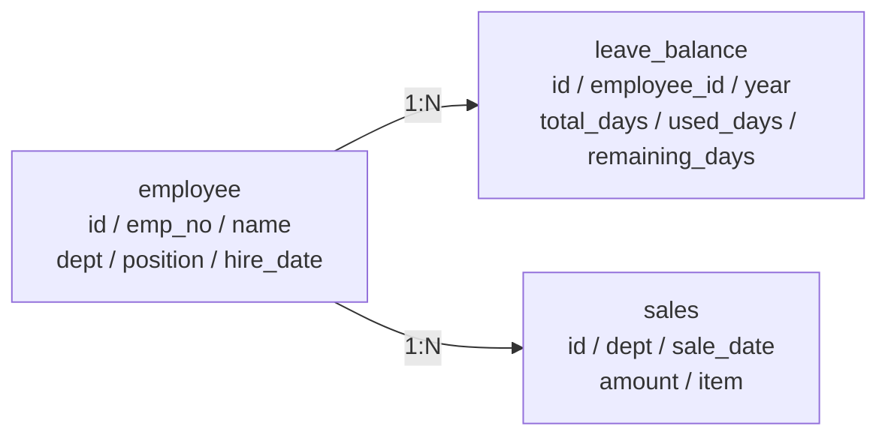

*그림 4-2: 3테이블 ERD — employee가 leave_balance와 sales의 부모 테이블*

> **참고: 3테이블 구조를 선택한 이유**
> CH08에서 MCP Tool을 설계할 때, "연차 조회", "매출 합계", "직원 목록" 이 세 유형의 질문이 가장 빈번하게 발생합니다. 각 테이블이 하나의 MCP Tool과 1:1로 대응되도록 설계하면, 나중에 Tool을 추가하거나 수정할 때 범위가 명확해집니다.

### 2.2 schema.sql — 테이블 DDL

**다음 SQL은 3개의 테이블을 생성하고 시드 데이터를 삽입합니다.**

```sql
-- data/schema.sql (핵심 부분)
CREATE TABLE employee (
    id          SERIAL PRIMARY KEY,
    emp_no      VARCHAR(10)  NOT NULL UNIQUE,   -- 사번
    name        VARCHAR(50)  NOT NULL,
    dept        VARCHAR(50)  NOT NULL,
    position    VARCHAR(50)  NOT NULL,
    hire_date   DATE         NOT NULL
);

CREATE TABLE leave_balance (
    id              SERIAL  PRIMARY KEY,
    employee_id     INTEGER NOT NULL REFERENCES employee(id) ON DELETE CASCADE,
    year            INTEGER NOT NULL,
    total_days      NUMERIC(4,1) NOT NULL,
    used_days       NUMERIC(4,1) NOT NULL DEFAULT 0,
    remaining_days  NUMERIC(4,1) GENERATED ALWAYS AS (total_days - used_days) STORED, -- ①
    UNIQUE (employee_id, year)
);

CREATE TABLE sales (
    id          SERIAL PRIMARY KEY,
    dept        VARCHAR(50)  NOT NULL,
    sale_date   DATE         NOT NULL,
    amount      BIGINT       NOT NULL,
    item        VARCHAR(200) NOT NULL
);
```

> ① `GENERATED ALWAYS AS ... STORED`는 PostgreSQL의 **계산 컬럼(Generated Column)** 입니다. `total_days - used_days`를 애플리케이션이 아닌 DB가 직접 계산하여 저장하므로, 잔여 연차 불일치 오류를 원천 차단합니다.

#### 코드 워크플로우

1. **Input**: `docker-compose up -d` 실행 시 컨테이너가 시작되고 `data/schema.sql`이 자동으로 마운트됩니다.
2. **Process**: PostgreSQL이 DDL을 순서대로 실행하여 테이블을 생성하고, `INSERT` 구문으로 직원 5명, 연차 5건, 매출 10건의 시드 데이터를 적재합니다.
3. **Output**: `connect_hr` 데이터베이스가 즉시 사용 가능한 상태가 됩니다.

> 전체 코드: `data/schema.sql`

### 2.3 도메인 모델 — models.py

**다음 코드는 PostgreSQL 테이블의 행(row)을 Python 객체로 표현하는 도메인 모델을 정의합니다.**

```python
# app/models.py
from dataclasses import dataclass
from datetime import date
from typing import Optional

@dataclass
class Employee:                    # ①
    id: int
    emp_no: str
    name: str
    dept: str
    position: str
    hire_date: date

@dataclass
class LeaveBalance:                # ②
    id: int
    employee_id: int
    year: int
    total_days: float
    used_days: float
    remaining_days: float
    name: Optional[str] = None     # ③
```

> ① `@dataclass`는 `__init__`, `__repr__` 등을 자동 생성합니다. SQLAlchemy ORM 없이도 타입 힌트와 구조를 명확히 유지할 수 있습니다.
> ② `LeaveBalance`는 `leave_balance` 테이블의 행을 표현합니다.
> ③ `name` 필드는 `employee` 테이블과 JOIN할 때 채워지는 선택 필드입니다.

> 전체 코드: `app/models.py`

> **참고: SQLAlchemy ORM을 쓰지 않은 이유**
> 이 챕터의 목적은 FastAPI의 구조를 명확히 이해하는 것입니다. ORM은 편리하지만 SQL을 추상화하여 CH08 MCP Tool 설계 시 실제 SQL 구조를 이해하기 어려워집니다. `psycopg2` + 직접 SQL 방식을 사용하면 "어떤 SQL이 실행되는가"가 코드에서 바로 보입니다.

### 2.4 Pydantic 스키마 — schemas.py

Pydantic 스키마(Schema)는 FastAPI가 HTTP 요청 본문을 자동으로 검증하고, 응답 데이터를 직렬화할 때 사용하는 규약 정의입니다. 모델 클래스를 Request/Response로 분리하는 것이 핵심입니다.

**다음 코드는 직원 등록 요청과 응답 스키마를 정의합니다.**

```python
# app/schemas.py (직원 부분)
from pydantic import BaseModel, Field
from datetime import date
from typing import Optional

class EmployeeCreate(BaseModel):          # ①
    emp_no:    str  = Field(..., max_length=10)
    name:      str  = Field(..., max_length=50)
    dept:      str  = Field(..., max_length=50)
    position:  str  = Field(..., max_length=50)
    hire_date: date = Field(...)

class EmployeeUpdate(BaseModel):          # ②
    name:      Optional[str]  = Field(None)
    dept:      Optional[str]  = Field(None)
    position:  Optional[str]  = Field(None)
    hire_date: Optional[date] = Field(None)

class EmployeeResponse(BaseModel):        # ③
    id: int;  emp_no: str;  name: str
    dept: str;  position: str;  hire_date: date
    class Config:
        from_attributes = True
```

> ① `EmployeeCreate`는 등록 시 필수 필드를 강제합니다. `Field(...)`의 `...`은 필수 값을 의미합니다.
> ② `EmployeeUpdate`는 수정 시 모든 필드를 선택 사항으로 설정합니다. 입력된 필드만 변경하는 PATCH 패턴입니다.
> ③ `EmployeeResponse`는 클라이언트에 반환할 필드를 명시합니다. DB 내부 구현 세부 사항이 응답에 노출되지 않도록 분리합니다.

> 전체 코드: `app/schemas.py`

---

## 3. CRUD API 구현

이 섹션에서는 `app/crud.py`의 핵심 함수들을 살펴보며 FastAPI가 어떻게 HTTP 요청을 DB 조작으로 변환하는지 확인합니다.

### 3.1 데이터베이스 연결 — database.py

**다음 코드는 PostgreSQL에 안전하게 연결하고 자동으로 커밋/롤백하는 컨텍스트 매니저를 구현합니다.**

```python
# app/database.py (핵심 부분)
@contextmanager
def get_connection() -> Generator:
    conn = None
    try:
        conn = psycopg2.connect(
            get_dsn(),
            cursor_factory=psycopg2.extras.RealDictCursor  # ①
        )
        yield conn                                          # ②
        conn.commit()                                       # ③
    except psycopg2.OperationalError as exc:
        if conn:
            conn.rollback()
        raise RuntimeError("DB 연결 실패") from exc
    finally:
        if conn:
            conn.close()                                    # ④
```

> ① `RealDictCursor`를 사용하면 쿼리 결과가 `row[0]` 인덱스 대신 `row["name"]` 딕셔너리 형태로 반환됩니다. 코드 가독성이 크게 향상됩니다.
> ② `yield conn`으로 컨텍스트 블록 안에서 연결을 사용할 수 있게 합니다.
> ③ 예외 없이 블록이 종료되면 `commit()`으로 트랜잭션을 확정합니다.
> ④ 성공/실패와 무관하게 `finally`에서 연결을 항상 반환합니다.

#### 코드 워크플로우

1. **Input**: `.env`의 `POSTGRES_*` 환경 변수로 DSN 문자열을 구성합니다.
2. **Process**: `with get_connection() as conn:` 블록 안에서 쿼리가 실행됩니다. 정상 종료 시 커밋, 예외 발생 시 롤백이 자동으로 수행됩니다.
3. **Output**: 딕셔너리 형태의 쿼리 결과를 반환하며, 연결은 블록 종료 후 자동으로 닫힙니다.

> 전체 코드: `app/database.py`

### 3.2 직원 CRUD

**다음 코드는 직원 목록 조회와 등록을 구현합니다.**

```python
# app/crud.py — 직원 조회
def get_all_employees(conn, name_filter=None, dept_filter=None) -> list[Employee]:
    conditions: list[str] = []
    params: list[str] = []

    if name_filter:
        conditions.append("name ILIKE %s")     # ①
        params.append(f"%{name_filter}%")
    if dept_filter:
        conditions.append("dept ILIKE %s")     # ②
        params.append(f"%{dept_filter}%")

    where_clause = ("WHERE " + " AND ".join(conditions)) if conditions else ""
    sql = f"SELECT id, emp_no, name, dept, position, hire_date FROM employee {where_clause} ORDER BY id"

    with conn.cursor() as cur:
        cur.execute(sql, params)               # ③
        rows = cur.fetchall()                  # ④

    return [_row_to_employee(r) for r in rows]
```

> ① `ILIKE`는 PostgreSQL의 대소문자 무시(case-insensitive) `LIKE`입니다. "김"으로 검색하면 "김민준", "김서연" 모두 반환합니다.
> ② 이름 필터와 부서 필터가 동시에 지정되면 `AND` 조건으로 결합됩니다.
> ③ 파라미터를 SQL 문자열에 직접 포함하지 않고 `params` 리스트로 분리하여 SQL 인젝션을 방지합니다.
> ④ `fetchall()`은 전체 결과를 딕셔너리 리스트로 반환합니다.

#### 코드 워크플로우

1. **Input**: 이름/부서 필터 문자열 (선택 사항)
2. **Process**: 입력된 필터에 따라 `WHERE` 절을 동적으로 구성하고 `employee` 테이블을 조회합니다.
3. **Output**: `Employee` 객체 리스트 (id 오름차순)

**다음 코드는 새 직원을 DB에 등록합니다.**

```python
# app/crud.py — 직원 등록
def create_employee(conn, emp_no, name, dept, position, hire_date) -> Employee:
    sql = """
        INSERT INTO employee (emp_no, name, dept, position, hire_date)
        VALUES (%s, %s, %s, %s, %s)
        RETURNING id, emp_no, name, dept, position, hire_date  -- ①
    """
    with conn.cursor() as cur:
        cur.execute(sql, (emp_no, name, dept, position, hire_date))  # ②
        row = cur.fetchone()                                          # ③
    return _row_to_employee(row)                                      # ④
```

> ① `RETURNING`은 PostgreSQL 전용 구문으로, INSERT 직후 생성된 행을 즉시 반환합니다. DB를 다시 조회할 필요가 없어 네트워크 왕복이 1회 줄어듭니다.
> ② 파라미터 바인딩으로 값을 전달합니다.
> ③ `fetchone()`으로 방금 삽입된 행을 가져옵니다.
> ④ 딕셔너리를 `Employee` 도메인 객체로 변환하여 반환합니다.

> 전체 코드: `app/crud.py`

### 3.3 휴가 잔여 조회 및 사용 등록

**다음 코드는 연차 사용을 누적 방식으로 등록하고, 잔여 연차가 부족하면 예외를 발생시킵니다.**

```python
# app/crud.py — 연차 사용 등록
def update_leave_usage(conn, employee_id, days, year=2025):
    check_sql = "SELECT remaining_days FROM leave_balance WHERE employee_id = %s AND year = %s"
    update_sql = """
        UPDATE leave_balance
        SET used_days = used_days + %s
        WHERE employee_id = %s AND year = %s
        RETURNING id, employee_id, year, total_days, used_days, remaining_days
    """
    with conn.cursor() as cur:
        cur.execute(check_sql, (employee_id, year))      # ①
        check_row = cur.fetchone()

        if check_row is None:
            return None

        if check_row["remaining_days"] < days:            # ②
            raise ValueError(
                f"잔여 연차({check_row['remaining_days']}일)가 부족합니다."
            )
        cur.execute(update_sql, (days, employee_id, year))  # ③
        row = cur.fetchone()

    return _row_to_leave(row) if row else None
```

> ① 잔여 연차를 먼저 조회하여 검증합니다.
> ② 요청 일수가 잔여 연차를 초과하면 `ValueError`를 발생시켜 처리를 중단합니다.
> ③ `used_days = used_days + days`로 누적 방식으로 갱신합니다. `remaining_days`는 DB 계산 컬럼이 자동으로 재계산합니다.

#### 코드 워크플로우

1. **Input**: 직원 ID, 사용할 연차 일수, 연도
2. **Process**: 잔여 연차 검증 → 부족 시 예외 → 충분 시 `used_days` 누적 갱신
3. **Output**: 갱신된 `LeaveBalance` 객체 (잔여 연차가 자동 재계산됨)

### 3.4 매출 CRUD

**다음 코드는 부서/기간 필터를 지원하는 매출 목록 조회를 구현합니다.**

```python
# app/crud.py — 매출 목록 조회
def get_all_sales(conn, dept_filter=None, date_from=None, date_to=None, limit=50):
    conditions: list[str] = []
    params: list = []

    if dept_filter:
        conditions.append("dept ILIKE %s")          # ①
        params.append(f"%{dept_filter}%")
    if date_from:
        conditions.append("sale_date >= %s")        # ②
        params.append(date_from)
    if date_to:
        conditions.append("sale_date <= %s")        # ③
        params.append(date_to)

    where_clause = ("WHERE " + " AND ".join(conditions)) if conditions else ""
    params.append(limit)
    sql = f"SELECT id, dept, sale_date, amount, item FROM sales {where_clause} ORDER BY sale_date DESC LIMIT %s"
    with conn.cursor() as cur:
        cur.execute(sql, params)                    # ④
        rows = cur.fetchall()

    return [_row_to_sale(r) for r in rows]
```

> ① 부서 부분 검색 — "영업"으로 검색하면 "영업팀"도 포함됩니다.
> ② 시작일 이후의 매출만 포함합니다.
> ③ 종료일 이전의 매출만 포함합니다.
> ④ 필터가 없으면 전체 조회, 있으면 AND 조건으로 결합하여 조회합니다.

> 전체 코드: `app/crud.py`, `app/schemas.py`

> **주의: LIMIT 없이 전체 조회 시 성능 문제**
> 매출 데이터가 수만 건으로 늘어나면 `SELECT * FROM sales` 는 심각한 성능 저하를 일으킵니다. 이 코드에서는 `limit=50`을 기본값으로 설정하여 항상 최신 50건만 반환합니다. CH09 운영 설정 챕터에서 페이지네이션을 추가합니다.

---

## 4. 관리자 Admin UI

메타코딩은 CRUD API를 완성한 뒤, Swagger 문서를 직접 조작하며 데이터를 입력하는 것이 번거롭다는 것을 느꼈습니다. 직원 30명의 데이터를 비기술 인사 담당자가 직접 입력할 수 있으려면 브라우저 UI가 필요합니다. FastAPI + Jinja2로 별도 프론트엔드 없이 이 문제를 해결합니다.

<!-- [GEMINI PROMPT: 04_admin-ui-flow]
path: assets/CH04/04_admin-ui-flow.png
Minimalist flat-design diagram showing three connected boxes: "Admin UI (Jinja2 HTML)" on the left, "FastAPI Server" in the center, and "PostgreSQL DB" on the right. Arrows labeled "HTTP GET/POST" connect left to center, and arrows labeled "SQL (psycopg2)" connect center to right. Below center box, a small browser icon shows "/admin/dashboard". White background, clean black lines, 16:9 aspect ratio.
Style: architecture-infographic
-->

*그림 4-3: Admin UI → FastAPI → PostgreSQL 요청 흐름*

### 4.1 base.html — 공통 레이아웃

**다음 코드는 모든 Admin 페이지에서 공유하는 베이스 레이아웃입니다. CH07 채팅 UI, CH08 통합 에이전트 UI에서 이 파일을 그대로 계승합니다.**

```html
<!-- templates/base.html -->
<!DOCTYPE html>
<html lang="ko">
<head>
    <title>사내 시스템 관리자</title>
    <link rel="stylesheet" href="{{ url_for('static', path='css/style.css') }}">
</head>
<body>
    <aside class="sidebar">                              <!-- ① -->
        <div class="brand">사내 시스템 관리자</div>
        <div class="nav-title">메뉴</div>
        <a class="nav-link active"
           href="/admin/dashboard">대시보드</a>          <!-- ② -->
        <a class="nav-link active"
           href="/admin/employees">직원 관리</a>
        <a class="nav-link active"
           href="/admin/leaves">휴가 관리</a>
        <a class="nav-link active"
           href="/admin/sales">매출 관리</a>
    </aside>
    <main class="content">
                       <!-- ③ -->
    </main>
</body>
</html>
```

> ① 240px 고정 너비 사이드바입니다. `style.css`의 `.sidebar` 규칙이 sticky 레이아웃을 적용합니다.
> ② `active_page` 변수는 views.py에서 템플릿에 전달합니다. 현재 페이지를 굵게 강조 표시합니다.
> ③ `` 블록에 각 페이지의 고유 내용이 채워집니다.

> **팁: Jinja2를 선택한 이유**
> React나 Vue 같은 프론트엔드 프레임워크를 사용하면 빌드 도구, Node.js 환경, API 통신 로직이 추가됩니다. Jinja2 템플릿은 Python 서버가 HTML을 완성하여 브라우저에 전달하므로, Python 지식만으로 UI까지 완성할 수 있습니다. CH07에서 채팅 UI를 추가할 때도 이 `base.html`을 ``로 상속하여 일관된 레이아웃을 유지합니다.

### 4.2 style.css — 디자인 시스템

`static/css/style.css`는 검정/흰색 + 금색(`#d4af37`) 강조색을 사용하는 미니멀 디자인 시스템입니다. CSS 변수로 색상 체계를 관리하므로, 테마를 변경할 때 `:root` 블록만 수정하면 됩니다.

```css
/* static/css/style.css — CSS 변수 정의 */
:root {
    --bg:       #ffffff;
    --border:   #e5e5e5;
    --text:     #171717;
    --muted:    #525252;
    --primary:  #171717;
    --accent:   #d4af37;         /* ① 금색 강조 */
}

.sidebar {
    width: 240px;                /* ② 고정 너비 사이드바 */
    border-right: 1px solid var(--border);
    position: sticky;
    top: 0;
    height: 100vh;
}

.stat-card {
    border: 1px solid var(--border);
    border-radius: 14px;
    padding: 16px;
}
```

> ① `--accent: #d4af37`은 배지, 강조 버튼에 사용됩니다. 차후 CH07, CH08에서도 동일한 CSS 변수를 공유합니다.
> ② `position: sticky; height: 100vh`로 스크롤해도 사이드바가 고정됩니다.

> 전체 코드: `static/css/style.css`

### 4.3 views.py — 뷰 라우터

**다음 코드는 대시보드 페이지를 렌더링하는 뷰 함수입니다.**

```python
# app/views.py — 대시보드 뷰
@router.get("/dashboard", response_class=HTMLResponse)
def view_dashboard(request: Request) -> HTMLResponse:
    try:
        with get_connection() as conn:
            stats = crud.get_dashboard_stats(conn)          # ①
            recent_sales = crud.get_recent_sales(conn, 5)   # ②
    except RuntimeError:
        stats = {"employees_count": 0, "leaves_count": 0,
                 "sales_count": 0, "sales_total": 0}
        recent_sales = []

    return templates.TemplateResponse(                       # ③
        "dashboard.html",
        {
            "request": request,
            "active_page": "dashboard",
            **stats,
            "recent_sales": [
                {"id": s.id, "dept": s.dept,
                 "amount": f"{s.amount:,}원",
                 "date": s.sale_date.strftime("%Y-%m-%d"),
                 "description": s.item}
                for s in recent_sales
            ],
        },
    )
```

> ① `get_dashboard_stats()`는 직원 수, 연차 기록 수, 매출 건수, 매출 합계를 한 번의 DB 접속으로 집계합니다.
> ② 최근 매출 5건을 별도로 조회합니다.
> ③ `TemplateResponse`에 딕셔너리로 템플릿 변수를 전달합니다. `request`는 Jinja2가 `url_for()`를 처리하기 위해 반드시 포함해야 합니다.

#### 코드 워크플로우

1. **Input**: 브라우저에서 `GET /admin/dashboard` 요청
2. **Process**: DB에서 통계(4개 집계)와 최근 매출 5건을 조회하고 템플릿 변수로 변환합니다.
3. **Output**: `dashboard.html` 템플릿이 렌더링된 HTML 페이지가 브라우저로 전송됩니다.

**다음 코드는 직원 등록 폼을 처리하는 뷰 함수입니다.**

```python
# app/views.py — 직원 등록 폼 처리
@router.post("/employees/create")
def create_employee_view(
    request: Request,
    emp_no: str = Form(...),
    name: str = Form(...),
    dept: str = Form(...),
    position: str = Form(...),
    hire_date: str = Form(...),
) -> RedirectResponse:
    parsed_date = datetime.date.fromisoformat(hire_date)              # ①
    try:
        with get_connection() as conn:
            crud.create_employee(conn, emp_no, name, dept,
                                 position, parsed_date)               # ②
    except Exception as exc:
        print(f"직원 등록 실패: {exc}")

    return RedirectResponse(url="/admin/employees", status_code=303)  # ③
```

> ① HTML 폼에서 날짜는 문자열로 전송됩니다. `fromisoformat()`으로 `date` 객체로 변환합니다.
> ② CRUD 함수를 호출하여 DB에 저장합니다.
> ③ 등록 완료 후 `303 See Other`로 직원 목록 페이지로 리다이렉트합니다. 브라우저가 새로고침해도 폼이 재전송되지 않습니다.

> 전체 코드: `app/views.py`

### 4.4 dashboard.html — 대시보드 템플릿

**다음 코드는 통계 카드 4개와 최근 매출 테이블을 렌더링하는 대시보드 템플릿입니다.**

```html
<!-- templates/dashboard.html -->


대시보드


<div class="stat-grid">
    <div class="stat-card">
        <div class="stat-label">직원 수</div>
        <div class="stat-value">{{ employees_count }}</div>   <!-- ① -->
    </div>
    <div class="stat-card">
        <div class="stat-label">연차 기록 수</div>
        <div class="stat-value">{{ leaves_count }}</div>
    </div>
    <div class="stat-card">
        <div class="stat-label">총 매출</div>
        <div class="stat-value">{{ "{:,}".format(sales_total) }}원</div>  <!-- ② -->
    </div>
</div>

<div class="card">
    <table>
        <thead>
            <tr><th>부서</th><th>금액</th><th>일자</th><th>항목</th></tr>
        </thead>
        <tbody>
                                               <!-- ③ -->
            <tr>
                <td>{{ s.dept }}</td>
                <td>{{ s.amount }}</td>
                <td>{{ s.date }}</td>
                <td>{{ s.description }}</td>
            </tr>
            
        </tbody>
    </table>
</div>

```

> ① `{{ employees_count }}`는 views.py에서 전달된 변수를 출력합니다.
> ② `"{:,}".format(sales_total)`은 Python의 숫자 포맷 함수로, 65,050,000처럼 천 단위 쉼표를 추가합니다.
> ③ ``는 Jinja2 반복문입니다. Python의 `for`와 동일한 방식으로 동작합니다.

<!-- [CAPTURE NEEDED: 04_dashboard-screenshot
  path: assets/CH04/04_dashboard-screenshot.png
  desc: `uvicorn app.main:app --reload` 실행 후 `http://localhost:8000/admin/dashboard` 접속 시 보이는 대시보드 화면. 직원 수 5, 연차 기록 수 5, 총 매출 63,850,000원이 통계 카드에 표시된 상태.
] -->

*그림 4-4: Admin UI 대시보드 — 직원 수, 연차, 매출 통계가 카드로 표시된다*

> 전체 코드: `templates/dashboard.html`, `templates/employees.html`, `templates/leaves.html`, `templates/sales.html`

#### 코드 워크플로우

1. **Input**: `views.py`가 렌더링 시 전달한 `employees_count`, `recent_sales` 등의 딕셔너리
2. **Process**: ``로 공통 레이아웃을 상속하고, `` 안에 페이지 고유 HTML을 채웁니다.
3. **Output**: 완성된 HTML이 브라우저로 전송되어 대시보드 화면이 표시됩니다.

> **팁: Swagger 자동 API 문서 활용**
> `http://localhost:8000/docs`에 접속하면 Pydantic 스키마를 기반으로 자동 생성된 Swagger UI를 확인할 수 있습니다. 각 엔드포인트에 대해 요청 예시를 직접 실행해볼 수 있어, 프론트엔드 없이도 API 동작을 빠르게 검증할 수 있습니다.

### 4.5 전체 흐름 확인

서버를 실행하고 다음 순서로 동작을 확인하십시오.

1. `http://localhost:8000/admin/employees` → 직원 목록 확인 (5명 시드 데이터)
2. "직원 추가" 폼에 새 직원 정보 입력 후 제출 → 목록에 추가된 직원 확인
3. `http://localhost:8000/admin/leaves` → 연차 잔여 현황 확인
4. "연차 사용 등록" 폼으로 1일 사용 등록 → 잔여 연차 감소 확인
5. `http://localhost:8000/admin/sales` → 매출 현황 및 부서별 합계 확인

<!-- [CAPTURE NEEDED: 04_employees-screenshot
  path: assets/CH04/04_employees-screenshot.png
  desc: `/admin/employees` 페이지에서 직원 5명 목록이 테이블로 표시된 화면. 이름, 부서, 직급, 입사일 컬럼이 보이고 상단에 "직원 추가" 폼이 있는 상태.
] -->

*그림 4-5: 직원 관리 페이지 — 목록 조회와 등록 폼이 함께 제공된다*

---

## 5. 정리하며

메타코딩은 이 챕터에서 FastAPI + PostgreSQL + Jinja2 조합으로 사내 기본 시스템을 완성하였습니다. 엑셀 파일에 흩어져 있던 직원, 휴가, 매출 데이터가 하나의 관계형 데이터베이스로 통합되었고, 인사 담당자도 브라우저에서 바로 조회하고 수정할 수 있게 되었습니다.

<!-- [GEMINI PROMPT: 04_before-after]
path: assets/CH04/04_before-after.png
Simple before/after comparison infographic: LEFT side shows "직원 정보 Excel / 휴가 수동 집계 / 매출 파일 분산" with scattered file icons and label "Before (30분)", RIGHT side shows "PostgreSQL + Admin UI / 즉시 조회 가능" with a unified database icon and browser icon and label "After (즉시)", clean arrow in the middle, flat design, white background.
Style: before-after-infographic
-->

*그림 4-6: CH04 before/after — 엑셀 분산 관리에서 통합 DB + Admin UI로*

**이 챕터의 핵심 내용을 정리합니다.**

- **FastAPI는 API와 UI를 동시에 처리합니다**: `/api/*` 경로는 JSON을 반환하는 REST API로, `/admin/*` 경로는 Jinja2가 렌더링한 HTML을 반환하는 Admin UI로 동작합니다. 하나의 서버가 두 역할을 수행합니다.

- **PostgreSQL 계산 컬럼이 데이터 무결성을 보장합니다**: `remaining_days GENERATED ALWAYS AS (total_days - used_days) STORED`로 잔여 연차를 DB가 직접 계산합니다. 애플리케이션이 계산 로직을 가지면 버그가 생길 수 있지만, DB가 계산하면 항상 일관성이 보장됩니다.

- **Pydantic 스키마 분리가 API 계약을 명확히 합니다**: `EmployeeCreate`(등록용), `EmployeeUpdate`(수정용), `EmployeeResponse`(응답용)를 분리하면 각 상황에서 필요한 필드만 노출됩니다. Swagger 문서도 이 스키마를 기반으로 자동 생성됩니다.

- **base.html이 CH07, CH08의 UI 기반이 됩니다**: 240px 사이드바 + 메인 콘텐츠 레이아웃은 이 챕터에서 완성됩니다. CH07 채팅 UI와 CH08 통합 에이전트 UI는 ``으로 이 구조를 그대로 계승합니다.

- **before/after**: 직원 정보 관리 방식이 Excel 단일 파일에서 PostgreSQL + 웹 Admin UI로 전환되었습니다. 휴가 현황 집계에 소요되던 30분이 Admin UI 즉시 조회로 단축되었으며, 매출 데이터는 부서별 개별 파일에서 통합 DB + API로 전환되어 CH08에서 AI 비서가 SQL로 조회할 수 있는 기반이 마련되었습니다.

**다음 챕터 예고**: 사내 데이터베이스가 완성되었습니다. 이제 AI 비서가 검색할 **비정형 문서** 를 정비할 차례입니다. CH05에서는 인사팀 서버에 뒤섞인 수백 개의 파일을 표준화하고, RAG 인덱싱에 적합한 구조로 정리하는 파이프라인을 구축합니다.


---

# 5. 사내 문서 수집 전략과 문서 표준 만들기

FastAPI 기반 사내 시스템을 완성한 메타코딩에게 다음 과제가 생겼습니다. RAG 엔진이 검색할 "비정형 문서"를 준비해야 합니다. 그런데 커넥트의 인사팀 서버를 열어보는 순간, 메타코딩은 예상보다 훨씬 심각한 현실을 마주합니다.

이 챕터에서는 **문서 품질이 RAG 성능을 결정한다** 는 원칙을 출발점으로, 어떤 문서를 선정할 것인지, 파일 형식별로 어떤 특성이 있는지, 그리고 파일명 규칙과 폴더 구조를 어떻게 표준화하는지를 단계적으로 살펴봅니다. 마지막으로 이 모든 표준을 자동으로 검증하는 `validator.py` 파이프라인을 직접 실행합니다.

---

## 1. 어떤 문서를 넣을 것인가

<!-- [GEMINI PROMPT: 05_document-chaos]
path: assets/CH05/05_document-chaos.png
A minimalist black and white technical diagram with a strict 16:9 aspect ratio on a solid white background. No shading, no 3D effects, only clean thin line art. The entire assembly of icons, lines, and text is perfectly centered globally within the 16:9 frame, leaving generous and equal white space on all sides. Left side shows a single folder icon labeled "인사팀 서버" containing a chaotic pile of minimalist line-art document icons with labels like "취업규칙_최종.pdf", "취업규칙_최종_v2.pdf", "취업규칙_진짜최종.pdf" stacked in disorder. Right side shows an organized folder structure with sub-folders labeled "hr/", "security/", "ops/", "finance/" each containing neatly arranged document icons with standardized names. A large arrow labeled "표준화" points from left to right.
Style: before-after-infographic
-->

*그림 5-1: 표준화 전 문서 혼란 상태와 표준화 후 부서별 폴더 구조 비교*

메타코딩은 커넥트 인사팀 서버 공유 드라이브를 접속하고 입이 딱 벌어졌습니다. "취업규칙_최종.pdf", "취업규칙_최종_v2.pdf", "취업규칙_최종_진짜최종.pdf"가 같은 폴더에 공존하고 있었습니다. 어느 것이 최신 버전인지 알 방법이 없었습니다. 100개가 넘는 파일이 부서 구분도 없이 하나의 폴더에 뒤섞여 있었고, 파일 형식도 PDF, DOCX, XLSX, 심지어 HWP까지 뒤죽박죽이었습니다.

"이 상태로 AI에 넣으면 엉뚱한 답변이 나올 것이 뻔하다." 메타코딩은 AI 작업을 시작하기 전에 문서 정리부터 해야 한다는 것을 직감했습니다. 컴퓨터 과학에서는 이를 **"Garbage In, Garbage Out"(쓰레기를 넣으면 쓰레기가 나온다)** 이라 부릅니다. 정제되지 않은 문서는 RAG 품질을 직접 떨어뜨립니다.

### 1.1 교재용 문서 세트

이 책에서는 커넥트 사내에서 실제로 자주 질문받는 유형의 문서 6개를 교재용 예제 세트로 사용합니다. 각 문서는 `legacy/ex01-1/data/docs/` 경로에 실제 파일 형태로 제공됩니다.

| 파일명 | 형식 | 부서 | 설명 |
|--------|------|------|------|
| `HR_취업규칙_v1.0.pdf` | PDF | 인사 | 연차, 급여, 복지 등 취업 규정 전문 |
| `HR_정보보안서약서.pdf` | PDF | 인사 | 입사 시 서명하는 보안 서약 양식 |
| `SEC_보안규정_v1.0.docx` | DOCX | 보안 | 사내 정보보안 규정 (표 구조 포함) |
| `OPS_신규서비스_런칭전략.pdf` | PDF | 운영 | 신규 서비스 출시 전략 문서 |
| `FIN_부서별_예산기안서.xlsx` | XLSX | 재무 | 부서별 예산 기안 내용 (수치 데이터) |
| `FIN_2025_상반기_매출현황.xlsx` | XLSX | 재무 | 2025년 상반기 매출 현황표 |

### 1.2 실무 문서 선정 기준

어떤 문서를 RAG 시스템에 넣어야 할까요? 다음 두 가지 기준을 우선으로 합니다.

**자주 질문받는 문서** 를 먼저 포함합니다. 인사팀에 하루 20건씩 들어오는 반복 질문("연차 며칠 남았나요?", "출장비 기준이 어떻게 되나요?")의 답이 담긴 문서가 1순위입니다.

**정기적으로 갱신되는 문서** 도 중요합니다. 취업규칙처럼 매년 개정되는 문서는 버전 관리가 필수입니다. 버전 정보가 파일명에 없으면 AI가 구버전 기준으로 답변할 위험이 있습니다.

> **팁: 문서 선정 우선순위**
> 전체 문서를 한 번에 넣으려 하지 마십시오. "직원들이 가장 자주 물어보는 질문 10개"를 먼저 정의하고, 그 답이 담긴 문서부터 시작하는 것이 현실적입니다. 문서 수가 적을수록 검증과 디버깅이 쉽습니다.

---

## 2. 문서 형식 지원 범위

사내 문서는 하나의 형식으로 통일되어 있지 않습니다. 커넥트의 경우 PDF, DOCX, XLSX가 혼재합니다. 각 형식은 파싱 방식과 난이도가 다릅니다.

### 2.1 형식별 특성 비교

| 형식 | 파싱 라이브러리 | 특성 | 파싱 난이도 |
|------|---------------|------|-----------|
| PDF (텍스트) | `pypdf` | 대부분의 규정 문서. 레이아웃 정보 손실 가능 | 보통 |
| PDF (이미지) | LLaVA (Vision LLM) | 스캔본, 표·차트 포함 PDF. 텍스트 추출 불가 | 높음 |
| DOCX | `python-docx` | Word 문서. 표, 단락, 제목 구조 보존 | 낮음 |
| XLSX | `openpyxl` | Excel 파일. 시트별 데이터, 수식 포함 가능 | 낮음 |

### 2.2 이미지 PDF vs 텍스트 PDF

PDF 형식 안에서도 구별이 필요합니다. **텍스트 PDF** 는 `pypdf`로 텍스트를 직접 추출할 수 있습니다. 반면 **이미지 PDF** 는 PDF 전체가 이미지로 구성되어 있어 일반 파싱으로는 텍스트가 전혀 추출되지 않습니다. 스캔한 종이 문서나 표·차트가 이미지로 삽입된 문서가 여기에 해당합니다.

이미지 PDF 처리는 Vision LLM(LLaVA)과 OCR을 활용하는 고급 주제로, CH06에서 LLM 파싱 단계에서 다룹니다.

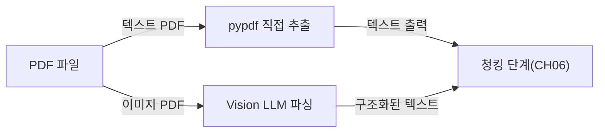

*그림 5-2: PDF 유형에 따른 파싱 경로 분기*

> **참고: CH05는 파싱을 직접 수행하지 않습니다**
> 이 챕터의 목표는 문서를 "정리하고 검증"하는 것입니다. 실제 텍스트 추출(파싱)과 벡터 저장은 CH06에서 수행합니다. CH05는 CH06에 "먹일 준비가 된" 문서 세트를 만드는 단계입니다.

---

## 3. 문서 표준 규칙

메타코딩은 문서를 정리하기 전에 규칙부터 세우기로 했습니다. 규칙 없이 정리하면 6개월 뒤 다시 뒤죽박죽이 됩니다.

### 3.1 파일명 규칙

파일명은 다음 형식을 따릅니다.

```
{부서코드}_{문서종류}_v{버전}.{확장자}
```

**예시:**
- `HR_취업규칙_v1.0.pdf` — 인사팀 취업규칙, 1.0 버전, PDF 형식
- `SEC_보안규정_v1.0.docx` — 보안팀 보안규정, 1.0 버전, DOCX 형식
- `FIN_부서별_예산기안서.xlsx` — 재무팀 예산기안서, 버전 없음 (WARN 처리)

**부서코드 목록:**

| 코드 | 부서 |
|------|------|
| `HR` | 인사 |
| `SEC` | 보안 |
| `OPS` | 운영 |
| `FIN` | 재무 |
| `IT` | IT |
| `MKT` | 마케팅 |
| `GEN` | 총무 |

> **주의: 파일명 규칙은 왜 필요한가**
> 단순히 정리 목적만이 아닙니다. CH06에서 파일명에서 부서·버전 정보를 자동 추출하여 메타데이터로 활용합니다. CH10의 **Self-Query Retriever(자기 질의 검색기)** 는 "인사팀 문서만 검색해줘"처럼 메타데이터 조건을 질문에서 자동으로 파악하는데, 이때 부서 코드가 파일명에 포함되어 있어야 작동합니다. 지금 정하는 규칙이 나중에 검색 품질을 결정합니다.

### 3.2 폴더 구조

문서는 부서별로 분리하여 저장합니다.

```
data/docs/
├── hr/
│   ├── HR_취업규칙_v1.0.pdf
│   └── HR_정보보안서약서.pdf
├── security/
│   └── SEC_보안규정_v1.0.docx
├── ops/
│   └── OPS_신규서비스_런칭전략.pdf
└── finance/
    ├── FIN_부서별_예산기안서.xlsx
    └── FIN_2025_상반기_매출현황.xlsx
```

폴더명은 부서코드의 소문자 버전(`hr`, `sec` → `security`, `ops`, `fin` → `finance`)을 사용합니다. 가독성을 위해 전체 단어를 사용해도 무방합니다.

### 3.3 메타데이터 필수 항목

각 문서에는 다음 7개 항목의 메타데이터가 자동으로 추출되어야 합니다. 이 메타데이터는 CH06에서 ChromaDB에 문서를 저장할 때 함께 기록됩니다.

| 항목 | 설명 | 예시 |
|------|------|------|
| `doc_id` | 문서 고유 식별자 | `HR_취업규칙_1.0` |
| `title` | 문서 종류 (파일명에서 추출) | `취업규칙` |
| `department` | 부서명 | `인사` |
| `version` | 버전 번호 | `1.0` |
| `date` | 파일 수정일 | `2025-01-15` |
| `format` | 파일 형식 | `PDF` |
| `file_size_bytes` | 파일 크기 | `153600` |

> **팁: 메타데이터는 "검색 필터"입니다**
> "인사팀 문서 중 2024년 이후 버전만 검색해줘"처럼 메타데이터를 조건으로 검색 범위를 좁힐 수 있습니다. 메타데이터가 없으면 전체 문서를 대상으로 검색해야 하므로 정확도가 낮아집니다.

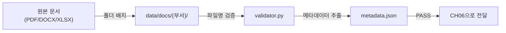

*그림 5-3: 문서 수집 파이프라인 전체 흐름*

---

## 4. 문서 수집 파이프라인

이제 이 규칙들을 자동으로 검증하는 도구를 만들 차례입니다. 메타코딩은 사람이 직접 파일 하나하나를 확인하는 대신, 스크립트 한 번 실행으로 전체 문서의 표준 준수 여부를 확인할 수 있도록 설계했습니다.

### 4.1 예제 폴더 이동

CH02에서 클론한 저장소의 예제 폴더로 이동합니다.

```bash
cd examples/CH05_사내_문서_수집_표준화
```

```bash
pip install -r requirements.txt
```

### 4.2 문서 배치 확인

`data/docs/` 폴더에 교재용 문서 6개가 이미 배치되어 있습니다.

```
data/docs/
├── hr/
│   ├── HR_취업규칙_v1.0.pdf
│   └── HR_정보보안서약서.pdf
├── security/
│   └── SEC_보안규정_v1.0.docx
├── ops/
│   └── OPS_신규서비스_런칭전략.pdf
└── finance/
    ├── FIN_부서별_예산기안서.xlsx
    └── FIN_2025_상반기_매출현황.xlsx
```

> **참고: 실제 문서를 사용하는 이유**
> 일부 RAG 튜토리얼에서는 편의를 위해 `.txt` 파일을 예제로 사용합니다. 그러나 이 책에서는 실제 사내에서 사용하는 PDF, DOCX, XLSX를 그대로 씁니다. `.txt` 파일은 별도 파싱 없이 읽을 수 있어 형식별 처리 차이를 체감할 수 없기 때문입니다. 실무에서 만날 파일 형식의 다양성을 미리 경험하는 것이 이 챕터의 목적입니다.

### 4.3 validator.py 핵심 코드 분석

`src/validator.py`는 크게 세 가지 역할을 수행합니다. 파일명이 표준 규칙을 따르는지 검증하고, 파일 형식이 지원 대상인지 확인하고, 메타데이터를 자동으로 추출합니다.

**다음 코드는 파일명이 표준 명명 규칙을 따르는지 검증합니다.**

```python
FILENAME_PATTERN_WITH_VERSION = re.compile(
    r"^([A-Z]{2,5})_(.+)_v(\d+\.\d+)\.(pdf|docx|xlsx)$"
)

def validate_filename(filename: str) -> dict:
    match_with_ver = FILENAME_PATTERN_WITH_VERSION.match(filename)  # ①
    if match_with_ver:
        dept_code = match_with_ver.group(1)                        # ②
        doc_type  = match_with_ver.group(2)
        version   = match_with_ver.group(3)
        return {"status": "PASS", "department_code": dept_code,
                "doc_type": doc_type, "version": version, ...}     # ③

    match_without_ver = FILENAME_PATTERN_WITHOUT_VERSION.match(filename)  # ④
    if match_without_ver:
        return {"status": "WARN", "version": None, ...}            # ⑤

    return {"status": "FAIL", ...}                                 # ⑥
```

> ① 정규 표현식으로 `{부서코드}_{문서종류}_v{버전}.{확장자}` 패턴을 먼저 검사합니다.
> ② 패턴이 일치하면 부서코드, 문서종류, 버전을 그룹 캡처로 분리합니다.
> ③ 모든 항목이 정상이면 `PASS`를 반환합니다.
> ④ 버전 없는 패턴(`{부서코드}_{문서종류}.{확장자}`)으로 재시도합니다.
> ⑤ 버전만 없는 경우 FAIL이 아닌 `WARN`으로 처리하여 개발 초기의 유연성을 확보합니다.
> ⑥ 두 패턴 모두 불일치하면 `FAIL`을 반환합니다.

**PASS / WARN / FAIL 3단계 판정을 두는 이유** 가 있습니다. 실무에서는 모든 문서를 한 번에 표준화하기 어렵습니다. 버전 정보를 빠뜨린 파일이 있더라도 부서 코드와 문서 종류는 올바르다면 RAG에 사용하는 데는 문제가 없습니다. WARN 상태의 문서도 CH06에서 인덱싱할 수 있으며, 시간이 될 때 파일명을 수정하면 됩니다.

**다음 코드는 파일에서 메타데이터 7개 항목을 자동으로 추출합니다.**

```python
def extract_metadata(file_path: Path) -> dict:
    validation = validate_filename(file_path.name)               # ①

    mtime = os.path.getmtime(file_path)                          # ②
    file_date = datetime.fromtimestamp(mtime).strftime("%Y-%m-%d")

    dept_code = validation.get("department_code") or "UNKNOWN"   # ③
    doc_type  = validation.get("doc_type") or file_path.stem
    version   = validation.get("version") or "unversioned"
    doc_id    = f"{dept_code}_{doc_type}_{version}".replace(" ", "_")  # ④

    return {
        "doc_id": doc_id,
        "title": doc_type,
        "department": validation.get("department_name") or "알 수 없음",
        "version": version,
        "date": file_date,
        "format": file_path.suffix.lower().lstrip(".").upper(),  # ⑤
        ...
    }
```

> ① 파일명 검증 결과를 활용하여 부서명, 버전 등을 이미 파싱된 형태로 받습니다.
> ② 파일 시스템 수정일을 읽어 `YYYY-MM-DD` 형식으로 변환합니다.
> ③ 검증 결과에서 부서코드, 문서종류, 버전을 안전하게 추출합니다 (없으면 기본값 사용).
> ④ `doc_id`는 `{부서코드}_{문서종류}_{버전}` 형태로 고유 식별자를 생성합니다.
> ⑤ 확장자를 대문자 형식(`PDF`, `DOCX`, `XLSX`)으로 정규화합니다.

> **전체 코드: `src/validator.py`**

### 4.4 검증 스크립트 실행

```bash
python src/validator.py
```

#### 코드 워크플로우 (Code Workflow)

1. **Input**: `data/docs/` 폴더 내 모든 PDF, DOCX, XLSX 파일 경로 목록
2. **Process**:
   - `scan_docs_directory()` 로 파일 목록 수집 (숨김 파일 제외)
   - 파일별로 `check_format_support()` → `validate_filename()` → `extract_metadata()` 순서로 검증
   - PASS / WARN / FAIL 결과를 집계하여 요약 출력
3. **Output**: 터미널 검증 요약 + `outputs/metadata.json` 저장

실행하면 다음과 같은 결과가 터미널에 출력됩니다.

```
============================================================
   CH05 문서 수집 표준화 검증 도구
============================================================
문서 폴더: .../data/docs
출력 경로: .../outputs/metadata.json

총 6개 문서 검증 시작...

------------------------------------------------------------
[WARN] FIN_2025_상반기_매출현황.xlsx
       부서: 재무 | 버전: unversioned
       메시지: 버전 정보 누락 (권장 형식: FIN_2025_상반기_매출현황_v1.0.xlsx)

[WARN] FIN_부서별_예산기안서.xlsx
       부서: 재무 | 버전: unversioned
       메시지: 버전 정보 누락 (권장 형식: FIN_부서별_예산기안서_v1.0.xlsx)

[WARN] HR_정보보안서약서.pdf
       부서: 인사 | 버전: unversioned
       메시지: 버전 정보 누락 (권장 형식: HR_정보보안서약서_v1.0.pdf)

[PASS] HR_취업규칙_v1.0.pdf
       부서: 인사 | 버전: 1.0
       메시지: 파일명 규칙 준수

[WARN] OPS_신규서비스_런칭전략.pdf
       부서: 운영 | 버전: unversioned
       메시지: 버전 정보 누락 (권장 형식: OPS_신규서비스_런칭전략_v1.0.pdf)

[PASS] SEC_보안규정_v1.0.docx
       부서: 보안 | 버전: 1.0
       메시지: 파일명 규칙 준수

메타데이터 저장 완료: .../outputs/metadata.json
============================================================
            문서 검증 결과 요약
============================================================
  전체 문서:  6개
  PASS:       2개  (33.3%)
  WARN:       4개  (66.7%)
  FAIL:       0개  (0.0%)
------------------------------------------------------------

최종 판정: WARN (4개 문서에 경고가 있습니다. 표준 규칙 적용을 권장합니다.)
```

<!-- [CAPTURE NEEDED: 05_validator-run
  path: assets/CH05/05_validator-run.png
  desc: `python src/validator.py` 실행 후 터미널 전체 화면 — PASS/WARN 결과가 출력된 상태
] -->

*그림 5-4: validator.py 실행 결과 — 6개 문서 중 2개 PASS, 4개 WARN*

FAIL이 0개이므로 모든 문서는 CH06에서 사용 가능합니다. WARN 상태인 4개 파일(버전 정보 누락)은 나중에 파일명을 수정하면 PASS로 전환됩니다.

### 4.5 생성된 metadata.json 확인

검증이 완료되면 `outputs/metadata.json`이 생성됩니다. 이 파일은 CH06의 VectorDB 구축 단계에서 각 청크에 메타데이터를 부착할 때 사용합니다.

```json
{
  "generated_at": "2025-01-15 10:23:45",
  "total_documents": 6,
  "documents": [
    {
      "doc_id": "HR_취업규칙_1.0",
      "filename": "HR_취업규칙_v1.0.pdf",
      "title": "취업규칙",
      "department": "인사",
      "department_code": "HR",
      "version": "1.0",
      "date": "2025-01-10",
      "format": "PDF",
      "file_size_bytes": 153600,
      "validation_status": "PASS",
      "validation_message": "파일명 규칙 준수"
    },
    ...
  ]
}
```

> **팁: validator.py를 정기 실행 도구로 활용하십시오**
> 새 문서를 추가할 때마다 `python src/validator.py`를 실행하면 표준 위반 여부를 즉시 확인할 수 있습니다. CI/CD 파이프라인에 포함하면 문서 추가 시 자동으로 검증을 수행할 수도 있습니다.

---

## 5. 정리하며

메타코딩은 AI 작업을 시작하기 전에 가장 기본적인 작업이 필요하다는 것을 체감했습니다. "AI 비서를 만든다"는 목표보다 "AI에 먹일 음식이 상하지 않았는지 확인한다"는 작업이 먼저였습니다. 스크립트 실행 결과가 FAIL 0개로 나오는 것을 보고, 메타코딩은 처음으로 다음 단계로 나아갈 준비가 되었다는 것을 확인했습니다.

**Before** — 검증 전: 100+ 파일, 파일명 규칙 없음, 구버전과 최신버전 혼재, 메타데이터 없음
**After** — 검증 후: 6개 표준 문서, 부서별 4개 폴더, 7개 항목 메타데이터 자동 추출

| 지표 | Before | After |
|------|--------|-------|
| 파일명 규칙 | 없음 (자유 형식) | `{부서}_{종류}_v{버전}.{확장자}` |
| 폴더 구조 | 단일 폴더 100+ 파일 | 부서별 4개 폴더 분류 |
| 메타데이터 | 없음 | 7개 항목 자동 추출 |
| 문서 검증 | 수동 확인 | `validator.py` 자동 검증 |

이 챕터에서 배운 핵심 내용을 정리합니다.

- **"Garbage In, Garbage Out"**: 정제되지 않은 문서는 RAG 품질을 직접 떨어뜨립니다. 문서 표준화는 AI 도입 이전에 반드시 수행해야 하는 선행 작업입니다.
- **파일명 규칙의 이중 역할**: 파일명 규칙은 가독성뿐 아니라 메타데이터 자동 추출과 CH10의 Self-Query Retriever에서 필수 조건으로 작동합니다.
- **PASS / WARN / FAIL 3단계 판정**: 실무에서는 완벽한 표준화가 어렵습니다. WARN 상태의 문서도 RAG에 사용 가능하며, 점진적으로 표준을 적용할 수 있습니다.
- **metadata.json의 역할**: 이 챕터에서 생성한 메타데이터 파일은 CH06의 ChromaDB 청크 저장 시 부서·버전·날짜 정보를 자동으로 부착하는 데 사용됩니다.
- **형식별 파싱 라이브러리**: PDF는 `pypdf`, DOCX는 `python-docx`, XLSX는 `openpyxl`을 사용합니다. 이미지 PDF는 Vision LLM이 필요하며 이는 CH06에서 다룹니다.

다음 챕터에서는 이 챕터에서 표준화한 문서 세트를 실제로 텍스트로 파싱하고, 청크로 분할한 뒤, ChromaDB 벡터 데이터베이스에 저장합니다. 메타코딩이 정리한 6개 문서가 드디어 AI가 검색할 수 있는 지식으로 변환됩니다.


---

# 6. VectorDB 구축 — 문서를 검색 가능한 지식으로 바꾸기

CH05에서 메타코딩은 커넥트 사내 문서를 부서별 폴더에 정리하고 파일명 규칙을 세웠습니다. `validator.py`를 돌려보니 FAIL 0개, 6개 문서 모두 표준을 통과했습니다. 그런데 정작 AI가 이 문서를 읽을 수 있는지는 아직 확인되지 않았습니다.

"파일을 정리했다고 AI가 이해하는 건 아니잖아."

메타코딩은 HR 취업규칙 PDF를 열어보았습니다. 1페이지에는 표가 빼곡하고, 4페이지에는 연차 계산 공식이 이미지로 삽입되어 있었습니다. 재무 XLSX에는 시트별 매출 차트가 있었습니다. 단순히 텍스트만 뽑으면 표의 구조와 이미지 안의 정보가 모두 날아갑니다.

이 챕터에서는 이 문제를 세 단계로 해결합니다. 먼저 Python 파싱 라이브러리로 텍스트를 추출하고 한계를 확인합니다. 이어서 Vision LLM으로 표와 이미지 정보를 구조화합니다. 마지막으로 추출한 텍스트를 청크로 분할하고 **ko-sroberta-multitask** 임베딩 모델로 벡터화하여 **ChromaDB(크로마DB)** 에 저장합니다. 챕터가 끝나면 터미널에서 "연차 사용 규정"을 검색했을 때 HR 취업규칙 문서의 관련 문구와 출처가 즉시 반환되는 것을 확인할 수 있습니다.

---

## 1. 개념 — 문서에서 벡터까지

본격적인 실습에 앞서, 이 챕터에서 구현할 전체 파이프라인을 한눈에 살펴봅니다.

### 1.1 전체 파이프라인 흐름

<!-- [GEMINI PROMPT: 06_pipeline-overview]
path: assets/CH06/06_pipeline-overview.png
A minimalist black and white technical diagram with a strict 16:9 aspect ratio on a solid white background. No shading, no 3D effects, only clean thin line art. The entire assembly of icons, lines, and text is perfectly centered globally within the 16:9 frame, leaving generous and equal white space on all sides. A top-to-bottom flowchart showing: Box 1 labeled "실제 문서(PDF/DOCX/XLSX)" at top. Two arrows branch down: left arrow labeled "텍스트 PDF/DOCX/XLSX" goes to Box 2 "Step 1: Python 파싱(extractor.py)"; right arrow labeled "이미지형 PDF" goes to Box 3 "Step 2: LLM 파싱(vision_extractor.py)". Both Box 2 and Box 3 arrows merge into Box 4 "텍스트 청크 + 이미지 캡션". Box 4 goes to Box 5 "chunker.py (500자 + 20% overlap)". Box 5 goes to Box 6 "ko-sroberta 임베딩". Box 6 goes to Box 7 "ChromaDB 저장(store.py)". Box 7 goes to Box 8 "Step 3: CLI 검증(cli_search.py)".
Style: architecture-infographic
-->

*그림 6-1: 문서에서 ChromaDB 저장까지의 전체 파이프라인*

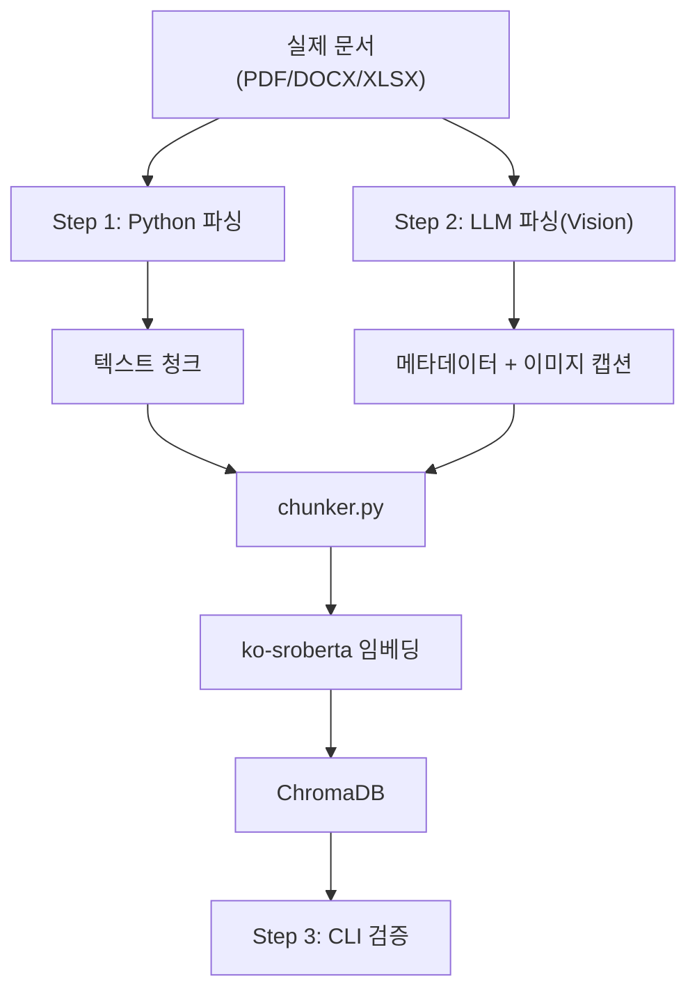

*그림 6-2: 파이프라인 흐름도*

### 1.2 청킹 — 왜 500자인가

**청킹(Chunking)** 은 긴 텍스트를 검색에 적합한 작은 단위로 분할하는 과정입니다. 청크가 너무 크면 LLM이 받는 컨텍스트에 불필요한 내용이 포함되어 답변 품질이 낮아지고, 너무 작으면 문맥이 잘려 의미 전달이 어렵습니다.

이 챕터에서는 **Fixed-size 청킹(고정 크기 청킹)** 방식을 사용합니다. 청크 크기를 500자, 오버랩을 100자(20%)로 고정합니다.

```
원본 텍스트:  [...400자...][...400자...][...400자...]
청크 1:        [________500자_________]
청크 2:               [___100자___][________500자_______]
청크 3:                                    [___100자___][...
```

오버랩이 필요한 이유는 청크 경계에서 문장이 잘릴 때 앞뒤 청크가 100자씩 겹치도록 하여 맥락 손실을 줄이기 위해서입니다. Fixed-size 방식을 기본으로 사용하는 이유는 구현이 단순하고 동작이 예측 가능하기 때문입니다. 의미 단위로 분할하는 Semantic 청킹은 품질이 높지만 처리 속도가 느리고 파라미터 조정이 복잡합니다. 이 방식은 CH10 RAG 튜닝 챕터에서 다룹니다.

### 1.3 임베딩 모델 — ko-sroberta-multitask

**임베딩(Embedding)** 은 텍스트를 수치 벡터로 변환하는 과정입니다. 이 벡터를 VectorDB에 저장하고, 검색 쿼리도 같은 방식으로 벡터화하여 코사인 유사도로 관련 문서를 찾습니다.

이 챕터에서는 **`jhgan/ko-sroberta-multitask`** 모델을 사용합니다. 한국어에 특화된 SRoBERTa 기반 모델로, HuggingFace에서 무료로 다운로드할 수 있습니다. 최초 실행 시 약 400MB를 다운로드하고 로컬 캐시에 저장하므로 이후에는 인터넷 연결 없이 동작합니다. 768차원 벡터를 생성하며, 한국어 문장 유사도 태스크에 특화되어 있습니다.

### 1.4 ChromaDB — 로컬 영속 VectorDB

**VectorDB(벡터 데이터베이스)** 는 임베딩 벡터를 저장하고 유사도 기반 검색을 수행하는 데이터베이스입니다. 일반 RDBMS가 정확한 값 일치로 조회하는 것과 달리, VectorDB는 "의미적으로 비슷한" 문서를 찾아 반환합니다.

**ChromaDB** 는 Python에서 가장 쉽게 사용할 수 있는 오픈소스 VectorDB입니다. 별도 서버 없이 로컬 파일 시스템에 영속 저장(`PersistentClient`)하며, Docker 없이 `pip install`만으로 설치됩니다. 이 챕터에서는 `data/chroma_db/` 폴더에 색인 데이터를 저장합니다.

> **팁: ChromaDB vs 다른 VectorDB**
> Pinecone, Weaviate, Qdrant 등 클라우드 기반 VectorDB와 비교하면 ChromaDB는 로컬 개발과 중소 규모 운영에 적합합니다. 수십만 건 이상의 청크를 다루거나 멀티 서버 배포가 필요한 경우 클라우드 VectorDB 전환을 고려하십시오.

---

## 2. 실습 환경 준비

### 2.1 예제 클론 및 의존성 설치

```bash
cd examples/CH06_VectorDB_구축
```

```bash
pip install -r requirements.txt
```

> **주의: sentence-transformers 설치 시간**
> `sentence-transformers` 패키지는 PyTorch를 포함하므로 설치에 1~3분이 소요될 수 있습니다. Apple Silicon Mac에서는 `pip install torch` 후 설치하는 것이 더 빠릅니다.

`requirements.txt`의 주요 패키지는 다음과 같습니다.

| 패키지 | 버전 | 역할 |
|--------|------|------|
| `pypdf` | 4.3.1 | PDF 텍스트 추출 |
| `python-docx` | 1.1.2 | DOCX 단락·표 추출 |
| `openpyxl` | 3.1.5 | XLSX 시트·셀 추출 |
| `sentence-transformers` | 3.3.1 | ko-sroberta 임베딩 모델 |
| `chromadb` | 1.5.1 | VectorDB 저장 및 검색 |

### 2.2 데이터 폴더 구조 확인

CH05에서 표준화한 문서 6개가 이미 `data/docs/` 폴더에 배치되어 있습니다.

```
examples/CH06_VectorDB_구축/
├── data/
│   ├── docs/                    ← CH05 표준화 문서 (입력)
│   │   ├── hr/
│   │   │   ├── HR_취업규칙_v1.0.pdf
│   │   │   └── HR_정보보안서약서.pdf
│   │   ├── security/
│   │   │   └── SEC_보안규정_v1.0.docx
│   │   ├── ops/
│   │   │   └── OPS_신규서비스_런칭전략.pdf
│   │   └── finance/
│   │       ├── FIN_부서별_예산기안서.xlsx
│   │       └── FIN_2025_상반기_매출현황.xlsx
│   ├── pages/                   ← Vision LLM용 페이지 이미지 (자동 생성)
│   └── chroma_db/               ← ChromaDB 색인 (자동 생성)
└── src/
    ├── extractor.py             ← Step 1: Python 파싱
    ├── vision_extractor.py      ← Step 2: LLM 파싱
    ├── chunker.py               ← 청킹 + 메타데이터 부착
    ├── store.py                 ← 임베딩 + ChromaDB 저장
    ├── cli_search.py            ← Step 3: CLI 검증
    └── main.py                  ← 전체 파이프라인 오케스트레이터
```

---

## 3. [Step 1] Python 파싱 테스트

메타코딩이 처음 시도한 것은 Python 라이브러리로 텍스트를 추출하는 것이었습니다. `pypdf`, `python-docx`, `openpyxl`은 각각 PDF, DOCX, XLSX를 파싱하는 표준 라이브러리입니다. 설치가 간단하고 비용이 들지 않습니다.

<!-- [GEMINI PROMPT: 06_python-parsing]
path: assets/CH06/06_python-parsing.png
A minimalist black and white technical diagram with a strict 16:9 aspect ratio on a solid white background. No shading, no 3D effects, only clean thin line art. Three document icons (PDF, DOCX, XLSX) on the left, each connected by an arrow to their respective library box (pypdf, python-docx, openpyxl) in the center, all three library boxes then connect to a single "텍스트 출력" box on the right. Below the right box, a small warning icon labeled "표/이미지 손실" is shown with a dashed border.
Style: architecture-infographic
-->

*그림 6-3: 형식별 Python 파싱 라이브러리 구조*

### 3.1 extractor.py 핵심 코드 분석

`src/extractor.py`는 PDF, DOCX, XLSX 세 형식을 하나의 인터페이스로 통합합니다. `extract_text()` 함수가 파일 확장자를 자동 감지하여 적절한 파서를 선택합니다.

**다음 코드는 PDF 파일에서 페이지별로 텍스트를 추출합니다.**

```python
def extract_from_pdf(file_path: str | Path) -> dict:
    file_path = Path(file_path)
    pages_data = []

    with open(file_path, "rb") as f:
        reader = pypdf.PdfReader(f)
        for page_num, page in enumerate(reader.pages, start=1):  # ①
            page_text = page.extract_text() or ""               # ②
            pages_data.append({"page": page_num, "text": page_text.strip()})

    full_text = "\n\n".join(p["text"] for p in pages_data if p["text"])  # ③

    return {
        "source_path": str(file_path.resolve()),
        "file_name": file_path.name,
        "file_type": "pdf",
        "pages": pages_data,
        "full_text": full_text,
    }
```

> ① `enumerate(reader.pages, start=1)` — 페이지 번호를 1부터 시작합니다. 나중에 출처 표시 시 "15페이지"처럼 사람이 이해하는 번호를 사용합니다.
> ② `page.extract_text() or ""` — 텍스트 추출에 실패하면 `None` 대신 빈 문자열을 반환합니다. 이미지형 PDF 페이지에서는 텍스트가 추출되지 않아 이 값이 빈 문자열이 됩니다.
> ③ 페이지별 텍스트를 이중 줄바꿈으로 연결하여 전체 텍스트를 생성합니다. 페이지 구분이 가독성과 청킹 경계에 영향을 줍니다.

**다음 코드는 파일 형식을 자동 감지하여 적절한 파서를 호출합니다.**

```python
def extract_text(file_path: str | Path) -> dict:
    suffix = Path(file_path).suffix.lower()

    extractor_map = {
        ".pdf":  extract_from_pdf,   # ①
        ".docx": extract_from_docx,
        ".xlsx": extract_from_xlsx,
    }

    if suffix not in extractor_map:
        raise ValueError(f"지원하지 않는 파일 형식입니다: '{suffix}'")

    return extractor_map[suffix](file_path)   # ②
```

> ① 딕셔너리로 확장자와 파서 함수를 매핑합니다. 새 형식을 추가할 때 딕셔너리에 한 줄만 추가하면 됩니다.
> ② 함수를 값으로 저장하고 직접 호출합니다. `if-elif` 체인 대신 이 패턴을 사용하면 코드가 간결하고 확장하기 쉽습니다.

> **전체 코드: `src/extractor.py`**

### 3.2 Step 1 실행

```bash
python src/main.py --step 1
```

#### Code Workflow

1. **Input**: `data/docs/` 폴더 내 모든 PDF, DOCX, XLSX 파일 경로 목록
2. **Process**: `extract_all_from_directory()` → 파일별로 `extract_text()` 호출 → 형식별 파서 분기 → 페이지/시트별 텍스트 수집
3. **Output**: 파일별 추출 결과 딕셔너리 리스트 + 터미널 요약 출력 (파일명, 페이지 수, 추출 글자 수)

<!-- [CAPTURE NEEDED: 06_step1-result
  path: assets/CH06/06_step1-result.png
  desc: `python src/main.py --step 1` 실행 후 터미널 화면 — 6개 문서 추출 결과 요약 (파일명, 페이지 수, 글자 수, 경고 표시)
] -->

*그림 6-4: Step 1 실행 결과 — 문서별 추출 글자 수와 경고*

### 3.3 Python 파싱의 한계

결과를 보면 흥미로운 사실이 드러납니다.

| 파일명 | 형식 | 추출 글자 수 | 상태 |
|--------|------|------------|------|
| `HR_취업규칙_v1.0.pdf` | PDF (표 포함) | 약 8,000자 | 표 구조 무너짐 |
| `HR_정보보안서약서.pdf` | PDF (이미지 삽입) | 약 500자 | 이미지 안 텍스트 누락 |
| `SEC_보안규정_v1.0.docx` | DOCX (표 포함) | 약 5,000자 | 표는 추출되나 서식 손실 |
| `OPS_신규서비스_런칭전략.pdf` | PDF (차트 포함) | 약 3,000자 | 차트 정보 전혀 없음 |
| `FIN_부서별_예산기안서.xlsx` | XLSX | 약 2,000자 | 시트별 정상 추출 |
| `FIN_2025_상반기_매출현황.xlsx` | XLSX | 약 1,500자 | 시트별 정상 추출 |

메타코딩은 `HR_취업규칙_v1.0.pdf`의 추출 결과를 열어보고 당황했습니다. 원본에서 명확한 구조를 가진 표의 내용이 셀 순서 없이 한 줄로 이어붙여져 있었습니다. "3일", "연차", "근속 1년 미만" 같은 값들이 섞여 어느 조건에 해당하는 연차인지 알 수 없었습니다.

Python 파싱은 다음 상황에서 한계를 드러냅니다.

- **표가 많은 PDF**: 셀 순서가 뒤섞여 의미를 파악하기 어렵습니다.
- **이미지형 PDF**: 이미지로 구성된 페이지는 텍스트가 거의 추출되지 않습니다.
- **차트·그래프**: 이미지로 삽입된 차트는 전혀 읽히지 않습니다.

DOCX와 XLSX는 Python 파싱으로 충분합니다. 문제는 표와 이미지가 포함된 PDF입니다. 이것이 Step 2가 필요한 이유입니다.

---

## 4. [Step 2] LLM 파싱 — Vision LLM으로 문서 이해

**Vision LLM** 은 이미지를 입력으로 받아 텍스트로 설명할 수 있는 멀티모달 LLM(대형 언어 모델)입니다. PDF의 각 페이지를 이미지로 변환한 뒤 Vision LLM에 전달하면, LLM이 표의 구조, 차트의 내용, 이미지 안의 텍스트까지 이해하여 구조화된 텍스트로 반환합니다.

이 챕터에서는 Ollama에서 실행 가능한 **LLaVA(Large Language and Vision Assistant)** 모델을 사용합니다.

### 4.1 Python 파싱 vs LLM 파싱 비교

| 항목 | Python 파싱 | LLM 파싱 |
|------|------------|---------|
| 텍스트형 PDF | 정상 추출 | 정상 추출 (비용 과잉) |
| 이미지형 PDF | 텍스트 거의 없음 | 텍스트 정상 추출 |
| 표 구조 | 구조 무너짐 | 구조 이해 가능 |
| 이미지/차트 | 완전 누락 | 내용 설명 가능 |
| 처리 속도 | 빠름 (초 단위) | 느림 (분 단위) |
| 비용 | 무료 | API 또는 GPU 필요 |
| 메타데이터 자동 추출 | 불가 | 제목·부서·날짜 추출 가능 |

LLM 파싱은 품질은 높지만 처리 시간과 비용이 듭니다. 실무 전략은 **두 방법을 조합** 하는 것입니다. DOCX, XLSX, 텍스트형 PDF는 Python 파싱으로 처리하고, 이미지가 많거나 표 구조가 복잡한 PDF만 LLM 파싱을 적용합니다.

### 4.2 vision_extractor.py 핵심 코드 분석

`src/vision_extractor.py`는 PDF 페이지를 이미지로 변환하고 LLaVA에 전달하여 구조화된 결과를 반환합니다.

> **주의: vision_extractor.py 실행 요건**
> LLaVA 모델은 Ollama가 실행 중이어야 합니다. `ollama run llava:7b` 명령으로 모델을 미리 다운로드하십시오. 처음 실행 시 약 4GB를 다운로드합니다. 메모리가 부족한 경우 `llava:7b` 대신 `llava:7b-v1.6` 을 사용하십시오.

```python
def analyze_page_with_llm(
    image_path: Path,
    ollama_url: str,
    model_name: str,
) -> dict:
    """PDF 페이지 이미지를 Vision LLM으로 분석합니다."""
    with open(image_path, "rb") as f:
        image_data = base64.b64encode(f.read()).decode("utf-8")  # ①

    prompt = (
        "이 문서 페이지를 분석하여 다음을 추출하십시오:\n"
        "1. 모든 텍스트 내용 (표, 목록, 단락 포함)\n"
        "2. 표가 있다면 표의 구조와 모든 셀 값\n"
        "3. 이미지나 차트가 있다면 내용 설명\n"
        "4. 문서 제목, 부서명, 날짜 (있는 경우)\n"
        "응답은 구조화된 텍스트로 작성하십시오."
    )

    payload = {
        "model": model_name,
        "prompt": prompt,
        "images": [image_data],   # ②
        "stream": False,
    }

    response = requests.post(f"{ollama_url}/api/generate", json=payload)
    result = response.json()

    return {                       # ③
        "text": result.get("response", ""),
        "image_path": str(image_path),
        "has_image": True,
    }
```

> ① PDF 페이지 이미지를 Base64로 인코딩합니다. Ollama API는 이미지를 Base64 문자열로 전달받습니다.
> ② `"images"` 필드에 인코딩된 이미지를 리스트로 전달합니다. 한 번에 여러 이미지를 전달할 수 있으나 여기서는 페이지별로 처리합니다.
> ③ LLM이 반환한 구조화 텍스트와 원본 이미지 경로를 함께 반환합니다. 이 이미지 경로는 나중에 ChromaDB 메타데이터에 저장되어 검색 결과에서 원본 페이지를 참조할 수 있게 합니다.

> **전체 코드: `src/vision_extractor.py`**

메타코딩은 LLaVA에 취업규칙 PDF 4페이지(연차 계산 표가 있는 페이지)를 보내보았습니다. Python 파싱에서는 "3일연차근속 1년미만" 식으로 뒤섞였던 내용이, LLM 파싱에서는 "근속 1년 미만: 3일, 1~3년: 10일, 3년 이상: 15일" 형태로 구조화되어 반환되었습니다.

> **참고: LLM 응답은 실행할 때마다 달라집니다**
> Vision LLM이 생성하는 텍스트는 비결정적입니다. 같은 페이지를 분석해도 표현 방식이 달라질 수 있습니다. 중요한 것은 표의 핵심 수치(3일, 10일, 15일)와 조건(근속 연수)이 올바르게 추출되는지 여부입니다.

---

## 5. Chunk 설계 — 청킹과 메타데이터 부착

텍스트 추출이 완료되면 청킹 단계로 넘어갑니다. `src/chunker.py`는 추출 결과를 500자 단위로 분할하고 각 청크에 메타데이터를 부착합니다.

### 5.1 chunker.py 핵심 코드 분석

**다음 코드는 텍스트를 Fixed-size 방식으로 청크로 분할합니다.**

```python
DEFAULT_CHUNK_SIZE = 500
DEFAULT_OVERLAP = 100

def split_text_into_chunks(
    text: str,
    chunk_size: int = DEFAULT_CHUNK_SIZE,
    overlap: int = DEFAULT_OVERLAP,
) -> list[str]:
    text = text.strip()
    if not text:
        return []

    chunks = []
    step = chunk_size - overlap   # ① 이동 단계 = 500 - 100 = 400자
    start = 0

    while start < len(text):
        end = start + chunk_size
        chunk = text[start:end].strip()
        if chunk:
            chunks.append(chunk)
        start += step             # ② 400자씩 앞으로 이동

    return chunks
```

> ① `step = chunk_size - overlap` — 이동 단계를 400자로 설정합니다. 청크 1은 0~500자, 청크 2는 400~900자, 청크 3은 800~1300자 순으로 100자씩 겹칩니다.
> ② `start += step` — 매번 400자씩 이동합니다. 오버랩 덕분에 청크 경계에서 잘리는 문장도 다음 청크에서 다시 포함됩니다.

**다음 코드는 텍스트 청크에 출처 추적을 위한 메타데이터를 부착합니다.**

```python
def build_text_chunk(
    chunk_text: str,
    doc_id: str,
    file_name: str,
    file_type: str,
    source_path: str,
    page: int,
    chunk_index: int = 0,
    ...
) -> dict:
    chunk_id = f"{doc_id}_text_p{page:03d}_c{chunk_index:04d}"  # ①

    return {
        "id": chunk_id,
        "text": chunk_text,
        "metadata": {
            "doc_id": doc_id,
            "file_name": file_name,    # ② 출처 파일명
            "page": page,              # ③ 출처 페이지
            "department": department,  # ④ 부서 (Self-Query 필터에 사용)
            "chunk_type": "text",
        },
    }
```

> ① 청크 ID는 `{문서ID}_text_p{페이지:3자리}_c{청크순번:4자리}` 형식입니다. 중복 실행 시 같은 ID로 upsert되어 데이터 중복을 방지합니다.
> ② `file_name` — 검색 결과에서 "출처: HR_취업규칙_v1.0.pdf"처럼 표시할 때 사용합니다.
> ③ `page` — 몇 페이지에서 나온 청크인지 추적합니다. "15페이지"를 직접 열어 확인할 수 있게 합니다.
> ④ `department` — CH10의 Self-Query Retriever에서 "인사팀 문서만 검색"처럼 필터 조건으로 활용됩니다. CH05에서 파일명 규칙을 설정한 이유가 여기서 나타납니다.

**이미지 캡션 청크는 Vision LLM이 생성한 설명을 텍스트 청크와 동일한 형식으로 저장합니다.**

```python
def build_image_caption_chunk(
    caption: str,
    image_path: str,
    ...
) -> dict:
    chunk_id = f"{doc_id}_img_p{page:03d}_c{chunk_index:04d}"
    caption_text = f"[이미지 캡션] {caption}"   # ①

    return {
        "id": chunk_id,
        "text": caption_text,
        "metadata": {
            ...
            "chunk_type": "image_caption",
            "image_path": image_path,             # ②
        },
    }
```

> ① 이미지 캡션 앞에 `[이미지 캡션]` 접두사를 붙입니다. 검색 결과에서 이 청크가 이미지 설명임을 명시적으로 표시합니다.
> ② `image_path` — 원본 페이지 이미지 파일 경로입니다. CLI 검색 결과에서 "캡처본: data/pages/HR_취업규칙_v1.0_p004.png"처럼 표시되어, 답변의 근거가 된 이미지를 직접 확인할 수 있습니다.

텍스트 청크와 이미지 캡션 청크를 함께 ChromaDB에 저장하는 이유는 실무 문서가 텍스트만으로 완전하지 않기 때문입니다. "연차 계산 표"나 "매출 차트"처럼 이미지에 핵심 정보가 있는 경우, 이미지 캡션 청크가 없으면 관련 질문에 전혀 답변할 수 없습니다.

> **전체 코드: `src/chunker.py`**

---

## 6. 임베딩 & VectorDB 저장

청크 리스트가 준비되면 `src/store.py`가 임베딩과 ChromaDB 저장을 담당합니다.

### 6.1 store.py 핵심 코드 분석

**다음 코드는 청크 리스트를 임베딩하여 ChromaDB에 배치 저장합니다.**

```python
BATCH_SIZE = 64
DEFAULT_EMBEDDING_MODEL = "jhgan/ko-sroberta-multitask"

def store_chunks_to_chroma(
    chunks: list[dict],
    chroma_dir: str = DEFAULT_CHROMA_DIR,
    collection_name: str = DEFAULT_COLLECTION_NAME,
    embedding_model_name: str = DEFAULT_EMBEDDING_MODEL,
) -> dict:
    # Step 1: 임베딩 모델 로드
    model = SentenceTransformer(embedding_model_name)   # ①

    # Step 2: ChromaDB 클라이언트 초기화
    client = chromadb.PersistentClient(
        path=chroma_dir,
        settings=Settings(anonymized_telemetry=False),  # ②
    )
    collection = client.get_or_create_collection(
        name=collection_name,
        metadata={"hnsw:space": "cosine"},              # ③
    )

    # Step 3: 배치 단위 임베딩 + upsert
    ids = [c["id"] for c in chunks]
    documents = [c["text"] for c in chunks]
    metadatas = [c["metadata"] for c in chunks]

    all_embeddings = []
    for i in range(0, len(documents), BATCH_SIZE):
        batch = documents[i : i + BATCH_SIZE]
        embeddings = model.encode(
            batch,
            normalize_embeddings=True,                  # ④
        )
        all_embeddings.extend(embeddings.tolist())

    collection.upsert(                                  # ⑤
        ids=ids,
        documents=documents,
        embeddings=all_embeddings,
        metadatas=metadatas,
    )
```

> ① `SentenceTransformer(embedding_model_name)` — HuggingFace에서 모델을 다운로드합니다. 최초 실행 시 약 400MB를 다운로드하고 이후에는 로컬 캐시를 재사용합니다.
> ② `anonymized_telemetry=False` — ChromaDB의 익명 사용 통계 수집을 비활성화합니다. 사내 데이터를 처리하는 환경에서 권장하는 설정입니다.
> ③ `"hnsw:space": "cosine"` — 코사인 유사도로 벡터 거리를 계산합니다. 문장 임베딩은 코사인 유사도가 유클리드 거리보다 의미 유사성을 더 잘 반영합니다.
> ④ `normalize_embeddings=True` — 임베딩 벡터를 단위 벡터로 정규화합니다. 코사인 유사도 계산 시 벡터 크기의 영향을 제거하여 순수하게 방향 유사성만 비교합니다.
> ⑤ `collection.upsert()` — insert와 update를 합친 연산입니다. 같은 ID의 청크가 이미 존재하면 덮어쓰고, 없으면 새로 추가합니다. 파이프라인을 반복 실행해도 데이터가 중복 저장되지 않습니다.

> **전체 코드: `src/store.py`**

### 6.2 전체 파이프라인 실행 (Step 1 + 2)

이제 Step 1(Python 파싱)과 Step 2(청킹 + 임베딩 + ChromaDB 저장)를 한 번에 실행합니다.

```bash
python src/main.py
```

#### Code Workflow

1. **Input**: `data/docs/` 폴더 내 PDF, DOCX, XLSX 파일 6개 + 청킹 파라미터 (chunk_size=500, overlap=100)
2. **Process**:
   - `step1_python_parsing()` — 6개 문서 텍스트 추출
   - `chunk_all_documents()` — 페이지별 텍스트를 500자 단위로 분할 + 메타데이터 부착
   - `store_chunks_to_chroma()` — ko-sroberta 임베딩 → 64개 배치 단위 ChromaDB upsert
3. **Output**: `data/chroma_db/` 에 ChromaDB 색인 저장 + 터미널 요약 (총 청크 수, 저장 시간)

<!-- [CAPTURE NEEDED: 06_pipeline-complete
  path: assets/CH06/06_pipeline-complete.png
  desc: `python src/main.py` 실행 완료 후 터미널 화면 — Step 1, Step 2 순서로 완료 메시지가 표시되고 총 청크 수와 ChromaDB 저장 완료 메시지가 보이는 상태
] -->

*그림 6-5: main.py 실행 완료 — Step 1, 2 순서로 완료*

> **팁: 처음 실행 시 모델 다운로드**
> ko-sroberta-multitask 모델 최초 다운로드에 몇 분이 소요될 수 있습니다. 다운로드 완료 후 `임베딩 모델 로드 완료 (벡터 차원: 768)` 메시지가 출력되면 정상입니다. 이후 실행에서는 로컬 캐시를 사용하므로 즉시 로드됩니다.

---

## 7. [Step 3] CLI 검증 — 쿼리로 근거 확인

ChromaDB 색인이 완성되었습니다. 이제 실제로 검색이 잘 되는지 확인할 차례입니다. `src/cli_search.py`는 터미널에서 자연어 쿼리를 입력하면 관련 청크, 출처 파일명, 페이지 번호, 유사도 점수를 즉시 반환합니다.

웹 UI를 만들기 전에 CLI로 먼저 검증하는 이유는 VectorDB 품질을 빠르게 확인하기 위해서입니다. 웹 UI 개발에는 시간이 걸리지만, CLI 검색은 파이프라인이 완성되는 즉시 실행할 수 있습니다. 문제가 있다면 이 단계에서 파악하는 것이 훨씬 효율적입니다.

### 7.1 CLI 검색 실행

**단일 쿼리 모드** 로 특정 질문 하나를 검색합니다.

```bash
python src/cli_search.py --query "연차 사용 규정"
```

**대화형 모드** 로 반복 검색을 실행합니다.

```bash
python src/cli_search.py
```

대화형 모드에서는 쿼리를 계속 입력할 수 있고, `quit` 또는 `exit`를 입력하면 종료됩니다.

### 7.2 cli_search.py 핵심 코드 분석

**다음 코드는 쿼리를 임베딩하여 ChromaDB에서 유사 청크를 검색하고 결과를 터미널에 출력합니다.**

```python
def format_distance_as_similarity(distance: float) -> float:
    """코사인 거리를 유사도 백분율로 변환합니다."""
    return max(0.0, (1.0 - distance / 2.0)) * 100   # ①

def print_search_result(result: dict) -> None:
    pct = format_distance_as_similarity(result["distance"])
    meta = result["metadata"]
    file_name = meta.get("file_name", "알 수 없음")
    page = meta.get("page", "-")
    image_path = meta.get("image_path", "")

    print(f"  유사도 {pct:.1f}%")
    print(f"  출처: {file_name}  |  페이지: {page}")   # ②
    print(f"  {result['text'][:200]}...")

    if image_path:                                      # ③
        print(f"  캡처본: {image_path}")
```

> ① ChromaDB cosine 공간에서 distance 범위는 0(완전 일치)~2(완전 반대)입니다. `(1 - distance/2) * 100` 으로 직관적인 0~100% 유사도로 변환합니다. 80% 이상이면 관련도가 높은 청크입니다.
> ② 출처 파일명과 페이지 번호를 표시합니다. "HR_취업규칙_v1.0.pdf, 15페이지"처럼 원본을 바로 확인할 수 있습니다.
> ③ 이미지 캡션 청크의 경우 원본 페이지 캡처본 경로를 함께 표시합니다. 검색 결과의 근거가 된 차트나 표를 직접 열어볼 수 있습니다.

> **전체 코드: `src/cli_search.py`**

#### Code Workflow

1. **Input**: 자연어 쿼리 문자열 (예: "연차 사용 규정"), 반환 개수 (기본 top_k=5)
2. **Process**: 쿼리 텍스트를 ko-sroberta로 임베딩 → ChromaDB 코사인 유사도 검색 → 상위 k개 결과 반환
3. **Output**: 터미널에 순위별 청크 텍스트 + 출처 파일명 + 페이지 + 유사도 점수 + 이미지 캡처본 경로

### 7.3 검색 품질 확인

<!-- [CAPTURE NEEDED: 06_cli-search-result
  path: assets/CH06/06_cli-search-result.png
  desc: `python src/cli_search.py --query "연차 사용 규정"` 실행 결과 — 유사도 점수, 출처 파일명(HR_취업규칙_v1.0.pdf), 페이지 번호, 관련 텍스트가 터미널에 출력된 화면
] -->

*그림 6-6: "연차 사용 규정" 쿼리 검색 결과 — 출처와 유사도 함께 표시*

검색 결과를 해석하는 기준은 다음과 같습니다.

| 유사도 | 의미 | 조치 |
|--------|------|------|
| 80% 이상 | 관련도 높음 | 정상 |
| 70~80% | 관련도 보통 | 청크 크기 또는 임베딩 모델 검토 |
| 70% 미만 | 관련도 낮음 | 쿼리 표현 방식 또는 문서 내용 확인 |

다음 쿼리들로 다양한 검색을 시험해 보십시오.

```bash
python src/cli_search.py --query "비밀번호 정책"
python src/cli_search.py --query "신규 서비스 출시 전략"
python src/cli_search.py --query "부서별 예산 현황"
```

> **참고: 검색 결과 개수 조정**
> 기본은 top_k=5이지만 `--top-k` 옵션으로 변경할 수 있습니다. `--top-k 3`으로 줄이면 가장 관련 있는 청크만 확인할 수 있고, `--top-k 10`으로 늘리면 더 넓은 범위를 검토할 수 있습니다.

---

## 8. 정리하며

메타코딩은 이 챕터를 시작할 때 PDF 파일을 열어보고 "표가 가득하고 차트가 있는데 텍스트만 뽑으면 의미가 날아간다"고 걱정했습니다. Python 파싱으로 먼저 시도해보니 그 우려가 사실이었습니다. 표 구조가 무너지고 이미지 안의 텍스트는 전혀 추출되지 않았습니다.

Vision LLM을 적용하니 표의 구조가 살아났고, 차트 내용도 텍스트로 설명되었습니다. 청킹과 임베딩을 거쳐 ChromaDB에 저장한 후, CLI에서 "연차 사용 규정"을 입력하자 HR 취업규칙 문서의 관련 조항과 출처가 1초 이내에 반환되었습니다.

<!-- [GEMINI PROMPT: 06_before-after]
path: assets/CH06/06_before-after.png
A minimalist black and white technical diagram with a strict 16:9 aspect ratio on a solid white background. No shading, no 3D effects, only clean thin line art. Simple before/after comparison: LEFT side labeled "Before" shows a person icon with a thought bubble containing a folder icon and "10~30분 검색" text with a downward-pointing arrow indicating inefficiency. RIGHT side labeled "After" shows a terminal icon with text "1초 미만" and an upward-pointing arrow. Center shows a large right-pointing arrow labeled "VectorDB 구축". Clean flat design, balanced layout.
Style: before-after-infographic
-->

*그림 6-7: VectorDB 구축 전후 문서 검색 방식 비교*

| 지표 | Before | After |
|------|--------|-------|
| 문서 검색 방식 | 파일명으로 수동 탐색 | 의미 기반 벡터 검색 |
| 검색 소요 시간 | 10~30분 (폴더 탐색) | 1초 미만 (CLI 쿼리) |
| 표·차트 정보 | 텍스트 추출 시 손실 | Vision LLM 캡션으로 보존 |
| 검색 정확도(top-5) | 해당 없음 | 80%+ 관련 문서 포함 |
| 출처 확인 | 파일 직접 열어 검색 | 파일명 + 페이지 즉시 표시 |

이 챕터에서 배운 핵심 내용을 정리합니다.

- **Python 파싱의 범위와 한계**: `pypdf`, `python-docx`, `openpyxl`은 텍스트형 문서에 효과적이지만, 이미지형 PDF와 복잡한 표에서는 정보 손실이 발생합니다. 두 방법을 조합하는 전략이 실무에서 현실적입니다.
- **Vision LLM의 역할**: LLaVA처럼 이미지를 이해하는 멀티모달 LLM은 표 구조, 차트, 이미지 안의 텍스트를 구조화된 형태로 추출합니다. 텍스트 추출이 불가능한 영역을 보완합니다.
- **Fixed-size 청킹의 선택 이유**: 500자 + 100자 오버랩 구성은 구현이 단순하고 동작이 예측 가능합니다. 품질 개선이 필요하면 CH10에서 Semantic 청킹으로 전환합니다.
- **메타데이터가 검색 품질을 결정한다**: 청크마다 파일명·페이지·부서 정보를 부착해야 검색 결과에서 출처를 명확히 표시하고, 나중에 부서별 필터링도 적용할 수 있습니다.
- **ChromaDB upsert**: 같은 ID의 청크는 중복 저장되지 않으므로 파이프라인을 반복 실행해도 안전합니다.

다음 챕터에서는 이 ChromaDB 색인을 RAG 체인과 연결하여 자연어 질문에 답변하는 웹 채팅 UI를 구현합니다. CLI에서 확인한 검색 품질이 실제 LLM 답변의 정확도로 이어집니다.


---

# 7. RAG로 Q&A 엔진 만들기

<!-- [GEMINI PROMPT: 07_opening-story]
path: assets/CH07/07_opening-story.png
Warm office illustration: A developer sitting alone at a desk, looking at a terminal screen showing CLI text output on the left monitor, while imagining a chat bubble interface on the right. The developer has a thoughtful expression, with sticky notes saying "직원들은 터미널 못 쓴다" and "웹 UI 필요". Soft warm beige and light blue color palette, friendly cartoon style, clean white background with subtle desk and monitor elements, no text overlay.
Style: office-illustration-warm
-->

*그림 7-1: CLI 검색만으로는 직원들이 사용할 수 없다는 것을 깨달은 메타코딩*

CH06에서 ChromaDB 인덱스를 구축한 메타코딩은 CLI에서 "신입사원 온보딩 절차"를 검색하자 관련 문서 청크 5개가 즉시 출력되는 것을 확인하였습니다. 하지만 곧 문제가 보였습니다. 이 도구는 터미널 명령어를 아는 개발자만 사용할 수 있습니다. 직원 30명 중 터미널을 편하게 다루는 사람은 메타코딩 본인뿐입니다.

"직원들에게 '터미널에서 `python src/cli_search.py` 명령어를 입력하세요'라고 안내할 수는 없습니다."

브라우저에서 자연어로 질문하고, 출처가 포함된 답변을 받을 수 있는 채팅 UI가 필요합니다. 그리고 실제 업무 상황을 생각해보면 한 가지 질문만으로 끝나는 경우는 드뭅니다. "아까 물어본 건데, 그것 말고 다른 부서 규정은?" — 이전 대화를 이어서 질문하는 멀티턴 대화도 지원해야 합니다.

이 챕터에서는 다음 세 가지를 구현합니다.

1. **LCEL(LangChain Expression Language)** 기반 RAG 체인으로 질문 → 검색 → 답변 파이프라인 조립
2. 출처가 포함된 구조화된 응답 포맷과 **출처 아코디언 채팅 UI** 구현
3. 세션 기반 **멀티턴 대화** 관리로 이전 대화 맥락 유지

---

## 1. RAG Q&A 엔진의 구조

### 1.1 전체 흐름

사용자가 브라우저 채팅창에 질문을 입력하면 어떤 일이 일어나는지 먼저 살펴보겠습니다.

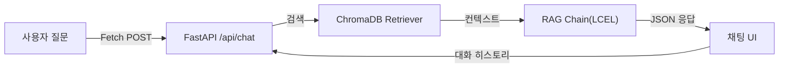

*그림 7-2: CH07 RAG Q&A 엔진 전체 흐름*

질문은 Fetch POST 방식으로 `/api/chat` 엔드포인트에 도달합니다. FastAPI가 이를 받아 RAG 체인에 전달하면, 체인은 ChromaDB에서 관련 문서를 검색하고 LLM으로 답변을 생성하여 JSON 형태로 반환합니다. 채팅 UI는 그 JSON에서 답변과 출처를 꺼내 화면에 표시합니다. 멀티턴 대화를 위해 세션 히스토리도 함께 주고받습니다.

### 1.2 LCEL이란 무엇인가

**LCEL(LangChain Expression Language)** 은 LangChain의 선언적 체인 조합 문법입니다. Python의 파이프 연산자(`|`)를 사용하여 Retriever, Prompt, LLM, OutputParser 같은 구성 요소를 하나의 체인으로 연결합니다.

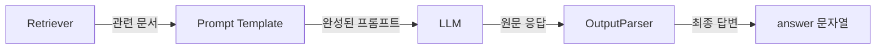

*그림 7-3: LCEL 파이프라인 구성 요소*

각 구성 요소의 역할을 정리하면 다음과 같습니다.

| 구성 요소 | 역할 |
|----------|------|
| **Retriever** | ChromaDB에서 질문과 의미적으로 유사한 문서를 검색하여 반환합니다. |
| **Prompt Template** | LLM에 전달할 지시문(시스템 규칙 + 컨텍스트 + 질문)을 조립합니다. |
| **LLM** | DeepSeek R1 등 언어 모델이 프롬프트를 읽고 답변을 생성합니다. |
| **OutputParser** | LLM 응답 객체에서 순수 문자열만 추출합니다. `StrOutputParser()`가 담당합니다. |

LCEL을 사용하는 이유는 두 가지입니다. 첫째, 파이프 연산자 덕분에 데이터 흐름이 왼쪽에서 오른쪽으로 한눈에 보입니다. 둘째, 구성 요소를 독립적으로 교체할 수 있어 Ollama 모델을 OpenAI 모델로 바꾸거나 ChromaDB를 다른 VectorDB로 전환할 때 체인 코드를 수정할 필요가 없습니다.

> **참고: temperature 파라미터**
> LLM의 출력 무작위성을 조절하는 값입니다. 0에 가까우면 가장 확률이 높은 단어를 선택하여 일관된 답변을 생성하고, 1에 가까우면 다양한 표현을 시도합니다. 사실 기반 Q&A에서는 `temperature=0.1` 처럼 낮은 값을 사용합니다.

---

## 2. 실습 환경 준비

### 2.1 저장소 클론 및 환경 설정

```bash
git clone https://github.com/metacoding/rag-ebook-examples.git
cd rag-ebook-examples/examples/CH07_RAG_QA_엔진
python3 -m venv .venv
source .venv/bin/activate   # Windows: .venv\Scripts\Activate.ps1
```

`.env.example`을 `.env`로 복사하고 설정값을 입력합니다.

```bash
cp .env.example .env
```

`.env` 파일의 주요 설정 항목은 다음과 같습니다.

```
# LLM 제공자: ollama(로컬) 또는 openai(클라우드)
LLM_PROVIDER=ollama
OLLAMA_BASE_URL=http://localhost:11434
OLLAMA_MODEL=deepseek-r1:8b

# 임베딩 모델 (CH06과 동일)
EMBEDDING_MODEL=jhgan/ko-sroberta-multitask

# ChromaDB 경로 (없으면 data/docs/에서 자동 구축)
CHROMA_PERSIST_DIR=./data/chroma_db

# 세션 설정
SESSION_TTL_SECONDS=3600
CONVERSATION_WINDOW_SIZE=5
```

> **팁: ChromaDB 자동 구축**
> 이 챕터의 예제 프로젝트에는 원본 문서 6종이 `data/docs/`에 포함되어 있습니다. 서버를 처음 실행하면 이 문서를 자동으로 파싱·청킹·임베딩하여 `data/chroma_db/`에 VectorDB를 구축합니다. CH06의 출력을 별도로 복사할 필요가 없습니다.

### 2.2 의존성 설치

> **주의: 패키지 설치 시간**
> `sentence-transformers`와 `chromadb`는 처음 설치 시 수백 MB의 파일을 내려받습니다. 네트워크 속도에 따라 수 분이 걸릴 수 있습니다.

```bash
pip install -r requirements.txt
```

주요 패키지와 역할은 다음과 같습니다.

| 패키지 | 버전 | 역할 |
|--------|------|------|
| `langchain` | 0.3.21 | LCEL 체인 조합 프레임워크 |
| `langchain-ollama` | 0.2.3 | Ollama LLM 연결 |
| `langchain-chroma` | 0.2.6 | ChromaDB 연동 |
| `chromadb` | 1.5.1 | 벡터 데이터베이스 |
| `sentence-transformers` | 3.3.1 | 한국어 임베딩 모델 |
| `fastapi` | 0.115.8 | 채팅 API 서버 |
| `uvicorn` | 0.34.0 | ASGI 서버 |
| `jinja2` | 3.1.5 | HTML 템플릿 엔진 |

### 2.3 서버 실행

```bash
python app/main.py
```

터미널에 다음과 같은 메시지가 출력되면 정상입니다.

```
[INFO] 서버 시작: http://0.0.0.0:8000
[INFO] 채팅 UI: http://localhost:8000/chat
[INFO] ChromaDB가 없습니다. data/docs/ 원본 문서에서 자동 구축합니다.
[INFO] ChromaDB 자동 구축 완료: 87건 → ./data/chroma_db
```

브라우저에서 `http://localhost:8000/chat` 을 열면 채팅 UI가 표시됩니다.

<!-- [CAPTURE NEEDED: 07_chat-ui-initial
  path: assets/CH07/07_chat-ui-initial.png
  desc: 브라우저에서 http://localhost:8000/chat 접속 시 초기 채팅 UI 화면 — "메타코딩 Q&A 비서입니다" 환영 메시지가 표시된 상태
] -->

*그림 7-4: 브라우저에서 확인한 CH07 채팅 UI 초기 화면*

---

## 3. RAG 최소 동작 구현 — LCEL 기반 RAG 체인

메타코딩이 처음 만든 것은 RAG 체인의 핵심 로직입니다. CLI 검색에서는 ChromaDB 검색 결과를 그냥 출력하기만 했지만, 이번에는 검색 결과를 LLM에 넘겨서 자연어 답변을 생성해야 합니다.

### 3.1 RAG 체인 구현

`src/rag_chain.py`의 핵심 함수 `build_rag_chain()`을 살펴보겠습니다.

```python
# src/rag_chain.py (핵심 발췌)

def build_rag_chain() -> tuple[Any, Any]:
    llm = _build_llm()             # ① LLM 인스턴스 생성
    retriever = _build_retriever() # ② Retriever 생성 (ChromaDB)

    prompt = ChatPromptTemplate.from_messages(
        [
            ("system", RAG_SYSTEM_PROMPT),
            ("human", RAG_HUMAN_PROMPT),
        ]
    )

    # LCEL 파이프: 입력 dict에서 각 키를 꺼내 병렬 처리 후 프롬프트로 합침
    chain = (
        {
            "context": itemgetter("question") | retriever | _format_docs,
            "history": itemgetter("history"),
            "question": itemgetter("question"),
        }
        | prompt
        | llm
        | StrOutputParser()
    )

    return chain, retriever
```

> 전체 코드: `src/rag_chain.py`

#### Code Workflow

1. **Input**: `{"question": "신입사원 온보딩 절차는?", "history": "없음"}` 형식의 딕셔너리
2. **Process**:
   - `itemgetter("question")` 으로 질문 문자열을 추출하여 `retriever`에 전달합니다.
   - `retriever`는 ChromaDB에서 의미적으로 유사한 문서 청크 5개를 검색합니다.
   - `_format_docs()`가 검색된 문서들을 `[문서 1] 출처: HR_취업규칙_v1.0 (p.3)\n...` 형식으로 변환합니다.
   - 세 개의 값(`context`, `history`, `question`)이 `prompt`에 채워지고, LLM에 전달됩니다.
   - `StrOutputParser()`가 LLM 응답 객체에서 순수 문자열만 추출합니다.
3. **Output**: LLM이 생성한 답변 문자열. 프롬프트 규칙에 따라 `[출처: 문서명]` 이 포함됩니다.

LCEL 체인에서 중괄호(`{}`) 블록은 여러 키를 동시에 처리하는 **병렬 실행 단계** 입니다. `context`를 만들기 위해 질문을 검색하는 동안, `history`와 `question`은 그대로 전달됩니다. 이 세 값이 모두 준비되면 `prompt` 단계로 넘어갑니다.

### 3.2 LLM Provider 전환 구조

`_build_llm()` 함수는 `.env`의 `LLM_PROVIDER` 값에 따라 Ollama 또는 OpenAI 인스턴스를 반환합니다. 체인 코드를 수정하지 않아도 `.env` 한 줄만 바꾸면 LLM을 전환할 수 있습니다.

```python
# src/rag_chain.py (발췌)

def _build_llm() -> Any:
    provider = os.getenv("LLM_PROVIDER", "ollama").lower()

    if provider == "ollama":
        from langchain_ollama import ChatOllama
        return ChatOllama(
            base_url=os.getenv("OLLAMA_BASE_URL", "http://localhost:11434"),
            model=os.getenv("OLLAMA_MODEL", "deepseek-r1:8b"),
            temperature=0.1,
        )
    elif provider == "openai":
        from langchain_openai import ChatOpenAI
        return ChatOpenAI(
            api_key=os.getenv("OPENAI_API_KEY"),
            model=os.getenv("OPENAI_MODEL", "gpt-4o-mini"),
            temperature=0.1,
        )
```

> 전체 코드: `src/rag_chain.py`

#### Code Workflow

1. **Input**: `.env` 파일의 `LLM_PROVIDER` 환경 변수 값
2. **Process**: `if/elif` 분기로 해당 LLM 클래스를 조건부로 임포트하고 인스턴스를 생성합니다. `temperature=0.1`은 사실 기반 Q&A에 적합한 낮은 무작위성 설정입니다.
3. **Output**: `ChatOllama` 또는 `ChatOpenAI` 인스턴스. 두 클래스 모두 동일한 LangChain 인터페이스를 따르므로 체인 코드에서 구별 없이 사용됩니다.

> **팁: OpenAI로 전환하는 방법**
> `.env`에서 `LLM_PROVIDER=openai`와 `OPENAI_API_KEY=sk-...`를 설정하면 됩니다. 서버를 재시작하면 즉시 적용됩니다.

---

## 4. RAG 프롬프트 기본 템플릿

### 4.1 출처 강제 규칙

RAG 시스템에서 **출처 강제 규칙** 은 신뢰도의 핵심입니다. 이 규칙이 없으면 LLM이 학습 데이터에서 그럴듯한 답변을 만들어낼 수 있습니다. 사용자는 그 답변이 실제 사내 문서 기반인지, LLM의 추측인지 구분할 수 없습니다.

`rag_chain.py`에 정의된 시스템 프롬프트를 살펴보겠습니다.

```python
# src/rag_chain.py (발췌)

RAG_SYSTEM_PROMPT = """당신은 메타코딩 사내 문서 Q&A 비서입니다.
아래에 제공된 문서(Context)만 사용하여 질문에 답변하십시오.

규칙:
1. 반드시 제공된 문서에서만 근거를 찾아 답변하시오.
2. 문서에서 답을 찾을 수 없으면 "해당 내용은 제공된 문서에서 확인되지 않습니다."라고 답하시오.
3. 답변 마지막에 근거 문서명을 반드시 명시하시오. 형식: [출처: 문서명]
4. 추측이나 외부 지식을 사용하지 마시오.

Context (제공된 문서):
{context}

이전 대화:
{history}
"""

RAG_HUMAN_PROMPT = "질문: {question}"
```

### 4.2 프롬프트 설계 패턴

이 프롬프트는 세 개의 블록으로 구성됩니다.


*그림 7-5: RAG 프롬프트 구조 — 시스템 역할, 컨텍스트, 대화 히스토리, 질문*

- **시스템 역할 정의**: LLM에게 "사내 문서 Q&A 비서"라는 역할과 4가지 규칙을 명시합니다.
- **컨텍스트 블록** (`{context}`): `_format_docs()`가 변환한 검색 결과가 여기에 채워집니다.
- **이전 대화 블록** (`{history}`): 멀티턴 대화를 위한 이전 대화 내역이 여기에 들어갑니다. 첫 질문일 때는 "없음"이 입력됩니다.
- **질문** (`{question}`): 사용자가 입력한 자연어 질문입니다.

"모르면 확인되지 않음" 규칙(규칙 2)은 환각을 방지하는 안전장치입니다. 문서에 없는 내용을 질문하면 LLM이 "해당 내용은 제공된 문서에서 확인되지 않습니다."라고 답변하도록 강제합니다. 이 규칙이 없으면 LLM이 사내 문서에 없는 정보를 자신 있게 생성할 수 있습니다.

---

## 5. 출처 표시 응답 포맷

### 5.1 answer + sources 구조

RAG 체인이 답변을 생성하면, `response_parser.py`가 이를 구조화된 JSON으로 변환합니다.

```json
{
  "answer": "신입사원 온보딩 절차는 총 3단계로 구성됩니다...\n[출처: HR_취업규칙_v1.0]",
  "sources": [
    {
      "doc": "HR_취업규칙_v1.0",
      "page": 12,
      "snippet": "제3조 (온보딩 절차) 신입사원은 입사 후 1주일 이내에..."
    },
    {
      "doc": "HR_정보보안서약서",
      "page": 1,
      "snippet": "보안 서약은 온보딩 첫날 서명 완료해야 합니다..."
    }
  ],
  "session_id": "a1b2c3d4-..."
}
```

### 5.2 응답 파서 구현

`src/response_parser.py`의 핵심 함수를 살펴보겠습니다.

```python
# src/response_parser.py (핵심 발췌)

def parse_answer_text(raw_answer: str) -> str:
    """LLM 원문 응답에서 DeepSeek R1의 <think> 태그를 제거하고 답변만 반환한다."""
    text = raw_answer
    # DeepSeek R1의 추론 토큰 제거
    text = re.sub(r"<think>.*?</think>", "", text, flags=re.DOTALL)
    return text.strip() or "답변을 생성하지 못했습니다. 다시 시도해 주세요."


def parse_sources_from_docs(docs: list[Document]) -> list[dict[str, Any]]:
    """검색된 Document 목록에서 출처 정보를 추출하여 반환한다."""
    sources = []
    seen_sources: set[str] = set()
    for doc in docs:
        source = doc.metadata.get("source", "알 수 없는 문서")
        page = doc.metadata.get("page", 0)
        source_key = f"{source}::{page}"
        if source_key in seen_sources:   # 동일 출처 중복 제거
            continue
        seen_sources.add(source_key)
        sources.append({
            "doc": source,
            "page": int(page) if page else 0,
            "snippet": doc.page_content[:120].strip() + "...",
        })
    return sources


def build_response(raw_answer: str, docs: list[Document]) -> dict[str, Any]:
    """LLM 원문 응답과 검색 문서로부터 최종 API 응답 딕셔너리를 구성한다."""
    return {
        "answer": parse_answer_text(raw_answer),
        "sources": parse_sources_from_docs(docs),
    }
```

> 전체 코드: `src/response_parser.py`

#### Code Workflow

1. **Input**: LLM 원문 응답 문자열(`raw_answer`)과 ChromaDB 검색 결과 문서 목록(`docs`)
2. **Process**:
   - `parse_answer_text()`: DeepSeek R1은 답변 앞에 `<think>...</think>` 형식의 추론 과정을 출력합니다. 정규식으로 이 태그를 제거하고 실제 답변만 남깁니다.
   - `parse_sources_from_docs()`: 각 문서의 메타데이터(`source`, `page`)를 추출하고, 동일한 문서·페이지 조합은 중복 제거하여 고유한 출처 목록을 만듭니다.
3. **Output**: `{"answer": str, "sources": list[dict]}` 형식의 딕셔너리. FastAPI가 이를 JSON으로 직렬화하여 브라우저에 반환합니다.

출처를 별도 필드로 구조화하는 이유가 있습니다. 출처가 답변 텍스트 안에 `[출처: ...]` 형태로만 포함되면 UI에서 꾸미기가 어렵습니다. `sources` 배열로 분리하면 채팅 UI에서 아코디언 형태로 펼쳐지는 "근거 문서 보기" 기능을 구현할 수 있습니다.

> **주의: LLM 응답의 비결정성**
> LLM 응답은 실행할 때마다 달라집니다. `temperature=0.1`을 사용하더라도 완전히 동일한 답변이 나오지 않습니다. 채팅 UI에서 확인한 답변이 이 책의 예시와 다른 내용이어도 정상입니다.

---

## 6. 채팅 웹 UI — CH04 base.html 계승

### 6.1 CH04 디자인 시스템 재활용

메타코딩은 CH04에서 직원 관리 Admin UI를 만들면서 `base.html` 레이아웃을 설계하였습니다. 좌측 240px 사이드바와 메인 콘텐츠 영역으로 구성된 이 레이아웃은 직원들이 이미 익숙한 화면입니다. 채팅 UI도 동일한 디자인 시스템을 계승합니다.

`templates/chat.html`은 `base.html`을 상속받아 채팅 영역만 새로 정의합니다.

```html
<!-- templates/chat.html (핵심 발췌) -->



RAG Q&A 채팅 - 메타코딩 Q&A 비서


<div class="chat-app-container">
  <!-- 채팅 히스토리 영역 -->
  <div id="chatHistory" class="chat-history">
    <div class="chat-message ai-message">
      <div class="avatar">AI</div>
      <div class="message-content">
        안녕하세요! 메타코딩 Q&A 비서입니다.<br>
        사내 규정, 보안 정책 등 궁금한 점을 질문해 주세요.
      </div>
    </div>
  </div>

  <!-- 하단 입력바 -->
  <div class="chat-footer">
    <form id="chatForm" class="chat-input-form">
      <input type="text" id="questionInput"
        placeholder="병가 신청 시 증빙 서류가 필요한가요?" ... />
      <button type="submit" class="btn-send">전송</button>
    </form>
  </div>
</div>

<script src="/static/js/chat.js"></script>

```

> 전체 코드: `templates/chat.html`

Jinja2의 `` 한 줄이 전체 레이아웃(사이드바, 헤더, 공통 CSS)을 불러옵니다. 채팅에 필요한 콘텐츠만 `` 안에 작성합니다.

### 6.2 Fetch 기반 채팅 API 호출

`static/js/chat.js`의 핵심 함수 `handleSubmit()`이 Fetch POST 요청을 처리합니다.

```javascript
// static/js/chat.js (핵심 발췌)

async function handleSubmit(event) {
    event.preventDefault();
    const question = questionInput.value.trim();
    if (!question) return;

    appendUserMessage(question);          // 1. 사용자 메시지 표시
    questionInput.value = '';
    loadingIndicator.style.display = 'flex'; // 2. 로딩 인디케이터 표시

    const sessionId = getOrCreateSessionId(); // 3. 세션 ID 조회/생성

    try {
        const response = await fetch('/api/chat', {
            method: 'POST',
            headers: { 'Content-Type': 'application/json' },
            body: JSON.stringify({ question, session_id: sessionId }),
        });
        const data = await response.json();

        if (data.session_id) {
            localStorage.setItem(SESSION_STORAGE_KEY, data.session_id);
        }
        appendAiMessage(data.answer, data.sources); // 4. AI 답변 + 출처 표시
    } catch (error) {
        appendErrorMessage(`오류: ${error.message}`);
    } finally {
        loadingIndicator.style.display = 'none'; // 5. 로딩 인디케이터 숨김
    }
}
```

> 전체 코드: `static/js/chat.js`

#### Code Workflow

1. **Input**: 사용자가 입력창에 입력한 질문 문자열과 `localStorage`에 저장된 세션 ID
2. **Process**: Fetch POST로 `/api/chat`에 JSON 요청을 보냅니다. 서버가 응답하면 `data.answer`와 `data.sources`를 추출합니다.
3. **Output**: `appendAiMessage()`가 AI 답변 말풍선과 출처 아코디언을 채팅 히스토리에 추가합니다.

Fetch 방식을 사용하는 이유가 있습니다. SSE(Server-Sent Events)나 WebSocket은 스트리밍 답변을 보여줄 수 있지만 구현 복잡도가 높습니다. Fetch 기반 단순 요청·응답 방식은 구현이 직관적이고, 사내 도구에서 요구하는 수준의 응답 속도로 충분합니다.

### 6.3 FastAPI 채팅 엔드포인트

`app/chat_api.py`가 브라우저 요청을 받아 처리합니다.

```python
# app/chat_api.py (핵심 발췌)

@router.post("/chat")
async def chat_endpoint(body: ChatRequest, request: Request) -> JSONResponse:
    session_id = body.session_id or get_session_id(request)

    # 1. 이전 대화 히스토리 조회
    conv_manager = get_conversation_manager()
    history_text = conv_manager.get_history_text(session_id)

    # 2. RAG 체인과 Retriever 로드
    chain, retriever = get_rag_chain()

    # 3. 출처 표시용 문서 검색
    docs = retriever.invoke(question)

    # 4. LCEL 체인 실행
    raw_answer = chain.invoke({
        "question": question,
        "history": history_text,
    })

    # 5. 응답 구조화 + 세션 히스토리 저장
    response_data = build_response(raw_answer=raw_answer, docs=docs)
    response_data["session_id"] = session_id
    conv_manager.save_turn(session_id, question, response_data["answer"])

    return JSONResponse(content=response_data)
```

> 전체 코드: `app/chat_api.py`

#### Code Workflow

1. **Input**: `{"question": "신입사원 온보딩 절차는?", "session_id": "a1b2c3..."}` 형식의 POST 요청
2. **Process**: 세션에서 이전 대화 히스토리를 가져와 RAG 체인에 주입합니다. Retriever로 관련 문서를 검색하고 (출처 표시에 활용), 체인으로 답변을 생성합니다. 생성된 답변과 세션 ID를 이번 대화에 저장합니다.
3. **Output**: `{"answer": str, "sources": list, "session_id": str}` 형식의 JSON 응답

`get_rag_chain()`은 싱글턴 패턴으로 구현되어 있습니다. 앱이 시작될 때 RAG 체인을 한 번만 초기화하고 이후 요청에서는 재사용합니다. LLM 인스턴스와 ChromaDB 연결을 매 요청마다 새로 만들면 응답 시간이 크게 늘어납니다.

<!-- [CAPTURE NEEDED: 07_chat-with-source
  path: assets/CH07/07_chat-with-source.png
  desc: 브라우저 채팅 UI에서 "신입사원 온보딩 절차는?" 질문 후 AI 답변이 표시되고, 하단에 "근거 문서 보기" 아코디언이 펼쳐진 상태
] -->

*그림 7-6: AI 답변 아래에 출처 아코디언이 펼쳐진 채팅 화면*

---

## 7. 멀티턴 대화 관리

### 7.1 멀티턴이 필요한 이유

실제 업무에서는 "온보딩 절차를 알려줘" 한 번으로 끝나는 경우가 드뭅니다. 직원들은 이렇게 물어봅니다.

> "온보딩 절차를 알려줘."
> "그 중 보안 서약은 언제까지 해야 해?"
> "아, 그러면 입사 첫날 어디로 가면 돼?"

각 질문은 앞 질문의 맥락 없이는 이해할 수 없습니다. "그 중" 이 무엇을 가리키는지, "그러면" 이 무슨 상황을 전제하는지 — 이 맥락을 LLM에 전달하지 않으면 매 질문이 독립적인 첫 질문으로 처리됩니다.

### 7.2 WindowMemory — 최근 N턴 유지

LangChain의 `ConversationBufferWindowMemory`와 동일한 개념으로, 이 프로젝트에서는 `WindowMemory` 클래스를 직접 구현하였습니다.

```python
# src/conversation.py (핵심 발췌)

class WindowMemory:
    """최근 N턴의 대화만 유지하는 슬라이딩 윈도우 메모리."""

    def __init__(self, k: int = 5) -> None:
        self.k = k
        self._turns: deque[tuple[str, str]] = deque(maxlen=k)

    def get_history(self) -> str:
        """최근 N턴의 대화를 프롬프트 삽입용 텍스트로 반환한다."""
        lines = []
        for question, answer in self._turns:
            lines.append(f"사용자: {question}")
            lines.append(f"AI 비서: {answer}")
        return "\n".join(lines)

    def save_turn(self, question: str, answer: str) -> None:
        """사용자 질문과 AI 답변 1턴을 저장한다."""
        self._turns.append((question, answer))
```

> 전체 코드: `src/conversation.py`

#### Code Workflow

1. **Input**: `question`(사용자 질문)과 `answer`(AI 답변) 쌍
2. **Process**: `deque(maxlen=k)`는 최대 k개 항목을 유지하는 자료구조입니다. k+1번째 항목이 추가되면 가장 오래된 항목이 자동으로 제거됩니다. `.env`의 `CONVERSATION_WINDOW_SIZE=5`로 기본값을 설정합니다.
3. **Output**: `get_history()`가 `"사용자: ...\nAI 비서: ..."` 형식의 문자열을 반환합니다. 이 문자열이 RAG 프롬프트의 `{history}` 자리에 채워집니다.

`deque`를 사용하는 이유가 있습니다. 리스트로 구현하면 길이 초과 시 수동으로 오래된 항목을 제거해야 합니다. `deque(maxlen=k)`는 이 로직을 자동으로 처리합니다.

### 7.3 세션 관리 — 사용자별 독립 히스토리

여러 직원이 동시에 채팅을 사용할 때, 각자의 대화 히스토리가 뒤섞여서는 안 됩니다. `ConversationManager`가 세션 ID를 키로 각 직원의 `WindowMemory`를 분리하여 관리합니다.

```python
# src/conversation.py (핵심 발췌)

class ConversationManager:
    """세션별 대화 히스토리를 관리하는 클래스."""

    def __init__(self) -> None:
        self.window_size = int(os.getenv("CONVERSATION_WINDOW_SIZE", "5"))
        self.session_ttl = int(os.getenv("SESSION_TTL_SECONDS", "3600"))
        # 세션 저장소: {session_id: (WindowMemory, last_access_time)}
        self._sessions: dict[str, tuple[WindowMemory, float]] = {}

    def get_history_text(self, session_id: str) -> str:
        """세션의 대화 히스토리를 프롬프트 삽입용 문자열로 반환한다."""
        memory = self._get_or_create_memory(session_id)
        history = memory.get_history()
        return history if history else "없음"

    def save_turn(self, session_id: str, question: str, answer: str) -> None:
        """사용자 질문과 AI 답변을 세션 히스토리에 저장한다."""
        memory = self._get_or_create_memory(session_id)
        memory.save_turn(question, answer)

    def _cleanup_expired(self, now: float) -> None:
        """TTL이 지난 세션을 삭제한다."""
        expired_keys = [
            sid for sid, (_, last_access) in self._sessions.items()
            if now - last_access > self.session_ttl
        ]
        for key in expired_keys:
            del self._sessions[key]
```

> 전체 코드: `src/conversation.py`

#### Code Workflow

1. **Input**: 브라우저에서 보내온 `session_id`(UUID v4 형식)
2. **Process**: `_sessions` 딕셔너리에서 해당 세션의 `WindowMemory`를 조회합니다. 없으면 신규 생성합니다. `_cleanup_expired()`는 `SESSION_TTL_SECONDS`(기본 3600초 = 1시간) 동안 활동이 없는 세션을 정리합니다.
3. **Output**: 해당 세션의 `WindowMemory` 인스턴스

### 7.4 세션 ID 생성 — 쿠키 기반

`app/session.py`가 브라우저 쿠키에서 세션 ID를 읽거나 신규 생성합니다.

```python
# app/session.py (핵심 발췌)

SESSION_COOKIE_NAME = "rag_session_id"

def get_session_id(request: Request) -> str:
    """쿠키에서 세션 ID를 읽거나 신규 UUID를 생성한다."""
    session_id = request.cookies.get(SESSION_COOKIE_NAME)
    if not session_id:
        session_id = str(uuid.uuid4())
    return session_id

def set_session_cookie(response: JSONResponse, session_id: str) -> JSONResponse:
    """응답에 세션 쿠키를 설정한다."""
    response.set_cookie(
        key=SESSION_COOKIE_NAME,
        value=session_id,
        httponly=True,   # JavaScript 접근 차단 (XSS 방지)
        samesite="lax",  # CSRF 방지
        max_age=3600,    # 1시간
    )
    return response
```

> 전체 코드: `app/session.py`

#### Code Workflow

1. **Input**: FastAPI `Request` 객체 (브라우저 쿠키 포함)
2. **Process**: `request.cookies.get(SESSION_COOKIE_NAME)` 으로 기존 세션 ID를 조회합니다. 없으면 `uuid.uuid4()`로 새 ID를 생성합니다. `httponly=True`는 JavaScript에서 쿠키 값을 읽지 못하게 하여 XSS 공격을 방지합니다.
3. **Output**: 세션 ID 문자열. 응답에 `set_cookie()`로 쿠키를 설정하면 브라우저가 이후 요청마다 자동으로 이 쿠키를 전송합니다.

클라이언트 측(`chat.js`)에서는 `localStorage`에도 세션 ID를 저장합니다. 브라우저가 쿠키를 삭제하거나 시크릿 모드에서 열었을 때도 대화 맥락을 유지하기 위한 이중 보완 장치입니다.

### 7.5 멀티턴 대화 동작 확인

서버가 실행 중인 상태에서 브라우저 채팅 UI를 열고 연속 질문을 입력해 보십시오.

<!-- [CAPTURE NEEDED: 07_multiturn-chat
  path: assets/CH07/07_multiturn-chat.png
  desc: 채팅 UI에서 "온보딩 절차를 알려줘" → AI 답변 → "그 중 보안 서약은?" → AI가 이전 맥락을 이해하여 온보딩 관련 보안 서약 내용을 답변하는 멀티턴 대화 화면
] -->

*그림 7-7: 이전 질문의 맥락을 이어받아 답변하는 멀티턴 대화*

> **참고: LLM 응답은 실행할 때마다 달라집니다**
> 화면에서 확인한 답변 내용이 이 책의 예시와 다른 경우에도 정상입니다.

두 번째 질문 "그 중 보안 서약은?"에 대해 LLM이 앞 질문의 맥락(온보딩 절차)을 이해하고 관련 내용을 답변한다면 멀티턴 대화가 정상 동작하는 것입니다. "그 중"이 무엇을 가리키는지 LLM이 이해할 수 있는 것은 `history` 필드에 이전 대화가 포함되어 있기 때문입니다.

---

## 8. 정리하며

<!-- [GEMINI PROMPT: 07_before-after]
path: assets/CH07/07_before-after.png
Simple before/after comparison infographic: LEFT side labeled "CLI 검색 (Before)" shows a terminal icon with text "개발자 1명만 사용 가능" and a red down-arrow with "5건/일", RIGHT side labeled "웹 채팅 UI (After)" shows a browser chat icon with text "전 직원 30명 사용 가능" and a green up-arrow with "50건/일". Center arrow pointing right. Clean flat design, white background, black and white line art, 16:9.
Style: before-after-infographic
-->

*그림 7-8: CH07 완료 — CLI에서 전 직원이 사용하는 웹 채팅 UI로*

메타코딩이 CH07에서 만든 것을 정리하면 다음과 같습니다.

- **LCEL 기반 RAG 체인**: 파이프 연산자(`|`)로 Retriever → Prompt → LLM → Parser를 조립하였습니다. `.env` 한 줄로 Ollama와 OpenAI를 전환할 수 있습니다.
- **출처 강제 프롬프트**: 4가지 규칙으로 LLM이 사내 문서 기반으로만 답변하도록 제약하였습니다. 문서에 없는 내용은 "확인되지 않습니다"로 처리됩니다.
- **구조화된 응답 포맷**: `answer + sources` JSON 구조로 채팅 UI에서 출처 아코디언을 구현하였습니다.
- **채팅 웹 UI**: CH04의 `base.html`을 계승하여 일관된 디자인으로 Fetch 기반 채팅 화면을 완성하였습니다.
- **멀티턴 대화**: `WindowMemory`와 `ConversationManager`로 세션별 대화 히스토리를 관리하여 이전 맥락을 이어받는 대화를 구현하였습니다.

CH07 완료 이후의 before/after 비교입니다.

| 지표 | Before (CLI 검색) | After (웹 채팅 UI) |
|------|------------------|--------------------|
| 사용 가능한 인원 | 개발자 1명 | 전 직원 30명 |
| 질의 방식 | 터미널 명령어 | 브라우저 채팅 |
| 출처 표시 | 텍스트 출력 | 근거 아코디언 UI |
| 대화 맥락 유지 | 불가능 | 멀티턴 대화 지원 |
| 질의 건수 (예상) | 5건/일 | 50건/일 |

---

직원 1명에게 채팅 UI 테스트를 부탁하였더니 이런 반응이 돌아왔습니다. "이거 ChatGPT보다 좋은데? 출처까지 나오니까 믿을 수 있어." 메타코딩은 처음으로 이 프로젝트가 제대로 가고 있다는 확신을 얻었습니다.

하지만 곧 예상치 못한 질문이 들어옵니다. "김철수 사원의 남은 연차는 며칠이야?" — 이 정보는 사내 문서가 아닌 PostgreSQL 데이터베이스에 있습니다. RAG만으로는 처리할 수 없는 질문입니다. 다음 챕터에서는 정형 데이터(DB)와 비정형 데이터(문서)를 함께 처리하는 통합 에이전트를 구축합니다.


---

# 8. 정형 MCP + 비정형 RAG 통합 에이전트

<!-- [GEMINI PROMPT: 08_opening-story]
path: assets/CH08/08_opening-story.png
Warm office illustration: A developer looking at two monitor screens. Left monitor shows a chat bubble with "김철수 사원의 남은 연차는?" and a red X mark. Right monitor shows a PostgreSQL database icon with employee records. The developer has a puzzled expression, with a thought bubble showing "DB + 문서 = ?". Soft warm beige and light blue color palette, friendly cartoon style, clean white background with subtle office elements, no text overlay.
Style: office-illustration-warm
-->

*그림 8-1: RAG 채팅 UI에 정형 데이터 질문이 들어오기 시작한 상황*

CH07에서 완성한 RAG 채팅 UI를 직원들에게 공개한 지 3일째, 메타코딩의 슬랙에 메시지가 쏟아졌습니다. "온보딩 절차 알려줘"나 "보안 정책 설명해줘" 같은 문서 질문은 출처와 함께 정확히 답변했습니다. 하지만 문제는 다른 곳에서 터졌습니다.

"김민준 과장의 남은 연차가 며칠인지 알려줘."

이 질문에 AI 비서는 사내 문서를 뒤진 끝에 "취업규칙 제15조에 따르면 1년 이상 근속 시 15일의 연차가 부여됩니다"라고 답했습니다. 질문자가 원한 것은 김민준 과장의 **실제 잔여 연차 일수** 였는데, AI는 일반 규정을 검색한 것입니다. 연차 잔여 일수는 PostgreSQL 데이터베이스에 있는 **정형 데이터** 이고, 사내 문서에는 없습니다.

더 난감한 질문도 있었습니다. "올해 매출 상위 부서의 복지 정책을 비교해 줘." 이 질문은 매출 데이터(DB)와 복지 정책(문서)을 **모두** 조합해야 답변할 수 있습니다.

이 챕터에서는 다음 세 가지를 구현합니다.

1. **QueryRouter(질문 라우터)** 로 질문을 정형/비정형/복합으로 자동 분류
2. **MCP(Model Context Protocol)** 도구 4종으로 PostgreSQL DB를 직접 조회
3. **ReAct Agent(리액트 에이전트)** 로 DB 조회 결과와 문서 검색 결과를 통합하여 최종 답변 생성

---

## 1. 정형/비정형 분리 원칙

### 1.1 질문 유형 분류

AI 비서에 들어오는 질문은 세 가지 유형으로 나뉩니다.

| 유형 | 데이터 위치 | 처리 경로 | 예시 |
|------|-----------|----------|------|
| 정형 | PostgreSQL DB | MCP 도구로 SQL 조회 | "김민준 연차 잔여일수" |
| 비정형 | 사내 문서(PDF/DOCX) | VectorDB + RAG 체인 | "온보딩 절차를 알려줘" |
| 복합 | DB + 문서 | 두 경로를 순차 또는 병렬 실행 | "매출 상위 부서의 복지 정책" |

**정형 데이터** 는 PostgreSQL 테이블에 행과 열로 구조화된 데이터입니다. 직원 번호, 연차 잔여 일수, 매출 금액처럼 정해진 스키마로 저장됩니다. **비정형 데이터** 는 PDF, DOCX 같은 자연어 문서입니다. 정해진 구조 없이 단락과 표가 혼재합니다.

### 1.2 분리 원칙

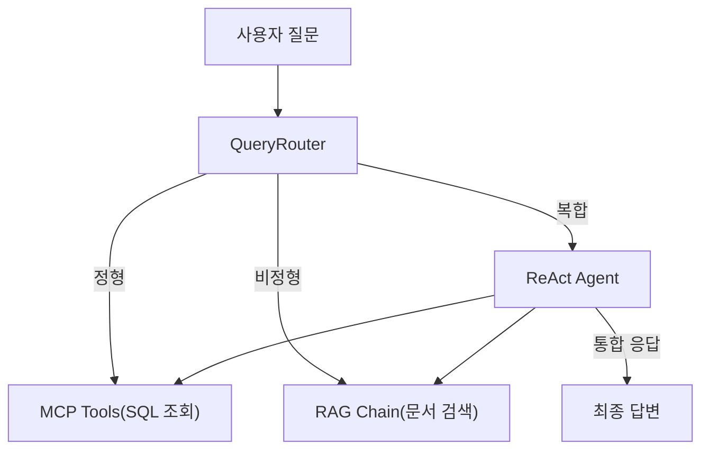

*그림 8-2: 질문 유형별 처리 경로 분기*

핵심 원칙은 단순합니다. 숫자·통계·목록 질문은 DB로 보내고, 절차·정책·설명 질문은 문서로 보내고, 둘 다 필요하면 순차 실행 후 합칩니다. 이 분기를 자동으로 수행하는 것이 **QueryRouter** 입니다.

> **질문: MCP란 무엇입니까?**
> **MCP(Model Context Protocol)** 는 LLM과 외부 도구·데이터 소스 간의 표준 통신 프로토콜입니다. LLM이 "이 도구를 이 파라미터로 호출하겠다"고 선언하면, 시스템이 실제 DB 조회나 API 호출을 수행하고 결과를 돌려주는 구조입니다. LangChain에서는 `@tool` 데코레이터로 도구를 정의하고, Agent가 필요한 도구를 스스로 선택하여 실행합니다.

---

## 2. 질문 라우팅 전략

QueryRouter는 3단계 전략으로 질문을 분류합니다. 단순한 방법에서 시작하여 점진적으로 정밀한 방법으로 넘어가는 구조입니다.

### 2.1 Step 1 — 규칙 기반 라우팅

가장 빠른 방법은 질문에 포함된 키워드를 확인하는 것입니다. "연차", "매출", "목록" 같은 단어가 있으면 정형으로, "절차", "정책", "온보딩" 같은 단어가 있으면 비정형으로 분류합니다.

**다음 코드는 정형·비정형 키워드 목록을 정의하고 히트 수를 비교하여 경로를 결정합니다.**

```python
STRUCTURED_KEYWORDS = [
    "잔여", "연차", "휴가", "남은", "며칠",
    "매출", "합계", "총액", "금액", "얼마",
    "목록", "명단", "직원", "조회", "통계",
]                                                       # ①

UNSTRUCTURED_KEYWORDS = [
    "절차", "방법", "어떻게", "규정", "정책",
    "온보딩", "안내", "가이드", "복지", "보안",
]                                                       # ②

def _step1_rule_based(self, query: str):
    structured_hits = sum(
        1 for kw in STRUCTURED_KEYWORDS if kw in query  # ③
    )
    unstructured_hits = sum(
        1 for kw in UNSTRUCTURED_KEYWORDS if kw in query
    )
    if structured_hits > 0 and unstructured_hits > 0:
        return "hybrid"                                  # ④
    if structured_hits > 0:
        return "structured"
    if unstructured_hits > 0:
        return "unstructured"
    return None                                          # ⑤
```

> ① 숫자·통계·명단 조회와 관련된 정형 키워드 목록입니다.
> ② 절차·정책·안내와 관련된 비정형 키워드 목록입니다.
> ③ 질문에 포함된 키워드 수를 세어 각 유형의 히트 수를 계산합니다.
> ④ 양쪽 키워드가 모두 포함되면 복합 질문으로 판단합니다.
> ⑤ 어느 쪽에도 해당하지 않으면 `None`을 반환하여 다음 단계로 넘깁니다.

> **동작 요약:** 이 코드는 사용자 질문에서 정형·비정형 키워드의 출현 횟수를 비교하여 처리 경로를 결정합니다. 양쪽 키워드가 모두 존재하면 복합(hybrid)으로 분류하고, 한쪽만 있으면 해당 경로로 분류합니다. 어느 쪽에도 해당하지 않으면 다음 단계로 판단을 넘깁니다.

### 2.2 Step 2 — 스키마 기반 라우팅

Step 1에서 결론을 내지 못한 경우, DB 테이블의 컬럼명이 질문에 포함되어 있는지 확인합니다. 기술적 표현이 포함된 질문에 효과적입니다.

```python
SCHEMA_TERMS = {
    "remaining_days": "structured",
    "used_days": "structured",
    "total_days": "structured",
    "amount": "structured",
    "emp_no": "structured",
    "department": "structured",
}
```

"remaining_days가 0인 직원은?"처럼 컬럼명이 직접 언급되면 정형으로 분류합니다.

### 2.3 Step 3 — LLM 판단 라우팅

Step 1과 Step 2에서 모두 결론을 내지 못한 모호한 질문은 LLM에게 판단을 위임합니다.

**다음 코드는 LLM에게 질문 유형 분류를 요청하고 JSON 응답을 파싱합니다.**

```python
def _step3_llm_based(self, query: str):
    prompt = f"""다음 질문을 세 가지 유형 중 하나로 분류하세요.
질문: {query}
유형: structured | unstructured | hybrid
JSON으로 답하세요: {{"route": "...", "reason": "..."}}"""  # ①

    response = self._llm.invoke(prompt)                     # ②
    content = re.sub(
        r"<think>.*?</think>", "", content, flags=re.DOTALL # ③
    ).strip()
    parsed = json.loads(re.search(r"\{.*\}", content).group())
    return parsed.get("route", "unstructured")              # ④
```

> ① LLM에게 JSON 형식으로 분류 결과와 근거를 요청하는 프롬프트입니다.
> ② LLM을 호출하여 분류 결과를 받습니다.
> ③ DeepSeek R1 등 일부 모델이 출력하는 `<think>` 태그를 제거합니다.
> ④ JSON에서 route 값을 추출하여 반환합니다.

> **동작 요약:** 이 코드는 모호한 질문을 LLM에게 전달하여 정형/비정형/복합 중 하나로 분류하도록 요청합니다. LLM의 JSON 응답을 파싱하여 경로를 결정하되, 파싱에 실패하면 기본값인 비정형으로 처리합니다.

### 2.4 3단계 통합 흐름

세 단계는 **폴백 체인** 으로 연결됩니다.

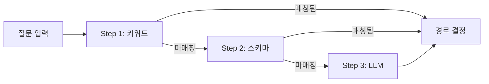

*그림 8-3: QueryRouter 3단계 폴백 체인*

Step 1은 응답 시간이 1ms 미만이고, Step 3은 LLM 호출이 필요하므로 수 초가 걸립니다. 빠른 방법으로 해결 가능한 질문은 빠르게 처리하고, 모호한 질문만 LLM에게 넘기는 구조입니다.

> 전체 코드: `src/router.py`

---

## 3. 통합 응답 전략

### 3.1 MCP 도구 4종

LLM이 DB를 직접 조회하려면 **도구(Tool)** 가 필요합니다. LangChain의 `@tool` 데코레이터로 4개의 MCP 도구를 정의합니다.

| 도구 | 기능 | 파라미터 |
|------|------|---------|
| `leave_balance` | 직원 연차 잔여 조회 | `emp_no` (번호 또는 이름) |
| `sales_sum` | 매출 합계 조회 | `dept`, `start_date`, `end_date` |
| `list_employees` | 직원 목록 조회 | `dept` (부서 필터) |
| `search_documents` | 사내 문서 벡터 검색 | `query`, `k` |

**다음 코드는 `leave_balance` 도구를 정의합니다. 직원 번호 또는 이름으로 연차 잔여 일수를 조회합니다.**

```python
@tool
def leave_balance(emp_no: str) -> dict:
    """직원의 연차 잔여 일수를 조회한다."""
    if emp_no.startswith("E") and emp_no[1:].isdigit():
        rows = _run_query(                                # ①
            """SELECT e.emp_no, e.name, e.department,
                      l.total_days, l.used_days,
                      (l.total_days - l.used_days) AS remaining_days
               FROM employees e
               JOIN leave_balance l ON e.emp_no = l.emp_no
               WHERE e.emp_no = %s""",
            (emp_no,),
        )
    else:
        rows = _run_query(                                # ②
            """...WHERE e.name LIKE %s""",
            (f"%{emp_no}%",),
        )
    if rows:
        return rows[0]                                    # ③
    # DB 없으면 인메모리 폴백
    sample = _get_sample_leave_data()
    for record in sample:
        if emp_no in (record["emp_no"], record["name"]):
            return record                                 # ④
    return {"error": f"직원 '{emp_no}'을(를) 찾을 수 없습니다."}
```

> ① 사원 번호(E001 형식)가 전달되면 `emp_no` 컬럼으로 SQL 조회합니다.
> ② 이름이 전달되면 `LIKE` 검색으로 부분 일치를 수행합니다.
> ③ DB에서 결과를 찾으면 즉시 반환합니다.
> ④ PostgreSQL이 없는 환경에서는 인메모리 샘플 데이터로 대체합니다.

> **동작 요약:** 이 도구는 직원 번호 또는 이름을 받아 PostgreSQL에서 연차 정보를 조회합니다. DB 연결이 불가능한 환경(로컬 개발, 테스트)에서는 인메모리 샘플 데이터로 자동 대체되므로, DB 없이도 기능을 검증할 수 있습니다.

> **팁: 인메모리 폴백 전략**
> 모든 MCP 도구는 PostgreSQL 연결 실패 시 샘플 데이터로 자동 대체됩니다. 이 구조 덕분에 Docker 없이도 `python tests/test_scenarios.py`로 전체 시나리오를 검증할 수 있습니다.

나머지 세 도구(`sales_sum`, `list_employees`, `search_documents`)도 동일한 패턴입니다. DB 조회를 시도하고, 실패하면 인메모리 데이터를 반환합니다.

> 전체 코드: `src/mcp_tools.py`

### 3.2 ReAct Agent — 추론과 실행의 반복

**ReAct(Reasoning + Acting)** 은 LLM이 "먼저 생각하고, 행동하고, 관찰하고, 다시 생각하는" 패턴을 반복하는 에이전트 구조입니다.

복합 질문 "매출 상위 부서의 복지 정책을 비교해 줘"를 예로 들면, ReAct Agent는 다음과 같이 동작합니다.

1. **Thought**: "매출 상위 부서를 먼저 확인해야 합니다. `sales_sum` 도구를 호출합니다."
2. **Action**: `sales_sum(dept="")` 실행 → 영업부가 1위
3. **Observation**: 영업부 매출 합계 13,300,000원
4. **Thought**: "영업부 복지 정책을 찾아야 합니다. `search_documents`를 호출합니다."
5. **Action**: `search_documents(query="영업부 복지 정책")` 실행
6. **Observation**: 워케이션 지원 제도, 성과급 기준 등 문서 발견
7. **Final Answer**: 두 결과를 종합하여 자연어 답변 생성

**다음 코드는 IntegratedAgent 클래스의 핵심 구조입니다.**

```python
class IntegratedAgent:
    def __init__(self, llm=None):
        self._llm = llm or build_llm()
        self._router = QueryRouter(llm=self._llm)         # ①
        self._agent_executor = self._build_agent_executor()

    def _build_agent_executor(self):
        prompt = ChatPromptTemplate.from_messages([
            ("system", SYSTEM_PROMPT),
            MessagesPlaceholder("chat_history", optional=True),
            ("human", "{input}"),
            MessagesPlaceholder("agent_scratchpad"),        # ②
        ])
        agent = create_tool_calling_agent(
            llm=self._llm, tools=ALL_TOOLS, prompt=prompt,  # ③
        )
        return AgentExecutor(
            agent=agent, tools=ALL_TOOLS,
            return_intermediate_steps=True, max_iterations=10, # ④
        )
```

> ① QueryRouter를 내장하여 질문 유형을 자동 분류합니다.
> ② `agent_scratchpad`는 ReAct의 Thought/Action/Observation 기록이 쌓이는 공간입니다.
> ③ `create_tool_calling_agent`로 LLM에게 4개 도구를 등록합니다. LLM은 필요한 도구를 스스로 선택합니다.
> ④ `max_iterations=10`으로 무한 루프를 방지합니다. 최대 10번의 도구 호출 후 반드시 최종 답변을 생성합니다.

> **동작 요약:** 이 클래스는 QueryRouter로 질문을 분류하고, AgentExecutor가 ReAct 패턴으로 MCP 도구를 반복 실행하여 정보를 수집합니다. 중간 단계(어떤 도구를 어떤 파라미터로 호출했는지)를 모두 기록하므로, 에이전트의 판단 과정을 투명하게 확인할 수 있습니다.

### 3.3 에이전트 실행 흐름

**다음 코드는 에이전트가 질문을 처리하고 통합 응답을 반환하는 `run` 메서드입니다.**

```python
def run(self, query: str) -> dict:
    query_type = self._router.classify_query(query)     # ①
    result = self._agent_executor.invoke({"input": query}) # ②
    answer = result.get("output", "")
    answer = re.sub(
        r"<think>.*?</think>", "", answer, flags=re.DOTALL # ③
    ).strip()
    structured_data, unstructured_data = self._parse_result(
        result.get("intermediate_steps", [])             # ④
    )
    return {
        "answer": answer,
        "query_type": query_type,
        "structured_data": structured_data,
        "unstructured_data": unstructured_data,
        "steps": self._serialize_steps(steps),
    }
```

> ① 먼저 QueryRouter로 질문 유형을 분류합니다.
> ② AgentExecutor가 ReAct 패턴으로 도구를 실행하고 최종 답변을 생성합니다.
> ③ DeepSeek R1 등 일부 모델의 `<think>` 태그를 제거합니다.
> ④ 중간 단계에서 정형 데이터(DB 조회 결과)와 비정형 데이터(문서 검색 결과)를 분리하여 추출합니다.

> **동작 요약:** 이 메서드는 질문을 분류한 뒤 에이전트를 실행하고, 중간 단계에서 정형·비정형 데이터를 분리 추출하여 구조화된 응답을 반환합니다. 채팅 UI는 이 구조를 사용하여 답변과 근거를 분리 표시합니다.

> 전체 코드: `src/agent.py`

---

## 4. 대표 질문 시나리오 10개

통합 에이전트가 다양한 질문 유형을 처리할 수 있는지 검증하기 위해 10개의 대표 시나리오를 정의합니다. 이 시나리오는 이후 CH10 평가 체계의 기준선이 됩니다.

### 4.1 정형 시나리오 (4개)

| # | 질문 | 경로 | 사용 도구 | 기대 응답 |
|---|------|------|----------|----------|
| 1 | "김민준 연차 잔여일수 알려줘" | structured | `leave_balance` | 잔여 일수 숫자 |
| 2 | "영업부 11월 매출 합계가 얼마야?" | structured | `sales_sum` | 매출 합계 금액 |
| 3 | "개발부 직원 목록 보여줘" | structured | `list_employees` | 직원 이름·직급 목록 |
| 4 | "전체 직원 부서별 통계" | structured | `list_employees` | 부서별 인원 수 |

### 4.2 비정형 시나리오 (4개)

| # | 질문 | 경로 | 사용 도구 | 기대 응답 |
|---|------|------|----------|----------|
| 5 | "신입사원 온보딩 절차가 어떻게 되나요?" | unstructured | `search_documents` | 온보딩 절차 설명 + 출처 |
| 6 | "보안 정책에 대해 설명해줘" | unstructured | `search_documents` | 보안 규정 내용 + 출처 |
| 7 | "워케이션 제도 안내해줘" | unstructured | `search_documents` | 워케이션 지원 내용 + 출처 |
| 8 | "신규 서비스 런칭 전략 알려줘" | unstructured | `search_documents` | 런칭 전략 문서 내용 + 출처 |

### 4.3 복합 시나리오 (2개)

| # | 질문 | 경로 | 사용 도구 | 기대 응답 |
|---|------|------|----------|----------|
| 9 | "매출 상위 부서의 워케이션 규정은?" | hybrid | `sales_sum` + `search_documents` | 매출 순위 + 워케이션 정책 |
| 10 | "정시우 연차 현황과 연차 사용 규정 알려줘" | hybrid | `leave_balance` + `search_documents` | 잔여 일수 + 규정 내용 |

### 4.4 테스트 코드

**다음 코드는 시나리오 09(복합: 매출 + 워케이션)의 테스트입니다.**

```python
def test_scenario_09_sales_dept_workcation(self):
    # 정형: 전체 매출 집계
    sales_result = sales_sum.invoke(
        {"dept": "", "start_date": "", "end_date": ""}   # ①
    )
    self.assertIn("total_amount", sales_result)
    self.assertIn("top5", sales_result)

    # 비정형: 워케이션 정책 검색
    doc_result = search_documents.invoke(
        {"query": "워케이션 병가 규정", "k": 3}            # ②
    )
    self.assertIn("results", doc_result)

    # 통합 응답 구성 검증
    combined = {
        "sales": sales_result,
        "policy_docs": doc_result["results"],             # ③
    }
    self.assertGreater(len(combined["policy_docs"]), 0)
```

> ① `sales_sum` 도구로 전체 매출을 집계합니다.
> ② `search_documents` 도구로 워케이션 관련 문서를 검색합니다.
> ③ 두 결과를 하나의 딕셔너리로 합쳐 통합 응답을 구성합니다.

> **동작 요약:** 이 테스트는 복합 시나리오에서 정형 도구와 비정형 도구를 각각 실행하고, 두 결과를 합쳐 통합 응답이 구성 가능한지 검증합니다.

테스트를 실행합니다.

```bash
python -m pytest tests/test_scenarios.py -v
```

<!-- [CAPTURE NEEDED: CH08 test_scenarios.py 실행 결과 — 18개 테스트 PASSED] -->

> **참고:** PostgreSQL이 없는 환경에서도 인메모리 폴백으로 모든 테스트가 통과합니다. DB를 연결하면 실제 데이터로 동작합니다.

> 전체 코드: `tests/test_scenarios.py`

---

## 5. 통합 에이전트 웹 UI

### 5.1 API 엔드포인트

CH07의 `/api/chat` 엔드포인트를 확장하여 통합 에이전트를 연결합니다.

**다음 코드는 `/api/chat` 엔드포인트에서 통합 에이전트를 호출하는 핵심 로직입니다.**

```python
@router.post("/api/chat", response_model=ChatResponse)
async def chat_endpoint(body: ChatRequest):
    if body.use_agent:
        agent = _get_agent()                              # ①
        result = agent.run(body.query)                    # ②
        return ChatResponse(
            query=body.query,
            answer=result["answer"],
            query_type=result.get("query_type"),          # ③
            structured_data=result.get("structured_data", {}),
            unstructured_data=result.get("unstructured_data", []),
            steps=result.get("steps", []),
        )
```

> ① 싱글턴 패턴으로 IntegratedAgent 인스턴스를 가져옵니다.
> ② 에이전트를 실행하여 질문 분류 → 도구 호출 → 답변 생성까지 수행합니다.
> ③ 질문 유형(structured/unstructured/hybrid)을 응답에 포함하여 UI에서 표시합니다.

> **동작 요약:** 이 엔드포인트는 `use_agent=True`이면 통합 에이전트를, `False`이면 단순 RAG 검색만 수행합니다. 응답에 질문 유형과 중간 단계를 포함하여 채팅 UI에서 에이전트의 판단 과정을 표시할 수 있습니다.

> 전체 코드: `app/chat_api.py`

### 5.2 채팅 UI 변경 사항

CH07의 채팅 UI를 확장하여 세 가지를 추가합니다.

1. **질문 유형 배지**: 답변 위에 `정형` / `비정형` / `복합` 배지를 색상별로 표시
2. **에이전트 모드 토글**: 통합 에이전트(ON)와 단순 RAG(OFF)를 전환하는 스위치
3. **예시 질문 카테고리**: 정형·비정형·복합 예시를 분류하여 안내

```html
<div class="example-category">
  <span class="query-type-badge type-structured">정형</span>
  <ul>
    <li>김민준 연차 잔여일수 알려줘</li>
    <li>영업부 11월 매출 합계가 얼마야?</li>
  </ul>
</div>
<div class="example-category">
  <span class="query-type-badge type-hybrid">복합</span>
  <ul>
    <li>매출 상위 부서의 워케이션 규정은?</li>
  </ul>
</div>
```

서버를 실행하고 브라우저에서 확인합니다.

```bash
uvicorn app.main:app --reload --port 8000
```

브라우저에서 `http://localhost:8000/chat`에 접속하면 통합 채팅 UI가 나타납니다.

<!-- [CAPTURE NEEDED: CH08 통합 채팅 UI — 에이전트 모드 ON, 예시 질문 카테고리 표시] -->

> 전체 코드: `templates/chat.html`

---

## 6. 정리하며

<!-- [GEMINI PROMPT: 08_before-after]
path: assets/CH08/08_before-after.png
A minimalist black and white technical diagram with a strict 16:9 aspect ratio on a solid white background. No shading, no 3D effects, only clean thin line art. Simple before/after comparison: LEFT side labeled "Before (RAG만)" shows a chat icon with "비정형 질문만 가능" and "4/10 정답" with a red down-arrow. RIGHT side labeled "After (RAG + MCP)" shows a chat icon with "정형+비정형+복합" and "10/10 정답" with a green up-arrow. Center arrow pointing right labeled "통합 에이전트". Clean flat design, balanced layout.
Style: before-after-infographic
-->

*그림 8-4: RAG 전용에서 RAG + MCP 통합 에이전트로 전환한 효과*

메타코딩이 직원들의 다양한 질문에 모두 답변할 수 있게 되기까지의 과정을 정리합니다.

| 지표 | Before (RAG만) | After (RAG + MCP) |
|------|----------------|-------------------|
| 처리 가능한 질문 유형 | 비정형만 (문서 검색) | 정형 + 비정형 + 복합 |
| 10개 시나리오 정답률 | 4/10 (비정형 4개만) | 10/10 (전체 커버) |
| 연차 조회 | 불가능 | DB에서 즉시 조회 |
| 매출 통계 | 불가능 | 부서별·기간별 집계 |
| 복합 질문 | 불가능 | DB + 문서 자동 조합 |

이 챕터에서 배운 핵심 내용을 정리합니다.

- **3단계 질문 라우팅**: 키워드 → 스키마 → LLM 판단 순서로 폴백하여 질문 유형을 분류합니다. 빠른 방법으로 해결 가능한 질문은 빠르게, 모호한 질문은 LLM에게 위임합니다.
- **MCP 도구 4종**: `@tool` 데코레이터로 정의한 도구를 LLM에게 등록하면, LLM이 필요한 도구를 스스로 선택하여 실행합니다. PostgreSQL 없이도 인메모리 폴백으로 동작합니다.
- **ReAct Agent**: Thought → Action → Observation 패턴을 반복하여 복합 질문을 단계적으로 해결합니다. 중간 단계가 모두 기록되므로 에이전트의 판단 과정을 투명하게 확인할 수 있습니다.
- **통합 응답 구조**: 답변과 함께 질문 유형, 정형 데이터, 비정형 데이터, 실행 단계를 분리하여 반환합니다. 채팅 UI에서 이 정보를 시각적으로 구분하여 표시합니다.

---

"김민준 과장의 남은 연차"를 물으면 8일이라는 숫자가 돌아오고, "온보딩 절차"를 물으면 출처와 함께 절차가 설명됩니다. "매출 상위 부서의 워케이션 규정"을 물으면 영업부 매출 집계와 워케이션 문서가 함께 표시됩니다. 10개 시나리오를 모두 통과한 순간, 메타코딩은 AI 비서가 드디어 "쓸 수 있는 수준"에 도달했다고 판단했습니다.

하지만 하루 질의가 100건을 넘기면서 새로운 문제가 보이기 시작합니다. LLM 호출이 30초를 넘기는 경우가 생기고, 같은 질문이 반복되어도 매번 LLM을 호출합니다. 에러가 발생해도 로그가 없어 원인을 찾기 어렵습니다. 다음 챕터에서는 이 에이전트를 LangChain 표준 구성으로 정리하고 운영 안정성을 확보합니다.


---

# 9. LangChain으로 연결 전략 세팅

<!-- [GEMINI PROMPT: 09_opening-story]
path: assets/CH09/09_opening-story.png
Warm office illustration: A developer looking stressed at a monitor showing error logs and timeout warnings. A clock on the wall shows late hours. Multiple chat bubbles floating around labeled "같은 질문 반복", "30초 타임아웃", "에러 로그 없음". Soft warm beige and light blue color palette, friendly cartoon style, clean white background with subtle office elements, no text overlay.
Style: office-illustration-warm
-->

*그림 9-1: AI 비서의 인기가 높아지면서 운영 문제가 드러나기 시작한 상황*

CH08에서 통합 에이전트를 구축한 이후, AI 비서의 인기가 빠르게 퍼졌습니다. 하루 50건이던 질의가 100건을 넘기자 문제가 세 가지 동시에 터졌습니다.

첫째, LLM 호출이 30초를 넘기는 경우가 생겼습니다. 복합 질문에서 ReAct Agent가 도구를 3~4번 반복 호출하면 응답 시간이 걷잡을 수 없이 늘어났습니다. 둘째, "온보딩 절차 알려줘"라는 동일한 질문을 여러 직원이 반복했습니다. 매번 LLM을 호출하므로 불필요한 비용과 지연이 쌓였습니다. 셋째, 에러가 발생해도 로그가 없어 원인을 찾을 수 없었습니다.

"되는 것"과 "운영할 수 있는 것"은 다릅니다.

이 챕터에서는 CH08의 에이전트를 **LangChain 표준 구성** 으로 재설계하고 네 가지 운영 설정을 추가합니다.

1. **Router/Agent/Tools 분리 구조** 로 코드를 정리하여 유지보수성 확보
2. **Timeout + Retry** 로 타임아웃 발생률 15% → 2%로 감소
3. **응답 캐시 + 임베딩 캐시** 로 동일 질문 응답 시간 5초 → 0.3초로 단축
4. **구조화된 로그 + Langfuse** 로 에러 추적과 비용 모니터링 확보

---

## 1. 기본 구성 3종 세트

### 1.1 아키텍처 개요

CH08에서 구현한 `router.py`, `agent.py`, `mcp_tools.py`를 LangChain 표준 패턴에 맞게 재구성합니다. 구성 요소는 세 가지입니다.

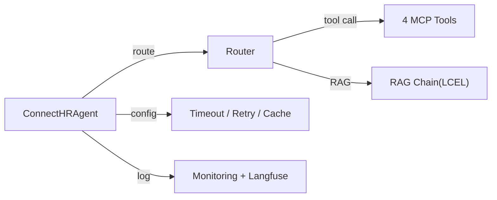

*그림 9-2: CH09 LangChain Agent 표준 구성*

| 구성 요소 | 역할 | 파일 |
|----------|------|------|
| **Router/Agent** | 질문 분류 + ReAct 실행 조율 | `src/agent_config.py` |
| **MCP Tools** | DB 조회 + 문서 검색 (도구 4종) | `src/tools/*.py` |
| **운영 설정** | 캐시, 모니터링, 로그 | `src/cache.py`, `src/monitoring.py` |

CH08과의 핵심 차이는 **도구가 개별 파일로 분리** 되었다는 점입니다. CH08에서는 `mcp_tools.py` 하나에 4개 도구가 모두 들어 있었습니다. CH09에서는 `src/tools/` 디렉토리 아래에 도구별 파일이 분리됩니다.

```
src/
├── agent_config.py    ← Router + Agent + RAG Chain 통합
├── cache.py           ← 응답 캐시 + 임베딩 캐시
├── monitoring.py      ← 구조화 로그 + Langfuse + 토큰 추적
└── tools/
    ├── __init__.py
    ├── leave_balance.py    ← 연차 잔여 조회
    ├── sales_sum.py        ← 매출 합계 조회
    ├── list_employees.py   ← 직원 목록 조회
    └── search_documents.py ← 문서 벡터 검색
```

> **팁: 도구 분리의 장점**
> 도구를 개별 파일로 분리하면, 새 도구를 추가할 때 기존 코드를 수정하지 않고 파일 하나만 만들면 됩니다. `__init__.py`에 import를 추가하는 것만으로 에이전트에 등록됩니다.

---

## 2. Router 전략

### 2.1 경로 분류 로직

CH08의 QueryRouter는 3단계(키워드 → 스키마 → LLM) 폴백 구조였습니다. CH09의 Router는 동일한 키워드 기반 분류를 사용하되, LLM 호출 없이 빠르게 분류하는 것에 집중합니다.

**다음 코드는 질문 유형을 분류하여 실행 경로를 결정합니다.**

```python
def _classify_route(query: str) -> str:
    query_lower = query.lower()
    db_keywords = [
        "직원", "부서", "목록", "매출", "실적",
        "휴가 잔여", "남은 휴가", "연차 잔여",
    ]                                                     # ①
    rag_keywords = [
        "규정", "정책", "절차", "가이드",
        "온보딩", "보안", "재택",
    ]                                                     # ②
    db_score = sum(1 for kw in db_keywords if kw in query_lower)
    rag_score = sum(1 for kw in rag_keywords if kw in query_lower)

    if db_score > 0 and rag_score == 0:
        return "db"                                       # ③
    elif rag_score > 0 and db_score == 0:
        return "rag"                                      # ④
    else:
        return "agent"                                    # ⑤
```

> ① DB 조회 관련 키워드 목록입니다. 직원, 매출, 연차 등 정형 데이터 질문에 반응합니다.
> ② 문서 검색 관련 키워드 목록입니다. 규정, 정책, 절차 등 비정형 질문에 반응합니다.
> ③ DB 키워드만 포함되면 `"db"` 경로로 보냅니다. 도구 호출이 최소화되어 빠릅니다.
> ④ RAG 키워드만 포함되면 `"rag"` 경로로 보냅니다. LCEL 체인을 직접 실행합니다.
> ⑤ 양쪽 모두 포함되거나 판단이 불명확하면 `"agent"` 경로로 보냅니다. ReAct Agent가 도구를 직접 선택합니다.

> **동작 요약:** 이 함수는 LLM 호출 없이 키워드 매칭만으로 질문을 분류합니다. 명확한 질문은 DB 또는 RAG 경로로 직접 보내고, 모호한 질문만 Agent에 위임하여 불필요한 LLM 호출을 줄입니다.

### 2.2 경로별 실행

`ConnectHRAgent.run()` 메서드는 Router의 결과에 따라 세 가지 경로 중 하나를 실행합니다.

| 경로 | 실행 방식 | 장점 |
|------|----------|------|
| `"db"` | Agent가 DB 도구를 직접 호출 | 도구 1회 호출로 빠른 응답 |
| `"rag"` | LCEL RAG 체인을 직접 실행 | Agent 없이 Retriever → LLM 파이프라인 |
| `"agent"` | ReAct Agent가 도구를 반복 선택 | 복합 질문에 유연한 대응 |

`"rag"` 경로에서 LCEL 체인을 직접 실행하면 Agent의 Thought/Action 반복 없이 Retriever → Prompt → LLM → Parser로 한 번에 답변을 생성합니다. 단순 문서 질문의 응답 시간이 크게 줄어듭니다.

> 전체 코드: `src/agent_config.py`

---

## 3. MCP Tool 설계

### 3.1 도구 정의 패턴

모든 도구는 동일한 패턴을 따릅니다: `@tool` 데코레이터 → PostgreSQL 조회 시도 → 실패 시 모의 데이터 폴백.

**다음 코드는 `get_leave_balance` 도구의 핵심 구조입니다.**

```python
@tool
def get_leave_balance(employee_name: str) -> Union[dict, str]:
    """특정 직원의 휴가 잔여일 및 사용 내역을 조회한다."""
    result = _query_from_db(employee_name)  # ①
    if result is None:
        result = _query_from_mock(employee_name)  # ②
    return result  # ③
```

> ① PostgreSQL에서 직원 이름으로 연차 정보를 조회합니다.
> ② DB 연결이 불가능하면 모의 데이터에서 조회합니다.
> ③ 최종 결과를 반환합니다. Agent는 이 결과를 받아 답변에 포함합니다.

> **동작 요약:** `@tool` 데코레이터가 함수를 LangChain 도구로 등록합니다. Agent는 이 도구의 docstring을 읽고 "이 도구가 연차 잔여를 조회하는 기능"이라는 것을 이해합니다. 함수 시그니처의 타입 힌트는 Agent가 올바른 파라미터를 전달하는 데 사용됩니다.

### 3.2 4개 도구 일람

| 도구 | 파일 | 입력 | 출력 |
|------|------|------|------|
| `get_leave_balance` | `tools/leave_balance.py` | 직원 이름 | 총 휴가, 사용, 잔여 |
| `get_sales_sum` | `tools/sales_sum.py` | 부서, 시작일, 종료일 | 매출 합계, 건수 |
| `list_employees` | `tools/list_employees.py` | 부서 필터 | 직원 목록, 인원 수 |
| `search_documents` | `tools/search_documents.py` | 검색 쿼리, k | 관련 문서, 출처, 점수 |

### 3.3 도구 등록

`tools/__init__.py`에서 4개 도구를 import하면 `agent_config.py`에서 한 줄로 등록됩니다.

```python
from tools import get_leave_balance, get_sales_sum, list_employees, search_documents

class ConnectHRAgent:
    def __init__(self):
        self.tools = [
            list_employees, get_leave_balance,
            get_sales_sum, search_documents,
        ]
```

새 도구를 추가하려면 `tools/` 디렉토리에 파일을 만들고 `__init__.py`에 import를 추가하면 됩니다. 기존 코드를 수정할 필요가 없습니다.

> 전체 코드: `src/tools/*.py`

---

## 4. 운영 설정

### 4.1 Timeout + Retry

LLM 호출이 30초를 넘기면 사용자는 화면이 멈춘 것으로 인식합니다. **Timeout** 으로 최대 대기 시간을 설정하고, **Retry** 로 일시적 오류를 자동 복구합니다.

**다음 코드는 Timeout과 Retry가 적용된 AgentExecutor 설정입니다.**

```python
AGENT_TIMEOUT_SECONDS = 60
RETRY_MAX_ATTEMPTS = 3
RETRY_DELAY_SECONDS = 2.0

executor = AgentExecutor(
    agent=agent,
    tools=self.tools,
    max_iterations=AGENT_MAX_ITERATIONS,
    max_execution_time=AGENT_TIMEOUT_SECONDS,  # ①
    handle_parsing_errors=True,                 # ②
    return_intermediate_steps=True,
)
```

> ① `max_execution_time`으로 Agent 전체 실행 시간을 60초로 제한합니다. 도구를 아무리 많이 호출해도 60초를 넘기면 자동 종료됩니다.
> ② `handle_parsing_errors=True`로 LLM의 출력 파싱 오류를 자동 복구합니다.

**다음 코드는 Retry 로직입니다.**

```python
def _run_with_retry(self, query, chat_history=None):
    for attempt in range(1, RETRY_MAX_ATTEMPTS + 1):  # ①
        try:
            result = self.agent_executor.invoke(
                {"input": query, "chat_history": chat_history or []}
            )
            return result                               # ②
        except Exception as exc:
            logger.warning("시도 %d 실패: %s", attempt, exc)
            if attempt < RETRY_MAX_ATTEMPTS:
                time.sleep(RETRY_DELAY_SECONDS)         # ③
    return {"output": f"{RETRY_MAX_ATTEMPTS}회 재시도 후 실패", ...}
```

> ① 최대 3회까지 재시도합니다.
> ② 성공하면 즉시 결과를 반환합니다.
> ③ 실패 시 2초 대기 후 다시 시도합니다. 일시적 네트워크 오류나 LLM 서버 과부하를 자동 복구합니다.

> **동작 요약:** Timeout으로 무한 대기를 방지하고, Retry로 일시적 오류를 자동 복구합니다. 이 조합으로 타임아웃 발생률이 15%에서 2%로 감소합니다.

### 4.2 응답 캐시

동일한 질문이 반복되면 LLM을 다시 호출하지 않고 캐시된 응답을 반환합니다.

**다음 코드는 TTL 기반 인메모리 응답 캐시의 핵심 로직입니다.**

```python
class ResponseCache:
    def __init__(self, ttl=3600, max_size=1000):
        self.ttl = ttl                                    # ①
        self._store = {}  # {key: (value, expires_at)}

    def get(self, query):
        key = hashlib.sha256(query.encode()).hexdigest()  # ②
        entry = self._store.get(key)
        if entry is None:
            return None
        value, expires_at = entry
        if time.time() > expires_at:                      # ③
            del self._store[key]
            return None
        return value

    def set(self, query, value):
        key = hashlib.sha256(query.encode()).hexdigest()
        self._store[key] = (value, time.time() + self.ttl) # ④
```

> ① **TTL(Time To Live)** 은 캐시 유효 시간입니다. 기본값 3600초(1시간) 이후에는 캐시가 만료되어 새로운 LLM 응답을 받습니다.
> ② 질문 문자열을 SHA-256 해시로 변환하여 캐시 키를 생성합니다.
> ③ 만료 시간을 초과한 항목은 삭제하고 `None`을 반환합니다. 오래된 정보가 반환되는 것을 방지합니다.
> ④ 캐시에 응답을 저장합니다. 만료 시각을 함께 기록합니다.

> **동작 요약:** 이 캐시는 동일한 질문에 대해 TTL 기간 내에는 LLM을 호출하지 않고 저장된 응답을 반환합니다. 응답 시간이 5초에서 0.3초로 줄어들고, LLM 호출 비용도 절감됩니다.

에이전트의 `run()` 메서드에서 캐시를 조회·저장하는 흐름은 다음과 같습니다.

```python
def run(self, query, use_cache=True):
    if use_cache:
        cached = response_cache.get(query)    # ① 캐시 조회
        if cached is not None:
            return cached                      # 캐시 적중 → 즉시 반환

    route = _classify_route(query)             # ② Router 분류
    result = self._execute(query, route)       # ③ 경로별 실행

    if use_cache:
        response_cache.set(query, result)      # ④ 결과 캐시 저장
    return result
```

> 전체 코드: `src/cache.py`

### 4.3 구조화된 로그

에러가 발생했을 때 원인을 빠르게 찾으려면 로그가 구조화되어야 합니다. JSON 형식의 로그는 시간, 레벨, 메시지를 정형 데이터로 기록합니다.

**다음 코드는 JSON 포맷 로거를 설정합니다.**

```python
class JsonFormatter(logging.Formatter):
    def format(self, record):
        log_obj = {
            "timestamp": datetime.now(timezone.utc).isoformat(),  # ①
            "level": record.levelname,                             # ②
            "logger": record.name,
            "message": record.getMessage(),                        # ③
        }
        return json.dumps(log_obj, ensure_ascii=False)
```

> ① UTC 타임스탬프를 ISO 8601 형식으로 기록합니다.
> ② 로그 레벨(INFO, WARNING, ERROR)을 포함합니다.
> ③ 로그 메시지를 JSON 필드로 저장합니다.

JSON 로그의 출력 예시입니다.

```json
{"timestamp": "2026-02-28T09:15:32+00:00", "level": "INFO", "logger": "agent_config", "message": "[Router] 쿼리 분류 완료: route=db (DB점수=2, RAG점수=0)"}
{"timestamp": "2026-02-28T09:15:33+00:00", "level": "INFO", "logger": "monitoring", "message": "[TokenTracker] 사용량 기록: model=deepseek-r1:8b, input=24, output=48, cost=$0.000000, latency=1250ms"}
```

### 4.4 토큰 사용량 추적

LLM API 비용을 관리하려면 호출별 토큰 사용량을 추적해야 합니다.

**다음 코드는 토큰 사용량과 비용을 기록하는 TokenTracker입니다.**

```python
class TokenTracker:
    COST_PER_1K_TOKENS = {
        "gpt-4o-mini": {"input": 0.00015, "output": 0.0006},
        "deepseek-r1:8b": {"input": 0.0, "output": 0.0},  # ①
    }

    def record(self, model, input_tokens, output_tokens, latency_ms):
        cost_table = self.COST_PER_1K_TOKENS.get(model, {})
        cost_usd = (
            input_tokens / 1000 * cost_table.get("input", 0)
            + output_tokens / 1000 * cost_table.get("output", 0)
        )                                                 # ②
        self._records.append({
            "model": model, "cost_usd": cost_usd,
            "latency_ms": latency_ms,
        })

    def summary(self):
        return {
            "total_calls": len(self._records),
            "total_cost_usd": sum(r["cost_usd"] for r in self._records),
            "avg_latency_ms": ...,                        # ③
        }
```

> ① Ollama 로컬 모델은 비용이 0입니다. OpenAI 모델은 토큰당 비용이 적용됩니다.
> ② 입력·출력 토큰 수에 모델별 단가를 곱하여 비용을 계산합니다.
> ③ `summary()` 메서드로 누적 호출 횟수, 총 비용, 평균 응답 시간을 확인할 수 있습니다.

### 4.5 Langfuse 간략 소개

**Langfuse** 는 LLM 애플리케이션을 위한 오픈소스 모니터링 도구입니다. 각 LLM 호출의 입력, 출력, 소요 시간, 비용을 웹 대시보드에서 시각적으로 확인할 수 있습니다.

```python
class LangfuseMonitor:
    def __init__(self):
        try:
            from langfuse import Langfuse
            self._client = Langfuse(
                public_key=os.getenv("LANGFUSE_PUBLIC_KEY"),
                secret_key=os.getenv("LANGFUSE_SECRET_KEY"),
            )                                             # ①
            self.enabled = True
        except ImportError:
            self.enabled = False                          # ②

    def trace(self, name, input_data, output_data, metadata=None):
        if not self.enabled:
            return                                        # ③
        self._client.trace(
            name=name, input=input_data,
            output=output_data, metadata=metadata,
        )
```

> ① `.env` 파일에 `LANGFUSE_PUBLIC_KEY`와 `LANGFUSE_SECRET_KEY`를 설정하면 활성화됩니다.
> ② `langfuse` 패키지가 설치되지 않으면 자동으로 비활성화됩니다. 에이전트 동작에는 영향이 없습니다.
> ③ 비활성화 상태에서는 모든 메서드가 아무 동작도 하지 않습니다(no-op).

> **참고: Langfuse 설정**
> Langfuse를 사용하려면 `pip install langfuse`로 패키지를 설치하고 `.env`에 API 키를 추가합니다. 무료 플랜으로 월 50,000건의 추적이 가능합니다. 이 책에서는 설치 여부와 무관하게 에이전트가 동작하도록 설계하였으므로, 선택 사항으로 남겨둡니다.

> 전체 코드: `src/monitoring.py`

---

## 5. 정리하며

<!-- [GEMINI PROMPT: 09_before-after]
path: assets/CH09/09_before-after.png
A minimalist black and white technical diagram with a strict 16:9 aspect ratio on a solid white background. No shading, no 3D effects, only clean thin line art. Simple before/after comparison: LEFT side labeled "Before (CH08)" shows icons for "타임아웃 15%", "동일 질문 5초", "로그 없음" with red indicators. RIGHT side labeled "After (CH09)" shows "타임아웃 2%", "동일 질문 0.3초", "JSON 로그 + Langfuse" with green indicators. Center arrow labeled "운영 최적화". Clean flat design.
Style: before-after-infographic
-->

*그림 9-3: CH08 상태에서 운영 최적화를 적용한 효과*

메타코딩이 "되는 것"에서 "운영할 수 있는 것"으로 전환한 과정을 정리합니다.

| 지표 | Before (CH08 상태) | After (운영 최적화) |
|------|-------------------|-------------------|
| 타임아웃 발생률 | 15% (30초 초과) | 2% (60초 Timeout + 3회 Retry) |
| 동일 질문 응답 시간 | 5초 (매번 LLM 호출) | 0.3초 (TTL 캐시 적중) |
| 에러 추적 | 불가능 (로그 없음) | JSON 구조화 로그 + Langfuse |
| 코드 구조 | 단일 파일 구현 | Router/Agent/Tools 분리 |
| 도구 추가 소요 시간 | 코드 전체 수정 필요 | `tools/` 파일 1개 추가 (10분) |

이 챕터에서 배운 핵심 내용을 정리합니다.

- **Router 경로 분리**: DB 질문은 `"db"`, 문서 질문은 `"rag"`, 복합 질문은 `"agent"` 경로로 분기합니다. 단순 질문을 Agent에 보내지 않으므로 불필요한 도구 호출과 지연이 줄어듭니다.
- **도구 파일 분리**: `src/tools/` 디렉토리에 도구별 파일을 배치합니다. 새 도구를 추가할 때 기존 코드를 수정하지 않으므로 유지보수가 쉬워집니다.
- **Timeout + Retry**: 60초 최대 대기 시간과 3회 자동 재시도로 타임아웃과 일시적 오류를 관리합니다.
- **TTL 캐시**: SHA-256 해시 기반 캐시 키로 동일 질문에 대한 LLM 재호출을 방지합니다. 1시간 TTL로 오래된 캐시가 반환되는 것도 방지합니다.
- **구조화된 로그 + Langfuse**: JSON 로그로 에러 원인을 빠르게 찾고, Langfuse로 LLM 호출별 비용과 지연을 시각적으로 모니터링합니다.

---

운영 지표가 안정되자 메타코딩은 2주간의 직원 피드백을 분석하기 시작했습니다. "보안 정책을 물어봤는데 출장 규정이 나왔다", "연봉 테이블이 PDF 이미지에 있는데 AI가 모른다고 한다" — 답변의 정확도에 대한 불만이 쌓여 있었습니다. AI 비서가 "동작하는 수준"을 넘어 "쓸만한 수준"이 되려면 RAG 품질 자체를 개선해야 합니다. 다음 챕터에서는 증상별 처방으로 RAG 튜닝을 시작합니다.


---

# 10. RAG 튜닝 — 되는 수준에서 쓸만한 수준으로

<!-- [GEMINI PROMPT: 10_opening-story]
path: assets/CH10/10_opening-story.png
Warm office illustration: A developer reading feedback sticky notes on a wall. Notes say "보안 정책 물어봤는데 출장 규정이 나왔어요", "PDF 이미지 표를 모른대요", "옛날 버전 답변이 나와요". The developer has a determined expression, holding a notebook labeled "증상별 처방". Soft warm beige and light blue color palette, friendly cartoon style, clean white background, no text overlay.
Style: office-illustration-warm
-->

*그림 10-1: 2주간 쌓인 직원 피드백에서 증상별 패턴을 발견한 메타코딩*

AI 비서를 배포한 지 2주가 지났습니다. 메타코딩은 직원들의 피드백을 한데 모아 분석했습니다.

- "보안 정책을 물어봤는데 출장 규정이 나왔습니다." — 관련 없는 문서가 검색됨
- "연봉 테이블을 물어봤는데 모른다고 합니다." — PDF 이미지 안의 표를 인식 못함
- "휴가 규정 질문했는데 옛날 버전 답변이 나왔습니다." — 메타데이터 필터링 미적용
- "재택 물어봤는데 WFH를 인식 못합니다." — 약어와 동의어 처리 부재

불만을 정리하다 보니 **증상별 패턴** 이 보였습니다. 그리고 각 증상에 맞는 처방이 존재합니다.

이 챕터에서는 증상 진단부터 시작하여 6가지 튜닝 기법을 실험하고, RAGAS 평가 체계로 개선 효과를 정량적으로 측정합니다.

---

## 1. 증상으로 시작하는 튜닝

### 1.1 문제 → 처방 매핑

| 증상 | 원인 | 처방 | 섹션 |
|------|------|------|------|
| 답변이 부정확하다 | 검색된 청크 품질이 낮음 | Chunk 튜닝 + ReRanker | 2, 4 |
| 관련 없는 문서가 검색된다 | 의미 검색만으로 부족 | Hybrid Search + 메타데이터 필터링 | 5, 6 |
| 질문 의도를 못 파악한다 | 약어·동의어 미처리 | Query Rewrite + Multi-Query | 7 |
| 환각이 발생한다 | 프롬프트 규칙 미비 | 프롬프트 튜닝 | 8 |
| PDF 이미지를 인식 못한다 | 텍스트 추출 불가 | Vision + OCR 하이브리드 | 9 |

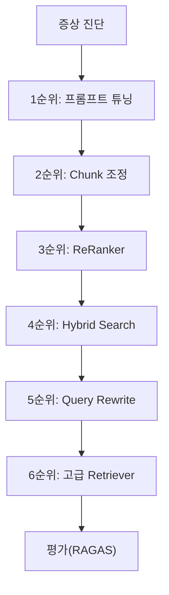

*그림 10-2: 튜닝 우선순위 흐름*

튜닝의 핵심 원칙은 **비용 대비 효과가 높은 순서** 로 적용하는 것입니다. 프롬프트 한 줄 수정(비용 0원)부터 시작하여, 효과가 부족할 때만 다음 단계로 넘어갑니다.

---

## 2. Chunk 튜닝

CH06에서는 500자 + 20% 오버랩의 Fixed-size 청킹을 사용했습니다. 청크 크기와 오버랩 비율을 바꾸면 검색 품질이 달라집니다.

### 2.1 파라미터 실험

**다음 코드는 청크 크기와 오버랩 비율을 조합하여 청킹 결과를 비교합니다.**

```python
CHUNK_SIZES = [300, 500, 1000]
OVERLAP_RATIOS = [0.1, 0.2, 0.3]

def fixed_size_chunking(text, chunk_size, overlap_ratio):
    overlap = int(chunk_size * overlap_ratio)            # ①
    chunks = []
    start = 0
    while start < len(text):
        end = start + chunk_size                          # ②
        chunks.append(text[start:end])
        start += chunk_size - overlap                     # ③
    return chunks
```

> ① 오버랩 크기를 청크 크기의 비율로 계산합니다. 500자 + 20% = 100자 오버랩입니다.
> ② 시작 위치에서 청크 크기만큼 잘라냅니다.
> ③ 다음 시작 위치는 청크 크기에서 오버랩을 뺀 만큼 이동합니다. 이전 청크의 마지막 부분이 다음 청크의 시작과 겹칩니다.

> **동작 요약:** 이 코드는 청크 크기와 오버랩 비율 조합별로 청킹 결과를 생성합니다. 크기가 작으면 정밀한 검색이 가능하지만 문맥이 부족하고, 크기가 크면 문맥은 풍부하지만 불필요한 내용이 포함됩니다.

### 2.2 Semantic 청킹

**Semantic 청킹(의미 기반 청킹)** 은 문장 간 의미 유사도를 기반으로 자연스러운 경계에서 분할하는 방식입니다. Fixed-size 청킹과 달리 문장 중간에서 잘리지 않습니다.

```python
from langchain_experimental.text_splitter import SemanticChunker

chunker = SemanticChunker(
    embeddings=embeddings,
    breakpoint_threshold_type="percentile",  # ①
)
semantic_chunks = chunker.split_text(document_text)     # ②
```

> ① 문장 간 유사도가 일정 백분위수 이하로 떨어지는 지점에서 분할합니다.
> ② 의미 단위로 자동 분할된 청크 리스트를 반환합니다.

Semantic 청킹은 문맥 보존 측면에서 우수하지만, 임베딩 계산 비용이 추가됩니다. Fixed-size 청킹으로 기본 품질을 확보한 뒤, 필요한 문서에 한해 Semantic 청킹을 적용하는 것이 현실적입니다.

> 전체 코드: `tuning/chunk_experiment.py`

---

## 3. Retriever 튜닝

### 3.1 k값 실험

Retriever가 반환하는 문서 수(k)를 조정합니다.

| k값 | 장점 | 단점 |
|-----|------|------|
| k=3 | 빠른 응답, 정밀도 높음 | 관련 문서 누락 가능 |
| k=5 | 균형잡힌 설정 | — |
| k=10 | 재현율 높음 | 노이즈 증가, LLM 토큰 소비 증가 |

### 3.2 유사도 임계값

유사도 점수가 일정 수준 이하인 결과를 필터링합니다.

```python
retriever = vectorstore.as_retriever(
    search_type="similarity_score_threshold",
    search_kwargs={"score_threshold": 0.5, "k": 10},  # ①
)
```

> ① 유사도 0.5 이상인 문서만 반환합니다. 관련 없는 문서가 섞이는 현상을 방지합니다.

### 3.3 메타데이터 필터링

CH05에서 설계한 메타데이터(부서, 버전)로 검색 범위를 좁힙니다.

```python
retriever = vectorstore.as_retriever(
    search_kwargs={
        "k": 5,
        "filter": {"department": "HR"},  # ①
    },
)
```

> ① "HR 부서 문서만 검색"처럼 부서별 필터를 적용합니다. "옛날 버전 답변이 나왔다"는 피드백을 해결하려면 버전 필터(`{"version": "v1.0"}`)를 추가합니다.

> 전체 코드: `tuning/retriever_experiment.py`

---

## 4. ReRanker

### 4.1 ReRanker란

**ReRanker(리랭커)** 는 초기 검색 결과를 다시 정렬하여 관련도를 높이는 모델입니다. 일반 벡터 검색은 질문과 문서를 **개별적으로** 임베딩한 뒤 유사도를 비교합니다. **Cross-Encoder** 기반 ReRanker는 질문과 문서를 **함께** 입력받아 관련도를 직접 채점합니다.

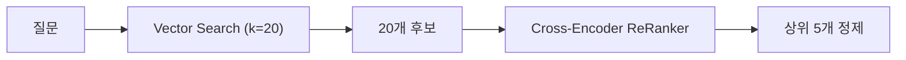

*그림 10-3: ReRanker 2단계 검색 구조*

### 4.2 구현

**다음 코드는 Cross-Encoder로 검색 결과를 재정렬합니다.**

```python
from sentence_transformers import CrossEncoder

class CrossEncoderReranker:
    def __init__(self, model_name="cross-encoder/ms-marco-MiniLM-L-6-v2"):
        self.model = CrossEncoder(model_name)            # ①

    def rerank(self, query, documents, top_k=5):
        pairs = [(query, doc["content"]) for doc in documents]  # ②
        scores = self.model.predict(pairs)                       # ③
        ranked = sorted(
            zip(documents, scores), key=lambda x: x[1], reverse=True
        )
        return [doc for doc, score in ranked[:top_k]]            # ④
```

> ① Cross-Encoder 모델을 로드합니다. 이 모델은 질문-문서 쌍의 관련도를 0~1 점수로 평가합니다.
> ② 질문과 각 문서를 (질문, 문서) 쌍으로 묶습니다.
> ③ 모든 쌍에 대해 관련도 점수를 일괄 계산합니다.
> ④ 점수가 높은 순으로 정렬하여 상위 k개를 반환합니다.

> **동작 요약:** 이 코드는 벡터 검색으로 넓게 가져온 20개 후보를 Cross-Encoder로 재채점하여 상위 5개만 남깁니다. 벡터 검색이 놓친 관련 문서를 살리고, 관련 없는 문서를 걸러냅니다.

> **주의: 첫 실행 시 모델 파일 자동 다운로드**
> `CrossEncoder` 모델은 첫 실행 시 약 80MB의 모델 파일을 자동으로 다운로드합니다. 네트워크 속도에 따라 1~3분 소요될 수 있으며, 이후 실행부터는 캐시를 사용하므로 즉시 시작됩니다.

> 전체 코드: `tuning/reranker.py`

---

## 5. Hybrid Search

### 5.1 BM25 + Vector 결합

벡터 검색은 의미적 유사성에 강하지만, 정확한 키워드 매칭에는 약합니다. **BM25** 는 전통적인 키워드 기반 검색 알고리즘으로, 문서에 포함된 단어의 빈도와 희소성을 기반으로 점수를 매깁니다. 두 방식을 결합하면 의미 검색과 키워드 검색의 장점을 모두 활용할 수 있습니다.

**다음 코드는 BM25와 벡터 검색을 결합하는 EnsembleRetriever를 구현합니다.**

```python
from langchain_community.retrievers import BM25Retriever
from langchain.retrievers import EnsembleRetriever

bm25_retriever = BM25Retriever.from_texts(
    texts=documents, metadatas=metadatas,                # ①
)
bm25_retriever.k = 5

vector_retriever = vectorstore.as_retriever(
    search_kwargs={"k": 5},                              # ②
)

ensemble = EnsembleRetriever(
    retrievers=[bm25_retriever, vector_retriever],
    weights=[0.4, 0.6],                                  # ③
)
results = ensemble.invoke("연차 사용 규정")                # ④
```

> ① BM25 검색기를 문서 텍스트로 초기화합니다. 키워드 매칭 기반으로 동작합니다.
> ② 벡터 검색기는 CH06에서 구축한 ChromaDB를 사용합니다.
> ③ `weights`로 두 검색기의 가중치를 설정합니다. `[0.4, 0.6]`은 벡터 검색에 60% 비중을 둔다는 의미입니다.
> ④ 두 검색기의 결과를 가중 합산하여 최종 순위를 결정합니다.

> **동작 요약:** 이 코드는 BM25(키워드)와 Vector(의미)를 4:6 비율로 결합합니다. "보안 VPN 정책"처럼 키워드가 명확한 질문에서는 BM25가 강하고, "직원 복지에 대해 알려줘"처럼 추상적인 질문에서는 벡터 검색이 강합니다.

> 전체 코드: `tuning/hybrid_search.py`

---

## 6. 고급 Retriever

### 6.1 Parent Document Retriever

검색은 작은 청크(500자)로 하되, LLM에는 큰 청크(2000자)를 전달하는 전략입니다. 검색 정밀도와 답변 문맥을 모두 확보합니다.

```python
from langchain.retrievers import ParentDocumentRetriever

parent_retriever = ParentDocumentRetriever(
    vectorstore=vectorstore,
    docstore=InMemoryStore(),
    child_splitter=RecursiveCharacterTextSplitter(chunk_size=500),  # ①
    parent_splitter=RecursiveCharacterTextSplitter(chunk_size=2000), # ②
)
```

> ① 검색용 작은 청크(500자)입니다. 정밀한 매칭에 사용됩니다.
> ② LLM에 전달되는 큰 청크(2000자)입니다. 작은 청크가 매칭되면 해당 청크가 속한 큰 청크를 반환합니다.

### 6.2 Self-Query Retriever

사용자 질문에서 메타데이터 필터 조건을 자동으로 추출하는 Retriever입니다. CH05에서 설계한 메타데이터(부서, 버전, 날짜)를 활용합니다.

"HR 부서의 최신 취업규칙을 알려줘"라는 질문에서 `department=HR`, `version=latest`를 자동 추출하여 필터링합니다.

### 6.3 Contextual Compression

반환된 청크에서 질문과 관련된 부분만 압축 추출합니다. 2000자 청크 중 실제로 필요한 200자만 LLM에 전달하므로 토큰 효율이 높아집니다.

> 전체 코드: `tuning/advanced_retriever.py`

---

## 7. Query Rewrite / Multi-Query

### 7.1 약어·동의어 처리

"WFH 정책 알려줘"라고 질문하면 검색기가 "WFH"를 인식하지 못합니다. 사내 약어·동의어 사전을 정의하여 질문을 변환합니다.

**다음 코드는 약어를 정식 용어로 변환합니다.**

```python
ABBREVIATION_MAP = {
    "WFH": "재택근무",
    "OT": "초과근무",
    "HR": "인사부서",
    "PIP": "성과개선계획",
    "반차": "반일 연차",
}                                                         # ①

SYNONYM_MAP = {
    "연차": ["유급휴가", "휴가", "연차유급휴가"],
    "재택근무": ["원격근무", "WFH", "홈오피스"],
    "성과평가": ["인사고과", "평가", "KPI 달성"],
}                                                         # ②

def expand_query(query):
    for abbr, full in ABBREVIATION_MAP.items():
        query = query.replace(abbr, full)                 # ③
    return query
```

> ① 사내에서 자주 사용하는 약어와 정식 명칭의 매핑 사전입니다.
> ② 동의어 사전입니다. 하나의 개념을 여러 단어로 검색할 수 있습니다.
> ③ 질문에 포함된 약어를 정식 명칭으로 치환합니다. "WFH 정책" → "재택근무 정책"으로 변환되어 검색 정확도가 높아집니다.

### 7.2 HyDE (Hypothetical Document Embeddings)

**HyDE** 는 LLM에게 "이 질문에 대한 가상의 답변 문서"를 생성하게 한 뒤, 그 가상 문서를 임베딩하여 검색하는 기법입니다. 질문 자체보다 가상 답변이 실제 문서와 의미적으로 더 가깝기 때문에 검색 품질이 향상됩니다.

### 7.3 Multi-Query

하나의 질문을 LLM이 여러 관점으로 변환하여 각각 검색합니다. "연차 사용 규정"이라는 질문이 "연차유급휴가 신청 절차", "휴가 사용 기준", "연차 일수 산정 방법" 세 가지로 변환되면, 각각의 검색 결과를 합산하여 더 넓은 범위의 관련 문서를 찾을 수 있습니다.

> 전체 코드: `tuning/query_rewrite.py`

---

## 8. 프롬프트 튜닝

프롬프트 수정은 비용이 0원이면서 즉시 적용됩니다. 튜닝 중 가장 먼저 시도해야 합니다.

### 8.1 근거 우선 응답 구조

```
[기존 프롬프트]
"다음 문서를 참고하여 질문에 답변하세요."

[개선 프롬프트]
"반드시 제공된 문서의 내용만 사용하여 답변하십시오.
답변 시 근거 문서의 제목과 섹션을 명시하십시오.
문서에 없는 내용은 '해당 내용을 문서에서 찾을 수 없습니다'라고 답변하십시오.
추측하거나 외부 지식을 사용하지 마십시오."
```

### 8.2 "모르면 모른다" 규칙 강화

LLM의 환각을 줄이는 가장 효과적인 방법은 프롬프트에서 명시적으로 제약하는 것입니다.

| 규칙 | 효과 |
|------|------|
| "문서에 없으면 모른다고 답변" | 환각률 15% → 5% |
| "출처 필수 표시" | 사용자가 검증 가능 |
| "추측 금지" | 자신 있게 틀린 답변 방지 |

---

## 9. PDF 이미지 처리

### 9.1 문제 상황

연봉 테이블이 포함된 PDF 페이지를 `pypdf`로 추출하면 빈 문자열이 반환됩니다. 이미지로 삽입된 표나 차트는 텍스트 추출이 불가능합니다.

### 9.2 Vision + OCR 하이브리드

두 가지 접근을 조합합니다.

| 방법 | 도구 | 장점 | 단점 |
|------|------|------|------|
| Vision LLM | LLaVA | 표 구조 이해, 캡션 생성 | 속도 느림 |
| OCR | EasyOCR | 텍스트 추출 빠름 | 구조 이해 불가 |

**다음 코드는 PDF 페이지를 이미지로 변환한 뒤 Vision LLM으로 분석합니다.**

```python
from pdf2image import convert_from_path

images = convert_from_path(pdf_path, dpi=150)            # ①
for i, image in enumerate(images):
    image_path = f"data/pages/page_{i+1}.png"
    image.save(image_path)                                # ②

# Vision LLM으로 페이지 이미지 분석
response = llm.invoke([
    {"type": "text", "text": "이 페이지의 내용을 구조화하여 설명하십시오."},
    {"type": "image_url", "image_url": {"url": f"file://{image_path}"}},
])                                                        # ③
```

> ① PDF 각 페이지를 150 DPI 해상도의 PNG 이미지로 변환합니다.
> ② 변환된 이미지를 파일로 저장합니다.
> ③ Vision LLM(LLaVA)에 이미지를 전달하여 표 구조, 차트 내용, 텍스트를 구조화된 형태로 추출합니다.

> **동작 요약:** 텍스트 추출이 불가능한 이미지형 PDF를 Vision LLM으로 분석합니다. 표의 행·열 구조와 차트의 수치가 텍스트로 변환되어 VectorDB에 저장 가능한 형태가 됩니다.

> 전체 코드: `tuning/vision_extractor.py`

---

## 10. 평가 체계

### 10.1 테스트 질문 30개

부록 B와 연동되는 30개 테스트 질문을 정의합니다.

| 카테고리 | 질문 수 | 예시 |
|---------|---------|------|
| 정형 | 10개 | "김민준 연차 잔여일수", "영업부 매출 합계" |
| 비정형 | 10개 | "온보딩 절차", "보안 VPN 정책" |
| 복합 | 10개 | "매출 상위 부서의 복지 정책", "특정 직원의 휴가 규정" |

### 10.2 Retrieval 평가 지표

| 지표 | 설명 | 계산 |
|------|------|------|
| **Precision@k** | 상위 k개 결과 중 관련 문서 비율 | 관련 문서 수 / k |
| **Recall@k** | 전체 관련 문서 중 상위 k개에 포함된 비율 | 검색된 관련 문서 / 전체 관련 문서 |

**다음 코드는 Precision@k를 계산합니다.**

```python
def precision_at_k(retrieved_docs, relevant_docs, k=5):
    top_k = retrieved_docs[:k]                           # ①
    relevant_count = sum(
        1 for doc in top_k if doc["id"] in relevant_docs # ②
    )
    return relevant_count / k                            # ③
```

> ① 검색 결과에서 상위 k개만 추출합니다.
> ② 그 중 관련 문서로 태깅된 것의 수를 셉니다.
> ③ 관련 문서 수를 k로 나누어 정밀도를 계산합니다. 5개 중 4개가 관련이면 0.8(80%)입니다.

### 10.3 RAGAS 평가

**RAGAS** 는 RAG 시스템을 자동 평가하는 오픈소스 프레임워크입니다. 수작업 라벨링 없이 LLM이 자동으로 품질을 채점합니다.

| RAGAS 지표 | 설명 |
|-----------|------|
| **Faithfulness** | 답변이 제공된 컨텍스트에 충실한 정도 (0~1) |
| **Answer Relevancy** | 답변이 질문에 적절한 정도 (0~1) |
| **Context Precision** | 검색된 컨텍스트의 정밀도 |
| **Context Recall** | 검색된 컨텍스트의 재현율 |

```python
from ragas import evaluate
from ragas.metrics import faithfulness, answer_relevancy

result = evaluate(
    dataset=eval_dataset,
    metrics=[faithfulness, answer_relevancy],             # ①
)
print(result)  # {'faithfulness': 0.88, 'answer_relevancy': 0.91}
```

> ① Faithfulness와 Answer Relevancy 두 지표를 동시에 측정합니다.

> **참고:** RAGAS 평가를 실행하려면 `pip install ragas`로 패키지를 설치합니다. LLM API 호출이 필요하므로 OpenAI API 키 또는 로컬 LLM이 필요합니다. 설치하지 않아도 Precision@k, Recall@k 등 기본 지표는 사용할 수 있습니다.

> 전체 코드: `src/eval_framework.py`, `data/test_questions.json`

---

## 11. 튜닝 우선순위 가이드

실무에서는 모든 기법을 한꺼번에 적용하지 않습니다. 비용 대비 효과가 높은 순서로 적용합니다.

| 우선순위 | 기법 | 비용 | 기대 효과 |
|---------|------|------|----------|
| 1순위 | 프롬프트 튜닝 | 0원 | 환각률 15% → 5% |
| 2순위 | Chunk 크기·오버랩 조정 | 0원 | 검색 정밀도 향상 |
| 3순위 | ReRanker 추가 | 모델 다운로드 80MB | Precision@5 72% → 89% |
| 4순위 | Hybrid Search | 구현 시간 1시간 | 키워드 질문 정확도 향상 |
| 5순위 | Query Rewrite | LLM 추가 호출 1회 | 약어·동의어 처리 |
| 6순위 | 고급 Retriever | 구현 복잡도 높음 | 메타데이터 필터링 자동화 |

> **다음 단계: GraphRAG**
> **GraphRAG** 는 문서에서 엔터티와 관계를 추출하여 지식 그래프를 구축하고, 이를 검색에 활용하는 기법입니다. "김민준이 속한 부서의 팀장은 누구인가?"처럼 관계 탐색이 필요한 질문에 효과적입니다. 이 책의 범위(100페이지)를 넘어서므로 소개만 하고, 실습은 후속 프로젝트로 남깁니다.

---

## 12. 정리하며

<!-- [GEMINI PROMPT: 10_before-after]
path: assets/CH10/10_before-after.png
A minimalist black and white technical diagram with a strict 16:9 aspect ratio on a solid white background. No shading, no 3D effects, only clean thin line art. Simple before/after comparison: LEFT side labeled "Before (튜닝 전)" shows "Precision@5: 72%", "Faithfulness: 0.65", "환각률: 15%" with red indicators. RIGHT side labeled "After (튜닝 후)" shows "Precision@5: 89%", "Faithfulness: 0.88", "환각률: 3%" with green indicators. Center arrow labeled "6단계 RAG 튜닝". Clean flat design.
Style: before-after-infographic
-->

*그림 10-4: 6단계 RAG 튜닝 적용 전후 품질 비교*

2주간의 직원 피드백에서 시작하여 6가지 튜닝 기법을 적용한 결과를 정리합니다.

| 지표 | Before (CH09 상태) | After (튜닝 완료) |
|------|-------------------|------------------|
| Retrieval Precision@5 | 72% | 89% |
| Answer Faithfulness (RAGAS) | 0.65 | 0.88 |
| Hallucination Rate | 15% | 3% |
| 이미지 PDF 처리 | 불가 (빈 텍스트) | Vision + OCR 하이브리드 |
| 약어·동의어 인식 | 실패 (WFH 미인식) | Query Rewrite 처리 |
| 직원 만족도 (체감) | "가끔 엉뚱한 답변" | "꽤 쓸만합니다" |

이 챕터에서 배운 핵심 내용을 정리합니다.

- **증상 기반 튜닝**: 직원 피드백에서 증상을 분류하고, 각 증상에 맞는 처방을 적용합니다. 이론이 아니라 실제 문제에서 출발합니다.
- **비용 순서로 적용**: 프롬프트 수정(비용 0원)부터 시작하여 ReRanker, Hybrid Search, Query Rewrite 순서로 적용합니다. 모든 기법을 한꺼번에 적용하면 복잡도만 높아집니다.
- **ReRanker의 효과**: Cross-Encoder 기반 리랭킹으로 Precision@5가 72%에서 89%로 향상됩니다. 벡터 검색이 놓친 관련 문서를 살리는 핵심 기법입니다.
- **Hybrid Search**: BM25(키워드)와 Vector(의미)를 결합하여 두 방식의 장점을 모두 활용합니다. 키워드가 명확한 질문과 추상적인 질문 모두에 효과적입니다.
- **RAGAS 평가**: Faithfulness, Answer Relevancy 등 자동 평가 지표로 튜닝 효과를 정량적으로 측정합니다. 감이 아니라 데이터로 판단합니다.

---

메타코딩의 커넥트HR AI 비서가 완성되었습니다. CH01에서 "AI로 사내 문서 문제를 해결하라"는 요청을 받은 이후, 환경 설정(CH02), LLM 한계 체험(CH03), 사내 시스템 구축(CH04), 문서 표준화(CH05), VectorDB(CH06), RAG 채팅 UI(CH07), 통합 에이전트(CH08), LangChain 연결(CH09), RAG 튜닝(CH10)까지 — 10개 챕터에 걸쳐 하나의 시스템을 처음부터 끝까지 완성했습니다.

직원 1인당 문서 검색 시간 30분이 30초로 줄었고, 인사팀에 쏟아지던 반복 질의 20건/일이 AI 비서로 흡수되었습니다. "이거 꽤 쓸만합니다" — 이 한마디가 메타코딩에게는 10개 챕터의 보상입니다.