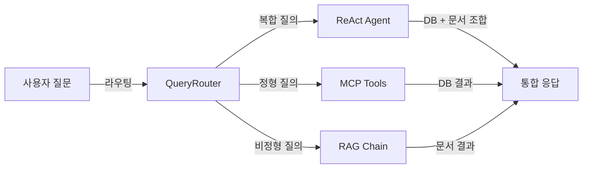
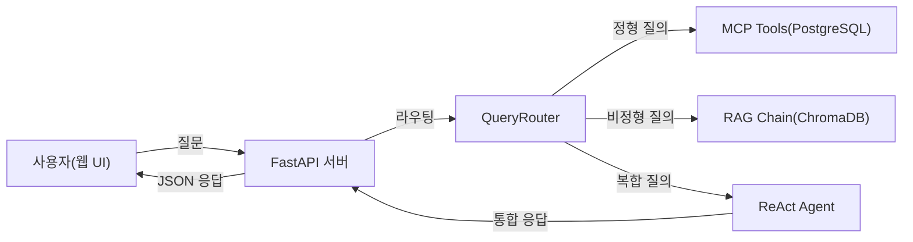
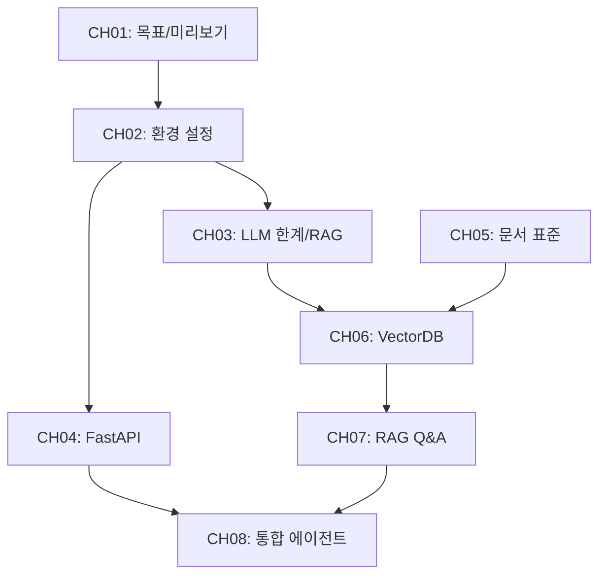

# 1. 이 책의 목표와 최종 완성본 미리보기

메타코딩은 중소기업 "커넥트"의 유일한 개발자이다. 30명 규모의 회사에서 사내 문서가 3,000건 이상 쌓여 있고, 직원들은 매일 평균 30분을 문서 검색에 소비한다. "김 대리 연차 며칠 남았어요?", "신입사원 온보딩 절차가 어떻게 되죠?" 같은 질문이 인사팀에 하루 20건 이상 들어온다. 어느 날 대표가 메타코딩을 불러 한마디를 건넨다.

"AI로 이 문제 해결할 수 없겠나?"

메타코딩은 자리로 돌아와 노트에 두 가지 질문을 적는다. _우리 회사 정보를 AI에게 어떻게 알려줄 수 있을까? 문서가 바뀌면 AI도 다시 학습시켜야 하나?_ 이 챕터에서는 메타코딩이 그 질문에 답을 찾아가는 과정, 즉 이 책이 무엇을 만들고 어떻게 만들어 나가는지를 먼저 살펴봅니다.

---

## 1. 이 책이 다루는 범위

메타코딩이 처음 고려한 방법은 LLM을 사내 데이터로 **파인튜닝(Fine-tuning)** 하는 것이었습니다. 그러나 조사를 시작하자마자 현실적인 장벽을 마주하게 됩니다.

> **질문: Fine-tuning이 왜 어렵나요?**
> Fine-tuning은 수천~수만 건의 정제된 학습 데이터가 필요하고, GPU 서버 비용이 상당합니다. 또한 취업 규칙이 개정될 때마다 재학습을 해야 하므로 운영 부담이 큽니다.

이 책이 선택한 해법은 **검색 증강 생성(RAG, Retrieval-Augmented Generation)** 과 **모델 컨텍스트 프로토콜(MCP, Model Context Protocol)** 의 조합입니다. 두 기술의 차이를 이해하면 왜 이 조합이 중소기업에 적합한지가 명확해집니다.

### Fine-tuning vs RAG 비교

| 항목 | Fine-tuning | RAG |
|------|-------------|-----|
| 데이터 요구량 | 수천~수만 건 정제 데이터 | 원본 문서 그대로 사용 |
| 초기 비용 | 높음 (GPU 학습 비용) | 낮음 (임베딩 비용만) |
| 업데이트 주기 | 재학습 필요 (일~주 단위) | 문서 추가 즉시 반영 |
| 사내 정보 반영 | 학습 완료 후에만 가능 | 실시간 반영 |
| 적합 상황 | 특정 도메인 언어 스타일 학습 | 최신 문서 기반 정확한 답변 |
| 환각 위험 | 낮음 (학습된 패턴 내) | 검색 실패 시 발생 가능 |

**RAG** 는 LLM에게 "직접 외우게" 하는 대신 "필요할 때 검색해서 답하게" 하는 기법입니다. 취업 규칙이 개정되어도 파일 하나를 교체하면 되므로 운영 부담이 없습니다.

그런데 직원들의 질문 중 일부는 문서가 아니라 데이터베이스에 있는 정형 데이터를 필요로 합니다. "김철수 사원의 남은 연차는?"이라는 질문은 HR 정책 문서가 아니라 DB 테이블에서 꺼내야 합니다. 이 정형 데이터 조회를 처리하는 표준 방법이 바로 **MCP** 입니다. LLM이 외부 도구나 데이터 소스에 접근하는 표준 프로토콜로, "어떤 도구를 언제 쓸지"를 LLM이 스스로 판단하도록 설계되어 있습니다.

이 책의 최종 산출물은 이 두 기술을 결합한 **"커넥트HR AI 비서"** 입니다. 비정형 문서는 RAG로, 정형 DB는 MCP로, 두 가지를 동시에 필요로 하는 복합 질문은 ReAct 에이전트로 처리합니다.

---

## 2. 최종 결과물 데모 시나리오

완성된 커넥트HR AI 비서가 어떻게 동작하는지 세 가지 질문 유형으로 살펴보겠습니다.

### 정형 질문 — DB 직접 조회

> **질문**: "김철수 사원의 남은 연차는 며칠인가요?"

AI 비서는 이 질문이 데이터베이스 조회가 필요한 정형 질문임을 인식합니다. MCP 도구를 통해 PostgreSQL의 `leave_balance` 테이블을 직접 조회하고 결과를 반환합니다.

```
답변: 김철수 사원의 현재 연차 잔여일은 7일입니다.
출처: PostgreSQL — leave_balance 테이블 (실시간 조회)
```

### 비정형 질문 — 문서 검색

> **질문**: "신입사원 온보딩 절차를 알려주세요."

AI 비서는 ChromaDB에서 관련 청크를 검색하고 출처를 명시하여 답변합니다.
```
답변: 신입사원 온보딩은 다음 절차로 진행됩니다.
      1. 입사 첫날: 사원증 발급 및 PC 셋업
      2. 1주차: 부서 오리엔테이션 및 업무 시스템 교육
      ...
출처: HR_취업규칙_v1.0.pdf, 23페이지
```

### 복합 질문 — DB + 문서 조합

> **질문**: "올해 매출 상위 부서의 복지 정책을 비교해 주세요."

AI 비서의 ReAct 에이전트는 먼저 DB에서 부서별 매출을 조회하고, 이어서 복지 정책 문서를 검색하여 두 결과를 조합합니다.

```
답변: 올해 상반기 매출 1위는 영업팀(2.3억), 2위는 개발팀(1.8억)입니다.
      영업팀 복지: 분기별 성과 인센티브, 유연 근무 허용
      개발팀 복지: 교육비 지원 연 200만 원, 재택 근무 주 2회
출처: PostgreSQL — sales 테이블 + OPS_신규서비스_런칭전략.pdf 15페이지
```

이 세 가지 시나리오가 이 책을 통해 구현할 기능의 전체 범위입니다. 아래 다이어그램은 각 질문 유형이 시스템을 통해 어떻게 처리되는지를 보여줍니다.



*그림 1-1: 질문 유형별 처리 흐름 개요*

---

## 3. 아키텍처 한 장 요약

커넥트HR AI 비서의 전체 구조를 한 장에 담으면 다음과 같습니다.



*그림 1-2: 커넥트HR AI 비서 전체 아키텍처*

<!-- [GEMINI PROMPT: 01_architecture-overview]
path: assets/CH01/01_architecture-overview.png
A minimalist black and white technical diagram with a strict 16:9 aspect ratio on a solid white background. No shading, no 3D effects, only clean thin line art. The entire assembly of icons, lines, and text is perfectly centered globally within the 16:9 frame, leaving generous and equal white space on all sides. Show a left-to-right flow: minimalist line-art person icon labeled '사용자(웹 UI)' -> minimalist line-art server rack icon labeled 'FastAPI 서버' -> minimalist line-art decision diamond labeled 'QueryRouter' -> three branches: cylinder icon labeled 'PostgreSQL(MCP)', cylinder icon labeled 'ChromaDB(RAG)', brain icon labeled 'ReAct Agent'. All Korean labels, clean arrows, white background.
Style: architecture-infographic
-->

*그림 1-3: 커넥트HR AI 비서 전체 아키텍처 — 개념 일러스트*

각 구성 요소의 역할은 아래와 같습니다.

| 구성 요소 | 역할 |
|-----------|------|
| **FastAPI 서버** | 사용자 요청을 받아 라우터로 전달하고 최종 응답을 반환하는 웹 백엔드 |
| **QueryRouter** | 질문 유형(정형/비정형/복합)을 판단하여 적절한 처리 경로로 분기 |
| **MCP Tools** | PostgreSQL에 SQL을 실행하여 정형 데이터를 조회하는 도구 집합 |
| **RAG Chain** | ChromaDB에서 관련 문서 청크를 검색하고 LLM에 주입하여 답변 생성 |
| **ReAct Agent** | 복합 질문을 단계별로 분해하여 MCP와 RAG를 순차/병렬로 조합 |
| **ChromaDB** | 문서 임베딩 벡터를 저장하고 의미 기반 유사도 검색을 수행하는 벡터 DB |
| **PostgreSQL** | 직원, 휴가 잔여, 매출 등 정형 데이터를 저장하는 관계형 DB |

> **참고: QueryRouter가 중요한 이유**
> 실무 환경에서 사용자는 어떤 데이터 소스에서 답을 가져와야 하는지 모릅니다. 라우터가 없으면 모든 질문을 RAG에 보내거나 모든 질문을 DB에 보내야 하는데, 어느 쪽도 전체 질문을 커버할 수 없습니다. QueryRouter는 이 판단을 자동화합니다.

---

## 4. 사용 기술 스택

메타코딩이 선정한 기술 스택입니다. 중소기업 환경에서 비용과 유지보수를 우선 고려하여 로컬 실행이 가능한 오픈소스 중심으로 구성했습니다.

### 기술별 역할 및 메모리 요구사항
| 영역 | 기술 | 버전 | 역할 | 메모리 |
|------|------|------|------|--------|
| 텍스트 LLM | Ollama + DeepSeek R1 | Ollama 0.5+, deepseek-r1:8b | 질의응답 추론 (CH06~07) | 8~16GB |
| Tool Calling LLM | Ollama + Llama 3.1 | llama3.1:8b | 에이전트 도구 호출 (CH08~10) | 4~8GB |
| Vision LLM | Ollama + LLaVA | llava:13b | 이미지·표 캡션 생성 (CH10) | 4~8GB |
| 백엔드 | FastAPI | 0.115+ | REST API 웹 서버 | 1GB |
| 정형 DB | PostgreSQL | 16+ | 직원·휴가·매출 데이터 | 1GB |
| 벡터 DB | ChromaDB | 0.5+ | 문서 임베딩 저장·검색 | 1GB |
| 오케스트레이션 | LangChain | 0.3+ | RAG 체인 + 에이전트 | 1GB |
| 도구 연동 | MCP (mcp-python-sdk) | 1.0+ | LLM ↔ DB/도구 연결 | - |
| 임베딩 | ko-sroberta-multitask | 3.0+ | 한국어 텍스트 벡터화 | 1GB |
| 문서 파싱 | pypdf, python-docx, openpyxl | 최신 | PDF/DOCX/XLSX 파싱 | - |

### 최소 및 권장 하드웨어 스펙

| 항목 | 최소 사양 | 권장 사양 |
|------|---------|---------|
| RAM | 16GB | 32GB |
| 저장공간 | 20GB 여유 | 50GB 여유 |
| OS | macOS 13+ / Ubuntu 22.04+ / Windows WSL2 | macOS (Apple Silicon) / Ubuntu 22.04+ |
| GPU | 불필요 (CPU 추론 가능) | NVIDIA GPU 또는 Apple Silicon (속도 향상) |

> **팁: LLM Provider를 나중에 바꿀 수 있습니다**
> 이 책의 모든 코드는 `.env` 파일의 `LLM_PROVIDER` 값 하나로 Ollama(로컬 무료), OpenAI(클라우드 유료), vLLM(자체 호스팅) 사이에서 전환됩니다. 처음에는 Ollama로 시작하고, 나중에 필요에 따라 변경하십시오. CH02에서 이 전환 구조를 직접 구현합니다.

> **주의: RAM 16GB 미만 환경**
> deepseek-r1:8b 모델은 실행 시 약 8~16GB의 RAM을 사용합니다. 16GB 미만 환경에서는 `deepseek-r1:1.5b` 경량 모델을 대신 사용하십시오. 답변 품질은 다소 낮아질 수 있습니다.

---

## 5. 이 책을 마치면 할 수 있는 것

메타코딩은 이 책을 완독한 후 세 가지 핵심 역량을 갖추게 됩니다. 독자 여러분도 마찬가지입니다.

**첫째, RAG 파이프라인 구축 능력.** 사내 문서를 벡터 DB에 인덱싱하고, 사용자 질문에 맞는 청크를 검색하여 LLM 답변에 근거를 붙이는 전체 파이프라인을 직접 만들 수 있습니다.

**둘째, MCP 통합 에이전트 설계 능력.** 정형 DB와 비정형 문서를 하나의 에이전트에서 처리하는 구조를 설계하고, 새로운 도구를 `@tool` 데코레이터 하나로 추가할 수 있습니다.

**셋째, 실전 RAG 튜닝 능력.** "답변이 틀렸다"는 증상에서 원인(청크 크기, 검색 방식, 프롬프트)을 찾아 수치로 개선 효과를 측정하는 체계적인 튜닝 방법론을 익힐 수 있습니다.

### 챕터별 빌드업 로드맵

각 챕터는 이전 챕터 위에 쌓이는 구조입니다.



*그림 1-4: 챕터 의존성 그래프 — CH01부터 CH10까지 순방향 연결*

각 단계에서 메타코딩이 해결하는 문제와 독자가 얻는 산출물은 다음과 같습니다.

| 챕터 | 메타코딩의 문제 | 산출물 |
|------|--------------|--------|
| CH01 | 무엇을 만들지 몰라 막막함 | 전체 아키텍처 이해 |
| CH02 | 개발 환경이 없음 | 검증된 로컬 LLM 환경 |
| CH03 | LLM이 왜 틀리는지 모름 | RAG 필요성 체감 |
| CH04 | 사내 데이터를 담을 시스템 없음 | FastAPI + DB 기반 사내 시스템 |
| CH05 | 문서가 뒤섞여 있어 품질 보장 불가 | 표준화된 문서 세트 |
| CH06 | 문서를 AI가 검색할 수 없음 | ChromaDB 인덱스 + CLI 검증 |
| CH07 | 개발자만 검색 가능, 전 직원 사용 불가 | 웹 채팅 UI + 멀티턴 대화 |
| CH08 | RAG만으로 정형 데이터 질문 처리 불가 | 통합 에이전트 (정형+비정형+복합) |
| CH09 | 운영 중 타임아웃·에러 관리 불가 | 운영 설정 완비된 연결 구조 |
| CH10 | "가끔 틀리는" 문제를 개선할 방법 모름 | 튜닝 프레임워크 + 품질 측정 |

---

## 6. 정리하며

CH01에서 확인한 내용을 정리합니다.

- **RAG vs Fine-tuning**: 사내 문서처럼 빈번히 갱신되는 데이터에는 RAG가 적합합니다. 문서를 추가하면 즉시 반영되고 재학습 비용이 없습니다.
- **MCP의 역할**: 정형 DB 조회와 비정형 문서 검색을 하나의 에이전트에서 처리하는 표준 연결 프로토콜입니다.
- **전체 아키텍처**: 사용자 질문이 FastAPI → QueryRouter를 거쳐 MCP Tools, RAG Chain, ReAct Agent 중 하나 또는 조합으로 처리됩니다.
- **기술 스택**: Ollama(로컬 LLM), ChromaDB(벡터 DB), PostgreSQL(정형 DB), LangChain(오케스트레이션)이 핵심이며, 모두 무료 오픈소스입니다.
- **학습 결과**: 이 책을 마치면 RAG 파이프라인 구축, MCP 통합 에이전트 설계, 실전 튜닝의 세 가지 역량을 확보합니다.

<!-- [GEMINI PROMPT: 01_before-after]
path: assets/CH01/01_before-after.png
A minimalist black and white technical diagram with a strict 16:9 aspect ratio on a solid white background. No shading, no 3D effects, only clean thin line art. The entire assembly is perfectly centered within the 16:9 frame with generous white space. Simple before/after comparison infographic: LEFT side labeled 'Before' shows a stack-of-papers icon and a person icon with a clock, large text '30분/일' below, and '20건/일 수동 처리' below. RIGHT side labeled 'After' shows a brain icon labeled 'AI 비서', large text '30초/건' below, and '0건 자동 응답' below. A bold right-pointing arrow in the middle connects the two sides. Korean labels, clean flat design, white background.
Style: before-after-infographic
-->

*그림 1-5: 커넥트HR AI 비서 도입 전후 비교*

| 지표 | Before | After (목표) |
|------|--------|-------------|
| 직원 1인 문서 검색 시간 | 30분/일 | 30초/건 |
| 인사팀 반복 질의 처리 | 20건/일 (수동) | 0건 (AI 자동 응답) |
| 신입사원 정보 접근 | 선배에게 직접 질문 | AI 비서에 즉시 질문 |

다음 챕터에서는 이 시스템을 구축하기 위한 개발 환경을 준비합니다. Ollama와 DeepSeek R1을 설치하고, PostgreSQL을 Docker로 구동하며, LLM Provider를 나중에 자유롭게 전환할 수 있는 구조를 만들겠습니다.
