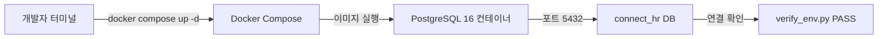
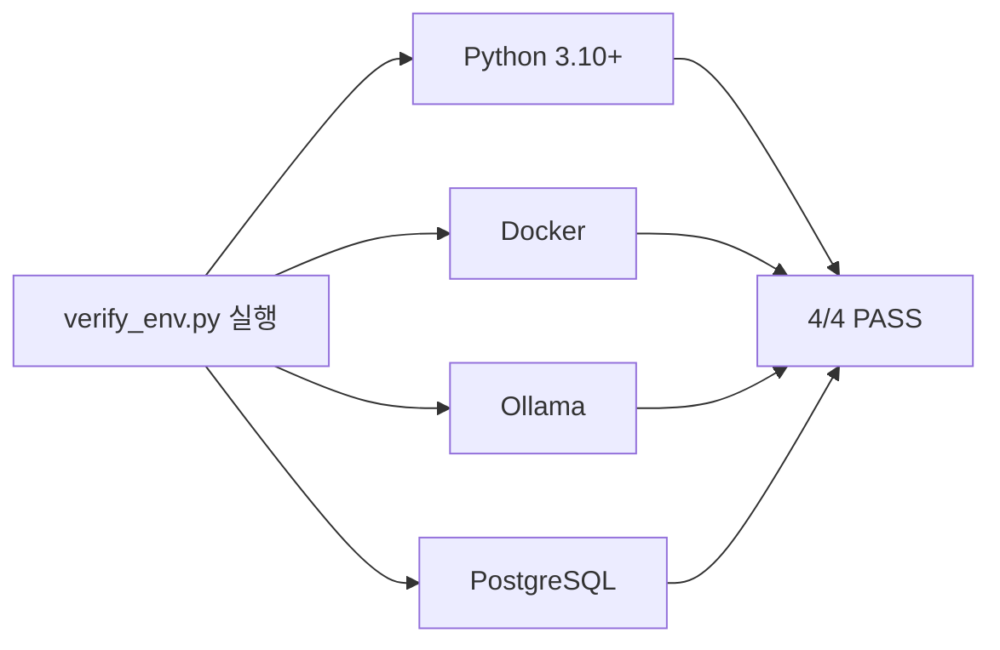

# 2. 개발 환경 설정

이번 챕터에서는 커넥트HR AI 비서를 만들기 위한 개발 환경 전체를 구축합니다. Ollama와 DeepSeek R1 설치부터 PostgreSQL 컨테이너 실행, Python 가상환경 설정, 그리고 환경 검증까지 단계별로 진행합니다.

CH01에서 메타코딩은 커넥트의 AI 비서 프로젝트를 시작하기로 결심하고 전체 아키텍처와 기술 스택을 파악하였습니다. 이제 실제로 코드를 작성할 준비를 해야 할 차례입니다.

---

메타코딩은 노트북을 열고 개발 시작 전 체크리스트를 만들었습니다. "어떤 도구를 설치해야 하지? LLM은 로컬에서 실행할 수 있나?" ChatGPT API를 쓰면 당장 시작은 쉽겠지만, 월 비용이 $50 이상 나올 수 있고 사내 데이터를 외부 서버로 보내는 것은 커넥트의 보안 정책상 불가능합니다. 로컬에서 무료로 LLM을 실행할 방법이 필요했습니다. 그때 Ollama를 발견하였습니다. 로컬 머신에서 LLM을 실행할 수 있는 경량 런타임이었습니다.

---

## 1. 필수 요구사항 확인

개발을 시작하기 전 사전에 설치되어 있어야 하는 도구와 하드웨어 요건을 점검합니다.

### 하드웨어 최소 요건

| 항목 | 최소 요건 | 권장 사양 |
|------|----------|---------|
| RAM | 16GB | 32GB |
| 저장 공간 | 20GB 여유 | 50GB 이상 |
| CPU | 4코어 이상 | 8코어 이상 |
| GPU | 없어도 됨 (속도 느림) | NVIDIA 8GB VRAM 이상 |

> **참고: Apple Silicon Mac**
> M1/M2/M3 Mac은 통합 메모리(Unified Memory)를 활용하여 GPU 없이도 LLM 추론 속도가 빠릅니다. 16GB RAM이면 DeepSeek R1:8b 모델을 원활하게 실행할 수 있습니다.

### OS별 주의사항

| OS | 지원 수준 | 주의사항 |
|----|---------|---------|
| macOS (Apple Silicon) | 1순위 | Ollama 네이티브 지원, Docker Desktop 필요 |
| macOS (Intel) | 1순위 | LLM 추론 속도가 느릴 수 있음 |
| Ubuntu 22.04+ | 1순위 | NVIDIA GPU 있으면 최적 성능 |
| Windows (WSL2) | 2순위 | WSL2 + Docker Desktop 필수, 파일 경로 주의 |
| Windows (네이티브) | 미지원 | WSL2 환경 사용 권장 |

### 사전 실습 체크리스트

본격적인 실습 전에 아래 6가지 항목을 확인하십시오.

- [ ] Python 3.10 이상 설치 (`python --version` 으로 확인)
- [ ] Docker Desktop 설치 및 실행 (`docker --version` 으로 확인)
- [ ] RAM 16GB 이상
- [ ] 저장 공간 20GB 이상 여유
- [ ] 터미널(zsh/bash) 기본 조작 가능
- [ ] Git 설치 (`git --version` 으로 확인)

---

## 2. Ollama + DeepSeek R1 설치 및 테스트

**Ollama** 는 로컬 머신에서 오픈소스 LLM을 실행할 수 있는 경량 런타임입니다. Docker와 비슷하게, 모델을 `pull` 하여 로컬에 저장하고 `run` 명령으로 실행합니다. **DeepSeek R1** 은 중국 스타트업 DeepSeek이 공개한 오픈소스 LLM으로, 특히 추론(reasoning) 능력이 강화되어 있어 복잡한 질의응답에 적합합니다.

<!-- [GEMINI PROMPT: 02_ollama-deepseek-overview]
path: assets/CH02/02_ollama-deepseek-overview.png
A minimalist black and white technical diagram with a strict 16:9 aspect ratio on a solid white background. No shading, no 3D effects, only clean thin line art. The entire assembly of icons, lines, and text is perfectly centered globally within the 16:9 frame, leaving generous and equal white space on all sides. Left side: minimalist line-art laptop icon labeled 'Local Machine'. Center: minimalist line-art brain icon labeled 'Ollama Runtime'. Right: three stacked minimalist line-art document icons labeled 'deepseek-r1:8b', 'deepseek-r1:1.5b', 'llava:13b'. Arrow from laptop to runtime, arrow from runtime to model stack. Clean flat monochrome style, Korean labels, 16:9.
Style: architecture-infographic
-->

*그림 2-1: Ollama가 로컬 머신에서 LLM 모델을 관리하고 실행하는 구조*

### 2.1 Ollama 설치

**macOS (Homebrew):**

```bash
brew install ollama
```

설치 후 Ollama 서버를 실행합니다.

```bash
ollama serve
```

macOS에서는 Ollama 앱을 설치하면 메뉴 바에서 자동 실행됩니다. Linux나 WSL2 환경에서는 [Ollama 공식 사이트](https://ollama.com)의 안내를 따라 설치하십시오.

### 2.2 DeepSeek R1 모델 다운로드

> **주의: 첫 실행 시 모델 파일 자동 다운로드**
> `ollama pull deepseek-r1:8b` 는 LLM 모델 파일(약 4.7GB)을 다운로드합니다. 네트워크 속도에 따라 10~60분 소요될 수 있으며, 이후 실행부터는 로컬 캐시를 사용하므로 즉시 시작됩니다.

```bash
ollama pull deepseek-r1:8b
```

RAM이 16GB 미만이거나 처음 테스트만 해 보려면 경량 모델을 대신 사용하십시오.

```bash
ollama pull deepseek-r1:1.5b
```

다운로드 완료 후 현재 로컬에 저장된 모델 목록을 확인합니다.

```bash
ollama list
```

<!-- [CAPTURE NEEDED: 02_ollama-list
  path: assets/CH02/02_ollama-list.png
  desc: `ollama list` 실행 후 deepseek-r1:8b 모델이 목록에 나타난 터미널 화면
] -->

*그림 2-2: deepseek-r1:8b 모델 다운로드 완료 확인*

### 2.3 간단한 대화 테스트

모델이 정상적으로 동작하는지 터미널에서 직접 대화를 나눠 봅니다.

```bash
ollama run deepseek-r1:8b
```

프롬프트가 뜨면 간단한 질문을 입력합니다.

```
>>> 안녕하세요. 한 문장으로 자기소개를 해 주십시오.
```

모델이 응답을 반환하면 정상입니다. `/bye` 를 입력하여 세션을 종료합니다.

> **팁: Ollama API 직접 호출**
> Ollama는 `http://localhost:11434` 에서 REST API도 제공합니다. `curl http://localhost:11434/api/tags` 로 설치된 모델 목록을 JSON으로 조회할 수 있습니다. 이후 코드에서 이 API를 직접 호출합니다.

<!-- [CAPTURE NEEDED: 02_ollama-api-browser
  path: assets/CH02/02_ollama-api-browser.png
  desc: 브라우저에서 `http://localhost:11434/api/tags` 접속 시 모델 목록 JSON이 표시된 화면
] -->

*그림 2-3: 브라우저에서 Ollama REST API로 모델 목록을 조회한 화면*

---

## 3. Python 설치 및 가상환경

메타코딩은 Ollama 설치를 마치고 다음 단계로 넘어갔습니다. "Python은 이미 깔려 있을 텐데, 버전이 맞나?" 확인이 필요했습니다.

### 3.1 Python 버전 확인

이 책의 모든 실습은 **Python 3.11 또는 3.12**를 기준으로 작성되었습니다. Python 3.13 이상에서는 일부 패키지의 사전 빌드 바이너리가 제공되지 않아 설치 오류가 발생할 수 있으므로, **3.11 또는 3.12 버전을 사용하십시오.**

```bash
python3 --version
```

아래 두 가지 경우에 해당하면 Python을 (재)설치하십시오.

| 상황 | 조치 |
|----|---------|
| `command not found: python3` | Python이 설치되어 있지 않습니다. 아래 표를 참고하여 설치하십시오. |
| `Python 3.13.x` 이상 출력 | 3.11 또는 3.12를 **별도로 설치**하십시오. 기존 버전은 그대로 유지해도 됩니다. |

| OS | 설치 방법 |
|----|---------|
| macOS | `brew install python@3.12` (Homebrew 필요: https://brew.sh) |
| Ubuntu/Debian | `sudo apt update && sudo apt install python3.12 python3.12-venv` |
| Windows | https://www.python.org/downloads/ 에서 3.12.x 설치 (Add to PATH 체크) |

> **주의: macOS에서 `python` vs `python3`**
> macOS에서는 `python` 명령이 등록되어 있지 않은 경우가 많습니다. 이 책에서 `python` 이라고 표기된 명령은 모두 `python3` 으로 실행하십시오. 가상환경 활성화 후에는 `python` 과 `pip` 이 자동으로 올바른 버전을 가리킵니다.

### 3.2 가상환경 생성 및 활성화

**가상환경(venv)** 은 프로젝트마다 독립된 Python 패키지 공간을 만들어 줍니다. 이 책에서 설치하는 패키지들이 다른 프로젝트와 충돌하지 않도록, 모든 실습에서 가상환경을 사용합니다.

```bash
# 가상환경 생성 (3.1절에서 확인한 Python 3.12 사용)
python3.12 -m venv .venv

# 활성화 (macOS / Linux / WSL2)
source .venv/bin/activate

# 활성화 (Windows PowerShell)
.\.venv\Scripts\Activate.ps1
```

활성화에 성공하면 터미널 프롬프트 앞에 `(.venv)` 가 표시됩니다.

```
(.venv) user@machine ~/connect-hr-ai/examples/CH02_개발_환경_설정 $
```

> **트러블슈팅: `pg_config executable not found` 오류**
> Python 3.13 이상 환경에서 `psycopg2-binary` 설치 시 발생합니다. **Python 3.12 이하로 가상환경을 다시 생성**하면 해결됩니다.
> ```bash
> deactivate && rm -rf .venv
> python3.12 -m venv .venv
> source .venv/bin/activate
> pip install -r requirements.txt
> ```
> Python 3.12가 설치되어 있지 않다면 `brew install python@3.12` (macOS) 또는 `sudo apt install python3.12` (Ubuntu)로 먼저 설치하십시오.

---

## 4. PostgreSQL 설치 (Docker 기반)

PostgreSQL은 커넥트HR AI 비서의 **정형 데이터** (직원 정보, 연차 잔여량, 매출 현황)를 저장하는 데이터베이스입니다. Docker를 통해 설치하면 OS에 관계없이 동일한 환경을 보장하고, 버전 고정으로 재현성을 확보하며, 포트 충돌이나 권한 문제를 방지할 수 있습니다.



*그림 2-4: Docker Compose가 PostgreSQL 컨테이너를 실행하는 구조*

### 4.1 docker-compose.yml 구조

프로젝트에 포함된 `docker-compose.yml` 파일은 아래와 같습니다.

```yaml
services:
  postgres:
    image: postgres:16
    container_name: connect_hr_db
    restart: unless-stopped
    environment:
      POSTGRES_DB: connect_hr
      POSTGRES_USER: connect_hr
      POSTGRES_PASSWORD: connect_hr_pass
    ports:
      - "5432:5432"
    healthcheck:
      test: ["CMD-SHELL", "pg_isready -U connect_hr -d connect_hr"]
      interval: 10s
      timeout: 5s
      retries: 5
```

각 설정 항목의 역할은 다음과 같습니다.

- `image: postgres:16` — 공식 PostgreSQL 16 이미지를 사용하여 버전을 고정합니다.
- `restart: unless-stopped` — Docker Desktop 재시작 시 컨테이너가 자동으로 복구됩니다.
- `healthcheck` — `pg_isready` 명령으로 DB가 완전히 준비될 때까지 기다립니다.

### 4.2 컨테이너 실행

메타코딩은 터미널에 명령어를 입력하였습니다. "DB는 Docker로 한 방에 끝내자."

> **주의: Docker 이미지 최초 다운로드**
> `docker compose up -d` 첫 실행 시 PostgreSQL 16 이미지(약 400MB)를 Docker Hub에서 다운로드합니다. 네트워크 속도에 따라 2~10분 소요될 수 있습니다.

```bash
docker compose up -d
```

실행 확인:

```bash
docker ps
```

`connect_hr_db` 컨테이너의 STATUS가 `Up`이고 `(healthy)` 표시가 있으면 정상입니다.

---

## 5. 프로젝트 클론 및 초기 설정

### 5.1 저장소 클론

```bash
git clone https://github.com/your-org/connect-hr-ai.git
cd connect-hr-ai/examples/CH02_개발_환경_설정
```

### 5.2 폴더 구조 확인

CH02 예제 폴더 구조는 다음과 같습니다.

```
CH02_개발_환경_설정/
├── .env.example          ← 환경변수 예시 파일
├── docker-compose.yml    ← PostgreSQL 컨테이너 설정
├── requirements.txt      ← Python 의존성 목록
└── src/
    ├── llm_provider.py   ← LLM Provider 팩토리 (Ollama/OpenAI/vLLM 전환)
    └── verify_env.py     ← 환경 검증 스크립트
```

### 5.3 .env 파일 생성

`.env.example` 파일을 복사하여 `.env` 파일을 만듭니다.

```bash
cp .env.example .env
```

`.env` 파일의 기본 내용은 다음과 같습니다.

```
# LLM Provider 선택 (ollama / openai)
LLM_PROVIDER=ollama

# Ollama 설정
OLLAMA_BASE_URL=http://localhost:11434
OLLAMA_MODEL=deepseek-r1:8b

# OpenAI 설정 (Ollama 실행이 어려운 환경에서 대체 사용)
# OPENAI_API_KEY=sk-...
# OPENAI_MODEL=gpt-4o-mini

# PostgreSQL 설정
POSTGRES_HOST=localhost
POSTGRES_PORT=5432
POSTGRES_DB=connect_hr
POSTGRES_USER=connect_hr
POSTGRES_PASSWORD=connect_hr_pass
```

기본값은 Ollama 로컬 실행으로 설정되어 있습니다. 프로젝트 코드에는 `llm_provider.py` 에 팩토리 패턴이 구현되어 있어, `LLM_PROVIDER` 값만 바꾸면 다른 Provider로 전환할 수 있습니다. Ollama 실행이 어려운 환경(RAM 부족, GPU 미지원 등)에서는 `LLM_PROVIDER=openai`로 변경하고 API 키를 입력하면 동일한 코드로 실습을 진행할 수 있습니다.

> **경고: .env 파일을 Git에 커밋하지 마십시오**
> `.env` 파일에는 API 키와 DB 비밀번호가 포함됩니다. `.gitignore` 에 `.env` 가 등록되어 있는지 반드시 확인하십시오.

### 5.4 의존성 설치

각 챕터의 예제 프로젝트에는 해당 챕터에서 필요한 패키지를 정의한 `requirements.txt` 가 포함되어 있습니다. 챕터마다 가상환경을 활성화한 뒤 아래 명령으로 의존성을 설치합니다.

```bash
pip install -r requirements.txt
```

> **주의: 첫 실행 시 패키지 자동 다운로드**
> `pip install -r requirements.txt` 실행 시 필요한 패키지를 PyPI에서 다운로드합니다. 네트워크 속도에 따라 2~5분 소요될 수 있으며, 이후 실행부터는 캐시를 사용합니다.

---

## 6. 주요 의존성 목록

CH02 예제의 `requirements.txt` 에 포함된 패키지와 역할은 다음과 같습니다. 이후 챕터에서는 `langchain`, `chromadb`, `sentence-transformers` 등이 추가됩니다.

| 패키지 | 버전 | 용도 |
|--------|------|------|
| `python-dotenv` | 1.0.1 | `.env` 파일에서 환경변수를 로드합니다 |
| `requests` | 2.32.3 | Ollama HTTP API 호출에 사용합니다 |
| `psycopg2-binary` | 2.9.10 | PostgreSQL 연결 드라이버입니다 |
| `openai` | 1.59.6 | OpenAI API 및 vLLM 호환 API 호출에 사용합니다 |

> **참고: 버전 호환성 주의사항**
> 이 책의 모든 예제는 위 버전에서 검증되었습니다. 특히 `openai` 패키지는 1.0 이후 API 인터페이스가 크게 바뀌었으므로 버전을 고정하여 사용하십시오.

---

## 7. 환경 검증

모든 설치가 완료되었습니다. 메타코딩은 "설치만 하고 넘어가면 안 된다. 전부 제대로 동작하는지 확인해 보자."라고 생각하며 환경 검증 스크립트를 실행하였습니다.

`verify_env.py` 는 Python 버전, Docker, Ollama, PostgreSQL 네 항목을 순서대로 확인하고 각각 PASS/FAIL을 출력합니다.



*그림 2-5: 환경 검증 스크립트가 4개 항목을 순서대로 점검하는 흐름*

```bash
python src/verify_env.py
```

<!-- [CAPTURE NEEDED: 02_verify-env-pass
  path: assets/CH02/02_verify-env-pass.png
  desc: `python src/verify_env.py` 실행 후 Python/Docker/Ollama/PostgreSQL 4개 항목 모두 [PASS] 로 표시된 터미널 화면
] -->

*그림 2-6: 환경 검증 스크립트 전항목 PASS 완료 화면*

메타코딩은 4개 항목 모두 PASS를 확인하고 안도하였습니다. "좋아, 환경 준비 완료. 이제 진짜 코딩을 시작할 수 있다."

> 전체 코드: `src/verify_env.py`

### FAIL 항목 대응 가이드

검증 결과에 FAIL 항목이 있다면 아래 대응 방법을 참고하십시오.

| FAIL 항목 | 원인 | 해결 방법 |
|---------|------|---------|
| Python 버전 | 3.10 미만 설치됨 | python.org에서 3.10+ 다운로드 |
| Docker | 미설치 또는 데몬 미실행 | Docker Desktop 설치 후 실행 |
| Ollama | 서버 미실행 | `ollama serve` 실행, 또는 설치 후 재시도 |
| PostgreSQL | 컨테이너 미실행 | `docker compose up -d` 실행 후 재시도 |

---

## 8. 정리하며

이번 챕터에서 메타코딩은 클라우드 API 비용과 보안 제약을 해결하는 로컬 LLM 실행 환경을 구축하였습니다.

<!-- [GEMINI PROMPT: 02_before-after]
path: assets/CH02/02_before-after.png
A minimalist black and white technical diagram with a strict 16:9 aspect ratio on a solid white background. No shading, no 3D effects, only clean thin line art. Simple before/after comparison infographic: LEFT side shows 'Before' with an X mark and text 'LLM 없음 / 월 $50+ / 수동 확인' in a box, RIGHT side shows 'After' with a check mark and text 'Ollama 로컬 / 월 $0 / 자동 검증 4/4 PASS' in a box, arrow pointing right in the middle. Clean flat monochrome style, Korean labels, 16:9 aspect ratio.
Style: before-after-infographic
-->

*그림 2-7: 챕터 시작 전후 비교 — 환경이 없던 상태에서 완전한 개발 환경 완성*

**이번 챕터의 핵심 내용을 정리합니다.**

- **Ollama로 로컬 LLM 실행**: DeepSeek R1:8b 모델을 로컬에서 무료로 실행합니다. 클라우드 API 의존 없이 사내 데이터를 안전하게 처리할 수 있습니다.
- **Docker로 PostgreSQL 격리 실행**: `docker compose up -d` 한 줄로 재현 가능한 DB 환경을 만듭니다.
- **환경 검증 자동화**: `verify_env.py` 스크립트가 4개 항목을 한 번에 점검합니다.
- **LLM Provider 전환**: `.env` 파일의 `LLM_PROVIDER` 값만 바꾸면 Ollama 또는 OpenAI로 전환됩니다. 사양이 부족한 환경에서도 실습을 진행할 수 있습니다.

| 지표 | Before | After |
|------|--------|-------|
| LLM 실행 환경 | 없음 | Ollama + DeepSeek R1 로컬 실행 |
| 월 비용 | (클라우드 기준) $50+ | $0 (로컬) |
| 환경 검증 | 수동 확인 | `verify_env.py` 자동 검증 4/4 PASS |

> **실습 환경 정리**
> 이 챕터의 환경 검증이 끝나면 PostgreSQL 컨테이너를 종료하십시오. 이후 챕터에서 동일 포트(5432)를 사용하므로 충돌이 발생할 수 있습니다.
> ```bash
> docker compose down
> ```

다음 챕터에서는 방금 구축한 환경에서 DeepSeek R1에 사내 질문을 직접 던져봅니다. LLM이 사내 데이터를 모를 때 어떤 일이 벌어지는지 직접 체험하고, RAG가 왜 필요한지를 스스로 느끼게 됩니다.
