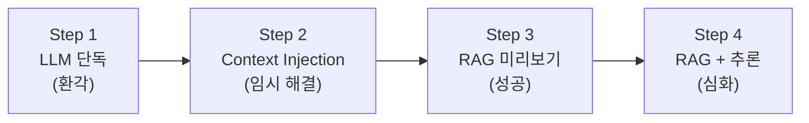
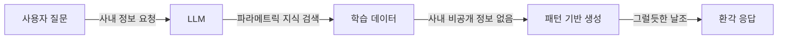
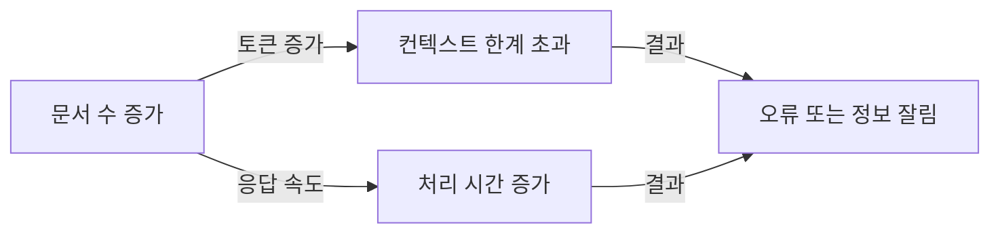
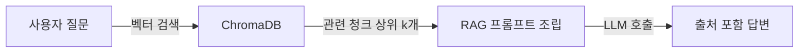
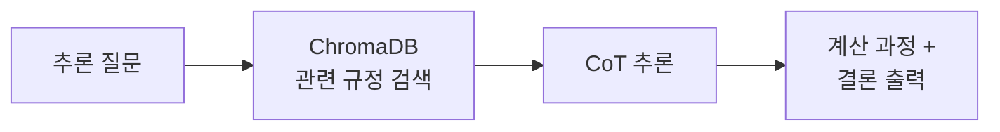

# 3. LLM의 한계와 RAG의 필요성

CH02에서 메타코딩은 Ollama와 DeepSeek R1을 설치하고, Docker PostgreSQL 환경을 구성하여 환경 검증 4/4 PASS를 달성하였습니다. 이제 LLM이 실제로 어떤 한계를 가지는지 직접 체험하고, 그 한계를 극복하는 방법인 RAG를 미리 맛봅니다.

이 챕터에서는 다음 네 단계를 순서대로 실습합니다.

1. LLM에 사내 정보를 직접 질문하여 **환각(Hallucination)** 을 체험합니다.
2. LLM이 환각을 일으키는 원인을 개념적으로 이해합니다.
3. 문서를 프롬프트에 직접 붙여넣는 **컨텍스트 주입(Context Injection)** 을 시도합니다.
4. 인메모리 ChromaDB를 활용한 **RAG(Retrieval-Augmented Generation)** 로 정확한 답변을 확인합니다.



*그림 3-1: 4단계 실습 흐름 — 실패에서 시작하여 RAG 성공까지*

---

<!-- [GEMINI PROMPT: 03_01_metacoding-hallucination]
path: assets/CH03/03_01_metacoding-hallucination.png
Warm office illustration showing a developer (metacoding) looking puzzled at a computer screen, the screen displaying a chat interface with an AI response that shows incorrect leave policy information. Developer's expression conveys confusion and concern. Minimalist flat-design, white background with subtle warm office elements, Korean UI labels visible on screen, 16:9 aspect ratio.
Style: office-illustration-warm
-->

*그림 3-2: 메타코딩이 DeepSeek R1의 환각 응답을 처음 목격하는 순간*

---

## 1. [실패] LLM 단독 질의 — 환각 체험

환경 구축을 마친 메타코딩은 곧바로 DeepSeek R1에 사내 질문을 던져봅니다. "커넥트의 신입사원 연차 발생 규정이 어떻게 되지?" 간단한 질문이었습니다.

LLM은 자신 있는 말투로 "신입사원은 입사 후 1년이 지나면 15일의 연차가 부여됩니다"라고 답합니다. 그러나 커넥트의 실제 규정은 **입사 후 3년 동안 연차가 없고, 대신 매월 리프레시 데이를 제공**하는 파격적인 구조입니다. 그럴듯하지만 완전히 틀린 답변, 즉 환각이 발생하였습니다. 메타코딩은 이 순간 "LLM이 이렇게 자신 있게 틀린 답을 내놓는다면, 이대로는 실무에 쓸 수 없다"는 결론에 도달합니다.

이 실습을 직접 체험해 보겠습니다.

### 실습 준비

CH02에서 클론한 저장소의 예제 폴더로 이동하고 환경을 설정하십시오.

```bash
cd examples/CH03_LLM의_한계와_RAG의_필요성
python3.12 -m venv .venv
source .venv/bin/activate   # Windows: .\.venv\Scripts\Activate.ps1
pip install -r requirements.txt
```

이번 챕터에서 새로 사용하는 의존성은 다음과 같습니다.

| 패키지 | 역할 |
|-------|------|
| `langchain` | LLM 애플리케이션 프레임워크입니다. 프롬프트, 체인, 검색기를 하나로 연결합니다. |
| `langchain-ollama` | LangChain에서 Ollama를 사용하기 위한 패키지입니다. `ChatOllama`(LLM 호출)와 `OllamaEmbeddings`(텍스트→벡터 변환)를 제공합니다. |
| `langchain-chroma` | LangChain에서 ChromaDB 벡터스토어를 사용하기 위한 패키지입니다. |
| `langchain-classic` | `RetrievalQA` 체인을 제공합니다. 검색기(Retriever)와 LLM을 연결하여 "검색→답변" 파이프라인을 한 줄로 구성합니다. |
| `chromadb` | 벡터 데이터베이스입니다. 텍스트를 벡터로 저장하고 유사도 검색을 수행합니다. 이 챕터에서는 인메모리 모드로 사용합니다. |

> **참고: nomic-embed-text 모델**
> step3, step4에서 임베딩 모델 `nomic-embed-text` 가 필요합니다. 아직 다운로드하지 않았다면 `ollama pull nomic-embed-text` 를 실행하십시오.

### LLM 단독 실행

Ollama가 실행 중인 상태에서 첫 번째 스크립트를 실행합니다.

```bash
python step1_fail.py
```

> **주의: Ollama가 실행 중이어야 합니다**
> `ollama serve` 명령으로 Ollama를 먼저 실행한 뒤 스크립트를 실행하십시오.

코드는 단순합니다. LangChain의 `ChatOllama` 로 로컬 LLM에 연결하고, 사내 규정을 질문합니다.

```python
from langchain_ollama import ChatOllama

llm = ChatOllama(model="deepseek-r1:8b", temperature=0)

question = "우리 회사(커넥트)의 신입사원 연차 발생 규정이 어떻게 돼?"

print(f"질문: {question}\n")
response = llm.invoke(question)
print(f"답변:\n{response.content}")
```

잠시 후 터미널에 LLM의 답변이 출력됩니다.


*그림 3-3: LLM이 사내 정보를 모른 채 그럴듯한 답변을 생성하는 환각 현상*

> **참고:** LLM 응답은 실행할 때마다 달라집니다. 화면과 다른 결과가 나와도 정상입니다.

> **전체 코드:** `step1_fail.py`

메타코딩은 실행 결과를 보고 "이 정도면 충분히 그럴듯한데, 왜 틀리는 거지?"라는 의문이 들었습니다. LLM의 답변이 문법적으로 자연스럽고 형식도 정확해 보이지만, 커넥트의 취업규칙에는 전혀 없는 내용이었습니다. 환각이 자신 있는 말투로 포장된다는 점이 문제의 핵심이었습니다.

> **참고: 왜 LLM 단독 실행을 먼저 보여주는가**
> "안 되는 것"을 직접 체감해야 "왜 RAG가 필요한가"에 대한 동기가 생깁니다. 이 실습 없이 RAG를 설명하면 독자는 "LLM만 써도 되지 않나?"라는 의문이 해소되지 않습니다.

---

## 2. 왜 LLM은 환각을 일으키는가

방금 체험한 현상의 원인을 이해해야 올바른 해결책을 선택할 수 있습니다.

### 파라메트릭 지식과 컨텍스트 지식

LLM은 두 종류의 지식을 사용합니다.

<!-- [GEMINI PROMPT: 03_parametric-vs-context]
path: assets/CH03/03_parametric-vs-context.png
A minimalist black and white technical diagram with a strict 16:9 aspect ratio on a solid white background. No shading, no 3D effects, only clean thin line art. Two large boxes side by side. Left box labeled "파라메트릭 지식 (Parametric Knowledge)" contains brain icon with label "LLM 모델 가중치". Inside list: "학습 데이터에서 습득", "훈련 후 고정됨", "사내 비공개 정보 없음". Right box labeled "컨텍스트 지식 (Context Knowledge)" contains document stack icon. Inside list: "프롬프트로 실시간 주입", "최신 정보 반영 가능", "토큰 한계 내에서만 가능". Arrow from right box pointing down to center bottom labeled "RAG = 컨텍스트 지식을 자동 주입". White background, Korean labels, 16:9 aspect ratio.
Style: architecture-infographic
-->

*그림 3-4: LLM의 두 가지 지식 유형 — 파라메트릭은 훈련 시 고정되고, 컨텍스트는 프롬프트로 주입된다*

**파라메트릭 지식(Parametric Knowledge)** 은 모델 가중치에 저장된 지식입니다. 모델이 학습할 때 인터넷, 책, 코드 등 수십억 개의 문서를 통해 습득하였으며, 훈련이 끝난 뒤에는 변경되지 않습니다. 이 지식에는 두 가지 근본적인 한계가 있습니다.

첫째, **사내 비공개 정보 부재** 문제입니다. "커넥트의 신입사원 연차 규정"은 회사 내부에만 존재하는 정보입니다. 사내 규정이나 인사 데이터는 인터넷에 공개된 적이 없으므로, LLM이 이 정보를 학습할 수 있는 경로 자체가 없습니다.

둘째, **학습 데이터 컷오프(Cutoff)** 문제입니다. DeepSeek R1:8b 모델은 2024년 초까지의 공개 데이터로 학습되었습니다. 따라서 이후에 변경된 공개 정보(법률 개정, 기술 업데이트 등)도 알 수 없습니다.

**컨텍스트 지식(Context Knowledge)** 은 프롬프트를 통해 실시간으로 주입하는 지식입니다. LLM은 프롬프트에 포함된 내용을 마치 방금 읽은 자료처럼 참고할 수 있습니다. 이것이 Context Injection의 원리이며, RAG의 출발점이기도 합니다.

### 왜 모른다고 하지 않고 만들어내는가

LLM은 "모른다"고 말하도록 설계되어 있지 않습니다. 언어 모델의 본질은 주어진 맥락에서 가장 그럴듯한 다음 토큰을 예측하는 것입니다. 질문을 받으면 가장 자연스러운 답변 형태를 생성하는데, 이 과정에서 사실 여부를 검증하는 단계가 없습니다.



*그림 3-5: LLM이 사내 정보를 모를 때 환각을 일으키는 흐름*

결과적으로 LLM은 "그럴듯한 형태의 답변"을 생성합니다. 숫자가 나와야 할 자리에 숫자를 넣고, 규정이 나와야 할 자리에 규정을 넣습니다. 이것이 환각(Hallucination)입니다.

> **참고: 환각이 위험한 이유**
> LLM이 생성한 환각 답변은 대부분 "확신에 찬 문체"로 작성됩니다. 틀린 정보를 마치 사실인 것처럼 말하기 때문에 비전문가가 구분하기 어렵습니다. 잘못된 연차 정보가 그대로 전달된다면 직원 불만, 급여 오류, 법적 문제로 이어질 수 있습니다.

> **팁: "모른다"고 말하게 하는 방법**
> 프롬프트에 "문서에 없는 내용은 '확인할 수 없습니다'라고 답변하십시오"라는 규칙을 명시하면 환각을 줄일 수 있습니다. 그러나 사내 정보가 아예 없는 상태에서는 이 규칙만으로 환각을 완전히 방지하기 어렵습니다. 근본적인 해결책은 관련 정보를 컨텍스트로 제공하는 것입니다.

---

## 3. [임시 해결] Context Injection 맛보기

메타코딩이 떠올린 첫 번째 해결책은 간단합니다. "LLM이 사내 정보를 모른다면, 내가 직접 알려주면 되지 않을까?" 즉, 사내 문서를 프롬프트에 직접 붙여넣는 방식입니다. 이를 **컨텍스트 주입(Context Injection)** 이라 합니다.

### 실습: Context Injection

```bash
python step2_context.py
```

이 스크립트는 커넥트의 취업규칙을 변수에 담고, 프롬프트에 직접 포함시켜 LLM에 전달합니다.

```python
# 1. 정보를 변수에 담습니다 (아직 DB 안 씀)
context_data = """
[커넥트 취업규칙]
1. 신입사원은 입사 후 3년 동안은 연차가 없다. (파격적인 규정)
2. 대신 매월 1회 '리프레시 데이'를 유급으로 제공한다.
3. 3년 근속 시 30일의 연차가 일시에 발생한다.
"""

# 2. 프롬프트에 정보를 포함시킵니다.
prompt = f"""
아래 [참고 정보]를 보고 질문에 답해줘.
[참고 정보]
{context_data}

질문: {question}
"""
response = llm.invoke(prompt)
```


*그림 3-6: Context Injection 실행 결과 — 프롬프트에 데이터를 넣자 정확한 답변이 나온다*

> **참고:** LLM 응답은 실행할 때마다 달라집니다. 화면과 다른 결과가 나와도 정상입니다.

> **전체 코드:** `step2_context.py`

이번에는 LLM이 제공된 규정을 기반으로 정확하게 답변합니다. 메타코딩은 "프롬프트에 데이터를 직접 넣으니까 바로 정확한 답이 나오네"라며 만족했지만, 곧 이 방식의 한계를 깨닫게 됩니다.

### Context Injection의 한계

실습에서 확인한 것처럼 프롬프트에 데이터를 직접 넣으면 정확도가 올라갑니다. 하지만 이 방법에는 세 가지 한계가 있습니다.



*그림 3-7: 문서가 늘어날수록 Context Injection의 한계가 누적된다*

- **토큰 한계**: DeepSeek R1:8b는 약 4,096~8,192토큰의 컨텍스트를 처리합니다. 사내 문서 한 개가 평균 500~1,000토큰이라면 최대 8~16개의 문서밖에 프롬프트에 담을 수 없습니다.
- **비용 증가**: OpenAI API를 사용하는 경우 토큰 수에 비례하여 비용이 증가합니다. 1,000개의 문서를 매번 프롬프트에 담으면 API 비용이 폭발합니다.
- **관련성 없는 정보**: 모든 문서를 무조건 삽입하면 LLM이 오히려 관련 없는 정보에 혼동되어 정확도가 떨어질 수 있습니다.

| 접근 방식 | 정확도 | 토큰 사용량 | 실현 가능성 |
|---------|--------|---------|----------|
| LLM 단독 | 0% (환각) | 소량 | 가능 (단, 부정확) |
| Context Injection | 높음 | 문서 수에 비례 폭증 | 소수 문서만 가능 |
| RAG | 높음 | 관련 청크만 사용 | 가능 (수천 문서) |

메타코딩은 "문서 3개만 넣어도 토큰이 부족해지는데, 커넥트의 수백 개 사내 문서를 다 넣을 수는 없잖아"라며 다른 방법을 찾기 시작합니다.

---

## 4. [성공] RAG 미리보기 — 필요한 부분만 찾아서 답합니다

메타코딩이 도달한 핵심 아이디어는 다음과 같습니다. "모든 문서를 넣을 수는 없지만, 질문과 관련된 문서만 골라서 넣으면 어떨까?" 이것이 바로 **RAG(Retrieval-Augmented Generation, 검색 증강 생성)** 의 핵심 개념입니다.



*그림 3-8: RAG의 핵심 흐름 — 전체 문서 대신 관련 청크만 선택하여 LLM에 전달한다*

### 핵심 개념: 청킹, 임베딩, 그리고 k-값

RAG를 이해하려면 세 가지 개념을 알아야 합니다.

| 개념 | 설명 | 비유 |
| :--- | :--- | :--- |
| **청킹(Chunking)** | 긴 문서를 AI가 처리하기 좋은 작은 단위로 쪼개는 것 | 책을 찢어서 포스트잇으로 만들기 |
| **임베딩(Embedding)** | 텍스트를 AI가 이해하는 숫자(벡터)로 변환하는 것 | 단어를 지도상의 좌표로 바꾸기 |
| **Top-K 검색(k-값)** | 검색 시 가져올 문서 조각의 개수 | 질문과 관련된 상위 N개의 포스트잇 고르기 |

**청킹(Chunking)** 은 긴 문서를 작은 단위로 분할하는 과정입니다. 문서를 통째로 검색하면 정밀도가 낮아집니다. "신입사원 휴가 규정"을 질문했는데 5페이지짜리 전체 규정이 검색된다면, 불필요한 정보가 많이 포함됩니다. 규정별로 나누면 각 청크가 특정 주제에 집중되어 검색 정밀도가 높아집니다.

<!-- [GEMINI PROMPT: 03_chunking-concept]
path: assets/CH03/03_chunking-concept.png
A minimalist black and white technical diagram with a strict 16:9 aspect ratio on a solid white background. No shading, no 3D effects, only clean thin line art. Left side shows a large document rectangle labeled "원본 문서 (전체 규정)" with a scissors icon cutting it. Right side shows three smaller rectangles labeled "인사규정", "보안규정", "복지규정". Below right side: cylinder database icon labeled "ChromaDB" with arrow pointing from each chunk. Below the database: magnifying glass icon with arrow back up pointing to "인사규정" highlighted with a dashed border, labeled "질문 관련 청크만 검색". White background, Korean labels, 16:9 aspect ratio.
Style: architecture-infographic
-->

*그림 3-9: 청킹은 긴 문서를 검색 가능한 작은 단위로 분할한다*

### 인메모리 ChromaDB 사용 이유

이 챕터에서는 **인메모리(In-memory)** ChromaDB를 사용합니다. 디스크에 저장하지 않고 메모리에서만 동작하므로 실행 종료 시 데이터가 사라집니다. CH06에서 ChromaDB를 영속화하는 방법을 다루지만, 이 챕터의 목적은 "체험"입니다. 영속화 없이 가볍게 실행하여 RAG의 효과를 확인하는 것이 우선입니다.

### 실습: 청킹 유무에 따른 비교

두 개의 스크립트로 청킹의 효과를 비교합니다.

**청킹 없이 통째로 넣기 (비권장)**

```bash
python step3_rag_no_chunking.py
```

이 스크립트는 인사규정, 보안규정, 복지규정을 하나의 긴 문자열로 합쳐서 ChromaDB에 저장합니다. 검색해도 전체 텍스트가 통째로 반환됩니다.

```python
# 모든 텍스트를 하나의 문자열로 합침 (통짜 데이터)
context_all = """
[인사규정] 신입사원 휴가 및 연차: ...
[보안규정] 업무 보안: ...
[복지규정] 식대 지원: ...
"""
docs_bad = [Document(page_content=context_all, metadata={"source": "전체규정"})]
```


*그림 3-10: 청킹 미적용 — 전체 규정이 통째로 반환되어 비효율적이다*

> **참고:** LLM 응답은 실행할 때마다 달라집니다. 화면과 다른 결과가 나와도 정상입니다.

**청킹 적용하여 쪼개서 넣기 (권장)**

```bash
python step3_rag.py
```

이 스크립트는 각 규정을 별도의 `Document` 객체로 분리하여 ChromaDB에 저장합니다. 검색 시 질문과 관련 있는 규정만 선택됩니다.

```python
# 더미 데이터 준비 (청킹: 규정별로 분리)
docs = [
    Document(page_content="[인사규정] 신입사원 휴가 및 연차: ...",
             metadata={"source": "인사규정"}),
    Document(page_content="[보안규정] 업무 보안: ...",
             metadata={"source": "보안규정"}),
    Document(page_content="[복지규정] 식대 지원: ...",
             metadata={"source": "복지규정"}),
]
```


*그림 3-11: 청킹 적용 시 관련 규정만 검색되어 정확한 답변이 생성된다*

> **참고:** LLM 응답은 실행할 때마다 달라집니다. 화면과 다른 결과가 나와도 정상입니다.

> **전체 코드:** `step3_rag.py`, `step3_rag_no_chunking.py`

청킹을 적용한 경우, LLM이 각 문서의 출처(`[인사규정]`, `[복지규정]` 등)를 인지하고 관련 정보만 참고하여 답변합니다. 청킹이 없으면 AI는 "정보의 바다에서 바늘 찾기"를 해야 합니다. 청킹은 AI에게 **"정답이 적힌 포스트잇만 골라서 주는 것"** 과 같습니다.

메타코딩은 청킹 적용 전후의 차이를 보고, 데이터를 어떻게 쪼개느냐가 검색 품질을 좌우한다는 사실을 실감하였습니다.

### 코드 핵심 구조

`step3_rag.py` 의 RAG 파이프라인은 5단계로 구성됩니다.

```python
# 1. 임베딩 모델 설정 (nomic-embed-text: Ollama에서 제공하는 임베딩 모델)
embeddings = OllamaEmbeddings(model="nomic-embed-text")          # ①

# 2. VectorDB 생성 (문서를 벡터로 변환하여 ChromaDB에 저장)
vectorstore = Chroma.from_documents(
    documents=docs, embedding=embeddings
)                                                                 # ②

# 3. 검색기 설정 (질문과 유사한 문서 k개를 검색)
retriever = vectorstore.as_retriever(search_kwargs={"k": 3})     # ③

# 4. RAG 체인 연결 (검색기 + LLM을 하나의 체인으로 연결)
qa_chain = RetrievalQA.from_chain_type(
    llm=llm,
    retriever=retriever,
    return_source_documents=True,
    chain_type_kwargs={"prompt": PROMPT}
)                                                                 # ④

# 5. 질문 실행
result = qa_chain.invoke({"query": question})                    # ⑤
```

> ① `nomic-embed-text` 는 Ollama가 제공하는 임베딩 모델입니다. 텍스트를 벡터(숫자 배열)로 변환하여 유사도 검색을 가능하게 합니다.
> ② `Chroma.from_documents()` 는 문서 리스트를 받아 각 문서를 임베딩하고 ChromaDB에 저장합니다. 별도의 서버 없이 인메모리로 동작합니다.
> ③ `as_retriever()` 는 ChromaDB를 LangChain의 검색기(Retriever) 인터페이스로 감쌉니다. `k=3` 은 질문과 가장 유사한 문서 3개를 반환하라는 설정입니다.
> ④ `RetrievalQA.from_chain_type()` 은 검색기와 LLM을 하나의 체인으로 연결합니다. 질문이 들어오면 자동으로 검색 → 프롬프트 조립 → LLM 호출까지 처리합니다.
> ⑤ `invoke()` 를 호출하면 RAG 파이프라인 전체가 실행됩니다. 결과에는 AI 답변(`result`)과 검색된 원본 문서(`source_documents`)가 포함됩니다.

> **팁: 청크 크기는 절충점이 있습니다**
> 청크가 너무 작으면 문장이 잘려 의미가 손실됩니다. 너무 크면 검색 정밀도가 낮아집니다. 일반적으로 300~500자에 10~20% 중첩이 균형점입니다. CH10에서 청크 크기 실험을 통해 최적값을 탐색하는 방법을 다룹니다.

---

## 5. [심화] DeepSeek R1 추론 능력 확인

RAG로 정확한 답변을 확인한 메타코딩은 곧바로 다음 질문이 떠올랐습니다. "규정 검색은 됐는데, 계산이 필요한 질문은 어떻게 하지?" RAG는 단순 검색+답변을 넘어 추론(계산, 집계)이 필요한 질문에도 대응할 수 있습니다.

### 추론(Reasoning)이 필요한 이유

현실의 질문은 문서에서 한 문장을 찾는 것으로 끝나지 않습니다. "신입사원 휴가 규정이 뭐야?"는 단순 검색으로 답할 수 있지만, "입사 6개월차인데 리프레시 데이 2번 썼어, 몇 번 남았어?"는 규정을 찾은 뒤 계산까지 해야 합니다.

AI가 수행해야 할 사고 과정은 다음과 같습니다.

1. **검색**: "리프레시 데이 관련 규정을 찾자." → 결과: 매월 1회 제공 확인
2. **분석**: "사용자는 입사 6개월차이므로 총 6번 발생했다."
3. **계산**: "6번 - 2번 = 4번 남았다."
4. **최종 답변**: "남은 리프레시 데이는 4번입니다."

**DeepSeek R1** 과 같은 추론 모델은 **Chain-of-Thought(사고 과정 명시)** 방식으로 이러한 단계별 계산을 수행합니다.

> **참고: Chain-of-Thought(CoT)란?**
> 일반적인 LLM은 질문을 받으면 바로 답을 생성합니다. 반면 Chain-of-Thought 방식은 답을 내기 전에 "생각하는 과정"을 먼저 출력합니다. "6개월이니까 6번 발생 → 2번 사용 → 4번 남음"처럼 중간 단계를 명시하기 때문에 계산 정확도가 높아지고, 결과를 사람이 검증할 수 있습니다. DeepSeek R1은 이 방식으로 훈련된 대표적인 추론 모델입니다.

### 실습: RAG + 추론

```bash
python step4_rag.py
```

이 스크립트는 step3_rag.py와 동일한 RAG 파이프라인을 사용하되, 추론이 필요한 복잡한 질문을 던집니다.

```python
# 추론이 필요한 복잡한 질문
question = "입사 6개월차 신입인데 리프레시 데이 2번 썼어. 몇 번 남았는지 규정 기반으로 계산해줘."
```




*그림 3-12: DeepSeek R1이 규정을 검색한 뒤 단계별로 계산하여 답변하는 추론 과정*

> **참고:** LLM 응답은 실행할 때마다 달라집니다. 화면과 다른 결과가 나와도 정상입니다.

> **전체 코드:** `step4_rag.py`

메타코딩은 LLM이 "매월 1회 × 6개월 = 6회, 6회 - 2회 = 4회"와 같은 계산 과정을 단계별로 출력하는 것을 보고, 단순 답변 생성기가 아니라 검증 가능한 추론 도구로 쓸 수 있다는 가능성을 확인하였습니다.

> **참고: 소형 모델의 추론 한계**
> `deepseek-r1:8b` 보다 작은 모델은 수치 계산에서 부정확한 결과를 낼 수 있습니다. 정확한 Chain-of-Thought 결과를 확인하려면 8b 이상 모델을 사용하십시오.

---

## 6. 정리하며

메타코딩은 4단계 실습을 통해 LLM 단독 사용의 한계와 RAG의 가능성을 직접 체험하였습니다.

<!-- [GEMINI PROMPT: 03_03_before-after-rag]
path: assets/CH03/03_03_before-after-rag.png
Simple before/after comparison infographic: LEFT side shows "LLM 단독: 환각 응답" with red X indicator and text "정확도 0% / 환각 발생", RIGHT side shows "RAG 적용: 출처 포함 답변" with green check indicator and text "정확도 85%+ / 출처 명시", arrow in the middle pointing right, clean flat design, minimalist black and white with red/green accents, white background, Korean labels.
Style: before-after-infographic
-->

*그림 3-13: LLM 단독 사용(환각)과 RAG 적용(출처 포함 답변) 비교*

### 4단계 결과 비교표

| 단계 | 방법 | 정확도 | 출처 제시 | 확장 가능성 | 핵심 한계 |
|------|------|--------|---------|-----------|---------|
| Step 1 | LLM 단독 | 낮음 (환각) | 없음 | 높음 | 사내 정보 없음 |
| Step 2 | Context Injection | 높음 | 없음 | 낮음 | 토큰 한계 |
| Step 3 | RAG 미리보기 | 높음 | 있음 | 높음 | 인메모리 (임시) |
| Step 4 | RAG + 추론 | 높음 | 있음 | 높음 | — |

### 핵심 요약

- **환각은 구조적 한계입니다**: LLM은 학습 데이터에 없는 사내 비공개 정보를 알 수 없어 그럴듯한 내용을 생성합니다. 이는 결함이 아니라 파라메트릭 지식의 한계에서 비롯됩니다.
- **Context Injection은 임시 해결책입니다**: 소수의 문서에서는 효과적이지만, 토큰 한계로 인해 문서가 늘어날수록 한계에 부딪힙니다. 실제 사내 시스템의 수백~수천 개 문서를 처리할 수 없습니다.
- **RAG는 "필요한 부분만" 찾아줍니다**: 청킹과 벡터 유사도 검색으로 관련 문서만 선택하여 토큰 제한을 우회합니다. 문서가 아무리 많아도 검색 대상에 추가하기만 하면 됩니다.
- **추론 능력은 검색 이후의 가치를 높입니다**: RAG로 관련 데이터를 찾고, DeepSeek R1의 Chain-of-Thought로 계산과 분석까지 처리할 수 있습니다.

### 다음 챕터 예고

이제 RAG의 필요성과 기본 원리를 체험하였습니다. 그런데 RAG가 실제로 답변할 "사내 데이터"가 아직 없습니다. 직원 정보는 Excel, 휴가 현황은 수동 집계, 매출은 부서별 파일로 흩어져 있습니다. CH04에서는 FastAPI와 PostgreSQL로 AI 비서의 정형 데이터 기반이 되는 사내 시스템을 구축합니다. "AI 비서보다 기본 시스템이 먼저다"라는 것을 메타코딩과 함께 확인해 보겠습니다.
