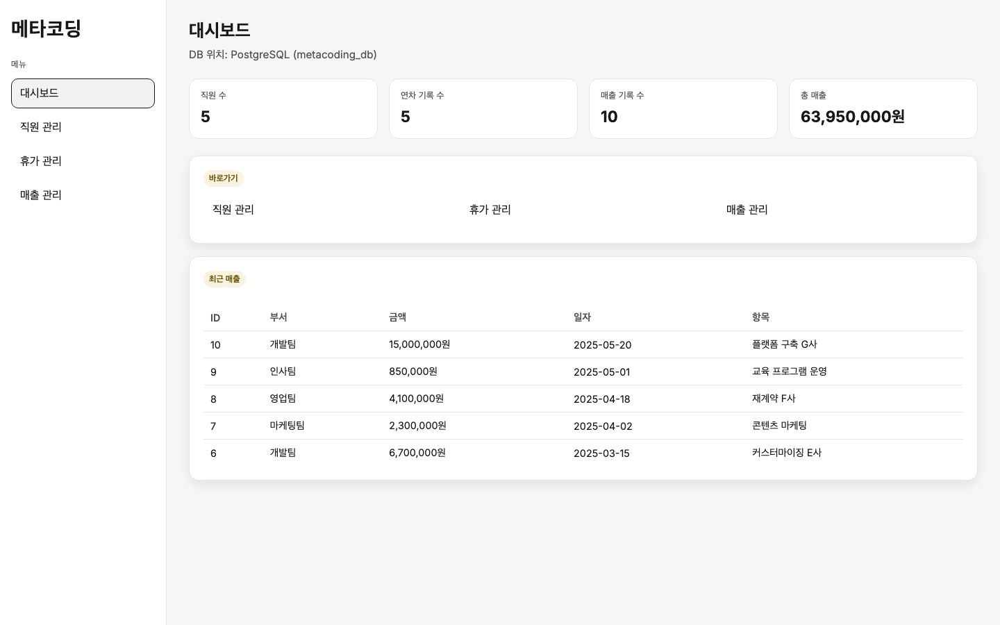
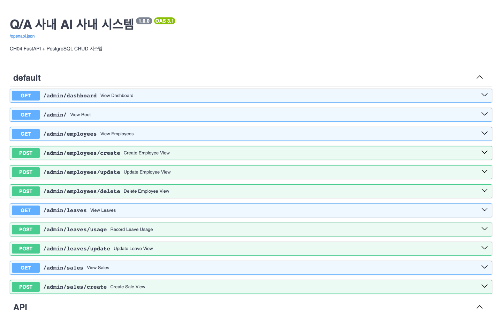
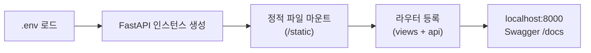
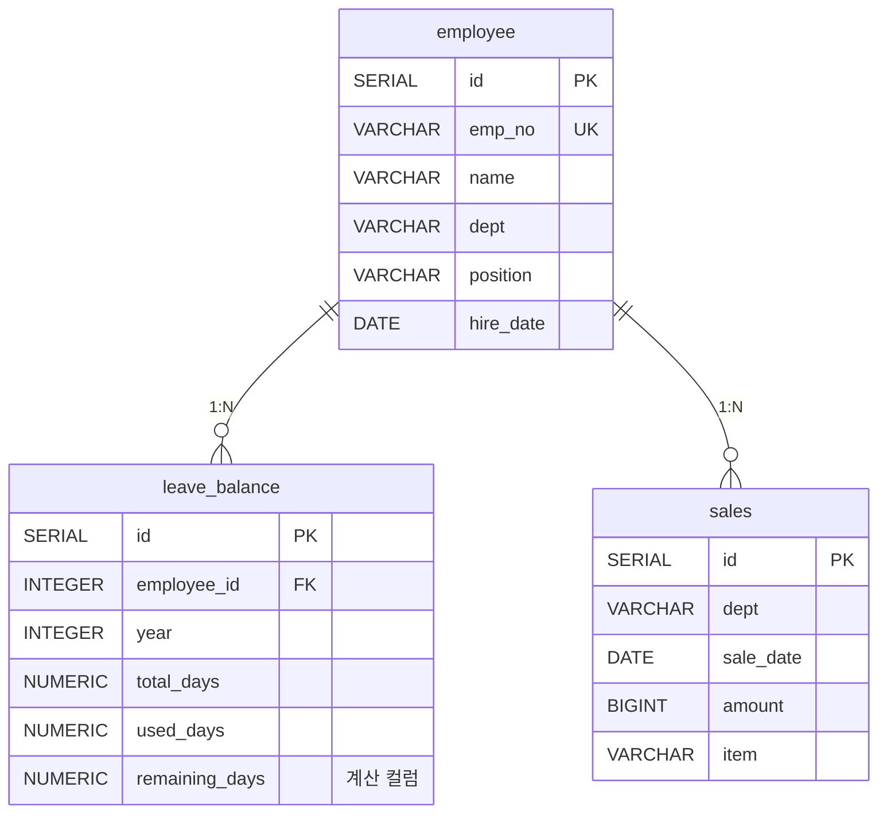
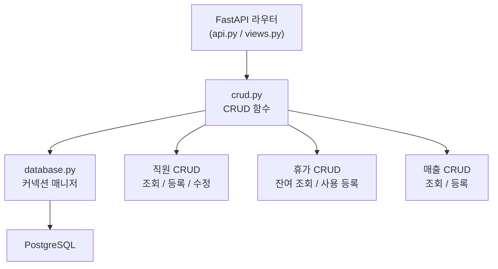
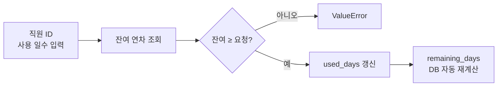
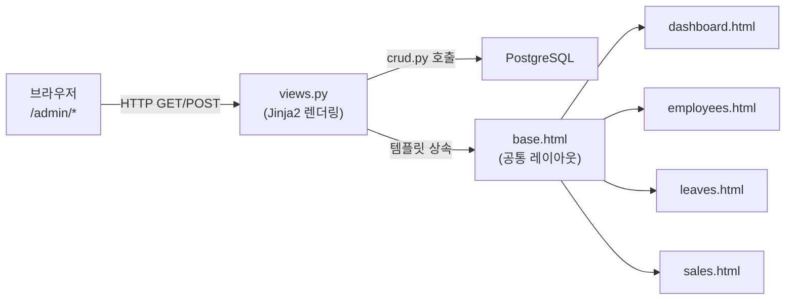
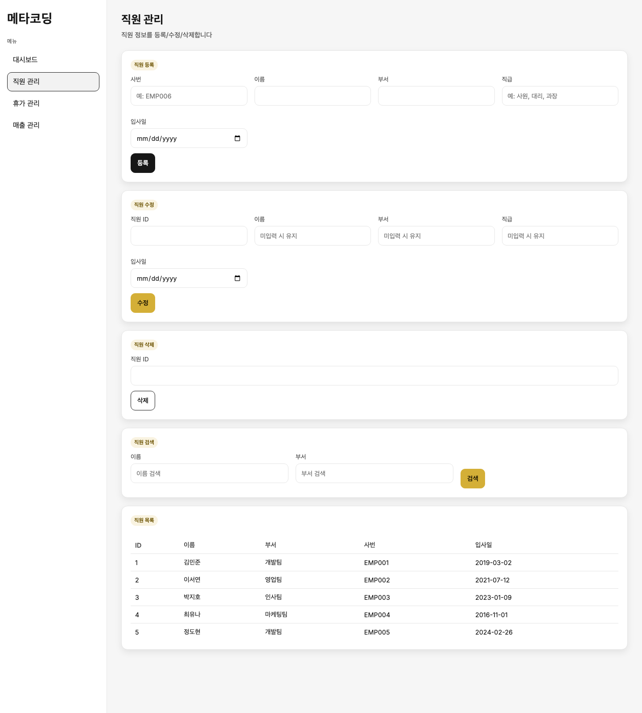
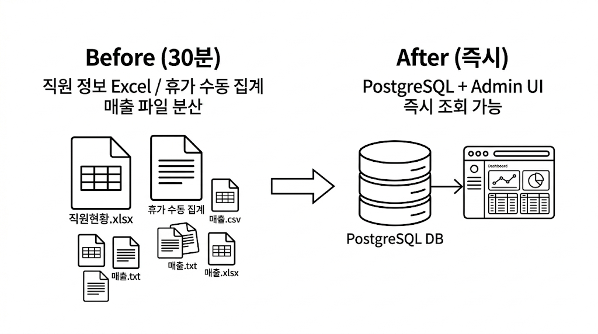

# 4. FastAPI로 초간단 사내 시스템 만들기

CH03에서 메타코딩은 RAG가 사내 질문에 정확히 답할 수 있음을 직접 확인하였습니다. 그런데 막상 "김철수 사원의 남은 연차는?"이라는 질문을 AI 비서에게 던지려 하니 치명적인 문제가 드러났습니다. AI가 답변을 가져올 **연차 데이터 자체가 시스템 어디에도 없었습니다.**

이 챕터에서는 **FastAPI(Python 기반 비동기 웹 프레임워크)** 와 **PostgreSQL** 을 사용하여 직원, 휴가, 매출을 관리하는 사내 기본 시스템을 구축합니다. 이 시스템은 CH08에서 MCP(Model Context Protocol)로 연결되어 AI 비서가 DB를 직접 조회하는 토대가 됩니다.

---

<!-- [GEMINI PROMPT: 04_excel-problem]
path: assets/CH04/04_excel-problem.png
Minimalist flat-design illustration showing a person sitting at a desk with multiple scattered spreadsheet files labeled '직원현황.xlsx', '휴가대장.xlsx', '매출집계.xlsx'. An arrow points from these scattered files to a single unified server database cylinder. White background, Korean labels, 16:9 aspect ratio. Clean line art, black and white.
Style: office-illustration-warm
-->

*그림 4-1: 커넥트의 현재 상황 — 직원 정보, 휴가, 매출이 엑셀 파일로 분산되어 있다*

---

## 1. 프로젝트 구성

메타코딩이 확인한 커넥트의 현실은 다음과 같았습니다. 직원 정보는 인사팀 PC의 `직원현황.xlsx`에, 휴가 현황은 팀장이 수기로 관리하는 스프레드시트에, 매출 데이터는 부서마다 다른 형식의 파일에 흩어져 있었습니다. AI 비서를 만들기 전에 **기본 사내 시스템부터 만들어야 한다는 것** 을 메타코딩은 이 순간 깨달았습니다.

메타코딩이 선택한 해결책은 FastAPI였습니다. React 같은 프론트엔드 프레임워크를 별도로 배울 시간이 없었고, Python만으로 API와 웹 UI를 함께 만들 수 있는 구조가 필요했기 때문입니다.

### 1.1 예제 폴더 이동

CH02에서 클론한 저장소의 예제 폴더로 이동합니다.

```bash
cd examples/CH04_FastAPI_기본_시스템
```

### 1.2 환경 변수 설정

```bash
cp .env.example .env
```

`.env` 파일의 내용은 다음과 같습니다. Docker Compose 기본값과 일치하므로 별도 수정 없이 사용할 수 있습니다.

```ini
POSTGRES_HOST=localhost
POSTGRES_PORT=5432
POSTGRES_DB=connect_hr
POSTGRES_USER=connect_hr
POSTGRES_PASSWORD=connect_hr_pass

FASTAPI_HOST=0.0.0.0
FASTAPI_PORT=8000
```

### 1.3 의존성 설치 및 실행

`requirements.txt`에는 다음 패키지들이 포함되어 있습니다.

| 패키지 | 역할 |
|--------|------|
| `fastapi` | 비동기 웹 프레임워크 |
| `uvicorn` | ASGI 서버 (FastAPI 실행) |
| `jinja2` | HTML 템플릿 엔진 (Admin UI) |
| `psycopg2-binary` | PostgreSQL 드라이버 |
| `python-dotenv` | `.env` 파일 환경 변수 로드 |
| `pydantic` | 요청/응답 데이터 검증 |

> **주의: 이전 챕터 실습 환경 정리**
> CH02의 PostgreSQL 컨테이너가 실행 중이라면 먼저 종료하십시오. 동일 포트(5432)를 사용하므로 충돌이 발생합니다.
> ```bash
> cd ../CH02_개발_환경_설정
> docker compose down
> cd ../CH04_FastAPI_기본_시스템
> ```

```bash
pip install -r requirements.txt
docker compose up -d
uvicorn app.main:app --reload
```

> **팁: docker compose up -d 가 핵심**
> PostgreSQL을 직접 설치하면 OS마다 설정이 달라집니다. `docker compose up -d` 한 줄이면 PostgreSQL 16이 컨테이너로 실행되고, `data/schema.sql`이 자동으로 적용되어 시드 데이터(직원 5명, 연차 5건, 매출 10건)까지 입력됩니다.

서버가 기동되면 브라우저에서 두 주소를 확인하십시오.

| 주소 | 용도 |
|------|------|
| `http://localhost:8000/admin/dashboard` | Admin UI (대시보드) |
| `http://localhost:8000/docs` | Swagger 자동 API 문서 |


*그림 4-1a: Admin UI 대시보드 — 직원 수, 연차, 매출 통계를 한눈에 확인*


*그림 4-1b: Swagger 자동 API 문서 — Pydantic 스키마 기반으로 자동 생성된다*

### 1.4 폴더 구조

```
CH04_FastAPI_기본_시스템/
├── app/
│   ├── main.py        ← FastAPI 앱 진입점, 라우터 등록
│   ├── database.py    ← PostgreSQL 연결 컨텍스트 매니저
│   ├── models.py      ← 도메인 모델 (dataclass)
│   ├── schemas.py     ← Pydantic 요청/응답 스키마
│   ├── crud.py        ← CRUD 함수 (SQL 실행)
│   ├── views.py       ← Admin UI 뷰 라우터 (Jinja2)
│   └── api.py         ← REST JSON API 라우터
├── templates/         ← Jinja2 HTML 템플릿
│   ├── base.html      ← 공통 레이아웃 (CH07/CH08 계승)
│   ├── dashboard.html
│   ├── employees.html
│   ├── leaves.html
│   └── sales.html
├── static/css/
│   └── style.css      ← Admin UI 스타일
├── data/
│   └── schema.sql     ← 테이블 DDL + 시드 데이터
├── docker-compose.yml
├── requirements.txt
└── .env.example
```

> **참고: FastAPI를 선택한 이유**
> FastAPI는 `async/await` 기반 비동기 처리를 지원하며, Pydantic으로 요청 데이터를 자동 검증하고, `/docs` 경로에서 Swagger UI를 자동으로 생성합니다. CH08에서 LangChain Agent가 HTTP로 이 API를 호출할 때, Swagger 문서가 그대로 MCP Tool의 스키마 참고 자료가 됩니다.

### 1.5 FastAPI 앱 진입점

`main.py`는 FastAPI 인스턴스를 생성하고, 정적 파일 마운트와 Admin UI(`/admin/*`) · REST API(`/api/*`) 라우터를 등록하는 진입점입니다. 루트(`/`) 접근 시 대시보드로 자동 리다이렉트됩니다.



환경 변수를 읽은 뒤 라우터를 순서대로 등록하면, 단일 서버가 Admin UI와 REST API 두 역할을 동시에 담당합니다. 메타코딩은 이 구조가 CH08 MCP 연동 때도 변경 없이 그대로 쓰인다는 점이 마음에 들었습니다.

> 전체 코드: `app/main.py`

---

## 2. 데이터 모델 설계

메타코딩은 AI 비서가 답해야 할 질문들을 역순으로 추적하여 3개의 테이블을 도출하였습니다. "김민준 사원의 남은 연차는?"이라는 질문에 답하려면 **직원 테이블(employee)** 과 **휴가 잔여 테이블(leave_balance)** 이 필요하고, "개발팀의 올해 매출은?"에는 **매출 테이블(sales)** 이 필요합니다.

### 2.1 ERD


*그림 4-2: 3테이블 ERD — employee가 leave_balance와 sales의 부모 테이블*

> **참고: 3테이블 구조를 선택한 이유**
> CH08에서 MCP Tool을 설계할 때, "연차 조회", "매출 합계", "직원 목록" 이 세 유형의 질문이 가장 빈번하게 발생합니다. 각 테이블이 하나의 MCP Tool과 1:1로 대응되도록 설계하면, 나중에 Tool을 추가하거나 수정할 때 범위가 명확해집니다.

### 2.2 schema.sql — 테이블 DDL

**다음 SQL은 3개의 테이블을 생성하고 시드 데이터를 삽입합니다.**

```sql
-- data/schema.sql (핵심 부분)
CREATE TABLE employee (
    id          SERIAL PRIMARY KEY,
    emp_no      VARCHAR(10)  NOT NULL UNIQUE,   -- 사번
    name        VARCHAR(50)  NOT NULL,
    dept        VARCHAR(50)  NOT NULL,
    position    VARCHAR(50)  NOT NULL,
    hire_date   DATE         NOT NULL
);

CREATE TABLE leave_balance (
    id              SERIAL  PRIMARY KEY,
    employee_id     INTEGER NOT NULL REFERENCES employee(id) ON DELETE CASCADE,
    year            INTEGER NOT NULL,
    total_days      NUMERIC(4,1) NOT NULL,
    used_days       NUMERIC(4,1) NOT NULL DEFAULT 0,
    remaining_days  NUMERIC(4,1) GENERATED ALWAYS AS (total_days - used_days) STORED, -- 잔여 연차 자동 계산
    UNIQUE (employee_id, year)
);

CREATE TABLE sales (
    id          SERIAL PRIMARY KEY,
    dept        VARCHAR(50)  NOT NULL,
    sale_date   DATE         NOT NULL,
    amount      BIGINT       NOT NULL,
    item        VARCHAR(200) NOT NULL
);
```
`remaining_days`는 PostgreSQL **계산 컬럼(Generated Column)** 으로 정의되어 있습니다. `total_days - used_days`를 DB가 직접 계산하므로 애플리케이션에서 잔여 연차 불일치 오류가 발생할 여지가 없습니다.

`docker compose up -d` 한 줄이면 DDL 실행부터 시드 데이터 적재까지 자동으로 완료됩니다. 메타코딩은 OS마다 PostgreSQL 설치 방법이 달랐던 과거를 떠올리며, 컨테이너 하나로 환경 차이를 없앤 것이 이번 작업의 첫 번째 시간 절약이었다고 생각했습니다.

> 전체 코드: `data/schema.sql`

### 2.3 도메인 모델 — models.py

`models.py`는 `@dataclass`를 사용하여 `employee`, `leave_balance`, `sales` 테이블의 행(row)을 Python 객체로 표현합니다. SQLAlchemy ORM 없이도 타입 힌트와 구조를 명확히 유지할 수 있습니다.

> 전체 코드: `app/models.py`

> **참고: SQLAlchemy ORM을 쓰지 않은 이유**
> SQLAlchemy ORM은 테이블 수가 많고 스키마가 자주 변경되는 대규모 서비스에서 유용합니다. 이 책에서는 테이블 3개로 구성이 단순하고, CH08 MCP Tool이 실행하는 SQL이 코드에서 바로 보여야 디버깅이 쉽기 때문에 `psycopg2` + 직접 SQL을 사용합니다.

### 2.4 Pydantic 스키마 — schemas.py

Pydantic 스키마(Schema)는 FastAPI가 HTTP 요청 본문을 자동으로 검증하고, 응답 데이터를 직렬화할 때 사용하는 규약 정의입니다. `schemas.py`는 각 도메인(직원, 휴가, 매출)에 대해 `Create`(등록용 필수 필드), `Update`(수정용 선택 필드), `Response`(응답용 노출 필드) 세 가지 스키마를 분리하여 정의합니다. 이 분리 덕분에 Swagger 문서도 각 상황에 맞는 요청/응답 형식을 자동 생성합니다.

> 전체 코드: `app/schemas.py`

---

## 3. CRUD API 구현

이 시스템의 API는 직원·휴가·매출 세 도메인에 대해 CRUD(생성·조회·수정·삭제)를 제공합니다. 전체 구조를 먼저 살펴봅니다.



### 3.1 API 엔드포인트 목록

| 경로 | 메서드 | 기능 | CH08 연동 |
|------|--------|------|----------|
| `/api/employees` | GET | 직원 목록 (이름/부서 필터) | MCP `list_employees` |
| `/api/employees` | POST | 직원 등록 | — |
| `/api/leaves/{id}` | GET | 연차 잔여 조회 | MCP `leave_balance` |
| `/api/leaves/{id}/use` | POST | 연차 사용 등록 | — |
| `/api/sales` | GET | 매출 조회 (부서/기간 필터) | MCP `sales_summary` |
| `/api/sales` | POST | 매출 등록 | — |

### 3.2 핵심 설계 패턴

**데이터베이스 연결**: `database.py`의 `@contextmanager`가 커넥션 생명주기를 관리합니다. 정상 시 자동 커밋, 예외 시 자동 롤백, 어떤 경우든 연결 반환을 보장합니다.

**동적 WHERE 절**: `crud.py`의 조회 함수들은 필터 조건을 리스트로 쌓아 `AND`로 결합합니다. 필터가 없으면 전체를, 있으면 조건부로 조회합니다. CH08에서 AI 비서가 "개발팀 직원을 보여줘"라고 요청할 때 이 함수가 그대로 호출됩니다.

**연차 사용 검증**: `update_leave_usage()` 는 잔여 연차가 부족하면 `ValueError`를 발생시켜 처리를 중단합니다. `remaining_days`는 DB 계산 컬럼이 자동으로 재계산합니다.



> 전체 코드: `app/database.py`, `app/crud.py`, `app/schemas.py`

---

## 4. 관리자 Admin UI

메타코딩은 CRUD API를 완성한 뒤, Swagger 문서를 직접 조작하며 데이터를 입력하는 것이 번거롭다는 것을 느꼈습니다. 비기술 인사 담당자가 브라우저에서 직접 데이터를 관리할 수 있으려면 UI가 필요합니다. FastAPI + Jinja2로 별도 프론트엔드 프레임워크 없이 이 문제를 해결합니다.

> **팁: Jinja2를 선택한 이유**
> React나 Vue를 사용하면 빌드 도구, Node.js 환경이 추가됩니다. Jinja2는 Python 서버가 HTML을 완성하여 전달하므로, Python 지식만으로 UI까지 완성할 수 있습니다.

### 4.1 Admin UI 구조



| 구성 요소 | 파일 | 역할 |
|----------|------|------|
| 공통 레이아웃 | `templates/base.html` | 240px 사이드바 + 메인 콘텐츠. CH07·CH08 UI가 `` 로 계승 |
| 디자인 시스템 | `static/css/style.css` | 검정/흰색 + 금색(`#d4af37`) 미니멀 테마. CSS 변수로 관리 |
| 뷰 라우터 | `app/views.py` | DB 조회 → 템플릿 렌더링. POST-Redirect-GET 패턴 적용 |
| 페이지 템플릿 | `templates/*.html` | ``에 페이지별 고유 내용만 작성 |

핵심 패턴은 **템플릿 상속**입니다. 모든 페이지가 `base.html`을 상속하고 `` 안에 고유 내용만 채우는 구조이므로, CH07 채팅 UI와 CH08 통합 에이전트 UI도 동일한 방식으로 확장됩니다.

### 4.2 실행 확인

서버를 실행하고 다음 순서로 동작을 확인하십시오.

1. `http://localhost:8000/admin/dashboard` → 통계 카드 3개 (직원 수, 연차 기록 수, 총 매출)
2. `http://localhost:8000/admin/employees` → 직원 목록 (5명 시드 데이터) + 등록 폼
3. `http://localhost:8000/admin/leaves` → 연차 잔여 현황 + 사용 등록 폼
4. `http://localhost:8000/admin/sales` → 매출 현황 + 부서별 합계

<!-- [CAPTURE NEEDED: 04_dashboard-screenshot
  path: assets/CH04/04_dashboard-screenshot.png
  desc: `uvicorn app.main:app --reload` 실행 후 `http://localhost:8000/admin/dashboard` 접속 시 보이는 대시보드 화면. 직원 수 5, 연차 기록 수 5, 총 매출 63,850,000원이 통계 카드에 표시된 상태.
] -->

*그림 4-4: Admin UI 대시보드 — 직원 수, 연차, 매출 통계가 카드로 표시된다*

<!-- [CAPTURE NEEDED: 04_employees-screenshot
  path: assets/CH04/04_employees-screenshot.png
  desc: `/admin/employees` 페이지에서 직원 5명 목록이 테이블로 표시된 화면. 이름, 부서, 직급, 입사일 컬럼이 보이고 상단에 "직원 추가" 폼이 있는 상태.
] -->

*그림 4-5: 직원 관리 페이지 — 목록 조회와 등록 폼이 함께 제공된다*

> 전체 코드: `app/views.py`, `templates/base.html`, `templates/dashboard.html`, `static/css/style.css`

---

## 5. 정리하며

메타코딩은 이 챕터에서 FastAPI + PostgreSQL + Jinja2 조합으로 사내 기본 시스템을 완성하였습니다. 엑셀 파일에 흩어져 있던 직원, 휴가, 매출 데이터가 하나의 관계형 데이터베이스로 통합되었고, 인사 담당자도 브라우저에서 바로 조회하고 수정할 수 있게 되었습니다.

<!-- [GEMINI PROMPT: 04_before-after]
path: assets/CH04/04_before-after.png
Simple before/after comparison infographic: LEFT side shows "직원 정보 Excel / 휴가 수동 집계 / 매출 파일 분산" with scattered file icons and label "Before (30분)", RIGHT side shows "PostgreSQL + Admin UI / 즉시 조회 가능" with a unified database icon and browser icon and label "After (즉시)", clean arrow in the middle, flat design, white background.
Style: before-after-infographic
-->

*그림 4-6: CH04 before/after — 엑셀 분산 관리에서 통합 DB + Admin UI로*

**이 챕터의 핵심 내용을 정리합니다.**

- **FastAPI는 API와 UI를 동시에 처리합니다**: `/api/*` 경로는 JSON을 반환하는 REST API로, `/admin/*` 경로는 Jinja2가 렌더링한 HTML을 반환하는 Admin UI로 동작합니다. 하나의 서버가 두 역할을 수행합니다.

- **PostgreSQL 계산 컬럼이 데이터 무결성을 보장합니다**: `remaining_days GENERATED ALWAYS AS (total_days - used_days) STORED`로 잔여 연차를 DB가 직접 계산합니다. 애플리케이션이 계산 로직을 가지면 버그가 생길 수 있지만, DB가 계산하면 항상 일관성이 보장됩니다.

- **Pydantic 스키마 분리가 API 계약을 명확히 합니다**: `EmployeeCreate`(등록용), `EmployeeUpdate`(수정용), `EmployeeResponse`(응답용)를 분리하면 각 상황에서 필요한 필드만 노출됩니다. Swagger 문서도 이 스키마를 기반으로 자동 생성됩니다.

- **base.html이 CH07, CH08의 UI 기반이 됩니다**: 240px 사이드바 + 메인 콘텐츠 레이아웃은 이 챕터에서 완성됩니다. CH07 채팅 UI와 CH08 통합 에이전트 UI는 ``으로 이 구조를 그대로 계승합니다.

**Before / After**

| 항목 | Before | After |
|------|--------|-------|
| 직원 현황 파악 | `직원현황.xlsx` 수기 확인 (담당자 문의 필요) | Admin UI `/admin/employees` 즉시 조회 |
| 휴가 잔여 집계 | 팀장 수기 스프레드시트 — 평균 **30분** 소요 | DB 계산 컬럼으로 **즉시** 반환 (0분) |
| 매출 데이터 취합 | 부서별 개별 파일 취합 — 최소 **1시간** 소요 | `/admin/sales`에서 부서·기간 필터 즉시 조회 |
| AI 비서 연동 가능 여부 | 불가 (구조화 데이터 없음) | CH08 MCP Tool이 SQL로 직접 조회 가능 |

메타코딩은 커밋 로그를 닫으며 한 가지 사실을 확인했습니다. FastAPI 서버 기동에 걸린 시간은 이틀, 그러나 앞으로 AI 비서가 이 API를 통해 수백 건의 질문에 답할 수 있게 됩니다.

> **실습 환경 정리**
> 이 챕터의 실습이 끝나면 FastAPI 서버와 Docker 컨테이너를 종료하십시오. 이후 챕터에서 동일 포트(8000, 5432)를 사용하므로 충돌이 발생할 수 있습니다.
> ```bash
> # 1. Ctrl+C 로 uvicorn 서버 종료
> # 2. Docker 컨테이너 종료
> docker compose down
> ```

**다음 챕터 예고**: 사내 데이터베이스가 완성되었습니다. 이제 AI 비서가 검색할 **비정형 문서** 를 정비할 차례입니다. CH05에서는 인사팀 서버에 뒤섞인 수백 개의 파일을 표준화하고, RAG 인덱싱에 적합한 구조로 정리하는 파이프라인을 구축합니다.
