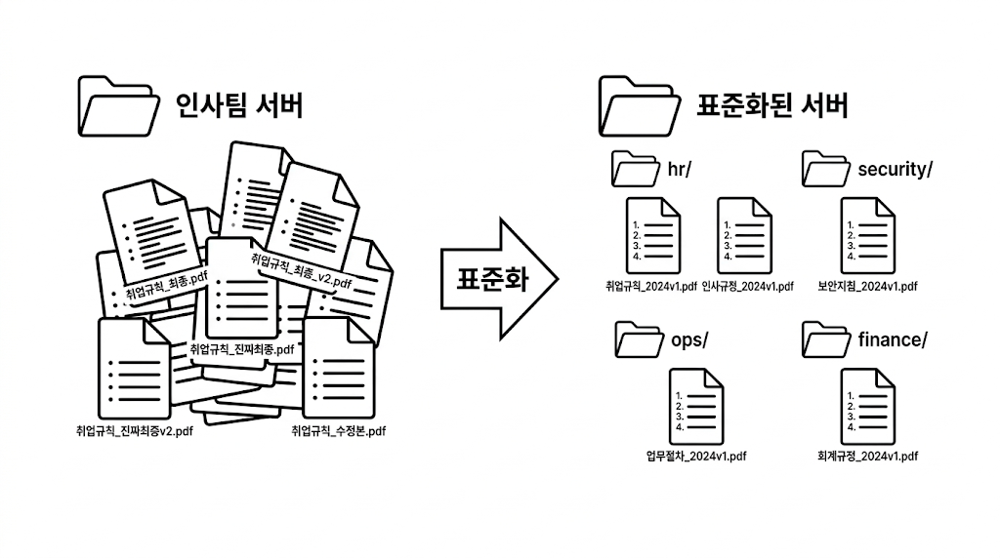
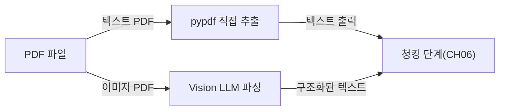
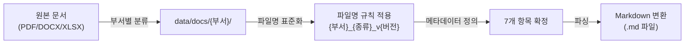

# 5. 사내 문서 수집 전략과 문서 표준 만들기

FastAPI 기반 사내 시스템을 완성한 메타코딩에게 다음 과제가 생겼습니다. RAG 엔진이 검색할 "비정형 문서"를 준비해야 합니다. 그런데 커넥트의 인사팀 서버를 열어보는 순간, 메타코딩은 예상보다 훨씬 심각한 현실을 마주합니다.

이 챕터에서는 **문서 품질이 RAG 성능을 결정한다** 는 원칙을 출발점으로, 어떤 문서를 선정할 것인지, 파일 형식별로 어떤 특성이 있는지, 그리고 파일명 규칙과 폴더 구조를 어떻게 표준화하는지를 단계적으로 살펴봅니다. 

---

## 1. 어떤 문서를 넣을 것인가

<!-- [GEMINI PROMPT: 05_document-chaos]
path: assets/CH05/05_document-chaos.png
A minimalist black and white technical diagram with a strict 16:9 aspect ratio on a solid white background. No shading, no 3D effects, only clean thin line art. The entire assembly of icons, lines, and text is perfectly centered globally within the 16:9 frame, leaving generous and equal white space on all sides. Left side shows a single folder icon labeled "인사팀 서버" containing a chaotic pile of minimalist line-art document icons with labels like "취업규칙_최종.pdf", "취업규칙_최종_v2.pdf", "취업규칙_진짜최종.pdf" stacked in disorder. Right side shows an organized folder structure with sub-folders labeled "hr/", "security/", "ops/", "finance/" each containing neatly arranged document icons with standardized names. A large arrow labeled "표준화" points from left to right.
Style: before-after-infographic
-->

*그림 5-1: 표준화 전 문서 혼란 상태와 표준화 후 부서별 폴더 구조 비교*

메타코딩은 커넥트 인사팀 서버 공유 드라이브를 접속하고 입이 딱 벌어졌습니다. "취업규칙_최종.pdf", "취업규칙_최종_v2.pdf", "취업규칙_최종_진짜최종.pdf"가 같은 폴더에 공존하고 있었습니다. 어느 것이 최신 버전인지 알 방법이 없었습니다. 100개가 넘는 파일이 부서 구분도 없이 하나의 폴더에 뒤섞여 있었고, 파일 형식도 PDF, DOCX, XLSX, 심지어 HWP까지 뒤죽박죽이었습니다.

"이 상태로 AI에 넣으면 엉뚱한 답변이 나올 것이 뻔하다." 메타코딩은 AI 작업을 시작하기 전에 문서 정리부터 해야 한다는 것을 직감했습니다. 컴퓨터 과학에서는 이를 **"Garbage In, Garbage Out"(쓰레기를 넣으면 쓰레기가 나온다)** 이라 부릅니다. 정제되지 않은 문서는 RAG 품질을 직접 떨어뜨립니다.

### 1.1 교재용 문서 세트

이 책에서는 커넥트 사내에서 실제로 자주 질문받는 유형의 문서 6개를 교재용 예제 세트로 사용합니다. 각 문서는 `legacy/ex01-1/data/docs/` 경로에 실제 파일 형태로 제공됩니다.

| 파일명 | 형식 | 부서 | 설명 |
|--------|------|------|------|
| `HR_취업규칙_v1.0.pdf` | PDF | 인사 | 연차, 급여, 복지 등 취업 규정 전문 |
| `HR_정보보안서약서.pdf` | PDF | 인사 | 입사 시 서명하는 보안 서약 양식 |
| `SEC_보안규정_v1.0.docx` | DOCX | 보안 | 사내 정보보안 규정 (표 구조 포함) |
| `OPS_신규서비스_런칭전략.pdf` | PDF | 운영 | 신규 서비스 출시 전략 문서 |
| `FIN_부서별_예산기안서.xlsx` | XLSX | 재무 | 부서별 예산 기안 내용 (수치 데이터) |
| `FIN_2025_상반기_매출현황.xlsx` | XLSX | 재무 | 2025년 상반기 매출 현황표 |

### 1.2 실무 문서 선정 기준

어떤 문서를 RAG 시스템에 넣어야 할까요? 다음 두 가지 기준을 우선으로 합니다.

**자주 질문받는 문서** 를 먼저 포함합니다. 인사팀에 하루 20건씩 들어오는 반복 질문("연차 며칠 남았나요?", "출장비 기준이 어떻게 되나요?")의 답이 담긴 문서가 1순위입니다.

**정기적으로 갱신되는 문서** 도 중요합니다. 취업규칙처럼 매년 개정되는 문서는 버전 관리가 필수입니다. 버전 정보가 파일명에 없으면 AI가 구버전 기준으로 답변할 위험이 있습니다.

> **팁: 문서 선정 우선순위**
> 전체 문서를 한 번에 넣으려 하지 마십시오. "직원들이 가장 자주 물어보는 질문 10개"를 먼저 정의하고, 그 답이 담긴 문서부터 시작하는 것이 현실적입니다. 문서 수가 적을수록 검증과 디버깅이 쉽습니다.

---

## 2. 문서 형식 지원 범위

사내 문서는 하나의 형식으로 통일되어 있지 않습니다. 커넥트의 경우 PDF, DOCX, XLSX가 혼재합니다. 각 형식은 파싱 방식과 난이도가 다릅니다.

### 2.1 형식별 특성 비교

| 형식 | 파싱 라이브러리 | 특성 | 파싱 난이도 |
|------|---------------|------|-----------|
| PDF (텍스트) | `pypdf`, `pdfplumber`, `PyMuPDF` | 대부분의 규정 문서. 레이아웃 정보 손실 가능 | 보통 |
| PDF (이미지) | Vision LLM (LLaVA 등) | 스캔본, 표·차트 포함 PDF. 텍스트 추출 불가 | 높음 |
| DOCX | `python-docx` | Word 문서. 표, 단락, 제목 구조 보존 | 낮음 |
| XLSX | `openpyxl` | Excel 파일. 시트별 데이터, 수식 포함 가능 | 낮음 |

> **팁: PDF 파싱 라이브러리 선택**
> PDF 파싱 라이브러리는 여러 가지가 있으며, 문서 특성에 따라 적합한 도구가 다릅니다.
> - **`pypdf`**: 가장 기본적인 라이브러리. 텍스트 추출이 간단하지만 표나 레이아웃 보존이 약합니다.
> - **`pdfplumber`**: 표(table) 추출에 강합니다. 셀 경계를 인식하여 구조화된 데이터를 반환합니다.
> - **`PyMuPDF(fitz)`**: 속도가 빠르고, 이미지 추출과 텍스트 좌표 정보까지 제공합니다.
> 이 책에서는 범용성과 설치 편의성을 고려하여 `pypdf`를 기본으로 사용합니다.

> **팁: HWP 파일은 어떻게 처리하나요?**
> Python에서 HWP(한글 문서)를 직접 파싱하는 안정적인 라이브러리는 현재 없습니다. 실무에서는 한컴오피스나 온라인 변환 도구를 사용하여 **PDF로 변환한 뒤** 파싱하는 방식을 권장합니다. HWP를 PDF로 변환하면 `pypdf`로 동일하게 처리할 수 있습니다.

### 2.2 이미지 PDF vs 텍스트 PDF

PDF 형식 안에서도 구별이 필요합니다. **텍스트 PDF** 는 `pypdf`로 텍스트를 직접 추출할 수 있습니다. 반면 **이미지 PDF** 는 PDF 전체가 이미지로 구성되어 있어 일반 파싱으로는 텍스트가 전혀 추출되지 않습니다. 스캔한 종이 문서나 표·차트가 이미지로 삽입된 문서가 여기에 해당합니다.

이미지 PDF 처리는 Vision LLM(LLaVA)과 OCR을 활용하는 고급 주제로, CH06에서 LLM 파싱 단계에서 다룹니다.



*그림 5-2: PDF 유형에 따른 파싱 경로 분기*

> **참고: CH05는 파싱을 직접 수행하지 않습니다**
> 이 챕터의 목표는 문서를 "정리하고 검증"하는 것입니다. 실제 텍스트 추출(파싱)과 벡터 저장은 CH06에서 수행합니다. CH05는 CH06에 "먹일 준비가 된" 문서 세트를 만드는 단계입니다.

---

## 3. 문서 표준 규칙

메타코딩은 문서를 정리하기 전에 규칙부터 세우기로 했습니다. 규칙 없이 정리하면 6개월 뒤 다시 뒤죽박죽이 됩니다.

### 3.1 파일명 규칙

파일명은 다음 형식을 따릅니다.

```
{부서코드}_{문서종류}_v{버전}.{확장자}
```

**예시:**
- `HR_취업규칙_v1.0.pdf` — 인사팀 취업규칙, 1.0 버전, PDF 형식
- `SEC_보안규정_v1.0.docx` — 보안팀 보안규정, 1.0 버전, DOCX 형식
- `FIN_부서별_예산기안서.xlsx` — 재무팀 예산기안서, 버전 없음 (WARN 처리)

**부서코드 목록:**

| 코드 | 부서 |
|------|------|
| `HR` | 인사 |
| `SEC` | 보안 |
| `OPS` | 운영 |
| `FIN` | 재무 |
| `IT` | IT |
| `MKT` | 마케팅 |
| `GEN` | 총무 |

> **주의: 파일명 규칙은 왜 필요한가**
> 단순히 정리 목적만이 아닙니다. CH06에서 파일명에서 부서·버전 정보를 자동 추출하여 메타데이터로 활용합니다. 이 메타데이터는 CH10에서 배울 **Self-Query Retriever(자기 질의 검색기)** 의 핵심 재료가 됩니다. Self-Query Retriever는 "인사팀 문서만 검색해줘"처럼 사용자 질문에서 메타데이터 조건을 자동으로 파악하여 검색 범위를 좁히는 기술입니다. 지금 정하는 파일명 규칙이 나중에 검색 품질을 결정합니다.

메타코딩은 파일명 규칙을 정하면서 "지금 5분을 아끼면 나중에 5시간을 잃는다"는 것을 이미 한 번 경험했습니다. 이번에는 처음부터 규칙을 문서로 남기기로 했습니다.

### 3.2 폴더 구조

문서는 부서별로 분리하여 저장합니다.

```
data/docs/
├── hr/
│   ├── HR_취업규칙_v1.0.pdf
│   └── HR_정보보안서약서.pdf
├── security/
│   └── SEC_보안규정_v1.0.docx
├── ops/
│   └── OPS_신규서비스_런칭전략.pdf
└── finance/
    ├── FIN_부서별_예산기안서.xlsx
    └── FIN_2025_상반기_매출현황.xlsx
```

폴더명은 부서코드의 소문자 버전(`hr`, `sec` → `security`, `ops`, `fin` → `finance`)을 사용합니다. 가독성을 위해 전체 단어를 사용해도 무방합니다.

### 3.3 메타데이터 필수 항목

각 문서에는 다음 7개 항목의 메타데이터가 자동으로 추출되어야 합니다. 이 메타데이터는 CH06에서 ChromaDB에 문서를 저장할 때 함께 기록됩니다.

| 항목 | 설명 | 예시 |
|------|------|------|
| `doc_id` | 문서 고유 식별자 | `HR_취업규칙_1.0` |
| `title` | 문서 종류 (파일명에서 추출) | `취업규칙` |
| `department` | 부서명 | `인사` |
| `version` | 버전 번호 | `1.0` |
| `date` | 파일 수정일 | `2025-01-15` |
| `format` | 파일 형식 | `PDF` |
| `file_size_bytes` | 파일 크기 | `153600` |

> **팁: 메타데이터는 "검색 필터"입니다**
> "인사팀 문서 중 2024년 이후 버전만 검색해줘"처럼 메타데이터를 조건으로 검색 범위를 좁힐 수 있습니다. 메타데이터가 없으면 전체 문서를 대상으로 검색해야 하므로 정확도가 낮아집니다.



*그림 5-3: 문서 수집 → 표준화 → CH06 Markdown 변환 흐름*

---

---

## 4. 정리하며

메타코딩은 AI 작업을 시작하기 전에 가장 기본적인 작업이 필요하다는 것을 체감했습니다. "AI 비서를 만든다"는 목표보다 "AI에 먹일 음식이 상하지 않았는지 확인한다"는 작업이 먼저였습니다. 파일명 규칙과 폴더 구조를 정하는 데 30분이 걸렸지만, 이 30분이 이후 모든 챕터의 품질을 결정합니다.

| 지표 | Before | After |
|------|--------|-------|
| 파일명 규칙 | 없음 (자유 형식) | `{부서}_{종류}_v{버전}.{확장자}` |
| 폴더 구조 | 단일 폴더 100+ 파일 | 부서별 4개 폴더 분류 |
| 메타데이터 | 없음 | 7개 항목 정의 완료 |
| 문서 형식 | HWP/PDF/DOCX 뒤죽박죽 | PDF/DOCX/XLSX 3종으로 통일 |

이 챕터에서 배운 핵심 내용을 정리합니다.

- **"Garbage In, Garbage Out"**: 정제되지 않은 문서는 RAG 품질을 직접 떨어뜨립니다. 문서 표준화는 AI 도입 이전에 반드시 수행해야 하는 선행 작업입니다.
- **파일명 규칙의 이중 역할**: 파일명 규칙은 가독성뿐 아니라 메타데이터 자동 추출의 기반이 됩니다. CH10의 Self-Query Retriever가 "인사팀 문서만 검색해줘"를 처리할 때 이 규칙이 핵심 조건으로 작동합니다.
- **형식별 파싱 전략**: PDF는 `pypdf`/`pdfplumber`/`PyMuPDF`, DOCX는 `python-docx`, XLSX는 `openpyxl`을 사용합니다. 이미지 PDF는 Vision LLM이 필요하며 CH06에서 다룹니다. HWP는 PDF로 변환하여 처리합니다.
- **메타데이터 7개 항목**: `doc_id`, `title`, `department`, `version`, `date`, `format`, `file_size_bytes`가 CH06에서 Markdown 변환 및 VectorDB 저장 시 각 청크에 자동으로 부착됩니다.

다음 챕터에서는 이 챕터에서 표준화한 문서 세트를 실제로 텍스트로 파싱하고, Markdown으로 변환한 뒤, 청크로 분할하여 ChromaDB 벡터 데이터베이스에 저장합니다. 메타코딩이 정리한 6개 문서가 드디어 AI가 검색할 수 있는 지식으로 변환됩니다.
