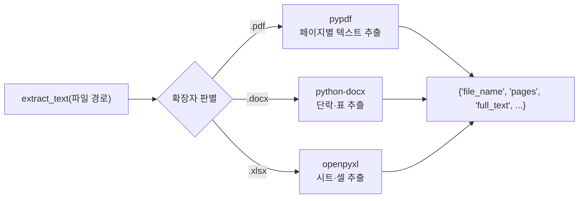
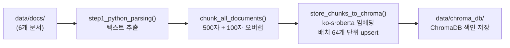

# 6. VectorDB 구축 — 문서를 검색 가능한 지식으로 바꾸기

CH05에서 메타코딩은 커넥트 사내 문서를 부서별 폴더에 정리하고 파일명 규칙을 세웠습니다. 6개 문서가 `{부서코드}_{문서명}_v{버전}` 형식으로 깔끔하게 정리되었지만, 정작 AI가 이 문서를 읽을 수 있는지는 아직 확인되지 않았습니다.

"파일을 정리했다고 AI가 이해하는 건 아니잖아."

메타코딩은 HR 취업규칙 PDF를 열어보았습니다. 1페이지에 연차 규정 표가 빼곡하게 들어 있었습니다. 재무 XLSX에는 매출 데이터가 한 시트에 정리되어 있었습니다. 이 파일들을 AI가 검색할 수 있으려면 텍스트를 추출하고, 적절한 크기로 자르고, 벡터로 변환해야 합니다.

이 챕터에서는 이 과정을 두 단계로 진행합니다. 먼저 Python 파싱 라이브러리(`pypdf`, `python-docx`, `openpyxl`)로 텍스트를 추출합니다. 이어서 추출한 텍스트를 500자 단위 청크로 분할하고 **ko-sroberta-multitask** 임베딩 모델로 벡터화하여 **ChromaDB(크로마DB)** 에 저장합니다. 챕터가 끝나면 터미널에서 "연차 사용 규정"을 검색했을 때 HR 취업규칙 문서의 관련 문구와 출처가 즉시 반환되는 것을 확인할 수 있습니다.

---

## 1. 개념 — 문서에서 벡터까지

본격적인 실습에 앞서, 이 챕터에서 구현할 전체 파이프라인을 한눈에 살펴봅니다.

### 1.1 전체 파이프라인 흐름

<!-- [GEMINI PROMPT: 06_pipeline-overview]
path: assets/CH06/06_pipeline-overview.png
A minimalist black and white technical diagram with a strict 16:9 aspect ratio on a solid white background. No shading, no 3D effects, only clean thin line art. The entire assembly of icons, lines, and text is perfectly centered globally within the 16:9 frame, leaving generous and equal white space on all sides. A top-to-bottom flowchart showing: Box 1 labeled "실제 문서(PDF/DOCX/XLSX)" at top. Arrow goes down to Box 2 "Step 1: Python 파싱(extractor.py)". Box 2 goes to Box 3 "chunker.py (500자 + 20% overlap)". Box 3 goes to Box 4 "ko-sroberta 임베딩". Box 4 goes to Box 5 "ChromaDB 저장(store.py)". Box 5 goes to Box 6 "CLI 검증(cli_search.py)".
Style: architecture-infographic
-->

*그림 6-1: 문서에서 ChromaDB 저장까지의 전체 파이프라인*

### 1.2 청킹 — 왜 500자인가

**청킹(Chunking)** 은 긴 텍스트를 검색에 적합한 작은 단위로 분할하는 과정입니다. 청크가 너무 크면 LLM이 받는 컨텍스트에 불필요한 내용이 포함되어 답변 품질이 낮아지고, 너무 작으면 문맥이 잘려 의미 전달이 어렵습니다.

이 챕터에서는 **Fixed-size 청킹(고정 크기 청킹)** 방식을 사용합니다. 청크 크기를 500자, 오버랩을 100자(20%)로 고정합니다.

```
원본 텍스트:  [...400자...][...400자...][...400자...]
청크 1:        [________500자_________]
청크 2:               [___100자___][________500자_______]
청크 3:                                    [___100자___][...
```

오버랩이 필요한 이유는 청크 경계에서 문장이 잘릴 때 앞뒤 청크가 100자씩 겹치도록 하여 맥락 손실을 줄이기 위해서입니다. Fixed-size 방식을 기본으로 사용하는 이유는 구현이 단순하고 동작이 예측 가능하기 때문입니다. 의미 단위로 분할하는 Semantic 청킹은 품질이 높지만 처리 속도가 느리고 파라미터 조정이 복잡합니다. 이 방식은 CH10 RAG 튜닝 챕터에서 다룹니다.

### 1.3 임베딩 모델 — ko-sroberta-multitask

**임베딩(Embedding)** 은 텍스트를 수치 벡터로 변환하는 과정입니다. 이 벡터를 VectorDB에 저장하고, 검색 쿼리도 같은 방식으로 벡터화하여 코사인 유사도로 관련 문서를 찾습니다.

이 챕터에서는 **`jhgan/ko-sroberta-multitask`** 모델을 사용합니다. 한국어에 특화된 SRoBERTa 기반 모델로, HuggingFace에서 무료로 다운로드할 수 있습니다. 최초 실행 시 약 400MB를 다운로드하고 로컬 캐시에 저장하므로 이후에는 인터넷 연결 없이 동작합니다. 768차원 벡터를 생성하며, 한국어 문장 유사도 태스크에 특화되어 있습니다.

### 1.4 ChromaDB — 로컬 영속 VectorDB

**VectorDB(벡터 데이터베이스)** 는 임베딩 벡터를 저장하고 유사도 기반 검색을 수행하는 데이터베이스입니다. 일반 RDBMS가 정확한 값 일치로 조회하는 것과 달리, VectorDB는 "의미적으로 비슷한" 문서를 찾아 반환합니다.

**ChromaDB** 는 Python에서 가장 쉽게 사용할 수 있는 오픈소스 VectorDB입니다. 별도 서버 없이 로컬 파일 시스템에 영속 저장(`PersistentClient`)하며, Docker 없이 `pip install`만으로 설치됩니다. 이 챕터에서는 `data/chroma_db/` 폴더에 색인 데이터를 저장합니다.

> **팁: ChromaDB vs 다른 VectorDB**
> Pinecone, Weaviate, Qdrant 등 클라우드 기반 VectorDB와 비교하면 ChromaDB는 로컬 개발과 중소 규모 운영에 적합합니다. 수십만 건 이상의 청크를 다루거나 멀티 서버 배포가 필요한 경우 클라우드 VectorDB 전환을 고려하십시오.

---

## 2. 실습 환경 준비

### 2.1 예제 클론 및 의존성 설치

```bash
cd examples/CH06_VectorDB_구축
python3.12 -m venv .venv
source .venv/bin/activate   # Windows: .\.venv\Scripts\Activate.ps1
pip install -r requirements.txt
```

> **주의: sentence-transformers 설치 시간**
> `sentence-transformers` 패키지는 PyTorch를 포함하므로 설치에 1~3분이 소요될 수 있습니다. Apple Silicon Mac에서는 `pip install torch` 후 설치하는 것이 더 빠릅니다.

`requirements.txt`의 주요 패키지는 다음과 같습니다.

| 패키지 | 버전 | 역할 |
|--------|------|------|
| `pypdf` | 4.3.1 | PDF 텍스트 추출 |
| `python-docx` | 1.1.2 | DOCX 단락·표 추출 |
| `openpyxl` | 3.1.5 | XLSX 시트·셀 추출 |
| `sentence-transformers` | 3.3.1 | ko-sroberta 임베딩 모델 |
| `chromadb` | 1.5.1 | VectorDB 저장 및 검색 |

### 2.2 데이터 폴더 구조 확인

CH05에서 표준화한 문서 6개가 이미 `data/docs/` 폴더에 배치되어 있습니다.

```
examples/CH06_VectorDB_구축/
├── data/
│   ├── docs/                    ← CH05 표준화 문서 (입력)
│   │   ├── hr/
│   │   │   ├── HR_취업규칙_v1.0.pdf
│   │   │   └── HR_정보보안서약서.pdf
│   │   ├── security/
│   │   │   └── SEC_보안규정_v1.0.docx
│   │   ├── ops/
│   │   │   └── OPS_신규서비스_런칭전략.pdf
│   │   └── finance/
│   │       ├── FIN_부서별_예산기안서.xlsx
│   │       └── FIN_2025_상반기_매출현황.xlsx
│   ├── markdown/                ← 파싱 결과 Markdown (자동 생성)
│   └── chroma_db/               ← ChromaDB 색인 (자동 생성)
└── src/
    ├── extractor.py             ← Step 1: Python 파싱
    ├── extract_pdf.py            ← PDF → Markdown 변환
    ├── extract_docx.py           ← DOCX → Markdown 변환
    ├── extract_xlsx.py           ← XLSX → Markdown 변환
    ├── chunker.py               ← 청킹 + 메타데이터 부착
    ├── store.py                 ← 임베딩 + ChromaDB 저장
    ├── cli_search.py            ← Step 3: CLI 검증
    └── main.py                  ← 전체 파이프라인 오케스트레이터
```

---

## 3. [Step 1] Python 파싱 테스트

메타코딩이 처음 시도한 것은 Python 라이브러리로 텍스트를 추출하는 것이었습니다. `pypdf`, `python-docx`, `openpyxl`은 각각 PDF, DOCX, XLSX를 파싱하는 표준 라이브러리입니다. 설치가 간단하고 비용이 들지 않습니다.

<!-- [GEMINI PROMPT: 06_python-parsing]
path: assets/CH06/06_python-parsing.png
A minimalist black and white technical diagram with a strict 16:9 aspect ratio on a solid white background. No shading, no 3D effects, only clean thin line art. Three document icons (PDF, DOCX, XLSX) on the left, each connected by an arrow to their respective library box (pypdf, python-docx, openpyxl) in the center, all three library boxes then connect to a single "텍스트 출력" box on the right. Below the right box, a small warning icon labeled "표/이미지 손실" is shown with a dashed border.
Style: architecture-infographic
-->

*그림 6-2: 형식별 Python 파싱 라이브러리 구조*

### 3.1 extractor.py 동작 요약

`src/extractor.py`는 PDF, DOCX, XLSX 세 형식을 하나의 인터페이스로 통합합니다. `extract_text()` 함수에 파일 경로를 전달하면, 확장자를 자동 감지하여 적절한 파서(`pypdf`, `python-docx`, `openpyxl`)를 호출합니다.



반환값은 딕셔너리로, 파일명(`file_name`), 페이지별 텍스트(`pages`), 전체 텍스트(`full_text`) 등을 포함합니다. PDF의 경우 페이지 번호를 1부터 시작하여 나중에 출처 표시 시 "1페이지"처럼 사람이 이해하는 번호를 사용합니다.

> **전체 코드: `src/extractor.py`**

### 3.2 Step 1 실행

```bash
python src/main.py --step 1
```
`data/docs/` 폴더를 순회하며 PDF·DOCX·XLSX를 형식별로 파싱한 뒤, 파일명·페이지 수·추출 글자 수를 터미널에 출력합니다. 메타코딩은 결과 숫자를 보는 순간 이상한 점을 발견했습니다 — HR 정보보안서약서의 글자 수가 0이었습니다.

<!-- [CAPTURE NEEDED: 06_step1-result
  path: assets/CH06/06_step1-result.png
  desc: `python src/main.py --step 1` 실행 후 터미널 화면 — 6개 문서 추출 결과 요약 (파일명, 페이지 수, 글자 수, 경고 표시)
] -->

*그림 6-4: Step 1 실행 결과 — 문서별 추출 글자 수와 경고*

### 3.3 Python 파싱의 한계

결과를 보면 흥미로운 사실이 드러납니다.

| 파일명 | 형식 | 추출 글자 수 | 상태 |
|--------|------|------------|------|
| `HR_취업규칙_v1.0.pdf` | PDF (다단 레이아웃) | 1,906자 | 텍스트 추출됨, 단 배치 무너짐 |
| `HR_정보보안서약서.pdf` | PDF (이미지 스캔) | 0자 | 텍스트 레이어 없음 (전량 손실) |
| `OPS_신규서비스_런칭전략.pdf` | PDF (슬라이드) | 1,435자 | 텍스트 추출됨, 배치 정보 손실 |
| `SEC_보안규정_v1.0.docx` | DOCX (표 포함) | 896자 | 표는 추출되나 서식 손실 |
| `FIN_2025_상반기_매출현황.xlsx` | XLSX | 891자 | 정상 추출 |
| `FIN_부서별_예산기안서.xlsx` | XLSX | 633자 | 정상 추출 |

`HR_취업규칙_v1.0.pdf`는 2열 다단 레이아웃으로 편집된 문서입니다. pypdf는 왼쪽 열과 오른쪽 열의 텍스트를 순서대로 추출하지 못하고 뒤섞습니다. 1,906자가 추출되었지만 문장 순서가 원본과 다릅니다. `HR_정보보안서약서.pdf`는 더 심각합니다 — 이미지로 스캔된 PDF라 텍스트 레이어 자체가 없어 글자 수가 0입니다.

Python 파싱은 다음 상황에서 한계를 드러냅니다.

- **이미지 스캔 PDF**: 텍스트 레이어가 없는 문서는 글자를 전혀 추출하지 못합니다.
- **다단 레이아웃 PDF**: 2열 이상의 편집 구조에서 텍스트 순서가 뒤섞입니다.
- **슬라이드형 PDF**: PPT를 변환한 PDF는 텍스트 배치 정보가 손실됩니다.

DOCX와 XLSX는 Python 파싱으로 충분합니다. 이미지 스캔 PDF처럼 텍스트 추출이 불가능한 문서는 **Vision LLM**(이미지를 이해하는 멀티모달 LLM)으로 보완할 수 있습니다. 이 방법은 **CH10 RAG 튜닝**에서 다룹니다. 이 챕터에서는 Python 파싱으로 추출 가능한 텍스트를 기반으로 VectorDB를 구축합니다.

---

## 4. 청킹과 메타데이터 부착

텍스트 추출이 완료되면 청킹 단계로 넘어갑니다. `src/chunker.py`는 추출 결과를 500자 단위로 분할하고 각 청크에 메타데이터를 부착합니다.

### 4.1 chunker.py 동작 요약

`split_text_into_chunks()` 함수는 입력 텍스트를 500자 단위로 잘라 청크 리스트를 반환합니다. 이동 단계를 400자(= 500 − 100 오버랩)로 설정하여 청크 1은 0~500자, 청크 2는 400~900자 순으로 100자씩 겹치게 합니다. 오버랩 덕분에 청크 경계에서 잘리는 문장도 다음 청크에서 다시 포함되어 맥락 손실을 줄입니다.

> **전체 코드: `src/chunker.py`**

### 4.2 메타데이터 부착 — 출처 추적의 핵심

청킹 후에는 각 청크에 **메타데이터**를 부착합니다. `build_text_chunk()` 함수가 텍스트 청크마다 고유 ID(`{문서ID}_text_p{페이지}_c{순번}`)와 함께 출처 파일명, 페이지 번호, 부서 정보를 딕셔너리로 묶어 반환합니다. 이 메타데이터가 있어야 검색 결과에서 "출처: HR_취업규칙_v1.0.pdf, 1페이지"처럼 표시할 수 있고, CH10의 Self-Query Retriever에서 "인사팀 문서만 검색"처럼 필터 조건으로도 활용됩니다. CH05에서 파일명 규칙을 설정한 이유가 여기서 나타납니다.

> **전체 코드: `src/chunker.py`**

메타코딩은 청크 목록을 훑어보며 각 딕셔너리에 파일명·페이지·부서 정보가 정확히 붙어 있는지 확인했습니다. 이 메타데이터가 나중에 검색 결과의 출처 표시를 결정한다는 것을 알고 있었기 때문입니다.

---

## 5. 임베딩 & VectorDB 저장

청크 리스트가 준비되면 `src/store.py`가 임베딩과 ChromaDB 저장을 담당합니다.

### 5.1 store.py 동작 요약

`store_chunks_to_chroma()` 함수는 세 단계로 동작합니다. 먼저 `SentenceTransformer`로 ko-sroberta 모델을 로드합니다(최초 실행 시 약 400MB 다운로드, 이후 로컬 캐시 재사용). 다음으로 `PersistentClient`로 ChromaDB를 초기화하고 코사인 유사도(`hnsw:space: cosine`) 컬렉션을 생성합니다. 마지막으로 청크를 64개 배치 단위로 임베딩한 뒤 `upsert()`로 저장합니다. `upsert`는 동일 ID가 이미 존재하면 덮어쓰므로 파이프라인을 반복 실행해도 데이터가 중복 저장되지 않습니다.

> **전체 코드: `src/store.py`**

### 5.2 전체 파이프라인 실행 (Step 1 + 2)

이제 Step 1(Python 파싱)과 Step 2(청킹 + 임베딩 + ChromaDB 저장)를 한 번에 실행합니다.

```bash
python src/main.py
```



*그림 6-5b: main.py 전체 파이프라인 실행 흐름 — 파싱 → 청킹 → 임베딩 → 저장*

6개 문서를 파싱하고 500자 단위로 청킹한 뒤 ko-sroberta 임베딩을 거쳐 `data/chroma_db/`에 ChromaDB 색인을 저장합니다. 메타코딩은 터미널에 총 청크 수가 찍히는 것을 보고서야 "이제 검색할 수 있겠다"고 생각했습니다.

<!-- [CAPTURE NEEDED: 06_pipeline-complete
  path: assets/CH06/06_pipeline-complete.png
  desc: `python src/main.py` 실행 완료 후 터미널 화면 — Step 1, Step 2 순서로 완료 메시지가 표시되고 총 청크 수와 ChromaDB 저장 완료 메시지가 보이는 상태
] -->

*그림 6-5: main.py 실행 완료 — Step 1, 2 순서로 완료*

> **팁: 처음 실행 시 모델 다운로드**
> ko-sroberta-multitask 모델 최초 다운로드에 몇 분이 소요될 수 있습니다. 다운로드 완료 후 `임베딩 모델 로드 완료 (벡터 차원: 768)` 메시지가 출력되면 정상입니다. 이후 실행에서는 로컬 캐시를 사용하므로 즉시 로드됩니다.

---

## 6. CLI 검증 — 쿼리로 근거 확인

ChromaDB 색인이 완성되었습니다. 이제 실제로 검색이 잘 되는지 확인할 차례입니다. `src/cli_search.py`는 터미널에서 자연어 쿼리를 입력하면 관련 청크, 출처 파일명, 페이지 번호, 유사도 점수를 즉시 반환합니다.

웹 UI를 만들기 전에 CLI로 먼저 검증하는 이유는 VectorDB 품질을 빠르게 확인하기 위해서입니다. 웹 UI 개발에는 시간이 걸리지만, CLI 검색은 파이프라인이 완성되는 즉시 실행할 수 있습니다. 문제가 있다면 이 단계에서 파악하는 것이 훨씬 효율적입니다.

### 6.1 CLI 검색 실행

**단일 쿼리 모드** 로 특정 질문 하나를 검색합니다.

```bash
python src/cli_search.py --query "연차 사용 규정"
```

**대화형 모드** 로 반복 검색을 실행합니다.

```bash
python src/cli_search.py
```

대화형 모드에서는 쿼리를 계속 입력할 수 있고, `quit` 또는 `exit`를 입력하면 종료됩니다.

### 6.2 cli_search.py 동작 요약

`cli_search.py`는 입력 쿼리를 ko-sroberta로 임베딩한 뒤 ChromaDB에서 코사인 유사도 상위 k개 청크를 검색합니다. ChromaDB의 cosine 거리(0~2)를 `(1 - distance/2) * 100` 공식으로 직관적인 0~100% 유사도로 변환하여, 각 결과마다 유사도 점수, 출처 파일명, 페이지 번호, 텍스트 미리보기를 터미널에 출력합니다.

> **전체 코드: `src/cli_search.py`**

메타코딩은 처음으로 "연차 사용 규정"을 입력해 보았고, 결과가 1초도 안 되어 돌아오는 것을 보고 파이프라인이 제대로 동작한다는 것을 확인했습니다.

### 6.3 검색 품질 확인

<!-- [CAPTURE NEEDED: 06_cli-search-result
  path: assets/CH06/06_cli-search-result.png
  desc: `python src/cli_search.py --query "연차 사용 규정"` 실행 결과 — 유사도 점수, 출처 파일명(HR_취업규칙_v1.0.pdf), 페이지 번호, 관련 텍스트가 터미널에 출력된 화면
] -->

*그림 6-6: "연차 사용 규정" 쿼리 검색 결과 — 출처와 유사도 함께 표시*

검색 결과를 해석하는 기준은 다음과 같습니다.

| 유사도 | 의미 | 조치 |
|--------|------|------|
| 80% 이상 | 관련도 높음 | 정상 |
| 70~80% | 관련도 보통 | 청크 크기 또는 임베딩 모델 검토 |
| 70% 미만 | 관련도 낮음 | 쿼리 표현 방식 또는 문서 내용 확인 |

다음 쿼리들로 다양한 검색을 시험해 보십시오.

```bash
python src/cli_search.py --query "비밀번호 정책"
python src/cli_search.py --query "신규 서비스 출시 전략"
python src/cli_search.py --query "부서별 예산 현황"
```

> **참고: 검색 결과 개수 조정**
> 기본은 top_k=5이지만 `--top-k` 옵션으로 변경할 수 있습니다.
> ```bash
> python src/cli_search.py --query "연차 사용 규정" --top-k 3
> ```
> `--top-k 3`으로 줄이면 가장 관련 있는 청크만 확인할 수 있고, `--top-k 10`으로 늘리면 더 넓은 범위를 검토할 수 있습니다.
---

## 7. 정리하며

메타코딩은 이 챕터를 시작할 때 "파일을 정리했다고 AI가 이해하는 건 아니잖아"라고 걱정했습니다. Python 파싱으로 PDF, DOCX, XLSX에서 텍스트를 추출하고, 500자 단위로 청킹한 뒤 ko-sroberta 임베딩을 거쳐 ChromaDB에 저장했습니다. CLI에서 "연차 사용 규정"을 입력하자 HR 취업규칙 문서의 관련 조항과 출처가 1초 이내에 반환되었습니다.

<!-- [GEMINI PROMPT: 06_before-after]
path: assets/CH06/06_before-after.png
A minimalist black and white technical diagram with a strict 16:9 aspect ratio on a solid white background. No shading, no 3D effects, only clean thin line art. Simple before/after comparison: LEFT side labeled "Before" shows a person icon with a thought bubble containing a folder icon and "10~30분 검색" text with a downward-pointing arrow indicating inefficiency. RIGHT side labeled "After" shows a terminal icon with text "1초 미만" and an upward-pointing arrow. Center shows a large right-pointing arrow labeled "VectorDB 구축". Clean flat design, balanced layout.
Style: before-after-infographic
-->

*그림 6-7: VectorDB 구축 전후 문서 검색 방식 비교*

| 지표 | Before | After |
|------|--------|-------|
| 문서 검색 방식 | 파일명으로 수동 탐색 | 의미 기반 벡터 검색 |
| 검색 소요 시간 | 10~30분 (폴더 탐색) | 1초 미만 (CLI 쿼리) |
| 표·차트 정보 | 텍스트 추출 시 일부 손실 | 텍스트 기반 검색 가능 |
| 검색 정확도(top-5) | 해당 없음 | 80%+ 관련 문서 포함 |
| 출처 확인 | 파일 직접 열어 검색 | 파일명 + 페이지 즉시 표시 |

이 챕터에서 배운 핵심 내용을 정리합니다.

- **Python 파싱의 범위와 한계**: `pypdf`, `python-docx`, `openpyxl`은 텍스트형 문서에 효과적이지만, 이미지형 PDF와 복잡한 표에서는 정보 손실이 발생합니다. 이 한계는 CH10에서 Vision LLM을 활용하여 해결합니다.
- **Fixed-size 청킹의 선택 이유**: 500자 + 100자 오버랩 구성은 구현이 단순하고 동작이 예측 가능합니다. 품질 개선이 필요하면 CH10에서 Semantic 청킹으로 전환합니다.
- **메타데이터가 검색 품질을 결정한다**: 청크마다 파일명·페이지·부서 정보를 부착해야 검색 결과에서 출처를 명확히 표시하고, 나중에 부서별 필터링도 적용할 수 있습니다.
- **ChromaDB upsert**: 같은 ID의 청크는 중복 저장되지 않으므로 파이프라인을 반복 실행해도 안전합니다.

다음 챕터에서는 이 ChromaDB 색인을 RAG 체인과 연결하여 자연어 질문에 답변하는 웹 채팅 UI를 구현합니다. CLI에서 확인한 검색 품질이 실제 LLM 답변의 정확도로 이어집니다.
