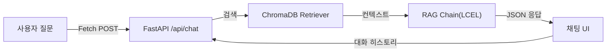
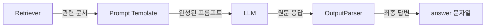
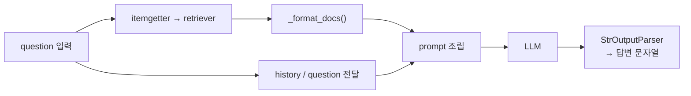
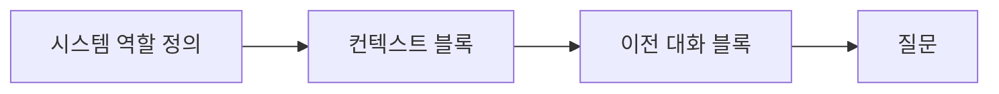
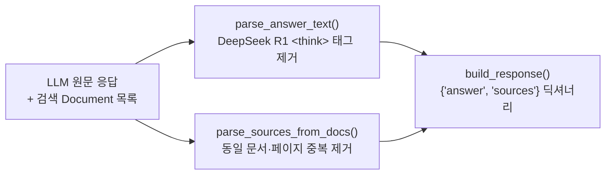
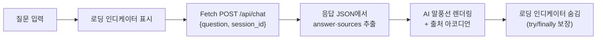
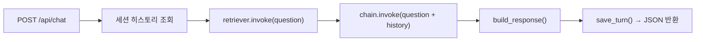

# 7. RAG로 Q&A 엔진 만들기

<!-- [GEMINI PROMPT: 07_opening-story]
path: assets/CH07/07_opening-story.png
Warm office illustration: A developer sitting alone at a desk, looking at a terminal screen showing CLI text output on the left monitor, while imagining a chat bubble interface on the right. The developer has a thoughtful expression, with sticky notes saying "직원들은 터미널 못 쓴다" and "웹 UI 필요". Soft warm beige and light blue color palette, friendly cartoon style, clean white background with subtle desk and monitor elements, no text overlay.
Style: office-illustration-warm
-->

*그림 7-1: CLI 검색만으로는 직원들이 사용할 수 없다는 것을 깨달은 메타코딩*

CH06에서 ChromaDB 인덱스를 구축한 메타코딩은 CLI에서 "신입사원 온보딩 절차"를 검색하자 관련 문서 청크 5개가 즉시 출력되는 것을 확인하였습니다. 하지만 곧 문제가 보였습니다. 이 도구는 터미널 명령어를 아는 개발자만 사용할 수 있습니다. 직원 30명 중 터미널을 편하게 다루는 사람은 메타코딩 본인뿐입니다.

"직원들에게 '터미널에서 `python src/cli_search.py` 명령어를 입력하세요'라고 안내할 수는 없습니다."

브라우저에서 자연어로 질문하고, 출처가 포함된 답변을 받을 수 있는 채팅 UI가 필요합니다. 그리고 실제 업무 상황을 생각해보면 한 가지 질문만으로 끝나는 경우는 드뭅니다. "아까 물어본 건데, 그것 말고 다른 부서 규정은?" — 이전 대화를 이어서 질문하는 멀티턴 대화도 지원해야 합니다.

이 챕터에서는 다음 세 가지를 구현합니다.

1. **LCEL(LangChain Expression Language)** 기반 RAG 체인으로 질문 → 검색 → 답변 파이프라인 조립
2. 출처가 포함된 구조화된 응답 포맷과 **출처 아코디언 채팅 UI** 구현
3. 세션 기반 **멀티턴 대화** 관리로 이전 대화 맥락 유지

---

## 1. RAG Q&A 엔진의 구조

### 1.1 전체 흐름

사용자가 브라우저 채팅창에 질문을 입력하면 어떤 일이 일어나는지 먼저 살펴보겠습니다.



*그림 7-2: CH07 RAG Q&A 엔진 전체 흐름*

질문은 Fetch POST 방식으로 `/api/chat` 엔드포인트에 도달합니다. FastAPI가 이를 받아 RAG 체인에 전달하면, 체인은 ChromaDB에서 관련 문서를 검색하고 LLM으로 답변을 생성하여 JSON 형태로 반환합니다. 채팅 UI는 그 JSON에서 답변과 출처를 꺼내 화면에 표시합니다. 멀티턴 대화를 위해 세션 히스토리도 함께 주고받습니다.

### 1.2 LCEL이란 무엇인가

**LCEL(LangChain Expression Language)** 은 LangChain의 선언적 체인 조합 문법입니다. Python의 파이프 연산자(`|`)를 사용하여 Retriever, Prompt, LLM, OutputParser 같은 구성 요소를 하나의 체인으로 연결합니다.



*그림 7-3: LCEL 파이프라인 구성 요소*

각 구성 요소의 역할을 정리하면 다음과 같습니다.

| 구성 요소 | 역할 |
|----------|------|
| **Retriever** | ChromaDB에서 질문과 의미적으로 유사한 문서를 검색하여 반환합니다. |
| **Prompt Template** | LLM에 전달할 지시문(시스템 규칙 + 컨텍스트 + 질문)을 조립합니다. |
| **LLM** | DeepSeek R1 등 언어 모델이 프롬프트를 읽고 답변을 생성합니다. |
| **OutputParser** | LLM 응답 객체에서 순수 문자열만 추출합니다. `StrOutputParser()`가 담당합니다. |

LCEL을 사용하는 이유는 두 가지입니다. 첫째, 파이프 연산자 덕분에 데이터 흐름이 왼쪽에서 오른쪽으로 한눈에 보입니다. 둘째, 구성 요소를 독립적으로 교체할 수 있어 Ollama 모델을 OpenAI 모델로 바꾸거나 ChromaDB를 다른 VectorDB로 전환할 때 체인 코드를 수정할 필요가 없습니다.

> **참고: temperature 파라미터**
> LLM의 출력 무작위성을 조절하는 값입니다. 0에 가까우면 가장 확률이 높은 단어를 선택하여 일관된 답변을 생성하고, 1에 가까우면 다양한 표현을 시도합니다. 사실 기반 Q&A에서는 `temperature=0.1` 처럼 낮은 값을 사용합니다.

---

## 2. 실습 환경 준비

### 2.1 저장소 클론 및 환경 설정

> **주의: 이전 챕터 실습 환경 정리**
> CH04의 FastAPI 서버와 Docker 컨테이너가 실행 중이라면 먼저 종료하십시오. 포트가 충돌합니다.
> ```bash
> # 1. Ctrl+C 로 uvicorn 서버 종료
> # 2. Docker 컨테이너 종료 (CH04 디렉토리에서)
> docker compose down
> ```

```bash
cd examples/CH07_RAG_QA_엔진
python3 -m venv .venv
source .venv/bin/activate   # Windows: .venv\Scripts\Activate.ps1
```

`.env.example`을 `.env`로 복사하고 설정값을 입력합니다.

```bash
cp .env.example .env
```

`.env` 파일의 주요 설정 항목은 다음과 같습니다.

```
# LLM 제공자: ollama(로컬) 또는 openai(클라우드)
LLM_PROVIDER=ollama
OLLAMA_BASE_URL=http://localhost:11434
OLLAMA_MODEL=deepseek-r1:8b

# 임베딩 모델 (CH06과 동일)
EMBEDDING_MODEL=jhgan/ko-sroberta-multitask

# ChromaDB 경로 (없으면 data/docs/에서 자동 구축)
CHROMA_PERSIST_DIR=./data/chroma_db

# 세션 설정
SESSION_TTL_SECONDS=3600
CONVERSATION_WINDOW_SIZE=5
```

> **팁: ChromaDB 자동 구축**
> 이 챕터의 예제 프로젝트에는 원본 문서 6종이 `data/docs/`에 포함되어 있습니다. 서버를 처음 실행하면 이 문서를 자동으로 파싱·청킹·임베딩하여 `data/chroma_db/`에 VectorDB를 구축합니다. CH06의 출력을 별도로 복사할 필요가 없습니다.

### 2.2 의존성 설치

> **주의: 패키지 설치 시간**
> `sentence-transformers`와 `chromadb`는 처음 설치 시 수백 MB의 파일을 내려받습니다. 네트워크 속도에 따라 수 분이 걸릴 수 있습니다.

```bash
pip install -r requirements.txt
```

주요 패키지와 역할은 다음과 같습니다.

| 패키지 | 버전 | 역할 |
|--------|------|------|
| `langchain` | 0.3.21 | LCEL 체인 조합 프레임워크 |
| `langchain-ollama` | 0.2.3 | Ollama LLM 연결 |
| `langchain-chroma` | 0.2.6 | ChromaDB 연동 |
| `chromadb` | 1.5.1 | 벡터 데이터베이스 |
| `sentence-transformers` | 3.3.1 | ko-sroberta 임베딩 모델 실행 엔진 (CH06과 동일) |
| `fastapi` | 0.115.8 | 채팅 API 서버 |
| `uvicorn` | 0.34.0 | ASGI 서버 |
| `jinja2` | 3.1.5 | HTML 템플릿 엔진 |

`sentence-transformers`는 CH06에서 사용한 `ko-sroberta-multitask` 임베딩 모델을 로드하는 엔진입니다. `langchain-chroma`가 내부적으로 `HuggingFaceEmbeddings`를 호출할 때 이 패키지가 필요합니다.

### 2.3 서버 실행

```bash
python app/main.py
```

터미널에 다음과 같은 메시지가 출력되면 정상입니다.

```
[INFO] 서버 시작: http://0.0.0.0:8000
[INFO] 채팅 UI: http://localhost:8000/chat
[INFO] ChromaDB가 없습니다. data/docs/ 원본 문서에서 자동 구축합니다.
[INFO] ChromaDB 자동 구축 완료: 87건 → ./data/chroma_db
```

브라우저에서 `http://localhost:8000/chat` 을 열면 채팅 UI가 표시됩니다.

<!-- [CAPTURE NEEDED: 07_chat-ui-initial
  path: assets/CH07/07_chat-ui-initial.png
  desc: 브라우저에서 http://localhost:8000/chat 접속 시 초기 채팅 UI 화면 — "메타코딩 Q&A 비서입니다" 환영 메시지가 표시된 상태
] -->

*그림 7-4: 브라우저에서 확인한 CH07 채팅 UI 초기 화면*

---

## 3. RAG 최소 동작 구현 — LCEL 기반 RAG 체인

메타코딩이 처음 만든 것은 RAG 체인의 핵심 로직입니다. CLI 검색에서는 ChromaDB 검색 결과를 그냥 출력하기만 했지만, 이번에는 검색 결과를 LLM에 넘겨서 자연어 답변을 생성해야 합니다.

### 3.1 RAG 체인 구현

`src/rag_chain.py`의 핵심 함수 `build_rag_chain()`을 살펴보겠습니다.

```python
# src/rag_chain.py (핵심 발췌)

def build_rag_chain() -> tuple[Any, Any]:
    llm = _build_llm()             # ① LLM 인스턴스 생성
    retriever = _build_retriever() # ② Retriever 생성 (ChromaDB)

    prompt = ChatPromptTemplate.from_messages(
        [
            ("system", RAG_SYSTEM_PROMPT),
            ("human", RAG_HUMAN_PROMPT),
        ]
    )

    # LCEL 파이프: 입력 dict에서 각 키를 꺼내 병렬 처리 후 프롬프트로 합침
    chain = (
        {
            "context": itemgetter("question") | retriever | _format_docs,
            "history": itemgetter("history"),
            "question": itemgetter("question"),
        }
        | prompt
        | llm
        | StrOutputParser()
    )

    return chain, retriever
```

> 전체 코드: `src/rag_chain.py`



*그림 7-3-1: LCEL 체인 실행 흐름 — 질문이 검색·프롬프트 조립·생성 단계를 순서대로 통과합니다*

중괄호(`{}`) 블록은 `context`, `history`, `question` 세 값을 동시에 준비하는 병렬 실행 단계입니다. 세 값이 모두 완성되면 `prompt`로 합쳐져 LLM에 전달됩니다. 메타코딩은 이 한 줄짜리 파이프가 CLI 검색 스크립트 50줄을 대체한다는 사실에 잠시 멍해졌습니다.

---

## 4. RAG 프롬프트 기본 템플릿

### 4.1 출처 강제 규칙

RAG 시스템에서 **출처 강제 규칙** 은 신뢰도의 핵심입니다. 이 규칙이 없으면 LLM이 학습 데이터에서 그럴듯한 답변을 만들어낼 수 있습니다. 사용자는 그 답변이 실제 사내 문서 기반인지, LLM의 추측인지 구분할 수 없습니다.

시스템 프롬프트는 LLM에게 역할과 4가지 규칙을 명시합니다. "반드시 제공된 문서에서만 근거를 찾아라", "찾을 수 없으면 확인되지 않는다고 답하라", "출처 문서명을 명시하라", "추측이나 외부 지식은 사용하지 마라"가 핵심입니다. 프롬프트 변수는 `{context}`, `{history}`, `{question}` 세 개입니다.

> 전체 코드: `src/rag_chain.py`

### 4.2 프롬프트 설계 패턴
실제 프롬프트의 구조를 살펴보겠습니다.

```
[시스템 메시지]
당신은 메타코딩 사내 문서 Q&A 비서입니다.
아래에 제공된 문서(Context)만 사용하여 질문에 답변하십시오.

규칙:
1. 반드시 제공된 문서에서만 근거를 찾아 답변하시오.
2. 문서에서 답을 찾을 수 없으면 "해당 내용은 제공된 문서에서 확인되지 않습니다."라고 답하시오.
3. 답변 마지막에 근거 문서명을 반드시 명시하시오. 형식: [출처: 문서명]
4. 추측이나 외부 지식을 사용하지 마시오.

Context (제공된 문서):
{context}

이전 대화:
{history}

[사용자 메시지]
질문: {question}
```

이 프롬프트는 세 개의 블록으로 구성됩니다.



*그림 7-5: RAG 프롬프트 구조 — 시스템 역할, 컨텍스트, 대화 히스토리, 질문*

- **시스템 역할 정의**: LLM에게 "사내 문서 Q&A 비서"라는 역할과 4가지 규칙을 명시합니다.
- **컨텍스트 블록** (`{context}`): `_format_docs()`가 변환한 검색 결과가 여기에 채워집니다.
- **이전 대화 블록** (`{history}`): 멀티턴 대화를 위한 이전 대화 내역이 여기에 들어갑니다. 첫 질문일 때는 "없음"이 입력됩니다.
- **질문** (`{question}`): 사용자가 입력한 자연어 질문입니다.

"모르면 확인되지 않음" 규칙(규칙 2)은 환각을 방지하는 안전장치입니다. 문서에 없는 내용을 질문하면 LLM이 "해당 내용은 제공된 문서에서 확인되지 않습니다."라고 답변하도록 강제합니다. 이 규칙이 없으면 LLM이 사내 문서에 없는 정보를 자신 있게 생성할 수 있습니다.

---

## 5. 출처 표시 응답 포맷

### 5.1 answer + sources 구조

RAG 체인이 답변을 생성하면, `response_parser.py`가 이를 구조화된 JSON으로 변환합니다.

```json
{
  "answer": "신입사원 온보딩 절차는 총 3단계로 구성됩니다...\n[출처: HR_취업규칙_v1.0]",
  "sources": [
    {
      "doc": "HR_취업규칙_v1.0",
      "page": 12,
      "snippet": "제3조 (온보딩 절차) 신입사원은 입사 후 1주일 이내에..."
    },
    {
      "doc": "HR_정보보안서약서",
      "page": 1,
      "snippet": "보안 서약은 온보딩 첫날 서명 완료해야 합니다..."
    }
  ],
  "session_id": "a1b2c3d4-..."
}
```

### 5.2 응답 파서 동작

`response_parser.py`는 LLM 원문 응답을 구조화된 JSON으로 변환하는 세 단계를 수행합니다.



*그림 7-5-1: 응답 파서 흐름 — LLM 원문과 검색 문서가 구조화된 JSON으로 변환됩니다*

첫 번째 단계에서 DeepSeek R1이 생성하는 `<think>...</think>` 추론 토큰을 제거하여 순수 답변만 남깁니다. 두 번째 단계에서 검색된 문서 목록에서 동일 출처(문서명 + 페이지) 중복을 걸러내고 스니펫을 추출합니다. 세 번째 단계에서 두 결과를 `answer + sources` 딕셔너리로 합칩니다. 메타코딩은 첫 번째 실제 응답 JSON을 보는 순간 "이제 UI에 붙이기만 하면 되겠다"는 생각이 들었습니다.

> 전체 코드: `src/response_parser.py`

출처를 별도 필드로 구조화하는 이유가 있습니다. 출처가 답변 텍스트 안에 `[출처: ...]` 형태로만 포함되면 UI에서 꾸미기가 어렵습니다. `sources` 배열로 분리하면 채팅 UI에서 아코디언 형태로 펼쳐지는 "근거 문서 보기" 기능을 구현할 수 있습니다.

> **주의: LLM 응답의 비결정성**
> LLM 응답은 실행할 때마다 달라집니다. `temperature=0.1`을 사용하더라도 완전히 동일한 답변이 나오지 않습니다. 채팅 UI에서 확인한 답변이 이 책의 예시와 다른 내용이어도 정상입니다.

---

## 6. 채팅 웹 UI — CH04 base.html 계승

### 6.1 CH04 디자인 시스템 재활용

메타코딩은 CH04에서 직원 관리 Admin UI를 만들면서 `base.html` 레이아웃을 설계하였습니다. 좌측 240px 사이드바와 메인 콘텐츠 영역으로 구성된 이 레이아웃은 직원들이 이미 익숙한 화면입니다. 채팅 UI도 동일한 디자인 시스템을 계승합니다.

`templates/chat.html`은 Jinja2의 `` 한 줄로 전체 레이아웃(사이드바, 헤더, 공통 CSS)을 불러오고, `` 안에 채팅 히스토리 영역과 하단 입력바만 새로 정의합니다. AI 환영 메시지, 질문 입력 폼, 전송 버튼으로 구성된 채팅 화면이 CH04와 동일한 디자인 안에 자연스럽게 들어갑니다.

> 전체 코드: `templates/chat.html`

### 6.2 Fetch 기반 채팅 API 호출

`chat.js`의 `handleSubmit()` 함수가 사용자 질문을 서버에 전달하고 응답을 화면에 표시합니다.



*그림 7-6-0: chat.js 처리 흐름 — 질문부터 말풍선 렌더링까지 다섯 단계*

`try/finally` 블록이 로딩 인디케이터 해제를 보장하므로 서버 오류가 나도 화면이 멈추지 않습니다. Fetch 방식을 사용하는 이유가 있습니다. SSE(Server-Sent Events)나 WebSocket은 스트리밍 답변을 보여줄 수 있지만 구현 복잡도가 높습니다. Fetch 기반 단순 요청·응답 방식은 구현이 직관적이고, 사내 도구에서 요구하는 수준의 응답 속도로 충분합니다.

> 전체 코드: `static/js/chat.js`

### 6.3 FastAPI 채팅 엔드포인트

`app/chat_api.py`의 `chat_endpoint()`가 브라우저 요청을 받아 RAG 체인 실행까지 한 번의 POST 요청 안에서 완결합니다.



*그림 7-6-1: chat_endpoint 처리 흐름 — 히스토리 주입, 검색, 생성, 저장이 순서대로 실행됩니다*

히스토리 조회 → 문서 검색 → 체인 실행 → 응답 구조화 → 히스토리 저장의 다섯 단계입니다. 메타코딩은 이 엔드포인트 하나가 CLI 검색 스크립트와 결과 출력 스크립트를 모두 대체한다는 점을 확인하고 설계가 맞다는 확신을 얻었습니다.

`get_rag_chain()`은 싱글턴 패턴으로 구현되어 있습니다. 앱이 시작될 때 RAG 체인을 한 번만 초기화하고 이후 요청에서는 재사용합니다. LLM 인스턴스와 ChromaDB 연결을 매 요청마다 새로 만들면 응답 시간이 크게 늘어납니다.

> 전체 코드: `app/chat_api.py`

<!-- [CAPTURE NEEDED: 07_chat-with-source
  path: assets/CH07/07_chat-with-source.png
  desc: 브라우저 채팅 UI에서 "신입사원 온보딩 절차는?" 질문 후 AI 답변이 표시되고, 하단에 "근거 문서 보기" 아코디언이 펼쳐진 상태
] -->

*그림 7-6: AI 답변 아래에 출처 아코디언이 펼쳐진 채팅 화면*

---

## 7. 멀티턴 대화 관리

### 7.1 멀티턴이 필요한 이유

실제 업무에서는 "온보딩 절차를 알려줘" 한 번으로 끝나는 경우가 드뭅니다. 직원들은 이렇게 물어봅니다.

> "온보딩 절차를 알려줘."
> "그 중 보안 서약은 언제까지 해야 해?"
> "아, 그러면 입사 첫날 어디로 가면 돼?"

각 질문은 앞 질문의 맥락 없이는 이해할 수 없습니다. "그 중" 이 무엇을 가리키는지, "그러면" 이 무슨 상황을 전제하는지 — 이 맥락을 LLM에 전달하지 않으면 매 질문이 독립적인 첫 질문으로 처리됩니다.

### 7.2 WindowMemory — 최근 N턴 유지


*그림 7-7: WindowMemory deque 예시*

LangChain의 `ConversationBufferWindowMemory`와 동일한 개념으로, 이 프로젝트에서는 `WindowMemory` 클래스를 직접 구현하였습니다. 내부적으로 `deque(maxlen=k)`를 사용하여 최근 k턴만 유지하고, `get_history()`가 `"사용자: ...\nAI 비서: ..."` 형식의 문자열로 변환하여 RAG 프롬프트의 `{history}` 자리에 바로 채울 수 있도록 반환합니다.

> 전체 코드: `src/conversation.py`

`deque(maxlen=k)`는 k+1번째 항목이 들어오면 가장 오래된 항목을 자동으로 제거합니다.

`deque`를 사용하는 이유가 있습니다. 리스트로 구현하면 길이 초과 시 수동으로 오래된 항목을 제거해야 합니다. `deque(maxlen=k)`는 이 로직을 자동으로 처리합니다.

### 7.3 세션 관리 — 사용자별 독립 히스토리

여러 직원이 동시에 채팅을 사용할 때, 각자의 대화 히스토리가 뒤섞여서는 안 됩니다. `ConversationManager`가 세션 ID를 키로 각 직원의 `WindowMemory`를 분리하여 관리합니다. `session_id`를 키로 각 직원의 `WindowMemory`를 독립적으로 보관하고, TTL이 지난 세션은 자동 정리합니다.

> 전체 코드: `src/conversation.py`

메타코딩이 직원 두 명에게 동시에 채팅 테스트를 요청했을 때 서로의 대화가 섞이지 않는다는 것을 확인하고 설계가 올바르다는 것을 검증하였습니다.


### 7.4 멀티턴 대화 동작 확인

서버가 실행 중인 상태에서 브라우저 채팅 UI를 열고 연속 질문을 입력해 보십시오.

<!-- [CAPTURE NEEDED: 07_multiturn-chat
  path: assets/CH07/07_multiturn-chat.png
  desc: 채팅 UI에서 "온보딩 절차를 알려줘" → AI 답변 → "그 중 보안 서약은?" → AI가 이전 맥락을 이해하여 온보딩 관련 보안 서약 내용을 답변하는 멀티턴 대화 화면
] -->

*그림 7-7: 이전 질문의 맥락을 이어받아 답변하는 멀티턴 대화*

> **참고: LLM 응답은 실행할 때마다 달라집니다**
> 화면에서 확인한 답변 내용이 이 책의 예시와 다른 경우에도 정상입니다.

두 번째 질문 "그 중 보안 서약은?"에 대해 LLM이 앞 질문의 맥락(온보딩 절차)을 이해하고 관련 내용을 답변한다면 멀티턴 대화가 정상 동작하는 것입니다. "그 중"이 무엇을 가리키는지 LLM이 이해할 수 있는 것은 `history` 필드에 이전 대화가 포함되어 있기 때문입니다.

---

## 8. 정리하며

<!-- [GEMINI PROMPT: 07_before-after]
path: assets/CH07/07_before-after.png
Simple before/after comparison infographic: LEFT side labeled "CLI 검색 (Before)" shows a terminal icon with text "개발자 1명만 사용 가능" and a red down-arrow with "5건/일", RIGHT side labeled "웹 채팅 UI (After)" shows a browser chat icon with text "전 직원 30명 사용 가능" and a green up-arrow with "50건/일". Center arrow pointing right. Clean flat design, white background, black and white line art, 16:9.
Style: before-after-infographic
-->

*그림 7-8: CH07 완료 — CLI에서 전 직원이 사용하는 웹 채팅 UI로*

메타코딩이 CH07에서 만든 것을 정리하면 다음과 같습니다.

- **LCEL 기반 RAG 체인**: 파이프 연산자(`|`)로 Retriever → Prompt → LLM → Parser를 조립하였습니다. `.env` 한 줄로 Ollama와 OpenAI를 전환할 수 있습니다.
- **출처 강제 프롬프트**: 4가지 규칙으로 LLM이 사내 문서 기반으로만 답변하도록 제약하였습니다. 문서에 없는 내용은 "확인되지 않습니다"로 처리됩니다.
- **구조화된 응답 포맷**: `answer + sources` JSON 구조로 채팅 UI에서 출처 아코디언을 구현하였습니다.
- **채팅 웹 UI**: CH04의 `base.html`을 계승하여 일관된 디자인으로 Fetch 기반 채팅 화면을 완성하였습니다.
- **멀티턴 대화**: `WindowMemory`와 `ConversationManager`로 세션별 대화 히스토리를 관리하여 이전 맥락을 이어받는 대화를 구현하였습니다.

CH07 완료 이후의 before/after 비교입니다.

| 지표 | Before (CLI 검색) | After (웹 채팅 UI) |
|------|------------------|--------------------|
| 사용 가능한 인원 | 개발자 1명 | 전 직원 30명 |
| 질의 방식 | 터미널 명령어 | 브라우저 채팅 |
| 출처 표시 | 텍스트 출력 | 근거 아코디언 UI |
| 대화 맥락 유지 | 불가능 | 멀티턴 대화 지원 |
| 질의 건수 (예상) | 5건/일 | 50건/일 |

---

직원 1명에게 채팅 UI 테스트를 부탁하였더니 이런 반응이 돌아왔습니다. "이거 ChatGPT보다 좋은데? 출처까지 나오니까 믿을 수 있어." 메타코딩은 처음으로 이 프로젝트가 제대로 가고 있다는 확신을 얻었습니다.

> **실습 환경 정리**
> 이 챕터의 실습이 끝나면 FastAPI 서버를 종료하십시오. 다음 챕터에서 동일 포트(8000)를 사용하므로 충돌이 발생할 수 있습니다.
> ```bash
> # Ctrl+C 로 uvicorn 서버 종료
> ```

하지만 곧 예상치 못한 질문이 들어옵니다. "김철수 사원의 남은 연차는 며칠이야?" — 이 정보는 사내 문서가 아닌 PostgreSQL 데이터베이스에 있습니다. RAG만으로는 처리할 수 없는 질문입니다. 다음 챕터에서는 정형 데이터(DB)와 비정형 데이터(문서)를 함께 처리하는 통합 에이전트를 구축합니다.
