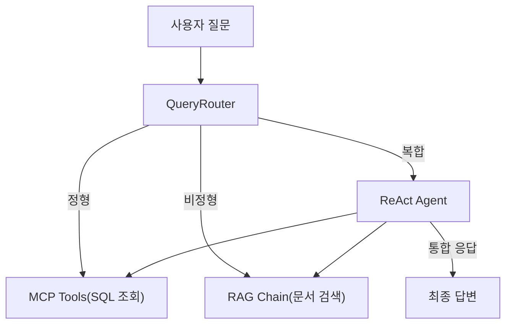
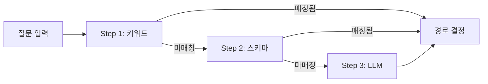
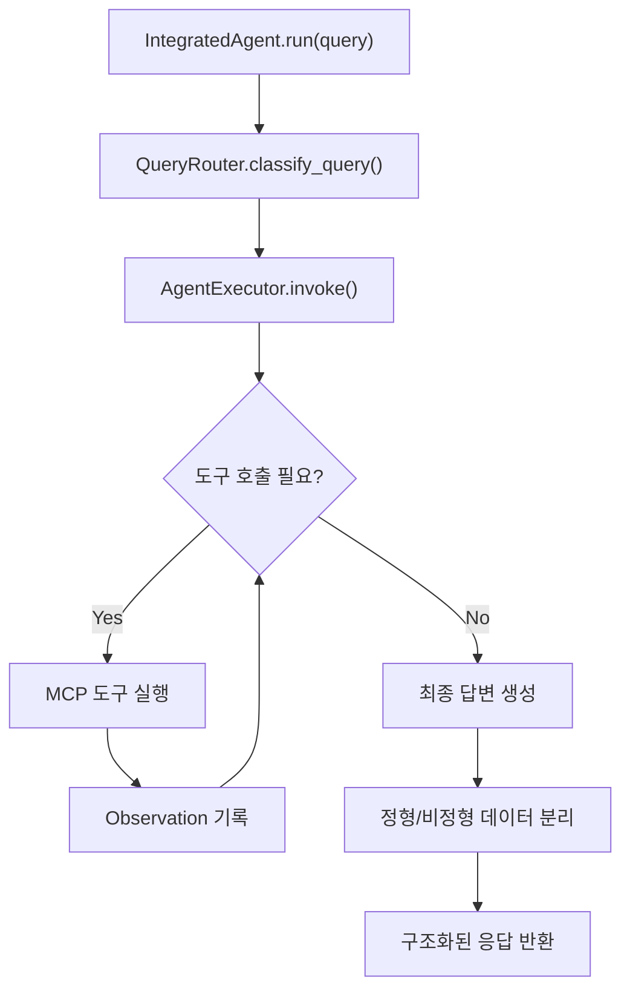

# 8. 정형 MCP + 비정형 RAG 통합 에이전트

<!-- [GEMINI PROMPT: 08_opening-story]
path: assets/CH08/08_opening-story.png
Warm office illustration: A developer looking at two monitor screens. Left monitor shows a chat bubble with "김철수 사원의 남은 연차는?" and a red X mark. Right monitor shows a PostgreSQL database icon with employee records. The developer has a puzzled expression, with a thought bubble showing "DB + 문서 = ?". Soft warm beige and light blue color palette, friendly cartoon style, clean white background with subtle office elements, no text overlay.
Style: office-illustration-warm
-->

*그림 8-1: RAG 채팅 UI에 정형 데이터 질문이 들어오기 시작한 상황*

CH07에서 완성한 RAG 채팅 UI를 직원들에게 공개한 지 3일째, 메타코딩의 슬랙에 메시지가 쏟아졌습니다. "온보딩 절차 알려줘"나 "보안 정책 설명해줘" 같은 문서 질문은 출처와 함께 정확히 답변했습니다. 하지만 문제는 다른 곳에서 터졌습니다.

"김민준 과장의 남은 연차가 며칠인지 알려줘."

이 질문에 AI 비서는 사내 문서를 뒤진 끝에 "취업규칙 제15조에 따르면 1년 이상 근속 시 15일의 연차가 부여됩니다"라고 답했습니다. 질문자가 원한 것은 김민준 과장의 **실제 잔여 연차 일수** 였는데, AI는 일반 규정을 검색한 것입니다. 연차 잔여 일수는 PostgreSQL 데이터베이스에 있는 **정형 데이터** 이고, 사내 문서에는 없습니다.

더 난감한 질문도 있었습니다. "올해 매출 상위 부서의 복지 정책을 비교해 줘." 이 질문은 매출 데이터(DB)와 복지 정책(문서)을 **모두** 조합해야 답변할 수 있습니다.

이 챕터에서는 다음 세 가지를 구현합니다.

1. **QueryRouter(질문 라우터)** 로 질문을 정형/비정형/복합으로 자동 분류
2. **MCP(Model Context Protocol)** 도구 4종으로 PostgreSQL DB를 직접 조회
3. **ReAct Agent(Reasoning + Acting Agent)** 로 DB 조회 결과와 문서 검색 결과를 통합하여 최종 답변 생성

> **주의: 이전 챕터 실습 환경 정리**
> CH07의 FastAPI 서버가 실행 중이라면 먼저 종료하십시오. 포트가 충돌합니다.
> ```bash
> # 1. Ctrl+C 로 uvicorn 서버 종료
> ```
> 이 챕터에서는 PostgreSQL이 필요합니다. Docker 컨테이너를 시작하십시오.
> ```bash
> docker compose up -d
> ```

---

## 1. 정형/비정형 분리 원칙

### 1.1 질문 유형 분류

AI 비서에 들어오는 질문은 세 가지 유형으로 나뉩니다.

| 유형 | 데이터 위치 | 처리 경로 | 예시 |
|------|-----------|----------|------|
| 정형 | PostgreSQL DB | MCP 도구로 SQL 조회 | "김민준 연차 잔여일수" |
| 비정형 | 사내 문서(PDF/DOCX) | VectorDB + RAG 체인 | "온보딩 절차를 알려줘" |
| 복합 | DB + 문서 | 두 경로를 순차 또는 병렬 실행 | "매출 상위 부서의 복지 정책" |

**정형 데이터** 는 PostgreSQL 테이블에 행과 열로 구조화된 데이터입니다. 직원 번호, 연차 잔여 일수, 매출 금액처럼 정해진 스키마로 저장됩니다. **비정형 데이터** 는 PDF, DOCX 같은 자연어 문서입니다. 정해진 구조 없이 단락과 표가 혼재합니다.

### 1.2 분리 원칙



*그림 8-2: 질문 유형별 처리 경로 분기*

핵심 원칙은 단순합니다. 숫자·통계·목록 질문은 DB로 보내고, 절차·정책·설명 질문은 문서로 보내고, 둘 다 필요하면 순차 실행 후 합칩니다. 이 분기를 자동으로 수행하는 것이 **QueryRouter** 입니다.

> **질문: MCP란 무엇입니까?**
> **MCP(Model Context Protocol)** 는 LLM과 외부 도구·데이터 소스 간의 표준 통신 프로토콜입니다. LLM이 "이 도구를 이 파라미터로 호출하겠다"고 선언하면, 시스템이 실제 DB 조회나 API 호출을 수행하고 결과를 돌려주는 구조입니다. LangChain에서는 `@tool` 데코레이터로 도구를 정의하고, Agent가 필요한 도구를 스스로 선택하여 실행합니다.

---

## 2. 질문 라우팅 전략

QueryRouter는 3단계 전략으로 질문을 분류합니다. 단순한 방법에서 시작하여 점진적으로 정밀한 방법으로 넘어가는 구조입니다.

### 2.1 Step 1 — 규칙 기반 라우팅

가장 빠른 방법은 질문에 포함된 키워드를 확인하는 것입니다. "연차", "매출", "목록" 같은 단어가 있으면 정형으로, "절차", "정책", "온보딩" 같은 단어가 있으면 비정형으로 분류합니다.

핵심 아이디어는 단순합니다. 질문에 "연차", "매출", "목록" 같은 단어가 포함되어 있으면 정형 질문이고, "절차", "정책", "온보딩" 같은 단어가 있으면 비정형 질문입니다. 양쪽 키워드가 모두 포함되면 복합 질문으로 판단합니다.

```python
STRUCTURED_KEYWORDS = ["잔여", "연차", "휴가", "매출", "합계", "목록", "명단", "통계"]
UNSTRUCTURED_KEYWORDS = ["절차", "방법", "어떻게", "규정", "정책", "온보딩", "가이드"]

def _step1_rule_based(self, query: str):
    s_hits = sum(1 for kw in STRUCTURED_KEYWORDS if kw in query)
    u_hits = sum(1 for kw in UNSTRUCTURED_KEYWORDS if kw in query)
    if s_hits > 0 and u_hits > 0:
        return "hybrid"
    if s_hits > 0:
        return "structured"
    if u_hits > 0:
        return "unstructured"
    return None  # 다음 단계로 폴백
```

질문에서 정형·비정형 키워드의 출현 횟수를 비교하여 경로를 결정합니다. 어느 쪽에도 해당하지 않으면 `None`을 반환하여 다음 단계로 판단을 넘깁니다.

### 2.2 Step 2 — 스키마 기반 라우팅

Step 1에서 결론을 내지 못한 경우, DB 테이블의 컬럼명이 질문에 포함되어 있는지 확인합니다. `remaining_days`, `used_days`, `amount`, `emp_no` 같은 컬럼명이 직접 언급되면 정형으로 분류합니다. "remaining_days가 0인 직원은?"처럼 기술적 표현이 포함된 질문에 효과적입니다.

### 2.3 Step 3 — LLM 판단 라우팅

Step 1과 Step 2에서 모두 결론을 내지 못한 모호한 질문은 LLM에게 판단을 위임합니다. LLM에게 `"다음 질문을 structured | unstructured | hybrid 중 하나로 분류하세요"`라는 프롬프트를 전달하고, JSON 응답에서 `route` 값을 추출합니다. 파싱에 실패하면 기본값인 비정형(`unstructured`)으로 처리합니다.

### 2.4 3단계 통합 흐름

세 단계는 **폴백 체인** 으로 연결됩니다.



*그림 8-3: QueryRouter 3단계 폴백 체인*

Step 1은 응답 시간이 1ms 미만이고, Step 3은 LLM 호출이 필요하므로 수 초가 걸립니다. 빠른 방법으로 해결 가능한 질문은 빠르게 처리하고, 모호한 질문만 LLM에게 넘기는 구조입니다.

> 전체 코드: `src/router.py`

---

## 3. 통합 응답 전략

### 3.1 MCP 도구 4종

LLM이 DB를 직접 조회하려면 **도구(Tool)** 가 필요합니다. LangChain의 `@tool` 데코레이터로 4개의 MCP 도구를 정의합니다.

| 도구 | 기능 | 파라미터 |
|------|------|---------|
| `leave_balance` | 직원 연차 잔여 조회 | `emp_no` (번호 또는 이름) |
| `sales_sum` | 매출 합계 조회 | `dept`, `start_date`, `end_date` |
| `list_employees` | 직원 목록 조회 | `dept` (부서 필터) |
| `search_documents` | 사내 문서 벡터 검색 | `query`, `k` |

`leave_balance` 도구를 예로 살펴보겠습니다. `@tool` 데코레이터로 정의하면 LLM이 이 도구를 호출할 수 있습니다. 직원 번호(`E001` 형식)가 전달되면 `emp_no` 컬럼으로 조회하고, 이름이 전달되면 `LIKE` 검색으로 부분 일치를 수행합니다.

> **주의: PostgreSQL 연결은 필수입니다**
> 정형 데이터 도구(`leave_balance`, `sales_sum`, `list_employees`)는 반드시 PostgreSQL에 연결되어야 합니다. DB가 실행 중이 아니면 에러 메시지를 반환합니다. 실습 전에 `docker compose up -d`로 DB를 시작하십시오.

나머지 세 도구(`sales_sum`, `list_employees`, `search_documents`)도 동일한 패턴입니다. 정형 데이터 도구는 PostgreSQL에서 조회하고, `search_documents`는 ChromaDB 벡터 검색 또는 `data/docs/` 키워드 검색으로 사내 문서를 검색합니다.

> 전체 코드: `src/mcp_tools.py`

### 3.2 ReAct Agent — 추론과 실행의 반복

**ReAct(Reasoning + Acting)** 은 LLM이 "먼저 생각하고, 행동하고, 관찰하고, 다시 생각하는" 패턴을 반복하는 에이전트 구조입니다.

복합 질문 "매출 상위 부서의 복지 정책을 비교해 줘"를 예로 들면, ReAct Agent는 다음과 같이 동작합니다.

1. **Thought**: "매출 상위 부서를 먼저 확인해야 합니다. `sales_sum` 도구를 호출합니다."
2. **Action**: `sales_sum(dept="")` 실행 → 영업부가 1위
3. **Observation**: 영업부 매출 합계 13,300,000원
4. **Thought**: "영업부 복지 정책을 찾아야 합니다. `search_documents`를 호출합니다."
5. **Action**: `search_documents(query="영업부 복지 정책")` 실행
6. **Observation**: 워케이션 지원 제도, 성과급 기준 등 문서 발견
7. **Final Answer**: 두 결과를 종합하여 자연어 답변 생성

### 3.3 IntegratedAgent 동작 구조

`IntegratedAgent` 클래스는 QueryRouter와 AgentExecutor를 하나로 묶는 통합 컨트롤러입니다. 내부 동작을 흐름도로 표현하면 다음과 같습니다.



*그림 8-5: IntegratedAgent 내부 실행 흐름*

`IntegratedAgent`는 초기화 시 QueryRouter와 `create_tool_calling_agent`로 생성한 AgentExecutor를 내장합니다. `run()` 메서드가 호출되면 먼저 QueryRouter로 질문 유형을 분류하고, AgentExecutor가 ReAct 패턴으로 MCP 도구를 반복 실행하여 정보를 수집합니다. `max_iterations=10`으로 무한 루프를 방지하며, 중간 단계(어떤 도구를 어떤 파라미터로 호출했는지)를 모두 기록하므로 에이전트의 판단 과정을 투명하게 확인할 수 있습니다. 최종 응답에는 답변 텍스트, 질문 유형, 정형 데이터(DB 조회 결과), 비정형 데이터(문서 검색 결과), 실행 단계가 분리되어 포함됩니다.

> 전체 코드: `src/agent.py`

---

## 4. 대표 질문 시나리오 10개

통합 에이전트가 다양한 질문 유형을 처리할 수 있는지 검증하기 위해 10개의 대표 시나리오를 정의합니다. 이 시나리오는 이후 CH10 평가 체계의 기준선이 됩니다.

### 4.1 정형 시나리오 (4개)

| # | 질문 | 경로 | 사용 도구 | 기대 응답 |
|---|------|------|----------|----------|
| 1 | "김민준 연차 잔여일수 알려줘" | structured | `leave_balance` | 잔여 일수 숫자 |
| 2 | "영업부 11월 매출 합계가 얼마야?" | structured | `sales_sum` | 매출 합계 금액 |
| 3 | "개발부 직원 목록 보여줘" | structured | `list_employees` | 직원 이름·직급 목록 |
| 4 | "전체 직원 부서별 통계" | structured | `list_employees` | 부서별 인원 수 |

### 4.2 비정형 시나리오 (4개)

| # | 질문 | 경로 | 사용 도구 | 기대 응답 |
|---|------|------|----------|----------|
| 5 | "신입사원 온보딩 절차가 어떻게 되나요?" | unstructured | `search_documents` | 온보딩 절차 설명 + 출처 |
| 6 | "보안 정책에 대해 설명해줘" | unstructured | `search_documents` | 보안 규정 내용 + 출처 |
| 7 | "워케이션 제도 안내해줘" | unstructured | `search_documents` | 워케이션 지원 내용 + 출처 |
| 8 | "신규 서비스 런칭 전략 알려줘" | unstructured | `search_documents` | 런칭 전략 문서 내용 + 출처 |

### 4.3 복합 시나리오 (2개)

| # | 질문 | 경로 | 사용 도구 | 기대 응답 |
|---|------|------|----------|----------|
| 9 | "매출 상위 부서의 워케이션 규정은?" | hybrid | `sales_sum` + `search_documents` | 매출 순위 + 워케이션 정책 |
| 10 | "정시우 연차 현황과 연차 사용 규정 알려줘" | hybrid | `leave_balance` + `search_documents` | 잔여 일수 + 규정 내용 |


---

## 5. 실습 환경 준비와 서버 실행

### 5.1 의존성 설치

CH02에서 클론한 저장소의 예제 폴더로 이동하여 환경을 구성합니다.

```bash
cd examples/CH08_통합_에이전트_설계
python3.12 -m venv .venv
source .venv/bin/activate   # Windows: .\.venv\Scripts\Activate.ps1
cp .env.example .env
pip install -r requirements.txt
```

> CH07 대비 추가된 주요 의존성: `psycopg2-binary`(PostgreSQL 클라이언트), `pypdf`·`python-docx`·`openpyxl`(원본 문서 파싱), `langchain-ollama`·`langchain-openai`(LLM 연동)

### 5.2 Ollama 모델 다운로드 — 왜 llama3.1:8b인가

CH08의 ReAct Agent는 LLM이 **스스로 도구를 선택하고 호출** 해야 합니다. 이를 **Tool Calling**(함수 호출)이라고 합니다. 모든 LLM이 이 기능을 지원하는 것은 아닙니다.

| 모델 | Tool Calling | 한국어 품질 | 비고 |
|------|:----------:|:--------:|------|
| `deepseek-r1:8b` | **미지원** | 우수 | CH07에서 사용. 텍스트 생성 전용 |
| `llama3.1:8b` | **지원** | 양호 | CH08에서 사용. Meta 공식 모델 |

CH07의 RAG Chain은 LLM이 "주어진 문서를 읽고 답변만 생성"하면 되므로 Tool Calling이 필요 없었습니다. 그러나 CH08의 ReAct Agent는 "이 질문에는 `leave_balance` 도구를 호출해야 한다"고 LLM이 판단하고 실제로 함수를 호출해야 합니다. 이 과정이 Tool Calling입니다.

`llama3.1:8b` 은 Meta가 공식 지원하는 Tool Calling 모델이며, 약 4.9GB의 디스크 공간이 필요합니다.

```bash
ollama pull llama3.1:8b
```

다운로드가 완료되면 `.env` 파일에서 모델이 올바르게 설정되어 있는지 확인합니다.

```bash
# .env 파일 확인
cat .env | grep OLLAMA_MODEL
# 출력: OLLAMA_MODEL=llama3.1:8b
```

> **주의: .env 파일의 OLLAMA_MODEL 값을 반드시 확인하십시오**
> `.env.example` 을 복사하면 기본값이 `llama3.1:8b` 로 설정되어 있습니다. CH07에서 `.env` 를 복사해왔다면 `deepseek-r1:8b` 로 되어 있을 수 있으므로 반드시 `llama3.1:8b` 로 변경하십시오. Tool Calling을 지원하지 않는 모델을 사용하면 에이전트가 도구를 호출하지 못하고 오류가 발생합니다.

### 5.3 서버 실행과 초기 화면

웹 UI를 포함한 전체 시스템을 실행합니다.

```bash
uvicorn app.main:app --reload --port 8008
```

브라우저에서 `http://localhost:8008/chat` 에 접속합니다. CH07과 동일한 라이트 테마 UI에 두 가지 기능이 추가되어 있습니다.

1. **에이전트 모드 토글**: 상단의 ON/OFF 스위치로 에이전트 모드와 일반 RAG 모드를 전환합니다. 에이전트 모드에서는 ReAct Agent가 도구를 자율적으로 선택하고, 일반 모드에서는 CH07의 단순 RAG 검색만 수행합니다.
2. **예시 질문 카드**: 정형·비정형·복합 세 카테고리의 예시 질문이 카드로 표시됩니다. 클릭하면 입력창에 자동으로 복사됩니다.


*그림 8-6: 에이전트 모드가 활성화된 채팅 UI — 정형/비정형/복합 예시 질문이 카드로 제공된다*

`/api/chat` 엔드포인트는 `use_agent=True`이면 `IntegratedAgent`를 통해 질문 분류 → 도구 호출 → 답변 생성까지 수행합니다. `False`이면 CH07의 단순 RAG 검색만 수행합니다. 응답에는 질문 유형(`structured/unstructured/hybrid`)과 중간 단계를 포함하여 채팅 UI에서 에이전트의 판단 과정을 표시합니다.

이제 이 UI에서 10개 시나리오 중 대표 질문 3개를 직접 실행하며 에이전트가 어떻게 동작하는지 확인합니다.

---

## 6. 시나리오별 실습

이 절에서는 10개 시나리오 중 각 유형별 대표 1개씩, 총 3개를 웹 UI에서 직접 실습합니다.

### 6.1 정형 시나리오 — "김민준 연차 잔여일수 알려줘"

채팅창에 `김민준 연차 잔여일수 알려줘` 를 입력하고 Enter를 누릅니다.


*그림 8-7: 정형 질문 — leave_balance 도구가 DB에서 연차 잔여일수를 조회하여 답변한다*

**에이전트 동작 과정:**

1. QueryRouter가 "연차", "잔여일수" 키워드를 감지하여 `structured` 로 분류합니다.
2. ReAct Agent가 `leave_balance` 도구를 선택하고, `"김민준"` 을 인자로 전달합니다.
3. 도구가 PostgreSQL에서 김민준의 연차 정보를 조회합니다.
4. 에이전트가 조회 결과를 자연어로 정리하여 "잔여일수는 8일입니다"라고 답변합니다.

응답 메시지 아래의 **[정형]** 배지는 이 질문이 정형 경로로 처리되었음을 의미합니다. "근거 보기"를 클릭하면 DB 조회 원본 데이터를 확인할 수 있습니다.

### 6.2 비정형 시나리오 — "보안 정책에 대해 설명해줘"

채팅창에 `보안 정책에 대해 설명해줘` 를 입력합니다.


*그림 8-8: 비정형 질문 — search_documents 도구가 사내 문서에서 보안 정책을 검색하여 답변한다*

**에이전트 동작 과정:**

1. QueryRouter가 "보안", "정책" 키워드를 감지하여 `unstructured` 로 분류합니다.
2. ReAct Agent가 `search_documents` 도구를 선택하고, `"보안 정책"` 을 검색어로 전달합니다.
3. 도구가 ChromaDB(또는 `data/docs/`)에서 보안 관련 문서를 검색합니다.
4. 에이전트가 검색 결과를 정리하여 망분리 환경, 비밀번호 규칙 등을 답변합니다.

**[비정형]** 배지와 함께 "근거 보기"가 표시됩니다. 아코디언을 펼치면 검색된 문서의 원본 내용과 출처를 확인할 수 있습니다.

### 6.3 복합 시나리오 — "매출 상위 부서의 워케이션 규정은?"

채팅창에 `매출 상위 부서의 워케이션 규정은?` 을 입력합니다. 이 질문은 매출 데이터(DB)와 워케이션 규정(문서)을 모두 필요로 합니다.


*그림 8-9: 복합 질문 — sales_sum과 search_documents 두 도구를 모두 호출하여 통합 답변한다*

**에이전트 동작 과정 (ReAct 사이클 추적):**

```
[Reasoning] "매출 상위 부서"는 DB 조회가 필요하다. sales_sum을 먼저 호출하자.
[Acting]    sales_sum 도구 호출 → 영업부 매출 합계 반환
[Reasoning] 이제 "워케이션 규정"은 문서 검색이 필요하다. search_documents를 호출하자.
[Acting]    search_documents("워케이션 규정") → 워크플로 규정 문서 발견
[Reasoning] 두 결과를 합쳐 최종 답변을 만들 수 있다.
[Acting]    최종 답변 생성: "매출 상위 부서인 영업부의 워케이션 규정은..."
```

**[복합]** 배지가 두 경로를 모두 사용했음을 나타냅니다. "근거 보기"를 펼치면 DB 조회 결과와 문서 검색 결과가 함께 표시됩니다. 이것이 바로 CH07의 단순 RAG로는 불가능했던, 정형+비정형 통합 응답입니다.

> **참고: 10개 시나리오가 CH10 평가의 기준선입니다**
> 이 10개 시나리오(정형 4 + 비정형 4 + 복합 2)의 응답 품질이 CH10에서 RAG 튜닝 전의 기준선(Baseline)이 됩니다. CH10에서 튜닝 기법을 적용한 후 동일 시나리오로 개선율을 측정합니다.

---

## 7. 정리하며

<!-- [GEMINI PROMPT: 08_before-after]
path: assets/CH08/08_before-after.png
A minimalist black and white technical diagram with a strict 16:9 aspect ratio on a solid white background. No shading, no 3D effects, only clean thin line art. Simple before/after comparison: LEFT side labeled "Before (RAG만)" shows a chat icon with "비정형 질문만 가능" and "4/10 정답" with a red down-arrow. RIGHT side labeled "After (RAG + MCP)" shows a chat icon with "정형+비정형+복합" and "10/10 정답" with a green up-arrow. Center arrow pointing right labeled "통합 에이전트". Clean flat design, balanced layout.
Style: before-after-infographic
-->

*그림 8-10: RAG 전용에서 RAG + MCP 통합 에이전트로 전환한 효과*

메타코딩이 직원들의 다양한 질문에 모두 답변할 수 있게 되기까지의 과정을 정리합니다.

| 지표 | Before (RAG만) | After (RAG + MCP) |
|------|----------------|-------------------|
| 처리 가능한 질문 유형 | 비정형만 (문서 검색) | 정형 + 비정형 + 복합 |
| 10개 시나리오 정답률 | 4/10 (비정형 4개만) | 10/10 (전체 커버) |
| 연차 조회 | 불가능 | DB에서 즉시 조회 |
| 매출 통계 | 불가능 | 부서별·기간별 집계 |
| 복합 질문 | 불가능 | DB + 문서 자동 조합 |

이 챕터에서 배운 핵심 내용을 정리합니다.

- **3단계 질문 라우팅**: 키워드 → 스키마 → LLM 판단 순서로 폴백하여 질문 유형을 분류합니다. 빠른 방법으로 해결 가능한 질문은 빠르게, 모호한 질문은 LLM에게 위임합니다.
- **MCP 도구 4종**: `@tool` 데코레이터로 정의한 도구를 LLM에게 등록하면, LLM이 필요한 도구를 스스로 선택하여 실행합니다. 정형 데이터 도구는 PostgreSQL 연결이 필수이며, Docker Compose로 간편하게 실행할 수 있습니다.
- **ReAct Agent**: Thought → Action → Observation 패턴을 반복하여 복합 질문을 단계적으로 해결합니다. 중간 단계가 모두 기록되므로 에이전트의 판단 과정을 투명하게 확인할 수 있습니다.
- **통합 응답 구조**: 답변과 함께 질문 유형, 정형 데이터, 비정형 데이터, 실행 단계를 분리하여 반환합니다. 채팅 UI에서 이 정보를 시각적으로 구분하여 표시합니다.

---

"김민준 과장의 남은 연차"를 물으면 8일이라는 숫자가 돌아오고, "온보딩 절차"를 물으면 출처와 함께 절차가 설명됩니다. "매출 상위 부서의 워케이션 규정"을 물으면 영업부 매출 집계와 워케이션 문서가 함께 표시됩니다. 10개 시나리오를 모두 통과한 순간, 메타코딩은 AI 비서가 드디어 "쓸 수 있는 수준"에 도달했다고 판단했습니다.

> **실습 환경 정리**
> 이 챕터의 실습이 끝나면 FastAPI 서버와 Docker 컨테이너를 종료하십시오. 다음 챕터에서 동일 포트(5432)를 사용하므로 충돌이 발생할 수 있습니다.
> ```bash
> # 1. Ctrl+C 로 uvicorn 서버 종료
> # 2. Docker 컨테이너 종료
> docker compose down
> ```

하지만 하루 질의가 100건을 넘기면서 새로운 문제가 보이기 시작합니다. LLM 호출이 30초를 넘기는 경우가 생기고, 같은 질문이 반복되어도 매번 LLM을 호출합니다. 에러가 발생해도 로그가 없어 원인을 찾기 어렵습니다. 다음 챕터에서는 이 에이전트를 LangChain 표준 구성으로 정리하고 운영 안정성을 확보합니다.
