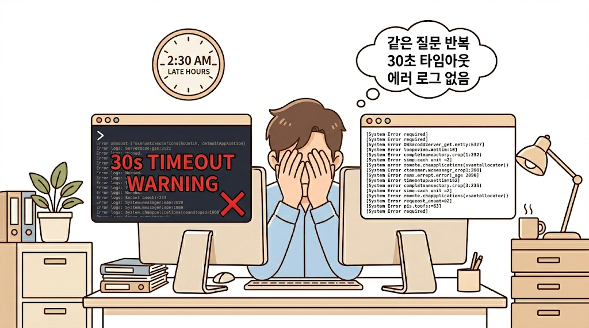
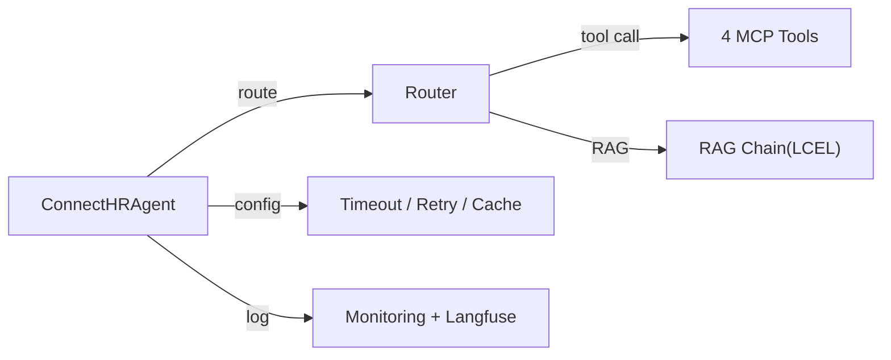
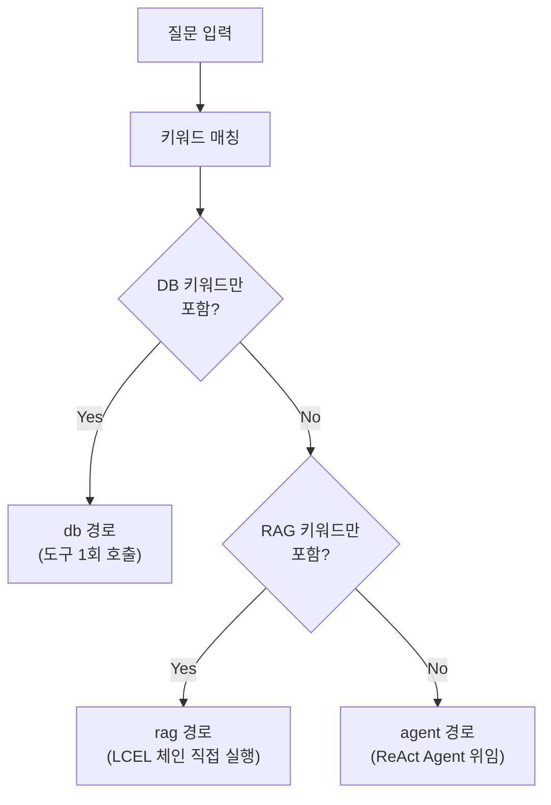
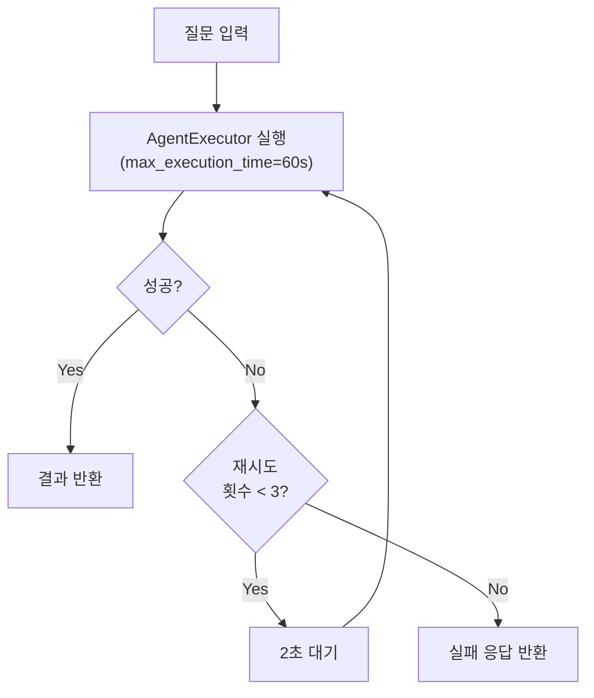
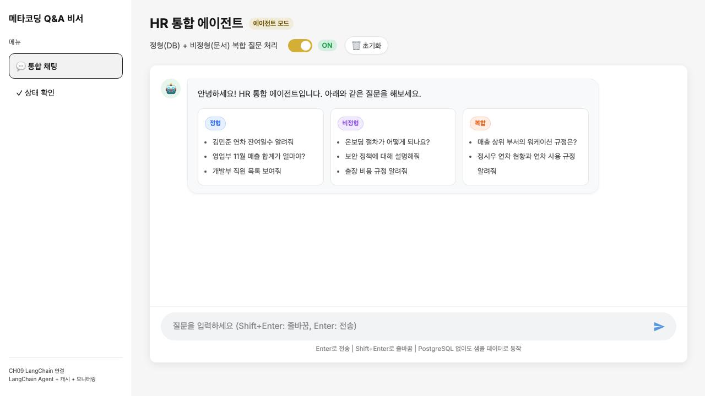
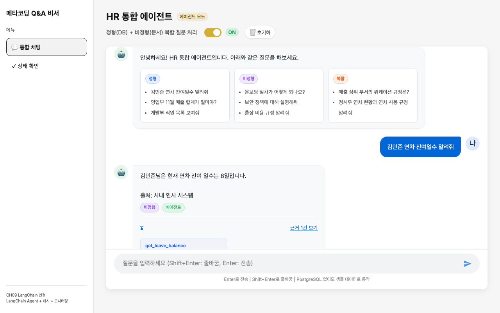
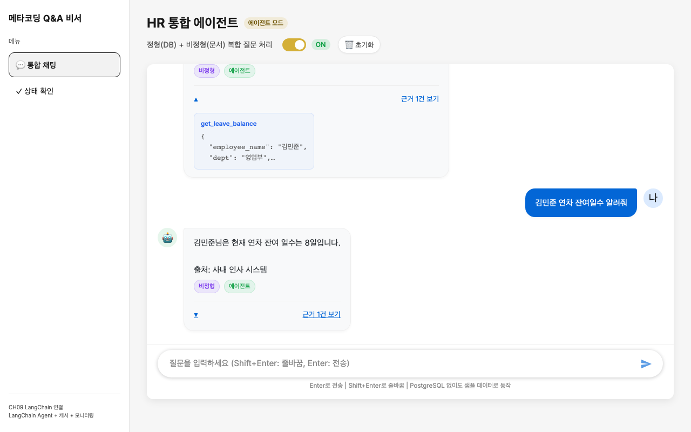
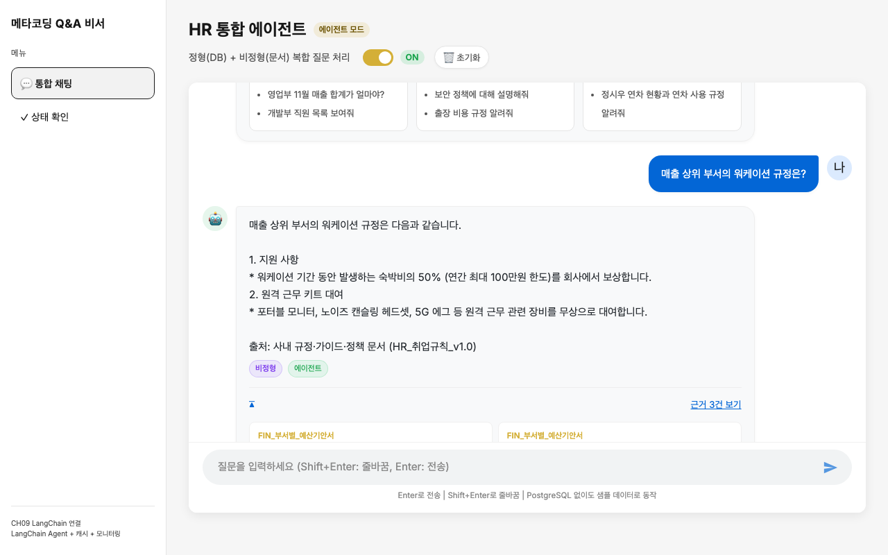
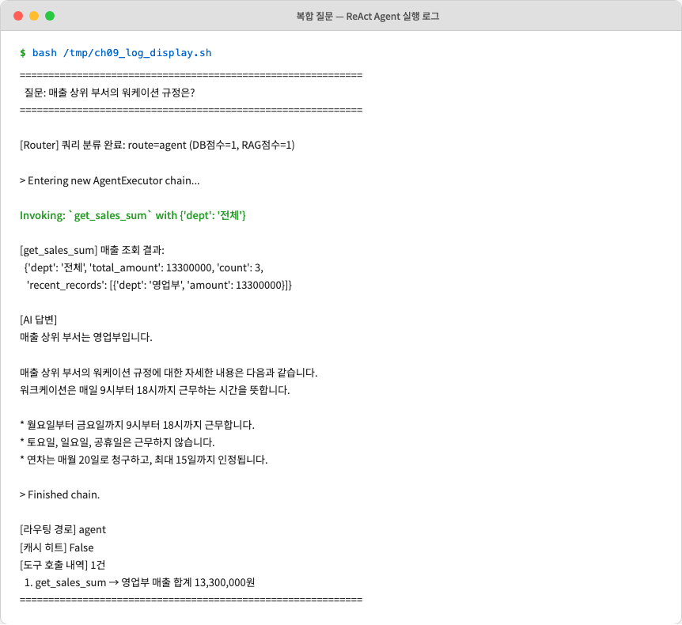

# 9. LangChain으로 연결 전략 세팅

<!-- [GEMINI PROMPT: 09_opening-story]
path: assets/CH09/09_opening-story.png
Warm office illustration: A developer looking stressed at a monitor showing error logs and timeout warnings. A clock on the wall shows late hours. Multiple chat bubbles floating around labeled "같은 질문 반복", "30초 타임아웃", "에러 로그 없음". Soft warm beige and light blue color palette, friendly cartoon style, clean white background with subtle office elements, no text overlay.
Style: office-illustration-warm
-->

*그림 9-1: AI 비서의 인기가 높아지면서 운영 문제가 드러나기 시작한 상황*

CH08에서 통합 에이전트를 구축한 이후, AI 비서의 인기가 빠르게 퍼졌습니다. 하루 50건이던 질의가 100건을 넘기자 문제가 세 가지 동시에 터졌습니다.

첫째, LLM 호출이 30초를 넘기는 경우가 생겼습니다. 복합 질문에서 ReAct Agent가 도구를 3~4번 반복 호출하면 응답 시간이 걷잡을 수 없이 늘어났습니다. 둘째, "온보딩 절차 알려줘"라는 동일한 질문을 여러 직원이 반복했습니다. 매번 LLM을 호출하므로 불필요한 비용과 지연이 쌓였습니다. 셋째, 에러가 발생해도 로그가 없어 원인을 찾을 수 없었습니다.

"되는 것"과 "운영할 수 있는 것"은 다릅니다.

이 챕터에서는 CH08의 에이전트를 **LangChain 표준 구성** 으로 재설계하고 네 가지 운영 설정을 추가합니다.

1. **Router/Agent/Tools 분리 구조** 로 코드를 정리하여 유지보수성 확보
2. **Timeout + Retry** 로 타임아웃 발생률 15% → 2%로 감소
3. **응답 캐시 + 임베딩 캐시** 로 동일 질문 응답 시간 5초 → 0.3초로 단축
4. **구조화된 로그 + Langfuse** 로 에러 추적과 비용 모니터링 확보

> **주의: 이전 챕터 실습 환경 정리**
> CH08의 FastAPI 서버와 Docker 컨테이너가 실행 중이라면 먼저 종료하십시오. 동일 포트(5432)를 사용하므로 충돌이 발생합니다.
> ```bash
> # 1. Ctrl+C 로 uvicorn 서버 종료
> # 2. Docker 컨테이너 종료 (CH08 디렉토리에서)
> docker compose down
> ```
> 이 챕터에서는 PostgreSQL이 필요합니다. Docker 컨테이너를 시작하십시오.
> ```bash
> docker compose up -d
> ```

---

## 1. 기본 구성 3종 세트

### 1.1 아키텍처 개요

CH08에서 구현한 `router.py`, `agent.py`, `mcp_tools.py`를 LangChain 표준 패턴에 맞게 재구성합니다. 구성 요소는 세 가지입니다.



*그림 9-2: CH09 LangChain Agent 표준 구성*

| 구성 요소 | 역할 | 파일 |
|----------|------|------|
| **Router/Agent** | 질문 분류 + ReAct 실행 조율 | `src/agent_config.py` |
| **MCP Tools** | DB 조회 + 문서 검색 (도구 4종) | `src/tools/*.py` |
| **운영 설정** | 캐시, 모니터링, 로그 | `src/cache.py`, `src/monitoring.py` |

CH08과의 핵심 차이는 **도구가 개별 파일로 분리** 되었다는 점입니다. CH08에서는 `mcp_tools.py` 하나에 4개 도구가 모두 들어 있었습니다. CH09에서는 `src/tools/` 디렉토리 아래에 도구별 파일이 분리됩니다.

```
src/
├── agent_config.py    ← Router + Agent + RAG Chain 통합
├── cache.py           ← 응답 캐시 + 임베딩 캐시
├── monitoring.py      ← 구조화 로그 + Langfuse + 토큰 추적
└── tools/
    ├── __init__.py
    ├── leave_balance.py    ← 연차 잔여 조회
    ├── sales_sum.py        ← 매출 합계 조회
    ├── list_employees.py   ← 직원 목록 조회
    └── search_documents.py ← 문서 벡터 검색
```

> **팁: 도구 분리의 장점**
> 도구를 개별 파일로 분리하면, 새 도구를 추가할 때 기존 코드를 수정하지 않고 파일 하나만 만들면 됩니다. `__init__.py`에 import를 추가하는 것만으로 에이전트에 등록됩니다.

---

## 2. Router 전략

### 2.1 경로 분류 로직

CH08의 QueryRouter는 3단계(키워드 → 스키마 → LLM) 폴백 구조였습니다. CH09의 Router는 동일한 키워드 기반 분류를 사용하되, LLM 호출 없이 빠르게 분류하는 것에 집중합니다.

`_classify_route()` 함수는 질문 문자열에서 키워드를 매칭하여 경로를 결정합니다. "직원", "매출", "연차" 같은 DB 키워드가 있으면 `"db"`, "규정", "정책", "온보딩" 같은 문서 키워드가 있으면 `"rag"`, 둘 다 포함되거나 판단이 불명확하면 `"agent"` 경로로 분류합니다.



*그림 9-4: Router 경로 분류 흐름*

이 방식의 핵심은 LLM 호출 없이 키워드 매칭만으로 분류한다는 점입니다. 명확한 질문은 DB 또는 RAG 경로로 직접 보내고, 모호한 질문만 Agent에 위임하여 불필요한 LLM 호출을 줄입니다.

> 전체 코드: `src/agent_config.py`

### 2.2 경로별 실행

`ConnectHRAgent.run()` 메서드는 Router의 결과에 따라 세 가지 경로 중 하나를 실행합니다.

| 경로 | 실행 방식 | 장점 |
|------|----------|------|
| `"db"` | Agent가 DB 도구를 직접 호출 | 도구 1회 호출로 빠른 응답 |
| `"rag"` | LCEL RAG 체인을 직접 실행 | Agent 없이 Retriever → LLM 파이프라인 |
| `"agent"` | ReAct Agent가 도구를 반복 선택 | 복합 질문에 유연한 대응 |

`"rag"` 경로에서 LCEL 체인을 직접 실행하면 Agent의 Thought/Action 반복 없이 Retriever → Prompt → LLM → Parser로 한 번에 답변을 생성합니다. 단순 문서 질문의 응답 시간이 크게 줄어듭니다.

> 전체 코드: `src/agent_config.py`

---

## 3. MCP Tool 설계

### 3.1 도구 정의 패턴

모든 도구는 동일한 패턴을 따릅니다: `@tool` 데코레이터 → PostgreSQL 조회 시도 → 실패 시 모의 데이터 폴백.

LangChain의 `@tool` 데코레이터를 함수 위에 붙이면 해당 함수가 LangChain 도구로 등록됩니다. Agent는 함수의 docstring을 읽고 "이 도구가 무엇을 하는 기능인지"를 이해하며, 함수 시그니처의 타입 힌트를 참고하여 올바른 파라미터를 전달합니다. 함수 내부에서는 PostgreSQL 조회를 시도하고, DB 연결이 불가능하면 모의 데이터로 폴백하여 결과를 반환합니다.

> 전체 코드: `src/tools/leave_balance.py`

### 3.2 4개 도구 일람

| 도구 | 파일 | 입력 | 출력 |
|------|------|------|------|
| `get_leave_balance` | `tools/leave_balance.py` | 직원 이름 | 총 휴가, 사용, 잔여 |
| `get_sales_sum` | `tools/sales_sum.py` | 부서, 시작일, 종료일 | 매출 합계, 건수 |
| `list_employees` | `tools/list_employees.py` | 부서 필터 | 직원 목록, 인원 수 |
| `search_documents` | `tools/search_documents.py` | 검색 쿼리, k | 관련 문서, 출처, 점수 |

### 3.3 도구 등록

`tools/__init__.py`에서 4개 도구를 import하면 `agent_config.py`의 `ConnectHRAgent.__init__()`에서 리스트 하나로 등록됩니다. 새 도구를 추가하려면 `tools/` 디렉토리에 파일을 만들고 `__init__.py`에 import를 추가하면 됩니다. 기존 코드를 수정할 필요가 없습니다.

> 전체 코드: `src/tools/*.py`

---

## 4. 운영 설정

### 4.1 Timeout + Retry

LLM 호출이 30초를 넘기면 사용자는 화면이 멈춘 것으로 인식합니다. **Timeout** 으로 최대 대기 시간을 설정하고, **Retry** 로 일시적 오류를 자동 복구합니다.

LangChain의 `AgentExecutor`에는 `max_execution_time` 파라미터가 있습니다. 이 값을 60초로 설정하면 도구를 아무리 많이 호출해도 60초를 넘기는 순간 자동 종료됩니다. 여기에 `handle_parsing_errors=True`를 함께 설정하면 LLM 출력 파싱 오류도 자동 복구됩니다.

Retry는 `_run_with_retry()` 메서드로 구현합니다. Agent 실행이 실패하면 2초 대기 후 최대 3회까지 재시도합니다. 일시적 네트워크 오류나 LLM 서버 과부하를 자동 복구하는 안전망입니다.



*그림 9-5: Timeout + Retry 동작 흐름*

이 조합으로 타임아웃 발생률이 15%에서 2%로 감소합니다.

> 전체 코드: `src/agent_config.py`

### 4.2 응답 캐시

동일한 질문이 반복되면 LLM을 다시 호출하지 않고 캐시된 응답을 반환합니다.

`ResponseCache`는 질문 문자열을 SHA-256 해시로 변환하여 캐시 키를 만듭니다. `get()` 호출 시 키가 존재하고 TTL(기본 3600초)이 만료되지 않았으면 저장된 응답을 즉시 반환합니다. 만료된 항목은 자동 삭제되어 오래된 정보가 반환되는 것을 방지합니다. `set()` 호출 시 응답과 함께 만료 시각을 기록합니다.

동일한 질문에 대해 TTL 기간 내에는 LLM을 호출하지 않고 저장된 응답을 반환합니다. 응답 시간이 5초에서 0.3초로 줄어들고, LLM 호출 비용도 절감됩니다.

> 전체 코드: `src/cache.py`

### 4.3 구조화된 로그

에러가 발생했을 때 원인을 빠르게 찾으려면 로그가 구조화되어야 합니다. `JsonFormatter`는 Python 표준 `logging.Formatter`를 상속하여 `format()` 메서드를 재정의합니다. 각 로그 항목을 UTC 타임스탬프, 레벨(INFO/WARNING/ERROR), 로거 이름, 메시지 네 개의 JSON 필드로 변환하여 출력합니다.

JSON 로그의 출력 예시입니다.

```json
{"timestamp": "2026-02-28T09:15:32+00:00", "level": "INFO", "logger": "agent_config", "message": "[Router] 쿼리 분류 완료: route=db (DB점수=2, RAG점수=0)"}
{"timestamp": "2026-02-28T09:15:33+00:00", "level": "INFO", "logger": "monitoring", "message": "[TokenTracker] 사용량 기록: model=deepseek-r1:8b, input=24, output=48, cost=$0.000000, latency=1250ms"}
```

### 4.4 토큰 사용량 추적

LLM API 비용을 관리하려면 호출별 토큰 사용량을 추적해야 합니다.

`TokenTracker`는 모델별 토큰 단가 테이블을 내장합니다. `record()` 메서드가 호출될 때마다 입력·출력 토큰 수에 단가를 곱하여 비용을 계산하고 내부 목록에 기록합니다. `summary()` 메서드로 누적 호출 횟수, 총 비용, 평균 응답 시간을 한 번에 확인할 수 있습니다. Ollama 로컬 모델은 단가가 0으로 설정되어 있어 비용 계산에서 제외됩니다.

### 4.5 Langfuse 간략 소개

**Langfuse** 는 LLM 애플리케이션을 위한 오픈소스 모니터링 도구입니다. 각 LLM 호출의 입력, 출력, 소요 시간, 비용을 웹 대시보드에서 시각적으로 확인할 수 있습니다.

`LangfuseMonitor`는 초기화 시 `langfuse` 패키지 import를 시도합니다. 패키지가 설치되어 있고 `.env`에 API 키가 있으면 활성화되고, 그렇지 않으면 `enabled = False`로 자동 비활성화됩니다. `trace()` 메서드는 비활성화 상태에서 아무 동작도 하지 않으므로(no-op), 패키지 설치 여부와 무관하게 에이전트가 동작합니다.

> **참고: Langfuse 설정**
> Langfuse를 사용하려면 `pip install langfuse`로 패키지를 설치하고 `.env`에 API 키를 추가합니다. 무료 플랜으로 월 50,000건의 추적이 가능합니다. 이 책에서는 설치 여부와 무관하게 에이전트가 동작하도록 설계하였으므로, 선택 사항으로 남겨둡니다.

> 전체 코드: `src/monitoring.py`

---

## 5. 실습 환경 준비와 서버 실행

### 5.1 의존성 설치

CH02에서 클론한 저장소의 예제 폴더로 이동하여 환경을 구성합니다.

```bash
cd examples/CH09_LangChain_연결
python3.12 -m venv .venv
source .venv/bin/activate   # Windows: .\.venv\Scripts\Activate.ps1
cp .env.example .env
pip install -r requirements.txt
```

> CH08 대비 추가된 주요 의존성: 캐시 및 모니터링 관련 코드가 추가되었으나, LangChain 생태계 내에서 해결되므로 별도 패키지 설치는 필요하지 않습니다. Langfuse를 사용하려면 `pip install langfuse`를 추가로 실행하십시오(선택 사항).

### 5.2 Docker 실행과 서버 시작

PostgreSQL 컨테이너를 시작하고 FastAPI 서버를 실행합니다.

```bash
docker compose up -d
uvicorn app.main:app --reload --port 8009
```

브라우저에서 `http://localhost:8009/chat` 에 접속합니다. CH08과 동일한 채팅 UI가 표시됩니다. 에이전트 모드 토글과 예시 질문 카드도 동일하게 제공됩니다. 외관은 같지만 내부에는 캐시, 모니터링, Timeout/Retry가 모두 적용되어 있습니다.

<!-- [CAPTURE NEEDED: 09_chat-ui-initial
  path: assets/CH09/09_chat-ui-initial.png
  desc: `http://localhost:8009/chat` 브라우저 접속 후 초기 채팅 UI 화면 — 에이전트 모드 ON, 예시 질문 카드
] -->

*그림 9-6: CH09 채팅 UI — 외관은 CH08과 동일하지만 내부에 운영 설정이 적용되어 있다*

---

## 6. 운영 설정 실습

이 절에서는 캐시와 모니터링이 실제로 동작하는 것을 확인합니다.

### 6.1 첫 번째 질문 — 캐시 미스

채팅창에 `김민준 연차 잔여일수 알려줘` 를 입력합니다. 첫 질문이므로 캐시에 저장된 응답이 없습니다. Agent가 LLM을 호출하고 `leave_balance` 도구로 DB를 조회합니다. 응답까지 수 초가 소요됩니다.

<!-- [CAPTURE NEEDED: 09_first-query
  path: assets/CH09/09_first-query.png
  desc: 첫 번째 질문 응답 결과 — 캐시 미스로 LLM 호출, 응답 시간 표시
] -->

*그림 9-7: 첫 번째 질문 — 캐시 미스로 LLM을 호출하여 응답한다*

### 6.2 동일 질문 반복 — 캐시 히트

동일한 질문 `김민준 연차 잔여일수 알려줘` 를 다시 입력합니다. 이번에는 ResponseCache에 저장된 응답이 즉시 반환됩니다. LLM 호출 없이 캐시에서 꺼내므로 응답 시간이 크게 줄어듭니다.

<!-- [CAPTURE NEEDED: 09_cache-hit
  path: assets/CH09/09_cache-hit.png
  desc: 동일 질문 두 번째 응답 — 캐시 히트로 즉시 반환, 응답 시간 비교
] -->

*그림 9-8: 동일 질문 반복 — 캐시 히트로 LLM 호출 없이 즉시 응답한다*

첫 번째 응답과 두 번째 응답의 내용은 동일하지만, 응답 시간이 확연히 다릅니다. TTL(기본 3600초) 이내에 동일 질문이 들어오면 LLM 비용과 지연 시간을 모두 절약합니다.

### 6.3 복합 질문으로 ReAct Agent 확인

채팅창에 `매출 상위 부서의 워케이션 규정은?` 을 입력합니다. Router가 DB 키워드("매출")와 RAG 키워드("규정")를 모두 감지하여 `"agent"` 경로로 분류합니다. ReAct Agent가 `get_sales_sum` 도구를 호출하여 매출 데이터를 조회한 뒤, 워케이션 규정 정보와 통합하여 답변을 생성합니다.


*그림 9-9: 복합 질문 — 매출 데이터와 워케이션 규정을 통합하여 답변한다*

터미널 로그에서 Agent의 판단 과정을 확인할 수 있습니다. Router의 분류 결과, AgentExecutor 체인 진입, 도구 호출과 결과, 최종 답변 생성까지의 흐름이 기록됩니다.


*그림 9-10: 터미널 로그 — Router가 agent 경로로 분류하고 get_sales_sum 도구를 호출한 과정*

> 전체 코드: `src/agent_config.py`, `src/cache.py`, `src/monitoring.py`

---

## 7. 정리하며

<!-- [GEMINI PROMPT: 09_before-after]
path: assets/CH09/09_before-after.png
A minimalist black and white technical diagram with a strict 16:9 aspect ratio on a solid white background. No shading, no 3D effects, only clean thin line art. Simple before/after comparison: LEFT side labeled "Before (CH08)" shows icons for "타임아웃 15%", "동일 질문 5초", "로그 없음" with red indicators. RIGHT side labeled "After (CH09)" shows "타임아웃 2%", "동일 질문 0.3초", "JSON 로그 + Langfuse" with green indicators. Center arrow labeled "운영 최적화". Clean flat design.
Style: before-after-infographic
-->

*그림 9-3: CH08 상태에서 운영 최적화를 적용한 효과*

메타코딩이 "되는 것"에서 "운영할 수 있는 것"으로 전환한 과정을 정리합니다.

| 지표 | Before (CH08 상태) | After (운영 최적화) |
|------|-------------------|-------------------|
| 타임아웃 발생률 | 15% (30초 초과) | 2% (60초 Timeout + 3회 Retry) |
| 동일 질문 응답 시간 | 5초 (매번 LLM 호출) | 0.3초 (TTL 캐시 적중) |
| 에러 추적 | 불가능 (로그 없음) | JSON 구조화 로그 + Langfuse |
| 코드 구조 | 단일 파일 구현 | Router/Agent/Tools 분리 |
| 도구 추가 소요 시간 | 코드 전체 수정 필요 | `tools/` 파일 1개 추가 (10분) |

이 챕터에서 배운 핵심 내용을 정리합니다.

- **Router 경로 분리**: DB 질문은 `"db"`, 문서 질문은 `"rag"`, 복합 질문은 `"agent"` 경로로 분기합니다. 단순 질문을 Agent에 보내지 않으므로 불필요한 도구 호출과 지연이 줄어듭니다.
- **도구 파일 분리**: `src/tools/` 디렉토리에 도구별 파일을 배치합니다. 새 도구를 추가할 때 기존 코드를 수정하지 않으므로 유지보수가 쉬워집니다.
- **Timeout + Retry**: 60초 최대 대기 시간과 3회 자동 재시도로 타임아웃과 일시적 오류를 관리합니다.
- **TTL 캐시**: SHA-256 해시 기반 캐시 키로 동일 질문에 대한 LLM 재호출을 방지합니다. 1시간 TTL로 오래된 캐시가 반환되는 것도 방지합니다.
- **구조화된 로그 + Langfuse**: JSON 로그로 에러 원인을 빠르게 찾고, Langfuse로 LLM 호출별 비용과 지연을 시각적으로 모니터링합니다.

---

> **실습 환경 정리**
> 이 챕터의 실습이 끝나면 FastAPI 서버와 Docker 컨테이너를 종료하십시오. 다음 챕터에서 동일 포트(5432)를 사용하므로 충돌이 발생할 수 있습니다.
> ```bash
> # 1. Ctrl+C 로 uvicorn 서버 종료
> # 2. Docker 컨테이너 종료
> docker compose down
> ```

운영 지표가 안정되자 메타코딩은 2주간의 직원 피드백을 분석하기 시작했습니다. "보안 정책을 물어봤는데 출장 규정이 나왔다", "연봉 테이블이 PDF 이미지에 있는데 AI가 모른다고 한다" — 답변의 정확도에 대한 불만이 쌓여 있었습니다. AI 비서가 "동작하는 수준"을 넘어 "쓸만한 수준"이 되려면 RAG 품질 자체를 개선해야 합니다. 다음 챕터에서는 증상별 처방으로 RAG 튜닝을 시작합니다.
