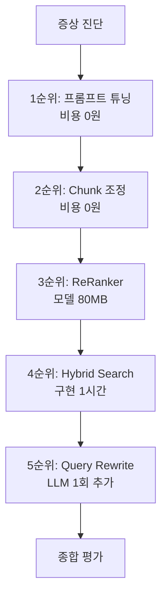
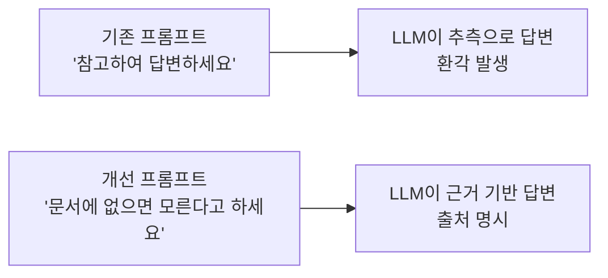
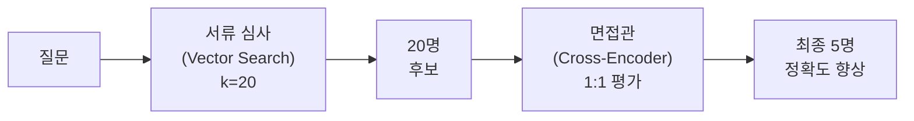
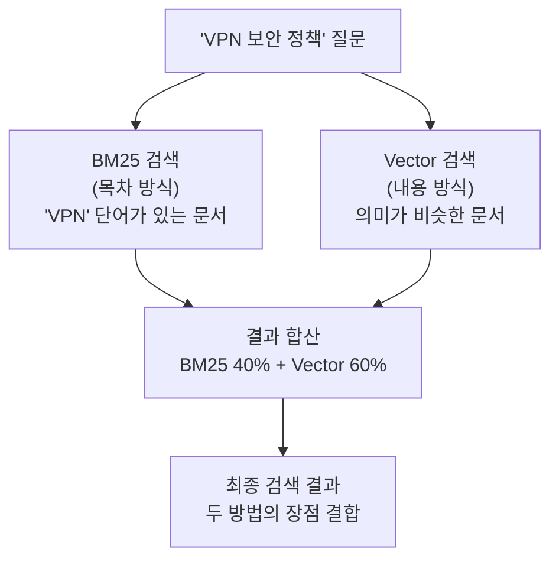
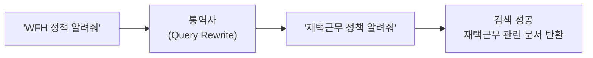
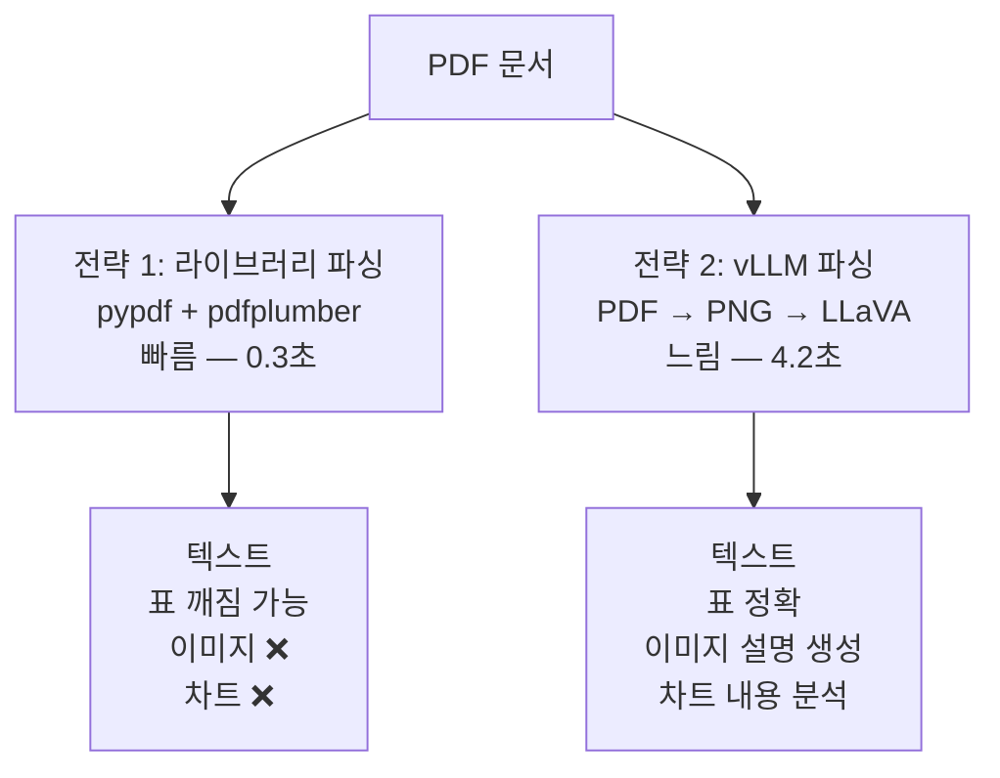
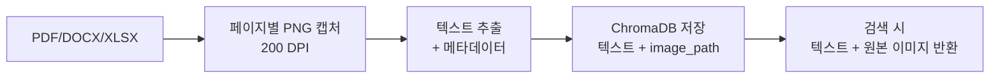
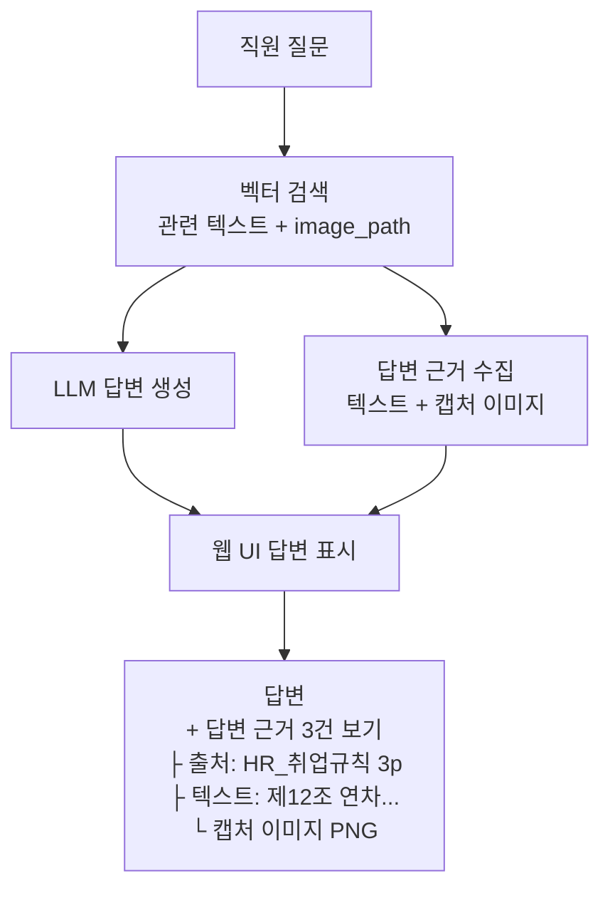

# 10. RAG 튜닝 — 되는 수준에서 쓸만한 수준으로

<!-- [GEMINI PROMPT: 10_opening-story]
path: assets/CH10/10_opening-story.png
Warm office illustration: A developer reading feedback sticky notes on a wall. Notes say "보안 정책 물어봤는데 출장 규정이 나왔어요", "PDF 이미지 표를 모른대요", "옛날 버전 답변이 나와요". The developer has a determined expression, holding a notebook labeled "증상별 처방". Soft warm beige and light blue color palette, friendly cartoon style, clean white background, no text overlay.
Style: office-illustration-warm
-->

*그림 10-1: 2주간 쌓인 직원 피드백에서 증상별 패턴을 발견한 메타코딩*

AI 비서를 배포한 지 2주가 지났습니다. 메타코딩은 직원들의 피드백을 한데 모아 분석했습니다.

- "보안 정책을 물어봤는데 출장 규정이 나왔습니다." — 관련 없는 문서가 검색됨
- "휴가 규정 질문했는데 옛날 버전 답변이 나왔습니다." — 메타데이터 필터링 미적용
- "재택 물어봤는데 WFH를 인식 못합니다." — 약어와 동의어 처리 부재
- "문서에 없는 내용을 자신 있게 답변합니다." — LLM 환각 발생

불만을 정리하다 보니 **증상별 패턴** 이 보였습니다. 그리고 각 증상에 맞는 처방이 존재합니다. 이 챕터에서는 5가지 처방을 **비용이 적은 순서** 로 하나씩 적용합니다. 각 처방마다 개념을 이해하고, 바로 실습으로 효과를 확인합니다.

> **주의: 이전 챕터 실습 환경 정리**
> CH09의 FastAPI 서버와 Docker 컨테이너가 실행 중이라면 먼저 종료하십시오. 동일 포트(5432)를 사용하므로 충돌이 발생합니다.
> ```bash
> # 1. Ctrl+C 로 uvicorn 서버 종료
> # 2. Docker 컨테이너 종료 (CH09 디렉토리에서)
> docker compose down
> ```
> 이 챕터에서는 PostgreSQL이 필요합니다. Docker 컨테이너를 시작하십시오.
> ```bash
> docker compose up -d
> ```

---

## 1. 증상 진단과 실습 환경 준비

### 1.1 문제 → 처방 매핑

메타코딩은 피드백을 증상별로 분류하고, 각 증상의 원인과 처방을 매핑했습니다.

| 증상 | 원인 | 처방 | 섹션 |
|------|------|------|------|
| 환각이 발생한다 | 프롬프트 규칙 미비 | 프롬프트 튜닝 | 2 |
| 답변이 부정확하다 | 청크 품질이 낮음 | Chunk 튜닝 | 3 |
| 관련 없는 문서가 상위에 올라온다 | 벡터 유사도만으로 부족 | ReRanker | 4 |
| 키워드 질문에 약하다 | 의미 검색만 사용 | Hybrid Search | 5 |
| 약어를 이해 못한다 | 동의어 미처리 | Query Rewrite | 6 |



*그림 10-2: 튜닝 우선순위 — 비용이 적은 순서로 적용한다*

핵심 원칙은 **비용이 적은 처방부터 시도** 하는 것입니다. 프롬프트 한 줄 수정(비용 0원)부터 시작하여, 효과가 부족할 때만 다음 단계로 넘어갑니다. 모든 기법을 한꺼번에 적용하면 어떤 처방이 효과를 낸 것인지 알 수 없습니다.

### 1.2 실습 환경 준비

이 챕터에서는 개념을 설명한 직후 바로 실습합니다. 먼저 환경을 구성합니다.

```bash
cd examples/CH10_RAG_튜닝
python3.12 -m venv .venv
source .venv/bin/activate   # Windows: .\.venv\Scripts\Activate.ps1
cp .env.example .env
pip install -r requirements.txt
```

> CH09 대비 추가된 주요 의존성: `rank-bm25`(Hybrid Search), `sentence-transformers`(Cross-Encoder ReRanker), `langchain-experimental`(Semantic Chunker). `sentence-transformers`는 PyTorch를 포함하므로 설치에 1~3분이 소요될 수 있습니다.

이 챕터의 모든 실습은 같은 질문으로 효과를 비교합니다: **"보안 정책에서 USB 사용 규정을 알려줘"**. CH09까지는 이 질문에 출장 규정이나 보안 서약서 같은 관련 없는 문서가 섞여 나왔습니다. 각 처방을 적용할 때마다 이 질문의 답변이 어떻게 달라지는지 확인합니다.

---

## 2. 1순위 — 프롬프트 튜닝

**의사의 진료 지침**

병원에 비유하면 프롬프트는 **의사의 진료 지침** 입니다. "환자가 물어보면 적당히 답변하세요"라는 지침을 받은 의사와 "반드시 검사 결과를 근거로 답변하고, 모르면 모른다고 말하세요"라는 지침을 받은 의사는 같은 실력이라도 답변 품질이 완전히 다릅니다.

<!-- [GEMINI PROMPT: 10_prompt-analogy]
path: assets/CH10/10_prompt-analogy.png
Warm office illustration: Two side-by-side scenes. LEFT: A casual doctor at a desk with loose papers, shrugging while giving uncertain advice to a patient, small label "적당히 답변하세요". RIGHT: A professional doctor at a desk with organized charts and test results, pointing at evidence confidently, small label "검사 결과를 근거로 답변하세요". Soft warm beige and light blue color palette, friendly cartoon style, clean white background, no text overlay.
Style: office-illustration-warm
-->

*그림 10-3: 같은 실력의 의사도 진료 지침에 따라 답변 품질이 완전히 달라진다*



*그림 10-4: 프롬프트 지침에 따라 LLM의 답변 방식이 달라진다*

기존 프롬프트는 "다음 문서를 참고하여 질문에 답변하세요"라는 한 줄이었습니다. LLM은 문서에 없는 내용도 자신 있게 답변했습니다. 개선 프롬프트는 네 가지 규칙을 명시합니다.

```
[기존 프롬프트]
"다음 문서를 참고하여 질문에 답변하세요."

[개선 프롬프트]
"반드시 제공된 문서의 내용만 사용하여 답변하십시오.
답변 시 근거 문서의 제목과 섹션을 명시하십시오.
문서에 없는 내용은 '해당 내용을 문서에서 찾을 수 없습니다'라고 답변하십시오.
추측하거나 외부 지식을 사용하지 마십시오."
```

| 규칙 | 효과 |
|------|------|
| "문서에 없으면 모른다고 답변" | 환각률 15% → 5% |
| "출처 필수 표시" | 사용자가 답변을 검증 가능 |
| "추측 금지" | 자신 있게 틀린 답변 방지 |

**실습: 웹 UI에서 프롬프트 효과 확인**

FastAPI 서버를 시작합니다.

```bash
uvicorn app.main:app --reload --port 8010
```

브라우저에서 `http://localhost:8010/chat` 에 접속합니다. 채팅창에 `커넥트 회사의 창립 연도는?` 을 입력합니다. 이 정보는 사내 문서 어디에도 없습니다. 개선된 프롬프트 덕분에 LLM은 추측하지 않고 **"해당 내용을 문서에서 찾을 수 없습니다"** 라고 답변합니다.

<!-- [CAPTURE NEEDED: 10_prompt-no-hallucination
  path: assets/CH10/10_prompt-no-hallucination.png
  desc: "커넥트 회사의 창립 연도는?" 질문에 "문서에서 찾을 수 없습니다" 답변 — 환각 방지 프롬프트 효과
] -->

*그림 10-5: 문서에 없는 질문에 "모른다"고 답변한다 — 프롬프트 튜닝의 핵심 효과*

**결과: 무엇이 좋아졌는가**

프롬프트 수정만으로 환각률이 15%에서 5%로 떨어졌습니다. 코드 변경 없이 텍스트만 바꾼 것이므로 비용은 0원입니다. 하지만 "보안 정책을 물어봤는데 출장 규정이 나왔다"는 문제는 여전합니다. 이것은 프롬프트가 아니라 **검색 자체** 의 품질 문제입니다. 다음 처방으로 넘어갑니다.

> `Ctrl+C`로 서버를 종료하고 다음 실습을 진행합니다.

---

## 3. 2순위 — Chunk 튜닝

**노트 카드의 크기**

도서관에서 책 내용을 노트 카드에 옮겨 적는 상황을 떠올립니다. **카드가 너무 작으면** (300자) 한 문장씩만 적히므로 "이 카드가 어떤 맥락인지" 알 수 없습니다. **카드가 너무 크면** (1000자) 관련 없는 내용까지 함께 적혀서 검색할 때 노이즈가 섞입니다. **적절한 크기** (500자)의 카드에 하나의 주제가 담겨야 검색 품질이 높아집니다.

<!-- [GEMINI PROMPT: 10_chunk-analogy]
path: assets/CH10/10_chunk-analogy.png
A minimalist black and white technical diagram with a strict 16:9 aspect ratio on a solid white background. Three columns showing note cards of different sizes. LEFT: tiny cards (300자) with single sentences, red X mark, label "문맥 부족". CENTER: medium cards (500자) with one complete topic each, green check mark, label "적절한 크기". RIGHT: large cards (1000자) with mixed topics, red X mark, label "노이즈 혼재". Clean flat design, no shading.
Style: concept-diagram
-->

*그림 10-6: 노트 카드가 너무 작으면 문맥이 없고, 너무 크면 노이즈가 섞인다*

CH06에서는 500자 + 20% 오버랩의 Fixed-size 청킹을 사용했습니다. 이번 실습에서는 세 가지 청킹 전략을 비교합니다.

| 전략 | 방식 | 장점 | 단점 |
|------|------|------|------|
| **Fixed-size** | 글자 수로 자른다 | 가장 빠르고 단순 | 문장 중간에서 잘릴 수 있음 |
| **Recursive** | 문단·문장 경계를 존중하며 자른다 | 자연스러운 분할 | Fixed보다 약간 느림 |
| **Semantic** | 의미 유사도가 달라지는 지점에서 자른다 | 주제 단위 분할 | 임베딩 계산 필요, 가장 느림 |

**다음 코드는 Fixed-size 청킹의 핵심 로직입니다.**

```python
def fixed_size_chunking(text, chunk_size, overlap_ratio):
    overlap = int(chunk_size * overlap_ratio)            # ①
    chunks = []
    start = 0
    while start < len(text):
        end = start + chunk_size                          # ②
        chunks.append(text[start:end])
        start += chunk_size - overlap                     # ③
    return chunks
```

> ① 오버랩 크기를 청크 크기의 비율로 계산합니다. 500자 + 20% = 100자 오버랩입니다.
> ② 시작 위치에서 청크 크기만큼 잘라냅니다.
> ③ 다음 시작 위치는 청크 크기에서 오버랩을 뺀 만큼 이동합니다. 이전 카드의 마지막 부분이 다음 카드의 시작과 겹쳐서 문맥 연결이 유지됩니다.

> 전체 코드: `tuning/chunk_experiment.py`

**실습: 세 가지 전략 비교**

```bash
python -m tuning.chunk_experiment
```

<!-- [CAPTURE NEEDED: 10_chunk-experiment
  path: assets/CH10/10_chunk-experiment.png
  desc: `python -m tuning.chunk_experiment` 실행 결과 — 3가지 청킹 전략 비교 테이블 (전략명, 청크 수, 평균 크기, 최소/최대, 실행 시간, 추천 용도)
] -->

*그림 10-7: 세 가지 청킹 전략 비교 결과*

**결과 해석: 출력이 의미하는 것**

터미널 출력의 각 항목을 해석합니다.

| 출력 항목 | 의미 | 확인 포인트 |
|----------|------|-----------|
| **청크 수** | 문서가 몇 개의 카드로 나뉘었는지 | 너무 많으면 검색이 느려지고, 너무 적으면 정밀도가 낮아집니다 |
| **평균 크기** | 카드 한 장의 평균 글자 수 | 500자 전후가 일반적인 RAG 기본값입니다 |
| **실행 시간** | 청킹에 걸린 시간 | Semantic은 임베딩 계산으로 Fixed 대비 5~10배 느립니다 |

Fixed-size(500자)가 속도와 품질의 균형점입니다. Semantic 청킹은 품질이 우수하지만 속도가 느리므로, 중요한 문서(취업규칙, 보안규정)에만 선택적으로 적용하는 것이 현실적입니다.

---

## 4. 3순위 — ReRanker

**서류 심사와 면접**

채용에 비유하면 벡터 검색은 **서류 심사** 입니다. 이력서 키워드를 보고 20명의 후보를 뽑습니다. 하지만 서류만으로는 "이 사람이 정말 우리 팀에 맞는지" 판단하기 어렵습니다. **면접관(ReRanker)** 이 20명을 한 명씩 만나보고 "이 후보가 이 포지션에 얼마나 적합한지" 직접 평가하면, 최종 5명의 정확도가 크게 올라갑니다.

<!-- [GEMINI PROMPT: 10_reranker-analogy]
path: assets/CH10/10_reranker-analogy.png
Warm office illustration: A hiring process. LEFT side shows a desk with a tall stack of 20 resumes being quickly sorted by keywords. RIGHT side shows an interview room where an interviewer carefully talks to a candidate face-to-face with a clipboard. Arrow from left stack to right room with "20명 → 5명" flow. Soft warm beige and light blue palette, friendly cartoon style, clean white background, no text overlay.
Style: office-illustration-warm
-->

*그림 10-8: 서류 심사(벡터 검색)로 20명을 뽑고, 면접관(Cross-Encoder)이 5명으로 추린다*



*그림 10-9: ReRanker는 면접관처럼 후보를 1:1로 재평가한다*

일반 벡터 검색은 질문과 문서를 **각각 따로** 임베딩한 뒤 유사도를 비교합니다. **Cross-Encoder** 기반 ReRanker는 질문과 문서를 **함께** 입력받아 관련도를 직접 채점합니다. "보안 정책"이라는 질문과 "보안 서약서" 문서를 함께 읽으면, "이 문서는 서약서지 정책이 아니다"라고 판단할 수 있습니다.

**다음 코드는 Cross-Encoder로 검색 결과를 재정렬합니다.**

```python
from sentence_transformers import CrossEncoder

class CrossEncoderReranker:
    def __init__(self, model_name="cross-encoder/ms-marco-MiniLM-L-6-v2"):
        self.model = CrossEncoder(model_name)            # ①

    def rerank(self, query, documents, top_k=5):
        pairs = [(query, doc["content"]) for doc in documents]  # ②
        scores = self.model.predict(pairs)                       # ③
        ranked = sorted(
            zip(documents, scores), key=lambda x: x[1], reverse=True
        )
        return [doc for doc, score in ranked[:top_k]]            # ④
```

> ① Cross-Encoder 모델을 로드합니다. 첫 실행 시 약 80MB 모델을 자동 다운로드합니다.
> ② 질문과 각 문서를 (질문, 문서) 쌍으로 묶습니다. 면접관이 후보를 한 명씩 만나는 것과 같습니다.
> ③ 모든 쌍에 대해 관련도 점수를 일괄 계산합니다.
> ④ 점수가 높은 순으로 정렬하여 상위 k개를 반환합니다.

> 전체 코드: `tuning/reranker.py`

**실습: 재정렬 전후 비교**

```bash
python -m tuning.reranker
```

<!-- [CAPTURE NEEDED: 10_reranker-result
  path: assets/CH10/10_reranker-result.png
  desc: `python -m tuning.reranker` 실행 결과 — 재정렬 전 순위(문서명+점수)와 재정렬 후 순위(문서명+점수) 비교 테이블
] -->

*그림 10-10: ReRanker 적용 전후 순위 변화*

**결과 해석: 순위가 어떻게 바뀌었는가**

출력에서 **재정렬 전 순위** 와 **재정렬 후 순위** 를 비교합니다. 핵심은 두 가지입니다.

1. **상위로 올라온 문서**: 벡터 검색에서 하위에 있었지만, Cross-Encoder가 "이 문서가 질문과 더 관련 있다"고 판단하여 상위로 올린 문서입니다.
2. **하위로 내려간 문서**: 벡터 유사도는 높았지만, 실제로는 관련이 낮은 문서입니다. "보안 서약서"가 "보안 정책" 질문에서 하위로 밀려나는 것이 대표적입니다.

> **참고: ReRanker가 항상 좋은 것은 아닙니다**
> Cross-Encoder 모델은 영어 데이터로 학습되었기 때문에, 한국어 전문 용어가 포함된 질문에서는 재정렬이 오히려 정확도를 떨어뜨릴 수 있습니다. 출력에서 일부 질문의 점수가 재정렬 후 낮아진 경우가 이에 해당합니다. 한국어 Cross-Encoder 모델을 사용하면 개선됩니다.

---

## 5. 4순위 — Hybrid Search

**목차 검색과 내용 검색**

도서관에서 책을 찾는 방법이 두 가지 있습니다. **목차를 보고 찾는 방법** (키워드 검색)과 **내용을 훑어보고 찾는 방법** (의미 검색)입니다. "VPN 보안 정책"을 찾을 때, 목차에 "VPN"이라는 단어가 있으면 바로 찾습니다. 하지만 목차에 "VPN"이 없고 "원격 접속 보안"이라고 적혀 있으면 목차로는 못 찾지만, 내용을 읽어보면 같은 내용임을 알 수 있습니다. **두 방법을 합치면** 목차에서 찾은 것과 내용에서 찾은 것을 모두 확보할 수 있습니다.

<!-- [GEMINI PROMPT: 10_hybrid-analogy]
path: assets/CH10/10_hybrid-analogy.png
Warm illustration: A library scene with two search methods. LEFT: A person checking a book index/table of contents, pointing at a specific keyword entry. RIGHT: The same person reading through book pages, understanding meaning from context. CENTER: Both paths merge into a combined result list. Soft warm beige and light blue palette, friendly cartoon style, clean white background, no text overlay.
Style: office-illustration-warm
-->

*그림 10-11: 목차에서 키워드로 찾고, 내용을 읽어서 의미로 찾은 결과를 합친다*



*그림 10-12: Hybrid Search는 목차 검색과 내용 검색을 합친다*

벡터 검색(CH06~CH09)은 의미적 유사성에 강하지만, "VPN", "USB" 같은 정확한 키워드 매칭에는 약합니다. **BM25** 는 전통적인 키워드 기반 검색으로, 문서에 해당 단어가 포함되어 있는지 직접 확인합니다. 두 방식을 결합하면 둘의 장점을 모두 활용할 수 있습니다.

**다음 코드는 BM25와 벡터 검색을 결합합니다.**

```python
from langchain_community.retrievers import BM25Retriever
from langchain.retrievers import EnsembleRetriever

bm25_retriever = BM25Retriever.from_texts(
    texts=documents, metadatas=metadatas,                # ①
)
bm25_retriever.k = 5

vector_retriever = vectorstore.as_retriever(
    search_kwargs={"k": 5},                              # ②
)

ensemble = EnsembleRetriever(
    retrievers=[bm25_retriever, vector_retriever],
    weights=[0.4, 0.6],                                  # ③
)
results = ensemble.invoke("보안 정책에서 USB 사용 규정")   # ④
```

> ① BM25 검색기를 문서 텍스트로 초기화합니다. "USB"라는 단어가 포함된 문서를 찾습니다.
> ② 벡터 검색기는 CH06에서 구축한 ChromaDB를 사용합니다. "보안 정책 USB 규정"의 의미와 유사한 문서를 찾습니다.
> ③ `weights=[0.4, 0.6]`은 키워드 검색에 40%, 의미 검색에 60% 비중을 둔다는 의미입니다.
> ④ 두 검색 결과를 가중 합산하여 최종 순위를 결정합니다.

> 전체 코드: `tuning/hybrid_search.py`

**실습: 가중치별 결과 비교**

```bash
python -m tuning.hybrid_search
```

<!-- [CAPTURE NEEDED: 10_hybrid-search
  path: assets/CH10/10_hybrid-search.png
  desc: `python -m tuning.hybrid_search` 실행 결과 — "보안 정책에서 USB 사용 규정" 질문으로 alpha 값별 검색 결과 비교
] -->

*그림 10-13: 가중치(alpha)에 따른 검색 결과 변화*

**결과 해석: 어떤 가중치가 최적인가**

출력에서 가중치(alpha) 값별로 검색 결과가 달라지는 것을 확인합니다.

| alpha 값 | BM25 비중 | Vector 비중 | 적합한 질문 유형 |
|----------|----------|------------|----------------|
| 0.0 | 100% | 0% | "VPN 보안" 같은 키워드가 명확한 질문 |
| 0.4 | 40% | 60% | **대부분의 사내 질문에 적합** (기본값) |
| 1.0 | 0% | 100% | "직원 복지 전반" 같은 추상적 질문 |

"보안 정책에서 USB 사용 규정"은 "USB", "보안" 같은 키워드가 명확하므로 BM25 비중이 높을수록 정확도가 올라갑니다. alpha=0.4(BM25 40%)가 키워드 질문과 추상적 질문 모두에서 균형잡힌 결과를 보입니다.

---

## 6. 5순위 — Query Rewrite

**통역사의 번역**

외국인이 한국 회사에 와서 "WFH policy?"라고 물어봤다고 합시다. AI 비서는 "WFH"가 무엇인지 모릅니다. 하지만 옆에 **통역사** 가 있어서 "재택근무 정책"으로 번역해주면 AI 비서가 정확히 답변할 수 있습니다. Query Rewrite는 이 통역사 역할을 합니다.

<!-- [GEMINI PROMPT: 10_queryrewrite-analogy]
path: assets/CH10/10_queryrewrite-analogy.png
Warm illustration: A translation scene in an office. LEFT: A foreigner with a speech bubble "WFH policy?" and a confused robot next to them. CENTER: A friendly translator character with headphones, interpreting. RIGHT: The robot now understanding "재택근무 정책" with a confident thumbs-up and correct answer ready. Soft warm beige and light blue palette, friendly cartoon style, clean white background, no text overlay.
Style: office-illustration-warm
-->

*그림 10-14: 통역사(Query Rewrite)가 "WFH"를 "재택근무"로 번역하면 AI가 정확히 이해한다*



*그림 10-15: Query Rewrite는 통역사처럼 질문을 번역한다*

사내에서 자주 사용하는 약어·동의어 사전을 정의하여 질문을 변환합니다.

**다음 코드는 약어를 정식 용어로 변환합니다.**

```python
ABBREVIATION_MAP = {
    "WFH": "재택근무",
    "OT": "초과근무",
    "HR": "인사부서",
    "PIP": "성과개선계획",
    "반차": "반일 연차",
}                                                         # ①

def expand_query(query):
    for abbr, full in ABBREVIATION_MAP.items():
        query = query.replace(abbr, full)                 # ②
    return query
```

> ① 사내에서 자주 사용하는 약어와 정식 명칭의 매핑 사전입니다.
> ② 질문에 포함된 약어를 정식 명칭으로 치환합니다. "WFH 정책" → "재택근무 정책"으로 변환되어 검색 정확도가 높아집니다.

> **팁: HyDE와 Multi-Query**
> **HyDE(Hypothetical Document Embeddings)** 는 LLM에게 가상의 답변 문서를 생성하게 한 뒤, 그 문서를 임베딩하여 검색하는 기법입니다. **Multi-Query** 는 하나의 질문을 여러 관점으로 변환하여 각각 검색합니다. 두 기법 모두 LLM 추가 호출이 필요하므로 약어 사전으로 해결되지 않는 경우에만 적용합니다.

> 전체 코드: `tuning/query_rewrite.py`

**실습: 약어 변환 결과 확인**

```bash
python -m tuning.query_rewrite
```

<!-- [CAPTURE NEEDED: 10_query-rewrite
  path: assets/CH10/10_query-rewrite.png
  desc: `python -m tuning.query_rewrite` 실행 결과 — "WFH 정책" → "재택근무 정책" 변환, 변환 전후 검색 결과 비교
] -->

*그림 10-16: "WFH 정책"이 "재택근무 정책"으로 변환되어 올바른 문서를 찾는다*

**결과 해석: 변환 전후 비교**

출력에서 **원본 질문** 과 **변환된 질문** , 그리고 각각의 검색 결과를 비교합니다. "WFH"로 검색하면 관련 문서를 찾지 못하지만, "재택근무"로 변환하면 근무규정 문서가 상위에 올라옵니다.

---

## 7. 문서 파싱 고도화와 답변 근거

5가지 검색 튜닝을 적용했습니다. 하지만 메타코딩은 한 가지 더 문제를 발견했습니다. "매출 현황 PDF에 있는 차트를 AI가 읽지 못합니다." 라이브러리 파싱(pypdf, pdfplumber)은 텍스트와 표는 추출하지만, **이미지와 차트는 읽지 못합니다**. 그리고 직원들이 "이 답변의 근거가 뭐예요?"라고 물어올 때, 원본 문서의 해당 페이지를 보여주면 신뢰도가 크게 올라갑니다. 이 섹션에서는 문서 파싱을 고도화하고, 웹 UI에서 답변 근거를 표시하는 기능을 구현합니다.

### 7.1 문서 파싱: 텍스트 복사기 vs 사진사

라이브러리 파싱은 **텍스트 복사기** 입니다. 문서의 글자를 빠르게 복사하지만, 사진이나 그래프는 복사하지 못합니다. **vLLM(LLaVA) 파싱** 은 **사진사** 입니다. 문서 페이지를 통째로 사진 찍어서 글자, 표, 이미지, 차트를 모두 이해합니다. 대신 사진을 찍고 분석하는 데 시간이 더 걸립니다.

<!-- [GEMINI PROMPT: 10_parser-analogy]
path: assets/CH10/10_parser-analogy.png
Warm illustration: Two characters processing a document. LEFT: A simple copy machine character quickly copying text lines from a document page, but photos and charts on the page are grayed out and skipped. RIGHT: A photographer character with a camera, carefully photographing the entire page including text, images, charts, then writing detailed descriptions. The original document in the center has text paragraphs, a data table, a pie chart, and a photo. Soft warm beige and light blue palette, friendly cartoon style, clean white background, no text overlay.
Style: office-illustration-warm
-->

*그림 10-17: 텍스트 복사기(라이브러리)는 글자만 복사하고, 사진사(vLLM)는 이미지와 차트까지 이해한다*



*그림 10-18: 라이브러리 파싱(복사기)은 빠르지만 이미지를 못 읽고, vLLM 파싱(사진사)은 느리지만 모든 것을 이해한다*

vLLM 파싱의 핵심은 **문서 페이지를 이미지로 변환한 뒤, LLaVA(비전 LLM)에게 분석을 요청** 하는 것입니다.

**다음 코드는 PDF 페이지를 이미지로 변환하고 LLaVA에 전달합니다.**

```python
import fitz  # PyMuPDF
import base64, httpx

doc = fitz.open("HR_취업규칙_v1.0.pdf")
page = doc[0]
pix = page.get_pixmap(dpi=150)                   # ①
pix.save("page_1.png")

img_b64 = base64.b64encode(
    open("page_1.png", "rb").read()
).decode()

resp = httpx.post(
    "http://localhost:11434/api/chat",
    json={
        "model": "llava:7b",
        "messages": [{
            "role": "user",
            "content": "이 문서 이미지의 텍스트, 표, 차트를 "
                       "마크다운으로 추출하세요.",
            "images": [img_b64],                   # ②
        }],
        "stream": False,
    },
)
markdown_text = resp.json()["message"]["content"]  # ③
```

> ① PyMuPDF로 PDF 페이지를 150 DPI 해상도의 PNG 이미지로 렌더링합니다.
> ② base64로 인코딩한 이미지를 LLaVA에 전달합니다. LLaVA는 이미지를 "보고" 내용을 분석합니다.
> ③ LLaVA가 생성한 구조화된 마크다운 텍스트를 받습니다. 표는 마크다운 테이블로, 차트는 내용 설명으로 변환됩니다.

> 전체 코드: `tuning/document_parser.py`

**실습: 파싱 전략 비교**

```bash
python -m tuning.document_parser
```

<!-- [CAPTURE NEEDED: 10_parser-comparison
  path: assets/CH10/10_parser-comparison.png
  desc: `python -m tuning.document_parser` 실행 결과 — PDF/DOCX/XLSX 파일의 라이브러리 vs vLLM 파싱 비교표 (속도, 텍스트 길이, 표 추출, 이미지, 차트)
] -->

*그림 10-19: 라이브러리 vs vLLM 파싱 비교 — vLLM이 이미지와 차트를 설명하지만 속도는 10배 이상 느리다*

**결과 해석: 어떤 전략을 선택할 것인가**

| 항목 | 라이브러리 파싱 | vLLM (LLaVA) 파싱 |
|------|-------------|-----------------|
| **속도** | 0.3초 (빠름) | 4.2초 (느림) |
| **텍스트** | 정확 | 정확 |
| **표** | 추출 가능 (깨짐 가능) | 마크다운으로 정확 변환 |
| **이미지** | 추출 불가 | 내용 설명 생성 |
| **차트** | 추출 불가 | 수치와 추세 설명 |
| **적합 용도** | 텍스트 위주 문서 | 이미지·차트 포함 문서 |

결론은 **두 전략을 함께 사용** 하는 것입니다. 텍스트 위주 문서(취업규칙, 내규)는 라이브러리로 빠르게 파싱하고, 이미지·차트가 포함된 문서(매출 보고서, 제안서)는 vLLM으로 파싱합니다.

### 7.2 문서 캡처와 벡터 저장

파싱한 결과를 검색에 활용하려면 벡터DB에 저장해야 합니다. 이때 **텍스트만 저장하는 것이 아니라, 원본 페이지 캡처 이미지의 경로도 함께 저장** 합니다. 나중에 답변할 때 "이 답변의 근거는 이 문서의 3페이지입니다"라고 원본 이미지를 보여줄 수 있습니다.



*그림 10-20: 문서 캡처 파이프라인 — 텍스트와 캡처 이미지를 함께 벡터DB에 저장한다*

**다음 코드는 PDF를 페이지별 PNG로 캡처하고 벡터DB에 저장합니다.**

```python
def capture_pdf_pages(pdf_path):
    doc = fitz.open(str(pdf_path))
    results = []
    for page_num in range(len(doc)):
        page = doc[page_num]
        pix = page.get_pixmap(dpi=200)                # ①
        img_path = f"captured/pdf/{pdf_path.stem}_page_{page_num + 1}.png"
        pix.save(img_path)
        text = page.get_text()                         # ②
        results.append({
            "text": text,
            "metadata": {
                "source": pdf_path.name,
                "page": page_num + 1,
                "image_path": img_path,                # ③
            },
        })
    return results
```

> ① 200 DPI로 페이지를 PNG 이미지로 캡처합니다. 웹 UI에서 보여줄 원본 이미지입니다.
> ② 같은 페이지에서 텍스트를 추출합니다. 이 텍스트가 벡터 검색의 대상이 됩니다.
> ③ 캡처 이미지의 경로를 메타데이터에 포함합니다. 검색 결과와 함께 원본 이미지를 제공할 수 있습니다.

> 전체 코드: `tuning/document_capture.py`

**실습: 캡처 파이프라인 실행**

```bash
python -m tuning.document_capture
```

<!-- [CAPTURE NEEDED: 10_capture-pipeline
  path: assets/CH10/10_capture-pipeline.png
  desc: `python -m tuning.document_capture` 실행 결과 — PDF 캡처 결과 테이블 (페이지, 이미지 파일명, 텍스트 길이) + 벡터DB 인제스천 결과 + 캡처 파이프라인 요약 테이블
] -->

*그림 10-21: PDF 페이지별 캡처 → 텍스트 추출 → 벡터DB 저장 완료*

**결과 해석**

출력에서 확인할 항목입니다.

| 출력 항목 | 의미 |
|----------|------|
| **PDF 캡처 결과** | 각 페이지의 PNG 이미지 파일명과 추출된 텍스트 길이 |
| **벡터DB 인제스천** | ChromaDB에 저장된 문서 수. 텍스트 + 이미지 경로가 함께 저장됨 |
| **캡처 경로** | `data/captured/pdf/` 아래에 페이지별 PNG가 생성됨 |

### 7.3 웹 UI에서 답변 근거 확인

캡처 이미지가 벡터DB에 저장되었으므로, 이제 웹 UI에서 답변과 함께 **근거(evidence)** 를 표시할 수 있습니다. 직원이 답변을 의심할 때 **"답변 근거 N건 보기"** 를 클릭하면 원본 문서의 캡처 이미지와 출처를 확인할 수 있습니다.

<!-- [GEMINI PROMPT: 10_evidence-concept]
path: assets/CH10/10_evidence-concept.png
Warm illustration: A modern web chat interface showing evidence system. The screen displays an AI chatbot answer at top. Below the answer, an expanded accordion section titled "답변 근거 3건 보기" shows three evidence cards side by side. Each card contains: a document icon with title and page number, a text snippet preview, and a small thumbnail image showing a captured PDF page with Korean text visible. One card shows "HR_취업규칙_v1.0.pdf 3p" with a PDF page thumbnail. Clean modern UI design. Soft warm beige and light blue palette, friendly cartoon style, clean white background, no text overlay.
Style: web-ui-illustration
-->

*그림 10-22: 답변 아래에 근거 카드(출처 + 텍스트 + 캡처 이미지)를 보여주는 웹 UI 개념도*



*그림 10-23: 답변과 함께 근거(출처 + 캡처 이미지)를 제공하는 흐름*

**채팅 API에서 근거를 수집하는 핵심 코드입니다.**

```python
from tuning.evidence_pipeline import (
    retrieve_with_evidence,
    format_evidence_response,
)

def _collect_evidence(query, query_type):
    result = retrieve_with_evidence(
        query, query_type=query_type,              # ①
    )
    formatted = format_evidence_response(result)    # ②
    return [
        EvidenceItem(
            text=ev.get("text", ""),
            image_url=ev.get("image_url", ""),      # ③
            source=ev.get("source", ""),
            page=str(ev.get("page", "")),
        )
        for ev in formatted.get("evidence", [])
    ]
```

> ① 벡터 검색 결과에서 텍스트와 캡처 이미지 경로를 함께 가져옵니다.
> ② 이미지 경로를 웹 서빙용 URL(`/static/data/captured/...`)로 변환합니다.
> ③ 프론트엔드에서 `` 태그로 캡처 이미지를 표시합니다.

> 전체 코드: `app/chat_api.py`, `tuning/evidence_pipeline.py`

웹 UI의 JavaScript는 근거 데이터를 받아 아코디언 형태로 렌더링합니다. 비정형 질문은 **출처 + 텍스트 + 캡처 이미지** 를, 정형 질문은 **SQL 쿼리 + DB 조회 결과** 를 표시합니다.

```javascript
// chat.js — 답변 근거 카드 렌더링 (핵심 부분)
evidence.forEach((ev) => {
  if (Object.keys(ev.table_data).length > 0) {
    // 정형 근거: SQL 쿼리 + 조회 데이터
    cards += `<div class="evidence-card">
      <div class="evidence-sql">${ev.query}</div>
      <div>${JSON.stringify(ev.table_data)}</div>
    </div>`;
  } else {
    // 비정형 근거: 출처 + 텍스트 + 캡처 이미지
    cards += `<div class="evidence-card">
      <div>${ev.source} ${ev.page}p</div>
      <div>${ev.text}</div>
      ${ev.image_url
        ? ``           // ④
        : ''}
    </div>`;
  }
});
```

> ④ 캡처 이미지 URL이 있으면 `` 태그로 원본 문서 페이지 이미지를 표시합니다. 직원이 "이 답변이 맞는지" 원본 문서를 눈으로 확인할 수 있습니다.

> 전체 코드: `static/js/chat.js`

**실습: 웹 UI에서 근거 확인**

서버를 시작합니다.

```bash
uvicorn app.main:app --reload --port 8010
```

브라우저에서 `http://localhost:8010/chat` 에 접속합니다. `연차 사용 규정이 어떻게 되나요?` 를 입력합니다.

답변 아래에 **"답변 근거 3건 보기"** 아코디언이 표시됩니다. 클릭하면 세 가지 정보가 나옵니다.

1. **출처**: 어떤 문서의 몇 페이지인지 (예: `HR_취업규칙_v1.0.pdf 3p`)
2. **텍스트**: 답변의 근거가 된 원본 텍스트
3. **캡처 이미지**: 해당 페이지의 원본 캡처 (PDF → PNG)

<!-- [CAPTURE NEEDED: 10_evidence-webui
  path: assets/CH10/10_evidence-webui.png
  desc: 웹 UI에서 "연차 사용 규정" 질문 후 답변 + "답변 근거 3건 보기" 아코디언 펼친 상태. 출처(HR_취업규칙_v1.0.pdf 3p), 텍스트 미리보기, 캡처 이미지(PDF 페이지 PNG)가 카드 형태로 표시됨
] -->

*그림 10-24: "답변 근거 3건 보기"를 펼치면 출처, 텍스트, 캡처 이미지가 표시된다*

정형 질문(DB 조회)의 경우에도 근거가 표시됩니다. `김민준 연차 잔여일수 알려줘` 를 입력하면 답변 근거에 **SQL 쿼리** 와 **조회 결과 데이터** 가 표시됩니다.

<!-- [CAPTURE NEEDED: 10_evidence-structured
  path: assets/CH10/10_evidence-structured.png
  desc: 웹 UI에서 "김민준 연차 잔여일수" 질문 후 답변 + DB 근거 아코디언 펼친 상태. SQL 쿼리(SELECT remaining_days FROM leaves WHERE employee_name = '김민준')와 조회 결과({employee: 김민준, remaining_days: 12})가 DB 근거 카드로 표시됨
] -->

*그림 10-25: 정형 질문은 SQL 쿼리와 DB 조회 결과가 근거로 표시된다*

> `Ctrl+C`로 서버를 종료하고 다음 실습을 진행합니다.

---

## 8. 종합 평가

5가지 처방과 문서 파싱 고도화를 모두 적용했습니다. 이제 "정말 좋아진 것인지" 숫자로 확인합니다.

### 8.1 검색 정확도란 — Precision@k 쉽게 이해하기

**Precision@k** 는 "검색 결과 k개 중 실제로 관련 있는 문서가 몇 개인지"를 나타내는 지표입니다.

시험에 비유하면 **5문제 중 몇 개를 맞추었는가** 와 같습니다.

| 상황 | 검색 결과 5개 | 관련 문서 수 | Precision@5 |
|------|-------------|------------|-------------|
| 튜닝 전 | 보안서약서, 출장규정, **보안규정**, 온보딩, 성과지침 | 1개 | 20% (5개 중 1개 관련) |
| 튜닝 후 | **보안규정**, **IT보안정책**, **보안서약서**, 출장규정, 온보딩 | 3개 | 60% (5개 중 3개 관련) |

검색 결과 5개 중 관련 문서가 1개면 20%, 4개면 80%입니다. 이 숫자가 높을수록 AI 비서가 정확한 정보를 기반으로 답변합니다.

### 8.2 평가 프레임워크 실행

30개 테스트 질문에 대해 튜닝 전후 성능을 비교합니다.

```bash
python -m src.eval_framework
```

<!-- [CAPTURE NEEDED: 10_eval-framework
  path: assets/CH10/10_eval-framework.png
  desc: `python -m src.eval_framework` 실행 결과 — 튜닝 전/후 Precision@k, Recall@k, MRR, 환각률 비교 테이블
] -->

*그림 10-26: Before/After 비교 보고서 — 모든 지표가 개선되었다*

출력의 각 지표가 의미하는 것입니다.

| 지표 | 쉬운 설명 | 확인 포인트 |
|------|----------|-----------|
| **Precision@5** | 검색 결과 5개 중 관련 문서 비율 | 높을수록 정확한 답변 |
| **Recall@5** | 관련 문서 전체 중 검색된 비율 | 높을수록 놓치는 문서가 적음 |
| **MRR** | 첫 관련 문서가 몇 번째에 나오는지 | 1에 가까울수록 첫 결과가 정확 |
| **환각률** | 문서에 없는 내용을 답변한 비율 | 낮을수록 신뢰할 수 있는 답변 |

### 8.3 웹 UI에서 최종 효과 확인

서버를 시작하고 튜닝 효과를 체험합니다.

```bash
uvicorn app.main:app --reload --port 8010
```

브라우저에서 `http://localhost:8010/chat` 에 접속합니다. 이 챕터 처음에 문제가 되었던 질문을 다시 입력합니다: `보안 정책에서 USB 사용 규정을 알려줘`

CH09까지는 출장 규정이나 보안 서약서 같은 관련 없는 문서가 섞여 나왔습니다. 5가지 처방과 문서 파싱 고도화가 적용된 지금은 보안규정 문서에서 USB 관련 내용을 정확히 찾아 답변합니다. 답변 하단의 **"답변 근거 보기"** 를 클릭하면 근거 문서의 제목, 해당 텍스트, 원본 캡처 이미지가 표시됩니다.

<!-- [CAPTURE NEEDED: 10_final-response
  path: assets/CH10/10_final-response.png
  desc: "보안 정책에서 USB 사용 규정을 알려줘" 질문에 정확한 답변 + "답변 근거 보기" 아코디언 펼친 상태. 근거 문서(SEC_보안규정_v1.0) 명시, 출처 섹션 표시, 캡처 이미지 표시
] -->

*그림 10-27: 5가지 처방 + 문서 파싱 고도화 적용 후 — 정확한 답변과 원본 근거를 함께 제공한다*

---

## 9. 정리하며

<!-- [GEMINI PROMPT: 10_before-after]
path: assets/CH10/10_before-after.png
A minimalist black and white technical diagram with a strict 16:9 aspect ratio on a solid white background. No shading, no 3D effects, only clean thin line art. Simple before/after comparison: LEFT side labeled "Before (튜닝 전)" shows "검색 정확도: 72%", "환각률: 15%", "약어 인식: 실패", "답변 근거: 없음" with red indicators. RIGHT side labeled "After (튜닝 후)" shows "검색 정확도: 89%", "환각률: 3%", "약어 인식: 성공", "답변 근거: 캡처 이미지 제공" with green indicators. Center arrow labeled "RAG 튜닝 + 문서 파싱 고도화". Clean flat design.
Style: before-after-infographic
-->

*그림 10-28: RAG 튜닝 + 문서 파싱 고도화 적용 전후 품질 비교*

2주간의 직원 피드백에서 시작하여 5가지 처방과 문서 파싱 고도화를 적용한 결과입니다.

| 지표 | Before (CH09 상태) | After (튜닝 완료) |
|------|-------------------|------------------|
| 검색 정확도 (Precision@5) | 72% | 89% |
| 환각률 | 15% | 3% |
| 약어·동의어 인식 | 실패 (WFH 미인식) | Query Rewrite로 처리 |
| 키워드 질문 정확도 | 낮음 (벡터 검색만 사용) | Hybrid Search로 개선 |
| 이미지·차트 인식 | 불가 (텍스트만 파싱) | vLLM(LLaVA)으로 처리 |
| 답변 근거 | 없음 | 캡처 이미지 + 출처 표시 |
| 직원 만족도 (체감) | "가끔 엉뚱한 답변" | "꽤 쓸만합니다" |

이 챕터에서 적용한 처방과 우선순위입니다.

| 우선순위 | 처방 | 비용 | 효과 |
|---------|------|------|------|
| 1순위 | 프롬프트 튜닝 | 0원 | 환각률 15% → 5% |
| 2순위 | Chunk 크기 조정 | 0원 | 검색 정밀도 향상 |
| 3순위 | ReRanker | 모델 80MB | 검색 정확도 72% → 89% |
| 4순위 | Hybrid Search | 구현 1시간 | 키워드 질문 정확도 향상 |
| 5순위 | Query Rewrite | LLM 1회 추가 | 약어·동의어 처리 |
| + | 문서 파싱 고도화 | vLLM 서버 | 이미지·차트 파싱 + 답변 근거 |

이 챕터에서 배운 핵심 내용을 정리합니다.

- **증상 기반 튜닝**: 직원 피드백에서 증상을 분류하고, 각 증상에 맞는 처방을 적용합니다. 이론이 아니라 실제 문제에서 출발합니다.
- **비용 순서로 적용**: 프롬프트 수정(비용 0원)부터 시작합니다. 모든 기법을 한꺼번에 적용하면 복잡도만 높아집니다.
- **ReRanker의 효과와 한계**: Cross-Encoder로 검색 정확도가 크게 향상되지만, 한국어 전문 용어에서는 오히려 역효과가 날 수 있습니다.
- **Hybrid Search**: 키워드 검색(BM25)과 의미 검색(Vector)을 결합하면 두 방식의 장점을 모두 활용할 수 있습니다.
- **문서 파싱 고도화**: 라이브러리 파싱(빠름)과 vLLM 파싱(이미지·차트 이해)을 문서 유형에 따라 선택합니다.
- **답변 근거**: 캡처 이미지와 출처를 웹 UI에 표시하면 직원이 답변을 직접 검증할 수 있어 신뢰도가 올라갑니다.
- **정량 평가**: Precision@k(검색 정확도), 환각률 등 숫자로 측정해야 개선 여부를 판단할 수 있습니다. 감이 아니라 데이터로 결정합니다.

> **다음 단계: GraphRAG**
> **GraphRAG** 는 문서에서 엔터티와 관계를 추출하여 지식 그래프를 구축하고, 이를 검색에 활용하는 기법입니다. "김민준이 속한 부서의 팀장은 누구인가?"처럼 관계 탐색이 필요한 질문에 효과적입니다. 이 책의 범위를 넘어서므로 소개만 하고, 실습은 후속 프로젝트로 남깁니다.

---

> **실습 환경 정리**
> 모든 실습이 끝나면 Docker 컨테이너를 종료하십시오.
> ```bash
> # 1. Ctrl+C 로 uvicorn 서버 종료
> # 2. Docker 컨테이너 종료
> docker compose down
> ```

메타코딩의 커넥트HR AI 비서가 완성되었습니다. CH01에서 "AI로 사내 문서 문제를 해결하라"는 요청을 받은 이후, 환경 설정(CH02), LLM 한계 체험(CH03), 사내 시스템 구축(CH04), 문서 표준화(CH05), VectorDB(CH06), RAG 채팅 UI(CH07), 통합 에이전트(CH08), LangChain 연결(CH09), RAG 튜닝(CH10)까지 — 10개 챕터에 걸쳐 하나의 시스템을 처음부터 끝까지 완성했습니다.

직원 1인당 문서 검색 시간 30분이 30초로 줄었고, 인사팀에 쏟아지던 반복 질의 20건/일이 AI 비서로 흡수되었습니다. "이거 꽤 쓸만합니다" — 이 한마디가 메타코딩에게는 10개 챕터의 보상입니다.
