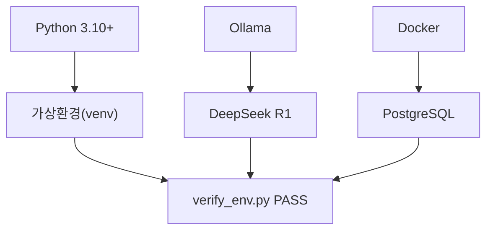

# CH02 집필 명세 -- 개발 환경 설정

## 1. 챕터 섹션 구조

- ## 1. 필수 요구사항 확인
  - Python 3.10+, RAM 16GB+, 저장공간 20GB+
  - OS별 주의사항 (macOS/Linux/Windows WSL2)
- ## 2. Ollama + DeepSeek R1 설치 및 테스트
  - Ollama 설치 (OS별 가이드)
  - DeepSeek R1 모델 다운로드 (`ollama pull deepseek-r1:8b`)
  - 간단한 대화 테스트
- ## 3. Python 가상환경 및 의존성
  - venv 생성 및 활성화
  - requirements.txt 설명
  - pip install 실행
- ## 4. PostgreSQL 설치
  - Docker 기반 설치 (권장)
  - 네이티브 설치 대안
  - 초기 DB 생성 (`connect_hr`)
- ## 5. 프로젝트 클론 및 초기 설정
  - git clone + 폴더 구조 설명
  - .env 파일 생성 및 설정
- ## 6. 주요 의존성 목록
  - requirements.txt 항목별 용도 설명
- ## 7. LLM Provider 전환 구조
  - .env 기반 Provider 전환 설계 (ollama/openai/vllm)
  - `llm_provider.py` 팩토리 패턴 설명
  - Provider별 테스트 방법
- ## 8. 환경 검증
  - verify_env.py 실행 (Ollama, Python, Docker, PostgreSQL 전항목 PASS 확인)
  - 정리 및 다음 장 예고

## 2. 코드-섹션 매핑

| 섹션 | 파일 | 코드 범위 |
|------|------|---------|
| 7. LLM Provider 전환 구조 | `src/llm_provider.py` | 전체 |
| 8. 환경 검증 | `src/verify_env.py` | 전체 |

## 3. 개념 설명 힌트 (Why)

- Docker로 PostgreSQL을 설치하는 이유: OS 독립적, 버전 고정, 충돌 방지
- LLM Provider 전환 구조를 먼저 만드는 이유: 이후 모든 챕터에서 동일한 인터페이스 사용, Ollama 없는 환경에서도 OpenAI로 대체 가능
- 가상환경을 사용하는 이유: 프로젝트 간 의존성 충돌 방지

## 4. 핵심 용어

- Ollama: 로컬에서 LLM을 실행할 수 있는 경량 런타임
- DeepSeek R1: 추론 능력이 강화된 오픈소스 LLM
- venv: Python 내장 가상환경 도구
- Docker Compose: 멀티 컨테이너 Docker 애플리케이션을 정의하고 실행하는 도구

## 5. Mermaid 다이어그램 초안

## 6. 챕터 연결

- 이전 챕터에서 이어받는 개념: CH01의 아키텍처 이해, 기술 스택 목록
- 다음 챕터로 넘기는 개념: 검증된 개발 환경, LLM Provider 전환 구조 -> CH03에서 LLM 직접 사용

## 7. 스토리텔링 요소

### 메타코딩이 직면한 문제 상황

메타코딩은 CH01에서 AI 비서 프로젝트를 기획하였지만, 실제로 개발을 시작하려 하니 "어떤 도구를 설치해야 하는지", "로컬에서 LLM을 어떻게 돌리는지" 전혀 감이 잡히지 않는다. 클라우드 API는 월 비용이 부담되고, 사내 데이터를 외부 서버로 보내는 것도 보안 정책상 불가능하다. 로컬에서 무료로 LLM을 실행할 방법이 필요하다.

### 해결 과정에서의 감정/고민

- "ChatGPT API를 쓰면 간단하겠지만, 월 비용이 부담되고 사내 데이터 보안도 걱정된다"
- "Ollama라는 것을 발견하였다. 로컬에서 무료로 LLM을 돌릴 수 있다니 놀랍다"
- "그런데 나중에 API로 전환해야 할 수도 있으니, 처음부터 Provider를 바꿀 수 있게 설계해 두자"

### before/after 수치 (예상)

| 지표 | Before | After |
|------|--------|-------|
| LLM 실행 환경 | 없음 | Ollama + DeepSeek R1 로컬 실행 |
| 월 비용 | (클라우드 기준) $50+ | $0 (로컬) |
| 환경 검증 | 수동 확인 | verify_env.py 자동 검증 PASS |
| Provider 전환 | 코드 수정 필요 | .env 한 줄 변경으로 전환 |
