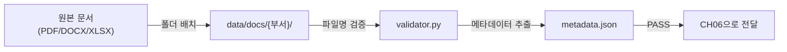

# CH05 집필 명세 -- 사내 문서 수집 전략과 문서 표준 만들기

## 1. 챕터 섹션 구조

- ## 1. 어떤 문서를 넣을 것인가
  - 교재용 문서 세트 소개 (legacy/ex01-1/data/docs/ 기반)
  - 문서 유형별 특성 (규정류 PDF, 보안 서약 PDF, 운영 전략 PDF, 예산 XLSX, 보안 규정 DOCX)
  - 실무 문서 선정 기준 (자주 질문받는 문서, 정기 갱신 문서)
- ## 2. 문서 형식 지원 범위
  - PDF, DOCX, XLSX 각 형식의 특성과 파싱 난이도
  - 이미지 PDF vs 텍스트 PDF 구분 (CH10 튜닝에서 이미지 PDF 처리)
  - 형식별 파싱 라이브러리: pypdf, python-docx, openpyxl
- ## 3. 문서 표준 규칙
  - 파일명 규칙: `{부서}_{문서종류}_v{버전}.{확장자}` (예: HR_취업규칙_v1.0.pdf)
  - 폴더 구조: `data/docs/{부서}/` (hr, security, ops, finance)
  - 메타데이터 필수 항목: doc_id, title, department, version, date, format
- ## 4. 문서 수집 파이프라인
  - docs/ 폴더 구조 설계 및 문서 배치
  - validator.py: 파일명 규칙 검증 + 파일 형식 확인 + 메타데이터 추출
  - 정리 및 다음 장 예고

## 2. 코드-섹션 매핑

| 섹션 | 파일 | 코드 범위 |
|------|------|---------|
| 4. 문서 수집 파이프라인 | `src/validator.py` | 파일명 규칙 검증, 형식 확인, 메타데이터 추출 |

## 3. data 규칙 (중요)

> **반드시 legacy/ex01-1/data/docs/의 실제 문서를 사용한다. txt 파일을 생성하지 않는다.**

CH05 예제의 data/ 폴더에 아래 실제 문서를 복사하여 포함한다:

```
data/docs/
├── hr/
│   ├── HR_취업규칙_v1.0.pdf          <- legacy/ex01-1/data/docs/hr/
│   └── HR_정보보안서약서.pdf          <- legacy/ex01-1/data/docs/hr/
├── security/
│   └── SEC_보안규정_v1.0.docx        <- legacy/ex01-1/data/docs/security/
├── ops/
│   └── OPS_신규서비스_런칭전략.pdf    <- legacy/ex01-1/data/docs/ops/
└── finance/
    ├── FIN_부서별_예산기안서.xlsx      <- legacy/ex01-1/data/docs/finance/
    └── FIN_2025_상반기_매출현황.xlsx   <- legacy/ex01-1/data/docs/finance/
```

- **txt 파일 사용 금지**: 문서 표준화 챕터에서 txt만 다루면 파싱/변환 실습의 의미가 없음
- **실제 형식 다양성**: PDF(4개), DOCX(1개), XLSX(2개) -- 형식별 처리 차이를 체감

## 4. 개념 설명 힌트 (Why)

- 문서 표준을 먼저 정하는 이유: "Garbage In, Garbage Out" -- 정제되지 않은 문서는 RAG 품질을 직접 떨어뜨림
- 메타데이터를 설계하는 이유: CH06에서 메타데이터 필터링에 활용, CH10에서 Self-Query Retriever에 필수
- 파일명 규칙을 정하는 이유: 문서 버전 관리, 부서별 분류, 출처 추적에 활용
- 실제 문서를 사용하는 이유: txt는 파싱이 필요 없어 표준화 과정을 체감할 수 없음

## 5. 핵심 용어

- 문서 표준화 (Document Standardization): 다양한 형식의 문서를 일관된 규칙으로 정리하는 과정
- 메타데이터 (Metadata): 문서의 속성 정보 (제목, 부서, 버전, 날짜 등)
- 파이프라인 (Pipeline): 데이터 처리의 순차적 단계 묶음

## 6. Mermaid 다이어그램 초안



## 7. 챕터 연결

- 이전 챕터에서 이어받는 개념: CH01의 아키텍처 중 문서 파이프라인 부분
- 다음 챕터로 넘기는 개념: 표준화된 문서 세트 (data/docs/) + 메타데이터 -> CH06에서 텍스트 추출 및 VectorDB 구축

## 8. 스토리텔링 요소

### 메타코딩이 직면한 문제 상황

메타코딩은 RAG를 적용하려면 사내 문서가 필요하다는 것을 알게 되었다. 그런데 커넥트의 문서 상황은 참담하다. 인사팀 서버에 "취업규칙_최종_진짜최종.pdf"와 "취업규칙_최종_v2.pdf"가 공존하고, 보안 규정은 DOCX, 예산 자료는 XLSX, 운영 전략은 PDF로 형식이 제각각이다. 폴더 구조도 없이 100개가 넘는 파일이 하나의 폴더에 섞여 있다.

### 해결 과정에서의 감정/고민

- "이 상태로 AI에 넣으면 엉뚱한 답변이 나올 것이 뻔하다. 문서 정리부터 해야 한다"
- "파일명 규칙을 정하고, 부서별 폴더로 분류하고, 메타데이터를 붙이는 것이 먼저이다"
- "귀찮은 작업이지만, 'Garbage In, Garbage Out'이라는 말을 실감하게 된다"
- 검증 스크립트가 모든 문서를 PASS 처리하는 것을 보고 "이제 AI에 먹일 준비가 되었다"라고 확인

### before/after 수치 (예상)

| 지표 | Before | After |
|------|--------|-------|
| 문서 파일명 규칙 | 없음 (자유 형식) | `{부서}_{종류}_v{버전}.{확장자}` 통일 |
| 폴더 구조 | 단일 폴더에 100+ 파일 | 부서별 4개 폴더로 분류 |
| 메타데이터 | 없음 | 7개 필수 항목 자동 추출 |
| 문서 검증 | 수동 확인 | validator.py 자동 검증 |
