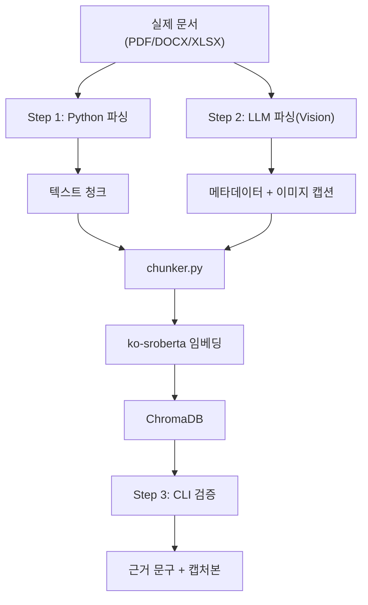

# CH06 집필 명세 -- VectorDB 구축 -- 문서를 검색 가능한 지식으로 바꾸기

> legacy 참조: `legacy/ex01-1/` (스크립트 01~06)

## 1. 챕터 섹션 구조

- ## 1. [Step 1] Python 파싱 테스트
  - 형식별 텍스트 추출: PDF(pypdf), DOCX(python-docx), XLSX(openpyxl)
  - extractor.py: 통합 텍스트 추출기
  - 추출 결과 비교 -- 형식별 품질 차이 직접 확인 (깨진 문자, 표 손실, 이미지 누락)
  - **한계 체감**: Python 파싱만으로는 표/이미지/복잡한 레이아웃 처리 불가
- ## 2. [Step 2] LLM 파싱 -- Vision LLM으로 문서 이해
  - Vision LLM (LLaVA / Qwen2-VL)으로 PDF 페이지를 이미지로 변환 후 분석
  - LLM이 추출하는 것: 텍스트 + 메타데이터(제목, 부서, 버전, 날짜) + 이미지 캡션
  - vision_extractor.py: PDF -> 페이지 이미지 -> LLM 분석 -> 구조화된 결과
  - Python 파싱 vs LLM 파싱 비교표 (품질, 속도, 비용)
- ## 3. Chunk 설계
  - Fixed-size 청킹 (500~1000자 + overlap 10~20%)
  - 메타데이터 부착: doc_id, title, section, department, page, source_path
  - 이미지 청크: 캡처본 경로 + LLM 캡션을 텍스트 청크로 변환
  - chunker.py 구현
- ## 4. 임베딩 & VectorDB 저장
  - 임베딩 모델: ko-sroberta-multitask (로컬, 무료)
  - ChromaDB Collection 생성 및 문서 추가
  - 텍스트 청크 + 이미지 캡션 청크를 함께 저장
  - store.py: 임베딩 + ChromaDB 저장 파이프라인
- ## 5. [Step 3] CLI 검증 -- 쿼리로 근거 확인
  - cli_search.py: 터미널에서 쿼리 입력 -> 관련 청크 + 출처 + 캡처본 경로 출력
  - 텍스트 근거: 관련 문구 하이라이트
  - 이미지 근거: 해당 페이지 캡처본 경로 표시
  - 검색 품질 확인 (k값, 유사도 점수)
  - 정리 및 다음 장 예고

## 2. 코드-섹션 매핑

| 섹션 | 파일 | 코드 범위 |
|------|------|---------|
| 1. Python 파싱 | `src/extractor.py` | PDF/DOCX/XLSX 텍스트 추출 |
| 2. LLM 파싱 | `src/vision_extractor.py` | Vision LLM으로 PDF 분석, 메타데이터/캡션 추출 |
| 3. Chunk 설계 | `src/chunker.py` | 텍스트+이미지 청킹 |
| 4. 임베딩 & 저장 | `src/store.py` | 임베딩 + ChromaDB 저장 |
| 5. CLI 검증 | `src/cli_search.py` | 터미널 검색 + 근거/캡처본 출력 |
| 전체 파이프라인 | `src/main.py` | Step 1~3 오케스트레이션 |

## 3. data 규칙

> **CH05에서 표준화한 실제 문서(PDF/DOCX/XLSX)를 그대로 사용한다.**

```
data/docs/           <- CH05에서 표준화한 문서 (PDF/DOCX/XLSX)
data/pages/          <- Vision LLM용 PDF 페이지 이미지 (자동 생성)
data/chroma_db/      <- ChromaDB 저장소 (자동 생성)
```

## 4. 개념 설명 힌트 (Why)

- Python 파싱을 먼저 해보는 이유: 가장 단순한 방법의 한계를 직접 체감해야 LLM 파싱의 가치를 이해
- Vision LLM을 사용하는 이유: 표, 이미지, 복잡한 레이아웃을 이해할 수 있고, 메타데이터 자동 추출 가능
- 텍스트+이미지를 함께 임베딩하는 이유: 실무 문서는 텍스트만으로 정보가 완전하지 않음 (차트, 서명란 등)
- CLI로 먼저 검증하는 이유: 웹 UI 없이 VectorDB 품질을 빠르게 확인, CH07에서 웹 UI 연결
- Fixed-size 청킹을 기본으로 사용하는 이유: 구현이 간단하고 예측 가능, semantic 청킹은 CH10 튜닝에서 개선

## 5. 핵심 용어

- 텍스트 추출 (Text Extraction): 문서 파일에서 순수 텍스트를 분리하는 과정
- Vision LLM: 이미지를 입력받아 텍스트로 설명할 수 있는 멀티모달 LLM
- 청킹 (Chunking): 긴 텍스트를 검색에 적합한 작은 단위로 분할
- 임베딩 (Embedding): 텍스트를 고차원 수치 벡터로 변환
- VectorDB: 벡터 임베딩을 저장하고 유사도 기반 검색을 수행하는 데이터베이스

## 6. Mermaid 다이어그램 초안



## 7. 챕터 연결

- 이전 챕터에서 이어받는 개념: CH05의 표준화된 문서 세트 (data/docs/)
- 다음 챕터로 넘기는 개념: ChromaDB 인덱스 (data/chroma_db/) -> CH07에서 RAG Chain + 웹 UI 연결, CH10에서 튜닝 대상

## 8. 스토리텔링 요소

### 메타코딩이 직면한 문제 상황

메타코딩은 CH05에서 문서를 깔끔하게 정리하였다. 이제 이 문서를 AI가 검색할 수 있게 변환해야 한다. 그런데 PDF를 열어 보니 취업규칙에는 표가 가득하고, 매출 현황에는 차트가 포함되어 있다. 단순히 텍스트만 추출하면 표와 차트의 정보가 날아간다. "이 문서들을 AI가 제대로 이해하려면 어떻게 해야 할까?"

### 해결 과정에서의 감정/고민

- "pypdf로 PDF 텍스트를 추출하였더니 표가 깨져서 의미를 알 수 없다. XLSX는 그나마 낫지만 시트별 맥락이 사라진다"
- "Vision LLM에 페이지 이미지를 보여주니 표의 구조까지 이해하고 설명해 준다. 신기하다"
- "500자씩 잘라서 ChromaDB에 넣고, CLI로 검색해 보니 관련 문서가 제대로 검색된다"
- "CLI에서 '보안 정책'을 검색하면 보안규정 DOCX의 관련 섹션이 출처와 함께 출력된다"

### before/after 수치 (예상)

| 지표 | Before | After |
|------|--------|-------|
| 문서 검색 방식 | 파일명으로 수동 검색 | 의미 기반 벡터 검색 |
| 검색 소요 시간 | 10~30분 (폴더 탐색) | 1초 미만 (CLI 쿼리) |
| 표/차트 정보 | 텍스트 추출 시 손실 | Vision LLM 캡션으로 보존 |
| 검색 정확도 (top-5 기준) | 해당 없음 | 80%+ 관련 문서 포함 |
