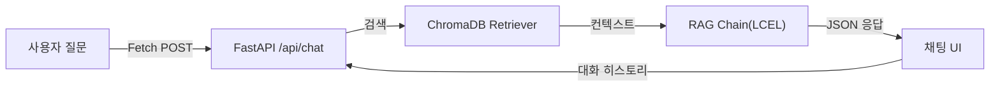

# CH07 집필 명세 -- RAG로 Q&A 엔진 만들기

## 1. 챕터 섹션 구조

- ## 1. RAG 최소 동작 구현
  - 질문 -> Retriever -> Prompt -> LLM -> 답변 파이프라인
  - LCEL(LangChain Expression Language) 기반 RAG 체인
  - rag_chain.py 구현
- ## 2. RAG 프롬프트 기본 템플릿
  - 출처 강제 규칙 ("반드시 제공된 문서에서만 답변하시오")
  - 모르면 "확인되지 않음" 응답 규칙
  - 프롬프트 템플릿 설계 패턴
- ## 3. 출처 표시 응답 포맷
  - answer + sources JSON 구조
  - 출처 문서명, 페이지, 관련도 점수 표시
  - 응답 파서 구현
- ## 4. 채팅 웹 UI
  - **CH04의 base.html 계승** -- 동일 디자인 시스템 확장 (ex02 UI 기반)
  - FastAPI /api/chat 엔드포인트 (Fetch 기반 요청/응답)
  - Jinja2 + JavaScript 채팅 UI (chat.html extends base.html)
  - ex02의 qa.js 패턴 활용 (Fetch POST -> 응답 렌더링 -> 근거 아코디언)
- ## 5. 멀티턴 대화 관리
  - 대화 히스토리 저장 (세션 기반)
  - ConversationBufferWindowMemory 활용
  - 이전 대화 맥락을 프롬프트에 포함하는 구조
  - 세션 관리 (세션 ID 기반, 만료 정책)
- ## 6. 정리 및 다음 장 예고

## 2. 코드-섹션 매핑

| 섹션 | 파일 | 코드 범위 |
|------|------|---------|
| 1. RAG 체인 | `src/rag_chain.py` | 전체 |
| 3. 응답 파서 | `src/response_parser.py` | 전체 |
| 4. 채팅 API | `app/chat_api.py` | 전체 |
| 4. 채팅 UI | `templates/chat.html` | 전체 |
| 5. 대화 관리 | `src/conversation.py` | 전체 |
| 5. 세션 관리 | `app/session.py` | 전체 |

## 3. 개념 설명 힌트 (Why)

- LCEL을 사용하는 이유: LangChain의 최신 체인 구성 방식, 파이프 연산자(|)로 가독성 높은 체인 조립
- 출처 표시를 강제하는 이유: 환각 여부를 독자/사용자가 검증할 수 있게 함, 실무에서 신뢰도의 핵심
- Fetch 방식을 사용하는 이유: ex02 UI와 동일한 패턴, SSE 대비 구현이 단순하고 초급 독자에게 적합
- 멀티턴 대화를 추가하는 이유: 실무에서 단일 질의만으로 문제가 해결되는 경우는 드묾, 맥락 유지 필수

## 4. 핵심 용어

- LCEL (LangChain Expression Language): LangChain의 선언적 체인 조합 문법
- Retriever: VectorDB에서 관련 문서를 검색하는 컴포넌트
- 멀티턴 (Multi-turn): 여러 차례 주고받는 대화 방식
- ConversationBufferWindowMemory: 최근 N턴의 대화를 유지하는 LangChain 메모리 클래스

## 5. Mermaid 다이어그램 초안

## 6. 챕터 연결

- 이전 챕터에서 이어받는 개념: CH06의 ChromaDB 인덱스, CH04의 FastAPI 구조 + base.html
- 다음 챕터로 넘기는 개념: RAG Q&A 엔진 (비정형 질의 처리) -> CH08에서 정형(MCP)과 통합

## 7. 스토리텔링 요소

### 메타코딩이 직면한 문제 상황

메타코딩은 CH06에서 CLI로 문서 검색이 되는 것을 확인하였다. 하지만 직원들에게 "터미널에서 명령어를 입력하세요"라고 할 수는 없다. 직원들이 브라우저에서 자연어로 질문하고 출처가 포함된 답변을 받을 수 있는 "채팅 UI"가 필요하다. 또한 "아까 물어본 건데, 그것 말고 다른 부서 규정은?"처럼 이전 대화를 이어서 질문하는 경우도 처리해야 한다.

### 해결 과정에서의 감정/고민

- "CLI 검색은 개발자인 내가 쓰기엔 편하지만, 직원들에게는 웹 채팅 UI가 필수이다"
- "LangChain의 LCEL 문법으로 Retriever | Prompt | LLM을 파이프로 연결하니 코드가 깔끔하다"
- "출처를 반드시 표시하게 만들었다. 답변 밑에 '근거: HR_취업규칙_v1.0.pdf, 15페이지'가 나온다"
- 직원 1명에게 테스트를 부탁하였더니 "이거 ChatGPT보다 좋은데?"라는 반응이 나온다

### before/after 수치 (예상)

| 지표 | Before (CLI) | After (웹 UI) |
|------|-------------|--------------|
| 사용 가능한 사람 | 개발자 1명 | 전 직원 30명 |
| 질의 방식 | 터미널 명령어 | 브라우저 채팅 |
| 출처 표시 | 텍스트 출력 | 근거 아코디언 UI |
| 대화 맥락 유지 | 불가능 | 멀티턴 대화 지원 |
| 질의 건수 (예상) | 5건/일 (개발자만) | 50건/일 (전 직원) |
