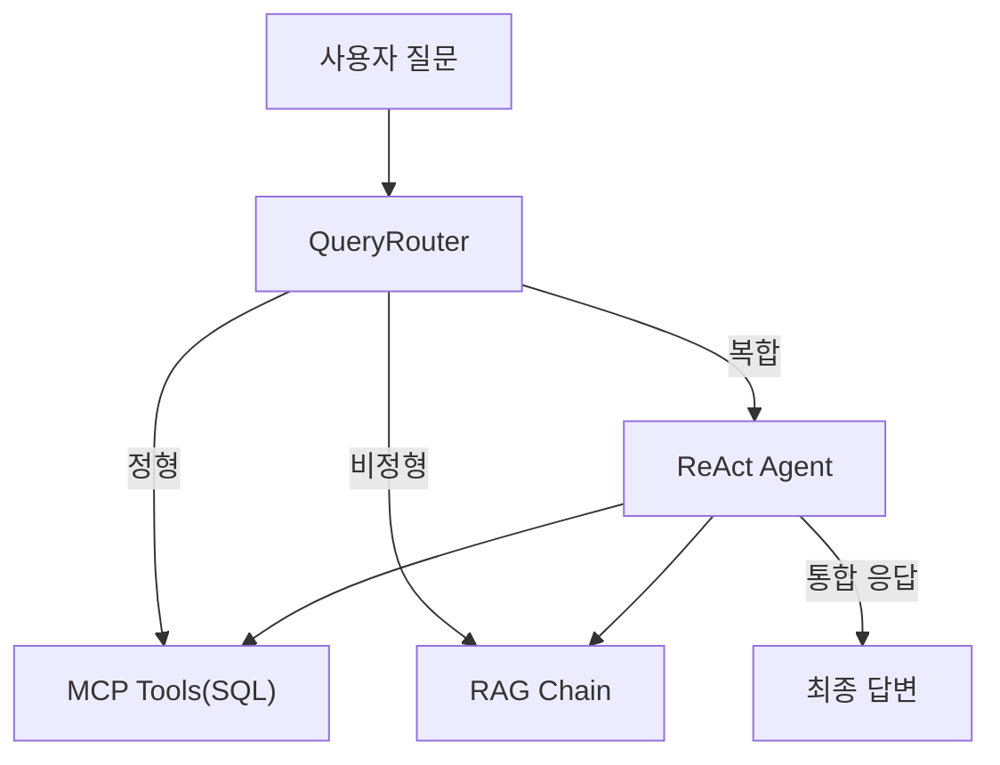

# CH08 집필 명세 -- 정형 MCP + 비정형 RAG 통합 에이전트 설계

> legacy 참조: `legacy/ex02/` (하이브리드 RAG + MCP + 웹 UI)

## 1. 챕터 섹션 구조

- ## 1. 정형/비정형 분리 원칙
  - 정형 데이터(DB): MCP + SQL 질의
  - 비정형 데이터(문서): VectorDB + RAG
  - 복합 질문: 두 경로를 순차/병렬로 조합
  - 분류 기준표 (질문 유형별 처리 경로)
- ## 2. 질문 라우팅 전략
  - 규칙 기반 라우팅 (키워드 매칭)
  - 스키마 기반 라우팅 (DB 컬럼명 매칭)
  - LLM 판단 라우팅 (최종 -- LLM이 질문 분석 후 경로 결정)
  - router.py 구현 (3단계 전략)
- ## 3. 통합 응답 전략
  - 질문 분석 -> 데이터 수집 -> 통합 컨텍스트 구성 -> 답변 생성
  - agent.py: ReAct Agent 구현
  - mcp_tools.py: MCP 도구 연결
- ## 4. 대표 질문 시나리오 10개
  - 정형 4개: 연차 잔여, 매출 합계, 직원 목록, 부서별 통계
  - 비정형 4개: 온보딩 절차, 보안 정책, 복지 안내, 출장 규정
  - 복합 2개: 매출 상위 부서의 복지 정책, 특정 직원의 휴가 규정
  - 각 시나리오별 기대 응답 및 검증 기준
- ## 5. 통합 에이전트 웹 UI
  - **CH07의 채팅 UI 확장** -- 동일 base.html, 질문 유형 표시(정형/비정형/복합) 추가
  - 통합 응답 포맷 (출처 + DB 결과 병합 표시)
- ## 6. 정리 및 다음 장 예고

## 2. 코드-섹션 매핑

| 섹션 | 파일 | 코드 범위 |
|------|------|---------|
| 2. 질문 라우팅 | `src/router.py` | 전체 |
| 3. 통합 에이전트 | `src/agent.py` | 전체 |
| 3. MCP 도구 | `src/mcp_tools.py` | 전체 |
| 4. 시나리오 테스트 | `tests/test_scenarios.py` | 전체 |

## 3. 개념 설명 힌트 (Why)

- 라우팅 전략을 3단계로 보여주는 이유: 단순한 것에서 시작하여 왜 LLM 판단이 필요한지를 점진적으로 이해
- ReAct Agent를 사용하는 이유: Reasoning + Acting을 번갈아 수행하여 복합 질문을 단계적으로 해결
- MCP를 사용하는 이유: LLM이 직접 DB를 조회하는 표준화된 프로토콜, 도구 추가가 선언적
- 10개 시나리오를 정하는 이유: 정형/비정형/복합 각각의 패턴을 커버, 이후 CH10 평가의 기준선

## 4. 핵심 용어

- MCP (Model Context Protocol): LLM과 외부 도구/데이터 소스 간의 표준 통신 프로토콜
- QueryRouter: 질문 유형을 분석하여 적절한 처리 경로로 분기하는 컴포넌트
- ReAct Agent: Reasoning(추론)과 Acting(실행)을 반복하는 에이전트 패턴
- 정형 데이터: 테이블/스키마로 구조화된 데이터 (DB)
- 비정형 데이터: 자연어 문서, PDF 등 구조가 정해지지 않은 데이터

## 5. Mermaid 다이어그램 초안

## 6. 챕터 연결

- 이전 챕터에서 이어받는 개념: CH04의 PostgreSQL DB, CH07의 RAG Q&A 엔진
- 다음 챕터로 넘기는 개념: 통합 에이전트 구조 -> CH09에서 LangChain 표준 구성으로 정리

## 7. 스토리텔링 요소

### 메타코딩이 직면한 문제 상황

메타코딩이 만든 RAG 채팅 UI를 직원들이 사용하기 시작하였다. 그런데 예상치 못한 질문이 들어온다. "김철수 사원의 남은 연차는 며칠입니까?" 이것은 문서가 아니라 DB에 있는 정형 데이터이다. "올해 매출 상위 부서의 복지 정책을 비교해 주십시오"라는 질문도 있다. DB에서 매출 상위 부서를 조회하고, 문서에서 복지 정책을 검색한 뒤, 둘을 조합해야 한다. RAG만으로는 이런 질문을 처리할 수 없다.

### 해결 과정에서의 감정/고민

- "문서 검색만 되는 AI 비서로는 직원들의 요구를 절반밖에 충족하지 못한다"
- "DB도 조회하고, 문서도 검색하고, 둘을 합쳐서 답변하는 구조가 필요하다"
- "MCP라는 프로토콜을 알게 되었다. LLM이 SQL 질의까지 직접 수행할 수 있다"
- "복합 질문에 대해 AI가 스스로 '먼저 매출 DB를 조회하고, 그 부서의 복지 정책을 검색하자'라고 판단하는 모습을 보고 감탄한다"

### before/after 수치 (예상)

| 지표 | Before (RAG only) | After (RAG + MCP) |
|------|-------------------|-------------------|
| 처리 가능한 질문 유형 | 비정형만 (문서 검색) | 정형 + 비정형 + 복합 |
| 10개 시나리오 정답률 | 4/10 (비정형 4개만) | 10/10 (전체 커버) |
| 연차 조회 | 불가능 | DB에서 즉시 조회 |
| 복합 질문 | 불가능 | DB + 문서 자동 조합 |
