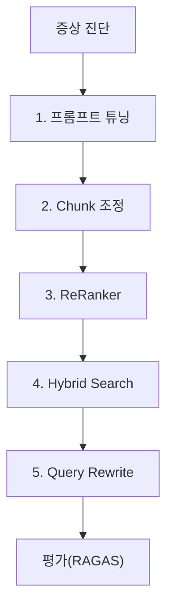

# CH10 집필 명세 -- RAG 튜닝 -- 되는 수준에서 쓸만한 수준으로

## 1. 챕터 섹션 구조

- ## 1. 증상으로 시작하는 튜닝
  - 문제 -> 처방 매핑 테이블 (증상별 튜닝 기법 안내)
  - "답변이 부정확" -> Chunk 튜닝, ReRanker
  - "관련 없는 문서가 검색됨" -> Hybrid Search, metadata filtering
  - "질문 의도를 못 파악" -> Query Rewrite
- ## 2. Chunk 튜닝
  - Fixed-size -> Semantic 청킹 비교
  - overlap 비율 조정 실험 (10%, 20%, 30%)
  - 청크 크기 실험 (300, 500, 1000자)
- ## 3. Retriever 튜닝
  - k값 실험 (k=3, 5, 10)
  - similarity threshold 적용
  - metadata filtering (부서별, 버전별)
- ## 4. ReRanker
  - Cross-Encoder 기반 리랭킹
  - top_k=20으로 넓게 검색 -> ReRanker -> top_k=5로 정제
  - 리랭킹 전후 정확도 비교
- ## 5. Hybrid Search
  - BM25(키워드) + Vector(의미) 결합
  - Ensemble Retriever 구현
  - 가중치 조정 (alpha 파라미터)
- ## 6. 고급 Retriever
  - Parent Document Retriever
  - Self-Query Retriever (메타데이터 자동 필터링)
  - Contextual Compression
- ## 7. Query Rewrite / Multi-Query
  - HyDE (Hypothetical Document Embeddings)
  - 약어/동의어 처리
  - Multi-Query: 하나의 질문을 여러 관점으로 변환
- ## 8. 프롬프트 튜닝
  - 근거 우선 응답 구조
  - "모르면 모른다" 규칙 강화
  - 포맷 고정 (JSON/표 형식)
- ## 9. PDF 이미지 처리
  - 이미지가 포함된 PDF 문제
  - LLaVA를 활용한 이미지 캡션 생성
  - EasyOCR을 활용한 텍스트 추출
  - 하이브리드 접근 (Vision + OCR)
- ## 10. 평가 체계
  - 테스트 질문 30개+ (부록 B 연동)
  - Retrieval 정확도 (Precision@k, Recall@k)
  - Answer 정확도 (RAGAS: Faithfulness, Answer Relevancy)
  - Hallucination Rate 측정
  - before/after 비교 프레임워크
- ## 11. 튜닝 우선순위 가이드 + 다음 단계
  - 1순위: 프롬프트 튜닝 (비용 0, 즉시 적용)
  - 2순위: Chunk 크기/overlap 조정
  - 3순위: ReRanker 추가
  - 4순위: Hybrid Search
  - 5순위: Query Rewrite
  - 6순위: 고급 Retriever
  - GraphRAG 소개 (다음 단계 -- 한 문단)

## 2. 코드-섹션 매핑

| 섹션 | 파일 | 코드 범위 |
|------|------|---------|
| 2. Chunk 튜닝 | `tuning/chunk_experiment.py` | 전체 |
| 3. Retriever 튜닝 | `tuning/retriever_experiment.py` | 전체 |
| 4. ReRanker | `tuning/reranker.py` | 전체 |
| 5. Hybrid Search | `tuning/hybrid_search.py` | 전체 |
| 6. 고급 Retriever | `tuning/advanced_retriever.py` | 전체 |
| 7. Query Rewrite | `tuning/query_rewrite.py` | 전체 |
| 9. PDF 이미지 | `tuning/vision_extractor.py` | 전체 |
| 10. 평가 체계 | `src/eval_framework.py` | 전체 |
| 10. 테스트 데이터 | `data/test_questions.json` | 전체 |

## 3. 개념 설명 힌트 (Why)

- 증상 기반으로 시작하는 이유: 실무에서는 "이론을 알아서"가 아니라 "문제가 생겨서" 튜닝을 시작함
- 튜닝 우선순위를 제시하는 이유: 모든 기법을 다 적용하면 오히려 복잡해짐, 비용 대비 효과가 높은 순서로 적용
- RAGAS를 사용하는 이유: LLM 기반 자동 평가 프레임워크로, 수작업 라벨링 없이 품질 측정 가능
- GraphRAG를 "다음 단계"로만 소개하는 이유: 100p 분량 제약, 독자 수준(초중급) 고려

## 4. 핵심 용어

- Semantic Chunking: 의미 단위로 텍스트를 분할하는 기법
- ReRanker: 검색 결과를 재정렬하여 관련도를 높이는 모델
- Hybrid Search: 키워드 검색(BM25)과 벡터 검색을 결합한 방식
- BM25: 전통적 키워드 기반 문서 검색 알고리즘
- HyDE: 가상 문서를 생성하여 검색 품질을 높이는 기법
- RAGAS: RAG 시스템을 자동 평가하는 오픈소스 프레임워크
- Faithfulness: 답변이 제공된 컨텍스트에 충실한 정도
- GraphRAG: 지식 그래프를 활용한 RAG 확장 기법

## 5. Mermaid 다이어그램 초안

## 6. 챕터 연결

- 이전 챕터에서 이어받는 개념: CH06의 VectorDB 인덱스 (튜닝 대상), CH09의 LangChain Agent (튜닝 적용 대상)
- 다음 챕터로 넘기는 개념: 튜닝이 완료된 RAG 시스템 (책의 최종 결과물)

## 7. 스토리텔링 요소

### 메타코딩이 직면한 문제 상황

메타코딩의 AI 비서가 2주간 운영되면서 직원들의 피드백이 쌓이기 시작하였다. "보안 정책 물어봤는데 엉뚱한 출장 규정이 나왔습니다", "연봉 테이블 물어봤는데 모른다고 합니다 (PDF 이미지에 있는 표인데)", "휴가 규정 질문했는데 옛날 버전 답변이 나왔습니다". AI 비서가 "되는 수준"에서 "쓸만한 수준"으로 올라가려면 체계적인 튜닝이 필요하다.

### 해결 과정에서의 감정/고민

- "직원들의 불만을 모아보니 증상별로 패턴이 보인다. 증상에 맞는 처방을 찾으면 된다"
- "프롬프트 한 줄 바꿨을 뿐인데 환각률이 15%에서 5%로 떨어졌다. 비용 0원으로 이 효과라니"
- "ReRanker를 추가하니 top-5 검색 정확도가 72%에서 89%로 뛰었다"
- "RAGAS로 체계적으로 측정하니 어디를 튜닝해야 하는지 숫자로 보인다. 감이 아니라 데이터로 판단할 수 있다"
- "드디어 직원들이 '이거 꽤 쓸만합니다'라고 한다. 첫 배포 때와는 다른 반응이다"

### before/after 수치 (예상)

| 지표 | Before (CH09 상태) | After (튜닝 완료) |
|------|-------------------|------------------|
| Retrieval Precision@5 | 72% | 89% |
| Answer Faithfulness (RAGAS) | 0.65 | 0.88 |
| Hallucination Rate | 15% | 3% |
| 이미지 PDF 처리 | 불가 (빈 텍스트) | Vision + OCR 하이브리드 처리 |
| 동의어/약어 인식 | 실패 | Query Rewrite로 처리 |
| 직원 만족도 (체감) | "가끔 엉뚱한 답변" | "꽤 쓸만합니다" |
