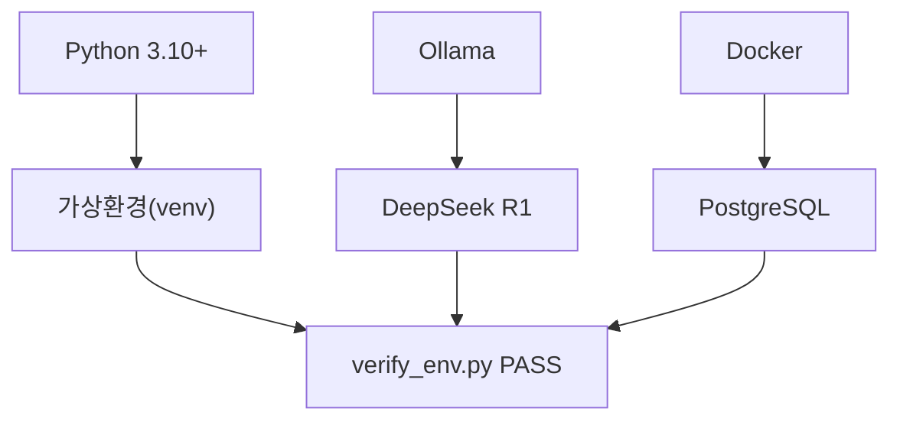

# CH02 개발 환경 설정

> 사내 문서 기반 AI 업무 비서 (RAG + MCP) — 2장 실습 코드

## 목적 및 학습 목표

- Python 3.10+, Ollama, Docker, PostgreSQL 네 가지 개발 환경을 직접 구성한다.
- `LLM_PROVIDER` 환경 변수 하나로 Ollama / OpenAI / vLLM 을 전환하는 팩토리 패턴을 이해한다.
- `verify_env.py` 를 실행하여 모든 항목이 PASS 인 상태를 만들고 CH03 실습을 준비한다.

## 실행 환경

- Python 3.10+
- Docker Desktop (PostgreSQL 컨테이너 실행용)
- Ollama 0.5+ + DeepSeek R1 8B 모델

## 사전 준비 — PostgreSQL 컨테이너 시작 (최초 1회)

이 챕터 예제는 PostgreSQL 연결 확인을 포함합니다.
docker-compose.yml 이 있는 폴더에서 아래 명령으로 컨테이너를 시작하십시오.

```bash
docker compose up -d
```

> PostgreSQL 16 컨테이너가 백그라운드에서 시작됩니다. 이후 `docker compose down` 으로 종료할 수 있습니다.

## 설치 및 실행

이 챕터 예제 코드 저장소를 클론합니다.

```bash
git clone https://github.com/{repo}/ch02-dev-environment
cd ch02-dev-environment
```

환경 변수 파일을 생성합니다.

```bash
cp .env.example .env
# .env 파일을 열어 필요한 값을 입력하십시오.
# Ollama 기본 설정이면 변경 없이 그대로 사용할 수 있습니다.
```

### macOS / Linux

```bash
python3 -m venv venv
source venv/bin/activate
pip install -r requirements.txt
```

### Windows (WSL2)

```bash
python -m venv venv
venv\Scripts\activate
pip install -r requirements.txt
```

## 실행

### 환경 검증 스크립트

```bash
python src/verify_env.py
```

### LLM Provider 연결 테스트

```bash
python src/llm_provider.py
```

## 예상 출력

<!-- [CAPTURE NEEDED: verify_env.py 실행 후 전체 터미널 화면 — 4개 항목 모두 PASS인 상태] -->

```
=======================================================
  커넥트HR AI 비서 — 개발 환경 검증
=======================================================
  [PASS] Python 버전  (3.11.9)
  [PASS] Docker  (v27.3.1)
  [PASS] Ollama  (http://localhost:11434  모델: [deepseek-r1:8b])
  [PASS] PostgreSQL  (localhost:5432/connect_hr)
=======================================================
  결과: 4/4 항목 통과

  모든 환경 검증이 완료되었습니다.
  CH03 실습으로 진행하십시오.
=======================================================
```

> 위 출력은 실제 실행 결과입니다. 터미널 출력과 항목별로 비교하며 디버깅하십시오.

FAIL 항목이 있다면 해당 줄의 '해결' 안내를 참고하여 환경을 수정한 뒤 다시 실행하십시오.

## 전체 구조



## 파일 구조

```
CH02_개발_환경_설정/
├── README.md              # 이 파일
├── requirements.txt       # 의존성 목록 (버전 고정)
├── .env.example           # 환경 변수 템플릿
├── docker-compose.yml     # PostgreSQL 16 컨테이너 설정
├── src/
│   ├── __init__.py
│   ├── llm_provider.py    # LLM Provider 팩토리 (Ollama / OpenAI / vLLM)
│   └── verify_env.py      # 환경 검증 스크립트
└── outputs/               # 실행 출력 (gitignore 대상)
```
