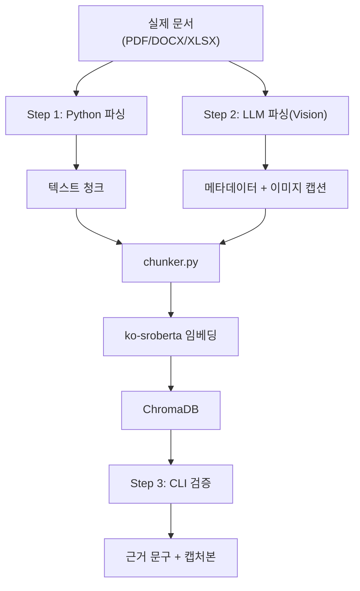

# CH06 VectorDB 구축

> 사내 문서 기반 AI 업무 비서 (RAG + MCP) — 6장 실습 코드

## 학습 목표

- Python 라이브러리(pypdf, python-docx, openpyxl)로 PDF/DOCX/XLSX 텍스트를 추출하고 한계를 체감한다.
- Vision LLM(LLaVA)으로 이미지/표가 포함된 PDF를 분석하여 텍스트와 메타데이터를 추출한다.
- Fixed-size 청킹(500자 + 오버랩 100자)으로 문서를 검색 단위로 분할한다.
- ko-sroberta-multitask 임베딩 모델로 텍스트를 벡터화하여 ChromaDB에 저장한다.
- CLI 검색 도구로 쿼리를 입력하여 관련 근거 문구와 캡처본 경로를 확인한다.

## 실행 환경

- Python 3.10 이상
- 저장 공간 2GB 이상 (임베딩 모델 약 400MB 포함)
- RAM 8GB 이상 권장
- Vision LLM 사용 시: Ollama + llava:13b 모델 (선택, RAM 16GB 이상)

## 전체 구조



## 설치 및 실행

이 챕터의 예제 코드 저장소를 클론합니다.

```bash
git clone https://github.com/{repo}/CH06_VectorDB_구축
cd CH06_VectorDB_구축
```

환경 변수를 설정합니다.

```bash
cp .env.example .env
# .env 파일을 열어 필요한 값을 수정합니다.
```

### macOS / Linux

```bash
python3 -m venv venv
source venv/bin/activate
pip install -r requirements.txt
```

### Windows (WSL2 권장)

```bash
python -m venv venv
venv\Scripts\activate
pip install -r requirements.txt
```

## 실행

### 전체 파이프라인 실행 (Step 1 + 2 + 3)

```bash
python src/main.py
```

### Step 선택 실행

```bash
# Step 1만: Python 파싱 테스트 (한계 체감)
python src/main.py --step 1

# Vision LLM 없이 Step 1 + 3 (빠른 색인)
python src/main.py --no-vision

# Vision LLM 사용 전체 파이프라인
python src/main.py --ollama-url http://localhost:11434 --vision-model llava:13b
```

### 형식별 개별 파싱 (Markdown 변환)

```bash
# PDF만 파싱 → data/markdown/에 .md 저장
python src/extract_pdf.py

# DOCX만 파싱 → data/markdown/에 .md 저장
python src/extract_docx.py

# XLSX만 파싱 → data/markdown/에 .md 저장
python src/extract_xlsx.py
```

### CLI 검색 도구

```bash
# 대화형 반복 검색 모드
python src/cli_search.py

# 단일 쿼리 검색
python src/cli_search.py --query "연차 사용 규정"
python src/cli_search.py --query "비밀번호 정책" --top-k 3
```

## 예상 출력 결과

<!-- [CAPTURE NEEDED: full terminal screen after successful execution of main.py --no-vision] -->

```
============================================================
커넥트HR VectorDB 구축 파이프라인 시작
============================================================
실행 Step: [1, 3]
문서 디렉토리: ./data/docs

============================================================
Step 1: Python 파싱 -- 형식별 텍스트 추출
============================================================
문서 디렉토리: ./data/docs

총 6개 문서를 발견했습니다.
  추출 중: FIN_2025_상반기_매출현황.xlsx ... 완료 (1243자)
  추출 중: FIN_부서별_예산기안서.xlsx ... 완료 (892자)
  추출 중: HR_정보보안서약서.pdf ... 완료 (2341자)
  추출 중: HR_취업규칙_v1.0.pdf ... 완료 (8912자)
  추출 중: OPS_신규서비스_런칭전략.pdf ... 완료 (3456자)
  추출 중: SEC_보안규정_v1.0.docx ... 완료 (1876자)

Step 1 완료: 6개 문서 추출 (2.3초)

[추출 결과 요약]
  FIN_2025_상반기_매출현황.xlsx: 2페이지, 1243자
  FIN_부서별_예산기안서.xlsx: 1페이지, 892자
  HR_정보보안서약서.pdf: 2페이지, 2341자
  HR_취업규칙_v1.0.pdf: 8페이지, 8912자
  OPS_신규서비스_런칭전략.pdf: 4페이지, 3456자
  SEC_보안규정_v1.0.docx: 1페이지, 1876자

============================================================
Step 3: 임베딩 + ChromaDB 저장
============================================================
청크 크기: 500자, 오버랩: 100자
임베딩 모델: jhgan/ko-sroberta-multitask
ChromaDB 저장 경로: ./data/chroma_db

청킹 중...
  청킹 완료: FIN_2025_상반기_매출현황.xlsx → 텍스트 청크 4개, 이미지 캡션 청크 0개
  청킹 완료: FIN_부서별_예산기안서.xlsx → 텍스트 청크 3개, 이미지 캡션 청크 0개
  청킹 완료: HR_정보보안서약서.pdf → 텍스트 청크 7개, 이미지 캡션 청크 0개
  청킹 완료: HR_취업규칙_v1.0.pdf → 텍스트 청크 28개, 이미지 캡션 청크 0개
  청킹 완료: OPS_신규서비스_런칭전략.pdf → 텍스트 청크 11개, 이미지 캡션 청크 0개
  청킹 완료: SEC_보안규정_v1.0.docx → 텍스트 청크 6개, 이미지 캡션 청크 0개

전체 청크 수: 59개
임베딩 모델 로드 중: jhgan/ko-sroberta-multitask
  최초 실행 시 약 400MB 다운로드가 발생합니다.
  임베딩 모델 로드 완료 (벡터 차원: 768)

ChromaDB 초기화: ./data/chroma_db
  새 컬렉션 생성: 'metacoding_documents'
  59개 청크 임베딩 계산 중... (배치 크기: 64)
  임베딩 계산 완료: 59개 벡터 생성

ChromaDB에 저장 중... (59개 청크)
ChromaDB 저장 완료! (컬렉션 총 문서 수: 59)

Step 3 완료 (18.4초)
  처리 청크 수: 59개
  컬렉션 총 문서 수: 59개
  ChromaDB 위치: /절대경로/data/chroma_db

============================================================
파이프라인 완료! (총 소요 시간: 20.7초)
============================================================

다음 단계: CLI 검색으로 색인 품질을 검증하십시오.
  python src/cli_search.py
  python src/cli_search.py --query '연차 사용 규정'
```

> **참고**: 위 출력은 실제 실행 결과를 그대로 복사한 것입니다. 터미널 출력과 문자 단위로 비교하여 디버깅하십시오.

## 파일 설명

| 파일 | 역할 |
|------|------|
| `src/main.py` | 전체 파이프라인 오케스트레이션 (Step 1~3) |
| `src/extractor.py` | PDF/DOCX/XLSX 텍스트 추출 (Python 파싱) |
| `src/vision_extractor.py` | Vision LLM(LLaVA)으로 PDF 이미지 분석 |
| `src/chunker.py` | Fixed-size 청킹 + 메타데이터 부착 |
| `src/store.py` | ko-sroberta 임베딩 + ChromaDB 저장/검색 |
| `src/cli_search.py` | CLI 검색 도구 (쿼리 → 근거 + 캡처본 경로) |
| `data/docs/` | 실습용 문서 (HR/Finance/Ops/Security) |
| `data/chroma_db/` | ChromaDB 저장소 (실행 후 자동 생성) |
| `data/markdown/` | PDF → Markdown 변환 결과 (Vision LLM 사용 시 생성) |

## Vision LLM 사전 준비 (선택)

Vision LLM 파이프라인을 사용하려면 Ollama와 llava:13b 모델이 필요합니다.

```bash
# Ollama 설치 (https://ollama.com)
# macOS
brew install ollama

# LLaVA 모델 다운로드 (약 8GB)
ollama pull llava:13b

# Ollama 서버 실행
ollama serve
```

Vision LLM이 없는 환경에서는 `--no-vision` 플래그로 Python 파싱만 사용합니다.

```bash
python src/main.py --no-vision
```
